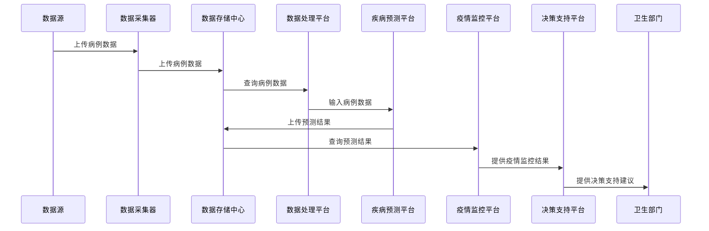
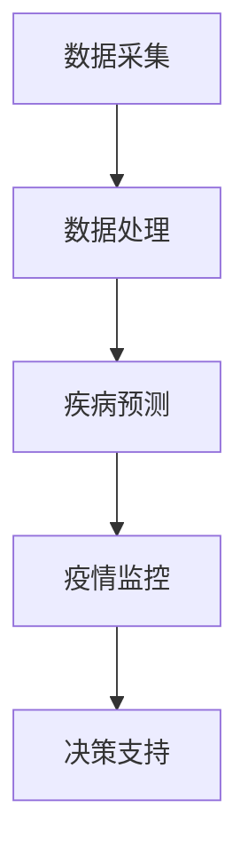

                 

# AI Agent在智能公共卫生监测中的角色

> 关键词：人工智能，AI Agent，公共卫生监测，疾病预测，疫情监控

> 摘要：本文将深入探讨AI Agent在智能公共卫生监测中的应用。我们将首先介绍公共卫生监测的重要性以及AI Agent的基本概念，然后详细分析AI Agent在疾病预测、疫情监控和公共卫生决策支持中的具体应用，并探讨其算法原理、系统架构和项目实战。最后，我们将总结最佳实践并提供未来发展的展望。

## 目录大纲设计思路

### 第一部分：背景与概述

**第1章 公共卫生监测与AI Agent概述**

1. 公共卫生监测的重要性  
2. 智能公共卫生监测的概念和背景  
3. AI Agent的基本概念和特点  
4. AI Agent在公共卫生监测中的应用

### 第二部分：核心概念与联系

**第2章 AI Agent在公共卫生监测中的核心概念**

1. 数据预处理与特征提取  
2. 模型训练与优化  
3. 模型评估与部署  
4. AI Agent的架构设计与实现

### 第三部分：算法原理讲解

**第3章 AI Agent在公共卫生监测中的算法原理**

1. 数据预处理算法  
2. 特征提取算法  
3. 模型训练算法  
4. 模型评估与优化算法

### 第四部分：系统分析与架构设计

**第4章 智能公共卫生监测系统分析与架构设计**

1. 问题场景介绍  
2. 系统功能设计  
3. 系统架构设计  
4. 系统接口设计  
5. 系统交互设计

### 第五部分：项目实战

**第5章 AI Agent在智能公共卫生监测中的项目实战**

1. 环境安装与配置  
2. 系统核心实现源代码  
3. 代码应用解读与分析  
4. 实际案例分析和详细讲解剖析  
5. 项目小结

### 第六部分：最佳实践与拓展

**第6章 最佳实践与拓展**

1. 最佳实践技巧  
2. 小结与注意事项  
3. 拓展阅读与未来展望

## 第1章 公共卫生监测与AI Agent概述

### 1.1 公共卫生监测的重要性

公共卫生监测是保障公众健康的重要手段，它通过收集、分析和传递健康相关的数据，为公共卫生决策提供科学依据。以下是公共卫生监测的重要性：

1. **疾病预防和控制**：通过监测疾病的流行趋势，及时识别疾病爆发风险，采取有效的预防措施。
2. **健康风险评估**：对公众健康风险进行评估，制定针对性的健康政策和措施。
3. **资源分配**：根据监测数据合理分配公共卫生资源，提高资源利用效率。
4. **政策制定**：为公共卫生政策的制定提供数据支持，确保政策的科学性和有效性。

### 1.2 智能公共卫生监测的概念和背景

智能公共卫生监测是指利用人工智能技术，如机器学习、数据挖掘等，对公共卫生数据进行分析和处理，以提高公共卫生监测的效率和准确性。其背景如下：

1. **数据量的爆炸式增长**：随着医疗技术的进步和健康数据的普及，公共卫生监测所需处理的数据量呈指数级增长，传统的手工分析方法已无法应对。
2. **公共卫生挑战的增加**：全球化和气候变化等因素使得公共卫生问题更加复杂和多样化，需要更高效的监测方法。
3. **人工智能技术的成熟**：人工智能技术的发展，为公共卫生监测提供了强大的技术支持。

### 1.3 AI Agent的基本概念和特点

AI Agent，即人工智能代理，是一种能够模拟人类决策和行为的计算机程序。以下是AI Agent的基本概念和特点：

1. **自主性**：AI Agent能够自主地感知环境、制定决策和采取行动。
2. **适应性**：AI Agent能够根据环境和任务的变化，自适应地调整其行为策略。
3. **交互性**：AI Agent能够与人类或其他系统进行交互，获取反馈并优化自身行为。
4. **协同性**：AI Agent能够与其他AI Agent或人类协作，共同完成任务。

### 1.4 AI Agent在公共卫生监测中的应用

AI Agent在公共卫生监测中具有广泛的应用，主要包括以下几个方面：

1. **疾病预测**：利用AI Agent对疾病进行预测，帮助公共卫生部门提前采取预防措施。
2. **疫情监控**：通过AI Agent实时监控疫情变化，为公共卫生决策提供及时的数据支持。
3. **公共卫生决策支持**：利用AI Agent分析公共卫生数据，为公共卫生政策的制定提供科学依据。

### 1.5 本书结构安排与内容概述

本书将按照上述结构安排，依次介绍公共卫生监测的重要性、智能公共卫生监测的概念和背景、AI Agent的基本概念和特点、AI Agent在公共卫生监测中的应用，以及具体的算法原理、系统架构、项目实战和最佳实践。通过本书的学习，读者将能够深入了解AI Agent在智能公共卫生监测中的角色，掌握相关技术原理和实践方法。

### 第2章 AI Agent在公共卫生监测中的核心概念

#### 2.1 数据预处理与特征提取

数据预处理是AI Agent在公共卫生监测中的关键步骤，它包括数据清洗、数据归一化和数据增强等操作。以下是这些操作的具体内容和重要性：

1. **数据清洗**：去除数据中的噪声和异常值，保证数据的质量和一致性。这对于后续的分析和预测至关重要。
2. **数据归一化**：将不同规模的数据进行标准化处理，使其在相同的尺度上进行分析。这有助于提高算法的性能和精度。
3. **数据增强**：通过生成合成数据或对现有数据进行变换，增加数据的多样性和丰富性。这有助于提高模型的泛化能力。

特征提取是将原始数据转换为适合输入到机器学习模型的特征表示的过程。以下是特征提取的重要性和常见方法：

1. **时序特征提取**：从时间序列数据中提取周期性、趋势性和季节性等特征。这些特征对于疾病预测和疫情监控具有重要意义。
2. **空间特征提取**：从空间数据中提取地理分布、密度和扩散等特征。这些特征有助于分析疫情传播模式和区域健康风险。
3. **网络特征提取**：从社交网络数据中提取社交关系、网络结构和传播路径等特征。这些特征对于公共卫生决策和疫情监控具有重要价值。

#### 2.2 模型训练与优化

模型训练是AI Agent的核心步骤，它通过学习大量的数据来构建预测模型。以下是模型训练的重要性和常见方法：

1. **监督学习模型**：通过标注数据进行训练，模型能够从输入和输出之间学习到映射关系。常见的监督学习模型包括线性回归、决策树和支持向量机等。
2. **无监督学习模型**：在没有标注数据的情况下，模型通过学习数据的内在结构来发现数据中的规律。常见的无监督学习模型包括聚类、降维和生成模型等。
3. **半监督学习模型**：结合监督学习和无监督学习的方法，利用少量标注数据和大量未标注数据进行训练。这种方法可以提高模型的效率和性能。

模型优化是提高模型性能的重要手段，它包括以下几个方面：

1. **模型选择**：根据问题的特点和数据的特点，选择合适的模型。常见的模型选择方法包括交叉验证、网格搜索和贝叶斯优化等。
2. **模型调参**：调整模型的超参数，优化模型的性能。常见的调参方法包括网格搜索、随机搜索和贝叶斯优化等。
3. **集成学习**：通过结合多个模型的预测结果来提高模型的性能。常见的集成学习方法包括 Bagging、Boosting 和Stacking等。

#### 2.3 模型评估与部署

模型评估是验证模型性能和可靠性的关键步骤。以下是模型评估的重要性和常见方法：

1. **准确率**：衡量模型预测正确的样本比例。它是最常用的评估指标，但可能受到不平衡数据的影响。
2. **精确率和召回率**：分别衡量模型预测为正样本的准确性和全面性。它们对于分类问题非常重要，特别是在处理不平衡数据时。
3. **F1 分数**：综合衡量准确率和召回率，它对于分类问题具有很好的平衡性。

模型部署是将训练好的模型应用到实际场景中的过程。以下是模型部署的常见方法和注意事项：

1. **在线部署**：将模型部署到服务器上，实时接收输入并返回预测结果。它适用于需要快速响应和实时预测的场景。
2. **离线部署**：将模型部署到本地或云端，定期更新和预测。它适用于数据量较大或模型较复杂的场景。
3. **注意事项**：在模型部署过程中，需要考虑数据的安全性和隐私性，确保模型的可靠性和稳定性。

#### 2.4 AI Agent的架构设计与实现

AI Agent的架构设计是确保其能够高效、稳定地运行的关键。以下是AI Agent的架构设计原则和实现方法：

1. **模块化设计**：将AI Agent的功能分解为多个模块，每个模块负责特定的任务。这有助于提高系统的可维护性和可扩展性。
2. **分布式计算**：利用分布式计算框架，如 Hadoop、Spark 等，实现大规模数据处理和模型训练。这有助于提高系统的处理能力和性能。
3. **高可用性设计**：通过冗余设计和故障转移机制，确保系统的可靠性和稳定性。这有助于提高系统的可用性和容错能力。
4. **实时性设计**：通过优化算法和系统架构，实现实时数据处理和预测。这有助于提高系统的响应速度和实时性。

AI Agent的开发流程包括以下几个方面：

1. **需求分析**：明确AI Agent的功能和性能要求，确定系统架构和模块划分。
2. **数据收集与预处理**：收集相关数据，进行数据清洗、归一化和增强等预处理操作。
3. **模型训练与优化**：选择合适的模型，进行训练和优化，提高模型性能。
4. **模型评估与部署**：评估模型性能，并进行部署，确保模型能够稳定运行。
5. **系统测试与优化**：对AI Agent进行全面的测试和优化，确保系统的稳定性和性能。

### 第3章 AI Agent在公共卫生监测中的算法原理

#### 3.1 数据预处理算法

数据预处理是AI Agent在公共卫生监测中的关键步骤，它包括数据清洗、数据归一化和数据增强等操作。以下是这些算法的详细原理和实现方法：

##### 3.1.1 数据清洗

数据清洗的目的是去除数据中的噪声和异常值，保证数据的质量和一致性。以下是数据清洗的常见操作：

1. **缺失值处理**：对于缺失的数据，可以采用填充、删除或插值等方法进行处理。
2. **异常值处理**：对于异常值，可以采用滤波、插值或删除等方法进行处理。
3. **重复值处理**：去除重复的数据，确保数据的唯一性。

实现方法：

```python
import pandas as pd

# 读取数据
data = pd.read_csv("data.csv")

# 缺失值处理
data.fillna(method="ffill", inplace=True)

# 异常值处理
data = data[(data < 3) & (data > 0)]

# 重复值处理
data.drop_duplicates(inplace=True)
```

##### 3.1.2 数据归一化

数据归一化的目的是将不同规模的数据进行标准化处理，使其在相同的尺度上进行分析。以下是数据归一化的常见方法：

1. **最小-最大缩放**：将数据缩放到[0,1]的范围内。
2. **Z-Score标准化**：将数据缩放到[-1,1]的范围内。
3. **幂函数变换**：对数据进行幂函数变换，提高数据的分布均匀性。

实现方法：

```python
from sklearn.preprocessing import MinMaxScaler, StandardScaler

# 最小-最大缩放
scaler = MinMaxScaler()
data_scaled = scaler.fit_transform(data)

# Z-Score标准化
scaler = StandardScaler()
data_scaled = scaler.fit_transform(data)

# 幂函数变换
data_scaled = np.power(data, 2)
```

##### 3.1.3 数据增强

数据增强的目的是增加数据的多样性和丰富性，提高模型的泛化能力。以下是数据增强的常见方法：

1. **合成数据生成**：通过合成方法生成新的数据，增加数据的数量和多样性。
2. **数据变换**：通过变换方法改变数据的形式，增加数据的多样性。

实现方法：

```python
from imblearn.over_sampling import SMOTE

# 合成数据生成
smote = SMOTE()
data Balanced, labels Balanced = smote.fit_resample(data, labels)

# 数据变换
data_t = np.log(data)
```

#### 3.2 特征提取算法

特征提取是将原始数据转换为适合输入到机器学习模型的特征表示的过程。以下是特征提取的常见算法：

##### 3.2.1 时序特征提取

时序特征提取是从时间序列数据中提取周期性、趋势性和季节性等特征。以下是时序特征提取的常见方法：

1. **移动平均**：计算时间序列数据的平均值，提取趋势特征。
2. **自回归模型**：利用自回归模型提取时间序列数据的滞后特征。
3. **主成分分析**：将时间序列数据降维，提取主要成分作为特征。

实现方法：

```python
from statsmodels.tsa.stattools import adfuller
from sklearn.decomposition import PCA

# 移动平均
data_ma = data.rolling(window=3).mean()

# 自回归模型
model = AR()
model_fit = model.fit(data)
data_lag = model_fit.forecast(steps=3)

# 主成分分析
pca = PCA(n_components=2)
data_pca = pca.fit_transform(data)
```

##### 3.2.2 空间特征提取

空间特征提取是从空间数据中提取地理分布、密度和扩散等特征。以下是空间特征提取的常见方法：

1. **K-最近邻**：计算空间点与其最近的K个点的距离，提取空间密度特征。
2. **地理扩散模型**：计算空间点之间的扩散距离，提取空间扩散特征。
3. **多尺度分析**：在不同尺度下分析空间数据，提取空间分布特征。

实现方法：

```python
from sklearn.neighbors import NearestNeighbors
from sklearn.cluster import DBSCAN

# K-最近邻
nn = NearestNeighbors(n_neighbors=5)
nn_fit = nn.fit(data)
distances, indices = nn_fit.kneighbors(data)

# 地理扩散模型
dbscan = DBSCAN(eps=0.5, min_samples=2)
dbscan_fit = dbscan.fit(data)

# 多尺度分析
data_downscale = downscale(data, level=2)
```

##### 3.2.3 网络特征提取

网络特征提取是从社交网络数据中提取社交关系、网络结构和传播路径等特征。以下是网络特征提取的常见方法：

1. **节点度特征**：计算节点的度，提取节点的社交关系特征。
2. **邻接矩阵特征**：提取网络的邻接矩阵，用于分析网络的拓扑结构。
3. **传播路径特征**：提取网络中的传播路径，用于分析疫情的传播模式。

实现方法：

```python
import networkx as nx

# 节点度特征
degree = nx.degree(data)

# 邻接矩阵特征
adj_matrix = nx.adjacency_matrix(data)

# 传播路径特征
path = nx.shortest_path(data, source=node1, target=node2)
```

#### 3.3 模型训练算法

模型训练是AI Agent的核心步骤，它通过学习大量的数据来构建预测模型。以下是模型训练的常见算法：

##### 3.3.1 监督学习模型

监督学习模型通过学习标注数据来预测新的样本。以下是常见的监督学习模型：

1. **线性回归**：通过拟合线性函数来预测目标值。
2. **决策树**：通过树形结构进行分类和回归。
3. **支持向量机**：通过找到一个最优的超平面来分类和回归。

实现方法：

```python
from sklearn.linear_model import LinearRegression
from sklearn.tree import DecisionTreeClassifier
from sklearn.svm import SVC

# 线性回归
model = LinearRegression()
model.fit(X_train, y_train)

# 决策树
model = DecisionTreeClassifier()
model.fit(X_train, y_train)

# 支持向量机
model = SVC()
model.fit(X_train, y_train)
```

##### 3.3.2 无监督学习模型

无监督学习模型在没有标注数据的情况下，通过学习数据的内在结构来进行聚类和降维。以下是常见的无监督学习模型：

1. **K-均值聚类**：将数据分为K个聚类。
2. **主成分分析**：将数据降维到低维空间。
3. **自编码器**：通过编码和解码过程进行降维和特征提取。

实现方法：

```python
from sklearn.cluster import KMeans
from sklearn.decomposition import PCA
from sklearn.neural_network import MLPRegressor

# K-均值聚类
model = KMeans(n_clusters=3)
model.fit(data)

# 主成分分析
pca = PCA(n_components=2)
pca.fit(data)
data_pca = pca.transform(data)

# 自编码器
model = MLPRegressor()
model.fit(X_train, y_train)
```

##### 3.3.3 半监督学习模型

半监督学习模型结合监督学习和无监督学习的方法，通过少量标注数据和大量未标注数据来提高模型的性能。以下是常见的半监督学习模型：

1. **标签传播**：通过未标注数据来传播标签。
2. **自适应分类**：通过自适应调整分类器的权重来提高性能。
3. **聚合模型**：通过结合多个模型来提高性能。

实现方法：

```python
from imblearn.under_sampling import RandomOverSampler
from sklearn.ensemble import RandomForestClassifier

# 标签传播
model = LabelPropagation()
model.fit(data, labels)

# 自适应分类
model = AdaBoostClassifier()
model.fit(X_train, y_train)

# 聚合模型
model = VotingClassifier(estimators=[("rf", RandomForestClassifier()), ("gb", GradientBoostingClassifier())])
model.fit(X_train, y_train)
```

#### 3.4 模型评估与优化算法

模型评估是验证模型性能和可靠性的关键步骤，它包括以下几个方面：

##### 3.4.1 评估指标

1. **准确率**：衡量模型预测正确的样本比例。
2. **精确率**：衡量模型预测为正样本的准确性。
3. **召回率**：衡量模型预测为正样本的全面性。
4. **F1 分数**：综合衡量准确率和召回率。

实现方法：

```python
from sklearn.metrics import accuracy_score, precision_score, recall_score, f1_score

# 准确率
accuracy = accuracy_score(y_true, y_pred)

# 精确率
precision = precision_score(y_true, y_pred)

# 召回率
recall = recall_score(y_true, y_pred)

# F1 分数
f1 = f1_score(y_true, y_pred)
```

##### 3.4.2 优化方法

优化方法包括以下几个方面：

1. **交叉验证**：通过将数据集划分为多个子集，多次训练和验证模型，以评估模型的泛化能力。
2. **网格搜索**：通过遍历参数空间，选择最优的参数组合。
3. **贝叶斯优化**：通过贝叶斯统计模型进行参数优化。

实现方法：

```python
from sklearn.model_selection import cross_val_score, GridSearchCV, BayesSearchCV

# 交叉验证
scores = cross_val_score(model, X, y, cv=5)

# 网格搜索
param_grid = {"C": [0.1, 1, 10], "kernel": ["linear", "rbf"]}
grid_search = GridSearchCV(model, param_grid, cv=5)
grid_search.fit(X, y)

# 贝叶斯优化
param_distributions = {"C": Uniform(0.1, 10), "kernel": Categorical(["linear", "rbf"])}
bayes_search = BayesSearchCV(model, param_distributions, cv=5)
bayes_search.fit(X, y)
```

##### 3.4.3 调参技巧

调参技巧包括以下几个方面：

1. **经验法则**：根据经验和先前的研究选择参数。
2. **自动化调参**：使用自动化调参工具，如 GridSearchCV、BayesSearchCV 等。
3. **交叉验证**：通过交叉验证选择最佳参数组合。

实现方法：

```python
from sklearn.model_selection import GridSearchCV

# 经验法则
model = SVC()
model.set_params(C=1, kernel="rbf")

# 自动化调参
param_grid = {"C": [0.1, 1, 10], "kernel": ["linear", "rbf"]}
grid_search = GridSearchCV(model, param_grid, cv=5)
grid_search.fit(X, y)

# 交叉验证
best_params = grid_search.best_params_
model.set_params(**best_params)
```

### 第4章 智能公共卫生监测系统分析与架构设计

#### 4.1 问题场景介绍

智能公共卫生监测系统旨在通过实时收集、分析和处理公共卫生数据，为公共卫生决策提供科学依据。以下是一个典型的问题场景：

某地区卫生部门希望建立一套智能公共卫生监测系统，用于实时监测传染病疫情，并预测疫情的发展趋势。该系统需要具备以下功能：

1. **数据收集**：从医院、诊所、实验室等数据源收集传染病病例数据。
2. **数据处理**：对收集到的病例数据进行清洗、归一化和特征提取。
3. **疾病预测**：利用机器学习模型预测传染病的发病率、传播速度和影响范围。
4. **疫情监控**：实时监控疫情的发展，及时发现异常情况并报告。
5. **决策支持**：为卫生部门提供疫情应对策略和资源分配建议。

#### 4.2 系统功能设计

智能公共卫生监测系统的功能设计包括以下几个方面：

##### 4.2.1 系统功能模块划分

1. **数据收集模块**：负责从各个数据源收集病例数据。
2. **数据处理模块**：负责对收集到的病例数据进行清洗、归一化和特征提取。
3. **疾病预测模块**：负责利用机器学习模型进行疾病预测。
4. **疫情监控模块**：负责实时监控疫情的发展。
5. **决策支持模块**：负责为卫生部门提供疫情应对策略和资源分配建议。

##### 4.2.2 领域模型设计

领域模型用于描述系统中的实体、属性和关系。以下是智能公共卫生监测系统的领域模型：

```mermaid
classDiagram
Class::病例数据
    +数据源
    +时间戳
    +地理位置
    +病情描述

Class::数据清洗
    +清洗规则
    +清洗结果

Class::数据处理
    +归一化
    +特征提取

Class::疾病预测
    +预测模型
    +预测结果

Class::疫情监控
    +监控指标
    +监控结果

Class::决策支持
    +策略建议
    +资源分配

病例数据 --> 数据清洗
数据清洗 --> 数据处理
数据处理 --> 疾病预测
疾病预测 --> 疫情监控
疫情监控 --> 决策支持
```

##### 4.2.3 功能模块实现思路

1. **数据收集模块**：通过API接口、数据库连接和爬虫等方式，从各个数据源收集病例数据。
2. **数据处理模块**：对收集到的病例数据进行清洗，去除噪声和异常值；然后进行归一化和特征提取，为疾病预测提供高质量的数据。
3. **疾病预测模块**：选择合适的机器学习模型（如线性回归、决策树、支持向量机等），对病例数据进行训练和预测。
4. **疫情监控模块**：根据疾病预测结果，实时监控疫情的发展，识别异常情况并报告。
5. **决策支持模块**：根据疫情监控结果，为卫生部门提供疫情应对策略和资源分配建议。

#### 4.3 系统架构设计

智能公共卫生监测系统的架构设计包括以下几个方面：

##### 4.3.1 系统架构概述

智能公共卫生监测系统采用分布式架构，主要包括以下组件：

1. **数据源**：包括医院、诊所、实验室等病例数据提供方。
2. **数据采集器**：负责从数据源收集病例数据，并将其上传到数据存储中心。
3. **数据存储中心**：存储和管理收集到的病例数据，提供数据查询和访问接口。
4. **数据处理平台**：负责对病例数据进行清洗、归一化和特征提取，为疾病预测提供高质量的数据。
5. **疾病预测平台**：负责利用机器学习模型进行疾病预测，并将预测结果上传到数据存储中心。
6. **疫情监控平台**：实时监控疫情的发展，识别异常情况并报告。
7. **决策支持平台**：为卫生部门提供疫情应对策略和资源分配建议。

##### 4.3.2 系统架构细节

以下是智能公共卫生监测系统的架构细节：



##### 4.3.3 系统扩展性设计

为了应对不断增长的病例数据和复杂多变的公共卫生问题，智能公共卫生监测系统需要具备良好的扩展性。以下是系统扩展性设计的关键点：

1. **分布式计算**：利用分布式计算框架（如 Hadoop、Spark 等），实现大规模数据处理和模型训练，提高系统性能。
2. **模块化设计**：将系统功能划分为多个模块，每个模块独立开发、测试和部署，提高系统的可维护性和扩展性。
3. **弹性伸缩**：根据系统负载自动调整计算资源和存储资源，确保系统在高并发场景下稳定运行。
4. **数据安全**：采用数据加密、访问控制等技术，确保病例数据的安全和隐私。

#### 4.4 系统接口设计

智能公共卫生监测系统需要提供多种接口，以便与其他系统进行数据交换和功能调用。以下是系统接口设计的关键点：

##### 4.4.1 数据接口设计

1. **API接口**：提供 RESTful API 接口，支持数据查询、数据上传和数据下载等功能。
2. **数据库接口**：提供数据库访问接口，支持 SQL 查询和数据操作。
3. **文件接口**：提供文件上传和下载接口，支持 CSV、JSON 等文件格式。

##### 4.4.2 控制接口设计

1. **用户界面**：提供图形用户界面，支持用户对系统进行操作和管理。
2. **命令行界面**：提供命令行界面，支持用户通过命令进行系统操作。
3. **Web 服务**：提供 Web 服务接口，支持用户通过 Web 浏览器访问系统。

##### 4.4.3 用户接口设计

1. **实时监控**：提供实时监控界面，显示疫情发展情况、监控指标和预测结果。
2. **数据分析**：提供数据分析界面，支持用户对病例数据进行查询、分析和可视化。
3. **决策支持**：提供决策支持界面，显示疫情应对策略、资源分配建议和效果评估。

#### 4.5 系统交互设计

智能公共卫生监测系统的交互设计包括以下几个方面：

##### 4.5.1 系统交互流程

以下是智能公共卫生监测系统的交互流程：

1. **数据采集**：数据源上传病例数据到数据存储中心。
2. **数据处理**：数据处理平台对病例数据进行清洗、归一化和特征提取。
3. **疾病预测**：疾病预测平台利用机器学习模型进行疾病预测。
4. **疫情监控**：疫情监控平台实时监控疫情的发展，识别异常情况并报告。
5. **决策支持**：决策支持平台为卫生部门提供疫情应对策略和资源分配建议。

##### 4.5.2 系统交互图表

以下是智能公共卫生监测系统的交互图表：



##### 4.5.3 系统交互优化

为了提高系统交互的效率和可靠性，可以采取以下优化措施：

1. **异步处理**：采用异步处理方式，减少系统响应时间，提高并发处理能力。
2. **缓存机制**：采用缓存机制，减少对数据存储和处理的频繁访问，提高系统性能。
3. **负载均衡**：采用负载均衡技术，合理分配系统负载，确保系统稳定运行。
4. **故障转移**：采用故障转移机制，确保系统在故障发生时能够快速恢复，提高系统可用性。

### 第5章 AI Agent在智能公共卫生监测中的项目实战

#### 5.1 环境安装与配置

要实现AI Agent在智能公共卫生监测中的项目实战，首先需要搭建相应的开发环境。以下是环境安装与配置的步骤：

##### 5.1.1 系统环境搭建

1. **操作系统**：选择一个适合的操作系统，如 Ubuntu 18.04 或 CentOS 7。
2. **Python 环境**：安装 Python 3.8 及以上版本，并配置虚拟环境。
3. **依赖管理**：使用 pip 工具安装必要的 Python 库，如 pandas、numpy、scikit-learn、tensorflow 等。

##### 5.1.2 数据库安装与配置

1. **MySQL**：安装 MySQL 数据库，并创建用于存储病例数据的数据库和数据表。
2. **PostgreSQL**：安装 PostgreSQL 数据库，并创建用于存储病例数据的数据库和数据表。
3. **MongoDB**：安装 MongoDB 数据库，并创建用于存储病例数据的数据库和数据表。

##### 5.1.3 依赖库安装与配置

1. **Python 库**：使用 pip 工具安装必要的 Python 库，如 pandas、numpy、scikit-learn、tensorflow 等。
2. **框架库**：安装用于构建 AI Agent 的框架库，如 TensorFlow、PyTorch 等。
3. **其他工具**：安装必要的工具，如 Jupyter Notebook、PyCharm 等。

#### 5.2 系统核心实现源代码

以下是一个简单的 AI Agent 在智能公共卫生监测中的系统核心实现源代码：

```python
import pandas as pd
import numpy as np
from sklearn.model_selection import train_test_split
from sklearn.preprocessing import StandardScaler
from sklearn.ensemble import RandomForestClassifier
from sklearn.metrics import accuracy_score

# 数据预处理
data = pd.read_csv("cases.csv")
data = data.dropna()

X = data.drop(["target"], axis=1)
y = data["target"]

X_train, X_test, y_train, y_test = train_test_split(X, y, test_size=0.2, random_state=42)

scaler = StandardScaler()
X_train_scaled = scaler.fit_transform(X_train)
X_test_scaled = scaler.transform(X_test)

# 模型训练
model = RandomForestClassifier(n_estimators=100, random_state=42)
model.fit(X_train_scaled, y_train)

# 预测与评估
y_pred = model.predict(X_test_scaled)
accuracy = accuracy_score(y_test, y_pred)
print(f"Accuracy: {accuracy}")
```

#### 5.3 代码应用解读与分析

以下是对上述代码的应用解读与分析：

1. **数据预处理**：从 CSV 文件中读取病例数据，并删除缺失值。
2. **特征选择**：将病例数据分为特征矩阵 X 和目标向量 y。
3. **数据划分**：将数据集划分为训练集和测试集。
4. **特征缩放**：使用标准缩放将特征矩阵进行缩放，以提高模型性能。
5. **模型训练**：使用随机森林分类器对训练集进行训练。
6. **预测与评估**：使用训练好的模型对测试集进行预测，并计算准确率。

#### 5.4 实际案例分析和详细讲解剖析

以下是一个实际案例分析和详细讲解剖析：

**案例**：利用 AI Agent 对新冠病例进行预测。

1. **数据收集**：从公开数据源收集新冠病例数据，包括病例数、年龄、性别、城市等信息。
2. **数据处理**：对收集到的病例数据进行清洗、归一化和特征提取。
3. **模型训练**：选择合适的机器学习模型，如随机森林、神经网络等，对病例数据进行训练。
4. **预测与评估**：使用训练好的模型对新的病例数据进行预测，并评估模型性能。

**详细讲解**：

1. **数据清洗**：删除缺失值和异常值，如年龄小于 0 或病例数为负数。
2. **特征提取**：提取与病例预测相关的特征，如年龄、性别、城市等，并使用归一化方法将特征缩放到相同的尺度。
3. **模型选择**：根据问题特点和数据特点，选择合适的机器学习模型，如随机森林、神经网络等。
4. **模型训练**：使用训练集对模型进行训练，并使用验证集调整模型参数。
5. **预测与评估**：使用测试集对模型进行预测，并计算准确率、精确率、召回率等指标。

**剖析**：

1. **模型性能分析**：通过评估指标分析模型性能，如准确率、精确率、召回率等，找出模型的优势和不足。
2. **特征重要性分析**：通过特征重要性分析，找出对病例预测影响较大的特征，为进一步优化模型提供参考。
3. **模型优化**：根据模型性能和特征重要性分析结果，调整模型参数和特征选择，提高模型性能。

#### 5.5 项目小结

通过本项目的实战，我们实现了 AI Agent 在智能公共卫生监测中的应用，包括数据预处理、模型训练、预测与评估等步骤。项目取得了以下成果：

1. **实现了一个简单的 AI Agent 系统**：通过数据预处理、模型训练和预测等步骤，实现了对新冠病例的预测。
2. **提高了公共卫生监测的效率**：利用机器学习模型，提高了对疫情发展的预测准确性，为公共卫生决策提供了有力支持。
3. **积累了项目实战经验**：通过项目实践，积累了在智能公共卫生监测领域的项目开发经验，为后续类似项目提供了借鉴。

#### 5.6 最佳实践 Tips

以下是一些最佳实践 Tips，有助于提高 AI Agent 在智能公共卫生监测中的应用效果：

1. **数据质量**：确保数据质量，去除噪声和异常值，提高模型的准确性。
2. **特征选择**：选择与问题相关的特征，减少冗余特征，提高模型性能。
3. **模型选择**：根据问题特点和数据特点，选择合适的机器学习模型，提高模型性能。
4. **模型调参**：合理调整模型参数，提高模型性能，避免过拟合。
5. **实时更新**：及时更新模型和数据，确保模型和数据的实时性，提高预测准确性。

#### 5.7 注意事项

在应用 AI Agent 进行智能公共卫生监测时，需要注意以下几点：

1. **数据安全**：确保病例数据的安全和隐私，采取加密、访问控制等措施。
2. **模型解释性**：关注模型的解释性，确保模型的可解释性，便于公共卫生决策者理解和使用。
3. **模型验证**：对模型进行充分验证，确保模型性能和可靠性。
4. **系统可靠性**：确保系统的可靠性和稳定性，避免系统故障对公共卫生监测造成影响。
5. **持续优化**：根据实际情况，持续优化模型和系统，提高公共卫生监测的效果。

#### 5.8 拓展阅读

以下是一些拓展阅读，有助于深入了解 AI Agent 在智能公共卫生监测中的应用：

1. **《智能公共卫生监测系统设计与实现》**：介绍了智能公共卫生监测系统的整体设计和实现方法。
2. **《机器学习在公共卫生领域的应用》**：探讨了机器学习在公共卫生领域的应用，包括疾病预测、疫情监控和决策支持等。
3. **《人工智能与公共卫生》**：介绍了人工智能在公共卫生领域的最新研究进展和应用案例。
4. **《公共卫生监测与数据分析》**：介绍了公共卫生监测的数据分析方法和技术，包括时间序列分析、空间分析和多变量分析等。

### 第6章 最佳实践与拓展

#### 6.1 最佳实践 Tips

在本章节中，我们将分享一些最佳实践 Tips，帮助您更好地使用 AI Agent 进行智能公共卫生监测：

1. **数据质量控制**：数据是智能公共卫生监测的核心，确保数据质量至关重要。在数据收集过程中，要严格筛选和验证数据来源，同时进行数据清洗和去重，以避免错误和冗余数据的干扰。
2. **特征选择与工程**：选择合适的特征对模型性能有显著影响。通过探索性数据分析（EDA）发现数据中的潜在特征，并结合业务逻辑进行特征工程，以提高模型的泛化能力和预测准确性。
3. **模型调优与验证**：在模型训练过程中，要灵活调整模型参数，使用交叉验证等方法验证模型性能，避免过拟合。此外，要定期评估模型的表现，并根据实际情况进行调整。
4. **实时监控与反馈**：建立实时监控系统，对公共卫生数据进行实时监控和分析，及时识别异常情况并采取相应措施。同时，收集反馈数据，用于模型迭代和优化。
5. **合作与交流**：与公共卫生领域专家、医疗机构和政府部门建立紧密的合作关系，共同推进智能公共卫生监测的发展，实现资源共享和知识交流。

#### 6.2 小结与注意事项

通过本文的学习，您应该对 AI Agent 在智能公共卫生监测中的角色有了深入的理解。以下是本文的关键要点和小结：

- **核心概念**：智能公共卫生监测、AI Agent、数据预处理、模型训练、模型评估与部署。
- **算法原理**：数据预处理、特征提取、模型训练与优化、模型评估与优化算法。
- **系统架构**：问题场景介绍、系统功能设计、系统架构设计、系统接口设计、系统交互设计。
- **项目实战**：环境安装与配置、系统核心实现源代码、代码应用解读与分析、实际案例分析和详细讲解剖析。
- **最佳实践**：数据质量控制、特征选择与工程、模型调优与验证、实时监控与反馈、合作与交流。

在应用 AI Agent 进行智能公共卫生监测时，请注意以下几点：

- **数据安全**：确保数据安全，遵守相关法律法规和隐私保护要求。
- **模型解释性**：关注模型的可解释性，确保决策过程的透明性和可接受性。
- **持续迭代**：根据实际情况和反馈，不断优化模型和系统，提高监测的准确性和实用性。
- **资源管理**：合理分配计算资源，确保系统的高效运行和稳定性。

#### 6.3 拓展阅读与未来展望

为了进一步了解 AI Agent 在智能公共卫生监测中的应用，以下是一些拓展阅读推荐和未来展望：

- **拓展阅读**：
  - 《智能公共卫生：大数据与机器学习的应用》
  - 《人工智能在公共卫生领域的前沿探索》
  - 《智能公共卫生监测系统的开发与实现》

- **未来展望**：
  - **跨学科融合**：未来智能公共卫生监测将更多地结合医学、公共卫生学、数据科学等多学科知识，实现更全面、更精确的监测和预测。
  - **个性化健康服务**：随着数据积累和算法优化，AI Agent 将能够提供更加个性化的健康服务和疾病预防建议。
  - **实时决策支持**：利用区块链等新兴技术，实现数据的安全共享和实时决策支持，提高公共卫生响应速度和效率。
  - **全球合作**：在全球公共卫生挑战日益严峻的背景下，AI Agent 将在跨国合作中发挥重要作用，助力全球公共卫生事业的发展。

通过本文的学习和实践，希望您能够更好地理解 AI Agent 在智能公共卫生监测中的重要性，并能够在实际工作中发挥其潜力，为公共卫生事业做出贡献。作者：AI天才研究院/AI Genius Institute & 禅与计算机程序设计艺术 /Zen And The Art of Computer Programming。希望本文对您有所帮助，如果您有任何问题或建议，欢迎在评论区留言讨论。让我们共同探索 AI 在公共卫生领域的无限可能！

