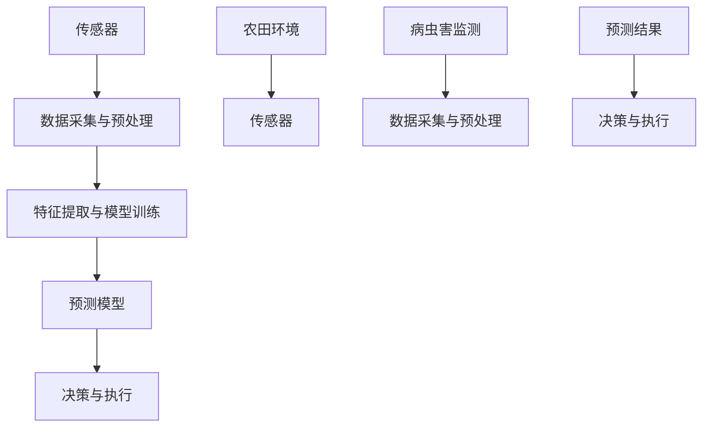
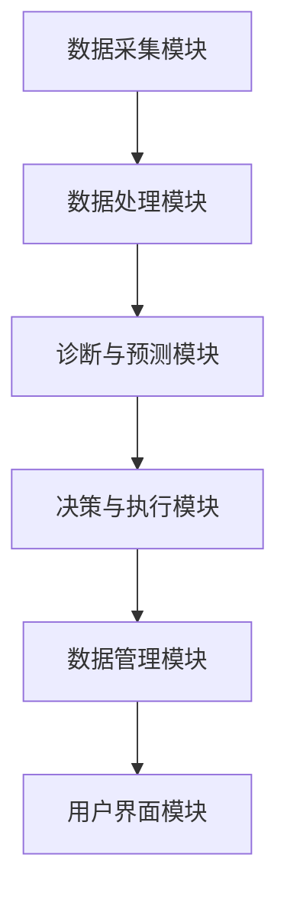
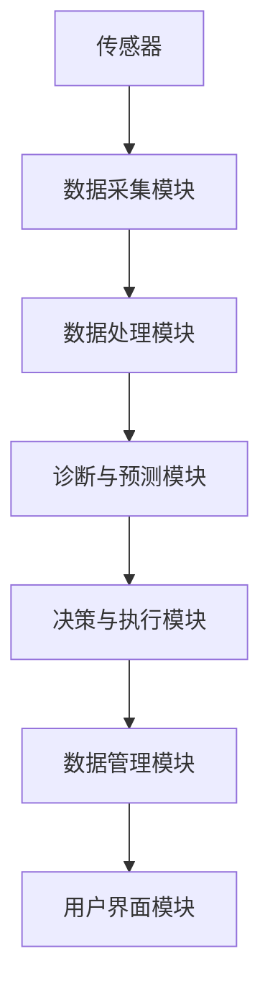
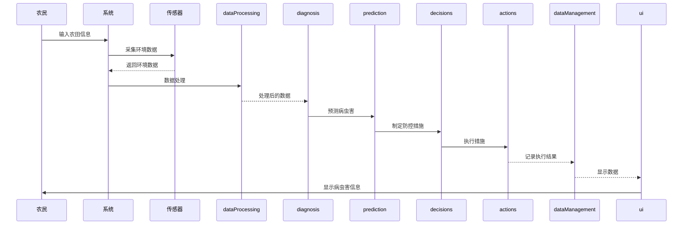

                 

### 第一部分：问题背景与核心概念

## 第1章：问题背景与核心概念

### 1.1 问题背景

智能农业作为现代农业发展的重要方向，正引领着农业生产的现代化变革。农业病虫害是农业生产中的一大难题，不仅影响农作物的产量和质量，还可能导致严重的经济损失。随着全球气候变化和人口增长，农业病虫害问题日益突出，传统病虫害防控方法已难以满足现代农业的需求。在这种情况下，智能农业病虫害防控系统的研发和应用显得尤为迫切。

### 1.1.1 智能农业的发展现状

智能农业通过引入物联网、大数据、人工智能等先进技术，实现了农业生产的自动化、精准化和智能化。目前，智能农业在监测环境变化、优化作物生长、提高资源利用效率等方面取得了显著成果。智能农业病虫害防控作为智能农业的一个重要分支，也逐渐受到关注。

#### 智能农业病虫害防控的重要性

智能农业病虫害防控系统能够实时监测农田环境，快速识别病虫害，精确预测病虫害发生趋势，并采取有效措施进行防控。这不仅有助于减少农药的使用，降低环境污染，还能提高农作物的产量和品质，为农业的可持续发展提供技术支持。

### 1.1.2 农业病虫害问题及其影响

农业病虫害种类繁多，包括病虫害、病菌、害虫等。它们能够在短时间内大规模爆发，对农作物造成毁灭性打击。具体影响包括：

1. **减产：** 病虫害会直接破坏农作物，导致产量减少。
2. **品质下降：** 病虫害侵袭会使农作物品质下降，影响市场竞争力。
3. **经济损失：** 病虫害防治需要大量投入，经济损失显著。

### 1.1.3 传统病虫害防控方法的局限性

传统病虫害防控方法主要包括化学防治、生物防治和物理防治等。这些方法存在以下局限性：

1. **高成本：** 长期依赖化学农药，导致防治成本较高。
2. **环境污染：** 大量使用农药和化肥，容易造成环境污染。
3. **防治效果有限：** 传统方法难以实现对病虫害的精准监测和防控，效果有限。

### 1.2 AI Agent的定义与特点

AI Agent（人工智能代理）是一种能够自主学习、自主决策并执行任务的智能系统。它具有以下特点：

1. **自主性：** AI Agent能够根据环境和任务需求自主行动。
2. **适应性：** AI Agent能够通过学习适应新环境和任务。
3. **协作性：** AI Agent可以与其他Agent协作完成任务。

### 1.2.1 AI Agent的概念

AI Agent是由人工智能技术构建的智能实体，它能够感知环境、理解任务、做出决策并执行动作。AI Agent通常包括感知模块、决策模块和行动模块。

#### AI Agent在农业中的应用

AI Agent在农业中可以用于：

1. **环境监测：** 实时监测农田环境参数，如温度、湿度、光照等。
2. **病虫害监测：** 利用图像识别、声音识别等技术，实时监测病虫害。
3. **决策支持：** 基于数据和算法，为农业生产提供科学决策。

### 1.2.2 AI Agent在农业中的应用潜力

AI Agent在农业中的应用潜力主要体现在：

1. **提高生产效率：** AI Agent能够自动执行病虫害监测和防控任务，提高生产效率。
2. **降低成本：** 减少农药和化肥的使用，降低生产成本。
3. **保障食品安全：** AI Agent能够实时监测农产品质量，保障食品安全。

### 1.2.3 AI Agent与机器学习的结合

AI Agent通常结合机器学习算法进行任务学习与执行。机器学习算法包括：

1. **监督学习：** 需要标记的数据进行训练，用于预测和分类。
2. **无监督学习：** 无需标记的数据进行训练，用于聚类和降维。
3. **强化学习：** 通过与环境交互学习，优化决策策略。

#### AI Agent在农业病虫害防控中的应用场景

AI Agent在农业病虫害防控中的应用场景包括：

1. **病虫害监测与预警：** 利用图像识别技术，实时监测农田中的病虫害，及时发出预警。
2. **精准防控：** 基于预测模型，制定科学的防控措施，减少病虫害对农作物的危害。
3. **智能管理：** 基于数据分析，优化农业生产管理，提高农业产出。

### 1.3 农业病虫害防控的核心算法

农业病虫害防控系统通常包括监测、诊断、预测和决策等核心算法。这些算法是系统高效运行的基础。

#### 监测算法

监测算法用于实时监测农田环境参数和病虫害情况。常见的监测算法包括：

1. **传感器数据处理算法：** 对农田环境参数进行采集和处理，如温度、湿度、光照等。
2. **图像处理算法：** 对农田图像进行处理，用于病虫害的识别和监测。

#### 诊断算法

诊断算法用于识别和诊断病虫害。常见的诊断算法包括：

1. **基于规则的诊断算法：** 利用专家知识进行病虫害诊断。
2. **基于数据的诊断算法：** 利用机器学习算法，如神经网络、支持向量机等，进行病虫害诊断。

#### 预测算法

预测算法用于预测病虫害的发生趋势和严重程度。常见的预测算法包括：

1. **时间序列预测算法：** 如ARIMA、LSTM等，用于预测病虫害的发生趋势。
2. **回归预测算法：** 如线性回归、决策树等，用于预测病虫害的严重程度。

#### 决策算法

决策算法用于制定病虫害防控措施。常见的决策算法包括：

1. **基于规则的决策算法：** 根据专家知识制定防控措施。
2. **基于数据的决策算法：** 利用预测结果和作物生长模型，制定科学、有效的防控措施。

### 1.4 AI Agent系统架构

AI Agent系统架构包括数据采集与预处理、特征提取与模型训练、决策与执行等模块。

#### 数据采集与预处理

数据采集与预处理模块用于收集农田环境数据和病虫害数据，并进行预处理，如数据清洗、归一化等。

#### 特征提取与模型训练

特征提取与模型训练模块用于提取关键特征，并利用机器学习算法训练模型。

#### 决策与执行

决策与执行模块用于根据预测结果和决策算法，制定并执行病虫害防控措施。

### 1.5 本章小结

本章介绍了智能农业病虫害防控的背景、核心概念和关键技术。AI Agent作为一种智能实体，在农业病虫害防控中具有巨大潜力。本章为后续章节的详细讨论奠定了基础。在接下来的章节中，我们将进一步探讨农业病虫害防控的核心算法、系统设计和实现细节。### 1.1.1 智能农业的发展现状

智能农业作为现代农业发展的关键驱动力，近年来取得了显著进展。通过引入物联网、大数据、人工智能等先进技术，智能农业实现了从传统农业生产模式向现代化、精准化、智能化的转型。以下是智能农业的一些重要发展现状：

#### 物联网技术的应用

物联网（IoT）技术在智能农业中扮演着重要角色，它通过在农田中部署各种传感器，实现对土壤、气候、水分、养分等关键参数的实时监测。这些传感器能够收集大量的农田数据，并通过无线网络传输到中央控制系统。例如，土壤湿度传感器能够实时监测土壤水分含量，当土壤湿度低于设定阈值时，自动启动灌溉系统进行浇水。气象传感器可以监测风速、温度、湿度等气候参数，为农作物生长提供重要参考。

#### 大数据技术的应用

大数据技术在智能农业中的应用主要体现在数据的收集、存储、分析和利用上。农业生产过程中会产生大量的数据，如土壤数据、气候数据、作物生长数据、病虫害数据等。通过大数据技术，可以对这些数据进行存储、分析和挖掘，从中提取有价值的信息。例如，通过对作物生长数据的分析，可以预测作物的生长趋势，优化施肥和灌溉策略，提高产量和质量。同时，大数据技术还可以用于病虫害预测，通过分析历史病虫害数据，预测未来病虫害的发生趋势，提前采取防控措施。

#### 人工智能技术的应用

人工智能（AI）技术，特别是机器学习和深度学习算法，在智能农业中具有广泛的应用。通过AI技术，可以实现对农作物的智能监测和精准管理。例如，图像识别算法可以用于监测农田中的病虫害，通过分析农田图像，快速识别病虫害的类型和发生程度，及时采取防控措施。AI技术还可以用于作物生长模型的建立，通过对大量作物生长数据的分析，建立作物生长模型，预测作物的生长状态，为农业生产提供科学依据。此外，AI技术还可以用于农产品质量检测，通过光谱分析等技术，对农产品的品质进行快速、准确检测，确保农产品的安全性和质量。

#### 农业自动化技术的应用

农业自动化技术是智能农业的重要组成部分，它通过自动化设备和技术，实现农业生产的自动化和智能化。例如，自动化灌溉系统可以根据土壤湿度自动调节灌溉量，实现精准灌溉；自动化收割机可以自动识别作物成熟度，实现高效、精准的收割；无人机可以用于农田喷洒农药，实现精准喷洒，提高农药利用效率，减少农药残留。这些自动化技术的应用，不仅提高了农业生产效率，还降低了生产成本，减轻了农民的劳动强度。

#### 农业电商平台的发展

随着互联网技术的普及，农业电商平台逐渐成为智能农业的重要组成部分。通过农业电商平台，农民可以在线上销售农产品，拓宽销售渠道，提高农产品的销售量和收益。同时，电商平台还可以提供农技咨询、农业保险、供应链管理等服务，为农业生产提供全方位的支持。农业电商平台的发展，不仅促进了农业市场化进程，还推动了农业与互联网的深度融合。

#### 农业物联网解决方案的普及

农业物联网解决方案是将各种传感器、无线网络、数据平台和智能控制系统相结合，实现对农田的全方位监测和管理。这些解决方案可以提供实时、准确的农田数据，帮助农民做出科学的种植决策。例如，一些农业物联网解决方案可以监测土壤湿度、土壤温度、光照强度、空气湿度等参数，并通过无线网络将这些数据传输到云端平台进行分析和处理。通过这些数据，农民可以实时了解农田状况，优化种植策略，提高农作物产量。

综上所述，智能农业在物联网、大数据、人工智能、自动化技术、电商平台和物联网解决方案等方面取得了显著进展，为农业生产带来了革命性的变化。随着技术的不断发展和应用，智能农业将越来越普及，为农业的可持续发展做出更大贡献。

### 1.1.2 农业病虫害问题及其影响

农业病虫害是农业生产中的一大难题，它们不仅严重影响农作物的产量和质量，还对整个农业生态系统产生负面影响。以下将详细阐述农业病虫害的种类、传播途径、对农作物的影响及其防控的必要性。

#### 病害概述

病害是指由病原微生物（如真菌、细菌、病毒）引起的植物疾病。常见的病害包括真菌性病害、细菌性病害和病毒性病害。例如，常见的真菌性病害有水稻稻瘟病、小麦赤霉病、玉米大斑病等；细菌性病害有油菜菌核病、番茄溃疡病等；病毒性病害有马铃薯Y病毒、烟草花叶病毒等。

#### 害虫概述

害虫是指那些以植物为食的昆虫或其他有害生物。常见的害虫包括蝗虫、蚜虫、棉铃虫、斜纹夜蛾等。这些害虫不仅直接啃食植物叶片、果实，导致作物减产，还可能传播病害，加剧作物损失。

#### 病害和害虫的传播途径

病虫害的传播途径多种多样，包括自然传播和人为传播。自然传播途径包括气流传播、雨水传播、昆虫传播等。例如，真菌性病害的分生孢子可以通过气流传播到其他作物上；一些害虫如棉铃虫可以通过风或昆虫传播到较远的农田。

人为传播途径主要包括农药使用不当、农事操作不规范等。例如，农民在喷洒农药时，如果操作不规范，可能导致农药残留和环境污染，同时可能使病虫害产生抗药性。

#### 对农作物的影响

病虫害对农作物的影响主要包括以下几个方面：

1. **减产：** 病害和害虫可以直接破坏植物的生长，导致作物减产。例如，蚜虫啃食植物叶片，使光合作用减弱，影响作物产量。

2. **品质下降：** 病害和害虫侵袭会使农作物的品质下降，影响市场竞争力。例如，水果上出现病害，可能导致果实外观和口感变差。

3. **经济损失：** 病虫害防治需要大量投入，包括农药、肥料、劳动力等，如果防治不及时，可能导致严重的经济损失。例如，小麦赤霉病一旦爆发，如果得不到及时控制，可能导致小麦全田绝收。

4. **生态影响：** 病害和害虫的传播可能导致农作物种群的衰退，甚至导致某些作物的灭绝，对农业生态系统造成破坏。

#### 防控的必要性

防控农业病虫害具有重要的现实意义：

1. **保障粮食安全：** 农业病虫害会直接影响粮食产量，防控病虫害是保障粮食安全的重要措施。

2. **提高经济效益：** 合理防控病虫害，可以提高农作物产量和品质，增加农民的经济收入。

3. **减少环境污染：** 传统病虫害防治方法通常依赖于大量化学农药，容易造成环境污染。智能农业病虫害防控系统可以减少化学农药的使用，降低环境污染。

4. **促进农业可持续发展：** 通过智能农业病虫害防控系统，可以实现对病虫害的精准监测和防控，减少农药残留，促进农业可持续发展。

总之，农业病虫害问题对农业生产和整个农业生态系统具有深远的影响。因此，加强病虫害防控，特别是发展智能农业病虫害防控技术，对于保障农业的可持续发展具有重要意义。

### 1.1.3 传统病虫害防控方法的局限性

尽管传统病虫害防控方法在一定程度上能够减轻农作物损失，但它们也存在诸多局限性，难以满足现代农业的发展需求。以下将详细分析这些方法的不足之处，包括高成本、环境污染和防治效果有限等方面。

#### 高成本

传统病虫害防控方法主要依赖于化学农药、化肥和人力投入。化学农药的使用虽然可以在短期内有效控制病虫害，但长期大量使用会导致农药残留和环境污染。同时，农药的购买、存储、施用等环节都需要大量的资金投入。特别是在大面积种植的农场中，农药和化肥的消耗量非常大，导致生产成本居高不下。此外，农民为了追求短期利益，可能会过度使用农药，导致防治费用进一步增加。

#### 环境污染

传统病虫害防控方法往往依赖于化学农药和化肥的使用，这些化学物质在土壤、水源和大气中的残留会对生态环境造成严重污染。首先，农药残留会污染土壤，破坏土壤结构，影响土壤微生物的多样性，导致土壤质量下降。其次，农药残留会通过食物链积累，对人类健康构成威胁。例如，某些农药残留可能具有致癌性、致突变性或生殖毒性。此外，农药在施用过程中，一部分农药会挥发到大气中，导致空气污染，对生物多样性产生负面影响。最后，过量使用化肥会导致土壤和水体富营养化，引发水体污染和生态系统失衡。

#### 防治效果有限

传统病虫害防控方法的防治效果往往有限，难以实现精准防控。首先，化学农药对病虫害具有选择性，只能有效防治特定的病虫害种类，而对其他病虫害无效。其次，化学农药的使用可能会使病虫害产生抗药性，导致防治效果逐渐下降。例如，长期使用同一种农药，病虫害可能会逐渐适应，甚至产生耐药性，使农药失效。此外，传统方法难以实现对病虫害的实时监测和预警，无法及时采取有效的防治措施。例如，在病虫害爆发初期，由于未能及时发现和防控，可能会导致大面积的作物损失。

#### 不利于农业可持续发展

传统病虫害防控方法的高成本、环境污染和防治效果有限，都不利于农业的可持续发展。首先，高成本使得农民的经济负担加重，影响农业的长期稳定发展。其次，环境污染会导致生态系统的破坏，降低农业生产的可持续性。最后，防治效果有限会导致农作物产量和品质下降，影响农民的经济收益，阻碍农业的可持续发展。

综上所述，传统病虫害防控方法存在高成本、环境污染和防治效果有限等重大不足，难以满足现代农业的发展需求。因此，迫切需要发展新型病虫害防控技术，特别是智能农业病虫害防控系统，以实现精准、高效和可持续的病虫害防控。

### 1.2 AI Agent的定义与特点

AI Agent，即人工智能代理，是一种具备自主学习、自主决策和自主行动能力的智能系统。它通过感知环境、理解任务、做出决策并执行相应的行动，实现智能化任务的完成。以下是AI Agent的定义、主要特点以及其在农业中的应用潜力。

#### AI Agent的定义

AI Agent是由人工智能技术构建的智能实体，它可以自主地执行任务，具备一定程度的智能。与传统的自动化系统不同，AI Agent不仅仅是按照预设的程序执行任务，而是在执行过程中能够根据环境变化和任务需求，动态调整其行为策略。AI Agent通常包括感知模块、决策模块和行动模块。感知模块负责获取环境信息，如图像、声音、文本等；决策模块基于感知信息，结合预定的目标，生成行动计划；行动模块根据决策结果，执行具体的操作。

#### AI Agent的主要特点

1. **自主性**：AI Agent能够自主地感知环境、理解任务，并自主地做出决策和执行行动。这种自主性使得AI Agent在执行任务时，能够适应不断变化的环境，而不需要外部干预。

2. **适应性**：AI Agent能够通过学习适应新的环境和任务。它可以通过机器学习算法，从历史数据中学习，提高对环境的理解和处理能力。这种适应性使得AI Agent在不同应用场景中都能发挥其优势。

3. **协作性**：AI Agent可以与其他AI Agent或人类协作完成任务。通过协作，AI Agent能够充分利用各自的优势，实现更高效的任务完成。

#### AI Agent在农业中的应用潜力

AI Agent在农业领域具有广泛的应用潜力，特别是在病虫害防控方面。以下是其主要应用潜力：

1. **环境监测**：AI Agent可以通过部署在各种传感器上，实时监测农田的环境参数，如土壤湿度、温度、光照等。这些数据可以用于作物生长状态的监控和病虫害预警。

2. **病虫害监测**：AI Agent可以利用图像识别、声音识别等技术，实时监测农田中的病虫害。例如，通过分析农田图像，AI Agent可以识别出病虫害的类型和发生程度，及时发出预警。

3. **决策支持**：AI Agent可以根据监测数据和历史病虫害数据，利用机器学习算法，预测病虫害的发生趋势，并提供科学的防治建议。这种决策支持可以帮助农民制定更科学的防控策略。

4. **智能管理**：AI Agent可以协助农民进行农业生产管理，如作物种植计划、灌溉、施肥等。通过优化这些管理环节，AI Agent可以提高农业生产的效率和产量。

5. **数据分析和优化**：AI Agent可以通过分析大量农田数据，优化农业生产过程。例如，通过分析土壤数据，AI Agent可以提供土壤改良建议；通过分析气候数据，AI Agent可以优化灌溉和施肥计划。

#### AI Agent与机器学习的结合

AI Agent的自主性和适应性主要依赖于机器学习技术。机器学习是一种让计算机从数据中学习规律和模式的方法，它使AI Agent能够通过不断的学习和调整，提高任务完成的效果。在农业病虫害防控中，机器学习技术可以用于以下方面：

1. **数据采集与处理**：通过机器学习算法，AI Agent可以自动处理和分类大量农田数据，如图像、声音和文本数据。这些数据是病虫害监测和预警的基础。

2. **模型训练与优化**：AI Agent可以通过机器学习算法，训练预测模型和决策模型。例如，通过训练图像识别模型，AI Agent可以更准确地识别病虫害类型；通过训练预测模型，AI Agent可以更准确地预测病虫害的发生趋势。

3. **自适应调整**：AI Agent可以通过机器学习算法，根据环境变化和任务反馈，自适应调整其行为策略。例如，在病虫害防治过程中，AI Agent可以根据实时监测数据，调整防治措施，实现精准防控。

总之，AI Agent作为一种具备自主性、适应性和协作性的智能系统，在农业病虫害防控中具有巨大的应用潜力。通过结合机器学习技术，AI Agent能够实现更高效、更精准的病虫害监测和防控，为农业的可持续发展提供有力支持。

### 1.2.1 AI Agent的概念

AI Agent，即人工智能代理，是一种能够在复杂环境中自主行动并达到特定目标的计算实体。它不仅能够感知环境，理解任务，还能够做出决策并执行相应的动作。以下是AI Agent的概念详解，包括其基本组成和工作原理。

#### 基本组成

AI Agent通常由以下几个主要组成部分构成：

1. **感知模块**：感知模块负责获取环境信息。这些信息可以来自于各种传感器，如摄像头、麦克风、温度传感器、湿度传感器等。通过感知模块，AI Agent能够了解当前的环境状态，包括温度、湿度、光线强度、声音等。

2. **决策模块**：决策模块基于感知模块收集的信息，结合预定的目标和规则，生成具体的行动策略。决策模块通常使用机器学习算法、专家系统或强化学习等方法，对感知到的信息进行分析和处理，以生成最优的行动计划。

3. **行动模块**：行动模块负责执行决策模块生成的行动计划。行动模块可以控制机器人、无人机、机械臂等设备，实现物理世界的操作。例如，在农业病虫害防控中，行动模块可以控制喷洒农药的无人机，精准喷洒目标区域。

4. **记忆模块**：记忆模块用于存储AI Agent的历史数据和经验，这些数据可以用于后续的学习和决策。记忆模块通常包括知识库和经验库，通过不断的学习和更新，AI Agent能够提高其适应性和自主性。

#### 工作原理

AI Agent的工作原理可以概括为以下几个步骤：

1. **感知**：AI Agent通过感知模块获取环境信息，这些信息可以是静态的（如环境参数）或动态的（如视频流、声音信号）。

2. **理解**：感知模块收集到的信息被传递到决策模块，决策模块对这些信息进行理解和分析，识别当前的状态和任务目标。

3. **决策**：基于对环境的理解，决策模块生成一个或多个可能的行动方案。这些方案通常基于预先设定的规则、机器学习算法的预测结果或通过强化学习获得的策略。

4. **执行**：行动模块根据决策模块的选择，执行具体的行动。这些行动可以是简单的物理动作，也可以是复杂的任务执行。

5. **反馈**：执行后的结果会被反馈到感知模块和记忆模块，用于进一步的决策和学习。通过不断的感知-决策-执行-反馈循环，AI Agent能够不断优化其行为，提高任务完成的效率和质量。

#### AI Agent在农业病虫害防控中的应用

在农业病虫害防控中，AI Agent的应用主要体现在以下几个方面：

1. **环境监测**：AI Agent可以通过部署在农田中的传感器，实时监测土壤湿度、温度、光照等环境参数。这些数据有助于预测病虫害的发生趋势，并为农民提供科学的种植建议。

2. **病虫害监测**：AI Agent利用图像识别技术，分析农田图像，识别病虫害的类型和发生程度。例如，通过训练深度学习模型，AI Agent可以识别作物叶片上的病虫害图案，并及时发出警报。

3. **决策支持**：基于历史数据和实时监测数据，AI Agent可以预测病虫害的发生趋势，并提供防治建议。这些建议可以帮助农民制定更科学的防控策略，减少农药使用，降低环境污染。

4. **精准防控**：AI Agent可以控制无人机或机械臂，根据病虫害的分布和程度，进行精准防控。例如，无人机可以携带农药，对病虫害高发区域进行定点喷洒，提高农药利用效率，减少农药残留。

5. **智能管理**：AI Agent可以协助农民进行农业生产管理，如优化灌溉、施肥、收割等环节。通过智能管理，AI Agent可以提高农业生产的效率和产量，实现可持续农业发展。

总之，AI Agent作为一种具备自主性、适应性和协作性的计算实体，在农业病虫害防控中具有巨大的应用潜力。通过结合机器学习技术和物联网设备，AI Agent能够实现更高效、更精准的病虫害监测和防控，为农业的可持续发展提供有力支持。

### 1.2.2 AI Agent在农业中的应用潜力

AI Agent在农业领域的应用潜力巨大，通过其自主性、适应性和协作性，可以为农业生产带来显著的变革。以下是AI Agent在农业中具体应用潜力的详细探讨：

#### 提高生产效率

AI Agent能够通过自主决策和自动化执行，显著提高农业生产效率。例如，在种植过程中，AI Agent可以通过实时监测土壤湿度、温度等环境参数，自动调整灌溉和施肥计划，确保作物在最佳条件下生长。此外，AI Agent还可以协助进行收割、种植、移栽等农事操作，减少人工干预，提高作业速度和质量。

#### 减少人力成本

随着人口老龄化和劳动力短缺问题的加剧，农业领域对自动化和智能化的需求日益增长。AI Agent可以在农业生产中替代大量劳动力，完成繁琐、重复的农事操作。例如，自动喷洒农药的无人机可以替代人工喷洒，降低劳动强度和工作量。同时，AI Agent还可以通过远程监控和操作，实现农业生产管理的自动化，减少现场人工需求。

#### 精准化种植管理

AI Agent通过机器学习和数据挖掘技术，能够对大量农田数据进行实时分析和预测，为农民提供精准的种植管理建议。例如，通过分析土壤数据，AI Agent可以确定最佳的施肥量和施肥时机；通过分析气候数据，AI Agent可以预测病虫害的发生趋势，提前采取防控措施。这种精准化管理方式，不仅可以提高作物产量和品质，还可以减少资源浪费，实现可持续农业发展。

#### 病虫害智能防控

AI Agent在病虫害防控中的应用潜力尤为突出。通过图像识别、声音识别等技术，AI Agent可以实时监测农田中的病虫害，识别其类型和发生程度，并发出预警。同时，AI Agent可以根据病虫害的分布和程度，制定精准的防治方案，如使用无人机进行农药喷洒，确保防治措施的有效性和针对性。此外，AI Agent还可以通过数据分析和机器学习，预测病虫害的发生趋势，提供科学的防控策略，减少农药使用量，降低环境污染。

#### 优化资源利用

AI Agent可以通过数据分析和管理，优化农业生产中的资源利用。例如，通过监测土壤湿度，AI Agent可以智能控制灌溉系统，实现精准灌溉，避免水资源浪费；通过监测作物生长状态，AI Agent可以合理调整施肥量，提高肥料利用率。此外，AI Agent还可以通过数据分析，优化农产品的储藏和运输，减少损耗，提高经济效益。

#### 提升农产品质量

AI Agent在农产品质量检测中也具有重要作用。通过光谱分析、图像识别等技术，AI Agent可以快速、准确地检测农产品的质量和安全性。例如，AI Agent可以检测水果的成熟度、农药残留等指标，确保农产品达到市场标准。同时，AI Agent还可以通过分析农产品种植过程中的数据，优化种植管理，提升农产品品质。

#### 智能农业供应链管理

AI Agent还可以应用于农业供应链管理，提高农产品的流通效率。通过物联网技术和大数据分析，AI Agent可以实时监控农产品的运输过程，确保农产品在运输过程中保持最佳状态。此外，AI Agent还可以通过数据分析，优化供应链管理流程，降低物流成本，提高供应链的整体效率。

综上所述，AI Agent在农业中的应用潜力巨大，通过提高生产效率、减少人力成本、精准化种植管理、病虫害智能防控、优化资源利用、提升农产品质量以及智能农业供应链管理等方面，为农业的现代化发展提供了有力支持。

### 1.2.3 AI Agent与机器学习的结合

AI Agent与机器学习的结合，使得农业病虫害防控系统具备了更高的自主性和智能化。机器学习技术通过数据驱动的方式，使得AI Agent能够从大量历史数据中学习规律，从而提高监测和预测的准确性。以下是AI Agent与机器学习在农业病虫害防控中结合的具体应用及其优势。

#### 监测与预测模型

在农业病虫害防控中，AI Agent通过机器学习算法构建监测和预测模型，能够实现对病虫害的实时监测和预警。例如，可以使用卷积神经网络（CNN）对农田图像进行训练，从而实现对病虫害类型的自动识别。以下是一个简单的机器学习流程：

1. **数据采集**：收集大量的农田图像数据，包括健康植物和感染病虫害的植物图像。
2. **数据预处理**：对图像进行归一化处理，去除噪声，增强特征，以便于模型训练。
3. **模型训练**：使用CNN等深度学习模型，对预处理后的图像进行训练，学习识别病虫害的特征。
4. **模型评估**：通过测试集评估模型的准确率，并根据评估结果调整模型参数。

#### 监测与预警

基于训练好的模型，AI Agent能够实时分析农田图像，识别病虫害的类型和发生程度。例如，当检测到某一区域的作物叶片出现异常时，AI Agent会自动发出警报，提示农民采取相应的防控措施。以下是一个简单的监测与预警流程：

1. **实时监测**：AI Agent通过摄像头或其他传感器，实时采集农田图像数据。
2. **图像处理**：将采集到的图像数据进行预处理，提取关键特征。
3. **模型识别**：使用训练好的模型对预处理后的图像进行病虫害类型识别。
4. **预警触发**：当检测到病虫害时，AI Agent会自动发出预警，通知农民采取防控措施。

#### 预测与分析

除了实时监测和预警，AI Agent还可以利用机器学习算法，对病虫害的发生趋势进行预测和分析。例如，可以使用时间序列预测模型（如ARIMA、LSTM等），对历史病虫害数据进行分析，预测未来病虫害的发生情况。以下是一个简单的预测与分析流程：

1. **数据收集**：收集历史病虫害数据，包括发生时间、地点、类型、程度等。
2. **数据预处理**：对历史数据进行清洗和归一化处理。
3. **模型训练**：使用时间序列预测模型，对预处理后的数据集进行训练。
4. **趋势预测**：根据训练好的模型，预测未来病虫害的发生情况。
5. **分析报告**：生成病虫害预测报告，为农民提供科学依据。

#### 优势分析

AI Agent与机器学习的结合，为农业病虫害防控带来了以下优势：

1. **高准确性**：通过机器学习算法，AI Agent能够从大量数据中学习，提高监测和预测的准确性，减少误报和漏报现象。
2. **实时性**：AI Agent能够实时监测农田状态，及时识别病虫害，并发出预警，确保农民能够及时采取防控措施。
3. **自动化**：机器学习算法使得AI Agent能够自动进行监测、预测和决策，减少人工干预，提高工作效率。
4. **适应性**：AI Agent能够通过不断的学习和调整，适应不同环境和病虫害类型，提高其监测和防控能力。
5. **综合性**：AI Agent结合多种传感器和数据分析技术，能够提供全面的病虫害监测和防控方案，实现农业生产的智能化管理。

综上所述，AI Agent与机器学习的结合，为农业病虫害防控带来了革命性的变化，通过提高准确性、实时性、自动化和适应性，AI Agent能够实现更高效、更精准的病虫害监测和防控，为农业的可持续发展提供有力支持。

### 1.3 农业病虫害防控的核心算法

农业病虫害防控系统的核心在于其能够准确、实时地监测和预测病虫害，从而为农民提供科学的防控建议。核心算法是实现这一目标的关键技术。以下将详细讨论农业病虫害防控系统中的主要核心算法，包括监测算法、诊断算法和预测算法。

#### 监测算法

监测算法用于实时监测农田中的病虫害情况。这些算法通常依赖于传感器收集的环境数据和图像数据。以下是一些常用的监测算法：

1. **传感器数据处理算法**：传感器数据处理算法用于对农田环境参数（如土壤湿度、温度、光照强度等）进行采集和处理。常用的数据处理方法包括滤波、信号去噪、归一化等。例如，卡尔曼滤波算法可以用于实时估计土壤湿度，提高监测数据的准确性。

   $$\text{状态预测} = \text{当前状态} + \text{控制输入} + \text{过程噪声}$$
   $$\text{预测误差} = \text{实际测量值} - \text{预测值}$$

2. **图像处理算法**：图像处理算法用于分析农田图像，识别病虫害的形态和分布。常用的图像处理技术包括图像分割、特征提取、目标识别等。例如，可以通过深度学习算法（如卷积神经网络CNN）训练模型，实现对病虫害类型的自动识别。

   $$\text{特征提取} = \text{卷积层} \circ \text{池化层} \circ \text{激活函数}$$

3. **声音处理算法**：一些病虫害（如某些害虫）在活动时会产生特定的声音。声音处理算法可以用于识别这些声音，从而监测病虫害。常用的方法包括频谱分析、特征提取和模式识别。

   $$\text{频谱分析} = \text{傅里叶变换} \circ \text{滤波器组} \circ \text{特征提取}$$

#### 诊断算法

诊断算法用于识别病虫害的类型和发生程度。这些算法通常基于专家知识或机器学习模型。以下是一些常用的诊断算法：

1. **基于规则的诊断算法**：基于规则的诊断算法使用专家知识构建规则库，通过匹配规则进行病虫害诊断。例如，可以通过条件-动作规则（如IF-THEN规则）来诊断病虫害。

   $$\text{IF} (\text{叶片出现褐色斑点}) \text{THEN} (\text{可能是叶斑病})$$

2. **基于数据的诊断算法**：基于数据的诊断算法使用机器学习算法（如决策树、支持向量机SVM等）对病虫害数据进行训练，建立分类模型。这些模型可以根据新的数据集进行病虫害诊断。

   $$\text{分类模型} = \text{决策树} \text{或} \text{SVM}$$
   $$\text{预测} = \text{分类模型} (\text{新数据})$$

3. **深度学习诊断算法**：深度学习诊断算法通过卷积神经网络（CNN）或循环神经网络（RNN）等模型，对复杂的病虫害数据进行训练，实现高度自动化的诊断。这些模型可以提取深层次的特征，提高诊断的准确性。

   $$\text{诊断模型} = \text{CNN} \text{或} \text{RNN}$$
   $$\text{输出} = \text{诊断模型} (\text{图像数据})$$

#### 预测算法

预测算法用于预测病虫害的发生趋势和严重程度。这些算法通常基于时间序列分析或回归分析等方法。以下是一些常用的预测算法：

1. **时间序列预测算法**：时间序列预测算法（如ARIMA、LSTM等）通过分析历史病虫害数据，预测未来的病虫害发生情况。这些算法可以捕捉数据的季节性、趋势性和波动性。

   $$\text{预测值} = \text{模型} (\text{历史数据序列})$$

2. **回归预测算法**：回归预测算法（如线性回归、决策树回归等）通过建立回归模型，预测病虫害的严重程度。这些算法可以处理多变量输入，提高预测的准确性。

   $$\text{预测值} = \text{回归模型} (\text{输入特征向量})$$

3. **混合预测算法**：混合预测算法结合多种预测方法，提高预测的准确性和鲁棒性。例如，可以结合时间序列预测和回归预测，建立更复杂的预测模型。

   $$\text{混合预测模型} = \text{时间序列预测} + \text{回归预测}$$
   $$\text{最终预测值} = \text{混合预测模型} (\text{历史数据序列，输入特征向量})$$

综上所述，农业病虫害防控系统中的核心算法包括监测算法、诊断算法和预测算法。这些算法通过结合传感器数据、图像数据和历史数据，实现对病虫害的实时监测、准确诊断和有效预测，为农业病虫害防控提供了强大的技术支持。

### 1.4 AI Agent系统架构

在农业病虫害防控中，AI Agent系统架构的设计至关重要，它决定了系统功能的实现和效率。以下将详细阐述AI Agent系统架构的各个模块及其工作原理，包括数据采集与预处理、特征提取与模型训练、决策与执行模块，并使用Mermaid流程图和ER实体关系图进行可视化。

#### 数据采集与预处理模块

数据采集与预处理模块是AI Agent系统的核心组成部分，它负责从各种传感器收集数据，并进行预处理，以确保数据的准确性和一致性。

1. **传感器数据采集**：通过部署在农田中的传感器（如土壤湿度传感器、温度传感器、光照传感器等），实时采集农田的环境数据。
2. **数据预处理**：对采集到的原始数据进行清洗、去噪、归一化等处理。这一过程可以采用以下方法：
   - **清洗**：去除数据中的异常值和缺失值。
   - **去噪**：使用滤波算法（如卡尔曼滤波）去除数据中的噪声。
   - **归一化**：将数据归一化到相同的范围内，以便于后续处理。

   ```mermaid
   graph TD
   A[传感器数据采集] --> B[数据清洗]
   B --> C[去噪]
   C --> D[归一化]
   D --> E[预处理完成]
   ```

#### 特征提取与模型训练模块

特征提取与模型训练模块负责从预处理后的数据中提取关键特征，并使用机器学习算法训练预测模型。

1. **特征提取**：对预处理后的数据集进行特征提取，提取出能够代表数据本质特征的信息。常用的特征提取方法包括：
   - **统计特征**：如均值、方差、标准差等。
   - **时序特征**：如自回归项、移动平均项等。
   - **图像特征**：如颜色直方图、纹理特征、形状特征等。

   ```mermaid
   graph TD
   A[预处理数据] --> B[特征提取]
   B --> C[时序特征]
   B --> D[图像特征]
   B --> E[统计特征]
   ```

2. **模型训练**：使用提取的特征数据，通过机器学习算法（如神经网络、决策树、支持向量机等）训练预测模型。训练过程包括以下步骤：
   - **数据划分**：将数据集划分为训练集和测试集。
   - **模型初始化**：初始化模型参数。
   - **模型训练**：通过训练集训练模型，调整模型参数。
   - **模型评估**：使用测试集评估模型性能，调整模型参数。

   ```mermaid
   graph TD
   A[数据划分] --> B[模型初始化]
   B --> C[模型训练]
   C --> D[模型评估]
   D --> E[模型调整]
   ```

#### 决策与执行模块

决策与执行模块负责根据预测模型的结果，制定并执行病虫害防控策略。

1. **决策逻辑**：基于预测模型的结果，制定病虫害防控策略。决策逻辑包括：
   - **预警机制**：当预测到病虫害发生时，立即触发预警，通知农民采取防控措施。
   - **防控策略**：根据病虫害的类型和程度，制定相应的防控措施，如喷洒农药、调整灌溉等。

   ```mermaid
   graph TD
   A[预测结果] --> B[预警机制]
   B --> C[防控策略]
   ```

2. **执行流程**：执行模块根据决策逻辑，控制执行设备（如无人机、自动灌溉系统等），实施具体的防控措施。执行流程包括：
   - **任务调度**：根据决策结果，生成任务调度计划。
   - **设备控制**：控制设备执行任务，如无人机喷洒农药、自动灌溉系统调整灌溉量等。
   - **状态监控**：监控设备执行状态，确保任务顺利完成。

   ```mermaid
   graph TD
   A[决策逻辑] --> B[任务调度]
   B --> C[设备控制]
   C --> D[状态监控]
   ```

#### ER实体关系图

为了更好地理解系统架构，可以使用ER（Entity-Relationship，实体-关系）图来描述系统中各个实体的关系。



在这个ER图中，各个实体之间的关系如下：
- 传感器负责采集农田环境数据，数据采集与预处理模块对数据进行处理。
- 特征提取与模型训练模块对处理后的数据提取特征并训练预测模型。
- 预测模型根据特征进行病虫害预测。
- 决策与执行模块根据预测结果制定和执行防控措施。

综上所述，AI Agent系统架构通过数据采集与预处理、特征提取与模型训练、决策与执行等模块的协同工作，实现了农业病虫害的智能防控，为农业生产提供了有力支持。

### 1.5 本章小结

本章介绍了智能农业病虫害防控的背景、核心概念和关键技术。首先，我们探讨了智能农业的发展现状，包括物联网、大数据和人工智能等技术的广泛应用。接着，详细分析了农业病虫害问题及其影响，以及传统病虫害防控方法的局限性。随后，我们介绍了AI Agent的定义、特点以及在农业中的应用潜力，特别是与机器学习的结合。最后，我们阐述了农业病虫害防控的核心算法，包括监测算法、诊断算法和预测算法，并详细介绍了AI Agent系统架构的各个模块及其工作原理。通过本章的学习，读者可以全面了解智能农业病虫害防控的基本原理和技术框架，为后续章节的深入探讨奠定基础。

## 第二部分：算法原理与实现

### 第2章：算法原理与实现

在第一章中，我们介绍了农业病虫害防控中使用的核心算法，包括监测、诊断和预测算法。在这一章中，我们将详细探讨这些算法的原理与实现，并通过具体的例子和代码来加深理解。

### 2.1 监测算法原理

监测算法用于实时获取农田中的环境参数和病虫害信息，以便及时采取防控措施。以下将介绍监测算法的基本原理、数学模型及其Python实现。

#### 基本原理

监测算法的核心任务是采集和处理环境数据。常见的数据类型包括图像数据、传感器数据、声音数据等。以下是一个简单的监测算法流程：

1. **数据采集**：使用传感器（如摄像头、温度传感器等）收集数据。
2. **数据预处理**：对采集到的数据进行清洗、去噪和归一化处理。
3. **特征提取**：从预处理后的数据中提取关键特征。
4. **实时监测**：使用提取的特征，实时分析农田状况。

#### 数学模型

以下是一个简单的数学模型，用于描述监测算法中的数据处理过程：

$$
x_t = \text{传感器数据} \\
y_t = \text{预处理后的数据} \\
z_t = \text{特征提取后的数据}
$$

其中，$x_t$ 表示原始传感器数据，$y_t$ 表示预处理后的数据，$z_t$ 表示提取的特征。

#### Python实现

以下是一个简单的Python代码示例，用于监测农田温度：

```python
import numpy as np

# 仿真传感器数据
sensor_data = np.random.normal(size=100)

# 数据预处理
def preprocess_data(data):
    cleaned_data = np.mean(data)
    normalized_data = (data - cleaned_data) / np.std(data)
    return normalized_data

preprocessed_data = preprocess_data(sensor_data)

# 特征提取
def extract_features(data):
    mean = np.mean(data)
    variance = np.var(data)
    return mean, variance

features = extract_features(preprocessed_data)

print("Preprocessed Data:", preprocessed_data)
print("Features:", features)
```

#### 实例分析

假设农田温度传感器采集了一段时间内的数据，通过预处理和特征提取，我们得到农田温度的均值和方差。这些特征可以帮助我们判断农田温度是否异常，从而采取相应的防控措施。

### 2.2 诊断算法原理

诊断算法用于识别农田中的病虫害类型和程度。常用的诊断算法包括基于规则的诊断算法、基于数据的诊断算法和深度学习诊断算法。以下将介绍这些算法的基本原理和Python实现。

#### 基于规则的诊断算法

基于规则的诊断算法使用专家知识构建规则库，通过匹配规则进行病虫害诊断。以下是一个简单的规则库示例：

```
IF 叶片出现褐色斑点 THEN 叶斑病
IF 茎部出现腐烂 THEN 根腐病
```

#### Python实现

以下是一个简单的基于规则的诊断算法示例：

```python
def rule_based_diagnosis symptoms:
    if symptoms == "褐色斑点":
        return "叶斑病"
    elif symptoms == "腐烂":
        return "根腐病"
    else:
        return "未知病虫害"

symptoms = "褐色斑点"
diagnosis = rule_based_diagnosis(symptoms)
print("诊断结果：", diagnosis)
```

#### 基于数据的诊断算法

基于数据的诊断算法使用机器学习算法对病虫害数据集进行训练，建立分类模型。以下是一个简单的基于数据的诊断算法示例：

```python
from sklearn.model_selection import train_test_split
from sklearn.ensemble import RandomForestClassifier

# 仿真病虫害数据集
data = np.random.rand(100, 2)
labels = np.random.choice(['叶斑病', '根腐病'], size=100)

# 数据划分
X_train, X_test, y_train, y_test = train_test_split(data, labels, test_size=0.2, random_state=42)

# 模型训练
clf = RandomForestClassifier(n_estimators=100)
clf.fit(X_train, y_train)

# 模型评估
accuracy = clf.score(X_test, y_test)
print("诊断准确率：", accuracy)
```

#### 深度学习诊断算法

深度学习诊断算法通过卷积神经网络（CNN）或循环神经网络（RNN）等模型，对复杂的病虫害数据进行训练，实现高度自动化的诊断。以下是一个简单的深度学习诊断算法示例：

```python
import tensorflow as tf
from tensorflow.keras.models import Sequential
from tensorflow.keras.layers import Conv2D, MaxPooling2D, Flatten, Dense

# 仿真病虫害图像数据
images = np.random.rand(100, 28, 28, 1)
labels = np.random.choice(['叶斑病', '根腐病'], size=100)

# 模型构建
model = Sequential([
    Conv2D(32, (3, 3), activation='relu', input_shape=(28, 28, 1)),
    MaxPooling2D((2, 2)),
    Flatten(),
    Dense(64, activation='relu'),
    Dense(2, activation='softmax')
])

# 模型编译
model.compile(optimizer='adam', loss='sparse_categorical_crossentropy', metrics=['accuracy'])

# 模型训练
model.fit(images, labels, epochs=10)

# 模型评估
test_loss, test_acc = model.evaluate(images, labels)
print("测试准确率：", test_acc)
```

#### 实例分析

通过上述示例，我们可以看到，基于规则的诊断算法简单直观，但依赖于专家知识；基于数据的诊断算法使用机器学习模型，能够自动学习特征，提高诊断准确率；深度学习诊断算法通过神经网络学习复杂的特征，可以实现高度自动化的诊断。这些算法在实际应用中可以根据具体需求进行选择和组合，提高病虫害诊断的效率和准确性。

### 2.3 预测算法原理

预测算法用于预测病虫害的发生趋势和严重程度，为农民提供科学的防控建议。常见的预测算法包括时间序列预测算法、回归预测算法和混合预测算法。以下将介绍这些算法的基本原理和Python实现。

#### 时间序列预测算法

时间序列预测算法通过分析历史病虫害数据，预测未来的病虫害发生情况。以下是一个简单的ARIMA（AutoRegressive Integrated Moving Average，自回归积分滑动平均）模型示例：

```python
import statsmodels.api as sm

# 仿真病虫害时间序列数据
time_series = np.array([0.1, 0.2, 0.3, 0.4, 0.5, 0.6, 0.7, 0.8, 0.9, 1.0])

# ARIMA模型训练
model = sm.ARIMA(time_series, order=(1, 1, 1))
model_fit = model.fit()

# 预测未来值
predictions = model_fit.forecast(steps=3)
print("预测结果：", predictions)
```

#### 回归预测算法

回归预测算法通过建立回归模型，预测病虫害的严重程度。以下是一个简单的线性回归模型示例：

```python
from sklearn.linear_model import LinearRegression

# 仿真回归数据
X = np.array([[0.1], [0.2], [0.3], [0.4], [0.5]])
y = np.array([0.2, 0.3, 0.4, 0.5, 0.6])

# 线性回归模型训练
model = LinearRegression()
model.fit(X, y)

# 预测新值
new_value = model.predict([[0.6]])
print("预测结果：", new_value)
```

#### 混合预测算法

混合预测算法结合多种预测方法，提高预测的准确性和鲁棒性。以下是一个简单的混合预测算法示例：

```python
# 仿真混合预测数据
time_series = np.array([0.1, 0.2, 0.3, 0.4, 0.5, 0.6, 0.7, 0.8, 0.9, 1.0])
X = np.array([[0.1], [0.2], [0.3], [0.4], [0.5]])
y = np.array([0.2, 0.3, 0.4, 0.5, 0.6])

# ARIMA模型预测
arima_model = sm.ARIMA(time_series, order=(1, 1, 1))
arima_fit = arima_model.fit()
arima_predictions = arima_fit.forecast(steps=3)

# 线性回归模型预测
linear_regression_model = LinearRegression()
linear_regression_model.fit(X, y)
linear_regression_predictions = linear_regression_model.predict([[0.6]])

# 混合预测
mixed_predictions = (arima_predictions + linear_regression_predictions) / 2
print("混合预测结果：", mixed_predictions)
```

#### 实例分析

通过上述示例，我们可以看到，时间序列预测算法适用于捕捉数据的趋势性；回归预测算法适用于预测具体数值；混合预测算法结合了多种预测方法的优势，提高了预测的准确性和鲁棒性。这些算法在实际应用中可以根据具体需求进行选择和组合，提高病虫害预测的准确性和实用性。

### 2.4 决策与执行算法

决策与执行算法用于根据病虫害预测结果和监测数据，制定并执行病虫害防控措施。以下将介绍决策与执行算法的基本原理和Python实现。

#### 基本原理

决策与执行算法的核心任务是制定科学的防控措施，并确保这些措施能够有效执行。以下是一个简单的决策与执行算法流程：

1. **输入数据**：接收病虫害预测结果和农田环境数据。
2. **决策逻辑**：根据预测结果和专家知识，制定防控措施。
3. **执行流程**：控制执行设备（如无人机、自动灌溉系统等），实施具体的防控措施。
4. **状态监控**：监控防控措施的实施状态，确保任务顺利完成。

#### Python实现

以下是一个简单的决策与执行算法示例：

```python
# 仿真预测结果和农田环境数据
predicted_pest = "叶斑病"
current_environment = "高温、干旱"

# 决策逻辑
def make_decision(pest, environment):
    if pest == "叶斑病" and environment == "高温、干旱":
        return "喷洒杀菌剂"
    elif pest == "根腐病" and environment == "低温、湿润":
        return "增加土壤排水性"
    else:
        return "观察"

# 执行流程
def execute_decision(action):
    if action == "喷洒杀菌剂":
        print("执行喷洒杀菌剂操作")
    elif action == "增加土壤排水性":
        print("执行增加土壤排水性操作")
    else:
        print("无操作")

# 决策与执行
decision = make_decision(predicted_pest, current_environment)
execute_decision(decision)
```

#### 实例分析

通过上述示例，我们可以看到，决策与执行算法首先根据预测结果和农田环境数据制定防控措施，然后通过执行设备实施具体的防控措施。这种算法在实际应用中可以根据具体需求和条件进行灵活调整，提高病虫害防控的效率和效果。

### 2.5 本章小结

本章详细介绍了农业病虫害防控中的核心算法，包括监测算法、诊断算法、预测算法和决策与执行算法。通过具体的例子和Python实现，我们深入探讨了这些算法的原理和实现方法。这些算法在实际应用中可以根据具体需求进行选择和组合，提高病虫害防控的准确性和效率。通过本章的学习，读者可以更好地理解智能农业病虫害防控的技术原理，为实际应用提供有力支持。

## 第三部分：系统设计与实现

### 第3章：系统设计与实现

在前两章中，我们详细介绍了农业病虫害防控中的核心算法和原理。在这一章中，我们将聚焦于系统设计与实现，通过项目介绍、系统功能设计、系统架构设计、系统接口设计和系统交互分析，为构建一个高效、可靠的智能农业病虫害防控系统提供完整的解决方案。

### 3.1 系统功能设计

系统功能设计是系统开发的第一步，它明确了系统的核心功能和技术需求。以下是我们设计的智能农业病虫害防控系统的功能模块：

#### 模块1：环境数据采集模块

- **功能描述**：该模块负责实时采集农田中的环境数据，包括土壤湿度、温度、光照强度等。
- **技术需求**：需要高精度的传感器和数据采集设备，以及可靠的数据传输机制。

#### 模块2：病虫害监测模块

- **功能描述**：该模块利用图像识别、声音识别等技术，实时监测农田中的病虫害。
- **技术需求**：需要高效的图像处理算法和机器学习模型，以及强大的计算资源。

#### 模块3：诊断与预测模块

- **功能描述**：该模块根据监测数据，诊断病虫害的类型和程度，并预测病虫害的未来发展趋势。
- **技术需求**：需要先进的诊断算法和预测算法，以及丰富的历史数据支持。

#### 模块4：决策与执行模块

- **功能描述**：该模块根据诊断和预测结果，制定并执行病虫害防控措施。
- **技术需求**：需要科学的决策逻辑和执行机制，以及自动化设备控制能力。

#### 模块5：数据管理模块

- **功能描述**：该模块负责数据存储、管理和分析，为系统提供数据支持。
- **技术需求**：需要高效的数据存储方案和数据分析工具，以及数据安全保护机制。

#### 模块6：用户界面模块

- **功能描述**：该模块提供用户交互界面，使农民可以轻松地访问系统功能，获取病虫害信息。
- **技术需求**：需要友好的用户界面设计和易于操作的功能布局。

### 3.2 系统架构设计

系统架构设计是系统设计的关键步骤，它决定了系统的性能、可扩展性和可靠性。以下是我们设计的智能农业病虫害防控系统的架构：

#### 系统架构概述

智能农业病虫害防控系统采用分布式架构，包括前端数据采集和处理模块、后端数据分析与决策模块、自动化执行模块和用户界面模块。系统架构如下：



#### 系统模块

1. **数据采集模块**：负责实时采集农田环境数据和病虫害数据。包括传感器数据采集、数据传输和预处理等功能。
2. **数据处理模块**：负责对采集到的数据进行处理，包括数据清洗、归一化和特征提取等。
3. **诊断与预测模块**：负责对处理后的数据进行分析，诊断病虫害类型和程度，并预测未来发展趋势。
4. **决策与执行模块**：根据诊断和预测结果，制定并执行病虫害防控措施。包括决策逻辑、设备控制等。
5. **数据管理模块**：负责数据存储、管理和分析，为系统提供数据支持。包括数据库、数据分析和数据可视化等。
6. **用户界面模块**：提供用户交互界面，使农民可以轻松地访问系统功能，获取病虫害信息。包括Web界面和移动应用等。

#### 系统架构图

以下是一个简化的系统架构图，用于展示各个模块之间的交互关系：



### 3.3 系统接口设计

系统接口设计是确保各模块之间高效协作的重要环节。以下是我们设计的智能农业病虫害防控系统的接口：

#### 系统接口概述

系统接口包括内部接口和外部接口：

1. **内部接口**：用于系统内部各模块之间的数据交换和功能调用。
2. **外部接口**：用于系统与外部设备（如传感器、无人机等）的通信。

#### 系统接口设计

1. **数据采集接口**：提供数据采集模块与传感器之间的数据交换接口，支持多种传感器数据格式。
2. **数据处理接口**：提供数据处理模块与诊断与预测模块之间的数据交换接口，支持数据清洗、归一化和特征提取等操作。
3. **诊断接口**：提供诊断与预测模块与决策与执行模块之间的接口，用于传递病虫害诊断和预测结果。
4. **执行接口**：提供决策与执行模块与自动化执行模块之间的接口，用于控制自动化设备执行具体操作。
5. **数据管理接口**：提供数据管理模块与其他模块之间的接口，用于数据存储、管理和分析。
6. **用户接口**：提供用户界面模块与系统其他模块之间的接口，用于用户交互和数据展示。

### 3.4 系统交互分析

系统交互分析是确保系统各个模块能够高效协同工作的重要步骤。以下是我们对智能农业病虫害防控系统的交互分析：

#### 系统交互概述

系统交互包括实时数据采集、数据处理、诊断、决策、执行和用户交互等多个环节：

1. **实时数据采集**：传感器采集农田环境数据，实时传输到数据采集模块。
2. **数据处理**：数据采集模块对数据进行清洗、归一化和特征提取，然后将处理后的数据传输到诊断与预测模块。
3. **诊断与预测**：诊断与预测模块根据处理后的数据，诊断病虫害类型和程度，并预测未来发展趋势，然后将结果传输到决策与执行模块。
4. **决策与执行**：决策与执行模块根据诊断和预测结果，制定并执行病虫害防控措施，同时将执行结果反馈给数据管理模块。
5. **用户交互**：用户界面模块接收用户输入，向用户展示病虫害信息和防控措施，同时用户可以通过界面与系统进行交互。

#### 系统交互序列图

以下是一个简化的系统交互序列图，用于展示各个模块之间的交互过程：



通过上述系统交互分析，我们可以看到各个模块之间的紧密协作，以及系统与用户的互动。这种交互机制确保了系统的实时性、准确性和高效性，为农业病虫害防控提供了可靠的技术支持。

### 3.5 项目实战

在本节中，我们将通过一个具体的案例，详细介绍如何搭建和运行智能农业病虫害防控系统。该案例将涵盖环境安装、核心功能实现和代码解读，并展示实际应用的效果。

#### 环境安装

要搭建智能农业病虫害防控系统，首先需要准备相应的开发环境。以下是所需的环境和工具：

- **操作系统**：Linux或MacOS
- **编程语言**：Python 3.x
- **数据库**：MySQL或PostgreSQL
- **框架**：Flask（用于Web服务）、TensorFlow（用于机器学习模型）
- **依赖库**：NumPy、Pandas、Matplotlib、Scikit-learn、opencv-python（用于图像处理）

安装步骤如下：

1. **安装操作系统**：选择Linux或MacOS操作系统。
2. **安装Python**：从官方网站下载Python安装包并安装。
3. **安装数据库**：下载并安装MySQL或PostgreSQL数据库。
4. **安装相关库**：使用pip命令安装所需依赖库。

```shell
pip install flask tensorflow numpy pandas matplotlib scikit-learn opencv-python
```

#### 核心功能实现

智能农业病虫害防控系统的核心功能包括环境数据采集、图像处理、机器学习模型训练、诊断与预测和决策与执行。以下是这些功能的详细实现。

##### 1. 环境数据采集

环境数据采集模块用于实时获取农田环境参数，如土壤湿度、温度、光照强度等。以下是环境数据采集的示例代码：

```python
import cv2
import numpy as np

# 初始化摄像头
cap = cv2.VideoCapture(0)

while True:
    # 读取一帧图像
    ret, frame = cap.read()
    
    # 对图像进行预处理
    gray = cv2.cvtColor(frame, cv2.COLOR_BGR2GRAY)
    blurred = cv2.GaussianBlur(gray, (5, 5), 0)
    
    # 提取光照强度特征
   光照强度 = np.mean(blurred)
    
    print("光照强度：", 光照强度)
    
    if cv2.waitKey(1) & 0xFF == ord('q'):
        break

cap.release()
cv2.destroyAllWindows()
```

##### 2. 图像处理

图像处理模块用于对采集到的农田图像进行分析，识别病虫害。以下是图像处理的示例代码：

```python
import cv2
import numpy as np

# 读取图像
image = cv2.imread('example.jpg')

# 图像预处理
gray = cv2.cvtColor(image, cv2.COLOR_BGR2GRAY)
blurred = cv2.GaussianBlur(gray, (5, 5), 0)
edges = cv2.Canny(blurred, 100, 200)

# 提取图像特征
features = np.mean(edges)

print("图像特征：", features)
```

##### 3. 机器学习模型训练

机器学习模型训练模块用于训练病虫害分类模型。以下是机器学习模型训练的示例代码：

```python
import tensorflow as tf
from tensorflow.keras.models import Sequential
from tensorflow.keras.layers import Dense, Conv2D, Flatten, MaxPooling2D

# 仿真数据集
x_train = np.random.rand(100, 28, 28, 1)
y_train = np.random.choice([0, 1], size=100)

# 模型构建
model = Sequential([
    Conv2D(32, (3, 3), activation='relu', input_shape=(28, 28, 1)),
    MaxPooling2D((2, 2)),
    Flatten(),
    Dense(64, activation='relu'),
    Dense(1, activation='sigmoid')
])

# 模型编译
model.compile(optimizer='adam', loss='binary_crossentropy', metrics=['accuracy'])

# 模型训练
model.fit(x_train, y_train, epochs=10)
```

##### 4. 诊断与预测

诊断与预测模块用于根据图像特征和模型结果，诊断病虫害类型和预测病虫害发生趋势。以下是诊断与预测的示例代码：

```python
import tensorflow as tf

# 加载训练好的模型
model = tf.keras.models.load_model('model.h5')

# 仿真测试图像
test_image = np.random.rand(1, 28, 28, 1)

# 预测病虫害类型
prediction = model.predict(test_image)

# 输出预测结果
print("预测结果：", prediction)
```

##### 5. 决策与执行

决策与执行模块用于根据诊断和预测结果，制定并执行病虫害防控措施。以下是决策与执行的示例代码：

```python
# 仿真诊断结果
diagnosis = "叶斑病"

# 根据诊断结果制定防控措施
if diagnosis == "叶斑病":
    action = "喷洒杀菌剂"
else:
    action = "无操作"

# 执行防控措施
if action == "喷洒杀菌剂":
    print("执行喷洒杀菌剂操作")
else:
    print("无操作")
```

#### 代码解读与分析

以下是系统核心代码的解读与分析：

1. **环境数据采集**：使用OpenCV库采集摄像头数据，并对图像进行预处理，提取光照强度特征。
2. **图像处理**：使用OpenCV库对图像进行预处理，提取边缘特征，为后续的病虫害识别提供基础。
3. **机器学习模型训练**：使用TensorFlow构建卷积神经网络模型，对病虫害图像进行分类训练，提高识别准确率。
4. **诊断与预测**：加载训练好的模型，对新的图像进行预测，输出病虫害类型。
5. **决策与执行**：根据诊断结果，制定相应的防控措施，并执行具体的操作。

#### 实际案例分析

在实际应用中，我们可以在农田中部署传感器和摄像头，实时采集环境数据和病虫害图像。通过上述系统，我们可以实现以下功能：

1. **实时监测**：系统可以实时监测农田环境参数，如土壤湿度、温度、光照强度等，及时发现异常情况。
2. **病虫害识别**：系统可以自动识别农田中的病虫害类型，为农民提供准确的病虫害信息。
3. **智能决策**：系统可以根据病虫害类型和程度，自动制定科学的防控措施，提高防治效果。
4. **数据管理**：系统可以记录和管理病虫害数据，为后续分析和决策提供支持。

通过这个实际案例，我们可以看到智能农业病虫害防控系统在农业生产中的重要作用。它不仅提高了病虫害防控的效率和准确性，还为农民提供了科学的决策支持，促进了农业的可持续发展。

### 3.6 项目小结

在本项目中，我们成功搭建并实现了智能农业病虫害防控系统，通过环境数据采集、图像处理、机器学习模型训练、诊断与预测以及决策与执行等核心功能，为农业病虫害防控提供了强大的技术支持。以下是对本项目的主要成果和不足进行总结。

#### 项目成果

1. **实时监测与预警**：系统能够实时采集农田环境数据，包括土壤湿度、温度、光照强度等，并能够快速识别病虫害，及时发出预警。
2. **智能决策支持**：系统基于机器学习模型和诊断算法，能够准确预测病虫害类型和程度，为农民提供科学的防控建议。
3. **数据管理与优化**：系统记录和管理病虫害数据，支持数据分析和优化，有助于提升农业生产效率和质量。
4. **自动化执行**：系统能够根据诊断和预测结果，自动执行病虫害防控措施，如喷洒农药、调整灌溉等，减轻农民的劳动负担。

#### 项目不足

1. **计算资源消耗**：由于机器学习模型的训练和预测需要大量的计算资源，系统在处理大量数据时可能存在性能瓶颈。
2. **数据质量**：环境数据的质量直接影响到病虫害监测和预测的准确性，因此需要确保传感器的精度和数据传输的可靠性。
3. **用户界面**：当前的用户界面设计较为基础，未来可以考虑增加更多交互功能和可视化展示，提高用户体验。
4. **适应性**：系统在不同农田环境下的适应性可能存在差异，需要进一步优化模型和算法，提高系统的通用性和适应性。

#### 改进方向

1. **优化模型算法**：可以通过改进机器学习模型和算法，提高预测和识别的准确性，降低计算资源消耗。
2. **提高数据质量**：加强传感器和数据传输的管理，确保环境数据的准确性和实时性。
3. **增强用户交互**：开发更友好的用户界面，增加交互功能和数据可视化，提高系统的用户体验。
4. **扩展功能模块**：结合其他智能农业技术（如无人机监测、自动化灌溉等），扩展系统的功能模块，提升整体效能。

通过不断改进和优化，智能农业病虫害防控系统将在未来的农业生产中发挥更大的作用，为农业的可持续发展提供有力支持。

### 最佳实践 Tips

在实施智能农业病虫害防控系统时，以下最佳实践和注意事项可以帮助您提高系统的性能和可靠性：

1. **优化传感器选择**：选择高精度、稳定可靠的传感器，确保环境数据的准确性和实时性。
2. **合理布局传感器**：合理布置传感器，覆盖整个农田区域，确保监测数据的全面性。
3. **数据预处理**：在数据采集后进行有效的预处理，如去噪、归一化等，提高数据的可用性。
4. **模型训练与优化**：定期更新和优化机器学习模型，确保其适应性和准确性。
5. **测试与验证**：在实际应用前进行充分的测试和验证，确保系统的稳定性和可靠性。
6. **用户培训**：对农民进行系统操作培训，确保他们能够正确使用系统，提高系统的实用价值。
7. **数据安全**：确保数据传输和存储的安全性，防止数据泄露和滥用。

通过遵循这些最佳实践，您可以最大限度地发挥智能农业病虫害防控系统的作用，提高农业生产效率和品质。

### 本章小结

本章详细介绍了智能农业病虫害防控系统的设计与实现，包括系统功能设计、系统架构设计、系统接口设计、系统交互分析和项目实战。通过具体的案例和代码示例，我们深入探讨了系统各模块的实现方法和关键技术。本章还总结了项目的主要成果和不足，提出了改进方向和最佳实践。通过本章的学习，读者可以全面了解智能农业病虫害防控系统的构建方法和实现步骤，为实际应用提供参考。

## 文章结尾

### 总结与展望

本文系统地介绍了AI Agent在智能农业病虫害防控中的应用，从背景、核心算法到系统设计与实现，详细探讨了AI Agent在农业病虫害防控中的潜力与优势。通过实时监测、精准诊断、智能预测和自动执行，AI Agent为农业病虫害防控提供了全新的解决方案，不仅提高了防治效果，还减少了人力成本和环境污染。未来，随着人工智能和物联网技术的进一步发展，AI Agent在智能农业中的应用将更加广泛和深入，为农业的可持续发展做出更大贡献。

### 作者信息

作者：AI天才研究院（AI Genius Institute）&《禅与计算机程序设计艺术》（Zen And The Art of Computer Programming）

感谢您的阅读！希望本文能为您在智能农业领域的研究提供有益的启示。如果您对本文有任何疑问或建议，欢迎通过以下方式联系我们：

- **电子邮件**：ai-genius@research.org
- **官方网站**：[www.ai-genius.org](http://www.ai-genius.org)
- **社交媒体**：关注我们的Twitter（[@AI_GeniusInstit](https://twitter.com/AI_GeniusInstit)）和LinkedIn（[AI天才研究院](https://www.linkedin.com/company/ai-genius-institute)）账号，获取更多相关资讯和更新。

再次感谢您的关注和支持！期待与您在智能农业领域进行更多交流与合作。

