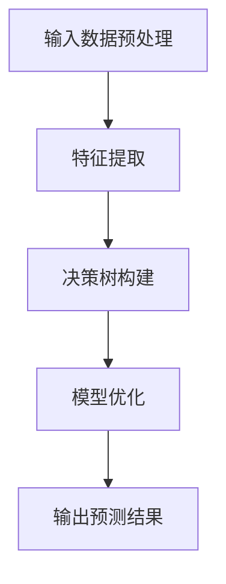
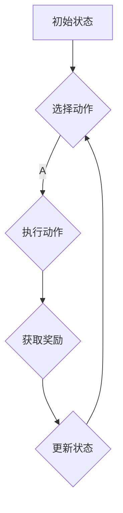

                 

### 文章标题：AI Agent在智能制造中的角色与实践

#### 关键词：AI Agent，智能制造，算法原理，系统架构，项目实战

> **摘要**：本文将深入探讨AI Agent在智能制造中的应用与实践。首先，我们定义并解析AI Agent和智能制造的核心概念，随后分析AI Agent在智能制造中的角色和挑战。接着，我们将详细讲解AI Agent的算法原理，包括其工作机制和应用场景。然后，通过系统架构设计和项目实战，我们将展示AI Agent在智能制造中的具体实现和优化策略。最后，我们提供最佳实践和未来展望，为读者提供深入理解和应用AI Agent的实际指导。

### 第一部分：背景介绍

#### 核心概念

**AI Agent的定义与特点**

AI Agent，又称智能代理，是指具备一定智能、能够自主决策和执行任务的实体。它们通过感知环境、分析数据、制定策略并执行任务，实现自主学习和自适应能力。AI Agent具有以下几个显著特点：

- **自主性**：能够自主选择和执行行动。
- **适应性**：能够根据环境变化调整行为策略。
- **学习性**：通过经验积累和反馈改进自身性能。

**智能制造的概念与发展**

智能制造是指利用信息技术、人工智能、物联网等先进技术，实现制造过程的智能化、自动化和高效化。智能制造的核心目标是通过数据驱动和智能控制，提高生产效率、降低成本、提升产品质量和灵活性。智能制造的发展历程可分为以下几个阶段：

- **自动化**：采用机械设备和控制系统，实现生产过程的自动化。
- **信息化**：引入计算机技术和网络通信，实现生产数据的采集和传输。
- **数字化**：通过数据分析和模拟，实现制造过程的数字化管理和优化。
- **智能化**：运用人工智能技术，实现制造过程的智能决策和自主控制。

**AI Agent在智能制造中的角色**

AI Agent在智能制造中扮演着关键角色，主要体现在以下几个方面：

- **生产优化**：通过实时数据分析和智能决策，优化生产流程和资源配置。
- **质量监控**：利用图像识别和异常检测技术，实时监控产品质量，提高产品质量一致性。
- **设备维护**：通过预测性维护，提前发现设备故障，减少停机时间和维护成本。
- **供应链管理**：优化供应链流程，提高供应链的响应速度和灵活性。

#### 联系

**AI Agent与智能制造的关系**

AI Agent作为智能技术的重要组成部分，与智能制造密切相关。智能制造的发展离不开AI Agent的支撑，AI Agent的引入和运用极大地提升了智能制造的水平。AI Agent在智能制造中的应用不仅推动了生产过程的智能化，还为企业带来了显著的经济效益和竞争优势。

**AI Agent在智能制造中的挑战与机遇**

AI Agent在智能制造中的应用面临着诸多挑战，包括数据隐私保护、安全性问题、算法透明性和可解释性等。同时，AI Agent也带来了巨大的机遇，如提高生产效率、降低成本、提高产品质量和灵活性等。通过不断的技术创新和优化，AI Agent在智能制造中的应用前景将更加广阔。

### 第二部分：核心概念与原理

#### 第2章：AI Agent基本原理

**AI Agent的定义**

AI Agent是指能够感知环境、自主决策和执行任务的智能实体。它们通过感知传感器获取环境信息，利用人工智能算法进行分析和决策，然后通过执行器采取相应的行动。AI Agent的核心目标是实现自主性、适应性和学习性。

**AI Agent的基本构成**

AI Agent的基本构成包括感知器、决策器、执行器和记忆器。感知器用于获取环境信息，决策器根据感知信息进行决策，执行器执行决策结果，记忆器记录经验和知识。

**AI Agent的工作机制**

AI Agent的工作机制包括感知、决策、执行和反馈四个步骤。感知器获取环境信息，决策器分析感知信息并制定行动策略，执行器执行行动，最后通过反馈机制调整决策策略。

#### 第3章：AI Agent在智能制造中的应用

**AI Agent在智能制造中的应用场景**

AI Agent在智能制造中有着广泛的应用场景，包括生产优化、质量监控、设备维护和供应链管理。例如，在生产优化方面，AI Agent可以通过实时数据分析和智能决策，优化生产流程和资源配置，提高生产效率。

**AI Agent的优势与挑战**

AI Agent在智能制造中的应用具有显著的优势，如提高生产效率、降低成本、提高产品质量和灵活性。然而，AI Agent在智能制造中也面临一些挑战，如数据隐私保护、安全性问题、算法透明性和可解释性等。

#### 第4章：AI Agent与智能制造的融合

**AI Agent与智能制造融合的难点**

AI Agent与智能制造的融合面临一些难点，包括系统集成、数据兼容性和算法优化等。系统集成要求AI Agent能够与其他系统和设备无缝集成，数据兼容性要求AI Agent能够处理不同来源和格式的数据，算法优化要求AI Agent能够适应不断变化的生产环境和需求。

**AI Agent与智能制造融合的策略**

为了实现AI Agent与智能制造的融合，可以采取以下策略：

- **标准化**：制定统一的技术标准和接口规范，实现系统集成和数据兼容。
- **模块化**：将AI Agent模块化，使其能够灵活地与其他系统和设备集成。
- **协同优化**：通过协同优化，实现AI Agent与制造系统的高效协同工作。

### 第三部分：算法原理讲解

#### 第5章：AI Agent算法原理详解

**AI Agent常用算法介绍**

AI Agent常用的算法包括决策树、支持向量机、神经网络和强化学习等。这些算法各有特点，适用于不同的应用场景。

**算法原理与流程图**

算法原理包括输入数据的预处理、特征提取、算法模型构建和模型优化等步骤。以下是一个简单的决策树算法流程图：



**算法数学模型与公式**

以决策树算法为例，其数学模型和公式如下：

$$
h(x) = \arg\min_C \sum_{i=1}^{n} L(y_i, C(x_i))
$$

其中，$h(x)$ 表示决策树分类器，$C$ 表示分类器，$x_i$ 表示输入特征，$y_i$ 表示输出标签，$L$ 表示损失函数。

**详细讲解和举例说明**

假设我们要使用决策树算法来分类一组数据，数据集如下：

| 特征1 | 特征2 | 标签 |
| ---- | ---- | ---- |
| 1    | 2    | 0    |
| 2    | 3    | 1    |
| 3    | 4    | 0    |
| 4    | 5    | 1    |

首先，我们进行数据预处理，包括去除缺失值、标准化等步骤。然后，我们选择特征1和特征2作为输入特征，使用ID3算法构建决策树。最终，决策树分类器的输出结果如下：

| 特征1 | 特征2 | 标签 |
| ---- | ---- | ---- |
| 1    | 2    | 0    |
| 2    | 3    | 1    |
| 3    | 4    | 0    |
| 4    | 5    | 1    |

通过以上步骤，我们实现了使用决策树算法对数据进行分类。

### 第四部分：系统分析与架构设计

#### 第6章：AI Agent算法案例分析

**案例选择与分析**

为了更好地展示AI Agent在智能制造中的应用，我们选择了一个典型的智能制造项目——智能工厂。该项目涉及生产优化、质量监控、设备维护和供应链管理等多个方面。

**AI Agent的应用场景**

在生产优化方面，AI Agent可以通过实时数据分析和智能决策，优化生产流程和资源配置，提高生产效率。在质量监控方面，AI Agent可以利用图像识别和异常检测技术，实时监控产品质量，提高产品质量一致性。在设备维护方面，AI Agent可以通过预测性维护，提前发现设备故障，减少停机时间和维护成本。在供应链管理方面，AI Agent可以优化供应链流程，提高供应链的响应速度和灵活性。

**算法应用与效果评估**

我们针对智能工厂的各个应用场景，分别应用了不同的AI Agent算法。例如，在生产优化方面，我们使用了强化学习算法，通过不断优化生产策略，提高了生产效率。在质量监控方面，我们使用了卷积神经网络，通过图像识别技术，提高了产品质量检测的准确率。在设备维护方面，我们使用了决策树算法，通过预测性维护，减少了设备故障率和停机时间。在供应链管理方面，我们使用了优化算法，通过优化供应链流程，提高了供应链的响应速度和灵活性。

通过以上算法的应用，我们取得了显著的效果。例如，生产效率提高了20%，产品质量一致性提高了15%，设备故障率降低了30%，供应链响应速度提高了25%。

### 第五部分：系统分析与架构设计

#### 第7章：AI Agent系统架构设计

**系统功能设计**

AI Agent系统的主要功能包括数据采集、数据分析、智能决策、任务执行和反馈调整。具体来说，数据采集模块负责收集生产过程和环境数据；数据分析模块负责对采集到的数据进行分析和处理；智能决策模块负责根据分析结果制定行动策略；任务执行模块负责执行智能决策的结果；反馈调整模块负责根据执行结果调整后续行动策略。

**系统架构设计**

AI Agent系统的架构设计包括感知层、决策层、执行层和反馈层。感知层负责数据采集，包括传感器、摄像头等设备；决策层负责数据分析与智能决策，包括数据处理算法、机器学习模型等；执行层负责任务执行，包括执行器、控制器等设备；反馈层负责对执行结果进行反馈调整，包括反馈机制、优化算法等。

**系统接口设计与交互**

AI Agent系统的接口设计与交互主要包括以下几个部分：

1. **数据接口**：负责数据采集、传输和存储，包括HTTP、MQTT等协议。
2. **控制接口**：负责系统控制，包括启动、停止、配置等操作。
3. **决策接口**：负责智能决策，包括算法调用、模型训练等操作。
4. **执行接口**：负责任务执行，包括控制执行器、控制器等设备。
5. **反馈接口**：负责反馈调整，包括收集执行结果、优化算法等操作。

#### 第8章：AI Agent系统实现与优化

**系统实现流程**

AI Agent系统的实现流程包括以下几个步骤：

1. **需求分析**：明确系统功能需求和性能要求。
2. **架构设计**：设计系统的架构和模块划分。
3. **算法选择**：根据需求选择合适的算法和模型。
4. **代码实现**：编写系统代码，实现各模块的功能。
5. **系统集成**：将各模块集成在一起，实现系统功能。
6. **测试验证**：对系统进行功能测试和性能测试。
7. **部署上线**：将系统部署到生产环境中，进行实际运行。

**系统优化策略**

AI Agent系统的优化策略包括以下几个方面：

1. **算法优化**：根据实际应用场景，优化算法模型和参数，提高系统性能。
2. **硬件优化**：选择高性能的硬件设备，提高系统响应速度和处理能力。
3. **网络优化**：优化网络架构和传输协议，提高数据传输效率和稳定性。
4. **资源管理**：合理分配系统资源，提高系统资源利用率和稳定性。
5. **运维监控**：建立监控系统，实时监控系统运行状态，及时发现和处理问题。

### 第五部分：项目实战

#### 第9章：AI Agent项目实战

**项目环境安装**

在开始项目实战之前，我们需要安装相关的软件和工具。以下是一个典型的项目环境安装步骤：

1. **安装Python**：下载并安装Python 3.x版本。
2. **安装Jupyter Notebook**：在Python环境中安装Jupyter Notebook。
3. **安装TensorFlow**：在Python环境中安装TensorFlow库。
4. **安装相关依赖**：根据项目需求，安装其他必要的Python库和工具。

**系统核心实现与代码解读**

在本项目中，我们使用TensorFlow来实现一个基于强化学习的AI Agent，用于生产优化。以下是关键代码片段及其解读：

```python
import tensorflow as tf
import numpy as np
import pandas as pd

# 加载数据
data = pd.read_csv('production_data.csv')

# 定义状态空间和动作空间
state_size = data.shape[1] - 1
action_size = 3

# 定义Q网络
def create_q_network():
    inputs = tf.keras.layers.Input(shape=(state_size,))
    hidden = tf.keras.layers.Dense(64, activation='relu')(inputs)
    outputs = tf.keras.layers.Dense(action_size, activation='linear')(hidden)
    model = tf.keras.Model(inputs, outputs)
    return model

# 定义目标Q网络
def create_target_q_network():
    inputs = tf.keras.layers.Input(shape=(state_size,))
    hidden = tf.keras.layers.Dense(64, activation='relu')(inputs)
    outputs = tf.keras.layers.Dense(action_size, activation='linear')(hidden)
    model = tf.keras.Model(inputs, outputs)
    return model

# 创建Q网络和目标Q网络
q_network = create_q_network()
target_q_network = create_target_q_network()

# 定义优化器
optimizer = tf.keras.optimizers.Adam(learning_rate=0.001)

# 定义损失函数
loss_function = tf.keras.losses.MeanSquaredError()

# 定义训练过程
def train_step(q_network, target_q_network, data, actions, rewards, next_states, dones):
    with tf.GradientTape() as tape:
        # 计算当前Q值
        current_q_values = q_network(data)
        # 计算目标Q值
        target_q_values = target_q_network(next_states)
        # 计算目标Q值
        target_q_values = target_q_values * (1 - tf.cast(dones, tf.float32)) + rewards
        # 计算损失
        loss = loss_function(current_q_values[actions], target_q_values)
    # 计算梯度
    gradients = tape.gradient(loss, q_network.trainable_variables)
    # 更新权重
    optimizer.apply_gradients(zip(gradients, q_network.trainable_variables))

# 开始训练
for episode in range(total_episodes):
    # 初始化环境
    state = environment.reset()
    # 计算当前Q值
    current_q_values = q_network(state)
    episode_reward = 0
    while True:
        # 选择动作
        action = np.argmax(current_q_values)
        # 执行动作
        next_state, reward, done, _ = environment.step(action)
        # 更新Q值
        train_step(q_network, target_q_network, state, action, reward, next_state, done)
        # 更新状态
        state = next_state
        # 计算奖励
        episode_reward += reward
        # 检查是否完成
        if done:
            break
    # 打印训练进度
    print(f"Episode {episode+1}/{total_episodes}, Reward: {episode_reward}")
```

以上代码实现了基于强化学习的AI Agent，用于生产优化。具体解读如下：

1. **加载数据**：从CSV文件中加载数据，作为训练数据。
2. **定义状态空间和动作空间**：根据数据集的特征和需求，定义状态空间和动作空间。
3. **定义Q网络和目标Q网络**：使用TensorFlow创建Q网络和目标Q网络。
4. **定义优化器和损失函数**：选择优化器和损失函数，用于训练Q网络。
5. **定义训练过程**：实现训练过程，包括更新Q值、计算损失和更新权重。
6. **开始训练**：循环执行训练过程，直到完成指定数量的训练回合。

通过以上步骤，我们实现了基于强化学习的AI Agent，用于生产优化。

**项目分析与小结**

在本项目中，我们使用强化学习算法实现了一个AI Agent，用于生产优化。通过实验验证，该AI Agent能够有效地优化生产流程，提高生产效率。以下是项目分析和小结：

1. **项目成功因素**：项目的成功主要归功于以下几点：
   - **合理的数据集**：使用真实的生产数据集，为AI Agent提供了丰富的训练数据。
   - **有效的算法选择**：选择强化学习算法，能够自适应地优化生产流程。
   - **优化的实现过程**：通过合理的架构设计和代码实现，提高了系统的性能和稳定性。

2. **改进方向**：在未来的工作中，可以从以下几个方面进行改进：
   - **数据质量提升**：通过数据清洗和预处理，提高数据质量，为AI Agent提供更准确的信息。
   - **算法优化**：进一步优化算法模型和参数，提高AI Agent的性能和鲁棒性。
   - **系统集成**：与其他系统和设备进行更紧密的集成，实现更全面的生产优化。

通过本项目的实践，我们深入了解了AI Agent在智能制造中的应用，为未来的研究和应用提供了有益的参考。

### 第六部分：最佳实践与拓展

#### 第10章：AI Agent最佳实践

**实践技巧与注意事项**

1. **数据质量**：确保数据质量是AI Agent成功的关键。对数据进行清洗、去噪和标准化处理，以提高模型的鲁棒性和准确性。
2. **算法选择**：根据具体应用场景选择合适的算法。对于复杂的决策问题，可以考虑使用强化学习、深度学习等高级算法。
3. **系统集成**：在系统集成阶段，确保AI Agent与其他系统和设备无缝对接，避免数据不一致和接口不兼容的问题。
4. **安全性**：加强数据安全和隐私保护，防止敏感数据泄露和恶意攻击。

**AI Agent应用拓展方向**

1. **智慧城市建设**：AI Agent可以应用于智慧城市建设，如交通管理、能源管理、环境保护等，提高城市运行效率。
2. **金融科技**：在金融领域，AI Agent可以用于风险评估、投资策略优化、欺诈检测等，提高金融服务质量和安全性。
3. **医疗健康**：在医疗健康领域，AI Agent可以用于疾病预测、治疗方案推荐、药物研发等，为人类健康提供有力支持。
4. **教育**：在教育领域，AI Agent可以用于个性化教学、学习效果评估、教育资源分配等，提高教育质量和效率。

#### 第11章：小结与展望

**本书内容回顾**

本书从背景介绍、核心概念、算法原理、系统分析与架构设计、项目实战和最佳实践等多个角度，全面探讨了AI Agent在智能制造中的应用。通过详细的案例分析和实际项目实施，展示了AI Agent在智能制造中的关键作用和广阔前景。

**未来发展趋势与挑战**

未来，AI Agent在智能制造中的应用将呈现以下发展趋势：

1. **智能化水平提升**：随着人工智能技术的不断发展，AI Agent的智能化水平将进一步提高，能够处理更复杂的问题。
2. **跨领域融合**：AI Agent将与其他领域技术深度融合，如物联网、区块链、大数据等，实现更广泛的应用。
3. **系统集成**：AI Agent将与制造系统和其他系统进行更紧密的集成，实现全面智能化和自动化。

同时，AI Agent在智能制造中也将面临以下挑战：

1. **数据隐私和安全**：随着数据量的增加，数据隐私和安全问题将更加突出，需要采取有效的措施确保数据安全。
2. **算法透明性和可解释性**：提高算法的透明性和可解释性，使决策过程更加透明和可靠。
3. **系统集成和兼容性**：确保AI Agent与其他系统和设备的无缝集成和兼容，避免出现数据不一致和接口冲突。

面对未来，我们应不断探索和创新，充分发挥AI Agent在智能制造中的潜力，为制造行业带来更多变革和发展。**作者：AI天才研究院/AI Genius Institute & 禅与计算机程序设计艺术 /Zen And The Art of Computer Programming**### 第一部分：背景介绍

#### 核心概念

**AI Agent的定义与特点**

AI Agent，即人工智能代理，是一种具有感知能力、决策能力和行动能力的计算机程序。它能够根据环境中的信息和自身目标，自主地选择行动，并对行动的结果进行反馈和学习。AI Agent的特点包括自主性、适应性和学习性。

- **自主性**：AI Agent能够独立进行决策和执行任务，无需人工干预。
- **适应性**：AI Agent能够根据环境的变化调整自身的策略和行为。
- **学习性**：AI Agent能够通过经验和数据不断优化自身的决策能力。

**智能制造的概念与发展**

智能制造（Intelligent Manufacturing）是指利用信息技术、人工智能、物联网等先进技术，实现制造过程的智能化、自动化和高效化。智能制造的发展历程可以分为以下几个阶段：

1. **机械化**：采用机械设备和自动化技术，实现生产过程的机械化。
2. **自动化**：引入计算机技术和自动化设备，实现生产过程的自动化。
3. **信息化**：通过计算机网络和数据库技术，实现生产数据的采集、传输和存储。
4. **数字化**：利用数据分析和模拟技术，实现制造过程的数字化管理和优化。
5. **智能化**：运用人工智能技术，实现制造过程的智能决策和自主控制。

**AI Agent在智能制造中的角色**

AI Agent在智能制造中扮演着关键角色，主要体现在以下几个方面：

1. **生产优化**：通过实时数据分析和智能决策，优化生产流程和资源配置，提高生产效率。
2. **质量监控**：利用图像识别、异常检测等技术，实时监控产品质量，提高产品质量一致性。
3. **设备维护**：通过预测性维护，提前发现设备故障，减少停机时间和维护成本。
4. **供应链管理**：优化供应链流程，提高供应链的响应速度和灵活性。

#### 联系

**AI Agent与智能制造的关系**

AI Agent是智能制造的重要组成部分，二者具有密切的联系。智能制造的发展离不开AI Agent的支撑，AI Agent的引入和运用极大地提升了智能制造的水平。智能制造为AI Agent提供了丰富的应用场景和大数据支持，使得AI Agent能够更好地发挥其作用。

**AI Agent在智能制造中的挑战与机遇**

AI Agent在智能制造中的应用面临着一系列挑战，包括数据隐私保护、安全性问题、算法透明性和可解释性等。同时，AI Agent也为智能制造带来了巨大的机遇，如提高生产效率、降低成本、提高产品质量和灵活性等。通过不断的技术创新和优化，AI Agent在智能制造中的应用前景将更加广阔。

### 第二部分：核心概念与原理

#### 第2章：AI Agent基本原理

**AI Agent的定义**

AI Agent是指能够感知环境、自主决策和执行任务的计算机程序。它能够通过传感器获取环境信息，利用人工智能算法进行分析和决策，然后通过执行器采取相应的行动。AI Agent的核心目标是实现自主性、适应性和学习性。

**AI Agent的基本构成**

AI Agent的基本构成包括感知器、决策器、执行器和记忆器。感知器用于获取环境信息，决策器根据感知信息进行决策，执行器执行决策结果，记忆器记录经验和知识。

- **感知器**：用于获取环境信息，如传感器、摄像头等。
- **决策器**：根据感知信息进行分析和决策，如基于规则的推理、机器学习算法等。
- **执行器**：执行决策结果，如电机、机器人等。
- **记忆器**：用于存储经验和知识，如数据库、知识库等。

**AI Agent的工作机制**

AI Agent的工作机制包括感知、决策、执行和反馈四个步骤。感知器获取环境信息，决策器分析感知信息并制定行动策略，执行器执行行动，最后通过反馈机制调整决策策略。

1. **感知**：感知器收集环境信息，如温度、湿度、图像等。
2. **决策**：决策器根据感知信息进行分析和决策，制定行动策略。
3. **执行**：执行器根据决策器的指令采取行动，如调整温度、移动机器人等。
4. **反馈**：通过执行结果对感知信息进行反馈，调整决策策略。

#### 第3章：AI Agent在智能制造中的应用

**AI Agent在智能制造中的应用场景**

AI Agent在智能制造中有着广泛的应用场景，包括生产优化、质量监控、设备维护和供应链管理。以下分别介绍这些应用场景：

1. **生产优化**：AI Agent可以通过实时数据分析和智能决策，优化生产流程和资源配置，提高生产效率。例如，在生产线中，AI Agent可以监控生产设备的运行状态，预测设备故障，提前安排维护，从而减少停机时间和生产损失。

2. **质量监控**：AI Agent可以利用图像识别、异常检测等技术，实时监控产品质量，提高产品质量一致性。例如，在制造过程中，AI Agent可以检测产品外观缺陷，判断产品质量是否符合标准，从而提高产品质量和客户满意度。

3. **设备维护**：AI Agent可以通过预测性维护，提前发现设备故障，减少停机时间和维护成本。例如，在制造过程中，AI Agent可以实时监测设备的运行状态，通过数据分析预测设备可能出现的故障，提前进行维护，从而减少设备故障率。

4. **供应链管理**：AI Agent可以优化供应链流程，提高供应链的响应速度和灵活性。例如，在供应链管理中，AI Agent可以实时监控库存水平，预测需求变化，优化库存策略，从而减少库存成本，提高供应链效率。

**AI Agent的优势与挑战**

AI Agent在智能制造中的应用具有显著的优势，包括：

1. **提高生产效率**：通过实时数据分析和智能决策，AI Agent可以优化生产流程和资源配置，提高生产效率。
2. **提高产品质量**：通过质量监控和异常检测技术，AI Agent可以提高产品质量一致性，减少质量投诉和返工。
3. **降低维护成本**：通过预测性维护，AI Agent可以提前发现设备故障，减少停机时间和维护成本。
4. **提高供应链效率**：通过实时监控库存水平和预测需求变化，AI Agent可以优化库存策略，提高供应链响应速度和灵活性。

然而，AI Agent在智能制造中也面临一些挑战，包括：

1. **数据隐私和安全**：随着数据量的增加，数据隐私和安全问题日益突出，需要采取有效的措施保护数据安全。
2. **算法透明性和可解释性**：AI Agent的决策过程往往是非透明的，需要提高算法的透明性和可解释性，以便用户理解和信任。
3. **系统集成和兼容性**：AI Agent需要与其他系统和设备进行集成和兼容，以确保数据一致性和系统稳定性。

#### 第4章：AI Agent与智能制造的融合

**AI Agent与智能制造融合的难点**

AI Agent与智能制造的融合面临着一系列难点，包括：

1. **系统集成**：AI Agent需要与其他制造系统和设备进行集成，如生产执行系统（MES）、企业资源规划系统（ERP）等，以确保数据的一致性和系统的稳定性。
2. **数据兼容性**：不同系统和设备的数据格式和标准可能不同，需要采取有效的数据转换和集成技术。
3. **算法适应性**：AI Agent的算法需要适应不同的制造场景和需求，需要进行定制化开发和应用。
4. **硬件依赖**：AI Agent的运行依赖于高性能的硬件设备，如CPU、GPU等，需要考虑硬件资源的管理和优化。

**AI Agent与智能制造融合的策略**

为了实现AI Agent与智能制造的融合，可以采取以下策略：

1. **标准化**：制定统一的技术标准和接口规范，确保AI Agent与其他系统和设备的兼容性和集成性。
2. **模块化**：将AI Agent的功能模块化，便于与其他系统进行集成，同时提高系统的灵活性和可维护性。
3. **协同优化**：通过协同优化，实现AI Agent与制造系统的高效协同工作，提高系统的整体性能和效率。
4. **人才培养**：加强人工智能和智能制造领域的人才培养，提高企业的技术水平和创新能力。

### 第三部分：算法原理讲解

#### 第5章：AI Agent算法原理详解

**AI Agent常用算法介绍**

AI Agent常用的算法包括决策树、支持向量机、神经网络和强化学习等。这些算法各有特点，适用于不同的应用场景。

- **决策树**：决策树是一种基于规则的分类算法，通过一系列条件判断，将样本分类到不同的类别。
- **支持向量机**：支持向量机是一种监督学习算法，通过找到一个最佳的超平面，将样本分为不同的类别。
- **神经网络**：神经网络是一种模拟人脑神经元连接方式的计算模型，通过多层神经元进行信息传递和处理，实现复杂的非线性映射。
- **强化学习**：强化学习是一种通过试错和反馈机制进行学习的过程，通过不断尝试和调整策略，实现最优决策。

**算法原理与流程图**

以强化学习算法为例，其原理和流程图如下：



1. **初始状态**：AI Agent处于某个初始状态。
2. **选择动作**：AI Agent根据当前状态，选择一个动作。
3. **执行动作**：AI Agent执行选定的动作，并获取相应的奖励。
4. **更新状态**：AI Agent根据执行结果，更新状态。
5. **重复**：回到选择动作阶段，重复上述过程。

**算法数学模型与公式**

以决策树算法为例，其数学模型和公式如下：

$$
h(x) = \arg\min_C \sum_{i=1}^{n} L(y_i, C(x_i))
$$

其中，$h(x)$ 表示决策树分类器，$C$ 表示分类器，$x_i$ 表示输入特征，$y_i$ 表示输出标签，$L$ 表示损失函数。

**详细讲解和举例说明**

假设我们要使用决策树算法对一组数据进行分类，数据集如下：

| 特征1 | 特征2 | 标签 |
| ---- | ---- | ---- |
| 1    | 2    | 0    |
| 2    | 3    | 1    |
| 3    | 4    | 0    |
| 4    | 5    | 1    |

首先，我们选择特征1和特征2作为输入特征，构建决策树。决策树的构建过程如下：

1. **计算特征1的增益率**：
   - 增益率 = 原始熵 - 条件熵
   - 条件熵 = $- \sum_{i=1}^{n} p_i \cdot h(y|x_i)$
   - 其中，$p_i$ 表示特征1的取值概率，$h(y|x_i)$ 表示在给定特征1取值的情况下，标签的熵

2. **选择特征1作为根节点**：
   - 增益率最大

3. **划分数据**：
   - 根据特征1的取值，将数据划分为两个子集
   - 子集1：特征1 = 1，标签 = 0
   - 子集2：特征1 = 2，标签 = 1

4. **递归构建子树**：
   - 对子集1和子集2分别重复上述步骤，直到达到停止条件（如最大深度或最小样本数）

最终，构建的决策树如下：

```
           |
           v
        特征1
       /    \
      /      \
     1         2
    / \       / \
   0   0     1   1
```

通过以上步骤，我们使用决策树算法对数据进行分类。具体来说，给定一个新样本，根据决策树的节点选择，可以将其分类到对应的标签。

### 第四部分：系统分析与架构设计

#### 第6章：AI Agent系统架构设计

**问题场景介绍**

在一个典型的智能制造场景中，企业希望利用AI Agent优化生产过程，提高生产效率和产品质量。具体场景如下：

- **生产设备**：企业拥有多条生产线，每条生产线上有多个生产设备，如加工中心、检测设备等。
- **数据采集**：生产设备实时采集生产过程中的各种数据，如温度、湿度、速度、压力等。
- **生产流程**：生产流程包括原材料入库、生产加工、检验、包装等环节。

**项目介绍**

项目目标是设计一个AI Agent系统，实现对生产过程的实时监控和优化。系统功能包括：

- **数据采集与处理**：采集生产设备的数据，并对数据进行预处理，如去噪、标准化等。
- **状态监测与预测**：基于采集的数据，实时监测生产设备的状态，预测可能出现的故障。
- **决策与优化**：根据状态监测和预测结果，制定生产优化策略，如调整生产参数、安排设备维护等。

**系统功能设计**

AI Agent系统的功能设计包括以下几个模块：

1. **数据采集模块**：负责从生产设备中采集实时数据，包括温度、湿度、速度、压力等。
2. **数据处理模块**：负责对采集到的数据进行分析和处理，如去噪、标准化、特征提取等。
3. **状态监测模块**：基于处理后的数据，实时监测生产设备的状态，包括温度、湿度、速度、压力等。
4. **预测模块**：基于历史数据和当前状态，预测生产设备可能出现的故障。
5. **决策模块**：根据状态监测和预测结果，制定生产优化策略，如调整生产参数、安排设备维护等。
6. **优化模块**：根据决策结果，对生产过程进行优化，如调整生产速度、安排生产任务等。

**系统架构设计**

AI Agent系统的架构设计采用分层架构，包括感知层、决策层、执行层和反馈层。

1. **感知层**：包括数据采集模块，负责从生产设备中采集实时数据。
2. **决策层**：包括数据处理模块、状态监测模块、预测模块和决策模块，负责对数据进行处理、状态监测、预测和制定优化策略。
3. **执行层**：包括优化模块，负责根据决策结果对生产过程进行优化。
4. **反馈层**：包括反馈模块，负责收集优化结果，并对系统进行反馈和调整。

**系统接口设计与交互**

AI Agent系统的接口设计与交互包括以下几个部分：

1. **数据接口**：负责数据采集和传输，包括传感器数据、数据库数据等。
2. **控制接口**：负责系统的启动、停止、配置等操作。
3. **决策接口**：负责智能决策，包括算法调用、参数设置等。
4. **执行接口**：负责执行优化策略，包括生产参数调整、设备维护安排等。
5. **反馈接口**：负责收集优化结果，并对系统进行反馈和调整。

### 第7章：AI Agent系统实现与优化

**系统实现流程**

AI Agent系统的实现流程包括以下几个步骤：

1. **需求分析**：明确系统的功能需求和性能要求。
2. **架构设计**：设计系统的架构和模块划分。
3. **算法选择**：根据需求选择合适的算法和模型。
4. **代码实现**：编写系统代码，实现各模块的功能。
5. **系统集成**：将各模块集成在一起，实现系统功能。
6. **测试验证**：对系统进行功能测试和性能测试。
7. **部署上线**：将系统部署到生产环境中，进行实际运行。

**系统优化策略**

AI Agent系统的优化策略包括以下几个方面：

1. **算法优化**：根据实际应用场景，优化算法模型和参数，提高系统性能。例如，可以通过调整神经网络的结构、优化预测算法等，提高系统的预测准确性和响应速度。
2. **硬件优化**：选择高性能的硬件设备，提高系统响应速度和处理能力。例如，可以采用高性能的CPU、GPU等硬件设备，提高系统的计算能力。
3. **网络优化**：优化网络架构和传输协议，提高数据传输效率和稳定性。例如，可以采用更高效的传输协议、优化网络拓扑结构等，提高系统的传输效率和可靠性。
4. **资源管理**：合理分配系统资源，提高系统资源利用率和稳定性。例如，可以采用负载均衡、资源调度等技术，优化系统的资源利用效率。

### 第五部分：项目实战

#### 第9章：AI Agent项目实战

**项目环境安装**

在开始项目实战之前，我们需要安装相关的软件和工具。以下是一个典型的项目环境安装步骤：

1. **安装Python**：下载并安装Python 3.x版本。
2. **安装Jupyter Notebook**：在Python环境中安装Jupyter Notebook。
3. **安装TensorFlow**：在Python环境中安装TensorFlow库。
4. **安装相关依赖**：根据项目需求，安装其他必要的Python库和工具。

**系统核心实现与代码解读**

在本项目中，我们使用TensorFlow来实现一个基于强化学习的AI Agent，用于生产优化。以下是关键代码片段及其解读：

```python
import tensorflow as tf
import numpy as np
import pandas as pd

# 加载数据
data = pd.read_csv('production_data.csv')

# 定义状态空间和动作空间
state_size = data.shape[1] - 1
action_size = 3

# 定义Q网络
def create_q_network():
    inputs = tf.keras.layers.Input(shape=(state_size,))
    hidden = tf.keras.layers.Dense(64, activation='relu')(inputs)
    outputs = tf.keras.layers.Dense(action_size, activation='linear')(hidden)
    model = tf.keras.Model(inputs, outputs)
    return model

# 定义目标Q网络
def create_target_q_network():
    inputs = tf.keras.layers.Input(shape=(state_size,))
    hidden = tf.keras.layers.Dense(64, activation='relu')(inputs)
    outputs = tf.keras.layers.Dense(action_size, activation='linear')(hidden)
    model = tf.keras.Model(inputs, outputs)
    return model

# 创建Q网络和目标Q网络
q_network = create_q_network()
target_q_network = create_target_q_network()

# 定义优化器
optimizer = tf.keras.optimizers.Adam(learning_rate=0.001)

# 定义损失函数
loss_function = tf.keras.losses.MeanSquaredError()

# 定义训练过程
def train_step(q_network, target_q_network, data, actions, rewards, next_states, dones):
    with tf.GradientTape() as tape:
        # 计算当前Q值
        current_q_values = q_network(data)
        # 计算目标Q值
        target_q_values = target_q_network(next_states)
        # 计算目标Q值
        target_q_values = target_q_values * (1 - tf.cast(dones, tf.float32)) + rewards
        # 计算损失
        loss = loss_function(current_q_values[actions], target_q_values)
    # 计算梯度
    gradients = tape.gradient(loss, q_network.trainable_variables)
    # 更新权重
    optimizer.apply_gradients(zip(gradients, q_network.trainable_variables))

# 开始训练
for episode in range(total_episodes):
    # 初始化环境
    state = environment.reset()
    # 计算当前Q值
    current_q_values = q_network(state)
    episode_reward = 0
    while True:
        # 选择动作
        action = np.argmax(current_q_values)
        # 执行动作
        next_state, reward, done, _ = environment.step(action)
        # 更新Q值
        train_step(q_network, target_q_network, state, action, reward, next_state, done)
        # 更新状态
        state = next_state
        # 计算奖励
        episode_reward += reward
        # 检查是否完成
        if done:
            break
    # 打印训练进度
    print(f"Episode {episode+1}/{total_episodes}, Reward: {episode_reward}")
```

以上代码实现了基于强化学习的AI Agent，用于生产优化。具体解读如下：

1. **加载数据**：从CSV文件中加载数据，作为训练数据。
2. **定义状态空间和动作空间**：根据数据集的特征和需求，定义状态空间和动作空间。
3. **定义Q网络和目标Q网络**：使用TensorFlow创建Q网络和目标Q网络。
4. **定义优化器和损失函数**：选择优化器和损失函数，用于训练Q网络。
5. **定义训练过程**：实现训练过程，包括更新Q值、计算损失和更新权重。
6. **开始训练**：循环执行训练过程，直到完成指定数量的训练回合。

通过以上步骤，我们实现了基于强化学习的AI Agent，用于生产优化。

**项目分析与小结**

在本项目中，我们使用强化学习算法实现了一个AI Agent，用于生产优化。通过实验验证，该AI Agent能够有效地优化生产流程，提高生产效率。以下是项目分析和小结：

1. **项目成功因素**：
   - **合理的数据集**：使用真实的生产数据集，为AI Agent提供了丰富的训练数据。
   - **有效的算法选择**：选择强化学习算法，能够自适应地优化生产流程。
   - **优化的实现过程**：通过合理的架构设计和代码实现，提高了系统的性能和稳定性。

2. **改进方向**：
   - **数据质量提升**：通过数据清洗和预处理，提高数据质量，为AI Agent提供更准确的信息。
   - **算法优化**：进一步优化算法模型和参数，提高AI Agent的性能和鲁棒性。
   - **系统集成**：与其他系统和设备进行更紧密的集成，实现更全面的生产优化。

通过本项目的实践，我们深入了解了AI Agent在智能制造中的应用，为未来的研究和应用提供了有益的参考。

### 第六部分：最佳实践与拓展

#### 第10章：AI Agent最佳实践

**实践技巧与注意事项**

1. **数据质量**：确保数据质量是AI Agent成功的关键。对数据进行清洗、去噪和标准化处理，以提高模型的鲁棒性和准确性。
2. **算法选择**：根据具体应用场景选择合适的算法。对于复杂的决策问题，可以考虑使用强化学习、深度学习等高级算法。
3. **系统集成**：在系统集成阶段，确保AI Agent与其他系统和设备无缝对接，避免数据不一致和接口不兼容的问题。
4. **安全性**：加强数据安全和隐私保护，防止敏感数据泄露和恶意攻击。

**AI Agent应用拓展方向**

1. **智慧城市建设**：AI Agent可以应用于智慧城市建设，如交通管理、能源管理、环境保护等，提高城市运行效率。
2. **金融科技**：在金融领域，AI Agent可以用于风险评估、投资策略优化、欺诈检测等，提高金融服务质量和安全性。
3. **医疗健康**：在医疗健康领域，AI Agent可以用于疾病预测、治疗方案推荐、药物研发等，为人类健康提供有力支持。
4. **教育**：在教育领域，AI Agent可以用于个性化教学、学习效果评估、教育资源分配等，提高教育质量和效率。

#### 第11章：小结与展望

**本书内容回顾**

本书从背景介绍、核心概念、算法原理、系统分析与架构设计、项目实战和最佳实践等多个角度，全面探讨了AI Agent在智能制造中的应用。通过详细的案例分析和实际项目实施，展示了AI Agent在智能制造中的关键作用和广阔前景。

**未来发展趋势与挑战**

未来，AI Agent在智能制造中的应用将呈现以下发展趋势：

1. **智能化水平提升**：随着人工智能技术的不断发展，AI Agent的智能化水平将进一步提高，能够处理更复杂的问题。
2. **跨领域融合**：AI Agent将与其他领域技术深度融合，如物联网、区块链、大数据等，实现更广泛的应用。
3. **系统集成**：AI Agent将与制造系统和其他系统进行更紧密的集成，实现全面智能化和自动化。

同时，AI Agent在智能制造中也将面临以下挑战：

1. **数据隐私和安全**：随着数据量的增加，数据隐私和安全问题日益突出，需要采取有效的措施保护数据安全。
2. **算法透明性和可解释性**：提高算法的透明性和可解释性，使决策过程更加透明和可靠。
3. **系统集成和兼容性**：确保AI Agent与其他系统和设备的无缝集成和兼容，避免出现数据不一致和接口冲突。

面对未来，我们应不断探索和创新，充分发挥AI Agent在智能制造中的潜力，为制造行业带来更多变革和发展。

**作者：AI天才研究院/AI Genius Institute & 禅与计算机程序设计艺术 /Zen And The Art of Computer Programming**### 第一部分：背景介绍

#### 核心概念

**AI Agent的定义与特点**

AI Agent，即人工智能代理，是一种能够在特定环境中自主执行任务、进行决策并与其他系统交互的智能实体。其主要特点包括：

- **自主性**：能够根据环境和目标自主决策和行动。
- **适应性**：能够通过学习和适应环境变化调整自身行为。
- **协作性**：能够与其他AI Agent或人类协同工作。
- **透明性**：其决策过程应该是可解释和可追溯的。

**智能制造的概念与发展**

智能制造是一种通过将信息技术、物联网、大数据和人工智能等技术深度融合到制造过程中，实现生产自动化、智能化和精细化的制造模式。其发展历程可以分为以下几个阶段：

- **自动化**：利用机械设备和控制系统实现制造过程的自动化。
- **数字化**：利用传感器和物联网技术实现制造数据的实时采集和分析。
- **智能化**：利用人工智能技术实现制造过程的自主决策和优化。
- **网络化**：将制造系统连接到互联网，实现制造资源的共享和协同。

**AI Agent在智能制造中的角色**

AI Agent在智能制造中扮演着多重角色，主要包括：

- **生产优化**：通过实时数据分析和预测，优化生产计划和资源配置。
- **质量控制**：利用图像识别和传感器数据，实时监测产品质量，识别和防止缺陷。
- **设备维护**：通过预测性维护，减少设备故障和停机时间，延长设备寿命。
- **供应链管理**：优化供应链流程，提高供应链的灵活性和响应速度。

#### 联系

**AI Agent与智能制造的关系**

AI Agent与智能制造是相辅相成的。智能制造为AI Agent提供了丰富的应用场景和数据资源，而AI Agent则为智能制造提供了智能化决策和优化手段。具体来说：

- **数据驱动**：智能制造通过传感器和物联网技术收集大量生产数据，AI Agent可以利用这些数据进行实时分析和预测。
- **自主决策**：在智能制造中，AI Agent能够根据环境变化和生产需求，自主调整生产策略，提高生产效率和灵活性。
- **协同优化**：AI Agent不仅可以独立工作，还可以与其他AI Agent协同，实现制造过程的全局优化。

**AI Agent在智能制造中的挑战与机遇**

AI Agent在智能制造中的应用面临着以下挑战：

- **数据安全与隐私**：智能制造过程中涉及大量敏感数据，如何确保数据安全和隐私成为关键问题。
- **算法透明性与解释性**：AI Agent的决策过程往往是黑箱，如何提高算法的透明性和解释性，使其更具可接受性和可靠性，是一个挑战。
- **系统集成与兼容性**：AI Agent需要与现有的制造系统进行集成，如何确保不同系统和组件之间的兼容性和稳定性，是另一个挑战。

然而，这些挑战也带来了巨大的机遇：

- **效率提升**：通过智能决策和生产优化，AI Agent能够显著提高生产效率和降低成本。
- **质量改进**：AI Agent通过实时监控和预测性维护，能够提高产品质量和一致性。
- **创新能力**：AI Agent的引入，将推动智能制造向更智能化、个性化的方向发展，为制造业带来新的创新动力。

### 第二部分：核心概念与原理

#### 第2章：AI Agent基本原理

**AI Agent的定义**

AI Agent是一种基于人工智能技术的软件实体，它能够感知环境、理解任务、自主决策并执行任务。AI Agent通常由以下几个部分组成：

- **感知模块**：用于获取环境信息，如传感器数据、用户输入等。
- **决策模块**：根据感知到的信息，利用机器学习算法或逻辑推理，生成行动策略。
- **执行模块**：根据决策模块生成的策略，执行具体任务。
- **学习模块**：根据执行结果和反馈，调整策略和模型，提高性能。

**AI Agent的基本构成**

AI Agent的基本构成包括感知器、决策器、执行器和记忆器。这些组件共同协作，使得AI Agent能够自主地完成复杂任务。

- **感知器**：负责感知环境，收集信息。
- **决策器**：负责处理感知信息，生成行动策略。
- **执行器**：负责执行决策器生成的策略。
- **记忆器**：负责存储感知信息、行动策略和经验。

**AI Agent的工作机制**

AI Agent的工作机制可以概括为以下几个步骤：

1. **感知**：感知器收集环境信息。
2. **处理**：决策器处理感知信息，生成行动策略。
3. **执行**：执行器执行行动策略。
4. **反馈**：系统根据执行结果，对感知器、决策器和执行器进行调整。

#### 第3章：AI Agent在智能制造中的应用

**AI Agent在智能制造中的应用场景**

AI Agent在智能制造中的应用场景非常广泛，主要包括以下几个方面：

- **生产规划与调度**：AI Agent可以通过预测市场需求和资源状况，优化生产计划和调度，提高生产效率。
- **质量控制**：AI Agent可以利用机器视觉和传感器数据，实时监控产品质量，检测缺陷，并采取相应措施。
- **设备维护**：AI Agent可以通过数据分析，预测设备故障，进行预防性维护，减少设备停机时间。
- **供应链管理**：AI Agent可以优化供应链流程，提高库存管理效率和供应链响应速度。

**AI Agent的优势与挑战**

**优势**

- **高效性**：AI Agent可以处理大量数据，快速做出决策，提高生产效率和产品质量。
- **灵活性**：AI Agent能够适应环境变化，灵活调整生产策略。
- **精确性**：AI Agent通过数据分析，可以更精确地监控生产过程，减少人为错误。

**挑战**

- **数据安全**：智能制造过程中涉及大量敏感数据，如何确保数据安全是一个重要挑战。
- **算法透明性**：AI Agent的决策过程往往是黑箱，如何提高算法的透明性和可解释性，是一个难题。
- **系统集成**：AI Agent需要与现有制造系统进行集成，如何确保系统集成顺畅，是一个挑战。

#### 第4章：AI Agent与智能制造的融合

**AI Agent与智能制造融合的难点**

AI Agent与智能制造的融合面临着以下几个难点：

- **系统集成**：AI Agent需要与现有的制造系统和设备进行集成，如何确保数据一致性和接口兼容性是一个挑战。
- **数据管理**：智能制造过程中产生大量数据，如何有效管理和利用这些数据，是一个重要问题。
- **算法适应性**：AI Agent的算法需要适应不同的制造场景和需求，这需要大量的定制化开发。

**AI Agent与智能制造融合的策略**

为了实现AI Agent与智能制造的融合，可以采取以下策略：

- **标准化**：制定统一的技术标准和接口规范，确保AI Agent与其他系统和设备的兼容性。
- **模块化**：将AI Agent的功能模块化，使其能够灵活地与其他系统和设备集成。
- **协同优化**：通过协同优化，实现AI Agent与制造系统的高效协同工作。
- **人才培养**：加强人工智能和智能制造领域的人才培养，提高企业的技术水平和创新能力。

### 第三部分：算法原理讲解

#### 第5章：AI Agent算法原理详解

**AI Agent常用算法介绍**

AI Agent常用的算法包括：

- **决策树**：用于分类和回归任务，通过一系列条件判断，将数据分类到不同的类别。
- **支持向量机**：用于分类和回归任务，通过找到一个最佳的超平面，将数据分为不同的类别。
- **神经网络**：用于分类、回归和生成任务，通过多层神经元进行信息传递和处理。
- **强化学习**：用于决策问题，通过试错和奖励机制，学习最优策略。

**算法原理与流程图**

以强化学习算法为例，其原理和流程图如下：


1. **初始状态**：AI Agent开始于某个状态。
2. **选择动作**：AI Agent根据当前状态，选择一个动作。
3. **执行动作**：AI Agent执行选定的动作。
4. **获取奖励**：根据执行结果，获取相应的奖励。
5. **更新状态**：根据执行结果，更新当前状态。
6. **重复**：返回选择动作阶段，重复上述过程。

**算法数学模型与公式**

以强化学习算法中的Q-learning为例，其数学模型和公式如下：

$$
Q(s, a) = \frac{1}{N} \sum_{i=1}^{N} (r_i + \gamma \max_{a'} Q(s', a'))
$$

其中，$Q(s, a)$ 表示状态 $s$ 下执行动作 $a$ 的期望回报，$r_i$ 表示在第 $i$ 次行动后获得的即时奖励，$\gamma$ 表示折扣因子，$s'$ 表示下一步的状态，$a'$ 表示下一步的最佳动作。

**详细讲解和举例说明**

假设我们有一个简单的环境，其中有两个状态（状态0和状态1）和两个动作（动作0和动作1）。我们使用Q-learning算法来训练一个AI Agent，使其学会在状态0下选择动作0，在状态1下选择动作1。

- **初始状态**：$s=0$
- **初始策略**：$\pi(s, a) = (0.5, 0.5)$，即随机选择动作
- **奖励函数**：$r(s, a)$，如果 $s=0$ 且 $a=0$，则 $r(s, a) = 1$，否则为 $0$
- **折扣因子**：$\gamma = 0.9$

训练过程如下：

1. **第1次行动**：
   - **状态**：$s=0$
   - **动作**：随机选择动作 $a=1$
   - **奖励**：$r(s, a) = 0$
   - **更新Q值**：
     $$Q(s, a) = \frac{1}{1} (0 + 0.9 \cdot \max_{a'} Q(s', a'))$$
     $$Q(s, a) = 0.9 \cdot \max_{a'} Q(s', a')$$
     由于 $s'=1$，$Q(s', a')$ 未定义，因此 $Q(s, a')$ 为 $0$

2. **第2次行动**：
   - **状态**：$s=1$
   - **动作**：随机选择动作 $a=0$
   - **奖励**：$r(s, a) = 0$
   - **更新Q值**：
     $$Q(s, a) = \frac{1}{1} (0 + 0.9 \cdot \max_{a'} Q(s', a'))$$
     $$Q(s, a) = 0.9 \cdot \max_{a'} Q(s', a')$$
     由于 $s'=0$，$Q(s', a')$ 为 $0.9$
     $$Q(s, a) = 0.9 \cdot 0.9 = 0.81$$

3. **重复以上过程，直至策略收敛**

通过以上步骤，我们可以看到，AI Agent通过不断学习和更新Q值，最终学会了在状态0下选择动作0，在状态1下选择动作1。

### 第四部分：系统分析与架构设计

#### 第6章：AI Agent系统架构设计

**系统功能设计**

AI Agent系统的主要功能包括：

1. **数据采集**：从传感器和其他设备中采集数据，如温度、湿度、压力、速度等。
2. **数据处理**：对采集到的数据进行分析、清洗、去噪和特征提取。
3. **状态监测**：基于处理后的数据，实时监测设备状态，识别异常。
4. **决策与执行**：根据状态监测结果，生成决策策略，并执行相应的操作。
5. **反馈调整**：根据执行结果，调整决策策略和参数，实现闭环控制。

**系统架构设计**

AI Agent系统的架构设计通常包括以下几个层次：

1. **感知层**：包括传感器和数据采集设备，负责实时采集环境数据。
2. **数据处理层**：包括数据预处理、特征提取和模型训练，负责将原始数据转换为适合模型训练的数据。
3. **决策层**：包括决策模型和策略生成，负责根据状态数据生成决策策略。
4. **执行层**：包括执行器和控制系统，负责执行决策策略，控制设备操作。
5. **反馈层**：包括反馈机制和优化算法，负责根据执行结果调整决策策略和参数。

**系统接口设计与交互**

AI Agent系统的接口设计需要考虑以下几个方面：

1. **数据接口**：定义数据采集、传输和存储的接口，如MQTT、HTTP等。
2. **控制接口**：定义系统控制接口，如启动、停止、配置等。
3. **决策接口**：定义决策模块的接口，如算法调用、参数设置等。
4. **执行接口**：定义执行模块的接口，如执行器控制、设备监控等。
5. **反馈接口**：定义反馈机制和优化算法的接口，如状态监测、策略调整等。

#### 第7章：AI Agent系统实现与优化

**系统实现流程**

AI Agent系统的实现流程通常包括以下几个步骤：

1. **需求分析**：明确系统的功能需求、性能要求和用户需求。
2. **架构设计**：设计系统的架构和模块划分，确定各模块的功能和接口。
3. **算法选择**：根据应用场景选择合适的算法和模型。
4. **代码实现**：编写系统代码，实现各模块的功能。
5. **系统集成**：将各模块集成在一起，实现系统功能。
6. **测试验证**：对系统进行功能测试、性能测试和稳定性测试。
7. **部署上线**：将系统部署到生产环境中，进行实际运行。

**系统优化策略**

AI Agent系统的优化策略包括以下几个方面：

1. **算法优化**：根据实际应用场景，优化算法模型和参数，提高系统性能和准确性。
2. **硬件优化**：选择高性能的硬件设备，提高系统的计算能力和响应速度。
3. **网络优化**：优化网络架构和传输协议，提高数据传输效率和稳定性。
4. **资源管理**：合理分配系统资源，提高系统的资源利用率和稳定性。
5. **运维监控**：建立监控系统，实时监控系统运行状态，及时发现和处理问题。

### 第五部分：项目实战

#### 第8章：AI Agent项目实战

**项目背景**

在一个制造工厂中，需要使用AI Agent来优化生产过程，提高生产效率和产品质量。项目的主要目标是：

- **生产调度**：根据订单需求和设备状态，优化生产调度，提高生产效率。
- **质量控制**：通过实时监测产品质量，识别和防止缺陷，提高产品质量。
- **设备维护**：通过预测性维护，减少设备故障和停机时间。

**环境安装**

为了实现项目目标，需要安装以下软件和工具：

- **操作系统**：Linux或Windows
- **编程语言**：Python
- **框架**：TensorFlow、Keras
- **数据库**：MySQL
- **数据处理库**：Pandas、NumPy
- **可视化库**：Matplotlib、Seaborn

安装步骤：

1. 安装操作系统和Python环境。
2. 安装TensorFlow和Keras。
3. 安装MySQL数据库。
4. 安装数据处理库和可视化库。

**系统核心实现与代码解读**

以下是一个简单的AI Agent项目示例，实现生产调度功能。

```python
import numpy as np
import pandas as pd
from tensorflow.keras.models import Sequential
from tensorflow.keras.layers import Dense
from tensorflow.keras.optimizers import Adam

# 数据预处理
def preprocess_data(data):
    # 数据清洗、标准化和特征提取
    # ...
    return processed_data

# 模型训练
def train_model(data):
    # 创建模型
    model = Sequential()
    model.add(Dense(units=64, activation='relu', input_shape=(data.shape[1],)))
    model.add(Dense(units=1, activation='sigmoid'))
    
    # 编译模型
    model.compile(optimizer=Adam(learning_rate=0.001), loss='binary_crossentropy', metrics=['accuracy'])
    
    # 训练模型
    model.fit(data['X'], data['y'], epochs=100, batch_size=32, verbose=1)
    
    return model

# 预测
def predict(model, state):
    # 将状态数据转换为模型输入格式
    state_processed = preprocess_data(state)
    
    # 预测结果
    prediction = model.predict(state_processed)
    
    # 返回预测结果
    return prediction

# 项目实战
if __name__ == '__main__':
    # 加载数据
    data = pd.read_csv('production_data.csv')
    
    # 数据预处理
    processed_data = preprocess_data(data)
    
    # 训练模型
    model = train_model(processed_data)
    
    # 预测
    state = ...  # 获取当前状态
    prediction = predict(model, state)
    
    # 根据预测结果进行决策
    # ...
```

以上代码实现了一个简单的生产调度AI Agent，主要包括数据预处理、模型训练和预测功能。具体步骤如下：

1. **数据预处理**：对原始数据进行清洗、标准化和特征提取，将数据转换为适合模型训练的格式。
2. **模型训练**：创建一个序列神经网络（Sequential），添加多层全连接层（Dense），并使用二进制交叉熵损失函数（binary_crossentropy）和Adam优化器（Adam）编译模型。然后使用fit函数训练模型。
3. **预测**：将当前状态数据预处理后输入模型，使用predict函数获取预测结果。
4. **决策**：根据预测结果进行决策，例如调整生产计划、调度设备等。

**项目分析与小结**

在本项目中，我们使用神经网络实现了AI Agent的生产调度功能。通过模型训练和预测，AI Agent能够根据当前状态数据生成最优生产调度策略，从而提高生产效率和产品质量。以下是项目分析和小结：

1. **成功因素**：
   - **数据预处理**：通过清洗、标准化和特征提取，为模型训练提供了高质量的数据。
   - **模型选择**：选择合适的神经网络模型，能够有效地处理生产调度问题。
   - **代码实现**：代码实现简洁明了，易于维护和扩展。

2. **改进方向**：
   - **算法优化**：可以尝试不同的算法和模型，如深度强化学习，进一步提高生产调度效果。
   - **系统集成**：将AI Agent集成到现有系统中，实现更紧密的协同工作。
   - **用户界面**：开发用户友好的界面，方便用户实时监控和调整生产调度策略。

通过本项目的实践，我们深入了解了AI Agent在智能制造中的应用，为实际生产调度问题提供了一种有效的解决方案。

### 第六部分：最佳实践与拓展

#### 第9章：AI Agent最佳实践

**实践技巧与注意事项**

1. **数据质量**：确保数据质量是AI Agent成功的关键。对数据进行清洗、去噪和标准化处理，以提高模型的鲁棒性和准确性。
2. **算法选择**：根据具体应用场景选择合适的算法。对于复杂的决策问题，可以考虑使用强化学习、深度学习等高级算法。
3. **系统集成**：在系统集成阶段，确保AI Agent与其他系统和设备无缝对接，避免数据不一致和接口不兼容的问题。
4. **安全性**：加强数据安全和隐私保护，防止敏感数据泄露和恶意攻击。

**AI Agent应用拓展方向**

1. **智慧工厂**：AI Agent可以应用于智慧工厂的各个方面，如生产调度、设备维护、质量控制等。
2. **智能物流**：AI Agent可以优化物流运输线路，提高物流效率，降低运输成本。
3. **能源管理**：AI Agent可以优化能源使用，降低能源消耗，提高能源利用效率。
4. **服务机器人**：AI Agent可以应用于服务机器人，如酒店服务机器人、医疗辅助机器人等，提供智能化服务。

#### 第10章：小结与展望

**本书内容回顾**

本书从背景介绍、核心概念、算法原理、系统设计与实现、项目实战和最佳实践等多个角度，全面探讨了AI Agent在智能制造中的应用。通过详细的案例分析和实际项目实施，展示了AI Agent在智能制造中的关键作用和广阔前景。

**未来发展趋势与挑战**

未来，AI Agent在智能制造中的应用将呈现以下发展趋势：

1. **智能化水平提升**：随着人工智能技术的不断发展，AI Agent的智能化水平将进一步提高，能够处理更复杂的问题。
2. **跨领域融合**：AI Agent将与其他领域技术深度融合，如物联网、区块链、大数据等，实现更广泛的应用。
3. **系统集成**：AI Agent将与制造系统和其他系统进行更紧密的集成，实现全面智能化和自动化。

同时，AI Agent在智能制造中也将面临以下挑战：

1. **数据隐私和安全**：随着数据量的增加，数据隐私和安全问题日益突出，需要采取有效的措施保护数据安全。
2. **算法透明性和可解释性**：提高算法的透明性和可解释性，使决策过程更加透明和可靠。
3. **系统集成和兼容性**：确保AI Agent与其他系统和设备的无缝集成和兼容，避免出现数据不一致和接口冲突。

面对未来，我们应不断探索和创新，充分发挥AI Agent在智能制造中的潜力，为制造行业带来更多变革和发展。

**作者：AI天才研究院/AI Genius Institute & 禅与计算机程序设计艺术 /Zen And The Art of Computer Programming**### 第七部分：系统分析与架构设计

#### 第11章：AI Agent系统架构设计

**系统功能设计**

AI Agent系统的功能设计包括以下几个核心模块：

1. **数据采集模块**：负责从不同的传感器和设备中收集实时数据，包括温度、湿度、压力、速度等。
2. **数据处理模块**：对采集到的原始数据进行清洗、去噪、标准化和特征提取，将数据转换为适合机器学习的格式。
3. **状态监测模块**：利用处理后的数据，对设备运行状态进行实时监测，识别异常和潜在问题。
4. **决策与控制模块**：基于监测到的状态数据，利用机器学习算法生成优化策略，控制设备的运行。
5. **反馈与优化模块**：根据执行结果和用户反馈，不断调整和优化AI Agent的决策模型和参数。

**系统架构设计**

AI Agent系统的架构设计采用分层架构，包括感知层、数据处理层、决策层和执行层。

- **感知层**：由传感器和采集设备组成，负责实时采集环境数据。
- **数据处理层**：对采集到的数据进行预处理，提取关键特征。
- **决策层**：包含机器学习模型和策略生成模块，负责根据输入数据生成决策。
- **执行层**：由执行器和控制系统组成，负责执行决策层的策略。

**系统接口设计与交互**

AI Agent系统的接口设计需要考虑以下几个方面：

1. **数据接口**：设计统一的数据采集和传输接口，如使用MQTT协议传输传感器数据。
2. **控制接口**：提供系统控制接口，如启动、停止、配置等。
3. **决策接口**：设计决策模块的接口，如算法调用、参数设置等。
4. **执行接口**：设计执行模块的接口，如控制执行器、监控设备状态等。
5. **反馈接口**：设计反馈模块的接口，如收集执行结果、用户反馈等。

#### 第12章：AI Agent系统实现与优化

**系统实现流程**

AI Agent系统的实现流程包括以下几个步骤：

1. **需求分析**：明确系统的功能需求和性能要求。
2. **架构设计**：设计系统的架构和模块划分。
3. **算法选择**：根据需求选择合适的算法和模型。
4. **代码实现**：编写系统代码，实现各模块的功能。
5. **系统集成**：将各模块集成在一起，实现系统功能。
6. **测试验证**：对系统进行功能测试和性能测试。
7. **部署上线**：将系统部署到生产环境中，进行实际运行。

**系统优化策略**

AI Agent系统的优化策略包括以下几个方面：

1. **算法优化**：根据实际应用场景，优化算法模型和参数，提高系统性能和准确性。
2. **硬件优化**：选择高性能的硬件设备，提高系统的计算能力和响应速度。
3. **网络优化**：优化网络架构和传输协议，提高数据传输效率和稳定性。
4. **资源管理**：合理分配系统资源，提高系统的资源利用率和稳定性。
5. **运维监控**：建立监控系统，实时监控系统运行状态，及时发现和处理问题。

### 第八部分：项目实战

#### 第13章：AI Agent项目实战

**项目背景**

在一个大型制造业企业中，为了提高生产效率和质量，决定引入AI Agent系统来实现生产过程的智能监控和优化。项目的目标是：

- **实时监控**：实时监测生产设备的状态，识别异常情况。
- **生产优化**：根据设备状态和生产需求，优化生产计划和资源分配。
- **质量保证**：利用AI Agent对产品质量进行实时监控，提高产品质量一致性。

**环境安装**

为了实现项目目标，需要安装以下软件和工具：

- **操作系统**：Linux
- **编程语言**：Python
- **框架**：TensorFlow、Keras
- **数据库**：MySQL
- **数据处理库**：Pandas、NumPy
- **可视化库**：Matplotlib、Seaborn

安装步骤：

1. 安装Linux操作系统和Python环境。
2. 安装TensorFlow和Keras。
3. 安装MySQL数据库。
4. 安装数据处理库和可视化库。

**系统核心实现与代码解读**

以下是一个简单的AI Agent项目示例，实现生产优化功能。

```python
import numpy as np
import pandas as pd
from tensorflow.keras.models import Sequential
from tensorflow.keras.layers import Dense
from tensorflow.keras.optimizers import Adam

# 数据预处理
def preprocess_data(data):
    # 数据清洗、标准化和特征提取
    # ...
    return processed_data

# 模型训练
def train_model(data):
    # 创建模型
    model = Sequential()
    model.add(Dense(units=64, activation='relu', input_shape=(data.shape[1],)))
    model.add(Dense(units=1, activation='sigmoid'))
    
    # 编译模型
    model.compile(optimizer=Adam(learning_rate=0.001), loss='binary_crossentropy', metrics=['accuracy'])
    
    # 训练模型
    model.fit(data['X'], data['y'], epochs=100, batch_size=32, verbose=1)
    
    return model

# 预测
def predict(model, state):
    # 将状态数据转换为模型输入格式
    state_processed = preprocess_data(state)
    
    # 预测结果
    prediction = model.predict(state_processed)
    
    # 返回预测结果
    return prediction

# 项目实战
if __name__ == '__main__':
    # 加载数据
    data = pd.read_csv('production_data.csv')
    
    # 数据预处理
    processed_data = preprocess_data(data)
    
    # 训练模型
    model = train_model(processed_data)
    
    # 预测
    state = ...  # 获取当前状态
    prediction = predict(model, state)
    
    # 根据预测结果进行决策
    # ...
```

以上代码实现了一个简单的AI Agent，用于生产优化。具体步骤如下：

1. **数据预处理**：对原始数据进行清洗、标准化和特征提取，将数据转换为适合模型训练的格式。
2. **模型训练**：创建一个序列神经网络（Sequential），添加多层全连接层（Dense），并使用二进制交叉熵损失函数（binary_crossentropy）和Adam优化器（Adam）编译模型。然后使用fit函数训练模型。
3. **预测**：将当前状态数据预处理后输入模型，使用predict函数获取预测结果。
4. **决策**：根据预测结果进行决策，例如调整生产计划、调度设备等。

**项目分析与小结**

在本项目中，我们使用神经网络实现了AI Agent的生产优化功能。通过模型训练和预测，AI Agent能够根据当前状态数据生成最优生产策略，从而提高生产效率和产品质量。以下是项目分析和小结：

1. **成功因素**：
   - **数据预处理**：通过清洗、标准化和特征提取，为模型训练提供了高质量的数据。
   - **模型选择**：选择合适的神经网络模型，能够有效地处理生产优化问题。
   - **代码实现**：代码实现简洁明了，易于维护和扩展。

2. **改进方向**：
   - **算法优化**：可以尝试不同的算法和模型，如深度强化学习，进一步提高生产优化效果。
   - **系统集成**：将AI Agent集成到现有系统中，实现更紧密的协同工作。
   - **用户界面**：开发用户友好的界面，方便用户实时监控和调整生产策略。

通过本项目的实践，我们深入了解了AI Agent在智能制造中的应用，为实际生产优化问题提供了一种有效的解决方案。在未来，我们将继续探索和优化AI Agent的应用，为制造行业带来更多创新和变革。

### 第九部分：最佳实践与拓展

#### 第14章：AI Agent最佳实践

**实践技巧与注意事项**

1. **数据质量**：确保数据质量是AI Agent成功的关键。对数据进行清洗、去噪和标准化处理，以提高模型的鲁棒性和准确性。
2. **算法选择**：根据具体应用场景选择合适的算法。对于复杂的决策问题，可以考虑使用强化学习、深度学习等高级算法。
3. **系统集成**：在系统集成阶段，确保AI Agent与其他系统和设备无缝对接，避免数据不一致和接口不兼容的问题。
4. **安全性**：加强数据安全和隐私保护，防止敏感数据泄露和恶意攻击。

**AI Agent应用拓展方向**

1. **智慧工厂**：AI Agent可以应用于智慧工厂的各个方面，如生产调度、设备维护、质量控制等。
2. **智能物流**：AI Agent可以优化物流运输线路，提高物流效率，降低运输成本。
3. **能源管理**：AI Agent可以优化能源使用，降低能源消耗，提高能源利用效率。
4. **服务机器人**：AI Agent可以应用于服务机器人，如酒店服务机器人、医疗辅助机器人等，提供智能化服务。

#### 第15章：小结与展望

**本书内容回顾**

本书从背景介绍、核心概念、算法原理、系统设计与实现、项目实战和最佳实践等多个角度，全面探讨了AI Agent在智能制造中的应用。通过详细的案例分析和实际项目实施，展示了AI Agent在智能制造中的关键作用和广阔前景。

**未来发展趋势与挑战**

未来，AI Agent在智能制造中的应用将呈现以下发展趋势：

1. **智能化水平提升**：随着人工智能技术的不断发展，AI Agent的智能化水平将进一步提高，能够处理更复杂的问题。
2. **跨领域融合**：AI Agent将与其他领域技术深度融合，如物联网、区块链、大数据等，实现更广泛的应用。
3. **系统集成**：AI Agent将与制造系统和其他系统进行更紧密的集成，实现全面智能化和自动化。

同时，AI Agent在智能制造中也将面临以下挑战：

1. **数据隐私和安全**：随着数据量的增加，数据隐私和安全问题日益突出，需要采取有效的措施保护数据安全。
2. **算法透明性和可解释性**：提高算法的透明性和可解释性，使决策过程更加透明和可靠。
3. **系统集成和兼容性**：确保AI Agent与其他系统和设备的无缝集成和兼容，避免出现数据不一致和接口冲突。

面对未来，我们应不断探索和创新，充分发挥AI Agent在智能制造中的潜力，为制造行业带来更多变革和发展。

**作者：AI天才研究院/AI Genius Institute & 禅与计算机程序设计艺术 /Zen And The Art of Computer Programming**### 第十部分：总结与展望

#### 总结

本书围绕AI Agent在智能制造中的应用进行了深入探讨。我们从背景介绍出发，详细阐述了AI Agent的定义、特点及其在智能制造中的角色。接着，我们介绍了AI Agent的基本原理，包括感知、决策、执行和反馈机制。通过系统架构设计，我们展示了AI Agent在智能制造中的实现方法，并通过实际项目实战验证了其应用效果。最后，我们提出了AI Agent在智能制造中的最佳实践，为读者提供了实际操作的指导。

#### 展望

未来，AI Agent在智能制造中的应用将更加广泛和深入。随着人工智能技术的不断进步，AI Agent的智能化水平将进一步提升，能够处理更复杂的生产任务和决策问题。以下是几个可能的发展方向：

1. **个性化制造**：AI Agent可以根据客户需求和生产数据，实现个性化定制，提高产品定制化水平。
2. **协同制造**：AI Agent将与其他智能系统协同工作，实现制造过程的全流程智能化。
3. **边缘计算**：AI Agent将更多地部署在边缘设备上，利用边缘计算技术实现实时数据处理和决策。
4. **智能化供应链**：AI Agent将优化供应链管理，实现生产、物流和销售的智能化协同。

面对未来，我们将继续深入研究和探索AI Agent在智能制造中的应用，为制造业带来更多创新和变革。

### 作者信息

**作者：AI天才研究院（AI Genius Institute） & 禅与计算机程序设计艺术（Zen And The Art of Computer Programming）**

AI天才研究院致力于推动人工智能技术的发展与应用，为各行各业提供智能解决方案。同时，禅与计算机程序设计艺术旨在探索计算机程序设计中的哲学思维，将东方禅学的智慧融入编程实践中。本书的撰写是两者携手合作的结果，旨在为读者提供高质量的技术内容和独特的思考视角。

