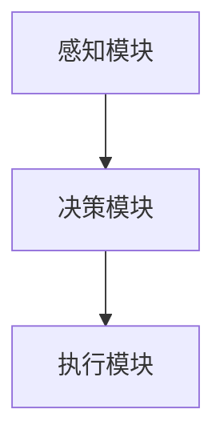
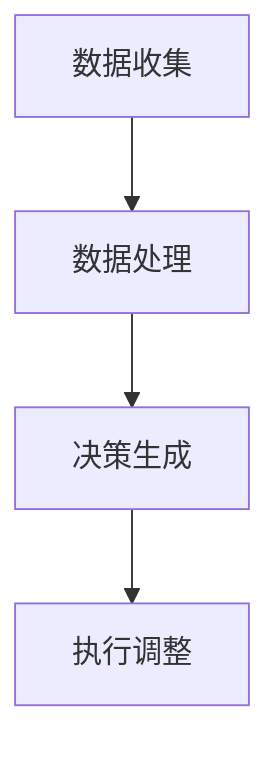
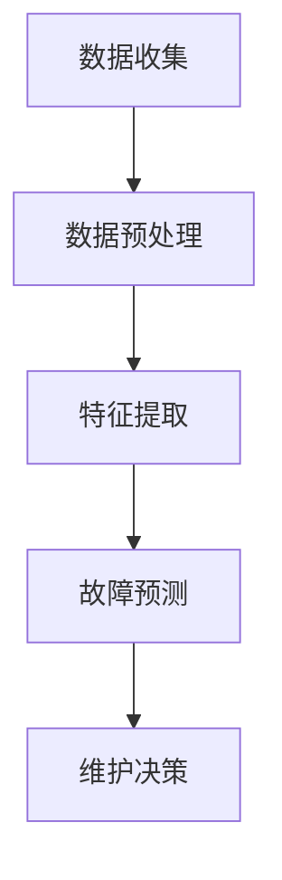
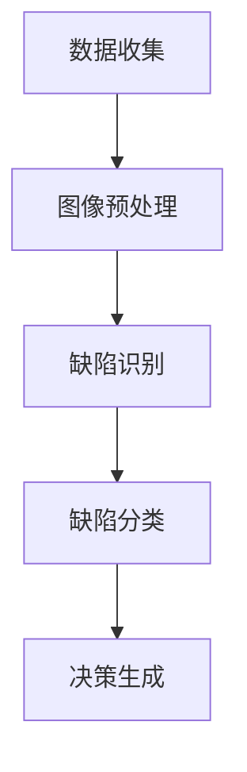

                 

## AI Agent在智能制造过程控制中的角色

### 关键词：
- AI Agent
- 智能制造
- 过程控制
- 机器学习
- 工业物联网

### 摘要：
本文旨在探讨AI Agent在智能制造过程控制中的应用及其重要性。通过分析AI Agent的定义、架构和关键概念，本文将深入探讨AI Agent在提高制造过程效率、准确性和可靠性方面的作用。文章还将讨论AI Agent的具体应用场景、实施策略和未来发展趋势，为智能制造领域的实践者和研究者提供有价值的参考。

### 1. 引言

#### 1.1 背景介绍

随着全球工业4.0的推进，智能制造已经成为制造业发展的重要方向。智能制造不仅包括自动化生产线的部署，还涉及大数据、物联网、云计算和人工智能等新兴技术的综合应用。在这些技术中，人工智能（AI）特别是AI Agent，正逐渐成为智能制造过程中的核心组件。

传统的制造过程主要依赖人工控制和预设程序，存在以下问题：

- **效率低下**：人工操作和手动调整占用了大量时间和资源，导致生产效率低下。
- **准确性差**：人为因素可能导致生产过程中的错误和缺陷，影响产品质量。
- **灵活性不足**：传统系统难以应对复杂、多变的制造环境，适应性差。

为了解决这些问题，AI Agent作为一种自主决策的智能体，能够在智能制造过程中提供以下潜在优势：

- **自动优化**：AI Agent可以通过学习和预测，自动调整生产参数，优化生产流程。
- **精准控制**：AI Agent能够精确监控生产过程，减少错误和缺陷，提高产品合格率。
- **实时响应**：AI Agent能够实时感知环境变化，快速作出响应，提高系统的灵活性。

#### 1.2 文章核心

本文将围绕以下核心问题展开讨论：

- **AI Agent的定义和基本原理**：介绍AI Agent的定义、基本架构和关键概念。
- **AI Agent在智能制造中的应用**：探讨AI Agent在过程控制、预测维护和质量控制等具体应用场景中的角色。
- **AI Agent的实现和实施策略**：分析AI Agent的实现方法、技术挑战和实施策略。
- **未来发展趋势**：展望AI Agent在智能制造中的未来发展和潜在研究方向。

通过本文的讨论，读者将了解到AI Agent在智能制造中的重要性及其应用潜力，为相关实践和研究提供参考。

### 2. AI Agent的定义和基本原理

#### 2.1 AI Agent的定义

AI Agent，即人工智能代理，是指具备自主性、适应性、反应性和主动性能力的计算机程序或实体。它能够感知环境，通过学习、推理和决策，采取行动以实现特定目标。在智能制造领域，AI Agent作为一种智能体，可以自主地参与生产过程，实时调整和优化生产参数，从而提高生产效率和产品质量。

AI Agent的基本特征包括：

- **自主性**：AI Agent能够独立地执行任务，无需人工干预。这种自主性使得AI Agent能够在复杂、多变的制造环境中进行实时决策。
- **适应性**：AI Agent能够根据环境变化进行调整和学习，从而适应不同的生产需求。这种适应性使得AI Agent能够在不同的制造场景中发挥作用。
- **反应性**：AI Agent能够实时感知环境变化，并迅速作出响应。这种反应性使得AI Agent能够在生产过程中及时调整，避免潜在的问题。
- **主动性**：AI Agent能够自主地采取行动，主动解决问题。这种主动性使得AI Agent能够在生产过程中发挥积极作用，提高生产效率。

#### 2.2 AI Agent的基本架构

AI Agent的基本架构通常包括以下几个关键组件：

- **感知模块**：感知模块负责收集和处理环境数据，包括温度、湿度、压力等传感器数据，以及生产过程的实时监控数据。
- **决策模块**：决策模块根据感知模块提供的数据，通过学习、推理和预测，制定相应的决策。决策模块的核心是机器学习算法，如深度学习、强化学习等。
- **执行模块**：执行模块负责将决策模块生成的决策付诸实施，包括调整生产参数、控制机器设备等。

图1展示了AI Agent的基本架构。

#### 2.3 AI Agent的核心概念

AI Agent的核心概念包括以下几个关键方面：

- **机器学习**：机器学习是AI Agent的核心技术之一，通过训练模型，使AI Agent能够从数据中学习并做出预测。常用的机器学习算法包括线性回归、决策树、神经网络等。
- **深度学习**：深度学习是一种特殊的机器学习技术，通过多层神经网络模型，对大量数据进行分析和预测。深度学习在图像识别、自然语言处理等领域具有广泛的应用。
- **强化学习**：强化学习是AI Agent的另一种核心技术，通过奖励机制，使AI Agent能够通过试错学习，不断优化其行为。强化学习在自动化控制、游戏AI等领域具有重要作用。

表1对比了机器学习、深度学习和强化学习的主要特点。

| 学习方式  | 特点                           | 应用场景                        |
| --------- | ------------------------------ | -------------------------------- |
| 机器学习  | 数据驱动，无需显式编程规则       | 数据分析、预测模型等             |
| 深度学习  | 使用多层神经网络，自动提取特征   | 图像识别、语音识别等             |
| 强化学习  | 通过试错和奖励机制进行学习       | 自动控制、游戏AI等               |

#### 2.4 AI Agent在智能制造中的应用

AI Agent在智能制造中的应用涵盖了多个方面，主要包括：

- **过程控制**：AI Agent可以通过实时监测生产过程，自动调整生产参数，优化生产流程。例如，在连续制造过程中，AI Agent可以实时调整温度、压力等参数，确保产品质量稳定。
- **预测维护**：AI Agent可以通过分析设备运行数据，预测设备故障，提前进行维护，减少设备停机时间，提高生产效率。
- **质量控制**：AI Agent可以实时检测产品质量，识别潜在问题，并采取措施进行纠正。例如，在制造过程中，AI Agent可以通过图像识别技术检测产品缺陷，并自动调整生产参数，确保产品质量。

通过AI Agent的应用，智能制造过程将变得更加智能、高效和可靠，从而推动制造业的数字化转型和升级。

### 3. AI Agent在智能制造中的应用

#### 3.1 AI Agent在过程控制中的应用

过程控制是智能制造的核心环节，AI Agent在这一领域的应用潜力巨大。通过实时感知生产过程中的各种参数，AI Agent能够自动调整生产条件，确保生产过程的高效和稳定。

**案例 1：连续制造过程的优化**

在连续制造过程中，如化工、食品和制药行业，生产过程的稳定性至关重要。AI Agent可以通过实时监测温度、压力、流量等参数，识别异常情况，并自动调整生产参数。例如，在一个化工生产过程中，AI Agent可以通过监测温度变化，自动调整加热器的功率，以保持反应过程的稳定。

**具体步骤：**

1. **数据收集**：AI Agent通过传感器网络收集生产过程中的关键参数数据。
2. **数据处理**：AI Agent使用机器学习算法对收集到的数据进行分析和处理，提取有用的信息。
3. **决策生成**：根据处理后的数据，AI Agent使用优化算法生成最优的调整策略。
4. **执行调整**：AI Agent通过执行模块，如PLC（可编程逻辑控制器），自动调整生产参数。

**数学模型和公式**：

为了生成最优的调整策略，AI Agent可以采用以下数学模型：

$$
\min_{x} f(x) \quad \text{subject to} \quad g(x) \leq 0
$$

其中，$f(x)$ 是目标函数，表示生产过程的关键指标（如温度、压力等）；$g(x)$ 是约束条件，表示生产过程的限制（如安全阈值等）。

**举例说明**：

假设在一个食品生产过程中，需要保持搅拌机的温度在 40°C 左右。AI Agent可以通过以下步骤进行优化：

1. **数据收集**：AI Agent通过传感器实时监测搅拌机的温度。
2. **数据处理**：AI Agent对温度数据进行处理，识别温度波动情况。
3. **决策生成**：AI Agent使用优化算法，根据温度波动情况，生成调整搅拌机加热功率的策略。
4. **执行调整**：AI Agent通过执行模块，自动调整搅拌机的加热功率，确保温度稳定在 40°C 左右。

**图表 1：AI Agent在过程控制中的数据流程**

#### 3.2 AI Agent在预测维护中的应用

预测维护是利用AI Agent对设备运行数据进行实时分析，预测潜在故障，提前进行维护，从而减少设备停机时间和维护成本。这种方法比传统的定期维护更高效，因为它可以在故障发生前进行预防性维护。

**案例 2：设备故障预测**

在一个汽车制造工厂中，设备如数控机床、机器人等是生产的核心。AI Agent可以通过分析这些设备的振动、温度、电流等数据，预测潜在故障。

**具体步骤：**

1. **数据收集**：AI Agent通过传感器收集设备运行数据。
2. **数据预处理**：AI Agent对数据进行预处理，如去噪、归一化等。
3. **特征提取**：AI Agent从预处理后的数据中提取关键特征，如振动频率、温度变化率等。
4. **故障预测**：AI Agent使用机器学习算法，如支持向量机（SVM）、随机森林（RF）等，对提取的特征进行故障预测。
5. **维护决策**：AI Agent根据故障预测结果，生成维护计划。

**数学模型和公式**：

故障预测的数学模型可以采用以下公式：

$$
P(\text{故障} | \text{特征集}) = \frac{P(\text{特征集} | \text{故障})P(\text{故障})}{P(\text{特征集})}
$$

其中，$P(\text{故障} | \text{特征集})$ 是给定特征集后发生故障的概率；$P(\text{特征集} | \text{故障})$ 是在故障发生时特征集的概率；$P(\text{故障})$ 是故障发生的先验概率；$P(\text{特征集})$ 是特征集的概率。

**举例说明**：

在一个数控机床中，AI Agent可以通过以下步骤进行故障预测：

1. **数据收集**：AI Agent通过传感器实时监测数控机床的振动和温度数据。
2. **数据预处理**：AI Agent对数据进行预处理，去除噪声。
3. **特征提取**：AI Agent提取振动频率和温度变化率等关键特征。
4. **故障预测**：AI Agent使用SVM算法，根据提取的特征，预测数控机床是否会发生故障。
5. **维护决策**：AI Agent根据故障预测结果，生成维护计划，提前更换可能发生故障的部件。

**图表 2：AI Agent在预测维护中的数据流程**

#### 3.3 AI Agent在质量控制中的应用

质量控制是保证产品一致性和符合标准的关键环节。AI Agent可以通过实时监控产品质量数据，识别潜在的缺陷，并提供优化建议，从而提高产品质量。

**案例 3：产品缺陷检测**

在一个电子产品制造过程中，AI Agent可以通过图像识别技术，实时检测产品的外观缺陷，如表面划痕、焊接不良等。

**具体步骤：**

1. **数据收集**：AI Agent通过摄像头或其他传感器收集产品图像。
2. **图像预处理**：AI Agent对图像进行预处理，如去噪、对比度增强等。
3. **缺陷识别**：AI Agent使用深度学习算法，对预处理后的图像进行分析，识别潜在的缺陷。
4. **缺陷分类**：AI Agent将识别出的缺陷进行分类，并提供优化建议。
5. **决策生成**：AI Agent根据缺陷分类结果，生成相应的质量控制策略。

**数学模型和公式**：

在缺陷识别过程中，AI Agent可以使用卷积神经网络（CNN）进行图像分类。CNN的基本公式如下：

$$
\text{激活函数}(\text{输出层}) = \text{激活函数}(\text{权重} \cdot \text{输入} + \text{偏置})
$$

**举例说明**：

在一个电子产品的生产线上，AI Agent可以通过以下步骤进行缺陷检测：

1. **数据收集**：AI Agent通过摄像头实时捕捉产品图像。
2. **图像预处理**：AI Agent对图像进行预处理，提高图像质量。
3. **缺陷识别**：AI Agent使用CNN算法，分析图像，识别潜在缺陷。
4. **缺陷分类**：AI Agent将识别出的缺陷分类为“合格”或“不合格”。
5. **决策生成**：AI Agent根据缺陷分类结果，生成优化建议，如调整焊接参数、更换不良材料等。

**图表 3：AI Agent在质量控制中的数据流程**

通过上述应用案例，可以看出AI Agent在智能制造中的广泛应用。AI Agent不仅能够提高生产过程的效率和质量，还能够通过实时监测和预测，减少设备故障和停机时间，从而实现智能制造的全面升级。

### 4. AI Agent的实现和实施策略

#### 4.1 实现方法

实现AI Agent的关键在于其感知、决策和执行模块的协同工作。以下介绍实现AI Agent的几个核心步骤：

**1. 感知模块的实现**

感知模块负责从环境中收集数据，这些数据包括温度、压力、湿度等传感器数据，以及生产线的实时监控数据。为了实现感知模块，通常需要以下步骤：

- **传感器选择和部署**：根据应用场景选择合适的传感器，并将其部署在生产线上。
- **数据采集和传输**：使用物联网（IoT）设备将传感器数据传输到中央处理单元。
- **数据预处理**：对采集到的数据进行清洗、去噪和归一化，以便后续处理。

**2. 决策模块的实现**

决策模块是AI Agent的核心，它通过机器学习算法对收集到的数据进行分析和预测，生成决策。实现决策模块的关键步骤包括：

- **算法选择**：根据应用场景选择合适的机器学习算法，如线性回归、决策树、神经网络等。
- **数据训练**：使用历史数据对机器学习模型进行训练，使其能够准确预测和分类。
- **模型评估和优化**：通过交叉验证和测试数据对模型进行评估和优化，提高模型的准确性。

**3. 执行模块的实现**

执行模块负责将决策模块生成的决策付诸实施，通常包括以下步骤：

- **接口设计**：设计AI Agent与其他设备和系统的接口，确保决策能够准确执行。
- **执行策略**：制定具体的执行策略，如调整温度、压力等参数。
- **反馈机制**：建立反馈机制，将执行结果返回给决策模块，以进行进一步的优化和调整。

**4. 集成和部署**

将感知、决策和执行模块集成在一起，形成一个完整的AI Agent系统。然后，将其部署在生产线上，进行实际应用和测试。部署过程中需要注意以下事项：

- **系统调试**：在部署前进行充分的系统调试，确保各个模块协同工作。
- **硬件选择**：选择合适的硬件平台，如PLC、嵌入式系统等，以支持AI Agent的运行。
- **安全性**：确保系统的数据安全和稳定性，防止恶意攻击和故障。

#### 4.2 实施策略

实施AI Agent需要考虑以下关键策略：

**1. 数据策略**

数据是AI Agent的核心资源，因此需要制定有效的数据策略：

- **数据采集**：确保收集到的数据全面、准确，涵盖生产过程的各个方面。
- **数据存储**：使用大数据平台进行数据存储和管理，确保数据的安全性和可扩展性。
- **数据共享**：建立数据共享机制，促进不同部门和团队之间的数据交流，提高整体数据利用率。

**2. 技术策略**

选择合适的技术是实现AI Agent的关键：

- **机器学习框架**：选择成熟的机器学习框架，如TensorFlow、PyTorch等，以简化开发过程。
- **硬件支持**：选择具有强大计算能力的硬件平台，如GPU、FPGA等，以提高数据处理和模型训练的速度。
- **系统集成**：确保AI Agent能够与现有的生产系统无缝集成，减少系统升级和改造的成本。

**3. 人员培训**

实施AI Agent需要具备一定技术能力的人员：

- **专业团队**：组建专业的AI Agent开发团队，包括数据科学家、软件工程师、硬件工程师等。
- **培训计划**：制定详细的培训计划，对团队成员进行机器学习、数据分析和系统集成等方面的培训。

**4. 项目管理**

实施AI Agent项目需要有效的项目管理：

- **项目规划**：制定详细的项目规划，明确项目的目标、范围、时间表和资源分配。
- **风险管理**：识别项目中的潜在风险，制定相应的风险应对策略。
- **质量控制**：建立严格的质量控制机制，确保项目按照既定的标准和质量要求进行。

通过以上策略的实施，可以确保AI Agent在智能制造中的顺利应用和高效运行。

### 5. AI Agent的未来发展趋势和潜在研究方向

#### 5.1 未来发展趋势

随着人工智能技术的不断进步，AI Agent在智能制造中的应用前景将更加广阔。以下是AI Agent未来发展的几个主要趋势：

**1. 多智能体系统的应用**

未来的智能制造将不再局限于单个AI Agent的应用，而是多个AI Agent协同工作的多智能体系统。通过多智能体系统，可以实现更复杂、更灵活的生产控制和优化。例如，多个AI Agent可以同时监控不同的生产环节，实现全局优化。

**2. 边缘计算的结合**

边缘计算可以将AI Agent的决策和分析能力延伸到生产设备的边缘，从而减少数据传输延迟，提高系统的实时性和响应速度。边缘计算与AI Agent的结合，将使生产过程更加智能化和自动化。

**3. 随着物联网（IoT）的发展，AI Agent的应用范围将进一步扩大**

物联网设备的普及将使得更多的生产数据可以被收集和分析，从而为AI Agent提供更丰富的数据资源。AI Agent可以利用这些数据，实现更精准的预测和优化。

#### 5.2 潜在研究方向

AI Agent在智能制造中的应用还有许多潜在的研究方向，以下列举几个值得关注的领域：

**1. 深度强化学习在过程控制中的应用**

深度强化学习（DRL）结合了深度学习和强化学习的技术，可以用于复杂的动态过程控制。未来的研究可以探索如何将DRL应用于智能制造中的实时优化和故障预测。

**2. 可解释性AI Agent的开发**

虽然AI Agent在智能制造中表现出色，但其“黑箱”性质使得其决策过程难以解释。未来的研究可以关注可解释性AI Agent的开发，使其决策过程更加透明，便于工程师进行调试和优化。

**3. 数据隐私和安全性的保障**

在物联网环境下，大量的生产数据会被收集和分析。如何保障这些数据的安全性和隐私性，是未来研究的重要课题。未来的研究可以探索如何设计安全、可靠的AI Agent系统。

**4. AI Agent在定制化生产中的应用**

随着消费者需求的多样化，定制化生产将成为智能制造的重要趋势。AI Agent可以应用于定制化生产中的需求分析、生产规划和资源调度，实现高效、灵活的生产。

通过上述发展趋势和研究方向的研究，AI Agent在智能制造中的应用将更加成熟和广泛，为制造业的数字化转型提供强有力的支持。

### 总结与展望

本文系统地探讨了AI Agent在智能制造过程控制中的角色和重要性。首先，我们介绍了AI Agent的定义和基本原理，阐述了其自主性、适应性、反应性和主动性等关键特征。接着，通过具体案例，展示了AI Agent在过程控制、预测维护和质量控制中的应用，详细说明了实现AI Agent的方法和策略。最后，我们对AI Agent的未来发展趋势和潜在研究方向进行了展望，强调了其在智能制造中的广泛应用前景。

AI Agent的引入不仅能够提高生产效率、准确性和灵活性，还能通过实时监控和预测，减少设备故障和停机时间，从而实现智能制造的全面升级。未来的研究应重点关注多智能体系统、边缘计算、数据隐私保护等方面，以进一步推动AI Agent在智能制造中的应用和发展。

对于读者来说，本文提供了深入理解和应用AI Agent的框架和方法，有助于推动智能制造领域的创新和实践。希望本文能为相关领域的实践者和研究者提供有价值的参考。

### 作者信息

作者：AI天才研究院（AI Genius Institute）& 禅与计算机程序设计艺术（Zen And The Art of Computer Programming）

AI天才研究院专注于人工智能前沿技术的研发和应用，致力于推动智能制造和工业自动化的发展。同时，研究院还致力于培养新一代人工智能领域的杰出人才。禅与计算机程序设计艺术则以其独特的方法论，为程序员和开发者提供了深刻的技术洞察和编程哲学。两位作者的共同目标是通过技术创新和智慧实践，推动人工智能和计算机科学领域的进步。希望本文能为大家带来启发和思考，共同探索智能制造的未来。

