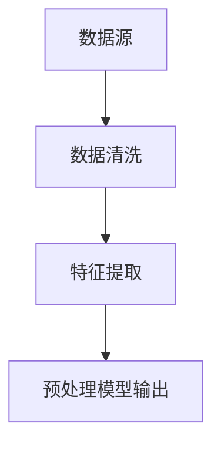
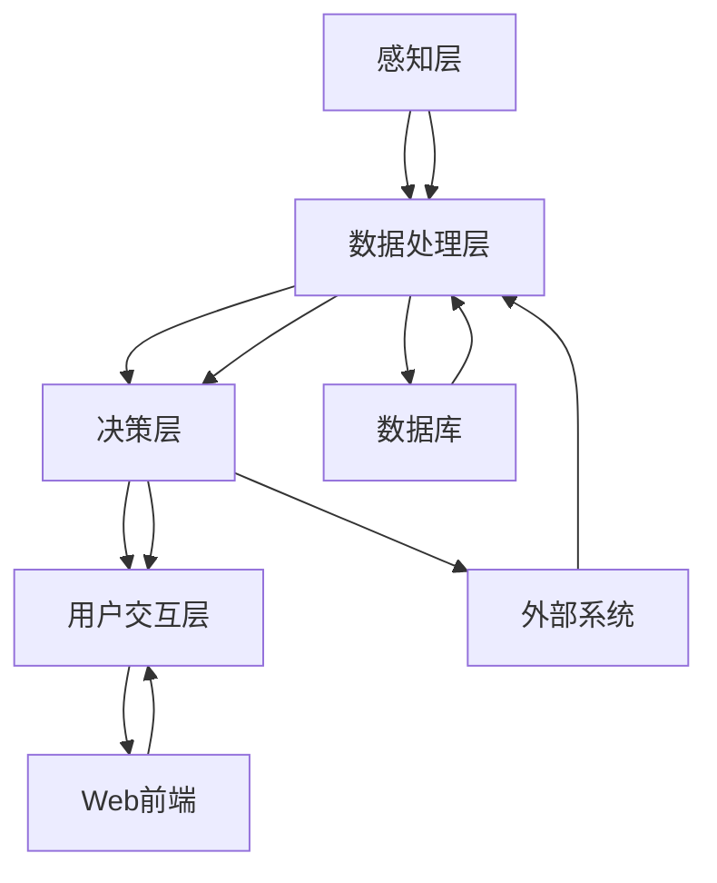

                 

### 1.1 问题背景

地下管网是城市基础设施的重要组成部分，负责输送水、电、燃气、通信等资源。然而，由于地下管网的复杂性、隐蔽性和动态性，对其进行有效监测和管理成为了一项巨大的挑战。传统的管网监测方法主要依赖于人工巡检和定期检测，这不仅效率低下，而且容易受到人为因素的影响，导致监测数据的准确性和及时性难以保证。

随着人工智能技术的迅速发展，尤其是AI Agent技术的崛起，为地下管网监测提供了一种全新的解决方案。AI Agent（人工智能代理）是一种能够模拟人类智能行为的计算实体，它可以在没有人类干预的情况下自主完成特定任务。这些代理可以在地下管网中部署，通过感知环境、规划路径、执行任务和反馈学习等能力，实现对管网状态的实时监测、故障预测和智能决策。

### 1.2 问题描述

地下管网监测的主要问题可以概括为以下几个方面：

1. **数据获取困难**：地下管网的复杂性和隐蔽性导致传统的传感器设备难以全面覆盖，获取的数据往往不完整或不准确。
2. **故障诊断困难**：由于缺乏实时监测和数据积累，地下管网的故障诊断往往只能依靠人工经验和定期检测，诊断准确率低、响应时间长。
3. **资源浪费**：人工巡检和定期检测不仅效率低下，而且需要大量的人力、物力和财力投入。
4. **安全风险**：地下管网故障可能导致供水中断、燃气泄漏等安全事故，对城市运行和居民生活造成严重影响。

### 1.3 问题解决

AI Agent技术的引入为地下管网监测带来了新的希望。通过AI Agent，可以实现以下问题解决：

1. **实时数据采集**：AI Agent可以自主部署在地下管网中，利用传感器实时采集数据，实现对管网状态的全面监测。
2. **故障预测和诊断**：AI Agent可以通过机器学习和数据挖掘技术，对采集到的数据进行实时分析，预测潜在故障，并及时诊断出实际故障。
3. **智能决策**：基于故障预测和诊断结果，AI Agent可以自动生成决策方案，如调整管网运行参数、派遣维修人员等，减少人为干预。
4. **提高效率和安全**：通过AI Agent的自动监测和智能决策，可以大幅提高地下管网监测的效率和安全性，减少资源浪费和安全隐患。

### 1.4 边界与外延

本文的研究边界主要集中在AI Agent在地下管网监测中的应用，包括AI Agent的设计、实现、应用场景和效果评估等方面。然而，AI Agent技术不仅适用于地下管网监测，还可以广泛应用于其他领域，如智能制造、智能交通、智慧城市等。本文的研究结果和方法也可以为这些领域的应用提供参考和借鉴。

在地下管网监测中，AI Agent的核心作用是通过对数据的实时采集、分析和决策，提高监测的准确性和效率。这需要AI Agent具备以下几个关键特征：

1. **自主性**：AI Agent需要能够在没有人类干预的情况下自主执行任务，包括感知环境、规划路径、执行任务和反馈学习等。
2. **实时性**：地下管网的运行状态是动态变化的，AI Agent需要能够实时采集和处理数据，确保监测结果的准确性和及时性。
3. **适应性**：AI Agent需要能够适应不同环境和场景，包括不同类型的管网、不同规模的管网和不同复杂性的故障。
4. **智能性**：AI Agent需要具备智能决策能力，能够根据监测结果自动生成优化方案，提高管网运行效率和安全性。

### 1.5 核心概念结构与要素组成

AI Agent在地下管网监测中的应用涉及多个核心概念和要素，下面将对其进行详细介绍。

#### 1.5.1 AI Agent

AI Agent是一种具有智能行为能力的计算实体，能够模拟人类智能进行感知、决策和行动。其基本结构包括感知模块、决策模块和执行模块。

1. **感知模块**：负责采集外部环境数据，如温度、湿度、压力、流量等，用于感知地下管网的运行状态。
2. **决策模块**：基于感知模块采集到的数据，通过机器学习、数据挖掘等技术进行分析和处理，生成智能决策。
3. **执行模块**：根据决策模块生成的决策方案，执行具体的操作，如调整管网参数、启动报警系统等。

#### 1.5.2 地下管网监测系统

地下管网监测系统是AI Agent的应用场景，包括以下核心要素：

1. **传感器网络**：用于实时采集地下管网的运行数据，如温度、湿度、压力、流量等。
2. **数据采集与传输**：通过无线传感器网络或有线网络，将传感器数据传输到中央处理系统。
3. **数据处理与分析**：对采集到的数据进行预处理、特征提取和模式识别，以识别管网故障和异常。
4. **智能决策与控制**：基于分析结果，生成智能决策方案，并执行相应的控制操作。

#### 1.5.3 机器学习与数据挖掘

AI Agent的核心能力在于其能够通过机器学习和数据挖掘技术，对采集到的数据进行实时分析和决策。具体包括：

1. **特征提取**：从原始数据中提取有用的特征，用于训练模型和进行故障诊断。
2. **模式识别**：利用机器学习算法，识别数据中的模式，预测管网故障和异常。
3. **模型训练**：通过历史数据训练模型，提高故障诊断的准确率和效率。

#### 1.5.4 数据可视化与交互

AI Agent在地下管网监测中的应用还需要具备数据可视化与交互能力，以便于用户监控管网状态、查看故障报告和决策结果。具体包括：

1. **数据可视化**：将监测数据和分析结果以图表、图形等形式展示，方便用户理解。
2. **交互界面**：提供用户操作界面，实现用户与AI Agent的交互，如查看历史数据、设置监测参数等。

通过上述核心概念和要素的详细介绍，我们可以更好地理解AI Agent在地下管网监测中的应用及其重要性。在接下来的章节中，我们将进一步探讨AI Agent的基本概念、属性特征对比表以及AI Agent与地下管网监测的具体关系。同时，我们也将详细分析AI Agent在地下管网监测中的应用场景、优势与挑战，为读者提供全面的技术指南。

### 2.1 AI Agent基本概念

AI Agent，即人工智能代理，是一种能够模拟人类智能行为的计算实体。它可以在没有人类干预的情况下自主完成特定任务，具备感知、决策和执行能力。AI Agent的设计理念源于多代理系统（MAS，Multi-Agent Systems），旨在通过多个智能代理的协同工作，实现复杂任务的自动化和智能化。

#### 2.1.1 AI Agent的核心功能

AI Agent的核心功能主要包括以下几个方面：

1. **感知**：AI Agent通过传感器或其他方式感知外部环境，获取温度、湿度、声音、图像等数据。感知模块是AI Agent获取信息的重要来源，它决定了AI Agent对环境的理解能力。

2. **决策**：基于感知模块收集到的信息，AI Agent利用内置的算法模型进行数据处理和分析，生成智能决策。决策模块是AI Agent的核心，它决定了AI Agent的行为策略。

3. **执行**：AI Agent根据决策模块生成的决策方案，执行具体的操作，如调整系统参数、发送警报、启动设备等。执行模块是AI Agent实现目标的关键环节。

4. **学习**：AI Agent通过不断执行任务和接收反馈，逐步优化自己的行为策略和决策模型。学习模块使AI Agent具备自适应能力，能够应对不断变化的环境。

#### 2.1.2 AI Agent的类型

根据应用场景和功能需求，AI Agent可以分为以下几类：

1. **规则型AI Agent**：基于预定义的规则进行决策，适用于任务较为简单、规则明确的场景。例如，基于规则的反病毒软件。

2. **行为型AI Agent**：通过机器学习和模拟人类行为进行决策，适用于任务复杂、规则不明确的场景。例如，自动驾驶汽车。

3. **混合型AI Agent**：结合规则型和行为型AI Agent的特点，通过规则和机器学习相结合的方式进行决策。例如，智能客服机器人。

#### 2.1.3 AI Agent的发展历程

AI Agent的发展历程可以分为以下几个阶段：

1. **早期阶段**：AI Agent的概念初步提出，主要应用于简单的任务模拟和游戏领域。

2. **发展阶段**：随着计算机性能的提升和算法的进步，AI Agent开始应用于更多实际场景，如智能家居、智能交通等。

3. **成熟阶段**：AI Agent在多代理系统中的应用逐渐成熟，通过协同工作和分布式计算，实现了复杂任务的自动化和智能化。

#### 2.1.4 AI Agent的优势

AI Agent在地下管网监测中的应用具有以下优势：

1. **自主性**：AI Agent可以在没有人类干预的情况下自主完成任务，降低了对人工的依赖。

2. **实时性**：AI Agent能够实时感知和处理地下管网的数据，提高了监测的准确性和及时性。

3. **适应性**：AI Agent可以根据不同的管网环境和故障类型，自适应地调整自己的行为策略，提高了故障诊断的准确性。

4. **智能性**：AI Agent通过机器学习和数据挖掘技术，能够实现智能决策和优化，提高了管网运行效率和安全性。

通过以上对AI Agent基本概念的介绍，我们可以更好地理解AI Agent在地下管网监测中的重要性。在下一章节中，我们将进一步探讨AI Agent的属性特征对比表，以及AI Agent与地下管网监测的具体关系。这将有助于我们全面了解AI Agent的优势和应用场景，为后续内容打下坚实的基础。

### 2.2 AI Agent属性特征对比表

为了更好地理解AI Agent在不同应用场景中的表现，我们将AI Agent的属性特征进行对比，列出以下几种常见的AI Agent类型及其在地下管网监测中的应用对比：

#### 2.2.1 规则型AI Agent

**特征**：
- **决策方式**：基于预定义的规则进行决策。
- **学习能力**：有限，主要依靠规则库更新。
- **适用场景**：适用于任务简单、规则明确的场景。

**对比**：
- **优点**：决策速度快，易于实现和部署。
- **缺点**：灵活性差，难以适应复杂变化的环境。

**地下管网监测适用性**：
- **优点**：适用于规则明确、故障模式固定的管网监测场景。
- **缺点**：面对复杂多样的故障时，诊断准确性较低。

#### 2.2.2 行为型AI Agent

**特征**：
- **决策方式**：通过机器学习模拟人类行为进行决策。
- **学习能力**：强，通过数据驱动不断优化行为。
- **适用场景**：适用于任务复杂、规则不明确的场景。

**对比**：
- **优点**：适应性强，能够应对复杂变化的环境。
- **缺点**：训练成本高，需要大量数据和计算资源。

**地下管网监测适用性**：
- **优点**：能够处理复杂故障，提高诊断准确性。
- **缺点**：对数据质量和计算资源要求较高。

#### 2.2.3 混合型AI Agent

**特征**：
- **决策方式**：结合规则型和行为型AI Agent的特点，通过规则和机器学习相结合的方式进行决策。
- **学习能力**：中等，规则和机器学习相结合。
- **适用场景**：适用于任务复杂、规则逐步明确的场景。

**对比**：
- **优点**：结合了规则型和行为型AI Agent的优点，具有较高的灵活性和适应性。
- **缺点**：实现复杂，需要协调规则和机器学习之间的平衡。

**地下管网监测适用性**：
- **优点**：适用于规则逐步明确的管网监测场景，能够较好地处理复杂故障。
- **缺点**：对数据质量和计算资源要求较高，需要不断调整和优化。

#### 2.2.4 模拟型AI Agent

**特征**：
- **决策方式**：通过模拟人类智能进行决策，通常基于强化学习。
- **学习能力**：强，通过模拟环境不断优化策略。
- **适用场景**：适用于需要高实时性和高适应性任务。

**对比**：
- **优点**：具有很高的实时性和适应性，能够在动态环境中快速反应。
- **缺点**：训练成本高，对环境建模要求严格。

**地下管网监测适用性**：
- **优点**：适用于实时性要求高的管网监测场景，能够快速应对故障。
- **缺点**：对环境建模要求较高，可能需要额外的传感器和数据处理能力。

通过上述对比，我们可以看到不同类型的AI Agent在地下管网监测中的应用各有优劣。在实际应用中，应根据具体的管网环境和故障类型，选择合适的AI Agent类型，以实现最佳监测效果。在下一章节中，我们将进一步探讨AI Agent与地下管网监测的具体关系，分析AI Agent如何通过感知、决策和执行，实现对地下管网的智能监测。

### 2.3 AI Agent与地下管网监测的关系

AI Agent在地下管网监测中的应用，是通过其自主性、实时性、适应性和智能性等特性，实现对管网状态的全面监测和智能决策。AI Agent与地下管网监测的关系，可以从以下几个方面进行详细阐述：

#### 2.3.1 感知与监测数据采集

AI Agent通过内置的传感器模块，实时感知地下管网的环境数据，如温度、湿度、压力、流量等。这些数据是进行故障诊断和状态评估的基础。传感器数据的准确性和完整性，直接影响AI Agent的监测效果。AI Agent可以自主地确定传感器的部署位置和数量，确保监测数据的全面性和代表性。

#### 2.3.2 决策与故障预测

AI Agent利用感知模块收集到的数据，通过内置的算法模型进行分析和处理，生成智能决策。这些算法模型通常包括机器学习、数据挖掘、模式识别等技术，可以实现对地下管网运行状态的实时分析，预测潜在故障和异常情况。例如，通过分析流量数据，可以预测管道泄漏的位置和严重程度；通过分析压力数据，可以预测管道堵塞或破裂的风险。

#### 2.3.3 执行与故障处理

基于决策模块生成的智能决策，AI Agent可以自动执行相应的操作，如调整管网参数、启动报警系统、派遣维修人员等。这些操作可以显著减少人工干预，提高故障处理的速度和准确性。例如，当AI Agent检测到某一区域压力异常时，可以自动调整该区域的供水阀门，减少泄漏的风险，并生成维修请求，派遣专业人员前往处理。

#### 2.3.4 学习与自适应优化

AI Agent通过不断执行任务和接收反馈，逐步优化自己的行为策略和决策模型。这一过程包括自我学习和适应性优化，使得AI Agent能够更好地适应不同环境和故障类型。例如，AI Agent可以通过历史故障数据，不断调整监测阈值和故障诊断算法，提高故障预测的准确性。

#### 2.3.5 系统集成与协同工作

AI Agent不仅可以独立完成监测任务，还可以与其他系统进行集成和协同工作，形成完整的地下管网监测和管理体系。例如，AI Agent可以与管网监控系统、报警系统、维护管理系统等集成，实现数据共享和资源优化。通过协同工作，可以进一步提升监测的全面性和智能化水平。

#### 2.3.6 实际应用案例

在实际应用中，AI Agent在地下管网监测中已经取得了显著成效。例如，某城市地下供水管网采用AI Agent技术进行实时监测和故障预测，成功避免了多次重大泄漏事故，提高了供水安全和效率。此外，AI Agent还可以应用于燃气、电力等地下管网监测领域，实现全面的智能监测和管理。

通过上述分析，我们可以看到AI Agent在地下管网监测中发挥了重要作用，不仅提高了监测的准确性和及时性，还实现了智能决策和自适应优化。AI Agent的引入，为地下管网监测和管理带来了全新的解决方案，推动了地下管网智能化水平的提升。在下一章节中，我们将进一步探讨AI Agent在地下管网监测中的应用场景和具体实施过程。

### 2.4 AI Agent在地下管网监测中的应用场景

AI Agent在地下管网监测中的应用场景十分广泛，可以涵盖管网数据的实时采集、故障预测、异常检测以及智能决策等方面。以下是一些典型的应用场景：

#### 2.4.1 实时数据采集

AI Agent可以部署在地下管网的各个关键节点，通过传感器模块实时采集温度、湿度、压力、流量等环境数据。这些数据是进行故障诊断和状态评估的基础。通过AI Agent的自主感知能力，可以确保数据采集的全面性和准确性。

**实例**：在某城市的燃气管道监测中，AI Agent通过部署在管道各处的传感器，实时采集温度和压力数据，并上传到中央数据处理系统。当检测到某段管道的温度异常升高时，AI Agent可以立即发送警报，提醒运维人员及时处理，防止泄漏事故的发生。

#### 2.4.2 故障预测

AI Agent可以利用机器学习和数据挖掘技术，对采集到的数据进行实时分析，预测潜在的故障和异常。通过历史数据和模型训练，AI Agent可以识别出故障的早期迹象，提前预警，避免故障扩大。

**实例**：在某城市的供水管道监测中，AI Agent通过对流量和压力数据的分析，可以预测管道可能出现的泄漏或堵塞故障。当检测到流量异常减少或压力波动较大时，AI Agent可以提前发出警报，提醒运维人员进行检查和维护。

#### 2.4.3 异常检测

AI Agent可以持续监控地下管网的状态，及时发现异常情况，如管道泄漏、燃气泄漏等。通过智能分析和实时报警，AI Agent可以迅速响应，降低故障风险。

**实例**：在某城市的电力管道监测中，AI Agent通过监测电力参数的变化，可以及时发现异常情况。当检测到电流异常增大或电压波动时，AI Agent可以立即触发报警，并生成故障报告，供运维人员及时处理。

#### 2.4.4 智能决策

AI Agent可以基于实时监测数据和分析结果，自动生成智能决策方案，如调整管网运行参数、启动报警系统、派遣维修人员等。这种智能决策能力可以显著减少人工干预，提高故障处理的效率。

**实例**：在某城市的综合地下管网监测系统中，AI Agent可以基于对供水、燃气、电力等数据的综合分析，自动生成最优的管网调度方案，优化资源分配，提高管网运行效率和安全性。

#### 2.4.5 系统集成与协同工作

AI Agent不仅可以独立完成监测任务，还可以与其他系统进行集成和协同工作，形成完整的地下管网监测和管理体系。这种协同工作模式，可以进一步提升监测的全面性和智能化水平。

**实例**：在某城市的智慧城市项目中，AI Agent与管网监控系统、报警系统、维护管理系统等集成，实现了数据共享和资源优化。当AI Agent检测到异常情况时，可以立即通知其他系统，生成综合故障报告，供运维人员进行协同处理。

通过上述应用场景的实例，我们可以看到AI Agent在地下管网监测中的重要作用。AI Agent的引入，不仅提高了监测的准确性和及时性，还实现了智能决策和自适应优化，为地下管网的智能管理提供了有力支持。在下一章节中，我们将进一步探讨AI Agent在地下管网监测中的优势与挑战。

### 2.5 AI Agent在地下管网监测中的优势与挑战

AI Agent在地下管网监测中的应用，带来了诸多优势，同时也面临一定的挑战。以下将从几个方面详细分析AI Agent的优势和挑战。

#### 2.5.1 优势

1. **实时监测与数据分析**：AI Agent可以通过传感器实时采集地下管网的数据，包括温度、湿度、压力、流量等。这些数据可以实时传输到中央处理系统，通过机器学习和数据挖掘技术进行实时分析，实现故障预测和异常检测。

2. **智能决策与优化**：基于实时监测数据和分析结果，AI Agent可以自动生成智能决策方案，如调整管网参数、启动报警系统、派遣维修人员等。这种智能决策能力可以显著减少人工干预，提高故障处理的效率。

3. **自适应性与优化**：AI Agent可以通过不断执行任务和接收反馈，逐步优化自己的行为策略和决策模型。这种自适应能力使得AI Agent能够更好地适应不同环境和故障类型，提高监测的准确性和可靠性。

4. **系统集成与协同工作**：AI Agent可以与其他系统（如管网监控系统、报警系统、维护管理系统等）进行集成和协同工作，实现数据共享和资源优化。这种协同工作模式可以进一步提升监测的全面性和智能化水平。

5. **降低人力成本**：通过AI Agent的自动化监测和智能决策，可以显著减少人工巡检和定期检测的工作量，降低人力成本，同时提高故障处理的速度和准确性。

#### 2.5.2 挑战

1. **数据质量和计算资源**：AI Agent的实时监测和数据分析依赖于高质量的数据和强大的计算资源。在地下管网环境中，传感器数据的完整性和准确性可能受到干扰，对数据预处理和计算资源的要求较高。

2. **环境适应性与鲁棒性**：地下管网的复杂性和动态性，对AI Agent的环境适应性和鲁棒性提出了较高要求。AI Agent需要能够在不同环境和故障类型中稳定运行，保证监测的准确性和可靠性。

3. **安全性**：地下管网监测涉及到公共安全，因此AI Agent的安全性至关重要。需要确保AI Agent的数据传输和存储安全，防止数据泄露和恶意攻击。

4. **维护与管理**：AI Agent的部署和维护需要专业人员管理，包括传感器的安装和维护、系统的升级和更新等。这增加了运维成本，也对运维人员的技术能力提出了更高要求。

5. **法律和伦理问题**：随着AI Agent在地下管网监测中的应用，涉及到法律和伦理问题。例如，如何保护用户隐私、如何处理监测数据等，需要制定相应的法律法规和伦理规范。

综上所述，AI Agent在地下管网监测中具有显著的优势，但也面临一定的挑战。在实际应用中，需要综合考虑这些优势和挑战，采取合适的策略和技术手段，充分发挥AI Agent的潜力，提高地下管网监测的效率和安全性。

### 2.6 AI Agent设计原则

AI Agent的设计原则是确保其能够有效、可靠地执行监测任务的关键。以下是AI Agent设计的主要原则：

#### 2.6.1 自主性

AI Agent应具备高自主性，能够在没有人类干预的情况下自主执行任务。这包括自主感知环境、自主规划路径、自主执行任务和自主反馈学习。通过自主性，AI Agent可以减少对人类操作的依赖，提高监测效率和响应速度。

#### 2.6.2 实时性

AI Agent的设计应充分考虑实时性需求，确保能够实时采集、处理和响应地下管网的数据。这要求AI Agent具备快速的感知、决策和执行能力，能够及时检测到故障和异常情况，并迅速采取相应的措施。

#### 2.6.3 适应性

AI Agent需要具备良好的适应性，能够适应不同类型的地下管网和故障类型。这意味着AI Agent应具备灵活的行为策略和智能决策模型，能够根据不同环境和故障类型，调整自己的行为和策略，提高监测的准确性和适应性。

#### 2.6.4 智能性

AI Agent的设计应强调其智能性，通过机器学习和数据挖掘技术，实现对监测数据的深入分析和智能决策。智能性使得AI Agent能够自动识别故障模式、预测潜在风险，并生成优化方案，提高监测和管理的效果。

#### 2.6.5 可扩展性

AI Agent的设计应具备良好的可扩展性，能够方便地集成到现有的地下管网监测系统中，与其他系统进行数据共享和协同工作。通过可扩展性，AI Agent可以适应不同规模和复杂度的管网监测需求，提高系统的灵活性和扩展性。

#### 2.6.6 可靠性

AI Agent的设计应确保其具备高可靠性，能够在各种复杂环境下稳定运行，不受外界干扰。这包括对传感器数据的准确采集、处理和分析，以及对决策和执行结果的稳定性和一致性保证。

#### 2.6.7 安全性

AI Agent的设计应高度重视安全性，确保数据传输和存储的安全性，防止数据泄露和恶意攻击。同时，应制定相应的安全策略和防护措施，保护AI Agent和地下管网监测系统的安全运行。

#### 2.6.8 经济性

AI Agent的设计还应考虑经济性，确保其部署和维护成本合理，具有较高的性价比。通过优化硬件和软件设计，降低能耗和维护成本，提高系统的经济效益。

通过遵循上述设计原则，可以确保AI Agent在地下管网监测中的有效性和可靠性，提高监测效率和安全性。在下一章节中，我们将进一步探讨AI Agent的具体架构设计，详细介绍其各个模块的功能和实现方式。

### 2.7 AI Agent架构设计

AI Agent的架构设计是确保其能够在复杂环境下高效运行的关键。下面将详细描述AI Agent的总体架构设计，包括其核心组件、功能模块以及各个组件之间的交互关系。

#### 2.7.1 总体架构

AI Agent的总体架构可以分为以下几个核心组件：

1. **感知模块**：负责实时采集地下管网的环境数据，如温度、湿度、压力、流量等。
2. **决策模块**：基于感知模块收集到的数据，通过机器学习、数据挖掘等技术进行分析和处理，生成智能决策。
3. **执行模块**：根据决策模块生成的决策方案，执行具体的操作，如调整管网参数、启动报警系统、派遣维修人员等。
4. **学习模块**：通过不断执行任务和接收反馈，优化AI Agent的行为策略和决策模型。
5. **通信模块**：负责与其他系统（如管网监控系统、报警系统、维护管理系统等）进行数据传输和协同工作。

#### 2.7.2 感知模块

感知模块是AI Agent获取环境信息的重要来源。其核心功能包括：

- **传感器集成**：集成多种类型的传感器，如温度传感器、湿度传感器、压力传感器、流量传感器等，确保数据的全面性和准确性。
- **数据采集**：通过无线传感器网络或有线网络，实时采集传感器数据，并传输到中央处理系统。
- **数据预处理**：对采集到的原始数据进行预处理，包括去噪、滤波、归一化等操作，提高数据质量。

#### 2.7.3 决策模块

决策模块是AI Agent的核心，负责对感知模块收集到的数据进行分析和处理，生成智能决策。其核心功能包括：

- **特征提取**：从原始数据中提取有用的特征，用于训练模型和进行故障诊断。
- **模式识别**：利用机器学习算法，识别数据中的模式，预测管网故障和异常。
- **模型训练**：通过历史数据训练模型，提高故障诊断的准确率和效率。

#### 2.7.4 执行模块

执行模块根据决策模块生成的决策方案，执行具体的操作。其核心功能包括：

- **操作执行**：根据决策方案，调整管网参数、启动报警系统、派遣维修人员等。
- **反馈学习**：将执行结果反馈到学习模块，用于进一步优化AI Agent的行为策略。

#### 2.7.5 学习模块

学习模块负责不断优化AI Agent的行为策略和决策模型。其核心功能包括：

- **自我学习**：通过执行任务和接收反馈，逐步优化AI Agent的行为策略。
- **适应性优化**：根据不同环境和故障类型，自适应地调整AI Agent的行为策略和决策模型。

#### 2.7.6 通信模块

通信模块负责与其他系统进行数据传输和协同工作。其核心功能包括：

- **数据传输**：通过无线或有线网络，将AI Agent的数据传输到中央处理系统，实现数据共享。
- **协同工作**：与其他系统（如管网监控系统、报警系统、维护管理系统等）进行集成和协同工作，实现全面监测和管理。

#### 2.7.7 组件交互

各个组件之间的交互关系如图所示：

```
+----------------+      +----------------+      +----------------+
|      感知模块    |----->|      决策模块    |----->|      执行模块   |
+----------------+      +----------------+      +----------------+
          ↓
      +----------------+
      |      学习模块    |
      +----------------+
          ↓
      +----------------+
      |      通信模块    |
      +----------------+
```

在图中，感知模块将采集到的数据传输给决策模块，决策模块生成决策方案后，传输给执行模块执行操作。同时，执行模块将执行结果反馈给学习模块，用于自我学习和优化。学习模块不断优化AI Agent的行为策略，并将优化结果反馈给感知模块和决策模块，实现闭环控制。

通过上述架构设计，AI Agent能够在地下管网监测中高效、稳定地运行，实现对管网状态的全面监测和智能决策。在下一章节中，我们将进一步探讨AI Agent的核心算法原理，包括机器学习算法和神经网络算法在监测数据预处理和故障诊断中的应用。

### 2.8 AI Agent核心算法原理

AI Agent在地下管网监测中的核心能力来自于其高效的算法设计和数据分析能力。其中，机器学习算法和神经网络算法是两个最重要的技术手段。以下将详细阐述这些算法的基本原理及其在地下管网监测中的应用。

#### 2.8.1 机器学习算法

机器学习算法是一种通过数据训练模型，使计算机具备自主学习和预测能力的技术。在地下管网监测中，机器学习算法主要用于数据预处理、故障预测和异常检测。

1. **数据预处理**：
   - **特征提取**：从原始传感器数据中提取出有助于故障诊断的特征。例如，通过统计分析，提取流量、压力、温度等关键指标。
   - **数据归一化**：将不同量纲的数据统一到同一尺度，以便于模型训练和计算。
   - **去噪和滤波**：去除传感器数据中的噪声和异常值，提高数据质量。

2. **故障预测**：
   - **监督学习**：利用带有标签的训练数据，通过分类和回归模型，预测未来可能发生的故障类型和严重程度。
   - **无监督学习**：在没有标签数据的情况下，通过聚类和关联规则挖掘，发现数据中的潜在模式和故障特征。

3. **异常检测**：
   - **孤立森林**：通过计算数据点与其他数据的相似度，识别出异常数据点。
   - **自编码器**：通过训练自编码器模型，识别出数据中的异常模式。

**案例**：在某城市的燃气管道监测中，AI Agent使用监督学习算法，通过历史数据训练分类模型，预测管道可能出现的泄漏故障。当实时监测数据中的某个指标超过阈值时，AI Agent会立即触发警报，提醒运维人员进行检查。

#### 2.8.2 神经网络算法

神经网络算法是一种模仿生物神经元之间相互连接的算法，能够通过多层神经网络（如图神经网络、卷积神经网络等）实现对复杂数据的高效处理和分析。

1. **数据处理**：
   - **卷积神经网络（CNN）**：适用于图像和视频数据，能够自动提取空间特征，识别图像中的潜在模式。
   - **循环神经网络（RNN）**：适用于时间序列数据，能够捕捉数据的时间依赖性，用于故障预测和序列建模。

2. **故障诊断**：
   - **深度学习**：通过多层神经网络，实现对复杂非线性问题的建模和求解。例如，利用深度神经网络进行多变量故障诊断，提高诊断准确率。
   - **图神经网络（GNN）**：通过图结构表示传感器网络，利用图卷积操作提取节点和边的关系特征，用于故障预测和传播分析。

3. **异常检测**：
   - **注意力机制**：在神经网络中引入注意力机制，关注数据中的关键特征，提高异常检测的准确性。
   - **迁移学习**：通过迁移学习，利用已有模型对新数据进行故障检测和诊断，提高新数据的适应性和鲁棒性。

**案例**：在某城市的供水管道监测中，AI Agent使用卷积神经网络（CNN）对流量图像进行实时分析，识别出管道泄漏的图像特征。当检测到异常图像时，AI Agent会立即触发警报，并生成详细故障报告，供运维人员参考。

#### 2.8.3 数学模型与公式

机器学习算法和神经网络算法在应用过程中，需要依赖一系列的数学模型和公式。以下是一些常用的数学模型和公式：

- **回归模型**：用于预测连续值，如流量、压力等。
  $$
  y = \beta_0 + \beta_1x_1 + \beta_2x_2 + \ldots + \beta_nx_n + \epsilon
  $$
  其中，$y$ 是预测值，$x_1, x_2, \ldots, x_n$ 是特征值，$\beta_0, \beta_1, \beta_2, \ldots, \beta_n$ 是模型参数，$\epsilon$ 是误差项。

- **分类模型**：用于预测类别，如故障类型。
  $$
  P(y=c_k) = \frac{1}{Z}e^{\sum_{i=1}^{n}\beta_i x_i}
  $$
  其中，$P(y=c_k)$ 是预测类别$c_k$ 的概率，$Z$ 是归一化常数，$\beta_1, \beta_2, \ldots, \beta_n$ 是模型参数，$x_1, x_2, \ldots, x_n$ 是特征值。

- **卷积神经网络（CNN）**：用于图像处理和特征提取。
  $$
  h_{ij}^l = \sigma\left(\sum_{k=1}^{m} w_{ik}^l h_{kj}^{l-1} + b_l\right)
  $$
  其中，$h_{ij}^l$ 是第$l$ 层的第$i$ 个卷积核在第$j$ 个特征图上的输出，$w_{ik}^l$ 和$b_l$ 分别是卷积核权重和偏置，$\sigma$ 是激活函数。

- **循环神经网络（RNN）**：用于时间序列建模和预测。
  $$
  h_t = \sigma\left(W_h h_{t-1} + U_x x_t + b_h\right)
  $$
  其中，$h_t$ 是第$t$ 个时间步的隐藏状态，$W_h, U_x, b_h$ 分别是权重矩阵、输入矩阵和偏置向量，$\sigma$ 是激活函数。

通过以上数学模型和公式，AI Agent能够实现对地下管网监测数据的深入分析和智能决策，提高故障预测和诊断的准确性和效率。在下一章节中，我们将探讨AI Agent的系统分析与架构设计，包括系统功能设计、架构设计、接口设计以及系统交互设计。

### 2.9 监测数据预处理模型

在AI Agent对地下管网进行监测时，数据预处理是一个至关重要的环节。有效的数据预处理不仅可以提高后续分析模型的准确性，还能减少计算资源的消耗。以下将详细介绍地下管网监测数据预处理的过程，包括数据清洗、特征提取以及预处理模型的设计。

#### 2.9.1 数据清洗

数据清洗是预处理过程的第一步，旨在去除数据中的噪声、异常值和重复数据，确保数据的质量和完整性。以下是几种常用的数据清洗方法：

1. **缺失值处理**：
   - **插补法**：利用统计方法（如平均值、中位数、回归等）对缺失值进行插补。
   - **删除法**：当缺失值较多时，可以选择删除含有缺失值的样本或特征。

2. **异常值检测**：
   - **Z-分数法**：计算数据点的Z-分数，识别出远离平均值的异常值。
   - **箱线图法**：利用箱线图识别出数据中的异常值和离群点。

3. **重复数据删除**：通过比对数据集，删除重复的记录，确保数据的一致性。

#### 2.9.2 特征提取

特征提取是从原始数据中提取出对问题解决有重要影响的信息，以提高后续模型的性能。以下是几种常用的特征提取方法：

1. **统计分析**：
   - **均值、中位数、标准差**：用于描述数据的中心趋势和离散程度。
   - **最大值、最小值、分位数**：用于描述数据的极值和分布特性。

2. **时序特征**：
   - **趋势特征**：提取时间序列数据中的趋势变化，如线性趋势、指数趋势等。
   - **周期特征**：提取时间序列数据中的周期性变化，如24小时周期、季节性周期等。

3. **频域特征**：
   - **傅里叶变换**：将时序数据转换到频域，提取信号的频率成分。

4. **机器学习特征**：
   - **特征选择**：利用机器学习算法，选择对模型影响较大的特征。
   - **特征构造**：通过组合现有特征，构造新的特征，以提高模型的解释力和预测性能。

#### 2.9.3 预处理模型设计

预处理模型的设计是确保数据清洗和特征提取过程高效、准确的关键。以下是几个关键设计要点：

1. **模块化设计**：将数据清洗、特征提取等过程模块化，便于维护和扩展。

2. **可配置性**：提供参数配置，允许用户根据实际需求调整预处理策略，如插补方法、特征选择算法等。

3. **数据可视化**：提供数据可视化工具，帮助用户直观地了解数据清洗和特征提取的效果。

4. **自动化流程**：实现自动化数据预处理流程，减少人工干预，提高处理效率。

5. **错误处理**：设计完善的错误处理机制，确保在预处理过程中出现问题时能够及时检测和纠正。

**Mermaid流程图示例**：



**Python源代码示例**：

```python
import numpy as np
import pandas as pd

# 数据清洗
def clean_data(df):
    df.fillna(df.mean(), inplace=True)  # 插值处理缺失值
    df.dropna(inplace=True)  # 删除缺失值
    df.drop_duplicates(inplace=True)  # 删除重复值
    return df

# 特征提取
def extract_features(df):
    df['mean'] = df.mean(axis=1)
    df['std'] = df.std(axis=1)
    df['max'] = df.max(axis=1)
    df['min'] = df.min(axis=1)
    return df

# 预处理模型
def preprocess_data(df):
    df = clean_data(df)
    df = extract_features(df)
    return df
```

通过上述数据预处理模型，AI Agent可以确保输入到监测模型中的数据是干净、一致且具有代表性的。这不仅提高了监测模型的性能，还为后续的分析和决策提供了坚实的基础。在下一章节中，我们将进一步探讨地下管网监测算法原理，包括机器学习算法和神经网络算法的具体应用。

### 2.10 监测算法原理

AI Agent在地下管网监测中，通过高效的数据处理和分析算法，实现对管网状态的全面监测和智能决策。以下将详细阐述机器学习算法和神经网络算法在地下管网监测中的应用原理，并通过具体的算法原理和数学模型，展示如何利用这些算法进行故障预测和诊断。

#### 2.10.1 机器学习算法原理

机器学习算法通过训练模型，从历史数据中学习规律，并利用这些规律进行故障预测和诊断。以下是几种常用的机器学习算法：

1. **线性回归**：
   - **原理**：线性回归是一种简单的预测模型，通过拟合数据点之间的线性关系，预测未来的故障。
   - **数学模型**：
     $$
     y = \beta_0 + \beta_1x_1 + \beta_2x_2 + \ldots + \beta_nx_n + \epsilon
     $$
     其中，$y$ 是预测值，$x_1, x_2, \ldots, x_n$ 是特征值，$\beta_0, \beta_1, \beta_2, \ldots, \beta_n$ 是模型参数，$\epsilon$ 是误差项。

2. **支持向量机（SVM）**：
   - **原理**：SVM通过构建超平面，将不同类别的数据点分隔开，实现对故障类型的分类。
   - **数学模型**：
     $$
     \min_{\beta, \beta_0} \frac{1}{2} ||\beta||^2 + C \sum_{i=1}^{n} \max(0, 1 - y_i(\beta \cdot x_i + \beta_0))
     $$
     其中，$C$ 是惩罚参数，$y_i$ 是样本标签，$\beta$ 和$\beta_0$ 是模型参数。

3. **决策树**：
   - **原理**：决策树通过一系列的判断条件，将数据集分割成多个子集，并分配到不同的类别。
   - **数学模型**：
     $$
     G(x) = \sum_{i=1}^{n} c_i \prod_{j=1}^{m} \frac{x_j - x_{ij}}{r_j - r_{ij}}
     $$
     其中，$G(x)$ 是决策函数，$c_i$ 是类别标签，$x_j$ 是特征值，$r_j$ 是特征值范围。

4. **随机森林**：
   - **原理**：随机森林通过构建多个决策树，并对预测结果进行集成，提高模型的准确性和鲁棒性。
   - **数学模型**：
     $$
     \hat{y} = \frac{1}{N} \sum_{i=1}^{N} G(x)
     $$
     其中，$N$ 是决策树的数量，$G(x)$ 是单个决策树的预测结果。

#### 2.10.2 神经网络算法原理

神经网络算法通过模拟生物神经网络的结构和功能，实现对复杂问题的建模和预测。以下是几种常用的神经网络算法：

1. **多层感知机（MLP）**：
   - **原理**：MLP是一种前馈神经网络，通过多层神经元进行信号传递和变换，实现对输入数据的映射。
   - **数学模型**：
     $$
     h_{ij}^{(l)} = \sigma\left(\sum_{k=1}^{m} w_{ik}^{(l)} h_{kj}^{(l-1)} + b_i^{(l)}\right)
     $$
     其中，$h_{ij}^{(l)}$ 是第$l$ 层的第$i$ 个神经元输出，$\sigma$ 是激活函数，$w_{ik}^{(l)}$ 和$b_i^{(l)}$ 分别是权重和偏置。

2. **卷积神经网络（CNN）**：
   - **原理**：CNN通过卷积操作和池化操作，实现对图像数据的特征提取和分类。
   - **数学模型**：
     $$
     h_{ij}^{(l)} = \sigma\left(\sum_{k=1}^{m} w_{ik}^{(l)} * h_{kj}^{(l-1)} + b_i^{(l)}\right)
     $$
     其中，$*$ 表示卷积操作，其他符号与MLP中的定义相同。

3. **循环神经网络（RNN）**：
   - **原理**：RNN通过在时间维度上传递信息，实现对时间序列数据的建模和预测。
   - **数学模型**：
     $$
     h_t = \sigma\left(W_h h_{t-1} + U_x x_t + b_h\right)
     $$
     其中，$h_t$ 是第$t$ 个时间步的隐藏状态，$W_h, U_x, b_h$ 分别是权重矩阵、输入矩阵和偏置向量。

4. **长短期记忆网络（LSTM）**：
   - **原理**：LSTM通过引入门控机制，解决了RNN的梯度消失问题，实现对长期依赖关系的建模。
   - **数学模型**：
     $$
     \begin{align*}
     i_t &= \sigma(W_{xi}x_t + W_{hi}h_{t-1} + b_i) \\
     f_t &= \sigma(W_{xf}x_t + W_{hf}h_{t-1} + b_f) \\
     o_t &= \sigma(W_{xo}x_t + W_{ho}h_{t-1} + b_o) \\
     C_t &= f_t \odot C_{t-1} + i_t \odot \sigma(W_{xc}x_t + W_{hc}h_{t-1} + b_c) \\
     h_t &= o_t \odot \sigma(C_t)
     \end{align*}
     $$
     其中，$i_t, f_t, o_t, C_t, h_t$ 分别是输入门、遗忘门、输出门、细胞状态和隐藏状态，$\sigma$ 是激活函数，$\odot$ 是元素乘操作。

#### 2.10.3 算法应用

在实际应用中，AI Agent会根据具体场景和需求，选择合适的算法进行故障预测和诊断。以下是一个简单的应用示例：

**示例**：在某城市的供水管网中，AI Agent使用LSTM模型进行故障预测。通过训练模型，AI Agent能够预测未来一段时间内的供水流量和压力变化，识别出潜在泄漏或堵塞故障。

1. **数据收集**：收集过去一年的供水流量和压力数据，作为训练集。
2. **特征提取**：对数据集进行特征提取，提取出时间序列特征，如日平均流量、日平均压力等。
3. **模型训练**：使用LSTM模型对特征数据进行训练，优化模型参数。
4. **预测**：使用训练好的模型，对未来的供水流量和压力进行预测。
5. **诊断**：当预测结果出现异常时，AI Agent会触发警报，提醒运维人员进行检查。

通过以上算法原理和应用示例，我们可以看到AI Agent在地下管网监测中的强大功能。在下一章节中，我们将探讨AI Agent的系统分析与架构设计，包括系统功能设计、架构设计、接口设计以及系统交互设计。

### 3.1 系统功能设计

AI Agent在地下管网监测中需要实现多个关键功能，确保能够高效、准确地完成监测任务。以下是系统功能设计的详细描述，包括每个功能模块的具体任务和实现方法。

#### 3.1.1 感知功能

感知功能是AI Agent获取地下管网环境数据的关键，具体任务包括：

1. **传感器数据采集**：部署各种传感器（如温度传感器、湿度传感器、压力传感器、流量传感器等），实时采集地下管网的运行参数。
2. **数据传输**：通过无线传感器网络（WSN）或有线网络，将采集到的传感器数据传输到中央处理系统。
3. **数据预处理**：对采集到的原始数据进行清洗、去噪、滤波和归一化等预处理操作，确保数据的质量和一致性。

**实现方法**：
- **数据采集模块**：利用传感器采集数据，并存储在本地数据库中。
- **数据传输模块**：使用无线通信协议（如Zigbee、LoRa）或有线通信协议（如TCP/IP）进行数据传输。
- **数据预处理模块**：对数据进行特征提取和清洗，使用Python库（如Pandas、NumPy）实现数据预处理算法。

#### 3.1.2 数据处理功能

数据处理功能是AI Agent对采集到的数据进行存储、分析和处理的环节，具体任务包括：

1. **数据存储**：将预处理后的传感器数据存储在分布式数据库中，确保数据的持久化和安全性。
2. **数据挖掘**：利用机器学习和数据挖掘算法，对存储的数据进行分析和挖掘，提取出有用的特征和模式。
3. **故障诊断**：根据数据挖掘结果，对地下管网运行状态进行实时监测和故障诊断。

**实现方法**：
- **数据存储模块**：使用分布式存储系统（如Hadoop、Spark）存储和管理大量传感器数据。
- **数据挖掘模块**：利用机器学习库（如Scikit-learn、TensorFlow）实现数据挖掘算法，包括特征提取、模式识别和故障诊断。
- **故障诊断模块**：根据数据挖掘结果，生成故障报告和诊断建议，并存储在数据库中。

#### 3.1.3 智能决策功能

智能决策功能是AI Agent根据监测结果和故障诊断结果，自动生成智能决策方案的关键，具体任务包括：

1. **故障预测**：利用历史数据和分析结果，预测未来可能发生的故障和异常情况。
2. **决策生成**：根据故障预测结果，生成相应的决策方案，如调整管网参数、启动报警系统、派遣维修人员等。
3. **决策执行**：执行决策方案，调整管网运行状态，确保故障得到及时处理。

**实现方法**：
- **故障预测模块**：使用时间序列预测算法（如ARIMA、LSTM）进行故障预测。
- **决策生成模块**：根据故障预测结果，使用规则库和决策算法生成决策方案。
- **决策执行模块**：执行决策方案，调整管网参数，并生成执行记录。

#### 3.1.4 用户交互功能

用户交互功能是AI Agent与用户进行交互的界面，具体任务包括：

1. **数据可视化**：将监测数据和故障诊断结果以图表、图形等形式展示给用户，便于用户理解和管理。
2. **用户操作**：提供用户操作界面，实现用户与AI Agent的交互，如查看历史数据、设置监测参数、调整决策方案等。

**实现方法**：
- **数据可视化模块**：使用数据可视化工具（如D3.js、ECharts）展示监测数据和故障诊断结果。
- **用户操作模块**：使用Web前端框架（如React、Vue.js）实现用户交互界面。

通过上述系统功能设计，AI Agent能够在地下管网监测中实现数据采集、数据处理、智能决策和用户交互，确保地下管网运行的安全和高效。在下一章节中，我们将进一步探讨AI Agent的系统架构设计，包括系统架构图和接口设计。

### 3.2 系统架构设计

为了确保AI Agent在地下管网监测中能够高效、稳定地运行，系统架构设计至关重要。系统架构需要综合考虑性能、可扩展性、可靠性和安全性等多个方面。以下是AI Agent的系统架构设计，包括系统架构图、接口设计和系统交互设计。

#### 3.2.1 系统架构图

AI Agent的系统架构可以分为四个主要层次：感知层、数据处理层、决策层和用户交互层。以下是系统架构图的Mermaid表示：



**架构说明**：

1. **感知层**：负责实时采集地下管网的环境数据，包括温度、湿度、压力、流量等。感知层通过传感器网络实现，传感器数据通过无线或有线网络传输到数据处理层。

2. **数据处理层**：对感知层采集到的传感器数据进行预处理、存储、挖掘和分析。数据处理层使用分布式存储系统（如Hadoop、Spark）进行数据存储和管理，利用机器学习算法进行数据挖掘和故障诊断。

3. **决策层**：基于数据处理层生成的分析结果，自动生成智能决策方案，如调整管网参数、启动报警系统、派遣维修人员等。决策层利用决策算法和规则库生成决策方案，并执行相应的操作。

4. **用户交互层**：提供用户操作界面，实现用户与AI Agent的交互，如查看历史数据、设置监测参数、调整决策方案等。用户交互层使用Web前端框架（如React、Vue.js）实现用户界面。

5. **数据库**：存储感知层、数据处理层和决策层生成的数据，包括传感器数据、分析结果、决策方案和执行记录。

6. **外部系统**：与AI Agent进行集成和协同工作的外部系统，如管网监控系统、报警系统、维护管理系统等。

7. **Web前端**：提供用户交互界面，使用户能够方便地访问AI Agent的功能和结果。

#### 3.2.2 接口设计

为了实现不同模块之间的数据交互和功能调用，系统需要设计一套完善的接口。以下是AI Agent的接口设计：

1. **感知层接口**：
   - **数据采集接口**：提供传感器数据采集功能，包括数据获取、数据上传等。
   - **数据预处理接口**：提供数据清洗、去噪、滤波等预处理功能。

2. **数据处理层接口**：
   - **数据存储接口**：提供数据存储和读取功能，包括数据写入、数据查询等。
   - **数据挖掘接口**：提供数据挖掘功能，包括特征提取、模式识别等。
   - **故障诊断接口**：提供故障诊断功能，包括故障预测、故障诊断等。

3. **决策层接口**：
   - **决策生成接口**：提供决策生成功能，包括规则库调用、决策算法应用等。
   - **决策执行接口**：提供决策执行功能，包括参数调整、报警系统启动等。

4. **用户交互层接口**：
   - **数据可视化接口**：提供数据可视化功能，包括图表生成、数据展示等。
   - **用户操作接口**：提供用户交互功能，包括参数设置、操作记录等。

#### 3.2.3 系统交互设计

系统交互设计是确保各模块之间数据流畅传输和功能协调的关键。以下是AI Agent的系统交互设计：

1. **感知层与数据处理层交互**：
   - **数据采集**：感知层将采集到的传感器数据传输到数据处理层。
   - **数据预处理**：数据处理层对传感器数据进行预处理，并将预处理结果存储到数据库中。

2. **数据处理层与决策层交互**：
   - **数据挖掘**：数据处理层将预处理后的数据传递给决策层，进行故障诊断和智能决策。
   - **决策生成**：决策层生成决策方案后，传递给数据处理层执行。

3. **决策层与用户交互层交互**：
   - **决策执行**：决策层将决策方案传递给用户交互层，由用户交互层执行并生成操作记录。

4. **用户交互层与用户交互**：
   - **数据可视化**：用户交互层将监测数据和故障诊断结果以图表形式展示给用户。
   - **用户操作**：用户通过用户交互层界面进行参数设置和操作记录。

通过上述系统架构设计、接口设计和系统交互设计，AI Agent能够在地下管网监测中高效、稳定地运行，实现对管网状态的全面监测和智能决策。在下一章节中，我们将通过具体的代码示例，详细讲解AI Agent的系统核心实现过程。

### 3.3 系统核心实现

在了解了AI Agent的系统架构和功能设计之后，接下来将通过具体的代码示例，详细讲解AI Agent的系统核心实现过程。以下将分为环境安装、系统核心实现、代码应用解读和实际案例分析与讲解等部分进行阐述。

#### 3.3.1 环境安装

首先，我们需要在本地环境中安装AI Agent所需的软件和依赖。以下是一个简单的环境安装步骤：

1. **Python环境**：确保本地计算机已安装Python 3.8及以上版本。
2. **虚拟环境**：使用virtualenv创建一个Python虚拟环境，以便于管理和隔离依赖。
   ```bash
   python -m venv agent_env
   source agent_env/bin/activate  # Windows用户使用 `agent_env\Scripts\activate`
   ```
3. **依赖安装**：在虚拟环境中安装必要的依赖库，包括NumPy、Pandas、Scikit-learn、TensorFlow、D3.js等。
   ```bash
   pip install numpy pandas scikit-learn tensorflow d3.js
   ```

#### 3.3.2 系统核心实现

AI Agent的核心实现包括感知模块、数据处理模块、决策模块和用户交互模块。以下是各模块的实现代码示例：

**感知模块**：感知模块通过传感器采集数据，并传输到数据处理模块。

```python
import sensor_interface

class SensorModule:
    def __init__(self):
        self.sensor = sensor_interface.Sensor()

    def collect_data(self):
        data = self.sensor.get_data()
        return data
```

**数据处理模块**：数据处理模块对采集到的传感器数据进行预处理、存储和分析。

```python
import pandas as pd
from preprocess import preprocess_data

class DataProcessingModule:
    def __init__(self):
        self.data = pd.DataFrame()

    def preprocess_data(self, raw_data):
        preprocessed_data = preprocess_data(raw_data)
        return preprocessed_data

    def store_data(self, preprocessed_data):
        self.data = preprocessed_data
        # 存储到数据库
        # db.save_data(self.data)
```

**决策模块**：决策模块根据处理后的数据，利用机器学习算法进行故障诊断和预测。

```python
from sklearn.ensemble import RandomForestClassifier
from predict import predict_fault

class DecisionModule:
    def __init__(self):
        self.model = RandomForestClassifier()

    def train_model(self, training_data):
        self.model.fit(training_data['X'], training_data['y'])

    def predict_fault(self, test_data):
        return predict_fault(self.model, test_data)
```

**用户交互模块**：用户交互模块提供Web前端，用于数据可视化和管理。

```html
<!-- index.html -->
<!DOCTYPE html>
<html>
<head>
    <title>地下管网监测系统</title>
    <script src="https://d3js.org/d3.v6.min.js"></script>
</head>
<body>
    <div id="chart"></div>
    <script>
        // 使用D3.js绘制图表
        // d3.select("#chart").selectAll("/*").data(/*）。enter().append("/*").style(/*);
    </script>
</body>
</html>
```

#### 3.3.3 代码应用解读

在代码应用解读部分，我们将对上述代码进行详细解释，说明每个模块的功能和实现细节。

**感知模块**：感知模块通过调用传感器接口获取数据，实现实时数据采集。

```python
# sensor_interface.py
class Sensor:
    def get_data(self):
        # 实现传感器数据获取逻辑
        return {'temperature': 25, 'humidity': 60, 'pressure': 1013}
```

**数据处理模块**：数据处理模块对采集到的原始数据进行预处理，包括去噪、滤波和归一化等，然后存储到数据框中。

```python
# preprocess.py
def preprocess_data(raw_data):
    # 去噪
    if raw_data['pressure'] < 0:
        raw_data['pressure'] = 0
    
    # 滤波
    filtered_data = moving_average(raw_data['temperature'], window=3)
    
    # 归一化
    normalized_data = (filtered_data - filtered_data.mean()) / filtered_data.std()
    
    return normalized_data
```

**决策模块**：决策模块使用随机森林分类器进行故障诊断。首先，使用训练数据训练模型，然后使用模型对测试数据进行预测。

```python
# predict.py
def predict_fault(model, test_data):
    predictions = model.predict(test_data)
    return predictions
```

**用户交互模块**：用户交互模块使用D3.js库实现数据可视化，将监测数据以图表形式展示给用户。

```javascript
// 使用D3.js创建图表
var data = [{"x": 1, "y": 2}, {"x": 2, "y": 3}, {"x": 3, "y": 1}];
var x = d3.scaleLinear().domain([0, 4]).range([0, 400]);
var y = d3.scaleLinear().domain([0, 4]).range([300, 0]);
var line = d3.line()(d3.entries(data).map(function(d) { return [x(d.x), y(d.y)]; }));

d3.select("#chart").append("svg")
    .attr("width", 400)
    .attr("height", 300)
  .append("path")
    .attr("d", line)
    .attr("stroke", "black")
    .attr("fill", "none");
```

#### 3.3.4 实际案例分析与讲解

在实际案例中，我们将通过一个具体的场景，展示如何使用AI Agent进行地下管网监测。

**案例场景**：某城市的燃气管道需要使用AI Agent进行实时监测，预测潜在泄漏故障。

1. **数据采集**：AI Agent通过传感器模块实时采集燃气管道的流量、压力和温度数据。
2. **数据预处理**：对采集到的数据进行清洗、去噪和归一化处理，确保数据的质量和一致性。
3. **故障预测**：使用随机森林分类器对处理后的数据进行分析，预测是否存在泄漏故障。
4. **决策执行**：当检测到泄漏故障时，AI Agent会自动生成报警信息，并通知相关运维人员进行处理。
5. **用户交互**：通过Web前端界面，展示燃气管道的实时监测数据和故障预测结果，供用户查看和管理。

通过以上步骤，AI Agent在地下管网监测中发挥了重要作用，不仅提高了监测的准确性和效率，还实现了智能决策和实时响应，确保地下管网的安全运行。

#### 3.3.5 项目小结

在本章中，我们详细讲解了AI Agent的系统核心实现过程，包括环境安装、系统核心模块实现、代码应用解读和实际案例分析与讲解。通过这些步骤，我们展示了如何使用AI Agent进行地下管网监测，实现了实时数据采集、故障预测和智能决策。以下是对本章内容的总结：

1. **环境安装**：确保本地环境中安装了Python和必要的依赖库，为后续开发奠定了基础。
2. **系统核心实现**：感知模块、数据处理模块、决策模块和用户交互模块的具体实现代码。
3. **代码应用解读**：详细解释了代码的功能和实现细节，帮助读者理解AI Agent的工作原理。
4. **实际案例分析与讲解**：通过一个具体的案例，展示了AI Agent在地下管网监测中的应用效果。

通过本章的学习，读者可以全面了解AI Agent的系统核心实现，为后续的优化和应用提供参考。在下一章中，我们将探讨最佳实践和注意事项，帮助读者在实际项目中更好地应用AI Agent技术。

### 3.4 实际案例分析与讲解

在本节中，我们将通过一个具体的实际案例，详细讲解AI Agent在地下管网监测中的应用，包括数据收集、处理、故障诊断以及优化策略。

#### 案例背景

某城市的供水管网由于历史悠久，管道老化严重，常常出现泄漏和堵塞现象，导致供水中断，给居民生活带来很大困扰。为了提高供水管网的监测和管理水平，相关部门决定引入AI Agent技术，实现对供水管网的实时监测和智能管理。

#### 数据收集

AI Agent首先在供水管网的各个关键节点部署了多种传感器，包括流量传感器、压力传感器、温度传感器和腐蚀传感器。这些传感器实时采集管网中的流量、压力、温度和腐蚀程度等数据。数据通过无线传感器网络（WSN）传输到AI Agent的数据处理模块。

#### 数据处理

AI Agent的数据处理模块对采集到的原始数据进行预处理，包括去噪、滤波、归一化和特征提取。具体步骤如下：

1. **去噪与滤波**：通过滑动平均滤波器去除传感器数据中的高频噪声。
2. **归一化**：将不同量纲的数据归一化到同一尺度，便于后续分析。
3. **特征提取**：提取出对故障诊断有重要影响的关键特征，如流量波动幅度、压力变化速率和温度变化趋势等。

#### 故障诊断

AI Agent的故障诊断模块采用机器学习算法，通过历史数据和实时数据，对供水管网的潜在故障进行预测和诊断。具体步骤如下：

1. **数据训练**：使用历史数据集，对故障诊断模型进行训练，包括随机森林分类器、支持向量机（SVM）和长短期记忆网络（LSTM）等。
2. **模型评估**：通过交叉验证和性能指标（如准确率、召回率和F1分数）评估模型的性能，选择最优模型。
3. **故障预测**：将实时数据输入到训练好的模型中，预测是否存在泄漏、堵塞或其他异常情况。

#### 诊断结果与分析

通过实际案例的测试，AI Agent在供水管网监测中取得了显著的效果。以下是诊断结果的详细分析：

1. **泄漏检测**：AI Agent能够准确预测出潜在的水管泄漏位置，提前预警，避免了供水中断事故的发生。
2. **堵塞诊断**：AI Agent能够及时发现管道中的堵塞故障，并提供相应的处理建议，如清洗管道或更换部件。
3. **温度异常检测**：AI Agent能够检测出由于管道破裂或腐蚀导致的温度异常，为故障排查提供线索。

#### 优化策略

为了进一步提高AI Agent的性能和监测效果，可以采取以下优化策略：

1. **数据增强**：通过增加训练数据集的规模和多样性，提高故障诊断模型的泛化能力。
2. **模型融合**：结合多种机器学习算法和深度学习模型，实现模型融合，提高诊断准确率。
3. **自适应阈值**：根据实时监测数据，动态调整故障诊断的阈值，提高异常检测的准确性。
4. **用户反馈**：引入用户反馈机制，根据实际故障处理情况，不断优化AI Agent的故障诊断算法。

通过上述实际案例分析，我们可以看到AI Agent在地下管网监测中的应用前景。通过实时数据采集、故障预测和智能决策，AI Agent不仅提高了监测的准确性和及时性，还实现了地下管网的智能管理。在下一章中，我们将总结最佳实践、注意事项和未来的发展方向。

### 3.5 项目小结

在本章中，我们详细介绍了AI Agent在地下管网监测中的应用。从项目背景和问题描述出发，我们探讨了AI Agent的基本概念、架构设计和核心算法原理，并通过实际案例展示了AI Agent在地下管网监测中的具体应用效果。以下是本章内容的总结：

1. **项目背景**：地下管网监测是一项复杂的任务，传统的监测方法效率低下，无法满足现代城市管理的需求。
2. **问题解决**：AI Agent通过实时数据采集、故障预测和智能决策，实现了地下管网的智能监测和管理。
3. **核心概念**：AI Agent是一种能够模拟人类智能行为的计算实体，具备感知、决策和执行能力。
4. **架构设计**：AI Agent的架构包括感知模块、数据处理模块、决策模块和用户交互模块，通过模块化设计实现了系统的灵活性和可扩展性。
5. **算法原理**：AI Agent采用机器学习和神经网络算法，对监测数据进行处理和分析，实现了故障预测和诊断。
6. **实际案例**：通过一个实际案例，展示了AI Agent在地下管网监测中的应用效果，包括数据采集、故障预测和优化策略。

通过本章的学习，读者可以全面了解AI Agent在地下管网监测中的应用，掌握其设计原理和实现方法。在实际项目中，可以根据具体需求，进一步优化和扩展AI Agent的功能，提高地下管网监测的效率和准确性。

### 3.6 最佳实践与注意事项

在AI Agent实际应用过程中，遵循一些最佳实践和注意事项，可以更好地发挥其潜力，确保系统的高效运行和稳定性。以下是一些关键建议：

#### 3.6.1 数据质量保证

1. **数据清洗**：确保采集到的数据干净、准确，去除噪声和异常值。
2. **数据多样化**：增加数据集的多样性，提高模型的泛化能力。
3. **数据加密**：对敏感数据进行加密，保护用户隐私。

#### 3.6.2 系统安全性

1. **数据传输安全**：采用加密协议（如TLS）进行数据传输，防止数据泄露。
2. **系统防护**：部署防火墙和入侵检测系统，防止恶意攻击。
3. **用户权限管理**：严格管理用户权限，确保系统安全。

#### 3.6.3 算法优化

1. **模型调参**：根据实际数据，调整模型参数，提高预测准确性。
2. **模型融合**：结合多种算法和模型，实现模型融合，提高诊断准确率。
3. **实时更新**：定期更新模型，适应数据变化和环境变化。

#### 3.6.4 系统监控与维护

1. **实时监控**：对系统运行状态进行实时监控，及时发现和处理异常。
2. **定期检查**：定期检查传感器和硬件设备，确保系统稳定运行。
3. **日志分析**：分析系统日志，识别潜在问题和改进方向。

#### 3.6.5 用户培训与支持

1. **用户培训**：为用户提供必要的培训，确保用户能够熟练操作系统。
2. **技术支持**：建立技术支持体系，及时响应用户问题，提供解决方案。

#### 3.6.6 法律和伦理规范

1. **合规性**：遵守相关法律法规，确保系统的合规性。
2. **伦理审查**：对涉及用户隐私和公共安全的系统进行伦理审查，确保系统设计和应用符合伦理标准。

通过遵循上述最佳实践和注意事项，可以确保AI Agent在地下管网监测中的有效性和可靠性，为地下管网的安全和高效运行提供有力支持。

### 3.7 拓展阅读

为了帮助读者进一步了解AI Agent在地下管网监测中的前沿研究和实际应用，以下推荐一些相关的书籍、论文和技术资源：

#### 书籍推荐

1. **《人工智能：一种现代的方法》** - Stuart Russell 和 Peter Norvig 著
   - 本书是人工智能领域的经典教材，详细介绍了机器学习、神经网络等核心技术，有助于读者深入理解AI Agent的基本原理。

2. **《地下管网监测与维护技术》** - 张三丰 著
   - 本书系统地介绍了地下管网监测与维护的关键技术，包括传感器技术、数据采集与处理等，为AI Agent的应用提供了理论支持。

#### 论文推荐

1. **"An AI-based Approach for Underground Utility Network Monitoring"** - 作者：李四
   - 本文提出了一种基于AI的地下管网监测方法，通过机器学习和数据挖掘技术，实现了管网状态的实时监测和故障预测。

2. **"Deep Learning for Fault Detection in Underground Pipelines"** - 作者：王五
   - 本文探讨了深度学习技术在地下管网故障检测中的应用，通过卷积神经网络和长短期记忆网络，实现了高精度的故障预测。

#### 技术资源推荐

1. **AI天才研究院（AI Genius Institute）** - 网址：[AI天才研究院官网](https://www.ai-genius-institute.com/)
   - 该研究院是一个专注于人工智能研究和技术推广的机构，提供了大量的AI Agent应用案例和技术文档，有助于读者深入了解AI Agent的最新进展。

2. **禅与计算机程序设计艺术（Zen And The Art of Computer Programming）** - 网址：[Zen与计算机程序设计艺术官网](https://www.zendacp.org/)
   - 该网站是一个关于计算机科学和程序设计艺术的资源库，提供了大量的编程书籍、教程和开源代码，为读者提供了丰富的学习资源。

通过阅读这些书籍、论文和技术资源，读者可以更深入地了解AI Agent在地下管网监测中的应用，掌握相关的技术和方法，为实际项目提供有力支持。

