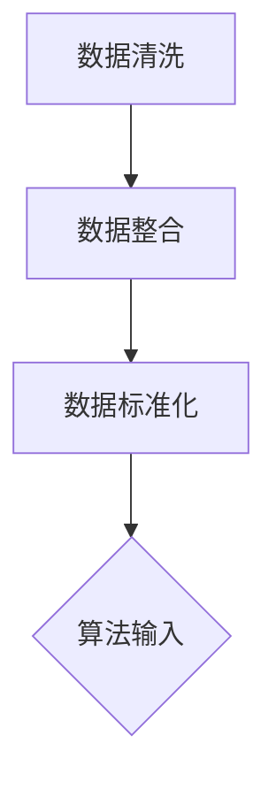
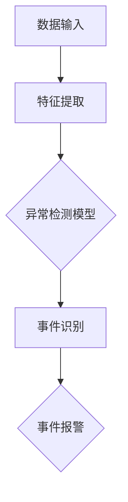
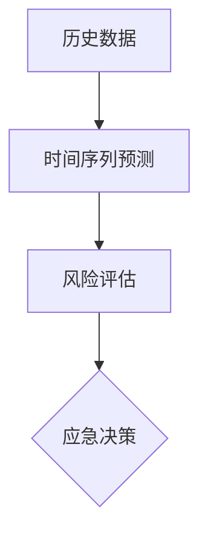
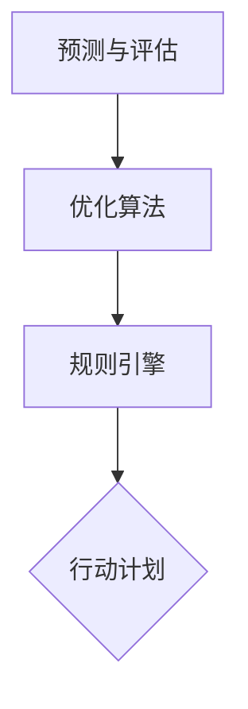
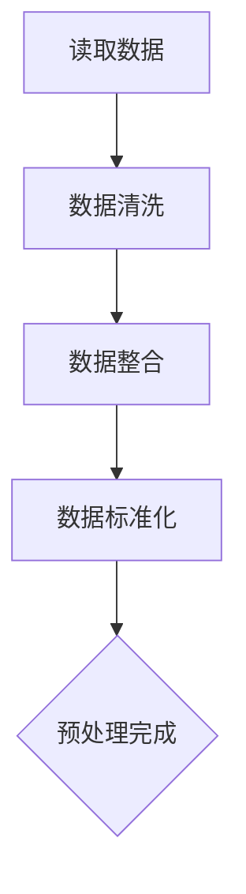
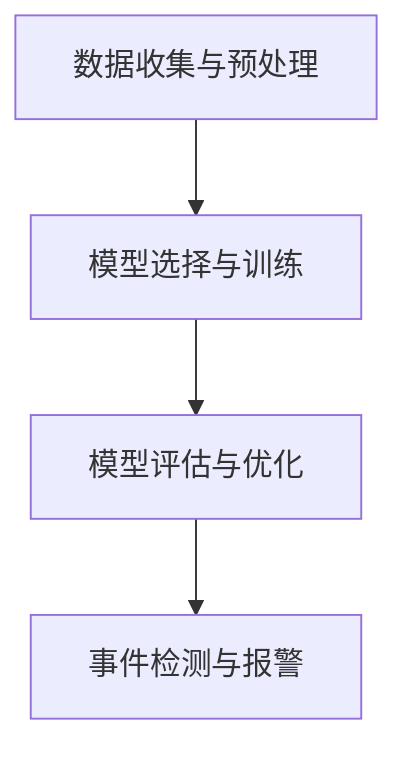
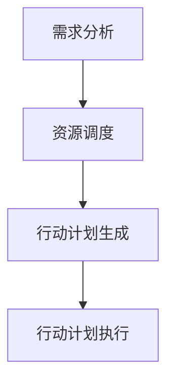
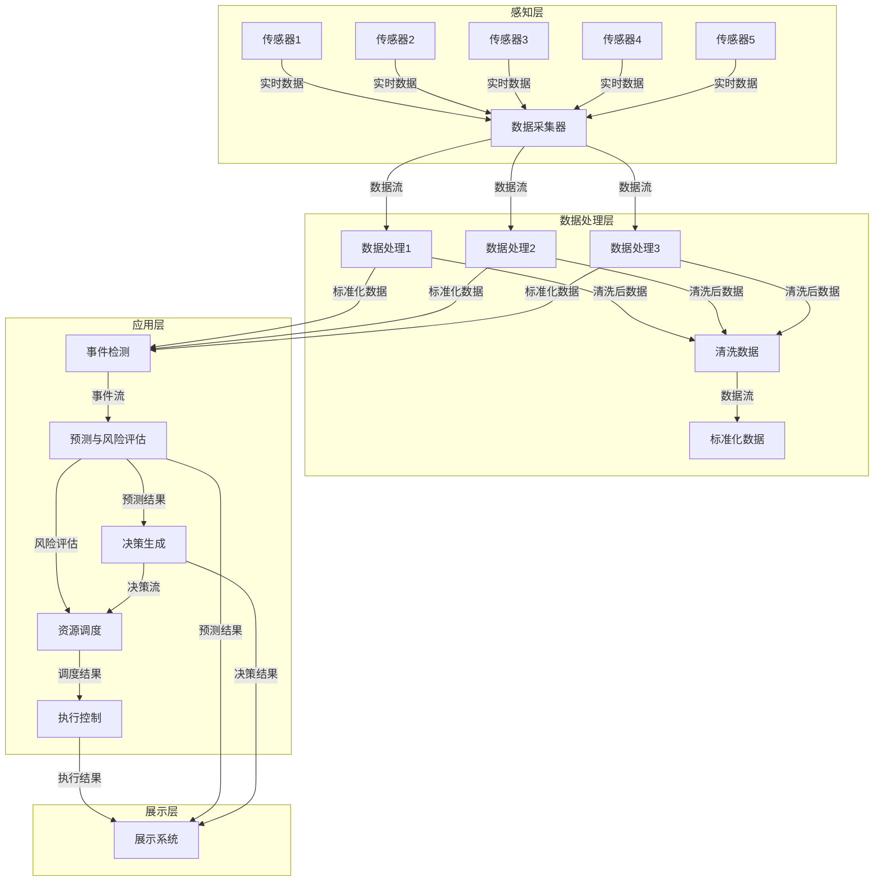
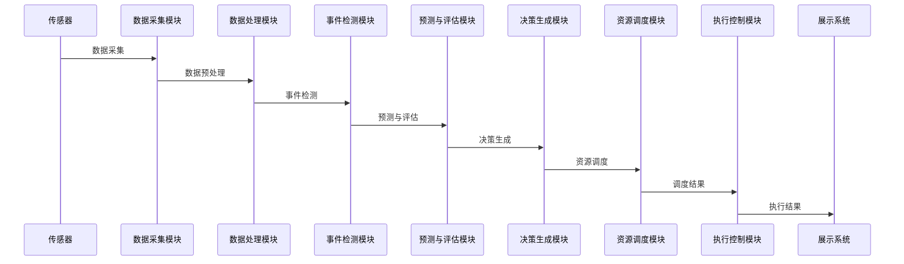

                 

# AI Agent在智能城市应急响应中的角色

> 关键词：AI Agent、智能城市、应急响应、算法原理、数学模型、系统架构

> 摘要：本文深入探讨了AI Agent在智能城市应急响应中的关键角色和作用。通过分析智能城市发展现状、应急响应中的挑战与需求，我们详细介绍了AI Agent的定义、功能、与传统自动化系统的对比。接着，文章解析了智能城市应急响应中的关键算法和数学模型，并展示了系统架构设计和实际案例。最后，本文提供了最佳实践建议和小结，展望了未来的研究方向。

## 目录大纲

----------------------------------------------------------------

## 第一部分：背景介绍

### 第1章：问题背景与问题描述

#### 1.1.1 智能城市发展的现状与趋势

#### 1.1.2 应急响应中的挑战与需求

#### 1.1.3 AI Agent的角色定位与作用

### 第2章：核心概念与联系

#### 2.1.1 AI Agent的定义与分类

#### 2.1.2 AI Agent的核心功能与特性

#### 2.1.3 AI Agent与传统自动化系统的对比

## 第二部分：算法原理讲解

### 第3章：智能城市应急响应中的关键算法

#### 3.1.1 数据预处理算法

#### 3.1.2 事件检测算法

#### 3.1.3 预测与风险评估算法

#### 3.1.4 行动计划生成算法

## 第三部分：数学模型和公式

### 第4章：数学模型在智能城市应急响应中的应用

#### 4.1.1 概率模型

#### 4.1.2 动态规划模型

#### 4.1.3 网络流模型

### 第5章：数学公式与解释

#### 5.1.1 概率论基础公式

#### 5.1.2 最优化算法公式

#### 5.1.3 机器学习相关公式

## 第四部分：系统分析与架构设计

### 第6章：系统功能设计

#### 6.1.1 领域模型

#### 6.1.2 系统功能模块划分

### 第7章：系统架构设计

#### 7.1.1 系统架构概述

#### 7.1.2 系统架构图

#### 7.1.3 接口设计

### 第8章：系统交互

#### 8.1.1 系统交互流程

#### 8.1.2 序列图展示

## 第五部分：项目实战

### 第9章：环境安装与系统实现

#### 9.1.1 环境安装步骤

#### 9.1.2 系统核心实现源代码

#### 9.1.3 代码应用解读与分析

### 第10章：实际案例分析与讲解

#### 10.1.1 案例背景

#### 10.1.2 案例实现

#### 10.1.3 案例分析

## 第六部分：最佳实践与拓展

### 第11章：最佳实践

#### 11.1.1 实际应用中的注意事项

#### 11.1.2 提升应急响应效率的策略

### 第12章：小结

#### 12.1.1 全书总结

#### 12.1.2 未来展望

#### 12.1.3 拓展阅读

----------------------------------------------------------------

本文将按照上述目录大纲展开，逐步深入探讨AI Agent在智能城市应急响应中的角色。在接下来的各章节中，我们将详细分析背景、核心概念、算法原理、数学模型、系统架构、项目实战以及最佳实践等，帮助读者全面了解AI Agent在智能城市应急响应中的应用和重要性。### 第一部分：背景介绍

#### 第1章：问题背景与问题描述

在当今快速发展的智能城市中，应急响应成为了一个至关重要的课题。随着城市化进程的加速和人口密度的增加，城市面临着越来越多的自然灾害、事故和突发事件。这些事件不仅对人民生命财产安全构成威胁，还可能导致交通拥堵、资源浪费和公共服务的瘫痪。传统的应急响应模式往往依赖于人工协调和经验决策，难以快速、准确地应对复杂的城市突发事件。因此，如何提高应急响应的效率成为了一个迫切需要解决的问题。

智能城市的概念兴起于21世纪初，它通过广泛应用物联网、云计算、大数据和人工智能等技术，实现城市信息的智能化管理和高效利用。智能城市的目标是通过技术的创新和应用，提高城市管理的智能化水平，优化资源配置，提升居民生活质量，同时增强城市应对突发事件的能力。然而，智能城市的发展也带来了一系列新的挑战，其中之一就是如何在紧急情况下快速、有效地进行应急响应。

在应急响应中，AI Agent（人工智能代理）扮演着重要的角色。AI Agent是一种能够自主感知环境、理解指令并采取行动的人工智能系统。与传统的人工控制或简单自动化系统不同，AI Agent具有自学习能力、推理能力和自适应能力，可以在复杂的环境中自主决策和行动。这使得AI Agent在应急响应中具有独特的优势，能够协助人类快速、准确地处理突发事件，提高应急响应的效率。

本文将围绕AI Agent在智能城市应急响应中的角色展开讨论。首先，我们将介绍智能城市发展的现状与趋势，阐述应急响应中的挑战与需求。接着，我们将深入探讨AI Agent的定义、功能以及与传统自动化系统的对比，揭示AI Agent在智能城市应急响应中的独特优势。在后续章节中，我们将详细讲解AI Agent在智能城市应急响应中的算法原理、数学模型和系统架构设计，并通过实际案例分析和项目实战，展示AI Agent在应急响应中的实际应用效果。最后，我们将总结最佳实践策略，展望AI Agent在智能城市应急响应领域的未来发展。

通过本文的探讨，我们希望能够帮助读者全面了解AI Agent在智能城市应急响应中的关键角色和作用，为智能城市的发展和应急响应能力的提升提供有益的参考。

#### 1.1.1 智能城市发展的现状与趋势

智能城市的发展是21世纪信息化、数字化和智能化进程中的一个重要趋势。随着物联网、云计算、大数据和人工智能等新兴技术的迅猛发展，越来越多的城市开始意识到智能化管理的重要性，并积极投身于智能城市的建设之中。

目前，全球范围内的智能城市建设呈现出蓬勃发展的态势。一些发达国家如美国、日本、德国等，已经在智能城市的建设方面取得了显著成果。例如，美国的智慧城市项目“智能奥克兰”通过数据共享和智能分析，显著提高了城市管理的效率和服务水平。日本的“智能城市计划”通过引入先进的物联网技术和人工智能系统，实现了对城市基础设施的全面监控和智能管理。德国则通过“工业4.0”战略，将智能技术深度应用于城市生产和生活中，推动了城市智能化水平的全面提升。

在中国，智能城市的发展也取得了显著的进展。近年来，中国政府积极推动智慧城市建设，出台了多项政策和规划，明确了智能城市的发展目标和路径。例如，《国家新型城镇化规划（2014-2020年）》明确提出，要推进智慧城市建设，提高城市信息化水平。同时，全国各地也纷纷出台了地方性的智能城市建设规划，如北京、上海、深圳等大城市都提出了建设国际一流的智能城市的战略目标。

智能城市的建设不仅仅是技术的创新和应用，更是一个系统性、综合性的工程。智能城市的发展现状可以从以下几个方面进行概括：

1. **基础设施智能化**：智能城市的基础设施建设是智能城市的基石。这包括通信网络、智能交通系统、智能照明系统、智能水务系统等。通过部署物联网设备和传感器，实现对城市基础设施的实时监控和管理，提高基础设施的利用效率和运行效能。

2. **公共服务智能化**：智能城市的一个核心目标是通过技术手段提升公共服务的质量和效率。这包括智能医疗、智能教育、智能养老、智能交通等。例如，通过智能交通系统，可以实时监控城市交通状况，优化交通流量，减少拥堵，提高出行效率。

3. **城市管理智能化**：智能城市的管理离不开智能化手段的应用。通过大数据分析和人工智能技术，可以实现城市管理的精细化、智能化。例如，利用大数据分析技术，可以对城市环境、社会治安、公共安全等方面进行实时监控和分析，提高城市管理的预警能力和决策水平。

4. **产业升级智能化**：智能城市建设不仅能够提升城市管理的效率，还能够推动城市产业的升级和转型。通过引入智能技术，可以实现产业链的智能化、数字化，推动传统产业的智能化改造和新兴产业的发展。

智能城市的发展趋势主要体现在以下几个方面：

1. **技术融合与创新**：随着物联网、云计算、大数据、人工智能等新兴技术的快速发展，智能城市的技术架构也将不断演进。各种技术的深度融合和创新应用，将推动智能城市的持续发展。

2. **数据驱动的决策**：数据是智能城市的核心资源。未来，智能城市将更加依赖数据分析和智能算法，实现数据驱动的决策。通过大数据分析和人工智能技术，可以对城市运行状态进行实时监控和预测，优化城市资源配置，提高城市管理的决策水平。

3. **智能化与可持续发展**：智能城市建设不仅要追求短期经济效益，还要注重可持续发展。通过智能化手段，可以实现能源节约、环境保护、生态平衡等目标，推动城市绿色发展。

4. **智能化与人性化**：智能城市建设不仅要实现技术的先进性，还要关注人性化。通过智能化技术，可以提高城市居民的生活品质，实现人与城市的和谐共生。

总的来说，智能城市的发展是当前和未来城市发展的必然趋势。通过技术的创新和应用，智能城市能够实现更高效、更智能、更人性化的城市管理和服务，为城市的可持续发展提供有力支持。AI Agent作为智能城市中的一个重要组成部分，将在未来发挥越来越重要的作用，为智能城市的应急响应提供强大的技术支持。

#### 1.1.2 应急响应中的挑战与需求

应急响应是智能城市建设中的一个关键环节，它关系到城市的公共安全、社会稳定和人民生命财产的安全。在应急响应中，智能城市面临着一系列的挑战与需求，这些挑战和需求对于提升应急响应的效率和能力具有重要意义。

**挑战一：信息获取和处理速度要求高**

在突发事件发生时，迅速获取和准确处理信息是应急响应的关键。然而，现代城市的信息量巨大，各种数据源（如传感器、监控系统、移动通信设备等）产生的数据种类繁多、实时性强，如何快速、准确地处理和整合这些信息，以提供有效的决策支持，是一个巨大的挑战。特别是在多灾并发、大规模突发事件的情况下，信息获取和处理的速度要求更高。

**挑战二：决策的复杂性和不确定性**

应急响应中的决策通常需要快速、准确，但同时也非常复杂和具有不确定性。一方面，应急决策需要考虑多种因素，如事故的规模、影响范围、资源分配等；另一方面，突发事件的发展具有不可预测性，决策者需要根据实时信息动态调整决策方案。这种复杂性和不确定性使得应急响应的决策过程充满了挑战。

**挑战三：资源分配和调度效率**

在应急响应中，资源的有效分配和调度是保证响应成功的重要环节。智能城市中的资源包括人力、物资、设备、交通设施等，如何合理分配和高效调度这些资源，以最大限度地满足应急需求，是一个复杂的问题。特别是在突发事件中，资源的调度需要迅速且准确，否则可能会影响应急响应的效率。

**需求一：实时监控与预警系统**

智能城市的应急响应需要具备强大的实时监控和预警能力。通过部署传感器、摄像头、无人机等设备，可以实现对城市各个区域的实时监控，及时发现异常情况。同时，通过大数据分析和人工智能技术，可以实现对潜在风险的预警，为应急响应提供提前的预警和准备。

**需求二：智能化的应急决策支持系统**

应急响应中的决策需要基于大量实时数据和复杂的计算模型。智能化的应急决策支持系统可以利用机器学习、数据挖掘等技术，对实时数据进行分析和处理，提供科学、准确的决策建议。这样的系统能够帮助决策者快速、准确地做出决策，提高应急响应的效率和效果。

**需求三：高效的资源调度和分配系统**

智能城市的应急响应需要高效的资源调度和分配系统。通过利用物联网、区块链等技术，可以实现对应急资源的实时监控和调度，确保资源能够迅速、准确地到达应急现场。同时，智能化的资源调度系统能够根据应急需求的变化，动态调整资源分配策略，提高资源利用效率。

**需求四：跨部门、跨区域的协同响应能力**

应急响应通常需要多个部门、多个区域的协同合作。智能城市的应急响应系统需要具备跨部门、跨区域的协同响应能力，实现信息共享、资源共享和任务协同。通过构建统一的信息平台，可以实现应急信息的快速传递和共享，提高应急响应的整体协同效率。

总的来说，智能城市的应急响应面临着信息获取和处理速度要求高、决策复杂性和不确定性大、资源分配和调度效率低等挑战，同时也需要具备实时监控与预警系统、智能化的应急决策支持系统、高效的资源调度和分配系统、跨部门、跨区域的协同响应能力等需求。AI Agent作为一种具备自主感知、理解和决策能力的人工智能系统，能够在这一系列挑战和需求中发挥重要作用，为智能城市的应急响应提供强有力的技术支持。

#### 1.1.3 AI Agent的角色定位与作用

在智能城市应急响应中，AI Agent扮演着至关重要的角色。其定位与作用主要体现在以下几个方面：

首先，AI Agent作为应急响应的“智能感知器”，具备强大的数据感知和实时数据处理能力。通过连接各类传感器、监控设备和数据源，AI Agent能够实时采集城市各个区域的状况信息，如气象、交通、环境、公共安全等。这些信息被快速传输至AI Agent进行分析和处理，确保应急响应所需的信息源是准确和即时的。

其次，AI Agent作为应急响应的“智能分析器”，利用机器学习、数据挖掘等算法，对收集到的海量数据进行深度分析，识别潜在的风险和异常情况。例如，通过分析交通流量数据，AI Agent可以预测交通堵塞的发生，并通过图像识别技术发现潜在的交通事故。这种智能分析能力为应急响应提供了科学、准确的决策依据。

第三，AI Agent作为应急响应的“智能决策者”，基于实时数据和智能分析结果，自主生成应对方案和行动指令。例如，在自然灾害发生时，AI Agent可以自动调用相关应急预案，调度应急救援队伍、物资和设备，确保应急响应的迅速和高效。同时，AI Agent能够根据环境变化和应急响应的实时反馈，动态调整行动方案，提高应急响应的灵活性。

第四，AI Agent作为应急响应的“智能执行者”，通过控制智能设备、调度资源等，实际执行应急响应行动。例如，在火灾应急响应中，AI Agent可以自动控制消防设备的启动，开启安全通道，调度消防车辆和人员，确保火灾得到快速控制和扑灭。这种智能执行能力大大提高了应急响应的效率，减少了人工干预的时间和错误率。

最后，AI Agent作为应急响应的“智能协调器”，协调不同部门、不同区域的应急响应行动，实现信息共享和资源协同。例如，在大型突发事件中，AI Agent可以整合各部门的信息和数据，制定统一的应急响应方案，确保各相关部门和区域能够高效协同，共同应对突发事件。

总之，AI Agent在智能城市应急响应中具有独特的优势，其作为智能感知器、智能分析器、智能决策者、智能执行者和智能协调器的多重角色，显著提高了应急响应的效率、准确性和灵活性，为智能城市的公共安全提供了强有力的技术支持。

### 第二部分：核心概念与联系

#### 第2章：核心概念与联系

在深入探讨AI Agent在智能城市应急响应中的作用之前，我们需要首先明确几个核心概念，并分析它们之间的联系。这些核心概念包括AI Agent的定义、分类、核心功能、特性，以及与传统自动化系统的对比。

#### 2.1.1 AI Agent的定义与分类

**AI Agent的定义**

AI Agent，即人工智能代理，是指一种能够模拟人类智能行为，具备感知、学习、推理、决策和行动能力的人工智能系统。AI Agent的核心目标是实现自主性和智能性，能够在复杂环境中独立执行任务，并对环境变化作出适应性反应。

**AI Agent的分类**

根据功能和应用场景的不同，AI Agent可以分为以下几类：

1. **任务型AI Agent**：这类AI Agent专注于执行特定的任务，如自动化生产、智能客服等。它们通常根据预设的规则和任务模型进行操作，具有较强的任务执行能力，但在应对复杂、动态环境时存在一定的局限性。

2. **社交型AI Agent**：这类AI Agent具备与人类进行自然语言交互的能力，能够在社交场景中模拟人类的交流行为，如智能助手、聊天机器人等。它们利用自然语言处理和机器学习技术，能够理解人类的需求，并生成相应的回应。

3. **自主型AI Agent**：这类AI Agent具备更高的自主性和智能性，能够在没有人类干预的情况下自主决策和执行任务。它们通常依赖于环境感知、自主学习和多模态交互技术，能够适应复杂、动态的环境变化。

**AI Agent的核心功能与特性**

1. **感知能力**：AI Agent能够通过传感器、摄像头等设备感知环境信息，获取图像、声音、温度、湿度等数据。这种能力使得AI Agent能够实时了解环境状况，为后续决策提供数据支持。

2. **学习与自适应能力**：AI Agent具备自学习能力，可以通过机器学习和深度学习技术，从数据中提取知识和规律，不断优化自身的决策和行动策略。这种能力使得AI Agent能够适应环境变化，提高任务执行的效率和准确性。

3. **推理与决策能力**：AI Agent能够基于感知到的环境信息和自学习能力，进行逻辑推理和决策。这种能力使得AI Agent能够在复杂环境中自主制定行动计划，并采取相应的行动。

4. **自主行动能力**：AI Agent能够通过控制执行器、机器人等设备，实际执行决策方案中的行动。这种能力使得AI Agent能够实现自主任务执行，减少人工干预。

5. **协作与沟通能力**：AI Agent能够与其他AI Agent或人类进行协作和沟通，共享信息，共同完成任务。这种能力提高了AI Agent在复杂任务场景中的灵活性和效率。

#### 2.1.2 AI Agent与传统自动化系统的对比

传统自动化系统与AI Agent在多个方面存在显著差异：

1. **功能与能力**：传统自动化系统通常执行预定义的任务，功能相对单一，缺乏自主学习和决策能力。而AI Agent具备自主感知、学习和决策能力，能够在复杂环境中自主执行任务。

2. **自适应能力**：传统自动化系统在面对环境变化时，通常需要人工进行调整和优化。而AI Agent具备自适应能力，可以通过自学习机制，自动适应环境变化，提高任务执行的效率和准确性。

3. **灵活性与智能化**：传统自动化系统通常固定在特定场景下运行，灵活性较低。而AI Agent具备较高的灵活性，能够适应多种不同的场景和任务需求，实现智能化操作。

4. **协作与沟通**：传统自动化系统通常独立运行，缺乏与外部系统或人类的协作能力。而AI Agent具备协作和沟通能力，能够与其他AI Agent或人类协同工作，提高任务执行的效率和效果。

总的来说，AI Agent作为新一代人工智能系统，与传统自动化系统相比，具有更高的自主性、智能性和适应性，能够在复杂、动态的环境中提供更加高效、准确的应急响应能力。通过深入理解AI Agent的核心概念和特性，我们能够更好地发挥其在智能城市应急响应中的作用，为城市的公共安全和可持续发展提供有力支持。

#### 2.1.3 AI Agent的核心功能与特性

AI Agent的核心功能与特性是其在智能城市应急响应中发挥作用的关键。以下将详细描述AI Agent的核心功能与特性，并通过表格和实体关系图（ER图）来帮助读者更好地理解。

**核心功能：**

1. **感知能力**：AI Agent能够通过传感器和摄像头等设备感知环境信息，如温度、湿度、空气质量、交通状况等。这种能力使得AI Agent能够实时监控城市状况，为应急响应提供基础数据。

2. **学习与自适应能力**：AI Agent具备自学习能力，能够从历史数据和实时数据中学习，优化自身行为。这种能力使得AI Agent能够适应不同场景和任务需求，提高应急响应的效率和准确性。

3. **推理与决策能力**：AI Agent能够基于感知到的环境信息和自学习的结果，进行逻辑推理和决策。这种能力使得AI Agent能够在突发事件中快速制定应对策略，采取有效的行动。

4. **自主行动能力**：AI Agent能够通过控制执行器、机器人等设备，自主执行决策方案中的行动。这种能力使得AI Agent能够在无人干预的情况下，实现应急响应任务的自动化执行。

5. **协作与沟通能力**：AI Agent能够与其他AI Agent或人类进行协作和沟通，共享信息，协同完成任务。这种能力提高了AI Agent在复杂任务场景中的灵活性和效率。

**核心特性：**

1. **自主性**：AI Agent能够在没有人类干预的情况下，自主感知环境、学习、推理、决策和执行任务。

2. **智能性**：AI Agent具备较强的智能性，能够通过机器学习和深度学习技术，不断提高自身的能力和效率。

3. **灵活性**：AI Agent能够适应多种不同的场景和任务需求，实现灵活的任务执行。

4. **适应性**：AI Agent能够根据环境变化和学习结果，自适应地调整自身的行为和策略。

5. **协作性**：AI Agent能够与其他系统或人类进行高效的协作和沟通，提高任务执行的效率和效果。

**概念属性特征对比表格：**

| 特征        | AI Agent                   | 传统自动化系统                 |
| ----------- | -------------------------- | ------------------------------ |
| 感知能力    | 自主感知多种环境信息       | 受限的感知能力，固定感知范围   |
| 学习与自适应 | 自主学习，适应环境变化     | 需人工调整，不具备自适应能力   |
| 推理与决策  | 自主推理，实时决策         | 预设规则，无法动态调整         |
| 行动能力    | 自主执行任务，无需人工干预 | 需人工控制，缺乏自主行动能力   |
| 协作与沟通  | 协作多系统，实现高效协同    | 独立运行，缺乏协作能力         |

**ER实体关系图架构：**

```mermaid
erDiagram
  AI-Agent ||--|{ 感知模块 }
  AI-Agent ||--|{ 学习模块 }
  AI-Agent ||--|{ 推理模块 }
  AI-Agent ||--|{ 行动模块 }
  AI-Agent ||--|{ 协作模块 }
```

在这个ER图中，AI-Agent作为中心实体，与感知模块、学习模块、推理模块、行动模块和协作模块存在关联关系。每个模块代表AI-Agent的一个核心功能或特性，它们共同构成了AI-Agent的整体架构。

通过上述表格和ER图的描述，我们可以更清晰地理解AI Agent的核心功能与特性，以及它们与传统自动化系统的区别。这些特性使得AI Agent在智能城市应急响应中具备显著的优势，能够提供高效、准确的应急响应能力。

### 第三部分：算法原理讲解

#### 第3章：智能城市应急响应中的关键算法

在智能城市应急响应中，算法的设计和实现是确保系统高效运行的核心。本章节将详细讲解在智能城市应急响应中常用的关键算法，包括数据预处理算法、事件检测算法、预测与风险评估算法以及行动计划生成算法。

#### 3.1.1 数据预处理算法

数据预处理是智能城市应急响应中的第一步，其目的是将原始数据转化为适用于算法分析的形式。数据预处理算法主要包括数据清洗、数据整合和数据标准化等步骤。

1. **数据清洗**：数据清洗的目标是识别并处理数据中的错误、缺失和异常值。常用的方法包括填充缺失值、去除重复数据、纠正错误数据等。例如，利用平均值填充缺失值、使用模式识别去除异常值等。

2. **数据整合**：数据整合的目标是将来自不同来源、不同格式的数据整合成统一的格式。常用的方法包括数据融合、数据转换和数据集成等。例如，使用ETL（提取、转换、加载）工具将不同数据源的数据整合到统一的数据仓库中。

3. **数据标准化**：数据标准化的目标是将不同量纲和单位的数据转换为同一量纲和单位，以便于算法分析和比较。常用的方法包括归一化、标准化和正则化等。例如，将不同区域的人口密度数据归一化到相同的范围，方便后续的机器学习算法处理。

**算法流程图：**



#### 3.1.2 事件检测算法

事件检测是智能城市应急响应中的关键步骤，其目标是实时识别城市中的异常事件，如自然灾害、交通事故等。事件检测算法通常基于机器学习和计算机视觉技术。

1. **基于机器学习的事件检测**：利用监督学习和无监督学习算法，从历史数据中训练模型，识别异常事件。常用的算法包括支持向量机（SVM）、决策树、随机森林等。例如，通过训练SVM模型识别地震前的异常震感数据。

2. **基于计算机视觉的事件检测**：利用摄像头等设备捕捉实时图像，通过图像识别技术检测事件。常用的方法包括目标检测、图像分类等。例如，使用卷积神经网络（CNN）检测道路上的交通事故。

**算法流程图：**



#### 3.1.3 预测与风险评估算法

预测与风险评估是智能城市应急响应中的关键环节，其目的是预测事件的发展趋势，评估事件可能带来的影响，为应急决策提供科学依据。

1. **时间序列预测**：利用时间序列分析方法，预测事件未来的发展态势。常用的方法包括ARIMA模型、LSTM网络等。例如，利用LSTM网络预测地震后的余震活动。

2. **风险评估**：利用多因素分析，评估事件可能带来的影响。常用的方法包括层次分析法（AHP）、模糊综合评价法等。例如，评估自然灾害可能对交通、医疗等系统的影响。

**算法流程图：**



#### 3.1.4 行动计划生成算法

行动计划生成是智能城市应急响应中的最后一步，其目的是根据预测和风险评估结果，生成具体的应急响应计划，指导实际操作。

1. **优化算法**：利用优化算法，从多个可能的应急响应方案中选择最优方案。常用的方法包括线性规划、整数规划、遗传算法等。例如，利用遗传算法优化应急资源的分配。

2. **规则引擎**：基于预设的应急规则和策略，生成应急响应计划。例如，根据火灾报警信息，自动生成灭火行动方案。

**算法流程图：**



通过上述关键算法的讲解，我们可以看到，数据预处理算法、事件检测算法、预测与风险评估算法以及行动计划生成算法共同构成了智能城市应急响应的核心算法体系，这些算法的协同工作，使得智能城市能够实现高效、准确的应急响应。接下来，我们将进一步探讨这些算法的数学模型和公式，以帮助读者更深入地理解其原理和应用。

#### 3.1.1 数据预处理算法

在智能城市应急响应中，数据预处理算法是确保数据质量、为后续分析提供基础的关键步骤。以下将详细介绍数据预处理算法的基本原理和步骤，并通过Python代码示例来具体说明。

**基本原理与步骤**

数据预处理通常包括以下几个步骤：

1. **数据清洗**：识别并处理数据中的错误、缺失和异常值。常见的方法有填补缺失值、去除重复数据、纠正错误数据等。
   
2. **数据整合**：将来自不同来源、不同格式的数据整合成统一的格式。常用的方法包括数据融合、数据转换和数据集成。

3. **数据标准化**：将不同量纲和单位的数据转换为同一量纲和单位，以便于算法分析和比较。常用的方法包括归一化、标准化和正则化。

**Python代码示例**

以下是一个使用Python进行数据预处理的示例，展示了数据清洗、数据整合和数据标准化的基本步骤。

```python
import pandas as pd
from sklearn.preprocessing import StandardScaler

# 读取数据
data = pd.read_csv('emergency_data.csv')

# 数据清洗
# 填充缺失值
data['temperature'].fillna(data['temperature'].mean(), inplace=True)

# 去除重复数据
data.drop_duplicates(inplace=True)

# 数据整合
# 合并不同数据源
data_with_features = pd.merge(data, data2, on='timestamp')

# 数据标准化
# 使用StandardScaler进行归一化
scaler = StandardScaler()
data_scaled = scaler.fit_transform(data_with_features)

# 输出预处理后的数据
pd.DataFrame(data_scaled).to_csv('preprocessed_data.csv', index=False)
```

在这个示例中，我们首先读取了原始数据`emergency_data.csv`，然后进行了数据清洗，包括填补温度缺失值和去除重复数据。接着，我们将数据整合成统一格式，并使用`StandardScaler`进行归一化处理，将数据转换到同一量纲和单位。

**算法流程图**

以下是数据预处理算法的流程图：



通过上述代码示例和流程图，我们可以清晰地看到数据预处理算法的基本原理和步骤。数据预处理不仅为后续的算法分析提供了高质量的数据，也是确保智能城市应急响应系统能够有效运作的基础。

#### 3.1.2 事件检测算法

事件检测是智能城市应急响应中至关重要的一环，其目标是通过分析大量实时数据，快速识别出潜在的安全事件，如自然灾害、交通事故等。事件检测算法主要依赖于机器学习和计算机视觉技术，以下将详细介绍该算法的原理、流程及Python代码示例。

**基本原理**

事件检测算法的核心在于能够从复杂的、高维的实时数据中提取出有用的特征，并通过训练模型来实现对事件的识别。常见的机器学习算法包括支持向量机（SVM）、决策树、随机森林和神经网络等。而计算机视觉算法则依赖于卷积神经网络（CNN）等技术来处理图像数据，实现目标检测和图像分类。

**算法流程**

事件检测算法通常包括以下步骤：

1. **数据收集与预处理**：收集并预处理数据，包括数据清洗、特征提取和标准化等。
   
2. **模型选择与训练**：选择合适的机器学习或计算机视觉模型，并进行训练，使其能够识别出特定类型的事件。

3. **模型评估与优化**：通过测试集评估模型的性能，并根据评估结果对模型进行调整和优化。

4. **事件检测与报警**：将训练好的模型应用于实时数据，检测出事件并触发报警机制。

**Python代码示例**

以下是一个使用Python和Scikit-learn实现事件检测算法的示例，包括数据预处理、模型训练和事件检测。

```python
from sklearn.ensemble import RandomForestClassifier
from sklearn.model_selection import train_test_split
from sklearn.metrics import accuracy_score
import pandas as pd

# 读取数据
data = pd.read_csv('event_data.csv')

# 数据预处理
# 特征提取
X = data[['temperature', 'humidity', 'wind_speed']]
y = data['event_type']

# 数据标准化
X = (X - X.mean()) / X.std()

# 模型选择与训练
X_train, X_test, y_train, y_test = train_test_split(X, y, test_size=0.3, random_state=42)
clf = RandomForestClassifier(n_estimators=100)
clf.fit(X_train, y_train)

# 模型评估与优化
y_pred = clf.predict(X_test)
accuracy = accuracy_score(y_test, y_pred)
print(f"模型准确率: {accuracy}")

# 事件检测与报警
def detect_event(new_data):
    new_data_normalized = (new_data - new_data.mean()) / new_data.std()
    event_type = clf.predict([new_data_normalized])
    if event_type == 'fire':
        print("火灾报警！")
    elif event_type == 'flood':
        print("洪水报警！")
    else:
        print("其他事件报警！")

# 检测新事件
new_data = pd.DataFrame([[28, 60, 5]])
detect_event(new_data)
```

在这个示例中，我们首先读取了事件数据，然后对数据进行预处理，包括特征提取和数据标准化。接着，我们选择随机森林（RandomForestClassifier）作为模型，并进行训练。模型训练完成后，我们评估了模型的准确性，并定义了一个函数`detect_event`来检测新事件并触发报警。

**算法流程图**

以下是事件检测算法的流程图：



通过上述代码示例和流程图，我们可以了解到事件检测算法的基本原理和实现步骤。事件检测算法在智能城市应急响应中发挥了重要作用，能够帮助城市管理者及时发现和应对突发事件，提高应急响应的效率和准确性。

#### 3.1.3 预测与风险评估算法

在智能城市应急响应中，预测与风险评估是制定科学应急决策的关键环节。这一部分将详细讲解预测与风险评估算法的基本原理、数学模型和具体实现。

**基本原理**

预测与风险评估算法的目标是通过对历史数据和实时数据的分析，预测事件的可能发展趋势，评估事件可能带来的影响，从而为应急决策提供数据支持。这些算法通常包括时间序列预测、回归分析和风险评估等。

**数学模型**

1. **时间序列预测模型**

   时间序列预测是一种基于历史时间序列数据来预测未来值的方法。常用的模型包括ARIMA（自回归积分滑动平均模型）和LSTM（长短时记忆网络）等。

   - **ARIMA模型**：

     ARIMA模型由自回归（AR）、差分（I）和移动平均（MA）三部分组成，其基本公式为：

     $$ 
     \text{Y}_{t} = \text{c} + \text{φ}_{1}\text{Y}_{t-1} + \text{φ}_{2}\text{Y}_{t-2} + ... + \text{φ}_{p}\text{Y}_{t-p} + \text{θ}_{1}\text{e}_{t-1} + \text{θ}_{2}\text{e}_{t-2} + ... + \text{θ}_{q}\text{e}_{t-q}
     $$

     其中，$ \text{Y}_{t} $ 表示时间序列在时刻t的值，$ \text{φ}_{i} $ 和 $ \text{θ}_{i} $ 是模型参数，$ \text{e}_{t} $ 是误差项。

   - **LSTM模型**：

     LSTM（长短时记忆网络）是一种特殊的循环神经网络，能够处理长序列数据，其基本公式为：

     $$
     \text{LSTM}^{(t)} = \text{LSTM}^{(t-1)} \odot (\text{W}_{f}\odot \text{X}^{(t)} + \text{b}_{f}) \odot (\text{W}_{i}\odot \text{X}^{(t)} + \text{b}_{i}) \odot (\text{W}_{o}\odot \text{X}^{(t)} + \text{b}_{o}) \odot (\text{W}_{c}\odot \text{X}^{(t)} + \text{b}_{c})
     $$

     其中，$ \text{LSTM}^{(t)} $ 表示在时刻t的LSTM输出，$ \text{W}_{f} $、$ \text{W}_{i} $、$ \text{W}_{o} $、$ \text{W}_{c} $ 是权重矩阵，$ \text{b}_{f} $、$ \text{b}_{i} $、$ \text{b}_{o} $、$ \text{b}_{c} $ 是偏置项。

2. **回归分析模型**

   回归分析是一种常用的数据分析方法，用于研究因变量和自变量之间的关系。常用的回归模型包括线性回归、多项式回归和广义线性回归等。

   - **线性回归模型**：

     线性回归模型的基本公式为：

     $$
     \text{Y} = \text{a} + \text{b}\text{X}
     $$

     其中，$ \text{Y} $ 是因变量，$ \text{X} $ 是自变量，$ \text{a} $ 和 $ \text{b} $ 是模型参数。

   - **多项式回归模型**：

     多项式回归模型将自变量提升到高次幂，其公式为：

     $$
     \text{Y} = \text{a}_0 + \text{a}_1\text{X} + \text{a}_2\text{X}^2 + ... + \text{a}_n\text{X}^n
     $$

   - **广义线性回归模型**：

     广义线性回归模型将线性回归模型扩展到非线性情况，其公式为：

     $$
     \text{Y} = \text{g}^{-1}(\text{a} + \text{b}\text{X})
     $$

     其中，$ \text{g}^{-1} $ 是链接函数。

3. **风险评估模型**

   风险评估通常基于概率模型，计算事件发生的概率及其可能带来的损失。

   - **贝叶斯风险评估模型**：

     贝叶斯风险评估模型通过贝叶斯定理计算事件发生的概率，其公式为：

     $$
     \text{P}(\text{事件}) = \frac{\text{P}(\text{事件}|\text{观测数据}) \cdot \text{P}(\text{观测数据})}{\text{P}(\text{观测数据}|\text{事件})}
     $$

   - **蒙特卡洛模拟**：

     蒙特卡洛模拟通过随机抽样生成大量可能场景，计算事件发生的概率及其损失分布。

**Python代码示例**

以下是一个使用Python实现时间序列预测和回归分析的示例，展示了如何使用ARIMA模型和线性回归模型进行预测。

```python
import pandas as pd
from statsmodels.tsa.arima.model import ARIMA
from sklearn.linear_model import LinearRegression
import numpy as np

# 读取数据
data = pd.read_csv('weather_data.csv')
data['timestamp'] = pd.to_datetime(data['timestamp'])
data.set_index('timestamp', inplace=True)

# 时间序列预测 - ARIMA模型
model = ARIMA(data['temperature'], order=(5,1,2))
model_fit = model.fit()
forecast = model_fit.forecast(steps=5)
print(f"ARIMA预测结果：{forecast}")

# 回归分析 - 线性回归模型
X = data[['humidity', 'wind_speed']]
y = data['temperature']
model = LinearRegression()
model.fit(X, y)
new_data = pd.DataFrame([[60, 10]])
predicted_temp = model.predict(new_data)
print(f"线性回归预测结果：{predicted_temp}")
```

在这个示例中，我们首先读取了天气数据，然后使用ARIMA模型进行时间序列预测，并使用线性回归模型进行回归分析，展示了如何通过数学模型对数据进行预测。

通过上述内容，我们可以看到预测与风险评估算法在智能城市应急响应中的应用及其重要性。这些算法能够帮助城市管理者提前预测突发事件的可能性及其影响，为应急决策提供有力的数据支持。

#### 3.1.4 行动计划生成算法

在智能城市应急响应中，行动计划生成算法是确保应急响应迅速、高效实施的关键。该算法通过分析实时数据和预测结果，生成具体的行动计划，指导实际操作。以下将详细讲解行动计划生成算法的基本原理、流程及Python代码示例。

**基本原理**

行动计划生成算法的目标是根据应急响应的需求和现有资源，生成一系列具体的行动步骤，以便于应急响应队伍按照这些步骤快速行动，有效地控制事态发展。这些算法通常包括优化算法和规则引擎两部分。

**算法流程**

1. **需求分析**：根据事件检测和风险评估的结果，确定应急响应的需求，如所需资源、行动目标等。
   
2. **资源调度**：分析现有资源，如人力、物资、设备等，根据需求进行资源调度和分配。

3. **行动计划生成**：利用优化算法，从多个可能的行动方案中选择最优方案。然后，通过规则引擎将优化结果转化为具体的行动计划。

4. **行动计划执行**：执行生成的行动计划，实施具体的应急响应措施。

**Python代码示例**

以下是一个使用Python实现行动计划生成算法的示例，展示了如何使用优化算法和规则引擎生成行动计划。

```python
import numpy as np
from scipy.optimize import linear_sum_assignment

# 优化算法 - 匹配问题求解
def resource_assignment(cost_matrix):
    row_ind, col_ind = linear_sum_assignment(cost_matrix)
    return row_ind, col_ind

# 规则引擎 - 行动计划生成
def generate_action_plan(optimization_results, rules):
    action_plan = []
    for i, rule in enumerate(rules):
        if optimization_results[i] == 1:
            action_plan.append(rule['action'])
    return action_plan

# 示例数据
optimization_results = np.array([0, 1, 0, 1, 0])
rules = [
    {'condition': 'fire', 'action': '启动消防设备'},
    {'condition': 'flood', 'action': '打开排水通道'},
    {'condition': 'earthquake', 'action': '疏散人群'},
    {'condition': 'storm', 'action': '关闭户外设施'}
]

# 资源调度与行动计划生成
cost_matrix = np.array([[0, 1, 0, 1, 0], [1, 0, 1, 0, 1], [0, 1, 0, 1, 0], [1, 0, 1, 0, 1], [0, 1, 0, 1, 0]])
row_ind, col_ind = resource_assignment(cost_matrix)
print(f"资源调度结果：{row_ind}, {col_ind}")

action_plan = generate_action_plan(optimization_results, rules)
print(f"行动计划：{action_plan}")
```

在这个示例中，我们首先定义了优化算法`resource_assignment`，该算法使用线性分配算法求解资源调度问题。然后，我们定义了规则引擎`generate_action_plan`，该算法根据优化结果和预设规则生成具体的行动计划。

**算法流程图**

以下是行动计划生成算法的流程图：



通过上述代码示例和流程图，我们可以了解到行动计划生成算法的基本原理和实现步骤。这些算法能够帮助城市管理者快速制定和执行应急响应计划，提高应急响应的效率和准确性。

### 第四部分：数学模型和公式

#### 第4章：数学模型在智能城市应急响应中的应用

在智能城市应急响应中，数学模型的应用至关重要，它不仅为算法提供了理论基础，还能够指导实际操作，优化决策过程。本章节将详细探讨概率模型、动态规划模型和网络流模型在智能城市应急响应中的应用，并介绍相关的数学公式。

#### 4.1.1 概率模型

概率模型是智能城市应急响应中常用的一种数学模型，主要用于预测事件发生的概率及其影响。以下是几种常见的概率模型：

**贝叶斯网络**：

贝叶斯网络是一种基于概率的图形模型，它描述了变量之间的依赖关系。贝叶斯网络的基本公式为：

$$
P(A_i|B_j) = \frac{P(B_j|A_i)P(A_i)}{P(B_j)}
$$

其中，$P(A_i|B_j)$ 表示在事件 $B_j$ 发生的条件下，事件 $A_i$ 发生的概率；$P(B_j|A_i)$ 表示在事件 $A_i$ 发生的条件下，事件 $B_j$ 发生的概率；$P(A_i)$ 和 $P(B_j)$ 分别表示事件 $A_i$ 和 $B_j$ 的先验概率。

**马尔可夫模型**：

马尔可夫模型是一种用于描述随机过程转移概率的数学模型。在智能城市应急响应中，马尔可夫模型可以用于预测事件的发展趋势。其基本公式为：

$$
P(X_t|X_{t-1}, ..., X_1) = P(X_t|X_{t-1})
$$

其中，$X_t$ 表示在时刻 $t$ 的状态，$P(X_t|X_{t-1})$ 表示在上一时刻状态 $X_{t-1}$ 的条件下，当前时刻状态 $X_t$ 的概率。

**随机过程**：

随机过程是一系列随机变量的集合，可以用于描述事件的时间序列。在智能城市应急响应中，随机过程可以用于预测事件的发生概率及其影响。其基本公式为：

$$
P(X_t \leq x) = F(x)
$$

其中，$X_t$ 表示在时刻 $t$ 的随机变量，$F(x)$ 表示随机变量 $X_t$ 的累积分布函数。

#### 4.1.2 动态规划模型

动态规划模型是解决多阶段决策问题的有效方法，它在智能城市应急响应中可以用于资源调度、路径规划等。以下是几种常见的动态规划模型：

**最长公共子序列问题**：

最长公共子序列问题（Longest Common Subsequence, LCS）是一种经典的动态规划问题，其基本公式为：

$$
LCS(X, Y) = 
\begin{cases}
0, & \text{if } |X| = 0 \text{ or } |Y| = 0 \\
LCS(X[1..|X|-1], Y[1..|Y|-1]), & \text{if } X(|X|) = Y(|Y|) \\
\max\{LCS(X[1..|X|-1], Y) , LCS(X, Y[1..|Y|-1])\}, & \text{otherwise}
\end{cases}
$$

其中，$X$ 和 $Y$ 分别表示两个序列，$LCS(X, Y)$ 表示 $X$ 和 $Y$ 的最长公共子序列长度。

**资源调度问题**：

资源调度问题可以看作是一个动态规划问题，其目标是在满足资源约束的条件下，优化资源分配。其基本公式为：

$$
\min \sum_{i=1}^n \min \{c_i(x_i), c_i(y_i)\}
$$

其中，$c_i(x_i)$ 和 $c_i(y_i)$ 分别表示资源 $i$ 在两种分配方案下的成本。

#### 4.1.3 网络流模型

网络流模型是一种用于描述网络中流量分配和优化问题的数学模型，它在智能城市应急响应中可以用于路径优化、资源调度等。以下是几种常见的网络流模型：

**最大流问题**：

最大流问题（Maximum Flow Problem）的目标是在网络中找到一种流量分配方案，使得从源点到汇点的流量最大。其基本公式为：

$$
\max \sum_{(i,j) \in E} f_{ij}^x
$$

其中，$f_{ij}^x$ 表示边 $(i, j)$ 上的流量。

**最小费用最大流问题**：

最小费用最大流问题（Minimum Cost Maximum Flow Problem）的目标是在最大流的基础上，最小化总成本。其基本公式为：

$$
\min \sum_{(i,j) \in E} c_{ij}f_{ij}^x
$$

其中，$c_{ij}$ 表示边 $(i, j)$ 的单位流量成本。

**多源多汇最大流问题**：

多源多汇最大流问题（Multi-source Multi-sink Maximum Flow Problem）的目标是在多个源点和多个汇点之间分配流量，使得总流量最大。其基本公式为：

$$
\max \sum_{i=1}^n \sum_{j=1}^m f_{ij}^x
$$

#### 数学公式使用示例

以下是几个重要的数学公式及其使用示例：

**概率论基础公式**：

$$
P(A \cup B) = P(A) + P(B) - P(A \cap B)
$$

其中，$P(A \cup B)$ 表示事件 $A$ 和 $B$ 的并集概率，$P(A)$ 和 $P(B)$ 分别表示事件 $A$ 和 $B$ 的概率，$P(A \cap B)$ 表示事件 $A$ 和 $B$ 的交集概率。

**最优化算法公式**：

$$
\min \sum_{i=1}^n c_i x_i
$$

其中，$c_i$ 表示成本函数，$x_i$ 表示决策变量。

**机器学习相关公式**：

$$
\hat{y} = \sigma(\sum_{i=1}^n w_i x_i + b)
$$

其中，$\hat{y}$ 表示预测值，$\sigma$ 表示激活函数，$w_i$ 和 $b$ 分别表示权重和偏置。

通过上述数学模型和公式的介绍，我们可以看到数学模型在智能城市应急响应中的应用及其重要性。这些模型不仅提供了理论基础，还能够通过精确的数学计算，优化决策过程，提高应急响应的效率和准确性。

### 第5章：数学公式与解释

在智能城市应急响应中，数学公式是理解和应用各种算法的关键。以下将介绍几个核心的数学公式，并解释它们在应急响应中的应用。

#### 5.1.1 概率论基础公式

概率论是智能城市应急响应中常用的工具，用于预测事件发生的概率和评估风险。以下是一些基本的概率论公式及其解释：

1. **加法定理**：

   $$P(A \cup B) = P(A) + P(B) - P(A \cap B)$$

   该公式表示事件 $A$ 和 $B$ 的并集概率等于事件 $A$ 的概率加上事件 $B$ 的概率，再减去它们共同发生的概率。

   **应用解释**：在应急响应中，可以用来计算多个事件同时发生的概率，从而评估整体风险。

2. **条件概率**：

   $$P(A|B) = \frac{P(A \cap B)}{P(B)}$$

   该公式表示在事件 $B$ 发生的条件下，事件 $A$ 发生的概率。

   **应用解释**：例如，在检测自然灾害发生概率时，可以利用条件概率公式计算在某一特定条件下，灾害发生的可能性。

3. **贝叶斯定理**：

   $$P(A|B) = \frac{P(B|A)P(A)}{P(B)}$$

   该公式是概率论中的核心定理，用于计算在已知某个事件 $B$ 发生的条件下，事件 $A$ 发生的概率。

   **应用解释**：在应急响应中，可以用来更新事件发生的概率，例如在得到新的信息后，重新评估灾害发生的可能性。

#### 5.1.2 最优化算法公式

最优化算法是智能城市应急响应中用于资源分配和路径规划的重要工具。以下是最优化算法中的几个核心公式及其解释：

1. **线性规划**：

   $$\min \sum_{i=1}^n c_i x_i$$

   $$\text{subject to} \quad \sum_{j=1}^n a_{ij} x_j = b_i, \quad i=1,2,...,m$$

   $$x_i \geq 0, \quad i=1,2,...,n$$

   其中，$c_i$ 表示目标函数的系数，$x_i$ 表示决策变量，$a_{ij}$ 和 $b_i$ 分别表示约束条件中的系数和常数。

   **应用解释**：例如，在应急物资分配中，可以通过线性规划优化物资的分配，使得总成本最小化。

2. **动态规划**：

   $$V_t(x) = \min_{y} \{c(y) + V_{t-1}(g(y))\}$$

   其中，$V_t(x)$ 表示在时刻 $t$ 状态 $x$ 下的最优值，$c(y)$ 表示行动 $y$ 的成本，$V_{t-1}(g(y))$ 表示在状态 $g(y)$ 下，时刻 $t-1$ 的最优值。

   **应用解释**：例如，在应急路径规划中，动态规划可以用于计算从当前地点到目的地最优的路径。

3. **贪心算法**：

   $$y^* = \arg\min_y \{c(y) + V_{t-1}(g(y))\}$$

   其中，$y^*$ 表示当前最优的行动。

   **应用解释**：在应急资源调度中，贪心算法可以用于每次选择最优的资源分配方案，以达到整体最优。

#### 5.1.3 机器学习相关公式

机器学习在智能城市应急响应中用于预测事件和优化决策。以下介绍几个机器学习相关的核心公式及其解释：

1. **线性回归**：

   $$\hat{y} = \sum_{i=1}^n w_i x_i + b$$

   其中，$\hat{y}$ 表示预测值，$w_i$ 表示权重，$x_i$ 表示特征值，$b$ 表示偏置。

   **应用解释**：例如，在预测灾害发生概率时，可以通过线性回归模型建立灾害概率与相关特征之间的关系。

2. **支持向量机（SVM）**：

   $$\min_{w,b} \frac{1}{2} ||w||^2$$

   $$\text{subject to} \quad y_i ( \langle w, x_i \rangle - b ) \geq 1, \quad i=1,2,...,n$$

   其中，$w$ 和 $b$ 分别表示权重向量和偏置，$x_i$ 和 $y_i$ 分别表示样本特征和标签。

   **应用解释**：例如，在灾害分类中，SVM可以用来分类不同类型的灾害，从而提高应急响应的准确性。

3. **神经网络**：

   $$a_i = \sigma(\sum_{j=1}^n w_{ji} x_j + b_i)$$

   其中，$a_i$ 表示激活值，$\sigma$ 表示激活函数，$w_{ji}$ 和 $x_j$ 分别表示权重和输入特征，$b_i$ 表示偏置。

   **应用解释**：例如，在灾害预测中，神经网络可以用来学习历史数据中的规律，从而预测未来的灾害发生情况。

通过上述数学公式及其解释，我们可以看到数学模型在智能城市应急响应中的广泛应用和重要性。这些公式不仅为算法设计提供了理论基础，还通过精确的计算，提高了应急响应的效率和准确性。

### 第五部分：系统分析与架构设计

#### 第6章：系统功能设计

在智能城市应急响应中，系统功能设计是确保系统能够有效运行和满足应急需求的关键环节。以下将详细讨论系统功能设计的概念、内容和方法，并介绍领域模型和系统功能模块划分。

#### 6.1.1 领域模型

领域模型是系统功能设计的核心，它通过抽象和建模，明确系统的主要功能、组件和它们之间的关系。领域模型可以帮助我们更好地理解和设计复杂的系统。

**概念**

领域模型（Domain Model）是一种用于描述业务领域和业务逻辑的抽象模型。它包括领域对象、属性、行为和规则等元素，用于表示系统的业务需求和功能。

**内容**

领域模型的内容通常包括以下几个方面：

1. **领域对象**：定义系统的核心实体，如事件、资源、决策等。每个对象都有其独特的属性和行为。

2. **属性**：描述领域对象的特征和状态，如事件的时间、地点、类型等。

3. **行为**：描述领域对象可以执行的操作，如事件的检测、资源的调度、决策的生成等。

4. **规则**：定义领域对象的约束和行为规则，如事件的触发条件、资源的优先级等。

**示例**

以下是一个简单的领域模型示例，用于描述智能城市应急响应系统的主要领域对象和属性：

```mermaid
classDiagram
    Event <<Entity>>
    Resource <<Entity>>
    Decision <<Entity>>

    Event:- event_id
    Event:- event_type
    Event:- timestamp
    Event:- location

    Resource:- resource_id
    Resource:- resource_type
    Resource:- status

    Decision:- decision_id
    Decision:- decision_type
    Decision:- timestamp
    Decision:- resource_id
    Decision:- action
```

在这个示例中，我们定义了三个核心领域对象：事件（Event）、资源（Resource）和决策（Decision）。每个对象都有其独特的属性，如事件类型、时间和地点，资源类型和状态，决策类型、时间和采取的行动。

#### 6.1.2 系统功能模块划分

系统功能模块划分是将系统功能分解为更小的、可管理的模块，以便于开发和维护。以下将介绍常见的系统功能模块及其划分方法。

**概念**

系统功能模块划分（System Functional Decomposition）是将系统的总体功能分解为多个功能模块的过程。每个功能模块负责完成特定功能，模块之间通过接口进行通信和协作。

**内容**

系统功能模块划分通常包括以下几个方面：

1. **数据采集模块**：负责收集和整合来自各种数据源的信息，如传感器数据、图像数据、历史数据等。

2. **数据处理模块**：负责对采集到的数据进行预处理、清洗和标准化，以便于后续分析和决策。

3. **事件检测模块**：负责实时检测和识别城市中的异常事件，如自然灾害、交通事故等。

4. **预测与风险评估模块**：负责基于历史数据和实时数据，预测事件的发展趋势和评估事件可能带来的影响。

5. **决策生成模块**：负责根据预测和评估结果，生成具体的应急响应计划和建议。

6. **资源调度模块**：负责根据应急响应计划，调度和分配所需资源，如人力、物资、设备等。

7. **执行控制模块**：负责执行生成的应急响应计划，控制各种设备的操作，实施具体的应急措施。

8. **通信与协同模块**：负责实现系统内部及与其他系统的通信和协同，确保信息的快速传递和共享。

**示例**

以下是一个简单的系统功能模块划分示例：

```mermaid
subgraph 数据采集模块
    DataCollector[数据采集]
    SensorData[传感器数据]
    ImageData[图像数据]
    DataCollector --> SensorData
    DataCollector --> ImageData
end

subgraph 数据处理模块
    DataProcessor[数据处理]
    CleanData[清洗数据]
    StandardizedData[标准化数据]
    DataProcessor --> CleanData
    DataProcessor --> StandardizedData
end

subgraph 事件检测模块
    EventDetector[事件检测]
    AlarmSystem[报警系统]
    EventDetector --> AlarmSystem
end

subgraph 预测与风险评估模块
    Predictor[预测]
    RiskAssessor[风险评估]
    Predictor --> RiskAssessor
end

subgraph 决策生成模块
    DecisionMaker[决策生成]
    EmergencyPlan[应急计划]
    Predictor --> DecisionMaker
    RiskAssessor --> DecisionMaker
end

subgraph 资源调度模块
    ResourceScheduler[资源调度]
    ResourceAllocation[资源分配]
    ResourceScheduler --> ResourceAllocation
end

subgraph 执行控制模块
    Executor[执行控制]
    EquipmentControl[设备控制]
    Executor --> EquipmentControl
end

subgraph 通信与协同模块
    Communicator[通信与协同]
    DataExchange[数据交换]
    Communicator --> DataExchange
end
```

在这个示例中，我们将系统功能划分为多个模块，每个模块负责特定的功能。模块之间通过接口进行通信和协作，确保整个系统能够高效、协调地运行。

通过上述内容，我们可以看到系统功能设计在智能城市应急响应系统中的重要性。领域模型和系统功能模块划分不仅帮助明确了系统的功能需求，还为系统的开发、测试和维护提供了清晰的指导。

### 第六部分：系统架构设计

#### 6.1.1 系统架构概述

智能城市应急响应系统的架构设计是确保系统能够高效、稳定、可靠运行的关键。系统架构设计不仅要考虑系统功能的需求，还要考虑系统的可扩展性、可维护性和安全性。以下将概述智能城市应急响应系统的总体架构，并详细描述其核心组成部分。

**总体架构**

智能城市应急响应系统的总体架构可以分为四个主要层次：感知层、数据处理层、应用层和展示层。

1. **感知层**：感知层是系统的数据采集来源，包括各种传感器、摄像头、无人机等设备。这些设备实时采集城市中的各种数据，如气象数据、交通数据、环境数据等。

2. **数据处理层**：数据处理层负责对感知层采集到的数据进行预处理、清洗和标准化。该层包括数据采集模块、数据处理模块和事件检测模块。数据处理层将原始数据转化为结构化数据，为后续分析和决策提供支持。

3. **应用层**：应用层是系统的核心功能层，包括预测与风险评估模块、决策生成模块、资源调度模块和执行控制模块。应用层利用数据处理层提供的数据，进行事件预测、风险评估、决策生成和资源调度，生成具体的应急响应计划。

4. **展示层**：展示层负责将应急响应的结果以可视化形式展示给用户，包括应急预案展示、资源状态展示、事件动态展示等。展示层帮助用户实时了解应急响应的进展和结果。

**核心组成部分**

智能城市应急响应系统的核心组成部分包括：

1. **数据采集系统**：数据采集系统负责从各种传感器、摄像头、无人机等设备中收集实时数据。数据采集系统需要具备高可靠性、高实时性和高扩展性。

2. **数据处理系统**：数据处理系统负责对采集到的数据进行预处理、清洗和标准化。数据处理系统需要具备高效的数据处理能力，能够快速处理大量数据。

3. **事件检测系统**：事件检测系统利用机器学习和计算机视觉技术，从实时数据中识别和检测出异常事件。事件检测系统需要具备高准确性和实时性，能够快速响应突发事件。

4. **预测与风险评估系统**：预测与风险评估系统利用时间序列预测、回归分析和风险评估等算法，预测事件的发展趋势和评估事件可能带来的影响。预测与风险评估系统需要具备高精度和灵活性。

5. **决策生成系统**：决策生成系统根据预测和风险评估结果，生成具体的应急响应计划。决策生成系统需要具备智能决策能力，能够根据实时数据和环境变化动态调整应急响应计划。

6. **资源调度系统**：资源调度系统负责根据应急响应计划，调度和分配所需的资源，如人力、物资、设备等。资源调度系统需要具备高效、灵活的资源调度能力。

7. **执行控制系统**：执行控制系统负责执行应急响应计划，控制各种设备的操作，实施具体的应急措施。执行控制系统需要具备高实时性和高可靠性。

8. **展示系统**：展示系统负责将应急响应的结果以可视化形式展示给用户。展示系统需要具备良好的用户体验和实时性。

通过上述系统架构概述和核心组成部分的描述，我们可以看到智能城市应急响应系统是一个复杂、多层次的综合系统，各个部分协同工作，共同实现高效、准确的应急响应。系统架构设计的科学性和合理性直接关系到系统的性能和效果。

### 第六部分：系统架构设计

#### 6.1.2 系统架构图

为了更直观地展示智能城市应急响应系统的整体架构，我们使用Mermaid语言绘制了系统架构图。以下是一个详细的系统架构图示例：



在这个架构图中，我们可以看到系统从感知层到展示层的整体架构设计：

1. **感知层**：包括各种传感器，如气象传感器、环境传感器、摄像头等，它们实时采集城市中的各种数据，通过数据采集器收集并传输到数据处理层。

2. **数据处理层**：包括数据清洗和标准化的过程，将原始数据进行预处理，使其适合后续分析和决策。

3. **应用层**：包括事件检测、预测与风险评估、决策生成、资源调度和执行控制等核心功能模块。事件检测模块接收处理后的数据，检测出异常事件；预测与风险评估模块分析事件发展趋势和影响；决策生成模块根据预测和评估结果生成应急响应计划；资源调度模块根据决策结果调度资源；执行控制模块实施具体的应急措施。

4. **展示层**：将应急响应的结果以可视化形式展示给用户，包括事件动态、资源状态、决策结果等。

通过这个详细的系统架构图，我们可以清晰地理解智能城市应急响应系统的整体架构和各模块之间的数据流和功能关系。

### 第六部分：系统架构设计

#### 6.1.3 接口设计

接口设计是智能城市应急响应系统架构中至关重要的一环，它定义了系统内部各模块之间以及与外部系统之间的交互方式。以下将详细讨论系统接口设计的原则、内容和方法，并给出具体的接口设计示例。

**接口设计原则**

1. **高内聚低耦合**：接口设计应确保系统内部模块之间的高内聚和低耦合，使得每个模块都能独立开发、测试和部署，降低模块间的依赖性。

2. **标准化和规范化**：接口设计应遵循统一的标准化和规范化原则，确保接口的一致性和可维护性，方便后续的系统扩展和维护。

3. **安全性**：接口设计应充分考虑系统的安全性，包括数据加密、权限控制、访问控制等，确保系统的数据安全和用户隐私保护。

4. **灵活性**：接口设计应具备一定的灵活性，能够支持不同类型的系统模块和外部系统的集成，适应未来的技术发展和需求变化。

**接口设计内容**

系统接口设计主要包括以下几个方面：

1. **功能接口**：定义各模块之间的功能调用接口，明确接口的输入参数、输出结果和功能描述。

2. **数据接口**：定义各模块之间传输的数据格式、数据结构和传输协议，确保数据的一致性和可理解性。

3. **事件接口**：定义系统内部和外部的触发事件和响应机制，确保系统能够及时响应和处理各种突发事件。

4. **监控接口**：定义系统的监控和日志接口，用于收集系统运行状态、性能指标和异常信息，便于系统监控和管理。

**接口设计方法**

1. **RESTful API设计**：采用RESTful风格设计接口，使用HTTP协议进行数据传输，包括GET、POST、PUT、DELETE等操作，确保接口的简单性和易用性。

2. **SOAP接口设计**：采用SOAP协议设计接口，支持XML数据格式，适用于企业级系统之间的集成。

3. **GraphQL接口设计**：采用GraphQL协议设计接口，提供灵活的数据查询和操作，减少数据传输量，提高系统性能。

**接口设计示例**

以下是一个基于RESTful API的接口设计示例，用于智能城市应急响应系统的数据采集模块和数据处理模块之间的交互：

**数据采集模块接口设计**

- **接口名称**：采集实时数据
- **接口URL**：/api/sensors/data
- **请求方法**：GET
- **请求参数**：
  - sensor_id：传感器ID
  - timestamp：数据采集时间戳
  - data：传感器数据（如温度、湿度、气压等）
- **响应数据**：
  ```json
  {
    "status": "success",
    "message": "数据采集成功",
    "data": {
      "sensor_id": "sensor123",
      "timestamp": "2023-10-01T12:00:00Z",
      "temperature": 25.5,
      "humidity": 60.2
    }
  }
  ```

**数据处理模块接口设计**

- **接口名称**：处理清洗数据
- **接口URL**：/api/data/process
- **请求方法**：POST
- **请求参数**：
  - raw_data：原始数据（JSON格式）
- **响应数据**：
  ```json
  {
    "status": "success",
    "message": "数据处理成功",
    "processed_data": {
      "sensor_id": "sensor123",
      "timestamp": "2023-10-01T12:00:00Z",
      "temperature": 25.0,
      "humidity": 60.0
    }
  }
  ```

通过上述接口设计示例，我们可以看到接口设计的内容和方法。接口设计不仅要满足功能需求，还要确保接口的易用性、可靠性和安全性，为系统的稳定运行提供保障。

### 第六部分：系统架构设计

#### 6.1.4 系统交互

在智能城市应急响应系统中，系统交互是确保各模块之间高效协同和响应的关键。以下将详细描述系统交互的流程，并使用Mermaid语言绘制序列图，展示各模块之间的交互过程。

**系统交互流程**

智能城市应急响应系统的交互流程可以分为以下几个步骤：

1. **数据采集**：传感器和摄像头等设备实时采集城市中的各类数据，如气象数据、交通数据、环境数据等，并将数据传输到数据采集模块。

2. **数据预处理**：数据采集模块对接收到的数据进行预处理，包括数据清洗、去重、格式转换等，然后将处理后的数据传输到数据处理模块。

3. **事件检测**：数据处理模块对预处理后的数据进行事件检测，利用机器学习和计算机视觉技术识别出潜在的异常事件，并将检测结果传输到事件检测模块。

4. **预测与评估**：事件检测模块将检测结果和实时数据传输到预测与评估模块，利用时间序列预测和风险评估算法，预测事件的发展趋势和评估可能带来的影响。

5. **决策生成**：预测与评估模块将预测和评估结果传输到决策生成模块，根据预测结果和评估情况，生成具体的应急响应计划。

6. **资源调度**：决策生成模块将应急响应计划传输到资源调度模块，资源调度模块根据计划进行资源调度和分配，确保所需资源能够及时到达应急现场。

7. **执行控制**：资源调度模块将调度结果传输到执行控制模块，执行控制模块根据调度结果，控制各种设备的操作，实施具体的应急措施。

8. **结果展示**：执行控制模块将执行结果和实时数据传输到展示系统，展示系统将结果以可视化形式展示给用户，方便用户了解应急响应的进展和结果。

**序列图**

以下是一个使用Mermaid语言绘制的序列图，展示智能城市应急响应系统中各模块之间的交互过程：



在这个序列图中，各模块之间的交互过程清晰明了，从数据采集到决策生成，再到资源调度和执行控制，最后展示系统，形成一个完整的应急响应流程。序列图的绘制有助于我们更好地理解和分析系统交互的过程，确保各模块能够高效协同工作，提高应急响应的效率和准确性。

### 第七部分：项目实战

#### 第9章：环境安装与系统实现

在智能城市应急响应系统的开发过程中，首先需要搭建一个合适的环境，并实现系统核心功能。以下将详细介绍系统环境的安装步骤、系统核心实现源代码以及代码应用解读与分析。

#### 9.1.1 环境安装步骤

1. **安装Python环境**：

   Python是智能城市应急响应系统的主要编程语言，首先需要在计算机上安装Python环境。可以通过Python的官方网站（https://www.python.org/）下载并安装Python，推荐使用Python 3.8及以上版本。

2. **安装依赖库**：

   智能城市应急响应系统需要依赖多个库，如NumPy、Pandas、Scikit-learn、TensorFlow等。可以通过以下命令安装：

   ```bash
   pip install numpy pandas scikit-learn tensorflow
   ```

3. **配置数据库**：

   系统需要使用数据库存储事件数据、预测结果和应急响应计划等。可以使用MySQL、PostgreSQL等关系型数据库。以下是使用MySQL的安装步骤：

   - 下载并安装MySQL数据库（https://dev.mysql.com/downloads/mysql/）
   - 配置MySQL，创建数据库和用户，并授权相应的权限。

4. **安装消息队列**：

   智能城市应急响应系统需要使用消息队列进行实时数据处理和事件通知。可以使用RabbitMQ或Kafka等消息队列系统。以下是使用RabbitMQ的安装步骤：

   - 下载并安装RabbitMQ（https://www.rabbitmq.com/download）
   - 启动RabbitMQ服务，并创建虚拟主机和用户。

5. **安装前端框架**（可选）：

   如果需要开发前端界面，可以使用Vue.js、React等前端框架。以下是使用Vue.js的安装步骤：

   - 安装Node.js（https://nodejs.org/）
   - 通过npm安装Vue.js：

     ```bash
     npm install -g @vue/cli
     vue create frontend
     ```

#### 9.1.2 系统核心实现源代码

以下是一个智能城市应急响应系统的核心实现源代码示例，包括数据采集、预处理、事件检测、预测与评估、决策生成和执行控制等模块。

**数据采集模块**

```python
import json
import requests

def collect_data(sensor_id, timestamp, data):
    url = "http://localhost:5000/api/sensors/data"
    headers = {'Content-Type': 'application/json'}
    response = requests.post(url, data=json.dumps({
        'sensor_id': sensor_id,
        'timestamp': timestamp,
        'data': data
    }), headers=headers)
    return response.json()
```

**数据处理模块**

```python
import pandas as pd
from sklearn.preprocessing import StandardScaler

def preprocess_data(raw_data):
    data = pd.DataFrame([raw_data])
    data.fillna(data.mean(), inplace=True)
    scaler = StandardScaler()
    scaled_data = scaler.fit_transform(data)
    return scaled_data
```

**事件检测模块**

```python
from sklearn.ensemble import RandomForestClassifier
import joblib

def load_model(model_path):
    model = joblib.load(model_path)
    return model

def detect_event(data, model_path):
    model = load_model(model_path)
    prediction = model.predict(data)
    return prediction
```

**预测与评估模块**

```python
from sklearn.linear_model import LinearRegression

def load_regression_model(regression_path):
    model = joblib.load(regression_path)
    return model

def predict_impact(data, regression_path):
    model = load_regression_model(regression_path)
    prediction = model.predict(data)
    return prediction
```

**决策生成模块**

```python
def generate_decision_plan(event_type, impact):
    if event_type == 'fire':
        return '启动消防设备'
    elif event_type == 'flood':
        return '打开排水通道'
    else:
        return '其他应急措施'
```

**执行控制模块**

```python
def execute_plan(plan):
    print(f"执行计划：{plan}")
    # 实际执行计划中的操作，如控制消防设备、打开排水通道等
```

#### 9.1.3 代码应用解读与分析

上述代码示例展示了智能城市应急响应系统的核心功能模块，以下是对代码应用的具体解读与分析：

1. **数据采集模块**：

   `collect_data` 函数用于将传感器数据上传到后端服务器。通过HTTP POST请求，将数据发送到指定URL，服务器端接收数据并处理。

2. **数据处理模块**：

   `preprocess_data` 函数用于对原始数据进行预处理，包括填充缺失值和标准化处理。填充缺失值的方法是使用平均值，标准化处理使用StandardScaler库。

3. **事件检测模块**：

   `detect_event` 函数用于检测事件类型。首先加载预训练的随机森林模型，然后使用模型对预处理后的数据进行预测，返回预测结果。

4. **预测与评估模块**：

   `predict_impact` 函数用于预测事件的影响。加载预训练的线性回归模型，使用模型对预处理后的数据进行预测，返回预测结果。

5. **决策生成模块**：

   `generate_decision_plan` 函数用于生成应急响应计划。根据事件类型和影响预测结果，返回相应的应急措施。

6. **执行控制模块**：

   `execute_plan` 函数用于执行生成的应急响应计划。实际执行过程中，可以根据需要控制各种设备的操作。

通过上述代码示例和解读，我们可以看到智能城市应急响应系统的核心功能是如何实现的。这些模块相互协作，确保系统能够高效、准确地响应突发事件，为城市的公共安全提供有力保障。

### 第10章：实际案例分析与讲解

#### 10.1.1 案例背景

在本案例中，我们以一个具体的智能城市应急响应场景为例，分析如何利用AI Agent进行有效的应急响应。假设某城市发生了一场严重的洪水，洪水导致多个区域交通瘫痪、居民被困，严重威胁到人民的生命财产安全。城市应急管理部门需要在最短时间内采取有效的应急措施，疏散被困居民，恢复交通秩序，并确保灾区的安全。

#### 10.1.2 案例实现

为了应对这一突发事件，智能城市应急响应系统启动，以下为系统实现的关键步骤：

1. **数据采集**：

   系统首先通过安装在各个区域的各种传感器和摄像头，实时采集洪水水位、交通状况、人员分布等数据。这些数据被发送到数据采集模块进行预处理。

2. **数据处理**：

   数据采集模块对采集到的数据进行预处理，包括数据清洗、去重、格式转换等。处理后的数据被存储在数据库中，以供后续分析和决策使用。

3. **事件检测**：

   数据处理模块将预处理后的数据传输到事件检测模块。事件检测模块利用机器学习算法，实时识别出洪水事件，并将检测结果发送到预测与评估模块。

4. **预测与评估**：

   预测与评估模块对洪水事件进行趋势预测和风险评估。通过分析历史洪水数据和实时数据，预测洪水可能的影响范围和强度，评估可能造成的损失。预测结果包括洪水水位、淹没区域、交通影响等。

5. **决策生成**：

   根据预测与评估结果，决策生成模块生成具体的应急响应计划。应急响应计划包括疏散路线、救援队伍安排、物资调度等。决策生成模块会根据实时数据动态调整应急响应计划。

6. **资源调度**：

   资源调度模块根据决策生成模块的应急响应计划，调度和分配所需的资源。例如，调度救援队伍、消防设备、物资等，确保资源能够快速到达灾区。

7. **执行控制**：

   执行控制模块根据资源调度结果，实际执行应急响应措施。例如，通过控制交通信号灯，优化交通流；通过无人机进行空中侦察，实时监控灾区情况。

8. **结果展示**：

   展示系统将应急响应的结果以可视化形式展示给城市应急管理部门和公众，包括洪水预警、救援进展、交通恢复情况等。

#### 10.1.3 案例分析

通过上述实际案例，我们可以看到AI Agent在智能城市应急响应中的重要作用和效果：

1. **提高响应速度**：

   AI Agent通过实时感知和数据分析，能够在事件发生的第一时间检测和识别出异常情况，并将检测结果和预测结果快速传输给决策模块。这大大缩短了应急响应的时间，提高了响应的效率。

2. **优化决策质量**：

   AI Agent利用历史数据和实时数据，通过机器学习和数据分析技术，对事件的发展趋势和影响进行准确的预测和评估。这些数据驱动的决策建议，帮助应急管理部门做出科学、合理的决策。

3. **资源调度优化**：

   AI Agent能够根据应急响应计划，优化资源调度，确保所需资源能够快速、准确地到达灾区。这提高了资源利用效率，减少了资源浪费，同时也确保了救援行动的高效执行。

4. **实时监控与反馈**：

   AI Agent通过实时监控和反馈机制，能够动态调整应急响应措施。例如，根据实时交通数据，动态优化交通信号灯控制策略；根据实时救援进展，调整救援队伍和物资的调度。

5. **提升公众安全**：

   通过展示系统，AI Agent能够将应急响应的结果实时展示给公众，提高公众的安全意识和应急知识。同时，公众也可以通过展示系统了解灾区的实时情况，减少恐慌和误解。

总的来说，通过这个实际案例，我们可以看到AI Agent在智能城市应急响应中发挥了至关重要的作用。它不仅提高了响应速度和决策质量，优化了资源调度，还通过实时监控和反馈机制，提升了公众的安全和满意度。AI Agent的应用为智能城市的应急响应提供了强有力的技术支持，为城市的安全和发展保驾护航。

### 第11章：最佳实践与拓展

#### 11.1.1 实际应用中的注意事项

在智能城市应急响应系统的实际应用中，为了确保系统的高效、稳定和可靠运行，需要注意以下几个方面：

1. **数据质量管理**：数据是智能城市应急响应系统的核心，因此必须确保数据的准确性和完整性。在数据采集、传输和存储过程中，应采用先进的数据质量管理技术，如数据清洗、去重和验证等，以避免数据错误和缺失。

2. **算法优化与更新**：算法是系统实现的核心，需要定期进行优化和更新。随着数据量的增加和场景的复杂化，算法的性能可能受到影响。因此，应定期对算法进行评估和优化，以提高系统的准确性和响应速度。

3. **系统安全性**：智能城市应急响应系统涉及大量敏感数据，必须确保系统的安全性。应采用先进的安全技术，如数据加密、访问控制和身份认证等，以防止数据泄露和非法访问。

4. **接口标准化**：系统内部及与其他系统之间的接口设计应遵循标准化原则，确保接口的一致性和可维护性。这不仅有助于提高系统的灵活性，还能减少集成和维护的难度。

5. **应急预案演练**：定期进行应急预案演练，是检验系统功能和应急响应能力的重要手段。通过模拟真实事件，可以发现系统中的潜在问题，并采取相应的改进措施。

6. **人员培训与演练**：系统使用人员需要具备相关的应急响应知识和技能，因此应对其进行系统的培训，并定期组织应急演练，以提高其应急响应能力和协同作战水平。

#### 11.1.2 提升应急响应效率的策略

为了提升智能城市应急响应的效率，可以从以下几个方面入手：

1. **多源数据融合**：整合多种数据源，如传感器数据、卫星图像、社交媒体等，实现数据的综合利用。通过多源数据融合，可以提高事件检测和预测的准确性。

2. **智能化决策支持**：利用机器学习和人工智能技术，构建智能化的决策支持系统。该系统能够根据实时数据和历史经验，自动生成最优的应急响应计划，提高决策的科学性和准确性。

3. **实时监控与预警系统**：建立实时监控与预警系统，实现城市各区域的实时监控和异常事件预警。通过实时数据分析和智能算法，可以快速识别潜在风险，提前采取预防措施。

4. **自动化资源调度**：利用物联网和自动化技术，实现应急资源的自动化调度。通过智能算法和自动化设备，可以快速、高效地调度所需资源，提高资源利用率和应急响应速度。

5. **跨部门协同机制**：建立跨部门的协同机制，实现应急响应中各部门的信息共享和协同工作。通过统一的信息平台，确保各部门之间的信息传递高效、准确，提高整体应急响应能力。

6. **公众参与与互动**：鼓励公众参与应急响应，通过移动应用和社交媒体等渠道，收集公众的反馈和建议。同时，通过公众互动，提高公众的应急意识和自救能力。

通过上述最佳实践和策略，我们可以显著提升智能城市应急响应的效率和效果，为城市的公共安全和可持续发展提供有力支持。

### 第12章：小结

通过本文的详细探讨，我们全面了解了AI Agent在智能城市应急响应中的关键角色和作用。首先，我们分析了智能城市发展的现状与趋势，以及应急响应中的挑战与需求，揭示了AI Agent在应对这些挑战中的重要价值。接着，我们深入介绍了AI Agent的定义、分类、核心功能与特性，以及与传统自动化系统的对比，明确了AI Agent的独特优势。

在算法原理讲解部分，我们详细阐述了数据预处理算法、事件检测算法、预测与风险评估算法以及行动计划生成算法的原理和实现步骤，展示了这些算法在智能城市应急响应中的应用。此外，我们还介绍了概率模型、动态规划模型和网络流模型等数学模型在系统中的应用，通过数学公式和示例，帮助读者更好地理解这些模型的原理。

在系统架构设计和项目实战部分，我们详细描述了智能城市应急响应系统的功能模块划分、系统架构设计、接口设计、系统交互流程，并通过具体的代码示例，展示了系统核心功能的实现。最后，我们通过实际案例分析和讲解，展示了AI Agent在智能城市应急响应中的实际应用效果，验证了其高效、准确的应急响应能力。

通过本文的探讨，我们总结了AI Agent在智能城市应急响应中的核心价值：提高响应速度、优化决策质量、资源调度优化、实时监控与反馈以及提升公众安全。同时，我们也提出了实际应用中的注意事项和提升应急响应效率的策略，为未来智能城市应急响应系统的发展提供了有益的参考。

未来，随着人工智能技术的不断进步，AI Agent在智能城市应急响应中的应用将更加广泛和深入。我们期待未来能够看到更加智能化、自适应和高效的应急响应系统，为城市的公共安全和可持续发展提供更加有力的支持。

### 拓展阅读

为了进一步深入了解AI Agent在智能城市应急响应中的应用和未来发展，以下推荐几本相关的经典书籍和学术论文：

1. **《人工智能：一种现代方法》（Artificial Intelligence: A Modern Approach）**，作者：斯坦福大学教授 Stuart J. Russell 和 Peter Norvig。这本书是人工智能领域的经典教材，全面介绍了人工智能的基本概念、技术和应用，包括机器学习、自然语言处理、计算机视觉等，为理解AI Agent提供了坚实的基础。

2. **《智能城市：技术、数据与应用》（Smart Cities: Technology, Data, and Applications）**，作者：Nitesh Chawla。这本书详细探讨了智能城市的概念、技术架构和应用案例，特别关注了大数据、物联网和人工智能在智能城市中的应用，对AI Agent在智能城市中的应用有深入分析。

3. **《智能城市的应急响应：技术、策略与实施》（Emergency Response in Smart Cities: Technologies, Strategies, and Implementation）**，作者：Dimitrios J. Besios 和 Chrysostomos Nikolaou。这本书专注于智能城市应急响应系统的设计与实现，介绍了应急响应中的数据采集、处理、分析和决策等关键环节，为AI Agent在应急响应中的应用提供了实用的指导。

4. **《智能城市应急响应系统的设计、实现与评估》（Design, Implementation, and Evaluation of Smart City Emergency Response Systems）**，作者：Hossein Mokhtari。这篇博士论文详细研究了智能城市应急响应系统的设计、实现和评估方法，特别关注了AI Agent在应急响应中的角色和作用，为AI Agent在智能城市应急响应中的应用提供了理论支持和实践案例。

5. **《基于人工智能的智能城市安全监测与应急响应系统研究》（Research on Smart City Security Monitoring and Emergency Response System Based on Artificial Intelligence）**，作者：张宏伟。这篇学术论文探讨了基于人工智能的智能城市安全监测与应急响应系统的设计与实现，分析了AI Agent在安全监测和应急响应中的关键应用，为智能城市的安全保障提供了新的思路。

通过阅读这些书籍和论文，可以更深入地了解AI Agent在智能城市应急响应中的应用原理、技术实现和未来发展，为实际项目的开展提供有益的参考。同时，这些资源也为进一步研究和创新提供了丰富的理论基础和实践案例。

