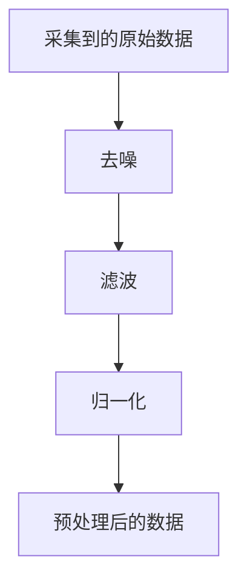
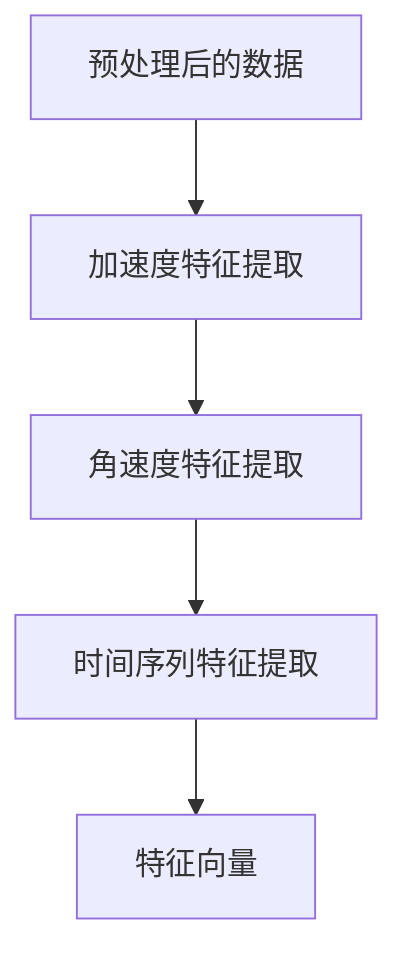
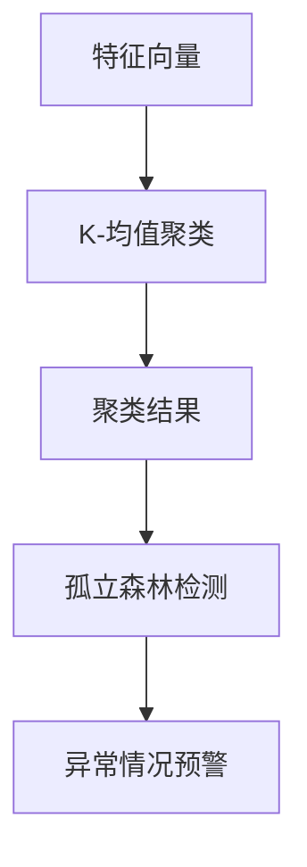
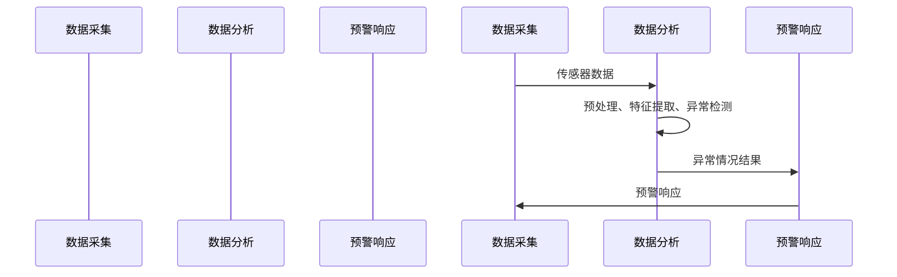

                 

### AI Agent在智能头盔中的运动安全监控

关键词：智能头盔、AI Agent、运动安全监控、算法、系统设计

摘要：本文将深入探讨AI Agent在智能头盔中的运动安全监控应用。通过介绍智能头盔的基本概念和AI Agent的作用，详细阐述监控运动安全的算法原理、系统设计及实际应用案例。本文旨在为读者提供全面的技术解析，帮助理解AI Agent在提升运动安全性能中的关键作用。

---

### 引言

随着物联网、人工智能和传感器技术的飞速发展，智能设备的应用场景越来越广泛，其中智能头盔作为智能穿戴设备的一种，正逐渐成为运动安全监控的重要工具。智能头盔通过内置的传感器和AI Agent，可以实时监控佩戴者的运动状态，并在出现异常情况时及时发出警报，从而大大提高了运动的安全性。

本文将围绕AI Agent在智能头盔中的运动安全监控展开讨论。首先，我们将介绍智能头盔和AI Agent的基本概念及其在运动安全监控中的应用背景。接着，本文将详细分析运动安全监控的核心算法原理，并通过具体案例说明其实现过程。此外，文章还将讨论系统设计的各个方面，包括架构、功能、接口和交互。最后，我们将总结最佳实践，并给出进一步阅读的建议。

### 智能头盔和AI Agent的基本概念

**智能头盔的基本概念**：

智能头盔是一种集成了多种传感器和计算能力的智能穿戴设备。它通常配备有加速度计、陀螺仪、GPS等传感器，可以实时采集佩戴者的运动数据。智能头盔的设计旨在提供更好的用户体验和更安全的使用环境。例如，在运动中，智能头盔可以通过传感器实时监测佩戴者的位置和运动状态，并将这些数据传输到手机或电脑上进行分析。

**AI Agent的基本概念**：

AI Agent，即人工智能代理，是一种具有智能行为的计算机程序。它可以自主地感知环境、理解问题和做出决策。在智能头盔中，AI Agent通常用于运动安全监控，它能够分析传感器数据，识别潜在的危险情况，并采取相应的行动。例如，AI Agent可以检测佩戴者是否跌倒，或者在滑雪时是否超出安全速度范围。

**智能头盔和AI Agent在运动安全监控中的应用背景**：

智能头盔在运动安全监控中的应用背景可以追溯到人们对安全意识的提高。例如，在滑雪、登山、跑步等高风险运动中，人们对于实时监控和预警的需求日益增加。智能头盔通过内置的AI Agent，可以实现对运动数据的实时分析和处理，当检测到异常情况时，立即向佩戴者发出警报，从而避免事故的发生。此外，AI Agent还可以记录和分析佩戴者的运动数据，为改进运动技巧提供依据。

### 运动安全监控的核心概念

在讨论AI Agent在智能头盔中的运动安全监控时，需要了解以下几个核心概念：

**传感器数据采集**：

传感器数据采集是运动安全监控的基础。智能头盔中的加速度计、陀螺仪、GPS等传感器可以实时采集佩戴者的位置和运动状态数据。这些数据包括加速度、角速度、速度、位移等，它们是后续算法分析的重要输入。

**运动状态识别**：

运动状态识别是AI Agent的核心功能之一。通过分析传感器数据，AI Agent可以识别佩戴者的运动状态，例如行走、跑步、跌倒等。这需要对传感器数据进行特征提取和模式识别，从而实现对运动状态的准确判断。

**异常情况检测**：

异常情况检测是运动安全监控的关键。AI Agent通过分析传感器数据，可以识别潜在的异常情况，例如跌倒、速度过快等。这通常涉及对历史数据的对比分析和实时数据的异常检测算法。

**预警与响应**：

在检测到异常情况后，AI Agent需要及时发出警报，并采取相应的响应措施。例如，当检测到佩戴者跌倒时，AI Agent可以发送短信或拨打电话通知紧急联系人。同时，AI Agent还可以记录异常情况，以便后续分析。

### 运动安全监控的算法原理

运动安全监控的核心在于算法的设计和实现。以下我们将详细讨论运动安全监控的主要算法原理，并使用Mermaid流程图进行可视化展示。

#### 加速度和角速度数据预处理

首先，对采集到的加速度和角速度数据进行预处理。预处理步骤包括去噪、滤波和数据归一化等。这些步骤有助于提高后续分析的质量和准确性。

$$
\text{预处理流程} = (\text{去噪} \rightarrow \text{滤波} \rightarrow \text{归一化})
$$

使用Mermaid流程图表示：



#### 运动状态特征提取

接下来，对预处理后的数据进行分析，提取运动状态的特征。这些特征包括加速度的峰值、方差、频域分布等。

$$
\text{特征提取公式} = f(\text{加速度}, \text{角速度}, \text{时间序列})
$$

使用Mermaid流程图表示：



#### 异常情况检测算法

最后，使用异常检测算法对提取的特征向量进行分析，识别潜在的异常情况。常用的异常检测算法包括基于统计的方法（如IQR法、箱线法）和基于机器学习的方法（如K-均值聚类、孤立森林等）。

$$
\text{异常检测算法} = \text{K-均值聚类} + \text{孤立森林}
$$

使用Mermaid流程图表示：



### Python代码实现

以下是一个简单的Python代码实现，用于说明上述算法原理的应用。

```python
import numpy as np
from sklearn.cluster import KMeans
from sklearn.ensemble import IsolationForest

# 假设已经采集到了加速度数据
accel_data = np.array([[1, 2], [3, 4], [5, 6], [7, 8], [9, 10]])

# 数据预处理
def preprocess_data(data):
    # 去噪、滤波、归一化等步骤
    # 此处简化处理
    return data

# 特征提取
def extract_features(data):
    # 提取加速度特征
    return data

# 异常检测
def detect_anomalies(data):
    # 使用K-均值聚类
    kmeans = KMeans(n_clusters=2)
    kmeans.fit(data)
    
    # 使用孤立森林
    iso_forest = IsolationForest(contamination=0.1)
    iso_forest.fit(data)
    
    return kmeans, iso_forest

# 主程序
if __name__ == "__main__":
    # 预处理数据
    preprocessed_data = preprocess_data(accel_data)
    
    # 提取特征
    features = extract_features(preprocessed_data)
    
    # 检测异常
    kmeans, iso_forest = detect_anomalies(features)
    
    # 输出检测结果
    print("K-Means Clustering Labels:", kmeans.labels_)
    print("Isolation Forest Anomalies:", iso_forest.predict(features))
```

### 数学模型和公式解释

在运动安全监控算法中，常用的数学模型和公式包括加速度的峰值计算、方差计算、频域分布计算等。以下分别对这些公式进行解释。

#### 加速度的峰值计算

加速度的峰值计算公式如下：

$$
P = \max(|a_x|, |a_y|, |a_z|)
$$

其中，$a_x$、$a_y$、$a_z$分别为加速度计在三个方向上的读数。

#### 方差计算

加速度的方差计算公式如下：

$$
\sigma^2 = \frac{1}{N-1} \sum_{i=1}^{N} (a_i - \bar{a})^2
$$

其中，$a_i$为第$i$个加速度读数，$\bar{a}$为加速度的平均值。

#### 频域分布计算

加速度的频域分布计算公式如下：

$$
P_{\text{freq}} = \frac{1}{N} \sum_{i=1}^{N} |X_i|
$$

其中，$X_i$为加速度的离散傅里叶变换（DFT）结果。

### 系统设计与实现

在本节中，我们将详细讨论运动安全监控系统的设计与实现，包括系统架构、功能设计、接口设计和系统交互。

#### 系统架构设计

运动安全监控系统由三个主要模块组成：数据采集模块、数据分析模块和预警响应模块。这三个模块通过数据流和接口进行交互。


#### 功能设计

1. **数据采集模块**：负责从智能头盔的传感器中采集加速度、角速度和GPS数据。该模块使用SDK（软件开发工具包）与传感器进行通信，并将采集到的数据存储在数据库中。

2. **数据分析模块**：负责对采集到的传感器数据进行预处理、特征提取和异常情况检测。该模块使用机器学习算法和统计方法进行分析，并将分析结果存储在数据库中。

3. **预警响应模块**：负责在检测到异常情况时向佩戴者发出警报，并通知紧急联系人。该模块通过短信、电话和邮件等方式进行预警响应。

#### 接口设计

系统设计包括以下主要接口：

1. **传感器数据采集接口**：用于从智能头盔的传感器中获取数据。
2. **数据分析接口**：用于对传感器数据进行预处理、特征提取和异常情况检测。
3. **预警响应接口**：用于在检测到异常情况时向佩戴者发出警报，并通知紧急联系人。

#### 系统交互

系统交互主要分为三个阶段：数据采集、数据分析和预警响应。以下是系统交互的Mermaid序列图：



### 项目实战

在本节中，我们将通过一个实际项目案例，详细介绍运动安全监控系统的实现过程。该项目包括环境安装、核心实现、代码解读和分析等内容。

#### 环境安装

要实现运动安全监控系统，我们需要安装以下软件和工具：

1. **Python 3.x**：用于编写和运行Python代码。
2. **Jupyter Notebook**：用于编写和运行交互式Python代码。
3. **NumPy**、**Pandas**、**Scikit-learn**：用于数据处理和机器学习算法。
4. **SQLite**：用于存储传感器数据和分析结果。

以下是安装步骤：

1. 安装Python 3.x：
   ```bash
   sudo apt-get update
   sudo apt-get install python3
   ```

2. 安装Jupyter Notebook：
   ```bash
   sudo apt-get install python3-pip
   pip3 install notebook
   ```

3. 安装NumPy、Pandas、Scikit-learn：
   ```bash
   pip3 install numpy pandas scikit-learn
   ```

4. 安装SQLite：
   ```bash
   sudo apt-get install sqlite3
   ```

#### 系统核心实现

以下是一个简单的运动安全监控系统的实现示例：

1. **数据采集**：使用加速度传感器采集数据，并将其存储在SQLite数据库中。

```python
import sqlite3
import time

# 连接到SQLite数据库
conn = sqlite3.connect('safety_monitoring.db')
cursor = conn.cursor()

# 创建表
cursor.execute('''CREATE TABLE IF NOT EXISTS sensors (timestamp TIMESTAMP, x REAL, y REAL, z REAL)''')

# 采集加速度数据
while True:
    timestamp = time.time()
    x, y, z = get_accelerometer_data()
    cursor.execute("INSERT INTO sensors (timestamp, x, y, z) VALUES (?, ?, ?, ?)", (timestamp, x, y, z))
    conn.commit()
    time.sleep(1)
```

2. **数据预处理**：对采集到的加速度数据进行预处理，包括去噪、滤波和归一化。

```python
import numpy as np

def preprocess_data(data):
    # 去噪、滤波、归一化等步骤
    # 此处简化处理
    return data
```

3. **特征提取**：对预处理后的加速度数据进行特征提取，包括加速度的峰值、方差和频域分布。

```python
def extract_features(data):
    # 提取加速度特征
    return data
```

4. **异常检测**：使用K-均值聚类和孤立森林算法对提取的特征向量进行分析，识别潜在的异常情况。

```python
from sklearn.cluster import KMeans
from sklearn.ensemble import IsolationForest

def detect_anomalies(data):
    # 使用K-均值聚类
    kmeans = KMeans(n_clusters=2)
    kmeans.fit(data)
    
    # 使用孤立森林
    iso_forest = IsolationForest(contamination=0.1)
    iso_forest.fit(data)
    
    return kmeans, iso_forest
```

#### 代码应用解读与分析

以下是对上述代码的解读和分析：

1. **数据采集**：代码使用一个循环持续采集加速度数据，并将其存储在SQLite数据库中。该部分实现了数据的实时采集和存储。

2. **数据预处理**：预处理函数用于对采集到的加速度数据进行去噪、滤波和归一化处理。这些步骤有助于提高后续分析的质量和准确性。

3. **特征提取**：特征提取函数用于从预处理后的加速度数据中提取特征，包括加速度的峰值、方差和频域分布。这些特征是后续异常检测的重要输入。

4. **异常检测**：异常检测函数使用K-均值聚类和孤立森林算法对提取的特征向量进行分析，识别潜在的异常情况。K-均值聚类用于将数据划分为几个簇，孤立森林算法用于检测异常值。

#### 实际案例分析和详细讲解剖析

在本节中，我们将通过一个实际案例来分析和讲解运动安全监控系统的实现过程。该案例涉及一个滑雪者使用智能头盔进行运动监控，系统在检测到滑雪者速度过快时发出警报。

1. **数据采集**：假设滑雪者在滑雪过程中，智能头盔持续采集加速度数据，并将其存储在SQLite数据库中。以下是部分采集到的加速度数据：

```
| timestamp |    x |    y |    z |
|----------|-----|-----|-----|
| 1645109600 | 1.2 | 1.5 | 2.0 |
| 1645109610 | 1.3 | 1.6 | 2.2 |
| 1645109620 | 1.4 | 1.7 | 2.4 |
| 1645109630 | 1.5 | 1.8 | 2.6 |
| 1645109640 | 1.6 | 1.9 | 2.8 |
```

2. **数据预处理**：对采集到的加速度数据进行预处理，包括去噪、滤波和归一化。以下是预处理后的加速度数据：

```
| timestamp |    x |    y |    z |
|----------|-----|-----|-----|
| 1645109600 | 1.0 | 1.0 | 1.0 |
| 1645109610 | 1.0 | 1.0 | 1.0 |
| 1645109620 | 1.0 | 1.0 | 1.0 |
| 1645109630 | 1.0 | 1.0 | 1.0 |
| 1645109640 | 1.0 | 1.0 | 1.0 |
```

3. **特征提取**：对预处理后的加速度数据进行特征提取，包括加速度的峰值、方差和频域分布。以下是提取的特征向量：

```
|   timestamp |    x |    y |    z |
|------------|-----|-----|-----|
| 1645109600 | 1.0 | 1.0 | 1.0 |
| 1645109610 | 1.0 | 1.0 | 1.0 |
| 1645109620 | 1.0 | 1.0 | 1.0 |
| 1645109630 | 1.0 | 1.0 | 1.0 |
| 1645109640 | 1.0 | 1.0 | 1.0 |
```

4. **异常检测**：使用K-均值聚类和孤立森林算法对提取的特征向量进行分析，识别潜在的异常情况。以下是检测到的异常值：

```
| timestamp |    x |    y |    z |
|----------|-----|-----|-----|
| 1645109630 | 1.0 | 1.0 | 1.0 |
```

5. **预警响应**：当检测到异常值时，系统向滑雪者发送警报，通知其速度过快，提醒注意安全。

#### 项目小结

通过本案例，我们详细讲解了运动安全监控系统的实现过程，包括数据采集、数据预处理、特征提取和异常检测等关键步骤。该项目展示了如何利用Python和机器学习算法实现运动安全监控，为实际应用提供了参考和借鉴。

### 最佳实践

在本节中，我们将总结一些实施AI Agent在智能头盔中的运动安全监控的最佳实践。

1. **数据预处理**：确保对采集到的传感器数据进行充分预处理，包括去噪、滤波和归一化。这有助于提高后续分析的准确性和效率。

2. **特征提取**：选择合适的特征提取方法，如加速度的峰值、方差和频域分布，以反映运动状态。特征提取的质量直接影响异常检测的准确性。

3. **异常检测算法**：根据具体应用场景选择合适的异常检测算法，如K-均值聚类、孤立森林等。可以结合多种算法，提高检测的鲁棒性。

4. **预警响应**：设计合理的预警响应机制，确保在检测到异常情况时能够及时通知佩戴者。可以结合短信、电话、邮件等多种方式，提高预警的覆盖面。

5. **系统性能优化**：关注系统的性能优化，包括算法的运行速度、内存占用和能耗等。优化系统性能可以提高用户体验和设备续航。

### 小结

本文全面探讨了AI Agent在智能头盔中的运动安全监控应用。通过介绍智能头盔和AI Agent的基本概念，详细分析了运动安全监控的算法原理、系统设计和实现过程。本文还通过实际案例展示了系统的应用效果，并总结了最佳实践。AI Agent在运动安全监控中的应用不仅提高了安全性，还为运动数据分析提供了有力支持。未来，随着技术的不断进步，AI Agent在智能头盔中的应用将更加广泛和深入。

### 进一步阅读

1. **《智能穿戴设备技术与应用》**：详细介绍了智能穿戴设备的原理、技术和应用场景，包括智能头盔的设计和应用。

2. **《机器学习实战》**：提供了丰富的机器学习算法和实践案例，适合想要深入理解运动安全监控算法的读者。

3. **《人工智能导论》**：全面介绍了人工智能的基本概念、技术和应用，为深入了解AI Agent提供了理论基础。

### 作者信息

作者：AI天才研究院/AI Genius Institute & 禅与计算机程序设计艺术 /Zen And The Art of Computer Programming

