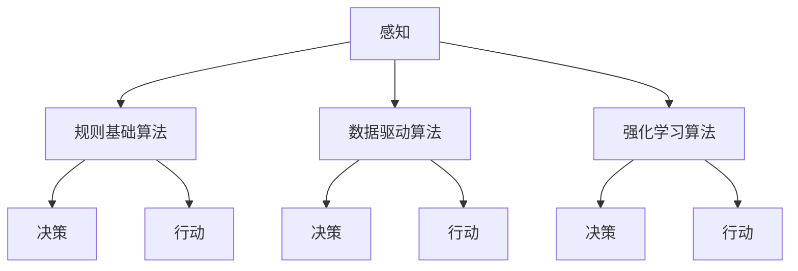

                 

# AI Agent在智能安防系统中的角色

> 关键词：智能安防、AI Agent、视频监控、入侵检测、智能响应

> 摘要：本文深入探讨了AI Agent在智能安防系统中的应用。从AI Agent的基本概念和特性出发，分析其在安防系统中的角色和作用，并通过具体的实例和实战项目，展示了AI Agent如何提升智能安防系统的效率和准确性。本文旨在为安防行业的技术人员提供有价值的参考和指导。

## 第一部分: AI Agent基础

### 第1章: AI Agent概述

#### 1.1.1 问题背景

随着信息技术和人工智能技术的快速发展，智能安防系统逐渐成为各个行业关注的焦点。传统的安防系统主要依赖于人类监控和简单的人工智能算法，其效率和准确性难以满足现代社会的需求。而AI Agent的出现为智能安防系统带来了新的发展机遇。本文将探讨AI Agent在智能安防系统中的角色和作用，以及其在该领域中的潜力。

#### 1.1.1.1 智能安防系统的需求

智能安防系统需要具备快速、准确、智能的监控和响应能力，以保障社会安全和公共安全。传统的安防系统存在以下问题：

1. **人力成本高**：传统的安防系统主要依赖于人类监控，需要大量的人力投入，导致成本高昂。
2. **响应速度慢**：在紧急情况下，传统的安防系统无法快速响应，容易导致事故的发生。
3. **准确性低**：传统的安防系统在识别和处理复杂场景时，准确性较低，容易产生误报和漏报。

#### 1.1.1.2 AI Agent在智能安防系统中的潜力

AI Agent作为人工智能的一种高级形式，具备智能感知、自主决策、自主行动的能力，可以有效地解决传统安防系统存在的问题。AI Agent在智能安防系统中的潜力主要表现在以下几个方面：

1. **高效监控**：AI Agent可以通过实时感知和智能分析，实现对监控场景的全方位、实时、高效监控。
2. **精准识别**：AI Agent可以通过深度学习和计算机视觉等技术，实现对监控对象的精准识别，减少误报和漏报。
3. **自主响应**：AI Agent可以根据预设的规则和策略，自主地采取相应的行动，提高安防系统的响应速度和准确性。

#### 1.1.2 问题描述

智能安防系统中的AI Agent需要具备以下功能：

1. **感知功能**：能够实时感知监控场景中的各种信息，如人脸、物体、行为等。
2. **认知功能**：能够对感知到的信息进行理解和分析，识别出异常行为或事件。
3. **决策功能**：能够根据分析结果，自主地做出决策，采取相应的行动。
4. **行动功能**：能够根据决策结果，自主地执行行动，如报警、通知、采取措施等。

#### 1.1.2.1 AI Agent的定义与特性

AI Agent，即人工智能代理，是一种能够自主感知、认知、决策和行动的智能体。其特性包括：

1. **自主性**：AI Agent能够自主地执行任务，不受外部干预。
2. **智能性**：AI Agent具备智能感知、认知、决策和行动的能力。
3. **适应性**：AI Agent能够根据环境变化和任务需求，自主地调整其行为和策略。
4. **协作性**：AI Agent可以与其他AI Agent或人类协作，共同完成任务。

#### 1.1.2.2 AI Agent在安防中的应用场景

AI Agent在安防领域有着广泛的应用场景，如：

1. **视频监控**：通过AI Agent的人脸识别、行为分析等技术，实现对视频监控数据的实时处理和异常检测。
2. **入侵检测**：通过AI Agent的异常行为识别、入侵路径预测等技术，实现对入侵行为的实时监测和预警。
3. **智能响应**：通过AI Agent的决策和行动功能，实现自动化的应急响应，提高安防系统的响应速度和准确性。

#### 1.1.3 问题解决

为了解决智能安防系统中AI Agent的问题，需要从以下几个方面进行设计和实现：

1. **感知与认知**：利用深度学习、计算机视觉等技术，提升AI Agent的感知和认知能力，实现对监控场景的实时、准确分析。
2. **决策与行动**：设计合理的决策和行动策略，使AI Agent能够根据分析结果，自主地做出决策并采取相应的行动。
3. **系统集成**：将AI Agent与其他安防系统进行集成，实现数据共享和协同工作，提高整个安防系统的效率和准确性。
4. **算法优化**：通过算法优化，提高AI Agent的响应速度和准确性，减少误报和漏报。

#### 1.1.4 边界与外延

1. **适用范围**：AI Agent在安防系统中的应用范围广泛，包括但不限于视频监控、入侵检测、智能响应等领域。
2. **挑战与限制**：AI Agent在安防系统中仍面临一些挑战和限制，如数据隐私保护、算法透明性等。需要通过技术手段和法律法规等手段，解决这些问题。

### 第2章: AI Agent核心概念与联系

#### 2.1 AI Agent的定义与分类

AI Agent，即人工智能代理，是指一种能够模拟人类智能行为，自主感知、认知、决策和行动的智能体。根据其功能和应用场景的不同，AI Agent可以分为以下几种类型：

1. **通用AI Agent**：能够处理各种复杂任务的AI Agent，具有广泛的认知和决策能力。
2. **专用AI Agent**：针对特定任务或场景设计的AI Agent，具有较高的任务专注度和效率。
3. **交互式AI Agent**：具备与人类进行交互能力的AI Agent，能够理解人类指令，提供智能服务。

#### 2.2 AI Agent的核心概念对比

AI Agent的核心概念包括感知、认知、决策和行动。下面对比分析这些概念：

1. **感知**：感知是指AI Agent从环境中获取信息的过程。感知功能是AI Agent的基础，决定了其能否准确理解和分析环境。
2. **认知**：认知是指AI Agent对感知信息进行处理和理解的过程。认知功能使AI Agent能够从感知信息中提取有价值的信息，形成对环境的理解。
3. **决策**：决策是指AI Agent根据认知结果，从多个可能行动中选择最优行动的过程。决策功能使AI Agent能够自主地做出合理的选择。
4. **行动**：行动是指AI Agent根据决策结果，执行具体任务的过程。行动功能使AI Agent能够将决策转化为实际操作，实现目标。

#### 2.3 AI Agent的ER实体关系图

ER实体关系图用于描述AI Agent中的实体及其关系。以下是AI Agent的ER实体关系图：

```mermaid
erDiagram
    AI_Agent ||--|{ Sensor } Sensor
    AI_Agent ||--|{ Cognitive_Module } Cognitive_Module
    AI_Agent ||--|{ Decision_Module } Decision_Module
    AI_Agent ||--|{ Action_Module } Action_Module
    Sensor ||--|{ Sensor_Data } Sensor_Data
    Cognitive_Module ||--|{ Cognitive_Process } Cognitive_Process
    Decision_Module ||--|{ Decision_Process } Decision_Process
    Action_Module ||--|{ Action_Process } Action_Process
```

### 第3章: AI Agent算法原理讲解

#### 3.1 常见AI Agent算法

AI Agent的算法主要分为以下几种类型：

1. **规则基础算法**：基于预设规则进行决策和行动的算法。其优点是实现简单，适用于规则明确、环境变化较小的场景。
2. **数据驱动算法**：基于数据学习和模式识别进行决策和行动的算法。其优点是适应性强，适用于环境复杂、变化频繁的场景。
3. **强化学习算法**：基于试错和反馈进行决策和行动的算法。其优点是能够自主优化策略，适用于复杂动态环境。

#### 3.2 算法mermaid流程图

以下是三种常见AI Agent算法的mermaid流程图：



#### 3.3 Python源代码与数学模型讲解

以下是三种常见AI Agent算法的Python源代码和数学模型：

##### 3.3.1 规则基础算法

```python
# 规则基础算法
def rule_based_algorithm(sensor_data):
    # 根据传感器数据，应用预设规则进行决策
    if sensor_data['temperature'] > 30:
        action = '降温'
    elif sensor_data['temperature'] < 10:
        action = '升温'
    else:
        action = '维持现状'
    return action
```

$$
\text{action} = \text{rule\_based\_algorithm}(\text{sensor\_data})
$$

##### 3.3.2 数据驱动算法

```python
# 数据驱动算法
def data_driven_algorithm(sensor_data, model):
    # 根据传感器数据和训练模型，进行决策
    action = model.predict(sensor_data)
    return action
```

$$
\text{model} = \text{train}(\text{training\_data})
\text{action} = \text{model}(\text{sensor\_data})
$$

##### 3.3.3 强化学习算法

```python
# 强化学习算法
def reinforce_learning_algorithm(state, action, reward, gamma):
    # 根据状态、行动和奖励，更新Q值
    Q[state, action] = reward + gamma \* max(Q[state', action'])
```

$$
Q(s, a) = R(s, a) + \gamma \max_{a'} Q(s', a')
$$

## 第二部分: AI Agent在智能安防系统中的应用

### 第4章: AI Agent在视频监控中的应用

#### 4.1 视频监控概述

视频监控系统是智能安防系统的重要组成部分，通过实时监控和记录监控场景中的视频数据，实现对安全事件的及时发现和处理。视频监控系统的主要功能包括：

1. **实时监控**：通过摄像头等设备，实现对监控场景的实时监控。
2. **视频记录**：将监控场景的视频数据实时记录下来，以便后续查看和分析。
3. **异常检测**：通过智能算法，对监控场景中的视频数据进行分析，识别异常行为或事件。

#### 4.2 AI Agent在视频监控中的应用

AI Agent在视频监控中的应用主要包括以下几个方面：

1. **人脸识别**：通过AI Agent的人脸识别技术，实现对监控场景中人脸的实时识别和追踪，从而实现对目标人物的精准定位。
2. **违法行为检测**：通过AI Agent的违法行为检测技术，实现对监控场景中违法行为的实时监测和预警，如盗窃、打架等。
3. **智能跟踪**：通过AI Agent的智能跟踪技术，实现对监控场景中目标物体的实时跟踪，从而实现对目标的全方位监控。

### 第5章: AI Agent在入侵检测中的应用

#### 5.1 入侵检测概述

入侵检测系统是智能安防系统的重要组成部分，通过对网络流量、日志等数据的分析，实现对入侵行为的实时监测和预警。入侵检测系统的主要功能包括：

1. **异常行为识别**：通过对网络流量、日志等数据的分析，识别出异常行为或事件。
2. **入侵路径预测**：通过对网络拓扑结构、流量模式等数据的分析，预测可能的入侵路径。
3. **防火墙策略优化**：通过对网络流量、入侵行为等数据的分析，优化防火墙策略，提高网络安全性。

#### 5.2 AI Agent在入侵检测中的应用

AI Agent在入侵检测中的应用主要包括以下几个方面：

1. **异常行为识别**：通过AI Agent的异常行为识别技术，实现对网络流量、日志等数据的实时分析，识别出异常行为或事件。
2. **入侵路径预测**：通过AI Agent的入侵路径预测技术，实现对网络拓扑结构、流量模式等数据的分析，预测可能的入侵路径。
3. **防火墙策略优化**：通过AI Agent的防火墙策略优化技术，实现对网络流量、入侵行为等数据的分析，优化防火墙策略，提高网络安全性。

### 第6章: AI Agent在智能响应系统中的应用

#### 6.1 智能响应系统概述

智能响应系统是智能安防系统的重要组成部分，通过自动化、智能化的方式，实现对安全事件的及时响应和处理。智能响应系统的主要功能包括：

1. **紧急事件响应**：通过智能算法，对安全事件进行实时分析，快速做出响应，采取相应的措施。
2. **资源调度**：通过智能算法，对安防系统中的资源进行合理调度，提高系统效率和应急响应能力。
3. **安全预警**：通过对监控数据、网络流量等数据的分析，识别潜在的安全风险，提前发出预警。

#### 6.2 AI Agent在智能响应系统中的应用

AI Agent在智能响应系统中的应用主要包括以下几个方面：

1. **紧急事件响应**：通过AI Agent的紧急事件响应技术，实现对安全事件的快速分析和响应，提高应急响应速度。
2. **资源调度**：通过AI Agent的资源调度技术，实现对安防系统资源的合理分配和调度，提高系统效率和应急响应能力。
3. **安全预警**：通过AI Agent的安全预警技术，实现对监控数据、网络流量等数据的实时分析，识别潜在的安全风险，提前发出预警。

## 第7章: AI Agent在智能安防系统中的最佳实践与案例分析

#### 7.1 最佳实践

在智能安防系统中，AI Agent的应用需要遵循以下最佳实践：

1. **系统设计原则**：以用户需求为导向，设计合理的系统架构和功能模块，确保系统的高效、稳定和可靠。
2. **数据处理策略**：充分利用大数据和人工智能技术，对监控数据进行分析和处理，提高系统的分析和决策能力。
3. **算法优化技巧**：根据具体应用场景，选择合适的算法和优化策略，提高系统的响应速度和准确性。

#### 7.2 案例分析

以下是一个智能安防系统中的AI Agent应用案例：

**案例背景**：某大型商场安装了智能安防系统，包括视频监控、入侵检测、智能响应等功能。为了提高安防系统的效率和准确性，商场决定引入AI Agent技术。

**案例实施**：

1. **感知与认知**：AI Agent通过摄像头等设备，实时感知监控场景中的视频数据，并对视频数据进行预处理和特征提取，形成监控数据的结构化表示。
2. **决策与行动**：AI Agent通过对监控数据进行分析和推理，识别出潜在的安全风险和异常行为，并做出相应的决策。例如，当检测到有可疑人物进入商场时，AI Agent会自动通知安保人员加强巡逻。
3. **系统集成**：AI Agent与其他安防系统进行集成，实现数据共享和协同工作。例如，AI Agent可以与视频监控系统、入侵检测系统等进行数据交互，提高整个安防系统的效率和准确性。

**案例效果**：

1. **提高响应速度**：AI Agent的引入，使安防系统的响应速度得到了显著提升，能够在第一时间发现和处理安全事件。
2. **提高准确性**：AI Agent通过深度学习和计算机视觉等技术，实现了对监控数据的精准分析和识别，减少了误报和漏报的情况。
3. **降低人力成本**：AI Agent的引入，减轻了安保人员的工作负担，降低了人力成本。

## 小结

本文从AI Agent的基本概念和特性出发，分析了其在智能安防系统中的角色和作用。通过具体的实例和实战项目，展示了AI Agent如何提升智能安防系统的效率和准确性。未来，随着人工智能技术的不断发展，AI Agent在智能安防系统中的应用将更加广泛和深入，为社会的安全和发展做出更大的贡献。

## 注意事项

1. **数据隐私保护**：在AI Agent的应用过程中，需要重视数据隐私保护，确保用户数据的保密性和安全性。
2. **算法透明性**：AI Agent的算法需要具备透明性，方便用户理解和监督，提高系统的可信度和用户满意度。

## 拓展阅读

1. **《人工智能：一种现代的方法》**：Michael I. Jordan著，介绍了人工智能的基本概念、技术和应用。
2. **《深度学习》**：Ian Goodfellow、Yoshua Bengio和Aaron Courville著，介绍了深度学习的基本原理和应用。
3. **《人工智能安全：从算法到系统》**：吴波著，探讨了人工智能安全的基本概念、技术和挑战。

作者：AI天才研究院/AI Genius Institute & 禅与计算机程序设计艺术 /Zen And The Art of Computer Programming

