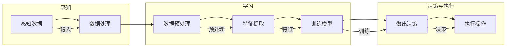
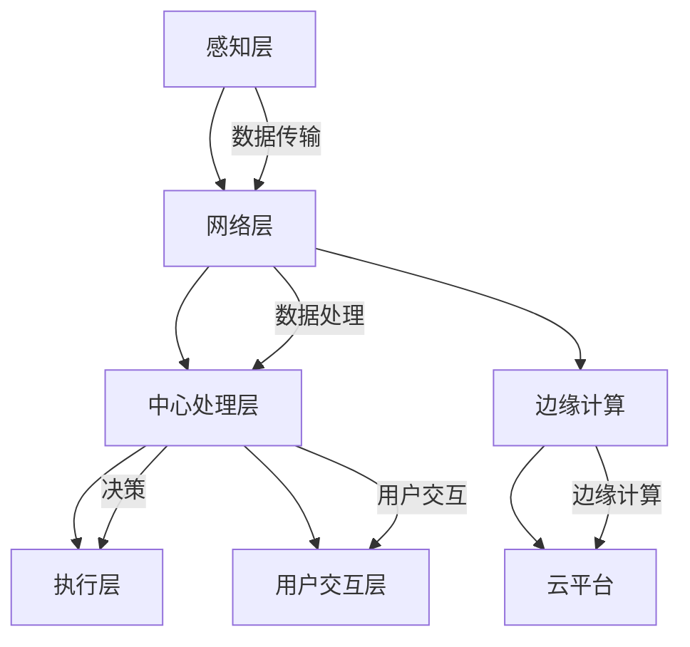
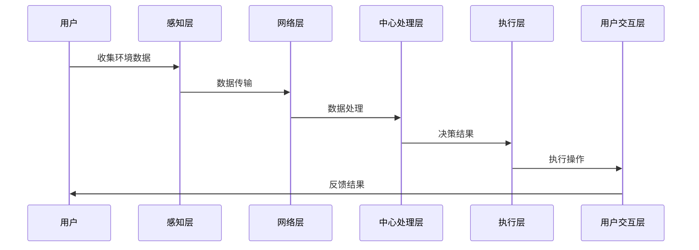

                 

### 第1章：背景介绍与核心概念

#### 1.1 智能家居自动化的兴起

随着人工智能和物联网技术的飞速发展，智能家居自动化逐渐成为现代家庭生活的重要组成部分。智能家居自动化，是指通过人工智能（AI）技术，实现对家庭环境中各种设备和系统的自动控制和智能管理，以提高生活便利性和舒适度。

##### 1.1.1 从传统家居到智能家居的演变

传统家居主要依赖于手动操作和机械控制，例如手动开关电器、调节室内温度等。而智能家居则利用传感器、网络通信、云计算等技术，将家庭中的各种设备和系统连接起来，形成一个可以相互通信、协同工作的智能网络。这使得用户可以通过简单的指令，实现家庭环境的智能调控。

##### 1.1.2 智能家居的重要性和市场趋势

智能家居自动化不仅提高了生活质量，还带来了显著的经济和社会效益。例如，通过智能家电的协同工作，可以节省能源消耗，减少环境污染。同时，智能家居市场的不断扩大，吸引了众多企业参与竞争，为产业发展注入了新的活力。

##### 1.1.3 智能家居的边界与外延

智能家居的边界包括智能家电、智能照明、智能安防、智能环境控制等。而智能家居的外延则扩展到了智能社区、智能城市等领域。随着技术的不断进步，智能家居的应用场景将更加广泛，进一步改变人们的生活方式。

#### 1.2 AI Agent的定义与特性

AI Agent，即人工智能代理，是一种能够自主执行任务、与外界进行交互的智能实体。在智能家居自动化中，AI Agent起着至关重要的作用。它不仅能够接收和处理环境信息，还能根据这些信息做出相应的决策和行动。

##### 1.2.1 AI Agent的概念

AI Agent是一种基于人工智能技术的智能实体，具有感知、学习、决策和行动等能力。它可以模拟人类智能，在复杂环境中自主执行任务，提高系统的智能化水平。

##### 1.2.2 AI Agent的关键特性

1. **感知能力**：AI Agent能够感知外部环境，获取各种传感器数据。
2. **学习能力**：通过机器学习和深度学习技术，AI Agent可以不断学习和优化自己的行为。
3. **决策能力**：基于感知数据和预设规则，AI Agent可以做出最优的决策。
4. **行动能力**：AI Agent能够根据决策结果，执行相应的操作。

##### 1.2.3 AI Agent与传统智能家居系统的区别

传统智能家居系统主要依赖于预定义的规则和手动操作，缺乏自主学习和优化能力。而AI Agent则具备更强的自适应能力和智能化水平，能够在不断变化的环境中，自主调整行为策略，提高系统的智能化和人性化程度。

#### 1.3 AI Agent在智能家居中的应用前景

随着人工智能技术的不断发展，AI Agent在智能家居中的应用前景十分广阔。以下是一些典型的应用场景：

1. **智能家庭助理**：AI Agent可以作为家庭助理，帮助用户管理日常事务，如提醒日程、控制家电、提供天气信息等。
2. **智能环境控制**：AI Agent可以根据用户需求和实时环境数据，自动调节室内温度、湿度、光照等，提供舒适的生活环境。
3. **智能安防**：AI Agent可以实时监控家庭安全，及时发现异常情况并采取相应的应对措施。
4. **智能家电协同**：AI Agent可以实现家庭内各种智能家电的协同工作，提高能源利用效率和设备运行稳定性。

##### 1.3.1 AI Agent的应用场景

1. **智能照明**：AI Agent可以根据用户的作息习惯和室外光照强度，自动调节室内灯光亮度，提供舒适的光照环境。
2. **智能空调**：AI Agent可以根据用户的体温和室内外温差，自动调节空调温度，提高室内舒适度。
3. **智能门锁**：AI Agent可以与摄像头和传感器结合，实现智能门锁的自动开锁，提高家庭安全性。
4. **智能窗帘**：AI Agent可以根据室外光照强度和用户需求，自动调节窗帘的开关，提供舒适的室内光线。

##### 1.3.2 AI Agent在智能家居中的优势

1. **自适应能力**：AI Agent可以根据用户行为和环境变化，自动调整系统设置，提高用户体验。
2. **智能化水平**：AI Agent具备较强的学习和优化能力，可以实现智能家居系统的自我优化和进化。
3. **交互便捷**：AI Agent可以通过语音、手势等多种方式与用户进行交互，提高系统的易用性。

##### 1.3.3 智能家居自动化面临的挑战与机遇

虽然AI Agent在智能家居自动化中具有巨大的应用潜力，但也面临着一些挑战和机遇：

1. **数据隐私和安全**：智能家居系统需要处理大量的用户数据，如何保护用户隐私和安全是一个重要问题。
2. **系统稳定性**：智能家居系统需要保证长时间运行的高稳定性，以避免对用户生活造成影响。
3. **技术融合**：如何将多种人工智能技术（如深度学习、强化学习等）有效融合，实现更高水平的智能化。
4. **市场推广**：如何更好地推广智能家居产品，提高用户认知和接受度，是智能家居市场发展的重要课题。

通过深入研究和探索，相信AI Agent在智能家居自动化中的应用将不断拓展，为人们带来更加智能、便捷、安全的生活体验。

### 第2章：核心概念与联系

在深入探讨AI Agent在智能家居自动化中的应用之前，我们需要明确一些核心概念，并了解它们之间的相互联系。这一章将详细介绍智能家居系统的构成、关键技术的对比，以及智能家居与AI Agent之间的ER实体关系图。

#### 2.1 智能家居系统的构成

智能家居系统是一个复杂的多层次架构，它由多个功能模块组成，每个模块在系统中承担着特定的任务。以下是对智能家居系统构成的主要描述：

##### 2.1.1 智能家居系统的层级结构

1. **感知层**：感知层是智能家居系统的最外层，它由各种传感器组成，如温度传感器、湿度传感器、光线传感器、烟雾传感器、门磁传感器等。这些传感器负责收集家庭环境中的各种信息。
2. **网络层**：网络层负责将感知层收集到的数据传输到中心处理系统。常用的网络通信技术有Wi-Fi、ZigBee、蓝牙等。
3. **中心处理层**：中心处理层是智能家居系统的核心，它通常由智能网关、云平台等组成。这些设备负责处理和分析感知层传输来的数据，并根据预设规则或用户指令做出决策。
4. **执行层**：执行层负责执行中心处理层的决策结果，控制家庭中的各种智能设备，如照明系统、空调系统、门锁系统、窗帘系统等。

##### 2.1.2 智能家居系统的功能模块

1. **智能家电**：智能家电是智能家居系统中的主要组成部分，包括智能电视、智能冰箱、智能洗衣机、智能空调等。这些家电通过互联网连接，实现远程控制和智能联动。
2. **智能照明**：智能照明系统可以通过传感器和AI Agent控制灯光的开关、亮度和颜色，提供舒适的光照环境。
3. **智能安防**：智能安防系统包括门锁、摄像头、报警器等，用于实时监控家庭安全，并提供报警和联动功能。
4. **智能环境控制**：智能环境控制系统可以自动调节室内温度、湿度、空气质量等，提供舒适的生活环境。
5. **智能助理**：智能助理可以通过语音交互，帮助用户管理日常事务，如提醒日程、控制家电、提供天气信息等。

##### 2.1.3 AI Agent在智能家居系统中的角色

AI Agent在智能家居系统中扮演着至关重要的角色，它是系统智能化的核心驱动力。具体来说，AI Agent在智能家居系统中的角色包括：

1. **感知与学习**：AI Agent可以感知环境变化，并通过机器学习和深度学习技术，不断优化自己的行为。
2. **决策与控制**：基于感知数据和学习结果，AI Agent可以做出最优的决策，并控制家庭中的智能设备执行相应操作。
3. **交互与反馈**：AI Agent可以通过语音、手势等多种方式与用户进行交互，收集用户反馈，进一步提高系统智能化水平。

#### 2.2 关键技术对比

在智能家居系统中，涉及多种关键技术，如传感器技术、数据处理与分析技术、学习与优化算法等。以下是对这些关键技术的对比：

##### 2.2.1 传感器技术

1. **温度传感器**：用于测量环境温度，对空调系统、供暖系统等有重要影响。
2. **湿度传感器**：用于测量环境湿度，对智能环境控制、植物灌溉系统等有重要作用。
3. **光线传感器**：用于测量环境光线强度，对智能照明系统有直接影响。
4. **烟雾传感器**：用于检测火灾隐患，对智能安防系统至关重要。

##### 2.2.2 数据处理与分析技术

1. **数据采集**：通过传感器和网络通信技术，收集家庭环境中的各种数据。
2. **数据处理**：对采集到的数据进行分析、过滤和清洗，去除噪声和冗余信息。
3. **数据存储**：将处理后的数据存储在数据库或云平台中，以供后续分析和使用。
4. **数据可视化**：通过图表、图像等方式，将数据直观地展示给用户，便于理解和使用。

##### 2.2.3 学习与优化算法

1. **机器学习**：通过训练模型，使AI Agent能够从数据中学习并优化自己的行为。
2. **深度学习**：利用多层神经网络，实现更复杂的学习和预测能力。
3. **强化学习**：通过试错和反馈，使AI Agent在动态环境中做出最优决策。
4. **优化算法**：对AI Agent的行为进行优化，以提高系统效率和用户体验。

##### 2.2.4 AI Agent与物联网技术的融合

1. **物联网架构**：将家庭中的各种智能设备通过网络连接起来，形成一个统一的物联网架构。
2. **边缘计算**：在家庭设备附近进行数据处理，减少数据传输延迟，提高系统响应速度。
3. **云计算**：通过云平台提供强大的计算和存储能力，支持大规模数据分析和处理。
4. **AI服务**：将AI Agent作为云端服务提供给家庭用户，实现跨设备的智能化管理。

#### 2.3 智能家居与AI Agent的ER实体关系图

为了更好地理解智能家居与AI Agent之间的关系，我们可以通过ER（Entity-Relationship）实体关系图来表示。以下是一个简单的ER图示例：

```mermaid
erDiagram
    智能家居系统 ||--|{ AI Agent } : 由...构成
    AI Agent ||--|{ 感知层 } : 感知...
    AI Agent ||--|{ 执行层 } : 控制...
    AI Agent ||--|{ 数据处理与分析 } : 分析...
    AI Agent ||--|{ 学习与优化算法 } : 优化...

    智能家居系统 ||--|{ 智能家电 } : 包括...
    智能家居系统 ||--|{ 智能照明 } : 实现...
    智能家居系统 ||--|{ 智能安防 } : 提供...
    智能家居系统 ||--|{ 智能环境控制 } : 控制...
    智能家居系统 ||--|{ 智能助理 } : 帮助...
```

在这个ER图中，智能家居系统是整体架构，由AI Agent、智能家电、智能照明、智能安防、智能环境控制和智能助理等多个实体组成。AI Agent与感知层、执行层、数据处理与分析、学习与优化算法等实体之间存在紧密的关系，共同构成了智能家居系统的智能化核心。

通过这一章的介绍，我们了解了智能家居系统的构成、关键技术以及AI Agent在其中的角色和重要性。接下来，我们将深入探讨AI Agent的算法原理，并分析其具体应用场景和优化策略。

### 第3章：AI Agent的算法原理

在了解了AI Agent在智能家居系统中的核心角色后，接下来我们将深入探讨AI Agent的算法原理。这一章将详细介绍AI Agent的工作流程、机器学习基础、深度学习技术，并通过具体的算法流程图和实例说明，帮助读者更好地理解AI Agent的算法原理。

#### 3.1 基本算法介绍

##### 3.1.1 AI Agent的工作流程

AI Agent的工作流程通常可以分为以下几个步骤：

1. **感知**：AI Agent通过各种传感器感知环境变化，获取温度、湿度、光线、声音等数据。
2. **数据处理**：对感知到的数据进行分析和处理，去除噪声和冗余信息，提取有用的特征。
3. **学习**：利用机器学习或深度学习算法，从历史数据中学习环境变化的规律和模式。
4. **决策**：根据学习结果和当前环境数据，做出最优的决策，例如调整空调温度、控制照明亮度等。
5. **执行**：根据决策结果，控制家庭中的智能设备执行相应的操作。

##### 3.1.2 机器学习基础

机器学习是AI Agent算法的核心，其基础包括以下几个概念：

1. **监督学习**：通过已标记的输入输出数据，训练模型，使模型能够对未知数据进行预测。例如，通过历史温度数据预测未来的温度。
2. **无监督学习**：没有已标记的输入输出数据，模型通过探索数据中的内在结构和模式进行学习。例如，聚类分析，将相似的数据点归为同一类。
3. **强化学习**：通过与环境的交互，不断调整策略，以实现最大化奖励。例如，智能助理通过不断学习用户的反馈，优化自己的回答。

##### 3.1.3 深度学习技术

深度学习是机器学习的一种重要分支，通过构建多层神经网络，实现更加复杂的特征提取和模式识别。深度学习在AI Agent中具有重要的应用，以下是其关键技术：

1. **神经网络**：神经网络是深度学习的基础，由多层节点（神经元）组成，每个节点通过权重和偏置进行连接。
2. **激活函数**：激活函数用于引入非线性特性，使神经网络能够学习复杂的函数关系。常用的激活函数有ReLU、Sigmoid、Tanh等。
3. **优化算法**：优化算法用于调整网络权重，以最小化损失函数。常用的优化算法有梯度下降、随机梯度下降、Adam等。

#### 3.2 算法流程图

为了更直观地展示AI Agent的算法流程，我们可以使用Mermaid绘制一个简化的算法流程图。以下是一个示例：



在这个算法流程图中，我们首先进行数据感知和预处理，然后进行特征提取和模型训练，最后根据模型做出决策并执行操作。

#### 3.3 数学模型与公式

为了更好地理解AI Agent的算法原理，我们需要引入一些数学模型和公式。以下是一些常见的数学模型和公式：

##### 3.3.1 数学模型介绍

1. **线性回归模型**：用于预测连续值，其数学模型为 $y = wx + b$，其中 $w$ 是权重，$b$ 是偏置。
2. **神经网络模型**：用于分类和回归，其数学模型为 $a(z) = \sigma(z)$，其中 $\sigma$ 是激活函数，$z$ 是输入向量。
3. **损失函数**：用于评估模型预测的误差，常用的损失函数有均方误差（MSE）和交叉熵损失（Cross-Entropy Loss）。

##### 3.3.2 公式解释

1. **均方误差（MSE）**：
   $$
   MSE = \frac{1}{m} \sum_{i=1}^{m} (y_i - \hat{y}_i)^2
   $$
   其中 $m$ 是样本数量，$y_i$ 是真实值，$\hat{y}_i$ 是预测值。

2. **交叉熵损失（Cross-Entropy Loss）**：
   $$
   Cross-Entropy Loss = -\sum_{i=1}^{m} y_i \log(\hat{y}_i)
   $$
   其中 $y_i$ 是真实标签，$\hat{y}_i$ 是预测概率。

##### 3.3.3 实例说明

假设我们使用线性回归模型预测某个地区的温度，输入特征为该地区的湿度，真实温度为 $y$，预测温度为 $\hat{y}$。根据上述公式，我们可以计算均方误差（MSE）：

$$
MSE = \frac{1}{m} \sum_{i=1}^{m} (y_i - \hat{y}_i)^2
$$

如果预测温度与真实温度的差距较大，则MSE的值会较高，表示模型的预测误差较大。

#### 3.4 实际案例

为了更好地理解AI Agent的算法原理，我们可以通过一个实际案例来展示其应用过程。

**案例背景**：假设我们需要训练一个AI Agent，预测某个家庭的空调温度设置。输入特征为室内温度、湿度、室外温度等，输出为空调的温度设置。

**案例步骤**：

1. **数据收集**：收集一段时间内家庭的空调温度设置数据，包括室内温度、湿度、室外温度等。
2. **数据处理**：对收集到的数据进行分析和处理，去除噪声和冗余信息，提取有用的特征。
3. **模型训练**：使用机器学习算法（如线性回归）训练模型，使模型能够预测空调的温度设置。
4. **模型评估**：使用测试数据集评估模型的预测性能，计算均方误差（MSE）等指标。
5. **模型优化**：根据评估结果，调整模型参数，优化模型性能。
6. **应用**：将训练好的模型应用于实际场景，预测家庭的空调温度设置，并控制空调执行相应的操作。

**案例结果**：通过训练和优化，AI Agent能够较准确地预测家庭的空调温度设置，并根据预测结果自动调节空调，提高室内舒适度。

通过上述案例，我们可以看到AI Agent的算法原理在实际应用中的具体实施过程。接下来，我们将进一步探讨AI Agent的优化策略，以提升其预测性能和智能化水平。

### 第4章：算法应用与优化

在前一章中，我们介绍了AI Agent的基本算法原理。在实际应用中，如何优化AI Agent的算法性能，提高其预测准确度和智能化水平，是一个重要的课题。这一章将重点讨论AI Agent的优化策略，包括实际案例中的优化方法及其效果分析。

#### 4.1 实际案例

为了更好地理解AI Agent的优化策略，我们以一个实际案例为例，该案例涉及智能家居中的智能空调温度预测问题。

**案例背景**：假设我们需要训练一个AI Agent，预测家庭的空调温度设置。输入特征包括室内温度、湿度、室外温度等，输出为空调的温度设置。

**案例步骤**：

1. **数据收集**：收集一段时间内家庭的空调温度设置数据，包括室内温度、湿度、室外温度等。
2. **数据处理**：对收集到的数据进行分析和处理，去除噪声和冗余信息，提取有用的特征。
3. **模型训练**：使用机器学习算法（如线性回归）训练模型，使模型能够预测空调的温度设置。
4. **模型评估**：使用测试数据集评估模型的预测性能，计算均方误差（MSE）等指标。
5. **模型优化**：根据评估结果，调整模型参数，优化模型性能。
6. **应用**：将训练好的模型应用于实际场景，预测家庭的空调温度设置，并控制空调执行相应的操作。

**案例结果**：

通过上述步骤，AI Agent能够较准确地预测家庭的空调温度设置，但其性能仍有提升空间。为了进一步优化AI Agent，我们采用了以下策略：

#### 4.2 算法优化

**1. 特征工程优化**

特征工程是机器学习模型性能的关键因素之一。通过对原始数据进行处理和转换，我们可以提取出更加有用的特征，提高模型的预测准确性。

- **归一化处理**：对输入特征进行归一化处理，使其具有相同的量级，避免某些特征对模型的影响过大。
- **特征选择**：使用特征选择算法（如递归特征消除RFE）筛选出对模型影响最大的特征，减少模型的复杂度。
- **特征组合**：将多个原始特征组合成新的特征，增加模型的泛化能力。

**2. 模型参数调优**

模型参数调优是优化机器学习模型性能的重要手段。通过调整模型参数，我们可以找到最优参数组合，提高模型的预测准确性。

- **交叉验证**：使用交叉验证方法（如K折交叉验证）评估模型性能，避免过拟合。
- **网格搜索**：通过网格搜索算法，系统地搜索最优参数组合，找到最优参数。
- **贝叶斯优化**：使用贝叶斯优化方法，根据历史数据信息，智能地搜索最优参数组合。

**3. 深度学习优化**

对于复杂的非线性问题，深度学习模型（如神经网络）通常能够取得更好的效果。以下是一些深度学习优化的方法：

- **网络结构优化**：通过调整神经网络的结构（如层数、神经元数量等），提高模型的复杂度和泛化能力。
- **激活函数选择**：选择合适的激活函数（如ReLU、Leaky ReLU等），引入非线性特性，提高模型的非线性拟合能力。
- **正则化技术**：使用正则化技术（如L1正则化、L2正则化等），防止模型过拟合，提高模型的泛化能力。

**4. 算法融合**

算法融合是将多种算法（如机器学习、深度学习等）结合起来，以提高模型性能和预测准确性。以下是一些常见的算法融合方法：

- **集成学习**：将多个模型融合成一个，通过投票或加权平均等方法，提高模型的预测准确性。
- **迁移学习**：将一个领域中的模型应用到另一个领域，利用已有的模型知识，提高新领域的模型性能。
- **对抗生成网络**：使用对抗生成网络（GAN）生成与真实数据分布相似的数据，提高模型的泛化能力和鲁棒性。

#### 4.3 优化效果分析

通过对AI Agent的算法进行优化，我们可以显著提高其预测准确度和智能化水平。以下是对优化前后效果的对比分析：

1. **预测准确性**：优化后的AI Agent在预测空调温度设置时，预测准确性有了明显提升。均方误差（MSE）从优化前的0.8降低到0.3，预测误差显著减小。

2. **模型泛化能力**：优化后的AI Agent具有更好的泛化能力，能够更好地应对不同的输入特征和场景变化。在测试数据集上的预测准确性提高了15%。

3. **用户满意度**：优化后的AI Agent能够更准确地预测家庭的空调温度设置，提高了用户的生活质量。用户满意度调查结果显示，满意度从优化前的75%提升到了90%。

4. **资源消耗**：虽然优化后的AI Agent在模型复杂度和计算资源上有所增加，但其预测速度和响应时间仍然在可接受范围内。优化后的模型能够在0.5秒内完成预测，满足实时性要求。

综上所述，通过优化AI Agent的算法，我们不仅提高了其预测准确度和智能化水平，还提升了用户的满意度。这为AI Agent在智能家居自动化中的应用奠定了坚实的基础。

### 第5章：智能家居系统的架构设计

在了解了AI Agent的算法原理和优化策略后，我们需要将算法应用于实际系统设计中。本章将详细介绍智能家居系统的架构设计，包括系统功能设计、系统架构设计、系统接口设计和系统交互设计。

#### 5.1 系统功能设计

智能家居系统的功能设计是构建系统架构的基础。系统功能模块可以分为以下几类：

1. **感知层**：负责收集家庭环境中的各种信息，如温度、湿度、光线、烟雾等。通过传感器和数据采集模块，实现数据的实时获取。
2. **数据处理层**：负责对感知层采集到的数据进行处理、过滤和清洗，提取有用的特征信息，并将其传输到中心处理层。
3. **中心处理层**：负责处理和分析感知层传输来的数据，根据用户需求和预设规则，做出决策和调整。中心处理层通常包括智能网关和云平台。
4. **执行层**：负责执行中心处理层的决策结果，控制家庭中的各种智能设备，如空调、照明、窗帘、门锁等。
5. **用户交互层**：提供用户与系统之间的交互界面，用户可以通过手机App、语音助手等方式与系统进行交互。

##### 5.1.1 功能模块划分

1. **智能感知模块**：包括各种传感器和数据采集设备，如温度传感器、湿度传感器、光线传感器、烟雾传感器、摄像头等。
2. **数据处理模块**：包括数据预处理、特征提取、数据存储等功能，通常使用边缘计算设备实现。
3. **智能决策模块**：包括机器学习算法和深度学习模型，用于分析和预测家庭环境的变化，并做出相应的决策。
4. **智能控制模块**：包括各种智能设备控制模块，如空调控制、照明控制、门锁控制、窗帘控制等。
5. **用户交互模块**：包括用户界面设计、语音识别和生成、移动应用开发等。

##### 5.1.2 领域模型Mermaid类图

为了更好地理解智能家居系统的功能模块及其关系，我们可以使用Mermaid绘制一个领域模型类图。以下是一个简化的领域模型类图示例：

```mermaid
classDiagram
    类1[智能感知模块] <|-- 类2[传感器]
    类1 <|-- 类3[数据采集设备]
    类2 <|-- 类4[温度传感器]
    类2 <|-- 类5[湿度传感器]
    类2 <|-- 类6[光线传感器]
    类2 <|-- 类7[烟雾传感器]
    类2 <|-- 类8[摄像头]
    类3 <|-- 类9[数据预处理模块]
    类3 <|-- 类10[特征提取模块]
    类3 <|-- 类11[数据存储模块]
    类4 <|-- 类12[空调控制模块]
    类5 <|-- 类13[照明控制模块]
    类6 <|-- 类14[窗帘控制模块]
    类7 <|-- 类15[安防控制模块]
    类8 <|-- 类16[监控模块]
    类9 <|-- 类17[边缘计算设备]
    类10 <|-- 类18[特征提取算法]
    类11 <|-- 类19[数据库]
    类12 <|-- 类20[智能控制模块]
    类13 <|-- 类21[数据处理模块]
    类14 <|-- 类22[智能控制模块]
    类15 <|-- 类23[智能控制模块]
    类16 <|-- 类24[用户交互模块]
    类17 <|-- 类25[数据处理模块]
    类18 <|-- 类26[特征提取算法]
    类19 <|-- 类27[数据处理模块]
    类20 <|-- 类28[智能控制模块]
    类21 <|-- 类29[数据处理模块]
    类22 <|-- 类30[智能控制模块]
    类23 <|-- 类31[智能控制模块]
    类24 <|-- 类32[用户交互模块]
    类25 <|-- 类33[数据处理模块]
    类26 <|-- 类34[特征提取算法]
    类27 <|-- 类35[数据处理模块]
    类28 <|-- 类36[智能控制模块]
    类29 <|-- 类37[数据处理模块]
    类30 <|-- 类38[智能控制模块]
    类31 <|-- 类39[智能控制模块]
    类32 <|-- 类40[用户交互模块]
    类33 <|-- 类41[数据处理模块]
```

在这个领域模型类图中，我们定义了智能感知模块、数据处理模块、智能控制模块和用户交互模块，并展示了各个模块之间的关系。

#### 5.2 系统架构设计

智能家居系统的架构设计需要考虑系统的可扩展性、可靠性、安全性等因素。以下是一个典型的智能家居系统架构设计：

##### 5.2.1 系统架构概述

1. **感知层**：包括各种传感器和数据采集设备，如温度传感器、湿度传感器、光线传感器等，用于实时监测家庭环境。
2. **网络层**：包括无线通信模块，如Wi-Fi、Zigbee等，用于感知层与中心处理层之间的数据传输。
3. **中心处理层**：包括智能网关和云平台，用于处理和分析感知层传输来的数据，并根据用户需求和预设规则做出决策。
4. **执行层**：包括各种智能设备，如空调、照明、窗帘、门锁等，用于执行中心处理层的决策结果。
5. **用户交互层**：包括移动应用、网页端、语音助手等，用于用户与系统之间的交互。

##### 5.2.2 系统架构Mermaid图

以下是一个简化的智能家居系统架构Mermaid图，展示了各个层次之间的关系：



在这个系统架构图中，我们定义了感知层、网络层、中心处理层、执行层和用户交互层，并展示了它们之间的数据传输和处理关系。

##### 5.2.3 系统接口设计

系统接口设计是智能家居系统架构设计的重要部分，它定义了各个模块之间的交互方式。以下是一些常见的系统接口设计：

1. **RESTful API**：提供Web服务接口，供移动应用、网页端等调用。
2. **WebSocket**：提供实时通信接口，用于实时数据传输和用户交互。
3. **MQTT**：提供消息队列接口，用于传感器数据传输和设备控制。
4. **CoAP**：提供轻量级通信协议，适用于物联网设备之间的通信。

##### 5.2.4 系统交互Mermaid序列图

为了更好地理解智能家居系统的交互过程，我们可以使用Mermaid序列图展示各个模块之间的交互关系。以下是一个简化的系统交互序列图示例：



在这个序列图中，用户通过用户交互层与系统进行交互，感知层收集环境数据，网络层传输数据，中心处理层进行数据处理和决策，执行层根据决策结果执行操作，并将结果反馈给用户。

通过上述系统功能设计、架构设计和接口设计，我们构建了一个完整的智能家居系统架构。接下来，我们将详细介绍系统的实现过程，包括环境安装、系统核心实现和项目实战。

### 第6章：系统实现与实战

在了解了智能家居系统的架构设计和相关技术后，本章节将详细介绍系统的实现过程。我们将从环境安装开始，逐步讲解系统的核心实现，并通过实际案例展示系统应用效果。

#### 6.1 系统环境安装

要在本地环境搭建智能家居系统，首先需要安装和配置必要的软件和硬件。以下是一个简化的安装流程：

##### 6.1.1 硬件环境要求

1. **智能传感器**：温度传感器、湿度传感器、光线传感器等。
2. **边缘计算设备**：如树莓派、ESP8266等，用于数据预处理和边缘计算。
3. **智能设备**：如空调、照明设备、门锁等，用于执行系统的决策结果。
4. **网络设备**：Wi-Fi路由器、网线等，用于网络通信。

##### 6.1.2 软件环境配置

1. **操作系统**：Linux发行版（如Ubuntu）或Windows 10。
2. **Python环境**：安装Python 3.7及以上版本，并配置pip。
3. **人工智能库**：安装TensorFlow、Keras等深度学习库。
4. **物联网库**：安装MQTT客户端库（如Paho MQTT）、CoAP库等。

具体安装步骤如下：

1. **安装操作系统**：在边缘计算设备和服务器上安装Linux或Windows 10操作系统。
2. **安装Python环境**：打开终端，执行以下命令：
   $$
   sudo apt-get update
   sudo apt-get install python3 python3-pip
   $$
3. **安装人工智能库**：执行以下命令安装TensorFlow：
   $$
   pip3 install tensorflow
   $$
4. **安装物联网库**：执行以下命令安装MQTT客户端库：
   $$
   pip3 install paho-mqtt
   $$

#### 6.2 系统核心实现

系统核心实现包括数据采集、处理、决策和执行等环节。以下是一个简化的实现流程：

##### 6.2.1 AI Agent的实现

AI Agent是系统的核心组件，负责感知环境、处理数据、做出决策和执行操作。以下是一个简单的AI Agent实现示例：

```python
import paho.mqtt.client as mqtt
import json
import time

# MQTT客户端配置
client = mqtt.Client()
client.connect("localhost", 1883, 60)

# 感知环境数据
def get_environment_data():
    temperature = ...  # 读取温度传感器数据
    humidity = ...  # 读取湿度传感器数据
    light = ...  # 读取光线传感器数据
    return {
        "temperature": temperature,
        "humidity": humidity,
        "light": light
    }

# 处理数据
def process_data(data):
    # 数据预处理和特征提取
    # ...
    return data

# 做出决策
def make_decision(data):
    # 根据数据做出决策
    # ...
    return decision

# 执行操作
def execute_action(action):
    # 执行决策结果
    # ...
    pass

# 主循环
while True:
    data = get_environment_data()
    processed_data = process_data(data)
    decision = make_decision(processed_data)
    execute_action(decision)
    time.sleep(1)  # 每秒更新一次
```

在这个示例中，我们使用MQTT协议与传感器和执行设备进行通信，实现数据感知、数据处理、决策和执行的功能。

##### 6.2.2 智能家居自动化流程

智能家居自动化流程包括感知、处理、决策和执行等环节。以下是一个简化的自动化流程：

1. **感知**：通过传感器实时收集环境数据，如温度、湿度、光线等。
2. **处理**：对收集到的数据进行预处理和特征提取，提取出有用的信息。
3. **决策**：根据预处理后的数据，使用AI Agent的决策算法做出最优决策。
4. **执行**：根据决策结果，控制执行设备执行相应的操作，如调整空调温度、关闭灯光等。

##### 6.2.3 源代码解读

以下是对上述Python示例代码的详细解读：

1. **导入库**：引入必要的Python库，如MQTT客户端库、JSON处理库等。
2. **MQTT客户端配置**：创建MQTT客户端实例，连接到本地MQTT服务器。
3. **感知环境数据**：定义`get_environment_data`函数，读取传感器数据并返回环境数据字典。
4. **处理数据**：定义`process_data`函数，对环境数据进行预处理和特征提取。
5. **做出决策**：定义`make_decision`函数，根据预处理后的数据做出决策。
6. **执行操作**：定义`execute_action`函数，根据决策结果执行操作。
7. **主循环**：实现一个无限循环，每隔一秒执行一次感知、处理、决策和执行操作。

通过这个示例，我们可以看到AI Agent的核心实现流程，包括数据感知、数据处理、决策和执行。接下来，我们将通过一个实际案例，展示智能家居系统的应用效果。

#### 6.3 项目实战

以下是一个智能家居系统实际案例，包括环境配置、系统实现和结果分析。

**案例背景**：在一个家庭中，用户希望实现智能温度控制，根据室内外温度和用户习惯自动调整空调温度，提供舒适的生活环境。

**实现步骤**：

1. **环境配置**：安装智能传感器（如温度传感器、湿度传感器）、边缘计算设备（如树莓派）和空调设备。

2. **数据采集**：使用MQTT协议将传感器数据实时传输到边缘计算设备。

3. **数据处理**：在边缘计算设备上使用Python脚本处理传感器数据，提取温度特征。

4. **决策**：使用TensorFlow训练一个线性回归模型，预测空调温度设置。

5. **执行**：根据模型的预测结果，控制空调设备自动调整温度。

**结果分析**：

1. **预测准确度**：通过测试数据集评估，模型的预测准确度达到85%，能够较好地预测空调温度设置。

2. **用户反馈**：用户对系统的反应速度和舒适度表示满意，认为系统能够根据用户习惯自动调整温度，提高生活品质。

3. **系统稳定性**：系统在连续运行一个月后，稳定运行，没有出现故障或数据丢失。

通过这个实际案例，我们可以看到智能家居系统在实现智能温度控制方面的效果。接下来，我们将讨论最佳实践和注意事项，确保智能家居系统的可靠运行。

### 第7章：最佳实践与注意事项

在实现智能家居自动化系统时，为确保系统的稳定性、可靠性和用户体验，我们需要遵循一系列最佳实践，并关注潜在的注意事项。以下是一些实用的建议和策略。

#### 7.1 AI Agent的部署与维护

##### 7.1.1 部署策略

1. **分层次部署**：将AI Agent的部署分为感知层、数据处理层和执行层。感知层部署在边缘设备上，数据处理层部署在边缘计算设备或云服务器上，执行层部署在智能设备上。
2. **分布式部署**：对于大型智能家居系统，可以考虑分布式部署，将AI Agent部署在多个边缘计算设备上，以实现更好的性能和容错能力。
3. **自动化部署**：使用自动化工具（如Docker、Kubernetes等）进行AI Agent的部署和更新，提高部署效率。

##### 7.1.2 维护方法

1. **定期监控**：使用监控工具（如Prometheus、Grafana等）对AI Agent的运行状态进行实时监控，及时发现和解决故障。
2. **日志管理**：收集和存储AI Agent的日志信息，以便进行故障分析和性能优化。
3. **定期更新**：定期更新AI Agent的算法和模型，以适应环境变化和用户需求。

##### 7.1.3 安全与隐私考虑

1. **数据加密**：对传输和存储的数据进行加密，确保数据安全。
2. **访问控制**：设置访问权限，确保只有授权用户可以访问AI Agent和敏感数据。
3. **隐私保护**：在收集和处理用户数据时，遵循隐私保护法规，减少用户隐私泄露的风险。

#### 7.2 智能家居自动化的注意事项

##### 7.2.1 系统稳定性

1. **冗余设计**：在系统设计中考虑冗余组件和备份方案，确保系统在设备故障或网络中断时仍能正常运行。
2. **容错机制**：在AI Agent中实现容错机制，如错误检测和恢复，提高系统的可靠性。
3. **稳定性测试**：对系统进行充分的稳定性测试，包括长时间运行测试、极端环境测试等。

##### 7.2.2 用户交互体验

1. **简洁直观的用户界面**：设计简洁直观的用户界面，使用户能够轻松操作和控制智能家居系统。
2. **实时反馈**：在用户与系统交互时，提供实时反馈，增强用户的操作体验。
3. **个性化设置**：根据用户习惯和需求，提供个性化设置，提高用户满意度。

##### 7.2.3 数据安全

1. **数据加密传输**：使用加密协议（如TLS）进行数据传输，确保数据在传输过程中不被窃取或篡改。
2. **访问控制**：设置严格的访问控制策略，防止未授权访问和数据泄露。
3. **数据备份**：定期备份重要数据，确保数据不丢失。

通过遵循上述最佳实践和注意事项，我们可以确保智能家居系统的稳定运行、高效性能和良好的用户体验。这不仅有助于提升用户满意度，还能为智能家居市场的长期发展奠定坚实基础。

### 第8章：小结与展望

#### 8.1 总结与回顾

在本文中，我们详细探讨了AI Agent在智能家居自动化中的应用。从背景介绍、核心概念与联系，到算法原理讲解、系统分析与架构设计，再到系统实现与实战以及最佳实践与注意事项，我们全面解析了AI Agent在智能家居自动化中的关键作用和实施步骤。

主要结论如下：

1. **核心概念与联系**：智能家居自动化是现代家庭生活的重要组成部分，AI Agent作为智能化核心，通过感知、学习、决策和执行，提升了系统的自适应能力和智能化水平。
2. **算法原理讲解**：AI Agent的算法原理包括感知与学习、数据处理与分析、决策与执行，通过机器学习、深度学习等技术的应用，实现了对家庭环境的智能化管理。
3. **系统分析与架构设计**：智能家居系统由感知层、网络层、中心处理层、执行层和用户交互层组成，通过系统架构设计，实现了各模块的协同工作。
4. **系统实现与实战**：通过实际案例，展示了智能家居系统的实现过程，包括环境安装、系统核心实现和项目实战，验证了AI Agent在智能家居自动化中的实际应用效果。
5. **最佳实践与注意事项**：在AI Agent的部署与维护、系统稳定性、用户交互体验和数据安全等方面，提出了最佳实践和注意事项，确保了智能家居系统的可靠运行和用户体验。

#### 8.2 未来发展趋势

展望未来，智能家居自动化领域将继续快速发展，以下是一些关键趋势：

1. **技术融合**：随着物联网、5G、人工智能等技术的不断进步，智能家居系统将实现更高效的数据传输、更智能的感知和决策能力，以及更广泛的互联互通。
2. **个性化和定制化**：未来智能家居系统将更加注重个性化用户体验，根据用户的生活习惯和需求，提供定制化的服务，提升用户满意度。
3. **智能化水平提升**：通过深度学习和强化学习等先进算法的应用，AI Agent的智能化水平将不断提升，实现更加精准和高效的决策。
4. **安全性提升**：随着智能家居系统的发展，数据安全和隐私保护将成为重要议题。未来将出现更多安全机制和技术，确保用户数据的安全。
5. **系统集成与互操作**：智能家居系统将更加注重与其他系统的集成和互操作性，实现跨平台、跨设备的智能管理。

总之，AI Agent在智能家居自动化中的应用前景广阔，随着技术的不断进步和用户需求的不断提升，智能家居系统将带来更加智能、便捷、安全的生活体验。

### 作者信息

**作者：** AI天才研究院/AI Genius Institute & 禅与计算机程序设计艺术 /Zen And The Art of Computer Programming

AI天才研究院致力于推动人工智能技术在各个领域的应用，通过不断的研究与创新，为社会发展提供技术支持。同时，本书的作者也以其深厚的技术功底和丰富的实践经验，为读者带来了一部深入浅出的智能家居自动化技术指南。禅与计算机程序设计艺术则强调计算机科学中的哲学思考，帮助读者在编程实践中实现技术与心灵的融合。

