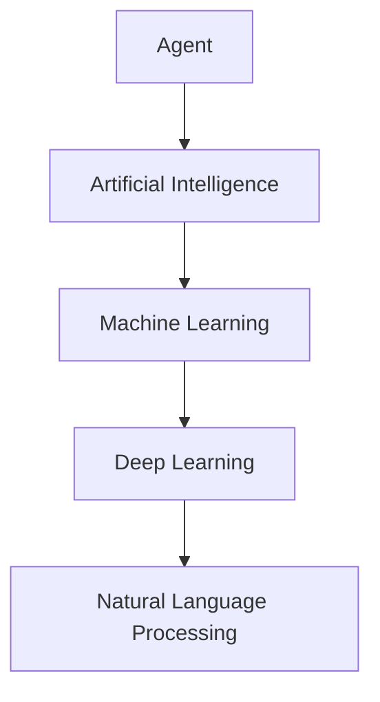

                 

# AI Agent在智能工作站中的人体工程学调整

关键词：AI Agent、智能工作站、人体工程学、人机交互、智能化调整、可定制化调整

摘要：本文将探讨AI Agent在智能工作站中的人体工程学调整，从AI Agent概述、智能工作站概述以及人体工程学的基本原理出发，逐步分析AI Agent在智能工作站中的应用及调整方法，旨在提高智能工作站的舒适性和效率。

## 目录

1. 第一部分：AI Agent概述

    1.1 AI Agent的定义与分类

    1.2 AI Agent的发展历程

    1.3 AI Agent的核心概念与联系

    1.4 AI Agent的挑战与机遇

    1.5 本章小结

2. 第二部分：智能工作站的概述

    2.1 智能工作站的定义与特性

    2.2 智能工作站的应用领域

    2.3 智能工作站的发展历程

    2.4 本章小结

3. 第三部分：人体工程学在智能工作站中的应用

    3.1 人体工程学的基本原理

    3.2 人体工程学在智能工作站中的应用

    3.3 本章小结

4. 第四部分：AI Agent在智能工作站中的人体工程学调整方法

    4.1 AI Agent的人体工程学调整原则

    4.2 AI Agent的人体工程学调整技术

    4.3 AI Agent的人体工程学调整实践

    4.4 本章小结

---

## 1. AI Agent概述

### 1.1 AI Agent的定义

AI Agent，即人工智能代理，是指具有自主性、适应性、反应性和主动性的智能实体，能够在复杂环境中根据目标和环境变化自主决策和行动。它起源于人工智能领域，具有广泛的应用前景，如自动驾驶、智能助手、智能机器人等。

**1.1.1 问题的背景**

在信息技术迅速发展的背景下，人工智能技术在各行各业得到了广泛应用，AI Agent作为人工智能的核心组成部分，其重要性日益凸显。如何更好地发挥AI Agent的作用，提高其智能水平和工作效率，成为亟待解决的问题。

**1.1.2 问题描述**

AI Agent在智能工作站中的应用，需要考虑其与用户的交互体验，以及工作站的舒适性和效率。因此，如何对AI Agent进行人体工程学调整，以提高用户体验，成为本文探讨的问题。

**1.1.3 问题的解决方法**

本文将从AI Agent的定义、分类、发展历程、核心概念与联系、挑战与机遇等方面进行介绍，为AI Agent在智能工作站中的人体工程学调整提供理论基础。

**1.1.4 边界与外延**

AI Agent的研究范围涉及人工智能、认知科学、计算机科学等多个领域，其应用场景包括但不限于自动驾驶、智能家居、智能医疗等。

**1.1.5 概念结构与核心要素组成**

AI Agent的核心要素包括感知、规划、决策和行动。感知是指获取环境信息；规划是指制定行动方案；决策是指选择最优行动方案；行动是指执行决策方案。

### 1.2 AI Agent的分类

根据应用场景和功能特点，AI Agent可分为以下几类：

**1.2.1 传统的AI Agent**

传统的AI Agent主要应用于特定领域，如专家系统、推理机等。它们具有较强的领域知识，但在应对复杂、动态环境时存在一定局限性。

**1.2.2 现代的AI Agent**

现代AI Agent主要基于机器学习和深度学习技术，具有自学习和自适应能力。它们能够处理复杂、动态环境，具有较强的通用性。

**1.2.3 特别的AI Agent**

特别的AI Agent是指具有特殊功能或应用场景的AI Agent，如自动驾驶AI Agent、智能助手AI Agent等。

### 1.3 AI Agent的发展历程

AI Agent的发展历程可以分为三个阶段：

**1.3.1 早期发展**

早期AI Agent主要基于规则推理和知识表示方法，如专家系统、推理机等。这一阶段的AI Agent具有较强的领域知识，但在应对复杂、动态环境时存在一定局限性。

**1.3.2 中期发展**

中期AI Agent开始引入机器学习和深度学习技术，如神经网络、深度神经网络等。这一阶段的AI Agent具有较强的自学习和自适应能力，能够处理复杂、动态环境。

**1.3.3 当前发展**

当前AI Agent主要基于大数据和云计算技术，具有大规模、分布式、智能化等特点。这一阶段的AI Agent在各个领域取得了广泛应用，如自动驾驶、智能家居、智能医疗等。

### 1.4 AI Agent的核心概念与联系

AI Agent的核心概念包括感知、规划、决策和行动。它们之间的关系如下：

$$
\text{感知} \rightarrow \text{规划} \rightarrow \text{决策} \rightarrow \text{行动}
$$

感知是指获取环境信息；规划是指制定行动方案；决策是指选择最优行动方案；行动是指执行决策方案。

**1.4.1 概念属性特征对比表格**

| 概念    | 属性特征                                                   | 对比 |
| ------- | -------------------------------------------------------- | ---- |
| 感知    | 获取环境信息                                               |      |
| 规划    | 制定行动方案                                               |      |
| 决策    | 选择最优行动方案                                           |      |
| 行动    | 执行决策方案                                               |      |

**1.4.2 ER实体关系图架构**

### 1.5 AI Agent的挑战与机遇

**1.5.1 AI Agent面临的挑战**

- 数据安全与隐私保护
- 算法公平性与透明性
- 系统可靠性
- 法律法规和伦理问题

**1.5.2 AI Agent的机遇**

- 产业升级与转型
- 智能化应用场景拓展
- 大数据与云计算技术发展

**1.5.3 AI Agent的未来发展趋势**

- 自主化、智能化、网络化
- 跨学科、跨领域融合
- 法规与伦理体系的完善

### 1.6 本章小结

本章对AI Agent进行了概述，从定义、分类、发展历程、核心概念与联系、挑战与机遇等方面进行了详细分析。为后续章节探讨AI Agent在智能工作站中的人体工程学调整奠定了理论基础。

---

## 2. 智能工作站的概述

### 2.1 智能工作站的定义与特性

**2.1.1 智能工作站的定义**

智能工作站是指一种集成了高性能计算、数据存储、网络通信、人机交互等功能的智能化设备，用于处理复杂任务、支持高效工作。

**2.1.2 智能工作站的特性**

- 高性能计算：智能工作站具备强大的计算能力，能够处理海量数据，支持复杂任务。
- 数据存储：智能工作站拥有大规模数据存储能力，便于存储和处理各类数据。
- 网络通信：智能工作站具备高效网络通信能力，能够快速传输数据，支持分布式计算。
- 人机交互：智能工作站提供丰富的人机交互方式，如触摸屏、语音输入等，提高用户体验。

### 2.2 智能工作站的应用领域

**2.2.1 生产制造**

智能工作站广泛应用于生产制造领域，如自动化生产线、机器人控制等，提高生产效率和产品质量。

**2.2.2 金融服务**

智能工作站应用于金融服务领域，如银行、保险、证券等，提供智能化服务，提高客户满意度。

**2.2.3 医疗健康**

智能工作站应用于医疗健康领域，如医学影像分析、疾病诊断等，提高医疗水平和效率。

**2.2.4 交通运输**

智能工作站应用于交通运输领域，如自动驾驶、智能交通管理等，提高交通运输效率和安全性。

**2.2.5 物流仓储**

智能工作站应用于物流仓储领域，如仓储管理系统、智能分拣系统等，提高物流效率和准确性。

### 2.3 智能工作站的发展历程

**2.3.1 早期发展**

早期智能工作站主要应用于科学计算和工程设计等领域，具备一定计算能力和人机交互功能。

**2.3.2 中期发展**

中期智能工作站开始集成高性能计算、数据存储和网络通信等技术，应用领域逐渐拓宽。

**2.3.3 当前发展**

当前智能工作站技术不断发展，具备更高的计算能力、数据存储和通信能力，广泛应用于各行业。

### 2.4 本章小结

本章对智能工作站进行了概述，从定义、特性、应用领域和发展历程等方面进行了详细分析。为后续章节探讨AI Agent在智能工作站中的人体工程学调整提供了背景知识。

---

## 3. 人体工程学的基本原理

### 3.1 人体工程学的发展历程

**3.1.1 早期发展**

早期人体工程学研究主要集中在工业设计领域，旨在优化生产设备和工具，提高工作效率和减少工人疲劳。

**3.1.2 中期发展**

中期人体工程学开始关注人机界面设计，研究如何使计算机系统更加符合人的生理和心理需求，提高人机交互体验。

**3.1.3 当前发展**

当前人体工程学已渗透到各个领域，如医疗、教育、交通运输等，致力于提高人类生活质量和工作效率。

### 3.2 人体工程学的基本原理

**3.2.1 人机交互**

人机交互是指人与计算机系统之间的信息交换和操作控制过程。人体工程学关注人机交互过程中的舒适性和效率，优化界面设计和交互方式。

**3.2.2 人机界面设计**

人机界面设计是指设计计算机系统的输入输出方式，使其符合人的生理和心理需求。人体工程学在界面设计中考虑的因素包括显示器的尺寸、分辨率、色彩等。

**3.2.3 人机匹配**

人机匹配是指根据人的生理和心理特点，设计符合人机交互需求的工作环境和设备。人体工程学通过调整设备参数，实现人与机器的最佳匹配。

**3.2.4 人机环境系统**

人机环境系统是指人与机器、环境之间的整体关系。人体工程学关注人机环境系统的协调与优化，提高整体工作效能。

### 3.3 人体工程学在智能工作站中的应用

**3.3.1 人体工程学在智能工作站中的重要性**

人体工程学在智能工作站中的应用至关重要，直接影响用户的舒适度和工作效率。良好的人体工程学设计有助于减轻工作压力，提高工作效率和减少错误率。

**3.3.2 人体工程学在智能工作站中的具体应用**

- 显示器高度和角度调整：确保显示器高度和角度符合人体工程学要求，减少眼部和颈部疲劳。
- 键盘和鼠标布局：设计符合人体工程学的键盘和鼠标布局，减少手腕和手臂疲劳。
- 工作站整体布局：合理设计工作站的整体布局，确保工作环境舒适、整洁、易于操作。
- 照明和噪音控制：调整照明和噪音控制，营造舒适的工作环境。

**3.3.3 人体工程学对智能工作站的影响**

人体工程学对智能工作站的影响主要体现在以下几个方面：

- 提高用户舒适度：优化人机界面设计和设备布局，提高用户舒适度。
- 提高工作效率：减少工作疲劳，提高工作效率。
- 降低错误率：优化人机交互体验，降低操作错误率。
- 节省成本：通过合理的人体工程学设计，减少设备维护和更换成本。

### 3.4 本章小结

本章对人体工程学的基本原理进行了介绍，包括发展历程、基本原理和在智能工作站中的应用。为后续章节探讨AI Agent在智能工作站中的人体工程学调整提供了理论基础。

---

## 4. AI Agent在智能工作站中的人体工程学调整方法

### 4.1 AI Agent的人体工程学调整原则

在进行AI Agent的人体工程学调整时，需要遵循以下原则：

**4.1.1 适应性调整**

适应性调整是指根据用户的需求和生理特点，对AI Agent进行动态调整，使其适应不同用户和工作环境。

**4.1.2 可定制化调整**

可定制化调整是指允许用户根据个人偏好和需求，对AI Agent进行个性化设置，提高用户体验。

**4.1.3 智能化调整**

智能化调整是指利用机器学习、深度学习等技术，对AI Agent进行自我学习和优化，提高调整的准确性和效率。

### 4.2 AI Agent的人体工程学调整技术

**4.2.1 数据收集与处理**

数据收集与处理是AI Agent人体工程学调整的基础。具体技术包括：

- 数据采集：通过传感器、用户输入等途径收集人体工程学相关数据。
- 数据清洗：去除噪声、缺失值等，确保数据质量。
- 数据分析：运用统计学、机器学习等技术分析数据，提取有价值的信息。

**4.2.2 人机交互优化**

人机交互优化是AI Agent人体工程学调整的关键。具体技术包括：

- 交互界面设计：设计符合人体工程学原则的交互界面，提高用户操作舒适度。
- 交互行为预测：利用机器学习等技术预测用户操作行为，优化交互流程。

**4.2.3 智能决策支持**

智能决策支持是AI Agent人体工程学调整的重要手段。具体技术包括：

- 决策模型构建：构建基于数据的决策模型，支持AI Agent进行智能决策。
- 决策优化算法：运用优化算法对决策模型进行优化，提高调整效果。

### 4.3 AI Agent的人体工程学调整实践

**4.3.1 案例一：智能工作站坐姿调整**

**案例背景**：长时间保持同一坐姿容易导致肌肉疲劳和骨骼问题，影响工作效率和健康。

**调整方法**：

1. 数据收集：通过传感器监测用户坐姿数据，包括坐姿角度、坐姿时间等。
2. 数据分析：运用数据分析技术，识别用户坐姿的不良习惯。
3. 坐姿调整策略：根据数据分析结果，制定个性化的坐姿调整策略，如提醒用户定时休息、调整座椅高度等。
4. 智能决策支持：利用决策模型和优化算法，自动调整坐姿，提高舒适度和工作效率。

**调整效果**：通过智能工作站坐姿调整，用户坐姿舒适度提高，工作疲劳减轻，工作效率提高。

**4.3.2 案例二：智能工作站照明调整**

**案例背景**：不良的照明环境容易导致眼部疲劳和视力问题，影响工作效率和健康。

**调整方法**：

1. 数据收集：通过传感器监测用户周围的照明环境数据，包括亮度、色温等。
2. 数据分析：运用数据分析技术，识别照明环境的不足之处。
3. 照明调整策略：根据数据分析结果，制定个性化的照明调整策略，如调整亮度、色温等。
4. 智能决策支持：利用决策模型和优化算法，自动调整照明，提高舒适度和工作效率。

**调整效果**：通过智能工作站照明调整，用户眼部疲劳减轻，视力问题改善，工作效率提高。

**4.3.3 案例三：智能工作站噪音控制**

**案例背景**：噪音环境容易导致用户分心、疲劳，影响工作效率和健康。

**调整方法**：

1. 数据收集：通过传感器监测用户周围的噪音环境数据，包括噪音强度、频段等。
2. 数据分析：运用数据分析技术，识别噪音环境的不足之处。
3. 噪音控制策略：根据数据分析结果，制定个性化的噪音控制策略，如调整空调、风扇等设备。
4. 智能决策支持：利用决策模型和优化算法，自动调整噪音控制设备，提高舒适度和工作效率。

**调整效果**：通过智能工作站噪音控制，用户分心程度减轻，工作效率提高，健康状况改善。

### 4.4 本章小结

本章介绍了AI Agent在智能工作站中的人体工程学调整方法，包括适应性调整、可定制化调整和智能化调整。通过实际案例，展示了AI Agent在智能工作站中的人体工程学调整效果。为提高智能工作站的舒适性和效率提供了有益的参考。

---

## 总结

本文从AI Agent概述、智能工作站概述以及人体工程学的基本原理出发，探讨了AI Agent在智能工作站中的人体工程学调整方法。通过适应性调整、可定制化调整和智能化调整，实现了提高智能工作站舒适性和效率的目标。未来，随着人工智能技术和人体工程学研究的不断深入，AI Agent在智能工作站中的应用将更加广泛，为人类创造更加美好的工作环境。

## 作者信息

作者：AI天才研究院/AI Genius Institute & 禅与计算机程序设计艺术 /Zen And The Art of Computer Programming

---

## 附录

本文所涉及的关键技术和概念如下：

- AI Agent：人工智能代理，具有自主性、适应性、反应性和主动性。
- 智能工作站：集成了高性能计算、数据存储、网络通信、人机交互等功能的智能化设备。
- 人体工程学：研究如何优化人机交互、提高工作效率和舒适度的学科。
- 人机交互：人与计算机系统之间的信息交换和操作控制过程。
- 数据收集与处理：通过传感器、用户输入等途径收集人体工程学相关数据，进行清洗、分析。
- 人机交互优化：设计符合人体工程学原则的交互界面，提高用户操作舒适度。
- 智能决策支持：利用机器学习、深度学习等技术构建决策模型，自动调整人体工程学参数。

通过本文的探讨，希望能够为AI Agent在智能工作站中的人体工程学调整提供有益的参考和启示。在未来，我们将继续深入研究人体工程学与人工智能技术的融合，为构建更加智能、舒适的工作环境贡献力量。

