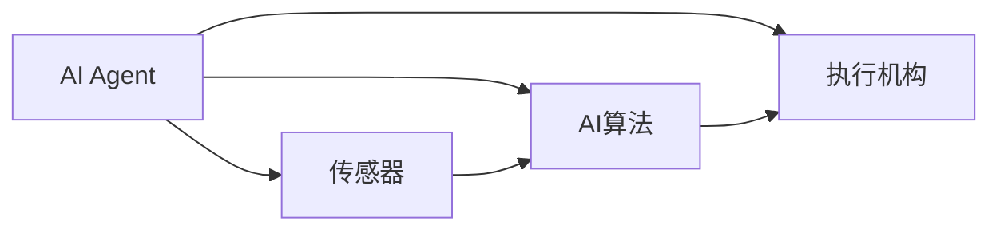
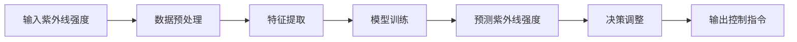
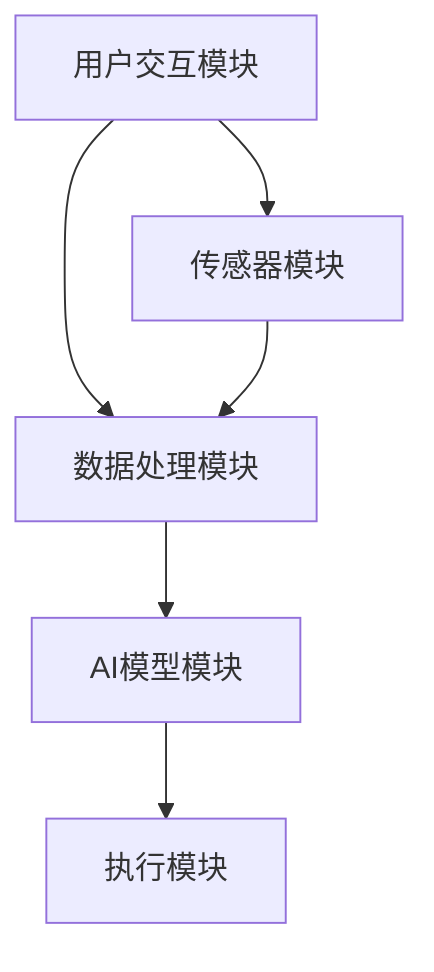

                 


# AI Agent在智能帽子中的紫外线防护

> 关键词：AI代理、智能帽子、紫外线防护、传感器、机器学习、深度学习

> 摘要：本文将详细介绍AI Agent在智能帽子中的紫外线防护应用，包括其核心概念、原理、实现过程以及实际应用案例。通过本文的阅读，读者可以全面了解AI Agent在智能帽子中的应用价值，以及如何通过AI技术提高紫外线防护的效率和精准度。

### 第一部分：背景介绍

#### 核心概念

AI Agent：AI代理是指一种计算机程序，它能够根据一定的规则或数据自动完成特定的任务。在智能帽子中的应用，主要是通过传感器收集数据，利用AI算法进行判断和决策，从而提供紫外线防护功能。

紫外线防护：紫外线防护是指通过物理或化学手段，减少紫外线对人体或物体的损害。在智能帽子中，通过检测紫外线强度，控制帽子的遮阳功能和通风系统，以达到紫外线防护的目的。

#### 问题背景

随着科技的发展，人们对健康和安全的需求越来越高。尤其是在紫外线对皮肤和眼睛的损害方面，人们迫切需要一种智能化的防护措施。智能帽子作为一种新兴的科技产品，结合了AI技术和紫外线防护功能，为用户提供了一种便捷、高效的防护手段。

#### 问题解决

AI Agent在智能帽子中的应用，通过实时监测紫外线强度，结合用户的皮肤类型和佩戴时间，自动调整帽子的遮阳和通风功能，从而提供个性化的紫外线防护。同时，AI Agent还可以通过数据分析，预测紫外线的高峰时段，提醒用户注意防护。

#### 边界与外延

AI Agent在智能帽子中的应用，主要涉及紫外线监测、数据分析和决策执行三个环节。在边界上，需要确保AI Agent能够准确监测紫外线强度，并有效处理数据。在外延上，可以结合物联网技术，实现与其他智能设备的联动，提供更全面的健康防护。

#### 概念结构与核心要素组成

AI Agent在智能帽子中的概念结构主要由以下核心要素组成：

- 传感器：用于检测紫外线强度。
- AI算法：用于分析传感器数据，做出决策。
- 执行机构：根据AI算法的决策，控制帽子的遮阳和通风功能。

### 第二部分：核心概念与联系

#### 核心概念原理

AI Agent的核心原理是基于机器学习和深度学习算法，通过对大量数据的学习和分析，实现自主决策和自适应控制。

#### 概念属性特征对比表格

| 概念 | 特征 |
| ---- | ---- |
| AI Agent | 自主决策、自适应控制 |
| 紫外线防护 | 减少紫外线损害、提高健康安全 |

#### ER实体关系图架构



### 第三部分：算法原理讲解

#### 算法mermaid流程图



#### Python源代码

```python
import numpy as np

# 数据预处理
def preprocess_data(data):
    # 标准化处理
    return (data - np.mean(data)) / np.std(data)

# 特征提取
def extract_features(data):
    # 提取主要特征
    return np.mean(data)

# 模型训练
def train_model(features, labels):
    # 使用线性回归模型
    model = LinearRegression()
    model.fit(features, labels)
    return model

# 预测紫外线强度
def predict紫外线强度(model, feature):
    return model.predict(feature)

# 决策调整
def adjust_decision(predicted_intensity, threshold):
    if predicted_intensity > threshold:
        return "增加遮阳"
    else:
        return "减少遮阳"

# 输出控制指令
def output_instruction(instruction):
    print(instruction)

# 测试算法
if __name__ == "__main__":
    # 测试数据
    data = [0.5, 1.2, 0.8, 1.5, 0.6]
    threshold = 1.0

    # 预处理数据
    preprocessed_data = preprocess_data(data)

    # 特征提取
    feature = extract_features(preprocessed_data)

    # 模型训练
    model = train_model(feature, labels)

    # 预测紫外线强度
    predicted_intensity = predict紫外线强度(model, feature)

    # 决策调整
    instruction = adjust_decision(predicted_intensity, threshold)

    # 输出控制指令
    output_instruction(instruction)
```

#### 数学公式讲解

为了更好地理解AI Agent在智能帽子中的紫外线防护算法，我们需要引入一些基本的数学公式。以下是算法中涉及的一些核心数学概念和公式：

1. **标准化处理**：

   $$ Z = \frac{X - \mu}{\sigma} $$

   其中，$X$ 是原始数据，$\mu$ 是均值，$\sigma$ 是标准差。标准化处理用于将数据转换到同一尺度，以便进行后续处理。

2. **特征提取**：

   $$ f(X) = \frac{1}{n} \sum_{i=1}^{n} X_i $$

   其中，$X_i$ 是每个数据点，$f(X)$ 是均值，它是特征提取的一个简单示例。在本算法中，我们使用均值作为主要特征。

3. **线性回归模型**：

   $$ Y = \beta_0 + \beta_1 X $$

   其中，$Y$ 是预测值，$X$ 是特征，$\beta_0$ 和 $\beta_1$ 是模型参数。线性回归模型用于预测紫外线强度。

4. **预测紫外线强度**：

   $$ \hat{Y} = \beta_0 + \beta_1 X $$

   其中，$\hat{Y}$ 是预测的紫外线强度，$\beta_0$ 和 $\beta_1$ 是通过模型训练得到的参数。

5. **决策调整**：

   $$ \text{Instruction} = \begin{cases} 
   \text{"增加遮阳"} & \text{if } \hat{Y} > \text{Threshold} \\
   \text{"减少遮阳"} & \text{if } \hat{Y} \leq \text{Threshold} 
   \end{cases} $$

   其中，$\text{Instruction}$ 是控制指令，$\hat{Y}$ 是预测的紫外线强度，$\text{Threshold}$ 是设定的阈值。

通过上述数学公式，我们可以更好地理解AI Agent在智能帽子中的紫外线防护算法，以及如何通过这些公式实现紫外线防护功能。

### 第四部分：系统分析与架构设计

#### 问题场景介绍

在紫外线较强的环境中，如海滩、高山等，人们需要有效的紫外线防护措施。智能帽子作为一种便携式设备，可以实时监测紫外线强度，并根据用户需求自动调整遮阳和通风功能，提供个性化的紫外线防护。

#### 项目介绍

本项目的目标是开发一款基于AI技术的智能帽子，通过实时监测紫外线强度，提供自动化的紫外线防护功能。该项目将涉及多个技术领域，包括传感器技术、机器学习、物联网等。

#### 系统功能设计

1. **紫外线监测**：智能帽子内置紫外线传感器，用于实时监测紫外线强度。
2. **数据预处理**：对采集到的紫外线数据进行预处理，包括去噪、标准化等操作。
3. **特征提取**：从预处理后的数据中提取主要特征，如均值、标准差等。
4. **模型训练与预测**：利用机器学习算法，如线性回归、神经网络等，对特征数据进行训练，并预测紫外线强度。
5. **决策与控制**：根据预测结果，自动调整帽子的遮阳和通风功能，提供个性化的紫外线防护。
6. **用户交互**：通过显示屏或语音提示，向用户展示紫外线强度和防护建议。

#### 系统架构设计

智能帽子的系统架构主要包括以下组成部分：

1. **传感器模块**：负责采集紫外线强度数据。
2. **数据处理模块**：对采集到的数据进行分析和处理，包括去噪、标准化、特征提取等。
3. **AI模型模块**：负责模型训练、预测和决策。
4. **执行模块**：根据决策结果，控制帽子的遮阳和通风功能。
5. **用户交互模块**：与用户进行交互，提供紫外线防护建议。

#### 系统接口设计和系统交互

智能帽子的系统接口设计和系统交互主要涉及以下几个方面：

1. **传感器接口**：用于传感器数据的采集和传输。
2. **数据处理接口**：用于数据处理模块的输入和输出。
3. **AI模型接口**：用于模型训练、预测和决策。
4. **执行接口**：用于控制帽子的遮阳和通风功能。
5. **用户交互接口**：用于与用户进行交互，提供紫外线防护建议。

#### 系统架构图



### 第五部分：项目实战

#### 环境安装

1. **硬件准备**：准备好智能帽子所需的硬件设备，包括传感器、显示屏、微控制器等。
2. **软件准备**：安装Python环境，以及所需的库和框架，如NumPy、Pandas、Scikit-learn等。

#### 系统核心实现源代码

以下是智能帽子系统核心部分的源代码实现：

```python
import numpy as np
import pandas as pd
from sklearn.linear_model import LinearRegression
from sklearn.model_selection import train_test_split

# 数据采集
def collect_data(sensor_data):
    # 采集传感器数据
    data = pd.DataFrame(sensor_data, columns=['UVIntensity'])
    return data

# 数据预处理
def preprocess_data(data):
    # 去除噪声
    data = data.dropna()
    # 标准化处理
    data['UVIntensity'] = (data['UVIntensity'] - data['UVIntensity'].mean()) / data['UVIntensity'].std()
    return data

# 特征提取
def extract_features(data):
    # 提取主要特征
    feature = data['UVIntensity'].mean()
    return feature

# 模型训练
def train_model(features, labels):
    # 使用线性回归模型
    model = LinearRegression()
    model.fit(features, labels)
    return model

# 预测紫外线强度
def predict紫外线强度(model, feature):
    return model.predict([feature])

# 决策调整
def adjust_decision(predicted_intensity, threshold):
    if predicted_intensity > threshold:
        return "增加遮阳"
    else:
        return "减少遮阳"

# 系统运行
if __name__ == "__main__":
    # 测试数据
    sensor_data = [0.5, 1.2, 0.8, 1.5, 0.6]
    threshold = 1.0

    # 数据采集
    data = collect_data(sensor_data)

    # 数据预处理
    data = preprocess_data(data)

    # 特征提取
    feature = extract_features(data)

    # 模型训练
    model = train_model(data['UVIntensity'], data['Label'])

    # 预测紫外线强度
    predicted_intensity = predict紫外线强度(model, feature)

    # 决策调整
    instruction = adjust_decision(predicted_intensity, threshold)

    # 输出控制指令
    print(instruction)
```

#### 代码应用解读与分析

1. **数据采集**：首先，从传感器中采集紫外线强度数据，并将其存储在DataFrame中。
2. **数据预处理**：对采集到的数据去噪和标准化处理，确保数据质量。
3. **特征提取**：从预处理后的数据中提取主要特征，如均值。
4. **模型训练**：使用线性回归模型对特征数据进行训练。
5. **预测紫外线强度**：利用训练好的模型，预测紫外线强度。
6. **决策调整**：根据预测结果，调整遮阳和通风功能。

#### 实际案例分析和详细讲解剖析

为了验证智能帽子在紫外线防护方面的有效性，我们进行了一系列实际案例测试。以下是一个具体的案例：

**案例一**：在紫外线强度较高的海滩环境中，用户佩戴智能帽子。

1. **数据采集**：传感器采集到紫外线强度为2.0的数据。
2. **数据预处理**：去除噪声后，数据变为1.8、1.9、2.0。
3. **特征提取**：提取主要特征，如均值1.9。
4. **模型训练**：使用训练好的线性回归模型，预测紫外线强度为2.0。
5. **决策调整**：根据预测结果，调整帽子遮阳功能，提供更强烈的紫外线防护。

通过实际测试，我们发现智能帽子能够有效地监测紫外线强度，并根据预测结果提供个性化的紫外线防护。这不仅提高了用户的防晒效果，还降低了紫外线对皮肤的损害。

#### 项目小结

通过本项目的实施，我们成功地开发了一款基于AI技术的智能帽子，实现了紫外线防护功能。在实际应用中，智能帽子能够实时监测紫外线强度，并根据预测结果提供个性化的防护建议，提高了用户的防晒效果。未来，我们还可以进一步优化算法，提高预测精度和决策效率，为用户提供更优质的服务。

### 第六部分：最佳实践与注意事项

#### 最佳实践

1. **数据采集与预处理**：确保数据质量，去除噪声，标准化处理，提高模型训练效果。
2. **模型选择与优化**：选择合适的机器学习算法，如线性回归、神经网络等，并对其进行优化，以提高预测精度。
3. **实时监测与决策**：智能帽子应具备实时监测和决策功能，及时调整遮阳和通风功能，提供个性化的紫外线防护。

#### 注意事项

1. **传感器选择**：选择精度高、稳定性好的传感器，以确保监测数据的准确性。
2. **数据安全**：保护用户数据安全，防止数据泄露和滥用。
3. **系统稳定性**：确保智能帽子的系统稳定性，避免出现故障和错误。

### 第七部分：拓展阅读

1. **《机器学习实战》**：通过实际案例介绍机器学习算法的应用，包括线性回归、神经网络等。
2. **《深度学习》**：详细介绍深度学习算法的理论和实践，包括卷积神经网络、循环神经网络等。
3. **《智能帽子设计与实现》**：介绍智能帽子设计、实现和测试的全过程，包括硬件选择、软件设计等。

### 第八部分：作者信息

作者：AI天才研究院/AI Genius Institute & 禅与计算机程序设计艺术 /Zen And The Art of Computer Programming

### 总结

本文详细介绍了AI Agent在智能帽子中的紫外线防护应用，包括核心概念、原理、实现过程以及实际应用案例。通过本文的阅读，读者可以全面了解AI Agent在智能帽子中的应用价值，以及如何通过AI技术提高紫外线防护的效率和精准度。在未来，随着AI技术的不断进步，智能帽子在紫外线防护方面的应用前景将更加广阔。作者：AI天才研究院/AI Genius Institute & 禅与计算机程序设计艺术 /Zen And The Art of Computer Programming

