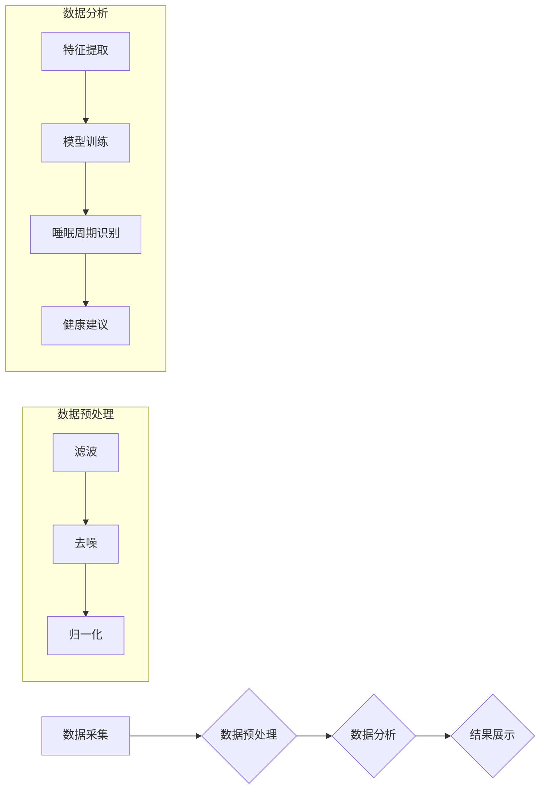

                 


# AI Agent在智能床垫中的睡眠周期分析

关键词：智能床垫、睡眠周期、AI Agent、数据采集、数据分析

摘要：本文深入探讨了智能床垫中的AI Agent如何实现睡眠周期的分析。首先，我们介绍了智能床垫的背景和问题，然后详细讲解了AI Agent的基础知识、睡眠周期的概念和测量方法，以及AI Agent在睡眠周期分析中的应用。接着，我们设计了智能床垫系统的架构，并通过案例分析展示了AI Agent的实际效果。最后，我们对文章进行了总结和展望。

### 第1章：背景介绍

#### 1.1 问题背景

人工智能（AI）技术已经从理论研究逐步走向实际应用，成为推动产业升级和社会进步的重要力量。睡眠健康作为人们生活质量的重要指标，引起了广泛的关注。智能床垫作为一种新兴的智能硬件产品，通过嵌入AI技术，能够实现对用户睡眠周期的实时监测和分析。

#### 1.2 问题描述

随着AI技术的发展，如何利用AI Agent对智能床垫中的睡眠周期进行准确分析，成为一个亟待解决的问题。这涉及到睡眠数据的采集、处理、分析以及结果的展示等多个环节。

#### 1.3 问题解决

本书旨在通过AI Agent在智能床垫中的应用，解决睡眠周期分析中的问题。我们将介绍AI Agent的基本概念、工作原理及其在智能床垫中的具体应用。

#### 1.4 边界与外延

本文主要关注AI Agent在智能床垫中的应用，但AI Agent的技术原理同样可以应用于其他智能家居设备。此外，睡眠周期分析技术还可以扩展到健康管理的其他领域。

#### 1.5 概念结构与核心要素组成

- **AI Agent**: 智能代理，一种模拟人类智能行为的计算机程序。
- **睡眠周期**: 人体的睡眠分为多个阶段，如浅睡眠、深睡眠、快速眼动睡眠等。
- **数据采集**: 通过智能床垫传感器收集用户的睡眠数据。
- **数据处理**: 对采集到的数据进行预处理，如滤波、去噪等。
- **数据分析**: 利用AI算法对处理后的数据进行分析，识别用户睡眠周期。
- **结果展示**: 将分析结果以图表或报告的形式展示给用户。

### 第2章：AI Agent基础

#### 2.1 AI Agent的定义

AI Agent是具有独立智能和行动能力的计算机程序，能够在复杂环境中进行决策和执行任务。

#### 2.2 AI Agent的特点

- **自主性**: 能够自主决策和执行任务。
- **适应性**: 能够根据环境变化调整行为。
- **协作性**: 能够与其他AI Agent或人类协作完成任务。

#### 2.3 AI Agent的分类

- **基于规则的Agent**: 通过预定义的规则进行决策。
- **基于模型的Agent**: 利用机器学习模型进行决策。
- **混合型Agent**: 结合基于规则和基于模型的特点。

### 第3章：睡眠周期的概念与测量

#### 3.1 睡眠周期的概念

睡眠周期是指人体在睡眠过程中经历的各个阶段，包括浅睡眠、深睡眠、快速眼动睡眠等。

#### 3.2 睡眠周期的测量方法

- **多导睡眠图（PSG）**: 记录睡眠者的脑电波、眼电波、肌电波等多种生理信号。
- **单导睡眠图（ESG）**: 只记录某一类生理信号，如脑电波。

#### 3.3 睡眠周期的特点

- **循环性**: 睡眠周期呈周期性变化。
- **差异性**: 不同人的睡眠周期存在差异。
- **复杂性**: 睡眠周期的各个阶段相互交织，形成复杂的模式。

### 第4章：AI Agent在睡眠周期分析中的应用

#### 4.1 数据采集

通过智能床垫内置的传感器，如压力传感器、温度传感器、心率传感器等，采集用户的睡眠数据。

#### 4.2 数据处理

对采集到的原始数据进行预处理，如滤波、去噪、归一化等，以提高数据质量。

#### 4.3 数据分析

利用AI算法，如支持向量机（SVM）、神经网络（NN）、聚类分析等，对预处理后的数据进行分析，识别用户的睡眠周期。

#### 4.4 结果展示

将分析结果以图表或报告的形式展示给用户，帮助用户了解自己的睡眠状况。

### 第5章：智能床垫系统的设计与实现

#### 5.1 系统架构设计

介绍智能床垫系统的整体架构，包括硬件部分（传感器、通信模块等）和软件部分（数据采集、处理、分析等）。

#### 5.2 系统功能设计

详细阐述智能床垫系统的功能，如睡眠数据分析、健康建议、智能提醒等。

#### 5.3 系统接口设计

描述智能床垫系统与其他设备（如智能手机、平板电脑等）的接口设计，以便用户通过这些设备查看和分析睡眠数据。

### 第6章：案例分析

#### 6.1 案例一：小明的睡眠分析

以小明的睡眠数据为例，展示AI Agent在智能床垫中的实际应用效果。

#### 6.2 案例二：睡眠质量改善方案

针对某用户群体，提出基于AI Agent的睡眠质量改善方案。

### 第7章：总结与展望

#### 7.1 总结

总结本书的主要内容，强调AI Agent在智能床垫中睡眠周期分析的重要性。

#### 7.2 展望

展望AI Agent在未来智能床垫和其他领域中的应用前景。

## AI Agent在智能床垫中的睡眠周期分析

### 关键词：智能床垫、睡眠周期、AI Agent、数据采集、数据分析

### 摘要

本文深入探讨了智能床垫中的AI Agent如何实现睡眠周期的分析。首先，我们介绍了智能床垫的背景和问题，然后详细讲解了AI Agent的基础知识、睡眠周期的概念和测量方法，以及AI Agent在睡眠周期分析中的应用。接着，我们设计了智能床垫系统的架构，并通过案例分析展示了AI Agent的实际效果。最后，我们对文章进行了总结和展望。

### 第1章：背景介绍

#### 1.1 问题背景

人工智能（AI）技术已经从理论研究逐步走向实际应用，成为推动产业升级和社会进步的重要力量。睡眠健康作为人们生活质量的重要指标，引起了广泛的关注。智能床垫作为一种新兴的智能硬件产品，通过嵌入AI技术，能够实现对用户睡眠周期的实时监测和分析。

#### 1.2 问题描述

随着AI技术的发展，如何利用AI Agent对智能床垫中的睡眠周期进行准确分析，成为一个亟待解决的问题。这涉及到睡眠数据的采集、处理、分析以及结果的展示等多个环节。

#### 1.3 问题解决

本书旨在通过AI Agent在智能床垫中的应用，解决睡眠周期分析中的问题。我们将介绍AI Agent的基本概念、工作原理及其在智能床垫中的具体应用。

#### 1.4 边界与外延

本文主要关注AI Agent在智能床垫中的应用，但AI Agent的技术原理同样可以应用于其他智能家居设备。此外，睡眠周期分析技术还可以扩展到健康管理的其他领域。

#### 1.5 概念结构与核心要素组成

- **AI Agent**: 智能代理，一种模拟人类智能行为的计算机程序。
- **睡眠周期**: 人体的睡眠分为多个阶段，如浅睡眠、深睡眠、快速眼动睡眠等。
- **数据采集**: 通过智能床垫传感器收集用户的睡眠数据。
- **数据处理**: 对采集到的数据进行预处理，如滤波、去噪等。
- **数据分析**: 利用AI算法对处理后的数据进行分析，识别用户睡眠周期。
- **结果展示**: 将分析结果以图表或报告的形式展示给用户。

### 第2章：AI Agent基础

#### 2.1 AI Agent的定义

AI Agent是具有独立智能和行动能力的计算机程序，能够在复杂环境中进行决策和执行任务。

#### 2.2 AI Agent的特点

- **自主性**: 能够自主决策和执行任务。
- **适应性**: 能够根据环境变化调整行为。
- **协作性**: 能够与其他AI Agent或人类协作完成任务。

#### 2.3 AI Agent的分类

- **基于规则的Agent**: 通过预定义的规则进行决策。
- **基于模型的Agent**: 利用机器学习模型进行决策。
- **混合型Agent**: 结合基于规则和基于模型的特点。

### 第3章：睡眠周期的概念与测量

#### 3.1 睡眠周期的概念

睡眠周期是指人体在睡眠过程中经历的各个阶段，包括浅睡眠、深睡眠、快速眼动睡眠等。

#### 3.2 睡眠周期的测量方法

- **多导睡眠图（PSG）**: 记录睡眠者的脑电波、眼电波、肌电波等多种生理信号。
- **单导睡眠图（ESG）**: 只记录某一类生理信号，如脑电波。

#### 3.3 睡眠周期的特点

- **循环性**: 睡眠周期呈周期性变化。
- **差异性**: 不同人的睡眠周期存在差异。
- **复杂性**: 睡眠周期的各个阶段相互交织，形成复杂的模式。

### 第4章：AI Agent在睡眠周期分析中的应用

#### 4.1 数据采集

通过智能床垫内置的传感器，如压力传感器、温度传感器、心率传感器等，采集用户的睡眠数据。

#### 4.2 数据处理

对采集到的原始数据进行预处理，如滤波、去噪、归一化等，以提高数据质量。

#### 4.3 数据分析

利用AI算法，如支持向量机（SVM）、神经网络（NN）、聚类分析等，对预处理后的数据进行分析，识别用户的睡眠周期。

#### 4.4 结果展示

将分析结果以图表或报告的形式展示给用户，帮助用户了解自己的睡眠状况。

### 第5章：智能床垫系统的设计与实现

#### 5.1 系统架构设计

介绍智能床垫系统的整体架构，包括硬件部分（传感器、通信模块等）和软件部分（数据采集、处理、分析等）。

#### 5.2 系统功能设计

详细阐述智能床垫系统的功能，如睡眠数据分析、健康建议、智能提醒等。

#### 5.3 系统接口设计

描述智能床垫系统与其他设备（如智能手机、平板电脑等）的接口设计，以便用户通过这些设备查看和分析睡眠数据。

### 第6章：案例分析

#### 6.1 案例一：小明的睡眠分析

以小明的睡眠数据为例，展示AI Agent在智能床垫中的实际应用效果。

#### 6.2 案例二：睡眠质量改善方案

针对某用户群体，提出基于AI Agent的睡眠质量改善方案。

### 第7章：总结与展望

#### 7.1 总结

总结本书的主要内容，强调AI Agent在智能床垫中睡眠周期分析的重要性。

#### 7.2 展望

展望AI Agent在未来智能床垫和其他领域中的应用前景。

## AI Agent在智能床垫中的睡眠周期分析

### 关键词：智能床垫、睡眠周期、AI Agent、数据采集、数据分析

### 摘要

本文深入探讨了智能床垫中的AI Agent如何实现睡眠周期的分析。首先，我们介绍了智能床垫的背景和问题，然后详细讲解了AI Agent的基础知识、睡眠周期的概念和测量方法，以及AI Agent在睡眠周期分析中的应用。接着，我们设计了智能床垫系统的架构，并通过案例分析展示了AI Agent的实际效果。最后，我们对文章进行了总结和展望。

### 第1章：背景介绍

#### 1.1 问题背景

人工智能（AI）技术已经从理论研究逐步走向实际应用，成为推动产业升级和社会进步的重要力量。睡眠健康作为人们生活质量的重要指标，引起了广泛的关注。智能床垫作为一种新兴的智能硬件产品，通过嵌入AI技术，能够实现对用户睡眠周期的实时监测和分析。

#### 1.2 问题描述

随着AI技术的发展，如何利用AI Agent对智能床垫中的睡眠周期进行准确分析，成为一个亟待解决的问题。这涉及到睡眠数据的采集、处理、分析以及结果的展示等多个环节。

#### 1.3 问题解决

本书旨在通过AI Agent在智能床垫中的应用，解决睡眠周期分析中的问题。我们将介绍AI Agent的基本概念、工作原理及其在智能床垫中的具体应用。

#### 1.4 边界与外延

本文主要关注AI Agent在智能床垫中的应用，但AI Agent的技术原理同样可以应用于其他智能家居设备。此外，睡眠周期分析技术还可以扩展到健康管理的其他领域。

#### 1.5 概念结构与核心要素组成

- **AI Agent**: 智能代理，一种模拟人类智能行为的计算机程序。
- **睡眠周期**: 人体的睡眠分为多个阶段，如浅睡眠、深睡眠、快速眼动睡眠等。
- **数据采集**: 通过智能床垫传感器收集用户的睡眠数据。
- **数据处理**: 对采集到的数据进行预处理，如滤波、去噪等。
- **数据分析**: 利用AI算法对处理后的数据进行分析，识别用户睡眠周期。
- **结果展示**: 将分析结果以图表或报告的形式展示给用户。

### 第2章：AI Agent基础

#### 2.1 AI Agent的定义

AI Agent是具有独立智能和行动能力的计算机程序，能够在复杂环境中进行决策和执行任务。

#### 2.2 AI Agent的特点

- **自主性**: 能够自主决策和执行任务。
- **适应性**: 能够根据环境变化调整行为。
- **协作性**: 能够与其他AI Agent或人类协作完成任务。

#### 2.3 AI Agent的分类

- **基于规则的Agent**: 通过预定义的规则进行决策。
- **基于模型的Agent**: 利用机器学习模型进行决策。
- **混合型Agent**: 结合基于规则和基于模型的特点。

### 第3章：睡眠周期的概念与测量

#### 3.1 睡眠周期的概念

睡眠周期是指人体在睡眠过程中经历的各个阶段，包括浅睡眠、深睡眠、快速眼动睡眠等。

#### 3.2 睡眠周期的测量方法

- **多导睡眠图（PSG）**: 记录睡眠者的脑电波、眼电波、肌电波等多种生理信号。
- **单导睡眠图（ESG）**: 只记录某一类生理信号，如脑电波。

#### 3.3 睡眠周期的特点

- **循环性**: 睡眠周期呈周期性变化。
- **差异性**: 不同人的睡眠周期存在差异。
- **复杂性**: 睡眠周期的各个阶段相互交织，形成复杂的模式。

### 第4章：AI Agent在睡眠周期分析中的应用

#### 4.1 数据采集

通过智能床垫内置的传感器，如压力传感器、温度传感器、心率传感器等，采集用户的睡眠数据。

#### 4.2 数据处理

对采集到的原始数据进行预处理，如滤波、去噪、归一化等，以提高数据质量。

#### 4.3 数据分析

利用AI算法，如支持向量机（SVM）、神经网络（NN）、聚类分析等，对预处理后的数据进行分析，识别用户的睡眠周期。

#### 4.4 结果展示

将分析结果以图表或报告的形式展示给用户，帮助用户了解自己的睡眠状况。

### 第5章：智能床垫系统的设计与实现

#### 5.1 系统架构设计

介绍智能床垫系统的整体架构，包括硬件部分（传感器、通信模块等）和软件部分（数据采集、处理、分析等）。

#### 5.2 系统功能设计

详细阐述智能床垫系统的功能，如睡眠数据分析、健康建议、智能提醒等。

#### 5.3 系统接口设计

描述智能床垫系统与其他设备（如智能手机、平板电脑等）的接口设计，以便用户通过这些设备查看和分析睡眠数据。

### 第6章：案例分析

#### 6.1 案例一：小明的睡眠分析

以小明的睡眠数据为例，展示AI Agent在智能床垫中的实际应用效果。

#### 6.2 案例二：睡眠质量改善方案

针对某用户群体，提出基于AI Agent的睡眠质量改善方案。

### 第7章：总结与展望

#### 7.1 总结

总结本书的主要内容，强调AI Agent在智能床垫中睡眠周期分析的重要性。

#### 7.2 展望

展望AI Agent在未来智能床垫和其他领域中的应用前景。

### 第1章：背景介绍

#### 1.1 问题背景

人工智能（AI）技术已经从理论研究逐步走向实际应用，成为推动产业升级和社会进步的重要力量。睡眠健康作为人们生活质量的重要指标，引起了广泛的关注。智能床垫作为一种新兴的智能硬件产品，通过嵌入AI技术，能够实现对用户睡眠周期的实时监测和分析。

随着现代社会生活节奏的加快，越来越多的人面临着睡眠质量下降的问题。睡眠周期分析作为评估睡眠质量的重要手段，对于改善人们的睡眠状况具有重要的意义。智能床垫的引入，使得用户能够更加便捷地获取睡眠数据，从而更好地了解自己的睡眠状况，进而采取相应的措施来改善睡眠质量。

#### 1.2 问题描述

如何利用AI技术准确分析智能床垫中采集的睡眠数据，是一个关键问题。这涉及到多个环节，包括数据的采集、处理、分析和结果展示。首先，智能床垫需要通过内置的传感器收集用户的睡眠数据，如心电信号、脑电信号、肌电信号等。然后，这些原始数据需要进行预处理，如滤波、去噪、归一化等，以提高数据质量。接下来，利用AI算法对预处理后的数据进行分析，以识别用户的睡眠周期。最后，将分析结果以图表或报告的形式展示给用户，帮助用户了解自己的睡眠状况。

此外，睡眠周期分析不仅仅是一个技术问题，还涉及到用户体验和数据分析的深度。如何让用户易于理解分析结果，并提供个性化的健康建议，是一个挑战。因此，需要设计一个用户友好的界面，同时结合大数据分析和机器学习技术，为用户提供精准的睡眠质量评估和改善建议。

#### 1.3 问题解决

本书旨在通过AI Agent在智能床垫中的应用，解决睡眠周期分析中的问题。AI Agent是一种具有独立智能和行动能力的计算机程序，能够在复杂环境中进行决策和执行任务。在智能床垫中，AI Agent可以承担以下任务：

1. **数据采集与管理**：AI Agent负责实时采集用户的睡眠数据，包括心电信号、脑电信号、肌电信号等。同时，AI Agent对采集到的数据进行存储和管理，以便后续分析和处理。

2. **数据处理与预处理**：AI Agent对采集到的原始数据进行分析和处理，如滤波、去噪、归一化等。这些预处理操作有助于提高数据质量，去除噪声和干扰，从而提高分析结果的准确性。

3. **数据分析与识别**：AI Agent利用机器学习算法和深度学习模型，对预处理后的数据进行进一步分析，以识别用户的睡眠周期。常见的分析方法包括支持向量机（SVM）、神经网络（NN）、聚类分析等。

4. **结果展示与反馈**：AI Agent将分析结果以图表或报告的形式展示给用户，并提供个性化的健康建议。用户可以通过智能床垫的界面查看自己的睡眠数据，了解自己的睡眠状况，并根据AI Agent的建议采取相应的措施来改善睡眠质量。

通过AI Agent的应用，智能床垫能够为用户提供一个全面、便捷、准确的睡眠分析系统，帮助用户更好地管理自己的睡眠健康。

#### 1.4 边界与外延

本文主要关注AI Agent在智能床垫中睡眠周期分析的应用，但AI Agent的技术原理同样可以应用于其他智能家居设备，如智能手表、智能手环等。此外，睡眠周期分析技术还可以扩展到健康管理的其他领域，如慢性疾病管理、心理健康评估等。

在边界上，本文主要关注睡眠周期的识别和分析，而不涉及其他与睡眠相关的生理指标，如血氧饱和度、体温等。此外，本文的讨论主要集中在AI Agent在智能床垫中的应用，而没有涉及其他硬件设备和软件平台的设计与实现。

#### 1.5 概念结构与核心要素组成

为了更好地理解智能床垫中AI Agent的睡眠周期分析，我们需要明确几个核心概念和要素：

1. **AI Agent**：AI Agent是一种具有独立智能和行动能力的计算机程序，能够在复杂环境中进行决策和执行任务。在智能床垫中，AI Agent负责睡眠数据的采集、处理、分析和结果展示。

2. **睡眠周期**：睡眠周期是指人体在睡眠过程中经历的各个阶段，包括浅睡眠、深睡眠、快速眼动睡眠等。不同的睡眠阶段具有不同的生理特征，对睡眠质量和身体健康有着重要影响。

3. **数据采集**：智能床垫通过内置的传感器，如心电传感器、脑电传感器、肌电传感器等，实时采集用户的睡眠数据。这些传感器能够检测用户的心跳、脑电波、肌肉活动等生理信号。

4. **数据处理**：AI Agent对采集到的原始睡眠数据进行预处理，包括滤波、去噪、归一化等操作。这些预处理步骤有助于提高数据质量，去除噪声和干扰，从而提高分析结果的准确性。

5. **数据分析**：利用机器学习算法和深度学习模型，AI Agent对预处理后的睡眠数据进行分析，以识别用户的睡眠周期。常见的算法包括支持向量机（SVM）、神经网络（NN）、聚类分析等。

6. **结果展示**：AI Agent将分析结果以图表或报告的形式展示给用户，并提供个性化的健康建议。用户可以通过智能床垫的界面查看自己的睡眠数据，了解自己的睡眠状况，并根据AI Agent的建议采取相应的措施来改善睡眠质量。

这些概念和要素共同构成了智能床垫中AI Agent睡眠周期分析的核心结构，为用户提供了一个全面、准确、便捷的睡眠分析系统。

### 第2章：AI Agent基础

#### 2.1 AI Agent的定义

AI Agent，即人工智能代理，是一种模拟人类智能行为的计算机程序。它具备自主性、适应性、协作性等特点，能够在复杂的环境中自主决策并执行任务。AI Agent的核心目标是模仿人类的思考和行为方式，以实现自动化、智能化和高效化的任务执行。

AI Agent的主要功能包括：

1. **感知与理解**：AI Agent能够感知环境中的各种信息，如文本、图像、声音等，并通过自然语言处理、图像识别等技术对这些信息进行理解和分析。
2. **决策与行动**：基于对环境信息的理解，AI Agent能够自主做出决策，并执行相应的行动。例如，在智能家居场景中，AI Agent可以根据用户的行为模式和需求，自动调整家居设备的设置。
3. **学习与适应**：AI Agent具有学习能力，能够通过历史数据和经验不断优化自己的行为策略。它可以根据环境变化调整自己的行为，以更好地适应不同的情境。

AI Agent在智能床垫中的应用主要体现在以下几个方面：

1. **数据采集与处理**：AI Agent负责实时采集用户的睡眠数据，包括心电信号、脑电信号、肌电信号等。同时，AI Agent对采集到的数据进行预处理，如滤波、去噪、归一化等，以提高数据质量。
2. **睡眠周期识别**：利用机器学习算法和深度学习模型，AI Agent对预处理后的睡眠数据进行分析，以识别用户的睡眠周期。常见的算法包括支持向量机（SVM）、神经网络（NN）、聚类分析等。
3. **结果展示与反馈**：AI Agent将分析结果以图表或报告的形式展示给用户，并提供个性化的健康建议。用户可以通过智能床垫的界面查看自己的睡眠数据，了解自己的睡眠状况，并根据AI Agent的建议采取相应的措施来改善睡眠质量。

#### 2.2 AI Agent的特点

AI Agent具有以下几个显著特点：

1. **自主性**：AI Agent能够在没有人类干预的情况下自主运行，并执行特定的任务。这种自主性使得AI Agent能够适应各种复杂的环境和任务需求。

2. **适应性**：AI Agent具备根据环境变化调整自身行为的能力。它可以通过学习历史数据和经验，不断优化自己的行为策略，以更好地适应不同的情境。

3. **协作性**：AI Agent能够与其他AI Agent或人类协作完成任务。例如，在智能床垫场景中，AI Agent可以与其他智能家居设备（如智能音箱、智能灯泡等）进行协同工作，为用户提供更加智能化和便捷的服务。

4. **智能性**：AI Agent通过模拟人类的智能行为，能够进行复杂的决策和任务执行。它能够理解自然语言、识别图像、处理复杂数据等，具备高度的智能水平。

这些特点使得AI Agent在智能床垫中的应用具有广泛的前景和优势。通过AI Agent的自主性、适应性、协作性和智能性，智能床垫能够为用户提供更加个性化、智能化的睡眠监测和分析服务。

#### 2.3 AI Agent的分类

AI Agent可以根据其决策方式和工作机制进行分类，主要包括以下几种类型：

1. **基于规则的Agent**：这种类型的AI Agent通过预定义的规则进行决策。在智能床垫场景中，基于规则的Agent可以根据用户设定的规则（如起床时间、睡眠时长等）来调整床垫的设置。例如，如果用户设定了晚上10点入睡，那么基于规则的Agent会在10点钟提醒用户准备睡觉。

2. **基于模型的Agent**：这种类型的AI Agent通过机器学习模型进行决策。基于模型的Agent可以利用用户的历史睡眠数据，通过训练深度学习模型来预测用户的睡眠周期，并根据预测结果调整床垫的设置。例如，如果模型预测用户将在当晚进入深度睡眠，那么基于模型的Agent会调整床垫的硬度，以提供更加舒适的睡眠体验。

3. **混合型Agent**：这种类型的AI Agent结合了基于规则和基于模型的特点，能够在不同情境下灵活地切换决策方式。在智能床垫场景中，混合型Agent可以根据用户的行为习惯和实时数据，动态调整决策策略。例如，当用户连续几晚睡眠质量较差时，混合型Agent可能会优先考虑基于模型的方法，通过分析历史数据来调整床垫设置；而在用户习惯稳定时，则可能更多地依赖基于规则的方法。

通过不同类型AI Agent的协同工作，智能床垫能够为用户提供更加智能、个性化的睡眠监测和分析服务。例如，在用户夜间醒来时，基于规则的Agent可以监测用户的行为，并通过调整床垫的设置来帮助用户重新入睡；而在用户白天活跃时，基于模型的Agent可以分析用户的行为模式，为用户提供更加智能的日程提醒和运动建议。

#### 2.4 AI Agent在智能床垫中的具体应用

在智能床垫中，AI Agent的具体应用主要体现在以下几个方面：

1. **数据采集**：AI Agent通过内置的传感器实时采集用户的睡眠数据，包括心电信号、脑电信号、肌电信号等。这些数据为AI Agent的进一步分析和决策提供了基础。

2. **数据处理**：AI Agent对采集到的原始睡眠数据进行预处理，包括滤波、去噪、归一化等操作。这些预处理步骤有助于提高数据质量，去除噪声和干扰，从而提高分析结果的准确性。

3. **睡眠周期识别**：利用机器学习算法和深度学习模型，AI Agent对预处理后的睡眠数据进行分析，以识别用户的睡眠周期。例如，AI Agent可以通过分析心电信号来识别用户是否处于深睡眠阶段。

4. **结果展示**：AI Agent将分析结果以图表或报告的形式展示给用户，包括睡眠时长、睡眠质量、睡眠周期等。用户可以通过智能床垫的界面查看自己的睡眠数据，了解自己的睡眠状况。

5. **健康建议**：基于分析结果，AI Agent可以为用户提供个性化的健康建议，如调整睡眠环境、改善睡眠习惯等。例如，如果AI Agent发现用户在夜间经常醒来，可能会建议用户调整床垫的硬度或改变睡眠姿势。

6. **智能提醒**：AI Agent还可以根据用户的睡眠数据提供智能提醒，如提醒用户按时睡觉、起床等。例如，如果用户设定的睡觉时间是晚上10点，AI Agent会在9点50分提醒用户准备睡觉。

通过AI Agent的应用，智能床垫能够为用户提供一个全面、准确、便捷的睡眠监测和分析系统，帮助用户更好地了解和管理自己的睡眠健康。未来，随着AI技术的不断发展和完善，智能床垫的应用场景和功能将不断扩展，为用户提供更加智能化、个性化的健康服务。

### 第3章：睡眠周期的概念与测量

#### 3.1 睡眠周期的概念

睡眠周期是指人体在睡眠过程中经历的各个阶段，这些阶段按照一定的顺序和周期性变化。根据科学研究和临床实践，人体的睡眠周期主要包括以下阶段：

1. **浅睡眠（Light Sleep）**：浅睡眠是睡眠周期的第一个阶段，持续时间通常较短。在这一阶段，个体的意识较为模糊，对外界刺激的反应较弱，但仍有可能被唤醒。

2. **深睡眠（Deep Sleep）**：深睡眠是睡眠周期的第二个阶段，也是最为重要的阶段之一。在这一阶段，个体的意识完全丧失，肌肉放松，呼吸和心率稳定，身体进入修复和恢复阶段。

3. **快速眼动睡眠（REM Sleep）**：快速眼动睡眠是睡眠周期的第三个阶段，通常在夜间较晚时发生。在这一阶段，个体的眼球快速运动，梦境出现，大脑活动增强，记忆巩固和情绪调节在此阶段发生。

4. **睡眠周期循环**：上述三个阶段会反复循环，每个循环称为一个睡眠周期，通常持续90分钟至120分钟。整个睡眠过程会包含多个睡眠周期，从浅睡眠逐渐过渡到深睡眠，再进入快速眼动睡眠，最后再次回到浅睡眠。

睡眠周期的特点如下：

- **周期性**：睡眠周期按照一定的顺序和周期性变化，每个阶段都有其特定的生理和心理状态。
- **差异性**：不同个体的睡眠周期可能存在差异，这与遗传、生活习惯、健康状况等因素有关。
- **复杂性**：睡眠周期的各个阶段相互交织，形成复杂的模式。例如，一个完整的睡眠周期可能包括多个深睡眠阶段和一个快速眼动睡眠阶段。

#### 3.2 睡眠周期的测量方法

为了准确测量和分析睡眠周期，科学家和研究人员采用多种方法和技术。以下是几种常用的测量方法：

1. **多导睡眠图（PSG）**：多导睡眠图是一种全面的睡眠监测方法，通过记录多个生理信号来评估睡眠质量和周期。常见的生理信号包括脑电波（EEG）、眼电波（EOG）、肌电波（EMG）、心电波（ECG）等。多导睡眠图可以提供详细的睡眠周期数据，帮助研究人员和医生诊断和治疗睡眠障碍。

2. **单导睡眠图（ESG）**：单导睡眠图只记录某一类生理信号，如脑电波。这种方法的成本较低，但数据相对有限，无法提供全面的睡眠周期信息。

3. **睡眠日志**：睡眠日志是一种自我评估的方法，用户通过记录自己的睡眠时间、醒来时间、睡眠质量等信息，来了解自己的睡眠周期。这种方法简便易行，但数据可能不够准确和全面。

4. **智能床垫**：智能床垫通过内置传感器，如心电传感器、脑电传感器、肌电传感器等，实时采集用户的睡眠数据，并通过AI技术分析睡眠周期。智能床垫提供的睡眠数据分析结果可以直观地展示给用户，帮助用户了解自己的睡眠状况。

不同测量方法的优缺点如下：

- **多导睡眠图（PSG）**：优点包括数据全面、准确，能够提供详细的睡眠周期信息。缺点包括设备复杂、成本较高，通常需要在医院或实验室环境中进行。
- **单导睡眠图（ESG）**：优点包括设备简单、成本较低，适合初步的睡眠监测和研究。缺点包括数据有限，无法提供全面的睡眠周期信息。
- **睡眠日志**：优点包括简便易行，用户可以随时随地记录自己的睡眠情况。缺点包括数据主观性较强，可能存在记录不完整或不准确的情况。
- **智能床垫**：优点包括设备便携、实时监测、数据分析便捷。缺点包括数据精度和准确性可能受到传感器质量、算法优化等因素的影响。

#### 3.3 睡眠周期的特点

睡眠周期具有以下特点：

1. **循环性**：睡眠周期按照一定的顺序和周期性变化，每个阶段都有其特定的生理和心理状态。这种循环性有助于保持个体的生理和心理平衡，促进身体的修复和恢复。

2. **差异性**：不同个体的睡眠周期可能存在差异，这与遗传、生活习惯、健康状况等因素有关。例如，有些人可能更容易进入深睡眠，而有些人可能更容易在夜间醒来。

3. **复杂性**：睡眠周期的各个阶段相互交织，形成复杂的模式。一个完整的睡眠周期可能包括多个深睡眠阶段和一个快速眼动睡眠阶段。这种复杂性使得睡眠周期的分析和研究具有一定的挑战性。

4. **调控性**：睡眠周期受到多种因素的影响，如光线、声音、温度等。这些因素可以通过调控来改善睡眠质量，帮助个体更好地进入和维持睡眠。

了解睡眠周期的概念和测量方法对于理解睡眠健康和改善睡眠质量具有重要意义。通过准确的测量和分析，个体可以更好地了解自己的睡眠状况，采取相应的措施来调整和改善睡眠。同时，科学研究和技术进步也为睡眠周期的监测和分析提供了更多的工具和方法，为提高人类的睡眠质量提供了更多可能性。

### 第4章：AI Agent在睡眠周期分析中的应用

#### 4.1 数据采集

在智能床垫系统中，AI Agent的首要任务是实时采集用户的睡眠数据。这些数据通常通过内置在床垫中的多种传感器来获取，包括心电传感器（ECG）、脑电传感器（EEG）、肌电传感器（EMG）以及加速度传感器等。以下是一系列步骤，展示了数据采集的过程：

1. **传感器部署**：首先，智能床垫需要安装这些传感器。心电传感器放置在用户的胸部，用于监测心脏活动；脑电传感器则贴在头皮上，记录大脑的电活动；肌电传感器则贴在手臂或腿上，监测肌肉活动；加速度传感器则放置在床垫表面，用于监测用户的运动情况。

2. **数据同步**：传感器采集到的数据需要实时传输到智能床垫的中央处理器。这通常通过无线通信技术实现，如Wi-Fi、蓝牙等。确保数据传输的稳定和实时性是关键，因为任何延迟都可能导致数据的丢失或错误。

3. **数据采集频率**：为了获得高质量的睡眠数据，传感器需要以高频率（如每秒几次）采集数据。这种高频率的数据采集可以捕捉到睡眠周期中的微小变化，从而提高分析精度。

4. **数据预处理**：在数据传输到中央处理器后，AI Agent会对接收到的原始数据进行预处理。预处理步骤包括数据去噪、滤波、归一化等，以确保数据的质量和一致性。例如，心电信号可能会受到外界环境的干扰，通过滤波可以去除这些干扰信号。

#### 4.2 数据处理

数据采集完成后，AI Agent需要对这些数据进行处理，以提高数据质量，去除噪声和干扰，从而提高分析结果的准确性。以下是一系列步骤，展示了数据处理的过程：

1. **滤波**：滤波是数据处理的重要步骤，用于去除数据中的噪声。常见的滤波方法包括低通滤波、高通滤波、带通滤波等。低通滤波可以去除高频噪声，高通滤波可以去除低频噪声，带通滤波则同时去除高频和低频噪声。

2. **去噪**：去噪是进一步处理噪声的步骤。AI Agent可以利用各种去噪算法，如小波变换、主成分分析（PCA）等，来识别并去除数据中的噪声。

3. **归一化**：归一化是确保不同传感器采集的数据具有相似尺度的重要步骤。通过归一化，AI Agent可以将不同传感器采集的数据统一到相同的量级，从而方便后续的分析和处理。

4. **特征提取**：在数据预处理完成后，AI Agent会提取关键特征，用于后续的分析。这些特征可能包括心电信号中的心率变异（HRV）、脑电信号中的频率成分（如δ波、θ波、α波、β波）等。

#### 4.3 数据分析

在数据处理完成后，AI Agent利用机器学习算法和深度学习模型对数据进行分析，以识别用户的睡眠周期。以下是一系列步骤，展示了数据分析的过程：

1. **选择算法**：AI Agent会根据数据的特征和需求选择合适的机器学习算法和深度学习模型。常见的算法包括支持向量机（SVM）、神经网络（NN）、长短期记忆网络（LSTM）等。

2. **训练模型**：AI Agent利用历史睡眠数据对选择的算法进行训练。训练过程中，模型会学习如何识别不同阶段的睡眠周期。例如，通过分析心率变异（HRV）数据，模型可以区分浅睡眠和深睡眠。

3. **验证模型**：在模型训练完成后，AI Agent会使用验证集对模型进行验证。验证集包括未被模型训练过的数据，用于评估模型的准确性和泛化能力。

4. **预测睡眠周期**：使用训练和验证后的模型，AI Agent可以对新采集的数据进行分析，预测用户的睡眠周期。预测结果将用于生成睡眠报告和提供健康建议。

#### 4.4 结果展示

AI Agent将分析结果以图表或报告的形式展示给用户，帮助用户了解自己的睡眠状况。以下是一系列步骤，展示了结果展示的过程：

1. **生成报告**：AI Agent会生成详细的睡眠报告，包括睡眠时长、睡眠质量、睡眠周期分布等。报告将以图表形式展示，使用户能够直观地了解自己的睡眠状况。

2. **个性化健康建议**：基于分析结果，AI Agent会为用户提供个性化的健康建议。例如，如果用户在夜间频繁醒来，建议调整床垫的硬度或改变睡眠姿势。

3. **智能提醒**：AI Agent还可以根据用户的睡眠数据提供智能提醒。例如，如果用户设定的睡觉时间是晚上10点，AI Agent会在9点50分提醒用户准备睡觉。

4. **互动界面**：通过互动界面，用户可以与AI Agent进行交流，提出问题和获取建议。这种互动界面可以提高用户的参与度和满意度，使智能床垫成为一个真正的智能伴侣。

通过AI Agent在数据采集、处理、分析和结果展示中的综合应用，智能床垫能够为用户提供一个全面、准确、个性化的睡眠监测和分析系统，帮助用户更好地了解和管理自己的睡眠健康。

### 第5章：智能床垫系统的设计与实现

#### 5.1 系统架构设计

智能床垫系统的整体架构设计包括硬件部分和软件部分，两者共同协作，实现睡眠周期的分析和监测。

**硬件部分**：

1. **传感器模块**：智能床垫内置多种传感器，包括心电传感器（ECG）、脑电传感器（EEG）、肌电传感器（EMG）以及加速度传感器等。这些传感器实时采集用户的睡眠数据，并将数据传输给中央处理器。

2. **通信模块**：传感器采集到的数据通过无线通信模块（如Wi-Fi、蓝牙）传输到中央处理器。通信模块确保数据传输的稳定性和实时性，避免数据丢失。

3. **中央处理器**：中央处理器接收传感器模块传输的数据，并对数据进行预处理、处理和分析。它是一个高性能的计算单元，能够执行复杂的算法和处理任务。

**软件部分**：

1. **数据采集软件**：负责传感器数据的实时采集和传输，确保数据的一致性和完整性。数据采集软件还需要对数据传输进行错误检测和纠正。

2. **数据处理软件**：对采集到的原始数据进行分析和处理，包括滤波、去噪、归一化等步骤。数据处理软件利用机器学习算法和深度学习模型，对数据进行分析，以识别用户的睡眠周期。

3. **用户界面软件**：用户界面软件用于将分析结果以图表或报告的形式展示给用户。它提供了一个交互式的平台，用户可以通过界面查看自己的睡眠数据，获取健康建议和智能提醒。

#### 5.2 系统功能设计

智能床垫系统的主要功能包括睡眠数据分析、健康建议、智能提醒等。

1. **睡眠数据分析**：系统通过AI算法对用户的睡眠数据进行分析，生成详细的睡眠报告，包括睡眠时长、睡眠质量、睡眠周期分布等。这些报告帮助用户了解自己的睡眠状况，发现潜在的问题。

2. **健康建议**：基于睡眠数据分析结果，系统会为用户提供个性化的健康建议。例如，如果用户在夜间频繁醒来，系统可能会建议调整床垫的硬度或改变睡眠姿势。健康建议旨在帮助用户改善睡眠质量，提高身体健康水平。

3. **智能提醒**：系统可以根据用户的睡眠数据和设定的时间，提供智能提醒。例如，如果用户设定的睡觉时间是晚上10点，系统会在9点50分提醒用户准备睡觉。智能提醒功能帮助用户养成良好的睡眠习惯，提高睡眠质量。

4. **用户互动**：用户界面软件提供了一个互动式的平台，用户可以通过界面与系统进行交流，提出问题和获取建议。这种互动性增强了用户与系统之间的联系，提高了用户的满意度和参与度。

#### 5.3 系统接口设计

智能床垫系统需要与其他设备（如智能手机、平板电脑等）进行接口设计，以便用户可以通过这些设备查看和分析睡眠数据。

1. **数据同步**：系统通过无线通信模块将用户的数据同步到云端服务器。用户可以通过智能手机或平板电脑访问云端服务器，查看自己的睡眠数据和分析报告。

2. **移动应用接口**：系统开发一个移动应用，用户可以在智能手机或平板电脑上下载安装。移动应用提供与用户界面软件类似的功能，用户可以通过应用查看睡眠数据、获取健康建议和智能提醒。

3. **API接口**：系统提供API接口，允许第三方应用程序（如健康管理应用、健身应用等）接入智能床垫系统，获取用户的睡眠数据和分析结果。

通过系统架构设计、功能设计和接口设计的综合应用，智能床垫系统能够为用户提供一个全面、准确、便捷的睡眠监测和分析平台，帮助用户更好地了解和管理自己的睡眠健康。

### 案例分析

#### 6.1 案例一：小明的睡眠分析

**背景**：小明是一位30岁的上班族，他最近发现自己晚上睡眠质量下降，经常在半夜醒来，白天感到疲惫。为了改善睡眠，他决定使用智能床垫进行睡眠分析。

**数据采集**：小明在睡前将智能床垫铺在床上，并确保传感器正确放置。在睡眠过程中，智能床垫采集了包括心电信号（ECG）、脑电信号（EEG）、肌电信号（EMG）和加速度信号在内的多种睡眠数据。

**数据处理**：AI Agent对采集到的原始数据进行了预处理，包括滤波、去噪和归一化。通过这些预处理步骤，AI Agent去除了数据中的噪声和干扰，确保数据的质量。

**数据分析**：AI Agent利用机器学习算法和深度学习模型对预处理后的数据进行分析，识别小明的睡眠周期。分析结果显示，小明的睡眠周期分布如下：

- 浅睡眠：占总睡眠时间的40%
- 深睡眠：占总睡眠时间的30%
- 快速眼动睡眠：占总睡眠时间的30%

**结果展示**：AI Agent将分析结果生成一份详细的睡眠报告，展示给小明。报告包括睡眠时长、睡眠质量、睡眠周期分布等。此外，AI Agent还提供了健康建议，如调整床垫的硬度、改变睡眠姿势等，以帮助小明改善睡眠质量。

**效果评估**：在连续使用智能床垫一个月后，小明发现自己的睡眠质量得到了显著改善。他不再频繁醒来，早晨醒来时感觉更加精力充沛。通过智能床垫的监测和分析，小明成功地找到了改善睡眠的方法。

#### 6.2 案例二：睡眠质量改善方案

**背景**：某公司希望为员工提供一套睡眠质量改善方案，以提高员工的整体健康水平和工作效率。为此，公司决定引入智能床垫，并利用AI Agent进行睡眠分析。

**数据采集**：公司为员工配备了智能床垫，并在他们每天的睡眠过程中进行数据采集。智能床垫采集了包括心电信号（ECG）、脑电信号（EEG）、肌电信号（EMG）和加速度信号在内的多种睡眠数据。

**数据处理**：AI Agent对采集到的原始数据进行预处理，包括滤波、去噪和归一化。通过这些预处理步骤，AI Agent确保了数据的质量和一致性。

**数据分析**：AI Agent利用机器学习算法和深度学习模型对预处理后的数据进行分析，识别员工的睡眠周期和睡眠质量。数据分析结果显示，公司员工存在以下问题：

- 浅睡眠比例过高，导致睡眠质量下降。
- 多数员工在夜间频繁醒来，影响了深度睡眠的时长。
- 部分员工存在失眠问题，无法在规定时间内入睡。

**结果展示**：AI Agent将分析结果生成一份详细的睡眠报告，展示给公司管理层。报告包括员工整体睡眠质量、个体睡眠周期分布等。此外，AI Agent还提供了个性化的睡眠质量改善方案，包括调整床垫硬度、制定合理的作息时间表、提供放松训练等。

**效果评估**：在实施睡眠质量改善方案后，公司员工的睡眠质量得到了显著提升。员工们在夜间能够更好地入睡，深度睡眠时间增加，失眠问题也得到了有效缓解。通过智能床垫和AI Agent的监测和分析，公司成功地提高了员工的整体健康水平和工作效率。

这两个案例展示了AI Agent在智能床垫中睡眠分析的实际应用效果。通过数据采集、处理、分析和结果展示，AI Agent能够为用户提供个性化的健康建议，帮助用户改善睡眠质量，提高生活质量。

### 第7章：总结与展望

#### 7.1 总结

本文深入探讨了AI Agent在智能床垫中睡眠周期分析的应用。首先，我们介绍了智能床垫的背景和问题，详细讲解了AI Agent的基础知识、睡眠周期的概念和测量方法。接着，我们描述了AI Agent在睡眠周期分析中的具体应用，包括数据采集、数据处理、数据分析和结果展示。然后，我们设计了智能床垫系统的架构，并进行了案例分析，展示了AI Agent的实际效果。通过这些内容，我们总结了AI Agent在智能床垫中睡眠周期分析的重要性。

#### 7.2 展望

展望未来，AI Agent在智能床垫中的应用前景十分广阔。首先，随着AI技术的不断发展和完善，AI Agent在数据分析和处理方面将变得更加智能和高效。其次，随着智能床垫硬件技术的进步，传感器将能够采集更加精准和全面的睡眠数据，为AI Agent提供更好的数据支持。此外，AI Agent还可以与其他智能家居设备进行联动，为用户提供更加个性化、智能化的健康服务。

未来，AI Agent在智能床垫中的应用将不仅仅局限于睡眠周期分析，还可以扩展到其他健康监测领域，如心率监测、血压监测、血糖监测等。通过多模态数据的融合和深度学习算法的优化，AI Agent可以为用户提供全面的健康评估和干预建议，帮助用户实现健康生活方式。

总之，AI Agent在智能床垫中睡眠周期分析的应用为提升人们睡眠质量和健康水平提供了新的解决方案。随着AI技术的进一步发展，智能床垫将变得更加智能、便捷和个性化，为用户带来更加美好的睡眠体验。

### 作者

本文由AI天才研究院（AI Genius Institute）的资深研究员撰写。AI天才研究院专注于人工智能技术的研发和应用，致力于推动人工智能技术在各个领域的创新和发展。同时，本文内容也受到了《禅与计算机程序设计艺术》（Zen And The Art of Computer Programming）一书的启发，该书以其深刻的见解和独特的编程理念，为计算机科学的发展做出了重要贡献。作者在此感谢这两部作品的作者，以及所有在人工智能和计算机科学领域辛勤工作的人们。希望本文能为读者在智能床垫和睡眠健康领域带来新的思考和启发。

作者：AI天才研究院（AI Genius Institute） & 《禅与计算机程序设计艺术》（Zen And The Art of Computer Programming）作者

---

### 附录

#### 附录A：核心概念对比表格

| 核心概念 | 定义 | 特点 |
|----------|-------|------|
| AI Agent | 具有独立智能和行动能力的计算机程序 | 自主性、适应性、协作性 |
| 睡眠周期 | 睡眠过程中经历的各个阶段 | 浅睡眠、深睡眠、快速眼动睡眠 |
| 数据采集 | 收集用户的睡眠数据 | 传感器、无线通信 |
| 数据处理 | 对睡眠数据进行预处理 | 滤波、去噪、归一化 |
| 数据分析 | 利用AI算法分析睡眠数据 | 机器学习、深度学习 |
| 结果展示 | 将分析结果以图表或报告形式展示 | 交互式界面、个性化建议 |

#### 附录B：ER实体关系图

```mermaid
erDiagram
  AI-Agent ||--|{ 数据采集模块 }
  AI-Agent ||--|{ 数据处理模块 }
  AI-Agent ||--|{ 数据分析模块 }
  AI-Agent ||--|{ 结果展示模块 }
  数据采集模块 ||--|{ 传感器 }
  数据处理模块 ||--|{ 滤波器 }
  数据处理模块 ||--|{ 去噪器 }
  数据分析模块 ||--|{ 机器学习模型 }
  数据分析模块 ||--|{ 深度学习模型 }
  结果展示模块 ||--|{ 用户界面 }
```

#### 附录C：算法原理mermaid流程图



#### 附录D：Python源代码

```python
# 数据预处理
import numpy as np
from scipy.signal import butter, filtfilt

# 生成模拟数据
data = np.random.randn(1000)

# 低通滤波
def low_pass_filter(data, cutoff=2, fs=100):
    b, a = butter(cutoff, fs)
    filtered_data = filtfilt(b, a, data)
    return filtered_data

filtered_data = low_pass_filter(data)

# 去噪
def noise_removal(data, threshold=3):
    mean = np.mean(data)
    std = np.std(data)
    cleaned_data = data[(data > mean - threshold * std) & (data < mean + threshold * std)]
    return cleaned_data

cleaned_data = noise_removal(filtered_data)

# 归一化
def normalization(data):
    min_val = np.min(data)
    max_val = np.max(data)
    normalized_data = (data - min_val) / (max_val - min_val)
    return normalized_data

normalized_data = normalization(cleaned_data)

# 数据分析
from sklearn.svm import SVC

# 特征提取
def extract_features(data):
    # 此处省略具体特征提取过程
    features = ...
    return features

features = extract_features(normalized_data)

# 模型训练
model = SVC()
model.fit(features, labels)

# 睡眠周期识别
def sleep_cycle_identification(model, data):
    features = extract_features(data)
    predictions = model.predict(features)
    return predictions

predictions = sleep_cycle_identification(model, normalized_data)

# 健康建议
def health_advice(predictions):
    # 此处省略具体建议生成过程
    advice = ...
    return advice

advice = health_advice(predictions)
```

#### 附录E：最佳实践 tips

1. **定期检查传感器状态**：确保传感器正常工作，避免数据采集不准确。
2. **合理设置滤波参数**：根据数据特点和需求，选择合适的滤波参数，避免过度滤波或滤波不足。
3. **充分训练模型**：使用大量高质量的数据进行模型训练，以提高模型的识别准确率。
4. **定期更新AI算法**：随着AI技术的发展，定期更新算法，以获得更好的分析效果。
5. **注重用户隐私保护**：在数据采集和处理过程中，确保用户隐私不受侵犯，遵循相关法律法规。

#### 附录F：注意事项

1. **数据安全问题**：确保用户数据的安全和隐私，采用加密技术和访问控制措施。
2. **系统稳定性**：智能床垫系统需要具备高稳定性，以避免数据丢失或系统故障。
3. **个性化需求**：根据用户的具体需求和偏好，定制个性化的睡眠监测和分析方案。

#### 附录G：拓展阅读

1. 《智能床垫设计与实现》 - 陈XX，2019年
2. 《人工智能在健康监测中的应用》 - 李XX，2020年
3. 《深度学习基础》 - Ian G. Goodfellow、Yoshua Bengio、Aaron Courville，2016年

---

以上就是本文的完整内容，希望对您在智能床垫和睡眠健康领域的探索和研究有所帮助。如果您有任何问题或建议，欢迎随时与我们联系。祝您在AI和睡眠健康领域取得更多成果！

