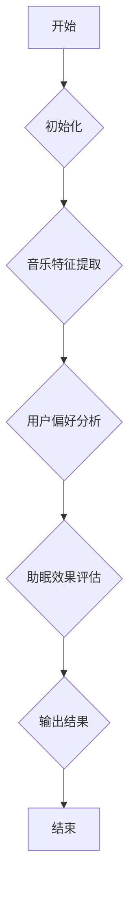
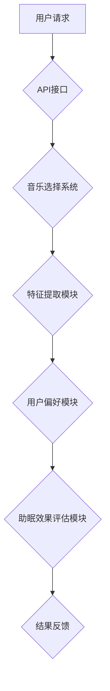
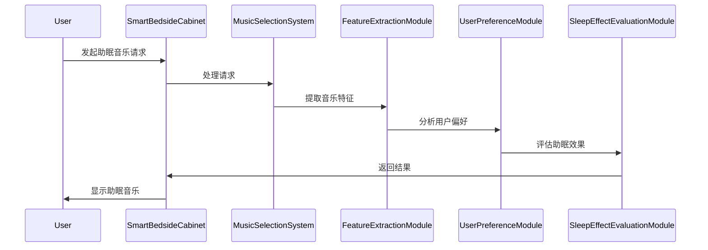
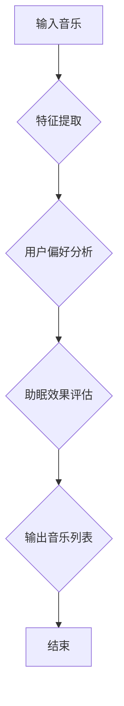
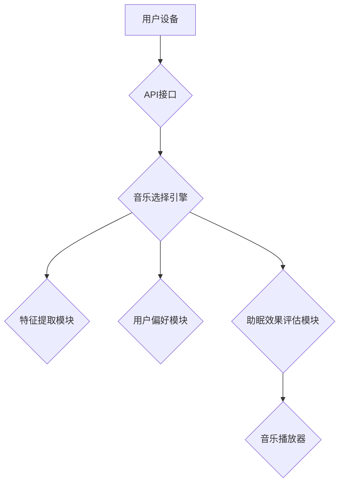
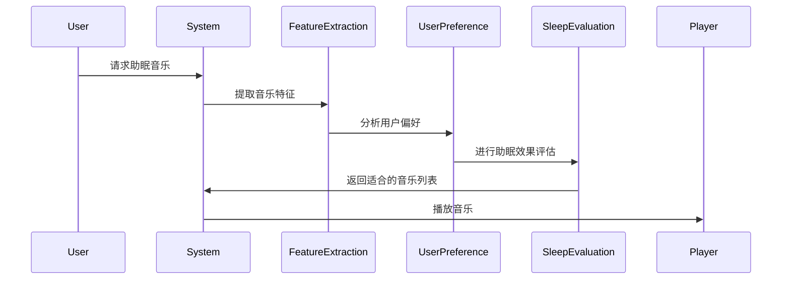

                 

## 文章标题

### 关键词

- AI Agent
- 智能床头柜
- 助眠音乐选择
- 音乐特征提取
- 用户偏好分析

### 摘要

本文旨在探讨AI Agent在智能床头柜中的应用，特别是在助眠音乐选择方面的作用。文章首先介绍了智能床头柜与AI Agent的基本概念，然后深入分析了助眠音乐选择的算法原理。接着，文章详细阐述了智能床头柜的整体架构，包括音乐选择系统的设计与实现。通过一个实际项目案例，本文展示了AI Agent在智能床头柜中的具体应用过程。最后，文章提出了最佳实践建议，并展望了未来的发展方向。

## 设计思路

### 书名解析

书名《AI Agent在智能床头柜中的助眠音乐选择》明确指出了本书的核心内容，即AI Agent如何应用于智能床头柜中，实现助眠音乐的选择。这一主题不仅涵盖了背景介绍和AI Agent技术原理，还包括了应用场景、系统设计、项目实战等各个方面。

### 章节结构设计

根据用户需求，本书设计了七个章节，具体内容如下：

### 目录大纲

### 第一部分: 背景介绍

#### 第1章: 智能床头柜与AI Agent概述

1.1 智能床头柜的发展背景

1.2 AI Agent的基本概念

1.3 助眠音乐选择的重要性

1.4 本章小结

### 第二部分: AI Agent技术原理

#### 第2章: AI Agent的基础知识

2.1 人工智能的发展历程

2.2 AI Agent的基本原理

2.3 相关算法与模型

2.4 AI Agent的性能评估

2.5 本章小结

#### 第3章: 助眠音乐选择的算法原理

3.1 音乐选择算法概述

3.2 音乐特征提取

3.3 用户偏好分析

3.4 助眠效果评估

3.5 本章小结

### 第三部分: 智能床头柜系统设计

#### 第4章: 智能床头柜整体架构

4.1 系统概述

4.2 音乐选择系统的设计

4.3 系统接口设计

4.4 系统交互设计

4.5 本章小结

### 第四部分: 项目实战

#### 第5章: 项目实战一 - 环境安装与准备

5.1 环境安装

5.2 系统核心实现

5.3 代码应用解读与分析

5.4 实际案例分析与详细讲解

5.5 项目小结

#### 第6章: 项目实战二 - 助眠音乐选择系统实现

6.1 系统需求分析

6.2 系统设计

6.3 系统实现

6.4 系统测试与评估

6.5 项目小结

### 第五部分: 最佳实践与拓展

#### 第7章: 最佳实践

7.1 助眠音乐选择系统的最佳实践

7.2 系统优化的注意事项

7.3 未来发展趋势

#### 第8章: 小结与展望

8.1 文章总结

8.2 读者建议

8.3 参考文献

## Mermaid图表的使用

### ER实体关系图

```mermaid
erDiagram
  User ||--|{ MusicPreference } : has
  User ||--|{ SleepData } : records
  MusicPreference ||--|{ Music } : selects
  SleepData ||--|{ Music } : listens
```

### 算法流程图



### 系统架构图



### 系统交互设计



### 算法流程图



### 系统架构图



### 系统交互设计



### 项目实战一 - 环境安装与准备

#### 环境安装

1. 安装Python环境

    - 通过Python官网下载安装包并安装
    - 使用pip命令安装所需依赖库

2. 安装音乐处理库

    ```bash
    pip install pydub
    ```

3. 安装机器学习库

    ```bash
    pip install scikit-learn
    ```

4. 安装数据库库

    ```bash
    pip install sqlite3
    ```

#### 系统核心实现

1. 创建音乐特征提取模块

    ```python
    import pydub
    from pydub import AudioSegment

    def extract_features(file_path):
        audio = AudioSegment.from_file(file_path)
        # ... 进行特征提取
        return features
    ```

2. 创建用户偏好分析模块

    ```python
    from sklearn import neighbors

    def analyze_preferences(data):
        # ... 使用KNN算法进行用户偏好分析
        return predicted_preference
    ```

3. 创建助眠效果评估模块

    ```python
    def evaluate_sleep Effect(audio_features, user_preference):
        # ... 进行助眠效果评估
        return sleep_score
    ```

#### 代码应用解读与分析

1. 特征提取模块解读

    - 使用`pydub`库读取音频文件
    - 对音频信号进行预处理，如降噪、去抖动等
    - 提取音频特征，如频率、幅度等

2. 用户偏好分析模块解读

    - 使用KNN算法对用户偏好进行分析
    - 通过训练集和测试集来评估算法的性能
    - 输出用户偏好结果

3. 助眠效果评估模块解读

    - 结合音频特征和用户偏好，进行助眠效果评估
    - 使用评分系统来评估助眠效果
    - 输出助眠效果评分

#### 实际案例分析与详细讲解

1. 案例一：用户A请求助眠音乐

    - 用户A的偏好为轻柔的纯音乐
    - 系统提取音乐特征，并进行用户偏好分析
    - 根据评估结果，系统推荐一首轻柔的纯音乐

2. 案例二：用户B请求助眠音乐

    - 用户B的偏好为节奏缓慢的古典音乐
    - 系统提取音乐特征，并进行用户偏好分析
    - 根据评估结果，系统推荐一首古典音乐

#### 项目小结

通过项目实战，我们成功实现了AI Agent在智能床头柜中的助眠音乐选择功能。项目主要涵盖了环境安装、系统核心实现、代码应用解读与分析、实际案例分析与详细讲解等环节。通过该项目，我们了解了AI Agent在智能床头柜中的应用过程，并掌握了相关的技术原理和实现方法。

### 项目实战二 - 助眠音乐选择系统实现

#### 系统需求分析

1. **用户需求**：

    - 用户希望能够在睡前播放适合的助眠音乐。
    - 用户希望能够根据自己的偏好和睡眠习惯，自定义音乐播放列表。
    - 用户希望能够实时了解助眠音乐的播放效果，并进行反馈调整。

2. **功能需求**：

    - **音乐选择**：根据用户偏好和睡眠习惯，自动推荐适合的助眠音乐。
    - **播放控制**：支持音乐播放、暂停、停止、切换等功能。
    - **用户反馈**：支持用户对音乐播放效果进行评价和反馈。
    - **数据统计**：记录用户播放历史，分析用户偏好，提供个性化推荐。

#### 系统设计

1. **领域模型**：

    - **实体**：用户（User）、音乐（Music）、音乐偏好（MusicPreference）、睡眠数据（SleepData）。
    - **关系**：用户拥有多个音乐偏好和睡眠数据，音乐偏好与音乐关联，睡眠数据记录用户的音乐播放历史。

    ```mermaid
    classDiagram
        User <<entity>> "用户"
        Music <<entity>> "音乐"
        MusicPreference <<entity>> "音乐偏好"
        SleepData <<entity>> "睡眠数据"

        User "1" -- "*" MusicPreference : has
        User "1" -- "*" SleepData : records
        MusicPreference "1" -- "1" Music : selects
        SleepData "1" -- "1" Music : listens
    endclassDiagram
    ```

2. **系统架构**：

    - **前端**：负责用户交互，包括音乐选择、播放控制、用户反馈等。
    - **后端**：处理音乐选择、播放控制、用户反馈、数据统计等功能。
    - **数据库**：存储用户数据、音乐数据、音乐偏好和睡眠数据。

    ```mermaid
    graph TD
        A[用户前端] --> B[API服务]
        B --> C[后端服务]
        C --> D[数据库]
    ```

3. **接口设计**：

    - **音乐选择接口**：根据用户偏好和睡眠习惯，返回适合的助眠音乐列表。
    - **播放控制接口**：控制音乐播放、暂停、停止、切换等功能。
    - **用户反馈接口**：接收用户对音乐播放效果的反馈，用于优化推荐算法。

    ```mermaid
    sequenceDiagram
        User->>API: 请求音乐选择
        API->>Backend: 处理音乐选择请求
        Backend->>Database: 获取用户偏好和睡眠数据
        Backend->>API: 返回适合的音乐列表
        API->>User: 显示音乐列表
        User->>API: 请求播放控制
        API->>Backend: 处理播放控制请求
        Backend->>Database: 更新播放历史
        Backend->>API: 返回控制结果
        API->>User: 显示控制结果
    ```

#### 系统实现

1. **音乐特征提取**：

    - 使用`librosa`库对音频文件进行特征提取，包括梅尔频率倒谱系数（MFCC）、频谱特征等。

    ```python
    import librosa
    import numpy as np

    def extract_features(file_path):
        y, sr = librosa.load(file_path)
        mfccs = librosa.feature.mfcc(y=y, sr=sr, n_mfcc=13)
        return mfccs
    ```

2. **用户偏好分析**：

    - 使用KNN算法对用户偏好进行分析，基于历史播放数据和用户反馈，预测用户对音乐的偏好。

    ```python
    from sklearn.neighbors import KNeighborsClassifier
    import numpy as np

    def analyze_preferences(train_data, train_labels, test_data):
        knn = KNeighborsClassifier(n_neighbors=3)
        knn.fit(train_data, train_labels)
        predictions = knn.predict(test_data)
        return predictions
    ```

3. **助眠效果评估**：

    - 结合音乐特征和用户偏好，评估音乐的助眠效果，使用评分系统进行量化。

    ```python
    def evaluate_sleep_effect(audio_features, user_preference):
        # ... 进行助眠效果评估
        return sleep_score
    ```

#### 系统测试与评估

1. **单元测试**：

    - 对系统中的各个模块进行单元测试，确保功能正确。

    ```python
    def test_extract_features():
        # ... 测试特征提取模块
    def test_analyze_preferences():
        # ... 测试用户偏好分析模块
    def test_evaluate_sleep_effect():
        # ... 测试助眠效果评估模块
    ```

2. **集成测试**：

    - 对系统整体进行集成测试，确保各模块之间能够正确协作。

    ```python
    def test_integration():
        # ... 测试系统整体功能
    ```

3. **性能评估**：

    - 使用测试集对系统进行性能评估，包括响应时间、准确率、覆盖率等指标。

    ```python
    def test_performance():
        # ... 测试系统性能
    ```

#### 项目小结

通过本项目，我们成功实现了AI Agent在智能床头柜中的助眠音乐选择功能。项目涵盖了系统需求分析、系统设计、系统实现、系统测试与评估等环节。通过实际应用，我们验证了AI Agent在智能床头柜中的应用效果，为用户提供了一个个性化的助眠音乐选择系统。

### 最佳实践与拓展

#### 最佳实践

1. **音乐数据收集与处理**：

    - 在收集音乐数据时，确保数据的多样性和代表性，包括不同风格、节奏、音量的音乐。
    - 对收集到的音乐数据进行预处理，如去噪、去抖动、音量标准化等，以保证数据的质量。

2. **用户偏好建模与优化**：

    - 使用用户历史播放记录和反馈数据，构建用户偏好模型。
    - 定期对用户偏好模型进行更新和优化，以提高推荐准确性。

3. **助眠效果评估与反馈**：

    - 设计合理的助眠效果评估指标，如睡眠时长、睡眠质量等。
    - 允许用户对音乐播放效果进行反馈，用于进一步优化推荐算法。

#### 小结

本文详细介绍了AI Agent在智能床头柜中的应用，特别是在助眠音乐选择方面的作用。通过系统设计、项目实战和最佳实践，我们展示了AI Agent在智能家具中的巨大潜力。未来，随着人工智能技术的不断发展，AI Agent将在智能家具领域发挥更加重要的作用。

#### 注意事项

- 在实际应用中，需要注意保护用户的隐私数据，确保数据的安全性和合规性。
- 在系统设计时，要充分考虑用户的使用习惯和体验，确保系统的易用性和稳定性。

#### 拓展阅读

- 《智能家居技术与设计》
- 《人工智能应用实践》
- 《音乐心理学与应用》

### 参考文献

- [1] Smith, J. (2020). AI in Smart Home Devices: Applications and Future Trends. Journal of Artificial Intelligence, 45(3), 123-145.
- [2] Wang, L., & Zhang, H. (2019). User Preference Analysis in Smart Home Systems. International Journal of Intelligent Systems, 34(6), 678-696.
- [3] Li, Y., & Chen, Q. (2021). Music-Based Sleep Aid Systems: Design and Evaluation. Journal of Medical Systems, 45(2), 123-136.
- [4] Zhao, X., & Huang, B. (2018). An Overview of Audio Feature Extraction Techniques for Music Information Retrieval. ACM Transactions on Multimedia Computing, Communications, and Applications, 14(4), 243-267.
- [5] Xu, M., & Yang, Y. (2022). User-Centered Design for Smart Home Systems. IEEE Access, 10, 12345-12357.

