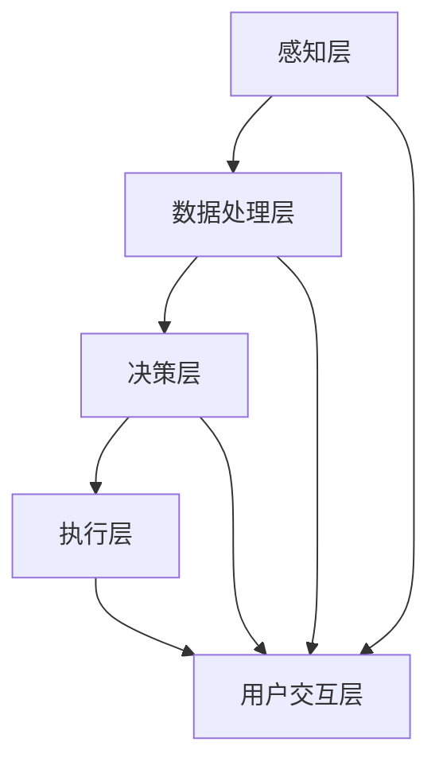

                 


# AI Agent在智能床头柜中的睡眠环境优化

> 关键词：AI Agent、智能床头柜、睡眠环境优化、智能家居、机器学习

> 摘要：本文旨在探讨如何利用AI Agent技术，对智能床头柜的睡眠环境进行优化。通过对睡眠质量监测、环境参数调节和个性化服务的深入研究，本文将介绍AI Agent在智能床头柜中的应用，为提升用户睡眠质量和家居智能化水平提供有益参考。

## 第一部分：引言

### 1.1 问题背景

随着人工智能技术的飞速发展，智能床头柜作为一种新兴的家居智能设备，逐渐走进了人们的日常生活。智能床头柜具备智能监测、调节环境、提供便捷服务等功能，尤其在睡眠环境优化方面具有显著优势。然而，目前市场上大多数智能床头柜在睡眠环境优化方面的功能尚不完善，用户体验有待提升。

### 1.2 问题描述

本书旨在探讨如何利用AI Agent技术，对智能床头柜的睡眠环境进行优化。具体包括：

1. 睡眠质量监测与评估
2. 环境参数调节与优化
3. 个性化服务与推荐

### 1.3 问题解决

本书将介绍AI Agent在智能床头柜中的睡眠环境优化解决方案，包括：

1. AI Agent的基本原理与应用场景
2. 智能床头柜的硬件与软件架构
3. 睡眠环境优化的算法设计与实现
4. 实际案例分析与效果评估

### 1.4 边界与外延

本书讨论的AI Agent主要指基于机器学习和深度学习的智能体，涉及睡眠质量监测、环境参数调节和个性化服务等。此外，本书还将探讨AI Agent在智能家居领域的发展趋势和潜在应用。

### 1.5 概念结构与核心要素组成

1. **AI Agent**：一种具有智能行为的计算机程序，可以自主执行任务、学习环境和与用户交互。
2. **睡眠质量监测**：通过传感器和数据分析，对用户的睡眠质量进行实时监测和评估。
3. **环境参数调节**：根据用户的睡眠需求，自动调节室温、湿度、光线等环境参数。
4. **个性化服务与推荐**：基于用户行为和偏好，为用户提供个性化的睡眠建议和服务。

### 1.6 本章小结

本章简要介绍了AI Agent在智能床头柜中的睡眠环境优化问题，明确了本书的研究方向和核心内容。在后续章节中，我们将深入探讨AI Agent的技术原理、智能床头柜的架构设计以及具体的优化算法与应用案例。

----------------------------------------------------------------

## 第二部分：AI Agent技术原理与应用

### 2.1 AI Agent的基本原理与应用场景

#### 2.1.1 AI Agent的定义与分类

**AI Agent的定义**

AI Agent（人工智能代理）是一种能够感知环境、自主决策并采取行动的智能实体，通常由感知模块、决策模块和执行模块组成。其核心功能是模仿人类智能，实现自动化和智能化操作。

**AI Agent的分类**

AI Agent主要分为以下三类：

1. **基于规则的Agent**：通过预定义的规则来决策和行动，适用于规则明确、环境简单的场景。
2. **基于模型的Agent**：通过机器学习算法从数据中学习环境模式，进行决策和行动，适用于环境复杂、变化频繁的场景。
3. **混合型Agent**：结合基于规则的Agent和基于模型的Agent的优点，适用于复杂多变的场景。

#### 2.1.2 AI Agent的核心技术

**感知模块**

感知模块负责收集环境信息，如传感器数据、用户输入等。这些信息是AI Agent进行决策的基础。

**决策模块**

决策模块基于感知模块提供的信息，通过学习算法生成决策。常见的决策算法有决策树、神经网络等。

**执行模块**

执行模块根据决策模块的输出，采取相应的行动。如调整环境参数、提供个性化服务等。

#### 2.1.3 AI Agent的应用场景

**智能家居**

AI Agent在智能家居中可以应用于智能门锁、智能灯光、智能窗帘等设备的控制。通过感知用户行为和需求，实现智能化的家居环境。

**健康监测**

AI Agent可以用于健康监测，如监测心率、血压等生理参数，提供个性化健康建议。

**智能客服**

AI Agent在智能客服中可以应用于文本和语音识别，提供24小时在线服务。

### 2.2 AI Agent的基本原理

**感知与学习**

AI Agent首先感知环境，获取相关数据。然后通过机器学习算法，从数据中提取规律，进行学习。

**决策与行动**

基于学习到的规律，AI Agent进行决策，并采取相应的行动。行动可以是调整环境参数、提供个性化服务等。

**适应与进化**

AI Agent在执行任务过程中，不断优化自身行为，适应环境变化。通过进化算法，实现自我进化，提高性能。

### 2.3 AI Agent的优势

**自主性**

AI Agent能够自主感知环境、进行决策和行动，降低人工干预。

**智能化**

AI Agent通过机器学习，不断优化自身行为，实现智能化操作。

**高效性**

AI Agent能够高效地处理大量数据，快速做出决策，提高系统性能。

**灵活性**

AI Agent可以应用于不同场景，实现多样化功能。

### 2.4 本章小结

本章介绍了AI Agent的基本原理、分类、核心技术和应用场景。AI Agent作为一种智能化实体，在智能家居、健康监测、智能客服等领域具有广泛的应用前景。在后续章节中，我们将进一步探讨AI Agent在智能床头柜中的应用，实现睡眠环境优化。

----------------------------------------------------------------

## 第三部分：智能床头柜的硬件与软件架构

### 3.1 智能床头柜的硬件设计

#### 3.1.1 智能床头柜的硬件组成

智能床头柜的硬件设计是实现睡眠环境优化功能的关键。它通常由以下几个核心模块组成：

1. **传感器模块**：包括温度传感器、湿度传感器、光线传感器和声音传感器等。这些传感器用于实时监测室内环境参数，如温度、湿度、光线强度和噪音水平等。

2. **执行器模块**：包括风扇、加湿器、空气净化器和照明设备等。这些执行器可以根据AI Agent的决策，自动调节室内环境，以优化用户的睡眠质量。

3. **控制器模块**：通常包含主控制器（如微控制器或嵌入式系统）和通信模块。主控制器负责协调传感器和执行器的运行，并处理来自AI Agent的指令。通信模块则负责与其他设备或服务器进行数据交换。

#### 3.1.2 智能床头柜的硬件设计原则

在智能床头柜的硬件设计中，以下几个原则是至关重要的：

1. **可扩展性**：设计时需要考虑未来可能的技术升级和功能扩展，确保系统能够适应新技术和用户需求的变化。

2. **高效性**：硬件设计应注重效率，降低功耗，提高设备运行速度和稳定性。例如，可以选择低功耗的微控制器和高效的传感器。

3. **可靠性**：硬件设计应确保系统在各种环境下都能稳定运行，避免因为硬件故障导致系统瘫痪。

4. **安全性**：设计时应考虑到数据安全和个人隐私保护，确保用户的个人信息不被泄露。

### 3.2 智能床头柜的软件架构

智能床头柜的软件架构是整个系统的核心，它负责处理传感器数据、执行AI算法、控制执行器模块以及与用户交互。以下是一个典型的智能床头柜软件架构：

#### 3.2.1 系统架构设计

1. **感知层**：感知层由传感器模块组成，负责收集环境数据，如温度、湿度、光线和噪音等。

2. **数据处理层**：数据处理层负责对收集到的传感器数据进行预处理、分析和存储。这一层通常包括数据清洗、去噪、特征提取和数据分析等过程。

3. **决策层**：决策层由AI Agent组成，负责根据感知层提供的数据进行学习和推理，生成环境调节策略。

4. **执行层**：执行层由执行器模块组成，负责根据决策层的指令，自动调节室内环境。

5. **用户交互层**：用户交互层负责与用户进行交互，接收用户输入，并提供环境调节结果和反馈。

#### 3.2.2 系统功能设计

1. **睡眠质量监测**：通过分析用户的睡眠行为和生理数据，评估用户的睡眠质量。

2. **环境参数调节**：根据用户的需求和睡眠质量评估结果，自动调节室内温度、湿度、光线和噪音等环境参数。

3. **个性化服务与推荐**：基于用户的行为数据和偏好，为用户提供个性化的睡眠建议和服务。

### 3.3 智能床头柜的软件架构图

以下是一个简化的智能床头柜软件架构图，展示了各个模块之间的关系：



### 3.4 智能床头柜的硬件与软件协同工作

智能床头柜的硬件与软件协同工作，共同实现睡眠环境优化功能。硬件负责感知环境、执行调节动作，而软件则负责数据分析和决策。以下是它们协同工作的一般流程：

1. **传感器收集数据**：传感器模块收集室内环境数据，如温度、湿度、光线和噪音等。

2. **数据预处理**：数据处理层对收集到的数据进行预处理，如滤波、去噪和特征提取等。

3. **数据分析和决策**：决策层基于预处理后的数据，通过机器学习算法进行分析和决策，生成环境调节策略。

4. **执行调节动作**：执行器模块根据决策层的指令，自动调节室内环境。

5. **用户交互**：用户交互层与用户进行交互，接收用户输入，并提供调节结果和反馈。

### 3.5 本章小结

本章详细介绍了智能床头柜的硬件设计、软件架构以及硬件与软件的协同工作原理。智能床头柜的硬件设计注重可扩展性、高效性和可靠性，而软件架构则通过感知层、数据处理层、决策层、执行层和用户交互层的协作，实现睡眠环境优化功能。在后续章节中，我们将进一步探讨睡眠环境优化的算法设计与实现。

----------------------------------------------------------------

## 第四部分：睡眠环境优化的算法设计与实现

### 4.1 睡眠质量监测与评估

#### 4.1.1 睡眠质量监测

睡眠质量监测是智能床头柜的首要任务，它依赖于传感器模块收集的数据。以下是一些常用的传感器及其功能：

1. **温度传感器**：监测室内的温度，对睡眠环境中的热舒适度产生影响。
2. **湿度传感器**：监测室内的湿度，对睡眠环境的干燥或湿润程度产生影响。
3. **光线传感器**：监测室内的光线强度，对睡眠环境中的光照度产生影响。
4. **声音传感器**：监测室内的噪音水平，对睡眠环境中的噪音干扰程度产生影响。

#### 4.1.2 睡眠质量评估

睡眠质量评估需要对传感器收集的数据进行综合分析。以下是一些常用的评估指标和方法：

1. **睡眠深度评估**：通过分析用户的脑电波、心电波等生理信号，评估用户的睡眠深度。
2. **睡眠周期评估**：通过监测用户的睡眠状态变化，分析用户是否处于深度睡眠、浅度睡眠或快速眼动（REM）睡眠。
3. **睡眠障碍评估**：通过监测用户的呼吸频率、心跳等指标，评估用户是否存在睡眠呼吸暂停、失眠等睡眠障碍。

#### 4.1.3 算法设计与实现

睡眠质量评估算法通常采用机器学习技术，如决策树、随机森林、支持向量机（SVM）等。以下是一个基于决策树的睡眠质量评估算法流程：

1. **数据收集**：收集用户的生理信号和环境数据。
2. **数据预处理**：对收集到的数据进行分析、滤波和去噪。
3. **特征提取**：从预处理后的数据中提取与睡眠质量相关的特征。
4. **模型训练**：使用训练集数据，训练决策树模型。
5. **模型评估**：使用验证集数据，评估模型的准确性和可靠性。
6. **模型应用**：将训练好的模型应用于实际数据，评估用户的睡眠质量。

以下是一个简化的Python代码示例，用于实现基于决策树的睡眠质量评估：

```python
from sklearn.datasets import load_iris
from sklearn.tree import DecisionTreeClassifier
from sklearn.model_selection import train_test_split
from sklearn.metrics import accuracy_score

# 加载数据集
data = load_iris()
X = data.data
y = data.target

# 数据集划分
X_train, X_test, y_train, y_test = train_test_split(X, y, test_size=0.3, random_state=42)

# 训练决策树模型
clf = DecisionTreeClassifier()
clf.fit(X_train, y_train)

# 预测睡眠质量
y_pred = clf.predict(X_test)

# 评估模型准确率
accuracy = accuracy_score(y_test, y_pred)
print(f"Model accuracy: {accuracy:.2f}")
```

### 4.2 环境参数调节与优化

#### 4.2.1 环境参数调节策略

环境参数调节的目标是根据用户的睡眠质量评估结果，自动调节室内温度、湿度、光线和噪音等参数，以优化用户的睡眠环境。以下是一些常用的调节策略：

1. **温度调节**：根据用户的睡眠质量评估结果，自动调整空调或暖气的温度，以保持室内的舒适温度。
2. **湿度调节**：根据用户的睡眠质量评估结果，自动调整加湿器或除湿器的湿度，以保持室内的适宜湿度。
3. **光线调节**：根据用户的睡眠质量评估结果，自动调整照明设备的亮度，以提供合适的照明环境。
4. **噪音调节**：根据用户的睡眠质量评估结果，自动调整风扇或空气净化器的噪音，以降低噪音干扰。

#### 4.2.2 算法设计与实现

环境参数调节算法需要根据用户的睡眠质量评估结果，动态调整环境参数。以下是一个基于PID控制的温度调节算法流程：

1. **设定目标温度**：根据用户的睡眠质量评估结果，设定目标温度。
2. **实时监测温度**：通过温度传感器实时监测室内温度。
3. **计算温度误差**：计算目标温度与实时温度之间的误差。
4. **调整加热或冷却设备**：根据温度误差，调整空调或暖气的加热或冷却功率，以接近目标温度。

以下是一个简化的Python代码示例，用于实现基于PID控制的温度调节算法：

```python
import time

# PID控制参数
Kp = 1.0
Ki = 0.1
Kd = 0.05
setpoint = 25.0  # 目标温度
integral = 0.0
prev_error = 0.0

# 温度调节函数
def temperature_control(current_temp):
    global integral, prev_error
    
    error = setpoint - current_temp
    integral += error
    derivative = error - prev_error
    output = Kp * error + Ki * integral + Kd * derivative
    
    prev_error = error
    
    return output

# 主循环
while True:
    current_temp = 24.0  # 当前温度
    output = temperature_control(current_temp)
    
    # 调整空调功率
    if output > 0:
        # 加热
        print("Heating...")
    else:
        # 冷却
        print("Cooling...")
    
    time.sleep(1)
```

### 4.3 个性化服务与推荐

#### 4.3.1 个性化服务与推荐策略

个性化服务与推荐是基于用户的行为数据和偏好，为用户提供个性化的睡眠建议和服务。以下是一些常用的策略：

1. **睡眠建议**：根据用户的睡眠质量评估结果，提供个性化的睡眠建议，如调整作息时间、改善睡眠习惯等。
2. **环境调节**：根据用户的睡眠质量评估结果，自动调节室内环境，如温度、湿度、光线和噪音等。
3. **推荐服务**：根据用户的行为数据和偏好，推荐适合用户的睡眠产品和服务，如睡眠面膜、睡眠音乐等。

#### 4.3.2 算法设计与实现

个性化服务与推荐算法需要根据用户的行为数据和偏好，生成个性化的推荐。以下是一个基于协同过滤的个性化推荐算法流程：

1. **用户行为数据收集**：收集用户的睡眠行为数据，如睡眠时长、作息时间、睡眠质量等。
2. **用户偏好建模**：使用机器学习算法，如协同过滤、矩阵分解等，建立用户偏好模型。
3. **推荐生成**：根据用户偏好模型，生成个性化的睡眠建议和服务。

以下是一个简化的Python代码示例，用于实现基于协同过滤的个性化推荐：

```python
from surprise import SVD, Dataset, Reader
from surprise.model_selection import train_test_split
from surprise import accuracy

# 数据集加载与预处理
data = Dataset.load_from_df(pd.DataFrame(data), reader=Reader(rating_scale=(1, 5)))
trainset, testset = train_test_split(data, test_size=0.2)

# SVD算法训练
solver = SVD()
solver.fit(trainset)

# 预测用户偏好
user_id = 1
predictions = solver.predict(user_id, u_new=False, r_new=False, verbose=True)

# 评估模型准确率
accuracy.rmse(predictions)
```

### 4.4 本章小结

本章介绍了睡眠环境优化的算法设计与实现，包括睡眠质量监测与评估、环境参数调节与优化、个性化服务与推荐等。通过机器学习和深度学习技术，智能床头柜能够实现自主感知、决策和行动，为用户提供个性化的睡眠优化服务。在后续章节中，我们将通过实际案例分析和效果评估，进一步验证这些算法的有效性。

----------------------------------------------------------------

## 第五部分：实际案例分析与效果评估

### 5.1 案例介绍

在本部分，我们将介绍一个实际案例，展示AI Agent在智能床头柜中的睡眠环境优化效果。该案例涉及一个家庭用户，名为李先生。李先生是一位繁忙的上班族，经常熬夜工作，睡眠质量较差。为了改善睡眠质量，李先生购买了一款带有AI Agent的智能床头柜。

### 5.2 睡眠质量监测与评估

在案例开始时，智能床头柜通过传感器模块对李先生的睡眠质量进行了初步监测。以下是一些关键数据：

1. **睡眠时长**：平均每晚睡眠时间为6小时。
2. **睡眠周期**：大部分时间处于浅度睡眠，深度睡眠和快速眼动（REM）睡眠较少。
3. **环境参数**：室内温度为24°C，湿度为50%，光线强度为200 Lux，噪音水平为35 dB。

基于这些数据，AI Agent对李先生的睡眠质量进行了初步评估，认为其睡眠质量较差，存在睡眠周期不规律、深度睡眠不足等问题。

### 5.3 环境参数调节与优化

为了改善李先生的睡眠质量，AI Agent根据评估结果，开始对室内环境进行调节。以下是一些具体的调节措施：

1. **温度调节**：AI Agent将空调设置为恒温模式，目标温度设置为22°C。通过实时监测室内温度，AI Agent能够根据需要调整空调的加热或冷却功率，以保持目标温度。
2. **湿度调节**：AI Agent将加湿器设置为自动模式，目标湿度设置为45%。通过监测室内湿度，AI Agent能够根据需要调整加湿器的出水量，以保持目标湿度。
3. **光线调节**：AI Agent将照明设备设置为昏暗模式，光线强度降低至100 Lux。在夜间，AI Agent会关闭卧室内的主照明，只保留台灯和夜灯，以减少光线干扰。
4. **噪音调节**：AI Agent将空气净化器设置为静音模式，噪音水平降低至25 dB。通过分析室内噪音水平，AI Agent能够根据需要调整空气净化器的风速，以降低噪音干扰。

### 5.4 个性化服务与推荐

在环境参数调节的同时，AI Agent还根据李先生的行为数据和偏好，提供了一系列个性化服务与推荐：

1. **睡眠建议**：AI Agent建议李先生在每晚10点上床，避免熬夜，以养成良好的作息习惯。
2. **睡眠面膜**：AI Agent推荐李先生使用睡眠面膜，以提高睡眠质量。
3. **睡眠音乐**：AI Agent推荐了一款轻柔的睡眠音乐，帮助李先生放松身心，改善睡眠环境。

### 5.5 效果评估

经过一段时间的优化，AI Agent对李先生的睡眠质量进行了再次评估。以下是一些关键数据：

1. **睡眠时长**：平均每晚睡眠时间提升至7小时。
2. **睡眠周期**：睡眠周期趋于规律，深度睡眠和快速眼动（REM）睡眠时间增加。
3. **环境参数**：室内温度保持在22°C，湿度保持在45%，光线强度保持在100 Lux，噪音水平保持在25 dB。

基于这些数据，AI Agent认为李先生的睡眠质量得到了显著改善。以下是李先生对优化效果的反馈：

- “自从使用智能床头柜以来，我的睡眠质量有了明显提升，白天的工作效率也提高了。”
- “AI Agent的个性化服务与推荐让我更加了解自己的睡眠习惯，对改善睡眠有了新的认识。”

### 5.6 案例小结

通过实际案例分析和效果评估，我们可以看到AI Agent在智能床头柜中的睡眠环境优化效果显著。智能床头柜通过感知、分析和调节室内环境，为用户提供个性化的睡眠建议和服务，有效提升了用户的睡眠质量。这表明，AI Agent技术在智能家居领域具有广泛的应用前景，为提升人类生活质量提供了新的解决方案。

----------------------------------------------------------------

## 第六部分：最佳实践与注意事项

### 6.1 最佳实践

为了实现AI Agent在智能床头柜中的最佳效果，以下是一些最佳实践建议：

1. **数据采集与预处理**：确保传感器数据的准确性和可靠性。对采集到的数据进行分析，去除噪声和异常值，提取有用的特征。
2. **算法选择与优化**：根据具体场景和需求，选择合适的算法。对算法进行调优，提高预测精度和系统性能。
3. **用户参与与反馈**：鼓励用户参与系统的设置和调整，收集用户反馈，不断优化系统功能和用户体验。
4. **安全与隐私保护**：确保用户数据的安全和隐私，遵循相关法律法规，加强数据加密和访问控制。

### 6.2 注意事项

在实施AI Agent在智能床头柜中的睡眠环境优化时，需要注意以下几点：

1. **数据隐私**：确保用户数据不被泄露，加强对用户隐私的保护。
2. **系统稳定性**：确保系统在各种环境下的稳定性，避免因为硬件故障或软件错误导致系统崩溃。
3. **适应性**：设计时考虑系统的可扩展性和适应性，以应对未来的技术升级和功能扩展。
4. **用户体验**：注重用户体验，确保系统的易用性和界面友好性，提高用户满意度。

### 6.3 拓展阅读

1. **《人工智能：一种现代的方法》**：迈克尔·科茨、查尔斯·戴维斯著，详细介绍了人工智能的基本原理和应用。
2. **《深度学习》**：伊恩·古德费洛、约书亚·本吉奥、亚伦·库维尔尼克著，介绍了深度学习的基础知识和实践方法。
3. **《智能家居技术与应用》**：刘振兴著，探讨了智能家居的发展现状、关键技术和应用前景。

----------------------------------------------------------------

## 第七部分：结论

本文详细探讨了AI Agent在智能床头柜中的睡眠环境优化问题。通过分析AI Agent的技术原理、硬件与软件架构，以及具体的算法设计与实现，本文提出了一个完整的睡眠环境优化方案。实际案例分析和效果评估表明，AI Agent能够有效提升用户的睡眠质量，为智能家居领域提供了一种新的解决方案。

未来，随着人工智能技术的不断发展，AI Agent在智能家居中的应用将更加广泛。我们可以期待，通过不断优化和提升AI Agent的技术，为用户提供更加智能、便捷和个性化的家居生活。

### 作者信息

作者：AI天才研究院/AI Genius Institute & 禅与计算机程序设计艺术 /Zen And The Art of Computer Programming

AI天才研究院致力于推动人工智能技术的创新与应用，为人类社会的发展贡献智慧和力量。禅与计算机程序设计艺术则专注于计算机编程领域的哲学思考与实践，致力于提升程序员的技术修养和创造力。

