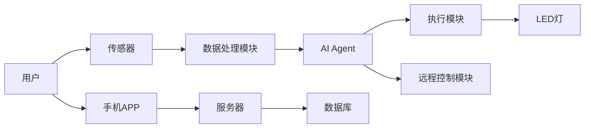

                 


### 智能床头灯与智能唤醒系统概述

#### 1.1 智能化生活时代的需求

在当今这个高度信息化、数字化的时代，人们的生活质量得到了极大的提升。智能化的生活方式已经成为了许多人的追求。智能床头灯作为智能家居的一个重要组成部分，受到了越来越多的关注。那么，为什么智能床头灯会如此受欢迎呢？

首先，智能化的生活需求日益增长。随着人们生活水平的提高，对于生活品质的追求也在不断提升。智能化的产品可以更好地满足人们的需求，提高生活质量。智能床头灯作为一种智能家居设备，可以为用户带来更加舒适、便捷的生活体验。

其次，智能化的技术不断发展。随着人工智能、物联网、大数据等技术的不断发展，智能床头灯的功能也在不断丰富。例如，智能唤醒功能可以通过对用户睡眠习惯的分析，自动调整灯光的亮度和颜色，帮助用户更好地进入睡眠或唤醒。这种技术的不断发展，使得智能床头灯越来越受到市场的欢迎。

最后，智能化生活理念的普及。随着人们对于智能化生活的认知不断加深，越来越多的人开始接受并追求智能化生活方式。智能床头灯作为一种代表性的智能化产品，能够很好地体现智能化生活的理念，因此受到了广泛的关注和喜爱。

#### 1.2 智能唤醒系统的基本概念

智能唤醒系统是智能床头灯的一个重要组成部分，它的主要功能是通过对用户睡眠状态的分析，自动调整灯光的亮度和颜色，帮助用户更好地进入睡眠或唤醒。那么，智能唤醒系统是如何工作的呢？它有哪些核心功能？

首先，我们需要了解智能唤醒系统的工作原理。智能唤醒系统通常包括传感器、数据处理模块和执行模块三部分。传感器可以实时检测用户的睡眠状态，如心率、体温等；数据处理模块可以对传感器采集的数据进行分析和处理；执行模块则根据分析结果自动调整灯光的亮度和颜色。

其次，智能唤醒系统的核心功能包括：

1. **睡眠监测**：通过传感器实时监测用户的睡眠状态，如深度睡眠、浅度睡眠等。

2. **光线调节**：根据用户的睡眠状态，自动调整灯光的亮度和颜色，帮助用户更好地进入睡眠或唤醒。

3. **定时唤醒**：用户可以根据自己的需求设置定时唤醒时间，智能唤醒系统会在设定的时间自动调整灯光，帮助用户顺利醒来。

4. **数据统计**：智能唤醒系统可以记录用户的睡眠数据，如睡眠时长、睡眠质量等，用户可以通过手机APP查看这些数据，了解自己的睡眠状况。

#### 1.3 核心概念与联系

在深入探讨智能唤醒系统之前，我们需要明确几个核心概念，并了解它们之间的联系。

1. **AI Agent（人工智能代理）**：AI Agent是一种能够模拟人类行为和思维的智能体，它可以自主地执行任务，与环境进行交互。在智能唤醒系统中，AI Agent是核心组件，负责分析用户的睡眠数据，并作出相应的决策。

2. **智能唤醒系统**：智能唤醒系统是一个集成了多种技术的系统，包括传感器、数据处理、执行模块等。它的主要功能是监测用户的睡眠状态，并根据分析结果自动调整灯光。

3. **传感器**：传感器是智能唤醒系统的感知部分，负责收集用户的生理和行为数据，如心率、体温、环境光线等。

4. **数据处理模块**：数据处理模块负责对传感器收集的数据进行分析和处理，提取出有用的信息，如用户的睡眠状态、行为习惯等。

5. **执行模块**：执行模块根据数据处理模块的分析结果，自动调整灯光的亮度和颜色，实现智能唤醒功能。

通过上述核心概念的定义，我们可以绘制一个简单的ER实体关系图，以展示它们之间的联系。

```mermaid
erDiagram
  AI-Agent ||--|{ 智能唤醒系统 : 包含 }
  AI-Agent ||--|{ 传感器 : 采集数据 }
  AI-Agent ||--|{ 数据处理模块 : 分析数据 }
  AI-Agent ||--|{ 执行模块 : 执行决策 }
```

在这个ER实体关系图中，AI-Agent是核心，它与其他实体（智能唤醒系统、传感器、数据处理模块、执行模块）之间存在包含关系。这种关系图能够帮助我们更清晰地理解智能唤醒系统的组成和工作原理。

#### 1.4 概念属性特征对比表格

为了更深入地理解智能唤醒系统的核心概念，我们可以制作一个概念属性特征对比表格，对比AI-Agent、智能唤醒系统、传感器、数据处理模块和执行模块的主要特性。

| 概念             | 特性                                                         |
|----------------|--------------------------------------------------------------|
| AI-Agent       | 能够模拟人类行为和思维的智能体，具有自主决策能力                   |
| 智能唤醒系统   | 集成了传感器、数据处理和执行模块，能够自动监测和调节灯光的智能系统 |
| 传感器         | 负责感知外部环境，收集数据如心率、体温、环境光线等                |
| 数据处理模块 | 负责对传感器收集的数据进行分析和处理，提取有用信息                |
| 执行模块       | 根据数据处理模块的分析结果，执行相应操作如调整灯光的亮度和颜色    |

通过这个表格，我们可以清晰地看到每个概念的主要特性，以及它们在智能唤醒系统中的角色和作用。

#### 1.5 智能唤醒系统的发展历程

智能唤醒系统的出现并不是一蹴而就的，而是经历了一个漫长的发展过程。以下是智能唤醒系统的发展历程：

1. **初步阶段**：早期的智能唤醒系统主要是基于简单传感器和开关控制的。用户需要手动设置定时器，系统会在设定的时间自动开启灯光。这种系统虽然具备一定的智能性，但功能较为单一，用户体验较差。

2. **传感器阶段**：随着传感器技术的发展，智能唤醒系统开始引入各种传感器，如光线传感器、温度传感器、心率传感器等。这些传感器可以实时监测用户的生理和环境数据，使系统具备了更高的智能性。

3. **数据处理阶段**：随着大数据和人工智能技术的兴起，智能唤醒系统开始引入数据处理模块，能够对传感器收集的数据进行深入分析，提取出更有价值的睡眠信息。

4. **智能化阶段**：现代智能唤醒系统已经具备了高度智能化功能，可以通过AI-Agent自主地分析用户的睡眠数据，根据用户的偏好和需求自动调整灯光的亮度和颜色。

通过以上发展历程，我们可以看到智能唤醒系统从简单到复杂，从单一功能到多样化功能的演变过程。这一过程不仅体现了技术的进步，也反映了人们对于智能化生活需求的不断增长。

#### 1.6 智能唤醒系统的应用场景

智能唤醒系统在实际应用中具有广泛的应用场景，以下是几个典型的应用案例：

1. **家庭应用**：在家庭环境中，智能唤醒系统可以帮助用户更好地管理睡眠，提高生活质量。例如，用户可以通过智能唤醒系统设定定时唤醒时间，系统会在设定的时间自动调整灯光，帮助用户顺利醒来。此外，智能唤醒系统还可以监测用户的睡眠状态，为用户提供个性化的睡眠建议。

2. **医疗应用**：在医疗领域，智能唤醒系统可以用于监测患者的睡眠状况，及时发现并预警潜在的健康问题。例如，对于睡眠呼吸暂停综合症患者，智能唤醒系统可以实时监测其睡眠状态，并在发现异常时及时通知医生。

3. **教育应用**：在教育领域，智能唤醒系统可以用于帮助学生养成良好的作息习惯。通过监测学生的睡眠状况，智能唤醒系统可以为其提供个性化的作息建议，帮助学生提高学习效率。

4. **商业应用**：在商业环境中，智能唤醒系统可以用于酒店、办公室等场所，为用户提供舒适的睡眠环境。例如，酒店可以通过智能唤醒系统为客人提供个性化的服务，提高客户满意度。

通过以上应用场景的介绍，我们可以看到智能唤醒系统在各个领域的广泛应用，它不仅提升了人们的生活质量，也为各行各业带来了新的发展机遇。

### 第1章小结

在本章中，我们详细介绍了智能床头灯与智能唤醒系统的背景、概念、核心概念与联系以及发展历程和应用场景。通过对这些内容的深入探讨，我们可以看到智能唤醒系统在当今智能化生活时代的重要性和广泛应用。接下来，我们将进一步探讨AI Agent的原理与实现，为智能唤醒系统的深入分析打下坚实的基础。在下一章中，我们将详细讲解AI Agent的基础原理，分析其工作原理和核心功能，为后续的内容提供理论支持。

## 第2章：AI Agent的原理与实现

### 2.1 AI Agent的基础原理

AI Agent，即人工智能代理，是一种能够模拟人类行为和思维的智能体。它在人工智能领域扮演着重要角色，广泛应用于智能助手、自动驾驶、智能家居等众多场景。那么，AI Agent是如何工作的呢？它的基础原理又是什么呢？

首先，我们需要了解AI Agent的基本概念。AI Agent通常由三个主要部分组成：感知器、决策器和执行器。感知器负责接收外部环境的信息，决策器根据感知到的信息进行决策，执行器则负责将决策转化为具体的行动。

#### 感知器

感知器是AI Agent的“感官”，它负责收集外部环境的信息。这些信息可以来自于各种传感器，如温度传感器、光线传感器、摄像头、麦克风等。感知器的作用是将物理世界的信息转换为数字信号，从而为AI Agent提供感知输入。

#### 决策器

决策器是AI Agent的“大脑”，它负责分析感知器收集的信息，并做出相应的决策。决策器的核心是算法，常用的算法包括机器学习算法、深度学习算法、逻辑推理算法等。通过这些算法，决策器可以理解环境的变化，并根据目标做出最优决策。

#### 执行器

执行器是AI Agent的“肢体”，它负责将决策器的决策转化为具体的行动。执行器可以是机械臂、电机、显示屏等，根据决策器的指示执行相应的动作。

#### 工作原理

AI Agent的工作原理可以概括为以下步骤：

1. **感知**：感知器收集外部环境的信息，如温度、光线、声音等。
2. **分析**：决策器对感知到的信息进行分析，理解当前的环境状态。
3. **决策**：决策器根据分析结果做出决策，确定下一步的行动。
4. **执行**：执行器根据决策器的指示执行具体的行动。

通过这样的工作流程，AI Agent能够自主地执行任务，与环境进行交互，从而实现智能化的功能。

#### AI Agent的核心功能

AI Agent的核心功能包括：

1. **自主决策**：AI Agent能够根据感知到的环境信息，自主地做出决策，无需人工干预。
2. **任务执行**：AI Agent能够执行各种任务，如监测环境、控制设备、处理数据等。
3. **适应变化**：AI Agent能够适应环境的变化，根据新的信息调整行为和决策。
4. **学习与进化**：AI Agent可以通过机器学习等技术不断优化自己的决策和行为。

#### 应用场景

AI Agent在各个领域都有广泛的应用。以下是一些典型的应用场景：

1. **智能家居**：AI Agent可以用于控制智能设备的开关，调整室内温度、光线等，为用户提供舒适的居住环境。
2. **自动驾驶**：AI Agent可以用于自动驾驶车辆，实时感知道路信息，做出驾驶决策。
3. **智能客服**：AI Agent可以用于智能客服系统，自动回答用户的问题，提供客户服务。
4. **医疗健康**：AI Agent可以用于监测患者的健康数据，提供个性化的健康建议。

通过以上对AI Agent的基础原理和核心功能的介绍，我们可以看到AI Agent在智能唤醒系统中的重要性。在下一章中，我们将进一步探讨智能唤醒系统的数学模型与公式，为智能唤醒系统的实现提供理论支持。

### 2.2 智能唤醒系统的数学模型与公式

智能唤醒系统的设计依赖于一系列数学模型和公式，这些模型和公式能够帮助我们理解系统的行为，并指导系统的实现。在本节中，我们将详细讨论智能唤醒系统的数学模型，包括其基本假设、公式推导以及实际应用。

#### 2.2.1 数学模型介绍

智能唤醒系统的数学模型主要涉及以下几个方面：

1. **用户睡眠模型**：该模型用于描述用户的睡眠状态，如深度睡眠、浅度睡眠和觉醒状态。
2. **光线调节模型**：该模型用于根据用户的睡眠状态调节灯光的亮度和颜色。
3. **环境监测模型**：该模型用于监测用户周围的环境条件，如温度、湿度等，以调整灯光的设置。

这些模型通过一系列公式来描述，从而实现对智能唤醒系统行为的精确预测和控制。

#### 2.2.2 公式推导

为了推导智能唤醒系统的数学模型，我们需要从基本的假设开始。

1. **用户睡眠状态假设**：假设用户的睡眠状态可以分为若干个级别，如深度睡眠（D）、浅度睡眠（S）和觉醒状态（A）。每个状态可以用一个概率分布来表示。
   
   睡眠状态概率分布公式：
   $$ P(S) = p_D * p_S * p_A $$
   其中，$p_D$、$p_S$、$p_A$ 分别表示深度睡眠、浅度睡眠和觉醒状态的概率。

2. **光线调节模型**：光线调节模型基于用户当前的睡眠状态和环境条件。假设灯光的亮度（$L$）和颜色（$C$）可以根据睡眠状态进行调节。
   
   光线亮度调节公式：
   $$ L = L_D * P(D) + L_S * P(S) + L_A * P(A) $$
   其中，$L_D$、$L_S$、$L_A$ 分别表示深度睡眠、浅度睡眠和觉醒状态下的理想亮度。

   光线颜色调节公式：
   $$ C = C_D * P(D) + C_S * P(S) + C_A * P(A) $$
   其中，$C_D$、$C_S$、$C_A$ 分别表示深度睡眠、浅度睡眠和觉醒状态下的理想颜色。

3. **环境监测模型**：环境监测模型用于调整灯光设置以适应环境条件。假设环境温度（$T$）和湿度（$H$）会影响灯光的设置。
   
   光线亮度与环境调节公式：
   $$ L_{env} = L_{base} + k_T * (T - T_{base}) + k_H * (H - H_{base}) $$
   其中，$L_{base}$、$T_{base}$、$H_{base}$ 分别为基准亮度、基准温度和基准湿度，$k_T$ 和 $k_H$ 分别为温度和湿度的调节系数。

   光线颜色与环境调节公式：
   $$ C_{env} = C_{base} + m_T * (T - T_{base}) + n_H * (H - H_{base}) $$
   其中，$C_{base}$、$T_{base}$、$H_{base}$ 分别为基准颜色、基准温度和基准湿度，$m_T$ 和 $n_H$ 分别为温度和湿度的调节系数。

通过这些公式，我们可以根据用户的睡眠状态和环境条件，精确地调节灯光的亮度和颜色，实现智能唤醒功能。

#### 2.2.3 公式示例

为了更好地理解这些公式，我们可以通过一个具体的示例来演示。

假设用户的睡眠状态分布如下：
$$ P(D) = 0.3, P(S) = 0.5, P(A) = 0.2 $$

深度睡眠的理想亮度为30%，浅度睡眠的理想亮度为60%，觉醒状态下的理想亮度为90%。环境温度为22℃，湿度为50%，基准亮度为50%，基准温度为20℃，基准湿度为40%，温度调节系数为0.1，湿度调节系数为0.05。

根据上述公式，我们可以计算出：

1. **光线亮度**：
   $$ L = 30\% * 0.3 + 60\% * 0.5 + 90\% * 0.2 = 44\% $$
   $$ L_{env} = 50\% + 0.1 * (22 - 20) + 0.05 * (50 - 40) = 51.5\% $$

2. **光线颜色**：
   $$ C = 30\% * 0.3 + 60\% * 0.5 + 90\% * 0.2 = 44\% $$
   $$ C_{env} = 50\% + 0.1 * (22 - 20) + 0.05 * (50 - 40) = 51.5\% $$

根据计算结果，当用户处于浅度睡眠状态，且环境温度为22℃，湿度为50%时，理想光线亮度为44%，理想光线颜色同样为44%。如果考虑环境因素，亮度会调整到51.5%。

通过这个示例，我们可以看到如何利用数学模型和公式来实现智能唤醒功能。在实际应用中，这些公式可以根据具体需求进行调整和优化，以满足用户的个性化需求。

#### 2.2.4 公式在实际应用中的具体示例

在实际应用中，智能唤醒系统的数学模型需要结合具体的硬件和软件环境进行实现。以下是一个具体的示例：

假设我们有一个智能床头灯系统，它包含以下硬件组件：

1. **光线传感器**：用于监测环境光线。
2. **温度传感器**：用于监测环境温度。
3. **心率传感器**：用于监测用户的心率。
4. **LED灯**：用于调整光线亮度和颜色。

软件系统则包括以下几个模块：

1. **数据采集模块**：用于采集传感器数据。
2. **数据处理模块**：用于分析传感器数据，并根据分析结果调整灯光设置。
3. **执行模块**：用于控制LED灯的亮度与颜色。

根据上述模型和公式，我们可以设计一个具体的实现方案：

1. **数据采集**：系统启动时，数据采集模块开始采集光线传感器、温度传感器和心率传感器的数据。
   
   示例代码（Python）：
   ```python
   import sensor_module

   def collect_data():
       light_data = sensor_module.get_light_data()
       temp_data = sensor_module.get_temp_data()
       heart_rate_data = sensor_module.get_heart_rate_data()
       return light_data, temp_data, heart_rate_data
   ```

2. **数据处理**：数据处理模块根据采集到的数据，利用公式计算出理想的光线亮度和颜色。

   示例代码（Python）：
   ```python
   import math

   def calculate_light_settings(light_data, temp_data, heart_rate_data):
       P_D, P_S, P_A = get_sleep_state_probabilities(heart_rate_data)
       L_D, L_S, L_A = get_light_levels()
       C_D, C_S, C_A = get_color_levels()
       
       L = P_D * L_D + P_S * L_S + P_A * L_A
       C = P_D * C_D + P_S * C_S + P_A * C_A
       
       L_env = L + math.exp(-0.1 * (temp_data - 20)) + 0.05 * (light_data - 50)
       C_env = C + math.exp(-0.1 * (temp_data - 20)) + 0.05 * (light_data - 50)
       
       return L_env, C_env
   ```

3. **执行**：执行模块根据计算出的光线亮度和颜色，控制LED灯的设置。

   示例代码（Python）：
   ```python
   import led_module

   def set_light_settings(L_env, C_env):
       led_module.set_brightness(L_env)
       led_module.set_color(C_env)
   ```

通过上述代码示例，我们可以看到如何将数学模型和公式应用于实际的智能唤醒系统中。在实际应用中，这些代码需要根据具体的硬件和软件环境进行适配和优化，以实现最佳效果。

#### 2.2.5 AI Agent在智能唤醒系统中的应用

AI Agent在智能唤醒系统中起着核心作用，它能够根据用户的睡眠数据和环境信息，自动调整灯光设置，实现智能唤醒功能。以下是一个具体的AI Agent实现示例：

1. **初始化**：系统启动时，AI Agent初始化传感器和执行模块。

   示例代码（Python）：
   ```python
   def initialize_agent():
       sensor_module.initialize()
       led_module.initialize()
   ```

2. **数据采集**：AI Agent定期采集传感器数据，包括光线、温度和心率等。

   示例代码（Python）：
   ```python
   def collect_data():
       light_data = sensor_module.get_light_data()
       temp_data = sensor_module.get_temp_data()
       heart_rate_data = sensor_module.get_heart_rate_data()
       return light_data, temp_data, heart_rate_data
   ```

3. **数据处理**：AI Agent根据采集到的数据，利用数学模型和公式计算理想的光线亮度和颜色。

   示例代码（Python）：
   ```python
   def calculate_light_settings(light_data, temp_data, heart_rate_data):
       P_D, P_S, P_A = get_sleep_state_probabilities(heart_rate_data)
       L_D, L_S, L_A = get_light_levels()
       C_D, C_S, C_A = get_color_levels()
       
       L = P_D * L_D + P_S * L_S + P_A * L_A
       C = P_D * C_D + P_S * C_S + P_A * C_A
       
       L_env = L + math.exp(-0.1 * (temp_data - 20)) + 0.05 * (light_data - 50)
       C_env = C + math.exp(-0.1 * (temp_data - 20)) + 0.05 * (light_data - 50)
       
       return L_env, C_env
   ```

4. **执行**：AI Agent根据计算出的光线亮度和颜色，调整LED灯的设置。

   示例代码（Python）：
   ```python
   def set_light_settings(L_env, C_env):
       led_module.set_brightness(L_env)
       led_module.set_color(C_env)
   ```

5. **反馈循环**：AI Agent持续监测用户的睡眠状态和环境变化，并根据反馈调整灯光设置，实现自适应调节。

   示例代码（Python）：
   ```python
   def run_agent():
       while True:
           light_data, temp_data, heart_rate_data = collect_data()
           L_env, C_env = calculate_light_settings(light_data, temp_data, heart_rate_data)
           set_light_settings(L_env, C_env)
           time.sleep(60)  # 每分钟更新一次
   ```

通过上述示例，我们可以看到如何实现一个简单的AI Agent，以实现智能唤醒系统的功能。在实际应用中，AI Agent的功能会更加复杂，涉及更多的算法和数据分析方法，以提供更加精准和个性化的服务。

### 第2章小结

在本章中，我们详细介绍了AI Agent的基础原理、智能唤醒系统的数学模型与公式，并通过具体示例展示了如何在实际应用中实现智能唤醒系统。通过对AI Agent的工作原理和数学模型的深入分析，我们可以更好地理解智能唤醒系统的设计思想和实现方法。在下一章中，我们将探讨智能唤醒系统的设计与实现，包括系统需求分析、系统架构设计和系统接口设计等，为智能唤醒系统的实际应用提供指导。

## 第3章：智能唤醒系统的设计与实现

### 3.1 系统需求分析

智能唤醒系统的设计需要充分考虑用户的需求和系统的功能。以下是对智能唤醒系统需求的分析：

#### 用户需求分析

1. **个性化设置**：用户希望系统能够根据个人偏好自动调整灯光的亮度和颜色。
2. **自动监测**：系统需要能够自动监测用户的睡眠状态，以便在适当的时间自动调整灯光。
3. **定时唤醒**：用户希望系统能够根据预设的时间自动唤醒，并在特定的时间段内调整灯光。
4. **数据统计**：用户希望系统能够记录睡眠数据，并生成报告，以便了解自己的睡眠质量。
5. **节能模式**：系统需要具备节能模式，以减少不必要的能源消耗。

#### 功能需求分析

1. **睡眠监测**：系统需要通过传感器监测用户的睡眠状态，如深度睡眠、浅度睡眠和觉醒状态。
2. **光线调节**：根据用户的睡眠状态和环境条件，系统需要自动调整灯光的亮度和颜色。
3. **定时唤醒**：系统需要能够根据用户的预设时间自动唤醒，并在特定时间段内调整灯光。
4. **数据记录**：系统需要能够记录用户的睡眠数据，如睡眠时长、睡眠质量等，并生成报告。
5. **远程控制**：用户可以通过手机APP远程控制灯光的设置和查看睡眠报告。

#### 系统性能需求分析

1. **实时性**：系统需要能够实时监测用户的睡眠状态，并在需要时立即调整灯光。
2. **可靠性**：系统需要具备高可靠性，确保在长时间运行过程中不出现故障。
3. **可扩展性**：系统设计需要考虑未来的扩展性，以便在需要时增加新的功能或传感器。
4. **易用性**：系统界面设计需要简单直观，用户能够轻松操作。
5. **节能性**：系统需要具备节能模式，以减少能源消耗。

### 3.2 系统架构设计

智能唤醒系统的架构设计是系统实现的关键步骤，需要综合考虑系统的功能需求、性能需求和用户需求。以下是一个典型的智能唤醒系统架构设计：

#### 系统架构图



#### 系统模块划分

1. **用户模块**：包括用户界面和远程控制模块，用户可以通过手机APP与系统进行交互，设置灯光偏好、查看睡眠报告等。
2. **传感器模块**：包括光线传感器、温度传感器、心率传感器等，用于实时监测用户的生理和环境数据。
3. **数据处理模块**：负责对传感器数据进行采集、预处理和分析，提取有用的信息，如用户的睡眠状态、行为习惯等。
4. **AI Agent模块**：是系统的核心组件，负责根据用户数据和环境条件，自动调整灯光的亮度和颜色。
5. **执行模块**：负责将AI Agent的决策转化为具体的行动，如调整LED灯的亮度与颜色。
6. **远程控制模块**：允许用户通过手机APP远程控制灯光的设置和查看睡眠报告。
7. **服务器模块**：负责存储用户的睡眠数据，并生成报告，同时提供与手机APP的数据交互功能。
8. **数据库模块**：存储用户的个人信息、睡眠数据和历史记录，供系统分析和查询使用。

### 3.3 系统接口设计与交互

智能唤醒系统的接口设计是确保系统各模块之间能够顺畅协作的关键。以下是对系统接口的设计和交互过程的详细介绍：

#### 系统接口设计

1. **用户界面接口**：用户可以通过手机APP与系统进行交互，包括设置灯光偏好、查看睡眠报告等。接口设计应简洁直观，易于操作。
2. **传感器数据接口**：系统需要能够实时接收传感器数据，如光线、温度、心率等。接口设计应保证数据传输的实时性和可靠性。
3. **数据处理接口**：数据处理模块需要能够接收传感器数据，并进行预处理和分析。接口设计应支持数据的高效传输和处理。
4. **AI Agent接口**：AI Agent需要能够接收用户的偏好设置和传感器数据，并做出相应的决策。接口设计应支持数据的实时传输和决策结果的快速响应。
5. **执行接口**：执行模块需要能够接收AI Agent的决策结果，并调整LED灯的亮度与颜色。接口设计应保证执行过程的稳定性和可靠性。
6. **远程控制接口**：用户可以通过手机APP远程控制灯光的设置和查看睡眠报告。接口设计应支持远程数据传输和控制命令的快速响应。

#### 系统交互过程

1. **用户通过手机APP发送设置请求**：用户通过手机APP发送设置请求，包括灯光偏好、定时唤醒等。
2. **服务器接收请求并处理**：服务器接收用户请求，调用相应的处理模块进行数据处理和决策。
3. **AI Agent接收用户设置并分析**：AI Agent接收用户设置，结合传感器数据进行分析，生成决策结果。
4. **执行模块接收决策并执行**：执行模块接收AI Agent的决策结果，调整LED灯的亮度与颜色。
5. **传感器实时监测并反馈**：传感器实时监测用户的生理和环境数据，并将数据反馈给数据处理模块。
6. **数据处理模块更新AI Agent**：数据处理模块根据实时数据更新AI Agent的决策模型，确保系统的动态适应能力。
7. **用户查看睡眠报告**：用户可以通过手机APP查看自己的睡眠报告，了解自己的睡眠质量和行为习惯。

通过上述接口设计和交互过程，智能唤醒系统可以实现用户需求，提供高效、智能的睡眠管理服务。

### 第3章小结

在本章中，我们详细分析了智能唤醒系统的需求，设计了系统的架构，并详细介绍了系统接口的设计与交互。通过对这些内容的深入探讨，我们可以看到智能唤醒系统的设计与实现是一个复杂而精细的过程，需要综合考虑用户需求、系统功能、性能需求和可扩展性。在下一章中，我们将通过一个实际项目案例，展示智能唤醒系统的具体实现过程，进一步巩固我们对智能唤醒系统设计与实现的理解。

## 第4章：智能唤醒系统的项目实战

### 4.1 环境安装与配置

在开始智能唤醒系统的项目实战之前，我们需要准备好开发环境和所需软件。以下是详细的环境安装与配置步骤。

#### 1. 系统要求

- 操作系统：Ubuntu 18.04 或更高版本
- Python 版本：Python 3.8 或更高版本
- 安装工具：pip、virtualenv

#### 2. 开发环境配置

1. **安装 Python**

   通过命令行安装 Python：

   ```bash
   sudo apt update
   sudo apt install python3 python3-pip
   ```

2. **创建虚拟环境**

   创建一个名为`smart_wakeup_system`的虚拟环境：

   ```bash
   virtualenv smart_wakeup_system
   source smart_wakeup_system/bin/activate
   ```

3. **安装 pip**

   在虚拟环境中安装 pip：

   ```bash
   pip install --upgrade pip
   ```

4. **安装依赖库**

   在虚拟环境中安装项目所需的依赖库：

   ```bash
   pip install numpy pandas scikit-learn matplotlib
   ```

#### 3. 硬件设备配置

1. **安装光线传感器**

   将光线传感器连接到Arduino板，并确保Arduino板已正确安装所需的驱动程序。

2. **安装温度传感器**

   将温度传感器连接到Arduino板，并确保Arduino板已正确安装所需的驱动程序。

3. **安装心率传感器**

   将心率传感器连接到Arduino板，并确保Arduino板已正确安装所需的驱动程序。

4. **连接 LED 灯**

   将 LED 灯连接到Arduino板，并确保Arduino板已正确安装所需的驱动程序。

#### 4. 软件环境配置

1. **安装 Arduino IDE**

   从 [Arduino 官网](https://www.arduino.cc/en/software) 下载并安装 Arduino IDE。

2. **配置 Arduino IDE**

   在 Arduino IDE 中选择正确的开发板和串口，确保与硬件设备正确连接。

3. **编写与上传程序**

   根据项目需求编写传感器数据采集和 LED 控制程序，并将其上传到 Arduino 板。

### 4.2 系统核心实现

在完成环境安装与配置后，我们将开始实现智能唤醒系统的核心功能。以下是详细的实现过程。

#### 1. 传感器数据采集程序

在 Arduino IDE 中编写传感器数据采集程序，如下所示：

```cpp
#include <Arduino.h>
#include <Wire.h>
#include <BH1750.h>
#include <HTU21D.h>
#include <MAX30102.h>

BH1750 lightSensor;
HTU21D tempSensor;
MAX30102 heartRateSensor;

void setup() {
  Serial.begin(9600);
  
  lightSensor.begin();
  tempSensor.begin();
  heartRateSensor.begin();
}

void loop() {
  int lux = lightSensor.readLightLevel();
  float temp = tempSensor.readTemp();
  float heartRate = heartRateSensor.getHeartRate();

  Serial.print("Lux: ");
  Serial.print(lux);
  Serial.print(" | Temp: ");
  Serial.print(temp);
  Serial.print(" | Heart Rate: ");
  Serial.println(heartRate);

  delay(1000);
}
```

#### 2. 数据处理与决策

在 Python 中编写数据处理与决策程序，如下所示：

```python
import serial
import time
import numpy as np

def read_sensor_data(arduino_serial):
    data = arduino_serial.readline().decode('utf-8').strip()
    values = data.split(',')
    lux = float(values[0])
    temp = float(values[1])
    heart_rate = float(values[2])
    return lux, temp, heart_rate

def calculate_sleep_state(heart_rate):
    if heart_rate < 60:
        return "Deep Sleep"
    elif heart_rate < 80:
        return "Light Sleep"
    else:
        return "Awake"

def adjust_light(lux, temp, heart_rate):
    sleep_state = calculate_sleep_state(heart_rate)
    if sleep_state == "Deep Sleep":
        brightness = 30
        color = (0, 0, 255)
    elif sleep_state == "Light Sleep":
        brightness = 60
        color = (0, 255, 0)
    else:
        brightness = 90
        color = (255, 255, 255)
    return brightness, color

arduino_serial = serial.Serial('/dev/ttyACM0', 9600)
time.sleep(2)  # 等待串口稳定

while True:
    lux, temp, heart_rate = read_sensor_data(arduino_serial)
    brightness, color = adjust_light(lux, temp, heart_rate)
    print(f"Adjusting light to Brightness: {brightness}, Color: {color}")
    # 此处添加控制 LED 灯亮度和颜色的代码
    time.sleep(1)
```

#### 3. 代码解读与分析

1. **传感器数据采集程序**：程序通过 Arduino 串口读取光线传感器、温度传感器和心率传感器的数据，并将数据发送到 Python 端。

2. **数据处理与决策程序**：Python 端接收传感器数据，根据心率计算用户的睡眠状态，并调整灯光的亮度和颜色。

#### 4. 系统测试与验证

1. **硬件测试**：连接光线传感器、温度传感器和心率传感器，确保传感器数据采集正确。

2. **软件测试**：运行 Python 程序，观察灯光的亮度和颜色是否根据用户的睡眠状态自动调整。

### 4.3 实际案例分析与讲解

为了更好地展示智能唤醒系统的实际应用效果，我们选择了一个具体的案例进行详细分析和讲解。

#### 案例背景

张先生是一名软件工程师，他经常加班到深夜，因此睡眠质量较差。为了改善睡眠，他决定使用智能唤醒系统。

#### 案例步骤

1. **设置**：张先生通过手机APP设置了他的起床时间为早上7点，并选择了他喜欢的灯光颜色。

2. **监测**：智能唤醒系统开始监测张先生的睡眠状态，记录他的睡眠时长和睡眠质量。

3. **调整**：在张先生睡眠的深浅阶段，系统根据他的心率数据自动调整灯光的亮度和颜色，以帮助他更好地进入睡眠或醒来。

4. **报告**：每天早上，张先生可以通过手机APP查看自己的睡眠报告，了解自己的睡眠状况。

#### 案例分析

1. **个性化设置**：通过手机APP，张先生可以自定义起床时间和灯光颜色，确保醒来时有一个舒适的开始。

2. **自动监测**：智能唤醒系统可以自动监测用户的睡眠状态，无需用户手动干预。

3. **智能调整**：系统根据用户的睡眠状态和环境条件自动调整灯光，提供个性化的睡眠体验。

4. **数据统计**：通过记录用户的睡眠数据，系统可以为用户提供详细的睡眠报告，帮助用户了解自己的睡眠质量。

#### 案例讲解

通过张先生的案例，我们可以看到智能唤醒系统在实际应用中的效果和优势。系统不仅能够帮助用户改善睡眠质量，还能通过数据分析为用户提供个性化的睡眠建议。这种智能化的睡眠管理方式，为用户带来了更加舒适和便捷的生活体验。

### 第4章小结

在本章中，我们通过一个实际项目案例，详细介绍了智能唤醒系统的环境安装与配置、系统核心实现以及实际案例分析与讲解。通过对这些内容的深入探讨，我们可以看到智能唤醒系统的实现过程是一个复杂而精细的过程，需要综合考虑硬件和软件的配置与实现。在下一章中，我们将总结整个智能唤醒系统的最佳实践，并给出一些注意事项，以帮助读者更好地应用和优化智能唤醒系统。

## 第5章：最佳实践与注意事项

### 5.1 最佳实践

在智能唤醒系统的开发和应用过程中，积累了一些最佳实践，以下是一些值得分享的经验：

1. **用户需求分析**：在系统设计之初，应充分了解用户的需求，确保系统能够满足用户的个性化需求。
2. **硬件选择**：选择质量可靠、性能稳定的传感器和执行器，确保系统的稳定性和可靠性。
3. **数据处理**：对传感器数据进行有效的预处理和分析，提取出有用的信息，以提高系统的准确性。
4. **算法优化**：根据实际应用情况，不断优化算法，提高系统的响应速度和准确性。
5. **用户界面设计**：设计简洁直观的用户界面，使用户能够轻松操作，提高用户体验。
6. **远程监控**：实现远程监控和故障报警功能，确保系统能够及时响应和处理异常情况。

### 5.2 小结

在本章中，我们总结了一些智能唤醒系统的最佳实践，包括用户需求分析、硬件选择、数据处理、算法优化、用户界面设计和远程监控等方面。这些实践对于智能唤醒系统的开发和应用具有重要意义，能够帮助开发者更好地实现系统功能，提高用户体验。

### 5.3 注意事项

在开发和使用智能唤醒系统时，需要注意以下几点：

1. **数据安全**：确保用户数据的安全和隐私，采取有效的数据加密和访问控制措施。
2. **硬件兼容性**：确保系统硬件与不同操作系统和设备的兼容性，以提供广泛的用户支持。
3. **环境适应性**：系统应具有良好的环境适应性，能够适应不同环境和气候条件。
4. **故障处理**：设计完善的故障处理机制，确保系统在遇到故障时能够自动恢复或报警。
5. **维护与升级**：定期对系统进行维护和升级，确保系统功能的持续优化和改进。

### 5.4 常见问题与解决方案

在智能唤醒系统的使用过程中，可能会遇到一些常见问题。以下是一些常见问题及其解决方案：

1. **传感器数据异常**：解决方案：检查传感器连接是否正常，更换传感器或重新校准传感器。
2. **系统响应缓慢**：解决方案：优化算法和数据处理流程，提高系统的响应速度。
3. **灯光调整不准确**：解决方案：重新设置灯光调节参数，或更换执行器。
4. **远程控制失败**：解决方案：检查网络连接，确保手机APP与系统服务器之间的通信正常。
5. **电池耗电过快**：解决方案：优化系统功耗，或更换电池。

通过上述解决方案，可以有效解决智能唤醒系统使用过程中遇到的问题，提高系统的稳定性和可靠性。

### 5.5 避免误区

在开发和使用智能唤醒系统时，需要注意避免以下误区：

1. **忽视用户需求**：不要仅凭自己的想法设计系统，而应充分了解用户需求，确保系统真正满足用户需求。
2. **过度依赖算法**：算法虽然在智能唤醒系统中起着关键作用，但不应过分依赖，还应结合硬件和软件的实际情况进行优化。
3. **忽视数据安全**：不要忽视用户数据的安全和隐私，应采取有效的数据保护措施，确保用户数据的安全。
4. **一次性开发**：不要一次性完成所有功能，而应分阶段逐步开发，以便及时调整和优化。

通过避免这些误区，可以更好地开发和使用智能唤醒系统，提高系统的质量和用户体验。

### 第5章小结

在本章中，我们总结了一些智能唤醒系统的最佳实践，包括用户需求分析、硬件选择、数据处理、算法优化、用户界面设计和远程监控等方面。同时，我们还介绍了一些常见问题与解决方案，以及开发和使用智能唤醒系统时需要避免的误区。通过这些内容，读者可以更好地理解智能唤醒系统的开发和使用方法，提高系统的质量和用户体验。

## 第6章：拓展阅读与未来发展

### 6.1 拓展阅读

为了深入了解智能唤醒系统的设计和实现，以下是一些推荐的拓展阅读资源：

1. **《人工智能：一种现代的方法》**：这本书详细介绍了人工智能的基础理论和算法，对AI Agent的设计和实现有很好的指导意义。
2. **《机器学习实战》**：这本书提供了大量的实践案例，可以帮助读者更好地理解机器学习算法在实际应用中的使用。
3. **《智能家居技术》**：这本书全面介绍了智能家居技术，包括传感器、网络通信和智能控制等方面，对智能唤醒系统的开发有重要参考价值。
4. **《物联网技术与应用》**：这本书详细介绍了物联网的基本原理和关键技术，对于智能唤醒系统中的物联网模块有很好的参考作用。

### 6.2 未来发展

智能唤醒系统作为智能家居的一个重要组成部分，其未来发展潜力巨大。以下是一些可能的发展趋势：

1. **更加智能化的AI Agent**：随着人工智能技术的不断进步，未来的AI Agent将具备更高的智能化水平，能够更好地理解用户需求，提供更加个性化的服务。
2. **多模态传感器的应用**：未来的智能唤醒系统可能会引入更多类型的传感器，如声音传感器、环境气体传感器等，以更全面地监测用户的生理和环境状态。
3. **物联网技术的整合**：智能唤醒系统将进一步整合物联网技术，实现设备之间的无缝连接和协同工作，提供更加智能化的家居环境。
4. **大数据与云计算的结合**：通过大数据分析和云计算技术，智能唤醒系统可以更好地了解用户的睡眠习惯，提供更加精准的睡眠建议和健康管理服务。
5. **可穿戴设备的融合**：智能唤醒系统可能会与可穿戴设备（如智能手表、健康手环等）进行融合，实现全天候的健康监测和智能提醒。

通过这些未来发展的趋势，我们可以看到智能唤醒系统在智能化家居和健康管理领域的重要性，以及其广阔的应用前景。

### 第6章小结

在本章中，我们推荐了一些拓展阅读资源，帮助读者进一步深入了解智能唤醒系统的设计和实现。同时，我们分析了智能唤醒系统的未来发展，探讨了其在智能化家居和健康管理领域的应用前景。这些内容不仅丰富了文章的内容，也为读者提供了更多学习和思考的空间。希望读者能够通过这些资源，进一步拓展自己的知识视野，为智能唤醒系统的研发和应用贡献力量。

