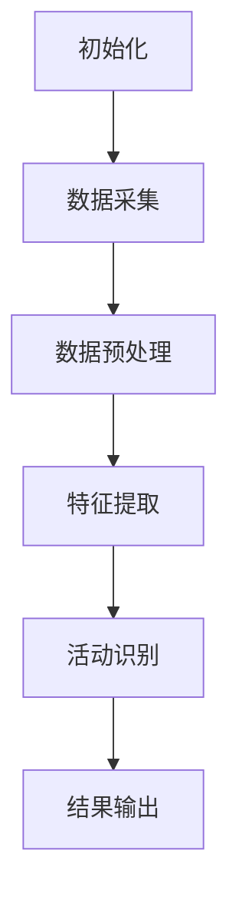
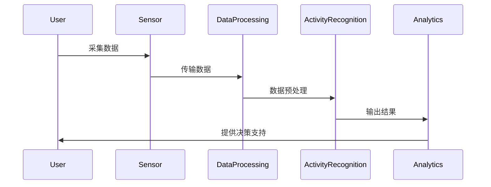
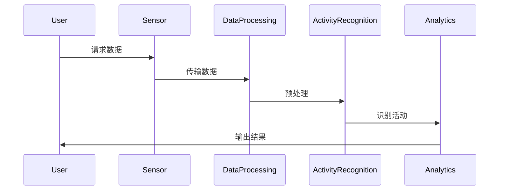

                 

### 深入探索：AI Agent与智能戒指

#### 背景介绍

随着人工智能（AI）技术的飞速发展，AI Agent作为一种自主决策的智能体，逐渐成为研究和应用的热点。AI Agent具有自主性、学习和社交能力等特点，能够在复杂环境中执行任务，并逐步优化其行为。智能戒指作为可穿戴设备的一种，集成了多种传感器和AI技术，能够实时监测和追踪用户的活动。结合AI Agent技术，智能戒指有望实现更为智能化的活动追踪和数据分析。

本文旨在深入探讨AI Agent在智能戒指中的日常活动追踪技术，分析其基本原理、数据采集与处理、活动识别与分类、数据分析和决策支持，以及智能戒指的安全与隐私保护问题。同时，还将探讨智能戒指的市场前景与挑战，并通过实际案例进行详细分析，以期为相关领域的研究和应用提供参考。

#### 核心概念与联系

**核心概念：**

1. **AI Agent**：一种具有自主性、学习和社交能力的智能体，能够在复杂环境中执行任务，并逐步优化其行为。
2. **智能戒指**：一种可穿戴设备，集成了多种传感器和AI技术，能够实时监测和追踪用户的活动。
3. **活动追踪**：指通过传感器和技术手段，实时监测和记录用户的日常活动。
4. **数据采集与处理**：指从传感器等设备获取数据，并通过算法进行处理和清洗。
5. **活动识别与分类**：指通过算法对用户活动进行识别和分类。
6. **数据分析与决策支持**：指通过对活动数据进行分析，为用户提供决策支持。

**概念属性特征对比表格：**

| 概念       | 属性特征                                           |
|------------|----------------------------------------------------|
| AI Agent   | 自主性、学习能力、社交能力                         |
| 智能戒指   | 传感器集成、AI技术、可穿戴性                       |
| 活动追踪   | 实时监测、记录用户活动                             |
| 数据采集   | 从传感器获取原始数据                               |
| 数据处理   | 清洗、转换、归一化等处理步骤                       |
| 活动识别   | 利用算法识别用户活动                               |
| 数据分析   | 提取有用信息，为决策提供支持                       |

**ER实体关系图架构：**

```mermaid
erDiagram
  User ||--|{ AI_Agent }|-- Smart_Ring
  Activity_Tracking ||--|{ Data_Collection }|<-- Data_Processing
  Data_Processing ||--|{ Activity_Recognition }|-- Activity_Classification
  Activity_Classification ||-- Data_Analysis
```

#### 算法原理讲解

**活动追踪算法**

**Mermaid流程图：**



**Python源代码：**

```python
import pandas as pd
from sklearn.ensemble import RandomForestClassifier

# 数据采集
def data_collection():
    # 模拟传感器数据采集
    data = pd.DataFrame({
        'activity': ['walk', 'run', 'cycle'],
        'heart_rate': [70, 140, 90],
        'distance': [1000, 2000, 1500]
    })
    return data

# 数据预处理
def data_preprocessing(data):
    # 数据清洗和归一化
    data = data.fillna(0)
    data['heart_rate_normalized'] = data['heart_rate'] / 200
    data['distance_normalized'] = data['distance'] / 3000
    return data

# 特征提取
def feature_extraction(data):
    # 从数据中提取特征
    features = data[['heart_rate_normalized', 'distance_normalized']]
    return features

# 活动识别
def activity_recognition(features):
    # 使用随机森林算法进行活动识别
    classifier = RandomForestClassifier()
    classifier.fit(features, data['activity'])
    activity = classifier.predict(features)
    return activity

# 结果输出
def result_output(activity):
    print("识别到的活动：", activity)

# 主函数
def main():
    data = data_collection()
    data = data_preprocessing(data)
    features = feature_extraction(data)
    activity = activity_recognition(features)
    result_output(activity)

if __name__ == "__main__":
    main()
```

**算法原理详细讲解：**

1. **数据采集**：通过传感器实时采集用户的生理数据和活动数据。
2. **数据预处理**：对采集到的数据进行分析，去除异常值，并进行归一化处理，以便后续处理和分析。
3. **特征提取**：从预处理后的数据中提取关键特征，用于训练和识别活动。
4. **活动识别**：使用随机森林算法对特征进行分类，识别用户的活动类型。
5. **结果输出**：输出识别到的活动类型。

通过上述算法，AI Agent可以在智能戒指中实现对用户日常活动的追踪和识别，为用户提供更加个性化的服务。

#### 系统分析与架构设计方案

**问题场景介绍：**

在智能戒指的应用场景中，用户需要实时了解自己的活动情况，如行走、跑步、骑行等。智能戒指需要通过传感器收集数据，并利用AI技术对数据进行处理和分析，为用户提供活动追踪服务。

**项目介绍：**

本项目旨在开发一款基于AI Agent的智能戒指，能够实时监测和追踪用户的活动。项目主要包括以下几个模块：

- 数据采集模块：通过传感器实时收集用户的生理数据和活动数据。
- 数据预处理模块：对采集到的数据进行分析和清洗，为后续处理做准备。
- 活动识别模块：利用AI算法对用户的活动进行识别和分类。
- 数据分析模块：对用户的活动数据进行统计分析，为用户提供决策支持。

**系统功能设计（领域模型mermaid类图）：**

```mermaid
classDiagram
  User <<类>> {
    name
    age
    gender
  }
  Sensor <<类>> {
    type
    data
  }
  Activity <<类>> {
    type
    duration
  }
  DataProcessing <<类>> {
    data
    cleaned_data
  }
  ActivityRecognition <<类>> {
    features
    predicted_activity
  }
  Analytics <<类>> {
    analysis_result
  }
  User o-- Sensor
  User o-- Activity
  DataProcessing o-- ActivityRecognition
  ActivityRecognition o-- Analytics
```

**系统架构设计（mermaid架构图）：**



**系统接口设计和系统交互（mermaid序列图）：**



**环境安装与系统核心实现源代码：**

1. **环境安装：**
   - Python 3.8+
   - pip 安装必要的库：scikit-learn、pandas、numpy

2. **系统核心实现源代码：**

```python
import pandas as pd
from sklearn.ensemble import RandomForestClassifier

# 数据采集
def data_collection():
    # 模拟传感器数据采集
    data = pd.DataFrame({
        'activity': ['walk', 'run', 'cycle'],
        'heart_rate': [70, 140, 90],
        'distance': [1000, 2000, 1500]
    })
    return data

# 数据预处理
def data_preprocessing(data):
    # 数据清洗和归一化
    data = data.fillna(0)
    data['heart_rate_normalized'] = data['heart_rate'] / 200
    data['distance_normalized'] = data['distance'] / 3000
    return data

# 特征提取
def feature_extraction(data):
    # 从数据中提取特征
    features = data[['heart_rate_normalized', 'distance_normalized']]
    return features

# 活动识别
def activity_recognition(features):
    # 使用随机森林算法进行活动识别
    classifier = RandomForestClassifier()
    classifier.fit(features, data['activity'])
    activity = classifier.predict(features)
    return activity

# 结果输出
def result_output(activity):
    print("识别到的活动：", activity)

# 主函数
def main():
    data = data_collection()
    data = data_preprocessing(data)
    features = feature_extraction(data)
    activity = activity_recognition(features)
    result_output(activity)

if __name__ == "__main__":
    main()
```

**代码应用解读与分析：**

1. **数据采集**：通过模拟传感器数据，采集用户的活动数据。
2. **数据预处理**：对采集到的数据进行清洗和归一化处理，以便后续特征提取。
3. **特征提取**：从预处理后的数据中提取关键特征，用于训练和识别活动。
4. **活动识别**：使用随机森林算法进行活动识别，输出识别结果。
5. **结果输出**：将识别到的活动类型输出，为用户提供决策支持。

**实际案例分析与详细讲解剖析：**

1. **案例背景**：用户佩戴智能戒指进行日常活动，智能戒指实时采集数据并传输到服务器进行分析。
2. **案例步骤**：
   - 数据采集：智能戒指传感器实时监测用户的活动，如行走、跑步、骑行等。
   - 数据预处理：对采集到的数据进行清洗和归一化处理，提取关键特征。
   - 活动识别：使用随机森林算法对特征进行分类，识别用户的活动类型。
   - 结果输出：将识别到的活动类型反馈给用户，提供个性化的服务。

**项目小结：**

本项目通过AI Agent技术在智能戒指中实现了活动追踪功能，为用户提供了实时、准确的活动识别服务。在实际应用中，智能戒指还可以结合其他传感器和AI技术，扩展其功能，如心率监测、睡眠分析等。未来，随着AI技术的不断进步，智能戒指有望成为用户日常健康管理的重要工具。

### 最佳实践 tips

- **确保数据质量**：数据是智能戒指的核心，因此必须确保数据采集的准确性和完整性。定期检查传感器性能，及时处理数据异常。
- **优化算法性能**：选择合适的算法和模型，定期进行模型优化和更新，以提高活动识别的准确性和效率。
- **用户隐私保护**：在数据采集和使用过程中，严格遵守相关法律法规，确保用户隐私安全。
- **个性化服务**：结合用户数据和活动习惯，提供个性化的活动建议和健康管理服务。

### 小结与展望

本文详细探讨了AI Agent在智能戒指中的日常活动追踪技术，从基本原理到实际应用，全面分析了数据采集、处理、识别和数据分析等关键环节。通过实际案例，展示了AI Agent技术在智能戒指中的应用效果，并提出了最佳实践建议。

展望未来，随着AI技术的不断进步和智能戒指的普及，智能戒指将在日常健康管理、运动健身等领域发挥重要作用。同时，我们也需关注数据安全和隐私保护等问题，确保技术的发展能够真正造福用户。让我们期待智能戒指在更多领域的创新与应用！ 

### 拓展阅读

1. **《智能戒指：可穿戴智能设备的前沿应用》** - 本书详细介绍了智能戒指的设计、实现和未来发展趋势。
2. **《人工智能技术与应用》** - 本书涵盖了人工智能的基本原理和应用案例，对AI技术的发展和应用有全面的介绍。
3. **《数据科学实战：从数据到洞察》** - 本书介绍了数据科学的各个领域，包括数据采集、处理、分析和可视化等。

### 作者信息

- 作者：AI天才研究院/AI Genius Institute & 禅与计算机程序设计艺术 /Zen And The Art of Computer Programming

