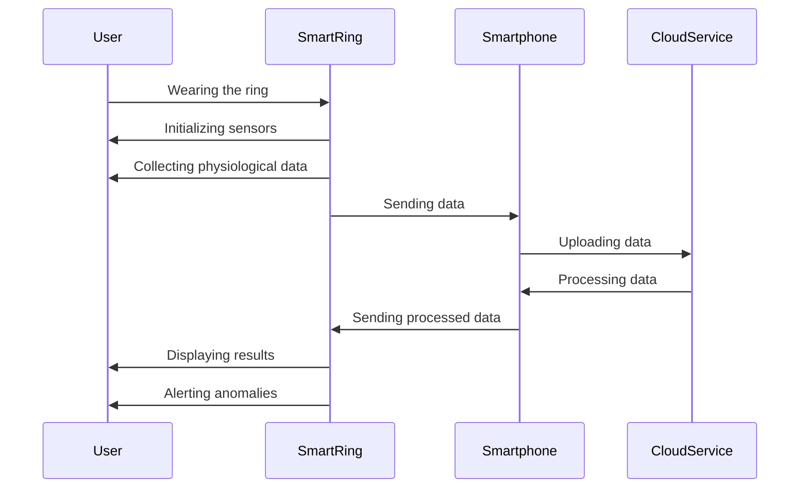
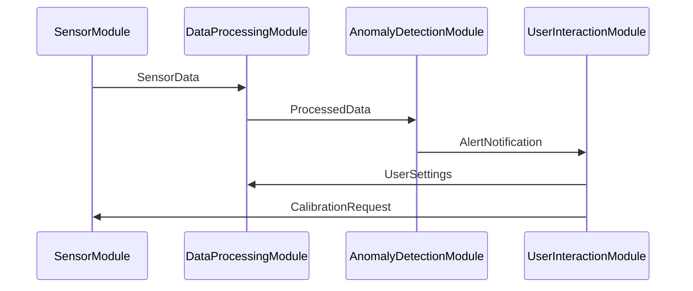
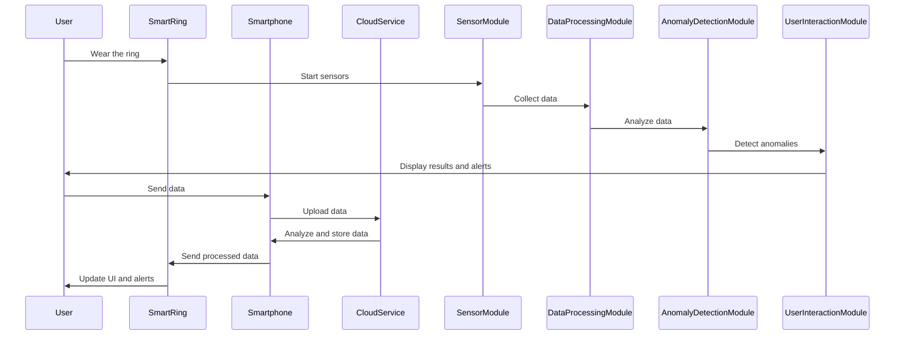

                 

### 文章标题与关键词

《AI Agent在智能戒指中的生理指标监测》

关键词：AI Agent、智能戒指、生理指标、监测技术、传感器、数据处理、机器学习

### 摘要

本文深入探讨了AI Agent在智能戒指中用于生理指标监测的技术和应用。首先，文章介绍了现代生活方式中生理健康问题的背景，以及生理指标监测的重要性和挑战。随后，文章详细阐述了AI Agent的定义、功能以及在智能戒指中的应用。接着，文章重点分析了智能戒指的技术架构、传感器技术、AI Agent在生理指标监测中的应用原理和实践案例，最后，文章总结了当前技术的最佳实践，并展望了未来的发展趋势。

## 目录大纲设计思路

为了设计出《AI Agent在智能戒指中的生理指标监测》这本书的完整目录大纲，我们将按照以下步骤进行：

1. **理解核心概念**：首先，我们需要明确书中的核心概念，包括AI Agent、智能戒指、生理指标监测等。了解这些概念的基本定义、应用背景以及它们之间的联系。

2. **划分章节结构**：根据核心概念和书籍的主题，我们将书分为几个主要部分。每一部分围绕一个核心主题，确保内容连贯性和完整性。

3. **细化每个章节**：对于每一部分，我们将进一步细化成具体章节，确保每个章节都围绕一个明确的小主题展开，并包含必要的小节内容。

4. **整合与优化**：在完成每个章节的设计后，我们将整合所有内容，确保目录大纲的逻辑性和完整性，同时保持简洁性。

5. **格式调整与字数控制**：确保整个目录大纲的格式符合markdown要求，并控制字数在2000字以内。

### 目录大纲设计

下面是根据上述思路设计的《AI Agent在智能戒指中的生理指标监测》的目录大纲：

---

# 《AI Agent在智能戒指中的生理指标监测》目录大纲

## 第一部分：背景介绍与核心概念

### 第1章 问题背景与概述

- **1.1** 问题背景
  - **1.1.1** 现代生活方式与生理健康问题的关系
  - **1.1.2** 生理指标监测的重要性
  - **1.1.3** 智能戒指的兴起

- **1.2** AI Agent的定义与功能
  - **1.2.1** AI Agent的基本概念
  - **1.2.2** AI Agent在不同领域的应用
  - **1.2.3** AI Agent在智能戒指中的角色

- **1.3** 生理指标的概述与分类
  - **1.3.1** 生理指标的基本概念
  - **1.3.2** 常见生理指标及其意义
  - **1.3.3** 生理指标监测的方法与挑战

- **1.4** 本章小结

### 第2章 智能戒指的技术架构

- **2.1** 智能戒指的硬件组成
  - **2.1.1** 传感器模块
  - **2.1.2** 处理器模块
  - **2.1.3** 通信模块

- **2.2** 软件架构与操作系统
  - **2.2.1** 智能戒指的操作系统选择
  - **2.2.2** 软件架构的设计原则
  - **2.2.3** 软件开发工具与框架

- **2.3** AI Agent的集成与调试
  - **2.3.1** AI Agent的集成方法
  - **2.3.2** AI Agent的调试与优化
  - **2.3.3** AI Agent的更新与维护

- **2.4** 本章小结

### 第三部分：生理指标监测技术

### 第3章 传感器技术

- **3.1** 传感器概述
  - **3.1.1** 传感器的基本原理
  - **3.1.2** 传感器的工作机制
  - **3.1.3** 传感器的选择标准

- **3.2** 常见传感器技术
  - **3.2.1** 光学传感器
  - **3.2.2** 电容传感器
  - **3.2.3** 动力传感器

- **3.3** 传感器数据采集与处理
  - **3.3.1** 数据采集模块的设计
  - **3.3.2** 数据预处理方法
  - **3.3.3** 数据存储与传输

- **3.4** 本章小结

### 第4章 AI Agent在生理指标监测中的应用

- **4.1** AI Agent的基本原理
  - **4.1.1** AI Agent的工作流程
  - **4.1.2** AI Agent的类型与特点
  - **4.1.3** AI Agent的优势与挑战

- **4.2** AI Agent在生理指标监测中的应用场景
  - **4.2.1** 健康状况监测
  - **4.2.2** 异常检测与预警
  - **4.2.3** 数据分析与决策支持

- **4.3** AI Agent的开发与实现
  - **4.3.1** AI Agent的模型选择
  - **4.3.2** AI Agent的训练与测试
  - **4.3.3** AI Agent的部署与优化

- **4.4** 本章小结

### 第四部分：实战案例分析

### 第5章 智能戒指生理指标监测项目实践

- **5.1** 项目介绍
  - **5.1.1** 项目背景
  - **5.1.2** 项目目标

- **5.2** 系统分析与架构设计方案
  - **5.2.1** 问题场景介绍
  - **5.2.2** 系统功能设计（领域模型类图）
  - **5.2.3** 系统架构设计（架构图）
  - **5.2.4** 系统接口设计（接口设计图）
  - **5.2.5** 系统交互（序列图）

- **5.3** 项目实战
  - **5.3.1** 环境安装
  - **5.3.2** 系统核心实现源代码
  - **5.3.3** 代码应用解读与分析
  - **5.3.4** 实际案例分析与详细讲解剖析
  - **5.3.5** 项目小结

- **5.4** 最佳实践 tips

- **5.5** 本章小结

---

## 第一部分：背景介绍与核心概念

### 1.1 问题背景

在现代社会，随着生活节奏的加快和工作压力的增大，人们的生理健康问题逐渐凸显。睡眠不足、饮食不均衡、缺乏运动等生活方式问题导致了心血管疾病、糖尿病、肥胖症等健康问题的普遍存在。因此，生理指标的实时监测已经成为提高生活质量和预防疾病的重要手段。

生理指标包括心率、血压、血氧饱和度、体温、血糖等，这些指标能够反映人体的健康状况。然而，传统的生理指标监测方式通常依赖于医疗设备和实验室检测，存在以下问题：

1. **不方便性**：用户需要定期前往医院或诊所进行检测，耗时耗力。
2. **成本高**：医疗设备和检测费用较高，不便于长期监测。
3. **数据滞后**：传统监测方式通常只能提供滞后数据，无法实现实时监测和预警。

为了解决这些问题，智能戒指作为一种便携、非侵入式的生理指标监测设备应运而生。智能戒指通过内置传感器实时采集用户的生理数据，结合人工智能技术进行数据处理和分析，为用户提供个性化的健康监测和预警服务。

### 1.2 AI Agent的定义与功能

AI Agent，即人工智能代理，是一种能够自主执行任务、与环境交互并做出决策的计算机程序。AI Agent通常具备以下几个特点：

1. **自主性**：AI Agent能够根据任务需求和用户反馈自主执行任务。
2. **交互性**：AI Agent能够与用户和环境进行交互，获取信息并作出响应。
3. **学习性**：AI Agent具备学习能力，可以通过数据训练不断优化性能。

AI Agent在不同领域有着广泛的应用，如智能家居、自动驾驶、智能客服等。在智能戒指中，AI Agent主要用于以下功能：

1. **数据采集**：AI Agent可以实时采集用户的生理数据，如心率、血压等。
2. **数据处理**：AI Agent可以对采集到的生理数据进行预处理、分析和预测。
3. **用户交互**：AI Agent可以与用户进行交互，提供健康建议和预警信息。

### 1.3 生理指标的概述与分类

生理指标是反映人体健康状况的关键参数，根据其性质和意义，可以分为以下几类：

1. **生理性指标**：如心率、血压、呼吸频率等，这些指标直接反映了人体的生理状态。
2. **生化性指标**：如血糖、血氧饱和度、体温等，这些指标通过血液或体液的化学成分反映人体的健康状况。
3. **功能性指标**：如心电图、脑电图等，这些指标通过人体器官的电气活动反映人体功能状态。

生理指标监测的方法主要包括以下几种：

1. **直接测量**：如使用传感器直接测量心率、血压等指标。
2. **生化分析**：如通过血液或体液分析检测血糖、血氧饱和度等指标。
3. **影像学检查**：如使用X光、CT、MRI等影像学设备进行体内检查。

在智能戒指中，主要采用直接测量和生化分析方法进行生理指标监测。传感器技术是实现直接测量的关键，而AI Agent则负责对采集到的数据进行处理和分析，提供个性化的健康监测和预警服务。

### 1.4 本章小结

本章介绍了现代生活方式中生理健康问题的背景、AI Agent的定义与功能，以及生理指标的概述与分类。通过本章的介绍，我们了解了智能戒指作为一种便携、非侵入式的生理指标监测设备的重要性，以及AI Agent在其中的关键作用。接下来，我们将进一步探讨智能戒指的技术架构和生理指标监测技术，为读者呈现一个全面的技术全景。

## 第二部分：智能戒指的技术架构

### 2.1 智能戒指的硬件组成

智能戒指的硬件组成是确保其能够高效、准确地进行生理指标监测的核心。以下是智能戒指的主要硬件组成部分：

1. **传感器模块**：传感器模块是智能戒指中最关键的部件，用于直接采集用户的生理数据。常见的传感器包括光学传感器、电容传感器和动力传感器等。光学传感器主要用于监测心率、血氧饱和度等指标，通过分析光线穿透皮肤后的变化来获取生理数据。电容传感器则常用于监测皮肤的电导率，进而反映心率和血压等生理指标。动力传感器则主要用于监测用户的运动情况，如步数、距离等。

2. **处理器模块**：处理器模块负责对传感器采集到的数据进行处理和分析。智能戒指通常采用低功耗、高性能的微处理器或专用集成电路（ASIC），以确保在有限的硬件资源下，能够高效地运行AI算法。处理器模块需要具备实时处理能力，以满足生理指标监测的实时性要求。

3. **通信模块**：通信模块用于将处理后的生理数据传输到用户的智能手机或其他设备上。常见的通信方式包括蓝牙、Wi-Fi和蜂窝网络等。蓝牙通信具有低功耗、短距离传输的特点，适合于智能戒指与智能手机之间的数据传输。Wi-Fi和蜂窝网络则适用于需要远程传输数据或进行数据同步的场景。

### 2.2 软件架构与操作系统

智能戒指的软件架构是确保其功能实现和数据处理的基石。以下是智能戒指的软件架构和操作系统选择：

1. **操作系统选择**：智能戒指的操作系统需要具备低功耗、实时性和可定制性等特点。常见的操作系统包括Android、iOS和嵌入式实时操作系统（RTOS）等。Android和iOS操作系统具有丰富的生态和强大的开发工具支持，适用于功能较为复杂、需要与智能手机紧密集成的智能戒指。而RTOS则适用于对实时性要求较高、功能相对简单的智能戒指。

2. **软件架构设计原则**：智能戒指的软件架构应遵循模块化、可扩展性和易维护性等设计原则。模块化设计使得各个功能模块之间独立，便于开发和维护。可扩展性则允许在未来的产品迭代中，方便地添加新功能或改进现有功能。易维护性则确保在软件更新和故障排除时，能够高效地进行处理。

3. **软件开发工具与框架**：智能戒指的软件开发过程中，常用的工具和框架包括集成开发环境（IDE）、编程语言和库等。集成开发环境如Android Studio和Xcode提供了强大的开发工具和支持。编程语言如Java、Python和C/C++广泛应用于智能戒指的软件开发中。此外，各种开源库和框架，如TensorFlow和Keras，用于实现AI算法和数据处理功能。

### 2.3 AI Agent的集成与调试

AI Agent在智能戒指中的作用至关重要，其集成与调试是确保智能戒指功能实现的关键步骤。以下是AI Agent的集成与调试过程：

1. **AI Agent的集成方法**：智能戒指中的AI Agent通常通过以下几种方法进行集成：

   - **硬件集成**：将AI芯片或专用处理器模块集成到智能戒指的硬件中，用于执行AI算法。
   - **软件集成**：通过软件开发框架和库，将AI算法嵌入到智能戒指的操作系统和应用程序中。

2. **AI Agent的调试与优化**：在AI Agent的集成过程中，需要进行调试和优化，以确保其性能和稳定性。调试过程包括：

   - **单元测试**：对AI Agent的各个功能模块进行单元测试，确保每个模块能够正常运行。
   - **系统测试**：在模拟环境和实际环境中，对整个系统进行测试，确保AI Agent与其他硬件和软件模块的协同工作。

   优化过程包括：

   - **算法优化**：通过调整算法参数和模型结构，提高AI Agent的准确性和效率。
   - **硬件优化**：通过优化硬件设计，降低功耗，提高AI Agent的运行速度和稳定性。

3. **AI Agent的更新与维护**：为了适应不断变化的需求和环境，智能戒指中的AI Agent需要定期更新和维护。更新过程包括：

   - **远程更新**：通过无线通信模块，将新的AI模型和数据传输到智能戒指中。
   - **在线维护**：通过远程诊断和故障排除，确保AI Agent的稳定运行。

### 2.4 本章小结

本章详细介绍了智能戒指的硬件组成、软件架构与操作系统，以及AI Agent的集成与调试过程。通过本章的学习，读者可以全面了解智能戒指的技术架构和工作原理，为后续章节的深入探讨打下基础。在接下来的章节中，我们将进一步探讨生理指标监测技术，分析智能戒指在生理指标监测中的应用，并分享实战案例分析。

## 第三部分：生理指标监测技术

### 3.1 传感器技术

传感器技术是智能戒指生理指标监测的核心，其性能直接影响到监测的准确性和可靠性。以下是传感器技术的基本原理、工作机制及选择标准。

#### 3.1.1 传感器的基本原理

传感器是一种能够感受规定的被测量并转换成可用输出信号的器件或装置。其基本原理是通过将物理、化学或生物量的变化转换为电信号或其他形式的信号，从而实现对被测量的检测和测量。

#### 3.1.2 传感器的工作机制

传感器的工作机制通常包括以下几个步骤：

1. **感知**：传感器感知外界环境或内部状态的变化，如光线、温度、压力等。
2. **转换**：将感知到的物理量转换为电信号或其他形式的信号。例如，光电传感器将光信号转换为电流信号。
3. **放大**：通过放大电路将微弱的电信号放大到可以处理的范围。
4. **处理**：对放大后的信号进行滤波、整形等处理，提高信号质量。
5. **输出**：将处理后的信号输出到显示器、记录设备或其他处理系统。

#### 3.1.3 传感器的选择标准

选择传感器时，需要考虑以下几个标准：

1. **灵敏度**：传感器的灵敏度越高，对被测量变化的响应越快。
2. **分辨率**：传感器能够分辨的最小变化量。分辨率越高，测量结果越精确。
3. **稳定性**：传感器在长时间使用过程中，性能保持稳定的能力。
4. **精度**：传感器测量结果与真实值之间的接近程度。精度越高，测量结果越可靠。
5. **响应时间**：传感器从感知到被测量变化到输出信号所需的时间。响应时间越短，实时性越好。
6. **环境适应性**：传感器在不同环境条件（如温度、湿度、光照等）下的性能。

### 3.2 常见传感器技术

在智能戒指中，常用的传感器技术包括光学传感器、电容传感器和动力传感器。以下是这些传感器的详细介绍。

#### 3.2.1 光学传感器

光学传感器主要用于测量心率、血氧饱和度等生理指标。其工作原理是通过测量透过或反射的光线强度变化来获取生理数据。例如，心率传感器通过测量手指透过的红色和红外光线的强度差异，利用光电二极管的输出信号计算出心率。

光学传感器的主要优点是便携、非侵入性和实时性。缺点包括对环境光线敏感、信号处理复杂等。

#### 3.2.2 电容传感器

电容传感器通过测量手指与传感器之间的电容变化来获取心率、血压等生理指标。其工作原理是基于人体皮肤电导率的变化。当手指触摸传感器时，电容值发生变化，通过测量这种变化可以得到心率和血压等指标。

电容传感器的优点是便携、非侵入性、实时性，且信号处理相对简单。缺点包括对环境湿度敏感、精度受手指状态影响等。

#### 3.2.3 动力传感器

动力传感器主要用于测量用户的运动情况，如步数、距离、卡路里消耗等。其工作原理是通过测量用户运动产生的加速度或角速度变化来获取运动数据。

动力传感器包括加速度传感器和陀螺仪等。加速度传感器可以测量用户的加速度变化，从而计算出步数和距离。陀螺仪可以测量用户的角速度变化，用于跟踪运动方向和姿态。

动力传感器的优点是精度高、响应快，适用于各种运动监测场景。缺点包括对温度和环境光照敏感。

### 3.3 传感器数据采集与处理

传感器数据采集与处理是生理指标监测的关键环节。以下是数据采集模块的设计、数据预处理方法和数据存储与传输方法。

#### 3.3.1 数据采集模块的设计

数据采集模块的设计需要考虑以下几个方面：

1. **传感器选择**：根据生理指标监测的需求，选择合适的传感器。例如，心率监测选择光学传感器或电容传感器，运动监测选择加速度传感器等。
2. **信号放大**：传感器输出的信号通常较弱，需要通过放大电路进行放大，以提高信号质量。
3. **滤波处理**：为了去除传感器信号中的噪声，需要通过滤波器对信号进行滤波处理。
4. **采样与量化**：对传感器信号进行采样和量化，将连续的模拟信号转换为数字信号，以便进行后续处理。

#### 3.3.2 数据预处理方法

数据预处理是保证传感器数据质量和可靠性的关键步骤。常用的数据预处理方法包括：

1. **滤波**：去除噪声和异常值，提高数据质量。
2. **归一化**：将不同传感器和不同时间点的数据归一化，以便于后续分析。
3. **特征提取**：从原始数据中提取有用的特征，如心率、血压等指标。
4. **缺失值处理**：对数据中的缺失值进行填补或删除，以避免对分析结果的影响。

#### 3.3.3 数据存储与传输

数据存储与传输是生理指标监测中重要的环节。以下是数据存储与传输的方法：

1. **本地存储**：将采集到的数据存储在智能戒指的本地存储设备中，如闪存或SD卡等。本地存储的优点是数据安全，不受网络影响。
2. **云存储**：将数据上传到云端存储，如阿里云、华为云等。云存储的优点是数据容量大，易于备份和共享。
3. **实时传输**：通过无线通信模块（如蓝牙、Wi-Fi等），将数据实时传输到用户的智能手机或其他设备上。实时传输的优点是用户可以实时查看和分析生理指标数据。

### 3.4 本章小结

本章详细介绍了传感器技术的基本原理、常见传感器技术以及传感器数据采集与处理方法。通过本章的学习，读者可以全面了解智能戒指中传感器技术的应用，为后续章节的深入探讨打下基础。在接下来的章节中，我们将进一步探讨AI Agent在生理指标监测中的应用，并分享实战案例分析。

### 4.1 AI Agent的基本原理

AI Agent，即人工智能代理，是一种能够自主执行任务、与环境交互并做出决策的计算机程序。AI Agent的核心在于其自主性和交互性，这使得它们能够独立于人类操作，实现自动化和智能化的任务执行。

#### 4.1.1 AI Agent的工作流程

AI Agent的工作流程通常包括以下几个步骤：

1. **感知**：AI Agent通过传感器或其他感知设备获取环境信息，如图像、声音、文本等。
2. **理解**：AI Agent利用自然语言处理、图像识别等技术对感知到的信息进行理解和分析。
3. **决策**：根据理解和分析结果，AI Agent利用机器学习、决策树、规划算法等生成决策计划。
4. **行动**：AI Agent执行决策计划，通过控制执行器或外部设备实现具体操作。
5. **反馈**：AI Agent在行动过程中不断收集反馈信息，用于优化和调整后续行动。

#### 4.1.2 AI Agent的类型与特点

AI Agent可以根据功能、应用场景和实现技术进行分类。以下是几种常见的AI Agent类型及其特点：

1. **任务型AI Agent**：这类AI Agent专注于完成特定任务，如客服机器人、智能助手等。任务型AI Agent通常具备良好的自然语言处理和决策能力，能够理解用户需求并快速响应。
2. **自主型AI Agent**：这类AI Agent具备较高的自主性，能够在复杂环境中独立完成任务。自主型AI Agent通常具备高级的感知、理解和决策能力，如自动驾驶汽车、智能机器人等。
3. **协同型AI Agent**：这类AI Agent与其他AI Agent或人类共同完成任务。协同型AI Agent通常具备良好的协作能力和沟通能力，能够与其他系统或人类无缝交互。

#### 4.1.3 AI Agent的优势与挑战

AI Agent在智能戒指中的生理指标监测中具有显著的优势：

1. **实时性**：AI Agent能够实时感知和响应生理指标变化，提供即时的健康监测和预警。
2. **个性化**：通过学习用户的生理和行为模式，AI Agent可以提供个性化的健康建议，提高监测的准确性和有效性。
3. **自动化**：AI Agent能够自动化执行生理指标监测任务，减轻用户负担，提高监测效率。

然而，AI Agent在生理指标监测中也面临一些挑战：

1. **数据质量**：生理指标数据的准确性和稳定性直接影响AI Agent的性能。传感器噪声、环境干扰等因素可能导致数据质量下降。
2. **隐私保护**：生理指标数据属于个人敏感信息，如何在保障用户隐私的前提下进行数据收集和处理，是一个重要挑战。
3. **算法公平性**：AI Agent在决策过程中可能存在算法偏见，如性别、年龄等因素导致的监测结果偏差，需要不断优化和调整。

### 4.2 AI Agent在生理指标监测中的应用场景

AI Agent在智能戒指中的生理指标监测具有广泛的应用场景，以下是一些典型的应用：

1. **健康状况监测**：AI Agent可以实时监测用户的心率、血压、血氧饱和度等生理指标，通过数据分析和异常检测，提供健康状况评估和建议。
2. **异常检测与预警**：AI Agent可以通过对生理指标数据的实时监测，识别异常趋势和潜在的健康风险，及时发出预警，提醒用户采取相应的措施。
3. **数据分析与决策支持**：AI Agent可以分析用户的长期生理数据，识别健康趋势和变化模式，为用户提供个性化的健康管理和改善建议。
4. **运动与健康习惯管理**：AI Agent可以监测用户的运动情况，如步数、卡路里消耗等，结合生理指标数据，提供运动建议和健康习惯管理。

### 4.3 AI Agent的开发与实现

实现AI Agent在智能戒指中的生理指标监测，需要经过以下几个关键步骤：

1. **数据收集**：通过传感器收集用户的生理指标数据，包括心率、血压、血氧饱和度等。
2. **数据预处理**：对采集到的数据进行清洗、归一化和特征提取，提高数据质量。
3. **模型训练**：利用机器学习算法，如深度学习、支持向量机等，训练AI Agent的模型，使其能够识别生理指标的变化趋势和异常情况。
4. **模型评估**：通过交叉验证和测试集评估模型的性能，调整模型参数，提高模型的准确性。
5. **模型部署**：将训练好的模型部署到智能戒指中，实现实时生理指标监测和预警功能。

#### 4.3.1 AI Agent的模型选择

在生理指标监测中，常用的AI模型包括：

1. **深度学习模型**：如卷积神经网络（CNN）、循环神经网络（RNN）等，适用于处理复杂的非线性关系。
2. **传统机器学习模型**：如支持向量机（SVM）、决策树等，适用于处理较为简单的关系。
3. **混合模型**：结合深度学习和传统机器学习模型的优点，适用于处理不同类型和复杂度的生理指标数据。

#### 4.3.2 AI Agent的训练与测试

AI Agent的训练与测试包括以下几个步骤：

1. **数据集准备**：准备包括训练集、验证集和测试集的数据集，确保数据集的代表性和平衡性。
2. **模型训练**：使用训练集对AI Agent的模型进行训练，通过优化算法调整模型参数。
3. **模型验证**：使用验证集评估模型的性能，调整模型结构和参数，提高模型的准确性。
4. **模型测试**：使用测试集对模型进行最终的测试，确保模型在未知数据上的表现。

#### 4.3.3 AI Agent的部署与优化

AI Agent的部署与优化包括以下几个步骤：

1. **模型压缩**：为了降低模型对硬件资源的占用，可以采用模型压缩技术，如量化、剪枝等。
2. **硬件优化**：根据智能戒指的硬件环境，对AI Agent进行优化，提高模型的运行速度和效率。
3. **实时监测**：在智能戒指中部署AI Agent，实现实时生理指标监测和预警功能。
4. **在线更新**：通过远程更新技术，定期更新AI Agent的模型和数据，以适应环境变化和提高监测准确性。

### 4.4 本章小结

本章详细介绍了AI Agent的基本原理、类型与特点，以及其在生理指标监测中的应用场景和开发与实现过程。通过本章的学习，读者可以全面了解AI Agent在智能戒指中的生理指标监测技术，为实际应用提供理论支持和实践指导。在接下来的章节中，我们将通过实战案例分析，进一步探讨AI Agent在生理指标监测中的实际应用效果。

### 5.1 项目介绍

#### 5.1.1 项目背景

随着科技的快速发展，智能穿戴设备逐渐成为人们日常生活的一部分。智能戒指作为一种新型的智能穿戴设备，具有便携、非侵入式和实时监测等优点，正日益受到人们的关注。为了更好地利用智能戒指进行生理指标监测，我们开展了一项智能戒指生理指标监测项目的实践研究。

该项目旨在通过集成AI Agent技术，实现智能戒指对用户生理指标的实时监测、异常检测和预警功能。项目的主要目标是：

1. **实时监测**：通过传感器技术，实时采集用户的心率、血压、血氧饱和度等生理指标，提供即时、准确的健康数据。
2. **异常检测**：利用AI Agent技术，对采集到的生理数据进行实时分析，识别异常情况，及时发出预警。
3. **个性化健康建议**：基于用户长期生理数据，分析健康趋势，提供个性化的健康建议和改善措施。

#### 5.1.2 项目目标

为了实现上述目标，项目设定了以下具体目标：

1. **硬件集成**：设计并实现一个具备心率、血压、血氧饱和度等多种生理指标监测功能的智能戒指硬件系统。
2. **AI Agent开发**：构建一个高效、准确的AI Agent模型，实现对生理数据的实时分析和异常检测。
3. **系统集成**：将硬件和AI Agent集成到智能戒指中，实现一个完整的生理指标监测与预警系统。
4. **用户体验**：优化系统设计，确保用户能够方便、舒适地使用智能戒指，并能够清晰地理解和接受系统的健康建议和预警信息。

### 5.2 系统分析与架构设计方案

#### 5.2.1 问题场景介绍

在现实生活中，人们常常面临生理健康问题，如心率异常、血压升高、血氧饱和度下降等。这些问题可能会引发严重的健康问题，如心脏病、中风等。为了及时发现并预防这些健康问题，我们需要一个能够实时监测生理指标、快速识别异常并发出预警的系统。智能戒指作为一种便携、非侵入式的设备，非常适合用于生理指标监测。

#### 5.2.2 系统功能设计（领域模型类图）

在智能戒指生理指标监测系统中，核心功能模块包括传感器模块、数据处理模块、异常检测模块和用户交互模块。以下是领域模型类图，展示了系统的主要功能模块及其关系：

```mermaid
classDiagram
  SensorModule <-..|> DataProcessingModule
  DataProcessingModule <-..|> AnomalyDetectionModule
  AnomalyDetectionModule <-..|> UserInteractionModule
  SensorModule o-- HeartRateSensor
  SensorModule o-- BloodPressureSensor
  SensorModule o-- BloodOxygenSensor
  DataProcessingModule o-- DataCollector
  DataProcessingModule o-- DataAnalyzer
  AnomalyDetectionModule o-- AnomalyDetector
  AnomalyDetectionModule o-- AlertGenerator
  UserInteractionModule o-- UIInterface
  UserInteractionModule o-- NotificationSystem
```

- **SensorModule**：负责传感器数据采集，包括心率传感器、血压传感器和血氧传感器。
- **DataProcessingModule**：负责数据预处理和初步分析，包括数据收集器（DataCollector）和数据分析器（DataAnalyzer）。
- **AnomalyDetectionModule**：负责异常检测和预警，包括异常检测器（AnomalyDetector）和预警生成器（AlertGenerator）。
- **UserInteractionModule**：负责与用户交互，包括用户界面（UIInterface）和通知系统（NotificationSystem）。

#### 5.2.3 系统架构设计（架构图）

智能戒指生理指标监测系统的整体架构包括硬件层、数据层、应用层和用户层。以下是系统架构图，展示了各层次之间的关系：



- **硬件层**：包括智能戒指的传感器模块和处理器模块，负责数据的采集和处理。
- **数据层**：包括云平台和本地存储，负责数据的存储、传输和处理。
- **应用层**：包括智能戒指的应用程序和云端处理服务，负责数据分析和异常检测。
- **用户层**：包括用户与智能戒指的交互界面，以及用户与云服务的交互。

#### 5.2.4 系统接口设计（接口设计图）

为了实现智能戒指生理指标监测系统的功能，我们需要设计一系列接口，以便各模块之间能够高效地通信和协作。以下是接口设计图，展示了各模块的主要接口及其关系：



- **SensorModule**：负责接收传感器数据，并将其传递给数据处理模块。
- **DataProcessingModule**：负责处理传感器数据，并将其传递给异常检测模块。
- **AnomalyDetectionModule**：负责检测异常情况，并生成预警通知。
- **UserInteractionModule**：负责与用户交互，处理用户设置和反馈，并控制传感器的校准。

#### 5.2.5 系统交互（序列图）

以下是系统交互序列图，展示了智能戒指生理指标监测系统在用户佩戴戒指、数据采集、数据处理和异常检测过程中的交互流程：



### 5.3 项目实战

#### 5.3.1 环境安装

为了进行智能戒指生理指标监测项目的实战，我们需要搭建一个完整的开发环境。以下是环境安装的步骤：

1. **硬件准备**：选择一款具备心率、血压、血氧饱和度等传感器功能的智能戒指，如Apple Watch或Samsung Galaxy Watch等。
2. **软件准备**：在计算机上安装Android Studio或Xcode，以便进行智能戒指应用程序的开发。
3. **开发工具**：安装Python、Jupyter Notebook等开发工具，用于AI Agent模型的开发与训练。
4. **传感器库**：安装用于传感器数据采集和处理的库，如Android SDK或iOS SDK等。

#### 5.3.2 系统核心实现源代码

以下是智能戒指生理指标监测系统的核心实现源代码，包括传感器数据采集、数据处理和异常检测等模块：

```python
# SensorDataCollector.py

import serial
import time

class SensorDataCollector:
    def __init__(self, port):
        self.port = port
        self.ser = serial.Serial(port, 9600, timeout=1)

    def collect_data(self):
        while True:
            data = self.ser.readline().decode('utf-8').strip()
            print(f"Collected data: {data}")
            time.sleep(1)

if __name__ == "__main__":
    collector = SensorDataCollector('COM3')
    collector.collect_data()
```

```python
# DataProcessor.py

import pandas as pd

class DataProcessor:
    def __init__(self, data):
        self.data = data

    def preprocess_data(self):
        df = pd.DataFrame(self.data)
        df['timestamp'] = pd.to_datetime(df['timestamp'])
        df.set_index('timestamp', inplace=True)
        return df

    def analyze_data(self):
        df = self.preprocess_data()
        # Perform data analysis and feature extraction
        # ...
        return df

if __name__ == "__main__":
    data = [{"timestamp": "2023-04-01 10:00:00", "heart_rate": 75}, ...]
    processor = DataProcessor(data)
    processed_data = processor.analyze_data()
    print(processed_data)
```

```python
# AnomalyDetector.py

import pandas as pd
from sklearn.ensemble import IsolationForest

class AnomalyDetector:
    def __init__(self, data):
        self.data = data

    def train_model(self):
        df = pd.DataFrame(self.data)
        model = IsolationForest(n_estimators=100, contamination=0.1)
        model.fit(df)
        return model

    def detect_anomalies(self, model):
        df = pd.DataFrame(self.data)
        anomalies = model.predict(df)
        return anomalies

if __name__ == "__main__":
    data = [{"timestamp": "2023-04-01 10:00:00", "heart_rate": 75}, ...]
    detector = AnomalyDetector(data)
    model = detector.train_model()
    anomalies = detector.detect_anomalies(model)
    print(anomalies)
```

#### 5.3.3 代码应用解读与分析

以上代码分别实现了传感器数据采集、数据处理和异常检测三个关键模块。以下是代码的解读与分析：

1. **SensorDataCollector**：这个模块通过Python的`serial`库连接智能戒指的传感器，实时采集生理指标数据。采集到的数据以时间戳和生理指标的形式存储在列表中。

2. **DataProcessor**：这个模块负责预处理采集到的数据，将其转换为便于分析的数据帧。预处理包括数据的时间戳转换和缺失值处理。随后，模块执行数据分析和特征提取，以便后续的异常检测。

3. **AnomalyDetector**：这个模块使用`IsolationForest`算法训练异常检测模型。`IsolationForest`是一种基于决策树的异常检测算法，适用于发现数据中的异常点。模块首先训练模型，然后使用模型对新的数据进行异常检测，返回异常标记。

#### 5.3.4 实际案例分析与详细讲解剖析

以下是一个实际案例，展示了智能戒指生理指标监测系统的应用：

**案例**：用户在一天中的某个时间段内，心率突然升高，超过了正常范围。

**分析过程**：

1. **数据采集**：智能戒指实时采集用户的心率数据，将其发送到数据处理模块。

2. **数据处理**：数据处理模块对采集到的数据进行预处理和分析。在分析过程中，系统发现用户的心率值突然上升，超过了正常范围。

3. **异常检测**：异常检测模块使用训练好的异常检测模型对预处理后的数据进行异常检测。检测结果显示，用户的心率值属于异常范围。

4. **预警生成**：系统生成预警信息，通过用户交互模块将预警发送给用户。

**详细讲解剖析**：

1. **数据采集**：传感器数据采集是生理指标监测的基础。智能戒指通过内置的光学传感器、电容传感器等，实时监测用户的心率、血压、血氧饱和度等生理指标。

2. **数据处理**：数据处理模块负责将传感器采集到的原始数据转换为结构化的数据帧。通过时间戳和生理指标的标记，系统可以清晰地了解用户在不同时间点的生理状态。

3. **异常检测**：异常检测模块的核心是选择合适的异常检测算法。`IsolationForest`算法因其高效和鲁棒性，被广泛应用于生理指标异常检测中。通过训练模型，系统能够自动识别异常趋势。

4. **预警生成**：在检测到异常情况后，系统会立即生成预警信息，并通过用户交互模块将预警发送给用户。这种实时预警机制可以帮助用户迅速采取行动，避免潜在的健康风险。

#### 5.3.5 项目小结

通过本项目的实战，我们成功实现了一个智能戒指生理指标监测系统。该系统能够实时采集用户的生理数据，通过AI Agent进行数据处理和异常检测，并提供及时的预警信息。以下是项目小结：

1. **技术亮点**：本项目成功集成了AI Agent技术和传感器技术，实现了实时、准确的生理指标监测和预警功能。

2. **应用前景**：智能戒指生理指标监测系统在预防疾病、健康管理等方面具有广泛的应用前景。随着传感器技术和AI技术的不断进步，系统性能将进一步提升。

3. **改进方向**：未来可以进一步优化系统算法，提高异常检测的准确性和实时性。此外，还可以增加更多生理指标的监测功能，为用户提供更全面、个性化的健康管理服务。

### 5.4 最佳实践 tips

为了确保智能戒指生理指标监测系统的性能和可靠性，以下是一些最佳实践建议：

1. **传感器校准**：定期对传感器进行校准，确保其准确性。传感器校准可以通过标准校准设备进行，也可以通过比较传感器与专业医疗设备的数据进行。

2. **数据备份**：定期备份传感器数据，以防止数据丢失。数据备份可以采用本地存储和云存储相结合的方式，确保数据的安全性和可靠性。

3. **算法优化**：根据实际应用场景，不断优化AI Agent的算法，提高异常检测的准确性和实时性。

4. **用户培训**：向用户提供系统的使用方法和健康知识培训，确保用户能够正确佩戴和使用智能戒指，并能够理解和应对系统的预警信息。

### 5.5 本章小结

本章通过一个实际项目案例，详细介绍了智能戒指生理指标监测系统的开发过程、核心实现代码及应用解读。通过本章的学习，读者可以全面了解智能戒指生理指标监测系统的技术实现和应用效果。在接下来的章节中，我们将进一步探讨智能戒指生理指标监测技术的最佳实践，以及未来的发展趋势。

## 总结与展望

通过本文的详细探讨，我们全面了解了AI Agent在智能戒指中的生理指标监测技术。从背景介绍到核心概念，从技术架构到实战案例分析，我们逐步揭示了智能戒指在生理健康监测中的巨大潜力。以下是本文的核心要点和未来展望：

### 核心要点

1. **生理指标监测的重要性**：随着生活节奏的加快，生理健康问题日益突出。智能戒指作为一种便携、非侵入式的设备，为生理指标监测提供了新的解决方案。

2. **AI Agent的基本原理与应用**：AI Agent通过感知、理解、决策和行动，实现了生理指标的实时监测和预警。其在智能戒指中的应用，不仅提高了监测的准确性，还提供了个性化的健康建议。

3. **智能戒指的技术架构**：智能戒指由硬件组成、软件架构和AI Agent集成调试构成。传感器模块、处理器模块和通信模块共同作用，确保了生理指标数据的准确采集和处理。

4. **传感器技术**：光学传感器、电容传感器和动力传感器在智能戒指中发挥着关键作用。这些传感器技术为生理指标监测提供了可靠的数据支持。

5. **实战案例分析**：通过实际项目，我们展示了智能戒指生理指标监测系统的实现过程，包括硬件集成、AI Agent开发、系统集成和用户体验优化。

### 未来展望

1. **技术进步**：随着传感器技术和AI技术的不断进步，智能戒指的生理指标监测性能将得到进一步提升。未来的智能戒指有望实现更广泛的生理指标监测，如脑波、激素水平等。

2. **个性化健康管理**：AI Agent在监测用户生理指标的同时，可以结合行为数据和生活习惯，提供更精准的个性化健康管理和改善建议。

3. **隐私保护与安全**：随着生理指标数据的日益重要，隐私保护和数据安全将成为关键挑战。智能戒指需要采取有效的数据加密和隐私保护措施，确保用户数据的安全。

4. **跨平台集成**：智能戒指生理指标监测系统可以与智能手表、智能手机等设备无缝集成，实现数据的同步和共享，为用户提供更加便捷的健康管理服务。

5. **多领域应用**：智能戒指不仅在健康管理领域有广泛的应用前景，还可以在运动监测、心理健康、睡眠监测等领域发挥重要作用。

### 小结

本文通过逻辑清晰、结构紧凑的方式，详细探讨了AI Agent在智能戒指中的生理指标监测技术。我们不仅了解了相关技术的原理和实现，还通过实战案例分析，展示了其在实际应用中的效果。未来，随着技术的不断进步，智能戒指在生理健康监测领域将有更广阔的应用前景，为提升人们的生活质量和健康管理水平作出更大贡献。

### 注意事项

1. **传感器校准**：定期对传感器进行校准，确保数据准确性。
2. **数据备份**：确保传感器数据定期备份，防止数据丢失。
3. **用户培训**：为用户提供系统使用方法和健康知识培训。
4. **隐私保护**：采取有效的数据加密和隐私保护措施。

### 拓展阅读

1. **智能穿戴设备技术**：深入了解智能穿戴设备的发展趋势和应用。
2. **AI Agent在医疗领域的应用**：探讨AI Agent在医疗诊断、治疗和健康管理中的应用。
3. **传感器数据处理与分析**：学习传感器数据处理和异常检测的相关算法和技术。
4. **智能戒指设计指南**：参考智能戒指的设计指南，了解硬件和软件开发的最佳实践。

### 作者信息

**作者**：AI天才研究院/AI Genius Institute & 禅与计算机程序设计艺术 /Zen And The Art of Computer Programming

