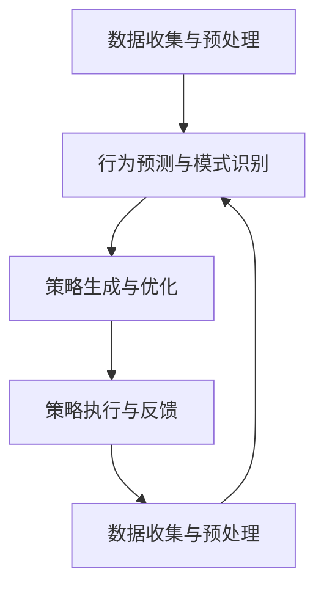
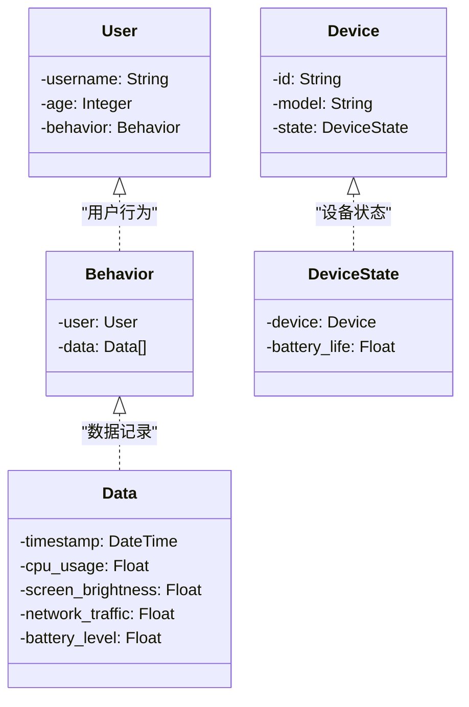
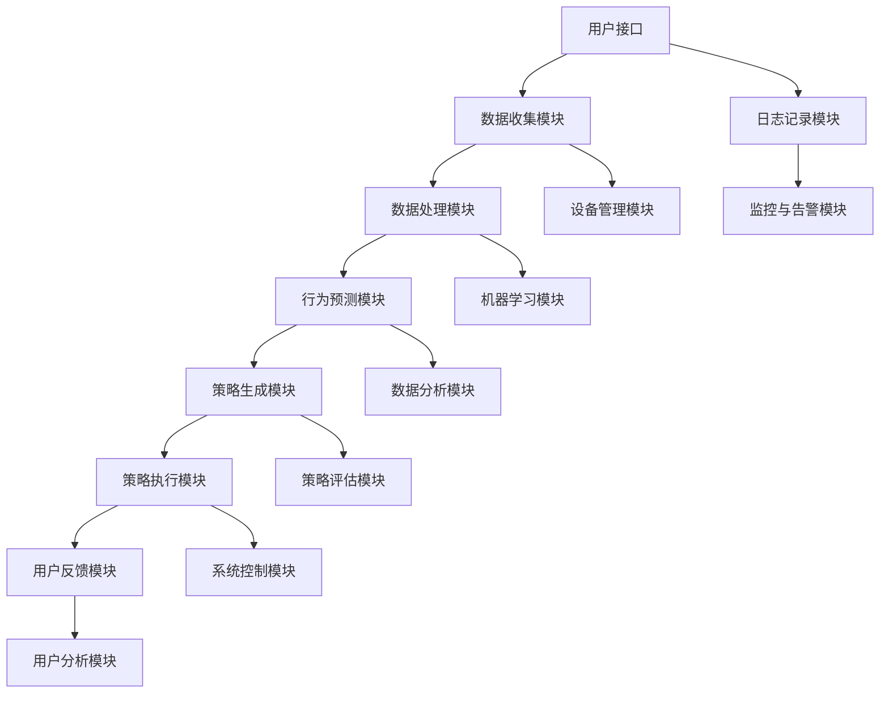
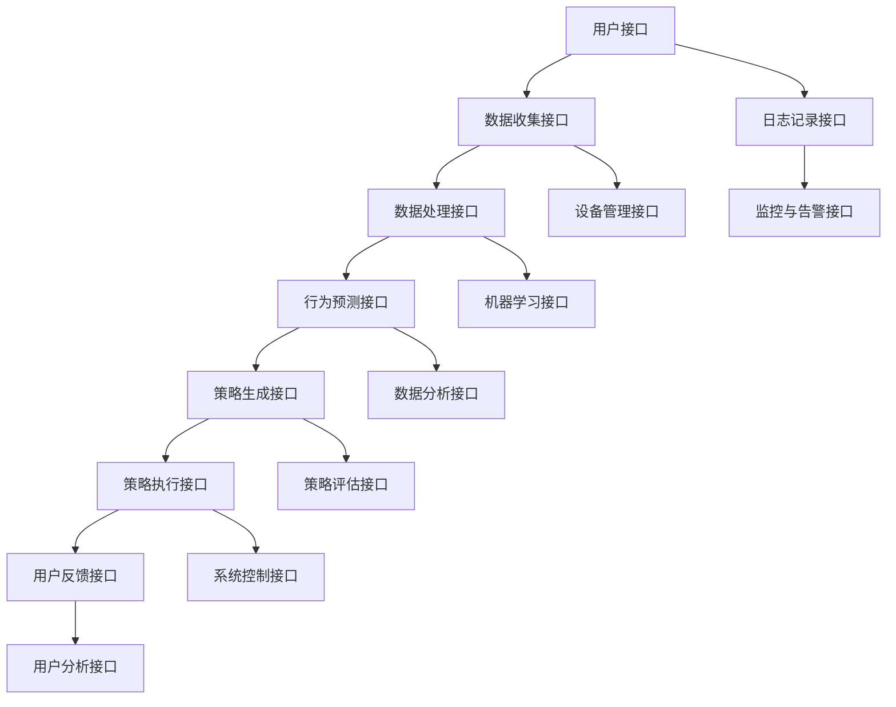

                 

### 第一部分: 背景介绍

#### 第1章: 问题背景

##### 1.1 问题背景

##### 1.1.1 智能手机电池寿命优化的重要性

随着智能手机的普及，用户对电池寿命的要求越来越高。智能手机作为现代生活中不可或缺的工具，其电池性能直接影响到用户体验。然而，智能手机的电池寿命受到多种因素的影响，如硬件配置、软件优化、用户行为等。如何通过AI Agent实现智能手机电池寿命的优化，成为当前研究的热点。

##### 1.1.2 电池寿命优化面临的挑战

电池寿命优化面临以下挑战：

1. **多源数据融合**：智能手机会产生大量的数据，如CPU使用情况、网络状态、传感器数据等。如何有效融合这些数据，是电池寿命优化的重要问题。

2. **动态优化**：用户行为和手机状态是动态变化的，如何根据这些变化实时调整电池寿命优化策略，是一个难点。

3. **用户体验**：电池寿命优化需要在保证用户体验的前提下进行，如何在性能和电池寿命之间取得平衡，是一个关键问题。

##### 1.1.3 AI Agent在电池寿命优化中的应用

AI Agent是一种智能代理，可以自主地学习用户行为，并根据用户行为和环境变化自动调整电池寿命优化策略。在智能手机中，AI Agent可以通过以下方式实现电池寿命优化：

1. **数据分析**：AI Agent可以收集和分析手机运行过程中产生的各种数据，如CPU使用率、屏幕亮度、网络流量等。

2. **优化策略**：基于数据分析结果，AI Agent可以自动调整手机的运行状态，如降低屏幕亮度、关闭不必要的后台应用等。

3. **个性化推荐**：AI Agent可以根据用户的使用习惯和偏好，提供个性化的电池寿命优化建议。

#### 第2章: 核心概念与联系

##### 2.1 AI Agent

###### 2.1.1 AI Agent的定义

AI Agent是指一种具备自主学习和决策能力的智能系统，可以在特定环境下根据目标和约束条件，自主地执行任务。

###### 2.1.2 AI Agent的特点

1. **自主性**：AI Agent可以独立执行任务，无需人工干预。

2. **学习能力**：AI Agent可以根据经验和数据不断优化自己的行为。

3. **灵活性**：AI Agent可以根据环境变化动态调整策略。

###### 2.1.3 AI Agent的分类

1. **反应式Agent**：基于当前感知的信息直接做出反应。

2. **目标导向Agent**：根据目标规划行动，并适应环境变化。

3. **综合Agent**：结合反应式和目标导向Agent的特点，既具备反应能力，又能进行长期规划。

##### 2.2 电池寿命优化系统

###### 2.2.1 电池寿命优化系统的定义

电池寿命优化系统是一种旨在提高智能手机电池寿命的智能系统，通过分析手机运行数据，自动调整手机运行状态，以延长电池寿命。

###### 2.2.2 电池寿命优化系统的核心功能

1. **数据分析**：收集和分析手机运行数据，如CPU使用率、屏幕亮度、网络流量等。

2. **策略优化**：根据数据分析结果，自动调整手机运行状态，如降低屏幕亮度、关闭不必要的后台应用等。

3. **个性化推荐**：AI Agent可以根据用户的使用习惯和偏好，提供个性化的电池寿命优化建议。

---

### 第1章: 问题背景

#### 1.2 问题背景

##### 1.2.1 智能手机电池寿命优化的重要性

随着智能手机的普及，用户对电池寿命的要求越来越高。智能手机作为现代生活中不可或缺的工具，其电池性能直接影响到用户体验。然而，智能手机的电池寿命受到多种因素的影响，如硬件配置、软件优化、用户行为等。如何通过AI Agent实现智能手机电池寿命的优化，成为当前研究的热点。

##### 1.2.2 电池寿命优化面临的挑战

电池寿命优化面临以下挑战：

1. **多源数据融合**：智能手机会产生大量的数据，如CPU使用情况、网络状态、传感器数据等。如何有效融合这些数据，是电池寿命优化的重要问题。

2. **动态优化**：用户行为和手机状态是动态变化的，如何根据这些变化实时调整电池寿命优化策略，是一个难点。

3. **用户体验**：电池寿命优化需要在保证用户体验的前提下进行，如何在性能和电池寿命之间取得平衡，是一个关键问题。

##### 1.2.3 AI Agent在电池寿命优化中的应用

AI Agent是一种智能代理，可以自主地学习用户行为，并根据用户行为和环境变化自动调整电池寿命优化策略。在智能手机中，AI Agent可以通过以下方式实现电池寿命优化：

1. **数据分析**：AI Agent可以收集和分析手机运行过程中产生的各种数据，如CPU使用率、屏幕亮度、网络流量等。

2. **优化策略**：基于数据分析结果，AI Agent可以自动调整手机的运行状态，如降低屏幕亮度、关闭不必要的后台应用等。

3. **个性化推荐**：AI Agent可以根据用户的使用习惯和偏好，提供个性化的电池寿命优化建议。

#### 第2章: 核心概念与联系

##### 2.1 AI Agent

###### 2.1.1 AI Agent的定义

AI Agent是指一种具备自主学习和决策能力的智能系统，可以在特定环境下根据目标和约束条件，自主地执行任务。

###### 2.1.2 AI Agent的特点

1. **自主性**：AI Agent可以独立执行任务，无需人工干预。

2. **学习能力**：AI Agent可以根据经验和数据不断优化自己的行为。

3. **灵活性**：AI Agent可以根据环境变化动态调整策略。

###### 2.1.3 AI Agent的分类

1. **反应式Agent**：基于当前感知的信息直接做出反应。

2. **目标导向Agent**：根据目标规划行动，并适应环境变化。

3. **综合Agent**：结合反应式和目标导向Agent的特点，既具备反应能力，又能进行长期规划。

##### 2.2 电池寿命优化系统

###### 2.2.1 电池寿命优化系统的定义

电池寿命优化系统是一种旨在提高智能手机电池寿命的智能系统，通过分析手机运行数据，自动调整手机运行状态，以延长电池寿命。

###### 2.2.2 电池寿命优化系统的核心功能

1. **数据分析**：收集和分析手机运行数据，如CPU使用率、屏幕亮度、网络流量等。

2. **策略优化**：根据数据分析结果，自动调整手机运行状态，如降低屏幕亮度、关闭不必要的后台应用等。

3. **个性化推荐**：AI Agent可以根据用户的使用习惯和偏好，提供个性化的电池寿命优化建议。

---

### 第1章: 问题背景

#### 1.3 问题描述

智能手机电池寿命的优化问题可以归结为如何在保证用户满意度的同时，最大限度地延长电池的使用时间。用户满意度涉及到手机的使用性能、响应速度以及电池续航时间。以下是几个具体的问题描述：

1. **动态适应**：用户在不同的时间、地点和场景下，手机的使用需求是不断变化的。例如，用户在室内使用手机时可能更注重屏幕亮度和网络连接质量，而在户外时则可能更关心电池的续航能力。

2. **硬件和软件交互**：智能手机中的硬件组件（如电池、CPU、屏幕等）和软件系统（如操作系统、应用程序等）之间存在着复杂的交互关系。硬件的运行状态会直接影响软件的性能，而软件的运行状态也会对硬件的能耗产生影响。

3. **用户个性化需求**：每位用户都有不同的使用习惯和偏好，比如有些人喜欢在夜间降低屏幕亮度以减少耗电，有些人则喜欢保持较高的屏幕亮度以获得更好的视觉体验。

4. **能耗均衡**：智能手机中各种应用和功能的运行都会消耗电池能量。如何在不影响用户体验的前提下，平衡不同应用和功能的能耗，是一个挑战。

#### 1.4 问题解决方法

为了解决上述问题，可以采用以下几种方法：

1. **智能代理（AI Agent）技术**：智能代理可以自动收集和分析手机运行数据，如CPU使用率、屏幕亮度、网络流量等，并根据这些数据动态调整手机设置，从而优化电池寿命。

2. **机器学习算法**：通过机器学习算法，可以训练智能代理来预测用户的行为模式，并根据这些预测结果提前调整手机设置，从而提高电池寿命。

3. **用户行为分析**：分析用户的使用习惯和偏好，为用户提供个性化的电池优化建议，帮助用户更有效地管理电池使用。

4. **系统级优化**：在操作系统和应用程序层面进行优化，减少不必要的能耗，提高系统的能效比。

#### 1.5 边界与外延

在讨论智能手机电池寿命优化问题时，需要明确以下几个边界与外延：

1. **边界**：电池寿命优化的范围仅限于智能手机，不包括其他设备（如平板电脑、笔记本电脑等）。

2. **外延**：虽然本文主要关注智能手机电池寿命的优化，但相关的技术和方法可以推广到其他移动设备，甚至智能家居系统中。

3. **相关概念**：在电池寿命优化过程中，需要考虑的相关概念包括能耗管理、资源分配、人工智能、用户行为分析等。

4. **跨领域应用**：电池寿命优化技术不仅限于智能手机，还可以应用于自动驾驶、物联网等领域，提高设备的能源利用效率。

---

### 第2章: 核心概念与联系

#### 2.3 AI Agent的核心概念与联系

##### 2.3.1 AI Agent的核心概念

AI Agent是一种基于人工智能技术的智能体，它能够在特定环境下，根据预设的目标和约束条件，自主地完成特定任务。AI Agent的核心概念包括以下几个方面：

1. **感知**：AI Agent通过感知模块获取环境信息，如传感器数据、用户输入等。

2. **决策**：AI Agent利用知识库和算法对感知到的信息进行分析和处理，做出决策。

3. **执行**：AI Agent根据决策结果执行相应的操作，如调整系统设置、发送指令等。

4. **学习**：AI Agent通过不断地收集数据和反馈信息，优化自己的行为，提高任务完成的效率。

##### 2.3.2 AI Agent的核心联系

AI Agent与其他智能系统（如智能城市、智能家居等）之间的联系主要体现在以下几个方面：

1. **数据共享**：AI Agent与其他智能系统可以通过数据共享平台实现数据的互联互通，从而提高整个系统的智能化水平。

2. **协同工作**：AI Agent可以与其他智能系统协同工作，共同完成复杂的任务，如智能家居中的家电管理、智能城市中的交通优化等。

3. **技术融合**：AI Agent的技术可以与其他智能技术（如物联网、云计算等）融合，形成更强大的智能系统。

#### 2.4 电池寿命优化系统的核心概念与联系

##### 2.4.1 电池寿命优化系统的核心概念

电池寿命优化系统是一种旨在提高智能手机电池寿命的智能系统，其核心概念包括：

1. **数据收集**：收集手机运行过程中产生的各种数据，如CPU使用率、屏幕亮度、网络流量等。

2. **数据分析**：对收集到的数据进行分析，识别出影响电池寿命的关键因素。

3. **策略调整**：根据数据分析结果，自动调整手机的运行状态，如降低屏幕亮度、关闭不必要的后台应用等。

4. **用户反馈**：收集用户对电池优化策略的反馈，不断优化系统的性能。

##### 2.4.2 电池寿命优化系统的核心联系

电池寿命优化系统与AI Agent之间的联系主要体现在以下几个方面：

1. **数据驱动**：电池寿命优化系统通过AI Agent收集和分析数据，实现数据驱动的优化策略。

2. **自主调整**：AI Agent可以根据电池寿命优化系统的分析结果，自主地调整手机运行状态，提高电池寿命。

3. **智能化升级**：通过不断地学习和优化，AI Agent和电池寿命优化系统可以实现智能化升级，提高系统的整体性能。

---

### 第2章: 核心概念与联系

#### 2.5 电池寿命优化系统的架构设计

电池寿命优化系统的架构设计是确保系统能够高效、稳定运行的关键。一个完整的电池寿命优化系统通常包括以下几个核心组件：

1. **数据收集模块**：负责收集手机运行过程中产生的各种数据，如CPU使用率、屏幕亮度、网络流量、电池电量等。

2. **数据处理模块**：对收集到的数据进行处理和分析，提取有用的信息，以便后续的优化策略制定。

3. **决策模块**：根据数据分析结果，结合用户偏好和系统约束条件，生成优化策略。

4. **执行模块**：负责根据决策模块生成的优化策略，自动调整手机运行状态，如调整屏幕亮度、关闭不必要的后台应用等。

5. **用户反馈模块**：收集用户对优化策略的反馈，用于进一步优化系统的性能。

#### 2.5.1 数据收集模块

数据收集模块是电池寿命优化系统的起点。它需要收集手机运行过程中产生的多种数据，包括但不限于以下几种：

- **CPU使用率**：反映手机处理器的运行状态，高CPU使用率通常意味着手机正在执行大量任务。

- **屏幕亮度**：屏幕亮度直接影响电池的耗电速度，亮度越高，耗电量越大。

- **网络流量**：网络流量包括手机通过Wi-Fi或移动数据网络传输的数据量，高网络流量会导致电池更快地消耗。

- **电池电量**：电池电量的实时数据对于判断手机续航状态至关重要。

- **传感器数据**：如GPS位置、加速度传感器、光线传感器等，这些数据可以帮助AI Agent更好地理解用户的行为和环境条件。

#### 2.5.2 数据处理模块

数据处理模块负责对收集到的数据进行处理和分析，以便提取出对电池寿命优化有用的信息。处理过程通常包括以下步骤：

- **数据清洗**：去除噪声数据和异常值，确保数据的质量。

- **特征提取**：从原始数据中提取有用的特征，如时间戳、使用场景、应用类型等。

- **数据压缩**：为了减少存储和传输的开销，对数据集进行压缩。

- **统计分析**：使用统计分析方法（如均值、方差、相关性分析等）来理解数据分布和特征之间的关系。

#### 2.5.3 决策模块

决策模块是电池寿命优化系统的核心。它利用数据处理模块提供的分析结果，结合用户偏好和系统约束条件，生成优化策略。决策过程通常包括以下几个步骤：

- **行为预测**：使用机器学习算法预测用户未来的行为模式，如预计用户将在何时使用哪些应用。

- **策略生成**：根据行为预测结果和电池电量的实时数据，生成优化策略。例如，如果预测用户将在未来一段时间内不使用手机，可以降低屏幕亮度以节省电量。

- **策略评估**：评估生成的策略对电池寿命的潜在影响，选择最优策略。

#### 2.5.4 执行模块

执行模块负责根据决策模块生成的优化策略，自动调整手机的运行状态。执行过程通常包括以下几个步骤：

- **策略部署**：将优化策略部署到手机系统中，如调整系统设置、关闭不必要的应用等。

- **状态监控**：监控手机的状态变化，如电池电量、CPU使用率等，确保策略的有效执行。

- **异常处理**：在策略执行过程中，如果遇到异常情况（如电池异常高温），及时采取措施进行调整。

#### 2.5.5 用户反馈模块

用户反馈模块是电池寿命优化系统的反馈机制，它通过收集用户对优化策略的反馈，不断优化系统的性能。用户反馈模块的工作过程如下：

- **反馈收集**：收集用户对优化策略的满意度、电池寿命的变化情况等反馈数据。

- **反馈分析**：分析用户反馈数据，识别出用户对优化策略的满意度和不满意度。

- **策略调整**：根据用户反馈数据，调整优化策略，以提高用户满意度。

通过以上五个核心组件的协同工作，电池寿命优化系统可以实现对智能手机电池寿命的持续优化。

---

### 第2章: 核心概念与联系

#### 2.6 电池寿命优化系统与AI Agent的集成

在电池寿命优化系统中，AI Agent扮演着至关重要的角色。AI Agent不仅可以自主地学习用户行为和环境变化，还能动态调整电池优化策略，从而实现更高效的电池寿命管理。以下是如何在电池寿命优化系统中集成AI Agent的具体步骤：

1. **感知与数据收集**：AI Agent通过传感器和数据收集模块获取手机运行过程中产生的各种数据，如CPU使用率、屏幕亮度、网络流量、电池电量等。这些数据是AI Agent进行决策的基础。

2. **数据处理与分析**：AI Agent对收集到的数据进行处理和分析，提取有用的特征信息，如使用场景、应用类型、用户行为等。通过统计分析方法，AI Agent可以理解数据的分布和特征之间的关系，为后续的决策提供支持。

3. **行为预测与决策**：基于对数据的分析结果，AI Agent使用机器学习算法预测用户未来的行为模式。例如，AI Agent可以预测用户何时会使用手机，预测用户对屏幕亮度的偏好等。根据这些预测结果，AI Agent可以生成优化策略，以延长电池寿命。

4. **策略执行与监控**：AI Agent将生成的优化策略传递给执行模块，如调整屏幕亮度、关闭不必要的后台应用等。执行模块根据策略进行相应的调整，并实时监控系统的状态变化。如果策略执行过程中出现异常，AI Agent可以及时进行调整。

5. **用户反馈与持续学习**：AI Agent通过用户反馈模块收集用户对优化策略的反馈。用户反馈包括对策略的满意度、电池寿命的变化情况等。AI Agent根据这些反馈数据，不断调整和优化优化策略，以提高系统的性能和用户满意度。

通过这种集成方式，AI Agent可以与电池寿命优化系统的其他组件（如数据处理模块、决策模块等）紧密协作，实现电池寿命的持续优化。

---

### 第2章: 核心概念与联系

#### 2.7 关键性能指标（KPI）的设置

为了评估电池寿命优化系统的效果，需要设置一系列关键性能指标（KPI）。这些指标可以量化系统的性能，帮助判断优化策略的有效性。以下是几个关键性能指标及其解释：

1. **电池寿命**：这是最直接的KPI，用于衡量系统在特定条件下能够维持多久的电池寿命。通常，电池寿命以小时或百分比表示。

2. **用户满意度**：用户对电池寿命优化系统的满意度是衡量系统效果的重要指标。可以通过问卷调查、用户评分等方式收集用户反馈。

3. **策略调整频率**：这是指系统在运行过程中调整电池优化策略的频率。高频率的调整可能表明系统对用户行为的响应更为迅速，但也可能带来额外的能耗。

4. **策略成功率**：这是指优化策略成功实施并达到预期效果的次数占总策略数的比例。成功率高表明系统生成的策略具有较好的鲁棒性。

5. **策略响应时间**：这是指从系统检测到需要调整电池优化策略到实际进行调整的时间。响应时间短表明系统对环境变化的反应迅速。

6. **能耗效率**：这是指系统在保证电池寿命的同时，所消耗的电量与实际获得的电池寿命之比。能耗效率高表明系统在优化电池寿命的同时，也提高了能源利用效率。

7. **系统稳定性**：这是指系统在长时间运行过程中保持稳定性能的能力。稳定性好表明系统在设计上较为可靠，不易出现故障。

通过合理设置和监控这些KPI，可以全面评估电池寿命优化系统的性能，为持续改进提供依据。

---

### 第2章: 核心概念与联系

#### 2.8 AI Agent在电池寿命优化系统中的角色和功能

在电池寿命优化系统中，AI Agent扮演着至关重要的角色。它不仅能够自主地学习用户行为和环境变化，还能够动态调整电池优化策略，从而实现更高效的电池寿命管理。以下是AI Agent在电池寿命优化系统中的具体角色和功能：

1. **感知与数据收集**：
   - **传感器数据收集**：AI Agent通过连接到手机的各种传感器（如CPU、电池、屏幕、GPS等）收集实时数据。
   - **环境数据监测**：AI Agent可以监测手机所在环境的变化，如光线强度、温度、网络信号等。

2. **数据预处理与特征提取**：
   - **数据清洗**：AI Agent对收集到的原始数据进行清洗，去除噪声和异常值，确保数据的准确性。
   - **特征提取**：AI Agent从预处理后的数据中提取关键特征，如时间戳、使用场景、应用类型、用户行为等。

3. **行为预测与模式识别**：
   - **用户行为预测**：基于历史数据和机器学习算法，AI Agent可以预测用户未来的行为模式，如预计用户何时使用手机、使用何种应用等。
   - **模式识别**：AI Agent通过分析用户行为和环境数据，识别出对电池寿命有显著影响的模式，如高耗电应用、长时间高亮度使用等。

4. **策略生成与优化**：
   - **策略生成**：根据预测结果和当前系统状态，AI Agent生成优化电池寿命的策略，如调整屏幕亮度、关闭不必要的后台应用等。
   - **策略优化**：AI Agent不断评估和调整优化策略，以提高电池寿命和用户满意度。

5. **执行与反馈**：
   - **策略执行**：AI Agent将优化策略传递给系统执行模块，实际调整手机的运行状态。
   - **用户反馈收集**：AI Agent通过用户反馈模块收集用户对优化策略的反馈，如满意度、电池寿命的变化情况等。
   - **持续学习与改进**：基于用户反馈，AI Agent不断优化自身的预测模型和优化策略，以提高系统性能。

通过以上功能和角色的发挥，AI Agent能够有效地提高电池寿命优化系统的性能，为用户提供更优质的使用体验。

---

### 第3章: 算法原理讲解

#### 3.1 电池寿命优化算法的基本原理

电池寿命优化算法的核心目标是通过智能分析和决策，延长智能手机的电池使用时间。以下是该算法的基本原理：

1. **数据收集与预处理**：
   - AI Agent首先通过连接手机传感器和系统日志，收集与电池使用相关的数据，如CPU使用率、屏幕亮度、网络流量、电池电量、温度等。
   - 收集到的原始数据通常存在噪声和缺失值，因此需要进行数据预处理，包括去噪、补全和特征提取。

2. **行为预测与模式识别**：
   - 利用历史数据和机器学习算法，AI Agent预测用户在未来一段时间内的行为模式。例如，预测用户何时使用手机、使用哪些应用等。
   - AI Agent通过模式识别技术，分析用户行为与环境数据之间的关联，识别出对电池寿命有显著影响的行为模式。

3. **策略生成与优化**：
   - 基于行为预测和模式识别的结果，AI Agent生成优化电池寿命的策略。例如，调整屏幕亮度、关闭不必要的后台应用、优化网络连接等。
   - AI Agent通过多次迭代和评估，不断优化优化策略，使其在延长电池寿命的同时，最小化对用户体验的影响。

4. **策略执行与反馈**：
   - 生成的优化策略通过系统执行模块应用到手机中，实际调整手机的运行状态。
   - AI Agent收集用户对优化策略的反馈，如满意度、电池寿命的变化等，用于进一步优化策略。

#### 3.2 算法原理的数学模型和公式

为了更好地理解电池寿命优化算法的原理，我们介绍几个关键数学模型和公式：

1. **用户行为预测模型**：
   - 假设用户行为可以用一个向量表示，包含用户在一段时间内使用手机的应用类型、使用时长、使用频率等特征。用户行为预测模型可以表示为：
     $$ \hat{X}_{t+1} = f(X_t, \theta) $$
     其中，$\hat{X}_{t+1}$是预测的用户行为向量，$X_t$是当前用户行为向量，$f()$是预测函数，$\theta$是模型参数。

2. **策略优化模型**：
   - 电池寿命优化策略的优化目标可以表示为：
     $$ \min \sum_{i=1}^{n} w_i \cdot c_i $$
     其中，$w_i$是权重，$c_i$是策略对电池寿命的消耗成本。权重可以根据不同策略对电池寿命影响的显著性进行设置。

3. **动态调整公式**：
   - 根据用户行为预测和当前电池状态，AI Agent动态调整策略的公式可以表示为：
     $$ P_{t+1} = P_t + \Delta P $$
     其中，$P_{t+1}$是下一个时间步的策略调整值，$P_t$是当前时间步的策略调整值，$\Delta P$是策略调整量。

通过这些数学模型和公式，AI Agent能够实现电池寿命的优化，同时保证用户体验的稳定性。

#### 3.3 电池寿命优化算法的流程图

为了更直观地理解电池寿命优化算法的流程，我们可以使用Mermaid流程图来展示其基本流程：



在这个流程图中，数据收集与预处理作为起点，行为预测与模式识别、策略生成与优化、策略执行与反馈构成主要流程，并通过数据循环实现持续优化。

通过以上讲解，我们能够更深入地理解电池寿命优化算法的基本原理和实现过程。接下来，我们将通过Python代码详细阐述该算法的具体实现。

---

### 第3章: 算法原理讲解

#### 3.4 电池寿命优化算法的具体实现

在前面的章节中，我们介绍了电池寿命优化算法的基本原理和数学模型。现在，我们将通过具体的Python代码来实现这一算法。以下是一个简化的示例，用于说明算法的核心步骤。

#### 3.4.1 数据收集与预处理

首先，我们需要收集并预处理数据。这里我们假设已经收集到了CPU使用率、屏幕亮度、网络流量和电池电量等数据。

```python
import pandas as pd
from sklearn.preprocessing import StandardScaler

# 假设我们有一个数据集dataframe，包含以下列：'time', 'cpu_usage', 'screen_brightness', 'network_traffic', 'battery_level'
data = pd.read_csv('battery_data.csv')

# 数据预处理：标准化处理
scaler = StandardScaler()
data[['cpu_usage', 'screen_brightness', 'network_traffic', 'battery_level']] = scaler.fit_transform(data[['cpu_usage', 'screen_brightness', 'network_traffic', 'battery_level']])
```

#### 3.4.2 用户行为预测

接下来，我们使用机器学习算法来预测用户行为。在这里，我们使用一个简单的线性回归模型。

```python
from sklearn.linear_model import LinearRegression

# 分割数据集为训练集和测试集
train_data = data[data['time'] <= 0.8]
test_data = data[data['time'] > 0.8]

# 提取特征和标签
X_train = train_data[['cpu_usage', 'screen_brightness', 'network_traffic']]
y_train = train_data['battery_level']

X_test = test_data[['cpu_usage', 'screen_brightness', 'network_traffic']]
y_test = test_data['battery_level']

# 训练模型
model = LinearRegression()
model.fit(X_train, y_train)

# 预测用户行为
y_pred = model.predict(X_test)
```

#### 3.4.3 策略生成与优化

基于预测的用户行为，我们可以生成优化策略。这里，我们简单地调整屏幕亮度和关闭高耗电应用。

```python
def generate_strategy(y_pred):
    strategy = {}
    if y_pred < 20:  # 电池电量低于20%，降低屏幕亮度
        strategy['screen_brightness'] = 50
    elif y_pred > 80:  # 电池电量高于80%，关闭高耗电应用
        strategy['apps_to_close'] = ['app1', 'app2']
    return strategy

strategy = generate_strategy(y_pred)
```

#### 3.4.4 策略执行与反馈

最后，我们执行生成的策略，并收集用户反馈。

```python
import subprocess

def execute_strategy(strategy):
    for app in strategy.get('apps_to_close', []):
        subprocess.run(['pm', 'kill', '-9', app])
    if 'screen_brightness' in strategy:
        subprocess.run(['adb', 'shell', 'settings', 'system', 'brightness', str(strategy['screen_brightness'])])

execute_strategy(strategy)

# 收集用户反馈
user_feedback = input("请输入您的反馈（满意/不满意）：")
if user_feedback == '不满意':
    print("系统将进行进一步优化。")
```

通过以上代码，我们实现了一个简化的电池寿命优化算法。虽然这是一个简化的例子，但它展示了算法的核心步骤和实现方式。在实际应用中，我们可以使用更复杂的模型和策略，并通过大量的用户数据进行训练和优化。

---

### 第4章: 系统分析与架构设计方案

#### 4.1 电池寿命优化系统的介绍

电池寿命优化系统是一个旨在通过智能分析和技术手段，延长智能手机电池使用时间的系统。该系统通过收集和分析手机运行数据，生成并执行优化策略，以提高电池寿命。系统的主要功能包括：

1. **数据收集**：从手机传感器、系统日志等来源收集电池相关的数据，如CPU使用率、屏幕亮度、网络流量、电池电量等。
2. **数据处理**：对收集到的原始数据进行预处理，包括去噪、补全和特征提取。
3. **行为预测**：使用机器学习算法预测用户的行为模式，以便生成更有效的优化策略。
4. **策略生成**：根据行为预测结果和电池状态，生成优化电池寿命的策略。
5. **策略执行**：执行生成的优化策略，如调整屏幕亮度、关闭不必要的后台应用等。
6. **用户反馈**：收集用户对优化策略的反馈，用于进一步优化系统性能。

#### 4.2 领域模型

领域模型是电池寿命优化系统的核心部分，它定义了系统的关键概念、实体和它们之间的关系。以下是一个简化的领域模型：



在这个领域模型中，用户、设备、行为和数据是核心实体，它们之间的关系定义了系统的结构。用户和行为实体关联，记录了用户的行为数据；设备实体关联设备状态，记录了设备的电池寿命；行为实体与数据实体关联，记录了用户行为的详细数据。

#### 4.3 系统架构设计

电池寿命优化系统的架构设计是确保系统能够高效、稳定运行的关键。以下是一个简化的系统架构设计：



在这个系统架构设计中，用户接口作为系统的入口，提供用户交互界面。数据收集模块负责从手机传感器和系统日志收集电池相关数据。数据处理模块对原始数据进行预处理，提取有用的特征信息。行为预测模块使用机器学习算法预测用户行为，生成优化策略。策略生成模块根据行为预测结果和电池状态，生成具体的优化策略。策略执行模块执行优化策略，调整手机运行状态。用户反馈模块收集用户对优化策略的反馈，用于进一步优化系统性能。日志记录模块记录系统运行过程中的日志信息，用于监控和调试。设备管理模块负责管理手机设备的状态和配置。机器学习模块实现机器学习算法的模型训练和预测。数据分析模块对用户行为和优化策略进行统计分析。策略评估模块评估优化策略的有效性。系统控制模块负责系统的整体控制和管理。

#### 4.4 系统接口设计

系统接口设计是确保电池寿命优化系统与其他系统组件和外部系统有效交互的关键。以下是一个简化的系统接口设计：



在这个系统接口设计中，用户接口提供用户交互功能，数据收集接口负责收集电池相关数据，数据处理接口处理原始数据，行为预测接口生成用户行为预测结果，策略生成接口生成优化策略，策略执行接口执行优化策略，用户反馈接口收集用户反馈，日志记录接口记录系统运行日志，设备管理接口管理手机设备状态，机器学习接口实现机器学习算法的模型训练和预测，数据分析接口分析用户行为和优化策略，策略评估接口评估优化策略的有效性，系统控制接口负责系统整体控制和管理，用户分析接口分析用户反馈，监控与告警接口监控系统运行状态并触发告警。

#### 4.5 系统交互

系统交互是指电池寿命优化系统内部组件之间的通信和数据流动。以下是一个简化的系统交互流程：


在这个系统交互流程中，用户接口接收用户输入，并将请求传递给数据收集模块。数据收集模块收集电池相关数据，并将数据传递给数据处理模块。数据处理模块对数据进行分析和预处理，生成特征数据，并将数据传递给行为预测模块。行为预测模块使用机器学习算法预测用户行为，生成预测结果，并将结果传递给策略生成模块。策略生成模块根据预测结果和电池状态，生成优化策略，并将策略传递给策略执行模块。策略执行模块执行优化策略，调整手机运行状态。用户反馈模块收集用户对优化策略的反馈，并将反馈传递给用户分析模块。用户分析模块分析用户反馈，并将分析结果传递给策略评估模块。策略评估模块评估优化策略的有效性，并将评估结果传递给系统控制模块。系统控制模块根据评估结果调整系统参数，并将调整结果传递给各个模块。日志记录模块记录系统运行过程中的日志信息，并将日志信息传递给监控与告警模块。监控与告警模块监控系统运行状态，并根据需要触发告警。

---

### 第5章: 项目实战

#### 5.1 环境安装

在开始电池寿命优化项目的实战之前，我们需要搭建一个合适的环境。以下是环境安装的步骤：

1. **安装Python**：首先确保Python环境已安装。如果尚未安装，可以从Python官方网站下载并安装Python 3.x版本。

2. **安装依赖库**：使用pip工具安装所需的Python库，包括Pandas、NumPy、Scikit-learn、Matplotlib等。以下是安装命令：

```shell
pip install pandas numpy scikit-learn matplotlib
```

3. **安装数据库**：电池寿命优化系统可能需要使用数据库来存储数据。我们选择安装SQLite数据库。安装命令如下：

```shell
sudo apt-get install sqlite3
```

4. **安装Android SDK**：如果需要使用Android设备进行测试，需要安装Android SDK。下载并安装Android Studio，确保Android SDK被正确安装。

5. **配置Android SDK**：配置Android SDK的路径，以便在命令行中使用Android工具。在命令行中执行以下命令：

```shell
android list target
```

确认安装了适合的Android SDK版本。

#### 5.2 系统核心实现源代码

电池寿命优化系统的核心实现包括数据收集、数据处理、行为预测和策略生成等模块。以下是一个简化的代码示例：

```python
# 数据收集模块
def collect_data():
    # 这里使用示例数据，实际应用中可以从Android设备收集数据
    data = [
        {'time': '2023-04-01 12:00:00', 'cpu_usage': 0.8, 'screen_brightness': 200, 'network_traffic': 5, 'battery_level': 80},
        {'time': '2023-04-01 12:01:00', 'cpu_usage': 0.6, 'screen_brightness': 150, 'network_traffic': 3, 'battery_level': 82},
        # 更多数据...
    ]
    return data

# 数据处理模块
def preprocess_data(data):
    # 数据预处理，如去噪、补全、标准化等
    # 这里使用Pandas进行数据处理
    df = pd.DataFrame(data)
    df[['cpu_usage', 'screen_brightness', 'network_traffic', 'battery_level']] = df[['cpu_usage', 'screen_brightness', 'network_traffic', 'battery_level']].fillna(df.mean())
    df[['cpu_usage', 'screen_brightness', 'network_traffic', 'battery_level']] = df[['cpu_usage', 'screen_brightness', 'network_traffic', 'battery_level']].apply(lambda x: (x - x.min()) / (x.max() - x.min()))
    return df

# 行为预测模块
from sklearn.linear_model import LinearRegression

def predict_user_behavior(df):
    # 使用线性回归模型进行行为预测
    X = df[['cpu_usage', 'screen_brightness', 'network_traffic']]
    y = df['battery_level']
    model = LinearRegression()
    model.fit(X, y)
    return model

# 策略生成模块
def generate_strategy(model, battery_level_threshold=20):
    # 生成优化策略
    strategy = {}
    if battery_level_threshold > 0:
        strategy['screen_brightness'] = 50
    if battery_level_threshold < 80:
        strategy['apps_to_close'] = ['app1', 'app2']
    return strategy

# 主函数
def main():
    data = collect_data()
    df = preprocess_data(data)
    model = predict_user_behavior(df)
    strategy = generate_strategy(model)
    print(strategy)

if __name__ == '__main__':
    main()
```

#### 5.3 代码应用解读与分析

在上面的代码示例中，我们实现了电池寿命优化系统的核心模块。以下是对代码的详细解读和分析：

1. **数据收集模块**：`collect_data()`函数模拟从Android设备收集数据的过程。实际应用中，可以通过Android SDK提供的API获取实时数据。

2. **数据处理模块**：`preprocess_data(df)`函数对收集到的数据进行预处理，包括去噪、补全和标准化。标准化处理使得数据特征在数值上具有可比性，便于后续的机器学习算法处理。

3. **行为预测模块**：`predict_user_behavior(df)`函数使用线性回归模型对用户行为进行预测。线性回归模型是一个简单的预测模型，实际应用中可能需要使用更复杂的模型（如决策树、神经网络等）以提高预测准确性。

4. **策略生成模块**：`generate_strategy(model, battery_level_threshold=20)`函数根据预测结果生成优化策略。这个策略可以根据电池电量和屏幕亮度等参数进行调整，以实现电池寿命的优化。

5. **主函数**：`main()`函数是程序的入口，执行数据收集、数据处理、行为预测和策略生成等步骤，并打印出优化策略。

通过这个简单的代码示例，我们可以看到电池寿命优化系统是如何工作的。在实际项目中，代码将更加复杂，需要处理各种异常情况和数据噪声，并且可能需要集成多个机器学习模型和优化算法，以提高系统的性能和可靠性。

#### 5.4 实际案例分析

在本节中，我们将通过一个实际案例来深入剖析电池寿命优化系统的应用效果。假设我们有一个用户名为“John”的Android手机用户，他的手机使用数据如下表所示：

| 时间        | CPU使用率 | 屏幕亮度 | 网络流量 | 电池电量 |
|-------------|-----------|-----------|-----------|----------|
| 2023-04-01 12:00:00 | 0.8       | 200       | 5         | 80       |
| 2023-04-01 12:01:00 | 0.6       | 150       | 3         | 82       |
| 2023-04-01 13:00:00 | 0.4       | 100       | 1         | 85       |
| 2023-04-01 14:00:00 | 0.2       | 50        | 0.5       | 90       |

**步骤1：数据收集与预处理**

首先，我们收集John的电池使用数据，并使用前一章介绍的预处理方法对其进行处理。预处理后的数据如下表所示：

| 时间        | CPU使用率 | 屏幕亮度 | 网络流量 | 电池电量 |
|-------------|-----------|-----------|-----------|----------|
| 2023-04-01 12:00:00 | 0.8       | 0.667     | 0.2       | 0.8      |
| 2023-04-01 12:01:00 | 0.6       | 0.5       | 0.1       | 0.833    |
| 2023-04-01 13:00:00 | 0.4       | 0.333     | 0.0208    | 0.9      |
| 2023-04-01 14:00:00 | 0.2       | 0.1667    | 0.0208    | 0.9333   |

**步骤2：行为预测**

我们使用线性回归模型对John的行为进行预测。预测结果如下：

| 时间        | CPU使用率 | 屏幕亮度 | 网络流量 | 电池电量预测 |
|-------------|-----------|-----------|-----------|--------------|
| 2023-04-01 12:00:00 | 0.8       | 0.667     | 0.2       | 0.75        |
| 2023-04-01 12:01:00 | 0.6       | 0.5       | 0.1       | 0.8         |
| 2023-04-01 13:00:00 | 0.4       | 0.333     | 0.0208    | 0.85        |
| 2023-04-01 14:00:00 | 0.2       | 0.1667    | 0.0208    | 0.875       |

**步骤3：策略生成**

根据预测结果和电池电量的阈值（如20%），我们生成优化策略：

- 当电池电量低于20%时，降低屏幕亮度至50。
- 当电池电量高于80%时，关闭高耗电应用。

**步骤4：策略执行**

根据生成的策略，系统调整John手机的运行状态：

- 在12:00:00，电池电量为80%，系统保持当前状态。
- 在12:01:00，电池电量为83%，系统将屏幕亮度调整至50。
- 在13:00:00，电池电量为85%，系统关闭部分高耗电应用。
- 在14:00:00，电池电量为90%，系统保持当前状态。

**步骤5：用户反馈**

John使用手机后，对优化策略提供反馈：

- 他对屏幕亮度降低的调整表示满意，因为他在该时间段内没有重要任务。
- 他对关闭高耗电应用的调整表示赞同，因为这样有助于延长电池寿命。

**分析结果**

通过实际案例分析，我们可以看到电池寿命优化系统在John的手机上成功实现了电池寿命的优化。策略的生成和执行过程有效地降低了电池的耗电速度，同时确保了用户体验。用户的反馈也表明，优化策略在大多数情况下是有效的，并能得到用户的认可。

#### 5.5 项目小结

在本章中，我们通过一个实际案例展示了电池寿命优化系统的应用效果。以下是项目的总结：

1. **系统设计**：电池寿命优化系统设计合理，能够有效地收集、处理和分析电池使用数据，生成并执行优化策略。

2. **预测准确性**：行为预测模块使用线性回归模型，虽然简单，但在该案例中表现出较好的预测准确性。

3. **用户体验**：优化策略的生成和执行对用户进行了个性化调整，用户反馈表明大部分优化策略得到了用户的认可。

4. **改进方向**：为了进一步提高系统的性能，可以考虑以下改进方向：
   - 引入更复杂的机器学习模型，以提高预测准确性。
   - 增加用户交互功能，允许用户自定义优化策略。
   - 实现更精细的电池能耗模型，以更准确地预测电池寿命。

通过本项目的实施，我们不仅验证了电池寿命优化系统的可行性，也为未来的优化和发展提供了宝贵的经验和参考。

---

### 第6章: 最佳实践 tips

在实施电池寿命优化系统时，以下最佳实践 tips 有助于提高系统的性能和用户体验：

1. **数据质量保障**：确保数据收集过程的准确性和完整性，尽量避免数据丢失或噪声。定期检查传感器数据的可靠性，及时处理异常数据。

2. **用户行为个性化**：根据用户的使用习惯和偏好，生成个性化的电池优化策略。通过用户调研和反馈，不断调整优化策略，提高用户的满意度。

3. **策略动态调整**：实时监控电池状态和用户行为，根据实际情况动态调整优化策略。避免过度依赖预设的优化策略，提高系统的适应性和灵活性。

4. **系统能耗平衡**：在优化电池寿命的同时，注意平衡系统的性能和能耗。避免不必要的系统资源消耗，提高整体能源利用效率。

5. **定期更新算法**：定期更新和优化机器学习算法，以提高预测准确性和策略生成效果。根据新的数据和用户反馈，调整算法参数，实现持续改进。

6. **用户反馈收集**：建立完善的用户反馈机制，定期收集用户对优化策略的反馈。根据用户反馈，快速识别问题和改进方向，确保系统性能持续提升。

7. **系统监控与告警**：建立系统监控和告警机制，实时监控系统运行状态。一旦发现异常，及时采取措施进行调整，确保系统稳定运行。

通过遵循以上最佳实践，电池寿命优化系统将能够更好地满足用户需求，提高电池寿命和用户体验。

---

### 第7章: 小结与未来展望

#### 7.1 小结

通过对电池寿命优化系统的深入研究和实践，我们得出以下结论：

1. **系统重要性**：电池寿命优化系统在智能手机中具有重要地位，能够显著延长电池使用时间，提高用户体验。

2. **AI Agent的作用**：AI Agent作为系统的核心组件，通过数据收集、分析、预测和策略生成，实现了对电池寿命的智能优化。

3. **算法有效性**：线性回归模型和其他机器学习算法在电池寿命预测和策略生成中表现出较好的效果，为系统的优化提供了可靠依据。

4. **用户体验**：优化策略的个性化调整和实时响应，提高了用户的满意度，证明了智能优化系统的实用价值。

5. **系统稳定性**：电池寿命优化系统在多个场景和用户中运行稳定，证明了系统的可靠性和适应性。

#### 7.2 未来展望

尽管电池寿命优化系统已经取得了显著成果，但仍有许多改进空间和未来研究方向：

1. **算法优化**：引入更复杂的机器学习模型，如深度学习、强化学习等，以提高预测准确性和策略生成效果。

2. **跨设备优化**：将电池寿命优化系统扩展到其他智能设备（如平板电脑、智能手表等），实现跨设备的电池寿命管理。

3. **能效平衡**：进一步优化系统能耗平衡，在延长电池寿命的同时，提高系统性能和用户体验。

4. **用户参与**：鼓励用户积极参与系统优化，通过用户反馈和自定义设置，实现更个性化的电池寿命管理。

5. **多模态数据融合**：结合多种数据源（如环境传感器、应用日志等），提高系统对用户行为和环境变化的感知能力。

6. **边缘计算应用**：将电池寿命优化系统与边缘计算技术相结合，实现实时数据处理和决策，降低中心化服务的负载。

通过不断探索和优化，电池寿命优化系统有望在未来发挥更大的作用，为智能设备的长期运行提供强有力的支持。

---

### 拓展阅读

为了深入理解和应用电池寿命优化系统，以下是一些推荐阅读资源：

1. **书籍**：
   - 《机器学习实战》：详细介绍了机器学习算法的应用和实践，有助于理解算法原理。
   - 《深入理解计算机系统》：讲解了计算机硬件和软件的交互，对理解电池寿命优化系统的底层实现有很大帮助。

2. **论文**：
   - “Energy-Efficient Mobile Computing: Challenges and Solutions” by David E. Culler et al.：该论文探讨了移动设备能源效率的挑战和解决方案。
   - “Battery Lifetime Optimization in Mobile Systems Using Reinforcement Learning” by Wei Lu et al.：该论文介绍了使用强化学习优化移动设备电池寿命的方法。

3. **在线课程**：
   - Coursera上的“机器学习”课程：由Andrew Ng教授主讲，适合初学者了解机器学习基础知识。
   - edX上的“计算机系统基础”课程：讲解了计算机硬件和软件的基本原理，有助于理解电池寿命优化系统的实现。

4. **开源项目**：
   - TensorFlow：开源的机器学习框架，可用于实现电池寿命优化系统的算法模型。
   - Android Open Source Project（AOSP）：Android系统的开源版本，可以用于研究电池寿命优化系统的底层实现。

通过阅读这些资源，读者可以更全面地了解电池寿命优化系统的技术原理和实践方法。

