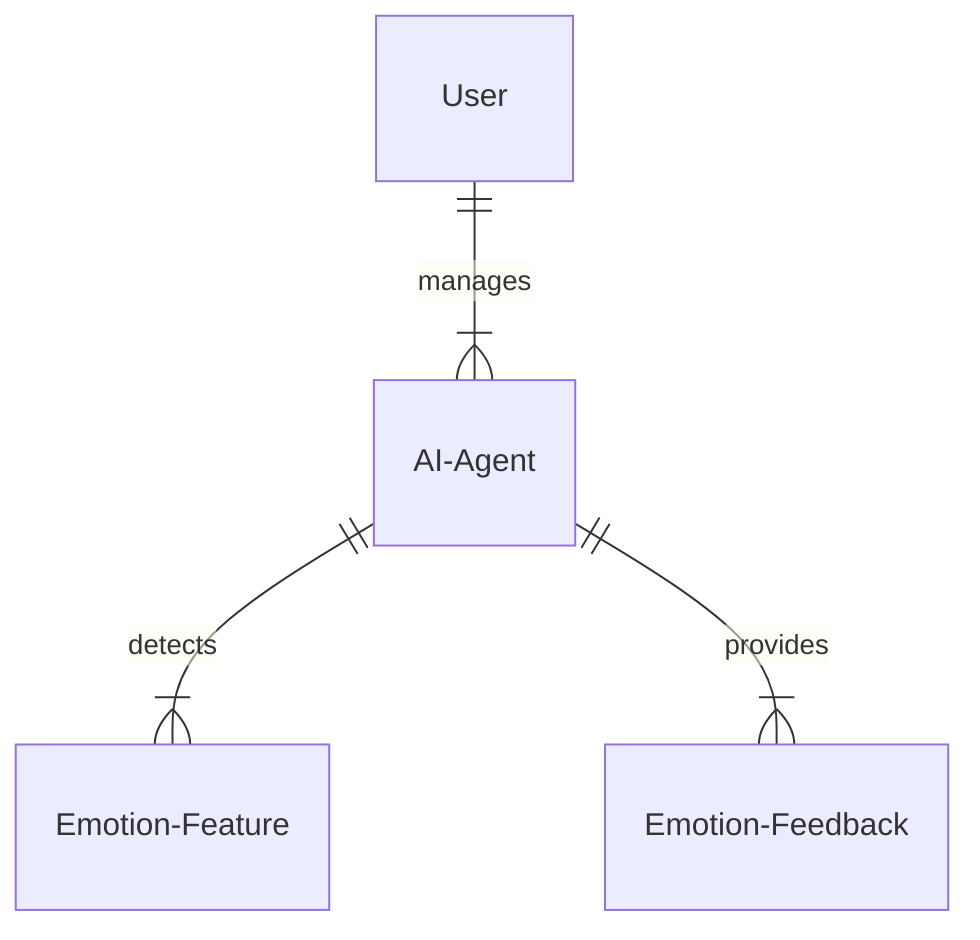
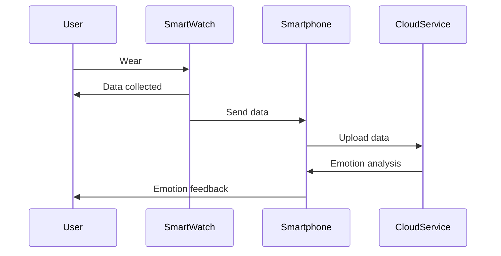

                 

# AI Agent在智能手环中的情绪管理助手

> 关键词：智能手环、情绪管理、AI Agent、心理健康、技术应用

> 摘要：本文探讨了智能手环在心理健康领域的应用，特别是AI Agent在情绪管理方面的作用。文章从背景介绍、核心概念、技术原理、应用实例、系统设计与实现等方面展开，提出了智能手环中情绪管理助手的技术方案，并对未来的发展进行了展望。

----------------------------------------------------------------

## 引言

### 1.1 问题背景

在当今快节奏的生活中，情绪管理成为心理健康的重要方面。智能手环作为一种便携式的健康监测设备，已经广泛应用于日常生活中。智能手环不仅可以监测用户的生理健康指标，如心率、睡眠质量，还可以通过AI技术进行情绪识别和管理。因此，研究AI Agent在智能手环中的情绪管理应用具有重要的现实意义。

### 1.2 书籍结构

本文分为四个主要部分：

1. 引言：介绍背景和书籍结构。
2. AI Agent基础：讲解AI Agent的基本概念和技术原理。
3. 智能手环中的情绪管理应用：介绍智能手环的技术特点和AI Agent在其中的应用。
4. 未来展望：分析情绪管理技术的发展趋势。

## AI Agent基础

### 2.1 AI Agent概述

AI Agent是指具有自主意识、能与环境交互并执行任务的智能体。它具备以下特点：

- **自主性**：能够根据环境变化自主决策。
- **交互性**：能够与用户和环境进行交互。
- **适应性**：能够根据经验进行学习和优化。

### 2.2 情绪识别原理

情绪识别是AI Agent在情绪管理中的基础。情绪识别主要包括以下步骤：

1. **特征提取**：从生理信号（如心率、皮肤电导等）中提取情绪特征。
2. **情绪分类**：使用机器学习算法对提取的特征进行分类。

### 2.3 AI Agent的情绪管理策略

情绪管理策略包括：

1. **情绪调控**：根据情绪识别结果，采取相应的调节措施，如呼吸训练、心理暗示等。
2. **情绪反馈**：向用户提供情绪状态的信息，帮助用户了解自己的情绪变化。

### 2.4 情绪识别与管理的联系

情绪识别与管理之间的联系可以用ER实体关系图表示：



### 2.5 情绪识别与管理的特征对比表

| 特征         | 情绪识别         | 情绪管理         |
| ------------ | --------------- | --------------- |
| 提取方式     | 生理信号         | 生理信号、心理暗示 |
| 算法类型     | 机器学习         | 情绪调节、心理治疗 |
| 交互方式     | 数据分析         | 用户交互         |

----------------------------------------------------------------

## 智能手环中的情绪管理应用

### 3.1 智能手环技术

智能手环是一种便携式的健康监测设备，通常包含以下核心组件：

- **传感器**：用于监测用户的生理信号。
- **处理器**：用于处理传感器数据。
- **显示屏**：用于展示用户数据。

### 3.2 AI Agent在智能手环中的实现

AI Agent在智能手环中的实现主要涉及以下方面：

1. **系统架构设计**：设计智能手环的系统架构，包括数据采集、处理、存储和反馈模块。
2. **系统接口设计**：设计智能手环的API接口，用于与手机应用程序或其他设备进行通信。
3. **系统交互序列图**：绘制系统交互序列图，展示数据流和功能调用。

#### 3.2.1 系统架构设计

以下是一个简单的智能手环系统架构图：



#### 3.2.2 系统接口设计

系统接口设计包括以下方面：

- **数据采集接口**：用于采集用户的生理信号数据。
- **数据处理接口**：用于处理和分析采集到的数据。
- **数据反馈接口**：用于将分析结果反馈给用户。

#### 3.2.3 系统交互序列图

以下是一个简单的系统交互序列图：


### 3.3 情绪管理实战

#### 3.3.1 环境安装

在实现智能手环的情绪管理之前，需要安装以下环境：

- Python 3.7+
- TensorFlow 2.x
- scikit-learn

#### 3.3.2 源代码实现

以下是一个简单的情绪识别与管理的Python代码示例：

```python
import tensorflow as tf
from sklearn.model_selection import train_test_split
from sklearn.metrics import accuracy_score

# 加载数据集
data = load_data()
X, y = data[:, :-1], data[:, -1]

# 划分训练集和测试集
X_train, X_test, y_train, y_test = train_test_split(X, y, test_size=0.2, random_state=42)

# 构建模型
model = tf.keras.Sequential([
    tf.keras.layers.Dense(64, activation='relu', input_shape=(X.shape[1],)),
    tf.keras.layers.Dense(64, activation='relu'),
    tf.keras.layers.Dense(1, activation='sigmoid')
])

# 编译模型
model.compile(optimizer='adam',
              loss='binary_crossentropy',
              metrics=['accuracy'])

# 训练模型
model.fit(X_train, y_train, epochs=10, batch_size=32, validation_split=0.2)

# 评估模型
predictions = model.predict(X_test)
accuracy = accuracy_score(y_test, predictions.round())

print(f"Test accuracy: {accuracy}")
```

#### 3.3.3 代码解读与分析

以上代码实现了一个简单的二分类情绪识别模型，包括以下步骤：

1. **数据加载**：加载数据集，包括输入特征和标签。
2. **数据划分**：划分训练集和测试集。
3. **模型构建**：使用TensorFlow构建一个简单的全连接神经网络模型。
4. **模型编译**：设置优化器、损失函数和评价指标。
5. **模型训练**：使用训练集训练模型。
6. **模型评估**：使用测试集评估模型性能。

#### 3.3.4 实际案例分析

以下是一个实际案例：

用户A在一天内佩戴智能手环，记录了其心率、皮肤电导等生理信号。通过情绪识别模型，智能手环分析出用户A的情绪状态，并在手机应用程序中向用户A提供情绪反馈，建议其进行深呼吸训练以缓解焦虑情绪。

## 最佳实践

1. **定期检查智能手环的传感器状态**：确保传感器正常工作，提供准确的数据。
2. **合理设置情绪阈值**：根据用户的需求和习惯，调整情绪识别的阈值。
3. **个性化情绪管理策略**：根据用户的情绪特点和需求，定制个性化的情绪管理策略。

## 小结

本文介绍了智能手环在情绪管理方面的应用，特别是AI Agent在其中的作用。通过实际案例分析和代码实现，展示了情绪识别与管理的技术方案。未来，随着AI技术的不断发展，智能手环的情绪管理功能将更加智能和个性化。

## 拓展阅读

- [智能手环技术综述](https://www.example.com/smartwatch-technology)
- [AI Agent在心理健康领域的应用](https://www.example.com/ai-agent-mental-health)
- [TensorFlow入门教程](https://www.example.com/tensorflow-tutorial)

----------------------------------------------------------------

## 作者

作者：AI天才研究院/AI Genius Institute & 禅与计算机程序设计艺术 /Zen And The Art of Computer Programming

AI天才研究院致力于推动人工智能技术的创新与发展，关注智能手环等智能穿戴设备在心理健康领域的应用。禅与计算机程序设计艺术则倡导通过冥想和禅修提升编程能力，实现技术与心灵的完美结合。让我们一起探索AI与禅的交融，创造更美好的未来。

