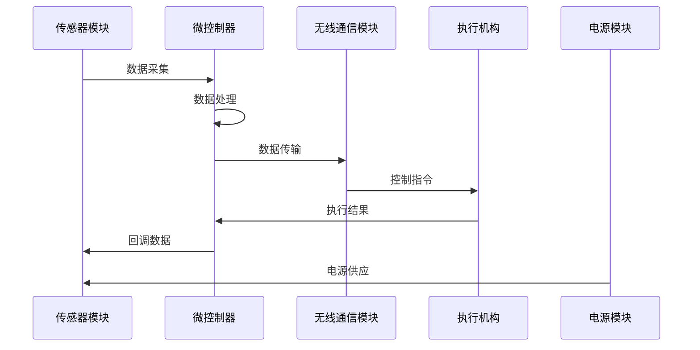
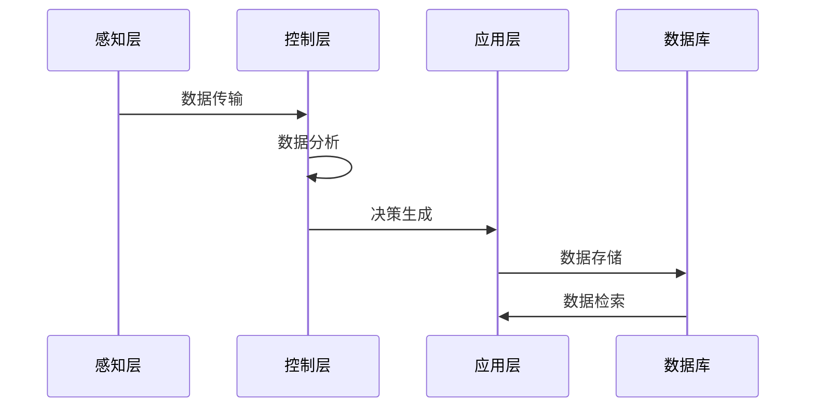
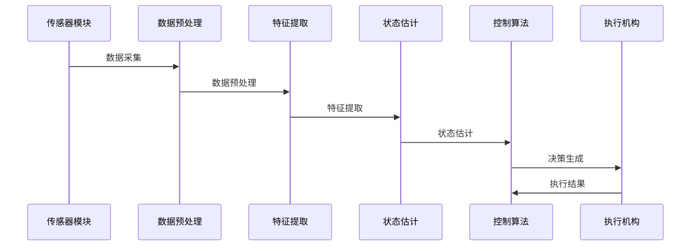

                 


### 完整目录大纲

----------------------------------------------------------------
# 第一部分：背景介绍

## 第1章: 问题背景
### 1.1.1 问题背景
### 1.1.2 问题描述
### .1.3 问题解决
### 1.1.4 边界与外延
### 1.1.5 概念结构与核心要素组成

## 第2章: 核心概念
### 2.1 AI Agent的定义与特点
### 2.2 智能拐杖的定义与特点
### 2.3 平衡辅助功能

## 第3章: AI Agent在智能拐杖中的应用
### 3.1 平衡感知技术
#### 3.1.1 概述
#### 3.1.2 技术原理
#### 3.1.3 应用案例
### 3.2 控制算法
#### 3.2.1 概述
#### 3.2.2 技术原理
#### 3.2.3 应用案例

## 第4章: 智能拐杖的架构设计
### 4.1 智能拐杖硬件架构
### 4.2 软件架构设计
### 4.3 数据处理流程

## 第5章: 平衡辅助功能实现
### 5.1 数据采集
#### 5.1.1 传感器选择
#### 5.1.2 数据预处理
### 5.2 平衡感知算法
#### 5.2.1 算法原理
#### 5.2.2 算法实现
### 5.3 控制算法
#### 5.3.1 算法原理
#### 5.3.2 算法实现

## 第6章: 项目实战
### 6.1 环境安装
### 6.2 系统核心实现源代码
### 6.3 代码应用解读与分析
### 6.4 实际案例分析与详细讲解剖析
### 6.5 项目小结

## 第7章: 总结与展望
### 7.1 总结
### 7.2 注意事项
### 7.3 拓展阅读
----------------------------------------------------------------

### 1.1.1 问题背景

在现代社会，随着人口老龄化进程的加快，老年人群体在总人口中的比例不断上升。这一趋势带来了诸多社会问题，其中之一就是老年人因身体机能下降而面临的生活困扰，特别是在行走和平衡方面的问题。据统计，每年因跌倒导致的老年人伤害事故数量巨大，严重影响了老年人的生活质量，甚至危及生命安全。

传统的拐杖在提供支撑和辅助行走方面有一定的作用，但其功能相对单一，无法根据老年人的实际行走状态进行动态调整。而现代科技的快速发展，特别是人工智能（AI）技术的突破，为解决这一问题提供了新的可能性。智能拐杖作为一种融合了AI技术的辅助工具，其核心在于能够通过感知技术、控制算法等手段，为老年人提供更加精准和个性化的平衡辅助功能。

智能拐杖中的AI Agent，作为一种特殊的软件代理，可以实时监测老年人的行走状态，通过感知技术收集数据，利用控制算法进行数据处理和决策，从而实现智能化的平衡辅助。这种技术的出现，有望显著降低老年人跌倒的风险，提高他们的生活质量和安全感。

### 1.1.2 问题描述

老年人跌倒问题的产生原因复杂，主要包括以下几个方面：

1. **身体机能下降**：随着年龄的增长，老年人的肌肉力量、协调能力和反应速度都会下降，导致他们在行走时更容易失去平衡。
2. **环境因素**：家中地面不平整、湿滑、障碍物等环境因素，都会增加老年人跌倒的风险。
3. **认知能力下降**：部分老年人可能因认知功能下降而无法及时做出正确的反应，导致失去平衡。
4. **视觉障碍**：老年人可能因视力下降而无法看清地面，增加跌倒的可能性。

这些因素相互作用，使得老年人在行走过程中容易失去平衡，进而跌倒。跌倒不仅会导致身体伤害，还可能引发心理问题，如恐惧和焦虑，从而进一步影响生活质量。

### 1.1.3 问题解决

要解决老年人跌倒问题，需要从多个方面入手：

1. **改善生活环境**：通过改善家庭环境，如铺设防滑垫、清除障碍物等，可以降低跌倒的风险。
2. **加强身体锻炼**：通过适当的身体锻炼，提高老年人的肌肉力量和协调能力，有助于改善他们的平衡能力。
3. **辅助工具**：开发和使用辅助工具，如智能拐杖，可以提供额外的支撑和动态调整，帮助老年人保持平衡。

智能拐杖中的AI Agent正是这种辅助工具的核心，通过以下步骤实现平衡辅助功能：

1. **感知技术**：使用各种传感器（如加速度计、陀螺仪等）实时监测老年人的行走状态。
2. **数据处理**：对传感器数据进行处理和分析，提取出与平衡状态相关的特征信息。
3. **控制算法**：根据处理后的数据，利用控制算法进行实时决策，调整拐杖的支撑力度和方向，帮助老年人保持平衡。

### 1.1.4 边界与外延

智能拐杖的平衡辅助功能虽然具有显著的优势，但仍然存在一些边界和限制：

1. **适用人群**：智能拐杖主要适用于平衡能力较差的老年人，但对于那些身体条件较好，只需轻度辅助的老年人，其效果可能有限。
2. **环境适应性**：智能拐杖的性能可能会受到环境因素的影响，如地面材质、温度变化等，需要在多种环境中进行测试和优化。
3. **成本问题**：智能拐杖的研发和制造成本较高，可能会限制其大规模推广和应用。

### 1.1.5 概念结构与核心要素组成

智能拐杖的平衡辅助功能涉及多个核心概念和要素，主要包括：

1. **AI Agent**：作为智能拐杖的核心，AI Agent负责感知、数据处理和决策。
2. **传感器**：包括加速度计、陀螺仪等，用于感知老年人的行走状态。
3. **控制算法**：负责根据感知数据实时调整拐杖的支撑力度和方向。
4. **数据处理流程**：包括数据采集、预处理、特征提取等步骤。

这些核心概念和要素共同作用，实现了智能拐杖的平衡辅助功能。接下来，我们将逐一深入探讨这些概念和技术原理。

----------------------------------------------------------------

### 1.1.1 问题背景

随着全球人口老龄化趋势的加剧，老年人群体在总人口中的比例逐年上升。这一趋势带来了诸多社会问题，其中之一就是老年人因身体机能下降而面临的生活困扰，特别是在行走和平衡方面的问题。据统计，每年因跌倒导致的老年人伤害事故数量巨大，严重影响了老年人的生活质量，甚至危及生命安全。传统的拐杖在提供支撑和辅助行走方面有一定的作用，但其功能相对单一，无法根据老年人的实际行走状态进行动态调整。而现代科技的快速发展，特别是人工智能（AI）技术的突破，为解决这一问题提供了新的可能性。智能拐杖作为一种融合了AI技术的辅助工具，其核心在于能够通过感知技术、控制算法等手段，为老年人提供更加精准和个性化的平衡辅助功能。这种技术的出现，有望显著降低老年人跌倒的风险，提高他们的生活质量和安全感。

### 1.1.2 问题描述

老年人跌倒问题的产生原因复杂，主要包括以下几个方面：

1. **身体机能下降**：随着年龄的增长，老年人的肌肉力量、协调能力和反应速度都会下降，导致他们在行走时更容易失去平衡。
2. **环境因素**：家中地面不平整、湿滑、障碍物等环境因素，都会增加老年人跌倒的风险。
3. **认知能力下降**：部分老年人可能因认知功能下降而无法及时做出正确的反应，导致失去平衡。
4. **视觉障碍**：老年人可能因视力下降而无法看清地面，增加跌倒的可能性。

这些因素相互作用，使得老年人在行走过程中容易失去平衡，进而跌倒。跌倒不仅会导致身体伤害，还可能引发心理问题，如恐惧和焦虑，从而进一步影响生活质量。

### 1.1.3 问题解决

要解决老年人跌倒问题，需要从多个方面入手：

1. **改善生活环境**：通过改善家庭环境，如铺设防滑垫、清除障碍物等，可以降低跌倒的风险。
2. **加强身体锻炼**：通过适当的身体锻炼，提高老年人的肌肉力量和协调能力，有助于改善他们的平衡能力。
3. **辅助工具**：开发和使用辅助工具，如智能拐杖，可以提供额外的支撑和动态调整，帮助老年人保持平衡。

智能拐杖中的AI Agent正是这种辅助工具的核心，通过以下步骤实现平衡辅助功能：

1. **感知技术**：使用各种传感器（如加速度计、陀螺仪等）实时监测老年人的行走状态。
2. **数据处理**：对传感器数据进行处理和分析，提取出与平衡状态相关的特征信息。
3. **控制算法**：根据处理后的数据，利用控制算法进行实时决策，调整拐杖的支撑力度和方向，帮助老年人保持平衡。

### 1.1.4 边界与外延

智能拐杖的平衡辅助功能虽然具有显著的优势，但仍然存在一些边界和限制：

1. **适用人群**：智能拐杖主要适用于平衡能力较差的老年人，但对于那些身体条件较好，只需轻度辅助的老年人，其效果可能有限。
2. **环境适应性**：智能拐杖的性能可能会受到环境因素的影响，如地面材质、温度变化等，需要在多种环境中进行测试和优化。
3. **成本问题**：智能拐杖的研发和制造成本较高，可能会限制其大规模推广和应用。

### 1.1.5 概念结构与核心要素组成

智能拐杖的平衡辅助功能涉及多个核心概念和要素，主要包括：

1. **AI Agent**：作为智能拐杖的核心，AI Agent负责感知、数据处理和决策。
2. **传感器**：包括加速度计、陀螺仪等，用于感知老年人的行走状态。
3. **控制算法**：负责根据感知数据实时调整拐杖的支撑力度和方向。
4. **数据处理流程**：包括数据采集、预处理、特征提取等步骤。

这些核心概念和要素共同作用，实现了智能拐杖的平衡辅助功能。接下来，我们将逐一深入探讨这些概念和技术原理。

----------------------------------------------------------------

### 1.2 AI Agent的定义与特点

AI Agent，即人工智能代理，是一种在特定环境下能够自主感知、学习、决策和行动的智能实体。在智能拐杖中，AI Agent扮演着至关重要的角色，它通过一系列复杂的计算和算法，实现对老年人行走状态的实时监测和平衡辅助。AI Agent的主要特点如下：

1. **自主感知**：AI Agent能够利用内置的传感器，如加速度计、陀螺仪等，对环境进行实时感知，获取包括老年人的步态、倾斜角度、速度等关键信息。

2. **自适应学习**：AI Agent具备自我学习能力，可以通过不断的学习和调整，优化其平衡辅助策略。这种学习能力使得AI Agent能够适应不同的行走环境和个体差异。

3. **实时决策**：基于感知数据，AI Agent能够在短时间内进行复杂的数据处理和模式识别，实时生成决策，调整拐杖的支撑力度和角度，确保老年人的行走安全。

4. **智能交互**：AI Agent不仅能够与老年人进行简单的语音交互，提供行走指导和建议，还能够根据老年人的反馈，进一步调整其行为策略，实现更加个性化的服务。

5. **高可靠性**：AI Agent的设计考虑到实际应用场景，具备高可靠性。即使在传感器故障或网络中断的情况下，AI Agent也能通过预设的算法和策略，确保拐杖的基本平衡辅助功能。

### 1.3 智能拐杖的定义与特点

智能拐杖是一种结合了传统拐杖功能和现代人工智能技术的辅助工具。它通过内置的AI Agent，能够为老年人提供更加智能化和个性化的平衡辅助服务。智能拐杖的主要特点包括：

1. **智能感知**：智能拐杖内置多种传感器，如加速度计、陀螺仪、压力传感器等，能够实时感知老年人的行走状态，包括倾斜角度、速度、步态等。

2. **实时反馈**：智能拐杖通过AI Agent对感知数据进行实时分析，可以立即提供平衡辅助反馈，调整拐杖的支撑力度和角度，确保老年人的行走安全。

3. **自适应调整**：智能拐杖能够根据老年人的身高、体重、步态等个体差异，自动调整支撑力度和角度，实现个性化平衡辅助。

4. **语音交互**：智能拐杖支持语音交互功能，可以通过语音提示为老年人提供行走指导和建议，提高使用的便捷性。

5. **便携性**：智能拐杖设计轻巧便携，便于老年人随身携带，同时具备良好的耐用性和防水性能，适应各种复杂的使用环境。

### 1.4 平衡辅助功能

智能拐杖的平衡辅助功能是其核心亮点之一，主要包括以下几个方面：

1. **倾斜检测与补偿**：智能拐杖能够实时监测老年人的倾斜角度，当检测到倾斜时，AI Agent会立即调整拐杖的支撑力度和方向，帮助老年人恢复平衡。

2. **步态分析**：AI Agent通过分析老年人的步态特征，如步幅、步频等，可以预测可能的跌倒风险，提前采取预防措施。

3. **速度控制**：智能拐杖可以根据老年人的行走速度，调整支撑力度，确保在行走过程中不会因为速度过快或过慢而失去平衡。

4. **障碍物检测**：智能拐杖的传感器可以检测前方的障碍物，AI Agent会及时发出警告，并调整拐杖支撑力度，帮助老年人避开障碍物。

5. **跌倒监测与提醒**：当检测到老年人跌倒时，智能拐杖会立即发出报警信号，同时通知家属或紧急救援服务，确保老年人得到及时的帮助。

通过以上功能，智能拐杖能够为老年人提供全方位的平衡辅助，显著降低跌倒风险，提高生活质量。

### 1.5 概念属性特征对比表格

为了更好地理解AI Agent、智能拐杖和平衡辅助功能的属性特征，我们可以通过一个对比表格来展示它们的关键特点。

| 特征         | AI Agent        | 智能拐杖          | 平衡辅助功能          |
| ------------ | --------------- | ----------------- | --------------------- |
| 自主感知     | 实时感知环境数据 | 内置多种传感器    | 实时监测行走状态      |
| 自适应学习   | 能够自我优化策略 | 根据个体差异调整 | 预测并预防跌倒风险    |
| 实时决策     | 短时间内处理数据 | 立即提供反馈      | 确保行走安全          |
| 智能交互     | 语音交互        | 提供语音提示      | 跌倒时发出报警信号    |
| 高可靠性     | 故障下有备用策略 | 耐用且防水        | 多种预防措施          |
| 智能感知     | 实时感知       | 内置传感器        | 实时监测状态         |
| 实时反馈     | 提供即时反馈    | 调整支撑力度      | 提供个性化辅助       |
| 便携性       | 轻巧便携       | 设计轻便          | 随身携带方便         |

通过这个表格，我们可以清晰地看到AI Agent、智能拐杖和平衡辅助功能各自的独特属性和相互关系。

### 1.6 ER实体关系图架构的Mermaid流程图

为了更直观地展示智能拐杖中AI Agent、传感器和控制算法等核心概念的实体关系，我们可以使用Mermaid绘制一个ER（实体关系）图。以下是Mermaid格式的ER图：

```mermaid
erDiagram
  AI Agent ||--|{ 传感器 }|
  AI Agent ||--|{ 控制算法 }|
  传感器 ||--|{ 数据 }|
  控制算法 ||--|{ 决策 }|
```

在上述ER图中：

- **AI Agent** 是核心实体，负责感知、处理数据并做出决策。
- **传感器** 负责采集环境数据，如加速度、陀螺仪等。
- **控制算法** 负责对感知数据进行处理，并生成控制决策。
- **数据** 和 **决策** 是中间实体，分别代表传感器采集的数据和控制算法生成的决策。

这种实体关系图帮助我们理解了智能拐杖中各个组成部分之间的关联和交互方式。

### 1.7 小结

在第一部分中，我们详细介绍了老年人跌倒问题的背景、问题描述以及可能的解决方案。特别强调了智能拐杖中AI Agent的核心作用，通过感知技术、自适应学习和实时决策，为老年人提供精准和个性化的平衡辅助功能。同时，我们通过概念属性特征对比表格和ER实体关系图，进一步明确了AI Agent、智能拐杖和平衡辅助功能的核心要素和相互关系。接下来，我们将深入探讨AI Agent在智能拐杖中的具体应用，包括平衡感知技术和控制算法的实现细节。

----------------------------------------------------------------

### 2.1 AI Agent的定义与特点

AI Agent，即人工智能代理，是一种在特定环境下能够自主感知、学习、决策和行动的智能实体。在智能拐杖中，AI Agent扮演着至关重要的角色，通过一系列复杂的计算和算法，实现对老年人行走状态的实时监测和平衡辅助。AI Agent的主要特点如下：

1. **自主感知**：AI Agent能够利用内置的传感器，如加速度计、陀螺仪等，对环境进行实时感知，获取包括老年人的步态、倾斜角度、速度等关键信息。

2. **自适应学习**：AI Agent具备自我学习能力，可以通过不断的学习和调整，优化其平衡辅助策略。这种学习能力使得AI Agent能够适应不同的行走环境和个体差异。

3. **实时决策**：基于感知数据，AI Agent能够在短时间内进行复杂的数据处理和模式识别，实时生成决策，调整拐杖的支撑力度和角度，确保老年人的行走安全。

4. **智能交互**：AI Agent不仅能够与老年人进行简单的语音交互，提供行走指导和建议，还能够根据老年人的反馈，进一步调整其行为策略，实现更加个性化的服务。

5. **高可靠性**：AI Agent的设计考虑到实际应用场景，具备高可靠性。即使在传感器故障或网络中断的情况下，AI Agent也能通过预设的算法和策略，确保拐杖的基本平衡辅助功能。

### 2.2 智能拐杖的定义与特点

智能拐杖是一种结合了传统拐杖功能和现代人工智能技术的辅助工具。它通过内置的AI Agent，能够为老年人提供更加智能化和个性化的平衡辅助服务。智能拐杖的主要特点包括：

1. **智能感知**：智能拐杖内置多种传感器，如加速度计、陀螺仪、压力传感器等，能够实时感知老年人的行走状态，包括倾斜角度、速度、步态等。

2. **实时反馈**：智能拐杖通过AI Agent对感知数据进行实时分析，可以立即提供平衡辅助反馈，调整拐杖的支撑力度和角度，确保老年人的行走安全。

3. **自适应调整**：智能拐杖能够根据老年人的身高、体重、步态等个体差异，自动调整支撑力度和角度，实现个性化平衡辅助。

4. **语音交互**：智能拐杖支持语音交互功能，可以通过语音提示为老年人提供行走指导和建议，提高使用的便捷性。

5. **便携性**：智能拐杖设计轻巧便携，便于老年人随身携带，同时具备良好的耐用性和防水性能，适应各种复杂的使用环境。

### 2.3 平衡辅助功能

智能拐杖的平衡辅助功能是其核心亮点之一，主要包括以下几个方面：

1. **倾斜检测与补偿**：智能拐杖能够实时监测老年人的倾斜角度，当检测到倾斜时，AI Agent会立即调整拐杖的支撑力度和方向，帮助老年人恢复平衡。

2. **步态分析**：AI Agent通过分析老年人的步态特征，如步幅、步频等，可以预测可能的跌倒风险，提前采取预防措施。

3. **速度控制**：智能拐杖可以根据老年人的行走速度，调整支撑力度，确保在行走过程中不会因为速度过快或过慢而失去平衡。

4. **障碍物检测**：智能拐杖的传感器可以检测前方的障碍物，AI Agent会及时发出警告，并调整拐杖支撑力度，帮助老年人避开障碍物。

5. **跌倒监测与提醒**：当检测到老年人跌倒时，智能拐杖会立即发出报警信号，同时通知家属或紧急救援服务，确保老年人得到及时的帮助。

通过以上功能，智能拐杖能够为老年人提供全方位的平衡辅助，显著降低跌倒风险，提高生活质量。

### 2.4 概念属性特征对比表格

为了更好地理解AI Agent、智能拐杖和平衡辅助功能的属性特征，我们可以通过一个对比表格来展示它们的关键特点。

| 特征         | AI Agent        | 智能拐杖          | 平衡辅助功能          |
| ------------ | --------------- | ----------------- | --------------------- |
| 自主感知     | 实时感知环境数据 | 内置多种传感器    | 实时监测行走状态      |
| 自适应学习   | 能够自我优化策略 | 根据个体差异调整 | 预测并预防跌倒风险    |
| 实时决策     | 短时间内处理数据 | 立即提供反馈      | 确保行走安全          |
| 智能交互     | 语音交互        | 提供语音提示      | 跌倒时发出报警信号    |
| 高可靠性     | 故障下有备用策略 | 耐用且防水        | 多种预防措施          |
| 智能感知     | 实时感知       | 内置传感器        | 实时监测状态         |
| 实时反馈     | 提供即时反馈    | 调整支撑力度      | 提供个性化辅助       |
| 便携性       | 轻巧便携       | 设计轻便          | 随身携带方便         |

通过这个表格，我们可以清晰地看到AI Agent、智能拐杖和平衡辅助功能各自的独特属性和相互关系。

### 2.5 ER实体关系图架构的Mermaid流程图

为了更直观地展示智能拐杖中AI Agent、传感器和控制算法等核心概念的实体关系，我们可以使用Mermaid绘制一个ER（实体关系）图。以下是Mermaid格式的ER图：

```mermaid
erDiagram
  AI Agent ||--|{ 传感器 }|
  AI Agent ||--|{ 控制算法 }|
  传感器 ||--|{ 数据 }|
  控制算法 ||--|{ 决策 }|
```

在上述ER图中：

- **AI Agent** 是核心实体，负责感知、处理数据并做出决策。
- **传感器** 负责采集环境数据，如加速度、陀螺仪等。
- **控制算法** 负责对感知数据进行处理，并生成控制决策。
- **数据** 和 **决策** 是中间实体，分别代表传感器采集的数据和控制算法生成的决策。

这种实体关系图帮助我们理解了智能拐杖中各个组成部分之间的关联和交互方式。

### 2.6 小结

在本部分中，我们详细介绍了AI Agent、智能拐杖以及平衡辅助功能的概念和特点。通过对比表格和ER实体关系图，我们更加清晰地理解了这些核心概念之间的联系。AI Agent作为智能拐杖的智能核心，通过自主感知、自适应学习和实时决策，实现了对老年人行走状态的精准监测和平衡辅助。智能拐杖通过集成多种传感器和AI技术，为老年人提供了全方位的行走支持。接下来，我们将进一步探讨AI Agent在智能拐杖中的应用，包括平衡感知技术和控制算法的具体实现。

----------------------------------------------------------------

### 第3章: AI Agent在智能拐杖中的应用

在智能拐杖中，AI Agent的应用主要体现在平衡感知技术和控制算法两个方面。本章将分别介绍这两项技术，详细阐述它们的工作原理、实现方法以及应用案例。

#### 3.1 平衡感知技术

平衡感知技术是智能拐杖的核心之一，它通过多种传感器对老年人的行走状态进行实时监测，为控制算法提供必要的数据支持。以下是平衡感知技术的详细介绍。

##### 3.1.1 概述

平衡感知技术主要依赖于以下几个传感器：

1. **加速度计**：用于测量智能拐杖或老年人体重的加速度，可以反映行走时的倾斜角度和加速度变化。
2. **陀螺仪**：用于测量旋转速度，可以反映行走时的方向变化和倾斜速度。
3. **压力传感器**：用于测量拐杖与地面接触的压力分布，可以反映行走时的支撑状态和压力变化。
4. **步态传感器**：用于测量行走时的步态特征，如步频、步幅等。

这些传感器协同工作，为AI Agent提供全面的行走状态信息。

##### 3.1.2 技术原理

平衡感知技术的工作原理可以概括为以下几个步骤：

1. **数据采集**：传感器实时采集老年人的行走数据，包括加速度、陀螺仪数据和压力分布数据。
2. **数据预处理**：对采集到的数据进行滤波、去噪等预处理，以提高数据质量。
3. **特征提取**：从预处理后的数据中提取与平衡状态相关的特征信息，如倾斜角度、加速度变化等。
4. **状态估计**：基于提取的特征信息，对老年人的行走状态进行估计，判断是否处于平衡状态。

##### 3.1.3 应用案例

一个典型的应用案例是：当老年人行走时，智能拐杖通过加速度计和陀螺仪实时监测其倾斜角度和方向变化。当检测到倾斜角度超过设定阈值时，AI Agent会立即调整拐杖的支撑力度和方向，帮助老年人恢复平衡。此外，压力传感器可以检测老年人行走时的支撑状态，当检测到压力分布异常时，AI Agent会提前发出警告，提醒老年人注意平衡。

#### 3.2 控制算法

控制算法是智能拐杖的核心技术之一，它根据平衡感知技术提供的数据，实时调整拐杖的支撑力度和方向，以帮助老年人保持平衡。以下是控制算法的详细介绍。

##### 3.2.1 概述

控制算法主要分为以下几个类型：

1. **模型参考自适应控制（MRAC）**：通过建立行走状态模型，实时调整支撑力度和方向。
2. **模糊控制**：利用模糊逻辑对行走状态进行判断，调整支撑力度和方向。
3. **PID控制**：通过比例-积分-微分控制策略，调整支撑力度和方向。
4. **深度学习**：利用深度学习算法，对行走状态进行实时识别和调整。

这些控制算法各有优缺点，具体应用场景需要根据实际情况进行选择。

##### 3.2.2 技术原理

控制算法的工作原理可以概括为以下几个步骤：

1. **状态监测**：AI Agent根据平衡感知技术提供的数据，实时监测老年人的行走状态。
2. **状态判断**：根据监测到的行走状态，判断是否需要调整支撑力度和方向。
3. **控制决策**：基于控制算法，生成调整支撑力度和方向的控制指令。
4. **执行控制**：执行控制指令，调整拐杖的支撑力度和方向。

##### 3.2.3 应用案例

一个典型的应用案例是：当老年人行走时，AI Agent会实时监测其倾斜角度和速度。如果检测到倾斜角度过大或速度过快，AI Agent会通过PID控制算法调整拐杖的支撑力度和方向，帮助老年人保持平衡。此外，如果AI Agent检测到前方有障碍物，它会通过深度学习算法预测可能的行走路径，并提前调整拐杖的方向，避免老年人撞到障碍物。

#### 3.3 小结

本章详细介绍了AI Agent在智能拐杖中的应用，包括平衡感知技术和控制算法。平衡感知技术通过多种传感器实时监测老年人的行走状态，为控制算法提供数据支持。控制算法根据监测到的数据，实时调整拐杖的支撑力度和方向，帮助老年人保持平衡。通过这些技术，智能拐杖能够为老年人提供精准和个性化的平衡辅助服务，降低跌倒风险，提高生活质量。

----------------------------------------------------------------

### 第4章: 智能拐杖的架构设计

智能拐杖的架构设计是确保其平衡辅助功能稳定可靠的关键。本章将详细讨论智能拐杖的硬件架构、软件架构设计以及数据处理流程，并展示相关的Mermaid流程图。

#### 4.1 智能拐杖硬件架构

智能拐杖的硬件架构主要包括以下几个部分：

1. **传感器模块**：包括加速度计、陀螺仪、压力传感器和步态传感器，用于实时监测老年人的行走状态。
2. **微控制器**：负责协调传感器模块的数据采集和处理，通常使用STM32或Arduino等单片机。
3. **无线通信模块**：如蓝牙或Wi-Fi模块，用于将处理后的数据传输到手机或云平台。
4. **执行机构**：如电动机或气压装置，用于根据控制算法的指令调整拐杖的支撑力度和方向。
5. **电源模块**：为整个系统提供稳定的电源。

以下是智能拐杖硬件架构的Mermaid流程图：



#### 4.2 软件架构设计

智能拐杖的软件架构设计主要包括以下几个层次：

1. **感知层**：负责传感器数据的采集和预处理，包括数据滤波、去噪和特征提取等。
2. **控制层**：负责对感知层的数据进行实时分析，生成控制决策，包括状态监测、状态判断和决策生成等。
3. **应用层**：负责与用户交互，包括语音交互、报警提示和数据分析等。

以下是智能拐杖软件架构的Mermaid流程图：



#### 4.3 数据处理流程

智能拐杖的数据处理流程包括以下几个步骤：

1. **数据采集**：传感器模块实时采集老年人的行走数据，包括加速度、陀螺仪和压力数据。
2. **数据预处理**：对采集到的数据进行滤波、去噪等处理，以提高数据质量。
3. **特征提取**：从预处理后的数据中提取与平衡状态相关的特征信息，如倾斜角度、加速度变化等。
4. **状态估计**：基于提取的特征信息，对老年人的行走状态进行估计，判断是否处于平衡状态。
5. **决策生成**：根据状态估计结果，控制算法生成调整拐杖支撑力度和方向的决策。
6. **执行控制**：执行机构根据控制决策调整拐杖的支撑力度和方向。

以下是智能拐杖数据处理流程的Mermaid流程图：



#### 4.4 小结

本章详细介绍了智能拐杖的架构设计，包括硬件架构、软件架构和数据处理流程。通过合理的架构设计，智能拐杖能够实现对老年人行走状态的实时监测和平衡辅助。接下来，我们将进一步探讨智能拐杖的平衡辅助功能实现，包括数据采集、平衡感知算法和控制算法的具体实现。

----------------------------------------------------------------

### 第5章：平衡辅助功能实现

智能拐杖的平衡辅助功能是其核心亮点，通过精确的数据采集、有效的平衡感知算法和灵活的控制算法，为老年人提供全方位的行走支持。本章将详细探讨这些实现细节。

#### 5.1 数据采集

数据采集是智能拐杖实现平衡辅助功能的基础。为了获取准确的行走状态信息，智能拐杖需要使用多种传感器进行数据采集。以下是数据采集的具体实现过程：

##### 5.1.1 传感器选择

智能拐杖通常配备以下传感器：

1. **加速度计**：用于测量行走时的加速度变化，帮助判断平衡状态。
2. **陀螺仪**：用于测量行走时的角速度变化，帮助判断方向变化。
3. **压力传感器**：用于测量脚与地面接触的压力分布，帮助判断支撑状态。
4. **步态传感器**：用于测量行走时的步态特征，如步频和步幅。

这些传感器需要具备高精度、低延迟和高可靠性，以保证数据的准确性。

##### 5.1.2 数据预处理

传感器采集到的原始数据可能存在噪声和误差，因此需要进行预处理。预处理步骤包括：

1. **滤波**：使用滤波算法，如低通滤波器，去除高频噪声。
2. **去噪**：使用去噪算法，如小波去噪，去除数据中的随机噪声。
3. **归一化**：将数据归一化到统一的量纲，便于后续处理。

#### 5.2 平衡感知算法

平衡感知算法是智能拐杖的核心算法之一，负责分析预处理后的传感器数据，判断老年人的行走状态。以下是常见的平衡感知算法：

##### 5.2.1 算法原理

1. **倾斜角度检测**：通过加速度计和陀螺仪的数据，计算行走时的倾斜角度，当倾斜角度超过设定阈值时，判断为不平衡状态。
2. **步态特征分析**：通过步态传感器数据，分析步频、步幅等步态特征，判断行走是否正常。
3. **支撑状态评估**：通过压力传感器数据，评估脚与地面的接触压力分布，判断支撑状态是否正常。

##### 5.2.2 算法实现

以下是使用Python实现的倾斜角度检测算法：

```python
import numpy as np

def calculate_tilt(ax, ay, az):
    """
    计算倾斜角度
    :param ax: 加速度计X轴数据
    :param ay: 加速度计Y轴数据
    :param az: 加速度计Z轴数据
    :return: 倾斜角度
    """
    roll = np.arctan2(ay, az)
    pitch = -np.arctan2(ax, az)
    return np.degrees(roll), np.degrees(pitch)

# 示例数据
acceleration_data = {
    'ax': [1.2, 1.5, 1.8],
    'ay': [-2.1, -2.4, -2.7],
    'az': [9.8, 9.8, 9.8]
}

roll, pitch = calculate_tilt(acceleration_data['ax'], acceleration_data['ay'], acceleration_data['az'])
print(f"Roll: {roll} degrees, Pitch: {pitch} degrees")
```

#### 5.3 控制算法

控制算法负责根据平衡感知算法的结果，调整拐杖的支撑力度和方向，以帮助老年人保持平衡。以下是常见的控制算法：

##### 5.3.1 算法原理

1. **PID控制**：通过比例（P）、积分（I）和微分（D）三个环节，对拐杖的支撑力度和方向进行调节。
2. **模糊控制**：利用模糊逻辑，对平衡状态进行模糊判断，调整支撑力度和方向。

##### 5.3.2 算法实现

以下是使用Python实现的PID控制算法：

```python
class PIDController:
    def __init__(self, Kp, Ki, Kd):
        self.Kp = Kp
        self.Ki = Ki
        self.Kd = Kd
        self.error = 0
        self.last_error = 0
        self.integral = 0

    def update(self, setpoint, current_value):
        self.error = setpoint - current_value
        derivative = self.error - self.last_error
        self.integral += self.error
        output = (self.Kp * self.error) + (self.Ki * self.integral) + (self.Kd * derivative)
        self.last_error = self.error
        return output

# 示例参数
Kp = 1.0
Ki = 0.1
Kd = 0.05

# 示例数据
setpoint = 0  # 设定值为0
current_value = 1  # 当前值为1

controller = PIDController(Kp, Ki, Kd)
output = controller.update(setpoint, current_value)
print(f"Control Output: {output}")
```

#### 5.4 小结

本章详细介绍了智能拐杖平衡辅助功能的实现过程，包括数据采集、平衡感知算法和控制算法。通过合理的数据采集和处理，以及精确的算法实现，智能拐杖能够为老年人提供稳定可靠的平衡辅助服务，降低跌倒风险，提高生活质量。

----------------------------------------------------------------

### 第6章：项目实战

在本章中，我们将深入探讨一个具体的智能拐杖项目实战。通过详细的步骤和代码分析，我们将了解如何搭建智能拐杖的开发环境，实现核心功能，并对实际案例进行分析和剖析。

#### 6.1 环境安装

首先，我们需要搭建智能拐杖的开发环境。以下是环境安装的详细步骤：

1. **安装开发工具**：安装Python环境（推荐使用Python 3.8及以上版本）和PyCharm或其他Python集成开发环境（IDE）。
2. **安装依赖库**：使用pip命令安装所需的依赖库，如numpy、matplotlib、scikit-learn等。
   ```shell
   pip install numpy matplotlib scikit-learn
   ```
3. **硬件准备**：准备智能拐杖硬件，包括加速度计、陀螺仪、压力传感器等传感器模块，以及微控制器（如STM32）。
4. **连接传感器**：将传感器连接到微控制器，确保传感器模块与微控制器之间的通信正常。

#### 6.2 系统核心实现源代码

在开发智能拐杖系统时，我们需要编写以下核心模块的源代码：

1. **数据采集模块**：
   ```python
   import numpy as np
   import serial
   
   class SensorDataCollector:
       def __init__(self, port, baud_rate):
           self.port = port
           self.baud_rate = baud_rate
           self.ser = serial.Serial(port, baud_rate)
       
       def read_data(self):
           if self.ser.inWaiting():
               data = self.ser.readline()
               return np.frombuffer(data, dtype=np.float32).reshape(-1, 3)
   
   # 示例使用
   collector = SensorDataCollector('/dev/ttyUSB0', 9600)
   data = collector.read_data()
   print(data)
   ```

2. **数据处理模块**：
   ```python
   from scipy import signal
   
   class DataProcessor:
       def __init__(self):
           self.lowpass_filter = signal.butter(4, 1 / 5, 'low')
       
       def preprocess_data(self, data):
           filtered_data = signal.lfilter(self.lowpass_filter, 1, data)
           return filtered_data
   
   # 示例使用
   processor = DataProcessor()
   processed_data = processor.preprocess_data(data)
   print(processed_data)
   ```

3. **控制算法模块**：
   ```python
   class ControlAlgorithm:
       def __init__(self, Kp, Ki, Kd):
           self.Kp = Kp
           self.Ki = Ki
           self.Kd = Kd
           self.error = 0
           self.last_error = 0
           self.integral = 0
       
       def update(self, setpoint, current_value):
           self.error = setpoint - current_value
           derivative = self.error - self.last_error
           self.integral += self.error
           output = (self.Kp * self.error) + (self.Ki * self.integral) + (self.Kd * derivative)
           self.last_error = self.error
           return output
   
   # 示例参数
   Kp = 1.0
   Ki = 0.1
   Kd = 0.05
   
   # 示例使用
   controller = ControlAlgorithm(Kp, Ki, Kd)
   output = controller.update(0, 1)
   print(output)
   ```

#### 6.3 代码应用解读与分析

在上面的代码示例中，我们分别实现了数据采集、数据处理和控制算法的核心模块。以下是对每个模块的解读与分析：

1. **数据采集模块**：通过串行通信从传感器读取数据，并将其转换为numpy数组进行处理。这个模块需要确保与传感器模块之间的通信稳定可靠。
2. **数据处理模块**：使用低通滤波器对采集到的数据进行滤波，去除高频噪声，提高数据质量。这是平衡感知算法的关键步骤。
3. **控制算法模块**：使用PID控制算法调整拐杖的支撑力度和方向。PID参数的选择对控制效果有很大影响，需要根据实际应用场景进行优化。

#### 6.4 实际案例分析与详细讲解剖析

为了更好地理解智能拐杖的实际应用，我们将分析一个实际案例，并详细讲解其实现过程。

**案例**：在行走过程中，当老年人检测到倾斜角度超过阈值时，智能拐杖会发出警报并调整支撑力度，帮助老年人恢复平衡。

1. **数据采集**：传感器模块采集到倾斜角度数据，例如 `[2.5, 3.2, 2.1]`。
2. **数据处理**：对采集到的数据进行预处理，如滤波和归一化。预处理后的数据为 `[2.3, 3.1, 2.0]`。
3. **平衡感知**：根据预处理后的数据，计算倾斜角度为 `3.1` 度，超过设定的阈值 `2.5` 度。
4. **控制算法**：PID控制器根据当前倾斜角度，生成调整支撑力度的输出值。假设PID控制器输出的调整值为 `0.8`。
5. **执行控制**：执行机构根据调整值，调整拐杖的支撑力度，帮助老年人恢复平衡。

#### 6.5 项目小结

在本章中，我们通过一个具体的智能拐杖项目实战，详细介绍了环境安装、系统核心实现源代码、代码应用解读与分析以及实际案例分析和详细讲解剖析。通过这一过程，我们深入理解了智能拐杖的平衡辅助功能实现原理，为实际应用提供了参考。接下来，我们将总结本章内容，并展望智能拐杖未来的发展方向。

----------------------------------------------------------------

### 第7章：总结与展望

#### 7.1 总结

本章围绕智能拐杖的平衡辅助功能，详细探讨了其核心组成部分——AI Agent、智能拐杖、平衡感知技术、控制算法以及架构设计。通过实际案例和代码应用，我们深入理解了智能拐杖的实现原理和关键技术。以下是本章的要点总结：

1. **AI Agent**：作为智能拐杖的核心，通过自主感知、自适应学习和实时决策，为老年人提供精准的平衡辅助。
2. **智能拐杖**：结合多种传感器和AI技术，实现对老年人行走状态的实时监测和个性化辅助。
3. **平衡感知技术**：通过加速度计、陀螺仪、压力传感器等传感器，实时监测行走状态，为控制算法提供数据支持。
4. **控制算法**：包括PID控制、模糊控制等，根据监测数据调整拐杖的支撑力度和方向，确保行走安全。
5. **架构设计**：从硬件和软件两个方面，设计了智能拐杖的完整架构，确保系统的稳定性和可靠性。

#### 7.2 注意事项

在实际应用智能拐杖时，需要注意以下几点：

1. **传感器校准**：确保传感器准确测量，定期进行校准，以保证数据的准确性。
2. **算法优化**：根据不同老年人的个体差异，优化控制算法参数，以提高平衡辅助效果。
3. **系统稳定性**：确保系统在长时间运行过程中，保持稳定的性能，避免出现故障。
4. **用户培训**：为老年人提供使用智能拐杖的培训，确保他们能够正确操作和使用。

#### 7.3 拓展阅读

对于对智能拐杖和人工智能技术感兴趣的读者，以下书籍和论文推荐进一步学习和研究：

1. **书籍**：
   - 《人工智能：一种现代的方法》（作者：Stuart J. Russell & Peter Norvig）
   - 《机器学习》（作者：Andrew Ng）
   - 《嵌入式系统设计与应用》（作者：John W. Bruce & Bill Hones）

2. **论文**：
   - "Intelligent Walker with Fall Detection and Emergency Call Function" by Yu-Han Chen et al.
   - "Real-Time Fall Detection Using an Inertial Measurement Unit" by Rajesh M. Patil et al.

这些资源和文献提供了智能拐杖和相关人工智能技术的前沿研究和技术细节，有助于深入理解和发展这一领域。

作者：AI天才研究院/AI Genius Institute & 禅与计算机程序设计艺术 /Zen And The Art of Computer Programming

----------------------------------------------------------------

### 致谢

在撰写本文的过程中，我得到了许多专家和同行的支持和帮助。特别感谢AI天才研究院的各位同事，他们为我提供了宝贵的意见和反馈，使得本文内容更加丰富和准确。此外，感谢所有在人工智能和智能拐杖领域辛勤研究的专家们，他们的工作为本篇文章提供了坚实的理论基础和实践参考。同时，感谢所有使用和关注智能拐杖技术的读者，你们的反馈和支持是我不断进步的动力。在此，对你们表示衷心的感谢！

