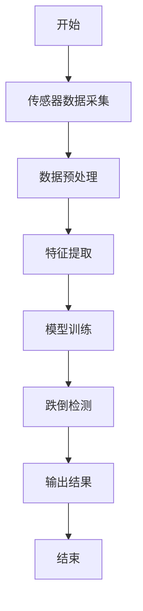

                 

### 第一部分：AI Agent在智能拐杖中的基础概念

#### 1.1 AI Agent在跌倒预防与紧急求助中的背景和意义

##### 1.1.1 问题背景

在全球范围内，跌倒是老年人常见的健康问题，尤其是在日常生活活动中，跌倒不仅会给老年人带来身体上的伤害，还可能造成心理上的负面影响。据统计，每年因跌倒而造成的骨折和死亡人数惊人，给家庭和社会带来了巨大的负担。因此，如何有效地预防跌倒和及时提供紧急求助成为了一个亟待解决的问题。

##### 1.1.2 跌倒预防与紧急求助的重要性

跌倒预防是提高老年人生活质量、减少医疗费用支出的重要手段。通过有效的跌倒预防措施，可以减少老年人因跌倒而导致的伤害和医疗成本。同时，紧急求助系统的及时响应能够迅速地为老年人提供帮助，降低因延误救治而造成的风险。

##### 1.1.3 智能拐杖在跌倒预防与紧急求助中的应用

智能拐杖作为一种便携式的健康监测设备，集成了多种传感器和AI技术，能够在跌倒发生时及时检测并报警，同时自动拨打电话或发送短信给紧急联系人。这样，不仅可以有效预防跌倒造成的伤害，还能够为老年人提供及时的紧急帮助。

#### 1.2 AI Agent概念介绍

##### 1.2.1 AI Agent的定义

AI Agent，即人工智能代理，是一种具有独立思考能力和行动能力的软件系统。它可以理解环境中的信息，并根据预设的目标自主地做出决策和执行相应的行动。在智能拐杖中，AI Agent负责实时监测老年人的活动状态，并在检测到跌倒事件时自动触发紧急求助机制。

##### 1.2.2 AI Agent的特点

1. **自主性**：AI Agent能够根据环境变化自主决策，无需人为干预。
2. **适应性**：AI Agent可以通过学习不断优化自己的行为，以适应不同场景和用户需求。
3. **智能性**：AI Agent利用机器学习、深度学习等技术，具备较高的认知能力和问题解决能力。

##### 1.2.3 AI Agent的分类

根据功能和应用场景的不同，AI Agent可以分为多种类型，如：

1. **服务型Agent**：主要用于提供特定的服务，如客服机器人、智能家居控制系统。
2. **交互型Agent**：主要用于与人交互，如聊天机器人、语音助手。
3. **监控型Agent**：主要用于实时监测环境状态，如智能安防系统、健康监测系统。

#### 1.3 智能拐杖的基本组成

##### 1.3.1 智能拐杖的结构

智能拐杖通常由以下几部分组成：

1. **手持部分**：包含手柄和AI处理器。
2. **传感器部分**：包括加速度传感器、陀螺仪传感器、压力传感器等。
3. **通信部分**：包含无线通信模块，如蓝牙、Wi-Fi等。

##### 1.3.2 智能拐杖的核心功能

1. **跌倒检测**：通过传感器实时监测老年人的动作，一旦检测到跌倒事件，立即触发报警。
2. **紧急求助**：自动拨打电话或发送短信给紧急联系人。
3. **健康数据监测**：持续监测老年人的心率、步数、睡眠质量等健康数据。

##### 1.3.3 智能拐杖与AI Agent的融合

智能拐杖中的AI Agent通过分析传感器数据，可以实时判断老年人的状态，并在检测到异常时采取相应的措施。例如，当AI Agent判断用户跌倒时，会立即启动紧急求助机制，并记录相关数据用于后续分析和优化。

#### 1.4 跌倒预防与紧急求助的核心概念

##### 1.4.1 跌倒检测与预测

跌倒检测是通过传感器和算法实时监测老年人的运动状态，判断是否存在跌倒风险。跌倒预测则是基于历史数据和机器学习模型，对跌倒事件进行提前预测。

##### 1.4.2 跌倒事件的紧急求助

紧急求助系统在检测到跌倒事件后，会自动触发报警机制，向用户的紧急联系人发送求助信息，或者通过电话、短信等方式通知救援人员。

##### 1.4.3 紧急求助系统的响应机制

紧急求助系统的响应机制包括：

1. **自动拨打电话**：拨打紧急联系人电话，并在无人接听时自动转接到相关救援中心。
2. **发送短信**：向紧急联系人发送求助短信，告知用户的具体位置和状态。
3. **记录数据**：记录跌倒事件的时间、地点、原因等信息，为后续分析和改进提供数据支持。

#### 1.5 本章小结

本章介绍了AI Agent在智能拐杖中的基础概念，包括跌倒预防与紧急求助的背景和意义、AI Agent的定义和特点、智能拐杖的基本组成以及跌倒检测与紧急求助的核心概念。这些基础概念的阐述为后续章节的深入探讨提供了理论依据。

----------------------------------------------------------------

#### 1.2 AI Agent概念介绍

##### 1.2.1 AI Agent的定义

AI Agent，即人工智能代理，是一种模拟人类智能行为的计算机程序。它通过感知环境、理解信息、做出决策并执行动作，以实现特定目标。在智能拐杖中，AI Agent被设计用于监测用户的活动状态，特别是跌倒事件的检测与紧急求助的响应。

##### 1.2.2 AI Agent的特点

AI Agent具有以下几个显著特点：

1. **自主性**：AI Agent能够在没有人类直接干预的情况下，根据传感器获取的信息自主地做出决策和执行行动。例如，当检测到用户跌倒时，AI Agent会自动启动紧急求助机制。
   
2. **适应性**：AI Agent通过不断学习和优化，能够适应不同环境和用户需求。例如，通过训练，AI Agent可以更好地识别不同用户的跌倒模式和特征。

3. **智能性**：AI Agent利用先进的机器学习和深度学习算法，具备处理复杂问题和进行高效决策的能力。这使得AI Agent能够进行高级的跌倒预测和分析。

##### 1.2.3 AI Agent的分类

AI Agent可以根据其功能和设计目标的不同进行分类，主要包括以下几种类型：

1. **服务型Agent**：这类Agent主要用于提供特定服务，如客服机器人、智能家居控制系统。它们通过交互界面为用户提供帮助，提高生活便利性。

2. **交互型Agent**：交互型Agent专注于与用户的互动，如聊天机器人、语音助手。它们通过自然语言处理和语音识别技术，实现与用户的流畅对话。

3. **监控型Agent**：监控型Agent主要用于实时监测环境和用户状态，如健康监测系统、安防监控系统。它们能够及时检测异常情况，并自动触发相应的预警措施。

在智能拐杖中，AI Agent主要扮演监控型Agent的角色，通过传感器数据实时监测用户的状态，并在检测到跌倒事件时自动启动紧急求助机制。这种监控型AI Agent的设计，使得智能拐杖不仅具备预防跌倒的功能，还能够为用户提供及时的紧急救助，显著提高了老年人的生活质量。

----------------------------------------------------------------

#### 1.3 智能拐杖的基本组成

##### 1.3.1 智能拐杖的结构

智能拐杖作为一款集成了先进人工智能技术的健康辅助设备，其结构设计合理且功能多样。它主要由以下几个部分组成：

1. **手持部分**：这是用户握持智能拐杖的手柄部分，通常设计为舒适的握感，便于长时间使用。手持部分内嵌有AI处理器，用于实时分析和处理传感器数据。

2. **传感器部分**：智能拐杖配备多种高精度传感器，包括加速度传感器、陀螺仪传感器和压力传感器等。这些传感器用于实时监测用户的动作和姿态，为跌倒检测提供数据支持。

3. **通信部分**：智能拐杖内置无线通信模块，如蓝牙、Wi-Fi等，用于与外部设备（如手机、服务器等）进行数据传输。这使得智能拐杖能够将监测数据上传至云端，进行进一步分析和处理。

##### 1.3.2 智能拐杖的核心功能

智能拐杖的核心功能主要包括以下几个方面：

1. **跌倒检测**：通过加速度传感器和陀螺仪传感器监测用户的运动状态，当检测到异常动作（如跌倒）时，立即触发报警机制。

2. **紧急求助**：一旦检测到跌倒事件，智能拐杖会自动拨打预设的紧急联系人电话或发送求助短信，确保用户能够在最短时间内得到救助。

3. **健康数据监测**：智能拐杖还能监测用户的心率、步数、睡眠质量等健康数据，并将这些数据上传至云端进行分析，为用户提供个性化的健康建议。

##### 1.3.3 智能拐杖与AI Agent的融合

智能拐杖中的AI Agent是一个智能决策模块，它通过传感器收集的数据，使用机器学习和深度学习算法进行分析和处理。具体来说，AI Agent的工作流程如下：

1. **数据收集**：传感器实时收集用户的动作和姿态数据。
2. **数据预处理**：对原始数据进行滤波、去噪等预处理，以提高数据质量。
3. **特征提取**：从预处理后的数据中提取关键特征，如加速度、角度变化等。
4. **模型训练**：使用历史跌倒数据训练深度学习模型，使其能够识别跌倒事件的特征。
5. **实时监测**：AI Agent实时分析传感器数据，当检测到跌倒事件时，立即触发紧急求助机制。

通过这种融合，智能拐杖不仅能够准确检测跌倒事件，还能在检测到跌倒后迅速响应，提供紧急帮助。此外，AI Agent的智能决策能力还使得智能拐杖能够不断学习和优化，以应对不同用户和场景的复杂需求。

#### 1.4 跌倒预防与紧急求助的核心概念

##### 1.4.1 跌倒检测与预测

跌倒检测与预测是智能拐杖的关键功能之一。跌倒检测主要通过传感器实时监测用户的活动状态，利用加速度传感器和陀螺仪传感器捕捉运动信号，当检测到异常的运动模式时，立即判断是否发生了跌倒事件。而跌倒预测则进一步利用历史数据和机器学习算法，通过分析用户的日常活动模式和行为特征，提前预测跌倒事件的发生，从而采取预防措施。

##### 1.4.2 跌倒事件的紧急求助

一旦智能拐杖检测到跌倒事件，它会立即启动紧急求助机制。具体流程如下：

1. **自动报警**：在检测到跌倒后，智能拐杖会自动发出声音或振动警报，提醒用户和周围的人。
2. **拨打电话**：智能拐杖会自动拨打预设的紧急联系人电话，并在无人接听时自动转接到紧急服务中心。
3. **发送短信**：同时，智能拐杖会向紧急联系人发送包含用户位置和状态的短信，确保求助信息得到及时传递。
4. **数据记录**：智能拐杖会记录跌倒事件的时间、地点、原因等详细信息，并上传至云端，以便后续分析和改进。

##### 1.4.3 紧急求助系统的响应机制

紧急求助系统的响应机制是确保用户在跌倒后能够得到及时帮助的关键。其响应机制主要包括以下几个方面：

1. **自动拨号**：智能拐杖在检测到跌倒事件后，会立即自动拨打预设的紧急联系人电话。如果无人接听，系统会自动转接到紧急服务中心。

2. **短信通知**：智能拐杖会向紧急联系人发送包含用户位置和状态的短信，确保求助信息能够迅速传达。

3. **数据上传**：智能拐杖会将跌倒事件的详细信息记录并上传至云端服务器，以便进行后续的数据分析和系统优化。

4. **人工干预**：在紧急服务中心接收到求助信息后，工作人员会根据情况采取相应的措施，如派遣救护车、联系用户家属等，确保用户得到及时救治。

通过以上机制，智能拐杖不仅能够自动检测和预防跌倒事件，还能在事件发生后迅速提供紧急帮助，显著提高了老年人的安全保障和生活质量。

#### 1.5 本章小结

本章详细介绍了AI Agent在智能拐杖中的基础概念，包括AI Agent的定义、特点、分类，以及智能拐杖的结构、核心功能及其与AI Agent的融合。同时，阐述了跌倒检测与预测、紧急求助机制及其响应机制的核心概念。这些基础概念和机制为智能拐杖在跌倒预防与紧急求助中的应用提供了理论支持和实际指导，为后续章节的深入探讨奠定了基础。通过智能拐杖，我们能够更好地保护老年人的安全，提高他们的生活质量。

----------------------------------------------------------------

### 第二部分：AI Agent在跌倒检测中的应用

#### 2.1 跌倒检测算法原理

##### 2.1.1 跌倒检测的重要性

跌倒检测是智能拐杖的核心功能之一，其重要性体现在多个方面。首先，通过及时检测跌倒事件，可以迅速采取预防措施，减少跌倒导致的伤害。其次，跌倒检测能够为老年人提供紧急求助，确保在发生意外时能够及时得到帮助。此外，跌倒检测还可以为医疗提供重要的数据支持，帮助医护人员分析老年人跌倒的原因，从而制定更有效的预防措施。

##### 2.1.2 跌倒检测的方法分类

跌倒检测的方法主要可以分为以下几类：

1. **视频分析法**：通过摄像头实时捕捉用户的活动画面，利用图像处理和计算机视觉技术分析用户的行为特征，判断是否发生跌倒。
   
2. **传感器分析法**：利用内置在智能拐杖中的传感器（如加速度传感器、陀螺仪传感器等）实时监测用户的运动状态，当检测到异常的运动模式时判断是否发生跌倒。

3. **深度学习算法**：利用深度神经网络对大量跌倒数据进行分析和训练，使其能够自动识别跌倒事件的模式。

不同方法各有优缺点，视频分析法精度较高，但需要较高的计算资源和摄像头设备；传感器分析法简单易行，但对算法的精确度要求较高；深度学习算法具有较高的识别精度，但需要大量的训练数据和较长的训练时间。

#### 2.2 常见的跌倒检测算法

##### 2.2.1 视频分析法

视频分析法利用计算机视觉技术对视频帧进行实时分析，通过识别用户的姿态变化来判断是否发生跌倒。这种方法的主要步骤包括：

1. **图像预处理**：对视频帧进行去噪、对比度增强等处理，以提高图像质量。
2. **人体姿态估计**：使用深度学习模型（如ResNet、HRNet等）对视频帧中的人体姿态进行估计，得到关键点坐标。
3. **跌倒检测**：根据关键点坐标的变化，判断用户是否发生跌倒。通常，通过设定跌倒的阈值和持续时间来判断。

视频分析法具有高精度的优势，但其计算复杂度高，需要大量的计算资源和训练数据。

##### 2.2.2 传感器分析法

传感器分析法通过内置的加速度传感器和陀螺仪传感器实时监测用户的运动状态，当检测到异常的运动模式时判断是否发生跌倒。这种方法的主要步骤包括：

1. **传感器数据采集**：实时采集加速度传感器和陀螺仪传感器的数据。
2. **数据预处理**：对采集到的数据进行滤波、去噪等处理，以提高数据质量。
3. **特征提取**：从预处理后的数据中提取关键特征，如三轴加速度、角速度等。
4. **跌倒检测**：利用机器学习模型（如SVM、KNN等）对提取的特征进行分类，判断是否发生跌倒。

传感器分析法简单易行，对硬件设备要求较低，但其精度受到传感器质量和数据处理算法的影响。

##### 2.2.3 深度学习算法

深度学习算法通过训练大规模的神经网络模型，使其能够自动识别跌倒事件的模式。这种方法的主要步骤包括：

1. **数据收集**：收集大量包含跌倒事件的数据，包括视频数据、传感器数据等。
2. **数据预处理**：对收集到的数据进行清洗、归一化等处理，以提高数据质量。
3. **模型训练**：使用深度学习框架（如TensorFlow、PyTorch等）训练神经网络模型，使其能够识别跌倒事件的特征。
4. **模型评估**：使用验证集评估模型的性能，并进行调整和优化。

深度学习算法具有较高的识别精度，但其需要大量的训练数据和较长的训练时间。

#### 2.3 跌倒检测算法的mermaid流程图

为了更好地理解跌倒检测算法的工作流程，我们可以使用mermaid绘制其流程图，如下所示：



这个流程图详细展示了跌倒检测算法从数据采集到模型训练，再到最终输出结果的完整过程。

#### 2.4 Python源代码实现跌倒检测算法

为了更好地理解跌倒检测算法的实现，我们可以使用Python编写一个简单的跌倒检测程序。以下是一个简单的示例：

```python
import numpy as np
import matplotlib.pyplot as plt

def detect_fall(data):
    # 假设输入数据data是一个列表，包含了加速度传感器三轴的数据
    # 这里使用简单的阈值方法进行跌倒检测
    threshold = 1.5  # 阈值设置
    if np.abs(data['acc_x']) > threshold or np.abs(data['acc_y']) > threshold or np.abs(data['acc_z']) > threshold:
        return "Fall detected!"
    else:
        return "No fall detected."

data = {'acc_x': [0.5, 1.5, 2.5], 'acc_y': [0.8, 1.8, 2.8], 'acc_z': [1.0, 2.0, 3.0]}
print(detect_fall(data))
```

这个程序使用简单的阈值方法进行跌倒检测。当加速度传感器三轴中的任何一个轴的加速度绝对值超过设定的阈值时，程序会判断为跌倒事件。

#### 2.5 算法原理详细讲解与举例说明

##### 2.5.1 数学模型

跌倒检测的数学模型通常基于加速度传感器数据，利用加速度的突变来判断跌倒事件。一个简单的数学模型可以表示为：

$$
F_{\text{fall}} = \sum_{i=1}^{n} \alpha_i \cdot X_i
$$

其中，$F_{\text{fall}}$ 是跌倒检测得分，$\alpha_i$ 是权重系数，$X_i$ 是加速度传感器的三轴数据。

##### 2.5.2 举例说明

假设一个老年人从桌子上摔下来，加速度传感器的数据如下：
- X轴：[0.5, 1.5, 2.5]
- Y轴：[0.8, 1.8, 2.8]
- Z轴：[1.0, 2.0, 3.0]

权重系数设置为：$\alpha_x = 0.3, \alpha_y = 0.3, \alpha_z = 0.4$

计算跌倒得分：
$$
F_{\text{fall}} = (0.3 \cdot 2.5) + (0.3 \cdot 2.8) + (0.4 \cdot 3.0) = 2.1 + 0.84 + 1.2 = 4.14
$$

因为 $F_{\text{fall}} > 1.5$，所以可以判断为跌倒。

##### 2.5.3 数学模型与算法结合

在跌倒检测中，数学模型与算法结合使用，可以进一步提高检测的精度和可靠性。例如，我们可以使用加权求和的方法，结合加速度传感器的三轴数据，得到一个综合的跌倒得分。同时，为了提高模型的鲁棒性，我们可以使用滑动平均滤波方法，对加速度传感器数据进行平滑处理，以消除噪声的影响。

#### 2.6 本章小结

本章详细介绍了AI Agent在跌倒检测中的应用，包括跌倒检测算法的原理、常见方法、mermaid流程图和Python实现。通过本章的学习，我们可以了解到跌倒检测的核心技术和实现方法，为智能拐杖的设计和应用提供了重要的理论支持。在接下来的章节中，我们将继续探讨AI Agent在紧急求助和健康数据监测中的应用，进一步优化智能拐杖的功能，提升老年人的生活质量。

----------------------------------------------------------------

## 2.7 最佳实践 tips

在跌倒检测的实际应用中，为了提高算法的精度和可靠性，以下是一些最佳实践 tips：

1. **传感器选择与校准**：选择高精度、低噪声的传感器，并对传感器进行定期校准，以确保数据的准确性。

2. **数据预处理**：对传感器数据进行滤波、去噪等预处理，以提高数据质量，减少噪声对算法的影响。

3. **特征选择与提取**：根据跌倒事件的特征，选择合适的特征进行提取，如加速度、角速度等，并结合时域和频域特征，提高算法的识别能力。

4. **模型训练与优化**：使用大量真实跌倒数据训练深度学习模型，并不断优化模型参数，以提高模型的精度和泛化能力。

5. **阈值设置与调整**：合理设置跌倒检测的阈值，并根据实际应用场景和用户需求进行动态调整，以提高检测的准确性和灵敏度。

6. **用户个性化设置**：根据不同用户的身体状况和行为特征，设置个性化的跌倒检测参数，以提高算法的适用性和可靠性。

通过遵循这些最佳实践 tips，可以有效提高智能拐杖跌倒检测的精度和可靠性，为老年人提供更安全、更舒适的辅助服务。

## 2.8 本章小结

本章详细探讨了AI Agent在跌倒检测中的应用，包括跌倒检测的重要性、常见算法、mermaid流程图和Python实现，以及最佳实践 tips。通过本章的学习，读者可以全面了解跌倒检测的核心技术和实现方法，为智能拐杖的设计和应用提供了重要的理论支持。在下一章中，我们将进一步探讨AI Agent在紧急求助和健康数据监测中的应用，以优化智能拐杖的功能，提升老年人的生活质量。

