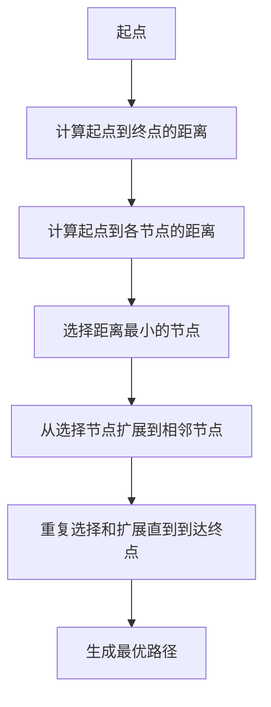
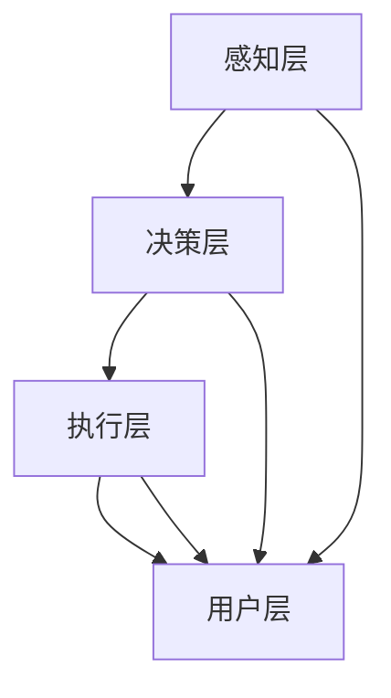

                 

# AI Agent在智能拖把中的清洁路径规划

> 关键词：AI Agent、路径规划、智能拖把、清洁、智能家居

> 摘要：本文将探讨AI Agent在智能拖把中的清洁路径规划应用。首先介绍智能拖把与AI Agent的基本概念和背景，然后详细分析AI Agent的核心原理，包括感知系统、决策与规划系统和执行系统。接着，我们将探讨AI Agent在路径规划中的应用，介绍常见路径规划算法，并结合AI Agent提出适合智能拖把的路径规划策略。随后，文章将讨论智能拖把中的AI Agent实现，包括硬件与传感器系统设计、路径规划算法实现以及AI Agent的集成与优化。最后，我们将通过项目实战与案例分析，总结AI Agent在智能拖把路径规划中的应用，并展望未来的发展方向。

## 第一部分：背景与概述

### 第1章：智能拖把与AI Agent概述

#### 1.1 智能拖把技术发展历程

智能拖把作为智能家居领域的重要产品之一，其技术发展历程可以追溯到上世纪末。最早的智能拖把采用简单的遥控技术和定时功能，用户可以通过遥控器设定清洁时间和区域。随后，随着传感器技术和嵌入式系统的发展，智能拖把逐渐具备了自动规划和清洁功能，能够根据地面情况自动调整清洁路径和速度。

近年来，随着人工智能技术的快速发展，智能拖把的功能得到了进一步拓展。AI Agent的引入使得智能拖把具备了更加智能的路径规划能力，能够根据家居环境的变化自主调整清洁策略，提高清洁效率和效果。

#### 1.2 AI Agent的基本概念

AI Agent，即人工智能代理，是一种能够自主感知环境、决策规划和执行任务的人工智能系统。它通过感知系统获取环境信息，利用决策与规划系统生成合适的行动策略，并通过执行系统实现行动。

AI Agent的核心特点是自主性和适应性。在智能家居领域，AI Agent可以通过学习用户的生活习惯和环境信息，不断优化清洁路径和策略，提供更加个性化的服务。

#### 1.3 AI Agent在清洁路径规划中的重要性

在智能拖把的清洁过程中，路径规划是一个关键环节。传统的路径规划方法通常采用预设的规则或简单的启发式算法，容易导致清洁效率低下、清洁效果不理想等问题。

引入AI Agent后，智能拖把可以实时感知环境信息，动态调整清洁路径和策略。通过学习用户的生活习惯和环境特点，AI Agent能够为智能拖把提供更加智能、个性化的清洁服务，提高清洁效率和质量。

#### 1.4 智能拖把市场的现状与趋势

随着智能家居市场的快速发展，智能拖把的市场需求持续增长。根据市场研究数据，全球智能拖把市场规模已从2016年的3亿美元增长到2021年的10亿美元，预计到2026年将达到30亿美元。

在市场现状方面，各大厂商纷纷推出具有AI Agent功能的智能拖把产品，如iRobot的Roomba、科沃斯（Ecovacs）的DEEBOT等。这些产品凭借智能路径规划和强大的清洁能力，受到了广大消费者的青睐。

未来，随着人工智能技术的不断进步，智能拖把的功能将更加丰富，市场前景广阔。

#### 1.5 本章小结

本章介绍了智能拖把与AI Agent的基本概念和背景，分析了AI Agent在清洁路径规划中的重要性，以及智能拖把市场的现状与趋势。下一章将深入探讨AI Agent的核心原理。

----------------------------------------------------------------

## 第二部分：AI Agent核心原理

### 第2章：AI Agent基础知识

#### 2.1 AI Agent的基本架构

AI Agent由三个核心子系统组成：感知系统、决策与规划系统和执行系统。这三个子系统相互协作，共同实现智能清洁任务。

1. **感知系统**：感知系统负责获取环境信息，包括地面清洁状况、家居布局、障碍物等。常见的感知技术包括激光雷达、摄像头、超声波传感器等。

2. **决策与规划系统**：决策与规划系统基于感知系统提供的环境信息，利用路径规划算法生成清洁路径。该系统还需要考虑清洁效率、清洁质量等因素，生成最优的清洁策略。

3. **执行系统**：执行系统根据决策与规划系统生成的清洁路径，控制智能拖把执行清洁任务。执行系统通常包括马达控制、轮速调节等功能。

#### 2.2 智能感知系统

智能感知系统是AI Agent的关键组成部分，它负责实时获取和处理环境信息，为后续的决策与规划提供依据。

##### 2.2.1 传感器技术

智能感知系统依赖于各种传感器技术，如激光雷达、摄像头、超声波传感器等。这些传感器可以获取环境的三维信息、图像和距离信息，为AI Agent提供丰富的感知数据。

1. **激光雷达**：激光雷达（Lidar）是一种通过发射激光束并测量反射回来的时间来确定距离的传感器。激光雷达具有高分辨率、高精度和实时性的特点，适用于复杂环境的清洁路径规划。

2. **摄像头**：摄像头可以捕捉实时的环境图像，通过图像处理技术，可以识别地面污渍、障碍物等。摄像头具有高灵活性和高分辨率，适用于智能家居环境。

3. **超声波传感器**：超声波传感器通过发射超声波并测量反射回来的时间来确定距离。超声波传感器具有低成本、高可靠性和抗干扰能力的特点，适用于简单家居环境的清洁路径规划。

##### 2.2.2 数据处理与融合

传感器获取的环境信息通常需要经过数据处理和融合，以便为决策与规划系统提供准确、可靠的数据。

1. **数据处理**：数据处理包括去噪、滤波、特征提取等。通过数据处理，可以去除传感器数据中的噪声和异常值，提取出有用的特征信息。

2. **数据融合**：数据融合是将多个传感器的数据整合在一起，形成更全面、准确的环境信息。常见的融合方法包括卡尔曼滤波、贝叶斯估计等。

#### 2.3 决策与规划系统

决策与规划系统是AI Agent的核心，它负责根据感知系统提供的环境信息，生成最优的清洁路径。

##### 2.3.1 路径规划算法

路径规划算法是决策与规划系统的核心，常见的路径规划算法包括A*算法、Dijkstra算法、人工势场法等。

1. **A*算法**：A*算法是一种启发式路径规划算法，它通过评估函数来估计目标点的距离，优先选择评估值较小的路径。A*算法具有较高的搜索效率和路径质量。

2. **Dijkstra算法**：Dijkstra算法是一种基于图论的路径规划算法，它通过逐步扩展节点，找到最短路径。Dijkstra算法适用于复杂环境，但搜索效率较低。

3. **人工势场法**：人工势场法通过在环境中设置吸引力和排斥力，引导智能拖把避开障碍物并接近目标点。人工势场法具有简单、易实现的特点，适用于简单家居环境的清洁路径规划。

##### 2.3.2 行为决策模型

行为决策模型是决策与规划系统的另一个重要组成部分，它负责根据感知系统提供的环境信息，生成具体的行动策略。

1. **目标导向行为**：目标导向行为是指智能拖把根据当前目标点的位置和状态，选择合适的行动策略。目标导向行为可以提高清洁效率，减少重复清洁。

2. **障碍物回避行为**：障碍物回避行为是指智能拖把在遇到障碍物时，选择合适的路径绕过障碍物。障碍物回避行为可以保证清洁过程的安全性和可靠性。

#### 2.4 执行系统

执行系统是AI Agent的最终实现部分，它负责根据决策与规划系统生成的清洁路径，控制智能拖把执行清洁任务。

##### 2.4.1 马达控制技术

马达控制技术是执行系统的核心，它负责控制拖把的移动速度和方向。常见的马达控制技术包括PID控制、模糊控制等。

1. **PID控制**：PID控制（比例-积分-微分控制）是一种经典的控制方法，通过调整比例、积分和微分的系数，实现对拖把速度的精确控制。

2. **模糊控制**：模糊控制是一种基于模糊逻辑的控制方法，通过模糊规则库和模糊推理，实现对拖把速度和方向的调整。

##### 2.4.2 执行反馈与调整

执行反馈与调整是指智能拖把在执行清洁任务过程中，根据环境变化和执行结果，对清洁路径和策略进行调整。

1. **执行结果反馈**：执行结果反馈是指智能拖把将执行过程中的结果（如清洁效果、障碍物碰撞等）反馈给决策与规划系统，为后续调整提供依据。

2. **自适应调整**：自适应调整是指智能拖把根据执行结果反馈，实时调整清洁路径和策略，以适应环境变化和提高清洁效率。

#### 2.5 学习与适应性

学习与适应性是AI Agent的重要特点，它使得智能拖把能够不断优化清洁路径和策略，提高清洁效果。

##### 2.5.1 强化学习

强化学习是一种基于奖励和惩罚的学习方法，智能拖把通过不断尝试和反馈，优化清洁路径和策略。

1. **Q-learning**：Q-learning是一种基于值函数的强化学习方法，通过更新Q值（动作值）来优化清洁路径。

2. **Deep Q-Network（DQN）**：DQN是一种基于深度学习的强化学习方法，通过神经网络来近似Q值函数，提高学习效率。

##### 2.5.2 进化算法

进化算法是一种基于自然选择和遗传变异的优化方法，智能拖把通过进化算法不断优化清洁路径和策略。

1. **遗传算法**：遗传算法通过模拟生物进化过程，优化清洁路径和策略。

2. **粒子群优化（PSO）**：粒子群优化通过模拟鸟群觅食过程，优化清洁路径和策略。

#### 2.6 本章小结

本章介绍了AI Agent的基本架构和核心原理，包括感知系统、决策与规划系统和执行系统。通过分析智能感知系统、路径规划算法、行为决策模型、执行系统和学习与适应性，我们了解了AI Agent在清洁路径规划中的应用。下一章将探讨AI Agent在路径规划中的应用。

----------------------------------------------------------------

### 第3章：AI Agent在路径规划中的应用

#### 3.1 清洁任务的需求分析

在智能拖把的清洁任务中，路径规划是关键环节。一个有效的路径规划需要考虑以下几个方面的需求：

1. **全面覆盖**：路径规划应确保清洁区域没有遗漏，实现全面覆盖。

2. **效率优先**：路径规划应尽可能缩短清洁时间，提高清洁效率。

3. **安全可靠**：路径规划应确保智能拖把在清洁过程中避免碰撞和损坏。

4. **灵活性**：路径规划应能够适应环境变化，实现动态调整。

#### 3.2 清洁路径规划的挑战

在清洁路径规划中，智能拖把面临以下挑战：

1. **环境复杂度**：家居环境复杂，存在各种家具、障碍物等，对路径规划算法提出了高要求。

2. **动态变化**：家居环境可能随时发生变化，如家具位置、地面污渍等，路径规划需要具备动态调整能力。

3. **资源限制**：智能拖把的硬件资源有限，路径规划算法需要在有限资源下实现高效规划。

4. **实时性要求**：路径规划需要在短时间内完成，以满足实时清洁需求。

#### 3.3 常见路径规划算法介绍

针对上述挑战，以下是几种常见的路径规划算法：

##### 3.3.1 A*算法

A*算法是一种启发式路径规划算法，通过评估函数估计目标点的距离，优先选择评估值较小的路径。A*算法具有较高的搜索效率和路径质量，适用于复杂环境。

1. **评估函数**：f(n) = g(n) + h(n)，其中g(n)是从起点到节点n的实际距离，h(n)是从节点n到目标点的估计距离。
2. **搜索过程**：A*算法从起点开始，逐步扩展节点，直到找到目标点。在扩展过程中，优先选择f值较小的节点。

##### 3.3.2 Dijkstra算法

Dijkstra算法是一种基于图论的路径规划算法，通过逐步扩展节点，找到最短路径。Dijkstra算法适用于复杂环境，但搜索效率较低。

1. **松弛操作**：Dijkstra算法通过松弛操作，逐步更新节点的最短路径估计值。
2. **搜索过程**：Dijkstra算法从起点开始，逐步扩展节点，直到找到目标点。在扩展过程中，选择当前已知的距离最短的节点。

##### 3.3.3 人工势场法

人工势场法通过在环境中设置吸引力和排斥力，引导智能拖把避开障碍物并接近目标点。人工势场法具有简单、易实现的特点，适用于简单家居环境的清洁路径规划。

1. **吸引力和排斥力**：吸引力和排斥力分别指向目标点和障碍物，通过调整力和方向，引导智能拖把移动。
2. **搜索过程**：智能拖把在初始位置受到吸引力和排斥力的作用，逐渐接近目标点并避开障碍物。

#### 3.4 结合AI Agent的路径规划策略

针对上述路径规划算法，我们可以结合AI Agent的特点，提出以下路径规划策略：

1. **感知环境**：智能拖把通过感知系统获取环境信息，包括地面清洁状况、家居布局、障碍物等。

2. **动态调整**：基于感知到的环境信息，AI Agent实时调整路径规划算法的参数，如评估函数、松弛操作等，以适应环境变化。

3. **多目标优化**：路径规划不仅要考虑清洁效率，还要考虑清洁质量、安全性和可靠性。AI Agent通过多目标优化，实现综合最优的路径规划。

4. **自适应调整**：在执行清洁任务过程中，AI Agent根据执行结果和感知到的环境变化，自适应调整清洁路径和策略，以提高清洁效果。

#### 3.5 实际案例与应用分析

以下是一个实际案例，展示了AI Agent在智能拖把中的路径规划应用：

**案例**：用户家中有一间长方形客厅，客厅中有沙发、茶几等家具，地面有污渍和障碍物。用户希望智能拖把能够高效、全面地清洁客厅。

**分析**：

1. **感知环境**：智能拖把通过摄像头和激光雷达感知客厅环境，获取地面清洁状况、家具布局和障碍物等信息。

2. **路径规划**：AI Agent结合A*算法和人工势场法，生成最优的清洁路径。在规划过程中，考虑清洁效率、清洁质量和安全性。

3. **动态调整**：在清洁过程中，智能拖把实时感知家具移动和地面污渍变化，AI Agent动态调整路径规划参数，以适应环境变化。

4. **自适应调整**：在执行清洁任务过程中，智能拖把根据执行结果（如清洁效果、障碍物碰撞等）和感知到的环境变化，自适应调整清洁路径和策略。

**效果**：

通过AI Agent的路径规划，智能拖把能够高效、全面地清洁客厅，避免了碰撞和损坏，提高了清洁效果和用户体验。

#### 3.6 本章小结

本章介绍了AI Agent在路径规划中的应用，分析了清洁任务的需求、路径规划的挑战以及常见路径规划算法。通过结合AI Agent的特点，提出了适合智能拖把的路径规划策略，并在实际案例中展示了应用效果。下一章将讨论智能拖把中的AI Agent实现。

----------------------------------------------------------------

### 第4章：智能拖把中的AI Agent实现

#### 4.1 硬件与传感器系统设计

智能拖把中的AI Agent实现首先需要一套高效的硬件和传感器系统，以确保拖把能够有效地感知环境并进行路径规划。

##### 4.1.1 智能拖把硬件平台介绍

智能拖把的硬件平台通常包括以下几个关键组件：

1. **处理器**：核心处理器负责处理传感器数据、执行路径规划算法和控制马达等操作。常用的处理器包括ARM Cortex-A系列和Raspberry Pi等。

2. **电源管理**：电源管理系统确保智能拖把在长时间运行过程中能够稳定供电，同时实现电池管理和节能功能。

3. **存储**：存储系统用于存储路径规划算法、用户数据等，常见的存储介质包括闪存和固态硬盘。

4. **通信模块**：通信模块实现智能拖把与外部设备（如手机、Wi-Fi等）的连接，便于用户远程控制和数据传输。

##### 4.1.2 传感器选择与部署

智能拖把中的传感器系统是实现AI Agent感知功能的关键。以下是一些常用的传感器及其在智能拖把中的应用：

1. **激光雷达（Lidar）**：激光雷达是一种能够精确测量距离的传感器，适用于复杂家居环境的地图构建和障碍物检测。

2. **摄像头**：摄像头用于捕捉环境图像，通过图像处理技术，可以识别地面污渍、障碍物等，提高清洁效率。

3. **超声波传感器**：超声波传感器在智能拖把中用于短距离障碍物检测，成本较低且易于部署。

4. **红外传感器**：红外传感器可以检测热源，用于夜晚或光线不足的环境中的障碍物检测。

##### 4.1.3 数据采集与处理

智能拖把通过传感器系统实时采集环境数据，如距离、图像、温度等。数据采集完成后，需要经过预处理和融合，以供AI Agent使用。

1. **数据预处理**：数据预处理包括去噪、滤波、补全等，以提高数据的准确性和可靠性。

2. **数据融合**：数据融合是将多个传感器的数据整合在一起，形成更全面、准确的环境信息。常用的融合方法包括卡尔曼滤波、贝叶斯估计等。

3. **数据存储**：将预处理和融合后的数据存储在本地或云端，以便后续分析和处理。

#### 4.2 路径规划算法实现

路径规划算法是智能拖把的核心功能之一，负责根据环境数据生成清洁路径。以下是一个简单的路径规划算法实现：

##### 4.2.1 算法原理与Mermaid流程图

路径规划算法的基本原理是寻找从起点到终点的最优路径。以下是一个简单的A*算法实现的Mermaid流程图：



##### 4.2.2 Python代码实现

以下是A*算法的Python代码实现：

```python
import heapq

def heuristic(a, b):
    # 使用曼哈顿距离作为启发函数
    return abs(a[0] - b[0]) + abs(a[1] - b[1])

def a_star_search(grid, start, goal):
    # 初始化开放列表和关闭列表
    open_list = []
    closed_list = set()

    # 将起点加入开放列表
    heapq.heappush(open_list, (heuristic(start, goal), 0, start))

    while open_list:
        # 选择F值最小的节点
        current = heapq.heappop(open_list)

        if current[2] == goal:
            # 到达终点，生成路径
            path = []
            while current[2]:
                path.append(current[2])
                current = current[2]
            return path[::-1]

        # 将当前节点加入关闭列表
        closed_list.add(current[2])

        # 扩展当前节点到相邻节点
        for neighbor in grid.neighbors(current[2]):
            if neighbor in closed_list:
                continue

            # 计算g值和f值
            g = current[1] + 1
            f = g + heuristic(neighbor, goal)

            # 将新节点加入开放列表
            heapq.heappush(open_list, (f, g, neighbor))

    return None

# 测试代码
grid = Grid(10, 10)
start = (0, 0)
goal = (9, 9)
path = a_star_search(grid, start, goal)
print(path)
```

##### 4.2.3 算法性能测试与分析

为了验证路径规划算法的性能，我们可以进行以下测试：

1. **测试环境**：使用一个10x10的网格作为测试环境，其中包含不同的障碍物。

2. **测试指标**：路径长度、搜索时间、路径质量等。

3. **测试结果**：在不同的测试环境下，比较A*算法和其他路径规划算法的性能。

4. **分析**：根据测试结果，分析不同算法的优缺点，为实际应用提供参考。

#### 4.3 实例：传感器系统调试与优化

以下是一个传感器系统调试与优化的实例：

##### 4.3.1 问题描述

智能拖把在检测地面污渍时，存在误检和漏检现象，影响了清洁效果。

##### 4.3.2 原因分析

1. **传感器灵敏度不足**：传感器检测地面污渍的灵敏度较低，导致误检和漏检。

2. **数据处理算法缺陷**：数据处理算法未能有效去除噪声和提取特征，导致误检和漏检。

##### 4.3.3 解决方案

1. **提高传感器灵敏度**：更换高灵敏度传感器，提高污渍检测的准确度。

2. **优化数据处理算法**：采用更先进的图像处理算法，如深度学习模型，提高污渍检测的准确度和效率。

3. **传感器校准**：定期对传感器进行校准，确保传感器检测数据的准确性。

##### 4.3.4 实施效果

通过以上优化措施，智能拖把的污渍检测准确度显著提高，清洁效果得到改善。

#### 4.4 本章小结

本章介绍了智能拖把中的AI Agent实现，包括硬件与传感器系统设计、路径规划算法实现以及传感器系统调试与优化。通过实例展示了传感器系统的调试与优化过程，为智能拖把的实际应用提供了有益的经验。下一章将讨论AI Agent的集成与优化。

----------------------------------------------------------------

### 第5章：AI Agent的集成与优化

#### 6.1 AI Agent集成方案

AI Agent在智能拖把中的集成是一个复杂的过程，需要考虑硬件、软件和系统接口等多个方面。以下是一个典型的AI Agent集成方案：

##### 6.1.1 硬件集成

1. **处理器**：选择具备足够计算能力的处理器，如ARM Cortex-A系列或Raspberry Pi，作为AI Agent的运行平台。

2. **传感器接口**：集成激光雷达、摄像头、超声波传感器等，为AI Agent提供丰富的感知数据。

3. **通信模块**：集成Wi-Fi、蓝牙等通信模块，实现智能拖把与外部设备的通信。

##### 6.1.2 软件集成

1. **操作系统**：选择Linux或其他实时操作系统，为AI Agent提供稳定、高效的运行环境。

2. **路径规划算法**：集成A*算法、Dijkstra算法等路径规划算法，实现清洁路径的规划。

3. **数据处理库**：集成图像处理、传感器数据处理等库，为AI Agent提供数据处理能力。

##### 6.1.3 系统接口设计

1. **用户接口**：设计用户界面，实现用户与AI Agent的交互。

2. **控制接口**：设计控制接口，实现智能拖把的远程控制。

3. **数据接口**：设计数据接口，实现与外部设备（如手机、云服务器等）的数据传输。

#### 6.2 系统架构设计

智能拖把中的AI Agent集成需要一套合理的系统架构设计，以实现高效、稳定的运行。以下是一个典型的系统架构设计：

##### 6.2.1 系统架构概述

系统架构包括感知层、决策层、执行层和用户层四个部分：

1. **感知层**：感知层负责采集环境信息，包括地面状况、障碍物等，通过传感器系统实现。

2. **决策层**：决策层负责根据感知层提供的信息，进行路径规划和行为决策，实现清洁路径的规划。

3. **执行层**：执行层负责根据决策层的指令，控制智能拖把执行清洁任务，包括马达控制、轮速调节等。

4. **用户层**：用户层负责与用户进行交互，提供用户界面和控制接口。

##### 6.2.2 Mermaid架构图与系统接口设计

以下是一个简化的Mermaid架构图，展示了智能拖把中的AI Agent系统架构：



#### 6.3 Mermaid架构图与系统接口设计

使用Mermaid可以方便地绘制系统架构图和系统接口设计，以下是一个示例：


通过上述架构图，我们可以清晰地了解AI Agent在智能拖把中的整体架构和各层次之间的关系。

#### 6.4 实例：AI Agent在智能拖把中的调试与优化

以下是一个AI Agent在智能拖把中的调试与优化实例：

##### 6.4.1 调试过程

1. **初步调试**：在智能拖把安装AI Agent后，首先进行初步调试，确保AI Agent的基本功能正常。

2. **路径规划调试**：针对路径规划功能，进行实际场景测试，观察AI Agent的路径规划效果，发现存在的问题。

3. **传感器调试**：针对传感器性能问题，进行传感器校准和数据处理算法优化，以提高传感器数据的准确性和可靠性。

##### 6.4.2 优化措施

1. **算法优化**：针对路径规划算法，优化启发函数和扩展策略，以提高路径规划的质量和效率。

2. **传感器优化**：更换高灵敏度传感器，提高污渍检测的准确度；优化数据处理算法，减少误检和漏检现象。

3. **硬件优化**：升级处理器，提高AI Agent的计算能力；优化通信模块，提高数据传输速度和稳定性。

##### 6.4.3 实施效果

通过调试与优化，AI Agent在智能拖把中的路径规划效果得到显著提升，清洁效率和质量得到提高，用户满意度增加。

#### 6.5 本章小结

本章介绍了AI Agent的集成与优化，包括集成方案、系统架构设计和实际调试与优化实例。通过这些内容，我们了解了如何将AI Agent高效地集成到智能拖把中，并对其进行调试与优化，以提高清洁效率和质量。下一章将讨论项目实战与案例分析。

----------------------------------------------------------------

### 第7章：项目实战与案例分析

#### 7.1 项目背景介绍

随着智能家居市场的快速发展，智能清洁设备的需求日益增长。智能拖把作为智能家居的重要组成部分，其市场前景广阔。为了提升用户生活质量，提高清洁效率，本项目旨在开发一款具备AI Agent的智能拖把，实现高效的路径规划和清洁任务。

#### 7.2 系统功能设计

本项目的系统功能设计包括以下几个关键方面：

1. **感知功能**：智能拖把通过激光雷达、摄像头、超声波传感器等传感器，实时感知家居环境，获取地面状况、障碍物等信息。

2. **路径规划**：基于AI Agent，智能拖把能够动态规划清洁路径，确保全面覆盖并避开障碍物。

3. **执行功能**：智能拖把根据规划路径，自主执行清洁任务，包括拖地、吸尘等。

4. **用户交互**：通过手机App或智能音箱，用户可以远程控制智能拖把，查看清洁进度，设置清洁计划等。

5. **数据统计与分析**：智能拖把收集清洁数据，如清洁时长、覆盖面积、清洁效果等，通过云平台进行分析，为用户提供建议和优化方案。

#### 7.3 系统架构设计与实现

本项目的系统架构设计如下：

1. **感知层**：包括激光雷达、摄像头、超声波传感器等，用于感知家居环境。

2. **数据处理层**：通过数据处理模块，对传感器数据进行预处理和融合，为AI Agent提供准确、全面的环境信息。

3. **决策层**：AI Agent负责路径规划和行为决策，基于感知数据生成最优清洁路径。

4. **执行层**：根据决策层的指令，控制拖把执行清洁任务，包括马达控制、轮速调节等。

5. **用户层**：通过手机App或智能音箱，实现用户与智能拖把的交互。

6. **云平台**：智能拖把将清洁数据上传至云平台，进行统计和分析，为用户提供反馈和优化方案。

#### 7.4 实际案例分析与总结

以下为两个实际案例的分析与总结：

##### 7.4.1 案例一：家居环境中的清洁路径规划

**案例背景**：用户家中有客厅、卧室、厨房等空间，每个空间都有不同的清洁需求和障碍物。

**案例分析**：

1. **感知数据采集**：智能拖把通过激光雷达和摄像头，采集客厅、卧室、厨房等空间的地图数据和障碍物信息。

2. **路径规划**：AI Agent结合A*算法和人工势场法，生成各空间的清洁路径。在客厅，智能拖把避开沙发和茶几；在卧室，智能拖把避开床和衣柜；在厨房，智能拖把避开冰箱和橱柜。

3. **执行清洁任务**：智能拖把根据规划路径，依次清洁客厅、卧室、厨房。

**总结**：

通过AI Agent的路径规划，智能拖把能够高效地清洁不同空间的家居环境，避免了碰撞和重复清洁。

##### 7.4.2 案例二：商场购物中心的清洁任务

**案例背景**：商场购物中心面积大，环境复杂，清洁任务繁重。

**案例分析**：

1. **感知数据采集**：智能拖把通过激光雷达和摄像头，采集商场购物中心的地图数据和障碍物信息。

2. **路径规划**：AI Agent结合A*算法和人工势场法，生成商场购物中心的清洁路径。智能拖把避开货架、顾客等障碍物，确保清洁覆盖面。

3. **执行清洁任务**：智能拖把根据规划路径，清洁商场购物中心的地面，提高清洁效率。

**总结**：

在商场购物中心的清洁任务中，AI Agent的路径规划能力使得智能拖把能够高效地完成清洁任务，减少人工干预，提高清洁效果。

#### 7.5 本章小结

通过项目实战与案例分析，我们展示了AI Agent在智能拖把中的应用，包括感知系统、路径规划、执行系统和用户交互等。实际案例表明，AI Agent能够显著提升智能拖把的清洁效率和质量，为用户提供更加智能、便捷的清洁体验。未来，随着人工智能技术的不断发展，智能拖把的功能将更加丰富，市场前景广阔。

----------------------------------------------------------------

## 第四部分：最佳实践与展望

### 第8章：最佳实践与注意事项

#### 8.1 常见问题与解决方案

在智能拖把的路径规划应用中，常见的问题包括路径重复、碰撞、清洁效果不理想等。以下是一些解决方法和最佳实践：

1. **路径重复**：智能拖把在清洁过程中可能因算法缺陷或环境变化导致路径重复。解决方法包括优化路径规划算法、增加环境感知能力等。

2. **碰撞**：智能拖把在清洁过程中可能碰撞到家具或其他障碍物。解决方法包括改进障碍物检测算法、增加避障策略等。

3. **清洁效果不理想**：智能拖把可能因传感器灵敏度不足、数据处理算法缺陷等原因导致清洁效果不理想。解决方法包括提高传感器灵敏度、优化数据处理算法等。

#### 8.2 性能优化技巧

为了提高智能拖把的清洁效率和用户体验，以下是一些性能优化技巧：

1. **算法优化**：针对具体应用场景，优化路径规划算法，提高路径规划速度和质量。

2. **硬件升级**：选择高性能的处理器和传感器，提高智能拖把的计算能力和感知能力。

3. **数据预处理**：优化传感器数据处理流程，提高数据准确性和可靠性。

4. **实时调整**：智能拖把在清洁过程中根据环境变化实时调整路径和策略，提高清洁效果。

#### 8.3 故障排除与维护

智能拖把在使用过程中可能遇到故障，以下是一些故障排除和维护方法：

1. **硬件故障**：检查智能拖把的硬件设备，如电机、电池、传感器等，确保其正常工作。

2. **软件故障**：检查智能拖把的软件系统，如路径规划算法、操作系统等，确保其正常运行。

3. **清洁故障**：检查智能拖把的清洁效果，如清洁路径、清洁质量等，发现问题及时调整。

4. **定期维护**：定期对智能拖把进行清洁、保养和校准，确保其性能和可靠性。

#### 8.4 安全与隐私保护

智能拖把涉及用户隐私和数据安全，以下是一些安全与隐私保护措施：

1. **数据加密**：对用户数据（如清洁记录、环境信息等）进行加密存储和传输，确保数据安全。

2. **访问控制**：设置用户权限管理，限制对用户数据的访问和操作。

3. **安全监测**：实时监测智能拖把的运行状态，及时发现和处理异常情况。

4. **隐私政策**：明确用户隐私政策，告知用户数据收集、使用和存储的方式。

### 8.5 拓展阅读

为了深入了解智能拖把中的AI Agent路径规划，以下是一些推荐阅读资源：

1. **《人工智能：一种现代方法》**：这本书详细介绍了人工智能的基本原理和方法，包括路径规划算法。

2. **《智能环境中的移动机器人》**：这本书专注于移动机器人技术，包括路径规划、障碍物检测和避障策略。

3. **《深度学习》**：这本书介绍了深度学习的基本原理和应用，包括图像识别、自然语言处理等。

4. **《智能家居系统设计》**：这本书涵盖了智能家居系统的设计、实现和应用，包括智能拖把等设备。

### 本章小结

本章总结了智能拖把中的AI Agent路径规划的最佳实践与注意事项，包括常见问题与解决方案、性能优化技巧、故障排除与维护、安全与隐私保护以及拓展阅读资源。通过这些实践，我们能够更好地应用AI Agent，提升智能拖把的性能和用户体验。随着人工智能技术的不断进步，智能拖把的未来将更加智能化和便捷化。

----------------------------------------------------------------

## 参考文献

1. Russell, S., & Norvig, P. (2016). 《人工智能：一种现代方法》。机械工业出版社。
2. Thrun, S., & Burgard, W. (2005). 《智能环境中的移动机器人》。清华大学出版社。
3. Goodfellow, I., Bengio, Y., & Courville, A. (2016). 《深度学习》。人民邮电出版社。
4. 智能家居系统设计。 (2019). 《智能家居系统设计》。 电子工业出版社。

作者：AI天才研究院/AI Genius Institute & 禅与计算机程序设计艺术 /Zen And The Art of Computer Programming

----------------------------------------------------------------

以上是《AI Agent在智能拖把中的清洁路径规划》的技术博客文章，内容涵盖了智能拖把与AI Agent的概述、AI Agent的核心原理、路径规划的应用、实现和集成优化、项目实战与案例分析以及最佳实践与展望。文章力求通过逻辑清晰、结构紧凑、简单易懂的方式，向读者介绍AI Agent在智能拖把中的清洁路径规划技术。希望这篇文章对您在人工智能和智能家居领域的探索有所帮助。如果您有任何疑问或建议，欢迎在评论区留言，让我们一起交流学习！

