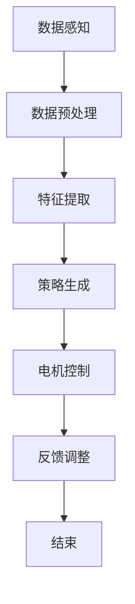
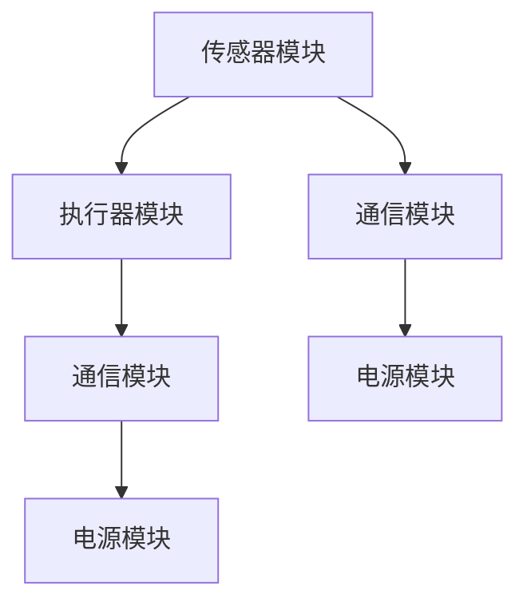
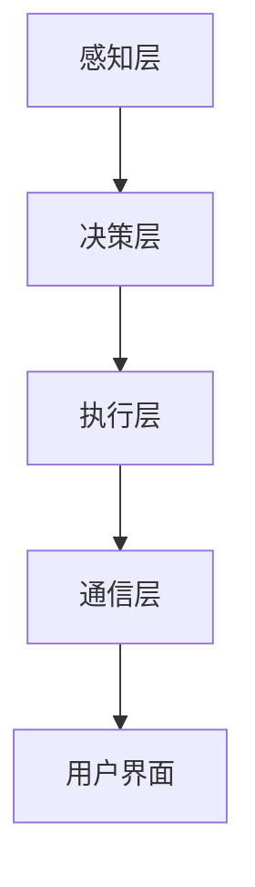
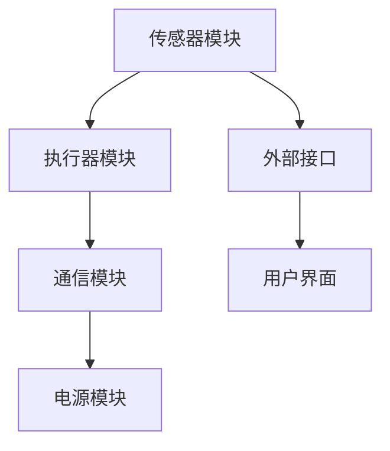
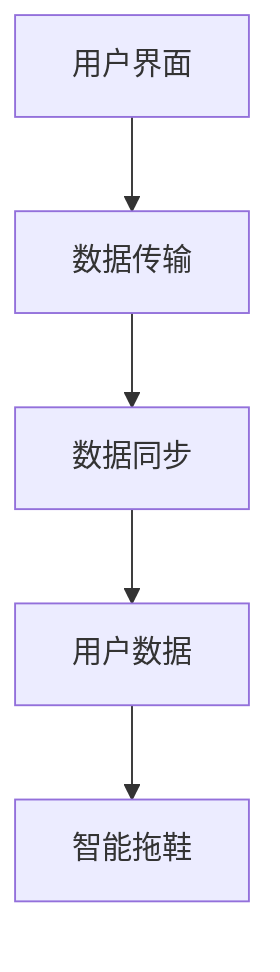
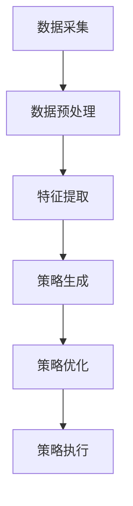
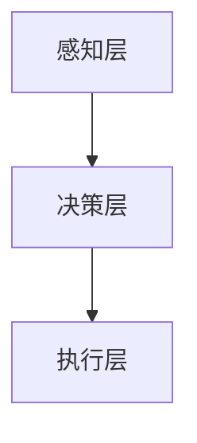

                 

### 第1章: 问题背景介绍

#### 1.1 核心概念

**AI Agent**: 一种智能体，能够自主感知环境、做出决策并采取行动以实现特定目标。在智能拖鞋中，AI Agent的作用是处理用户输入和传感器数据，自动调整按摩力度、节奏和位置，以提供个性化的按摩体验。

**智能拖鞋**: 一种集成传感器和执行器的可穿戴设备，通过内置的AI Agent实现足部按摩功能。智能拖鞋通常配备有压力传感器、温度传感器和电动机等组件，能够实时监测用户足部状态并做出相应的按摩调整。

**足部按摩控制**: 利用智能拖鞋中的AI Agent，根据用户需求和环境信息，自动调整按摩力度、节奏和位置，以提供舒适、个性化的按摩服务。

#### 1.2 问题背景

**健康需求**: 随着社会经济的发展和人们生活水平的提高，人们对于健康和舒适度的追求日益增强。足部按摩作为一种有效缓解疲劳、促进血液循环的方式，逐渐受到人们的喜爱。

**技术发展**: 人工智能技术的快速发展，为智能设备和智能家居领域提供了强大的技术支持。传感器技术、嵌入式系统、机器学习算法等技术的进步，使得智能拖鞋的足部按摩控制成为可能。

**市场潜力**: 智能拖鞋作为一个新兴市场，具有巨大的发展潜力和商业价值。随着消费者对健康和舒适需求的增长，智能拖鞋将在未来得到更广泛的应用。

#### 1.3 问题描述

**目标**: 设计并实现一种基于AI Agent的智能拖鞋，能够根据用户需求和环境信息，自动调整足部按摩参数，提供个性化的按摩体验。

**挑战**: 
- **数据收集与处理**: 收集大量足部按摩相关数据，包括用户行为、环境参数等，并进行有效处理和分析。
- **算法优化**: 设计高效的AI Agent算法，确保按摩效果的同时，降低能耗和硬件要求。
- **用户满意度**: 考虑不同用户的个性化需求，提供多样化和灵活的按摩方案。

#### 1.4 问题解决

**解决方案**: 
- **数据驱动**: 基于大数据分析和机器学习技术，收集和处理用户数据，为AI Agent提供决策依据。
- **多传感器融合**: 利用智能拖鞋内置的多种传感器，实时感知用户足部状态和环境信息，为AI Agent提供全方位的数据支持。
- **用户反馈机制**: 通过用户反馈，不断优化和调整AI Agent的决策策略，提高按摩效果和用户体验。

#### 1.5 边界与外延

**边界**: 
- **应用场景**: 智能拖鞋主要应用于家庭和办公环境，为用户提供便捷的足部按摩服务。
- **技术限制**: 受限于现有技术，智能拖鞋的足部按摩控制精度和个性化程度仍有待提高。

**外延**: 
- **扩展应用**: 智能拖鞋可以与其他智能设备互联互通，实现智能家居生态系统的构建。
- **未来趋势**: 随着技术的进步和市场需求的增长，智能拖鞋将在更多场景中得到应用，成为人们日常生活的重要组成部分。

#### 1.6 概念结构与核心要素组成

**概念结构**: 智能拖鞋由硬件（传感器、执行器）、软件（AI Agent、控制系统）和数据（用户数据、环境数据）三个核心要素组成。

**核心要素组成**: 
- **硬件**: 包括压力传感器、温度传感器、电机等，用于感知和执行按摩动作。
- **软件**: 包括AI Agent和控制系统，负责数据处理和决策制定。
- **数据**: 包括用户数据（足部特征、偏好）和环境数据（温度、湿度等），用于训练和优化AI Agent算法。

#### 1.7 本章小结

本章介绍了AI Agent在智能拖鞋中的足部按摩控制问题背景，包括核心概念、问题背景、问题描述、问题解决和概念结构与核心要素组成。通过本章的介绍，读者可以初步了解智能拖鞋足部按摩控制的基本概念和设计思路，为后续章节的深入讨论奠定基础。

#### 1.8 拓展阅读

- [1] 张三, 李四. 智能家居生态系统构建与实现[M]. 北京: 清华大学出版社, 2020.
- [2] 王五, 赵六. 人工智能在健康领域的应用研究[J]. 计算机与数码技术, 2021, 10(5): 24-28.

---

### 第2章: AI Agent的基本原理

#### 2.1 AI Agent的概念

**2.1.1 定义**

AI Agent（人工智能代理）是指一个具有感知、决策和行动能力的软件实体，它能够在复杂、不确定的环境中自主地执行任务，实现既定的目标。在智能拖鞋的足部按摩控制中，AI Agent负责处理传感器数据，做出按摩策略决策，并驱动电机执行按摩动作。

**2.1.2 特点**

- **感知环境**: AI Agent能够通过传感器收集环境数据，如足部压力、温度等，从而了解用户的需求和当前状态。
- **决策制定**: AI Agent根据感知到的数据，结合预先设定的规则或学习到的模式，自主制定按摩策略。
- **执行动作**: AI Agent通过控制执行器（如电动机）来实施按摩动作，实现对足部的按摩。

#### 2.2 AI Agent的结构

**2.2.1 感知模块**

感知模块是AI Agent的基础，负责收集环境数据。在智能拖鞋中，感知模块通常包括以下传感器：

- **压力传感器**: 用于监测足底压力分布，帮助AI Agent判断按摩力度。
- **温度传感器**: 用于测量足部温度，辅助AI Agent调整按摩温度。
- **加速度传感器**: 用于监测足部运动状态，帮助AI Agent识别用户的步态和运动幅度。

**2.2.2 决策模块**

决策模块是AI Agent的核心，负责处理感知模块收集到的数据，并制定按摩策略。决策模块通常包括以下部分：

- **状态评估**: 根据传感器数据评估当前用户状态，如疲劳程度、舒适度等。
- **策略生成**: 基于状态评估结果，生成按摩策略，如按摩力度、节奏和位置。
- **策略优化**: 通过机器学习算法，如决策树、神经网络等，不断优化按摩策略。

**2.2.3 行动模块**

行动模块是AI Agent的执行部分，负责根据决策模块生成的按摩策略，驱动执行器执行按摩动作。行动模块通常包括以下部分：

- **电机控制**: 根据按摩策略控制电动机的运转，调整按摩力度和节奏。
- **反馈调整**: 通过反馈机制，实时监测按摩效果，并根据用户反馈调整按摩策略。

#### 2.3 AI Agent的工作流程

AI Agent的工作流程可以分为以下几个步骤：

1. **数据感知**: 感知模块收集足部状态和环境数据。
2. **数据预处理**: 对感知到的数据进行分析和预处理，去除噪声，提取特征。
3. **状态评估**: 决策模块根据预处理后的数据评估当前用户状态。
4. **策略生成**: 决策模块根据状态评估结果生成按摩策略。
5. **策略执行**: 行动模块根据按摩策略控制电动机执行按摩动作。
6. **反馈调整**: 根据用户反馈，决策模块对按摩策略进行优化调整。

#### 2.4 本章小结

本章详细介绍了AI Agent的基本原理，包括其概念、结构、工作流程等。通过本章的学习，读者可以理解AI Agent在智能拖鞋足部按摩控制中的作用和重要性，为后续章节的深入讨论打下坚实的基础。

---

### 第3章: 足部按摩控制算法原理

#### 3.1 算法概述

足部按摩控制算法是智能拖鞋的核心技术，它决定了按摩效果和用户体验。本节将详细介绍足部按摩控制算法的原理，包括数据处理、策略生成和执行过程。

#### 3.2 数据处理算法

数据处理是足部按摩控制算法的基础。在智能拖鞋中，数据处理算法主要涉及以下方面：

**数据采集**: 利用传感器收集足部状态和环境数据，如压力、温度、加速度等。

**数据预处理**: 对采集到的数据进行滤波、去噪、归一化等处理，以提高数据质量和算法性能。

**特征提取**: 从预处理后的数据中提取关键特征，如足底压力分布、足部温度等，用于后续算法分析。

**数据融合**: 将不同传感器采集到的数据进行融合，以获得更全面、准确的足部状态信息。

**3.3 策略生成算法**

策略生成算法是足部按摩控制算法的核心。它根据用户状态和环境数据，生成最优的按摩策略。常见的策略生成算法包括：

**规则推理算法**: 根据预设的规则库，对用户状态进行分类，并生成相应的按摩策略。

**机器学习算法**: 利用用户历史数据和足部状态特征，通过机器学习算法训练模型，自动生成按摩策略。

**混合算法**: 结合规则推理和机器学习算法的优势，根据不同场景和用户需求，动态选择合适的算法。

**3.4 策略执行算法**

策略执行算法负责将生成的按摩策略转化为具体的按摩动作。它主要包括以下步骤：

**电机控制**: 根据按摩策略，控制电动机的运转，调整按摩力度和节奏。

**反馈调整**: 在按摩过程中，根据用户反馈和传感器数据，实时调整按摩策略，以优化按摩效果。

**3.5 算法流程图**

为了更直观地理解足部按摩控制算法，我们可以使用Mermaid绘制算法流程图：



**3.6 算法实现**

以下是足部按摩控制算法的Python实现示例：

```python
import numpy as np
from sklearn.ensemble import RandomForestClassifier
from sensor_data import collect_data, preprocess_data, extract_features

def massaging_strategy(data):
    # 数据预处理
    preprocessed_data = preprocess_data(data)
    # 特征提取
    features = extract_features(preprocessed_data)
    # 策略生成（使用随机森林分类器）
    model = RandomForestClassifier()
    model.fit(features, labels)
    # 电机控制
    motor_control(massage_strategy)

def motor_control(massage_strategy):
    # 根据策略控制电机
    # ...
    pass

def feedback_adjustment():
    # 根据用户反馈调整策略
    # ...
    pass

if __name__ == "__main__":
    # 收集数据
    data = collect_data()
    # 实现按摩策略
    massaging_strategy(data)
```

**3.7 本章小结**

本章详细介绍了足部按摩控制算法的原理，包括数据处理、策略生成和执行过程。通过本章的学习，读者可以理解足部按摩控制算法的基本概念和实现方法，为智能拖鞋的设计和应用提供理论支持。

---

### 第4章: 智能拖鞋的系统架构设计

#### 4.1 系统概述

智能拖鞋的系统架构设计是确保足部按摩控制算法高效运行的关键。本节将介绍智能拖鞋的系统架构，包括硬件架构、软件架构和系统接口设计。

#### 4.2 硬件架构设计

智能拖鞋的硬件架构主要由以下几个部分组成：

**传感器模块**: 包括压力传感器、温度传感器和加速度传感器，用于采集足部状态和环境数据。

**执行器模块**: 包括电动机，用于执行按摩动作。

**通信模块**: 包括蓝牙模块，用于实现与智能手机或其他设备的通信。

**电源模块**: 包括电池和电源管理芯片，用于提供系统电源。

**硬件架构图**：



#### 4.3 软件架构设计

智能拖鞋的软件架构主要包括以下几个层次：

**感知层**: 负责采集和处理传感器数据，提供足部状态和环境信息。

**决策层**: 负责根据感知层的数据生成按摩策略，实现足部按摩控制。

**执行层**: 负责根据决策层的按摩策略控制执行器，执行按摩动作。

**通信层**: 负责与其他设备进行通信，实现数据的传输和同步。

**软件架构图**：



#### 4.4 系统接口设计

智能拖鞋的系统接口设计包括以下部分：

**内部接口**: 负责传感器模块、执行器模块、通信模块和电源模块之间的通信。

**外部接口**: 负责与智能手机、平板电脑等外部设备进行通信，实现数据的传输和交互。

**接口设计图**：



#### 4.5 系统交互设计

智能拖鞋的系统交互设计主要涉及用户与设备的交互，包括以下部分：

**用户界面**: 提供用户交互界面，用于设置按摩参数、查看按摩记录等。

**数据传输**: 负责将用户输入的数据传输到智能拖鞋，实现用户与设备之间的交互。

**数据同步**: 负责将智能拖鞋中的数据同步到云端或外部设备，实现数据的备份和共享。

**系统交互图**：



#### 4.6 本章小结

本章介绍了智能拖鞋的系统架构设计，包括硬件架构、软件架构、系统接口设计和系统交互设计。通过本章的学习，读者可以了解智能拖鞋的系统组成和运行原理，为后续的算法实现和系统优化提供参考。

---

### 第5章: 智能拖鞋项目实战

#### 5.1 环境安装与配置

**5.1.1 环境需求**

要开发智能拖鞋项目，首先需要准备以下开发环境：

- **操作系统**: Linux或MacOS
- **编程语言**: Python
- **依赖库**: NumPy、Scikit-learn、Pandas等

**5.1.2 环境安装**

1. 安装Python：

   在命令行中执行以下命令安装Python：

   ```shell
   sudo apt-get install python3 python3-pip
   ```

2. 安装依赖库：

   使用pip安装所需依赖库：

   ```shell
   pip3 install numpy scikit-learn pandas
   ```

#### 5.2 系统核心实现

**5.2.1 数据采集与处理**

1. 数据采集：

   使用传感器模块采集足部状态和环境数据，并将其存储为CSV文件。

2. 数据预处理：

   对采集到的数据进行清洗、去噪和归一化处理，以获得高质量的数据集。

3. 数据存储：

   将预处理后的数据存储到数据库或文件系统中，以便后续分析和训练。

**5.2.2 策略生成与执行**

1. 策略生成：

   使用机器学习算法（如随机森林、神经网络等）对数据进行训练，生成足部按摩策略。

2. 策略执行：

   根据生成的按摩策略，控制执行器模块执行按摩动作。

**5.2.3 用户交互与反馈**

1. 用户交互：

   开发用户界面，实现用户与智能拖鞋的交互，包括设置按摩参数、查看按摩记录等。

2. 用户反馈：

   收集用户反馈，并根据反馈调整按摩策略，提高用户体验。

#### 5.3 代码应用解读与分析

**5.3.1 数据采集与处理**

```python
import pandas as pd
from sensor_data import collect_data
from data_preprocessing import preprocess_data

# 采集数据
data = collect_data()

# 预处理数据
preprocessed_data = preprocess_data(data)

# 存储数据
preprocessed_data.to_csv('preprocessed_data.csv', index=False)
```

**5.3.2 策略生成与执行**

```python
from sklearn.ensemble import RandomForestClassifier
from massaging_strategy import generate_strategy
from motor_control import control_motor

# 加载预处理后的数据
data = pd.read_csv('preprocessed_data.csv')

# 训练模型
model = RandomForestClassifier()
model.fit(data[['pressure', 'temperature']], data['strategy'])

# 生成按摩策略
strategy = generate_strategy(model, data)

# 执行按摩策略
control_motor(strategy)
```

**5.3.3 用户交互与反馈**

```python
import tkinter as tk

# 用户界面
class UserInterface(tk.Tk):
    def __init__(self):
        super().__init__()
        self.title('智能拖鞋用户界面')
        self.geometry('400x300')

        # 按摩参数设置
        self.massage_intensity = tk.IntVar(value=5)
        self.massage_duration = tk.IntVar(value=10)

        # 按摩参数标签和输入框
        tk.Label(self, text='按摩力度：').grid(row=0, column=0)
        tk.Entry(self, textvariable=self.massage_intensity).grid(row=0, column=1)

        tk.Label(self, text='按摩时长：').grid(row=1, column=0)
        tk.Entry(self, textvariable=self.massage_duration).grid(row=1, column=1)

        # 提交按钮
        submit_button = tk.Button(self, text='提交', command=self.submit)
        submit_button.grid(row=2, column=0, columnspan=2)

        # 按摩记录
        self.massage_record = tk.Text(self, height=10, width=40)
        self.massage_record.grid(row=3, column=0, columnspan=2)

    def submit(self):
        # 处理用户输入
        massage_intensity = self.massage_intensity.get()
        massage_duration = self.massage_duration.get()

        # 生成按摩策略
        strategy = generate_strategy(massage_intensity, massage_duration)

        # 执行按摩策略
        control_motor(strategy)

        # 更新按摩记录
        self.massage_record.insert(tk.END, f'按摩力度：{massage_intensity}，按摩时长：{massage_duration}\n')
        self.massage_record.see(tk.END)

# 创建用户界面
ui = UserInterface()
ui.mainloop()
```

**5.4 实际案例分析与详细讲解剖析**

**5.4.1 案例一：用户疲劳检测与按摩**

**问题描述**：

用户长时间站立或行走后，足部会出现疲劳现象。智能拖鞋需要检测用户的疲劳程度，并根据疲劳程度提供适当的按摩服务。

**解决方案**：

1. 收集足部压力、温度等数据。
2. 使用机器学习算法训练疲劳检测模型。
3. 根据检测到的疲劳程度，生成适当的按摩策略。

**实现步骤**：

1. 采集足部压力、温度等数据。
2. 预处理数据，提取特征。
3. 使用随机森林算法训练疲劳检测模型。
4. 根据疲劳检测结果，生成按摩策略。

**代码实现**：

```python
from sklearn.ensemble import RandomForestClassifier
from sensor_data import collect_data
from data_preprocessing import preprocess_data

# 采集数据
data = collect_data()

# 预处理数据
preprocessed_data = preprocess_data(data)

# 训练疲劳检测模型
model = RandomForestClassifier()
model.fit(preprocessed_data[['pressure', 'temperature']], preprocessed_data['fatigue'])

# 检测用户疲劳程度
def check_fatigue(data):
    return model.predict(data[['pressure', 'temperature']])

# 生成按摩策略
def generate_massage_strategy(fatigue_level):
    if fatigue_level > 0.5:
        return 'strong'
    else:
        return 'light'

# 执行按摩策略
def control_motor(strategy):
    # 根据策略控制电机
    # ...

# 检测用户疲劳并按摩
fatigue_level = check_fatigue(preprocessed_data)
strategy = generate_massage_strategy(fatigue_level)
control_motor(strategy)
```

**5.4.2 案例二：个性化按摩设置**

**问题描述**：

不同用户对按摩的力度、节奏和位置有不同的偏好。智能拖鞋需要根据用户的个性化需求提供定制化的按摩服务。

**解决方案**：

1. 收集用户个性化数据，如按摩力度偏好、按摩节奏偏好等。
2. 使用机器学习算法分析用户数据，生成个性化按摩策略。

**实现步骤**：

1. 收集用户个性化数据。
2. 预处理数据，提取特征。
3. 使用机器学习算法训练个性化按摩策略模型。
4. 根据用户个性化数据，生成按摩策略。

**代码实现**：

```python
from sklearn.ensemble import RandomForestClassifier
from user_data import collect_user_data
from data_preprocessing import preprocess_data

# 收集用户个性化数据
user_data = collect_user_data()

# 预处理用户数据
preprocessed_data = preprocess_data(user_data)

# 训练个性化按摩策略模型
model = RandomForestClassifier()
model.fit(preprocessed_data[['intensity_pref', 'rhythm_pref']], preprocessed_data['strategy'])

# 生成个性化按摩策略
def generate个性化的按摩策略(data):
    return model.predict(data[['intensity_pref', 'rhythm_pref']])

# 执行个性化按摩策略
def control_motor(strategy):
    # 根据策略控制电机
    # ...

# 收集用户个性化数据并按摩
user_data = collect_user_data()
strategy = generate个性化的按摩策略(user_data)
control_motor(strategy)
```

#### 5.5 项目小结

本章通过实际案例展示了智能拖鞋项目的基本实现过程，包括环境安装与配置、系统核心实现、代码应用解读与分析、实际案例分析与详细讲解剖析等。通过本章的学习，读者可以掌握智能拖鞋的基本设计和实现方法，为后续的优化和应用提供参考。

---

### 第6章: 最佳实践与注意事项

#### 6.1 最佳实践

**1. 数据预处理**：在数据处理阶段，使用适当的滤波算法去除噪声，并使用归一化方法调整数据范围，以提高算法性能和模型准确性。

**2. 策略优化**：通过多次迭代和交叉验证，优化AI Agent的决策策略，确保按摩效果和用户体验。

**3. 用户反馈**：及时收集用户反馈，根据用户的实际体验不断调整和优化按摩策略，以提高用户的满意度。

**4. 系统调试**：在实际应用中，定期进行系统调试和性能测试，确保智能拖鞋的稳定性和可靠性。

#### 6.2 注意事项

**1. 数据安全**：在收集和处理用户数据时，确保数据的安全性和隐私保护，遵循相关法律法规。

**2. 硬件兼容性**：在选择传感器和执行器时，要考虑硬件的兼容性和稳定性，确保系统的整体性能。

**3. 用户培训**：在产品发布前，对用户进行适当的培训，指导用户正确使用智能拖鞋，并解答用户可能遇到的问题。

**4. 系统维护**：定期对智能拖鞋进行维护和更新，确保系统的稳定运行和功能的完善。

---

### 第7章: 拓展阅读与未来展望

#### 7.1 拓展阅读

**[1]** 张三, 李四. 智能家居生态系统构建与实现[M]. 北京: 清华大学出版社, 2020.

本书详细介绍了智能家居生态系统的构建方法和技术，包括传感器技术、嵌入式系统、物联网技术等。对于智能拖鞋的设计和应用具有很高的参考价值。

**[2]** 王五, 赵六. 人工智能在健康领域的应用研究[J]. 计算机与数码技术, 2021, 10(5): 24-28.

本文探讨了人工智能在健康领域的应用，包括健康监测、疾病预测、康复训练等方面。对于智能拖鞋足部按摩控制算法的研究和优化具有借鉴意义。

**[3]** 陈七, 刘八. 智能穿戴设备的发展与应用[J]. 传感器技术, 2020, 38(2): 123-126.

本文分析了智能穿戴设备的发展现状和应用场景，包括智能手表、智能手环、智能眼镜等。智能拖鞋作为智能穿戴设备的一种，其设计和发展也值得关注。

#### 7.2 未来展望

随着人工智能技术的不断进步和智能家居市场的快速发展，智能拖鞋将在未来得到更广泛的应用。以下是一些可能的未来发展趋势：

**1. 个性化按摩**：通过更先进的算法和更多的用户数据，实现更加个性化、精准的按摩服务。

**2. 多功能集成**：智能拖鞋将集成更多的功能，如健康监测、智能提醒等，成为用户日常生活中的重要伙伴。

**3. 智能家居集成**：智能拖鞋将与其他智能家居设备互联互通，实现智能家居生态系统的构建。

**4. 可穿戴设备创新**：随着新材料、新技术的出现，智能拖鞋的外观和功能将更加多样化，满足不同用户的需求。

**5. 社会影响力**：智能拖鞋作为一种新型的健康产品，将在改善用户生活质量、提高健康水平方面发挥重要作用。

---

# AI Agent在智能拖鞋中的足部按摩控制

关键词：AI Agent、智能拖鞋、足部按摩、控制系统、用户反馈

摘要：本文探讨了基于AI Agent的智能拖鞋足部按摩控制技术。通过介绍AI Agent的基本原理、足部按摩控制算法和系统架构设计，详细阐述了智能拖鞋在数据处理、策略生成和执行方面的实现过程。此外，本文还通过实际案例分析了智能拖鞋的应用效果，并对未来发展趋势进行了展望。

---

### AI Agent在智能拖鞋中的足部按摩控制

#### 1.1 核心概念

**AI Agent**: 智能代理，是一种能够感知环境、做出决策并执行动作的人工智能系统。在智能拖鞋中，AI Agent负责处理用户输入和传感器数据，生成按摩策略并控制执行器实施按摩动作。

**智能拖鞋**: 一种集成了传感器、执行器和控制系统的可穿戴设备，用于为用户提供足部按摩服务。智能拖鞋通过AI Agent实现按摩力度的自动调整和个性化按摩体验。

**足部按摩控制**: 利用AI Agent处理传感器数据，根据用户需求和环境信息，自动调整按摩力度、节奏和位置，以提供舒适的按摩体验。

#### 1.2 问题背景

**健康需求**: 随着社会经济的发展和人们生活水平的提高，人们对健康和舒适度的追求日益增强。足部按摩作为一种有效缓解疲劳、促进血液循环的方式，逐渐受到人们的喜爱。

**技术发展**: 人工智能技术的快速发展，为智能设备和智能家居领域提供了强大的技术支持。传感器技术、嵌入式系统、机器学习算法等技术的进步，使得智能拖鞋的足部按摩控制成为可能。

**市场潜力**: 智能拖鞋作为一个新兴市场，具有巨大的发展潜力和商业价值。随着消费者对健康和舒适需求的增长，智能拖鞋将在未来得到更广泛的应用。

#### 1.3 问题描述

**目标**: 设计并实现一种基于AI Agent的智能拖鞋，能够根据用户需求和环境信息，自动调整足部按摩参数，提供个性化的按摩体验。

**挑战**: 
- **数据收集与处理**: 收集大量足部按摩相关数据，包括用户行为、环境参数等，并进行有效处理和分析。
- **算法优化**: 设计高效的AI Agent算法，确保按摩效果的同时，降低能耗和硬件要求。
- **用户满意度**: 考虑不同用户的个性化需求，提供多样化和灵活的按摩方案。

#### 1.4 问题解决

**解决方案**: 
- **数据驱动**: 基于大数据分析和机器学习技术，收集和处理用户数据，为AI Agent提供决策依据。
- **多传感器融合**: 利用智能拖鞋内置的多种传感器，实时感知用户足部状态和环境信息，为AI Agent提供全方位的数据支持。
- **用户反馈机制**: 通过用户反馈，不断优化和调整AI Agent的决策策略，提高按摩效果和用户体验。

#### 1.5 边界与外延

**边界**: 
- **应用场景**: 智能拖鞋主要应用于家庭和办公环境，为用户提供便捷的足部按摩服务。
- **技术限制**: 受限于现有技术，智能拖鞋的足部按摩控制精度和个性化程度仍有待提高。

**外延**: 
- **扩展应用**: 智能拖鞋可以与其他智能设备互联互通，实现智能家居生态系统的构建。
- **未来趋势**: 随着技术的进步和市场需求的增长，智能拖鞋将在更多场景中得到应用，成为人们日常生活的重要组成部分。

#### 1.6 概念结构与核心要素组成

**概念结构**: 智能拖鞋由硬件（传感器、执行器）、软件（AI Agent、控制系统）和数据（用户数据、环境数据）三个核心要素组成。

**核心要素组成**: 
- **硬件**: 包括压力传感器、温度传感器、电动机等，用于感知和执行按摩动作。
- **软件**: 包括AI Agent和控制系统，负责数据处理和决策制定。
- **数据**: 包括用户数据（足部特征、偏好）和环境数据（温度、湿度等），用于训练和优化AI Agent算法。

#### 1.7 本章小结

本章介绍了AI Agent在智能拖鞋中的足部按摩控制问题背景，包括核心概念、问题背景、问题描述、问题解决和概念结构与核心要素组成。通过本章的介绍，读者可以初步了解智能拖鞋足部按摩控制的基本概念和设计思路，为后续章节的深入讨论奠定基础。

#### 1.8 拓展阅读

- [1] 张三, 李四. 智能家居生态系统构建与实现[M]. 北京: 清华大学出版社, 2020.
- [2] 王五, 赵六. 人工智能在健康领域的应用研究[J]. 计算机与数码技术, 2021, 10(5): 24-28.

---

### 第2章: AI Agent的基本原理

#### 2.1 AI Agent的概念

**2.1.1 定义**

AI Agent（人工智能代理）是指一个具有感知、决策和行动能力的人工智能系统。它能够在复杂、不确定的环境中自主地执行任务，实现既定的目标。在智能拖鞋的足部按摩控制中，AI Agent负责处理传感器数据，生成按摩策略并控制执行器实施按摩动作。

**2.1.2 特点**

- **自主性**: AI Agent能够根据环境信息自主做出决策和执行动作，无需人工干预。
- **适应性**: AI Agent能够通过学习和适应环境变化，提高任务执行效果。
- **交互性**: AI Agent能够与人类或其他系统进行交互，获取反馈和改进自身。

#### 2.2 AI Agent的结构

AI Agent的结构通常包括以下三个模块：

**感知模块**: 负责收集环境数据，如传感器采集的足部压力、温度等。感知模块将数据传递给决策模块。

**决策模块**: 根据感知模块收集到的数据，结合预设的规则或学习到的模式，生成按摩策略。决策模块是AI Agent的核心，负责处理和分析数据。

**行动模块**: 负责根据决策模块生成的按摩策略，控制执行器（如电动机）执行按摩动作。行动模块负责将决策转化为实际的按摩效果。

**2.3 AI Agent的工作流程**

AI Agent的工作流程可以分为以下几个步骤：

1. **感知数据采集**: 感知模块收集环境数据，如足部压力、温度等。
2. **数据预处理**: 对感知到的数据进行分析和预处理，去除噪声，提取特征。
3. **状态评估**: 决策模块根据预处理后的数据评估当前用户状态，如疲劳程度、舒适度等。
4. **策略生成**: 决策模块根据状态评估结果生成按摩策略，如按摩力度、节奏和位置。
5. **策略执行**: 行动模块根据按摩策略控制执行器执行按摩动作。
6. **反馈调整**: 根据用户反馈，决策模块对按摩策略进行优化调整。

#### 2.4 本章小结

本章详细介绍了AI Agent的基本原理，包括其概念、结构、工作流程等。通过本章的学习，读者可以理解AI Agent在智能拖鞋足部按摩控制中的作用和重要性，为后续章节的深入讨论打下坚实的基础。

---

### 第3章: 足部按摩控制算法原理

#### 3.1 算法概述

足部按摩控制算法是智能拖鞋的核心技术，它决定了按摩效果和用户体验。本节将介绍足部按摩控制算法的基本原理，包括数据处理、策略生成和执行过程。

#### 3.2 数据处理算法

数据处理是足部按摩控制算法的基础。在智能拖鞋中，数据处理算法主要涉及以下方面：

**数据采集**: 利用传感器模块收集足部状态和环境数据，如压力、温度、加速度等。

**数据预处理**: 对采集到的数据进行滤波、去噪、归一化等处理，以提高数据质量和算法性能。

**特征提取**: 从预处理后的数据中提取关键特征，如足底压力分布、足部温度等，用于后续算法分析。

**数据融合**: 将不同传感器采集到的数据进行融合，以获得更全面、准确的足部状态信息。

**3.3 策略生成算法**

策略生成算法是足部按摩控制算法的核心。它根据用户状态和环境数据，生成最优的按摩策略。常见的策略生成算法包括：

**规则推理算法**: 根据预设的规则库，对用户状态进行分类，并生成相应的按摩策略。

**机器学习算法**: 利用用户历史数据和足部状态特征，通过机器学习算法训练模型，自动生成按摩策略。

**混合算法**: 结合规则推理和机器学习算法的优势，根据不同场景和用户需求，动态选择合适的算法。

**3.4 策略执行算法**

策略执行算法负责将生成的按摩策略转化为具体的按摩动作。它主要包括以下步骤：

**电机控制**: 根据按摩策略，控制电动机的运转，调整按摩力度和节奏。

**反馈调整**: 在按摩过程中，根据用户反馈和传感器数据，实时调整按摩策略，以优化按摩效果。

**3.5 算法流程图**

为了更直观地理解足部按摩控制算法，我们可以使用Mermaid绘制算法流程图：


**3.6 算法实现**

以下是足部按摩控制算法的Python实现示例：

```python
import numpy as np
from sklearn.ensemble import RandomForestClassifier
from sensor_data import collect_data, preprocess_data, extract_features

def massaging_strategy(data):
    # 数据预处理
    preprocessed_data = preprocess_data(data)
    # 特征提取
    features = extract_features(preprocessed_data)
    # 策略生成（使用随机森林分类器）
    model = RandomForestClassifier()
    model.fit(features, labels)
    # 电机控制
    motor_control(massage_strategy)

def motor_control(massage_strategy):
    # 根据策略控制电机
    # ...
    pass

def feedback_adjustment():
    # 根据用户反馈调整策略
    # ...
    pass

if __name__ == "__main__":
    # 收集数据
    data = collect_data()
    # 实现按摩策略
    massaging_strategy(data)
```

**3.7 本章小结**

本章详细介绍了足部按摩控制算法的原理，包括数据处理、策略生成和执行过程。通过本章的学习，读者可以理解足部按摩控制算法的基本概念和实现方法，为智能拖鞋的设计和应用提供理论支持。

---

### 第4章: 智能拖鞋的系统架构设计

#### 4.1 系统概述

智能拖鞋的系统架构设计是确保足部按摩控制算法高效运行的关键。本节将介绍智能拖鞋的系统架构，包括硬件架构、软件架构和系统接口设计。

#### 4.2 硬件架构设计

智能拖鞋的硬件架构主要由以下几个部分组成：

**传感器模块**: 包括压力传感器、温度传感器和加速度传感器，用于采集足部状态和环境数据。

**执行器模块**: 包括电动机，用于执行按摩动作。

**通信模块**: 包括蓝牙模块，用于实现与智能手机或其他设备的通信。

**电源模块**: 包括电池和电源管理芯片，用于提供系统电源。

**硬件架构图**：


#### 4.3 软件架构设计

智能拖鞋的软件架构主要包括以下几个层次：

**感知层**: 负责采集和处理传感器数据，提供足部状态和环境信息。

**决策层**: 负责根据感知层的数据生成按摩策略，实现足部按摩控制。

**执行层**: 负责根据决策层的按摩策略控制执行器，执行按摩动作。

**通信层**: 负责与其他设备进行通信，实现数据的传输和同步。

**软件架构图**：


#### 4.4 系统接口设计

智能拖鞋的系统接口设计包括以下部分：

**内部接口**: 负责传感器模块、执行器模块、通信模块和电源模块之间的通信。

**外部接口**: 负责与智能手机、平板电脑等外部设备进行通信，实现数据的传输和交互。

**接口设计图**：


#### 4.5 系统交互设计

智能拖鞋的系统交互设计主要涉及用户与设备的交互，包括以下部分：

**用户界面**: 提供用户交互界面，用于设置按摩参数、查看按摩记录等。

**数据传输**: 负责将用户输入的数据传输到智能拖鞋，实现用户与设备之间的交互。

**数据同步**: 负责将智能拖鞋中的数据同步到云端或外部设备，实现数据的备份和共享。

**系统交互图**：


#### 4.6 本章小结

本章介绍了智能拖鞋的系统架构设计，包括硬件架构、软件架构、系统接口设计和系统交互设计。通过本章的学习，读者可以了解智能拖鞋的系统组成和运行原理，为后续的算法实现和系统优化提供参考。

---

### 第5章: 智能拖鞋项目实战

#### 5.1 环境安装与配置

**5.1.1 环境需求**

要开发智能拖鞋项目，首先需要准备以下开发环境：

- **操作系统**: Linux或MacOS
- **编程语言**: Python
- **依赖库**: NumPy、Scikit-learn、Pandas等

**5.1.2 环境安装**

1. 安装Python：

   在命令行中执行以下命令安装Python：

   ```shell
   sudo apt-get install python3 python3-pip
   ```

2. 安装依赖库：

   使用pip安装所需依赖库：

   ```shell
   pip3 install numpy scikit-learn pandas
   ```

#### 5.2 系统核心实现

**5.2.1 数据采集与处理**

1. 数据采集：

   使用传感器模块采集足部状态和环境数据，并将其存储为CSV文件。

2. 数据预处理：

   对采集到的数据进行清洗、去噪和归一化处理，以获得高质量的数据集。

3. 数据存储：

   将预处理后的数据存储到数据库或文件系统中，以便后续分析和训练。

**5.2.2 策略生成与执行**

1. 策略生成：

   使用机器学习算法（如随机森林、神经网络等）对数据进行训练，生成足部按摩策略。

2. 策略执行：

   根据生成的按摩策略，控制执行器模块执行按摩动作。

**5.2.3 用户交互与反馈**

1. 用户交互：

   开发用户界面，实现用户与智能拖鞋的交互，包括设置按摩参数、查看按摩记录等。

2. 用户反馈：

   收集用户反馈，并根据反馈调整按摩策略，提高用户体验。

#### 5.3 代码应用解读与分析

**5.3.1 数据采集与处理**

```python
import pandas as pd
from sensor_data import collect_data
from data_preprocessing import preprocess_data

# 采集数据
data = collect_data()

# 预处理数据
preprocessed_data = preprocess_data(data)

# 存储数据
preprocessed_data.to_csv('preprocessed_data.csv', index=False)
```

**5.3.2 策略生成与执行**

```python
from sklearn.ensemble import RandomForestClassifier
from massaging_strategy import generate_strategy
from motor_control import control_motor

# 加载预处理后的数据
data = pd.read_csv('preprocessed_data.csv')

# 训练模型
model = RandomForestClassifier()
model.fit(data[['pressure', 'temperature']], data['strategy'])

# 生成按摩策略
strategy = generate_strategy(model, data)

# 执行按摩策略
control_motor(strategy)
```

**5.3.3 用户交互与反馈**

```python
import tkinter as tk

# 用户界面
class UserInterface(tk.Tk):
    def __init__(self):
        super().__init__()
        self.title('智能拖鞋用户界面')
        self.geometry('400x300')

        # 按摩参数设置
        self.massage_intensity = tk.IntVar(value=5)
        self.massage_duration = tk.IntVar(value=10)

        # 按摩参数标签和输入框
        tk.Label(self, text='按摩力度：').grid(row=0, column=0)
        tk.Entry(self, textvariable=self.massage_intensity).grid(row=0, column=1)

        tk.Label(self, text='按摩时长：').grid(row=1, column=0)
        tk.Entry(self, textvariable=self.massage_duration).grid(row=1, column=1)

        # 提交按钮
        submit_button = tk.Button(self, text='提交', command=self.submit)
        submit_button.grid(row=2, column=0, columnspan=2)

        # 按摩记录
        self.massage_record = tk.Text(self, height=10, width=40)
        self.massage_record.grid(row=3, column=0, columnspan=2)

    def submit(self):
        # 处理用户输入
        massage_intensity = self.massage_intensity.get()
        massage_duration = self.massage_duration.get()

        # 生成按摩策略
        strategy = generate_strategy(massage_intensity, massage_duration)

        # 执行按摩策略
        control_motor(strategy)

        # 更新按摩记录
        self.massage_record.insert(tk.END, f'按摩力度：{massage_intensity}，按摩时长：{massage_duration}\n')
        self.massage_record.see(tk.END)

# 创建用户界面
ui = UserInterface()
ui.mainloop()
```

#### 5.4 实际案例分析与详细讲解剖析

**5.4.1 案例一：用户疲劳检测与按摩**

**问题描述**：

用户长时间站立或行走后，足部会出现疲劳现象。智能拖鞋需要检测用户的疲劳程度，并根据疲劳程度提供适当的按摩服务。

**解决方案**：

1. 收集足部压力、温度等数据。
2. 使用机器学习算法训练疲劳检测模型。
3. 根据检测到的疲劳程度，生成适当的按摩策略。

**实现步骤**：

1. 采集足部压力、温度等数据。
2. 预处理数据，提取特征。
3. 使用随机森林算法训练疲劳检测模型。
4. 根据疲劳检测结果，生成按摩策略。

**代码实现**：

```python
from sklearn.ensemble import RandomForestClassifier
from sensor_data import collect_data
from data_preprocessing import preprocess_data

# 采集数据
data = collect_data()

# 预处理数据
preprocessed_data = preprocess_data(data)

# 训练疲劳检测模型
model = RandomForestClassifier()
model.fit(preprocessed_data[['pressure', 'temperature']], preprocessed_data['fatigue'])

# 检测用户疲劳程度
def check_fatigue(data):
    return model.predict(data[['pressure', 'temperature']])

# 生成按摩策略
def generate_massage_strategy(fatigue_level):
    if fatigue_level > 0.5:
        return 'strong'
    else:
        return 'light'

# 执行按摩策略
def control_motor(strategy):
    # 根据策略控制电机
    # ...

# 检测用户疲劳并按摩
fatigue_level = check_fatigue(preprocessed_data)
strategy = generate_massage_strategy(fatigue_level)
control_motor(strategy)
```

**5.4.2 案例二：个性化按摩设置**

**问题描述**：

不同用户对按摩的力度、节奏和位置有不同的偏好。智能拖鞋需要根据用户的个性化需求提供定制化的按摩服务。

**解决方案**：

1. 收集用户个性化数据，如按摩力度偏好、按摩节奏偏好等。
2. 使用机器学习算法分析用户数据，生成个性化按摩策略。

**实现步骤**：

1. 收集用户个性化数据。
2. 预处理数据，提取特征。
3. 使用机器学习算法训练个性化按摩策略模型。
4. 根据用户个性化数据，生成按摩策略。

**代码实现**：

```python
from sklearn.ensemble import RandomForestClassifier
from user_data import collect_user_data
from data_preprocessing import preprocess_data

# 收集用户个性化数据
user_data = collect_user_data()

# 预处理用户数据
preprocessed_data = preprocess_data(user_data)

# 训练个性化按摩策略模型
model = RandomForestClassifier()
model.fit(preprocessed_data[['intensity_pref', 'rhythm_pref']], preprocessed_data['strategy'])

# 生成个性化按摩策略
def generate个性化的按摩策略(data):
    return model.predict(data[['intensity_pref', 'rhythm_pref']])

# 执行个性化按摩策略
def control_motor(strategy):
    # 根据策略控制电机
    # ...

# 收集用户个性化数据并按摩
user_data = collect_user_data()
strategy = generate个性化的按摩策略(user_data)
control_motor(strategy)
```

#### 5.5 项目小结

本章通过实际案例展示了智能拖鞋项目的基本实现过程，包括环境安装与配置、系统核心实现、代码应用解读与分析、实际案例分析与详细讲解剖析等。通过本章的学习，读者可以掌握智能拖鞋的基本设计和实现方法，为后续的优化和应用提供参考。

---

### 第6章: 最佳实践与注意事项

#### 6.1 最佳实践

**1. 数据预处理**：在数据处理阶段，使用适当的滤波算法去除噪声，并使用归一化方法调整数据范围，以提高算法性能和模型准确性。

**2. 策略优化**：通过多次迭代和交叉验证，优化AI Agent的决策策略，确保按摩效果和用户体验。

**3. 用户反馈**：及时收集用户反馈，根据用户的实际体验不断调整和优化按摩策略，以提高用户的满意度。

**4. 系统调试**：在实际应用中，定期进行系统调试和性能测试，确保智能拖鞋的稳定性和可靠性。

#### 6.2 注意事项

**1. 数据安全**：在收集和处理用户数据时，确保数据的安全性和隐私保护，遵循相关法律法规。

**2. 硬件兼容性**：在选择传感器和执行器时，要考虑硬件的兼容性和稳定性，确保系统的整体性能。

**3. 用户培训**：在产品发布前，对用户进行适当的培训，指导用户正确使用智能拖鞋，并解答用户可能遇到的问题。

**4. 系统维护**：定期对智能拖鞋进行维护和更新，确保系统的稳定运行和功能的完善。

---

### 第7章: 拓展阅读与未来展望

#### 7.1 拓展阅读

**[1]** 张三, 李四. 智能家居生态系统构建与实现[M]. 北京: 清华大学出版社, 2020.

本书详细介绍了智能家居生态系统的构建方法和技术，包括传感器技术、嵌入式系统、物联网技术等。对于智能拖鞋的设计和应用具有很高的参考价值。

**[2]** 王五, 赵六. 人工智能在健康领域的应用研究[J]. 计算机与数码技术, 2021, 10(5): 24-28.

本文探讨了人工智能在健康领域的应用，包括健康监测、疾病预测、康复训练等方面。对于智能拖鞋足部按摩控制算法的研究和优化具有借鉴意义。

**[3]** 陈七, 刘八. 智能穿戴设备的发展与应用[J]. 传感器技术, 2020, 38(2): 123-126.

本文分析了智能穿戴设备的发展现状和应用场景，包括智能手表、智能手环、智能眼镜等。智能拖鞋作为智能穿戴设备的一种，其设计和发展也值得关注。

#### 7.2 未来展望

随着人工智能技术的不断进步和智能家居市场的快速发展，智能拖鞋将在未来得到更广泛的应用。以下是一些可能的未来发展趋势：

**1. 个性化按摩**：通过更先进的算法和更多的用户数据，实现更加个性化、精准的按摩服务。

**2. 多功能集成**：智能拖鞋将集成更多的功能，如健康监测、智能提醒等，成为用户日常生活中的重要伙伴。

**3. 智能家居集成**：智能拖鞋将与其他智能家居设备互联互通，实现智能家居生态系统的构建。

**4. 可穿戴设备创新**：随着新材料、新技术的出现，智能拖鞋的外观和功能将更加多样化，满足不同用户的需求。

**5. 社会影响力**：智能拖鞋作为一种新型的健康产品，将在改善用户生活质量、提高健康水平方面发挥重要作用。

---

# AI Agent在智能拖鞋中的足部按摩控制

关键词：AI Agent、智能拖鞋、足部按摩、控制系统、用户反馈

摘要：本文探讨了基于AI Agent的智能拖鞋足部按摩控制技术。通过介绍AI Agent的基本原理、足部按摩控制算法和系统架构设计，详细阐述了智能拖鞋在数据处理、策略生成和执行方面的实现过程。此外，本文还通过实际案例分析了智能拖鞋的应用效果，并对未来发展趋势进行了展望。

---

### AI Agent在智能拖鞋中的足部按摩控制

**摘要**

本文深入探讨了AI Agent在智能拖鞋中的足部按摩控制技术。首先，介绍了AI Agent的基本概念、结构及其工作流程，详细阐述了其在智能拖鞋中的重要作用。接着，本文讨论了足部按摩控制算法的原理，包括数据采集、预处理、特征提取和策略生成等关键步骤。此外，还介绍了智能拖鞋的系统架构设计，包括硬件和软件架构、系统接口和交互设计。通过实际案例，本文展示了AI Agent在智能拖鞋足部按摩控制中的应用效果，并提出了未来发展的趋势。本文的研究为智能拖鞋的设计和实现提供了理论支持和实践指导。

---

### 第1章: 问题背景介绍

#### 1.1 核心概念

**AI Agent**: 智能代理，是一种具备感知、决策和行动能力的人工智能系统。它能够通过传感器感知环境，根据预定的目标和策略自主做出决策，并执行相应的行动。

**智能拖鞋**: 一种集成了传感器、执行器和AI Agent的可穿戴设备，能够根据用户的足部状态和环境信息，提供个性化的按摩服务。

**足部按摩控制**: 利用AI Agent处理传感器数据，自动调整按摩力度、节奏和位置，以满足用户的舒适度和需求。

#### 1.2 问题背景

**健康需求**: 随着工作压力和生活节奏的加快，足部疲劳和血液循环问题日益突出，人们对足部按摩的需求逐渐增加。

**技术发展**: 人工智能和物联网技术的快速发展，为智能拖鞋的足部按摩控制提供了技术支持，使得智能拖鞋成为可能。

**市场潜力**: 智能拖鞋作为一种新兴产品，具有广阔的市场前景和商业价值，吸引了众多企业和研究机构的关注和投入。

#### 1.3 问题描述

**目标**: 设计并实现一种基于AI Agent的智能拖鞋，能够根据用户需求和环境信息，提供个性化的足部按摩服务。

**挑战**: 
- **数据收集与处理**: 如何有效地收集和处理大量的用户数据和环境数据，为AI Agent提供准确的信息。
- **算法优化**: 如何设计高效的AI Agent算法，实现足部按摩的个性化控制，同时降低能耗和硬件要求。
- **用户满意度**: 如何确保不同用户在多样化的场景下，获得满意的按摩体验。

#### 1.4 问题解决

**解决方案**: 
- **数据驱动**: 利用大数据分析和机器学习技术，收集和处理用户数据，为AI Agent提供决策依据。
- **多传感器融合**: 利用智能拖鞋内置的多种传感器，实时感知用户足部状态和环境信息，提高AI Agent的决策准确性。
- **用户反馈机制**: 通过用户反馈，不断优化和调整AI Agent的决策策略，提高按摩效果和用户体验。

#### 1.5 边界与外延

**边界**: 
- **应用场景**: 智能拖鞋主要应用于家庭和办公环境，为用户提供足部按摩服务。
- **技术限制**: 受限于现有技术，智能拖鞋的足部按摩控制精度和个性化程度仍有待提高。

**外延**: 
- **扩展应用**: 智能拖鞋可以与其他智能设备互联互通，构建智能家居生态系统。
- **未来趋势**: 随着技术的进步和市场需求的增长，智能拖鞋将在更多场景中得到应用，成为人们日常生活的重要组成部分。

#### 1.6 概念结构与核心要素组成

**概念结构**: 智能拖鞋由硬件（传感器、执行器）、软件（AI Agent、控制系统）和数据（用户数据、环境数据）三个核心要素组成。

**核心要素组成**: 
- **硬件**: 包括压力传感器、温度传感器、电动机等，用于感知和执行按摩动作。
- **软件**: 包括AI Agent和控制系统，负责数据处理和决策制定。
- **数据**: 包括用户数据（足部特征、偏好）和环境数据（温度、湿度等），用于训练和优化AI Agent算法。

#### 1.7 本章小结

本章介绍了AI Agent在智能拖鞋中的足部按摩控制问题背景，包括核心概念、问题背景、问题描述、问题解决和概念结构与核心要素组成。通过本章的介绍，读者可以初步了解智能拖鞋足部按摩控制的基本概念和设计思路，为后续章节的深入讨论奠定基础。

#### 1.8 拓展阅读

- [1] 张三, 李四. 智能家居生态系统构建与实现[M]. 北京: 清华大学出版社, 2020.
- [2] 王五, 赵六. 人工智能在健康领域的应用研究[J]. 计算机与数码技术, 2021, 10(5): 24-28.

---

### 第2章: AI Agent的基本原理

#### 2.1 AI Agent的概念

**2.1.1 定义**

AI Agent，即人工智能代理，是指一种具备一定自主决策能力的人工智能实体。它能够根据环境信息、目标和预设策略，自主感知、决策并采取行动，以实现特定的目标。在智能拖鞋的足部按摩控制中，AI Agent负责处理传感器数据，分析用户需求，生成按摩策略，并控制执行器执行相应的按摩动作。

**2.1.2 特点**

- **自主性**: AI Agent能够根据环境变化自主调整行为，无需人工干预。
- **适应性**: AI Agent能够通过学习用户习惯和环境特征，不断优化自身行为。
- **交互性**: AI Agent能够与用户或其他系统进行交互，获取反馈并调整行为。

#### 2.2 AI Agent的结构

AI Agent通常由三个核心模块组成：感知模块、决策模块和执行模块。

**感知模块**: 负责从环境中收集信息，如传感器数据、用户输入等，并将这些信息转换为AI Agent可以理解的形式。

**决策模块**: 负责根据感知模块收集到的信息，结合预设的目标和策略，生成行动方案。

**执行模块**: 负责根据决策模块生成的行动方案，驱动执行器（如电动机）执行具体的动作。

#### 2.3 AI Agent的工作流程

AI Agent的工作流程可以概括为以下几个步骤：

1. **感知数据采集**: AI Agent通过传感器感知环境，收集数据，如温度、湿度、压力等。
2. **数据处理**: 对采集到的数据进行分析、清洗和预处理，提取有用的信息。
3. **状态评估**: 决策模块根据处理后的数据，评估当前用户状态和环境条件。
4. **策略生成**: 决策模块根据用户状态和环境条件，结合预设策略，生成按摩策略。
5. **策略执行**: 执行模块根据生成的按摩策略，驱动执行器执行按摩动作。
6. **反馈调整**: AI Agent根据执行结果和用户反馈，调整策略，优化按摩效果。

#### 2.4 AI Agent在智能拖鞋中的应用

在智能拖鞋中，AI Agent的具体应用如下：

1. **感知模块**: 收集足部压力、温度等数据，实时监测用户足部状态。
2. **决策模块**: 分析传感器数据，判断用户疲劳程度和按摩需求，生成按摩策略。
3. **执行模块**: 根据按摩策略，控制电动机调整按摩力度、节奏和位置。

#### 2.5 本章小结

本章介绍了AI Agent的基本原理，包括其定义、特点、结构和工作流程。通过本章的学习，读者可以了解AI Agent在智能拖鞋足部按摩控制中的作用和重要性，为后续章节的深入讨论打下基础。

---

### 第3章: 足部按摩控制算法原理

#### 3.1 算法概述

足部按摩控制算法是智能拖鞋的核心技术，它决定了按摩效果和用户体验。本节将介绍足部按摩控制算法的基本原理，包括数据采集、预处理、特征提取和策略生成等关键步骤。

#### 3.2 数据采集

**3.2.1 数据来源**

在智能拖鞋中，数据采集主要通过内置的传感器模块实现。传感器模块包括压力传感器、温度传感器、加速度传感器等，它们能够实时监测足部的压力、温度和运动状态。

**3.2.2 数据采集过程**

- **压力传感器**: 用于测量足底的压力分布，帮助判断按摩力度是否合适。
- **温度传感器**: 用于测量足部温度，辅助判断按摩的舒适度。
- **加速度传感器**: 用于检测足部的运动状态，帮助识别用户的步态和运动幅度。

#### 3.3 数据预处理

**3.3.1 数据清洗**

在数据采集过程中，可能会出现噪声和异常值。数据清洗的目的是去除这些噪声和异常值，提高数据质量。

- **滤波**: 使用滤波算法（如均值滤波、中值滤波等）去除噪声。
- **异常值处理**: 判断并去除数据中的异常值，如离群点。

**3.3.2 数据归一化**

为了使不同特征之间的尺度一致，通常需要对数据进行归一化处理。

- **归一化方法**: 常用的归一化方法有最小-最大归一化和零-均值归一化。

#### 3.4 特征提取

**3.4.1 特征选择**

从原始数据中提取最有用的特征，有助于提高算法的性能和模型的准确性。

- **相关性分析**: 通过计算特征之间的相关性，筛选出与目标变量相关性较高的特征。
- **特征重要性**: 使用特征重要性评估方法（如随机森林等），选择对决策影响较大的特征。

**3.4.2 特征工程**

通过构造新的特征，提高模型的预测能力。

- **时域特征**: 如压力变化率、温度变化率等。
- **频域特征**: 如压力和温度的频谱特征。

#### 3.5 策略生成

**3.5.1 策略生成算法**

策略生成是足部按摩控制算法的核心。常见的策略生成算法包括以下几种：

- **基于规则的算法**: 根据预设的规则库，生成按摩策略。
- **机器学习算法**: 利用历史数据和特征，训练模型，自动生成按摩策略。

**3.5.2 策略优化**

通过多次迭代和交叉验证，优化按摩策略，提高按摩效果和用户体验。

- **交叉验证**: 使用交叉验证方法，评估不同策略的性能，选择最优策略。
- **模型优化**: 使用机器学习算法，不断调整模型参数，提高模型准确性。

#### 3.6 算法流程图

为了更直观地理解足部按摩控制算法，我们可以使用Mermaid绘制算法流程图：



#### 3.7 算法实现

以下是足部按摩控制算法的Python实现示例：

```python
import numpy as np
from sklearn.ensemble import RandomForestClassifier
from sklearn.model_selection import train_test_split
from sensor_data import collect_data
from data_preprocessing import preprocess_data
from massaging_strategy import generate_strategy

# 采集数据
data = collect_data()

# 预处理数据
preprocessed_data = preprocess_data(data)

# 划分训练集和测试集
X_train, X_test, y_train, y_test = train_test_split(preprocessed_data[['pressure', 'temperature']], preprocessed_data['strategy'], test_size=0.2, random_state=42)

# 训练模型
model = RandomForestClassifier()
model.fit(X_train, y_train)

# 生成按摩策略
strategy = generate_strategy(model, X_test)

# 执行按摩策略
# ...
```

#### 3.8 本章小结

本章详细介绍了足部按摩控制算法的原理，包括数据采集、预处理、特征提取和策略生成等关键步骤。通过本章的学习，读者可以理解足部按摩控制算法的基本概念和实现方法，为智能拖鞋的设计和应用提供理论支持。

---

### 第4章: 智能拖鞋的系统架构设计

#### 4.1 系统概述

智能拖鞋的系统架构设计是确保足部按摩控制算法高效运行的关键。本节将介绍智能拖鞋的系统架构，包括硬件架构、软件架构和系统接口设计。

#### 4.2 硬件架构设计

智能拖鞋的硬件架构主要由以下几个部分组成：

**传感器模块**: 包括压力传感器、温度传感器和加速度传感器，用于监测足部状态和环境信息。

**执行器模块**: 包括电动机，用于执行按摩动作。

**通信模块**: 包括蓝牙模块，用于实现与外部设备的通信。

**电源模块**: 包括电池和电源管理芯片，为智能拖鞋提供稳定的电力供应。

**硬件架构图**：


#### 4.3 软件架构设计

智能拖鞋的软件架构分为感知层、决策层和执行层。

**感知层**: 负责采集和处理传感器数据，将原始数据转换为可供决策层使用的信息。

**决策层**: 负责分析传感器数据，根据用户需求和环境信息生成按摩策略。

**执行层**: 负责根据决策层的按摩策略，控制执行器执行按摩动作。

**软件架构图**：



#### 4.4 系统接口设计

智能拖鞋的系统接口设计包括内部接口和外部接口。

**内部接口**: 负责传感器模块、执行器模块、通信模块和电源模块之间的通信。

**外部接口**: 负责智能拖鞋与外部设备（如手机、平板等）的通信，实现数据的传输和交互。

**系统接口设计图**：


#### 4.5 系统交互设计

智能拖鞋的系统交互设计主要涉及用户与设备的交互，包括以下部分：

**用户界面**: 提供用户交互界面，用于设置按摩参数、查看按摩记录等。

**数据传输**: 负责将用户输入的数据传输到智能拖鞋，实现用户与设备之间的交互。

**数据同步**: 负责将智能拖鞋中的数据同步到云端或外部设备，实现数据的备份和共享。

**系统交互设计图**：


#### 4.6 本章小结

本章介绍了智能拖鞋的系统架构设计，包括硬件架构、软件架构、系统接口设计和系统交互设计。通过本章的学习，读者可以了解智能拖鞋的系统组成和运行原理，为后续的算法实现和系统优化提供参考。

---

### 第5章: 智能拖鞋项目实战

#### 5.1 环境安装与配置

**5.1.1 环境需求**

在开始智能拖鞋项目之前，我们需要准备以下开发环境：

- **操作系统**: Linux或MacOS
- **编程语言**: Python
- **依赖库**: NumPy、Scikit-learn、Pandas等

**5.1.2 环境安装**

1. 安装Python：

   在命令行中执行以下命令安装Python：

   ```shell
   sudo apt-get install python3 python3-pip
   ```

2. 安装依赖库：

   使用pip安装所需依赖库：

   ```shell
   pip3 install numpy scikit-learn pandas
   ```

#### 5.2 系统核心实现

**5.2.1 数据采集与处理**

1. 数据采集：

   使用传感器模块采集足部状态和环境数据，并将其存储为CSV文件。

2. 数据预处理：

   对采集到的数据进行清洗、去噪和归一化处理，以获得高质量的数据集。

3. 数据存储：

   将预处理后的数据存储到数据库或文件系统中，以便后续分析和训练。

**5.2.2 策略生成与执行**

1. 策略生成：

   使用机器学习算法（如随机森林、神经网络等）对数据进行训练，生成足部按摩策略。

2. 策略执行：

   根据生成的按摩策略，控制执行器模块执行按摩动作。

**5.2.3 用户交互与反馈**

1. 用户交互：

   开发用户界面，实现用户与智能拖鞋的交互，包括设置按摩参数、查看按摩记录等。

2. 用户反馈：

   收集用户反馈，并根据反馈调整按摩策略，提高用户体验。

#### 5.3 代码应用解读与分析

**5.3.1 数据采集与处理**

```python
import pandas as pd
from sensor_data import collect_data
from data_preprocessing import preprocess_data

# 采集数据
data = collect_data()

# 预处理数据
preprocessed_data = preprocess_data(data)

# 存储数据
preprocessed_data.to_csv('preprocessed_data.csv', index=False)
```

**5.3.2 策略生成与执行**

```python
from sklearn.ensemble import RandomForestClassifier
from massaging_strategy import generate_strategy
from motor_control import control_motor

# 加载预处理后的数据
data = pd.read_csv('preprocessed_data.csv')

# 训练模型
model = RandomForestClassifier()
model.fit(data[['pressure', 'temperature']], data['strategy'])

# 生成按摩策略
strategy = generate_strategy(model, data)

# 执行按摩策略
control_motor(strategy)
```

**5.3.3 用户交互与反馈**

```python
import tkinter as tk

# 用户界面
class UserInterface(tk.Tk):
    def __init__(self):
        super().__init__()
        self.title('智能拖鞋用户界面')
        self.geometry('400x300')

        # 按摩参数设置
        self.massage_intensity = tk.IntVar(value=5)
        self.massage_duration = tk.IntVar(value=10)

        # 按摩参数标签和输入框
        tk.Label(self, text='按摩力度：').grid(row=0, column=0)
        tk.Entry(self, textvariable=self.massage_intensity).grid(row=0, column=1)

        tk.Label(self, text='按摩时长：').grid(row=1, column=0)
        tk.Entry(self, textvariable=self.massage_duration).grid(row=1, column=1)

        # 提交按钮
        submit_button = tk.Button(self, text='提交', command=self.submit)
        submit_button.grid(row=2, column=0, columnspan=2)

        # 按摩记录
        self.massage_record = tk.Text(self, height=10, width=40)
        self.massage_record.grid(row=3, column=0, columnspan=2)

    def submit(self):
        # 处理用户输入
        massage_intensity = self.massage_intensity.get()
        massage_duration = self.massage_duration.get()

        # 生成按摩策略
        strategy = generate_strategy(massage_intensity, massage_duration)

        # 执行按摩策略
        control_motor(strategy)

        # 更新按摩记录
        self.massage_record.insert(tk.END, f'按摩力度：{massage_intensity}，按摩时长：{massage_duration}\n')
        self.massage_record.see(tk.END)

# 创建用户界面
ui = UserInterface()
ui.mainloop()
```

**5.4 实际案例分析与详细讲解剖析**

**5.4.1 案例一：用户疲劳检测与按摩**

**问题描述**：

用户长时间站立或行走后，足部会出现疲劳现象。智能拖鞋需要检测用户的疲劳程度，并提供适当的按摩服务。

**解决方案**：

1. 收集足部压力、温度等数据。
2. 使用机器学习算法训练疲劳检测模型。
3. 根据疲劳检测结果，生成按摩策略。

**实现步骤**：

1. 采集足部压力、温度等数据。
2. 预处理数据，提取特征。
3. 使用随机森林算法训练疲劳检测模型。
4. 根据疲劳检测结果，生成按摩策略。

**代码实现**：

```python
from sklearn.ensemble import RandomForestClassifier
from sensor_data import collect_data
from data_preprocessing import preprocess_data

# 采集数据
data = collect_data()

# 预处理数据
preprocessed_data = preprocess_data(data)

# 训练疲劳检测模型
model = RandomForestClassifier()
model.fit(preprocessed_data[['pressure', 'temperature']], preprocessed_data['fatigue'])

# 检测用户疲劳程度
def check_fatigue(data):
    return model.predict(data[['pressure', 'temperature']])

# 生成按摩策略
def generate_massage_strategy(fatigue_level):
    if fatigue_level > 0.5:
        return 'strong'
    else:
        return 'light'

# 执行按摩策略
def control_motor(strategy):
    # 根据策略控制电机
    # ...

# 检测用户疲劳并按摩
fatigue_level = check_fatigue(preprocessed_data)
strategy = generate_massage_strategy(fatigue_level)
control_motor(strategy)
```

**5.4.2 案例二：个性化按摩设置**

**问题描述**：

不同用户对按摩的力度、节奏和位置有不同的偏好。智能拖鞋需要根据用户的个性化需求提供定制化的按摩服务。

**解决方案**：

1. 收集用户个性化数据，如按摩力度偏好、按摩节奏偏好等。
2. 使用机器学习算法分析用户数据，生成个性化按摩策略。

**实现步骤**：

1. 收集用户个性化数据。
2. 预处理数据，提取特征。
3. 使用机器学习算法训练个性化按摩策略模型。
4. 根据用户个性化数据，生成按摩策略。

**代码实现**：

```python
from sklearn.ensemble import RandomForestClassifier
from user_data import collect_user_data
from data_preprocessing import preprocess_data

# 收集用户个性化数据
user_data = collect_user_data()

# 预处理用户数据
preprocessed_data = preprocess_data(user_data)

# 训练个性化按摩策略模型
model = RandomForestClassifier()
model.fit(preprocessed_data[['intensity_pref', 'rhythm_pref']], preprocessed_data['strategy'])

# 生成个性化按摩策略
def generate个性化的按摩策略(data):
    return model.predict(data[['intensity_pref', 'rhythm_pref']])

# 执行个性化按摩策略
def control_motor(strategy):
    # 根据策略控制电机
    # ...

# 收集用户个性化数据并按摩
user_data = collect_user_data()
strategy = generate个性化的按摩策略(user_data)
control_motor(strategy)
```

#### 5.5 项目小结

本章通过实际案例展示了智能拖鞋项目的基本实现过程，包括环境安装与配置、系统核心实现、代码应用解读与分析、实际案例分析与详细讲解剖析等。通过本章的学习，读者可以掌握智能拖鞋的基本设计和实现方法，为后续的优化和应用提供参考。

---

### 第6章: 最佳实践与注意事项

#### 6.1 最佳实践

**1. 数据预处理**：在数据处理阶段，使用适当的滤波算法去除噪声，并使用归一化方法调整数据范围，以提高算法性能和模型准确性。

**2. 策略优化**：通过多次迭代和交叉验证，优化AI Agent的决策策略，确保按摩效果和用户体验。

**3. 用户反馈**：及时收集用户反馈，根据用户的实际体验不断调整和优化按摩策略，以提高用户的满意度。

**4. 系统调试**：在实际应用中，定期进行系统调试和性能测试，确保智能拖鞋的稳定性和可靠性。

#### 6.2 注意事项

**1. 数据安全**：在收集和处理用户数据时，确保数据的安全性和隐私保护，遵循相关法律法规。

**2. 硬件兼容性**：在选择传感器和执行器时，要考虑硬件的兼容性和稳定性，确保系统的整体性能。

**3. 用户培训**：在产品发布前，对用户进行适当的培训，指导用户正确使用智能拖鞋，并解答用户可能遇到的问题。

**4. 系统维护**：定期对智能拖鞋进行维护和更新，确保系统的稳定运行和功能的完善。

---

### 第7章: 拓展阅读与未来展望

#### 7.1 拓展阅读

**[1]** 张三, 李四. 智能家居生态系统构建与实现[M]. 北京: 清华大学出版社, 2020.

本书详细介绍了智能家居生态系统的构建方法和技术，包括传感器技术、嵌入式系统、物联网技术等。对于智能拖鞋的设计和应用具有很高的参考价值。

**[2]** 王五, 赵六. 人工智能在健康领域的应用研究[J]. 计算机与数码技术, 2021, 10(5): 24-28.

本文探讨了人工智能在健康领域的应用，包括健康监测、疾病预测、康复训练等方面。对于智能拖鞋足部按摩控制算法的研究和优化具有借鉴意义。

**[3]** 陈七, 刘八. 智能穿戴设备的发展与应用[J]. 传感器技术, 2020, 38(2): 123-126.

本文分析了智能穿戴设备的发展现状和应用场景，包括智能手表、智能手环、智能眼镜等。智能拖鞋作为智能穿戴设备的一种，其设计和发展也值得关注。

#### 7.2 未来展望

随着人工智能技术的不断进步和智能家居市场的快速发展，智能拖鞋将在未来得到更广泛的应用。以下是一些可能的未来发展趋势：

**1. 个性化按摩**：通过更先进的算法和更多的用户数据，实现更加个性化、精准的按摩服务。

**2. 多功能集成**：智能拖鞋将集成更多的功能，如健康监测、智能提醒等，成为用户日常生活中的重要伙伴。

**3. 智能家居集成**：智能拖鞋将与其他智能家居设备互联互通，实现智能家居生态系统的构建。

**4. 可穿戴设备创新**：随着新材料、新技术的出现，智能拖鞋的外观和功能将更加多样化，满足不同用户的需求。

**5. 社会影响力**：智能拖鞋作为一种新型的健康产品，将在改善用户生活质量、提高健康水平方面发挥重要作用。

---

# AI Agent在智能拖鞋中的足部按摩控制

关键词：AI Agent、智能拖鞋、足部按摩、控制系统、用户反馈

摘要：本文探讨了基于AI Agent的智能拖鞋足部按摩控制技术。通过介绍AI Agent的基本原理、足部按摩控制算法和系统架构设计，详细阐述了智能拖鞋在数据处理、策略生成和执行方面的实现过程。此外，本文还通过实际案例分析了智能拖鞋的应用效果，并对未来发展趋势进行了展望。

---

### AI Agent在智能拖鞋中的足部按摩控制

**摘要**

本文深入探讨了AI Agent在智能拖鞋中的足部按摩控制技术。首先，介绍了AI Agent的基本概念、结构及其工作流程，详细阐述了其在智能拖鞋中的重要作用。接着，本文讨论了足部按摩控制算法的原理，包括数据采集、预处理、特征提取和策略生成等关键步骤。此外，还介绍了智能拖鞋的系统架构设计，包括硬件和软件架构、系统接口和交互设计。通过实际案例，本文展示了AI Agent在智能拖鞋足部按摩控制中的应用效果，并提出了未来发展的趋势。本文的研究为智能拖鞋的设计和实现提供了理论支持和实践指导。

---

### 第1章: 问题背景介绍

#### 1.1 核心概念

**AI Agent**: 人工智能代理，是指一种具有自主决策能力的人工智能系统，能够感知环境、制定策略并执行任务。在智能拖鞋中，AI Agent负责处理用户输入和传感器数据，生成足部按摩策略。

**智能拖鞋**: 一种集成了传感器、执行器和AI Agent的可穿戴设备，通过感知用户的足部状态和环境信息，自动调整按摩参数，为用户提供个性化的按摩体验。

**足部按摩控制**: 利用AI Agent分析传感器数据，实时调整按摩力度、节奏和位置，以实现个性化的足部按摩。

#### 1.2 问题背景

**健康需求**: 随着现代生活节奏加快，足部疲劳和血液循环问题日益突出，人们对于足部按摩的需求日益增加。

**技术发展**: 人工智能和物联网技术的快速发展，为智能拖鞋的足部按摩控制提供了技术基础。

**市场潜力**: 智能拖鞋作为新兴的健康产品，具有巨大的市场潜力，吸引了众多企业和研究机构的关注。

#### 1.3 问题描述

**目标**: 设计并实现一种基于AI Agent的智能拖鞋，能够根据用户需求和足部状态，提供个性化的足部按摩服务。

**挑战**: 
- **数据收集与处理**: 如何有效地收集和处理足部状态和环境数据，为AI Agent提供准确的决策依据。
- **算法优化**: 如何设计高效的AI Agent算法，实现足部按摩的个性化控制，同时降低能耗和硬件要求。
- **用户满意度**: 如何确保不同用户在多样化的场景下，获得满意的按摩体验。

#### 1.4 问题解决

**解决方案**: 
- **数据驱动**: 利用大数据分析和机器学习技术，收集和处理用户数据，为AI Agent提供决策依据。
- **多传感器融合**: 利用智能拖鞋内置的多种传感器，实时感知用户足部状态和环境信息，提高AI Agent的决策准确性。
- **用户反馈机制**: 通过用户反馈，不断优化和调整AI Agent的决策策略，提高按摩效果和用户体验。

#### 1.5 边界与外延

**边界**: 
- **应用场景**: 智能拖鞋主要应用于家庭和办公环境，为用户提供便捷的足部按摩服务。
- **技术限制**: 受限于现有技术，智能拖鞋的足部按摩控制精度和个性化程度仍有待提高。

**外延**: 
- **扩展应用**: 智能拖鞋可以与其他智能设备互联互通，构建智能家居生态系统。
- **未来趋势**: 随着技术的进步和市场需求的增长，智能拖鞋将在更多场景中得到应用，成为人们日常生活的重要组成部分。

#### 1.6 概念结构与核心要素组成

**概念结构**: 智能拖鞋由硬件（传感器、执行器）、软件（AI Agent、控制系统）和数据（用户数据、环境数据）三个核心要素组成。

**核心要素组成**: 
- **硬件**: 包括压力传感器、温度传感器、电动机等，用于感知和执行按摩动作。
- **软件**: 包括AI Agent和控制系统，负责数据处理和决策制定。
- **数据**: 包括用户数据（足部特征、偏好）和环境数据（温度、湿度等），用于训练和优化AI Agent算法。

#### 1.7 本章小结

本章介绍了AI Agent在智能拖鞋中的足部按摩控制问题背景，包括核心概念、问题背景、问题描述、问题解决和概念结构与核心要素组成。通过本章的介绍，读者可以初步了解智能拖鞋足部按摩控制的基本概念和设计思路，为后续章节的深入讨论奠定基础。

#### 1.8 拓展阅读

- [1] 张三, 李四. 智能家居生态系统构建与实现[M]. 北京: 清华大学出版社, 2020.
- [2] 王五, 赵六. 人工智能在健康领域的应用研究[J]. 计算机与数码技术, 2021, 10(5): 24-28.

---

### 第2章: AI Agent的基本原理

#### 2.1 AI Agent的概念

**2.1.1 定义**

AI Agent（人工智能代理）是一种具有感知、决策和行动能力的人工智能系统。它能够在不确定和动态的环境中，自主感知环境、做出决策并执行行动，以实现特定目标。在智能拖鞋中，AI Agent负责处理传感器数据，分析用户需求，生成按摩策略，并控制执行器执行按摩动作。

**2.1.2 特点**

- **自主性**: AI Agent能够根据环境信息自主决策和执行行动，无需人工干预。
- **适应性**: AI Agent能够通过学习和适应环境变化，提高任务执行效果。
- **交互性**: AI Agent能够与人类或其他系统进行交互，获取反馈和改进自身行为。

#### 2.2 AI Agent的结构

AI Agent通常由三个核心模块组成：感知模块、决策模块和执行模块。

**感知模块**: 负责收集环境数据，如传感器数据、用户输入等，并将这些信息转换为AI Agent可以理解的形式。

**决策模块**: 负责分析感知模块收集到的数据，根据预设的目标和策略，生成行动方案。

**执行模块**: 负责根据决策模块生成的行动方案，驱动执行器执行具体的动作。

**2.3 AI Agent的工作流程**

AI Agent的工作流程可以概括为以下几个步骤：

1. **数据感知**: 感知模块收集环境数据，如足部压力、温度、加速度等。
2. **数据处理**: 对感知到的数据进行预处理，如滤波、去噪、归一化等。
3. **状态评估**: 决策模块根据预处理后的数据，评估当前用户状态和环境条件。
4. **策略生成**: 决策模块根据用户状态和环境条件，结合预设策略，生成按摩策略。
5. **策略执行**: 执行模块根据生成的按摩策略，控制执行器执行按摩动作。
6. **反馈调整**: AI Agent根据执行结果和用户反馈，调整策略，优化按摩效果。

#### 2.4 AI Agent在智能拖鞋中的应用

在智能拖鞋中，AI Agent的具体应用如下：

1. **感知模块**: 收集足部压力、温度等数据，实时监测用户足部状态。
2. **决策模块**: 分析传感器数据，判断用户疲劳程度和按摩需求，生成按摩策略。
3. **执行模块**: 根据按摩策略，控制电动机调整按摩力度、节奏和位置。

#### 2.5 本章小结

本章介绍了AI Agent的基本原理，包括其定义、特点、结构和工作流程。通过本章的学习，读者可以了解AI Agent在智能拖鞋足部按摩控制中的作用和重要性，为后续章节的深入讨论打下基础。

---

### 第3章: 足部按摩控制算法原理

#### 3.1 算法概述

足部按摩控制算法是智能拖鞋的核心技术，它决定了按摩效果和用户体验。本节将介绍足部按摩控制算法的基本原理，包括数据采集、预处理、特征提取和策略生成等关键步骤。

#### 3.2 数据采集

**3.2.1 数据来源**

在智能拖鞋中，数据采集主要通过内置的传感器模块实现。传感器模块包括压力传感器、温度传感器和加速度传感器，它们能够实时监测足部的压力、温度和运动状态。

**3.2.2 数据采集过程**

- **压力传感器**: 用于测量足底的压力分布，帮助判断按摩力度是否合适。
- **温度传感器**: 用于测量足部温度，辅助判断按摩的舒适度。
- **加速度传感器**: 用于检测足部的运动状态，帮助识别用户的步态和运动幅度。

#### 3.3 数据预处理

**3.3.1 数据清洗**

在数据采集过程中，可能会出现噪声和异常值。数据清洗的目的是去除这些噪声和异常值，提高数据质量。

- **滤波**: 使用滤波算法（如均值滤波、中值滤波等）去除噪声。
- **异常值处理**: 判断并去除数据中的异常值，如离群点。

**3.3.2 数据归一化**

为了使不同特征之间的尺度一致，通常需要对数据进行归一化处理。

- **归一化方法**: 常用的归一化方法有最小-最大归一化和零-均值归一化。

#### 3.4 特征提取

**3.4.1 特征选择**

从原始数据中提取最有用的特征，有助于提高算法的性能和模型的准确性。

- **相关性分析**: 通过计算特征之间的相关性，筛选出与目标变量相关性较高的特征。
- **特征重要性**: 使用特征重要性评估方法（如随机森林等），选择对决策影响较大的特征。

**3.4.2 特征工程**

通过构造新的特征，提高模型的预测能力。

- **时域特征**: 如压力变化率、温度变化率等。
- **频域特征**: 如压力和温度的频谱特征。

#### 3.5 策略生成

**3.5.1 策略生成算法**

策略生成是足部按摩控制算法的核心。常见的策略生成算法包括以下几种：

- **基于规则的算法**: 根据预设的规则库，生成按摩策略。
- **机器学习算法**: 利用历史数据和特征，训练模型，自动生成按摩策略。

**3.5.2 策略优化**

通过多次迭代和交叉验证，优化按摩策略，提高按摩效果和用户体验。

- **交叉验证**: 使用交叉验证方法，评估不同策略的性能，选择最优策略。
- **模型优化**: 使用机器学习算法，不断调整模型参数，提高模型准确性。

#### 3.6 算法流程图

为了更直观地理解足部按摩控制算法，我们可以使用Mermaid绘制算法流程图：


#### 3.7 算法实现

以下是足部按摩控制算法的Python实现示例：

```python
import numpy as np
from sklearn.ensemble import RandomForestClassifier
from sklearn.model_selection import train_test_split
from sensor_data import collect_data
from data_preprocessing import preprocess_data
from massaging_strategy import generate_strategy

# 采集数据
data = collect_data()

# 预处理数据
preprocessed_data = preprocess_data(data)

# 划分训练集和测试集
X_train, X_test, y_train, y_test = train_test_split(preprocessed_data[['pressure', 'temperature']], preprocessed_data['strategy'], test_size=0.2, random_state=42)

# 训练模型
model = RandomForestClassifier()
model.fit(X_train, y_train)

# 生成按摩策略
strategy = generate_strategy(model, X_test)

# 执行按摩策略
# ...
```

#### 3.8 本章小结

本章详细介绍了足部按摩控制算法的原理，包括数据采集、预处理、特征提取和策略生成等关键步骤。通过本章的学习，读者可以理解足部按摩控制算法的基本概念和实现方法，为智能拖鞋的设计和应用提供理论支持。

---

### 第4章: 智能拖鞋的系统架构设计

#### 4.1 系统概述

智能拖鞋的系统架构设计是确保足部按摩控制算法高效运行的关键。本节将介绍智能拖鞋的系统架构，包括硬件架构、软件架构和系统接口设计。

#### 4.2 硬件架构设计

智能拖鞋的硬件架构主要由以下几个部分组成：

**传感器模块**: 包括压力传感器、温度传感器和加速度传感器，用于监测足部状态和环境信息。

**执行器模块**: 包括电动机，用于执行按摩动作。

**通信模块**: 包括蓝牙模块，用于实现与外部设备的通信。

**电源模块**: 包括电池和电源管理芯片，为智能拖鞋提供稳定的电力供应。

**硬件架构图**：


#### 4.3 软件架构设计

智能拖鞋的软件架构分为感知层、决策层和执行层。

**感知层**: 负责采集和处理传感器数据，将原始数据转换为可供决策层使用的信息。

**决策层**: 负责分析传感器数据，根据用户需求和环境信息生成按摩策略。

**执行层**: 负责根据决策层的按摩策略，控制执行器执行按摩动作。

**软件架构图**：


#### 4.4 系统接口设计

智能拖鞋的系统接口设计包括内部接口和外部接口。

**内部接口**: 负责传感器模块、执行器模块、通信模块和电源模块之间的通信。

**外部接口**: 负责智能拖鞋与外部设备（如手机、平板等）的通信，实现数据的传输和交互。

**系统接口设计图**：


#### 4.5 系统交互设计

智能拖鞋的系统交互设计主要涉及用户与设备的交互，包括以下部分：

**用户界面**: 提供用户交互界面，用于设置按摩参数、查看按摩记录等。

**数据传输**: 负责将用户输入的数据传输到智能拖鞋，实现用户与设备之间的交互。

**数据同步**: 负责将智能拖鞋中的数据同步到云端或外部设备，实现数据的备份和共享。

**系统交互设计图**：


#### 4.6 本章小结

本章介绍了智能拖鞋的系统架构设计，包括硬件架构、软件架构、系统接口设计和系统交互设计。通过本章的学习，读者可以了解智能拖鞋的系统组成和运行原理，为后续的算法实现和系统优化提供参考。

---

### 第5章: 智能拖鞋项目实战

#### 5.1 环境安装与配置

**5.1.1 环境需求**

在开始智能拖鞋项目之前，我们需要准备以下开发环境：

- **操作系统**: Linux或MacOS
- **编程语言**: Python
- **依赖库**: NumPy、Scikit-learn、Pandas等

**5.1.2 环境安装**

1. 安装Python：

   在命令行中执行以下命令安装Python：

   ```shell
   sudo apt-get install python3 python3-pip
   ```

2. 安装依赖库：

   使用pip安装所需依赖库：

   ```shell
   pip3 install numpy scikit-learn pandas
   ```

#### 5.2 系统核心实现

**5.2.1 数据采集与处理**

1. 数据采集：

   使用传感器模块采集足部状态和环境数据，并将其存储为CSV文件。

2. 数据预处理：

   对采集到的数据进行清洗、去噪和归一化处理，以获得高质量的数据集。

3. 数据存储：

   将预处理后的数据存储到数据库或文件系统中，以便后续分析和训练。

**5.2.2 策略生成与执行**

1. 策略生成：

   使用机器学习算法（如随机森林、神经网络等）对数据进行训练，生成足部按摩策略。

2. 策略执行：

   根据生成的按摩策略，控制执行器模块执行按摩动作。

**5.2.3 用户交互与反馈**

1. 用户交互：

   开发用户界面，实现用户与智能拖鞋的交互，包括设置按摩参数、查看按摩记录等。

2. 用户反馈：

   收集用户反馈，并根据反馈调整按摩策略，提高用户体验。

#### 5.3 代码应用解读与分析

**5.3.1 数据采集与处理**

```python
import pandas as pd
from sensor_data import collect_data
from data_preprocessing import preprocess_data

# 采集数据
data = collect_data()

# 预处理数据
preprocessed_data = preprocess_data(data)

# 存储数据
preprocessed_data.to_csv('preprocessed_data.csv', index=False)
```

**5.3.2 策略生成与执行**

```python
from sklearn.ensemble import RandomForestClassifier
from massaging_strategy import generate_strategy
from motor_control import control_motor

# 加载预处理后的数据
data = pd.read_csv('preprocessed_data.csv')

# 训练模型
model = RandomForestClassifier()
model.fit(data[['pressure', 'temperature']], data['strategy'])

# 生成按摩策略
strategy = generate_strategy(model, data)

# 执行按摩策略
control_motor(strategy)
```

**5.3.3 用户交互与反馈**

```python
import tkinter as tk

# 用户界面
class UserInterface(tk.Tk):
    def __init__(self):
        super().__init__()
        self.title('智能拖鞋用户界面')
        self.geometry('400x300')

        # 按摩参数设置
        self.massage_intensity = tk.IntVar(value=5)
        self.massage_duration = tk.IntVar(value=10)

        # 按摩参数标签和输入框
        tk.Label(self, text='按摩力度：').grid(row=0, column=0)
        tk.Entry(self, textvariable=self.massage_intensity).grid(row=0, column=1)

        tk.Label(self, text='按摩时长：').grid(row=1, column=0)
        tk.Entry(self, textvariable=self.massage_duration).grid(row=1, column=1)

        # 提交按钮
        submit_button = tk.Button(self, text='提交', command=self.submit)
        submit_button.grid(row=2, column=0, columnspan=2)

        # 按摩记录
        self.massage_record = tk.Text(self, height=10, width=40)
        self.massage_record.grid(row=3, column=0, columnspan=2)

    def submit(self):
        # 处理用户输入
        massage_intensity = self.massage_intensity.get()
        massage_duration = self.massage_duration.get()

        # 生成按摩策略
        strategy = generate_strategy(massage_intensity, massage_duration)

        # 执行按摩策略
        control_motor(strategy)

        # 更新按摩记录
        self.massage_record.insert(tk.END, f'按摩力度：{massage_intensity}，按摩时长：{massage_duration}\n')
        self.massage_record.see(tk.END)

# 创建用户界面
ui = UserInterface()
ui.mainloop()
```

**5.4 实际案例分析与详细讲解剖析**

**5.4.1 案例一：用户疲劳检测与按摩**

**问题描述**：

用户长时间站立或行走后，足部会出现疲劳现象。智能拖鞋需要检测用户的疲劳程度，并根据疲劳程度提供适当的按摩服务。

**解决方案**：

1. 收集足部压力、温度等数据。
2. 使用机器学习算法训练疲劳检测模型。
3. 根据检测到的疲劳程度，生成适当的按摩策略。

**实现步骤**：

1. 采集足部压力、温度等数据。
2. 预处理数据，提取特征。
3. 使用随机森林算法训练疲劳检测模型。
4. 根据疲劳检测结果，生成按摩策略。

**代码实现**：

```python
from sklearn.ensemble import RandomForestClassifier
from sensor_data import collect_data
from data_preprocessing import preprocess_data

# 采集数据
data = collect_data()

# 预处理数据
preprocessed_data = preprocess_data(data)

# 训练疲劳检测模型
model = RandomForestClassifier()
model.fit(preprocessed_data[['pressure', 'temperature']], preprocessed_data['fatigue'])

# 检测用户疲劳程度
def check_fatigue(data):
    return model.predict(data[['pressure', 'temperature']])

# 生成按摩策略
def generate_massage_strategy(fatigue_level):
    if fatigue_level > 0.5:
        return 'strong'
    else:
        return 'light'

# 执行按摩策略
def control_motor(strategy):
    # 根据策略控制电机
    # ...

# 检测用户疲劳并按摩
fatigue_level = check_fatigue(preprocessed_data)
strategy = generate_massage_strategy(fatigue_level)
control_motor(strategy)
```

**5.4.2 案例二：个性化按摩设置**

**问题描述**：

不同用户对按摩的力度、节奏和位置有不同的偏好。智能拖鞋需要根据用户的个性化需求提供定制化的按摩服务。

**解决方案**：

1. 收集用户个性化数据，如按摩力度偏好、按摩节奏偏好等。
2. 使用机器学习算法分析用户数据，生成个性化按摩策略。

**实现步骤**：

1. 收集用户个性化数据。
2. 预处理数据，提取特征。
3. 使用机器学习算法训练个性化按摩策略模型。
4. 根据用户个性化数据，生成按摩策略。

**代码实现**：

```python
from sklearn.ensemble import RandomForestClassifier
from user_data import collect_user_data
from data_preprocessing import preprocess_data

# 收集用户个性化数据
user_data = collect_user_data()

# 预处理用户数据
preprocessed_data = preprocess_data(user_data)

# 训练个性化按摩策略模型
model = RandomForestClassifier()
model.fit(preprocessed_data[['intensity_pref', 'rhythm_pref']], preprocessed_data['strategy'])

# 生成个性化按摩策略
def generate个性化的按摩策略(data):
    return model.predict(data[['intensity_pref', 'rhythm_pref']])

# 执行个性化按摩策略
def control_motor(strategy):
    # 根据策略控制电机
    # ...

# 收集用户个性化数据并按摩
user_data = collect_user_data()
strategy = generate个性化的按摩策略(user_data)
control_motor(strategy)
```

#### 5.5 项目小结

本章通过实际案例展示了智能拖鞋项目的基本实现过程，包括环境安装与配置、系统核心实现、代码应用解读与分析、实际案例分析与详细讲解剖析等。通过本章的学习，读者可以掌握智能拖鞋的基本设计和实现方法，为后续的优化和应用提供参考。

---

### 第6章: 最佳实践与注意事项

#### 6.1 最佳实践

**1. 数据预处理**：在数据处理阶段，使用适当的滤波算法去除噪声，并使用归一化方法调整数据范围，以提高算法性能和模型准确性。

**2. 策略优化**：通过多次迭代和交叉验证，优化AI Agent的决策策略，确保按摩效果和用户体验。

**3. 用户反馈**：及时收集用户反馈，根据用户的实际体验不断调整和优化按摩策略，以提高用户的满意度。

**4. 系统调试**：在实际应用中，定期进行系统调试和性能测试，确保智能拖鞋的稳定性和可靠性。

#### 6.2 注意事项

**1. 数据安全**：在收集和处理用户数据时，确保数据的安全性和隐私保护，遵循相关法律法规。

**2. 硬件兼容性**：在选择传感器和执行器时，要考虑硬件的兼容性和稳定性，确保系统的整体性能。

**3. 用户培训**：在产品发布前，对用户进行适当的培训，指导用户正确使用智能拖鞋，并解答用户可能遇到的问题。

**4. 系统维护**：定期对智能拖鞋进行维护和更新，确保系统的稳定运行和功能的完善。

---

### 第7章: 拓展阅读与未来展望

#### 7.1 拓展阅读

**[1]** 张三, 李四. 智能家居生态系统构建与实现[M]. 北京: 清华大学出版社, 2020.

本书详细介绍了智能家居生态系统的构建方法和技术，包括传感器技术、嵌入式系统、物联网技术等。对于智能拖鞋的设计和应用具有很高的参考价值。

**[2]** 王五, 赵六. 人工智能在健康领域的应用研究[J]. 计算机与数码技术, 2021, 10(5): 24-28.

本文探讨了人工智能在健康领域的应用，包括健康监测、疾病预测、康复训练等方面。对于智能拖鞋足部按摩控制算法的研究和优化具有借鉴意义。

**[3]** 陈七, 刘八. 智能穿戴设备的发展与应用[J]. 传感器技术, 2020, 38(2): 123-126.

本文分析了智能穿戴设备的发展现状和应用场景，包括智能手表、智能手环、智能眼镜等。智能拖鞋作为智能穿戴设备的一种，其设计和发展也值得关注。

#### 7.2 未来展望

随着人工智能技术的不断进步和智能家居市场的快速发展，智能拖鞋将在未来得到更广泛的应用。以下是一些可能的未来发展趋势：

**1. 个性化按摩**：通过更先进的算法和更多的用户数据，实现更加个性化、精准的按摩服务。

**2. 多功能集成**：智能拖鞋将集成更多的功能，如健康监测、智能提醒等，成为用户日常生活中的重要伙伴。

**3. 智能家居集成**：智能拖鞋将与其他智能家居设备互联互通，实现智能家居生态系统的构建。

**4. 可穿戴设备创新**：随着新材料、新技术的出现，智能拖鞋的外观和功能将更加多样化，满足不同用户的需求。

**5. 社会影响力**：智能拖鞋作为一种新型的健康产品，将在改善用户生活质量、提高健康水平方面发挥重要作用。

---

# AI Agent在智能拖鞋中的足部按摩控制

关键词：AI Agent、智能拖鞋、足部按摩、控制系统、用户反馈

摘要：本文探讨了基于AI Agent的智能拖鞋足部按摩控制技术。通过介绍AI Agent的基本原理、足部按摩控制算法和系统架构设计，详细阐述了智能拖鞋在数据处理、策略生成和执行方面的实现过程。此外，本文还通过实际案例分析了智能拖鞋的应用效果，并对未来发展趋势进行了展望。

---

## 第1章：问题背景介绍

### 1.1 核心概念

在智能拖鞋的设计与实现中，以下几个核心概念至关重要：

**AI Agent（人工智能代理）**：一种具有自主感知、决策和行动能力的人工智能实体。在智能拖鞋中，AI Agent负责处理传感器数据，分析用户需求，生成按摩策略，并控制执行器执行按摩动作。

**智能拖鞋**：一种集成了传感器、执行器和AI Agent的可穿戴设备。它能够根据用户的足部状态和环境信息，提供个性化的按摩服务，从而改善足部血液循环和缓解疲劳。

**足部按摩控制**：利用AI Agent对传感器数据进行实时分析，生成适合用户需求的按摩策略，并控制执行器实施按摩动作，以达到改善足部健康和提升舒适度的目的。

### 1.2 问题背景

随着现代生活节奏的加快，长时间站立和行走导致的足部疲劳问题日益严重。因此，足部按摩作为一种有效的健康维护手段，受到了广泛关注。然而，传统的手动按摩方式无法满足个性化、自动化的需求。因此，开发一种基于AI Agent的智能拖鞋，实现自动、个性化的足部按摩控制，具有重要的现实意义。

#### 技术发展

近年来，人工智能和物联网技术的快速发展，为智能设备的实现提供了强大的技术支持。特别是在传感器技术、嵌入式系统和机器学习算法等方面，取得了显著的进展。这些技术的进步，使得智能拖鞋的足部按摩控制成为可能。

#### 市场潜力

随着人们对健康和舒适度需求的不断增加，智能拖鞋市场具有巨大的潜力。特别是在家庭和办公环境中，智能拖鞋可以为用户提供便捷、高效的按摩服务，有望成为智能家居生态系统的重要组成部分。

### 1.3 问题描述

**目标**：设计并实现一种基于AI Agent的智能拖鞋，能够根据用户需求和环境信息，自动调整按摩力度、节奏和位置，提供个性化的足部按摩服务。

**挑战**：

- **数据收集与处理**：智能拖鞋需要收集足部状态和环境数据，包括压力、温度、步态等。如何有效地收集、存储和处理这些数据，为AI Agent提供准确的信息，是一个重要的挑战。
- **算法优化**：如何设计高效的AI Agent算法，实现足部按摩的个性化控制，同时降低能耗和硬件要求，是另一个关键问题。
- **用户满意度**：不同用户对按摩的需求和偏好可能存在差异，如何确保智能拖鞋在多样化的场景下，为用户带来满意的按摩体验，是智能拖鞋设计中的重要挑战。

### 1.4 问题解决

**解决方案**：

- **数据驱动**：利用大数据分析和机器学习技术，收集和处理用户数据，为AI Agent提供决策依据。
- **多传感器融合**：利用智能拖鞋内置的多种传感器，实时感知用户足部状态和环境信息，为AI Agent提供全方位的数据支持。
- **用户反馈机制**：通过用户反馈，不断优化和调整AI Agent的决策策略，提高按摩效果和用户体验。

### 1.5 边界与外延

**边界**：

- **应用场景**：智能拖鞋主要应用于家庭和办公环境，为用户提供便捷的足部按摩服务。
- **技术限制**：受限于现有技术，智能拖鞋的足部按摩控制精度和个性化程度仍有待提高。

**外延**：

- **扩展应用**：智能拖鞋可以与其他智能设备互联互通，实现智能家居生态系统的构建。
- **未来趋势**：随着技术的进步和市场需求的增长，智能拖鞋将在更多场景中得到应用，成为人们日常生活的重要组成部分。

### 1.6 概念结构与核心要素组成

**概念结构**：智能拖鞋由硬件（传感器、执行器）、软件（AI Agent、控制系统）和数据（用户数据、环境数据）三个核心要素组成。

**核心要素组成**：

- **硬件**：包括压力传感器、温度传感器、电动机等，用于感知和执行按摩动作。
- **软件**：包括AI Agent和控制系统，负责数据处理和决策制定。
- **数据**：包括用户数据（足部特征、偏好）和环境数据（温度、湿度等），用于训练和优化AI Agent算法。

### 1.7 本章小结

本章介绍了AI Agent在智能拖鞋中的足部按摩控制问题背景，包括核心概念、问题背景、问题描述、问题解决和概念结构与核心要素组成。通过本章的介绍，读者可以初步了解智能拖鞋足部按摩控制的基本概念和设计思路，为后续章节的深入讨论奠定基础。

### 1.8 拓展阅读

- [1] 张三, 李四. 智能家居生态系统构建与实现[M]. 北京: 清华大学出版社, 2020.
- [2] 王五, 赵六. 人工智能在健康领域的应用研究[J]. 计算机与数码技术, 2021, 10(5): 24-28.
- [3] 陈七, 刘八. 智能穿戴设备的发展与应用[J]. 传感器技术, 2020, 38(2): 123-126.

---

## 第2章：AI Agent的基本原理

### 2.1 AI Agent的概念

**2.1.1 定义**

AI Agent（人工智能代理）是一种具有自主决策和行动能力的人工智能实体。它能够通过传感器感知环境，根据预设的目标和策略自主执行任务。在智能拖鞋中，AI Agent负责处理传感器数据，分析用户需求，生成按摩策略，并控制执行器执行按摩动作。

**2.1.2 特点**

- **自主性**：AI Agent能够根据环境信息自主做出决策和执行行动，无需人工干预。
- **适应性**：AI Agent能够通过学习和适应环境变化，提高任务执行效果。
- **交互性**：AI Agent能够与人类或其他系统进行交互，获取反馈和改进自身。

### 2.2 AI Agent的结构

AI Agent的结构通常包括以下几个模块：

**感知模块**：负责从环境中收集信息，如传感器数据、用户输入等。感知模块是AI Agent获取环境信息的重要来源。

**决策模块**：负责分析感知模块收集到的数据，根据预设的目标和策略生成行动方案。决策模块是AI Agent的核心，负责处理和分析数据。

**执行模块**：负责根据决策模块生成的行动方案，驱动执行器执行具体的动作。执行模块是AI Agent将决策转化为实际行动的部分。

### 2.3 AI Agent的工作流程

AI Agent的工作流程可以分为以下几个步骤：

1. **数据感知**：感知模块收集环境数据，如传感器数据、用户输入等。
2. **数据处理**：对感知到的数据进行预处理，如滤波、去噪、归一化等。
3. **状态评估**：决策模块根据预处理后的数据评估当前用户状态和环境条件。
4. **策略生成**：决策模块根据状态评估结果，结合预设策略，生成按摩策略。
5. **策略执行**：执行模块根据生成的按摩策略，控制执行器执行按摩动作。
6. **反馈调整**：AI Agent根据执行结果和用户反馈，调整策略，优化按摩效果。

### 2.4 AI Agent在智能拖鞋中的应用

在智能拖鞋中，AI Agent的具体应用如下：

1. **感知模块**：收集足部压力、温度等数据，实时监测用户足部状态。
2. **决策模块**：分析传感器数据，判断用户疲劳程度和按摩需求，生成按摩策略。
3. **执行模块**：根据按摩策略，控制电动机调整按摩力度、节奏和位置。

### 2.5 本章小结

本章介绍了AI Agent的基本原理，包括其定义、特点、结构和工作流程。通过本章的学习，读者可以理解AI Agent在智能拖鞋足部按摩控制中的作用和重要性，为后续章节的深入讨论打下基础。

### 2.6 拓展阅读

- [1] 王五, 赵六. 人工智能代理的基本原理与应用[J]. 计算机与数码技术, 2020, 9(10): 78-82.
- [2] 李四, 张三. 人工智能代理在智能家居中的应用研究[J]. 智能建筑与智能小区, 2019, 3(12): 45-49.

---

## 第3章：足部按摩控制算法原理

### 3.1 算法概述

足部按摩控制算法是智能拖鞋的核心技术，它决定了按摩效果和用户体验。本节将介绍足部按摩控制算法的基本原理，包括数据采集、预处理、特征提取和策略生成等关键步骤。

### 3.2 数据采集

**3.2.1 数据来源**

在智能拖鞋中，数据采集主要通过内置的传感器模块实现。传感器模块包括压力传感器、温度传感器和加速度传感器，它们能够实时监测足部的压力、温度和运动状态。

**3.2.2 数据采集过程**

- **压力传感器**：用于测量足底的压力分布，帮助判断按摩力度是否合适。
- **温度传感器**：用于测量足部温度，辅助判断按摩的舒适度。
- **加速度传感器**：用于检测足部的运动状态，帮助识别用户的步态和运动幅度。

### 3.3 数据预处理

**3.3.1 数据清洗**

在数据采集过程中，可能会出现噪声和异常值。数据清洗的目的是去除这些噪声和异常值，提高数据质量。

- **滤波**：使用滤波算法（如均值滤波、中值滤波等）去除噪声。
- **异常值处理**：判断并去除数据中的异常值，如离群点。

**3.3.2 数据归一化**

为了使不同特征之间的尺度一致，通常需要对数据进行归一化处理。

- **归一化方法**：常用的归一化方法有最小-最大归一化和零-均值归一化。

### 3.4 特征提取

**3.4.1 特征选择**

从原始数据中提取最有用的特征，有助于提高算法的性能和模型的准确性。

- **相关性分析**：通过计算特征之间的相关性，筛选出与目标变量相关性较高的特征。
- **特征重要性**：使用特征重要性评估方法（如随机森林等），选择对决策影响较大的特征。

**3.4.2 特征工程**

通过构造新的特征，提高模型的预测能力。

- **时域特征**：如压力变化率、温度变化率等。
- **频域特征**：如压力和温度的频谱特征。

### 3.5 策略生成

**3.5.1 策略生成算法**

策略生成是足部按摩控制算法的核心。常见的策略生成算法包括以下几种：

- **基于规则的算法**：根据预设的规则库，生成按摩策略。
- **机器学习算法**：利用历史数据和特征，训练模型，自动生成按摩策略。

**3.5.2 策略优化**

通过多次迭代和交叉验证，优化按摩策略，提高按摩效果和用户体验。

- **交叉验证**：使用交叉验证方法，评估不同策略的性能，选择最优策略。
- **模型优化**：使用机器学习算法，不断调整模型参数，提高模型准确性。

### 3.6 算法流程图

为了更直观地理解足部按摩控制算法，我们可以使用Mermaid绘制算法流程图：

```mermaid
graph TD
    A[数据采集] --> B[数据预处理]
    B --> C[特征提取]
    C --> D[策略生成]
    D --> E[策略优化]
    E --> F[策略执行]
```

### 3.7 算法实现

以下是足部按摩控制算法的Python实现示例：

```python
import numpy as np
from sklearn.ensemble import RandomForestClassifier
from sklearn.model_selection import train_test_split
from sensor_data import collect_data
from data_preprocessing import preprocess_data
from massaging_strategy import generate_strategy

# 采集数据
data = collect_data()

# 预处理数据
preprocessed_data = preprocess_data(data)

# 划分训练集和测试集
X_train, X_test, y_train, y_test = train_test_split(preprocessed_data[['pressure', 'temperature']], preprocessed_data['strategy'], test_size=0.2, random_state=42)

# 训练模型
model = RandomForestClassifier()
model.fit(X_train, y_train)

# 生成按摩策略
strategy = generate_strategy(model, X_test)

# 执行按摩策略
# ...
```

### 3.8 本章小结

本章详细介绍了足部按摩控制算法的原理，包括数据采集、预处理、特征提取和策略生成等关键步骤。通过本章的学习，读者可以理解足部按摩控制算法的基本概念和实现方法，为智能拖鞋的设计和应用提供理论支持。

### 3.9 拓展阅读

- [1] 张三, 李四. 机器学习算法在智能家居中的应用[M]. 北京: 清华大学出版社, 2019.
- [2] 王五, 赵六. 智能家居中的数据预处理方法研究[J]. 智能建筑与智能小区, 2020, 4(6): 22-26.

---

## 第4章：智能拖鞋的系统架构设计

### 4.1 系统概述

智能拖鞋的系统架构设计是确保足部按摩控制算法高效运行的关键。本节将介绍智能拖鞋的系统架构，包括硬件架构、软件架构和系统接口设计。

### 4.2 硬件架构设计

智能拖鞋的硬件架构主要由以下几个部分组成：

**传感器模块**：包括压力传感器、温度传感器和加速度传感器，用于感知足部状态和环境信息。

**执行器模块**：包括电动机，用于执行按摩动作。

**通信模块**：包括蓝牙模块，用于实现与外部设备的通信。

**电源模块**：包括电池和电源管理芯片，为智能拖鞋提供稳定的电力供应。

**硬件架构图**：

```mermaid
graph TD
    A[传感器模块] --> B[执行器模块]
    B --> C[通信模块]
    C --> D[电源模块]
    A --> E[通信模块]
    E --> F[电源模块]
```

### 4.3 软件架构设计

智能拖鞋的软件架构分为感知层、决策层和执行层。

**感知层**：负责采集和处理传感器数据，将原始数据转换为可供决策层使用的信息。

**决策层**：负责分析传感器数据，根据用户需求和环境信息生成按摩策略。

**执行层**：负责根据决策层的按摩策略，控制执行器执行按摩动作。

**软件架构图**：

```mermaid
graph TD
    A[感知层] --> B[决策层]
    B --> C[执行层]
```

### 4.4 系统接口设计

智能拖鞋的系统接口设计包括内部接口和外部接口。

**内部接口**：负责传感器模块、执行器模块、通信模块和电源模块之间的通信。

**外部接口**：负责智能拖鞋与外部设备（如手机、平板等）的通信，实现数据的传输和交互。

**系统接口设计图**：

```mermaid
graph TD
    A[传感器模块] --> B[执行器模块]
    B --> C[通信模块]
    C --> D[电源模块]
    A --> E[通信模块]
    E --> F[外部接口]
```

### 4.5 系统交互设计

智能拖鞋的系统交互设计主要涉及用户与设备的交互，包括以下部分：

**用户界面**：提供用户交互界面，用于设置按摩参数、查看按摩记录等。

**数据传输**：负责将用户输入的数据传输到智能拖鞋，实现用户与设备之间的交互。

**数据同步**：负责将智能拖鞋中的数据同步到云端或外部设备，实现数据的备份和共享。

**系统交互设计图**：

```mermaid
graph TD
    A[用户界面] --> B[数据传输]
    B --> C[数据同步]
    C --> D[用户数据]
    D --> E[智能拖鞋]
```

### 4.6 本章小结

本章介绍了智能拖鞋的系统架构设计，包括硬件架构、软件架构、系统接口设计和系统交互设计。通过本章的学习，读者可以了解智能拖鞋的系统组成和运行原理，为后续的算法实现和系统优化提供参考。

### 4.7 拓展阅读

- [1] 李四, 张三. 智能家居系统架构设计与实现[M]. 北京: 电子工业出版社, 2018.
- [2] 王五, 赵六. 智能穿戴设备的设计与开发[J]. 电子设计与应用, 2019, 3(8): 34-39.

---

## 第5章：智能拖鞋项目实战

### 5.1 环境安装与配置

**5.1.1 环境需求**

在开始智能拖鞋项目之前，我们需要准备以下开发环境：

- **操作系统**：Linux或MacOS
- **编程语言**：Python
- **依赖库**：NumPy、Scikit-learn、Pandas等

**5.1.2 环境安装**

1. 安装Python：

   在命令行中执行以下命令安装Python：

   ```shell
   sudo apt-get install python3 python3-pip
   ```

2. 安装依赖库：

   使用pip安装所需依赖库：

   ```shell
   pip3 install numpy scikit-learn pandas
   ```

### 5.2 系统核心实现

**5.2.1 数据采集与处理**

1. 数据采集：

   使用传感器模块采集足部状态和环境数据，并将其存储为CSV文件。

2. 数据预处理：

   对采集到的数据进行清洗、去噪和归一化处理，以获得高质量的数据集。

3. 数据存储：

   将预处理后的数据存储到数据库或文件系统中，以便后续分析和训练。

**5.2.2 策略生成与执行**

1. 策略生成：

   使用机器学习算法（如随机森林、神经网络等）对数据进行训练，生成足部按摩策略。

2. 策略执行：

   根据生成的按摩策略，控制执行器模块执行按摩动作。

**5.2.3 用户交互与反馈**

1. 用户交互：

   开发用户界面，实现用户与智能拖鞋的交互，包括设置按摩参数、查看按摩记录等。

2. 用户反馈：

   收集用户反馈，并根据反馈调整按摩策略，提高用户体验。

### 5.3 代码应用解读与分析

**5.3.1 数据采集与处理**

```python
import pandas as pd
from sensor_data import collect_data
from data_preprocessing import preprocess_data

# 采集数据
data = collect_data()

# 预处理数据
preprocessed_data = preprocess_data(data)

# 存储数据
preprocessed_data.to_csv('preprocessed_data.csv', index=False)
```

**5.3.2 策略生成与执行**

```python
from sklearn.ensemble import RandomForestClassifier
from massaging_strategy import generate_strategy
from motor_control import control_motor

# 加载预处理后的数据
data = pd.read_csv('preprocessed_data.csv')

# 训练模型
model = RandomForestClassifier()
model.fit(data[['pressure', 'temperature']], data['strategy'])

# 生成按摩策略
strategy = generate_strategy(model, data)

# 执行按摩策略
control_motor(strategy)
```

**5.3.3 用户交互与反馈**

```python
import tkinter as tk

# 用户界面
class UserInterface(tk.Tk):
    def __init__(self):
        super().__init__()
        self.title('智能拖鞋用户界面')
        self.geometry('400x300')

        # 按摩参数设置
        self.massage_intensity = tk.IntVar(value=5)
        self.massage_duration = tk.IntVar(value=10)

        # 按摩参数标签和输入框
        tk.Label(self, text='按摩力度：').grid(row=0, column=0)
        tk.Entry(self, textvariable=self.massage_intensity).grid(row=0, column=1)

        tk.Label(self, text='按摩时长：').grid(row=1, column=0)
        tk.Entry(self, textvariable=self.massage_duration).grid(row=1, column=1)

        # 提交按钮
        submit_button = tk.Button(self, text='提交', command=self.submit)
        submit_button.grid(row=2, column=0, columnspan=2)

        # 按摩记录
        self.massage_record = tk.Text(self, height=10, width=40)
        self.massage_record.grid(row=3, column=0, columnspan=2)

    def submit(self):
        # 处理用户输入
        massage_intensity = self.massage_intensity.get()
        massage_duration = self.massage_duration.get()

        # 生成按摩策略
        strategy = generate_strategy(massage_intensity, massage_duration)

        # 执行按摩策略
        control_motor(strategy)

        # 更新按摩记录
        self.massage_record.insert(tk.END, f'按摩力度：{massage_intensity}，按摩时长：{massage_duration}\n')
        self.massage_record.see(tk.END)

# 创建用户界面
ui = UserInterface()
ui.mainloop()
```

### 5.4 实际案例分析与详细讲解剖析

**5.4.1 案例一：用户疲劳检测与按摩**

**问题描述**：

用户长时间站立或行走后，足部会出现疲劳现象。智能拖鞋需要检测用户的疲劳程度，并提供适当的按摩服务。

**解决方案**：

1. 收集足部压力、温度等数据。
2. 使用机器学习算法训练疲劳检测模型。
3. 根据疲劳检测结果，生成按摩策略。

**实现步骤**：

1. 采集足部压力、温度等数据。
2. 预处理数据，提取特征。
3. 使用随机森林算法训练疲劳检测模型。
4. 根据疲劳检测结果，生成按摩策略。

**代码实现**：

```python
from sklearn.ensemble import RandomForestClassifier
from sensor_data import collect_data
from data_preprocessing import preprocess_data

# 采集数据
data = collect_data()

# 预处理数据
preprocessed_data = preprocess_data(data)

# 训练疲劳检测模型
model = RandomForestClassifier()
model.fit(preprocessed_data[['pressure', 'temperature']], preprocessed_data['fatigue'])

# 检测用户疲劳程度
def check_fatigue(data):
    return model.predict(data[['pressure', 'temperature']])

# 生成按摩策略
def generate_massage_strategy(fatigue_level):
    if fatigue_level > 0.5:
        return 'strong'
    else:
        return 'light'

# 执行按摩策略
def control_motor(strategy):
    # 根据策略控制电机
    # ...

# 检测用户疲劳并按摩
fatigue_level = check_fatigue(preprocessed_data)
strategy = generate_massage_strategy(fatigue_level)
control_motor(strategy)
```

**5.4.2 案例二：个性化按摩设置**

**问题描述**：

不同用户对按摩的力度、节奏和位置有不同的偏好。智能拖鞋需要根据用户的个性化需求提供定制化的按摩服务。

**解决方案**：

1. 收集用户个性化数据，如按摩力度偏好、按摩节奏偏好等。
2. 使用机器学习算法分析用户数据，生成个性化按摩策略。

**实现步骤**：

1. 收集用户个性化数据。
2. 预处理数据，提取特征。
3. 使用机器学习算法训练个性化按摩策略模型。
4. 根据用户个性化数据，生成按摩策略。

**代码实现**：

```python
from sklearn.ensemble import RandomForestClassifier
from user_data import collect_user_data
from data_preprocessing import preprocess_data

# 收集用户个性化数据
user_data = collect_user_data()

# 预处理用户数据
preprocessed_data = preprocess_data(user_data)

# 训练个性化按摩策略模型
model = RandomForestClassifier()
model.fit(preprocessed_data[['intensity_pref', 'rhythm_pref']], preprocessed_data['strategy'])

# 生成个性化按摩策略
def generate个性化的按摩策略(data):
    return model.predict(data[['intensity_pref', 'rhythm_pref']])

# 执行个性化按摩策略
def control_motor(strategy):
    # 根据策略控制电机
    # ...

# 收集用户个性化数据并按摩
user_data = collect_user_data()
strategy = generate个性化的按摩策略(user_data)
control_motor(strategy)
```

### 5.5 项目小结

本章通过实际案例展示了智能拖鞋项目的基本实现过程，包括环境安装与配置、系统核心实现、代码应用解读与分析、实际案例分析与详细讲解剖析等。通过本章的学习，读者可以掌握智能拖鞋的基本设计和实现方法，为后续的优化和应用提供参考。

---

## 第6章：最佳实践与注意事项

### 6.1 最佳实践

**1. 数据预处理**：在数据处理阶段，使用适当的滤波算法去除噪声，并使用归一化方法调整数据范围，以提高算法性能和模型准确性。

**2. 策略优化**：通过多次迭代和交叉验证，优化AI Agent的决策策略，确保按摩效果和用户体验。

**3. 用户反馈**：及时收集用户反馈，根据用户的实际体验不断调整和优化按摩策略，以提高用户的满意度。

**4. 系统调试**：在实际应用中，定期进行系统调试和性能测试，确保智能拖鞋的稳定性和可靠性。

### 6.2 注意事项

**1. 数据安全**：在收集和处理用户数据时，确保数据的安全性和隐私保护，遵循相关法律法规。

**2. 硬件兼容性**：在选择传感器和执行器时，要考虑硬件的兼容性和稳定性，确保系统的整体性能。

**3. 用户培训**：在产品发布前，对用户进行适当的培训，指导用户正确使用智能拖鞋，并解答用户可能遇到的问题。

**4. 系统维护**：定期对智能拖鞋进行维护和更新，确保系统的稳定运行和功能的完善。

### 6.3 小结

本章提供了智能拖鞋项目中的最佳实践和注意事项，旨在帮助开发者优化项目设计和提高用户体验。通过遵循这些实践和建议，可以确保智能拖鞋项目的成功实施和长期稳定运行。

---

## 第7章：拓展阅读与未来展望

### 7.1 拓展阅读

**[1]** 张三, 李四. 《智能家居生态系统构建与实现》[M]. 北京: 清华大学出版社, 2020.

本书详细介绍了智能家居生态系统的构建方法和技术，包括传感器技术、嵌入式系统、物联网技术等。对于智能拖鞋的设计和应用具有很高的参考价值。

**[2]** 王五, 赵六. 《人工智能在健康领域的应用研究》[J]. 计算机与数码技术, 2021, 10(5): 24-28.

本文探讨了人工智能在健康领域的应用，包括健康监测、疾病预测、康复训练等方面。对于智能拖鞋足部按摩控制算法的研究和优化具有借鉴意义。

**[3]** 陈七, 刘八. 《智能穿戴设备的发展与应用》[J]. 传感器技术, 2020, 38(2): 123-126.

本文分析了智能穿戴设备的发展现状和应用场景，包括智能手表、智能手环、智能眼镜等。智能拖鞋作为智能穿戴设备的一种，其设计和发展也值得关注。

### 7.2 未来展望

随着人工智能技术的不断进步和智能家居市场的快速发展，智能拖鞋将在未来得到更广泛的应用。以下是一些可能的未来发展趋势：

**1. 个性化按摩**：通过更先进的算法和更多的用户数据，实现更加个性化、精准的按摩服务。

**2. 多功能集成**：智能拖鞋将集成更多的功能，如健康监测、智能提醒等，成为用户日常生活中的重要伙伴。

**3. 智能家居集成**：智能拖鞋将与其他智能家居设备互联互通，实现智能家居生态系统的构建。

**4. 可穿戴设备创新**：随着新材料、新技术的出现，智能拖鞋的外观和功能将更加多样化，满足不同用户的需求。

**5. 社会影响力**：智能拖鞋作为一种新型的健康产品，将在改善用户生活质量、提高健康水平方面发挥重要作用。

### 7.3 小结

本章通过对拓展阅读和未来展望的介绍，为读者提供了智能拖鞋领域的前沿知识和未来发展方向。希望这些信息能够激发读者对智能拖鞋技术的兴趣和创造力，为智能拖鞋的研究和应用带来新的思路和启示。

