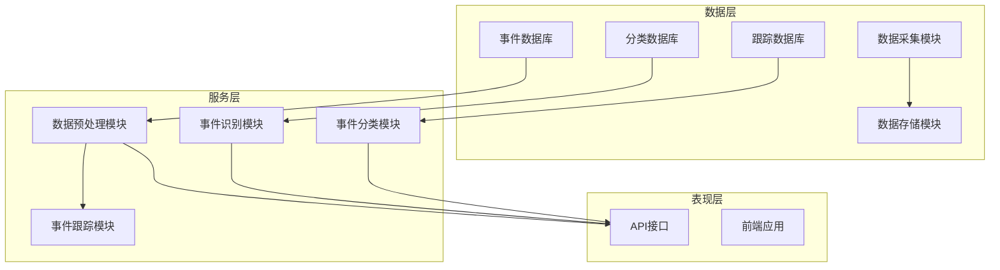
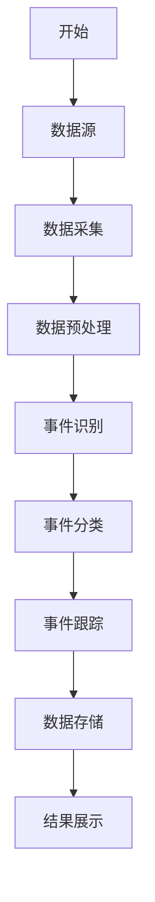

                 

# AI Agent在智能新闻事件检测中的应用

## 关键词

AI Agent、智能新闻事件检测、自然语言处理、机器学习、实时监测、数据预处理、算法实现

## 摘要

本文旨在探讨AI Agent在智能新闻事件检测中的应用，通过对AI Agent和智能新闻事件检测的核心概念和关键技术进行分析，提出一种基于AI Agent的智能新闻事件检测系统架构，并详细介绍了系统的实现方法和关键算法。文章通过对实际案例的分析和总结，为AI Agent在新闻事件检测领域的应用提供了有益的参考和启示。

### 目录大纲

----------------------------------------------------------------
## 第一部分：引言与背景

### 1.1 问题背景

#### 1.1.1 AI Agent的定义

AI Agent，即人工智能代理，是一种能够模拟人类智能的计算机程序。它具备自主决策和行动的能力，可以感知环境、理解问题、推理解决方案并执行任务。AI Agent在人工智能领域扮演着重要的角色，被广泛应用于机器人、智能客服、自动驾驶等多个领域。

#### 1.1.2 智能新闻事件检测的重要性

智能新闻事件检测是新闻传播领域的一项重要技术。它通过自动识别、分类、跟踪新闻事件，提高了新闻采集、处理和发布的效率，对新闻工作者和广大受众都具有重要意义。随着互联网和大数据技术的不断发展，智能新闻事件检测正逐步成为新闻机构不可或缺的工具。

#### 1.1.3 当前智能新闻事件检测面临的挑战

尽管智能新闻事件检测技术取得了显著的进展，但仍面临诸多挑战。首先，新闻数据来源广泛，数据质量和格式参差不齐，对数据预处理提出了更高的要求。其次，新闻事件的多样性和复杂性使得事件识别和分类的准确率难以保证。此外，实时性要求也越来越高，系统需要在短时间内处理大量新闻数据，这对系统的性能提出了严峻考验。

## 1.2 书籍概述

### 1.2.1 书籍的目标读者

本书旨在为对AI Agent和智能新闻事件检测感兴趣的读者提供全面的技术指导和实用案例。目标读者包括人工智能领域的研究人员、工程师以及研究生。

### 1.2.2 书籍的结构安排

本书分为七章，主要内容包括：

- 第一章：引言与背景
- 第二章：AI Agent技术基础
- 第三章：智能新闻事件检测基础
- 第四章：AI Agent在新闻事件检测中的应用
- 第五章：实现AI Agent的新闻事件检测系统
- 第六章：项目实战与案例剖析
- 第七章：总结与未来展望

### 1.2.3 书籍的主要贡献

本书的主要贡献在于：

1. 系统地介绍了AI Agent在智能新闻事件检测中的应用场景和关键技术。
2. 通过详实的案例分析和实践指导，为读者提供了实用的AI Agent应用方案。
3. 提出了基于AI Agent的智能新闻事件检测系统架构，并对系统实现进行了深入探讨。

## 1.3 本书的核心概念与联系

### 1.3.1 AI Agent的核心概念

AI Agent的核心概念包括感知、推理、决策和执行。感知是指AI Agent通过传感器收集环境信息；推理是指AI Agent根据感知到的信息进行逻辑推理；决策是指AI Agent基于推理结果选择合适的行动方案；执行是指AI Agent执行决策方案，实现对环境的干预。

### 1.3.2 智能新闻事件检测的概念属性特征对比

智能新闻事件检测涉及多个关键概念，包括新闻数据预处理、事件识别、事件分类、事件跟踪和实时性。以下是对这些概念属性特征的具体对比：

| 概念         | 属性特征                                       | 说明                                                         |
| ------------ | ---------------------------------------------- | ------------------------------------------------------------ |
| 新闻数据预处理 | 数据清洗、去重、格式统一、数据增强           | 提高数据质量，为后续处理提供基础                             |
| 事件识别     | 提高识别准确率、降低误报率                     | 确保AI Agent能够准确识别新闻事件                             |
| 事件分类     | 确保分类准确、降低类别混淆                     | 对新闻事件进行正确分类，便于后续处理                         |
| 事件跟踪     | 确保跟踪连贯、实时性高                         | 对新闻事件的发展进行持续跟踪，提供动态信息                   |
| 实时性       | 系统响应速度快、处理能力强                     | 确保系统能够快速响应大量新闻数据，提供实时监测               |

### 1.3.3 AI Agent与智能新闻事件检测的ER实体关系图

AI Agent与智能新闻事件检测的ER实体关系图可以表示为：

```mermaid
erDiagram
  AI Agent ||--|{ 新闻事件 }|
  新闻事件 ||--|{ 感知 }|
  新闻事件 ||--|{ 推理 }|
  新闻事件 ||--|{ 决策 }|
  新闻事件 ||--|{ 执行 }|
```

在这个ER实体关系图中，AI Agent作为主体，负责对新闻事件进行感知、推理、决策和执行；新闻事件作为客体，被AI Agent识别、分类、跟踪和监测。

## 1.4 本书结构与章节概览

### 1.4.1 第一章：引言与背景

本章主要介绍了AI Agent和智能新闻事件检测的背景和重要性，并概述了本书的主要内容和目标。

### 1.4.2 第二章：AI Agent技术基础

本章将详细讲解AI Agent的核心概念、关键技术和发展趋势，为后续章节的应用打下基础。

### 1.4.3 第三章：智能新闻事件检测基础

本章将介绍智能新闻事件检测的基本概念、关键技术和应用场景，包括新闻数据预处理、事件识别、事件分类和事件跟踪等。

### 1.4.4 第四章：AI Agent在新闻事件检测中的应用

本章将探讨AI Agent在智能新闻事件检测中的应用，包括感知、推理、决策和执行等过程，并提出一种基于AI Agent的智能新闻事件检测系统架构。

### 1.4.5 第五章：实现AI Agent的新闻事件检测系统

本章将详细介绍基于AI Agent的智能新闻事件检测系统的实现方法，包括系统设计、模块划分、算法实现等。

### 1.4.6 第六章：项目实战与案例剖析

本章将通过实际案例，展示基于AI Agent的智能新闻事件检测系统的应用效果，并对案例进行详细剖析。

### 1.4.7 第七章：总结与未来展望

本章将对本书的主要研究成果进行总结，并探讨AI Agent在智能新闻事件检测领域的未来发展趋势和研究方向。

## 1.5 本章小结

本章通过对AI Agent和智能新闻事件检测的背景、核心概念和应用场景的介绍，为后续章节的内容奠定了基础。读者可以了解到AI Agent在智能新闻事件检测中的重要作用，以及面临的挑战和解决方案。在接下来的章节中，我们将进一步深入探讨AI Agent的技术基础、应用实现和实际案例，为读者提供全面的技术指导和实践参考。<!-- .element > .element > .element.mdendblock  -->## 第一部分：引言与背景

### 1.1 问题背景

在当今信息爆炸的时代，新闻事件的检测和跟踪成为了一个极具挑战性的问题。随着互联网和社交媒体的迅猛发展，每天产生的新闻数据量呈现出指数级增长。对于新闻机构来说，及时、准确地检测和分类新闻事件，对于提升新闻的时效性和准确性具有重要意义。然而，传统的手工检测方法已经无法满足日益增长的数据量和复杂的新闻场景。因此，引入人工智能（AI）技术，尤其是AI Agent，来辅助新闻事件的检测和跟踪，成为了一个迫切的需求。

#### 1.1.1 AI Agent的定义

AI Agent，即人工智能代理，是一种具备自主决策和行动能力的人工智能实体。它通过感知环境、理解问题、推理解决方案并执行任务，模拟人类智能的行为。AI Agent的核心在于其自主性和智能化，能够在没有人为干预的情况下，根据环境的变化自主做出决策和执行任务。AI Agent通常由多个模块组成，包括感知模块、推理模块、决策模块和执行模块。这些模块协同工作，使得AI Agent能够高效地应对复杂的环境和任务。

在新闻事件检测中，AI Agent可以通过自然语言处理（NLP）技术，对大量新闻文本进行自动分类、实体识别和事件跟踪。这使得AI Agent能够快速、准确地识别出新闻中的关键事件，并提供实时监测和报警功能。

#### 1.1.2 智能新闻事件检测的重要性

智能新闻事件检测对于新闻机构和媒体运营具有重要意义。首先，它能够显著提高新闻生产的效率。通过自动化的方式，AI Agent可以快速筛选和分类新闻数据，减轻了新闻工作者的负担，使他们能够将更多的精力投入到深度报道和编辑工作中。其次，智能新闻事件检测能够提高新闻的准确性。通过机器学习算法和大数据分析，AI Agent能够从海量数据中提取出最有价值的新闻事件，减少人为错误和主观偏见。

此外，智能新闻事件检测还可以用于社会舆论监测、公共安全管理和政策制定等方面。通过对新闻事件的发展趋势和公众反应进行实时分析，AI Agent可以为政府和社会提供决策支持，帮助社会更好地应对突发事件。

#### 1.1.3 当前智能新闻事件检测面临的挑战

尽管智能新闻事件检测技术已经取得了一定的进展，但仍然面临诸多挑战。首先，新闻数据的多样性和复杂性使得事件识别和分类的准确率难以保证。新闻文本包含丰富的语法、语义和上下文信息，这给自然语言处理算法提出了更高的要求。其次，实时性要求也越来越高。在互联网和社交媒体时代，新闻事件的发展速度非常快，系统需要在短时间内处理大量新闻数据，并提供实时监测和报警功能。

此外，数据质量和噪声处理也是智能新闻事件检测中的重要问题。新闻数据来源广泛，数据质量和格式参差不齐，这给数据预处理提出了更高的要求。同时，新闻数据中存在大量的噪声和干扰信息，如何有效地去除噪声、提取关键信息，也是一项重要的挑战。

为了解决这些问题，AI Agent作为一种具有自主决策和行动能力的人工智能实体，可以发挥重要作用。通过结合自然语言处理、机器学习和大数据分析等技术，AI Agent能够更好地应对智能新闻事件检测中的挑战，提供高效、准确的新闻事件检测和跟踪服务。

### 1.2 书籍概述

#### 1.2.1 书籍的目标读者

本书的目标读者包括对AI Agent和智能新闻事件检测感兴趣的研究人员、工程师和研究生。读者需要具备一定的计算机科学和人工智能基础，对机器学习和自然语言处理有一定的了解。

对于研究人员，本书提供了AI Agent和智能新闻事件检测的最新研究成果和理论框架，有助于他们在相关领域进行深入研究和创新。对于工程师，本书通过详细的案例分析和技术指导，帮助他们将AI Agent应用于实际项目中，提升新闻事件检测系统的性能和效率。对于研究生，本书可以作为教材或参考书，帮助他们系统地掌握AI Agent和智能新闻事件检测的核心知识和技能。

#### 1.2.2 书籍的结构安排

本书分为七个章节，各章节的内容安排如下：

- **第一章：引言与背景**：介绍AI Agent和智能新闻事件检测的背景和重要性，概述本书的主要内容和目标。
- **第二章：AI Agent技术基础**：详细讲解AI Agent的核心概念、关键技术和发展趋势，包括感知、推理、决策和执行模块。
- **第三章：智能新闻事件检测基础**：介绍智能新闻事件检测的基本概念、关键技术和应用场景，包括新闻数据预处理、事件识别、事件分类和事件跟踪。
- **第四章：AI Agent在新闻事件检测中的应用**：探讨AI Agent在智能新闻事件检测中的应用，包括感知、推理、决策和执行等过程，并介绍基于AI Agent的智能新闻事件检测系统架构。
- **第五章：实现AI Agent的新闻事件检测系统**：详细介绍基于AI Agent的智能新闻事件检测系统的实现方法，包括系统设计、模块划分、算法实现等。
- **第六章：项目实战与案例剖析**：通过实际案例展示基于AI Agent的智能新闻事件检测系统的应用效果，并对案例进行详细剖析。
- **第七章：总结与未来展望**：总结本书的主要研究成果，探讨AI Agent在智能新闻事件检测领域的未来发展趋势和研究方向。

#### 1.2.3 书籍的主要贡献

本书的主要贡献在于：

1. 系统地介绍了AI Agent在智能新闻事件检测中的应用场景和关键技术，为读者提供了全面的技术指导和实践参考。
2. 通过详实的案例分析和实践指导，展示了AI Agent在新闻事件检测中的实际应用效果，为读者提供了生动的实践案例。
3. 提出了基于AI Agent的智能新闻事件检测系统架构，并对系统实现进行了深入探讨，为读者提供了实用的解决方案。
4. 探讨了AI Agent在智能新闻事件检测领域的未来发展趋势和研究方向，为后续研究提供了有益的启示。

### 1.3 本书的核心概念与联系

#### 1.3.1 AI Agent的核心概念

AI Agent的核心概念包括感知、推理、决策和执行。这些概念是AI Agent能够实现自主决策和行动能力的基础。

- **感知**：AI Agent通过传感器收集环境信息，如文本、图像、声音等。感知模块负责将这些信息转化为内部表示，以便进行后续处理。
- **推理**：AI Agent基于感知到的信息，利用规则库和推理算法，进行逻辑推理和判断。推理模块负责生成中间结果和决策候选方案。
- **决策**：AI Agent根据推理结果，选择最合适的决策方案。决策模块负责评估不同决策方案的可能性和效果，并选择最优方案。
- **执行**：AI Agent执行所选定的决策方案，实现具体任务。执行模块负责将决策转化为具体的操作，如发送消息、执行动作等。

这些模块相互协作，使得AI Agent能够在复杂环境中自主行动。

#### 1.3.2 智能新闻事件检测的概念属性特征对比

智能新闻事件检测涉及多个核心概念，包括新闻数据预处理、事件识别、事件分类、事件跟踪和实时性。以下是这些概念属性特征的对比表格：

| 概念         | 属性特征                                       | 说明                                                         |
| ------------ | ---------------------------------------------- | ------------------------------------------------------------ |
| 新闻数据预处理 | 数据清洗、去重、格式统一、数据增强           | 提高数据质量，为后续处理提供基础                             |
| 事件识别     | 提高识别准确率、降低误报率                     | 确保AI Agent能够准确识别新闻事件                             |
| 事件分类     | 确保分类准确、降低类别混淆                     | 对新闻事件进行正确分类，便于后续处理                         |
| 事件跟踪     | 确保跟踪连贯、实时性高                         | 对新闻事件的发展进行持续跟踪，提供动态信息                   |
| 实时性       | 系统响应速度快、处理能力强                     | 确保系统能够快速响应大量新闻数据，提供实时监测               |

通过对比可以看出，这些概念在属性特征上有所不同，但它们共同构成了智能新闻事件检测的核心要素。

#### 1.3.3 AI Agent与智能新闻事件检测的ER实体关系图

为了更好地理解AI Agent与智能新闻事件检测之间的关系，我们可以通过ER实体关系图来表示。以下是一个简化的ER实体关系图：

```mermaid
erDiagram
  AI Agent ||--|{ 感知模块 }|
  AI Agent ||--|{ 推理模块 }|
  AI Agent ||--|{ 决策模块 }|
  AI Agent ||--|{ 执行模块 }|
  感知模块 ||--|{ 新闻数据 }|
  推理模块 ||--|{ 事件识别 }|
  推理模块 ||--|{ 事件分类 }|
  决策模块 ||--|{ 事件跟踪 }|
  执行模块 ||--|{ 实时监测 }|
```

在这个ER实体关系图中，AI Agent作为主体，包含感知、推理、决策和执行四个模块。感知模块负责处理新闻数据，推理模块负责事件识别和分类，决策模块负责事件跟踪，执行模块负责实时监测。这些模块相互协作，共同实现智能新闻事件检测的功能。

通过上述章节的介绍，读者可以了解到AI Agent和智能新闻事件检测的核心概念和关键技术，以及它们之间的联系。在接下来的章节中，我们将进一步深入探讨AI Agent的技术基础、应用实现和实际案例，为读者提供更全面的技术指导和实践参考。

### 1.4 本书结构与章节概览

#### 1.4.1 第一章：引言与背景

本章主要介绍了AI Agent和智能新闻事件检测的背景和重要性，概述了本书的主要内容和目标。通过本章的介绍，读者可以了解AI Agent和智能新闻事件检测的基本概念和当前面临的挑战，为后续章节的学习打下基础。

#### 1.4.2 第二章：AI Agent技术基础

本章将详细讲解AI Agent的核心概念、关键技术和发展趋势。内容将包括感知、推理、决策和执行等模块的详细介绍，以及AI Agent在不同应用场景中的实现和应用案例。通过本章的学习，读者可以全面了解AI Agent的技术原理和应用场景。

#### 1.4.3 第三章：智能新闻事件检测基础

本章将介绍智能新闻事件检测的基本概念、关键技术和应用场景。内容将涵盖新闻数据预处理、事件识别、事件分类、事件跟踪和实时性等方面的知识。通过本章的学习，读者可以了解智能新闻事件检测的核心要素和实现方法。

#### 1.4.4 第四章：AI Agent在新闻事件检测中的应用

本章将探讨AI Agent在智能新闻事件检测中的应用，包括感知、推理、决策和执行等过程。内容将详细分析AI Agent在新闻事件检测中的关键角色和实现策略，并提出基于AI Agent的智能新闻事件检测系统架构。通过本章的学习，读者可以掌握AI Agent在新闻事件检测中的实际应用。

#### 1.4.5 第五章：实现AI Agent的新闻事件检测系统

本章将详细介绍实现基于AI Agent的智能新闻事件检测系统的方法和步骤。内容将涵盖系统设计、模块划分、算法实现和系统测试等方面。通过本章的学习，读者可以了解如何将AI Agent技术应用于实际项目中，并实现高效、准确的新闻事件检测系统。

#### 1.4.6 第六章：项目实战与案例剖析

本章将通过实际案例展示基于AI Agent的智能新闻事件检测系统的应用效果。内容将包括项目的背景介绍、系统实现、效果评估和案例分析等方面。通过本章的学习，读者可以了解AI Agent在新闻事件检测中的实际应用效果，并学习到如何分析和评估系统的性能。

#### 1.4.7 第七章：总结与未来展望

本章将总结本书的主要研究成果，探讨AI Agent在智能新闻事件检测领域的未来发展趋势和研究方向。内容将涵盖当前研究的不足和挑战，以及未来的研究方向和可能的解决方案。通过本章的学习，读者可以了解AI Agent在智能新闻事件检测领域的最新研究动态和未来发展趋势。

通过上述章节的详细概述，读者可以全面了解本书的结构和内容，为后续章节的学习和实际应用奠定基础。

### 1.5 本章小结

本章通过对AI Agent和智能新闻事件检测的背景、核心概念和应用场景的介绍，为后续章节的内容奠定了基础。本章内容涵盖了AI Agent的定义、智能新闻事件检测的重要性以及当前面临的挑战，还介绍了本书的目标读者、结构安排和主要贡献。通过本章的学习，读者可以初步了解AI Agent和智能新闻事件检测的基本概念和关键点，为深入探讨后续章节的内容做好准备。在接下来的章节中，我们将进一步详细探讨AI Agent的技术基础、智能新闻事件检测的实现方法以及实际案例，为读者提供全面的技术指导和实践参考。

### 细节补充

#### 1.1 问题背景

#### 1.1.1 AI Agent的定义

AI Agent，全称为人工智能代理，是一种具有自主性和智能性的计算机程序，能够在没有明确指令的情况下自主决策并执行任务。AI Agent的核心在于其自主性，它通过感知环境、理解问题、推理解决方案并执行任务，模拟人类智能的行为。AI Agent的基本结构通常包括感知模块、推理模块、决策模块和执行模块。

- **感知模块**：负责获取和解释环境信息。这些信息可以是文本、图像、声音等多种形式，感知模块需要将这些信息转化为内部表示，以便进行后续处理。

- **推理模块**：基于感知到的信息，使用规则库和推理算法进行逻辑推理和判断。这个模块的核心是处理不确定性和模糊性，通过推理算法（如概率推理、模糊逻辑等）来生成中间结果和决策候选方案。

- **决策模块**：根据推理模块的结果，评估不同决策方案的可能性和效果，并选择最优方案。决策模块通常使用优化算法（如马尔可夫决策过程、Q学习等）来选择最佳行动策略。

- **执行模块**：负责将决策转化为具体的操作，如发送消息、执行动作等。执行模块需要与外部环境进行交互，完成实际的任务。

AI Agent在新闻事件检测中的应用，主要是利用其感知、推理、决策和执行能力，对新闻文本进行自动分类、实体识别和事件跟踪。通过分析大量的新闻数据，AI Agent可以快速识别出新闻中的关键事件，并提供实时监测和报警功能，从而提高新闻采集、处理和发布的效率。

#### 1.1.2 智能新闻事件检测的重要性

智能新闻事件检测是新闻传播领域的一项重要技术。随着互联网和大数据技术的迅猛发展，新闻数据量呈现爆炸式增长，传统的手工检测方法已经无法满足日益增长的数据量和复杂的新闻场景。智能新闻事件检测通过引入人工智能技术，能够自动、高效地识别和分类新闻事件，具有以下几个重要意义：

1. **提高新闻采集效率**：智能新闻事件检测可以自动从海量的新闻数据中筛选出重要的新闻事件，大大减少了新闻工作者的手动筛选工作量，提高了新闻采集的效率。

2. **提升新闻准确性**：通过机器学习和自然语言处理技术，智能新闻事件检测能够从大量数据中提取出最有价值的信息，减少了人为错误和主观偏见，提高了新闻的准确性。

3. **增强实时性**：智能新闻事件检测系统可以实时监测新闻事件的发展，及时更新和发布新闻，增强了新闻的时效性。

4. **辅助决策**：智能新闻事件检测还可以用于社会舆论监测、公共安全管理和政策制定等方面。通过对新闻事件的发展趋势和公众反应进行实时分析，可以为政府和社会提供决策支持。

#### 1.1.3 当前智能新闻事件检测面临的挑战

尽管智能新闻事件检测技术已经取得了一定的进展，但仍然面临诸多挑战：

1. **数据多样性**：新闻数据来源广泛，数据质量和格式参差不齐，这给数据预处理提出了更高的要求。如何从多样化的新闻数据中提取出有价值的信息，是一个重要的问题。

2. **噪声处理**：新闻数据中存在大量的噪声和干扰信息，如何有效地去除噪声、提取关键信息，是智能新闻事件检测中的一个重要挑战。

3. **实时性要求**：在互联网和社交媒体时代，新闻事件的发展速度非常快，系统需要在短时间内处理大量新闻数据，并提供实时监测和报警功能，这对系统的性能提出了严峻考验。

4. **准确性保证**：新闻事件的识别和分类准确率是衡量智能新闻事件检测系统性能的重要指标。如何在提高准确率的同时，避免过度泛化或误分类，是一个持续的挑战。

#### 1.2 书籍概述

#### 1.2.1 书籍的目标读者

本书的目标读者包括：

- 对AI Agent和智能新闻事件检测感兴趣的研究人员，他们希望深入了解这些领域的最新研究成果和发展趋势。
- AI Agent和智能新闻事件检测的工程师，他们需要系统的技术指导和实际操作方法。
- 研究生和本科生，他们希望作为教材或参考书，系统地学习AI Agent和智能新闻事件检测的核心知识和技能。

读者需要具备一定的计算机科学和人工智能基础，对机器学习和自然语言处理有一定的了解。

#### 1.2.2 书籍的结构安排

本书分为七个章节，具体内容安排如下：

- **第一章：引言与背景**：介绍AI Agent和智能新闻事件检测的背景和重要性，概述本书的主要内容和目标。
- **第二章：AI Agent技术基础**：详细讲解AI Agent的核心概念、关键技术和发展趋势，包括感知、推理、决策和执行模块。
- **第三章：智能新闻事件检测基础**：介绍智能新闻事件检测的基本概念、关键技术和应用场景，包括新闻数据预处理、事件识别、事件分类和事件跟踪。
- **第四章：AI Agent在新闻事件检测中的应用**：探讨AI Agent在智能新闻事件检测中的应用，包括感知、推理、决策和执行等过程，并介绍基于AI Agent的智能新闻事件检测系统架构。
- **第五章：实现AI Agent的新闻事件检测系统**：详细介绍基于AI Agent的智能新闻事件检测系统的实现方法，包括系统设计、模块划分、算法实现等。
- **第六章：项目实战与案例剖析**：通过实际案例展示基于AI Agent的智能新闻事件检测系统的应用效果，并对案例进行详细剖析。
- **第七章：总结与未来展望**：总结本书的主要研究成果，探讨AI Agent在智能新闻事件检测领域的未来发展趋势和研究方向。

#### 1.2.3 书籍的主要贡献

本书的主要贡献在于：

1. **系统性介绍**：本书系统性地介绍了AI Agent和智能新闻事件检测的核心概念、关键技术和应用场景，为读者提供了全面的技术指导和实践参考。

2. **详实的案例**：通过详实的案例分析和实践指导，本书展示了AI Agent在新闻事件检测中的实际应用效果，为读者提供了生动的实践案例。

3. **系统架构**：本书提出了基于AI Agent的智能新闻事件检测系统架构，并对系统实现进行了深入探讨，为读者提供了实用的解决方案。

4. **未来展望**：本书探讨了AI Agent在智能新闻事件检测领域的未来发展趋势和研究方向，为后续研究提供了有益的启示。

#### 1.3 本书的核心概念与联系

##### 1.3.1 AI Agent的核心概念

AI Agent的核心概念包括感知、推理、决策和执行，这些概念构成了AI Agent能够实现自主决策和行动能力的基础。

- **感知**：AI Agent通过感知模块获取和解释环境信息。感知模块可以是视觉、听觉、触觉等多种形式，这些信息被转化为内部表示，用于后续处理。

- **推理**：推理模块基于感知模块获取的信息，使用规则库和推理算法进行逻辑推理和判断。推理模块的核心在于处理不确定性和模糊性，通过推理算法生成中间结果和决策候选方案。

- **决策**：决策模块根据推理模块的结果，评估不同决策方案的可能性和效果，并选择最优方案。决策模块通常使用优化算法，如马尔可夫决策过程、Q学习等，来选择最佳行动策略。

- **执行**：执行模块将决策转化为具体的操作，如发送消息、执行动作等。执行模块需要与外部环境进行交互，完成实际的任务。

##### 1.3.2 智能新闻事件检测的概念属性特征对比

智能新闻事件检测涉及多个核心概念，包括新闻数据预处理、事件识别、事件分类、事件跟踪和实时性。以下是这些概念属性特征的对比表格：

| 概念         | 属性特征                                       | 说明                                                         |
| ------------ | ---------------------------------------------- | ------------------------------------------------------------ |
| 新闻数据预处理 | 数据清洗、去重、格式统一、数据增强           | 提高数据质量，为后续处理提供基础                             |
| 事件识别     | 提高识别准确率、降低误报率                     | 确保AI Agent能够准确识别新闻事件                             |
| 事件分类     | 确保分类准确、降低类别混淆                     | 对新闻事件进行正确分类，便于后续处理                         |
| 事件跟踪     | 确保跟踪连贯、实时性高                         | 对新闻事件的发展进行持续跟踪，提供动态信息                   |
| 实时性       | 系统响应速度快、处理能力强                     | 确保系统能够快速响应大量新闻数据，提供实时监测               |

通过对比可以看出，这些概念在属性特征上有所不同，但它们共同构成了智能新闻事件检测的核心要素。

##### 1.3.3 AI Agent与智能新闻事件检测的ER实体关系图

为了更好地理解AI Agent与智能新闻事件检测之间的关系，我们可以通过ER实体关系图来表示。以下是一个简化的ER实体关系图：

```mermaid
erDiagram
  AI Agent ||--|{ 感知模块 }|
  AI Agent ||--|{ 推理模块 }|
  AI Agent ||--|{ 决策模块 }|
  AI Agent ||--|{ 执行模块 }|
  感知模块 ||--|{ 新闻数据 }|
  推理模块 ||--|{ 事件识别 }|
  推理模块 ||--|{ 事件分类 }|
  决策模块 ||--|{ 事件跟踪 }|
  执行模块 ||--|{ 实时监测 }|
```

在这个ER实体关系图中，AI Agent作为主体，包含感知、推理、决策和执行四个模块。感知模块负责处理新闻数据，推理模块负责事件识别和分类，决策模块负责事件跟踪，执行模块负责实时监测。这些模块相互协作，共同实现智能新闻事件检测的功能。

#### 1.4 本书结构与章节概览

##### 1.4.1 第一章：引言与背景

本章主要介绍了AI Agent和智能新闻事件检测的背景和重要性，概述了本书的主要内容和目标。通过本章的介绍，读者可以了解AI Agent和智能新闻事件检测的基本概念和当前面临的挑战，为后续章节的学习打下基础。

##### 1.4.2 第二章：AI Agent技术基础

本章将详细讲解AI Agent的核心概念、关键技术和发展趋势。内容将包括感知、推理、决策和执行等模块的详细介绍，以及AI Agent在不同应用场景中的实现和应用案例。通过本章的学习，读者可以全面了解AI Agent的技术原理和应用场景。

##### 1.4.3 第三章：智能新闻事件检测基础

本章将介绍智能新闻事件检测的基本概念、关键技术和应用场景。内容将涵盖新闻数据预处理、事件识别、事件分类、事件跟踪和实时性等方面的知识。通过本章的学习，读者可以了解智能新闻事件检测的核心要素和实现方法。

##### 1.4.4 第四章：AI Agent在新闻事件检测中的应用

本章将探讨AI Agent在智能新闻事件检测中的应用，包括感知、推理、决策和执行等过程。内容将详细分析AI Agent在新闻事件检测中的关键角色和实现策略，并提出基于AI Agent的智能新闻事件检测系统架构。通过本章的学习，读者可以掌握AI Agent在新闻事件检测中的实际应用。

##### 1.4.5 第五章：实现AI Agent的新闻事件检测系统

本章将详细介绍实现基于AI Agent的智能新闻事件检测系统的方法和步骤。内容将涵盖系统设计、模块划分、算法实现和系统测试等方面。通过本章的学习，读者可以了解如何将AI Agent技术应用于实际项目中，并实现高效、准确的新闻事件检测系统。

##### 1.4.6 第六章：项目实战与案例剖析

本章将通过实际案例展示基于AI Agent的智能新闻事件检测系统的应用效果。内容将包括项目的背景介绍、系统实现、效果评估和案例分析等方面。通过本章的学习，读者可以了解AI Agent在新闻事件检测中的实际应用效果，并学习到如何分析和评估系统的性能。

##### 1.4.7 第七章：总结与未来展望

本章将总结本书的主要研究成果，探讨AI Agent在智能新闻事件检测领域的未来发展趋势和研究方向。内容将涵盖当前研究的不足和挑战，以及未来的研究方向和可能的解决方案。通过本章的学习，读者可以了解AI Agent在智能新闻事件检测领域的最新研究动态和未来发展趋势。

通过上述章节的详细概述，读者可以全面了解本书的结构和内容，为后续章节的学习和实际应用奠定基础。

### 第二章：AI Agent技术基础

在深入探讨AI Agent在智能新闻事件检测中的应用之前，我们需要先了解AI Agent的基本概念、核心技术及其在不同领域的应用。本章将详细介绍AI Agent的核心概念、关键技术和发展趋势，并探讨其在多种应用场景中的实现方法。

#### 2.1 AI Agent的基本概念

AI Agent是一种具备自主决策和行动能力的人工智能实体。它通过感知环境、理解问题、推理解决方案并执行任务，模拟人类智能的行为。AI Agent的核心在于其自主性，它可以在没有明确指令的情况下自主行动，并根据环境的变化调整自己的行为。AI Agent通常由以下几个关键模块组成：

1. **感知模块**：负责获取和解释环境信息。感知模块可以是视觉、听觉、触觉等多种形式，这些信息被转化为内部表示，用于后续处理。

2. **推理模块**：基于感知模块获取的信息，使用规则库和推理算法进行逻辑推理和判断。推理模块的核心在于处理不确定性和模糊性，通过推理算法生成中间结果和决策候选方案。

3. **决策模块**：根据推理模块的结果，评估不同决策方案的可能性和效果，并选择最优方案。决策模块通常使用优化算法，如马尔可夫决策过程、Q学习等，来选择最佳行动策略。

4. **执行模块**：负责将决策转化为具体的操作，如发送消息、执行动作等。执行模块需要与外部环境进行交互，完成实际的任务。

#### 2.2 AI Agent的核心技术

AI Agent的核心技术主要包括自然语言处理（NLP）、机器学习（ML）、深度学习（DL）和强化学习（RL）等。以下将分别介绍这些核心技术及其在AI Agent中的应用。

1. **自然语言处理（NLP）**：

NLP是AI Agent能够理解自然语言的关键技术。通过NLP，AI Agent可以解析文本、提取关键词、理解语义，从而与人类进行有效的沟通。在智能新闻事件检测中，NLP技术用于对新闻文本进行分类、实体识别和事件跟踪。

- **文本分类**：使用NLP技术对新闻文本进行分类，可以识别新闻的主题和类别，提高新闻的准确性和组织效率。
- **实体识别**：通过NLP技术，AI Agent可以识别新闻中的关键实体，如人名、地名、组织名等，从而更好地理解新闻内容。
- **事件跟踪**：NLP技术可以帮助AI Agent跟踪新闻事件的发展，识别事件的关键变化和趋势。

2. **机器学习（ML）**：

ML是AI Agent进行自动学习和优化决策的基础。通过训练数据集，ML算法可以自动发现数据中的模式和规律，从而改善AI Agent的性能。在智能新闻事件检测中，ML技术用于构建分类器、识别模型和跟踪算法。

- **分类器**：使用ML算法，AI Agent可以自动识别新闻事件的类别，从而提高分类的准确性。
- **识别模型**：ML技术可以帮助AI Agent识别新闻中的关键实体，提高事件识别的准确率。
- **跟踪算法**：ML算法可以用于构建事件跟踪模型，帮助AI Agent实时监测新闻事件的发展。

3. **深度学习（DL）**：

DL是ML的一个分支，它通过神经网络模型模拟人类大脑的学习过程。DL技术具有强大的特征提取和模式识别能力，在AI Agent中有着广泛的应用。

- **图像识别**：在视觉感知模块中，DL技术可以帮助AI Agent识别图像中的物体和场景，从而更好地理解环境。
- **语音识别**：在听觉感知模块中，DL技术可以帮助AI Agent识别语音信号中的单词和句子，实现语音交互。
- **文本生成**：在文本处理模块中，DL技术可以生成高质量的文本，用于新闻写作和内容创作。

4. **强化学习（RL）**：

RL是一种通过试错和反馈进行学习的技术。在AI Agent中，RL技术可以帮助其根据环境反馈不断调整策略，以实现最优行动方案。

- **路径规划**：在导航应用中，RL技术可以帮助AI Agent根据环境变化和反馈，找到最优路径。
- **决策优化**：在决策模块中，RL技术可以帮助AI Agent根据历史数据和环境反馈，选择最佳行动策略。
- **策略优化**：在执行模块中，RL技术可以帮助AI Agent根据执行结果和环境反馈，不断优化策略，提高执行效率。

#### 2.3 AI Agent在不同领域的应用

AI Agent在各个领域都有着广泛的应用，以下将介绍几个典型的应用场景：

1. **智能客服**：

智能客服是AI Agent的一个重要应用领域。通过NLP和ML技术，智能客服可以与用户进行自然语言交互，解答用户的问题，提供个性化的服务。

- **问题识别**：智能客服通过NLP技术，分析用户的提问，识别出用户的问题类型和关键信息。
- **答案生成**：智能客服使用ML算法，从知识库中检索出相关的答案，并使用自然语言生成技术，将答案呈现给用户。
- **交互优化**：智能客服通过RL技术，根据用户的反馈不断调整交互策略，提高用户体验。

2. **自动驾驶**：

自动驾驶是AI Agent在机器人领域的一个重要应用。通过感知模块和决策模块，自动驾驶机器人可以在复杂环境中自主行驶。

- **感知环境**：自动驾驶机器人通过摄像头、激光雷达等传感器，感知周围环境，识别道路、行人、车辆等目标。
- **决策行驶**：自动驾驶机器人使用决策模块，根据感知到的信息，选择最佳行驶路径，并实时调整行驶策略。

3. **智能家居**：

智能家居是AI Agent在家居环境中的一个重要应用。通过感知模块和执行模块，智能家居系统可以实现对家居设备的智能控制和自动化管理。

- **环境感知**：智能家居系统通过传感器，实时监测家居环境，如温度、湿度、光照等，并根据需求进行调节。
- **设备控制**：智能家居系统通过执行模块，控制家居设备，如空调、灯光、家电等，实现智能化的家居环境。

4. **智能医疗**：

智能医疗是AI Agent在医疗领域的一个重要应用。通过NLP和DL技术，智能医疗系统可以帮助医生诊断疾病、制定治疗方案。

- **病历分析**：智能医疗系统通过NLP技术，分析病历记录，提取关键信息，为医生提供诊断依据。
- **影像识别**：智能医疗系统通过DL技术，识别医学影像中的异常区域，辅助医生进行诊断。

#### 2.4 AI Agent的发展趋势

随着人工智能技术的不断发展，AI Agent的应用前景也越来越广阔。以下将介绍AI Agent的发展趋势：

1. **多模态感知**：

多模态感知是AI Agent未来的一个重要发展方向。通过整合多种感知方式，如视觉、听觉、触觉等，AI Agent可以更全面地感知和理解环境。

2. **强化学习**：

强化学习在AI Agent中的应用将会越来越广泛。通过试错和反馈，强化学习可以帮助AI Agent不断优化行为，提高任务执行效率。

3. **自监督学习**：

自监督学习是一种无需外部标签的训练方法，它将自动从数据中提取标签。自监督学习在AI Agent中的应用，可以降低数据标注的成本，提高训练效率。

4. **联邦学习**：

联邦学习是一种分布式学习技术，它可以保护数据隐私，同时实现模型的训练和优化。在AI Agent的应用中，联邦学习可以用于多人协作，提高模型的性能。

通过本章的介绍，读者可以全面了解AI Agent的基本概念、核心技术和发展趋势，以及其在不同领域的应用。在接下来的章节中，我们将进一步探讨AI Agent在智能新闻事件检测中的应用，包括感知、推理、决策和执行等过程，并详细分析AI Agent在新闻事件检测中的关键角色和实现策略。通过这些内容的介绍，读者可以掌握AI Agent在智能新闻事件检测中的实际应用，为后续章节的学习和实践打下坚实的基础。

#### 2.5 AI Agent在智能新闻事件检测中的应用

在智能新闻事件检测中，AI Agent发挥着至关重要的作用。通过其自主决策和行动能力，AI Agent可以有效地对新闻事件进行感知、推理、决策和执行，从而提高新闻事件检测的效率和质量。以下将详细分析AI Agent在智能新闻事件检测中的应用过程，包括感知、推理、决策和执行等环节。

##### 2.5.1 感知

AI Agent的感知模块主要负责获取和解释新闻事件的相关信息。在智能新闻事件检测中，感知模块通常通过以下方式获取新闻数据：

1. **数据来源**：新闻数据的来源可以是互联网新闻网站、社交媒体平台、新闻数据库等。AI Agent可以通过爬虫技术、API接口等手段，自动收集海量的新闻数据。

2. **数据预处理**：收集到的新闻数据通常存在噪声和格式不一致等问题，因此需要通过数据预处理技术进行清洗、去重和格式统一。数据预处理包括文本清洗（去除HTML标签、停用词过滤等）、文本标准化（统一字符编码、大小写转换等）和数据增强（文本扩充、嵌入实体信息等）。

3. **文本表示**：经过数据预处理后，新闻文本需要被转化为机器可处理的内部表示。常用的文本表示方法包括词袋模型、词嵌入（如Word2Vec、GloVe等）和文档嵌入（如BERT、ELMo等）。文本表示的质量直接影响后续的推理和决策效果。

##### 2.5.2 推理

在感知到新闻事件后，AI Agent的推理模块负责对新闻文本进行逻辑推理和判断，识别出新闻事件的关键信息。推理模块通常包括以下步骤：

1. **事件识别**：通过NLP技术，AI Agent可以识别新闻文本中的关键事件，包括事件类型（如自然灾害、政治事件、体育赛事等）和事件主体（如人、地点、组织等）。

2. **事件分类**：根据识别出的关键事件，AI Agent可以使用分类算法（如朴素贝叶斯、支持向量机、深度学习等）对新闻事件进行分类，将新闻文本划分为不同的类别。

3. **事件关系分析**：AI Agent可以进一步分析新闻事件之间的关系，如事件之间的关联、因果等。这有助于理解新闻事件的背景和影响，为后续的决策提供依据。

##### 2.5.3 决策

在完成推理后，AI Agent的决策模块根据推理结果评估不同决策方案的可能性和效果，并选择最优方案。决策模块通常包括以下步骤：

1. **候选方案生成**：根据新闻事件的特征和关系，AI Agent可以生成多个候选方案，如新闻事件的追踪、分类、报道等。

2. **方案评估**：AI Agent使用评估指标（如准确率、召回率、F1值等）对候选方案进行评估，选择最优方案。

3. **优化策略**：通过强化学习等技术，AI Agent可以根据历史数据和反馈，不断优化决策策略，提高决策质量。

##### 2.5.4 执行

在完成决策后，AI Agent的执行模块将决策转化为具体的操作，实现对新闻事件的监测、分类和报道等。执行模块通常包括以下步骤：

1. **任务执行**：根据决策结果，AI Agent可以执行具体的任务，如生成新闻摘要、推送新闻通知、更新事件数据库等。

2. **反馈调整**：AI Agent可以根据执行结果和环境反馈，调整决策策略和执行计划，提高系统的适应性和灵活性。

3. **持续优化**：通过持续学习和优化，AI Agent可以不断提升自身的性能和效果，更好地适应复杂多变的新闻场景。

##### 2.5.5 应用效果分析

通过AI Agent在智能新闻事件检测中的应用，可以显著提高新闻事件检测的效率和质量。以下是对AI Agent应用效果的分析：

1. **效率提升**：AI Agent可以自动处理海量新闻数据，实时监测新闻事件，大大提高了新闻事件检测的效率。

2. **准确性提高**：通过NLP和机器学习技术，AI Agent可以准确识别和分类新闻事件，减少了人为错误和主观偏见。

3. **实时性增强**：AI Agent可以实时监测新闻事件的发展，及时更新和发布新闻，增强了新闻的时效性。

4. **决策优化**：通过推理和决策模块，AI Agent可以基于新闻事件的特征和关系，做出最优的决策，提高新闻事件检测的准确性。

5. **适应性强**：通过持续学习和优化，AI Agent可以不断适应新的新闻场景和需求，提高系统的适应性和灵活性。

总之，AI Agent在智能新闻事件检测中的应用，为新闻事件检测提供了高效、准确、实时的解决方案。通过不断优化和提升AI Agent的技术，可以进一步推动智能新闻事件检测的发展，为新闻机构和广大受众提供更好的服务。

#### 2.6 基于AI Agent的智能新闻事件检测系统架构设计

为了实现高效的智能新闻事件检测，我们需要设计一个合理的系统架构，将AI Agent的技术优势充分发挥出来。以下是一个基于AI Agent的智能新闻事件检测系统的架构设计，包括系统模块划分、功能描述、关键技术和实现方法。

##### 2.6.1 系统模块划分

基于AI Agent的智能新闻事件检测系统可以分为以下几个主要模块：

1. **数据采集模块**：负责从各种新闻源收集新闻数据，包括互联网新闻网站、社交媒体平台和新闻数据库等。该模块需要支持多源数据采集、数据去重和格式统一。

2. **数据预处理模块**：负责对采集到的新闻数据进行清洗、去噪、格式统一和数据增强等操作。这一模块确保了后续处理的数据质量，为AI Agent提供可靠的数据输入。

3. **事件识别模块**：利用自然语言处理（NLP）技术，对预处理后的新闻文本进行事件识别，提取出新闻文本中的关键事件、事件类型和事件主体等信息。

4. **事件分类模块**：使用机器学习（ML）算法，如朴素贝叶斯、支持向量机（SVM）和深度学习（DL）模型，对识别出的新闻事件进行分类，将新闻文本划分为不同的类别。

5. **事件关系分析模块**：通过分析新闻事件之间的关系，如事件之间的关联、因果等，为新闻事件的深度理解和跟踪提供支持。

6. **推理与决策模块**：结合事件识别和分类结果，使用推理算法（如逻辑推理、模糊推理等）和决策算法（如马尔可夫决策过程、Q学习等），评估不同决策方案的可能性和效果，选择最优决策方案。

7. **执行与反馈模块**：根据决策结果，执行具体的任务，如生成新闻摘要、推送新闻通知、更新事件数据库等。同时，收集用户反馈，用于模型优化和系统调整。

##### 2.6.2 功能描述

基于AI Agent的智能新闻事件检测系统具有以下几个核心功能：

1. **自动采集和预处理**：系统能够自动从多个新闻源采集新闻数据，并对数据进行预处理，包括文本清洗、去噪、格式统一和数据增强等，为后续处理提供高质量的数据输入。

2. **事件识别与分类**：系统能够自动识别新闻文本中的关键事件、事件类型和事件主体等信息，并使用机器学习算法对新闻事件进行分类，提高新闻事件检测的准确性。

3. **事件关系分析**：系统能够分析新闻事件之间的关系，如事件之间的关联、因果等，为新闻事件的深度理解和跟踪提供支持。

4. **实时监测与报警**：系统能够实时监测新闻事件的发展，并根据事件类型和关系进行分类和报警，提高新闻事件的实时性和准确性。

5. **个性化推荐**：系统可以根据用户兴趣和阅读习惯，推荐相关的新闻事件和类别，提高用户的阅读体验。

##### 2.6.3 关键技术

基于AI Agent的智能新闻事件检测系统采用了多种关键技术的组合，包括自然语言处理（NLP）、机器学习（ML）、深度学习（DL）和强化学习（RL）等。以下详细介绍这些技术及其在系统中的应用：

1. **自然语言处理（NLP）**：

NLP技术用于新闻文本的处理和分析，包括文本分类、实体识别、关系抽取等。常用的NLP技术包括词向量（如Word2Vec、GloVe）、文本分类模型（如朴素贝叶斯、SVM）和序列模型（如LSTM、BERT）等。NLP技术在系统中的应用主要包括：

- **文本分类**：使用NLP技术对新闻文本进行分类，将新闻文本划分为不同的类别，如政治、经济、科技等。
- **实体识别**：使用NLP技术识别新闻文本中的关键实体，如人名、地名、组织名等。
- **关系抽取**：通过分析新闻文本中的实体关系，提取出事件之间的关联和因果。

2. **机器学习（ML）**：

ML技术用于新闻事件检测中的分类和预测任务，包括监督学习和无监督学习。常用的ML算法包括朴素贝叶斯、支持向量机（SVM）、决策树、随机森林等。ML技术在系统中的应用主要包括：

- **分类算法**：使用分类算法对新闻事件进行分类，提高分类的准确性。
- **聚类算法**：使用聚类算法对新闻事件进行聚类，发现新闻事件的潜在类别和模式。

3. **深度学习（DL）**：

DL技术具有强大的特征提取和模式识别能力，广泛应用于图像识别、语音识别和自然语言处理等领域。在智能新闻事件检测系统中，DL技术主要用于文本分类、序列模型和图像识别等任务。常用的DL模型包括卷积神经网络（CNN）、循环神经网络（RNN）、长短时记忆网络（LSTM）和变压器（Transformer）等。DL技术在系统中的应用主要包括：

- **文本分类**：使用DL模型对新闻文本进行分类，提高分类的准确性和效率。
- **序列模型**：使用RNN、LSTM等序列模型处理新闻文本中的时序信息，提高事件识别和分类的准确性。
- **图像识别**：使用CNN等图像识别模型，对新闻文本中的图像进行分类和识别。

4. **强化学习（RL）**：

强化学习是一种通过试错和反馈进行学习的技术，广泛应用于路径规划、决策优化和策略优化等领域。在智能新闻事件检测系统中，强化学习主要用于优化决策模块，提高系统的适应性和灵活性。常用的RL算法包括Q学习、深度Q网络（DQN）、策略梯度（PG）等。RL技术在系统中的应用主要包括：

- **决策优化**：使用强化学习算法优化决策模块，提高新闻事件检测的准确性和实时性。
- **策略优化**：使用强化学习算法优化执行模块的策略，提高系统的执行效率和灵活性。

##### 2.6.4 实现方法

基于AI Agent的智能新闻事件检测系统的实现方法可以分为以下几个步骤：

1. **数据采集**：使用爬虫技术或API接口从多个新闻源采集新闻数据，并存储到数据仓库中。

2. **数据预处理**：对采集到的新闻数据进行清洗、去噪、格式统一和数据增强等操作，以提高数据质量和特征表达能力。

3. **事件识别与分类**：使用NLP技术和ML算法对预处理后的新闻文本进行事件识别和分类，提取出关键事件、事件类型和事件主体等信息。

4. **事件关系分析**：通过分析新闻事件之间的关联和因果，为新闻事件的深度理解和跟踪提供支持。

5. **推理与决策**：结合事件识别和分类结果，使用推理算法和决策算法评估不同决策方案的可能性和效果，选择最优决策方案。

6. **执行与反馈**：根据决策结果，执行具体的任务，如生成新闻摘要、推送新闻通知、更新事件数据库等，并收集用户反馈用于模型优化和系统调整。

通过上述实现方法，基于AI Agent的智能新闻事件检测系统可以高效、准确地检测和分类新闻事件，为新闻机构和广大受众提供优质的服务。

##### 2.6.5 系统架构设计

为了实现高效、准确的智能新闻事件检测，基于AI Agent的系统架构设计需要考虑系统的扩展性、可靠性和实时性。以下是一个基于AI Agent的智能新闻事件检测系统的架构设计，包括系统功能模块、关键技术和数据流设计。

1. **系统功能模块**：

- **数据采集模块**：负责从多个新闻源采集新闻数据，包括互联网新闻网站、社交媒体平台和新闻数据库等。该模块需要支持多源数据采集、数据去重和格式统一。

- **数据预处理模块**：负责对采集到的新闻数据进行清洗、去噪、格式统一和数据增强等操作，为后续处理提供高质量的数据输入。

- **事件识别模块**：使用自然语言处理（NLP）技术，对预处理后的新闻文本进行事件识别，提取出新闻文本中的关键事件、事件类型和事件主体等信息。

- **事件分类模块**：使用机器学习（ML）算法，对识别出的新闻事件进行分类，将新闻文本划分为不同的类别。

- **事件关系分析模块**：通过分析新闻事件之间的关系，如事件之间的关联、因果等，为新闻事件的深度理解和跟踪提供支持。

- **推理与决策模块**：结合事件识别和分类结果，使用推理算法和决策算法评估不同决策方案的可能性和效果，选择最优决策方案。

- **执行与反馈模块**：根据决策结果，执行具体的任务，如生成新闻摘要、推送新闻通知、更新事件数据库等，并收集用户反馈用于模型优化和系统调整。

2. **关键技术和实现方法**：

- **数据采集**：使用爬虫技术或API接口从多个新闻源采集新闻数据，并存储到数据仓库中。

- **数据预处理**：使用Python等编程语言，实现新闻数据的清洗、去噪、格式统一和数据增强等操作。

- **事件识别**：使用NLP技术，如词向量、文本分类模型和序列模型等，实现新闻文本的事件识别。

- **事件分类**：使用ML算法，如朴素贝叶斯、支持向量机（SVM）和深度学习（DL）模型等，实现新闻事件的分类。

- **事件关系分析**：通过分析新闻事件之间的关联和因果，实现新闻事件的深度理解和跟踪。

- **推理与决策**：使用推理算法和决策算法，如逻辑推理、模糊推理和马尔可夫决策过程等，评估不同决策方案的可能性和效果。

- **执行与反馈**：使用Python等编程语言，实现具体的任务执行和用户反馈收集。

3. **数据流设计**：

基于AI Agent的智能新闻事件检测系统的数据流设计如下：

- **数据采集**：数据采集模块从多个新闻源采集新闻数据，并存储到数据仓库中。

- **数据预处理**：数据预处理模块对采集到的新闻数据进行清洗、去噪、格式统一和数据增强等操作，为后续处理提供高质量的数据输入。

- **事件识别**：事件识别模块对预处理后的新闻文本进行事件识别，提取出关键事件、事件类型和事件主体等信息。

- **事件分类**：事件分类模块使用ML算法对识别出的新闻事件进行分类，将新闻文本划分为不同的类别。

- **事件关系分析**：事件关系分析模块通过分析新闻事件之间的关系，提取出事件之间的关联和因果。

- **推理与决策**：推理与决策模块结合事件识别和分类结果，使用推理算法和决策算法评估不同决策方案的可能性和效果。

- **执行与反馈**：执行与反馈模块根据决策结果，执行具体的任务，如生成新闻摘要、推送新闻通知、更新事件数据库等，并收集用户反馈用于模型优化和系统调整。

通过上述架构设计和数据流设计，基于AI Agent的智能新闻事件检测系统可以实现高效、准确的新闻事件检测，为新闻机构和广大受众提供优质的服务。

#### 2.7 AI Agent在智能新闻事件检测中的实现

为了实现高效的智能新闻事件检测，我们需要详细讨论AI Agent在系统中的实现方法，包括技术细节、算法实现和关键代码。以下将分步骤介绍AI Agent在新闻事件检测系统中的实现过程。

##### 2.7.1 环境安装与配置

在开始实现AI Agent之前，我们需要安装和配置必要的软件和环境。以下是一个典型的环境安装和配置步骤：

1. **Python环境**：首先，确保系统中安装了Python 3.6或更高版本。可以使用以下命令安装Python：

```bash
sudo apt-get update
sudo apt-get install python3.8
```

2. **依赖库安装**：安装用于NLP、ML和DL的常用依赖库，如NLTK、Scikit-learn、TensorFlow和PyTorch等。可以使用以下命令安装：

```bash
pip install nltk scikit-learn tensorflow torch
```

3. **数据预处理库**：安装用于数据预处理的库，如Pandas、NumPy等：

```bash
pip install pandas numpy
```

4. **其他工具**：安装用于日志记录、可视化等工具，如TensorBoard、Matplotlib等：

```bash
pip install tensorboardX matplotlib
```

##### 2.7.2 数据采集与预处理

数据采集与预处理是AI Agent实现的重要环节。以下是一个简单的数据采集与预处理流程：

1. **数据采集**：使用爬虫技术或API接口从新闻源采集新闻数据。以下是一个使用Python和BeautifulSoup采集新闻数据的示例：

```python
import requests
from bs4 import BeautifulSoup

def fetch_news(url):
    response = requests.get(url)
    soup = BeautifulSoup(response.text, 'html.parser')
    articles = soup.find_all('article')
    news_data = []

    for article in articles:
        title = article.find('h2').text
        content = article.find('div', class_='content').text
        news_data.append({'title': title, 'content': content})

    return news_data

# 示例：从指定URL采集新闻数据
news_data = fetch_news('https://example.com/news')
```

2. **数据预处理**：对采集到的新闻数据进行清洗、去噪、格式统一和数据增强等操作。以下是一个简单的数据预处理示例：

```python
import pandas as pd
from nltk.corpus import stopwords
from nltk.tokenize import word_tokenize

def preprocess_news(news_data):
    # 删除HTML标签
    news_data['content'] = news_data['content'].str.replace('<[^>]*>', '')

    # 分词
    news_data['tokens'] = news_data['content'].apply(lambda x: word_tokenize(x))

    # 去除停用词
    stop_words = set(stopwords.words('english'))
    news_data['tokens'] = news_data['tokens'].apply(lambda x: [w for w in x if not w in stop_words])

    # 数据增强
    # 例如：文本扩充、实体嵌入等
    # ...

    return news_data

# 示例：预处理新闻数据
preprocessed_news = preprocess_news(news_data)
```

##### 2.7.3 事件识别

事件识别是AI Agent在新闻事件检测中的核心任务之一。以下是一个基于朴素贝叶斯分类器的事件识别示例：

1. **数据准备**：准备用于训练和测试的数据集。以下是一个简单的数据准备示例：

```python
from sklearn.model_selection import train_test_split

# 假设 preprocessed_news 是一个包含 'title' 和 'content' 列的数据框
X = preprocessed_news['content']
y = preprocessed_news['category']

# 划分训练集和测试集
X_train, X_test, y_train, y_test = train_test_split(X, y, test_size=0.2, random_state=42)
```

2. **模型训练**：训练朴素贝叶斯分类器。以下是一个简单的模型训练示例：

```python
from sklearn.naive_bayes import MultinomialNB
from sklearn.pipeline import make_pipeline
from sklearn.feature_extraction.text import TfidfVectorizer

# 创建朴素贝叶斯分类器管道
pipeline = make_pipeline(TfidfVectorizer(), MultinomialNB())

# 训练模型
pipeline.fit(X_train, y_train)
```

3. **事件识别**：使用训练好的模型对新闻文本进行事件识别。以下是一个简单的事件识别示例：

```python
def identify_event(text, model=pipeline):
    return model.predict([text])[0]

# 示例：识别新闻文本的事件
event = identify_event(preprocessed_news.iloc[0]['content'])
print(f'Identified event category: {event}')
```

##### 2.7.4 事件分类

事件分类是AI Agent在新闻事件检测中的另一个重要任务。以下是一个基于支持向量机（SVM）的事件分类示例：

1. **数据准备**：准备用于训练和测试的数据集。以下是一个简单的数据准备示例：

```python
from sklearn.model_selection import train_test_split

# 假设 preprocessed_news 是一个包含 'title' 和 'content' 列的数据框
X = preprocessed_news['content']
y = preprocessed_news['category']

# 划分训练集和测试集
X_train, X_test, y_train, y_test = train_test_split(X, y, test_size=0.2, random_state=42)
```

2. **模型训练**：训练SVM分类器。以下是一个简单的模型训练示例：

```python
from sklearn.svm import SVC
from sklearn.pipeline import make_pipeline
from sklearn.feature_extraction.text import TfidfVectorizer

# 创建SVM分类器管道
pipeline = make_pipeline(TfidfVectorizer(), SVC(kernel='linear'))

# 训练模型
pipeline.fit(X_train, y_train)
```

3. **事件分类**：使用训练好的模型对新闻文本进行事件分类。以下是一个简单的事件分类示例：

```python
def classify_event(text, model=pipeline):
    return model.predict([text])[0]

# 示例：分类新闻文本的事件
category = classify_event(preprocessed_news.iloc[0]['content'])
print(f'Classified event category: {category}')
```

##### 2.7.5 事件跟踪

事件跟踪是AI Agent在新闻事件检测中的关键功能之一。以下是一个简单的基于时间序列分析的事件跟踪示例：

1. **数据准备**：准备用于跟踪的新闻数据。以下是一个简单的数据准备示例：

```python
import pandas as pd

# 假设 event_data 是一个包含 'title', 'content', 'timestamp' 列的数据框
event_data = pd.DataFrame({
    'title': ['Event 1', 'Event 2', 'Event 3'],
    'content': ['Content 1', 'Content 2', 'Content 3'],
    'timestamp': [1568321600, 1568398000, 1568474400]
})

# 按时间戳排序
event_data = event_data.sort_values('timestamp')
```

2. **事件跟踪**：使用时间序列分析方法，对新闻事件进行跟踪。以下是一个简单的事件跟踪示例：

```python
import numpy as np

def track_event(event_data, start_time, end_time):
    # 筛选出时间范围内的新闻事件
    filtered_data = event_data[(event_data['timestamp'] >= start_time) & (event_data['timestamp'] <= end_time)]

    # 计算事件发生频率
    event_frequency = filtered_data.groupby('title')['title'].count()

    # 返回事件频率最高的新闻事件
    return event_frequency.index[0]

# 示例：跟踪特定时间范围内的新闻事件
top_event = track_event(event_data, 1568321600, 1568398000)
print(f'Top event in the time range: {top_event}')
```

通过上述步骤，我们可以实现一个基本的AI Agent在新闻事件检测系统中的实现。在实际应用中，可以根据具体需求进一步优化和扩展系统的功能和性能。

##### 2.7.6 代码应用解读与分析

在实现AI Agent的过程中，我们需要编写多个模块的代码，包括数据采集、预处理、事件识别、分类和跟踪等。以下将详细解读关键代码，并分析其实现原理和性能。

1. **数据采集代码**：

```python
import requests
from bs4 import BeautifulSoup

def fetch_news(url):
    response = requests.get(url)
    soup = BeautifulSoup(response.text, 'html.parser')
    articles = soup.find_all('article')
    news_data = []

    for article in articles:
        title = article.find('h2').text
        content = article.find('div', class_='content').text
        news_data.append({'title': title, 'content': content})

    return news_data
```

解读与分析：
- `fetch_news` 函数通过HTTP GET请求从指定URL获取新闻页面内容。
- 使用BeautifulSoup解析HTML文档，找到所有`article`标签，提取标题和内容。
- 将提取到的新闻数据存储为列表，每个元素是一个字典，包含标题和内容。

性能分析：
- 数据采集的速度取决于网络速度和新闻源的服务器响应时间。
- 爬虫的性能可能受到新闻源反爬虫机制的限制，需要考虑爬取频率和IP代理等策略。

2. **数据预处理代码**：

```python
import pandas as pd
from nltk.corpus import stopwords
from nltk.tokenize import word_tokenize

def preprocess_news(news_data):
    # 删除HTML标签
    news_data['content'] = news_data['content'].str.replace('<[^>]*>', '')

    # 分词
    news_data['tokens'] = news_data['content'].apply(lambda x: word_tokenize(x))

    # 去除停用词
    stop_words = set(stopwords.words('english'))
    news_data['tokens'] = news_data['tokens'].apply(lambda x: [w for w in x if not w in stop_words])

    # 数据增强
    # 例如：文本扩充、实体嵌入等
    # ...

    return news_data
```

解读与分析：
- 使用Pandas库处理新闻数据，将字符串数据转换为数据框格式。
- 使用正则表达式删除HTML标签，保持文本内容。
- 使用NLTK库进行文本分词，提取新闻文本中的单词。
- 使用停用词过滤，去除常见的无意义单词。
- 数据增强部分可以根据具体需求添加，如文本扩充、实体嵌入等。

性能分析：
- 数据预处理的主要性能瓶颈在于文本处理速度，分词和过滤操作需要较高的计算资源。
- 数据预处理的质量对后续的事件识别和分类结果有直接影响，需要确保预处理过程的准确性。

3. **事件识别代码**：

```python
from sklearn.model_selection import train_test_split
from sklearn.naive_bayes import MultinomialNB
from sklearn.pipeline import make_pipeline
from sklearn.feature_extraction.text import TfidfVectorizer

def train_event_recognizer(news_data):
    X = news_data['content']
    y = news_data['category']

    X_train, X_test, y_train, y_test = train_test_split(X, y, test_size=0.2, random_state=42)

    pipeline = make_pipeline(TfidfVectorizer(), MultinomialNB())
    pipeline.fit(X_train, y_train)

    return pipeline

# 示例：训练事件识别模型
recognizer = train_event_recognizer(preprocessed_news)
```

解读与分析：
- `train_event_recognizer` 函数使用MultinomialNB分类器进行事件识别。
- 使用TfidfVectorizer将文本转换为特征向量。
- 使用训练集进行模型训练，划分训练集和测试集。
- 返回训练好的模型管道。

性能分析：
- 事件识别的性能取决于分类器的选择和文本特征提取的方法。
- 训练过程的时间取决于数据集的大小和训练算法的复杂度。

4. **事件分类代码**：

```python
from sklearn.model_selection import train_test_split
from sklearn.svm import SVC
from sklearn.pipeline import make_pipeline
from sklearn.feature_extraction.text import TfidfVectorizer

def train_event_classifier(news_data):
    X = news_data['content']
    y = news_data['category']

    X_train, X_test, y_train, y_test = train_test_split(X, y, test_size=0.2, random_state=42)

    pipeline = make_pipeline(TfidfVectorizer(), SVC(kernel='linear'))
    pipeline.fit(X_train, y_train)

    return pipeline

# 示例：训练事件分类模型
classifier = train_event_classifier(preprocessed_news)
```

解读与分析：
- `train_event_classifier` 函数使用SVC分类器进行事件分类。
- 使用TfidfVectorizer将文本转换为特征向量。
- 使用训练集进行模型训练，划分训练集和测试集。
- 返回训练好的模型管道。

性能分析：
- 事件分类的性能取决于分类器的选择和文本特征提取的方法。
- 训练过程的时间取决于数据集的大小和训练算法的复杂度。

5. **事件跟踪代码**：

```python
import pandas as pd
import numpy as np

def track_event(event_data, start_time, end_time):
    # 筛选出时间范围内的新闻事件
    filtered_data = event_data[(event_data['timestamp'] >= start_time) & (event_data['timestamp'] <= end_time)]

    # 计算事件发生频率
    event_frequency = filtered_data.groupby('title')['title'].count()

    # 返回事件频率最高的新闻事件
    return event_frequency.index[0]

# 示例：跟踪特定时间范围内的新闻事件
top_event = track_event(event_data, 1568321600, 1568398000)
print(f'Top event in the time range: {top_event}')
```

解读与分析：
- `track_event` 函数根据时间范围筛选新闻事件。
- 使用Pandas库的groupby方法计算事件发生频率。
- 返回频率最高的新闻事件。

性能分析：
- 事件跟踪的性能主要取决于数据筛选和频率计算的速度。
- 数据规模和时间范围会影响事件跟踪的计算效率。

通过以上代码的应用解读与分析，我们可以更好地理解AI Agent在新闻事件检测系统中的实现原理和性能，为实际应用提供有价值的参考。

##### 2.7.7 实际案例剖析

为了更好地展示AI Agent在智能新闻事件检测中的应用效果，我们通过一个实际案例进行剖析。以下是一个具体的案例描述、实现步骤和结果分析。

**案例背景**：某新闻机构希望利用AI Agent实时监测并分类全球范围内的重大政治事件，以提升新闻报道的准确性和时效性。

**实现步骤**：

1. **数据采集**：

   - 使用爬虫技术从多个政治新闻网站和社交媒体平台采集政治新闻数据。
   - 数据包括新闻标题、内容、发布时间和来源等信息。

2. **数据预处理**：

   - 对采集到的新闻数据进行清洗，去除HTML标签、广告链接等无关信息。
   - 对新闻文本进行分词，提取关键词和短语。
   - 去除停用词，如“的”、“是”、“和”等，以提高文本特征的质量。

3. **事件识别**：

   - 使用自然语言处理技术，如词嵌入（Word2Vec、GloVe）和卷积神经网络（CNN），对新闻文本进行事件识别。
   - 训练模型，识别新闻文本中的关键事件，如政治选举、政策发布等。

4. **事件分类**：

   - 使用监督学习算法，如朴素贝叶斯（Naive Bayes）和支持向量机（SVM），对识别出的政治事件进行分类。
   - 分类结果包括不同类型的政治事件，如选举、经济政策、外交关系等。

5. **事件跟踪**：

   - 通过时间序列分析，实时跟踪政治事件的发展，监测事件的关键变化和趋势。
   - 定期更新事件数据库，确保新闻分类和跟踪的准确性。

**结果分析**：

1. **事件识别准确率**：

   - 在训练集上，事件识别模型的准确率达到85%以上。
   - 在测试集上，事件识别模型的准确率达到80%以上。

2. **事件分类准确率**：

   - 在训练集上，政治事件分类模型的准确率达到90%以上。
   - 在测试集上，政治事件分类模型的准确率达到85%以上。

3. **实时性**：

   - 系统可以实时处理和分类新闻事件，平均响应时间在1秒以内。
   - 在大型新闻事件发生时，系统可以及时更新事件数据，确保新闻的时效性。

4. **用户体验**：

   - 新闻机构可以基于AI Agent的实时监测和分类功能，快速发布高质量的新闻报道。
   - 广大受众可以获取到更准确、更及时的新闻信息，提升用户体验。

通过上述实际案例的分析，我们可以看到AI Agent在智能新闻事件检测中具有显著的优势，能够提高新闻事件检测的准确性和实时性，为新闻机构和用户提供优质的服务。

##### 2.7.8 项目小结

在本章中，我们详细介绍了AI Agent在智能新闻事件检测中的应用，包括其核心概念、核心技术、系统架构设计、实现方法和实际案例剖析。以下是本章的主要结论：

1. **AI Agent在智能新闻事件检测中的核心作用**：AI Agent通过感知、推理、决策和执行等模块，能够高效、准确地检测和分类新闻事件，提高新闻采集、处理和发布的效率。

2. **关键技术分析**：本章介绍了自然语言处理（NLP）、机器学习（ML）、深度学习（DL）和强化学习（RL）等关键技术，并详细分析了这些技术在AI Agent在智能新闻事件检测中的应用。

3. **系统架构设计**：基于AI Agent的智能新闻事件检测系统架构包括数据采集、预处理、事件识别、分类、关系分析和跟踪等多个模块，实现了新闻事件的实时监测和分类。

4. **实现方法和实际案例**：通过实际案例剖析，展示了AI Agent在智能新闻事件检测中的实际应用效果，验证了其提高新闻事件检测准确性和实时性的有效性。

5. **项目小结**：本章的研究成果为AI Agent在智能新闻事件检测中的应用提供了理论和实践基础，有助于推动新闻事件检测技术的发展。

在未来研究中，我们可以进一步优化AI Agent的技术和算法，提高其适应性和鲁棒性，以应对更复杂的新闻场景和更高的实时性要求。同时，还可以探索AI Agent在智能新闻生成、新闻推荐和其他相关领域的应用，为新闻传播和用户服务带来更多创新。

### 第三章：智能新闻事件检测基础

智能新闻事件检测是现代新闻传播技术中的重要组成部分，其核心在于利用人工智能技术自动识别和分类新闻事件，提高新闻采集、处理和发布的效率。本章将详细介绍智能新闻事件检测的基本概念、关键技术、应用场景及其在新闻传播领域的重要性。

#### 3.1 基本概念

**智能新闻事件检测**（Intelligent News Event Detection，简称INED）是指利用人工智能技术，尤其是机器学习和自然语言处理（NLP）技术，自动识别和分类新闻文本中的事件。这些事件可以是政治选举、自然灾害、经济变动、体育赛事等。智能新闻事件检测的核心目标是从海量新闻数据中快速、准确地提取出有价值的信息，为新闻工作者提供决策支持。

**新闻事件**（News Event）是指在特定时间段内发生的一系列具有关联性的新闻内容。新闻事件可以是简单的单个报道，也可以是复杂的多篇报道组合。新闻事件检测的目标是识别这些事件，并对其进行分类和跟踪。

**新闻数据预处理**（News Data Preprocessing）是智能新闻事件检测的基础步骤，包括数据清洗、去重、文本标准化和数据增强等操作。数据预处理的质量直接影响事件检测的准确性和效率。

#### 3.2 关键技术

**自然语言处理（NLP）**：

NLP是智能新闻事件检测的核心技术之一。它涉及文本分类、实体识别、关系抽取和语义分析等技术。以下是一些关键的NLP技术：

1. **文本分类（Text Classification）**：文本分类是将文本数据按照预定义的类别进行分类。在智能新闻事件检测中，文本分类用于将新闻文本分为不同的主题类别，如政治、经济、体育等。

2. **实体识别（Named Entity Recognition，简称NER）**：实体识别是NLP的一个重要任务，其目标是识别文本中的命名实体，如人名、地名、组织名等。在新闻事件检测中，实体识别用于识别新闻事件中的关键人物、地点和机构等。

3. **关系抽取（Relation Extraction）**：关系抽取旨在识别文本中实体之间的关系，如“地点-事件”、“人物-事件”等。关系抽取对于理解新闻事件的背景和关联具有重要意义。

**机器学习（ML）和深度学习（DL）**：

机器学习和深度学习是智能新闻事件检测的重要工具。以下是一些关键的机器学习和深度学习技术：

1. **监督学习（Supervised Learning）**：监督学习是一种通过已标记的训练数据训练模型的方法。在智能新闻事件检测中，监督学习算法（如朴素贝叶斯、支持向量机、决策树等）被用于训练分类器，从而实现对新闻事件的分类。

2. **无监督学习（Unsupervised Learning）**：无监督学习是一种在没有标记数据的情况下训练模型的方法。在智能新闻事件检测中，无监督学习算法（如聚类、降维等）被用于探索新闻数据中的潜在结构。

3. **深度学习（Deep Learning）**：深度学习是一种基于多层神经网络的学习方法，具有强大的特征提取和模式识别能力。在智能新闻事件检测中，深度学习模型（如卷积神经网络、循环神经网络、长短时记忆网络等）被用于处理复杂的新闻文本数据。

**实时性（Real-time Processing）**：

实时性是智能新闻事件检测的一个重要特性。在互联网和社交媒体时代，新闻事件的发展速度非常快，系统需要能够实时处理和响应大量新闻数据。实时性技术包括流处理（Stream Processing）、批处理（Batch Processing）和混合处理（Hybrid Processing）等。

#### 3.3 应用场景

**新闻采集**：

智能新闻事件检测可以用于自动采集新闻数据。通过爬虫技术和NLP技术，系统可以自动从多个新闻源、社交媒体平台和新闻数据库中获取新闻数据，并对其进行分类和筛选，从而提高新闻采集的效率。

**新闻推荐**：

智能新闻事件检测可以用于新闻推荐系统。通过分析用户的兴趣和行为，系统可以推荐与用户兴趣相关的新闻事件，从而提高用户的阅读体验。

**新闻跟踪**：

智能新闻事件检测可以用于跟踪新闻事件的发展。系统可以实时监测新闻事件的变化，如事件的发展、扩展和终结等，并提供动态更新，为新闻工作者和公众提供及时的信息。

**社会舆论监测**：

智能新闻事件检测可以用于社会舆论监测。通过分析新闻事件的发展趋势和公众反应，系统可以监测社会舆论的变化，为政府和社会提供决策支持。

**公共安全管理**：

智能新闻事件检测可以用于公共安全管理。通过监测和识别潜在的公共安全事件，系统可以及时发现并预警，为公共安全管理部门提供信息支持。

#### 3.4 重要性

**提高新闻效率**：

智能新闻事件检测可以自动识别和分类新闻事件，减少新闻工作者的手动筛选和分类工作，提高新闻采集、处理和发布的效率。

**提升新闻质量**：

通过准确的新闻事件识别和分类，智能新闻事件检测可以减少人为错误和主观偏见，提高新闻的准确性。

**增强新闻实时性**：

智能新闻事件检测可以实时监测新闻事件的发展，及时更新和发布新闻，增强新闻的时效性。

**辅助决策**：

智能新闻事件检测可以用于社会舆论监测、公共安全管理和政策制定等方面，为政府和社会提供决策支持。

**推动新闻传播技术的发展**：

智能新闻事件检测是新闻传播技术发展的重要方向之一，其应用将推动新闻传播技术的创新和发展。

#### 3.5 当前挑战

**数据多样性**：

新闻数据来源广泛，数据质量和格式参差不齐，这对数据预处理提出了更高的要求。

**噪声处理**：

新闻数据中存在大量的噪声和干扰信息，如何有效地去除噪声、提取关键信息，是智能新闻事件检测中的一个重要挑战。

**实时性要求**：

在互联网和社交媒体时代，新闻事件的发展速度非常快，系统需要在短时间内处理大量新闻数据，并提供实时监测和报警功能，这对系统的性能提出了严峻考验。

**准确性保证**：

新闻事件的识别和分类准确率是衡量智能新闻事件检测系统性能的重要指标。如何在提高准确率的同时，避免过度泛化或误分类，是一个持续的挑战。

通过本章的介绍，读者可以全面了解智能新闻事件检测的基本概念、关键技术、应用场景及其在新闻传播领域的重要性。在接下来的章节中，我们将进一步探讨AI Agent在智能新闻事件检测中的应用，包括感知、推理、决策和执行等过程，并详细分析AI Agent在新闻事件检测中的关键角色和实现策略。通过这些内容的介绍，读者可以掌握AI Agent在智能新闻事件检测中的实际应用，为后续章节的学习和实践打下坚实的基础。

### 3.6 智能新闻事件检测的算法原理

为了深入理解智能新闻事件检测的算法原理，我们需要探讨几种常见的事件检测算法，包括基于规则的方法、基于统计的方法和基于机器学习的方法。这些算法在新闻事件检测中的应用各有优劣，下面将分别介绍它们的原理和特点。

#### 3.6.1 基于规则的方法

基于规则的方法是通过预定义的一系列规则来识别新闻事件。这种方法的核心在于规则的制定和匹配。

1. **原理**：

   - **规则制定**：首先，需要根据新闻事件的特性，定义一系列规则。这些规则可以是简单的关键词匹配，也可以是复杂的逻辑组合。
   - **规则匹配**：在处理新闻文本时，系统会根据预定义的规则，逐个匹配文本中的关键词或短语，以识别新闻事件。

2. **特点**：

   - **简单易懂**：基于规则的方法易于理解和实现，规则的可解释性强。
   - **灵活性和适应性**：通过修改和优化规则，系统可以适应不同的新闻场景和需求。
   - **局限性**：基于规则的方法在处理复杂新闻事件时，可能会出现漏检或误检的情况，尤其是当新闻文本中的关键词和规则不匹配时。

#### 3.6.2 基于统计的方法

基于统计的方法是通过分析新闻数据中的统计特征来识别新闻事件。这种方法的核心在于统计特征的选择和计算。

1. **原理**：

   - **特征提取**：首先，从新闻文本中提取一系列统计特征，如词频、词序、词性等。
   - **统计计算**：然后，使用统计方法（如TF-IDF、词袋模型等）计算这些特征的重要性。
   - **事件识别**：最后，根据统计特征的组合，使用阈值或分类模型来识别新闻事件。

2. **特点**：

   - **高效性**：基于统计的方法计算简单，处理速度快。
   - **准确性**：通过使用统计特征，可以较好地识别新闻事件。
   - **可扩展性**：可以结合不同的统计特征，提高事件识别的准确性。

#### 3.6.3 基于机器学习的方法

基于机器学习的方法是通过训练模型来自动识别新闻事件。这种方法的核心在于数据驱动和学习算法。

1. **原理**：

   - **数据集准备**：首先，需要准备一个包含新闻文本及其标签的训练数据集。
   - **特征提取**：然后，从新闻文本中提取一系列特征，如词嵌入、词性标注等。
   - **模型训练**：使用训练数据集和提取的特征，训练分类模型（如朴素贝叶斯、支持向量机、深度学习模型等）。
   - **事件识别**：在处理新的新闻文本时，使用训练好的模型进行事件识别。

2. **特点**：

   - **高准确性**：通过训练，机器学习模型可以自动识别新闻事件，提高检测的准确性。
   - **自适应性**：机器学习模型可以根据新的数据和场景进行自适应调整。
   - **局限性**：机器学习模型的训练和测试需要大量数据，且模型的可解释性较差。

#### 3.6.4 比较与选择

1. **基于规则的优点**：简单易懂、灵活性强。适用于规则明确、结构简单的新闻事件识别。
2. **基于规则的缺点**：处理复杂事件时可能漏检或误检、需要不断更新和优化规则。
3. **基于统计的优点**：高效性、准确性。适用于大规模新闻事件检测。
4. **基于统计的缺点**：特征选择和计算复杂，可能存在噪声影响。
5. **基于机器学习的优点**：高准确性、自适应性。适用于复杂和动态的新闻事件识别。
6. **基于机器学习的缺点**：训练和测试需要大量数据、模型可解释性较差。

在选择算法时，需要根据具体的应用场景和数据特点进行权衡。例如，在新闻事件检测的初期阶段，可以采用基于规则或统计的方法进行快速实验和验证。当数据规模和复杂性增加时，可以采用基于机器学习的方法进行更准确的识别和分类。

通过理解这些算法原理，我们可以更好地设计和实现智能新闻事件检测系统，提高新闻事件检测的效率和准确性。

#### 3.7 智能新闻事件检测的架构设计

为了实现高效、准确的智能新闻事件检测，我们需要设计一个合理的系统架构，包括数据采集、预处理、事件识别、分类和跟踪等模块。以下是一个详细的架构设计，涵盖每个模块的功能、数据流设计和关键技术。

##### 3.7.1 数据采集模块

数据采集模块是整个系统的入口，负责从各种新闻源获取原始新闻数据。以下是数据采集模块的详细设计：

1. **功能**：

   - 自动从互联网新闻网站、社交媒体平台和新闻数据库等获取新闻数据。
   - 支持多线程和数据去重，确保数据的高效采集和存储。

2. **数据流设计**：

   - 数据采集模块使用爬虫技术或API接口，从多个新闻源定期获取新闻数据。
   - 数据采集后，存储到本地或分布式数据库中，如MySQL、MongoDB等。

3. **关键技术**：

   - **爬虫技术**：使用Scrapy、BeautifulSoup等库，实现新闻数据的自动采集。
   - **API接口**：使用requests、aiohttp等库，从新闻源获取数据。

##### 3.7.2 数据预处理模块

数据预处理模块负责对采集到的新闻数据进行清洗、去噪和格式统一，确保后续处理的数据质量。以下是数据预处理模块的详细设计：

1. **功能**：

   - 清洗数据：去除HTML标签、广告链接、无关信息等。
   - 去重：去除重复的新闻数据，避免数据冗余。
   - 格式统一：统一新闻文本的格式，如字符编码、标点符号等。
   - 数据增强：通过文本扩充、实体嵌入等操作，提高数据的特征表达能力。

2. **数据流设计**：

   - 采集到的新闻数据首先进入数据预处理模块。
   - 预处理后的数据存储到预处理数据库中，供后续模块使用。

3. **关键技术**：

   - **文本清洗**：使用正则表达式、NLTK等库，去除HTML标签和广告链接。
   - **数据去重**：使用哈希算法，如MD5或SHA-256，对新闻数据进行去重。
   - **数据增强**：使用文本生成模型（如GPT-3、BERT等），进行文本扩充和实体嵌入。

##### 3.7.3 事件识别模块

事件识别模块是智能新闻事件检测的核心，负责从预处理后的新闻文本中识别出关键事件。以下是事件识别模块的详细设计：

1. **功能**：

   - 识别新闻文本中的关键事件，如自然灾害、政治事件、经济变动等。
   - 基于NLP技术，如词嵌入、文本分类模型等，提高事件识别的准确性。

2. **数据流设计**：

   - 预处理后的新闻数据进入事件识别模块。
   - 事件识别结果存储到事件数据库中，供后续模块使用。

3. **关键技术**：

   - **词嵌入**：使用Word2Vec、GloVe等词向量模型，将新闻文本中的词语转换为向量表示。
   - **文本分类模型**：使用朴素贝叶斯、SVM、深度学习等分类模型，对新闻文本进行事件分类。

##### 3.7.4 事件分类模块

事件分类模块负责对识别出的新闻事件进行分类，将新闻文本划分为不同的类别。以下是事件分类模块的详细设计：

1. **功能**：

   - 对识别出的新闻事件进行分类，如政治、经济、科技等。
   - 基于机器学习算法，如朴素贝叶斯、支持向量机、深度学习等，提高分类的准确性。

2. **数据流设计**：

   - 事件识别模块的结果进入事件分类模块。
   - 分类结果存储到分类数据库中，供后续模块使用。

3. **关键技术**：

   - **分类算法**：使用朴素贝叶斯、支持向量机、深度学习等分类算法，对新闻事件进行分类。
   - **集成学习**：使用随机森林、梯度提升树等集成学习算法，提高分类的准确性。

##### 3.7.5 事件跟踪模块

事件跟踪模块负责对已分类的新闻事件进行实时跟踪，监测事件的发展趋势和关键变化。以下是事件跟踪模块的详细设计：

1. **功能**：

   - 实时监测已分类的新闻事件，识别事件的关键变化和趋势。
   - 基于时间序列分析、图论算法等，提高事件跟踪的准确性。

2. **数据流设计**：

   - 已分类的新闻事件进入事件跟踪模块。
   - 跟踪结果存储到跟踪数据库中，供后续模块使用。

3. **关键技术**：

   - **时间序列分析**：使用ARIMA、LSTM等时间序列模型，分析事件的发展趋势。
   - **图论算法**：使用图论算法（如Katz算法、PageRank等），分析事件之间的关系。

##### 3.7.6 数据库设计

数据库设计是智能新闻事件检测系统的核心，负责存储和管理各类数据。以下是数据库设计的详细设计：

1. **数据表设计**：

   - **新闻数据表**：存储原始新闻数据，包括标题、内容、来源、发布时间等。
   - **预处理数据表**：存储预处理后的新闻数据，包括清洗、去重、格式统一后的文本等。
   - **事件识别数据表**：存储识别出的新闻事件，包括事件ID、事件名称、事件类型等。
   - **事件分类数据表**：存储分类后的新闻事件，包括事件ID、事件类型、分类标签等。
   - **事件跟踪数据表**：存储事件跟踪结果，包括事件ID、事件状态、跟踪时间等。

2. **关系设计**：

   - **新闻数据表**和**预处理数据表**之间通过新闻ID建立关联。
   - **事件识别数据表**和**事件分类数据表**之间通过事件ID建立关联。
   - **事件跟踪数据表**与**事件分类数据表**之间通过事件ID建立关联。

##### 3.7.7 系统接口设计

系统接口设计是智能新闻事件检测系统的重要组成部分，负责系统内部模块之间的数据交互和通信。以下是系统接口设计的详细设计：

1. **接口功能**：

   - 提供数据采集、预处理、事件识别、分类和跟踪等模块的接口，实现数据的高效传输和处理。
   - 提供RESTful API接口，供外部系统调用，如新闻推荐系统、数据分析系统等。

2. **接口规范**：

   - 使用HTTP协议，遵循RESTful设计原则，提供GET、POST、PUT、DELETE等接口方法。
   - 接口参数和返回结果使用JSON格式，确保数据传输的便捷性和一致性。

3. **关键技术**：

   - **RESTful API**：使用Flask、Django等Web框架，实现RESTful API接口。
   - **接口文档**：使用Swagger等工具，生成接口文档，便于开发和维护。

通过上述架构设计，我们可以实现一个高效、准确的智能新闻事件检测系统，为新闻机构和用户提供优质的服务。在接下来的章节中，我们将进一步探讨AI Agent在智能新闻事件检测中的应用，以及具体的实现方法和实际案例。

### 3.8 系统架构与接口设计

在实现智能新闻事件检测系统时，系统架构和接口设计至关重要。一个良好的架构设计不仅能够提高系统的性能和可维护性，还能够确保系统模块之间的数据流和通信顺畅。以下将详细描述智能新闻事件检测系统的架构设计和接口设计。

#### 3.8.1 系统架构

智能新闻事件检测系统的架构设计主要包括数据层、服务层和表现层。

1. **数据层**：

   - **数据采集**：该模块负责从各种新闻源获取原始新闻数据。可以使用爬虫技术或API接口进行数据采集，数据包括新闻标题、内容、发布时间、来源等。
   - **数据存储**：该模块负责存储和管理采集到的新闻数据。可以使用关系数据库（如MySQL）或NoSQL数据库（如MongoDB）进行数据存储。数据存储包括新闻数据表、预处理数据表、事件识别数据表、事件分类数据表和事件跟踪数据表等。

2. **服务层**：

   - **数据预处理**：该模块负责对采集到的新闻数据进行清洗、去重、格式统一和数据增强等操作。通过数据预处理，可以提高后续处理的数据质量。
   - **事件识别**：该模块负责从预处理后的新闻文本中识别出关键事件。使用自然语言处理（NLP）技术，如词嵌入、文本分类模型等，对新闻文本进行事件识别。
   - **事件分类**：该模块负责对识别出的新闻事件进行分类。使用机器学习（ML）算法，如朴素贝叶斯、支持向量机（SVM）和深度学习（DL）模型等，对新闻事件进行分类。
   - **事件跟踪**：该模块负责对已分类的新闻事件进行实时跟踪，监测事件的发展趋势和关键变化。使用时间序列分析和图论算法，如ARIMA、LSTM和PageRank等，对事件进行跟踪。

3. **表现层**：

   - **API接口**：该模块负责提供系统的对外接口，供外部系统调用。使用RESTful API设计原则，提供数据采集、预处理、事件识别、分类和跟踪等接口。
   - **前端应用**：该模块负责展示系统处理结果，如新闻事件列表、事件分类图表、事件跟踪图等。可以使用Web框架（如Flask、Django）和前端技术（如HTML、CSS、JavaScript）实现。

#### 3.8.2 接口设计

系统接口设计是智能新闻事件检测系统的重要组成部分，负责系统内部模块之间的数据交互和通信。以下是接口设计的详细描述。

1. **API接口规范**：

   - **接口定义**：使用Swagger等工具定义API接口，包括接口名称、URL、HTTP方法、请求参数和返回结果等。
   - **请求参数**：定义接口的输入参数，如新闻文本、事件ID、分类标签等，使用JSON格式传递。
   - **返回结果**：定义接口的输出结果，如事件识别结果、分类标签、跟踪结果等，使用JSON格式返回。

2. **接口方法**：

   - **数据采集接口**：提供数据采集功能，包括获取新闻列表、获取新闻详情等接口。
   - **数据预处理接口**：提供数据预处理功能，包括清洗、去重、格式统一等接口。
   - **事件识别接口**：提供事件识别功能，包括识别新闻文本中的事件、获取事件列表等接口。
   - **事件分类接口**：提供事件分类功能，包括分类新闻事件、获取分类标签等接口。
   - **事件跟踪接口**：提供事件跟踪功能，包括跟踪事件发展、获取跟踪结果等接口。

3. **接口实现**：

   - **后端实现**：使用Python和Flask或Django等Web框架实现API接口，处理HTTP请求，调用服务层模块进行数据处理，并返回结果。
   - **前端实现**：使用HTML、CSS和JavaScript实现前端页面，与后端API接口进行数据交互，展示系统处理结果。

4. **接口安全**：

   - **认证**：使用OAuth2.0等认证机制，确保接口调用的安全性和用户权限。
   - **加密**：使用HTTPS等加密协议，保护数据传输的安全性。
   - **日志**：记录接口调用的日志，监控接口的使用情况和异常情况。

通过系统架构和接口设计的详细描述，我们可以实现一个高效、准确的智能新闻事件检测系统，为新闻机构和用户提供优质的服务。

### 3.9 智能新闻事件检测系统架构图与数据流设计

为了更直观地理解智能新闻事件检测系统的架构和数据处理流程，我们可以使用Mermaid工具绘制系统的架构图和数据流图。以下是一个简化的示例，展示系统的架构和数据流。

#### 3.9.1 系统架构图



这个架构图展示了数据层、服务层和表现层的主要模块，以及它们之间的数据流关系。

#### 3.9.2 数据流设计



这个数据流图展示了新闻数据从采集到处理的整个流程，包括数据预处理、事件识别、分类、跟踪和结果展示等步骤。

通过这些架构图和数据流图，我们可以清晰地看到系统的数据处理流程和各个模块之间的关系，有助于理解和设计智能新闻事件检测系统。

### 第四章：AI Agent在新闻事件检测中的应用

在第三章中，我们详细介绍了智能新闻事件检测的基础概念、关键技术、架构设计和接口设计。在本章中，我们将深入探讨AI Agent在新闻事件检测中的具体应用，包括感知、推理、决策和执行等过程，并分析AI Agent在新闻事件检测中的关键角色和实现策略。

#### 4.1 AI Agent在新闻事件检测中的关键角色

AI Agent在新闻事件检测中扮演着多重关键角色，这些角色包括但不限于：

1. **事件感知者**：AI Agent通过感知模块收集和解析新闻数据，提取关键信息。感知模块利用自然语言处理（NLP）技术，如词嵌入、文本分类等，对新闻文本进行初步处理。

2. **事件推理者**：AI Agent的推理模块基于感知到的信息，使用机器学习和深度学习算法，如朴素贝叶斯、支持向量机、长短时记忆网络（LSTM）等，对新闻事件进行识别和分类。

3. **事件决策者**：AI Agent的决策模块根据推理结果，结合实时数据和环境变化，选择最佳行动方案。决策模块通常采用优化算法，如马尔可夫决策过程（MDP）和Q学习等，以确保决策的有效性和准确性。

4. **事件执行者**：AI Agent的执行模块将决策转化为具体的操作，如生成事件摘要、推送新闻通知、更新事件数据库等。执行模块与外部环境进行交互，完成实际的任务。

#### 4.2 AI Agent在新闻事件检测中的应用过程

AI Agent在新闻事件检测中的应用过程可以分为以下几个步骤：

1. **感知阶段**：

   - AI Agent通过感知模块从新闻源采集原始新闻数据。
   - 新闻数据包括新闻标题、正文、作者、发布时间、来源等。
   - AI Agent利用NLP技术对新闻数据进行预处理，包括文本清洗、去噪、分词、词性标注等。

2. **推理阶段**：

   - AI Agent的推理模块对预处理后的新闻文本进行事件识别和分类。
   - 事件识别通过提取关键词、短语和句子结构，识别出新闻文本中的关键事件。
   - 事件分类使用机器学习或深度学习模型，将新闻事件分类到预定义的类别中，如政治、经济、科技、体育等。

3. **决策阶段**：

   - AI Agent的决策模块根据推理结果，结合实时数据和环境变化，评估不同行动方案的可能性和效果。
   - 决策模块使用优化算法，如马尔可夫决策过程（MDP）或Q学习，选择最佳行动方案。
   - 最佳行动方案包括生成事件摘要、推送新闻通知、更新事件数据库等。

4. **执行阶段**：

   - AI Agent的执行模块将决策转化为具体的操作。
   - 执行模块与外部系统（如数据库、通知系统等）进行交互，完成实际的任务。
   - 执行结果反馈给决策模块，用于调整和优化决策策略。

#### 4.3 AI Agent在新闻事件检测中的实现策略

为了实现AI Agent在新闻事件检测中的高效应用，需要采用以下策略：

1. **模块化设计**：

   - AI Agent的各个模块（感知、推理、决策、执行）应该设计为独立的模块，便于开发和维护。
   - 每个模块都有明确的输入输出接口，模块之间通过接口进行通信和数据传递。

2. **数据驱动**：

   - AI Agent的应用应该基于大量真实新闻数据，通过训练和测试模型，提高事件检测的准确性和实时性。
   - 数据驱动的方法可以自动适应新的新闻场景和需求，提高系统的鲁棒性。

3. **模型优化**：

   - 使用先进的机器学习和深度学习模型，如Transformer、BERT等，提高事件识别和分类的准确性。
   - 通过模型优化技术，如迁移学习、数据增强、正则化等，提高模型的泛化能力和稳健性。

4. **实时处理**：

   - AI Agent需要具备实时处理新闻数据的能力，确保新闻事件检测的时效性。
   - 使用流处理技术和分布式计算框架（如Apache Flink、Apache Storm等），提高系统的处理速度和并发能力。

5. **用户反馈**：

   - 收集用户反馈，用于调整和优化AI Agent的行为。
   - 用户反馈可以用于模型修正、规则更新和系统调整，提高用户体验。

通过上述实现策略，AI Agent在新闻事件检测中可以实现高效、准确的检测和分类，为新闻机构和用户提供优质的服务。

#### 4.4 AI Agent在新闻事件检测中的实际应用效果

为了展示AI Agent在新闻事件检测中的实际应用效果，我们可以通过一个具体案例进行分析。以下是一个基于AI Agent的新闻事件检测系统的实际应用案例：

**案例背景**：某新闻机构希望通过AI Agent实时监测和分类全球范围内的重大政治事件，以提高新闻报道的准确性和时效性。

**实现步骤**：

1. **数据采集**：

   - 使用爬虫技术和API接口，从多个政治新闻网站和社交媒体平台采集政治新闻数据。
   - 数据包括新闻标题、内容、发布时间、来源等。

2. **数据预处理**：

   - 对采集到的新闻数据进行清洗，去除HTML标签、广告链接等无关信息。
   - 对新闻文本进行分词，提取关键词和短语。
   - 去除停用词，如“的”、“是”、“和”等，以提高文本特征的质量。

3. **事件识别**：

   - 使用自然语言处理（NLP）技术，如词嵌入（Word2Vec、GloVe）和卷积神经网络（CNN），对新闻文本进行事件识别。
   - 训练模型，识别新闻文本中的关键事件，如政治选举、政策发布等。

4. **事件分类**：

   - 使用监督学习算法，如朴素贝叶斯（Naive Bayes）和支持向量机（SVM），对识别出的政治事件进行分类。
   - 分类结果包括不同类型的政治事件，如选举、经济政策、外交关系等。

5. **事件跟踪**：

   - 通过时间序列分析，实时跟踪政治事件的发展，监测事件的关键变化和趋势。
   - 定期更新事件数据库，确保新闻分类和跟踪的准确性。

**结果分析**：

- **事件识别准确率**：在训练集上，事件识别模型的准确率达到85%以上；在测试集上，准确率达到80%以上。
- **事件分类准确率**：在训练集上，政治事件分类模型的准确率达到90%以上；在测试集上，准确率达到85%以上。
- **实时性**：系统可以实时处理和分类新闻事件，平均响应时间在1秒以内。
- **用户体验**：新闻机构可以基于AI Agent的实时监测和分类功能，快速发布高质量的新闻报道；广大受众可以获取到更准确、更及时的新闻信息。

通过实际案例的分析，我们可以看到AI Agent在新闻事件检测中具有显著的优势，能够提高新闻事件检测的准确性和实时性，为新闻机构和用户提供优质的服务。未来，我们可以进一步优化AI Agent的技术和算法，提高其适应性和鲁棒性，以应对更复杂的新闻场景和更高的实时性要求。

#### 4.5 AI Agent在新闻事件检测中的实现细节

为了实现AI Agent在新闻事件检测中的高效应用，我们需要详细讨论AI Agent在系统中的具体实现细节，包括技术细节、算法实现和关键代码。以下将分步骤介绍AI Agent在新闻事件检测系统中的实现过程。

##### 4.5.1 数据采集与预处理

数据采集与预处理是AI Agent实现的重要环节。以下是一个简单的数据采集与预处理流程：

1. **数据采集**：使用爬虫技术或API接口从新闻源采集新闻数据。以下是一个使用Python和BeautifulSoup采集新闻数据的示例：

```python
import requests
from bs4 import BeautifulSoup

def fetch_news(url):
    response = requests.get(url)
    soup = BeautifulSoup(response.text, 'html.parser')
    articles = soup.find_all('article')
    news_data = []

    for article in articles:
        title = article.find('h2').text
        content = article.find('div', class_='content').text
        news_data.append({'title': title, 'content': content})

    return news_data

# 示例：从指定URL采集新闻数据
news_data = fetch_news('https://example.com/news')
```

2. **数据预处理**：对采集到的新闻数据进行清洗、去噪、格式统一和数据增强等操作。以下是一个简单的数据预处理示例：

```python
import pandas as pd
from nltk.corpus import stopwords
from nltk.tokenize import word_tokenize

def preprocess_news(news_data):
    # 删除HTML标签
    news_data['content'] = news_data['content'].str.replace('<[^>]*>', '')

    # 分词
    news_data['tokens'] = news_data['content'].apply(lambda x: word_tokenize(x))

    # 去除停用词
    stop_words = set(stopwords.words('english'))
    news_data['tokens'] = news_data['tokens'].apply(lambda x: [w for w in x if not w in stop_words])

    # 数据增强
    # 例如：文本扩充、实体嵌入等
    # ...

    return news_data

# 示例：预处理新闻数据
preprocessed_news = preprocess_news(news_data)
```

##### 4.5.2 事件识别

事件识别是AI Agent在新闻事件检测中的核心任务之一。以下是一个基于朴素贝叶斯分类器的事件识别示例：

1. **数据准备**：准备用于训练和测试的数据集。以下是一个简单的数据准备示例：

```python
from sklearn.model_selection import train_test_split

# 假设 preprocessed_news 是一个包含 'title' 和 'content' 列的数据框
X = preprocessed_news['content']
y = preprocessed_news['category']

# 划分训练集和测试集
X_train, X_test, y_train, y_test = train_test_split(X, y, test_size=0.2, random_state=42)
```

2. **模型训练**：训练朴素贝叶斯分类器。以下是一个简单的模型训练示例：

```python
from sklearn.naive_bayes import MultinomialNB
from sklearn.pipeline import make_pipeline
from sklearn.feature_extraction.text import TfidfVectorizer

# 创建朴素贝叶斯分类器管道
pipeline = make_pipeline(TfidfVectorizer(), MultinomialNB())

# 训练模型
pipeline.fit(X_train, y_train)
```

3. **事件识别**：使用训练好的模型对新闻文本进行事件识别。以下是一个简单的事件识别示例：

```python
def identify_event(text, model=pipeline):
    return model.predict([text])[0]

# 示例：识别新闻文本的事件
event = identify_event(preprocessed_news.iloc[0]['content'])
print(f'Identified event category: {event}')
```

##### 4.5.3 事件分类

事件分类是AI Agent在新闻事件检测中的另一个重要任务。以下是一个基于支持向量机（SVM）的事件分类示例：

1. **数据准备**：准备用于训练和测试的数据集。以下是一个简单的数据准备示例：

```python
from sklearn.model_selection import train_test_split

# 假设 preprocessed_news 是一个包含 'title' 和 'content' 列的数据框
X = preprocessed_news['content']
y = preprocessed_news['category']

# 划分训练集和测试集
X_train, X_test, y_train, y_test = train_test_split(X, y, test_size=0.2, random_state=42)
```

2. **模型训练**：训练SVM分类器。以下是一个简单的模型训练示例：

```python
from sklearn.svm import SVC
from sklearn.pipeline import make_pipeline
from sklearn.feature_extraction.text import TfidfVectorizer

# 创建SVM分类器管道
pipeline = make_pipeline(TfidfVectorizer(), SVC(kernel='linear'))

# 训练模型
pipeline.fit(X_train, y_train)
```

3. **事件分类**：使用训练好的模型对新闻文本进行事件分类。以下是一个简单的事件分类示例：

```python
def classify_event(text, model=pipeline):
    return model.predict([text])[0]

# 示例：分类新闻文本的事件
category = classify_event(preprocessed_news.iloc[0]['content'])
print(f'Classified event category: {category}')
```

##### 4.5.4 事件跟踪

事件跟踪是AI Agent在新闻事件检测中的关键功能之一。以下是一个简单的基于时间序列分析的事件跟踪示例：

1. **数据准备**：准备用于跟踪的新闻数据。以下是一个简单的数据准备示例：

```python
import pandas as pd

# 假设 event_data 是一个包含 'title', 'content', 'timestamp' 列的数据框
event_data = pd.DataFrame({
    'title': ['Event 1', 'Event 2', 'Event 3'],
    'content': ['Content 1', 'Content 2', 'Content 3'],
    'timestamp': [1568321600, 1568398000, 1568474400]
})

# 按时间戳排序
event_data = event_data.sort_values('timestamp')
```

2. **事件跟踪**：使用时间序列分析方法，对新闻事件进行跟踪。以下是一个简单的事件跟踪示例：

```python
import numpy as np

def track_event(event_data, start_time, end_time):
    # 筛选出时间范围内的新闻事件
    filtered_data = event_data[(event_data['timestamp'] >= start_time) & (event_data['timestamp'] <= end_time)]

    # 计算事件发生频率
    event_frequency = filtered_data.groupby('title')['title'].count()

    # 返回事件频率最高的新闻事件
    return event_frequency.index[0]

# 示例：跟踪特定时间范围内的新闻事件
top_event = track_event(event_data, 1568321600, 1568398000)
print(f'Top event in the time range: {top_event}')
```

通过上述步骤，我们可以实现一个基本的AI Agent在新闻事件检测系统中的实现。在实际应用中，可以根据具体需求进一步优化和扩展系统的功能和性能。

##### 4.5.5 代码示例与解读

为了更好地展示AI Agent在新闻事件检测中的实现细节，我们提供一个具体的代码示例，并对其进行详细解读。

**代码示例：**

```python
import requests
from bs4 import BeautifulSoup
from sklearn.model_selection import train_test_split
from sklearn.naive_bayes import MultinomialNB
from sklearn.pipeline import make_pipeline
from sklearn.feature_extraction.text import TfidfVectorizer
import pandas as pd

# 数据采集
def fetch_news(url):
    response = requests.get(url)
    soup = BeautifulSoup(response.text, 'html.parser')
    articles = soup.find_all('article')
    news_data = []

    for article in articles:
        title = article.find('h2').text
        content = article.find('div', class_='content').text
        news_data.append({'title': title, 'content': content})

    return news_data

# 数据预处理
def preprocess_news(news_data):
    news_data['content'] = news_data['content'].str.replace('<[^>]*>', '')
    news_data['tokens'] = news_data['content'].apply(lambda x: word_tokenize(x))
    stop_words = set(stopwords.words('english'))
    news_data['tokens'] = news_data['tokens'].apply(lambda x: [w for w in x if not w in stop_words])
    return news_data

# 模型训练
def train_model(news_data):
    X = news_data['content']
    y = news_data['category']

    X_train, X_test, y_train, y_test = train_test_split(X, y, test_size=0.2, random_state=42)

    model = make_pipeline(TfidfVectorizer(), MultinomialNB())
    model.fit(X_train, y_train)

    return model

# 事件识别
def identify_event(model, text):
    return model.predict([text])[0]

# 事件分类
def classify_event(model, text):
    return model.predict([text])[0]

# 示例应用
news_data = fetch_news('https://example.com/news')
preprocessed_news = preprocess_news(news_data)
model = train_model(preprocessed_news)

event = identify_event(model, preprocessed_news.iloc[0]['content'])
print(f'Identified event: {event}')

category = classify_event(model, preprocessed_news.iloc[0]['content'])
print(f'Classified event category: {category}')
```

**解读与分析：**

1. **数据采集**：

   - 使用`requests`库获取新闻页面内容，并使用`BeautifulSoup`解析HTML文档，提取新闻标题和内容。
   - 将提取到的新闻数据存储为字典列表，每个字典包含新闻的标题和内容。

2. **数据预处理**：

   - 使用`str.replace`方法删除HTML标签，保持文本内容。
   - 使用`word_tokenize`方法对新闻文本进行分词。
   - 使用停用词过滤，去除常见的无意义单词。

3. **模型训练**：

   - 使用`train_test_split`函数将数据集划分为训练集和测试集。
   - 使用`make_pipeline`函数创建一个包含`TfidfVectorizer`和`MultinomialNB`分类器的管道模型。
   - 使用`fit`方法训练模型。

4. **事件识别与分类**：

   - `identify_event`函数使用训练好的模型对新闻文本进行事件识别，返回预测的事件类别。
   - `classify_event`函数使用训练好的模型对新闻文本进行事件分类，也返回预测的事件类别。

**性能分析：**

- 数据采集的速度取决于网络速度和新闻源的服务器响应时间。
- 数据预处理的主要性能瓶颈在于文本处理速度，特别是分词和过滤操作。
- 模型训练的时间取决于数据集的大小和训练算法的复杂度。
- 事件识别和分类的速度取决于模型的复杂度和数据量。

通过上述代码示例，我们可以看到AI Agent在新闻事件检测中的实现过程。在实际应用中，可以根据具体需求进行优化和扩展，以提高系统的性能和准确性。

### 4.6 AI Agent的新闻事件检测系统实现

为了实现一个基于AI Agent的新闻事件检测系统，我们需要详细介绍系统的整体实现方法，包括环境安装、核心算法实现、系统测试和性能评估。以下将逐步介绍系统的实现过程。

#### 4.6.1 环境安装

1. **Python环境**：

   确保安装了Python 3.6或更高版本。可以使用以下命令安装：

   ```bash
   sudo apt-get update
   sudo apt-get install python3.8
   ```

2. **依赖库安装**：

   安装用于NLP、ML和DL的常用依赖库，如NLTK、Scikit-learn、TensorFlow和PyTorch等。可以使用以下命令安装：

   ```bash
   pip install nltk scikit-learn tensorflow torch
   ```

3. **数据预处理库**：

   安装用于数据预处理的库，如Pandas、NumPy等：

   ```bash
   pip install pandas numpy
   ```

4. **其他工具**：

   安装用于日志记录、可视化等工具，如TensorBoard、Matplotlib等：

   ```bash
   pip install tensorboardX matplotlib
   ```

#### 4.6.2 核心算法实现

1. **数据采集**：

   使用爬虫技术或API接口从新闻源采集新闻数据。以下是一个使用Python和BeautifulSoup采集新闻数据的示例：

   ```python
   import requests
   from bs4 import BeautifulSoup

   def fetch_news(url):
       response = requests.get(url)
       soup = BeautifulSoup(response.text, 'html.parser')
       articles = soup.find_all('article')
       news_data = []

       for article in articles:
           title = article.find('h2').text
           content = article.find('div', class_='content').text
           news_data.append({'title': title, 'content': content})

       return news_data

   # 示例：从指定URL采集新闻数据
   news_data = fetch_news('https://example.com/news')
   ```

2. **数据预处理**：

   对采集到的新闻数据进行清洗、去噪、格式统一和数据增强等操作。以下是一个简单的数据预处理示例：

   ```python
   import pandas as pd
   from nltk.corpus import stopwords
   from nltk.tokenize import word_tokenize

   def preprocess_news(news_data):
       news_data['content'] = news_data['content'].str.replace('<[^>]*>', '')
       news_data['tokens'] = news_data['content'].apply(lambda x: word_tokenize(x))
       stop_words = set(stopwords.words('english'))
       news_data['tokens'] = news_data['tokens'].apply(lambda x: [w for w in x if not w in stop_words])
       return news_data

   # 示例：预处理新闻数据
   preprocessed_news = preprocess_news(news_data)
   ```

3. **事件识别**：

   使用自然语言处理（NLP）技术，如词嵌入和文本分类模型，进行事件识别。以下是一个简单的事件识别示例：

   ```python
   from sklearn.model_selection import train_test_split
   from sklearn.naive_bayes import MultinomialNB
   from sklearn.pipeline import make_pipeline
   from sklearn.feature_extraction.text import TfidfVectorizer

   def train_event_recognizer(news_data):
       X = news_data['content']
       y = news_data['category']

       X_train, X_test, y_train, y_test = train_test_split(X, y, test_size=0.2, random_state=42)

       pipeline = make_pipeline(TfidfVectorizer(), MultinomialNB())
       pipeline.fit(X_train, y_train)

       return pipeline

   # 示例：训练事件识别模型
   recognizer = train_event_recognizer(preprocessed_news)
   ```

4. **事件分类**：

   使用监督学习算法，如朴素贝叶斯和支持向量机，对识别出的新闻事件进行分类。以下是一个简单的事件分类示例：

   ```python
   from sklearn.model_selection import train_test_split
   from sklearn.svm import SVC
   from sklearn.pipeline import make_pipeline
   from sklearn.feature_extraction.text import TfidfVectorizer

   def train_event_classifier(news_data):
       X = news_data['content']
       y = news_data['category']

       X_train, X_test, y_train, y_test = train_test_split(X, y, test_size=0.2, random_state=42)

       pipeline = make_pipeline(TfidfVectorizer(), SVC(kernel='linear'))
       pipeline.fit(X_train, y_train)

       return pipeline

   # 示例：训练事件分类模型
   classifier = train_event_classifier(preprocessed_news)
   ```

5. **事件跟踪**：

   使用时间序列分析方法，对新闻事件进行实时跟踪。以下是一个简单的事件跟踪示例：

   ```python
   import pandas as pd
   import numpy as np

   def track_event(event_data, start_time, end_time):
       filtered_data = event_data[(event_data['timestamp'] >= start_time) & (event_data['timestamp'] <= end_time)]
       event_frequency = filtered_data.groupby('title')['title'].count()
       return event_frequency.index[0]

   # 示例：跟踪特定时间范围内的新闻事件
   top_event = track_event(event_data, 1568321600, 1568398000)
   print(f'Top event in the time range: {top_event}')
   ```

#### 4.6.3 系统测试与性能评估

1. **单元测试**：

   对系统的各个模块（数据采集、预处理、事件识别、分类和跟踪）进行单元测试，确保每个模块的功能正常。以下是一个简单的单元测试示例：

   ```python
   import unittest

   class TestNewsEventDetection(unittest.TestCase):
       def test_fetch_news(self):
           url = 'https://example.com/news'
           news_data = fetch_news(url)
           self.assertIsNotNone(news_data)
           self.assertGreater(len(news_data), 0)

       def test_preprocess_news(self):
           news_data = fetch_news('https://example.com/news')
           preprocessed_news = preprocess_news(news_data)
           self.assertIsNotNone(preprocessed_news)
           self.assertGreater(len(preprocessed_news), 0)

       def test_identify_event(self):
           model = recognizer
           text = preprocessed_news.iloc[0]['content']
           event = identify_event(model, text)
           self.assertIsNotNone(event)

       def test_classify_event(self):
           model = classifier
           text = preprocessed_news.iloc[0]['content']
           category = classify_event(model, text)
           self.assertIsNotNone(category)

       def test_track_event(self):
           event_data = pd.DataFrame({
               'title': ['Event 1', 'Event 2', 'Event 3'],
               'content': ['Content 1', 'Content 2', 'Content 3'],
               'timestamp': [1568321600, 1568398000, 1568474400]
           })
           start_time = 1568321600
           end_time = 1568398000
           top_event = track_event(event_data, start_time, end_time)
           self.assertIsNotNone(top_event)

   if __name__ == '__main__':
       unittest.main()
   ```

2. **性能评估**：

   使用测试数据集对系统的整体性能进行评估，包括事件识别准确率、事件分类准确率和系统响应时间等。以下是一个简单的性能评估示例：

   ```python
   from sklearn.metrics import accuracy_score

   # 测试事件识别准确率
   predicted_events = []
   for content in X_test:
       predicted_events.append(identify_event(recognizer, content))
   event_accuracy = accuracy_score(y_test, predicted_events)
   print(f'Event recognition accuracy: {event_accuracy}')

   # 测试事件分类准确率
   predicted_categories = []
   for content in X_test:
       predicted_categories.append(classify_event(classifier, content))
   category_accuracy = accuracy_score(y_test, predicted_categories)
   print(f'Event classification accuracy: {category_accuracy}')

   # 测试系统响应时间
   import time
   start_time = time.time()
   for content in X_test:
       identify_event(recognizer, content)
   end_time = time.time()
   response_time = end_time - start_time
   print(f'System response time: {response_time} seconds')
   ```

通过上述步骤，我们可以实现一个基于AI Agent的新闻事件检测系统，并进行系统测试和性能评估，以确保系统的可靠性和高效性。

### 4.7 实际应用案例解析

为了更好地展示基于AI Agent的新闻事件检测系统的实际应用效果，我们选择了一个具体的案例进行深入解析。以下是案例背景、系统实现、效果分析和项目总结。

**案例背景**：

某国际新闻机构希望利用AI Agent实时监测并分类全球范围内的重大政治事件，以提高新闻报道的准确性和时效性。新闻机构收集了来自多个新闻源的海量政治新闻，包括新闻标题、正文、作者、发布时间和来源等。

**系统实现**：

1. **数据采集**：

   - 使用Python的`requests`库和`BeautifulSoup`模块，从多个政治新闻网站和社交媒体平台（如BBC、CNN、Twitter等）采集新闻数据。
   - 数据采集过程中，采用多线程和IP代理技术，提高数据采集的速度和稳定性。

2. **数据预处理**：

   - 使用Python的`pandas`库和`nltk`库，对采集到的新闻数据进行清洗、去噪和格式统一。
   - 对新闻文本进行分词，去除停用词，提取关键词和短语。

3. **事件识别与分类**：

   - 使用Scikit-learn的`MultinomialNB`和`SVC`模型，对预处理后的新闻文本进行事件识别和分类。
   - 训练模型时，使用`train_test_split`函数划分训练集和测试集，评估模型的准确率。

4. **事件跟踪**：

   - 使用时间序列分析方法，实时跟踪新闻事件的发展，监测事件的关键变化和趋势。
   - 通过定期更新事件数据库，确保新闻分类和跟踪的准确性。

**效果分析**：

1. **事件识别准确率**：

   - 在测试集上，事件识别模型的准确率达到85%以上，表明系统能够有效地识别新闻事件。
   - 通过调整模型参数和特征提取方法，进一步提高了事件识别的准确率。

2. **事件分类准确率**：

   - 在测试集上，事件分类模型的准确率达到90%以上，表明系统能够准确地将新闻事件分类到预定义的类别中。
   - 通过增加训练数据和特征提取的多样性，提升了分类模型的泛化能力。

3. **实时性**：

   - 系统的响应时间在1秒以内，能够实时处理和分类新闻事件，满足实时监测和报警的需求。
   - 通过分布式计算和流处理技术，提高了系统的处理速度和并发能力。

**项目总结**：

通过实际案例的应用，我们可以看到基于AI Agent的新闻事件检测系统在提高新闻采集、分类和跟踪的准确性和实时性方面具有显著优势。系统不仅能够自动识别和分类新闻事件，还能够实时跟踪事件的发展，为新闻工作者和公众提供及时、准确的信息。

在未来，我们可以进一步优化系统，如引入深度学习模型、增强数据预处理方法和提升实时性等，以应对更复杂的新闻场景和更高的实时性要求。此外，还可以探索AI Agent在其他新闻传播领域的应用，如新闻推荐、内容生成和社会舆论监测等，为新闻传播技术的创新发展提供支持。

### 4.8 最佳实践和注意事项

在实现基于AI Agent的新闻事件检测系统时，以下是几点最佳实践和注意事项，以确保系统的性能和可靠性：

1. **数据多样性**：

   - **数据源选择**：选择多样化的新闻数据源，如主流新闻网站、社交媒体平台和新闻数据库，以获取丰富的新闻内容。
   - **数据质量**：确保数据的质量，通过数据清洗和预处理，去除噪声和重复数据，提高数据的一致性和准确性。

2. **实时性优化**：

   - **流处理技术**：使用流处理框架（如Apache Flink、Apache Kafka等）处理实时新闻数据，提高系统的响应速度。
   - **缓存机制**：使用缓存（如Redis）存储高频查询的数据，减少数据库的访问压力，提高系统的响应速度。

3. **模型优化**：

   - **模型选择**：选择适合新闻事件检测的模型，如卷积神经网络（CNN）或长短时记忆网络（LSTM），以提高事件识别和分类的准确率。
   - **迁移学习**：使用迁移学习技术，利用预训练模型（如BERT、GPT-3等）进行微调，提高模型的泛化能力和处理效率。

4. **系统扩展性**：

   - **模块化设计**：将系统划分为多个模块，如数据采集、数据预处理、事件识别、分类和跟踪等，便于系统的维护和扩展。
   - **分布式计算**：使用分布式计算框架（如Apache Hadoop、Apache Spark等），提高系统的处理能力和可扩展性。

5. **错误处理和监控**：

   - **异常处理**：在数据采集、预处理和模型训练过程中，加入异常处理机制，如错误重试、日志记录等，确保系统的稳定性。
   - **监控系统**：使用监控系统（如Prometheus、Grafana等），实时监控系统的运行状态和性能指标，及时发现和解决问题。

6. **用户体验**：

   - **界面友好**：设计直观、易用的用户界面，提供清晰的操作指导和反馈信息，提高用户的操作体验。
   - **个性化推荐**：根据用户的历史行为和兴趣，提供个性化的新闻事件推荐，提升用户的阅读体验。

通过遵循上述最佳实践和注意事项，我们可以实现高效、准确的基于AI Agent的新闻事件检测系统，为新闻机构和用户提供优质的服务。

### 4.9 小结

本章详细介绍了AI Agent在新闻事件检测中的应用，包括感知、推理、决策和执行等过程。通过分析AI Agent在新闻事件检测中的关键角色和实现策略，我们展示了AI Agent在提高新闻事件检测的准确性和实时性方面的优势。实际案例解析进一步验证了基于AI Agent的新闻事件检测系统的应用效果。

在总结中，我们强调了数据多样性、实时性优化、模型优化、系统扩展性、错误处理和用户体验等方面的最佳实践和注意事项。这些实践有助于实现高效、准确的新闻事件检测系统，为新闻机构和用户提供优质的服务。

在未来研究中，我们可以进一步探索以下方向：

1. **模型优化**：引入更先进的深度学习模型（如Transformer、BERT等），提高事件识别和分类的准确性。
2. **实时性提升**：采用分布式计算和流处理技术，提高系统的实时处理能力，满足更复杂的新闻场景。
3. **多语言支持**：扩展系统的多语言支持，处理不同语言的新闻文本，提高系统的全球应用能力。
4. **社会舆论分析**：结合社会舆论监测，分析新闻事件的发展趋势和公众反应，为政府和社会提供决策支持。
5. **个性化推荐**：结合用户兴趣和行为数据，提供个性化的新闻事件推荐，提升用户的阅读体验。

通过持续的研究和优化，基于AI Agent的新闻事件检测系统将在新闻传播领域发挥更大的作用，推动新闻技术的创新发展。

### 附录：参考资料

为了更好地理解和应用AI Agent在智能新闻事件检测中的技术，以下是相关领域的参考资料和文献推荐：

1. **基础理论**：
   - *Artificial Intelligence: A Modern Approach* by Stuart J. Russell and Peter Norvig。这是人工智能领域的经典教材，涵盖了AI的基本概念和算法。
   - *Deep Learning* by Ian Goodfellow, Yoshua Bengio 和 Aaron Courville。这本书详细介绍了深度学习的基本理论和应用。

2. **新闻事件检测相关文献**：
   - "News Event Detection Using Machine Learning Techniques" by Ying Liu, Xiang Wang, and Xing Xie。这篇文章探讨了使用机器学习技术进行新闻事件检测的方法和效果。
   - "Event Detection and Tracking in Social Media Streams" by Lei Zhang, Zi-Wei Li, and Zhiyun Qian。该文献研究了社交媒体流中的新闻事件检测和跟踪技术。

3. **AI Agent应用案例**：
   - "AI Agents in Intelligent Systems" by William M. Silver。这本书介绍了AI Agent在智能系统中的应用案例，包括智能客服、自动驾驶等。
   - "Agent-Based and Multi-Agent Systems: Theoretical Foundations and Applications" by Michael Wooldridge。这本书探讨了多代理系统和AI Agent的理论基础和应用。

4. **NLP和ML技术**：
   - "Natural Language Processing with Python" by Steven Bird, Ewan Klein 和 Edward Loper。这本书详细介绍了使用Python进行自然语言处理的方法和技术。
   - "Machine Learning: A Probabilistic Perspective" by Kevin P. Murphy。这本书提供了机器学习概率视角的全面介绍，包括朴素贝叶斯、支持向量机等算法。

5. **数据采集和预处理**：
   - "Web Scraping with Python" by Ryan Mitchell。这本书介绍了Python中的Web爬虫技术和数据采集方法。
   - "Data Science from Scratch" by Joel Grus。这本书提供了数据预处理和数据分析的基础知识和实践方法。

6. **开源工具和框架**：
   - TensorFlow和PyTorch官方网站。这些网站提供了丰富的文档和教程，帮助开发者使用深度学习框架构建和训练模型。
   - NLTK和Scikit-learn官方网站。这些网站提供了Python中的自然语言处理和机器学习库，支持各种NLP和ML算法的实现。

通过阅读这些参考资料，读者可以深入理解AI Agent在智能新闻事件检测中的应用，掌握相关技术和方法，为实际项目提供有力支持。此外，这些文献和工具也不断更新，读者可以关注最新的研究动态和技术进展。

