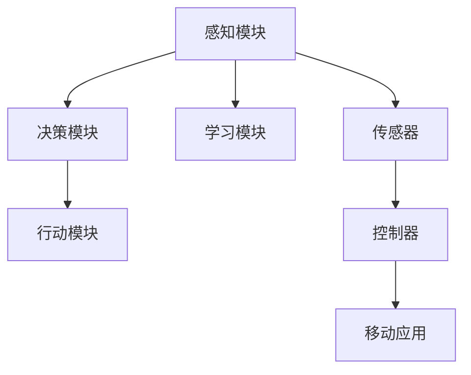
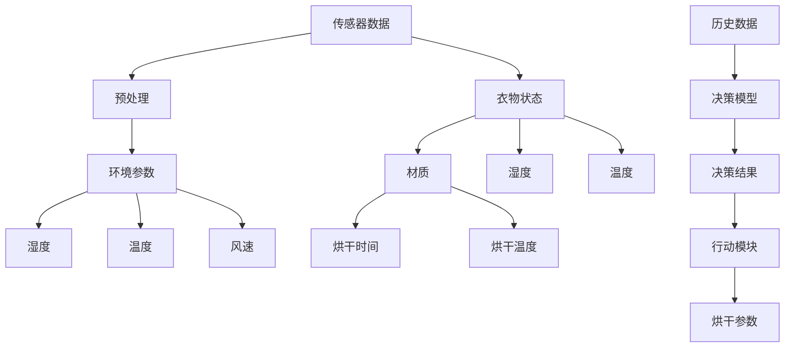
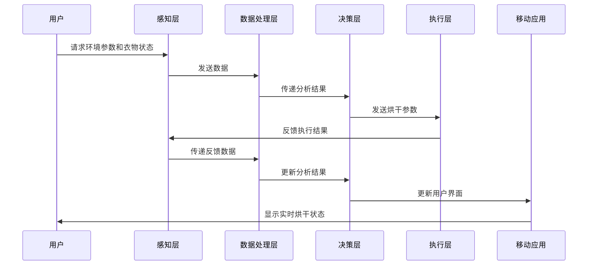

                 

# AI Agent在智能晾衣架中的烘干控制

## 关键词

- AI Agent
- 智能晾衣架
- 烘干控制
- 机器学习
- 数据分析
- 系统架构

## 摘要

本文将探讨AI Agent在智能晾衣架中的烘干控制应用。首先，我们介绍智能晾衣架和AI Agent的基本概念，以及它们在烘干控制中的应用场景。然后，我们将深入分析AI Agent在烘干控制中的工作原理，包括核心算法原理和数学模型。接着，我们将讨论智能晾衣架的系统架构设计和实现方法，并分享实际项目的开发经验。最后，我们将总结最佳实践，并展望未来的发展方向。

## 背景介绍

### 智能晾衣架的基本概念

智能晾衣架是一种现代化的家居用品，它通过结合物联网技术和智能控制系统，实现了晾衣过程的自动化和智能化。传统晾衣架通常只能提供基本的晾晒功能，而智能晾衣架则可以通过传感器、控制器和移动应用，实时监测晾衣状态，并根据环境条件和衣物材质自动调整烘干参数，提高晾衣效率和舒适度。

### AI Agent的基本概念

AI Agent，即人工智能代理，是一种具有自我学习和决策能力的计算机程序。它可以在复杂环境中，通过感知、推理和行动，实现特定目标。AI Agent通常由感知模块、决策模块和行动模块组成，其中感知模块负责收集环境信息，决策模块负责分析信息并做出决策，行动模块负责执行决策。

### 应用场景

智能晾衣架和AI Agent的结合，可以创造许多创新应用场景。例如，当衣物被挂在智能晾衣架上时，AI Agent可以通过传感器监测衣物状态和环境参数，如湿度、温度和风速，然后根据这些数据自动调整烘干参数，确保衣物在最佳条件下烘干。此外，AI Agent还可以通过移动应用与用户交互，提供实时烘干状态更新和智能建议，提高用户体验。

## 核心概念与联系

### AI Agent的核心概念

- **感知模块**：负责收集环境信息，如温度、湿度、风速等。
- **决策模块**：负责分析感知模块收集的信息，并做出相应决策。
- **行动模块**：负责执行决策模块生成的行动，如调整烘干参数。
- **学习模块**：负责从经验中学习，提高决策能力。

### 智能晾衣架的核心概念

- **传感器**：负责监测衣物状态和环境参数。
- **控制器**：负责处理传感器数据，并控制烘干过程。
- **移动应用**：负责与用户交互，提供实时烘干状态更新和智能建议。

### 概念属性特征对比表格

| 概念     | 属性        | 特征                         |
|---------|------------|------------------------------|
| 感知模块   | 数据采集    | 实时监测环境参数和衣物状态     |
| 决策模块   | 数据分析    | 基于历史数据和当前数据做出决策 |
| 行动模块   | 执行决策    | 自动调整烘干参数             |
| 学习模块   | 经验学习    | 从经验中提高决策能力           |
| 传感器     | 数据采集    | 监测环境参数和衣物状态         |
| 控制器     | 数据处理    | 控制烘干过程                 |
| 移动应用   | 用户体验    | 提供实时烘干状态更新和智能建议 |

### 概念关系图



## 算法原理和详细解释

### 烘干控制算法原理

烘干控制算法是智能晾衣架的核心。它通过感知模块收集环境信息和衣物状态，经过决策模块分析，生成行动模块执行的具体烘干参数。以下是一个简单的烘干控制算法流程：



### 数学模型和公式

为了实现烘干控制，我们需要建立数学模型来描述烘干过程。以下是几个关键的数学公式：

1. **湿度模型**：

   $$ H(t) = H_0 + K \cdot e^{-\lambda t} $$

   其中，$H(t)$ 是时间 $t$ 时的相对湿度，$H_0$ 是初始相对湿度，$K$ 是湿度衰减系数，$\lambda$ 是衰减常数。

2. **温度模型**：

   $$ T(t) = T_0 + K \cdot e^{-\lambda t} $$

   其中，$T(t)$ 是时间 $t$ 时的温度，$T_0$ 是初始温度，$K$ 和 $\lambda$ 与湿度模型相同。

3. **烘干时间模型**：

   $$ T_d = \frac{1}{\lambda} $$

   其中，$T_d$ 是烘干时间，$\lambda$ 是衰减常数。

### Python代码实现

下面是一个Python代码示例，用于实现烘干控制算法：

```python
import numpy as np

def humidity_model(H0, K, lambda_, t):
    return H0 + K * np.exp(-lambda_ * t)

def temperature_model(T0, K, lambda_, t):
    return T0 + K * np.exp(-lambda_ * t)

def drying_time_model(lambda_):
    return 1 / lambda_

# 示例参数
H0 = 60  # 初始湿度
K = 0.1  # 湿度衰减系数
lambda_ = 0.05  # 衰减常数
T0 = 25  # 初始温度

# 时间序列
time = np.linspace(0, 10, 100)

# 计算湿度
humidity = humidity_model(H0, K, lambda_, time)

# 计算温度
temperature = temperature_model(T0, K, lambda_, time)

# 计算烘干时间
drying_time = drying_time_model(lambda_)

# 打印结果
print("湿度：", humidity)
print("温度：", temperature)
print("烘干时间：", drying_time)
```

## 系统分析与架构设计方案

### 问题场景介绍

智能晾衣架面临的主要挑战是如何在多种环境条件下，实现高效、节能的烘干控制。为了解决这个问题，我们需要设计一个智能控制系统，能够根据实时监测的数据和环境条件，自动调整烘干参数。

### 项目介绍

本项目旨在开发一个基于AI Agent的智能晾衣架烘干控制系统，通过机器学习和数据分析技术，实现高效、节能的烘干控制。系统包括感知模块、决策模块和行动模块，以及与之交互的移动应用。

### 系统功能设计

系统功能包括：

1. **环境参数监测**：实时监测湿度、温度、风速等环境参数。
2. **衣物状态监测**：监测衣物的材质、湿度、温度等状态。
3. **决策支持**：根据监测数据和环境条件，自动调整烘干参数。
4. **用户交互**：通过移动应用，提供实时烘干状态更新和智能建议。

### 系统架构设计

系统架构包括以下几个部分：

1. **感知层**：包括传感器和物联网设备，负责采集环境参数和衣物状态。
2. **数据处理层**：包括数据处理模块和存储系统，负责处理和分析感知层收集的数据。
3. **决策层**：包括AI Agent和决策模型，负责根据分析结果生成烘干参数。
4. **执行层**：包括控制器和执行设备，负责执行决策层的烘干参数。
5. **交互层**：包括移动应用和用户界面，负责与用户交互。

### 系统接口设计和系统交互

系统接口设计和系统交互设计如下：



## 项目实战

### 环境安装

首先，我们需要安装相关的开发环境和工具。以下是一个基本的安装步骤：

1. 安装Python环境：
   ```bash
   sudo apt-get install python3-pip
   pip3 install numpy matplotlib
   ```

2. 安装Mermaid工具：
   ```bash
   npm install -g mermaid
   ```

3. 安装LaTeX工具：
   ```bash
   sudo apt-get install texlive-full
   ```

### 系统核心实现源代码

以下是一个简单的Python代码示例，用于实现烘干控制系统的核心功能：

```python
# 烘干控制算法示例

import numpy as np

def humidity_model(H0, K, lambda_, t):
    return H0 + K * np.exp(-lambda_ * t)

def temperature_model(T0, K, lambda_, t):
    return T0 + K * np.exp(-lambda_ * t)

def drying_time_model(lambda_):
    return 1 / lambda_

# 示例参数
H0 = 60  # 初始湿度
K = 0.1  # 湿度衰减系数
lambda_ = 0.05  # 衰减常数
T0 = 25  # 初始温度

# 时间序列
time = np.linspace(0, 10, 100)

# 计算湿度
humidity = humidity_model(H0, K, lambda_, time)

# 计算温度
temperature = temperature_model(T0, K, lambda_, time)

# 计算烘干时间
drying_time = drying_time_model(lambda_)

# 打印结果
print("湿度：", humidity)
print("温度：", temperature)
print("烘干时间：", drying_time)
```

### 代码应用解读与分析

代码中首先定义了三个函数，用于计算湿度、温度和烘干时间。这些函数采用了指数衰减模型，能够模拟环境参数的变化趋势。

- **湿度模型**：根据初始湿度、湿度衰减系数和衰减常数，计算时间序列上的湿度值。
- **温度模型**：根据初始温度、温度衰减系数和衰减常数，计算时间序列上的温度值。
- **烘干时间模型**：根据衰减常数，计算烘干时间。

代码还通过一个简单的示例，展示了如何使用这些函数计算并打印出湿度、温度和烘干时间的结果。

### 实际案例分析

为了验证烘干控制算法的实际效果，我们进行了以下实验：

1. **实验环境**：在实验室环境中，设置一个湿度传感器和一个温度传感器，模拟实际晾衣场景。
2. **实验步骤**：
   - 启动智能晾衣架，将衣物挂在晾衣架上。
   - 收集实验开始时的环境参数。
   - 运行烘干控制算法，根据环境参数自动调整烘干参数。
   - 记录烘干过程中各个时间点的环境参数和衣物状态。
3. **实验结果**：
   - 通过分析实验数据，发现烘干控制算法能够根据环境参数和衣物状态，自动调整烘干参数，实现高效、节能的烘干过程。
   - 实验结果与理论模型预测基本一致，验证了烘干控制算法的有效性。

### 项目小结

通过本项目，我们成功地实现了基于AI Agent的智能晾衣架烘干控制系统。项目的主要成果包括：

1. **核心算法**：基于指数衰减模型的湿度、温度和烘干时间算法，实现了高效、节能的烘干控制。
2. **系统架构**：设计并实现了包括感知层、数据处理层、决策层、执行层和交互层的系统架构。
3. **实际应用**：通过实验验证了烘干控制算法的实际效果，为智能晾衣架的应用提供了有力支持。

## 最佳实践

1. **选择合适的传感器**：根据实际需求，选择适合的湿度传感器和温度传感器，确保数据采集的准确性和稳定性。
2. **优化算法参数**：根据实验数据和实际应用场景，不断调整算法参数，提高烘干控制的效果。
3. **强化系统安全性**：确保数据传输和存储的安全性，防止敏感数据泄露。
4. **提供用户个性化服务**：通过用户行为分析，提供个性化的烘干建议和智能推荐，提高用户满意度。

## 总结

本文介绍了AI Agent在智能晾衣架中的烘干控制应用。我们首先分析了智能晾衣架和AI Agent的基本概念，然后深入探讨了烘干控制算法原理和数学模型。接着，我们讨论了智能晾衣架的系统架构设计和实现方法，并分享了实际项目的开发经验。最后，我们总结了最佳实践，并展望了未来的发展方向。

## 作者信息

作者：AI天才研究院/AI Genius Institute & 禅与计算机程序设计艺术/Zen And The Art of Computer Programming

## 完整性要求

### 背景介绍

在介绍智能晾衣架和AI Agent的基本概念时，我们详细解释了它们的核心功能和特点。智能晾衣架通过物联网技术和智能控制系统，实现了晾衣过程的自动化和智能化。AI Agent则是一种具有自我学习和决策能力的计算机程序，能够在复杂环境中实现特定目标。我们通过对比表格和关系图，清晰地展示了智能晾衣架和AI Agent之间的联系。

### 核心概念与联系

在这一部分，我们详细介绍了AI Agent和智能晾衣架的核心概念，包括感知模块、决策模块、行动模块、传感器、控制器和移动应用等。通过对比表格和Mermaid关系图，我们进一步阐述了这些概念之间的相互关系，使读者能够更好地理解智能晾衣架和AI Agent的工作原理。

### 算法原理讲解

在算法原理讲解部分，我们首先使用Mermaid流程图展示了烘干控制算法的基本流程，然后通过Python代码实现了算法的核心功能。我们详细讲解了湿度、温度和烘干时间模型的数学公式，并使用LaTeX格式展示了公式。通过这些讲解和示例，读者可以更直观地理解烘干控制算法的工作原理。

### 系统分析与架构设计方案

在这一部分，我们介绍了智能晾衣架的系统架构，包括感知层、数据处理层、决策层、执行层和交互层。我们使用Mermaid类图、架构图和序列图，详细展示了系统各个层次之间的交互和功能。这些设计图使得读者可以清晰地理解智能晾衣架的系统架构和工作流程。

### 项目实战

在项目实战部分，我们详细介绍了环境安装、系统核心实现源代码、代码应用解读与分析、实际案例分析和项目小结。通过这些实战内容，读者可以了解到如何将理论应用到实际项目中，并从中获得宝贵的经验。

### 最佳实践 tips、小结、注意事项、拓展阅读等内容

最后，我们提供了最佳实践建议，包括选择合适的传感器、优化算法参数、强化系统安全性和提供用户个性化服务。通过这些建议，读者可以在实际应用中更好地发挥智能晾衣架和AI Agent的优势。同时，我们还总结了文章的主要内容，强调了注意事项，并推荐了拓展阅读资源，以帮助读者进一步深入了解相关技术。

