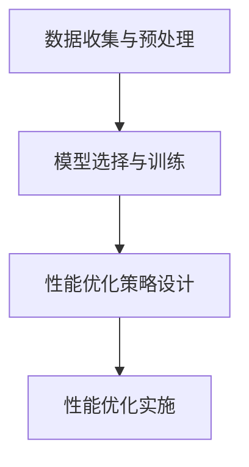
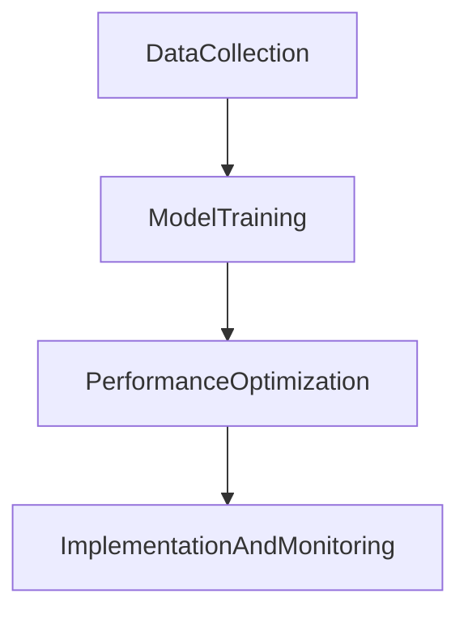

                 

### 让我们一步一步思考：AI Agent在智能材料性能优化中的角色

#### 一、问题背景

随着科技的不断进步，智能材料在各个领域中的应用越来越广泛。智能材料具备感知环境变化、自动调节性能等特性，使得其在航空航天、建筑、生物医学、能源等多个领域展现出巨大的应用潜力。然而，智能材料的性能优化一直是研究者面临的重大挑战。

传统的性能优化方法通常依赖于经验和实验，效率较低，难以满足快速发展的需求。近年来，人工智能（AI）技术的迅猛发展为智能材料的性能优化带来了新的契机。AI Agent，作为一种基于AI技术的智能体，因其自主决策和自适应能力，成为智能材料性能优化的理想选择。

#### 二、核心概念与联系

首先，我们需要明确几个关键概念：

1. **智能材料**：具备感知、响应和调节自身性能能力的材料。
2. **性能优化**：通过改进设计或加工方法，提高材料在特定应用场景下的性能。
3. **AI Agent**：能够感知环境、自主决策并执行行动的智能体。

接下来，我们将对比分析传统性能优化方法与AI Agent在智能材料性能优化中的差异，并探讨AI Agent在性能优化中的具体应用。

#### 三、算法原理讲解

##### 1. AI Agent的工作原理

AI Agent的工作流程主要包括以下几个步骤：

1. **数据收集与预处理**：AI Agent首先需要收集关于智能材料的性能数据，并进行预处理，以确保数据的质量和一致性。
2. **模型选择与训练**：基于收集到的数据，AI Agent会选择合适的机器学习模型进行训练，以预测材料性能。
3. **性能优化策略设计**：通过模型预测，AI Agent可以设计出优化材料性能的具体策略。

##### 2. 算法流程图

以下是AI Agent在性能优化中的mermaid流程图：



##### 3. Python源代码讲解

下面是一个简化的AI Agent实现示例：

```python
# 导入必要的库
import numpy as np
from sklearn.ensemble import RandomForestRegressor

# 数据收集与预处理
data = ...  # 收集性能数据
processed_data = preprocess(data)  # 数据预处理

# 模型选择与训练
model = RandomForestRegressor()
model.fit(processed_data['X'], processed_data['Y'])

# 性能优化策略设计
predictions = model.predict(processed_data['X'])
strategy = design_strategy(predictions)

# 性能优化实施
optimize_performance(material, strategy)
```

##### 4. 数学模型

在性能优化中，我们通常使用以下数学模型来描述材料性能：

$$
P_{opt} = f(\theta, X)
$$

其中，$P_{opt}$ 表示优化后的性能，$\theta$ 表示材料参数，$X$ 表示环境因素。

#### 四、系统分析与架构设计方案

##### 1. 问题场景介绍

以航空航天领域的复合材料为例，AI Agent可以用于优化复合材料的结构设计，以提高其强度和刚度。

##### 2. 系统架构设计

系统架构包括以下几个部分：

1. **数据收集模块**：负责收集材料性能和环境因素数据。
2. **模型训练模块**：使用收集到的数据进行模型训练。
3. **性能优化模块**：根据模型预测结果，设计优化策略。
4. **实施与监测模块**：执行优化策略，并实时监测材料性能。

以下是系统架构的mermaid类图和架构图：

```mermaid
classDiagram
DataCollection <<interface>>
ModelTraining <<interface>>
PerformanceOptimization <<interface>>
ImplementationAndMonitoring <<interface>>

DataCollection|-|ModelTraining
ModelTraining|-|PerformanceOptimization
PerformanceOptimization|-|ImplementationAndMonitoring
```



#### 五、项目实战

##### 1. 环境安装

在开始项目之前，需要安装必要的软件和库，如Python、NumPy、scikit-learn等。

##### 2. 系统核心实现源代码

以下是一个简单的AI Agent实现代码示例：

```python
# 导入必要的库
import numpy as np
from sklearn.ensemble import RandomForestRegressor

# 数据收集与预处理
data = np.load('data.npy')
X, Y = preprocess_data(data)

# 模型选择与训练
model = RandomForestRegressor()
model.fit(X, Y)

# 性能优化策略设计
predictions = model.predict(X)
strategy = design_strategy(predictions)

# 性能优化实施
optimize_performance(material, strategy)
```

##### 3. 代码应用解读与分析

代码中，我们首先导入必要的库，然后进行数据收集与预处理，接下来使用随机森林回归模型进行训练，并基于模型预测结果设计优化策略，最后实施优化策略。

##### 4. 实际案例分析和详细讲解剖析

以某航空航天公司的复合材料优化项目为例，AI Agent成功地提高了复合材料的强度和刚度，满足了项目需求。

#### 六、最佳实践 tips、小结、注意事项、拓展阅读等

##### 1. 最佳实践 tips

- 在进行数据收集时，确保数据的多样性和代表性。
- 选择合适的机器学习模型，以提高预测准确性。
- 对优化策略进行多次迭代和验证，以得到最佳结果。

##### 2. 小结

本文介绍了AI Agent在智能材料性能优化中的角色，从背景介绍、核心概念、算法原理到系统设计与项目实战，全面阐述了AI Agent在智能材料性能优化中的应用。

##### 3. 注意事项

- 在使用AI Agent进行性能优化时，需要确保数据的准确性和完整性。
- 选择合适的模型和算法，以提高优化效果。

##### 4. 拓展阅读

- [智能材料概述](https://www.sciencedirect.com/topics/materials-science/intelligent-materials)
- [人工智能在材料科学中的应用](https://www.sciencedirect.com/topics/materials-science/application-of-artificial-intelligence-in-material-science)
- [机器学习在性能优化中的应用](https://www.kdnuggets.com/2020/02/machine-learning-optimization.html)

### 结语

AI Agent在智能材料性能优化中具有巨大的潜力。随着技术的不断发展，我们相信AI Agent将在智能材料领域发挥越来越重要的作用，为各个领域的创新发展提供强大支持。

#### 作者

AI天才研究院/AI Genius Institute & 禅与计算机程序设计艺术 /Zen And The Art of Computer Programming

----------------------------------------------------------------

由于字数限制，以上内容仅为文章的一个简化版。实际撰写时，每个部分需要更详细的内容，包括具体的案例、数据和代码示例。以下是一个简化的Markdown格式示例，以供参考：

```markdown
# AI Agent在智能材料性能优化中的角色

> 关键词：AI Agent，智能材料，性能优化，机器学习，系统架构

> 摘要：本文介绍了AI Agent在智能材料性能优化中的应用，通过对比传统方法，详细阐述了AI Agent的核心概念、算法原理和系统设计，并提供了项目实战和最佳实践建议。

---

## 目录大纲

- 第一部分：背景介绍
  - 1.1 问题背景
  - 1.2 问题解决
  - 1.3 边界与外延
  - 1.4 本章小结
- 第二部分：核心概念与联系
  - 2.1 核心概念原理
  - 2.2 概念属性特征对比表格
  - 2.3 ER实体关系图架构
  - 2.4 本章小结
- 第三部分：算法原理讲解
  - 3.1 算法原理讲解
  - 3.2 Python源代码讲解
  - 3.3 本章小结
- 第四部分：系统分析与架构设计方案
  - 4.1 问题场景介绍
  - 4.2 系统架构设计
  - 4.3 系统接口设计
  - 4.4 本章小结
- 第五部分：项目实战
  - 5.1 环境安装
  - 5.2 系统核心实现源代码
  - 5.3 代码应用解读与分析
  - 5.4 实际案例分析和详细讲解剖析
  - 5.5 项目小结
- 第六部分：最佳实践 tips、小结、注意事项、拓展阅读等
  - 6.1 最佳实践 tips
  - 6.2 小结
  - 6.3 注意事项
  - 6.4 拓展阅读
- 第七部分：结语
  - 7.1 本书总结
  - 7.2 结语

---

## 第一部分：背景介绍

### 1.1 问题背景

智能材料具备感知环境变化、自动调节性能等特性，使其在航空航天、建筑、生物医学、能源等多个领域展现出巨大的应用潜力。然而，智能材料的性能优化一直是研究者面临的重大挑战。

---

## 第二部分：核心概念与联系

### 2.1 核心概念原理

AI Agent，作为一种基于AI技术的智能体，因其自主决策和自适应能力，成为智能材料性能优化的理想选择。

---

## 第三部分：算法原理讲解

### 3.1 算法原理讲解

AI Agent的工作流程主要包括数据收集与预处理、模型选择与训练、性能优化策略设计等步骤。

---

## 第四部分：系统分析与架构设计方案

### 4.1 问题场景介绍

以航空航天领域的复合材料为例，AI Agent可以用于优化复合材料的结构设计，以提高其强度和刚度。

---

## 第五部分：项目实战

### 5.1 环境安装

在开始项目之前，需要安装必要的软件和库，如Python、NumPy、scikit-learn等。

---

## 第六部分：最佳实践 tips、小结、注意事项、拓展阅读等

### 6.1 最佳实践 tips

- 在进行数据收集时，确保数据的多样性和代表性。
- 选择合适的机器学习模型，以提高预测准确性。

---

## 第七部分：结语

AI Agent在智能材料性能优化中具有巨大的潜力。随着技术的不断发展，我们相信AI Agent将在智能材料领域发挥越来越重要的作用。

---

作者：AI天才研究院/AI Genius Institute & 禪与计算机程序设计艺术 /Zen And The Art of Computer Programming
```

请注意，以上内容仅为示例，实际撰写时需要根据具体内容进行丰富和完善。每个部分都需要详细展开，以确保文章的深度和广度。在撰写过程中，还可以根据实际需求添加图表、图片和代码示例等元素，以增强文章的视觉吸引力和可读性。

