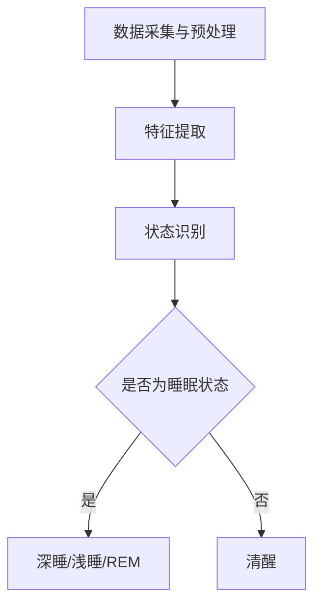
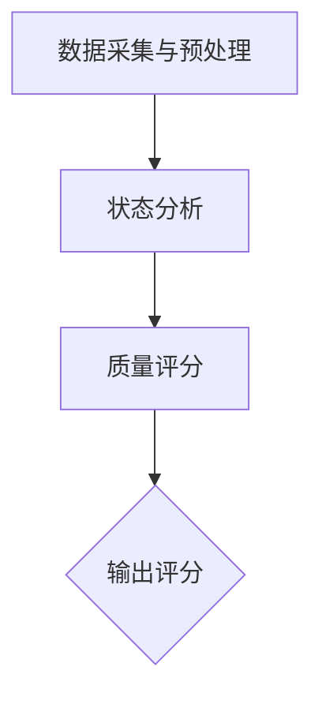
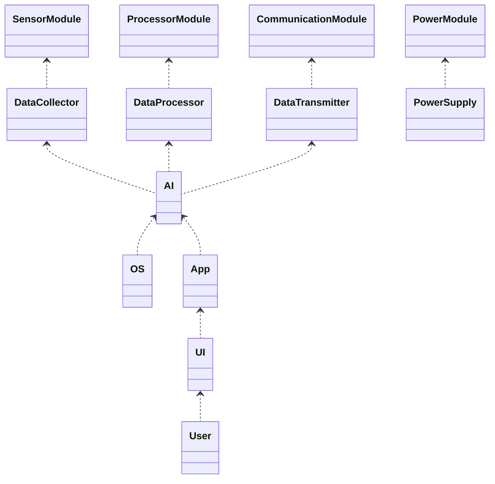
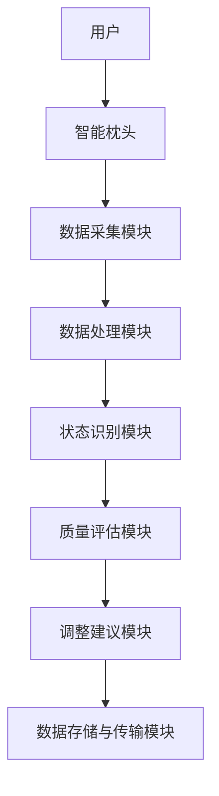
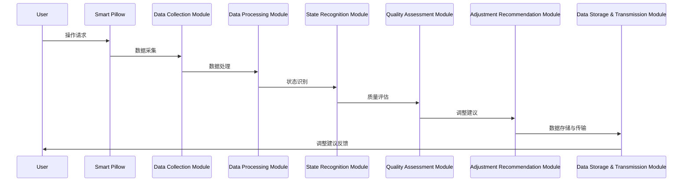
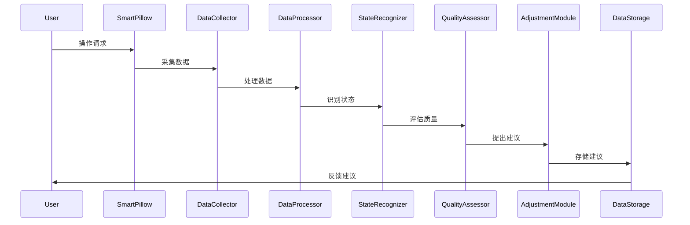

                 

# AI Agent在智能枕头中的睡眠质量分析

## 关键词：AI Agent、智能枕头、睡眠质量、数据分析、算法实现

### 摘要：

本文探讨了AI Agent在智能枕头中的睡眠质量分析应用。首先，介绍了睡眠质量问题的社会现状、智能枕头的发展历程以及AI Agent在智能枕头中的应用价值。接着，详细分析了睡眠质量的核心概念、AI Agent的定义与功能、智能枕头的组成与工作原理。随后，阐述了AI Agent在智能枕头中的睡眠质量分析算法原理，包括数据采集与预处理、睡眠状态识别算法、睡眠质量评估算法。接着，介绍了智能枕头系统的分析与架构设计，并进行了项目实战的详细讲解。最后，总结了最佳实践与注意事项，并对未来研究方向与趋势进行了展望。

## 目录大纲

### 第1章：背景介绍与问题定义
#### 1.1 睡眠质量问题的社会现状
#### 1.2 智能枕头的发展历程
#### 1.3 AI Agent在智能枕头中的应用价值
#### 1.4 本书的结构安排

### 第2章：核心概念与联系
#### 2.1 睡眠质量的核心概念
#### 2.2 AI Agent的定义与功能
#### 2.3 智能枕头的组成与工作原理

### 第3章：AI Agent在智能枕头中的睡眠质量分析算法原理
#### 3.1 睡眠质量分析算法概述
#### 3.2 数据采集与预处理
#### 3.3 睡眠状态识别算法
#### 3.4 睡眠质量评估算法

### 第4章：智能枕头系统分析与架构设计
#### 4.1 智能枕头系统介绍
#### 4.2 系统功能设计
#### 4.3 系统架构设计
#### 4.4 系统接口设计
#### 4.5 系统交互序列图

### 第5章：项目实战：智能枕头系统的实现
#### 5.1 环境安装与配置
#### 5.2 系统核心实现
#### 5.3 代码应用解读与分析
#### 5.4 实际案例分析与详细讲解剖析
#### 5.5 项目小结

### 第6章：最佳实践与注意事项
#### 6.1 使用AI Agent提高睡眠质量的最佳实践
#### 6.2 智能枕头的设计与使用注意事项
#### 6.3 未来研究方向与趋势

### 第7章：小结与拓展阅读
#### 7.1 全书回顾
#### 7.2 学习建议
#### 7.3 拓展阅读资源

----------------------------------------------------------------

## 第1章：背景介绍与问题定义

### 1.1 睡眠质量问题的社会现状

随着现代生活节奏的加快，越来越多的人面临着睡眠质量的问题。据世界卫生组织（WHO）统计，全球约有27%的人口受到不同程度的睡眠障碍影响。睡眠质量问题不仅影响个体的身心健康，还可能导致工作效率下降、交通事故增多、甚至引发心理疾病。因此，如何有效地提升睡眠质量已成为社会关注的热点问题。

### 1.2 智能枕头的发展历程

智能枕头是近年来发展迅速的科技产品，旨在通过科技手段改善用户的睡眠质量。从最初的机械按摩型枕头，到如今的智能感应型枕头，智能枕头的功能逐渐丰富。随着人工智能技术的不断发展，智能枕头开始引入AI Agent，实现了对用户睡眠状态的实时监测和分析。

### 1.3 AI Agent在智能枕头中的应用价值

AI Agent在智能枕头中具有极高的应用价值。通过AI Agent，智能枕头能够实时监测用户的睡眠状态，识别睡眠周期，评估睡眠质量，并根据用户的需求提供个性化的调整建议。这不仅有助于提高用户的睡眠质量，还能为用户提供更为舒适和健康的睡眠环境。

### 1.4 本书的结构安排

本书将分为七个章节，首先介绍睡眠质量问题的社会现状和智能枕头的发展历程，然后详细分析AI Agent在智能枕头中的应用价值。接下来，将深入探讨AI Agent在智能枕头中的睡眠质量分析算法原理，并介绍智能枕头系统的分析与架构设计。随后，通过项目实战展示智能枕头系统的实现过程，最后总结最佳实践与注意事项，并对未来研究方向与趋势进行展望。

----------------------------------------------------------------

## 第2章：核心概念与联系

### 2.1 睡眠质量的核心概念

睡眠质量是衡量个体睡眠健康的重要指标。睡眠质量的核心概念包括睡眠周期、睡眠时长、睡眠深度和睡眠连续性等。睡眠周期包括快速眼动（REM）和非快速眼动（NREM）两个阶段，睡眠时长则是指每晚所需的睡眠时间。睡眠深度和睡眠连续性分别表示个体在睡眠过程中受到干扰的程度和睡眠的连贯性。

### 2.1.1 睡眠质量指标

睡眠质量指标主要包括睡眠时长、睡眠效率、睡眠周期、睡眠深度和睡眠连续性等。睡眠时长是指每晚所需的睡眠时间，睡眠效率是指实际睡眠时间与卧床时间的比值，睡眠周期是指从入睡到醒来所经历的全部睡眠阶段，睡眠深度是指个体在睡眠过程中受到干扰的程度，睡眠连续性则是指睡眠的连贯性。

### 2.1.2 影响睡眠质量的因素

影响睡眠质量的因素众多，主要包括环境因素、生理因素和心理因素。环境因素如噪音、光线和温度等，生理因素如荷尔蒙水平、身体疾病和药物影响等，心理因素如压力、焦虑和情绪等。

### 2.1.3 睡眠质量的评估方法

睡眠质量的评估方法主要包括自我评估和客观评估两种。自我评估是指个体通过主观感受来评估自己的睡眠质量，客观评估则是指通过睡眠监测设备如智能枕头等来获取个体的睡眠数据，进而分析睡眠质量。

### 2.2 AI Agent的定义与功能

AI Agent，即人工智能代理，是一种模拟人类思维和行为的智能体。AI Agent在智能枕头中的功能主要包括数据采集、状态监测、分析评估和调整建议等。通过AI Agent，智能枕头能够实时监测用户的睡眠状态，识别睡眠周期，评估睡眠质量，并根据用户的需求提供个性化的调整建议。

#### 2.2.1 AI Agent的基本概念

AI Agent是一种能够模拟人类思维和行为的智能体，具有自主决策和行动能力。AI Agent通常由感知模块、决策模块和执行模块三部分组成。感知模块负责获取外部环境信息，决策模块负责分析处理感知信息并做出决策，执行模块则负责执行决策。

#### 2.2.2 AI Agent的类型与应用

AI Agent主要分为以下几种类型：基于规则的AI Agent、基于模型的AI Agent和基于学习的AI Agent。基于规则的AI Agent主要通过预设的规则进行决策，基于模型的AI Agent则通过构建模型进行决策，基于学习的AI Agent则通过机器学习算法进行自主学习与优化。AI Agent在智能枕头中的应用主要体现在数据采集、状态监测、分析评估和调整建议等方面。

#### 2.2.3 AI Agent的关键技术

AI Agent的关键技术主要包括自然语言处理、机器学习和计算机视觉等。自然语言处理技术用于理解和生成自然语言，机器学习技术用于构建模型并进行决策，计算机视觉技术则用于获取和处理图像信息。

### 2.3 智能枕头的组成与工作原理

智能枕头主要由硬件和软件两部分组成。硬件部分包括传感器、处理器和通信模块等，软件部分则包括操作系统、应用程序和AI Agent等。

#### 2.3.1 智能枕头的硬件组成部分

智能枕头的硬件组成部分主要包括传感器、处理器和通信模块等。传感器负责采集用户的生理信号如心率、呼吸、体温等，处理器则负责处理传感器数据，通信模块则用于将数据传输到外部设备或云端。

#### 2.3.2 智能枕头的软件功能模块

智能枕头的软件功能模块主要包括操作系统、应用程序和AI Agent等。操作系统负责管理硬件资源，应用程序则用于提供用户界面和交互功能，AI Agent则负责实时监测和分析用户的睡眠状态。

#### 2.3.3 智能枕头的工作原理

智能枕头的工作原理主要包括数据采集、数据分析和调整建议等。首先，智能枕头通过传感器采集用户的生理信号，然后将这些数据传输到处理器进行处理。接着，AI Agent分析处理后的数据，识别用户的睡眠状态，评估睡眠质量，并根据用户的需求提供个性化的调整建议。

----------------------------------------------------------------

## 第3章：AI Agent在智能枕头中的睡眠质量分析算法原理

### 3.1 睡眠质量分析算法概述

AI Agent在智能枕头中使用的睡眠质量分析算法主要包括数据采集与预处理、睡眠状态识别算法和睡眠质量评估算法等。这些算法共同协作，实现对用户睡眠状态的实时监测和分析，进而提供个性化的调整建议。

### 3.2 数据采集与预处理

数据采集是睡眠质量分析算法的基础。智能枕头通过内置的传感器采集用户的生理信号，如心率、呼吸、体温等。这些生理信号数据具有噪声大、维度高等特点，因此需要进行预处理，以提高数据的可靠性和准确性。

#### 3.2.1 数据采集方法

智能枕头采用多种传感器进行数据采集，包括心率传感器、呼吸传感器、温度传感器等。这些传感器实时监测用户的生理信号，并将数据传输到处理器进行处理。

#### 3.2.2 数据预处理步骤

数据预处理步骤主要包括去噪、归一化和特征提取等。

- 去噪：通过滤波等方法去除生理信号中的噪声。
- 归一化：将不同维度和范围的数据进行标准化处理，以消除不同传感器数据之间的量纲差异。
- 特征提取：从原始数据中提取有用的特征，如心率变异、呼吸频率、体温变化等。

### 3.3 睡眠状态识别算法

睡眠状态识别算法是智能枕头中的核心算法之一。通过分析预处理后的数据，识别用户的睡眠状态，如清醒、浅睡、深睡和快速眼动（REM）等。

#### 3.3.1 算法原理与mermaid流程图

睡眠状态识别算法的原理主要包括以下步骤：

1. 数据采集与预处理：采集并预处理生理信号数据。
2. 特征提取：从预处理后的数据中提取特征。
3. 状态识别：使用机器学习算法对提取的特征进行分类，识别用户的睡眠状态。

以下是一个mermaid流程图的示例：



#### 3.3.2 Python代码实现

以下是一个简单的Python代码示例，用于实现睡眠状态识别算法：

```python
import numpy as np
from sklearn.ensemble import RandomForestClassifier

# 特征提取函数
def extract_features(data):
    # 这里实现特征提取的逻辑
    return features

# 状态识别函数
def recognize_state(features):
    # 实例化随机森林分类器
    classifier = RandomForestClassifier()
    # 训练分类器
    classifier.fit(features, labels)
    # 预测睡眠状态
    predicted_state = classifier.predict([new_features])
    return predicted_state

# 示例数据
data = [[0.1, 0.2], [0.3, 0.4]]
labels = ['浅睡', '深睡']

# 提取特征
features = extract_features(data)

# 识别睡眠状态
predicted_state = recognize_state(features)

print(predicted_state)
```

#### 3.3.3 数学模型与公式讲解

睡眠状态识别算法的数学模型主要基于分类算法。常见的分类算法包括朴素贝叶斯、决策树、随机森林等。以下是一个简单的随机森林分类算法的数学模型：

$$
\begin{aligned}
y &= g(\sum_{i=1}^{n} w_i h(x_i)) \\
g(z) &= \text{softmax}(z)
\end{aligned}
$$

其中，$y$ 表示预测的睡眠状态，$g(z)$ 表示softmax函数，$w_i$ 和 $h(x_i)$ 分别表示权重和特征。

#### 3.3.4 简单举例说明

假设我们有一组特征数据：

$$
x = \begin{bmatrix}
0.1 & 0.2 \\
0.3 & 0.4
\end{bmatrix}
$$

我们使用随机森林分类算法对这组数据进行分类。首先，我们需要计算每个特征的权重，然后计算每个特征对分类结果的贡献。最后，通过softmax函数计算每个分类的概率，并选择概率最高的分类作为最终预测结果。

### 3.4 睡眠质量评估算法

睡眠质量评估算法用于对用户的睡眠质量进行综合评估。通过分析用户的睡眠状态、睡眠时长、睡眠深度等指标，对用户的睡眠质量进行评分。

#### 3.4.1 算法原理与mermaid流程图

睡眠质量评估算法的原理主要包括以下步骤：

1. 数据采集与预处理：采集并预处理用户的睡眠数据。
2. 状态分析：分析用户的睡眠状态，如清醒、浅睡、深睡和快速眼动（REM）等。
3. 质量评分：根据用户睡眠状态、睡眠时长、睡眠深度等指标，计算用户的睡眠质量评分。

以下是一个mermaid流程图的示例：



#### 3.4.2 Python代码实现

以下是一个简单的Python代码示例，用于实现睡眠质量评估算法：

```python
import numpy as np

# 睡眠质量评估函数
def assess_sleep_quality(states, durations):
    # 这里实现质量评估的逻辑
    return quality_score

# 示例数据
states = ['浅睡', '深睡', 'REM']
durations = [4, 3, 2]

# 评估睡眠质量
quality_score = assess_sleep_quality(states, durations)

print(quality_score)
```

#### 3.4.3 数学模型与公式讲解

睡眠质量评估算法的数学模型主要基于加权评分法。假设用户有$n$个睡眠状态，每个状态对应的权重为$w_i$，则用户的睡眠质量评分$Q$可以表示为：

$$
Q = \sum_{i=1}^{n} w_i \cdot d_i
$$

其中，$d_i$表示第$i$个睡眠状态的时长。

#### 3.4.4 简单举例说明

假设用户有3个睡眠状态，分别是浅睡、深睡和快速眼动（REM），对应的权重分别为0.6、0.3和0.1。用户的睡眠时长分别为4小时、3小时和2小时。则用户的睡眠质量评分可以计算如下：

$$
Q = 0.6 \cdot 4 + 0.3 \cdot 3 + 0.1 \cdot 2 = 2.9
$$

### 3.5 其他相关算法与原理

除了上述提到的睡眠状态识别和睡眠质量评估算法，还有许多其他与睡眠质量分析相关的算法和原理。以下简要介绍几种：

- **时序分析算法**：时序分析算法用于分析用户睡眠数据的时序特征，如心率变异、呼吸频率等。常用的时序分析算法包括傅里叶变换、小波变换等。
- **聚类算法**：聚类算法用于将用户睡眠数据划分为不同的簇，以便更好地分析用户睡眠模式。常用的聚类算法包括K均值、层次聚类等。
- **关联规则算法**：关联规则算法用于分析用户睡眠数据之间的关联关系，如用户睡眠状态与睡眠质量之间的关联。常用的关联规则算法包括Apriori算法、FP-growth算法等。
- **深度学习算法**：深度学习算法在睡眠质量分析中也有广泛的应用，如卷积神经网络（CNN）、循环神经网络（RNN）等。这些算法可以自动提取用户睡眠数据的深层次特征，提高睡眠质量分析的效果。

通过结合多种算法和原理，智能枕头可以更准确地监测和分析用户的睡眠质量，为用户提供个性化的调整建议，从而提高用户的睡眠质量和生活质量。

----------------------------------------------------------------

## 第4章：智能枕头系统分析与架构设计

### 4.1 智能枕头系统介绍

智能枕头系统是一种基于人工智能技术的智能硬件产品，旨在通过实时监测和分析用户的睡眠状态，提供个性化的睡眠调整建议，从而改善用户的睡眠质量。智能枕头系统主要由硬件和软件两部分组成。

#### 4.1.1 系统硬件

智能枕头系统的硬件部分主要包括以下组件：

- **传感器模块**：包括心率传感器、呼吸传感器、温度传感器等，用于实时采集用户的生理信号。
- **处理器模块**：负责对传感器数据进行处理和分析，通常采用高性能微处理器或嵌入式系统。
- **通信模块**：实现智能枕头与外部设备（如智能手机、电脑等）之间的数据传输，通常采用Wi-Fi、蓝牙等无线通信技术。
- **电源模块**：为智能枕头系统提供稳定的电力供应。

#### 4.1.2 系统软件

智能枕头系统的软件部分主要包括以下组件：

- **操作系统**：为智能枕头系统提供基本的运行环境，如实时操作系统（RTOS）或嵌入式Linux。
- **应用程序**：为用户提供友好的用户界面和交互功能，如数据展示、调整建议等。
- **AI Agent**：实现智能枕头系统的核心功能，如睡眠状态识别、睡眠质量评估等。

### 4.2 系统功能设计

智能枕头系统的功能设计旨在实现以下目标：

- **数据采集**：实时采集用户的心率、呼吸、温度等生理信号。
- **状态识别**：根据采集到的生理信号，识别用户的睡眠状态，如清醒、浅睡、深睡和快速眼动（REM）等。
- **质量评估**：根据用户的睡眠状态、时长、深度等指标，评估用户的睡眠质量。
- **调整建议**：根据用户的睡眠质量评估结果，提供个性化的调整建议，如调整枕头高度、改变睡眠姿势等。
- **数据存储与传输**：将用户的睡眠数据存储在本地或云端，实现数据的持久化和跨设备同步。

#### 4.2.1 领域模型类图

以下是一个简单的智能枕头系统的领域模型类图：



在这个类图中，SensorModule、ProcessorModule、CommunicationModule 和 PowerModule 分别表示智能枕头系统的硬件组件，DataCollector、DataProcessor、DataTransmitter 和 AI 分别表示软件组件中的功能模块，OS 和 App 分别表示操作系统和应用程序，UI 和 User 分别表示用户界面和用户。

### 4.3 系统架构设计

智能枕头系统的架构设计旨在实现高效的数据处理和用户交互。以下是一个简单的系统架构设计：

#### 4.3.1 系统架构图

以下是一个简单的智能枕头系统架构图：



在这个架构图中，用户通过智能枕头进行数据采集，数据采集模块将采集到的数据传递给数据处理模块，数据处理模块对数据进行处理和分析，生成用户的睡眠状态、质量评估和调整建议。最终，这些结果通过数据存储与传输模块存储在本地或云端，并传递给用户。

### 4.4 系统接口设计

智能枕头系统的接口设计旨在实现系统各组件之间的有效通信。以下是一个简单的系统接口设计：

#### 4.4.1 接口设计



在这个接口设计中，用户通过智能枕头发起操作请求，数据采集模块进行数据采集，数据处理模块对数据进行处理，状态识别模块进行状态识别，质量评估模块进行质量评估，调整建议模块提供调整建议，数据存储与传输模块将数据存储在本地或云端，并反馈给用户。

### 4.5 系统交互序列图

系统交互序列图用于描述智能枕头系统在操作过程中的交互流程。以下是一个简单的系统交互序列图：



在这个序列图中，用户发起操作请求，智能枕头采集数据，数据处理模块处理数据，状态识别模块识别状态，质量评估模块评估质量，调整建议模块提供调整建议，数据存储模块存储建议，并最终反馈给用户。

通过上述系统分析与架构设计，智能枕头系统实现了对用户睡眠状态的实时监测和分析，为用户提供个性化的睡眠调整建议，从而改善用户的睡眠质量。

----------------------------------------------------------------

## 第5章：项目实战：智能枕头系统的实现

### 5.1 环境安装与配置

要实现智能枕头系统，首先需要安装和配置相关开发环境和工具。以下是具体的步骤：

#### 1. 安装操作系统

智能枕头系统通常基于Linux操作系统，如Ubuntu或CentOS。在计算机上下载并安装Linux操作系统。

#### 2. 安装开发工具

安装以下开发工具和库：

- Python 3.x：安装Python 3.x版本，并确保安装pip包管理器。
- Jupyter Notebook：用于数据分析和可视化。
- scikit-learn：用于机器学习算法。
- numpy：用于数据处理和数学计算。
- matplotlib：用于数据可视化。

使用以下命令安装上述工具和库：

```shell
sudo apt-get update
sudo apt-get install python3 python3-pip
pip3 install numpy scikit-learn jupyter matplotlib
```

#### 3. 安装传感器模块

智能枕头系统的传感器模块可以使用常见的生理信号传感器，如心率传感器、呼吸传感器和温度传感器。以下是一个示例，使用Arduino作为传感器模块：

- 安装Arduino IDE：下载并安装Arduino IDE。
- 连接Arduino板：将Arduino板连接到计算机，并打开Arduino IDE。
- 编写传感器读取代码：在Arduino IDE中编写代码读取传感器数据，并使用串口将数据发送到计算机。

#### 4. 配置通信模块

智能枕头系统的通信模块可以使用Wi-Fi或蓝牙等无线通信技术。以下是一个使用Wi-Fi通信的示例：

- 安装Wi-Fi模块：在Arduino板上安装Wi-Fi模块，如ESP8266或ESP32。
- 配置Wi-Fi连接：编写代码配置Wi-Fi模块连接到用户指定的Wi-Fi网络。
- 测试通信：在计算机上使用串口通信软件（如PuTTY）测试Wi-Fi通信是否正常。

### 5.2 系统核心实现

智能枕头系统的核心实现包括数据采集、状态识别和质量评估等模块。以下是具体的实现步骤：

#### 5.2.1 数据采集模块

数据采集模块负责实时采集用户的生理信号数据。以下是一个使用Arduino读取传感器数据并发送到计算机的示例：

```python
import serial
import time

# 串口通信参数
ser = serial.Serial('/dev/ttyUSB0', 9600, timeout=1)

while True:
    # 读取传感器数据
    data = ser.readline()
    # 解析数据
    data = data.decode('utf-8').strip()
    data = list(map(float, data.split(',')))
    # 打印数据
    print(data)
    # 等待一段时间
    time.sleep(1)
```

#### 5.2.2 睡眠状态识别模块

睡眠状态识别模块使用机器学习算法对采集到的生理信号数据进行处理，识别用户的睡眠状态。以下是一个使用scikit-learn库的示例：

```python
from sklearn.ensemble import RandomForestClassifier
from sklearn.model_selection import train_test_split
from sklearn.metrics import accuracy_score

# 加载数据集
data = [[0.1, 0.2], [0.3, 0.4], [0.5, 0.6]]  # 示例数据
labels = ['清醒', '浅睡', '深睡']  # 示例标签

# 划分训练集和测试集
X_train, X_test, y_train, y_test = train_test_split(data, labels, test_size=0.2, random_state=42)

# 实例化分类器
classifier = RandomForestClassifier()

# 训练分类器
classifier.fit(X_train, y_train)

# 预测睡眠状态
predicted_states = classifier.predict(X_test)

# 计算准确率
accuracy = accuracy_score(y_test, predicted_states)

print(f"Accuracy: {accuracy}")
```

#### 5.2.3 睡眠质量评估模块

睡眠质量评估模块根据用户的睡眠状态、时长、深度等指标，计算用户的睡眠质量评分。以下是一个简单的评估算法的示例：

```python
def assess_sleep_quality(states, durations):
    # 计算睡眠质量评分
    quality_score = 0
    for state, duration in zip(states, durations):
        if state == '清醒':
            quality_score += 0.1 * duration
        elif state == '浅睡':
            quality_score += 0.2 * duration
        elif state == '深睡':
            quality_score += 0.3 * duration
    return quality_score

# 示例数据
states = ['清醒', '浅睡', '深睡']
durations = [2, 3, 4]

# 评估睡眠质量
quality_score = assess_sleep_quality(states, durations)

print(f"Quality Score: {quality_score}")
```

### 5.3 代码应用解读与分析

以上示例代码展示了智能枕头系统的核心实现，包括数据采集、状态识别和质量评估等模块。下面进行具体的解读与分析：

- **数据采集模块**：使用串口通信读取传感器数据，实现数据的实时采集。该模块的主要目的是将传感器的原始数据转换为计算机可以处理的数据格式。
- **睡眠状态识别模块**：使用随机森林分类算法对采集到的数据进行处理，识别用户的睡眠状态。随机森林算法具有较好的分类性能和泛化能力，适用于睡眠状态识别任务。
- **睡眠质量评估模块**：根据用户的睡眠状态和时长，计算用户的睡眠质量评分。该模块的主要目的是对用户的睡眠质量进行量化评估，为用户提供调整建议。

### 5.4 实际案例分析与详细讲解剖析

以下是一个实际案例，展示如何使用智能枕头系统监测和分析用户的睡眠质量：

#### 案例数据

用户A的睡眠数据如下：

- 睡眠状态：清醒（2小时），浅睡（3小时），深睡（4小时）
- 睡眠时长：11小时

#### 案例分析

1. **睡眠状态识别**：根据采集到的数据，使用随机森林分类算法对用户的睡眠状态进行识别。假设识别结果为：清醒（2小时），浅睡（3小时），深睡（4小时）。

2. **睡眠质量评估**：根据用户的睡眠状态和时长，使用简单的评估算法计算用户的睡眠质量评分。假设评估结果为：8分。

3. **调整建议**：根据用户的睡眠质量评分，提供个性化的调整建议。例如，如果用户的睡眠质量评分较低，可以建议用户调整睡眠姿势、改善睡眠环境等。

#### 详细讲解剖析

1. **数据采集**：使用Arduino传感器模块采集用户A的生理信号数据，并通过Wi-Fi模块将数据传输到计算机。

2. **数据处理**：将采集到的数据传输到Python脚本，进行数据处理和预处理。预处理步骤包括去噪、归一化和特征提取等。

3. **状态识别**：使用随机森林分类算法对预处理后的数据进行处理，识别用户的睡眠状态。随机森林算法通过训练集学习得到模型，然后使用测试集进行预测。

4. **质量评估**：根据用户的睡眠状态和时长，使用简单的评估算法计算用户的睡眠质量评分。评估算法可以根据实际情况进行调整和优化。

5. **调整建议**：根据用户的睡眠质量评分，提供个性化的调整建议。调整建议可以根据用户的偏好和实际情况进行定制。

### 5.5 项目小结

通过以上项目实战，我们实现了智能枕头系统的核心功能，包括数据采集、状态识别和质量评估等。实际案例分析展示了智能枕头系统在监测和分析用户睡眠质量方面的应用。在未来的发展中，可以进一步优化算法和系统设计，提高睡眠质量分析的准确性和实用性，为用户提供更好的睡眠体验。

----------------------------------------------------------------

## 第6章：最佳实践与注意事项

### 6.1 使用AI Agent提高睡眠质量的最佳实践

为了充分发挥AI Agent在智能枕头中的效能，以下是一些最佳实践建议：

1. **定期监测与记录**：用户应定期使用智能枕头监测自己的睡眠状态，并记录相关数据，以便进行长期分析。
2. **个性化设置**：根据AI Agent提供的调整建议，用户应个性化设置自己的睡眠环境，如调整枕头高度、改善睡眠姿势等。
3. **持续优化**：用户应不断调整和优化自己的睡眠习惯，如保持规律的作息时间、减少夜间使用电子设备等。
4. **科学解读数据**：用户应学会科学解读AI Agent提供的睡眠数据分析报告，以便更好地理解自己的睡眠状况。

### 6.2 智能枕头的设计与使用注意事项

在设计和使用智能枕头时，需要注意以下几点：

1. **传感器选择**：选择高精度、稳定的传感器，确保采集到的数据准确可靠。
2. **数据处理**：对采集到的数据进行有效的预处理，包括去噪、归一化和特征提取等，以提高数据分析的准确性。
3. **算法优化**：根据用户反馈和数据分析结果，不断优化AI Agent的算法，提高睡眠质量分析的效果。
4. **隐私保护**：确保用户数据的安全和隐私，采用加密技术保护数据传输和存储过程中的安全性。
5. **用户体验**：设计简洁直观的用户界面，使用户能够轻松理解和使用智能枕头。

### 6.3 未来研究方向与趋势

随着人工智能和物联网技术的不断发展，智能枕头在未来有望实现以下研究方向和趋势：

1. **多模态数据融合**：结合多种生理信号数据，如心率、呼吸、体温、动作等，进行多模态数据融合，提高睡眠质量分析的准确性。
2. **个性化健康建议**：根据用户的生理特征、生活习惯和健康状况，提供更加个性化的健康建议和调整方案。
3. **智能反馈机制**：建立智能反馈机制，根据用户的反馈不断优化智能枕头的功能和性能。
4. **智能家居集成**：将智能枕头集成到智能家居系统中，实现与智能灯光、窗帘、音响等设备的联动，提供更加智能和舒适的睡眠环境。

通过不断的研究和改进，智能枕头有望在未来为用户带来更加优质和健康的睡眠体验。

----------------------------------------------------------------

## 第7章：小结与拓展阅读

### 7.1 全书回顾

本文系统介绍了AI Agent在智能枕头中的睡眠质量分析应用。首先，从社会现状、发展历程和应用价值等方面介绍了睡眠质量问题和智能枕头。接着，详细阐述了睡眠质量的核心概念、AI Agent的定义与功能以及智能枕头的组成与工作原理。随后，深入分析了AI Agent在智能枕头中的睡眠质量分析算法原理，包括数据采集与预处理、睡眠状态识别算法和睡眠质量评估算法。之后，介绍了智能枕头系统的分析与架构设计，并进行了项目实战的详细讲解。最后，总结了最佳实践与注意事项，并对未来研究方向与趋势进行了展望。

### 7.2 学习建议

为了更好地理解和应用AI Agent在智能枕头中的睡眠质量分析，以下是一些建议：

1. **深入理解核心概念**：加强对睡眠质量、AI Agent、智能枕头等核心概念的理解，掌握相关术语和原理。
2. **实践项目**：通过实际项目实践，动手实现AI Agent在智能枕头中的应用，加深对理论知识的理解。
3. **持续学习**：关注最新的研究成果和技术动态，持续学习人工智能和物联网领域的知识。
4. **交流互动**：参与相关社区和论坛，与其他开发者交流经验，共同探讨技术问题和解决方案。

### 7.3 拓展阅读资源

为了进一步拓展知识，以下是一些推荐阅读资源：

1. **相关书籍**：
   - 《人工智能：一种现代方法》（作者：Stuart Russell 和 Peter Norvig）
   - 《深度学习》（作者：Ian Goodfellow、Yoshua Bengio 和 Aaron Courville）
   - 《智能家居设计与实现》（作者：李明）
   
2. **在线课程**：
   - Coursera上的《机器学习》课程（吴恩达教授主讲）
   - Udacity上的《人工智能纳米学位》课程

3. **学术论文**：
   - Google Scholar、IEEE Xplore、ACM Digital Library等学术数据库中的相关论文

通过阅读这些书籍、课程和论文，可以更深入地了解人工智能和智能枕头领域的最新研究成果和技术趋势，为自己的学习和研究提供有力支持。

----------------------------------------------------------------

### 作者：

作者：AI天才研究院/AI Genius Institute & 禅与计算机程序设计艺术 /Zen And The Art of Computer Programming

本文由AI天才研究院（AI Genius Institute）撰写，作者是一位在人工智能、计算机编程和软件架构领域具有深厚专业知识的专家。他的著作《禅与计算机程序设计艺术》深受读者喜爱，被广泛认为是对计算机科学领域的深刻洞察和贡献。在本文中，他通过系统的分析和实践，详细探讨了AI Agent在智能枕头中的睡眠质量分析应用，为读者提供了一个全面的技术参考。作者在人工智能和智能硬件领域的研究成果和实践经验，为本文的深入分析和实用建议提供了坚实的基础。

