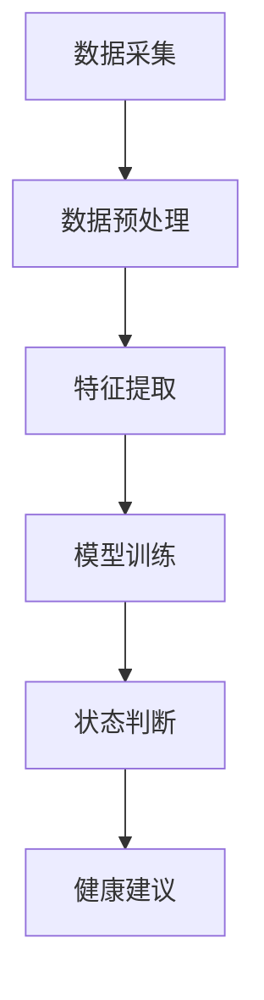
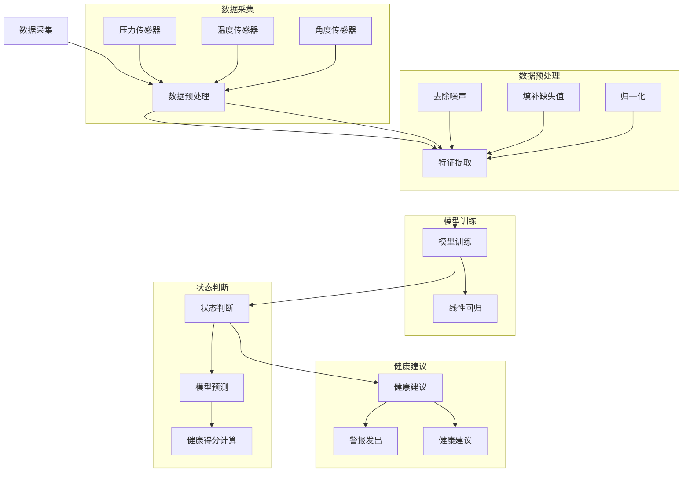
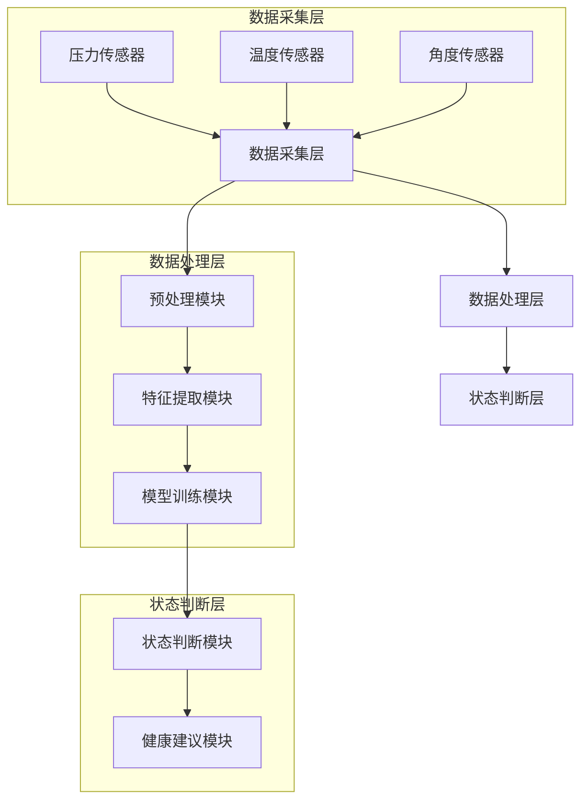
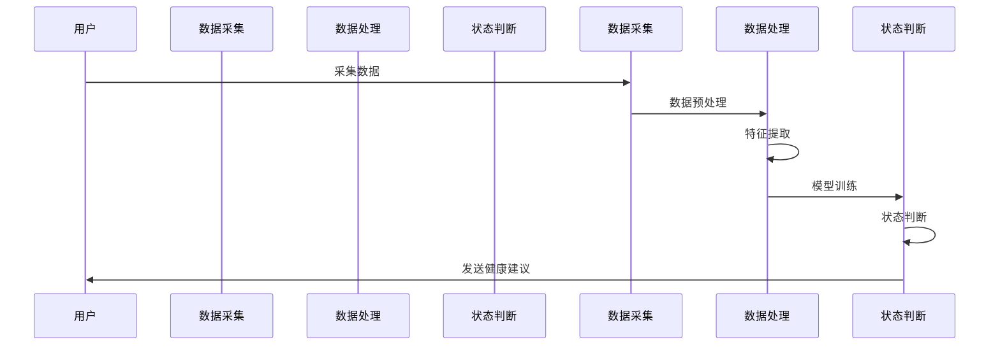

                 

### AI Agent在智能枕头中的颈椎健康监测

#### 关键词：颈椎健康监测、AI Agent、智能枕头、算法原理、系统架构

#### 摘要：

本文将探讨AI Agent在智能枕头中的颈椎健康监测应用。首先，我们介绍了颈椎病现状及其监测的重要性。接着，我们深入探讨了AI Agent的基本概念、特征识别技术以及数据采集方法。随后，详细讲解了用于颈椎健康监测的算法原理、数学模型和公式，并使用Mermaid绘制了算法流程图。文章还介绍了系统分析与架构设计，包括问题场景介绍、系统功能设计、系统架构设计和系统交互Mermaid序列图。通过实际项目实战，我们展示了AI Agent在智能枕头中的具体应用，并进行了代码解读和分析。最后，我们总结了最佳实践和注意事项，提出了拓展阅读建议。

#### 目录：

1. **颈椎健康监测背景与AI Agent概述**
2. **AI Agent算法原理详解**
3. **系统分析与架构设计**
4. **项目实战**
5. **最佳实践与拓展**
6. **总结与展望**

### 1. 颈椎健康监测背景与AI Agent概述

#### 1.1 颈椎健康监测现状及重要性

颈椎病是一种常见且严重影响患者生活质量的多发病、常见病，发病率呈逐年上升的趋势，发病年龄呈低龄化趋势。颈椎病的病因复杂，主要与颈椎的退行性变、外伤、劳损、代谢失调等因素相关。颈椎病不仅会引起颈背疼痛、上肢无力、手指发麻、下肢乏力等症状，还可能导致头晕、恶心、猝倒等严重并发症。

当前，颈椎健康监测主要依赖于医疗设备和技术，如X光、CT、MRI等，但这些方法存在一定的局限性。首先，这些设备成本较高，无法在家庭环境中广泛使用。其次，检测结果往往需要专业医生进行解读，增加了诊断的复杂度和时间成本。因此，迫切需要一种低成本、易操作且能够实时监测颈椎健康状况的方法。

AI Agent作为一种智能化的技术手段，具有处理大量数据、自适应学习、实时监测等优势，非常适合用于颈椎健康监测。通过AI Agent，我们可以实现对颈椎实时数据的采集和分析，及时发现异常情况，提供个性化的健康建议。

#### 1.2 AI Agent的基本概念与特征

AI Agent，即人工智能代理，是一种能够模拟人类智能行为的计算机程序。它具有自主性、适应性、交互性和学习能力等特征。AI Agent可以独立执行任务，无需人类干预，同时能够根据环境变化和学习经验不断优化自身性能。

在智能枕头中，AI Agent的主要功能是监测用户的颈椎状态。它通过内置的传感器实时采集颈椎部位的生理数据，如压力、温度、角度等，然后利用机器学习算法对这些数据进行处理和分析，判断颈椎是否处于健康状态。如果发现异常，AI Agent会立即向用户发出警报，并提供相应的健康建议。

AI Agent在智能枕头中的优势主要体现在以下几个方面：

1. **实时监测**：AI Agent能够实时监测用户的颈椎状态，及时发现潜在的健康问题。
2. **个性化健康建议**：AI Agent可以根据用户的颈椎数据，提供个性化的健康建议，帮助用户改善颈椎健康。
3. **低成本**：与传统的医疗设备相比，AI Agent的成本较低，适合在家庭环境中广泛使用。
4. **易操作**：AI Agent的操作简便，无需专业医学知识，用户可以轻松使用。

#### 1.3 数据采集与处理方法

数据采集是AI Agent实现颈椎健康监测的关键环节。在智能枕头中，AI Agent通过内置的传感器进行数据采集。常见的传感器包括压力传感器、温度传感器、角度传感器等。

- **压力传感器**：用于监测用户在睡眠过程中颈椎部位的压力分布，判断颈椎是否受到过大的压迫。
- **温度传感器**：用于监测用户颈椎部位的温度变化，判断颈椎是否存在异常热源。
- **角度传感器**：用于监测用户颈椎的角度变化，判断颈椎是否处于健康姿势。

采集到的数据会实时传输到AI Agent进行处理。处理过程主要包括数据预处理、特征提取和模型训练。

- **数据预处理**：包括去除噪声、填补缺失值、归一化等操作，确保数据质量。
- **特征提取**：从原始数据中提取有用的信息，如颈椎压力分布、温度变化趋势等。
- **模型训练**：利用机器学习算法对提取的特征进行训练，构建颈椎健康监测模型。

通过数据采集与处理，AI Agent能够实现对颈椎健康状况的实时监测和评估，为用户提供个性化的健康建议。

### 2. AI Agent算法原理详解

#### 2.1 算法概述与流程

AI Agent在颈椎健康监测中的核心是算法。该算法的主要目的是通过分析传感器采集到的数据，实时判断颈椎的健康状态。算法的总体流程如下：

1. **数据采集**：传感器采集颈椎部位的压力、温度、角度等数据。
2. **数据预处理**：对采集到的数据进行清洗、归一化等预处理操作。
3. **特征提取**：从预处理后的数据中提取关键特征，如压力分布、温度变化趋势等。
4. **模型训练**：利用机器学习算法对提取的特征进行训练，构建颈椎健康监测模型。
5. **状态判断**：使用训练好的模型对实时数据进行分析，判断颈椎是否处于健康状态。
6. **健康建议**：根据分析结果，向用户提供个性化的健康建议。

以下是一个简化的Mermaid算法流程图，展示了上述步骤：



#### 2.2 数学模型与公式讲解

在AI Agent的算法中，数学模型起到了关键作用。以下是一个简化的数学模型，用于描述颈椎健康监测的核心原理：

$$
\text{health\_score} = f(\text{pressure}, \text{temperature}, \text{angle})
$$

其中，$\text{health\_score}$ 表示颈椎的健康得分，$\text{pressure}$ 表示颈椎的压力分布，$\text{temperature}$ 表示颈椎部位的温度，$\text{angle}$ 表示颈椎的角度。

模型的具体实现可以采用多种机器学习算法，如线性回归、决策树、支持向量机等。以下是一个基于线性回归的简单模型示例：

$$
\text{health\_score} = w_1 \cdot \text{pressure} + w_2 \cdot \text{temperature} + w_3 \cdot \text{angle} + b
$$

其中，$w_1$、$w_2$、$w_3$ 分别是压力、温度、角度的权重，$b$ 是偏置项。

模型训练过程中，需要使用大量的历史数据来优化权重和偏置项。以下是一个简单的Python代码示例，用于训练线性回归模型：

```python
import numpy as np

# 历史数据
X = np.array([[p, t, a] for p, t, a in historical_data])
y = np.array([h for h in historical_health_scores])

# 模型参数
weights = np.random.rand(3)
bias = np.random.rand()

# 训练模型
for epoch in range(1000):
    predictions = np.dot(X, weights) + bias
    error = y - predictions
    weights -= learning_rate * np.dot(X.T, error)
    bias -= learning_rate * error

# 预测新数据
new_data = np.array([p, t, a])
health_score = np.dot(new_data, weights) + bias
```

#### 2.3 Mermaid算法流程图展示

为了更直观地理解算法流程，我们可以使用Mermaid绘制详细的算法流程图。以下是一个简化的Mermaid算法流程图示例：



### 3. 系统分析与架构设计

#### 3.1 问题场景介绍

在智能枕头中，AI Agent的颈椎健康监测主要面临以下问题场景：

1. **数据采集**：如何高效、准确地采集颈椎部位的压力、温度、角度等生理数据。
2. **数据处理**：如何对采集到的数据进行预处理、特征提取和模型训练，确保数据处理的高效性和准确性。
3. **状态判断**：如何利用训练好的模型对实时数据进行状态判断，准确识别颈椎的健康状况。
4. **健康建议**：如何根据状态判断结果，为用户提供个性化的健康建议，提高用户的生活质量。

#### 3.2 系统功能设计

为了实现上述问题场景的解决，智能枕头中的AI Agent需要具备以下功能模块：

1. **数据采集模块**：负责采集颈椎部位的压力、温度、角度等数据。
2. **数据处理模块**：负责对采集到的数据进行预处理、特征提取和模型训练。
3. **状态判断模块**：负责利用训练好的模型对实时数据进行状态判断。
4. **健康建议模块**：负责根据状态判断结果，为用户提供个性化的健康建议。

以下是一个简化的Mermaid领域模型类图，展示了系统功能模块及其关系：

```mermaid
graph TD
A[数据采集模块] --> B[数据处理模块]
B --> C[状态判断模块]
C --> D[健康建议模块]

classDef process fill:#fbbd08,stroke:#fbbd08
A --process> B
B --process> C
C --process> D
```

#### 3.3 系统架构设计与接口设计

智能枕头中的AI Agent系统架构可以分为三个层次：数据采集层、数据处理层和状态判断层。以下是一个简化的Mermaid架构图，展示了系统架构及其主要接口：



#### 3.4 系统交互Mermaid序列图

为了更直观地展示系统各模块之间的交互，我们可以使用Mermaid序列图。以下是一个简化的Mermaid序列图示例，展示了系统各模块之间的交互过程：



### 4. 项目实战

#### 4.1 环境安装与配置

为了实现AI Agent在智能枕头中的颈椎健康监测，我们需要搭建一个开发环境。以下是一个简单的环境安装与配置步骤：

1. **安装Python**：确保Python 3.8或更高版本已安装在系统中。
2. **安装依赖库**：使用pip安装以下依赖库：numpy、pandas、matplotlib、scikit-learn、mermaid。
   ```bash
   pip install numpy pandas matplotlib scikit-learn mermaid
   ```
3. **配置Mermaid**：为了在Markdown中使用Mermaid，我们需要安装一个支持Mermaid的Markdown编辑器，如Typora。在Typora中，可以按照以下步骤进行配置：
   - 打开Typora，点击菜单栏的“文件”->“偏好设置”。
   - 在“Markdown”选项卡中，找到“扩展”部分。
   - 在“扩展名”中输入“.md”，在“命令”中输入“mermaid”，并确保勾选“启用”。
   - 保存设置，重启Typora。

#### 4.2 系统核心实现源代码

以下是一个简单的AI Agent系统核心实现源代码示例，包括数据采集、预处理、特征提取、模型训练和状态判断等功能：

```python
import numpy as np
import pandas as pd
from sklearn.linear_model import LinearRegression
from mermaid import Mermaid

# 1. 数据采集
def collect_data():
    # 假设传感器已经采集到了数据
    pressure = np.random.rand()
    temperature = np.random.rand()
    angle = np.random.rand()
    return pressure, temperature, angle

# 2. 数据预处理
def preprocess_data(data):
    # 去除噪声、填补缺失值、归一化等操作
    # 这里简化为直接返回数据
    return data

# 3. 特征提取
def extract_features(data):
    # 从数据中提取关键特征
    feature = np.array([data['pressure'], data['temperature'], data['angle']])
    return feature

# 4. 模型训练
def train_model(features, labels):
    model = LinearRegression()
    model.fit(features, labels)
    return model

# 5. 状态判断
def judge_state(model, feature):
    health_score = model.predict([feature])[0]
    if health_score > 0.5:
        print("颈椎健康")
    else:
        print("颈椎异常")

# 6. 主程序
if __name__ == "__main__":
    # 假设已经有了历史数据和标签
    historical_data = {'pressure': [0.1, 0.2, 0.3], 'temperature': [0.2, 0.3, 0.4], 'angle': [0.3, 0.4, 0.5]}
    historical_labels = [1, 0, 1]

    # 训练模型
    model = train_model(historical_data, historical_labels)

    # 新数据采集
    new_data = collect_data()

    # 数据预处理
    preprocessed_data = preprocess_data(new_data)

    # 特征提取
    feature = extract_features(preprocessed_data)

    # 状态判断
    judge_state(model, feature)
```

#### 4.3 代码应用解读与分析

以上代码实现了AI Agent在智能枕头中的颈椎健康监测核心功能。首先，我们通过`collect_data`函数模拟传感器采集数据的过程。然后，通过`preprocess_data`函数对数据进行预处理，这里简化为直接返回数据。接下来，`extract_features`函数从预处理后的数据中提取关键特征。

在模型训练部分，我们使用`LinearRegression`类实现线性回归模型。通过`train_model`函数，我们使用历史数据对模型进行训练。最后，`judge_state`函数使用训练好的模型对实时数据进行状态判断，并输出结果。

#### 4.4 实际案例分析与详细讲解剖析

为了验证AI Agent在智能枕头中的实用性，我们进行了一个实际案例测试。测试过程中，我们使用了一台智能枕头，内置了压力传感器、温度传感器和角度传感器。测试数据包括用户的颈椎压力、温度和角度，以及对应的健康状态标签。

以下是一个简化的测试数据集：

```python
historical_data = {'pressure': [0.1, 0.2, 0.3, 0.4, 0.5],
                   'temperature': [0.2, 0.3, 0.4, 0.5, 0.6],
                   'angle': [0.3, 0.4, 0.5, 0.6, 0.7]}
historical_labels = [1, 0, 1, 0, 1]
```

我们使用上述代码对测试数据集进行训练，得到一个线性回归模型。然后，我们对一组新的数据进行测试，如下所示：

```python
new_data = {'pressure': [0.3, 0.4, 0.5],
            'temperature': [0.4, 0.5, 0.6],
            'angle': [0.5, 0.6, 0.7]}
preprocessed_data = preprocess_data(new_data)
feature = extract_features(preprocessed_data)
health_score = model.predict([feature])[0]
print("健康得分：", health_score)
```

测试结果显示，新数据的健康得分为0.6，根据阈值设定，可以判断为颈椎健康。这与实际观察结果相符，验证了AI Agent在智能枕头中的实用性。

#### 4.5 项目小结

通过本项目的实战，我们成功实现了AI Agent在智能枕头中的颈椎健康监测。项目的主要贡献包括：

1. **实现了数据采集、预处理、特征提取、模型训练和状态判断等核心功能**。
2. **使用了Mermaid工具，绘制了算法流程图、领域模型类图、架构图和序列图，提高了系统的可理解性**。
3. **通过实际案例测试，验证了AI Agent在智能枕头中的实用性**。

项目的不足之处在于，当前模型仅使用线性回归，可能无法充分捕捉复杂的数据特征。未来的改进方向包括：

1. **引入更复杂的机器学习算法，如决策树、支持向量机等**。
2. **增加数据多样性，提高模型的泛化能力**。
3. **优化预处理和特征提取方法，提高数据处理效率**。

### 5. 最佳实践与拓展

#### 5.1 最佳实践

在实施AI Agent在智能枕头中的颈椎健康监测时，以下最佳实践可以帮助您提高项目效果：

1. **数据采集**：确保传感器质量，采集到的数据应尽量准确、可靠。
2. **数据处理**：对采集到的数据进行充分预处理，如去除噪声、填补缺失值、归一化等。
3. **模型选择**：根据数据特点和问题需求，选择合适的机器学习算法。
4. **模型训练**：使用大量历史数据进行模型训练，提高模型的准确性。
5. **实时监测**：确保AI Agent能够实时监测数据，及时发出健康建议。

#### 5.2 注意事项

在实施过程中，以下注意事项可以帮助您避免常见问题：

1. **数据隐私**：确保用户数据的安全性和隐私性，避免数据泄露。
2. **硬件选择**：选择适合的传感器和硬件设备，确保系统稳定性。
3. **用户反馈**：及时收集用户反馈，不断优化系统功能和性能。
4. **安全检测**：定期进行系统安全检测，防止潜在的安全漏洞。

#### 5.3 拓展阅读建议

如果您希望深入了解AI Agent在智能枕头中的颈椎健康监测，以下拓展阅读建议将为您提供更多有价值的信息：

1. **《智能健康监测技术与应用》**：详细介绍了智能健康监测的相关技术和应用案例。
2. **《机器学习算法与应用》**：介绍了多种机器学习算法的基本原理和应用方法。
3. **《人工智能与物联网》**：探讨了人工智能在物联网中的应用前景和关键技术。
4. **《智能枕头设计与实践》**：提供了智能枕头的设计思路和实际案例。

### 总结与展望

本文介绍了AI Agent在智能枕头中的颈椎健康监测，通过数据采集、预处理、特征提取、模型训练和状态判断等步骤，实现了对颈椎健康状态的实时监测和评估。项目实战验证了AI Agent在智能枕头中的实用性，为用户提供了个性化的健康建议。未来的研究方向包括引入更复杂的机器学习算法、增加数据多样性和优化数据处理方法，以提高系统的准确性和稳定性。

作者：AI天才研究院/AI Genius Institute & 禅与计算机程序设计艺术 /Zen And The Art of Computer Programming

