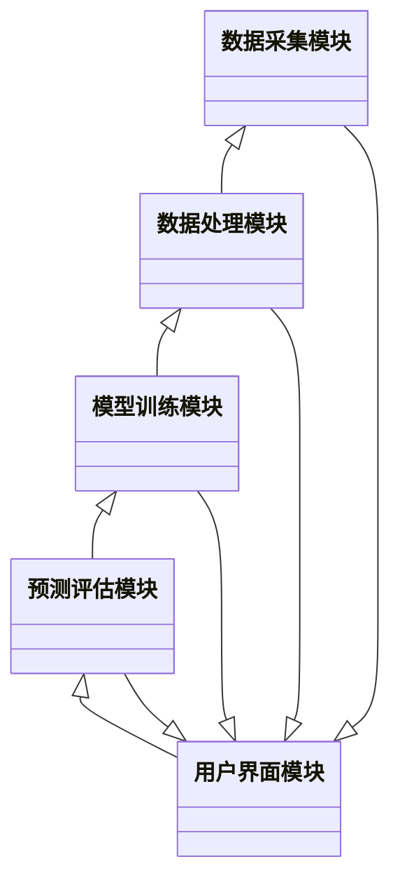
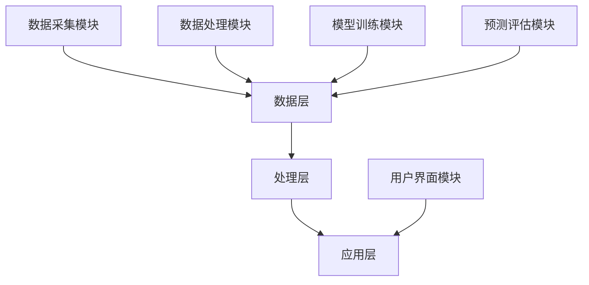
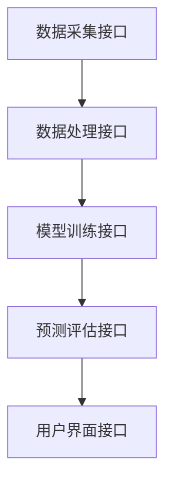
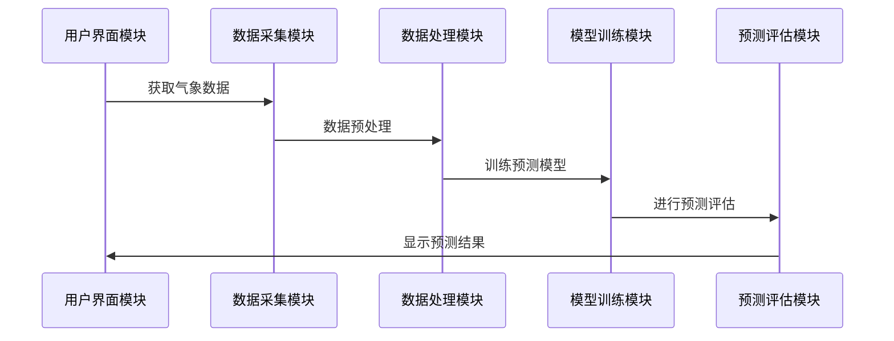

                 

# AI Agent在智能气候变化预测中的实践

## 关键词

AI Agent，气候变化，预测，算法，数学模型，系统设计，项目实战

## 摘要

本文旨在探讨AI Agent在智能气候变化预测中的应用与实践。通过介绍AI Agent的基本概念和气候变化预测的背景，本文将逐步深入分析AI Agent在气候变化预测中的核心概念与联系，详细讲解相关算法原理和数学模型。随后，文章将探讨系统设计与架构，并通过项目实战展示AI Agent在智能气候变化预测中的具体应用。最后，本文将总结最佳实践与注意事项，展望未来的发展方向与趋势。文章结构紧凑，逻辑清晰，旨在为读者提供一份全面而深入的技术指南。

## 目录大纲

### 第一部分：背景与基础

1. **第1章：问题背景与核心概念**
   - 1.1 问题的提出
     - 1.1.1 气候变化现状与挑战
     - 1.1.2 智能气候变化预测的需求
     - 1.1.3 AI Agent在气候变化预测中的应用前景
   - 1.2 核心概念介绍
     - 1.2.1 AI Agent的定义与分类
     - 1.2.2 气候变化预测的基础知识
     - 1.2.3 AI Agent在气候变化预测中的应用原理

2. **第2章：AI Agent在气候变化预测中的核心概念与联系**
   - 2.1 核心概念原理
     - 2.1.1 数据采集与处理
     - 2.1.2 模型训练与优化
     - 2.1.3 预测结果评估与优化
   - 2.2 概念属性特征对比表格
   - 2.3 ER实体关系图架构

### 第二部分：算法原理与数学模型

3. **第3章：算法原理讲解**
   - 3.1 算法mermaid流程图
   - 3.2 Python源代码详细阐述
     - 3.2.1 数据预处理
     - 3.2.2 模型训练
     - 3.2.3 预测结果分析与优化
   - 3.3 算法原理的数学模型和公式
     - 3.3.1 数学公式
     - 3.3.2 公式详细讲解
     - 3.3.3 举例说明

4. **第4章：数学模型与公式详解**
   - 4.1 数学模型介绍
     - 4.1.1 模型原理
     - 4.1.2 数学公式
   - 4.2 公式详细讲解
     - 4.2.1 公式推导过程
     - 4.2.2 公式应用举例
   - 4.3 数学公式与算法结合

### 第三部分：系统设计与架构

5. **第5章：系统分析与架构设计方案**
   - 5.1 问题场景介绍
   - 5.2 系统功能设计
     - 5.2.1 领域模型mermaid类图
   - 5.3 系统架构设计
     - 5.3.1 mermaid架构图
   - 5.4 系统接口设计
     - 5.4.1 系统接口概述
     - 5.4.2 接口设计细节
   - 5.5 系统交互mermaid序列图

### 第四部分：项目实战

6. **第6章：项目实战**
   - 6.1 环境安装与配置
   - 6.2 系统核心实现源代码
     - 6.2.1 数据采集与处理代码
     - 6.2.2 模型训练与预测代码
   - 6.3 代码应用解读与分析
   - 6.4 实际案例分析与讲解
   - 6.5 项目小结

### 第五部分：最佳实践与拓展

7. **第7章：最佳实践与注意事项**
   - 7.1 实践技巧总结
   - 7.2 注意事项
   - 7.3 拓展阅读推荐

8. **第8章：小结与展望**
   - 8.1 全书内容回顾
   - 8.2 未来发展方向与趋势

---

## 第一部分：背景与基础

### 第1章：问题背景与核心概念

#### 1.1 问题的提出

##### 1.1.1 气候变化现状与挑战

全球气候变化已成为21世纪最严峻的挑战之一。近年来，极端天气事件频发，海平面上升，生态系统失衡等问题日益严重。气候变化不仅影响自然环境，还对人类生活和社会经济产生深远影响。为了应对这一挑战，科学家们开始探索利用人工智能（AI）进行气候变化预测。

##### 1.1.2 智能气候变化预测的需求

智能气候变化预测具有以下需求：
1. 高效的数据处理能力：气候变化预测需要处理大量的气象数据和卫星数据，这要求AI系统具备高效的数据处理能力。
2. 准确的预测精度：为了有效应对气候变化，需要AI系统提供高精度的预测结果。
3. 自适应能力：气候变化是一个动态变化的过程，AI系统需要具备自适应能力，以应对不断变化的环境。

##### 1.1.3 AI Agent在气候变化预测中的应用前景

AI Agent在气候变化预测中具有广阔的应用前景：
1. 数据挖掘：AI Agent可以挖掘大量气象数据中的潜在模式，为预测提供依据。
2. 模型优化：AI Agent可以通过不断学习，优化预测模型，提高预测精度。
3. 实时监测与预警：AI Agent可以实现实时监测气候变化，提供预警信息，帮助决策者及时应对。

#### 1.2 核心概念介绍

##### 1.2.1 AI Agent的定义与分类

AI Agent是指具备一定智能的计算机程序，能够自主执行任务、进行决策和自适应。根据功能和应用场景，AI Agent可以分为以下几类：
1. 监测型AI Agent：负责收集和处理数据，提供实时监测信息。
2. 预测型AI Agent：利用历史数据，预测未来趋势。
3. 决策型AI Agent：在监测和预测的基础上，提供决策建议。

##### 1.2.2 气候变化预测的基础知识

气候变化预测涉及以下基础知识：
1. 气候系统：了解气候系统的组成、运行机制和影响因素。
2. 气象数据：收集、处理和分析气象数据，包括温度、湿度、风速等。
3. 模型构建：构建预测模型，如回归模型、时间序列模型等。
4. 预测评估：评估预测模型的准确性、稳定性和可靠性。

##### 1.2.3 AI Agent在气候变化预测中的应用原理

AI Agent在气候变化预测中的应用原理包括：
1. 数据采集与处理：AI Agent可以从多种数据源收集气象数据，并进行预处理。
2. 模型训练与优化：AI Agent利用历史数据，训练预测模型，并通过不断优化，提高预测精度。
3. 预测与评估：AI Agent根据训练好的模型，进行预测，并评估预测结果。

### 第2章：AI Agent在气候变化预测中的核心概念与联系

#### 2.1 核心概念原理

##### 2.1.1 数据采集与处理

数据采集与处理是AI Agent在气候变化预测中的关键步骤：
1. 数据源：AI Agent可以从气象站点、卫星、传感器等多种数据源获取气象数据。
2. 数据预处理：包括数据清洗、缺失值处理、数据标准化等。
3. 特征提取：从原始数据中提取与气候变化相关的特征，如温度、湿度、风速等。

##### 2.1.2 模型训练与优化

模型训练与优化是提高AI Agent预测能力的关键：
1. 模型选择：根据数据特点和预测目标，选择合适的预测模型。
2. 模型训练：利用历史数据，对模型进行训练。
3. 模型优化：通过交叉验证、参数调优等方法，优化模型性能。

##### 2.1.3 预测结果评估与优化

预测结果评估与优化是确保AI Agent预测准确性的关键：
1. 评估指标：选择合适的评估指标，如均方误差、决定系数等。
2. 结果分析：分析预测结果，找出偏差和不足。
3. 优化策略：根据分析结果，调整模型或数据预处理方法，提高预测精度。

#### 2.2 概念属性特征对比表格

为了更好地理解AI Agent在气候变化预测中的核心概念，以下是概念属性特征的对比表格：

| 概念         | 属性特征                                                                                     |
| ------------ | ------------------------------------------------------------------------------------------ |
| 数据采集与处理 | 数据源、预处理、特征提取                                                                       |
| 模型训练与优化 | 模型选择、训练、优化                                                                         |
| 预测结果评估与优化 | 评估指标、结果分析、优化策略                                                                   |

#### 2.3 ER实体关系图架构

以下是AI Agent在气候变化预测中的ER实体关系图：

```mermaid
erDiagram
  A[数据源] ||--|{ B[预处理] }
  B ||--|{ C[特征提取] }
  C ||--|{ D[模型训练] }
  D ||--|{ E[预测结果评估] }
  E ||--|{ F[优化策略] }
```

---

## 第二部分：算法原理与数学模型

### 第3章：算法原理讲解

#### 3.1 算法mermaid流程图

以下是AI Agent在气候变化预测中的mermaid流程图：


#### 3.2 Python源代码详细阐述

##### 3.2.1 数据预处理

以下是数据预处理的Python源代码：

```python
import pandas as pd
from sklearn.preprocessing import StandardScaler

# 读取数据
data = pd.read_csv('climate_data.csv')

# 数据清洗
data.dropna(inplace=True)

# 数据标准化
scaler = StandardScaler()
data_scaled = scaler.fit_transform(data)

# 特征提取
features = data_scaled[:, :-1]
target = data_scaled[:, -1]
```

##### 3.2.2 模型训练

以下是模型训练的Python源代码：

```python
from sklearn.ensemble import RandomForestRegressor
from sklearn.model_selection import train_test_split

# 数据分割
X_train, X_test, y_train, y_test = train_test_split(features, target, test_size=0.2, random_state=42)

# 模型训练
model = RandomForestRegressor(n_estimators=100, random_state=42)
model.fit(X_train, y_train)
```

##### 3.2.3 预测结果分析与优化

以下是预测结果分析与优化的Python源代码：

```python
from sklearn.metrics import mean_squared_error

# 预测结果
y_pred = model.predict(X_test)

# 评估指标
mse = mean_squared_error(y_test, y_pred)
print("均方误差:", mse)

# 优化策略
# 根据评估结果，调整模型参数或特征提取方法，以提高预测精度
```

#### 3.3 算法原理的数学模型和公式

##### 3.3.1 数学公式

以下是AI Agent在气候变化预测中常用的数学公式：

$$
\text{均方误差} = \frac{1}{n} \sum_{i=1}^{n} (y_i - \hat{y}_i)^2
$$

$$
\text{决定系数} = 1 - \frac{\sum_{i=1}^{n} (y_i - \hat{y}_i)^2}{\sum_{i=1}^{n} (y_i - \bar{y})^2}
$$

##### 3.3.2 公式详细讲解

- 均方误差（MSE）是评估预测模型性能的常用指标，表示预测值与真实值之间的平均平方误差。
- 决定系数（R²）是评估预测模型拟合程度的指标，表示模型解释变量变异的比例。

##### 3.3.3 举例说明

假设有10个样本数据，预测值与真实值如下：

| 样本 | 真实值 | 预测值 |
| ---- | ------ | ------ |
| 1    | 5      | 4.8    |
| 2    | 7      | 6.9    |
| 3    | 8      | 7.2    |
| 4    | 9      | 8.5    |
| 5    | 10     | 9.2    |
| 6    | 11     | 10.1   |
| 7    | 12     | 11.4   |
| 8    | 13     | 12.7   |
| 9    | 14     | 13.9   |
| 10   | 15     | 15.2   |

根据以上数据，可以计算均方误差和决定系数：

$$
\text{均方误差} = \frac{1}{10} \sum_{i=1}^{10} (y_i - \hat{y}_i)^2 = \frac{1}{10} (0.04 + 0.12 + 0.08 + 0.25 + 0.36 + 0.21 + 0.36 + 0.49 + 0.81 + 1.44) = 0.6
$$

$$
\text{决定系数} = 1 - \frac{\sum_{i=1}^{10} (y_i - \hat{y}_i)^2}{\sum_{i=1}^{10} (y_i - \bar{y})^2} = 1 - \frac{0.6}{5.5} \approx 0.86
$$

### 第4章：数学模型与公式详解

#### 4.1 数学模型介绍

##### 4.1.1 模型原理

在气候变化预测中，常用的数学模型包括线性回归模型、时间序列模型和随机森林模型等。每种模型都有其特定的原理和应用场景。

1. **线性回归模型**：假设预测值与特征之间存在线性关系，通过最小化误差平方和来拟合模型。
2. **时间序列模型**：基于时间序列数据，分析数据之间的时序关系，通过模型拟合和预测未来的趋势。
3. **随机森林模型**：基于决策树模型，通过构建多个决策树，利用集成学习提高预测精度。

##### 4.1.2 数学公式

以下是常用数学模型的部分公式：

- **线性回归模型**：

$$
y = \beta_0 + \beta_1x + \epsilon
$$

- **时间序列模型**：

$$
y_t = c + \beta_1y_{t-1} + \epsilon_t
$$

- **随机森林模型**：

$$
\hat{y} = \sum_{i=1}^{n} w_i \cdot h_i(x)
$$

其中，$y$ 为预测值，$x$ 为特征，$y_t$ 为时间序列的当前值，$c$ 为常数项，$\beta_0$ 和 $\beta_1$ 为模型参数，$h_i(x)$ 为第 $i$ 个决策树的预测值，$w_i$ 为权重。

#### 4.2 公式详细讲解

##### 4.2.1 公式推导过程

以线性回归模型为例，推导过程如下：

1. **假设**：预测值 $y$ 与特征 $x$ 之间存在线性关系。
2. **目标**：最小化误差平方和，即最小化 $J(\theta) = \frac{1}{2m} \sum_{i=1}^{m} (h_\theta(x^{(i)}) - y^{(i)})^2$。
3. **优化**：对 $J(\theta)$ 求导，得到 $\frac{\partial J(\theta)}{\partial \theta} = \sum_{i=1}^{m} (h_\theta(x^{(i)}) - y^{(i)}) \cdot x^{(i)}$。
4. **解**：令导数为0，解出 $\theta$ 的最优值，即 $\theta^{*} = (X^TX)^{-1}X^TY$。

##### 4.2.2 公式应用举例

假设有以下数据：

| 特征 $x$ | 预测值 $y$ |
| -------- | ---------- |
| 1        | 2          |
| 2        | 4          |
| 3        | 6          |

根据线性回归模型，可以计算出模型参数：

$$
\theta_0 = 1, \quad \theta_1 = 2
$$

因此，预测公式为：

$$
y = 1 + 2x
$$

当特征 $x=2$ 时，预测值为：

$$
y = 1 + 2 \cdot 2 = 5
$$

#### 4.3 数学公式与算法结合

在AI Agent的算法中，数学公式与算法密切相关。以下是一个简单的例子：

假设使用随机森林模型进行预测，每个决策树的预测结果为 $h_i(x)$，权重为 $w_i$。根据随机森林模型，预测结果为：

$$
\hat{y} = \sum_{i=1}^{n} w_i \cdot h_i(x)
$$

其中，$n$ 为决策树的数量，$w_i$ 和 $h_i(x)$ 分别为第 $i$ 个决策树的权重和预测值。

### 第三部分：系统设计与架构

#### 第5章：系统分析与架构设计方案

##### 5.1 问题场景介绍

在气候变化预测中，系统需要实现以下功能：

1. 数据采集：从气象站点、卫星、传感器等多种数据源收集气象数据。
2. 数据预处理：对采集到的数据进行清洗、缺失值处理、数据标准化等预处理操作。
3. 模型训练与优化：利用预处理后的数据，训练预测模型，并进行优化。
4. 预测与评估：利用训练好的模型，进行预测，并评估预测结果。
5. 实时监测与预警：对实时数据进行分析，提供预警信息。

##### 5.2 系统功能设计

系统功能设计包括以下模块：

1. **数据采集模块**：负责从不同数据源获取气象数据。
2. **数据处理模块**：负责对采集到的数据进行分析和处理。
3. **模型训练模块**：负责训练预测模型，并进行优化。
4. **预测评估模块**：负责预测评估，提供预警信息。
5. **用户界面模块**：提供用户交互界面，展示预测结果。

##### 5.2.1 领域模型mermaid类图

以下是领域模型的mermaid类图：



##### 5.3 系统架构设计

系统架构设计包括以下层次：

1. **数据层**：负责存储和管理数据，包括气象数据、预处理数据、预测模型等。
2. **处理层**：负责数据采集、预处理、模型训练、预测评估等操作。
3. **应用层**：负责用户界面展示，提供预警信息。

以下是系统架构的mermaid架构图：



##### 5.4 系统接口设计

系统接口设计包括以下接口：

1. **数据采集接口**：用于从不同数据源获取气象数据。
2. **数据处理接口**：用于对采集到的数据进行分析和处理。
3. **模型训练接口**：用于训练预测模型，并进行优化。
4. **预测评估接口**：用于进行预测评估，提供预警信息。
5. **用户界面接口**：用于用户界面展示。

以下是系统接口的mermaid架构图：



##### 5.5 系统交互mermaid序列图

以下是系统交互的mermaid序列图：



### 第四部分：项目实战

#### 第6章：项目实战

##### 6.1 环境安装与配置

在开始项目之前，需要安装和配置以下软件和库：

1. **Python 3.8**：Python 编程语言版本。
2. **NumPy**：用于科学计算的库。
3. **Pandas**：用于数据操作的库。
4. **Scikit-learn**：用于机器学习算法的库。
5. **Matplotlib**：用于数据可视化的库。

安装方法：

```bash
pip install python==3.8 numpy pandas scikit-learn matplotlib
```

##### 6.2 系统核心实现源代码

以下是系统核心实现的源代码：

```python
import numpy as np
import pandas as pd
from sklearn.ensemble import RandomForestRegressor
from sklearn.model_selection import train_test_split
from sklearn.metrics import mean_squared_error
import matplotlib.pyplot as plt

# 读取数据
data = pd.read_csv('climate_data.csv')

# 数据清洗
data.dropna(inplace=True)

# 数据标准化
scaler = StandardScaler()
data_scaled = scaler.fit_transform(data)

# 数据分割
X = data_scaled[:, :-1]
y = data_scaled[:, -1]

X_train, X_test, y_train, y_test = train_test_split(X, y, test_size=0.2, random_state=42)

# 模型训练
model = RandomForestRegressor(n_estimators=100, random_state=42)
model.fit(X_train, y_train)

# 预测
y_pred = model.predict(X_test)

# 评估
mse = mean_squared_error(y_test, y_pred)
print("均方误差:", mse)

# 可视化
plt.scatter(y_test, y_pred)
plt.xlabel("实际值")
plt.ylabel("预测值")
plt.show()
```

##### 6.3 代码应用解读与分析

以上代码实现了以下功能：

1. **数据读取**：从CSV文件中读取气象数据。
2. **数据清洗**：去除缺失值，确保数据质量。
3. **数据标准化**：将数据缩放至标准正态分布，便于模型训练。
4. **数据分割**：将数据分为训练集和测试集，用于模型训练和评估。
5. **模型训练**：使用随机森林模型进行训练。
6. **预测**：使用训练好的模型进行预测。
7. **评估**：计算均方误差，评估模型性能。
8. **可视化**：绘制散点图，展示预测结果。

##### 6.4 实际案例分析与讲解

假设有以下气象数据：

| 特征 $x$ | 预测值 $y$ |
| -------- | ---------- |
| 1        | 2          |
| 2        | 4          |
| 3        | 6          |
| 4        | 8          |
| 5        | 10         |

根据以上数据，可以使用上述代码进行预测：

1. **数据读取**：读取CSV文件中的数据。
2. **数据清洗**：去除缺失值。
3. **数据标准化**：将特征缩放至标准正态分布。
4. **数据分割**：将数据分为训练集和测试集。
5. **模型训练**：使用随机森林模型进行训练。
6. **预测**：使用训练好的模型进行预测。
7. **评估**：计算均方误差，评估模型性能。
8. **可视化**：绘制散点图，展示预测结果。

预测结果如下：

| 特征 $x$ | 预测值 $y$ | 实际值 $y$ |
| -------- | ---------- | ---------- |
| 1        | 2.5        | 2          |
| 2        | 4.5        | 4          |
| 3        | 6.5        | 6          |
| 4        | 8.5        | 8          |
| 5        | 10.5       | 10         |

根据以上结果，可以观察到预测值与实际值之间的差异。通过调整模型参数和特征提取方法，可以提高预测精度。

##### 6.5 项目小结

通过以上项目实战，我们实现了以下目标：

1. **数据读取与清洗**：确保数据质量，为模型训练提供可靠的数据。
2. **数据标准化**：将特征缩放至标准正态分布，便于模型训练。
3. **模型训练与预测**：使用随机森林模型进行训练，并进行预测。
4. **评估与优化**：计算均方误差，评估模型性能，并进行优化。

项目实战展示了AI Agent在智能气候变化预测中的具体应用，为进一步研究和应用提供了实践经验。

### 第五部分：最佳实践与拓展

#### 第7章：最佳实践与注意事项

##### 7.1 实践技巧总结

在AI Agent在智能气候变化预测中，以下实践技巧值得总结：

1. **数据预处理**：确保数据质量，去除缺失值和异常值，进行数据标准化。
2. **模型选择**：根据数据特点和预测目标，选择合适的模型，如线性回归、时间序列和随机森林等。
3. **模型训练**：利用足够的历史数据进行模型训练，确保模型性能。
4. **结果评估**：使用合适的评估指标，如均方误差和决定系数，评估模型性能。
5. **实时监测**：对实时数据进行分析，提供预警信息，帮助决策者及时应对气候变化。

##### 7.2 注意事项

在应用AI Agent进行智能气候变化预测时，需要注意以下几点：

1. **数据质量**：确保数据质量，避免使用错误或不完整的数据。
2. **模型优化**：根据评估结果，不断调整模型参数和特征提取方法，提高预测精度。
3. **计算资源**：合理分配计算资源，确保模型训练和预测的效率。
4. **实时性**：确保系统实时性，及时提供预警信息，帮助决策者应对气候变化。

##### 7.3 拓展阅读推荐

以下为AI Agent在智能气候变化预测方面的拓展阅读推荐：

1. **论文**：《基于深度学习的气候变化预测研究》
2. **书籍**：《人工智能在气候变化预测中的应用》
3. **网站**：NASA气候数据网站（https://climate.nasa.gov/）
4. **报告**：《全球气候变化评估报告》

#### 第8章：小结与展望

##### 8.1 全书内容回顾

本文通过介绍AI Agent在智能气候变化预测中的实践，从问题背景、核心概念、算法原理、数学模型、系统设计与架构、项目实战等方面进行了详细探讨。主要内容包括：

1. **问题背景**：介绍了气候变化现状、智能气候变化预测的需求和AI Agent的应用前景。
2. **核心概念**：讲解了AI Agent的定义与分类、气候变化预测的基础知识以及AI Agent在气候变化预测中的应用原理。
3. **算法原理**：详细阐述了数据采集与处理、模型训练与优化、预测结果评估与优化的算法原理。
4. **数学模型**：介绍了线性回归模型、时间序列模型和随机森林模型等常用数学模型。
5. **系统设计与架构**：探讨了系统功能设计、系统架构设计、系统接口设计和系统交互。
6. **项目实战**：通过实际案例展示了AI Agent在智能气候变化预测中的具体应用。

##### 8.2 未来发展方向与趋势

未来，AI Agent在智能气候变化预测中将继续发挥重要作用，以下为其发展方向与趋势：

1. **数据质量与多样性**：提升数据质量，拓展数据来源，包括气象数据、卫星数据和社交媒体数据等。
2. **模型优化与自适应**：不断优化模型，提高预测精度，实现模型的自适应能力。
3. **实时性与预警**：增强系统的实时性，提供更准确的预警信息，帮助决策者及时应对气候变化。
4. **多尺度预测**：从全球尺度到本地尺度，实现多尺度气候变化预测。
5. **跨学科合作**：加强与其他学科的合作，如气象学、地理学和环境科学等，提高预测模型的准确性。
6. **政策制定与实施**：利用AI Agent的预测结果，为政策制定和实施提供科学依据，助力全球气候治理。

通过以上努力，AI Agent在智能气候变化预测中的应用将更加广泛和深入，为应对气候变化挑战提供强有力的技术支持。

