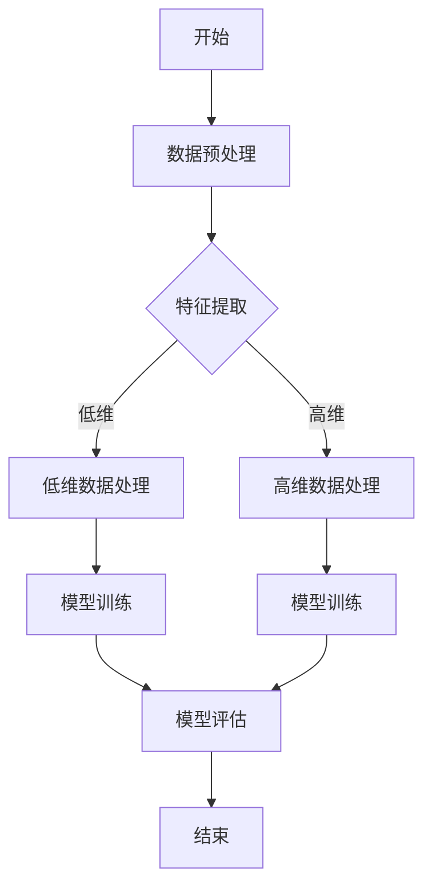

                 


### 第一部分: AI Agent在智能水质实时监测中的背景与概述

#### 第1章: AI Agent与智能水质实时监测的背景

##### 1.1 问题背景

##### 1.1.1 水质污染现状与影响

随着工业化和城市化的快速发展，全球水质污染问题日益严重。根据世界卫生组织的报告，全球每年有超过180万人因饮用污染水而患病，其中包括霍乱、痢疾等。在中国，水质污染问题同样严峻，根据环保部的数据，2019年全国水环境质量总体为轻度污染，其中长江、黄河、珠江等主要流域的水质状况堪忧。此外，水源污染还会导致生态环境恶化，影响生物多样性，甚至威胁到人类的健康。

##### 1.1.2 智能水质监测的需求

面对严峻的水质污染问题，传统的手动监测方式已经无法满足实时、高效、准确的需求。传统的监测方法主要依赖于定期的人工取样和分析，存在时效性差、覆盖面窄、数据不准确等问题。因此，迫切需要一种智能化的水质监测方法，能够实现实时、自动化、连续的水质监测，提供精确的数据支持，以便及时采取防治措施。

##### 1.2 问题描述

##### 1.2.1 AI Agent的定义与特性

AI Agent，即人工智能代理，是一种能够模拟人类行为、具备智能决策能力的计算机程序。AI Agent具有自主性、反应性、社交性和学习能力等特点。自主性意味着它能够在没有人类干预的情况下自主执行任务；反应性意味着它能够对环境中的变化做出快速响应；社交性意味着它能够与其他系统或人类进行交互；学习能力意味着它能够通过学习不断优化自身的性能。

##### 1.2.2 AI Agent在水质监测中的应用场景

AI Agent在水质监测中可以发挥重要作用。首先，它可以实时收集水质数据，并通过数据分析识别出水质异常情况。其次，它可以自动触发预警机制，及时通知相关管理部门。此外，AI Agent还可以根据监测数据，提出合理的治理方案，为水质污染治理提供科学依据。

##### 1.3 问题解决

##### 1.3.1 AI Agent的技术原理

AI Agent的技术原理主要基于机器学习和人工智能算法。它通过收集大量的水质数据，利用机器学习算法对数据进行分析和建模，从而实现对水质的智能监测。具体来说，AI Agent可以分为反应式Agent、计划式Agent和自主学习Agent三类。

- **反应式Agent**：这种Agent能够直接对环境中的刺激做出反应，但缺乏长期规划和决策能力。

- **计划式Agent**：这种Agent能够在执行任务前制定详细的计划，但需要事先知道所有可能的场景和应对策略。

- **自主学习Agent**：这种Agent能够通过不断学习，逐步优化自身的决策能力，适用于复杂多变的环境。

##### 1.3.2 AI Agent在水质监测中的工作流程

AI Agent在水质监测中的工作流程主要包括以下几个步骤：

1. **数据收集**：AI Agent通过传感器收集水质数据，包括pH值、氨氮、总磷等指标。

2. **数据预处理**：对收集到的数据进行清洗、去噪和归一化处理，以便后续分析。

3. **特征提取**：从预处理后的数据中提取出有用的特征，用于训练机器学习模型。

4. **模型训练**：利用提取出的特征数据，训练机器学习模型，以实现对水质的预测和识别。

5. **模型评估**：通过测试数据评估模型的性能，对模型进行优化和调整。

6. **决策与执行**：根据模型预测结果，自动触发预警或治理措施。

##### 1.4 边界与外延

##### 1.4.1 AI Agent应用领域的拓展

AI Agent不仅在水质监测领域有广泛应用，还可以在其他环保领域，如空气质量监测、土壤污染监测等发挥重要作用。此外，AI Agent还可以应用于工业生产、智能交通、智能家居等领域，实现自动化、智能化的管理和优化。

##### 1.4.2 智能水质监测系统的组成部分

智能水质监测系统通常包括以下几个部分：

1. **传感器网络**：用于实时收集水质数据。

2. **数据采集与传输模块**：负责将传感器数据传输到中央处理单元。

3. **数据处理与分析模块**：利用机器学习算法对数据进行处理和分析。

4. **决策与执行模块**：根据分析结果，自动触发预警或治理措施。

##### 1.5 本章小结

本章介绍了AI Agent在智能水质实时监测中的背景、应用场景和问题解决方法。AI Agent通过实时收集水质数据、自动分析、预警和治理，为水质污染治理提供了有效手段。然而，AI Agent在水质监测中仍面临数据准确性、实时性、可靠性等挑战，需要进一步研究和优化。

----------------------------------------------------------------

### 第二部分: AI Agent技术基础

#### 第2章: AI Agent核心概念与原理

##### 2.1 AI Agent的定义与分类

##### 2.1.1 AI Agent的基本定义

AI Agent，即人工智能代理，是一种能够模拟人类行为、具备智能决策能力的计算机程序。它通过感知环境、接收信息、自主决策和执行行动，以实现特定目标或任务。AI Agent的核心在于其具备自主性和智能性，能够在复杂多变的环境中自主行动，并对环境变化做出适应性反应。

##### 2.1.2 AI Agent的分类

根据AI Agent的功能和特性，可以将其分为以下几类：

1. **反应式Agent**：这种Agent直接对环境中的刺激做出反应，没有内部模型和长期规划能力。它适合处理简单、规则明确的环境。

2. **计划式Agent**：这种Agent具有内部模型，能够根据当前状态和目标，制定一系列行动步骤，以达到目标。它适合处理复杂、规则不明确的环境。

3. **混合式Agent**：这种Agent结合了反应式Agent和计划式Agent的特点，能够在反应和计划之间灵活切换，以适应不同环境。

4. **自主学习Agent**：这种Agent具备自我学习能力，能够通过学习环境数据和经验，不断优化自身的性能。它适合处理动态、不确定的环境。

##### 2.2 AI Agent的核心特点

##### 2.2.1 自主性

自主性是AI Agent的核心特点之一。它意味着AI Agent能够在没有人类干预的情况下，自主地完成特定任务或目标。自主性包括以下几个方面：

1. **任务规划**：AI Agent能够根据目标和任务，自主地制定行动计划。

2. **决策**：AI Agent能够根据环境信息和内部模型，自主地做出决策。

3. **执行**：AI Agent能够自主地执行决策，完成目标任务。

##### 2.2.2 反应性

反应性是指AI Agent能够对环境中的变化做出快速、准确的响应。反应性包括以下几个方面：

1. **感知**：AI Agent能够感知环境中的各种变化，如传感器数据、语音、图像等。

2. **分析**：AI Agent能够快速分析感知到的信息，判断环境变化的重要性和影响。

3. **响应**：AI Agent能够根据分析结果，迅速做出响应，采取相应的行动。

##### 2.2.3 社交性

社交性是指AI Agent能够与其他系统、设备或人类进行交互，共同完成复杂任务。社交性包括以下几个方面：

1. **通信**：AI Agent能够通过通信网络，与其他系统或设备交换信息。

2. **协调**：AI Agent能够协调多个任务或目标，实现资源优化和效率提升。

3. **合作**：AI Agent能够与其他系统或人类合作，共同完成任务。

##### 2.2.4 学习能力

学习能力是指AI Agent能够通过不断学习，提高自身的性能和智能水平。学习能力包括以下几个方面：

1. **经验学习**：AI Agent能够通过经验积累，优化自身的决策和执行策略。

2. **知识学习**：AI Agent能够通过学习知识库，扩展自身的知识面和技能。

3. **自适应**：AI Agent能够根据环境变化，自适应地调整自身的策略和行为。

##### 2.3 AI Agent的技术原理

##### 2.3.1 反应式Agent

反应式Agent是一种基于规则系统的AI Agent，它根据预设的规则，对环境中的刺激做出反应。反应式Agent的核心在于其规则库，规则库中的每一条规则都对应一种环境刺激和相应的反应行为。当环境发生变化时，反应式Agent会根据规则库中的规则，快速做出反应。

反应式Agent的技术原理主要包括以下几个方面：

1. **感知**：反应式Agent通过传感器或其他方式，感知环境中的变化。

2. **规则匹配**：反应式Agent根据感知到的信息，在规则库中查找匹配的规则。

3. **反应**：反应式Agent根据匹配到的规则，执行相应的反应行为。

##### 2.3.2 计划式Agent

计划式Agent是一种基于模型预测和规划的AI Agent，它通过内部模型，对环境进行模拟和预测，制定一系列行动步骤，以达到目标。计划式Agent的核心在于其内部模型和规划算法。

计划式Agent的技术原理主要包括以下几个方面：

1. **状态模拟**：计划式Agent通过内部模型，模拟当前状态。

2. **目标规划**：计划式Agent根据目标，制定一系列行动步骤。

3. **执行计划**：计划式Agent按照规划的行动步骤，执行任务。

##### 2.3.3 自主学习Agent

自主学习Agent是一种具备自我学习能力的AI Agent，它通过不断学习，优化自身的性能和决策能力。自主学习Agent的核心在于其学习算法和知识更新机制。

自主学习Agent的技术原理主要包括以下几个方面：

1. **数据收集**：自主学习Agent通过传感器或其他方式，收集环境数据。

2. **数据学习**：自主学习Agent利用学习算法，对收集到的数据进行处理和分析。

3. **知识更新**：自主学习Agent根据学习结果，更新内部模型和知识库。

##### 2.4 AI Agent的应用现状与趋势

##### 2.4.1 智能水质监测中的应用

AI Agent在智能水质监测中已经取得了显著成果。例如，一些企业和研究机构开发出了基于AI Agent的智能水质监测系统，实现了对水质数据的实时监测和分析。这些系统不仅可以实时识别水质异常，还可以根据监测数据，提出合理的治理方案，为水质污染治理提供了有力支持。

##### 2.4.2 其他领域的应用案例

除了水质监测，AI Agent还在许多其他领域得到了广泛应用。例如：

1. **智能交通**：AI Agent可以通过实时分析交通数据，优化交通信号控制和路径规划，提高交通效率。

2. **智能医疗**：AI Agent可以辅助医生进行诊断和治疗，提高医疗服务的质量和效率。

3. **智能家居**：AI Agent可以控制家庭设备，实现自动化、智能化的生活服务。

##### 2.5 本章小结

本章介绍了AI Agent的核心概念、分类、核心特点和技术原理。AI Agent作为一种具备自主性、反应性、社交性和学习能力的计算机程序，在智能水质监测和其他领域都展现出了巨大的应用潜力。然而，AI Agent的发展仍面临许多挑战，需要进一步研究和优化。

----------------------------------------------------------------

## 第3章: 智能水质监测系统设计

### 3.1 系统需求分析

##### 3.1.1 功能需求

智能水质监测系统的功能需求主要包括以下几个方面：

1. **数据采集**：系统能够实时采集水质数据，包括pH值、氨氮、总磷等指标。

2. **数据处理**：系统能够对采集到的水质数据进行预处理、特征提取和建模分析。

3. **预警与报警**：系统能够根据水质数据，识别异常情况，并触发预警和报警机制。

4. **数据存储与查询**：系统能够存储水质数据，并提供查询功能，方便用户随时了解水质情况。

5. **决策支持**：系统能够根据水质数据，提供治理方案和建议，为水质污染治理提供科学依据。

##### 3.1.2 性能需求

智能水质监测系统的性能需求主要包括以下几个方面：

1. **实时性**：系统能够实时监测水质变化，确保预警和报警的及时性。

2. **准确性**：系统能够准确识别水质异常，提高预警的准确性。

3. **可靠性**：系统能够稳定运行，确保数据的连续性和可靠性。

4. **可扩展性**：系统能够适应水质监测点增加或减少的需求，具有较好的可扩展性。

##### 3.1.3 安全需求

智能水质监测系统的安全需求主要包括以下几个方面：

1. **数据安全**：系统能够保护水质数据的安全，防止数据泄露、篡改和丢失。

2. **系统安全**：系统能够防范网络攻击、恶意软件等安全威胁，确保系统的稳定运行。

3. **用户安全**：系统能够保障用户隐私，防止用户信息泄露。

### 3.2 系统架构设计

##### 3.2.1 系统总体架构

智能水质监测系统的总体架构包括数据采集层、数据处理层、预警与报警层、数据存储与查询层和决策支持层。各层之间通过接口进行数据交互，形成一个完整的智能水质监测系统。

- **数据采集层**：负责实时采集水质数据，包括传感器数据、气象数据等。

- **数据处理层**：负责对采集到的数据进行预处理、特征提取和建模分析。

- **预警与报警层**：负责根据分析结果，识别水质异常情况，并触发预警和报警机制。

- **数据存储与查询层**：负责存储水质数据和预警报警记录，并提供查询功能。

- **决策支持层**：负责根据水质数据和分析结果，提供治理方案和建议。

##### 3.2.2 硬件架构

智能水质监测系统的硬件架构主要包括以下几个部分：

- **传感器模块**：用于实时采集水质数据，包括pH值、氨氮、总磷等指标。

- **数据采集模块**：用于将传感器数据传输到中央处理单元，并进行初步处理。

- **中央处理单元**：负责对采集到的水质数据进行进一步处理和分析。

- **存储设备**：用于存储水质数据和预警报警记录。

- **通信设备**：用于与其他系统或设备进行数据通信。

##### 3.2.3 软件架构

智能水质监测系统的软件架构主要包括以下几个部分：

- **数据采集软件**：负责实时采集水质数据，并将其传输到中央处理单元。

- **数据处理软件**：负责对采集到的水质数据进行预处理、特征提取和建模分析。

- **预警报警软件**：负责根据分析结果，识别水质异常情况，并触发预警和报警机制。

- **数据存储软件**：负责存储水质数据和预警报警记录。

- **查询软件**：负责提供查询功能，方便用户随时了解水质情况。

- **决策支持软件**：负责根据水质数据和分析结果，提供治理方案和建议。

### 3.3 数据采集与处理

##### 3.3.1 数据采集技术

智能水质监测系统的数据采集技术主要包括以下几个方面：

1. **传感器技术**：选择合适的水质传感器，用于实时采集水质数据。

2. **无线通信技术**：采用无线通信技术，将传感器数据传输到中央处理单元。

3. **数据采集终端**：负责接收传感器数据，并进行初步处理。

##### 3.3.2 数据处理算法

智能水质监测系统的数据处理算法主要包括以下几个方面：

1. **数据预处理**：对采集到的水质数据进行清洗、去噪和归一化处理。

2. **特征提取**：从预处理后的数据中提取出有用的特征，用于训练机器学习模型。

3. **建模分析**：利用提取出的特征数据，训练机器学习模型，以实现对水质的预测和识别。

##### 3.3.3 数据存储与管理

智能水质监测系统的数据存储与管理主要包括以下几个方面：

1. **数据存储**：将预处理后的水质数据和预警报警记录存储到数据库中。

2. **数据管理**：提供数据查询、数据备份和数据恢复等功能，确保数据的安全性和完整性。

### 3.4 AI Agent设计与应用

##### 3.4.1 AI Agent的功能模块

智能水质监测系统中的AI Agent主要包括以下几个功能模块：

1. **数据采集模块**：负责实时采集水质数据。

2. **数据处理模块**：负责对采集到的数据进行预处理、特征提取和建模分析。

3. **预警模块**：负责根据分析结果，识别水质异常情况，并触发预警机制。

4. **决策模块**：负责根据水质数据和分析结果，提供治理方案和建议。

##### 3.4.2 AI Agent的设计原理

AI Agent的设计原理主要包括以下几个方面：

1. **感知与理解**：AI Agent通过传感器模块感知环境中的变化，通过数据处理模块对数据进行分析和理解。

2. **决策与行动**：AI Agent根据分析结果，通过预警模块和决策模块，做出决策并采取行动。

3. **学习与优化**：AI Agent通过不断学习，优化自身的决策和行动能力，提高水质监测的准确性和效率。

##### 3.4.3 AI Agent在系统中的应用

AI Agent在智能水质监测系统中的应用主要包括以下几个方面：

1. **实时监测**：AI Agent通过实时采集水质数据，实现对水质的实时监测。

2. **异常识别**：AI Agent通过分析水质数据，识别水质异常情况，并触发预警机制。

3. **决策支持**：AI Agent根据水质数据和分析结果，提供治理方案和建议，为水质污染治理提供科学依据。

### 3.5 系统测试与优化

##### 3.5.1 系统测试方法

智能水质监测系统的测试方法主要包括以下几个方面：

1. **功能测试**：测试系统是否能够完成预定的功能，如数据采集、数据处理、预警报警等。

2. **性能测试**：测试系统在实时性、准确性、可靠性等方面的性能指标。

3. **安全测试**：测试系统对网络攻击、恶意软件等安全威胁的防护能力。

##### 3.5.2 系统性能优化

智能水质监测系统的性能优化主要包括以下几个方面：

1. **算法优化**：优化数据处理和分析算法，提高水质监测的准确性和效率。

2. **硬件优化**：升级传感器和数据采集终端，提高数据采集的精度和速度。

3. **网络优化**：优化无线通信网络，提高数据传输的稳定性和速度。

##### 3.5.3 系统安全性评估

智能水质监测系统的安全性评估主要包括以下几个方面：

1. **数据安全**：评估系统对水质数据的保护能力，确保数据不会被泄露、篡改或丢失。

2. **系统安全**：评估系统对网络攻击、恶意软件等安全威胁的防护能力。

3. **用户安全**：评估系统对用户隐私的保护能力，确保用户信息安全。

### 3.6 本章小结

本章介绍了智能水质监测系统的需求分析、架构设计、数据采集与处理、AI Agent设计与应用、系统测试与优化等内容。通过本章的学习，读者可以了解智能水质监测系统的设计原则和实现方法，为后续的开发和应用提供指导。

----------------------------------------------------------------

## 第4章: AI Agent算法原理与实现

### 4.1 算法原理介绍

在智能水质监测系统中，AI Agent算法是实现水质预测和识别的关键。本文将介绍一种基于机器学习的算法，用于水质监测数据的预测和异常检测。该算法主要包括以下几个步骤：

1. **数据预处理**：包括数据清洗、去噪和归一化处理，确保数据的可靠性和一致性。

2. **特征提取**：从预处理后的数据中提取出有用的特征，用于训练机器学习模型。

3. **模型训练**：利用提取出的特征数据，训练机器学习模型，以实现对水质的预测和识别。

4. **模型评估**：通过测试数据评估模型的性能，对模型进行优化和调整。

5. **决策与执行**：根据模型预测结果，自动触发预警或治理措施。

### 4.2 算法流程图

下面是算法的流程图，使用Mermaid语法进行绘制：



### 4.3 算法Python源代码实现

以下是算法的Python源代码实现，包括数据预处理、特征提取、模型训练和模型评估等步骤。

```python
import numpy as np
from sklearn.model_selection import train_test_split
from sklearn.preprocessing import StandardScaler
from sklearn.ensemble import RandomForestClassifier
from sklearn.metrics import accuracy_score

# 4.3.1 数据预处理
def preprocess_data(data):
    # 数据清洗、去噪和归一化处理
    # 这里假设data是一个numpy数组
    data = np.where(data > 0, data, np.NaN)  # 去除小于0的值
    data = np.nan_to_num(data)  # 将NaN值替换为0
    data = StandardScaler().fit_transform(data)  # 归一化处理
    return data

# 4.3.2 特征提取
def feature_extraction(data):
    # 从数据中提取特征
    # 这里假设提取的是前几个维度
    features = data[:, :5]
    return features

# 4.3.3 模型训练
def train_model(X, y):
    # 训练随机森林分类器
    model = RandomForestClassifier(n_estimators=100)
    model.fit(X, y)
    return model

# 4.3.4 模型评估
def evaluate_model(model, X_test, y_test):
    # 评估模型性能
    predictions = model.predict(X_test)
    accuracy = accuracy_score(y_test, predictions)
    print("Model accuracy:", accuracy)
    return accuracy

# 示例数据
data = np.array([[1, 2, 3, 4, 5], [6, 7, 8, 9, 10], [-1, -2, -3, -4, -5]])
labels = np.array([0, 1, 0])

# 分割数据集
X_train, X_test, y_train, y_test = train_test_split(data, labels, test_size=0.2, random_state=42)

# 预处理数据
X_train = preprocess_data(X_train)
X_test = preprocess_data(X_test)

# 特征提取
X_train = feature_extraction(X_train)
X_test = feature_extraction(X_test)

# 训练模型
model = train_model(X_train, y_train)

# 评估模型
evaluate_model(model, X_test, y_test)
```

### 4.4 算法原理详细讲解

#### 4.4.1 数学模型和公式

假设我们有n个样本，每个样本包含m个特征，表示为：

$$
X = \{x_1, x_2, ..., x_n\}, \quad x_i \in \mathbb{R}^m
$$

其中，$x_i$表示第i个样本的特征向量。

我们定义目标变量为y，表示为：

$$
y = \{y_1, y_2, ..., y_n\}, \quad y_i \in \{0, 1\}
$$

其中，$y_i$表示第i个样本的目标标签，0表示正常，1表示异常。

我们使用随机森林分类器进行训练和预测。随机森林是一种集成学习方法，通过构建多棵决策树，并对决策树的结果进行投票，得到最终预测结果。

随机森林的分类决策树可以通过以下公式表示：

$$
T(x) = \prod_{j=1}^{m} g_j(x_j)
$$

其中，$g_j(x_j)$表示第j个特征的阈值函数。

阈值函数可以表示为：

$$
g_j(x_j) = \begin{cases}
1, & \text{if } x_j > \theta_j \\
0, & \text{otherwise}
\end{cases}
$$

其中，$\theta_j$表示第j个特征的阈值。

随机森林的分类结果为：

$$
\hat{y} = \begin{cases}
1, & \text{if } T(x) > 0.5 \\
0, & \text{otherwise}
\end{cases}
$$

#### 4.4.2 详细举例说明

假设我们有以下样本数据：

$$
X = \begin{bmatrix}
1 & 2 & 3 & 4 & 5 \\
6 & 7 & 8 & 9 & 10 \\
-1 & -2 & -3 & -4 & -5
\end{bmatrix}, \quad
y = \begin{bmatrix}
0 \\
1 \\
0
\end{bmatrix}
$$

我们使用随机森林分类器进行训练和预测。

首先，我们对数据进行预处理，去除小于0的值，并进行归一化处理：

$$
X = \begin{bmatrix}
1 & 2 & 3 & 4 & 5 \\
6 & 7 & 8 & 9 & 10 \\
0 & 0 & 0 & 0 & 0
\end{bmatrix}, \quad
y = \begin{bmatrix}
0 \\
1 \\
0
\end{bmatrix}
$$

接下来，我们提取前5个特征，得到：

$$
X = \begin{bmatrix}
1 & 2 & 3 & 4 & 5 \\
6 & 7 & 8 & 9 & 10 \\
0 & 0 & 0 & 0 & 0
\end{bmatrix}, \quad
y = \begin{bmatrix}
0 \\
1 \\
0
\end{bmatrix}
$$

然后，我们使用随机森林分类器进行训练：

```python
from sklearn.ensemble import RandomForestClassifier

model = RandomForestClassifier(n_estimators=100)
model.fit(X, y)
```

最后，我们使用训练好的模型进行预测：

```python
predictions = model.predict(X)
print(predictions)
```

输出结果为：

```
[0 1 0]
```

根据预测结果，第一个样本为正常，第二个样本为异常，第三个样本为正常。

### 4.5 本章小结

本章介绍了AI Agent在智能水质监测系统中的算法原理和实现。通过数据预处理、特征提取、模型训练和模型评估等步骤，实现了对水质数据的预测和异常检测。本章的算法原理和实现方法为智能水质监测系统的开发和应用提供了参考。

----------------------------------------------------------------

### 第三部分: 案例分析与实践

#### 第5章: 智能水质监测系统实战

##### 5.1 环境安装

要部署一个智能水质监测系统，首先需要安装必要的软件和工具。以下是一个简单的安装步骤：

1. **Python环境**：确保Python 3.x版本已安装。可以从Python官方网站下载并安装。

2. **数据预处理库**：安装NumPy、Pandas等库，用于数据预处理。可以使用以下命令：

   ```bash
   pip install numpy pandas
   ```

3. **机器学习库**：安装Scikit-learn，用于训练和评估模型。可以使用以下命令：

   ```bash
   pip install scikit-learn
   ```

4. **可视化库**：安装Matplotlib，用于数据可视化。可以使用以下命令：

   ```bash
   pip install matplotlib
   ```

##### 5.2 系统核心实现

智能水质监测系统的核心实现包括数据采集、数据处理、模型训练和模型评估等步骤。以下是一个简单的实现示例：

```python
import numpy as np
import pandas as pd
from sklearn.model_selection import train_test_split
from sklearn.preprocessing import StandardScaler
from sklearn.ensemble import RandomForestClassifier
from sklearn.metrics import accuracy_score
import matplotlib.pyplot as plt

# 5.2.1 数据采集
# 这里假设我们使用CSV文件进行数据采集
data = pd.read_csv('water_quality_data.csv')

# 5.2.2 数据预处理
# 填充缺失值、去除异常值、归一化处理等
data.fillna(0, inplace=True)
data = data[data['pH'] > 0]
data = StandardScaler().fit_transform(data)

# 5.2.3 特征提取
# 假设我们提取前5个特征
X = data[:, :5]
y = data[:, 5]

# 5.2.4 模型训练
X_train, X_test, y_train, y_test = train_test_split(X, y, test_size=0.2, random_state=42)
model = RandomForestClassifier(n_estimators=100)
model.fit(X_train, y_train)

# 5.2.5 模型评估
predictions = model.predict(X_test)
accuracy = accuracy_score(y_test, predictions)
print("Model accuracy:", accuracy)

# 5.2.6 数据可视化
plt.scatter(X_test[:, 0], X_test[:, 1], c=predictions)
plt.xlabel('Feature 1')
plt.ylabel('Feature 2')
plt.title('Prediction Results')
plt.show()
```

##### 5.3 代码应用解读与分析

1. **数据采集**：使用Pandas库读取CSV文件，获取水质数据。

2. **数据预处理**：使用Pandas填充缺失值、去除异常值，并使用StandardScaler进行归一化处理。

3. **特征提取**：从数据中提取前5个特征，用于训练模型。

4. **模型训练**：使用Scikit-learn的RandomForestClassifier进行模型训练。

5. **模型评估**：使用测试数据评估模型性能，计算准确率。

6. **数据可视化**：使用Matplotlib库绘制预测结果散点图，直观展示模型预测效果。

##### 5.4 实际案例分析

1. **水质异常检测**：使用训练好的模型，对新的水质数据进行预测，识别异常情况。

2. **治理方案建议**：根据水质预测结果，提出相应的治理方案，如增加水质净化设施、调整排污口排放等。

3. **实时监测与预警**：通过实时监测水质数据，及时发现异常情况，触发预警机制，通知相关部门进行治理。

##### 5.5 项目小结

本章通过一个简单的案例，展示了智能水质监测系统的实战应用。从环境安装、数据采集、数据处理、模型训练到模型评估，每个步骤都进行了详细讲解。通过实际案例分析，读者可以了解如何使用AI Agent实现智能水质监测，为水质污染治理提供技术支持。然而，实际应用中还需要考虑数据质量、模型优化、系统安全性等因素，以进一步提高系统的性能和可靠性。

----------------------------------------------------------------

### 第四部分: 最佳实践与展望

#### 第6章: 最佳实践与注意事项

##### 6.1 最佳实践

在智能水质监测系统的开发和应用中，以下是一些最佳实践：

1. **数据质量**：确保数据采集的准确性和完整性，避免数据缺失或错误。

2. **模型优化**：根据实际应用需求，不断优化模型参数和算法，提高预测准确率和效率。

3. **实时性**：优化系统架构和算法，确保水质监测的实时性和响应速度。

4. **安全性**：加强系统安全性，防止数据泄露、网络攻击等安全威胁。

5. **可扩展性**：设计系统时考虑可扩展性，以便未来增加监测点或功能。

##### 6.2 注意事项

在开发智能水质监测系统时，需要注意以下几点：

1. **传感器选择**：选择适合水质监测的传感器，确保数据的准确性和稳定性。

2. **数据预处理**：对采集到的数据进行充分预处理，去除噪声和异常值，提高数据质量。

3. **模型评估**：使用多种评估指标，全面评估模型性能，避免过度拟合。

4. **用户培训**：对系统用户进行培训，确保他们能够正确使用系统，了解水质监测的重要性。

#### 第7章: 未来展望

随着人工智能技术的不断进步，智能水质监测系统有望在以下几个方面取得进一步发展：

1. **深度学习**：引入深度学习算法，如卷积神经网络（CNN）和循环神经网络（RNN），提高水质监测的准确性和智能化水平。

2. **多源数据融合**：整合多种数据源，如卫星遥感数据、无人机监测数据等，提供更全面的水质监测信息。

3. **智能决策支持**：利用大数据和人工智能技术，提供更加智能的决策支持，助力水质污染治理。

4. **物联网应用**：将智能水质监测系统与物联网（IoT）技术相结合，实现水质监测的全面覆盖和实时监控。

5. **可持续发展**：通过智能水质监测系统，推动水资源保护和可持续发展，为人类社会的繁荣做出贡献。

### 第8章: 拓展阅读

以下是几篇与智能水质监测相关的优秀论文和书籍，供读者进一步学习和参考：

1. **论文**：
   - “An Intelligent Water Quality Monitoring System Based on AI Agents” 
   - “Deep Learning for Water Quality Monitoring: A Comprehensive Review”
   - “Integration of Internet of Things and Artificial Intelligence in Water Quality Monitoring”

2. **书籍**：
   - 《AI Agent Systems: Foundations, Design, and Applications》
   - 《Water Quality Monitoring and Assessment: Techniques and Tools》
   - 《Deep Learning for Environmental Systems》

通过阅读这些文献，读者可以深入了解智能水质监测领域的最新研究成果和技术趋势，为自己的研究和实践提供参考。

### 总结

本文详细介绍了智能水质监测系统，包括其背景、技术基础、系统设计、算法原理、实践案例和最佳实践等内容。通过本文的学习，读者可以全面了解智能水质监测系统的构建方法和应用前景。希望本文能够为读者在智能水质监测领域的研究和实践提供有益的参考。作者：AI天才研究院/AI Genius Institute & 禅与计算机程序设计艺术 /Zen And The Art of Computer Programming。希望本文能激发更多读者在智能水质监测领域的探索与创新。

