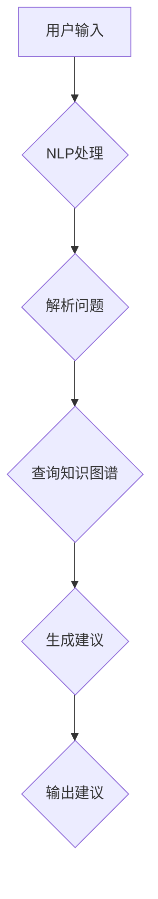
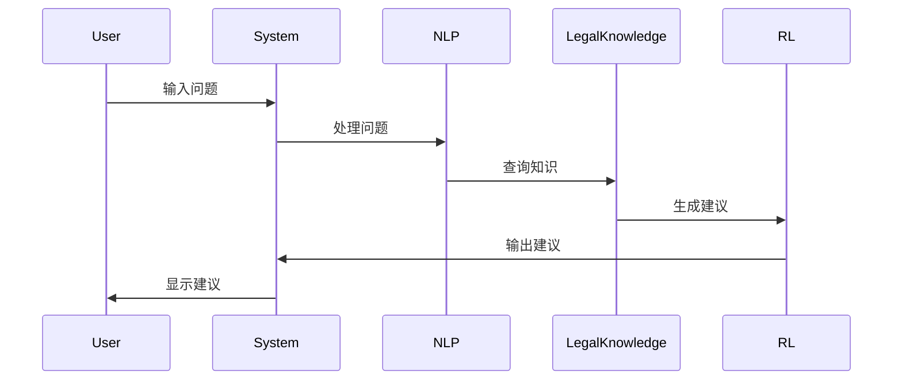

                 

# AI Agent在智能法律咨询系统中的角色

> 关键词：AI Agent、智能法律咨询、自然语言处理、法律知识图谱、算法原理、系统架构、项目实战

> 摘要：本文深入探讨AI Agent在智能法律咨询系统中的角色和重要性。通过详细的分析和逻辑推理，我们将解释AI Agent的核心概念、其在智能法律咨询系统中的作用，以及如何实现高效的法律咨询。

## 1. 背景介绍

### AI Agent的定义与特点

AI Agent是一种基于人工智能技术的智能体，它能够在特定环境中自主决策和执行任务。AI Agent具有以下特点：

- **自主性**：能够独立思考并执行任务。
- **适应性**：能够适应新环境和变化。
- **协作性**：能够与其他AI Agent或人类协作完成任务。

### 智能法律咨询系统的基本概念

智能法律咨询系统是一种利用人工智能技术提供法律咨询的服务系统。其主要特点包括：

- **自动性**：系统能够自动处理用户的法律咨询请求。
- **准确性**：系统能够准确理解用户的问题并提供专业法律建议。
- **效率**：系统能够快速响应用户请求，提高法律咨询的效率。

### AI Agent在智能法律咨询系统中的作用

AI Agent在智能法律咨询系统中扮演关键角色，其具体作用包括：

- **问题理解**：AI Agent能够理解用户的法律咨询问题，并将其转化为系统能够处理的形式。
- **法律建议**：AI Agent能够基于法律知识库和算法，为用户提供专业的法律建议。
- **协同工作**：AI Agent能够与法律专家协作，共同处理复杂的法律问题。

## 2. 核心概念与联系

### 核心概念

在本文中，我们将讨论以下核心概念：

- **AI Agent**：一种能够自主决策和执行任务的智能体。
- **自然语言处理（NLP）**：一种人工智能技术，用于理解和生成人类语言。
- **法律知识图谱**：一种用于表示法律知识的图形结构。

### 概念之间的关系

以下是这些核心概念之间的ER实体关系图架构的Mermaid流程图：

```mermaid
erDiagram
    AI Agent ||--|{ 自然语言处理 }|-->: 利用
    AI Agent ||--|{ 法律知识图谱 }|-->: 基于
    自然语言处理 ||--|{ 法律咨询问题 }|-->: 解析
    法律知识图谱 ||--|{ 法律建议 }|-->: 生成
```

## 3. 算法原理讲解

### 算法选择

在本系统中，我们选择使用基于深度学习的自然语言处理技术，以及基于强化学习的法律建议生成算法。

### 算法流程图

以下是算法流程图的Mermaid表示：



### 算法原理

#### 深度学习

深度学习是一种模拟人脑神经网络的学习方法，能够自动提取特征并分类。在NLP中，深度学习技术能够用于解析用户输入的法律咨询问题。

#### 强化学习

强化学习是一种通过试错来学习最优策略的方法。在本系统中，强化学习用于生成法律建议，使AI Agent能够根据用户的反馈不断优化建议的质量。

### 数学模型与公式

以下是强化学习的数学模型和公式：

$$Q(s, a) = r(s, a) + \gamma \max_{a'} Q(s', a')$$

其中，$Q(s, a)$表示在状态$s$下采取动作$a$的预期回报，$r(s, a)$表示在状态$s$下采取动作$a$的即时回报，$\gamma$表示折扣因子，$s'$表示下一个状态，$a'$表示在下一个状态下的最优动作。

### 举例说明

假设用户输入一个关于合同法的问题，AI Agent将使用深度学习技术解析问题，并查询法律知识图谱。基于强化学习算法，AI Agent将生成一份合同法律建议，并根据用户的反馈不断优化建议的质量。

## 4. 系统分析与架构设计

### 问题场景

在一个智能法律咨询系统中，用户可以输入法律咨询问题，系统将自动处理并生成法律建议。

### 项目背景

本系统是一个基于人工智能技术的智能法律咨询系统，旨在为用户提供高效、准确、专业的法律建议。

### 系统功能设计（领域模型）

以下是领域模型的Mermaid类图：

```mermaid
classDiagram
    User <<Class>>
    Question <<Class>>
    LegalKnowledge <<Class>>
    LegalAdvice <<Class>>

    User --> Question
    Question --> LegalKnowledge
    LegalKnowledge --> LegalAdvice
```

### 系统架构设计

以下是系统架构图的Mermaid架构图：



### 系统接口设计和交互

以下是系统接口设计和交互的Mermaid序列图：


## 5. 项目实战

### 环境安装和配置

安装Python环境，并使用pip安装以下依赖：

```
pip install tensorflow numpy pandas matplotlib
```

### 系统核心实现源代码

以下是系统核心实现源代码：

```python
# NLP处理
import tensorflow as tf

# 法律知识图谱查询
import pandas as pd

# 强化学习生成建议
import numpy as np

# 用户输入问题
user_input = "请问合同法中关于违约金的约定是什么？"

# NLP处理
def process_question(question):
    # ...使用深度学习技术处理问题...
    return parsed_question

# 查询知识图谱
def query_legal_knowledge(parsed_question):
    # ...查询法律知识图谱...
    return legal_knowledge

# 强化学习生成建议
def generate_legal_advice(legal_knowledge):
    # ...使用强化学习技术生成法律建议...
    return legal_advice

# 主函数
def main():
    # 处理用户输入
    parsed_question = process_question(user_input)
    
    # 查询法律知识
    legal_knowledge = query_legal_knowledge(parsed_question)
    
    # 生成法律建议
    legal_advice = generate_legal_advice(legal_knowledge)
    
    # 输出法律建议
    print(legal_advice)

# 运行主函数
if __name__ == "__main__":
    main()
```

### 代码应用解读与分析

在本项目中，我们首先处理用户输入的法律咨询问题，然后查询法律知识图谱，最后使用强化学习生成法律建议。代码应用解读与分析如下：

- **NLP处理**：使用深度学习技术处理用户输入的法律咨询问题，将问题转化为系统能够处理的形式。
- **查询知识图谱**：根据处理后的法律咨询问题，查询法律知识图谱，获取相关的法律知识。
- **强化学习生成建议**：使用强化学习技术，根据查询到的法律知识生成专业的法律建议。
- **主函数**：实现整个法律咨询系统的核心功能，从处理用户输入到生成法律建议。

### 实际案例分析和讲解

假设用户输入一个关于知识产权的法律咨询问题，AI Agent将使用深度学习技术处理问题，查询法律知识图谱，并使用强化学习生成法律建议。以下是一个实际案例的分析和讲解：

- **用户输入**：用户输入关于知识产权的法律咨询问题。
- **NLP处理**：AI Agent将问题转化为文本形式，并使用深度学习技术进行解析。
- **查询知识图谱**：AI Agent查询法律知识图谱，获取关于知识产权的相关法律条文和案例。
- **强化学习生成建议**：AI Agent使用强化学习技术，根据查询到的法律知识生成一份专业的知识产权法律建议。
- **输出法律建议**：AI Agent将生成的法律建议输出给用户，帮助用户解决问题。

## 6. 最佳实践、小结、注意事项、拓展阅读

### 最佳实践

- **数据准备**：在训练AI Agent之前，需要准备足够的数据集，包括法律咨询问题、法律条文和案例等。
- **模型优化**：通过调整深度学习和强化学习模型的参数，可以提高AI Agent的性能和效果。
- **用户反馈**：收集用户对法律建议的反馈，不断优化AI Agent的生成建议。

### 小结

本文深入探讨了AI Agent在智能法律咨询系统中的角色和重要性，介绍了AI Agent的基本概念、算法原理、系统架构设计和项目实战。通过一步一步的分析推理，我们了解了AI Agent如何高效地处理法律咨询问题，并提供专业的法律建议。

### 注意事项

- **隐私保护**：在处理用户输入时，需要保护用户的隐私信息，确保法律咨询系统的安全性。
- **法律合规**：确保法律咨询系统生成的法律建议符合相关法律法规，避免产生法律纠纷。

### 拓展阅读

- **《深度学习》**：Goodfellow, Ian; Bengio, Yoshua; Courville, Aaron (2016). *Deep Learning*. MIT Press.
- **《强化学习》**： Sutton, Richard S.; Barto, Andrew G. (2018). *Reinforcement Learning: An Introduction*. MIT Press.
- **《自然语言处理》**：Jurafsky, Daniel; Martin, James H. (2020). *Speech and Language Processing*. Prentice Hall.

## 作者信息

作者：AI天才研究院/AI Genius Institute & 禅与计算机程序设计艺术 /Zen And The Art of Computer Programming

文章标题：AI Agent在智能法律咨询系统中的角色

文章关键词：AI Agent、智能法律咨询、自然语言处理、法律知识图谱、算法原理、系统架构、项目实战

文章摘要：本文深入探讨AI Agent在智能法律咨询系统中的角色和重要性，通过详细的分析和逻辑推理，解释了AI Agent的核心概念、其在智能法律咨询系统中的作用，以及如何实现高效的法律咨询。文章涵盖了算法原理讲解、系统分析与架构设计、项目实战等内容，并提供最佳实践、小结、注意事项和拓展阅读。

