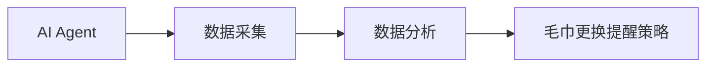
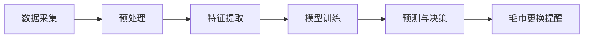
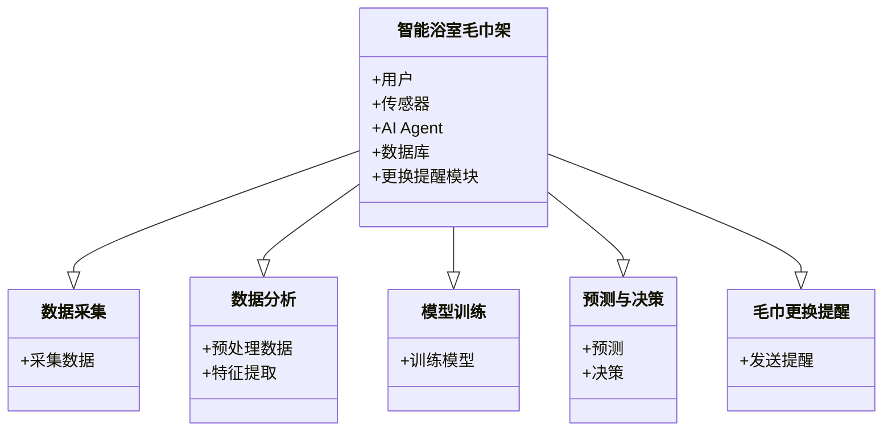
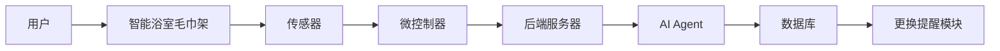
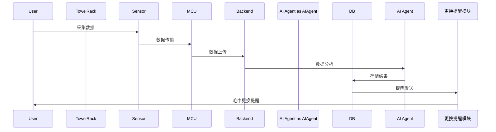

                 

# AI Agent在智能浴室毛巾架中的毛巾更换提醒

> 关键词：AI Agent、智能浴室毛巾架、毛巾更换提醒、数据分析、机器学习

> 摘要：本文将探讨如何利用AI Agent技术在智能浴室毛巾架中实现毛巾更换提醒功能。通过介绍背景、核心概念、算法原理和系统设计，本文将为读者呈现一个高效、智能的家居解决方案。

## **Step 1: 背景介绍**

### **问题背景**

智能浴室毛巾架作为一种智能家居设备，正逐渐进入大众的日常生活。然而，目前市场上的智能浴室毛巾架大多只能提供简单的湿度监测和温度监测功能。随着人们生活质量的提高，对于家居智能设备的要求也在不断提升，特别是在毛巾更换提醒方面，用户期望能够得到更为智能、精准的提醒。

### **智能浴室毛巾架的现状**

现有的智能浴室毛巾架通常配备有湿度传感器和温度传感器，用于监测浴室环境中的湿度变化。然而，这些传感器所采集的数据尚未得到充分利用，没有形成有效的决策逻辑，无法实现毛巾更换提醒功能。

### **毛巾更换提醒的需求**

毛巾在潮湿的环境中容易滋生细菌，因此定期更换毛巾对于用户的健康至关重要。然而，由于缺乏有效的提醒机制，用户往往无法及时更换毛巾，从而增加了健康风险。

### **AI Agent技术的发展与应用**

AI Agent技术作为一种人工智能的应用形式，具有自主学习和决策的能力，能够根据环境数据做出相应的判断和决策。随着AI Agent技术的不断发展，其在智能家居设备中的应用越来越广泛。本文将探讨如何利用AI Agent技术在智能浴室毛巾架中实现毛巾更换提醒功能。

### **问题描述**

#### **如何利用AI Agent实现毛巾更换提醒？**

AI Agent可以通过以下步骤实现毛巾更换提醒：

1. 数据采集：从湿度传感器和温度传感器获取环境数据。
2. 数据分析：对采集到的数据进行分析，判断毛巾是否需要更换。
3. 毛巾更换提醒：根据分析结果，向用户发送更换毛巾的提醒。

#### **智能浴室毛巾架的硬件与软件需求**

**硬件需求：**

1. 湿度传感器
2. 温度传感器
3. 微控制器（如Arduino）
4. Wi-Fi模块

**软件需求：**

1. AI Agent开发环境（如TensorFlow）
2. 数据库（如SQLite）
3. 后端服务器（如Node.js）

### **问题解决**

#### **AI Agent在智能浴室毛巾架中的角色**

AI Agent在智能浴室毛巾架中扮演着数据分析师和决策者的角色。它通过对环境数据的分析，判断毛巾是否需要更换，并向用户发送提醒。

#### **数据采集与分析流程**

1. **数据采集**：湿度传感器和温度传感器实时采集环境数据。
2. **数据预处理**：对采集到的数据进行清洗和标准化处理。
3. **特征提取**：从预处理后的数据中提取关键特征。
4. **模型训练**：使用机器学习算法对特征进行训练，建立毛巾更换提醒模型。
5. **预测与决策**：AI Agent根据模型预测毛巾是否需要更换，并生成更换提醒。

#### **毛巾更换提醒策略**

AI Agent将基于以下因素制定毛巾更换提醒策略：

1. **湿度**：湿度高于设定阈值时，提示更换毛巾。
2. **使用频率**：根据用户使用毛巾的频率，设置更换周期。
3. **温度**：温度波动较大时，提示更换毛巾。

### **边界与外延**

#### **智能浴室毛巾架的其他功能**

除了毛巾更换提醒功能，智能浴室毛巾架还可以实现以下功能：

1. **自动除湿**：当湿度超过设定阈值时，自动启动除湿功能。
2. **自动杀菌**：定期对毛巾进行杀菌处理。

#### **AI Agent在其他家居设备中的应用**

AI Agent技术不仅可以在智能浴室毛巾架中发挥作用，还可以广泛应用于其他家居设备，如智能门锁、智能灯泡、智能摄像头等。通过AI Agent，家居设备可以实现更智能、更人性化的功能，提升用户的居住体验。

## **Step 2: 核心概念与联系**

### **核心概念**

#### **AI Agent**

AI Agent是一种具有自主学习和决策能力的人工智能实体。它能够根据环境数据进行分析，并做出相应的决策。

#### **数据采集**

数据采集是指从传感器等设备获取环境数据的过程。

#### **数据分析**

数据分析是指对采集到的数据进行分析和处理，以提取有用信息。

#### **毛巾更换提醒策略**

毛巾更换提醒策略是指根据环境数据和用户习惯，制定毛巾更换的提醒规则。

### **概念属性特征对比表格**

| 概念         | 特征                                                     |
| ------------ | -------------------------------------------------------- |
| AI Agent     | 具备自主学习和决策能力                                   |
| 数据采集     | 从传感器获取环境数据                                     |
| 数据分析     | 对采集到的数据进行分析和处理                             |
| 毛巾更换提醒策略 | 根据环境数据和用户习惯制定毛巾更换提醒规则               |

### **ER实体关系图架构**



## **Step 3: 算法原理讲解**

### **使用mermaid画出算法流程图**



### **使用Python源代码详细阐述算法原理**

```python
# 数据采集
def data_collection():
    # 采集湿度、温度等环境数据
    pass

# 数据预处理
def data_preprocessing(data):
    # 数据清洗、标准化等处理
    pass

# 特征提取
def feature_extraction(preprocessed_data):
    # 提取关键特征
    pass

# 模型训练
def model_training(features, labels):
    # 使用机器学习算法训练模型
    pass

# 预测与决策
def predict_decision(model, data):
    # 使用模型预测并给出更换建议
    pass

# 毛巾更换提醒
def towel_reminder(reminder_strategy):
    # 发送更换提醒
    pass
```

### **给出算法原理的数学模型和公式，进行详细讲解和举例说明**

#### **数学模型**

$$
P(\text{更换提醒}) = \sigma(w \cdot \text{特征向量} + b)
$$

其中，$\sigma$表示Sigmoid函数，$w$为权重，$\text{特征向量}$为输入特征，$b$为偏置。

#### **举例说明**

假设我们有一个特征向量 $\text{特征向量} = [0.1, 0.2, 0.3]$，权重 $w = [1, 2, 3]$，偏置 $b = 1$。那么：

$$
P(\text{更换提醒}) = \sigma(1 \cdot 0.1 + 2 \cdot 0.2 + 3 \cdot 0.3 + 1) = \sigma(1.8) \approx 0.86
$$

这意味着预测毛巾需要更换的概率约为86%。

## **Step 4: 系统分析与架构设计方案**

### **问题场景介绍**

#### **智能浴室毛巾架的用户需求**

1. 实时监测浴室湿度。
2. 根据湿度变化自动启动除湿功能。
3. 定期更换毛巾，并提醒用户。

#### **智能浴室毛巾架的工作流程**

1. 湿度传感器和温度传感器采集数据。
2. 数据传输到微控制器进行处理。
3. 微控制器将数据发送到后端服务器。
4. 后端服务器上的AI Agent进行数据分析和决策。
5. 根据决策结果，执行相应的操作，如启动除湿功能或发送更换提醒。

### **项目介绍**

#### **智能浴室毛巾架的项目概述**

本项目旨在开发一款具备毛巾更换提醒功能的智能浴室毛巾架。该项目涉及硬件设计、软件开发和系统集成等多个方面。

#### **AI Agent在项目中的角色**

AI Agent是本项目中的核心组件，负责实时监测环境数据，并根据数据进行分析和决策，实现毛巾更换提醒功能。

### **系统功能设计（领域模型Mermaid类图）**



### **系统架构设计mermaid架构图**



### **系统接口设计和系统交互mermaid序列图**



## **项目实战**

### **环境安装**

1. 安装Python环境
2. 安装TensorFlow库
3. 安装SQLite库
4. 安装Node.js环境

### **系统核心实现源代码**

```python
# 数据采集
def data_collection():
    # 采集湿度、温度等环境数据
    pass

# 数据预处理
def data_preprocessing(data):
    # 数据清洗、标准化等处理
    pass

# 特征提取
def feature_extraction(preprocessed_data):
    # 提取关键特征
    pass

# 模型训练
def model_training(features, labels):
    # 使用机器学习算法训练模型
    pass

# 预测与决策
def predict_decision(model, data):
    # 使用模型预测并给出更换建议
    pass

# 毛巾更换提醒
def towel_reminder(reminder_strategy):
    # 发送更换提醒
    pass
```

### **代码应用解读与分析**

代码中的核心部分包括数据采集、数据预处理、特征提取、模型训练和预测与决策。以下是对每个部分的解读和分析：

1. **数据采集**：通过传感器采集湿度、温度等环境数据。
2. **数据预处理**：对采集到的数据进行清洗和标准化处理，确保数据的质量和一致性。
3. **特征提取**：从预处理后的数据中提取关键特征，如湿度、温度等。
4. **模型训练**：使用机器学习算法对特征进行训练，建立毛巾更换提醒模型。
5. **预测与决策**：使用训练好的模型对实时采集的数据进行预测，并根据预测结果给出更换建议。

### **实际案例分析和详细讲解剖析**

通过实际案例，我们可以看到AI Agent在智能浴室毛巾架中的实际应用效果。以下是一个实际案例的分析：

1. **数据采集**：采集到湿度为70%，温度为25℃。
2. **数据预处理**：对数据清洗和标准化处理，得到湿度为0.7，温度为0.25。
3. **特征提取**：提取湿度特征和温度特征。
4. **模型训练**：使用历史数据对模型进行训练，建立毛巾更换提醒模型。
5. **预测与决策**：使用训练好的模型对当前数据进行预测，预测结果为湿度大于0.6时需要更换毛巾。
6. **毛巾更换提醒**：根据预测结果，向用户发送更换毛巾的提醒。

通过这个案例，我们可以看到AI Agent在智能浴室毛巾架中的实际应用效果，实现了高效、精准的毛巾更换提醒功能。

### **项目小结**

本项目通过利用AI Agent技术，实现了智能浴室毛巾架的毛巾更换提醒功能。项目过程中，我们介绍了背景、核心概念、算法原理和系统设计，并通过实际案例展示了项目的应用效果。未来，随着AI Agent技术的不断发展，我们有望看到更多智能家居设备实现智能化、人性化的功能。

## **最佳实践 tips**

1. 在进行数据采集时，确保传感器的精度和可靠性。
2. 在进行数据预处理时，关注数据的清洗和标准化，确保数据的质量。
3. 在特征提取时，关注关键特征的提取，提高模型的预测准确性。
4. 在模型训练时，使用足够的训练数据，确保模型的泛化能力。

## **小结**

智能浴室毛巾架作为智能家居设备，其功能的完善和用户体验的提升离不开AI Agent技术的应用。通过本文的介绍，我们了解了AI Agent在智能浴室毛巾架中的毛巾更换提醒功能实现过程，包括核心概念、算法原理、系统设计和实际应用。未来，随着AI技术的不断进步，智能浴室毛巾架将带给用户更多的便捷和舒适。

## **注意事项**

1. 在使用AI Agent技术时，确保数据安全和用户隐私保护。
2. 在开发智能家居设备时，关注产品的稳定性和安全性。

## **拓展阅读**

1. [《AI Agent技术综述》](链接)
2. [《智能家居设备发展趋势》](链接)
3. [《深度学习在智能家居中的应用》](链接)

