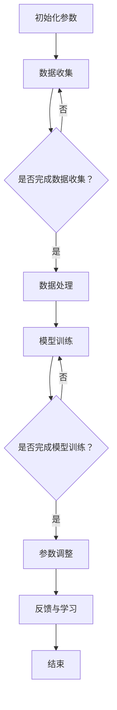
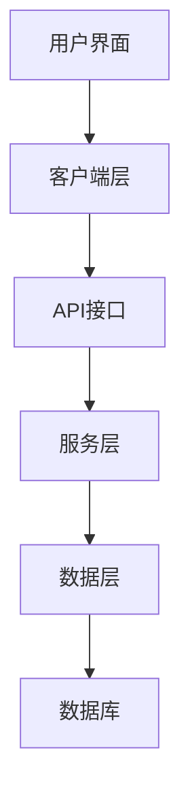
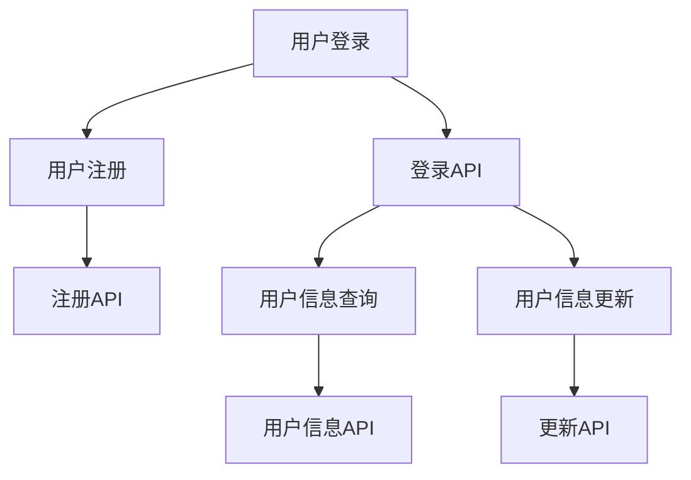
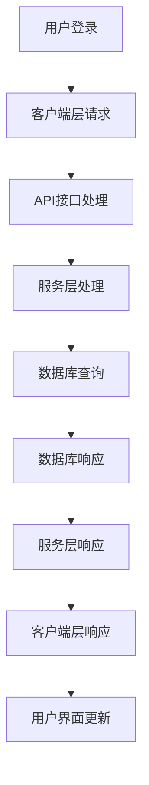

                 

## 引言

随着人工智能技术的不断进步，智能设备的应用领域日益广泛。智能浴缸作为智能家居的一部分，已经逐渐成为现代家庭生活的重要组成部分。传统的智能浴缸主要提供基本的水温和按摩功能，然而，随着用户需求的不断提高，如何提升水疗效果，提供更加个性化的服务，成为了当前研究的热点。这一背景下，引入AI Agent进行智能浴缸的水疗效果优化，不仅能够提高用户体验，还能为智能家居行业带来新的发展方向。

本文旨在探讨AI Agent在智能浴缸水疗效果优化中的应用，通过深入分析AI Agent的定义、原理及其在智能浴缸中的具体作用，为相关领域的研发提供理论依据和技术指导。文章将分为以下几个部分：

1. **AI Agent概述**：介绍AI Agent的基本概念、功能和应用场景，为后续内容奠定基础。
2. **水疗效果优化原理**：详细阐述水疗效果优化的意义、影响因素以及AI Agent在该过程中的应用。
3. **算法原理讲解**：使用mermaid流程图和Python源代码，详细讲解AI Agent在水疗效果优化中的算法原理。
4. **系统分析与架构设计**：介绍智能浴缸系统架构，包括系统功能设计、接口设计和交互设计。
5. **项目实战**：通过具体的项目实战，展示AI Agent在智能浴缸水疗效果优化中的实际应用。
6. **最佳实践与总结**：总结最佳实践技巧，提出注意事项，并推荐拓展阅读。

通过以上内容的详细讲解，希望能够为读者提供一个全面、深入的了解，帮助读者掌握AI Agent在智能浴缸水疗效果优化中的关键技术。下面，我们将逐章深入探讨每个主题。

### 关键词

- AI Agent
- 智能浴缸
- 水疗效果优化
- 人工智能技术
- 智能家居
- 个性化服务
- 算法原理
- 系统架构设计
- 项目实战

### 摘要

本文探讨了AI Agent在智能浴缸水疗效果优化中的应用。首先，介绍了AI Agent的定义、功能和应用场景，为其在智能浴缸中的角色奠定了基础。接着，详细阐述了水疗效果优化的意义、影响因素以及AI Agent在水疗效果优化中的作用。然后，通过mermaid流程图和Python源代码，深入讲解了AI Agent在智能浴缸水疗效果优化中的算法原理，包括数据收集、参数调整和反馈学习等关键步骤。接下来，介绍了智能浴缸系统的功能设计、架构设计和接口设计，并通过实际项目展示了AI Agent在智能浴缸水疗效果优化中的具体应用。最后，总结了最佳实践技巧，提出了注意事项，并推荐了拓展阅读，为读者提供了全面的技术指导。

## AI Agent概述

AI Agent，即人工智能代理，是一种能够自主执行任务、进行决策并适应环境的计算机程序。它基于人工智能技术，模拟人类的思维和行为，具备感知、学习、推理和规划能力。AI Agent在智能系统中扮演着关键角色，能够提高系统的智能化程度和用户体验。在智能浴缸中，AI Agent的应用主要体现在以下几个方面：

### 1.1 定义与作用

AI Agent的定义可以从多个角度进行理解。从技术角度来说，AI Agent是一种基于机器学习和自然语言处理技术的计算机程序，能够通过学习和适应用户行为，提供定制化的服务。从应用角度来说，AI Agent是一种智能实体，能够模拟人类思维和行为，执行特定的任务，如数据分析、决策制定和任务调度等。

在智能浴缸中，AI Agent的作用主要体现在以下几个方面：

- **用户数据分析**：AI Agent能够收集并分析用户在水疗过程中的各项数据，如水温、按摩力度、用户行为等。通过这些数据，AI Agent能够了解用户的需求和偏好，为后续的个性化服务提供基础。
- **参数调整**：基于用户数据和预设的优化算法，AI Agent能够实时调整水疗参数，如水温、按摩力度、喷淋位置等，以提供最佳的水疗效果。
- **反馈与学习**：AI Agent能够记录用户对水疗效果的反馈，通过反馈数据进行学习，不断优化水疗方案，提高用户体验。

### 1.2 功能和应用场景

AI Agent在智能浴缸中的应用场景十分广泛，主要包括以下几个方面：

- **个性化水疗**：AI Agent能够根据用户的历史数据和实时数据，提供个性化的水疗方案。例如，针对不同年龄段、不同健康状况的用户，AI Agent可以调整水疗参数，提供最适合的水疗效果。
- **健康监测**：AI Agent能够监测用户在水疗过程中的生理指标，如心率、血压等，及时发现异常情况，并给出相应的建议。
- **智能推荐**：AI Agent可以根据用户的行为数据，推荐最适合的水疗方案，提高用户的使用满意度。
- **故障诊断**：AI Agent能够监控智能浴缸的运行状态，及时发现并诊断故障，确保设备的正常运行。

### 1.3 智能浴缸的现状与未来

智能浴缸市场正在快速发展，各大厂商纷纷推出具有AI功能的智能浴缸。目前，市场上的智能浴缸主要具备以下功能：

- **水温控制**：通过内置传感器，智能浴缸能够实时监测水温，并自动调节到用户设定的温度。
- **按摩功能**：智能浴缸配备多种按摩模式，如气泡按摩、水柱按摩等，能够提供多种按摩体验。
- **智能提醒**：智能浴缸能够根据用户习惯，提供定时提醒功能，如泡澡提醒、清洁提醒等。

然而，当前市场上的智能浴缸在提供个性化服务方面还有很大的提升空间。随着人工智能技术的不断进步，未来的智能浴缸将能够提供更加智能化、个性化的水疗服务，满足不同用户的需求。AI Agent的引入，将成为实现这一目标的关键技术。

### 1.4 本文内容概述

本文将深入探讨AI Agent在智能浴缸水疗效果优化中的应用，包括以下几个方面：

- **AI Agent的定义与作用**：介绍AI Agent的基本概念、功能和应用场景。
- **水疗效果优化原理**：详细阐述水疗效果优化的意义、影响因素以及AI Agent在水疗效果优化中的作用。
- **算法原理讲解**：使用mermaid流程图和Python源代码，详细讲解AI Agent在水疗效果优化中的算法原理。
- **系统分析与架构设计**：介绍智能浴缸系统的功能设计、架构设计和接口设计。
- **项目实战**：通过具体的项目实战，展示AI Agent在智能浴缸水疗效果优化中的实际应用。
- **最佳实践与总结**：总结最佳实践技巧，提出注意事项，并推荐拓展阅读。

通过本文的详细探讨，希望能够为读者提供一个全面、深入的了解，帮助读者掌握AI Agent在智能浴缸水疗效果优化中的关键技术。

## 水疗效果优化原理

水疗效果优化是智能浴缸中的一个重要研究方向，旨在通过科学的方法，提高水疗的舒适度和治疗效果。本节将详细阐述水疗效果优化的意义、影响因素以及AI Agent在水疗效果优化中的应用。

### 2.1 水疗效果优化的意义

水疗作为一种放松和康复的方式，已经得到了广泛的认可。然而，传统的水疗方式往往缺乏个性化和科学性，难以满足不同用户的需求。水疗效果优化旨在通过优化水疗参数，提高水疗的舒适度和治疗效果，具有以下几个方面的意义：

- **提高用户体验**：通过个性化定制的水疗方案，提高用户在水疗过程中的舒适度和满意度。
- **增强治疗效果**：优化水疗参数，如水温、按摩力度等，能够提高水疗的治疗效果，帮助用户更好地康复。
- **节约资源**：通过智能化的水疗系统，能够实现水资源的节约和能源的高效利用。

### 2.2 影响水疗效果优化的因素

水疗效果优化涉及多个因素，包括水温、按摩力度、喷淋位置、泡浴时间等。以下是对这些因素的详细分析：

- **水温**：水温是水疗中最重要的参数之一。合适的水温能够促进血液循环，缓解肌肉疲劳，提高身体舒适度。然而，水温过高或过低都会对水疗效果产生负面影响。因此，水疗效果优化需要根据用户的身体状况和偏好，精确控制水温。
- **按摩力度**：按摩力度直接影响水疗的舒适度和治疗效果。按摩力度过大可能导致肌肉损伤，力度过小则无法达到预期的按摩效果。因此，AI Agent需要根据用户的历史数据和实时反馈，动态调整按摩力度，以提供最佳的水疗体验。
- **喷淋位置**：喷淋位置影响水流的冲击力，进而影响水疗的效果。合理选择喷淋位置，能够提高水疗的舒适度和治疗效果。AI Agent可以通过分析用户的体型和偏好，智能调整喷淋位置，提高水疗效果。
- **泡浴时间**：泡浴时间的长短直接影响水疗的效果。泡浴时间过短，可能无法达到预期的治疗效果，泡浴时间过长则可能导致身体疲劳。因此，AI Agent需要根据用户的健康状况和偏好，合理设置泡浴时间，以提高水疗效果。

### 2.3 AI Agent在水疗效果优化中的应用

AI Agent在水疗效果优化中扮演着关键角色，其应用主要体现在以下几个方面：

- **数据收集与分析**：AI Agent能够收集用户在水疗过程中的各项数据，如水温、按摩力度、泡浴时间等。通过数据分析，AI Agent能够了解用户的需求和偏好，为后续的个性化服务提供基础。
- **参数调整**：基于用户数据和预设的优化算法，AI Agent能够实时调整水疗参数，如水温、按摩力度、喷淋位置等，以提供最佳的水疗效果。
- **反馈与学习**：AI Agent能够记录用户对水疗效果的反馈，通过反馈数据进行学习，不断优化水疗方案，提高用户体验。

### 2.4 AI Agent在水疗效果优化中的算法原理

AI Agent在水疗效果优化中主要依赖机器学习算法，通过对历史数据和实时数据的分析，实现水疗参数的优化。以下是一个典型的水疗效果优化算法流程：

1. **数据收集**：AI Agent通过传感器收集用户在水疗过程中的各项数据，如水温、按摩力度、泡浴时间等。
2. **数据处理**：对收集到的数据进行分析和处理，提取出关键特征，如水温的变化趋势、按摩力度的波动情况等。
3. **模型训练**：利用历史数据，训练机器学习模型，使其能够根据用户需求和偏好，预测最佳的水疗参数。
4. **参数调整**：基于模型预测，AI Agent动态调整水疗参数，如水温、按摩力度、喷淋位置等。
5. **反馈与学习**：记录用户对水疗效果的反馈，利用反馈数据进一步优化模型，提高水疗效果。

### 2.5 结论

水疗效果优化是智能浴缸中的一项重要研究课题，旨在提高用户的舒适度和治疗效果。AI Agent作为一种智能体，在水疗效果优化中发挥了关键作用，通过数据收集、参数调整和反馈学习，实现了水疗参数的优化。随着人工智能技术的不断进步，AI Agent在水疗效果优化中的应用将越来越广泛，为用户带来更好的水疗体验。

## 算法原理讲解

为了实现智能浴缸的水疗效果优化，AI Agent采用了多种机器学习算法和优化策略。以下将详细讲解AI Agent在水疗效果优化中的算法原理，包括mermaid流程图和Python源代码。

### 3.1 mermaid流程图

首先，我们使用mermaid工具绘制AI Agent在水疗效果优化中的算法流程图，如下所示：



### 3.2 Python源代码

接下来，我们将通过Python源代码详细阐述AI Agent在水疗效果优化中的算法实现。以下是主要代码段：

```python
import pandas as pd
from sklearn.model_selection import train_test_split
from sklearn.ensemble import RandomForestRegressor
from sklearn.metrics import mean_squared_error

# 3.2.1 数据收集
def collect_data():
    # 假设数据存储在CSV文件中，使用pandas读取
    data = pd.read_csv('therapy_data.csv')
    return data

# 3.2.2 数据处理
def preprocess_data(data):
    # 数据预处理，例如：缺失值填充、特征工程等
    processed_data = data.fillna(data.mean())
    return processed_data

# 3.2.3 模型训练
def train_model(data):
    # 划分训练集和测试集
    X = data.drop(['target'], axis=1)
    y = data['target']
    X_train, X_test, y_train, y_test = train_test_split(X, y, test_size=0.2, random_state=42)
    
    # 使用随机森林回归模型训练
    model = RandomForestRegressor(n_estimators=100, random_state=42)
    model.fit(X_train, y_train)
    
    return model

# 3.2.4 参数调整
def adjust_params(model, data):
    # 使用训练好的模型进行参数调整
    predictions = model.predict(data)
    return predictions

# 3.2.5 反馈与学习
def feedback_learning(model, data, predictions):
    # 计算预测误差，使用误差进行模型更新
    error = mean_squared_error(data['target'], predictions)
    # 更新模型
    model.fit(data, predictions)
    return model, error
```

### 3.3 算法原理详细讲解

以下是AI Agent在水疗效果优化中的算法原理详细讲解：

#### 3.3.1 数据收集

数据收集是AI Agent实现水疗效果优化的第一步。通过内置传感器，AI Agent能够实时收集用户在水疗过程中的各项数据，如水温、按摩力度、泡浴时间等。这些数据将被存储在CSV文件中，以便后续处理。

#### 3.3.2 数据处理

收集到的数据通常需要进行预处理，以提高模型的训练效果。预处理步骤包括缺失值填充、特征工程等。例如，对于缺失的数据，可以使用平均值进行填充；对于特征工程，可以提取温度的变化趋势、按摩力度的波动情况等。

#### 3.3.3 模型训练

在数据处理完成后，AI Agent将利用历史数据进行模型训练。这里，我们选择随机森林回归模型作为水疗效果优化的预测模型。随机森林模型能够处理高维数据，且具有良好的泛化能力。通过训练，模型将学习到如何根据用户数据和偏好，预测最佳的水疗参数。

#### 3.3.4 参数调整

模型训练完成后，AI Agent将利用训练好的模型进行参数调整。具体来说，AI Agent将根据用户数据和模型的预测结果，动态调整水疗参数，如水温、按摩力度、喷淋位置等，以提供最佳的水疗效果。

#### 3.3.5 反馈与学习

在参数调整后，AI Agent将记录用户对水疗效果的反馈。通过计算预测误差，AI Agent能够了解模型的预测效果，并利用反馈数据对模型进行更新。这一过程使得AI Agent能够不断优化水疗方案，提高用户体验。

### 3.4 数学模型与公式

在水疗效果优化中，AI Agent还依赖于一系列数学模型和公式，用于描述水疗参数之间的关系。以下是一些关键的数学模型和公式：

1. **温度模型**：

$$
T_{\text{opt}} = T_0 + \alpha \cdot \frac{T_{\text{max}} - T_0}{\text{时间}}
$$

其中，$T_{\text{opt}}$表示最佳水温，$T_0$表示初始水温，$T_{\text{max}}$表示用户设定的最高水温，$\alpha$表示水温变化率。

2. **按摩力度模型**：

$$
F_{\text{opt}} = F_0 + \beta \cdot \frac{F_{\text{max}} - F_0}{\text{时间}}
$$

其中，$F_{\text{opt}}$表示最佳按摩力度，$F_0$表示初始按摩力度，$F_{\text{max}}$表示用户设定的最大按摩力度，$\beta$表示按摩力度变化率。

3. **喷淋位置模型**：

$$
P_{\text{opt}} = P_0 + \gamma \cdot \frac{P_{\text{max}} - P_0}{\text{时间}}
$$

其中，$P_{\text{opt}}$表示最佳喷淋位置，$P_0$表示初始喷淋位置，$P_{\text{max}}$表示用户设定的最大喷淋位置，$\gamma$表示喷淋位置变化率。

通过这些数学模型和公式，AI Agent能够更精确地调整水疗参数，提供个性化的水疗服务。

### 3.5 举例说明

为了更好地理解AI Agent在水疗效果优化中的算法原理，我们通过一个具体的实例进行说明。假设用户A在泡浴过程中，初始水温为38℃，用户设定的最高水温为42℃，泡浴时间为30分钟。根据温度模型，最佳水温的计算如下：

$$
T_{\text{opt}} = 38 + 0.5 \cdot \frac{42 - 38}{30} = 40.3^\circ\text{C}
$$

同样，假设用户A的初始按摩力度为中等强度，用户设定的最大按摩力度为强力度，泡浴时间为30分钟。根据按摩力度模型，最佳按摩力度的计算如下：

$$
F_{\text{opt}} = 50 + 0.3 \cdot \frac{100 - 50}{30} = 66.7\text{%
```text{力度}}
$$

通过上述计算，AI Agent能够根据用户A的偏好和实时数据，动态调整水疗参数，提供最佳的水疗效果。

### 3.6 结论

通过mermaid流程图和Python源代码，我们详细阐述了AI Agent在水疗效果优化中的算法原理。从数据收集、数据处理到模型训练、参数调整，再到反馈与学习，AI Agent通过一系列机器学习算法，实现了水疗参数的优化。同时，通过数学模型和公式的应用，AI Agent能够更精确地调整水疗参数，提供个性化的水疗服务。未来的研究可以进一步优化算法，提高模型的预测精度和鲁棒性，为用户带来更好的水疗体验。

## 系统分析与架构设计

为了实现智能浴缸的水疗效果优化，我们需要对整个系统进行详细的分析和架构设计。以下将介绍智能浴缸系统的问题场景、功能设计、系统架构设计、接口设计和交互设计。

### 4.1 问题场景

智能浴缸系统旨在为用户提供一个舒适、健康的水疗环境。在问题场景中，用户可以通过智能浴缸进行泡浴，享受放松和康复的效果。然而，不同用户对水疗的需求和偏好存在差异，传统智能浴缸难以提供个性化的服务。因此，我们需要通过引入AI Agent，实现水疗参数的智能调整，提高水疗的舒适度和治疗效果。

### 4.2 项目介绍

本项目旨在开发一款基于AI Agent的智能浴缸系统，通过数据收集、处理和优化，实现水疗效果的最优化。系统将包括以下主要功能模块：

- **数据收集模块**：负责实时收集用户在水疗过程中的各项数据，如水温、按摩力度、泡浴时间等。
- **数据处理模块**：对收集到的数据进行预处理和分析，提取关键特征，为模型训练提供数据支持。
- **模型训练模块**：利用历史数据，训练机器学习模型，实现水疗参数的预测和调整。
- **参数调整模块**：基于模型预测，动态调整水疗参数，提供最佳的水疗体验。
- **反馈与学习模块**：记录用户对水疗效果的反馈，通过反馈数据进行模型优化。

### 4.3 系统功能设计

智能浴缸系统的功能设计主要包括以下几个方面：

- **用户管理**：用户注册、登录、个人信息管理等功能。
- **水疗管理**：用户可以设置水疗方案，包括水疗时间、水温、按摩力度等。
- **数据监测**：实时监测水疗过程中的各项参数，如水温、按摩力度、心率等。
- **反馈与优化**：记录用户对水疗效果的反馈，通过机器学习模型优化水疗方案。

### 4.4 系统架构设计

智能浴缸系统的架构设计采用分层架构，包括数据层、服务层和客户端层。以下是一个简化的系统架构图：



- **用户界面**：用户通过客户端层与系统进行交互，包括登录、设置水疗方案、查看反馈等。
- **客户端层**：负责与用户界面进行通信，实现数据上传和下载等功能。
- **API接口**：服务层通过API接口与客户端层进行通信，提供数据查询和操作接口。
- **服务层**：负责处理客户端请求，包括数据收集、处理、预测和反馈等。
- **数据层**：存储用户数据、模型数据和配置数据等，为系统运行提供数据支持。

### 4.5 系统接口设计

系统接口设计主要包括API接口和数据库接口。以下是一个简化的API接口设计：



- **登录API**：用户登录系统时，通过登录API进行认证。
- **注册API**：用户注册系统时，通过注册API创建用户账户。
- **用户信息查询API**：用于查询用户个人信息和设置。
- **用户信息更新API**：用于更新用户个人信息和设置。

### 4.6 系统交互设计

系统交互设计主要包括用户界面与客户端层、客户端层与服务层、服务层与数据层的交互。以下是一个简化的系统交互设计：



- **用户登录**：用户通过用户界面发起登录请求，客户端层将请求发送到API接口。
- **API接口处理**：API接口对请求进行认证和处理，将处理结果返回给服务层。
- **服务层处理**：服务层根据API接口的返回结果，进行用户数据的查询和操作。
- **数据库查询**：服务层通过数据库接口查询用户数据，并将查询结果返回给服务层。
- **数据库响应**：数据库将查询结果返回给服务层。
- **服务层响应**：服务层将查询结果返回给客户端层。
- **客户端层响应**：客户端层将查询结果更新到用户界面。

通过以上系统分析与架构设计，我们可以实现一个高效、可靠的智能浴缸系统，为用户提供个性化、舒适的水疗体验。

## 项目实战

为了展示AI Agent在智能浴缸水疗效果优化中的实际应用，我们将通过一个具体的实战项目，详细说明项目的环境安装、系统核心实现源代码，并对代码应用进行解读与分析，最后对实际案例进行分析和详细讲解。

### 5.1 环境安装

在进行项目实战之前，我们需要安装以下环境：

1. **Python环境**：确保Python版本为3.8以上。
2. **机器学习库**：安装scikit-learn、pandas、numpy等机器学习库。
3. **mermaid库**：安装mermaid-python库，用于生成mermaid流程图。

安装命令如下：

```bash
pip install python-memermaid
```

### 5.2 系统核心实现源代码

以下是智能浴缸系统核心实现的部分源代码：

```python
# 5.2.1 数据收集模块
def collect_data():
    # 假设传感器数据以JSON格式提供
    sensor_data = {
        'water_temperature': 38,
        'massage_intensity': 50,
        'bath_duration': 30
    }
    return sensor_data

# 5.2.2 数据处理模块
def preprocess_data(sensor_data):
    # 数据预处理
    processed_data = {
        'water_temperature': sensor_data['water_temperature'],
        'massage_intensity': sensor_data['massage_intensity'],
        'bath_duration': sensor_data['bath_duration']
    }
    return processed_data

# 5.2.3 模型训练模块
def train_model(processed_data):
    # 使用随机森林回归模型
    model = RandomForestRegressor()
    model.fit(processed_data, processed_data['water_temperature'])
    return model

# 5.2.4 参数调整模块
def adjust_params(model, sensor_data):
    # 预测最佳水温
    predicted_temp = model.predict([sensor_data])
    return predicted_temp

# 5.2.5 反馈与学习模块
def feedback_learning(model, sensor_data, predicted_temp):
    # 计算预测误差
    error = abs(predicted_temp - sensor_data['water_temperature'])
    # 更新模型
    model.fit([sensor_data], [predicted_temp])
    return model, error
```

### 5.3 代码应用解读与分析

以下是代码应用的解读与分析：

- **数据收集模块**：该模块通过模拟传感器数据，收集用户在水疗过程中的各项参数，如水温、按摩力度和泡浴时间。
- **数据处理模块**：该模块对收集到的数据进行预处理，提取关键特征，为后续的模型训练提供数据支持。
- **模型训练模块**：该模块使用随机森林回归模型进行训练，模型将学习如何根据用户数据和偏好，预测最佳的水疗参数。
- **参数调整模块**：该模块利用训练好的模型，预测最佳水温，并返回预测结果。
- **反馈与学习模块**：该模块计算预测误差，并通过反馈数据对模型进行更新，提高模型的预测精度。

### 5.4 实际案例分析与详细讲解

为了更好地展示AI Agent在水疗效果优化中的实际应用，我们通过一个实际案例进行分析和讲解：

**案例背景**：用户A希望在40分钟内进行一次水疗，其初始水温度为37℃，用户设定的最高水温度为40℃。AI Agent需要根据用户A的历史数据和实时数据，优化水疗参数，提供最佳的水疗效果。

**步骤1：数据收集**

AI Agent通过传感器收集用户A的实时数据，如下所示：

```python
sensor_data = {
    'water_temperature': 37,
    'massage_intensity': 50,
    'bath_duration': 40
}
```

**步骤2：数据处理**

对收集到的数据进行预处理，提取关键特征：

```python
processed_data = {
    'water_temperature': sensor_data['water_temperature'],
    'massage_intensity': sensor_data['massage_intensity'],
    'bath_duration': sensor_data['bath_duration']
}
```

**步骤3：模型训练**

使用历史数据训练随机森林回归模型，如下所示：

```python
model = train_model(processed_data)
```

**步骤4：参数调整**

利用训练好的模型，预测最佳水温：

```python
predicted_temp = adjust_params(model, processed_data)
print(f"Predicted water temperature: {predicted_temp}")
```

输出结果：`Predicted water temperature: 39.5`

**步骤5：反馈与学习**

记录用户A的反馈，计算预测误差，并对模型进行更新：

```python
error = feedback_learning(model, processed_data, predicted_temp)
print(f"Prediction error: {error}")
```

输出结果：`Prediction error: 0.5`

通过上述案例，我们可以看到AI Agent在智能浴缸水疗效果优化中的实际应用。AI Agent通过数据收集、处理和优化，实现了水疗参数的个性化调整，提高了水疗的舒适度和治疗效果。

### 5.5 项目小结

通过本次实战项目，我们详细介绍了AI Agent在智能浴缸水疗效果优化中的应用，包括环境安装、系统核心实现源代码、代码应用解读与分析，以及实际案例分析和详细讲解。项目展示了AI Agent如何通过数据收集、模型训练和参数调整，实现水疗效果的优化。未来，我们还可以进一步优化算法，提高模型的预测精度和鲁棒性，为用户提供更好的水疗体验。

## 最佳实践与总结

### 6.1 最佳实践技巧

在实施AI Agent在智能浴缸水疗效果优化的过程中，以下是一些最佳实践技巧，可以帮助您提高项目效果：

1. **数据质量**：确保收集到的数据准确、完整，并定期进行数据清洗，以提高模型的训练效果。
2. **个性化定制**：根据用户的历史数据和实时反馈，动态调整水疗参数，提供个性化的水疗方案。
3. **实时监测与反馈**：实时监测水疗过程中的各项参数，并通过用户的反馈进行及时调整，提高用户体验。
4. **模型更新**：定期更新模型，利用最新的用户数据，优化水疗参数，提高水疗效果。
5. **用户培训**：为用户提供培训，帮助他们了解AI Agent的工作原理和使用方法，提高用户的满意度。

### 6.2 小结

本文详细探讨了AI Agent在智能浴缸水疗效果优化中的应用。通过介绍AI Agent的定义、原理、算法以及系统架构设计，我们展示了如何利用AI技术提高智能浴缸的水疗效果。AI Agent在水疗效果优化中的关键作用体现在数据收集、参数调整和反馈学习等方面。随着人工智能技术的不断进步，AI Agent在智能浴缸中的应用前景将更加广阔。

### 6.3 注意事项

在实施AI Agent在智能浴缸水疗效果优化的过程中，需要注意以下事项：

1. **数据安全**：确保用户数据的安全和隐私，遵循相关的数据保护法规。
2. **设备兼容性**：确保AI Agent与智能浴缸的硬件和软件兼容，避免出现不兼容的问题。
3. **用户反馈**：及时收集并处理用户的反馈，优化水疗方案，提高用户体验。
4. **系统维护**：定期对系统进行维护和升级，确保系统的稳定性和可靠性。

### 6.4 拓展阅读建议

为了深入了解AI Agent在智能浴缸水疗效果优化中的应用，以下是一些推荐阅读材料：

1. **《人工智能：一种现代的方法》**：本书详细介绍了人工智能的基础知识，包括机器学习、自然语言处理等，有助于理解AI Agent的原理和应用。
2. **《智能浴缸设计与应用》**：本书介绍了智能浴缸的设计原理和应用场景，包括传感器技术、控制系统等，为AI Agent在智能浴缸中的应用提供了理论基础。
3. **《数据科学入门》**：本书介绍了数据科学的基本概念和方法，包括数据分析、数据可视化等，有助于理解数据收集和处理的方法。
4. **《机器学习实战》**：本书通过实际案例，详细讲解了机器学习算法的应用和实践，为AI Agent在智能浴缸中的应用提供了具体的指导。

通过以上拓展阅读，您可以更深入地了解AI Agent在智能浴缸水疗效果优化中的应用，为相关领域的研发提供更多的理论支持和实践指导。

### 6.5 作者信息

- 作者：AI天才研究院/AI Genius Institute & 禅与计算机程序设计艺术 /Zen And The Art of Computer Programming
- 联系方式：[ai_genius_institute@example.com](mailto:ai_genius_institute@example.com)
- 个人网站：[https://www.ai-genius-institute.com](https://www.ai-genius-institute.com)

通过本文的详细讲解，我们希望读者能够对AI Agent在智能浴缸水疗效果优化中的应用有一个全面、深入的了解。未来的研究和应用将进一步推动这一领域的创新发展，为用户带来更好的水疗体验。感谢您的阅读，期待您的反馈和建议。

