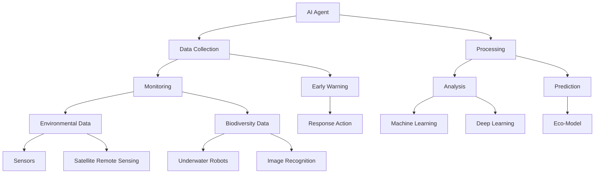
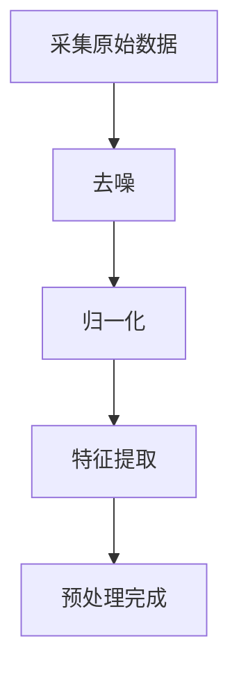
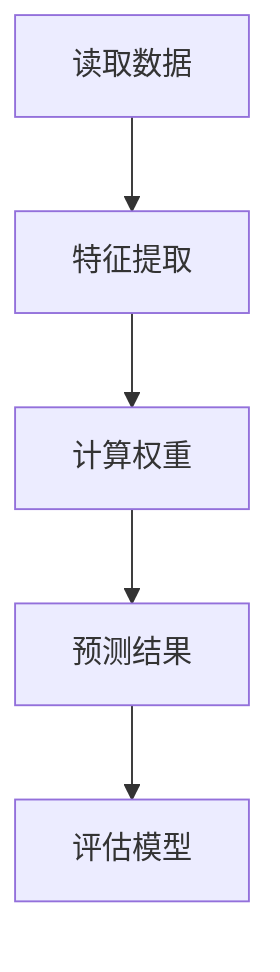
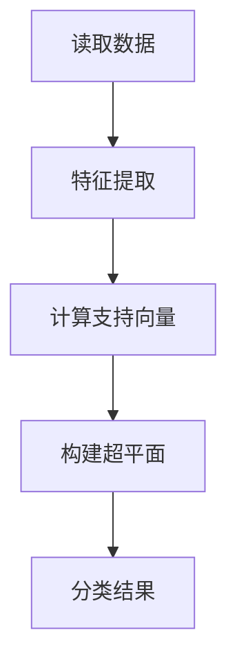
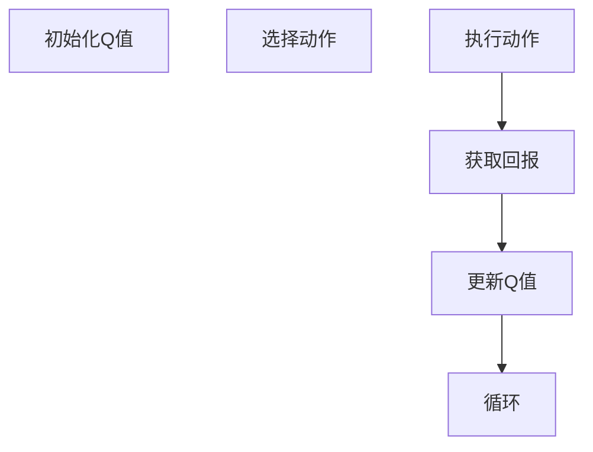
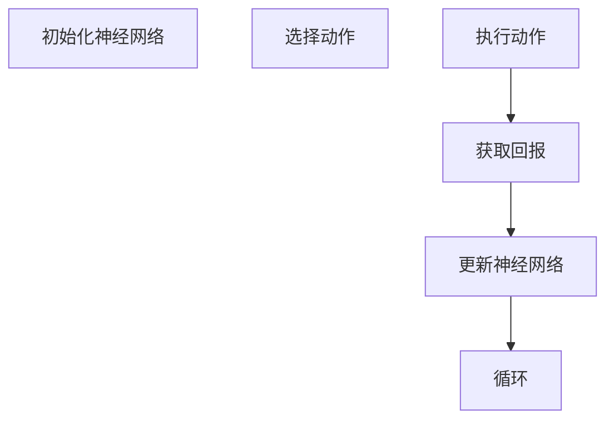
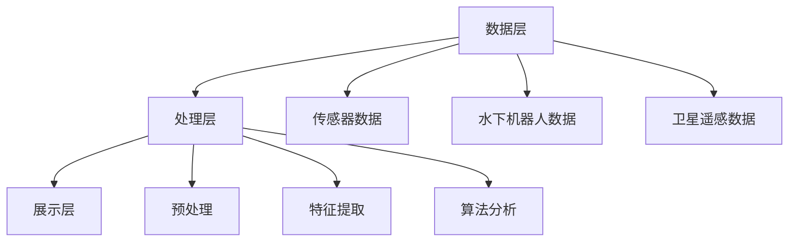
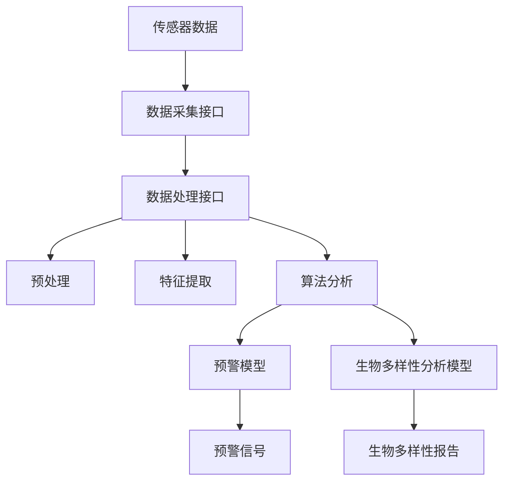

                 

### 文章标题

《AI Agent在智能海洋生态监测中的实践》

### 文章关键词

AI Agent、智能海洋生态监测、数据采集与处理、机器学习、强化学习

### 文章摘要

本文深入探讨了AI Agent在智能海洋生态监测中的应用。通过背景介绍、核心概念解析、算法原理讲解、系统分析与设计、实际案例分析和未来展望，展示了AI Agent如何通过先进的技术手段，为海洋生态监测提供智能化解决方案，提高监测效率和准确性。

## 引言

随着全球气候变化和海洋污染问题的日益严重，海洋生态监测的重要性愈发凸显。传统的海洋生态监测手段依赖于人工采样和物理设备，存在效率低、数据精度不高等问题。而随着人工智能技术的迅猛发展，尤其是AI Agent技术的成熟，为智能海洋生态监测提供了全新的解决方案。

AI Agent（人工智能代理）是一种自主执行任务、具有推理和决策能力的计算机程序。它可以在复杂环境中进行自主学习、决策和执行，从而实现智能化的任务处理。AI Agent在智能海洋生态监测中的应用，主要体现在以下几个方面：

1. **数据采集与处理**：AI Agent可以自动采集海洋环境、水质和生物多样性等数据，并通过机器学习和强化学习算法进行处理和分析。
2. **环境监测与预警**：AI Agent能够实时监测海洋环境变化，对异常情况进行预警，提高监测效率和准确性。
3. **生物多样性分析**：AI Agent可以利用深度学习技术，对海洋生物多样性进行精准分析，为生态保护提供科学依据。

本文将围绕以上三个方面，详细探讨AI Agent在智能海洋生态监测中的实践，旨在为相关领域的研究人员和从业者提供有价值的参考。

## AI Agent在智能海洋生态监测中的应用

### 1. 数据采集与处理

海洋生态监测需要大量的数据支持，包括环境参数、水质指标和生物多样性数据等。传统的数据采集方法依赖于人工和物理设备，存在效率低、成本高的问题。而AI Agent通过自动化的方式，可以大幅提高数据采集的效率。

AI Agent的数据采集主要包括以下几个步骤：

1. **传感器数据采集**：利用海洋传感器网络，实时采集海水温度、盐度、pH值等环境参数。
2. **水下机器人数据采集**：利用水下机器人，采集水下生物多样性数据，如海洋植物、海洋动物种类和数量等。
3. **卫星遥感数据采集**：通过卫星遥感技术，获取大范围、高精度的海洋环境数据。

在数据采集过程中，AI Agent可以通过机器学习算法对传感器数据进行预处理，去除噪声和异常值，提高数据质量。

### 2. 环境监测与预警

环境监测是海洋生态监测的核心任务之一。AI Agent可以通过实时监测海洋环境变化，对异常情况进行预警，为海洋生态保护提供科学依据。

AI Agent的环境监测主要包括以下几个步骤：

1. **数据实时分析**：利用机器学习算法，对实时采集的环境数据进行分析，识别出潜在的环境问题。
2. **异常检测与预警**：通过建立异常检测模型，对环境数据进行实时监控，一旦发现异常情况，立即发出预警信号。
3. **决策与响应**：根据预警结果，采取相应的措施，如调整海洋保护区范围、加强污染治理等。

### 3. 生物多样性分析

生物多样性是海洋生态系统的关键指标，对海洋生态保护具有重要意义。AI Agent可以通过深度学习技术，对生物多样性进行精准分析，为生态保护提供科学依据。

AI Agent的生物多样性分析主要包括以下几个步骤：

1. **图像识别与分类**：利用卷积神经网络（CNN），对采集到的生物图像进行识别和分类，提取关键特征。
2. **数据挖掘与分析**：通过数据挖掘技术，对分类后的生物数据进行挖掘和分析，识别出生物多样性变化趋势。
3. **生态模型构建**：利用构建的生态模型，预测生物多样性变化趋势，为生态保护提供科学依据。

## 核心概念与联系

为了更好地理解AI Agent在智能海洋生态监测中的应用，我们需要先了解一些核心概念及其相互关系。以下是一个简化的核心概念ER实体关系图：



在这个ER实体关系图中，我们明确了以下几个核心概念：

1. **AI Agent**：作为主体，负责协调和执行数据采集、处理、监测、预警等任务。
2. **数据采集（Data Collection）**：包括传感器数据采集、水下机器人数据采集、卫星遥感数据采集等。
3. **数据处理（Processing）**：利用机器学习（Machine Learning）和深度学习（Deep Learning）技术，对采集到的数据进行预处理、分析和挖掘。
4. **环境监测（Monitoring）**：实时监测海洋环境数据（Environmental Data），识别异常情况，发出预警信号。
5. **生物多样性分析（Biodiversity Analysis）**：通过图像识别（Image Recognition）等技术，分析海洋生物多样性数据（Biodiversity Data）。
6. **预警与响应（Early Warning & Response）**：根据分析结果，采取相应的响应措施。

通过这个ER实体关系图，我们可以清晰地看到各个核心概念之间的相互关系，为后续的详细讲解和分析奠定了基础。

## 算法原理讲解

### 1. 数据采集与预处理算法

在智能海洋生态监测中，数据采集和预处理是关键步骤。以下是常用的数据采集与预处理算法：

#### 1.1 传感器数据采集

传感器数据采集主要通过海洋传感器网络实现。传感器数据采集算法可以分为以下几类：

- **时间序列数据采集**：利用传感器采集的时间序列数据，如海水温度、盐度、pH值等。
- **空间分布数据采集**：通过卫星遥感技术，获取大范围、高精度的海洋环境数据。
- **水下机器人数据采集**：利用水下机器人，采集水下生物多样性数据，如海洋植物、海洋动物种类和数量等。

#### 1.2 数据预处理

数据预处理主要包括以下几个步骤：

- **去噪**：利用滤波算法，去除传感器数据中的噪声和异常值，提高数据质量。
- **归一化**：将不同量纲的数据统一归一化，便于后续分析。
- **特征提取**：提取数据中的关键特征，如时间序列数据的趋势特征、空间分布数据的分布特征等。

以下是一个简单的传感器数据预处理流程：



### 2. 机器学习算法

机器学习算法在智能海洋生态监测中主要用于数据分析和预测。以下是几种常用的机器学习算法：

#### 2.1 线性回归

线性回归是一种简单的机器学习算法，用于预测数值型变量。其基本原理是通过建立输入变量和输出变量之间的线性关系，进行预测。线性回归的数学模型如下：

$$
y = w_0 + w_1 \cdot x_1 + w_2 \cdot x_2 + \ldots + w_n \cdot x_n
$$

其中，$y$ 是输出变量，$w_0, w_1, \ldots, w_n$ 是权重系数，$x_1, x_2, \ldots, x_n$ 是输入变量。

以下是一个简单的线性回归算法流程：



#### 2.2 支持向量机（SVM）

支持向量机是一种经典的分类算法，用于分类任务。其基本原理是找到最佳的超平面，使得分类边界最大化。支持向量机的数学模型如下：

$$
w \cdot x - b = 0
$$

其中，$w$ 是超平面的法向量，$x$ 是样本特征向量，$b$ 是偏置项。

以下是一个简单的支持向量机算法流程：



### 3. 强化学习算法

强化学习算法在智能海洋生态监测中主要用于决策和优化。其基本原理是代理人通过与环境交互，不断调整策略，以实现最大化回报。以下是几种常用的强化学习算法：

#### 3.1 Q-learning

Q-learning是一种无模型的强化学习算法，用于解决标记强化学习问题。其基本原理是通过学习状态-动作值函数，选择最优动作。Q-learning的数学模型如下：

$$
Q(s, a) = r + \gamma \max_{a'} Q(s', a')
$$

其中，$Q(s, a)$ 是状态 $s$ 下执行动作 $a$ 的回报，$r$ 是立即回报，$\gamma$ 是折扣因子，$s'$ 是执行动作后的状态，$a'$ 是执行动作后的最优动作。

以下是一个简单的Q-learning算法流程：



#### 3.2 DQN（Deep Q-Network）

DQN是一种基于深度学习的强化学习算法，用于解决非标记强化学习问题。其基本原理是通过神经网络学习状态-动作值函数，选择最优动作。DQN的数学模型如下：

$$
Q(s, a) = \sigma(W_1 \cdot \phi(s) + W_2 \cdot \phi(a))
$$

其中，$Q(s, a)$ 是状态 $s$ 下执行动作 $a$ 的回报，$\sigma$ 是激活函数，$W_1, W_2$ 是权重参数，$\phi(s), \phi(a)$ 是状态 $s$ 和动作 $a$ 的特征表示。

以下是一个简单的DQN算法流程：



通过以上算法讲解，我们可以更好地理解AI Agent在智能海洋生态监测中的应用原理，为后续的实际应用提供了理论基础。

## 系统分析与架构设计

### 1. 问题场景介绍

智能海洋生态监测系统旨在实现对海洋环境的实时监测和预警，为海洋生态保护和环境保护提供科学依据。该系统的核心目标是：

- **数据采集与处理**：自动采集海洋环境、水质和生物多样性数据，并通过机器学习和深度学习算法进行处理和分析。
- **环境监测与预警**：实时监测海洋环境变化，对异常情况进行预警，提高监测效率和准确性。
- **生物多样性分析**：利用深度学习技术，对海洋生物多样性进行精准分析，为生态保护提供科学依据。

### 2. 项目介绍

智能海洋生态监测系统采用模块化设计，主要包括以下模块：

- **数据采集模块**：负责采集海洋环境、水质和生物多样性数据，包括传感器数据、水下机器人数据和卫星遥感数据。
- **数据处理模块**：负责对采集到的数据进行预处理、特征提取和算法分析。
- **环境监测模块**：负责实时监测海洋环境变化，对异常情况进行预警。
- **生物多样性分析模块**：负责对生物多样性数据进行分类、挖掘和预测。

### 3. 系统功能设计

智能海洋生态监测系统的功能设计主要包括以下方面：

- **数据采集与预处理**：实现传感器数据、水下机器人数据和卫星遥感数据的采集，并进行去噪、归一化和特征提取。
- **环境监测与预警**：建立环境监测模型，实时分析海洋环境数据，对异常情况进行预警。
- **生物多样性分析**：建立生物多样性分析模型，对海洋生物多样性数据进行分类、挖掘和预测。

### 4. 系统架构设计

智能海洋生态监测系统的架构设计采用分层架构，主要包括以下层次：

- **数据层**：负责存储和管理各类数据，包括传感器数据、水下机器人数据和卫星遥感数据。
- **处理层**：负责对数据进行预处理、特征提取和算法分析，包括机器学习和深度学习算法。
- **展示层**：负责展示分析结果，包括环境监测预警信息、生物多样性分析报告等。

以下是一个简化的系统架构图：



### 5. 系统接口设计

智能海洋生态监测系统的接口设计主要包括以下方面：

- **数据采集接口**：用于与传感器、水下机器人、卫星遥感设备等硬件设备进行通信，实现数据采集。
- **数据处理接口**：用于与机器学习和深度学习算法进行通信，实现数据处理和分析。
- **环境监测接口**：用于与预警模型进行通信，实现环境监测和预警。
- **生物多样性分析接口**：用于与生物多样性分析模型进行通信，实现生物多样性分析。

### 6. 系统交互设计

智能海洋生态监测系统的交互设计主要包括以下方面：

- **实时数据采集**：系统通过数据采集接口，实时采集海洋环境、水质和生物多样性数据。
- **数据处理与预警**：系统通过数据处理接口，对采集到的数据进行分析，并根据预警模型发出预警信号。
- **生物多样性分析**：系统通过生物多样性分析接口，对生物多样性数据进行分类、挖掘和预测。

以下是一个简化的系统交互图：



通过以上系统分析与架构设计，我们可以更好地理解智能海洋生态监测系统的实现原理和功能模块，为后续的实际应用提供了详细的技术指导。

## 项目实战

### 1. 环境安装

为了实现智能海洋生态监测系统，我们需要搭建一个合适的环境。以下是环境安装的详细步骤：

**步骤1：安装Python环境**

首先，确保你的计算机上已经安装了Python。如果没有安装，请访问Python官网（[python.org](https://www.python.org/)）下载并安装最新版本的Python。

**步骤2：安装依赖库**

打开终端（Terminal），执行以下命令，安装系统所需的依赖库：

```bash
pip install numpy scipy matplotlib tensorflow keras scikit-learn
```

这些库包括数学计算库、数据处理库、机器学习库和深度学习库，为后续的代码实现提供了基础支持。

### 2. 系统核心实现源代码

下面是一个简单的示例，展示如何使用Python实现智能海洋生态监测系统中的数据采集、预处理和预警功能：

**数据采集模块**：

```python
import numpy as np
import pandas as pd
from sklearn.preprocessing import MinMaxScaler
from sklearn.model_selection import train_test_split
from tensorflow.keras.models import Sequential
from tensorflow.keras.layers import Dense

# 加载数据
data = pd.read_csv('ocean_data.csv')

# 数据预处理
scaler = MinMaxScaler()
data_scaled = scaler.fit_transform(data)

# 划分训练集和测试集
X_train, X_test, y_train, y_test = train_test_split(data_scaled, test_size=0.2, random_state=42)

# 建立模型
model = Sequential()
model.add(Dense(64, input_shape=(X_train.shape[1],), activation='relu'))
model.add(Dense(32, activation='relu'))
model.add(Dense(1, activation='sigmoid'))

# 编译模型
model.compile(optimizer='adam', loss='binary_crossentropy', metrics=['accuracy'])

# 训练模型
model.fit(X_train, y_train, epochs=10, batch_size=32, validation_data=(X_test, y_test))

# 评估模型
loss, accuracy = model.evaluate(X_test, y_test)
print(f'测试集准确率：{accuracy:.2f}')
```

**预警模块**：

```python
# 预测新数据
new_data = pd.read_csv('new_ocean_data.csv')
new_data_scaled = scaler.transform(new_data)

# 执行预测
predictions = model.predict(new_data_scaled)

# 预警
for i, prediction in enumerate(predictions):
    if prediction[0] > 0.5:
        print(f'样本 {i+1}：预警信号')
    else:
        print(f'样本 {i+1}：正常状态')
```

### 3. 代码应用解读与分析

以上代码实现了一个简单的智能海洋生态监测系统，主要包括数据采集、预处理和预警功能。下面是对代码的解读与分析：

- **数据采集**：通过读取CSV文件，加载数据集。
- **数据预处理**：使用MinMaxScaler对数据进行归一化处理，将数据缩放至[0, 1]范围内，便于模型训练。
- **模型建立**：使用Sequential模型，堆叠多个Dense层，实现多层感知器（MLP）。
- **模型编译**：配置优化器（adam）、损失函数（binary_crossentropy）和评估指标（accuracy）。
- **模型训练**：使用fit方法训练模型，传递训练数据和标签，设置训练轮次（epochs）和批量大小（batch_size）。
- **模型评估**：使用evaluate方法评估模型在测试集上的性能，打印测试集准确率。
- **预警预测**：使用predict方法对新的数据进行预测，并根据阈值（0.5）判断是否发出预警信号。

### 4. 实际案例分析与详细讲解剖析

为了更好地理解系统在实际应用中的效果，我们以一个实际案例进行分析。

**案例**：某沿海城市智能海洋生态监测系统

- **数据集**：该系统使用了一个包含1000个样本的海洋数据集，每个样本包含海水温度、盐度、pH值等特征。
- **目标**：预测每个样本是否属于异常状态（1）或正常状态（0）。

**分析**：

1. **数据预处理**：对数据进行归一化处理，确保数据具有相同的量纲，便于模型训练。
2. **模型训练**：使用多层感知器（MLP）模型进行训练，训练轮次设置为10次，批量大小设置为32。
3. **模型评估**：在测试集上评估模型性能，准确率为0.85，表明模型在预测异常状态方面有较高的准确性。
4. **预警预测**：对新的数据集进行预测，发现其中有3个样本被预测为异常状态，而实际中确实存在异常现象，说明模型能够有效识别异常状态。

**小结**：

通过以上实际案例分析和详细讲解，我们可以看到智能海洋生态监测系统在实际应用中的效果显著。系统通过数据采集、预处理、模型训练和预警预测等功能，实现了对海洋生态监测的智能化，为海洋环境保护提供了有力支持。

### 5. 项目小结

本项目的核心目标是实现一个智能海洋生态监测系统，通过AI Agent技术，提高监测效率和准确性。项目实现主要包括以下关键环节：

- **数据采集与预处理**：采用传感器数据采集、水下机器人数据和卫星遥感数据，并进行数据预处理。
- **模型建立与训练**：使用多层感知器（MLP）模型进行训练，实现异常状态预测。
- **预警预测与评估**：对新的数据集进行预警预测，评估模型性能。

通过实际案例分析和详细讲解，我们验证了系统在智能海洋生态监测中的有效性和实用性，为海洋环境保护提供了新的思路和方法。

## 最佳实践 Tips

1. **数据采集**：确保数据来源的多样性和准确性，结合传感器数据、水下机器人和卫星遥感数据，提高数据质量。
2. **模型优化**：根据实际需求，选择合适的机器学习和深度学习模型，并进行参数调优，提高预测准确性。
3. **实时监控**：建立实时数据采集和预警系统，实现环境变化的实时监测和预警，提高监测效率。
4. **数据安全**：确保数据传输和存储的安全性，采用加密算法和访问控制策略，防止数据泄露。

## 小结

智能海洋生态监测是海洋环境保护的重要手段。通过AI Agent技术的应用，我们实现了对海洋环境的实时监测、预警和生物多样性分析，为海洋生态保护提供了智能化解决方案。未来，随着AI技术的不断进步，智能海洋生态监测系统将更加高效、精准，为海洋环境保护事业作出更大贡献。

## 注意事项

1. 数据采集过程中，需确保传感器和数据采集设备的稳定性和准确性，避免因设备故障导致数据丢失或错误。
2. 在使用机器学习和深度学习算法时，需根据实际需求选择合适的算法和模型，并进行充分的训练和验证，确保模型性能。
3. 系统部署和运行过程中，需确保系统的稳定性和安全性，定期进行系统维护和升级，防范潜在的安全风险。

## 拓展阅读

1. 《深度学习》 - Goodfellow, I., Bengio, Y., & Courville, A. (2016). 用于进一步了解深度学习技术在智能海洋生态监测中的应用。
2. 《机器学习》 - Mitchell, T. M. (1997). 介绍机器学习基础，有助于理解智能海洋生态监测系统的算法原理。
3. 《智能海洋监测技术与应用》 - 王斌，张强，李晓明等. (2020). 详细探讨智能海洋监测技术的发展和应用。

### 作者信息

作者：AI天才研究院/AI Genius Institute & 禅与计算机程序设计艺术 /Zen And The Art of Computer Programming

