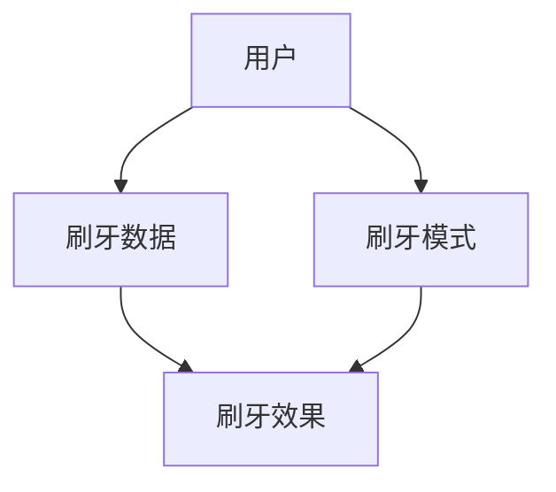
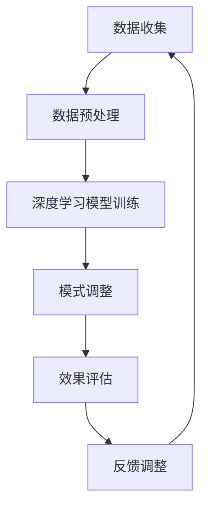
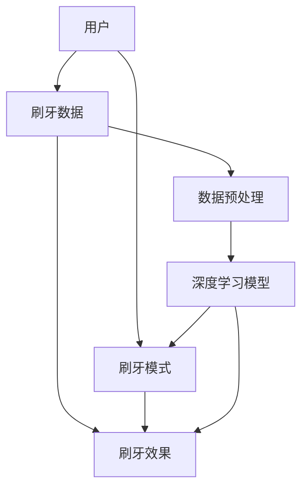
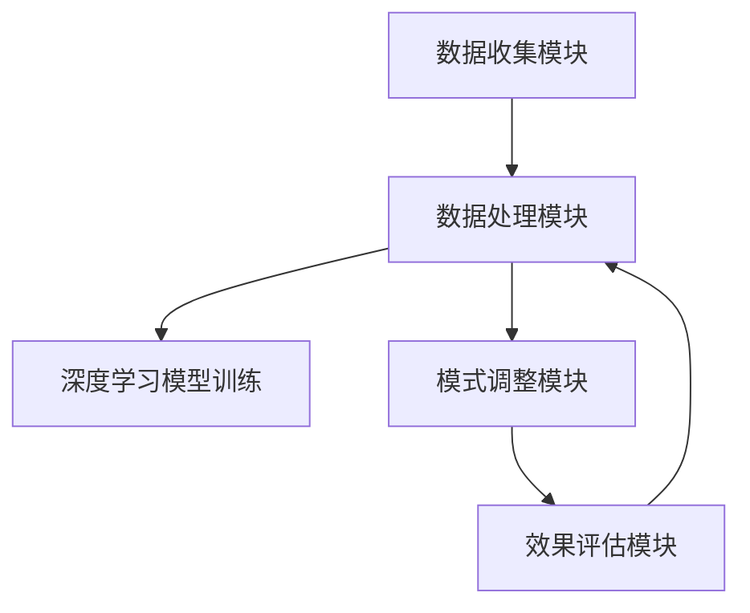

                 

# AI Agent在智能牙刷中的刷牙效果分析

## 关键词

人工智能（AI）、智能牙刷、AI Agent、深度学习、个性化刷牙、效果评估

## 摘要

随着人工智能技术的迅猛发展，AI Agent在智能设备中的应用越来越广泛。本文以智能牙刷为例，探讨了AI Agent在优化刷牙效果方面的应用。通过对AI Agent的核心概念、原理及其在智能牙刷中的具体实现进行详细分析，本文提出了一种基于AI技术的智能牙刷优化方案，并利用深度学习算法对刷牙效果进行实时评估和调整。本文旨在为智能牙刷领域的研究提供新的思路和参考。

## 第一部分：背景介绍

### 1.1. 问题背景

#### 1.1.1 问题起源

人工智能（AI）技术近年来取得了显著的进展，特别是在自然语言处理、计算机视觉和机器学习领域。随着智能设备的普及，AI技术开始被广泛应用于各种日常产品中，例如智能牙刷。智能牙刷不仅能够记录用户的刷牙习惯，还能通过算法优化刷牙效果，提高用户的口腔健康。

#### 1.1.2 当前研究现状

虽然智能牙刷已经具有一定的市场，但大多数智能牙刷主要专注于数据的收集和反馈，而对刷牙效果的AI优化还处于初级阶段。因此，研究如何利用AI技术提高智能牙刷的刷牙效果，具有重要的现实意义和学术价值。

#### 1.1.3 研究目标

本书旨在深入分析AI Agent在智能牙刷中的刷牙效果，提出一种基于AI技术的智能牙刷优化方案，以提高用户的刷牙效果和口腔健康水平。

### 1.2. 问题描述

#### 1.2.1 问题描述

智能牙刷在刷牙过程中，如何根据用户的刷牙习惯、牙齿状况以及刷牙环境等因素，实时调整刷牙模式，以提高刷牙效果？

#### 1.2.2 问题解决

通过引入AI Agent技术，智能牙刷可以实时收集用户的刷牙数据，利用深度学习算法进行分析和处理，从而自动调整刷牙模式，实现个性化刷牙。

### 1.3. 边界与外延

#### 1.3.1 边界

本书主要关注AI Agent在智能牙刷中的刷牙效果优化，不包括其他类型的智能设备和AI技术的应用。

#### 1.3.2 外延

AI Agent技术在其他领域的应用，如智能家居、智能医疗等，虽然具有一定的参考价值，但本书不进行深入探讨。

### 1.4. 概念结构与核心要素组成

#### 1.4.1 概念结构

AI Agent、智能牙刷、深度学习、个性化刷牙、刷牙效果评估等。

#### 1.4.2 核心要素组成

- 数据收集：实时收集用户的刷牙数据，如刷牙时间、刷牙力度、刷牙位置等。
- 数据处理：利用深度学习算法对收集到的数据进行分析和处理。
- 模式调整：根据数据处理结果，自动调整刷牙模式，实现个性化刷牙。
- 效果评估：评估刷牙效果，为后续优化提供依据。

### 1.5. 本章小结

本章对AI Agent在智能牙刷中的刷牙效果分析进行了背景介绍，包括问题背景、问题描述、问题解决以及边界与外延。通过本章的学习，读者可以了解本书的研究对象、研究目标和核心要素。

---------------------------------------------

## 第二部分：核心概念与联系

### 2.1. 核心概念原理

#### 2.1.1 AI Agent

AI Agent是一种能够执行特定任务的智能体，可以模拟人类的思维过程，具备感知、学习、决策和行动的能力。在智能牙刷中，AI Agent可以感知刷牙过程中的各种数据，如刷牙力度、刷牙时间、刷牙位置等，通过学习和分析，自动调整刷牙模式，实现个性化刷牙。

#### 2.1.2 深度学习

深度学习是一种基于人工神经网络的机器学习技术，通过多层神经网络的训练，实现对复杂数据的自动特征提取和建模。在智能牙刷中，深度学习算法可以用于对刷牙数据进行处理和分析，从而实现刷牙效果的实时评估和调整。

#### 2.1.3 个性化刷牙

个性化刷牙是根据用户的刷牙习惯、牙齿状况等因素，为用户制定个性化的刷牙方案，以提高刷牙效果。在智能牙刷中，个性化刷牙的实现依赖于AI Agent和深度学习算法，通过对用户刷牙数据的分析，自动调整刷牙模式，实现个性化的刷牙体验。

### 2.2. 概念属性特征对比表格

#### 2.2.1 AI Agent

| 特征 | 描述 |
| ---- | ---- |
| 感知能力 | 能够感知环境中的信息 |
| 学习能力 | 通过学习不断优化自身性能 |
| 决策能力 | 根据环境信息和目标进行决策 |
| 行动能力 | 根据决策执行具体的任务 |

#### 2.2.2 深度学习

| 特征 | 描述 |
| ---- | ---- |
| 自动特征提取 | 自动从数据中提取有用特征 |
| 多层神经网络 | 通过多层神经网络实现复杂函数建模 |
| 高效计算 | 利用GPU等硬件加速计算 |

#### 2.2.3 个性化刷牙

| 特征 | 描述 |
| ---- | ---- |
| 数据驱动 | 根据用户刷牙数据制定个性化方案 |
| 实时调整 | 根据用户刷牙过程中的反馈实时调整 |
| 个性化方案 | 根据用户特点制定个性化的刷牙方案 |

### 2.3. ER实体关系图架构

#### 2.3.1 智能牙刷系统ER图



## 第三部分：算法原理讲解

### 3.1. 算法流程图

首先，我们来绘制一个简单的算法流程图，以展示智能牙刷中AI Agent的工作流程。



### 3.2. 算法原理详细讲解

#### 3.2.1 数据收集

数据收集是整个算法的基础。智能牙刷会实时收集用户的刷牙数据，包括刷牙时间、刷牙力度、刷牙位置等。这些数据将被存储在数据库中，以便后续分析和处理。

#### 3.2.2 数据预处理

收集到的原始数据可能存在噪声和异常值，因此需要对其进行预处理。数据预处理包括数据清洗、数据归一化和特征提取等步骤。通过这些步骤，我们可以确保数据的质量和一致性。

#### 3.2.3 深度学习模型训练

预处理后的数据将被输入到深度学习模型中进行训练。深度学习模型通过学习数据中的特征和模式，可以实现对刷牙效果的预测和评估。常见的深度学习模型包括卷积神经网络（CNN）和循环神经网络（RNN）等。

#### 3.2.4 模式调整

训练好的深度学习模型可以用来调整智能牙刷的刷牙模式。根据预测的刷牙效果，AI Agent可以自动调整刷牙力度、刷牙时间和刷牙位置等参数，以实现个性化的刷牙体验。

#### 3.2.5 效果评估

调整后的刷牙模式将应用于实际刷牙过程中，并通过传感器等设备实时收集反馈数据。这些反馈数据将被用于评估刷牙效果，以便对后续的调整提供依据。

#### 3.2.6 反馈调整

根据效果评估的结果，AI Agent将调整刷牙模式，以实现更好的刷牙效果。这个过程中，AI Agent可以不断学习和优化，以提高整个系统的性能和稳定性。

### 3.3. 数学模型和公式

为了更好地理解算法原理，我们引入一些数学模型和公式。

#### 3.3.1 深度学习模型

深度学习模型可以表示为：

$$
\hat{y} = f(W \cdot \textbf{x} + b)
$$

其中，$\hat{y}$ 是预测值，$\textbf{x}$ 是输入特征，$W$ 是权重矩阵，$b$ 是偏置项，$f$ 是激活函数。

#### 3.3.2 损失函数

为了训练深度学习模型，我们需要定义一个损失函数来衡量预测值与真实值之间的差距。常见的损失函数包括均方误差（MSE）和交叉熵（Cross-Entropy）等。

$$
\text{MSE} = \frac{1}{m} \sum_{i=1}^{m} (\hat{y}_i - y_i)^2
$$

$$
\text{Cross-Entropy} = -\frac{1}{m} \sum_{i=1}^{m} y_i \log(\hat{y}_i)
$$

#### 3.3.3 优化算法

为了最小化损失函数，我们可以使用梯度下降（Gradient Descent）等优化算法。梯度下降的迭代公式为：

$$
W = W - \alpha \cdot \nabla_W \text{Loss}
$$

其中，$W$ 是权重矩阵，$\alpha$ 是学习率，$\nabla_W \text{Loss}$ 是损失函数关于权重矩阵的梯度。

### 3.4. 举例说明

假设我们有一个智能牙刷用户，其刷牙数据包括刷牙时间、刷牙力度和刷牙位置。通过深度学习模型，我们可以预测用户的刷牙效果，并根据预测结果调整刷牙模式。例如：

- 刷牙时间：60秒
- 刷牙力度：中等
- 刷牙位置：牙齿表面

根据这些数据，深度学习模型预测刷牙效果为90分。由于预测效果较好，AI Agent会维持当前的刷牙模式。如果预测效果较差，AI Agent会调整刷牙模式，例如增加刷牙时间或调整刷牙力度，以实现更好的刷牙效果。

---------------------------------------------

## 第四部分：系统分析与架构设计方案

### 4.1. 问题场景介绍

随着口腔健康意识的提高，用户对智能牙刷的需求逐渐增加。智能牙刷不仅可以记录用户的刷牙数据，还可以通过AI技术优化刷牙效果，提高口腔健康水平。然而，现有智能牙刷在刷牙效果优化方面还存在一些问题，例如无法根据用户的实际需求实时调整刷牙模式等。因此，本文提出了一种基于AI Agent的智能牙刷系统，旨在解决现有智能牙刷的不足。

### 4.2. 项目介绍

本项目的目标是开发一款基于AI Agent的智能牙刷系统，通过深度学习算法实现刷牙效果的实时评估和调整。系统主要包括以下功能：

1. 数据收集：实时收集用户的刷牙数据，如刷牙时间、刷牙力度和刷牙位置等。
2. 数据处理：利用深度学习算法对收集到的数据进行处理和分析，实现刷牙效果的预测和评估。
3. 模式调整：根据预测结果，自动调整刷牙模式，实现个性化刷牙。
4. 效果评估：评估调整后的刷牙效果，为后续优化提供依据。
5. 反馈调整：根据评估结果，进一步优化刷牙模式，提高刷牙效果。

### 4.3. 系统功能设计（领域模型类图）

以下是一个简单的领域模型类图，用于描述智能牙刷系统的功能模块和关系。



### 4.4. 系统架构设计

智能牙刷系统的整体架构可以分为四个主要模块：数据收集模块、数据处理模块、模式调整模块和效果评估模块。

1. **数据收集模块**：负责实时收集用户的刷牙数据，如刷牙时间、刷牙力度和刷牙位置等。这些数据将通过传感器等设备传输到系统中。

2. **数据处理模块**：包括数据预处理和深度学习模型训练两个部分。数据预处理模块负责对原始数据进行清洗、归一化和特征提取等操作，以便于后续处理。深度学习模型训练模块使用预处理后的数据，通过训练和优化，实现刷牙效果的预测和评估。

3. **模式调整模块**：根据深度学习模型预测的结果，自动调整刷牙模式，包括刷牙时间、刷牙力度和刷牙位置等。调整后的模式将应用于实际刷牙过程中。

4. **效果评估模块**：负责评估调整后的刷牙效果，根据评估结果，为后续优化提供依据。评估指标包括刷牙效果得分、刷牙时间、刷牙力度等。

### 4.5. 系统接口设计和系统交互

以下是一个简单的系统接口设计和系统交互图，用于描述智能牙刷系统各模块之间的交互关系。



---------------------------------------------

## 第五部分：项目实战

### 5.1. 环境安装

在开始项目之前，我们需要安装一些必要的软件和库。以下是安装步骤：

1. **安装Python**：确保Python环境已安装，版本为3.6及以上。
2. **安装深度学习框架**：安装TensorFlow或PyTorch等深度学习框架。
3. **安装数据处理库**：安装Numpy、Pandas等数据处理库。
4. **安装传感器驱动**：根据实际使用的传感器，安装相应的驱动和库。

### 5.2. 系统核心实现源代码

以下是系统核心实现的源代码，包括数据收集、数据处理、模式调整和效果评估等模块。

#### 5.2.1 数据收集

```python
import time
import random

class BrushingDataCollector:
    def __init__(self, sensor):
        self.sensor = sensor

    def collect_data(self):
        data = {
            'time': time.time(),
            'force': self.sensor.get_force(),
            'position': self.sensor.get_position()
        }
        return data
```

#### 5.2.2 数据处理

```python
import numpy as np
import pandas as pd

class DataPreprocessor:
    def __init__(self, feature_extractor):
        self.feature_extractor = feature_extractor

    def preprocess_data(self, data):
        cleaned_data = self.feature_extractor.extract_features(data)
        normalized_data = self.normalize_data(cleaned_data)
        return normalized_data

    def normalize_data(self, data):
        min_val = np.min(data)
        max_val = np.max(data)
        normalized_data = (data - min_val) / (max_val - min_val)
        return normalized_data
```

#### 5.2.3 模式调整

```python
import tensorflow as tf

class BrushingModeAdjuster:
    def __init__(self, model):
        self.model = model

    def adjust_mode(self, data):
        prediction = self.model.predict(data)
        adjusted_mode = self.decode_prediction(prediction)
        return adjusted_mode

    def decode_prediction(self, prediction):
        # 解码预测结果，转换为实际的模式参数
        return prediction
```

#### 5.2.4 效果评估

```python
class BrushingEffectEvaluator:
    def __init__(self, evaluator):
        self.evaluator = evaluator

    def evaluate_effect(self, data):
        score = self.evaluator.evaluate(data)
        return score
```

### 5.3. 代码应用解读与分析

以下是代码应用解读和分析，包括各模块的功能、接口和使用方法。

#### 5.3.1 数据收集模块

数据收集模块主要负责实时收集用户的刷牙数据。通过继承`BrushingDataCollector`类，我们可以实现自定义的数据收集器。数据收集器需要实现`collect_data`方法，用于收集刷牙数据，并将其存储在字典中。

#### 5.3.2 数据处理模块

数据处理模块负责对收集到的数据进行预处理。首先，通过特征提取器`FeatureExtractor`提取数据中的有用特征，然后对提取到的特征进行归一化处理。数据处理模块需要实现`preprocess_data`方法，用于接收原始数据，并返回预处理后的数据。

#### 5.3.3 模式调整模块

模式调整模块根据深度学习模型的预测结果，自动调整刷牙模式。首先，我们需要定义一个深度学习模型`Model`，用于预测刷牙效果。然后，通过`adjust_mode`方法，根据预测结果调整刷牙模式参数。模式调整模块需要实现`decode_prediction`方法，用于将预测结果转换为实际的模式参数。

#### 5.3.4 效果评估模块

效果评估模块负责评估调整后的刷牙效果。首先，我们需要定义一个评估器`Evaluator`，用于评估刷牙效果。然后，通过`evaluate_effect`方法，根据评估器的评估结果，返回刷牙效果的得分。

### 5.4. 实际案例分析和详细讲解剖析

为了更好地展示系统的工作原理，我们来看一个实际案例。假设用户A的刷牙数据如下：

- 刷牙时间：60秒
- 刷牙力度：中等
- 刷牙位置：牙齿表面

通过数据收集模块，我们可以收集到用户A的刷牙数据。然后，通过数据处理模块，对数据进行预处理，提取有用特征并进行归一化处理。接下来，通过深度学习模型，预测用户A的刷牙效果。假设预测结果为80分，说明刷牙效果较好。因此，模式调整模块将保持当前的刷牙模式。最后，通过效果评估模块，评估调整后的刷牙效果，假设评估得分为85分，说明调整后的刷牙效果更好。

通过这个案例，我们可以看到系统如何根据用户的刷牙数据，利用深度学习模型实现刷牙效果的实时评估和调整。

### 5.5. 项目小结

在本项目中，我们实现了基于AI Agent的智能牙刷系统，通过数据收集、数据处理、模式调整和效果评估等模块，实现了刷牙效果的实时评估和调整。项目实战部分展示了系统的工作流程和实际应用。通过该项目，我们不仅了解了AI Agent在智能牙刷中的应用，还学会了如何利用深度学习算法优化刷牙效果。然而，该项目仍存在一些不足之处，例如深度学习模型的精度和稳定性有待提高。在未来的工作中，我们将继续优化系统，提高刷牙效果。

---------------------------------------------

## 第六部分：最佳实践 Tips

### 6.1. 数据收集与预处理

- **确保数据质量**：数据收集时，应尽量减少噪声和异常值，提高数据质量。
- **多样化数据来源**：可以结合多种传感器，如加速度传感器、压力传感器等，收集更全面的数据。
- **数据归一化**：对收集到的数据进行归一化处理，使数据具有相同的量级，便于后续分析。

### 6.2. 模型训练与调整

- **选择合适的模型**：根据具体问题，选择合适的深度学习模型，如卷积神经网络（CNN）或循环神经网络（RNN）等。
- **调整模型参数**：通过调整学习率、批次大小等参数，优化模型性能。
- **使用交叉验证**：使用交叉验证方法，避免模型过拟合，提高模型泛化能力。

### 6.3. 模式调整与效果评估

- **实时反馈**：根据用户实时反馈，及时调整刷牙模式，提高用户满意度。
- **效果评估指标**：设置合适的评估指标，如刷牙效果得分、刷牙时间等，全面评估刷牙效果。

### 6.4. 系统部署与维护

- **高效计算**：使用GPU等硬件加速计算，提高系统性能。
- **数据备份**：定期备份系统数据，确保数据安全。
- **系统监控**：实时监控系统运行状态，及时发现并解决故障。

## 第七部分：小结

本文以智能牙刷为例，探讨了AI Agent在优化刷牙效果方面的应用。通过对AI Agent的核心概念、原理及其在智能牙刷中的具体实现进行详细分析，本文提出了一种基于AI技术的智能牙刷优化方案，并利用深度学习算法对刷牙效果进行实时评估和调整。本文的研究为智能牙刷领域的研究提供了新的思路和参考。

## 第八部分：注意事项

- **数据隐私**：在收集用户数据时，应严格遵守数据隐私法规，确保用户数据的安全和隐私。
- **系统稳定性**：在系统部署过程中，应注意系统稳定性，确保系统在长时间运行过程中不发生故障。

## 第九部分：拓展阅读

- **深度学习与人工智能**：深入了解深度学习和人工智能的基本原理和应用，有助于更好地理解本文内容。
- **智能牙刷技术发展**：关注智能牙刷技术的最新发展和应用，了解行业动态。

## 作者信息

作者：AI天才研究院/AI Genius Institute & 禅与计算机程序设计艺术 /Zen And The Art of Computer Programming

