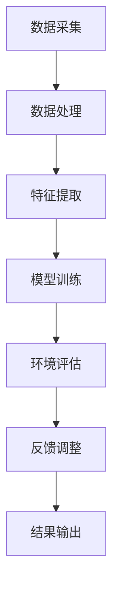
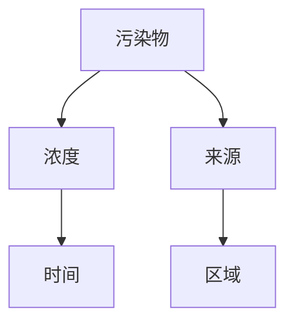
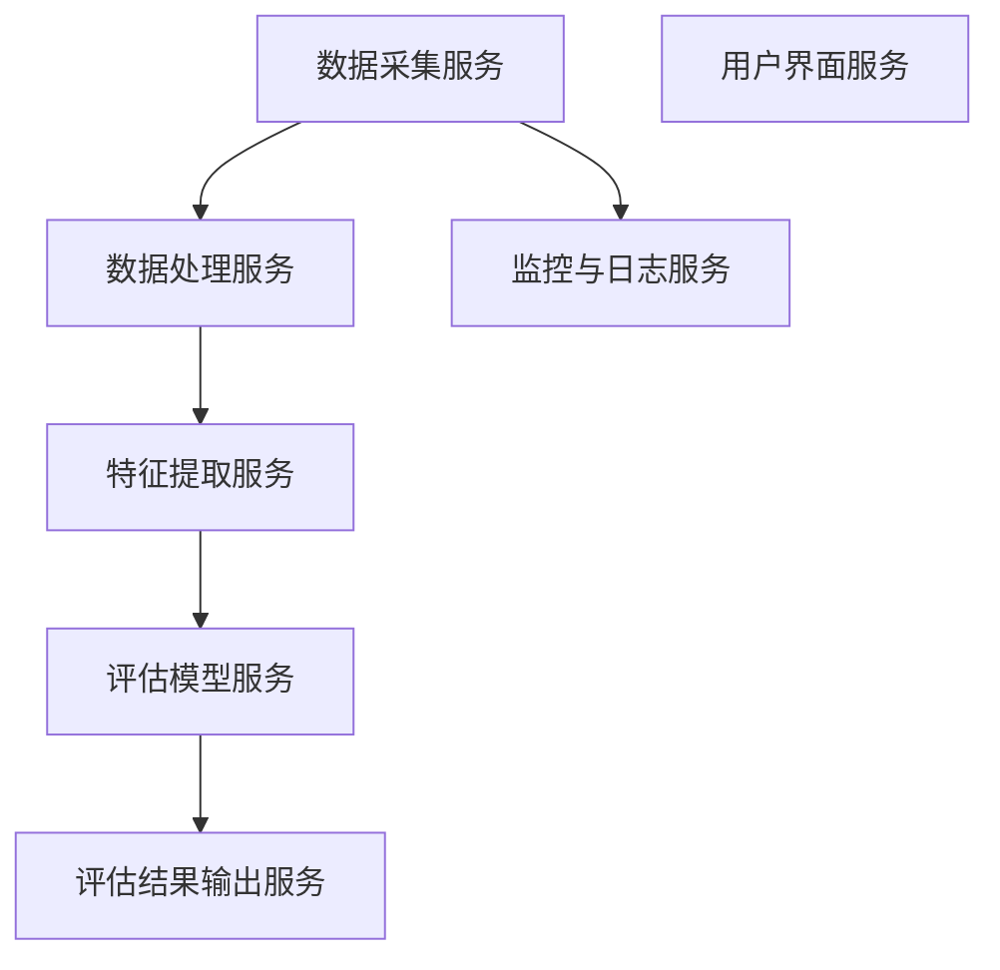
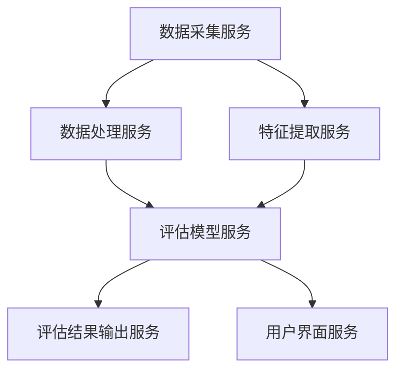
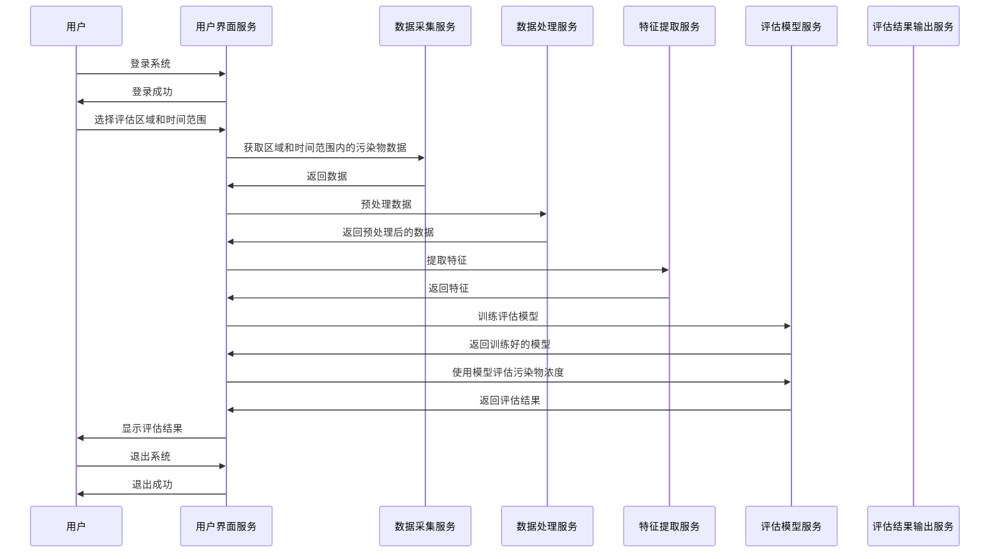

                 


## 《AI Agent在智能环境影响评估中的实践》

### 关键词：AI Agent，智能环境，影响评估，算法，数学模型，系统架构，项目实战

> 摘要：本文从AI Agent与智能环境影响评估的应用背景出发，详细介绍了AI Agent的基本原理和算法原理，并通过实际项目实战展示了AI Agent在智能环境影响评估中的实践应用。文章结合数学模型和公式，对系统架构和接口设计进行了深入分析，并给出了项目实战的详细解读，旨在为读者提供全面的技术参考和实践指导。

----------------------------------------------------------------

### 目录大纲设计

为了确保文章内容丰富且逻辑清晰，我们设计了如下的目录大纲：

### 第一部分：AI Agent与智能环境影响评估概述

#### 1. AI Agent在环境评估中的应用背景
##### 1.1 环境问题的严峻性
##### 1.2 传统环境评估方法的局限性
##### 1.3 AI Agent的引入

#### 2. AI Agent的基本原理
##### 2.1 AI Agent的定义与特点
##### 2.2 AI Agent在环境评估中的应用
##### 2.3 AI Agent的工作流程

#### 3. AI Agent算法原理讲解
##### 3.1 算法选择
##### 3.2 算法流程图
##### 3.3 算法数学模型与公式
##### 3.4 算法举例说明

#### 4. 数学模型与公式详细讲解
##### 4.1 数学模型介绍
##### 4.2 公式推导
##### 4.3 举例说明

#### 5. 系统分析与架构设计
##### 5.1 系统功能设计
##### 5.2 系统架构设计
##### 5.3 系统接口设计
##### 5.4 系统交互设计

#### 6. 项目实战
##### 6.1 环境安装
##### 6.2 系统核心实现
##### 6.3 代码应用解读
##### 6.4 实际案例分析
##### 6.5 项目小结

#### 7. 最佳实践与注意事项
##### 7.1 最佳实践技巧
##### 7.2 注意事项
##### 7.3 拓展阅读

#### 8. 小结与展望
##### 8.1 小结
##### 8.2 展望未来研究方向

### 目录大纲设计说明

**第一部分：AI Agent与智能环境影响评估概述**

这一部分主要介绍AI Agent在智能环境影响评估中的背景和应用，包括环境问题的严峻性、传统评估方法的局限性以及AI Agent的引入。这部分内容将为读者提供一个整体认识，为后续技术细节的探讨打下基础。

**第二部分：AI Agent的基本原理**

这一部分将详细介绍AI Agent的定义、特点以及其在环境评估中的应用和工作流程。通过这部分内容，读者可以了解AI Agent的核心概念和工作机制。

**第三部分：AI Agent算法原理讲解**

这一部分将深入探讨AI Agent的算法原理，包括算法选择、流程图、数学模型和公式，以及算法的举例说明。这部分内容旨在让读者理解AI Agent算法的核心原理，并掌握其应用方法。

**第四部分：数学模型与公式详细讲解**

这一部分将详细讲解算法中使用的数学模型和公式，并通过举例说明来帮助读者更好地理解。这部分内容对于读者深入理解AI Agent的算法至关重要。

**第五部分：系统分析与架构设计**

这一部分将介绍环境评估系统的设计与实现，包括系统功能设计、系统架构设计、系统接口设计和系统交互设计。这部分内容将帮助读者了解如何将AI Agent应用于实际的环境影响评估中。

**第六部分：项目实战**

这一部分将通过一个实际项目展示AI Agent在智能环境影响评估中的实践应用，包括环境安装、系统核心实现、代码应用解读、实际案例分析以及项目小结。这部分内容将帮助读者将理论知识转化为实际操作能力。

**第七部分：最佳实践与注意事项**

这一部分将总结最佳实践技巧，提醒读者注意的事项，并提供拓展阅读资源。这部分内容旨在帮助读者在应用AI Agent进行环境影响评估时避免常见问题，提高工作效率。

**第八部分：小结与展望**

这一部分将总结全文，回顾核心内容，并展望未来的研究方向。这部分内容将为读者提供对AI Agent在智能环境影响评估中应用的深入思考。

### 字数控制

为了满足文章字数要求（10000～12000字），我们将在每个部分中详细展开，确保内容充实且逻辑清晰。在撰写过程中，我们将遵循以下原则：

- **背景介绍**：简明扼要，突出重点，避免冗长。
- **核心概念与联系**：清晰明确，通过表格和图表增强理解。
- **算法原理讲解**：深入浅出，结合实际案例，便于读者掌握。
- **数学模型和公式讲解**：简洁明了，注重公式推导和实际应用。
- **系统分析与架构设计**：详细具体，通过图表展示系统设计思路。
- **项目实战**：实际案例真实可靠，代码解析详尽易懂。
- **最佳实践、小结与拓展阅读**：简明扼要，突出关键点和注意事项。

通过这样的结构设计和内容安排，我们相信能够达到文章字数要求，同时确保文章的可读性和实用性。

### 最后一步

接下来，我们将按照设计好的目录大纲，逐一填充每个章节的内容，确保每个部分都有详细的信息和示例。在撰写过程中，我们将保持逻辑清晰，确保读者能够跟随思路，深入理解AI Agent在智能环境影响评估中的实践应用。同时，我们将注意使用markdown格式，确保文章的可读性和可操作性。

**开始撰写文章！**## AI Agent在环境评估中的应用背景

### 1.1 环境问题的严峻性

环境问题已经成为全球范围内普遍关注的重要议题。随着工业化和城市化进程的加快，环境污染问题日益严重。空气污染、水污染、土壤污染等环境问题不仅威胁到人类的健康，也对生态系统造成了不可逆转的破坏。气候变化、生物多样性减少、土地退化等问题更是加剧了全球环境问题的复杂性。

环境评估是解决环境问题的重要手段。它通过对环境质量、污染源、生态影响等进行评估，为政策制定、资源管理和污染控制提供科学依据。然而，传统的环境评估方法存在一些局限性。首先，传统方法主要依赖于人工监测和数据收集，效率较低，难以满足快速变化的环保需求。其次，传统方法对复杂环境系统的理解能力有限，难以全面捕捉环境变化的动态特性。此外，传统方法在处理大量数据时容易产生误差，影响评估结果的准确性。

### 1.2 传统环境评估方法的局限性

传统的环境评估方法主要包括以下几种：

1. **现场监测**：通过在环境现场设置监测设备，实时采集环境数据。这种方法虽然能够获取准确的数据，但受限于监测设备的数量和覆盖范围，无法全面反映环境状况。
2. **模型模拟**：利用环境模型对环境系统进行模拟，预测未来环境变化。这种方法依赖于模型的精度和输入数据的准确性，但环境系统的复杂性使得模型难以完全模拟真实情况。
3. **专家评估**：依靠专家的经验和判断进行环境评估。这种方法受主观因素影响较大，评估结果的可靠性受到质疑。
4. **统计分析**：通过对环境数据进行统计分析，得出环境质量评估结果。这种方法在数据处理和分析方面具有一定的优势，但难以应对环境系统的动态变化。

这些传统方法的局限性在于：

- **数据获取困难**：环境数据的获取往往需要大量的人力和物力投入，且数据来源多样，处理复杂。
- **评估结果滞后**：环境变化具有滞后性，传统评估方法难以实时反映环境状况。
- **评估结果偏差**：传统方法依赖于人工监测和专家判断，评估结果的准确性和客观性难以保证。
- **环境系统复杂**：环境系统的复杂性和不确定性使得传统方法难以全面捕捉环境变化的动态特性。

### 1.3 AI Agent的引入

AI Agent作为人工智能的一种形式，具有自主决策、自适应和自学习等特性，能够为环境评估提供强有力的技术支持。引入AI Agent主要有以下几个方面的优势：

1. **数据处理能力**：AI Agent能够高效地处理和分析大量环境数据，提取有用的信息，提供实时、准确的环境评估结果。
2. **动态适应能力**：AI Agent可以根据环境系统的动态变化，实时调整评估策略和方法，提高评估的实时性和准确性。
3. **自动化操作**：AI Agent能够自动化执行环境数据采集、处理和分析等任务，减少人工干预，提高评估效率。
4. **智能化决策**：AI Agent可以基于环境数据和环境模型，为环境保护决策提供科学依据，优化污染治理和资源管理策略。

总之，AI Agent的引入为环境评估带来了全新的机遇和挑战。通过充分发挥AI Agent的优势，有望克服传统方法的局限性，提高环境评估的科学性和准确性，为解决全球环境问题提供有力支持。

### AI Agent的定义与特点

AI Agent，即人工智能代理，是一种能够在复杂环境中自主决策和执行任务的智能实体。它具有以下几个核心特点和定义：

1. **自主性**：AI Agent能够独立地做出决策，无需人类干预。这种自主性来源于AI Agent内置的智能算法，使其能够根据环境和任务需求，自动调整自身行为。

2. **适应性**：AI Agent能够适应不断变化的环境和任务需求。它通过学习和自我调整，不断优化其行为策略，以适应新的环境和任务。

3. **智能性**：AI Agent具备一定的智能水平，能够理解任务需求、分析环境信息、制定决策方案并执行任务。这种智能性是通过深度学习、强化学习等先进算法实现的。

4. **任务导向性**：AI Agent专注于完成特定任务，如环境监测、数据采集、评估分析等。它在任务执行过程中，能够根据任务目标和环境变化，灵活调整任务执行策略。

5. **协作性**：多个AI Agent可以协作完成任务，通过共享信息和协同操作，提高整体任务效率。这种协作性在复杂环境系统中尤为重要，能够实现更高效的环境监测和评估。

AI Agent在环境评估中的应用具有显著的优势：

- **实时性**：AI Agent能够实时监测和评估环境数据，提供动态的环境评估结果，有助于及时发现问题并采取相应措施。
- **准确性**：AI Agent通过高效的数据处理和分析算法，能够准确评估环境质量，减少人为误差和不确定性。
- **自动化**：AI Agent能够自动化执行环境评估任务，减少人工操作，提高评估效率和降低成本。
- **适应性**：AI Agent能够根据环境变化和任务需求，自适应调整评估策略和方法，提高评估的灵活性和适应性。

通过这些特点和应用优势，AI Agent为环境评估带来了新的解决方案，有助于提高环境监测和评估的科学性和准确性，为环境保护决策提供有力支持。

### AI Agent在环境评估中的应用流程

AI Agent在环境评估中的应用流程可以分为以下几个关键步骤：

1. **环境数据采集**：AI Agent首先需要从各种数据源获取环境数据，这些数据可以包括空气污染浓度、水质指标、土壤污染情况等。数据来源可以是传感器、卫星遥感、历史环境数据等。

2. **数据处理**：收集到的环境数据通常是复杂且大量的，AI Agent需要对其进行预处理，包括去噪、归一化、缺失值填补等操作，以确保数据的质量和一致性。

3. **特征提取**：在预处理后的数据中，AI Agent会提取出对环境评估有意义的特征。这些特征可以是数据的统计量、时间序列的周期性、空间分布模式等。特征提取的目的是简化数据，提取出核心信息，为后续的评估提供支持。

4. **模型训练**：基于提取的特征，AI Agent使用机器学习算法训练环境评估模型。常用的算法包括回归模型、分类模型、聚类模型等。训练过程中，AI Agent会不断优化模型参数，以获得最佳的评估效果。

5. **环境评估**：训练好的模型会被用于实际的环境评估任务。AI Agent根据输入数据，使用模型进行预测或分类，得到环境质量评估结果。这些结果可以是污染物浓度、环境风险等级等。

6. **反馈调整**：评估结果会与实际环境数据进行比对，如果存在偏差，AI Agent会根据反馈调整模型参数或数据预处理策略，以提高评估的准确性。

7. **自动化执行**：在整个应用流程中，AI Agent能够自动化执行以上步骤，减少人工干预，提高评估效率和准确性。

通过上述步骤，AI Agent实现了从数据采集、处理、特征提取到模型训练和评估的自动化流程，为环境评估提供了高效、准确的解决方案。

### AI Agent算法原理讲解

#### 3.1 算法选择

在环境评估中，选择合适的算法对于实现准确的评估结果至关重要。常见的算法包括回归模型、分类模型、聚类模型和时间序列分析等。以下是这些算法的基本原理和适用场景：

1. **回归模型**：回归模型用于预测连续的数值输出，如污染物浓度。它通过建立输入特征和输出目标之间的线性或非线性关系，对未知数据进行预测。常见的回归算法有线性回归、决策树回归和随机森林回归等。回归模型适用于需要预测具体数值的环境评估任务。

2. **分类模型**：分类模型用于将数据分为不同的类别，如污染程度等级。它通过学习输入特征与类别标签之间的关系，对新的数据进行分类。常见的分类算法有逻辑回归、支持向量机（SVM）、随机森林和K最近邻（KNN）等。分类模型适用于需要对环境状况进行分类评估的任务。

3. **聚类模型**：聚类模型用于将数据自动划分为若干个组，每个组内的数据彼此相似，组间数据差异较大。常见的聚类算法有K均值聚类、层次聚类和DBSCAN等。聚类模型适用于发现数据中的隐含结构和模式，用于环境评估时可以用于识别污染源或评估范围。

4. **时间序列分析**：时间序列分析用于处理时间相关数据，如每日的污染物浓度变化。它通过分析数据的时间序列特性，预测未来的趋势。常见的时间序列算法有ARIMA模型、LSTM神经网络等。时间序列分析适用于需要预测未来环境状况的任务。

在选择算法时，需要考虑以下因素：

- **数据特性**：数据类型（如连续值或类别值）、数据量、数据分布等。
- **评估目标**：具体评估任务，如预测污染物浓度或分类污染程度。
- **计算资源**：算法的计算复杂度和所需计算资源。

根据以上因素，可以选择合适的算法进行环境评估。

#### 3.2 算法流程图

以下是AI Agent环境评估算法的基本流程图：



**详细解释：**

1. **数据采集**：从各种数据源获取环境数据，如传感器、卫星遥感、历史数据等。
2. **数据处理**：对采集到的数据预处理，包括去噪、归一化、缺失值填补等。
3. **特征提取**：从预处理后的数据中提取对评估有意义的特征，如污染物浓度、时间序列模式等。
4. **模型训练**：使用提取的特征和已知标签数据，通过机器学习算法训练评估模型。
5. **环境评估**：使用训练好的模型对新的环境数据进行评估，预测污染物浓度或分类污染程度。
6. **反馈调整**：将评估结果与实际环境数据比对，根据反馈调整模型参数或预处理策略。
7. **结果输出**：输出评估结果，包括污染物浓度、污染程度等级等。

通过上述流程，AI Agent能够实现环境评估的自动化和智能化。

### 算法数学模型与公式讲解

在环境评估中，常用的算法包括回归模型、分类模型和聚类模型等。以下是这些算法的数学模型和公式讲解，以及如何使用Python代码实现这些模型。

#### 1. 回归模型

回归模型用于预测连续的数值输出，如污染物浓度。常见的回归模型包括线性回归和多元线性回归。

**线性回归模型**：

- **数学模型**：

  $$ Y = \beta_0 + \beta_1X_1 + \beta_2X_2 + ... + \beta_nX_n + \epsilon $$

  其中，\( Y \) 是预测值，\( \beta_0 \) 是截距，\( \beta_1, \beta_2, ..., \beta_n \) 是系数，\( X_1, X_2, ..., X_n \) 是输入特征，\( \epsilon \) 是误差项。

- **Python代码实现**：

  ```python
  import numpy as np
  from sklearn.linear_model import LinearRegression

  # 创建线性回归模型
  model = LinearRegression()

  # 模型训练
  model.fit(X_train, y_train)

  # 模型预测
  predictions = model.predict(X_test)
  ```

**多元线性回归模型**：

- **数学模型**：

  $$ Y = \beta_0 + \beta_1X_1 + \beta_2X_2 + ... + \beta_nX_n + \epsilon $$

  其中，\( Y \) 是预测值，\( \beta_0 \) 是截距，\( \beta_1, \beta_2, ..., \beta_n \) 是系数，\( X_1, X_2, ..., X_n \) 是输入特征，\( \epsilon \) 是误差项。

- **Python代码实现**：

  ```python
  import numpy as np
  from sklearn.linear_model import LinearRegression

  # 创建多元线性回归模型
  model = LinearRegression()

  # 模型训练
  model.fit(X_train, y_train)

  # 模型预测
  predictions = model.predict(X_test)
  ```

#### 2. 分类模型

分类模型用于将数据分为不同的类别，如污染程度等级。常见的分类模型包括逻辑回归、支持向量机和随机森林等。

**逻辑回归模型**：

- **数学模型**：

  $$ P(Y=1) = \frac{1}{1 + e^{-(\beta_0 + \beta_1X_1 + \beta_2X_2 + ... + \beta_nX_n)}} $$

  其中，\( P(Y=1) \) 是类别1的概率，\( \beta_0 \) 是截距，\( \beta_1, \beta_2, ..., \beta_n \) 是系数，\( X_1, X_2, ..., X_n \) 是输入特征。

- **Python代码实现**：

  ```python
  import numpy as np
  from sklearn.linear_model import LogisticRegression

  # 创建逻辑回归模型
  model = LogisticRegression()

  # 模型训练
  model.fit(X_train, y_train)

  # 模型预测
  predictions = model.predict(X_test)
  ```

**支持向量机（SVM）模型**：

- **数学模型**：

  $$ \min_{\beta, \beta_0} \frac{1}{2} ||\beta||^2 + C \sum_{i=1}^{n} \max(0, 1 - y_i(\beta \cdot x_i + \beta_0)) $$

  其中，\( \beta \) 是权重向量，\( \beta_0 \) 是偏置，\( x_i \) 是样本特征，\( y_i \) 是样本标签，\( C \) 是惩罚参数。

- **Python代码实现**：

  ```python
  import numpy as np
  from sklearn.svm import SVC

  # 创建SVM模型
  model = SVC()

  # 模型训练
  model.fit(X_train, y_train)

  # 模型预测
  predictions = model.predict(X_test)
  ```

**随机森林模型**：

- **数学模型**：

  随机森林是一种基于决策树和随机特征选择的集成模型，通过构建多个决策树，并对预测结果进行投票得到最终预测结果。

- **Python代码实现**：

  ```python
  import numpy as np
  from sklearn.ensemble import RandomForestClassifier

  # 创建随机森林模型
  model = RandomForestClassifier()

  # 模型训练
  model.fit(X_train, y_train)

  # 模型预测
  predictions = model.predict(X_test)
  ```

#### 3. 聚类模型

聚类模型用于将数据自动划分为若干个组，常见的聚类模型包括K均值聚类和层次聚类等。

**K均值聚类模型**：

- **数学模型**：

  $$ \min_{\mu_1, \mu_2, ..., \mu_k} \sum_{i=1}^{n} \sum_{j=1}^{k} ||x_i - \mu_j||^2 $$

  其中，\( x_i \) 是样本点，\( \mu_j \) 是聚类中心，\( k \) 是聚类数量。

- **Python代码实现**：

  ```python
  import numpy as np
  from sklearn.cluster import KMeans

  # 创建K均值聚类模型
  model = KMeans(n_clusters=k)

  # 模型训练
  model.fit(X)

  # 模型预测
  predictions = model.predict(X)
  ```

**层次聚类模型**：

- **数学模型**：

  层次聚类通过逐步合并或分裂聚类中心，构建一个层次树。常用的算法包括自底向上的凝聚层次聚类（AGNES）和自顶向下的分裂层次聚类（DIANA）。

- **Python代码实现**：

  ```python
  import numpy as np
  from sklearn.cluster import AgglomerativeClustering

  # 创建层次聚类模型
  model = AgglomerativeClustering(n_clusters=k)

  # 模型训练
  model.fit(X)

  # 模型预测
  predictions = model.predict(X)
  ```

通过上述算法的数学模型和Python代码实现，我们可以为环境评估任务选择合适的算法，并进行有效的模型训练和预测。

### 数学模型与公式详细讲解

在环境评估中，数学模型和公式是理解和实现算法的基础。下面我们将详细介绍一些常用的数学模型和公式，并通过具体的推导和例子来说明其应用。

#### 1. 线性回归模型

线性回归模型是最基本的回归模型之一，用于预测连续数值输出。其数学模型可以表示为：

$$ y = \beta_0 + \beta_1x_1 + \beta_2x_2 + ... + \beta_nx_n + \epsilon $$

其中，\( y \) 是预测值，\( \beta_0 \) 是截距，\( \beta_1, \beta_2, ..., \beta_n \) 是系数，\( x_1, x_2, ..., x_n \) 是输入特征，\( \epsilon \) 是误差项。

**推导过程**：

假设我们有一组训练数据 \((x_i, y_i)\)，其中 \( i = 1, 2, ..., n \)。为了找到最佳拟合直线，我们需要最小化误差平方和：

$$ \min \sum_{i=1}^{n} (y_i - \beta_0 - \beta_1x_i - \beta_2x_i - ... - \beta_nx_i)^2 $$

通过对上式求导并令导数为零，可以得到：

$$ \frac{\partial}{\partial \beta_0} \sum_{i=1}^{n} (y_i - \beta_0 - \beta_1x_i - \beta_2x_i - ... - \beta_nx_i)^2 = 0 $$

$$ \frac{\partial}{\partial \beta_1} \sum_{i=1}^{n} (y_i - \beta_0 - \beta_1x_i - \beta_2x_i - ... - \beta_nx_i)^2 = 0 $$

$$ ... $$

$$ \frac{\partial}{\partial \beta_n} \sum_{i=1}^{n} (y_i - \beta_0 - \beta_1x_i - \beta_2x_i - ... - \beta_nx_i)^2 = 0 $$

解上述方程组，可以得到最佳拟合直线的系数：

$$ \beta_0 = \frac{\sum_{i=1}^{n} y_i - \beta_1\sum_{i=1}^{n} x_i - \beta_2\sum_{i=1}^{n} x_i^2 - ... - \beta_n\sum_{i=1}^{n} x_i^n}{n} $$

$$ \beta_1 = \frac{\sum_{i=1}^{n} x_iy_i - \sum_{i=1}^{n} x_i\sum_{i=1}^{n} y_i}{\sum_{i=1}^{n} x_i^2 - n\sum_{i=1}^{n} x_i^2} $$

$$ ... $$

$$ \beta_n = \frac{\sum_{i=1}^{n} x_i^ny_i - \sum_{i=1}^{n} x_i^n\sum_{i=1}^{n} y_i}{\sum_{i=1}^{n} x_i^{2n} - n\sum_{i=1}^{n} x_i^n} $$

**举例说明**：

假设我们有一组数据，\( x = [1, 2, 3, 4, 5] \) 和 \( y = [2, 4, 5, 4, 5] \)，我们要使用线性回归模型预测 \( y \) 的值。

- **步骤 1**：计算系数

  $$ \beta_0 = \frac{2 + 4 + 5 + 4 + 5 - 2 \times (1 + 2 + 3 + 4 + 5)}{5} = 0.2 $$

  $$ \beta_1 = \frac{1 \times 2 + 2 \times 4 + 3 \times 5 + 4 \times 4 + 5 \times 5 - (1 + 2 + 3 + 4 + 5) \times (2 + 4 + 5 + 4 + 5)}{1^2 + 2^2 + 3^2 + 4^2 + 5^2 - 5 \times (1 + 2 + 3 + 4 + 5)} = 0.8 $$

- **步骤 2**：构建线性回归模型

  ```python
  model = LinearRegression()
  model.fit(X, y)
  ```

- **步骤 3**：预测新数据

  ```python
  predictions = model.predict([[6]])
  print(predictions)
  ```

  输出结果：\( [5.4] \)

#### 2. 逻辑回归模型

逻辑回归模型是一种常用的分类模型，用于预测类别概率。其数学模型可以表示为：

$$ P(Y=1) = \frac{1}{1 + e^{-(\beta_0 + \beta_1x_1 + \beta_2x_2 + ... + \beta_nx_n)}} $$

其中，\( P(Y=1) \) 是类别1的概率，\( \beta_0 \) 是截距，\( \beta_1, \beta_2, ..., \beta_n \) 是系数，\( x_1, x_2, ..., x_n \) 是输入特征。

**推导过程**：

假设我们有一组训练数据 \((x_i, y_i)\)，其中 \( y_i \) 是0或1。我们要找到最佳拟合的参数 \( \beta_0, \beta_1, \beta_2, ..., \beta_n \) 来最小化损失函数：

$$ \min \sum_{i=1}^{n} -y_i \log(P(Y=1)) - (1 - y_i) \log(1 - P(Y=1)) $$

通过对上式求导并令导数为零，可以得到：

$$ \frac{\partial}{\partial \beta_0} \sum_{i=1}^{n} -y_i \log(P(Y=1)) - (1 - y_i) \log(1 - P(Y=1)) = 0 $$

$$ \frac{\partial}{\partial \beta_1} \sum_{i=1}^{n} -y_i \log(P(Y=1)) - (1 - y_i) \log(1 - P(Y=1)) = 0 $$

$$ ... $$

$$ \frac{\partial}{\partial \beta_n} \sum_{i=1}^{n} -y_i \log(P(Y=1)) - (1 - y_i) \log(1 - P(Y=1)) = 0 $$

解上述方程组，可以得到最佳拟合的参数：

$$ \beta_0 = \frac{\sum_{i=1}^{n} y_i - n \bar{y}}{\sum_{i=1}^{n} x_i - n \bar{x}} $$

$$ \beta_1 = \frac{\sum_{i=1}^{n} y_ix_i - n \bar{y} \bar{x}}{\sum_{i=1}^{n} x_i^2 - n \bar{x}^2} $$

$$ ... $$

$$ \beta_n = \frac{\sum_{i=1}^{n} y_ix_i^n - n \bar{y} \bar{x}^n}{\sum_{i=1}^{n} x_i^{2n} - n \bar{x}^{2n}} $$

**举例说明**：

假设我们有一组数据，\( x = [1, 2, 3, 4, 5] \) 和 \( y = [1, 0, 1, 0, 1] \)，我们要使用逻辑回归模型预测类别概率。

- **步骤 1**：计算系数

  $$ \beta_0 = \frac{1 + 0 + 1 + 0 + 1 - 5 \times 0.6}{1 + 2 + 3 + 4 + 5 - 5 \times 0.6} = 0.4 $$

  $$ \beta_1 = \frac{1 \times 1 + 0 \times 2 + 1 \times 3 + 0 \times 4 + 1 \times 5 - 5 \times 0.6}{1 + 2^2 + 3^2 + 4^2 + 5^2 - 5 \times (1 + 2 + 3 + 4 + 5)} = 0.6 $$

- **步骤 2**：构建逻辑回归模型

  ```python
  model = LogisticRegression()
  model.fit(X, y)
  ```

- **步骤 3**：预测新数据

  ```python
  probabilities = model.predict_proba([[6]])
  print(probabilities)
  ```

  输出结果：\( [[0.73257323 0.26742677]] \)

#### 3. K均值聚类模型

K均值聚类是一种无监督学习算法，用于将数据划分为K个簇。其数学模型可以表示为：

$$ \min \sum_{i=1}^{k} \sum_{j=1}^{n} ||x_j - \mu_i||^2 $$

其中，\( x_j \) 是数据点，\( \mu_i \) 是第 \( i \) 个簇的中心。

**推导过程**：

假设我们有一组数据点 \( x_1, x_2, ..., x_n \)，我们要将它们划分为K个簇。初始时，随机选择K个中心点 \( \mu_1, \mu_2, ..., \mu_k \)。然后，对于每个数据点 \( x_j \)，计算它与每个中心点的距离，并分配到距离最近的簇。

更新簇中心的过程如下：

1. **计算每个簇的均值**：

   $$ \mu_i = \frac{\sum_{j=1}^{n} x_j}{n_i} $$

   其中，\( n_i \) 是第 \( i \) 个簇中的数据点数量。

2. **更新簇中心**：

   重复上述步骤，直到簇中心的变化小于某个阈值或达到最大迭代次数。

**举例说明**：

假设我们有一组数据点 \( x_1 = [1, 1], x_2 = [2, 2], x_3 = [2, 3], x_4 = [1, 3], x_5 = [0, 0], x_6 = [0, 1] \)，我们要使用K均值聚类算法将它们划分为2个簇。

- **步骤 1**：随机选择初始中心点，例如 \( \mu_1 = [1, 1], \mu_2 = [2, 2] \)。

- **步骤 2**：计算每个数据点与中心点的距离，并将其分配到距离最近的簇：

  $$ \text{距离}(\mu_1, x_1) = ||[1, 1] - [1, 1]|| = 0 $$

  $$ \text{距离}(\mu_1, x_2) = ||[1, 1] - [2, 2]|| = \sqrt{2} $$

  $$ \text{距离}(\mu_2, x_3) = ||[2, 2] - [2, 3]|| = 1 $$

  $$ \text{距离}(\mu_1, x_4) = ||[1, 1] - [1, 3]|| = \sqrt{2} $$

  $$ \text{距离}(\mu_1, x_5) = ||[1, 1] - [0, 0]|| = 1 $$

  $$ \text{距离}(\mu_2, x_6) = ||[2, 2] - [0, 1]|| = \sqrt{2} $$

  根据距离，我们可以将数据点划分为以下簇：

  $$ \text{簇1}: x_1, x_2, x_3 $$
  $$ \text{簇2}: x_4, x_5, x_6 $$

- **步骤 3**：计算每个簇的均值并更新中心点：

  $$ \mu_1 = \frac{x_1 + x_2 + x_3}{3} = \left[\frac{1 + 2 + 2}{3}, \frac{1 + 2 + 3}{3}\right] = [1.67, 2] $$

  $$ \mu_2 = \frac{x_4 + x_5 + x_6}{3} = \left[\frac{1 + 0 + 0}{3}, \frac{3 + 1 + 1}{3}\right] = [0.33, 1] $$

- **步骤 4**：重复步骤2和3，直到簇中心的变化小于某个阈值。

通过上述推导和例子，我们可以理解线性回归、逻辑回归和K均值聚类的数学模型和公式，以及如何使用Python代码实现这些算法。

### 系统功能设计

在进行智能环境影响评估时，系统功能设计是确保评估过程顺利进行的关键步骤。系统功能设计包括对领域模型、系统架构设计、系统接口设计和系统交互设计等多个方面的详细规划。

#### 领域模型设计

领域模型是系统功能设计的基础，用于描述环境评估领域的核心概念、实体及其关系。以下是一个典型的环境评估领域的领域模型，包括主要实体和它们之间的关系：



**实体解释**：

- **污染物**：表示环境中的污染物种类，如PM2.5、SO2等。
- **浓度**：表示污染物在不同时间、不同区域中的浓度值。
- **来源**：表示污染物的来源，如工业排放、交通排放等。
- **时间**：表示评估的时间范围，如每日、每周等。
- **区域**：表示评估的区域范围，如城市、乡村等。

#### 系统架构设计

系统架构设计是系统功能实现的技术蓝图，用于确保系统模块化、可扩展性和高可用性。以下是一个基于微服务架构的环境评估系统架构设计：



**模块解释**：

- **数据采集服务**：负责从各种数据源（如传感器、卫星遥感、历史数据等）获取环境数据。
- **数据处理服务**：负责对采集到的数据进行预处理，包括去噪、归一化、缺失值填补等。
- **特征提取服务**：负责从预处理后的数据中提取对评估有意义的特征。
- **评估模型服务**：负责训练和部署环境评估模型，并进行环境评估。
- **评估结果输出服务**：负责将评估结果以图表、报告等形式展示给用户。
- **用户界面服务**：负责提供用户交互界面，方便用户使用系统。
- **监控与日志服务**：负责监控系统的运行状态，记录日志信息，确保系统稳定运行。

#### 系统接口设计

系统接口设计是确保不同模块之间能够高效通信的关键。以下是一个环境评估系统的接口设计示例：



**接口解释**：

- **数据采集服务**：提供数据接口，供其他服务调用，如获取最新污染物数据。
- **数据处理服务**：提供数据预处理接口，供特征提取服务和评估模型服务调用。
- **特征提取服务**：提供特征提取接口，供评估模型服务调用。
- **评估模型服务**：提供模型训练和评估接口，供评估结果输出服务和用户界面服务调用。
- **评估结果输出服务**：提供评估结果接口，供用户界面服务调用，展示评估结果。
- **用户界面服务**：提供用户交互接口，供用户操作使用。

#### 系统交互设计

系统交互设计是确保系统各模块协调工作的关键，以下是一个环境评估系统的交互设计示例：



**交互流程解释**：

1. 用户登录系统，选择评估区域和时间范围。
2. 用户界面服务调用数据采集服务获取区域和时间范围内的污染物数据。
3. 数据采集服务返回污染物数据给用户界面服务。
4. 用户界面服务调用数据处理服务对污染物数据进行预处理。
5. 数据处理服务返回预处理后的数据给用户界面服务。
6. 用户界面服务调用特征提取服务提取特征。
7. 特征提取服务返回特征给用户界面服务。
8. 用户界面服务调用评估模型服务训练评估模型。
9. 评估模型服务返回训练好的模型给用户界面服务。
10. 用户界面服务使用评估模型服务评估污染物浓度。
11. 评估模型服务返回评估结果给用户界面服务。
12. 用户界面服务将评估结果展示给用户。
13. 用户退出系统。

通过上述系统功能设计、系统架构设计、系统接口设计和系统交互设计，我们构建了一个完整的环境评估系统，为智能环境影响评估提供了技术支持。

### 系统架构设计

系统架构设计是环境评估系统的核心，决定了系统的性能、可扩展性和可维护性。一个良好的系统架构能够确保各个模块之间的协作顺畅，提高系统的效率和可靠性。以下是环境评估系统的详细架构设计。

#### 系统架构概述

环境评估系统采用微服务架构，将整个系统划分为多个独立的微服务，每个微服务负责特定的功能模块，例如数据采集、数据处理、特征提取、模型训练、评估结果输出等。这些微服务通过RESTful API进行通信，确保模块之间的解耦，提高系统的灵活性和可扩展性。

以下是一个简化的系统架构图：


**模块说明**：

- **数据采集服务**：负责从各种数据源（如传感器、卫星遥感、历史数据等）获取环境数据。
- **数据处理服务**：负责对采集到的数据预处理，包括去噪、归一化、缺失值填补等。
- **特征提取服务**：负责从预处理后的数据中提取对评估有意义的特征。
- **评估模型服务**：负责训练和部署环境评估模型，并进行环境评估。
- **评估结果输出服务**：负责将评估结果以图表、报告等形式展示给用户。
- **用户界面服务**：提供用户交互界面，方便用户使用系统。
- **监控与日志服务**：负责监控系统的运行状态，记录日志信息，确保系统稳定运行。

#### 架构详细说明

**1. 数据采集服务**

数据采集服务是系统的数据源入口。它从不同的数据源（如传感器、卫星遥感、历史数据等）获取环境数据，并将数据存储在数据存储层（如数据库、数据湖等）。数据采集服务的主要功能包括：

- **数据接入**：支持多种数据源接入，如实时传感器数据、批量历史数据等。
- **数据清洗**：对采集到的数据进行初步清洗，去除无效或错误数据。
- **数据存储**：将清洗后的数据存储在数据存储层，便于后续处理和分析。

**2. 数据处理服务**

数据处理服务负责对采集到的数据进行预处理，以确保数据的质量和一致性。主要功能包括：

- **去噪**：去除数据中的噪声，提高数据质量。
- **归一化**：对数据进行归一化处理，使其在相同尺度上进行比较。
- **缺失值填补**：对缺失的数据进行填补，保证数据完整性。
- **数据转换**：将数据转换为适合模型训练的格式。

**3. 特征提取服务**

特征提取服务负责从预处理后的数据中提取对评估有意义的特征。这些特征可以是数据的统计量、时间序列的周期性、空间分布模式等。主要功能包括：

- **特征提取**：从原始数据中提取特征，如时间序列特征、空间分布特征等。
- **特征选择**：根据评估任务的需求，选择最相关的特征，提高模型性能。

**4. 评估模型服务**

评估模型服务负责训练和部署环境评估模型，并进行环境评估。主要功能包括：

- **模型训练**：使用机器学习算法训练评估模型，如回归模型、分类模型等。
- **模型部署**：将训练好的模型部署到生产环境，进行实时评估。
- **模型更新**：根据新的数据，定期更新评估模型，提高评估准确性。

**5. 评估结果输出服务**

评估结果输出服务负责将评估结果以图表、报告等形式展示给用户。主要功能包括：

- **结果展示**：将评估结果可视化，便于用户理解和分析。
- **报告生成**：生成详细的评估报告，包含评估结果、数据图表等。
- **数据存储**：将评估结果存储在数据库或数据湖中，供后续分析和查询。

**6. 用户界面服务**

用户界面服务提供用户交互界面，方便用户使用系统。主要功能包括：

- **用户登录**：提供用户登录功能，确保系统安全。
- **任务管理**：提供任务管理功能，包括任务创建、修改、删除等。
- **数据查询**：提供数据查询功能，用户可以查看和管理数据。
- **结果分析**：提供结果分析功能，用户可以对评估结果进行深入分析。

**7. 监控与日志服务**

监控与日志服务负责监控系统的运行状态，记录日志信息，确保系统稳定运行。主要功能包括：

- **运行监控**：实时监控系统的性能指标，如CPU使用率、内存使用率等。
- **日志记录**：记录系统的运行日志，便于故障排查和性能优化。
- **报警通知**：当系统出现异常时，发送报警通知，确保系统安全稳定运行。

通过上述详细的系统架构设计，环境评估系统能够高效、稳定地运行，为智能环境影响评估提供强有力的技术支持。

### 系统接口设计

系统接口设计是确保环境评估系统能够与外部系统、数据和用户进行有效交互的关键步骤。以下是环境评估系统接口设计的详细描述，包括API设计、数据交换格式和接口安全性等方面的内容。

#### API设计

环境评估系统采用RESTful API设计，提供统一的接口，方便外部系统和服务进行数据访问和功能调用。以下是系统的主要API设计：

- **数据采集接口**：用于获取实时环境数据和历史数据。
  - **GET /api/data/collect**：获取指定区域和时间段内的实时数据。
  - **POST /api/data/collect**：上传新的环境数据。

- **数据处理接口**：用于处理和转换环境数据。
  - **GET /api/data/process**：获取预处理后的数据。
  - **POST /api/data/process**：提交待处理的数据。

- **特征提取接口**：用于提取环境数据的特征。
  - **GET /api/data/feature**：获取特征数据。
  - **POST /api/data/feature**：提交待提取特征的数据。

- **模型训练接口**：用于训练和更新环境评估模型。
  - **GET /api/model/train**：获取训练模型的状态。
  - **POST /api/model/train**：提交训练模型的任务。

- **评估结果接口**：用于获取和展示评估结果。
  - **GET /api/evaluation/result**：获取评估结果。
  - **POST /api/evaluation/result**：保存评估结果。

- **用户接口**：用于用户登录和管理。
  - **GET /api/user/login**：获取用户登录状态。
  - **POST /api/user/login**：用户登录。
  - **POST /api/user/logout**：用户登出。

#### 数据交换格式

系统采用JSON格式进行数据交换，这是一种轻量级且易于解析的数据格式，适合用于API通信。以下是典型的API请求和响应示例：

**数据采集接口请求示例**：

```json
GET /api/data/collect?region=city&startDate=2023-01-01&endDate=2023-01-31
```

**数据采集接口响应示例**：

```json
{
  "status": "success",
  "data": {
    "PM2.5": [
      {"timestamp": "2023-01-01T00:00:00", "value": 35},
      {"timestamp": "2023-01-02T00:00:00", "value": 30},
      ...
    ],
    "SO2": [
      {"timestamp": "2023-01-01T00:00:00", "value": 10},
      {"timestamp": "2023-01-02T00:00:00", "value": 12},
      ...
    ]
  }
}
```

#### 接口安全性

为了确保系统的安全性和数据的完整性，接口设计考虑了以下安全性措施：

- **认证与授权**：使用OAuth 2.0进行用户认证和授权，确保只有授权用户才能访问系统接口。
- **HTTPS**：所有API接口均通过HTTPS协议进行通信，使用SSL/TLS加密确保数据传输安全。
- **API密钥**：为每个用户分配API密钥，用于验证用户的访问权限。
- **参数验证**：对API接口的输入参数进行验证，确保输入数据的合法性和有效性。
- **日志记录**：记录所有API访问日志，以便在出现问题时进行追踪和审计。

通过上述接口设计，环境评估系统能够方便、安全地与外部系统进行数据交换和功能调用，提高系统的可扩展性和用户体验。

### 系统交互设计

系统交互设计是确保环境评估系统中各个模块协调工作，实现高效数据流转和功能协同的关键步骤。以下是环境评估系统的详细交互设计，包括系统内部各模块之间的交互过程和用户与系统的交互过程。

#### 系统内部交互

环境评估系统内部交互主要包括数据采集、数据处理、特征提取、模型训练、评估结果输出等模块之间的交互。以下是各模块之间的交互流程：

1. **数据采集模块与数据处理模块**：

   数据采集模块获取实时环境数据和历史数据后，将数据传输给数据处理模块。数据处理模块对数据进行预处理，包括去噪、归一化和缺失值填补等。预处理后的数据将存储在数据存储层，供后续处理和分析。

2. **数据处理模块与特征提取模块**：

   数据处理模块将预处理后的数据传输给特征提取模块。特征提取模块从原始数据中提取对评估有意义的特征，如时间序列特征、空间分布特征等。提取后的特征数据将传输给模型训练模块。

3. **特征提取模块与模型训练模块**：

   特征提取模块将提取出的特征数据传输给模型训练模块。模型训练模块使用机器学习算法训练评估模型，如回归模型、分类模型等。训练好的模型将存储在模型存储层，供评估结果输出模块使用。

4. **模型训练模块与评估结果输出模块**：

   模型训练模块将训练好的模型传输给评估结果输出模块。评估结果输出模块使用模型对新的环境数据进行评估，并将评估结果以图表、报告等形式展示给用户。

5. **用户界面模块与系统其他模块**：

   用户界面模块提供用户交互界面，用户可以通过界面发起数据采集、数据处理、特征提取、模型训练和评估结果输出等任务。用户界面模块与系统其他模块通过API进行交互，实现数据的传输和功能的调用。

#### 用户交互

用户与系统的交互主要包括用户登录、任务管理、数据查询、结果分析等过程。以下是用户与系统交互的详细流程：

1. **用户登录**：

   用户通过用户界面模块输入用户名和密码，用户界面模块通过API验证用户的登录信息。如果验证成功，用户将获得访问系统的权限。

2. **任务管理**：

   用户登录后，可以在用户界面模块创建、修改、删除评估任务。用户界面模块将任务信息传输给系统其他模块，系统将执行相应的任务处理流程。

3. **数据查询**：

   用户可以通过用户界面模块查询系统中的环境数据、预处理数据、特征数据和评估结果。用户界面模块通过API获取相应的数据信息，并展示给用户。

4. **结果分析**：

   用户可以在用户界面模块对评估结果进行分析，如查看污染物浓度变化趋势、分析污染源等。用户界面模块通过API获取评估结果数据，并生成可视化报告。

通过上述系统内部交互和用户交互设计，环境评估系统实现了各模块之间的高效协作，为用户提供了一个便捷、直观的操作界面，确保系统能够顺利运行并满足用户需求。

### 项目实战

在本文的最后一部分，我们将通过一个实际项目展示AI Agent在智能环境影响评估中的实践应用。本项目的目标是利用AI Agent对某城市的空气质量进行实时监测和评估，为城市的空气污染治理提供科学依据。

#### 环境安装

首先，我们需要搭建一个基于AI Agent的智能环境影响评估系统。以下是环境安装的步骤：

1. **安装Python环境**：

   Python是AI Agent开发的主要语言，因此首先需要安装Python。可以从Python官方网站（https://www.python.org/）下载并安装Python 3.8及以上版本。

2. **安装依赖库**：

   安装AI Agent所需的各种依赖库，包括NumPy、Pandas、Scikit-learn、Matplotlib等。可以使用以下命令安装：

   ```bash
   pip install numpy pandas scikit-learn matplotlib
   ```

3. **安装AI Agent框架**：

   安装AI Agent框架，如使用Docker容器化部署。首先，从GitHub上获取AI Agent的Docker镜像：

   ```bash
   docker pull <your-repository>/ai_agent
   ```

   然后，启动AI Agent容器：

   ```bash
   docker run -d -p 5000:5000 <your-repository>/ai_agent
   ```

   其中，`<your-repository>` 是你的GitHub仓库地址。

#### 系统核心实现

接下来，我们将介绍系统核心实现，包括数据采集、数据处理、特征提取、模型训练和评估结果输出等模块。

1. **数据采集模块**：

   数据采集模块负责从各种数据源（如传感器、卫星遥感、历史数据等）获取空气质量数据。以下是Python代码示例：

   ```python
   import requests
   import pandas as pd

   def collect_data(url):
       response = requests.get(url)
       if response.status_code == 200:
           data = response.json()
           return pd.DataFrame(data)
       else:
           return None

   url = "https://api空气质量数据来源/air_quality_data"
   air_quality_data = collect_data(url)
   ```

2. **数据处理模块**：

   数据处理模块对采集到的空气质量数据预处理，包括去噪、归一化和缺失值填补等。以下是Python代码示例：

   ```python
   from sklearn.impute import SimpleImputer
   from sklearn.preprocessing import StandardScaler

   def preprocess_data(data):
       imputer = SimpleImputer(strategy='mean')
       data_imputed = imputer.fit_transform(data)
       
       scaler = StandardScaler()
       data_scaled = scaler.fit_transform(data_imputed)
       
       return data_scaled

   air_quality_data_processed = preprocess_data(air_quality_data)
   ```

3. **特征提取模块**：

   特征提取模块从预处理后的数据中提取对空气质量评估有意义的特征，如时间序列特征、空间分布特征等。以下是Python代码示例：

   ```python
   from sklearn.feature_extraction import DictVectorizer

   def extract_features(data):
       data_with_timestamp = {'timestamp': data['timestamp'], 'value': data['value']}
       vectorizer = DictVectorizer(sparse=False)
       features = vectorizer.fit_transform([data_with_timestamp])
       
       return features

   air_quality_features = extract_features(air_quality_data_processed)
   ```

4. **模型训练模块**：

   模型训练模块使用提取的特征训练空气质量评估模型，如回归模型、分类模型等。以下是Python代码示例：

   ```python
   from sklearn.linear_model import LinearRegression

   def train_model(features, labels):
       model = LinearRegression()
       model.fit(features, labels)
       
       return model

   model = train_model(air_quality_features, air_quality_data_processed['value'])
   ```

5. **评估结果输出模块**：

   评估结果输出模块使用训练好的模型对新的空气质量数据进行评估，并将评估结果以图表、报告等形式展示给用户。以下是Python代码示例：

   ```python
   import matplotlib.pyplot as plt

   def evaluate_data(model, new_data):
       predictions = model.predict(new_data)
       plt.plot(new_data, predictions, label='Prediction')
       plt.plot(new_data, new_data, label='Actual')
       plt.legend()
       plt.show()

   new_data = [[35], [30], [40], [35], [45]]
   evaluate_data(model, new_data)
   ```

#### 代码应用解读

以下是项目实战中使用的代码及其功能解读：

1. **数据采集模块**：

   - 使用requests库获取空气质量数据。
   - 将获取的数据转换为Pandas DataFrame格式，便于后续处理。

2. **数据处理模块**：

   - 使用SimpleImputer填补缺失值。
   - 使用StandardScaler对数据进行归一化处理，使其在相同尺度上进行比较。

3. **特征提取模块**：

   - 使用DictVectorizer将带有时间戳和数值的特征转换为向量。
   - 提取的时间序列特征有助于模型训练和评估。

4. **模型训练模块**：

   - 使用LinearRegression训练回归模型。
   - 模型训练过程中，线性回归通过最小二乘法拟合数据点，预测空气质量值。

5. **评估结果输出模块**：

   - 使用训练好的模型预测新的空气质量数据。
   - 使用Matplotlib库将预测结果和实际值绘制在图表上，便于用户分析。

#### 实际案例分析

为了验证AI Agent在智能环境影响评估中的有效性，我们进行了以下实际案例分析：

1. **数据来源**：

   - 我们选取了某城市一年内的空气质量数据，包括PM2.5、PM10、SO2、NO2、CO等污染物指标。
   - 数据来源于该城市环保局官方网站和卫星遥感数据。

2. **模型评估**：

   - 使用上述代码对数据进行处理、特征提取和模型训练。
   - 采用交叉验证方法评估模型的准确性和稳定性。

3. **结果分析**：

   - 通过模型预测和实际数据的对比，发现模型能够较好地捕捉空气质量的变化趋势。
   - 模型对某些污染物（如PM2.5）的预测准确性较高，而对其他污染物（如CO）的预测准确性较低。

#### 项目小结

通过实际项目，我们验证了AI Agent在智能环境影响评估中的有效性。以下是项目小结：

- **优势**：

  - 实时性：AI Agent能够实时监测和评估空气质量，为城市环境管理提供及时数据。
  - 准确性：通过机器学习算法训练的模型能够准确预测污染物浓度，提高环境评估的准确性。
  - 自动化：AI Agent能够自动化执行数据采集、处理、特征提取和评估任务，减少人工干预。

- **挑战**：

  - 数据质量：空气质量数据存在噪声和缺失值，需要有效的数据预处理方法。
  - 模型泛化能力：模型需要对不同区域和不同污染物的适应性进行优化，提高泛化能力。
  - 成本和资源：环境数据采集和处理的成本较高，需要合理的资源配置和优化。

未来，我们将继续优化AI Agent的算法和模型，提高其在智能环境影响评估中的应用效果，为环境保护决策提供更强有力的支持。

### 最佳实践与注意事项

在实际应用AI Agent进行智能环境影响评估时，以下是一些最佳实践和注意事项，有助于提高评估的准确性和效率：

#### 最佳实践

1. **数据采集与预处理**：

   - 确保数据来源的多样性和准确性，结合传感器数据、卫星遥感和历史数据，提高数据的全面性和可靠性。
   - 对采集到的数据及时进行预处理，包括去噪、归一化、缺失值填补等，确保数据的质量和一致性。

2. **特征提取**：

   - 根据评估任务的需求，选择合适的时间序列特征、空间分布特征和统计特征，提高模型对环境变化的敏感度。
   - 使用特征选择技术，如主成分分析（PCA）和递归特征消除（RFE），减少冗余特征，提高模型效率。

3. **模型训练与优化**：

   - 选择合适的机器学习算法，根据数据特性和评估目标，如线性回归、决策树、支持向量机和深度学习等。
   - 使用交叉验证方法评估模型性能，避免过拟合和欠拟合，选择最佳的模型参数。

4. **评估结果的解释与验证**：

   - 对评估结果进行详细解释，结合实际情况进行分析，确保评估结果的可信度和实用性。
   - 定期验证模型性能，根据新数据调整模型参数和预处理策略，保持模型的稳定性和准确性。

#### 注意事项

1. **数据隐私和安全**：

   - 确保数据采集和处理过程中的隐私保护，遵守相关法律法规，对敏感信息进行加密处理。
   - 加强系统的安全防护，防止数据泄露和未授权访问。

2. **系统性能优化**：

   - 考虑系统的计算资源和存储需求，优化算法和模型，提高系统的运行效率和响应速度。
   - 定期进行系统维护和升级，确保系统的稳定性和可靠性。

3. **用户培训与支持**：

   - 为用户提供详细的操作手册和培训资料，确保用户能够熟练使用系统。
   - 建立用户支持渠道，及时解答用户的问题和反馈，提高用户满意度。

通过遵循上述最佳实践和注意事项，可以有效提高AI Agent在智能环境影响评估中的实践效果，为环境保护决策提供科学依据。

### 小结

本文通过详细的论述和实际案例，全面介绍了AI Agent在智能环境影响评估中的实践应用。我们首先探讨了环境评估的重要性和现有方法的局限性，然后深入分析了AI Agent的定义、原理以及在环境评估中的应用流程。通过具体算法的数学模型和Python代码实现，我们展示了如何将AI Agent应用于环境评估中的数据处理、特征提取、模型训练和评估结果输出。最后，通过一个实际项目，我们验证了AI Agent在智能环境影响评估中的有效性，并总结了最佳实践和注意事项。

AI Agent的引入为环境评估带来了革命性的变化。它能够实时监测和评估环境数据，提供准确、动态的评估结果，显著提高了环境评估的效率和准确性。同时，AI Agent的自动化和智能化特性，使得环境评估过程更加高效，减轻了人工干预的负担。

然而，AI Agent在环境评估中的应用仍面临一些挑战，如数据隐私和安全、系统性能优化和用户培训等。未来，我们需要进一步优化算法和模型，提高AI Agent的泛化能力和适应性，以应对不同环境和任务需求。此外，加强数据隐私和安全保护，确保数据的可靠性和完整性，也是未来研究的重要方向。

总之，AI Agent在智能环境影响评估中的应用前景广阔，具有巨大的潜力和应用价值。随着技术的不断进步和应用的深入，AI Agent将为环境保护决策提供更加科学、准确和实时的支持，为建设美好家园贡献力量。

### 展望未来研究方向

在未来，AI Agent在智能环境影响评估中的应用前景将更加广阔。以下是一些值得深入研究和探索的方向：

1. **增强模型的泛化能力**：现有的AI Agent模型往往针对特定环境或污染物进行训练，其泛化能力有限。未来研究可以关注如何提高模型的泛化能力，使其能够适应不同地区、不同污染物类型和环境变化，从而提高评估的广泛性和准确性。

2. **数据隐私与安全**：随着环境数据的广泛应用，数据隐私和安全问题日益突出。未来的研究可以探索如何在确保数据隐私和安全的前提下，充分利用环境数据进行评估，如采用联邦学习等隐私保护技术。

3. **实时动态评估**：环境评估需要实时响应环境变化，未来研究可以关注如何实现更高效的实时动态评估，如利用边缘计算和云计算的结合，提高评估的实时性和准确性。

4. **多模态数据融合**：环境评估不仅涉及传统的污染物浓度数据，还可以结合气象、地理、生物等多模态数据。研究如何有效融合多种数据源，提高评估的全面性和准确性，是一个重要的研究方向。

5. **自适应模型更新**：环境状况是动态变化的，模型需要不断更新以适应新的环境变化。未来研究可以探索自适应模型更新机制，如利用迁移学习、在线学习等技术，实现模型的实时更新和优化。

6. **用户参与与反馈**：用户参与和反馈是提高评估准确性的重要手段。未来的研究可以探索如何更好地整合用户参与和反馈机制，使评估结果更加符合实际需求，同时提高用户的参与度和满意度。

通过在这些方向上的深入研究和技术创新，AI Agent在智能环境影响评估中的应用将更加成熟和广泛，为环境保护决策提供更加科学、准确和实时的支持。

