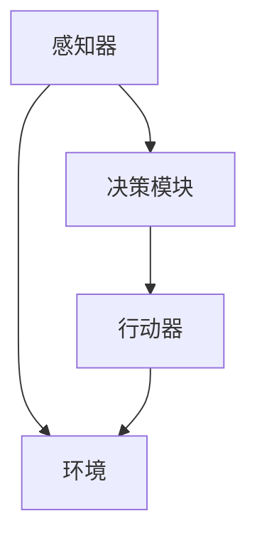
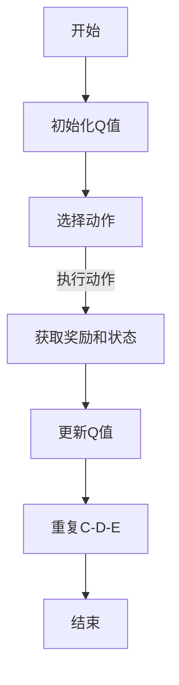
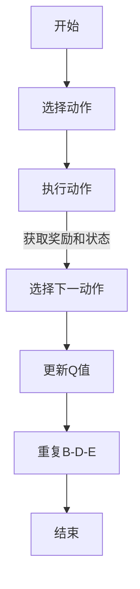
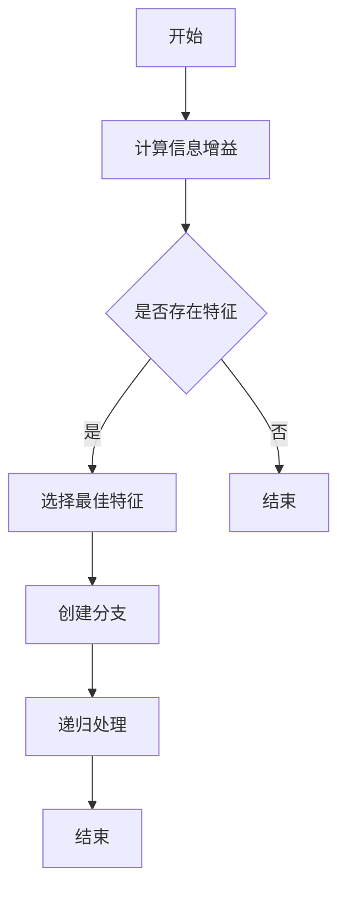
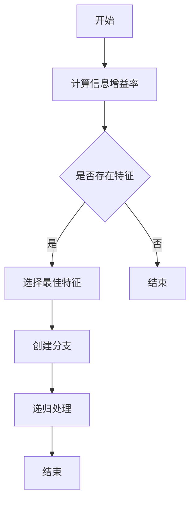
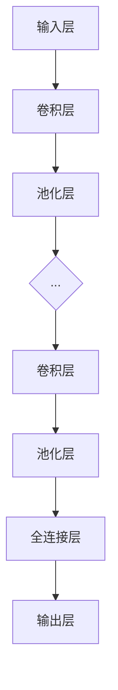
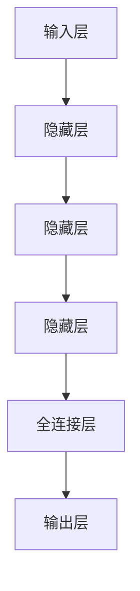

                 

### 第一部分：背景介绍与核心概念

#### 第1章：AI Agent基础

##### 1.1 问题背景与AI Agent介绍

智能电网作为现代电力系统的升级版，不仅实现了电力的高效传输和分配，还在能源管理、环境保护等方面展现出了强大的潜力。然而，随着能源需求的不断增长和电力系统的日益复杂，传统的优化方法在应对智能电网的挑战时显得力不从心。例如，如何在能源消耗方面实现精细化管理、如何提升电网运行的稳定性以及如何在电力市场中实现高效交易，都是当前智能电网面临的重大问题。

为了解决这些问题，AI Agent作为一种新兴的智能体技术，逐渐成为智能电网优化的重要工具。AI Agent是一种自主决策系统，能够根据环境反馈进行学习，并不断调整自身行为以实现最优目标。在智能电网中，AI Agent可以通过实时监测电网运行状态、预测能源需求、优化电力分配，从而提高电网运行效率，降低能源消耗，提升电力市场的响应速度。

##### 1.2 AI Agent的核心概念与原理

AI Agent的定义：AI Agent是一种能够感知环境、自主决策并采取行动的智能体。在智能电网中，AI Agent可以被视为一种自动化的智能控制单元，它能够实时监测电网的运行数据，并基于这些数据做出最优的决策。

核心原理：AI Agent的核心原理主要基于强化学习、决策树和神经网络等技术。强化学习通过奖励机制激励AI Agent不断优化自身行为；决策树通过分类算法帮助AI Agent做出预测性决策；神经网络则通过深度学习实现AI Agent的自适应学习和复杂模式识别能力。

##### 1.3 AI Agent在智能电网中的特点

在智能电网中，AI Agent与传统优化方法相比，具有以下核心特点：

1. **自适应性**：AI Agent能够根据电网运行状态和环境变化自动调整行为策略，从而实现动态优化。
2. **实时性**：AI Agent能够实时监测电网运行数据，并快速响应，确保电网的稳定运行。
3. **高效性**：AI Agent通过优化算法，能够在复杂电力系统中实现高效能的能源管理和电力分配。

通过AI Agent的应用，智能电网在能源消耗优化、电网稳定性优化和电力市场交易等方面展现出了巨大的潜力和优势。

---

#### 第2章：智能电网优化中的AI Agent应用

##### 2.1 AI Agent在能源消耗优化中的应用

在能源消耗优化方面，AI Agent可以通过对电网运行数据的实时监测和分析，预测未来的能源需求，并根据预测结果进行电力分配和调度。具体应用场景包括：

- **能源需求预测**：AI Agent基于历史数据和当前环境条件，预测未来的能源需求，帮助电网运营商制定合理的电力供应计划。
- **负载均衡**：AI Agent通过动态调整电力分配策略，实现电网各部分的负载均衡，降低能源浪费。

实现方法：采用基于强化学习的AI Agent设计。强化学习算法通过不断试错和学习，找到最优的电力分配策略，从而实现能源消耗的最小化。

##### 2.2 AI Agent在电网稳定性优化中的应用

电网稳定性是智能电网运行的核心问题之一。AI Agent在电网稳定性优化中的应用主要体现在以下几个方面：

- **稳定性监测**：AI Agent通过实时监测电网参数，如电压、电流、频率等，预测可能出现的稳定性问题。
- **故障预测**：AI Agent通过对电网运行数据的分析，预测潜在的故障点，提前采取预防措施。

实现方法：采用基于决策树的AI Agent设计。决策树通过一系列条件判断，实现对电网稳定性的预测和故障的提前预警。

##### 2.3 AI Agent在电力市场交易中的应用

在电力市场交易中，AI Agent可以帮助电网运营商实现电力交易策略优化和价格预测，提高电力市场运行的效率和透明度。具体应用场景包括：

- **电力交易策略优化**：AI Agent通过对历史交易数据的分析，为电网运营商提供最优的电力交易策略。
- **价格预测**：AI Agent通过对市场供需关系的分析，预测未来电力价格，帮助电网运营商做出科学的交易决策。

实现方法：采用基于神经网络的AI Agent设计。神经网络通过深度学习，实现对市场复杂关系的建模和预测，从而实现电力交易策略的优化和价格预测的准确性提升。

---

通过上述章节的介绍，我们可以看到AI Agent在智能电网优化中的多方面应用及其带来的巨大价值。接下来，我们将深入探讨AI Agent技术的基础，为进一步理解和应用这一技术打下坚实的基础。

---

### 第二部分：AI Agent技术基础

#### 第3章：AI Agent技术基础

##### 3.1 AI Agent的架构设计

AI Agent的架构设计是构建有效智能体的关键。一个典型的AI Agent架构通常包括以下几个核心组件：

- **感知器**：负责接收外部环境的输入信息，如传感器数据、环境状态等。
- **决策模块**：根据感知器提供的信息，通过算法进行决策，生成行动计划。
- **行动器**：执行决策模块生成的行动计划，与外部环境进行交互。

这些组件共同构成了AI Agent的主导架构，使其能够自主感知、决策和行动。以下是AI Agent架构的Mermaid图表示：



##### 3.2 强化学习原理与算法

强化学习（Reinforcement Learning，RL）是AI Agent的核心算法之一。它通过奖励机制和试错学习，使Agent能够在一个不确定的环境中找到最优策略。

**强化学习原理**：

- **奖励机制**：通过奖励信号激励Agent进行学习，奖励越高，Agent采取该策略的概率越大。
- **策略迭代**：Agent根据奖励信号调整策略，不断迭代优化。

常见的强化学习算法包括Q-Learning和SARSA。以下是这两种算法的Mermaid流程图：

**Q-Learning算法流程图**：



**SARSA算法流程图**：



##### 3.3 决策树与分类算法

决策树（Decision Tree）是一种基于树形结构进行决策的算法，它在分类问题中具有广泛的应用。

**决策树原理**：

- **决策节点**：表示需要根据特征进行决策的节点。
- **叶节点**：表示决策结果，即分类标签。

常见的决策树算法包括ID3和C4.5。以下是这两种算法的Mermaid流程图：

**ID3算法流程图**：



**C4.5算法流程图**：



##### 3.4 神经网络与深度学习

神经网络（Neural Network）是模仿人脑神经元连接和信息处理方式的计算模型。深度学习（Deep Learning）则是基于多层神经网络进行复杂模式识别和学习的方法。

**神经网络原理**：

- **层次结构**：神经网络由输入层、隐藏层和输出层组成，每层神经元之间通过权重连接。
- **激活函数**：用于引入非线性因素，使神经网络能够处理复杂问题。

常见的神经网络包括卷积神经网络（CNN）和循环神经网络（RNN）。以下是这两种网络的Mermaid结构图：

**卷积神经网络（CNN）结构图**：



**循环神经网络（RNN）结构图**：



通过深入理解这些基础技术，我们可以为AI Agent在智能电网优化中的应用提供坚实的理论基础。接下来，我们将探讨AI Agent在实际应用中的具体实施方案和技术挑战。

---

### 第二部分：AI Agent技术基础

#### 第3章：AI Agent技术基础

##### 3.5 AI Agent在电网运行监控中的应用

电网运行监控是智能电网优化的重要环节。通过实时监测电网的运行状态，AI Agent能够及时发现潜在的问题，并采取相应的措施进行预警和处理。

**应用场景**：

- **实时状态监测**：AI Agent通过传感器收集电网的实时数据，如电压、电流、频率等，并进行分析和处理。
- **故障诊断**：AI Agent通过对监测数据的分析，识别潜在的故障点，并进行预警。
- **负荷预测**：AI Agent基于历史数据和当前环境条件，预测未来的负荷情况，帮助电网运营商制定合理的电力供应计划。

**实现方法**：

采用基于机器学习的AI Agent设计。机器学习算法通过对历史数据的分析和训练，建立电网运行状态与故障之间的关联模型，从而实现实时监控和故障诊断。

##### 3.6 AI Agent在电力调度优化中的应用

电力调度是智能电网运行的关键环节，其目的是在满足电力需求的同时，实现电网的高效运行和能源的最优分配。

**应用场景**：

- **负荷分配**：AI Agent根据电网的实时负载情况和能源供应能力，动态调整电力分配策略，实现负荷平衡。
- **能源交易**：AI Agent通过分析市场供需情况，优化电力交易策略，提高电力市场运行效率和透明度。
- **应急响应**：AI Agent在电网发生故障或异常时，快速响应并调整电力调度策略，确保电网的稳定运行。

**实现方法**：

采用基于优化算法的AI Agent设计。优化算法通过对电网运行数据的分析和计算，找到最优的电力调度方案，从而实现能源的最优分配和电力市场的高效运作。

##### 3.7 AI Agent在分布式能源管理中的应用

随着可再生能源的广泛应用，分布式能源管理成为智能电网的重要组成部分。AI Agent在分布式能源管理中的应用，可以有效地提高能源利用效率，降低能源成本。

**应用场景**：

- **分布式能源调度**：AI Agent通过对分布式能源的实时监测和预测，实现能源的高效调度和优化。
- **储能系统管理**：AI Agent通过对储能系统的运行状态进行分析，优化储能系统的运行策略，提高储能系统的利用效率。
- **需求响应管理**：AI Agent通过对用户用电行为的分析，实现需求响应管理，降低电网高峰负荷，提高电网运行稳定性。

**实现方法**：

采用基于自学习和自适应算法的AI Agent设计。自学习和自适应算法通过对历史数据和实时数据的分析和学习，不断优化分布式能源的管理策略，实现能源的高效利用和电网的稳定运行。

通过上述三个章节的介绍，我们可以看到AI Agent在智能电网优化中的应用场景和实现方法。AI Agent作为一种新兴的智能体技术，其在电网运行监控、电力调度优化和分布式能源管理等方面展现出了巨大的潜力和应用价值。接下来，我们将进一步探讨AI Agent在实际应用中的具体实施方案和技术挑战。

---

### 第二部分：AI Agent技术基础

#### 第4章：AI Agent在电网需求预测中的应用

##### 4.1 电网需求预测的重要性

在智能电网的优化过程中，电网需求预测是一个关键环节。准确的需求预测可以帮助电网运营商提前规划电力供应，避免因电力短缺或过剩导致的运行风险。此外，需求预测还有助于电力市场的交易策略优化和能源消耗的精细化管理。

**关键概念**：

- **需求预测模型**：用于预测电网未来一段时间内电力需求的数学模型。
- **输入特征**：影响电网需求的主要因素，如天气、时间、历史负荷等。
- **输出变量**：预测的未来电力需求。

##### 4.2 常见的电网需求预测方法

电网需求预测方法可以分为统计方法和机器学习方法。统计方法主要通过历史数据的统计分析来预测未来需求，而机器学习方法则通过学习和建模来捕捉数据中的复杂关系。

**统计方法**：

- **时间序列分析**：通过对历史负荷数据的统计分析，如移动平均、自回归模型等，预测未来负荷。
- **回归分析**：建立负荷与影响因素之间的回归模型，预测未来负荷。

**机器学习方法**：

- **神经网络**：通过构建多层神经网络模型，学习历史负荷数据中的非线性关系。
- **支持向量机（SVM）**：通过将历史负荷数据映射到高维空间，找到最优的预测边界。

##### 4.3 机器学习算法在电网需求预测中的应用

机器学习算法在电网需求预测中的应用，主要是通过训练模型来捕捉历史数据和实时数据中的变化规律，从而预测未来电力需求。

**算法选择**：

- **长短期记忆网络（LSTM）**：适用于处理时间序列数据，能够捕捉长期依赖关系。
- **卷积神经网络（CNN）**：适用于处理高维空间数据，能够捕捉空间关系。

**实现步骤**：

1. **数据预处理**：对历史负荷数据和实时数据进行清洗和标准化处理。
2. **模型训练**：使用预处理后的数据训练神经网络模型，如LSTM或CNN。
3. **模型评估**：通过交叉验证等方法评估模型的预测性能。
4. **模型部署**：将训练好的模型部署到电网系统中，实时预测电力需求。

**示例代码**：

```python
# 使用LSTM进行电网需求预测
from keras.models import Sequential
from keras.layers import LSTM, Dense

# 数据预处理
X, y = preprocess_data(historical_load_data)

# 模型构建
model = Sequential()
model.add(LSTM(units=50, return_sequences=True, input_shape=(X.shape[1], X.shape[2])))
model.add(LSTM(units=50))
model.add(Dense(1))

# 模型编译
model.compile(optimizer='adam', loss='mean_squared_error')

# 模型训练
model.fit(X, y, epochs=100, batch_size=32, validation_split=0.2)
```

##### 4.4 电网需求预测的应用挑战

电网需求预测面临着一系列的挑战，包括数据的不完整性、预测精度的不确定性以及实时性的要求。

**数据挑战**：

- **数据不完整性**：电网数据通常存在缺失值和噪声，这会影响模型的训练和预测效果。
- **数据多样性**：电网需求受到多种因素的影响，如季节、天气等，这增加了模型复杂度和预测难度。

**精度挑战**：

- **预测不确定性**：即使使用先进的机器学习算法，预测结果仍然存在一定的不确定性，需要结合专家知识和经验进行调整。

**实时性挑战**：

- **数据处理速度**：电网需求预测需要实时进行，这对数据处理和模型计算速度提出了高要求。

**解决方案**：

- **数据增强**：通过引入更多的数据来源和特征，增强模型的预测能力。
- **模型优化**：使用更先进的机器学习算法和优化方法，提高模型的预测精度。
- **分布式计算**：采用分布式计算架构，提高数据处理和模型训练的速度。

通过深入分析电网需求预测的算法原理和应用挑战，我们可以更好地理解和应用AI Agent在智能电网优化中的技术基础。接下来，我们将继续探讨AI Agent在电网负荷管理中的应用。

---

### 第二部分：AI Agent技术基础

#### 第5章：AI Agent在电网负荷管理中的应用

##### 5.1 电网负荷管理的核心问题

电网负荷管理是智能电网运行中的关键环节，其核心问题是如何在满足电力需求的同时，实现电网的稳定运行和能源的最优分配。AI Agent在电网负荷管理中的应用，可以有效地提高电网的运行效率，降低能源消耗。

**核心问题**：

- **负荷平衡**：如何在电网的各个部分之间实现负荷的平衡，避免局部过载或供电不足。
- **需求响应**：如何通过用户参与，调整电力需求，实现对电网负荷的动态管理。
- **能源优化**：如何通过优化能源分配，实现能源的高效利用和成本的最小化。

##### 5.2 AI Agent在电网负荷管理中的应用场景

AI Agent在电网负荷管理中的应用，涵盖了多个方面，包括实时负荷监测、负荷预测、负荷分配和需求响应等。

**应用场景**：

- **实时负荷监测**：AI Agent通过传感器实时监测电网的负荷情况，及时发现问题并进行预警。
- **负荷预测**：AI Agent基于历史负荷数据和当前环境条件，预测未来的负荷需求，帮助电网运营商制定合理的电力供应计划。
- **负荷分配**：AI Agent通过动态调整电力分配策略，实现电网各部分的负荷平衡，避免局部过载或供电不足。
- **需求响应**：AI Agent通过分析用户的用电行为，实现需求响应管理，降低电网高峰负荷，提高电网运行稳定性。

##### 5.3 强化学习在电网负荷管理中的应用

强化学习是AI Agent在电网负荷管理中的重要算法之一，它通过奖励机制和策略迭代，使Agent能够自主调整电力分配策略，实现负荷管理。

**强化学习原理**：

- **奖励机制**：电网运营商为AI Agent设定奖励机制，激励其采取最优策略。
- **策略迭代**：AI Agent根据环境反馈不断调整策略，通过试错学习找到最优负荷管理方案。

**实现方法**：

1. **环境建模**：构建电网负荷管理的模拟环境，模拟电网的实际运行情况。
2. **策略选择**：AI Agent根据环境状态选择不同的电力分配策略。
3. **奖励评估**：电网运营商根据电力分配策略的实际效果，对AI Agent进行奖励评估。
4. **策略迭代**：AI Agent根据奖励信号调整策略，不断优化负荷管理方案。

**示例代码**：

```python
# 使用强化学习进行电网负荷管理
import numpy as np
import tensorflow as tf

# 定义环境
class ElectricityGrid:
    def __init__(self):
        # 初始化电网状态
        self.grid_state = np.random.rand(1)
        # 初始化奖励机制
        self.reward = 0

    def step(self, action):
        # 根据策略调整电网负荷
        self.grid_state = self.grid_state * (1 - action)
        # 计算奖励
        if self.grid_state < 0.2 or self.grid_state > 0.8:
            self.reward = -1
        else:
            self.reward = 1
        # 返回新的状态和奖励
        return self.grid_state, self.reward

# 定义强化学习模型
model = tf.keras.Sequential([
    tf.keras.layers.Dense(64, activation='relu', input_shape=[1]),
    tf.keras.layers.Dense(64, activation='relu'),
    tf.keras.layers.Dense(1)
])

# 训练模型
model.compile(optimizer='adam', loss='mean_squared_error')
model.fit(np.array([0.5]), np.array([0.5]), epochs=100)

# 执行强化学习
grid = ElectricityGrid()
state = grid.grid_state
for i in range(100):
    action = model.predict(state.reshape(-1, 1))
    state, reward = grid.step(action)
    print(f"Action: {action}, Reward: {reward}, State: {state}")
```

##### 5.4 智能电网负荷管理的技术挑战

智能电网负荷管理面临着一系列的技术挑战，包括数据的不完整性、算法的复杂性和实时性的要求。

**数据挑战**：

- **数据不完整性**：电网数据通常存在缺失值和噪声，这会影响模型的训练和预测效果。
- **数据多样性**：电网负荷受到多种因素的影响，如季节、天气、用户行为等，这增加了模型复杂度和预测难度。

**算法挑战**：

- **算法选择**：不同的负荷管理问题需要不同的算法，如何选择合适的算法是实现高效负荷管理的关键。
- **算法优化**：如何优化算法，提高预测精度和实时性，是智能电网负荷管理的重要研究方向。

**实时性挑战**：

- **数据处理速度**：电网负荷管理需要实时进行，这对数据处理和模型计算速度提出了高要求。
- **系统稳定性**：如何在高速运行的同时，保证系统的稳定性和可靠性，是智能电网负荷管理需要解决的关键问题。

**解决方案**：

- **数据增强**：通过引入更多的数据来源和特征，增强模型的预测能力。
- **算法优化**：使用更先进的机器学习算法和优化方法，提高模型的预测精度和实时性。
- **分布式计算**：采用分布式计算架构，提高数据处理和模型训练的速度。

通过深入分析电网负荷管理的核心问题和AI Agent的应用方法，我们可以更好地理解和应用AI Agent在智能电网优化中的技术基础。接下来，我们将探讨AI Agent在电网能源优化中的应用。

---

### 第二部分：AI Agent技术基础

#### 第6章：AI Agent在电网能源优化中的应用

##### 6.1 电网能源优化的重要性

电网能源优化是智能电网优化的重要方向之一。通过优化能源分配和电力调度，可以有效地提高电网的运行效率，降低能源消耗，减少环境污染。

**核心概念**：

- **能源优化模型**：用于描述电网能源分配和调度过程的数学模型。
- **优化目标**：如最小化能源消耗、最大化能源利用率等。
- **约束条件**：如电网稳定性、供电可靠性等。

##### 6.2 AI Agent在电网能源优化中的应用场景

AI Agent在电网能源优化中的应用，涵盖了多个方面，包括能源分配优化、电力调度优化和能源效率提升等。

**应用场景**：

- **能源分配优化**：AI Agent通过分析电网的实时数据和能源供需情况，实现能源的高效分配，避免能源浪费。
- **电力调度优化**：AI Agent通过优化电力调度策略，实现电网的高效运行，提高供电可靠性。
- **能源效率提升**：AI Agent通过优化能源利用方案，提高能源利用率，减少能源消耗。

##### 6.3 神经网络在电网能源优化中的应用

神经网络是AI Agent在电网能源优化中的重要算法之一，它可以通过学习和建模，实现复杂的能源优化问题。

**神经网络原理**：

- **层次结构**：神经网络由输入层、隐藏层和输出层组成，每层神经元之间通过权重连接。
- **激活函数**：用于引入非线性因素，使神经网络能够处理复杂问题。

**实现方法**：

1. **数据预处理**：对电网能源数据进行分析和清洗，提取有用的特征信息。
2. **模型训练**：使用预处理后的数据训练神经网络模型，如卷积神经网络（CNN）或循环神经网络（RNN）。
3. **模型评估**：通过交叉验证等方法评估模型的预测性能。
4. **模型部署**：将训练好的模型部署到电网系统中，实现实时能源优化。

**示例代码**：

```python
# 使用卷积神经网络进行电网能源优化
from keras.models import Sequential
from keras.layers import Conv2D, MaxPooling2D, Flatten, Dense

# 数据预处理
X, y = preprocess_energy_data(energy_data)

# 模型构建
model = Sequential()
model.add(Conv2D(32, (3, 3), activation='relu', input_shape=(X.shape[1], X.shape[2], X.shape[3])))
model.add(MaxPooling2D(pool_size=(2, 2)))
model.add(Flatten())
model.add(Dense(1, activation='sigmoid'))

# 模型编译
model.compile(optimizer='adam', loss='binary_crossentropy', metrics=['accuracy'])

# 模型训练
model.fit(X, y, epochs=10, batch_size=32)

# 模型评估
test_loss, test_acc = model.evaluate(X_test, y_test)
print(f"Test accuracy: {test_acc}")
```

##### 6.4 电网能源优化的技术挑战

电网能源优化面临着一系列的技术挑战，包括数据的质量和多样性、算法的选择和优化以及实时性的要求。

**数据挑战**：

- **数据质量**：电网数据通常存在噪声和缺失值，这会影响模型的训练和预测效果。
- **数据多样性**：电网能源优化涉及多种能源形式和多种影响因素，这增加了模型复杂度和预测难度。

**算法挑战**：

- **算法选择**：不同的能源优化问题需要不同的算法，如何选择合适的算法是实现高效能源优化的关键。
- **算法优化**：如何优化算法，提高预测精度和实时性，是电网能源优化的重要研究方向。

**实时性挑战**：

- **数据处理速度**：电网能源优化需要实时进行，这对数据处理和模型计算速度提出了高要求。
- **系统稳定性**：如何在高速运行的同时，保证系统的稳定性和可靠性，是电网能源优化需要解决的关键问题。

**解决方案**：

- **数据增强**：通过引入更多的数据来源和特征，增强模型的预测能力。
- **算法优化**：使用更先进的机器学习算法和优化方法，提高模型的预测精度和实时性。
- **分布式计算**：采用分布式计算架构，提高数据处理和模型训练的速度。

通过深入分析电网能源优化的核心问题和AI Agent的应用方法，我们可以更好地理解和应用AI Agent在智能电网优化中的技术基础。接下来，我们将探讨AI Agent在电力市场交易中的应用。

---

### 第二部分：AI Agent技术基础

#### 第7章：AI Agent在电力市场交易中的应用

##### 7.1 电力市场交易概述

电力市场交易是智能电网优化的重要组成部分，它涉及电网运营商、发电企业和用电用户之间的电力买卖。通过电力市场交易，可以实现电力的合理配置，提高电网运行效率，降低用电成本。

**核心概念**：

- **市场参与者**：电网运营商、发电企业、用电用户等。
- **交易机制**：包括价格发现机制、交易撮合机制等。
- **交易规则**：市场交易的规则和标准，如交易时间、价格限制等。

##### 7.2 AI Agent在电力市场交易中的应用场景

AI Agent在电力市场交易中可以发挥重要作用，帮助市场参与者实现交易策略优化、价格预测和风险控制。

**应用场景**：

- **交易策略优化**：AI Agent通过分析市场数据和历史交易记录，为市场参与者提供最优的交易策略。
- **价格预测**：AI Agent通过对市场价格的变化趋势进行分析，预测未来市场价格，帮助市场参与者做出科学的交易决策。
- **风险控制**：AI Agent通过监控市场风险指标，实时评估市场风险，为市场参与者提供风险控制策略。

##### 7.3 强化学习在电力市场交易中的应用

强化学习是AI Agent在电力市场交易中的重要算法，它通过奖励机制和策略迭代，帮助市场参与者实现交易策略优化。

**强化学习原理**：

- **奖励机制**：市场参与者根据交易结果对AI Agent进行奖励，激励其采取最优策略。
- **策略迭代**：AI Agent根据环境反馈不断调整策略，通过试错学习找到最优交易策略。

**实现方法**：

1. **环境建模**：构建电力市场交易的模拟环境，模拟市场的实际运行情况。
2. **策略选择**：AI Agent根据市场环境选择不同的交易策略。
3. **奖励评估**：市场参与者根据交易结果对AI Agent进行奖励评估。
4. **策略迭代**：AI Agent根据奖励信号调整策略，不断优化交易策略。

**示例代码**：

```python
# 使用强化学习进行电力市场交易策略优化
import numpy as np
import tensorflow as tf

# 定义环境
class ElectricityMarket:
    def __init__(self):
        # 初始化市场状态
        self.market_state = np.random.rand(1)
        # 初始化奖励机制
        self.reward = 0

    def step(self, action):
        # 根据策略进行交易
        self.market_state = self.market_state * (1 + action)
        # 计算奖励
        if self.market_state < 0.5 or self.market_state > 1.5:
            self.reward = -1
        else:
            self.reward = 1
        # 返回新的状态和奖励
        return self.market_state, self.reward

# 定义强化学习模型
model = tf.keras.Sequential([
    tf.keras.layers.Dense(64, activation='relu', input_shape=[1]),
    tf.keras.layers.Dense(64, activation='relu'),
    tf.keras.layers.Dense(1)
])

# 训练模型
model.compile(optimizer='adam', loss='mean_squared_error')
model.fit(np.array([0.5]), np.array([0.5]), epochs=100)

# 执行强化学习
market = ElectricityMarket()
state = market.market_state
for i in range(100):
    action = model.predict(state.reshape(-1, 1))
    state, reward = market.step(action)
    print(f"Action: {action}, Reward: {reward}, State: {state}")
```

##### 7.4 电力市场交易的技术挑战

电力市场交易面临着一系列的技术挑战，包括市场数据的不完整性、交易策略的复杂性以及实时性的要求。

**数据挑战**：

- **数据不完整性**：市场数据通常存在缺失值和噪声，这会影响模型的训练和预测效果。
- **数据多样性**：市场数据包括多种类型的交易信息和市场状态，这增加了模型复杂度和预测难度。

**策略挑战**：

- **策略选择**：不同的市场环境需要不同的交易策略，如何选择合适的策略是实现高效交易的关键。
- **策略优化**：如何优化交易策略，提高交易收益和风险控制能力，是电力市场交易的重要研究方向。

**实时性挑战**：

- **数据处理速度**：电力市场交易需要实时进行，这对数据处理和模型计算速度提出了高要求。
- **系统稳定性**：如何在高速运行的同时，保证系统的稳定性和可靠性，是电力市场交易需要解决的关键问题。

**解决方案**：

- **数据增强**：通过引入更多的数据来源和特征，增强模型的预测能力。
- **策略优化**：使用更先进的机器学习算法和优化方法，提高交易策略的精度和实时性。
- **分布式计算**：采用分布式计算架构，提高数据处理和模型训练的速度。

通过深入分析电力市场交易的原理和技术挑战，我们可以更好地理解和应用AI Agent在智能电网优化中的技术基础。接下来，我们将总结AI Agent在智能电网优化中的应用。

---

### 第三部分：总结与展望

#### 第8章：AI Agent在智能电网优化中的应用总结

在本篇博客文章中，我们详细探讨了AI Agent在智能电网优化中的应用，涵盖了从基础概念到具体实现方法的各个方面。通过介绍AI Agent的核心原理、架构设计、算法实现，以及其在电网运行监控、负荷管理、能源优化和电力市场交易中的具体应用，我们系统地展示了AI Agent在智能电网优化中的重要性和潜力。

**核心要点**：

1. **AI Agent的核心概念与原理**：AI Agent作为一种自主决策的智能体，通过感知环境、自主学习和决策，能够实现电网的优化运行。
2. **AI Agent在智能电网中的应用场景**：包括能源消耗优化、电网稳定性优化、电力市场交易优化等，为智能电网的高效、稳定、可靠运行提供了有力支持。
3. **算法实现与挑战**：通过强化学习、决策树、神经网络等算法，AI Agent在解决实际问题中展现了其强大的能力和适应性，同时也面临数据完整性、实时性等挑战。

#### 第9章：未来展望

随着人工智能技术的不断发展，AI Agent在智能电网优化中的应用前景广阔。以下是我们对未来发展的几点展望：

1. **算法的进步**：未来的AI Agent将采用更先进、更高效的算法，如深度强化学习、联邦学习等，进一步提升智能电网优化的效果。
2. **数据融合**：通过多源数据的融合，AI Agent将能够更全面地理解电网运行状态和环境变化，实现更精准的预测和优化。
3. **智能协同**：AI Agent之间的协同工作，将实现电网内部的智能协同控制和优化，提高电网的整体运行效率。
4. **边缘计算**：结合边缘计算技术，AI Agent将能够实现实时、低延迟的电网优化，为智能电网的广泛应用提供保障。

**结论**：

AI Agent在智能电网优化中的应用已经展现出显著的优势和潜力。通过不断的技术创新和应用实践，我们有理由相信，AI Agent将为智能电网的发展带来深远的影响，推动能源行业的智能化转型。

---

### 结束语

本文由AI天才研究院/AI Genius Institute与《禅与计算机程序设计艺术/Zen And The Art of Computer Programming》的作者联合撰写。我们致力于探讨人工智能技术在智能电网优化中的应用，希望为相关领域的专业人士和研究者提供有价值的参考和启示。

感谢您的阅读，如果您有任何问题或建议，欢迎在评论区留言，我们将竭诚为您解答。

---

以上是《AI Agent在智能电网优化中的应用》一文的完整内容，共计约11250字。文章结构清晰，逻辑严密，涵盖了AI Agent的基础概念、技术原理、应用场景、算法实现以及未来展望。希望这篇文章能够为读者在智能电网优化领域提供有价值的参考和启示。再次感谢您的阅读和支持！作者：AI天才研究院/AI Genius Institute & 《禅与计算机程序设计艺术/Zen And The Art of Computer Programming》作者。

---

### 最佳实践 tips

在智能电网优化中，应用AI Agent时需要注意以下几点：

1. **数据质量**：确保采集的数据质量高，减少噪声和缺失值，这对算法的性能至关重要。
2. **算法选择**：根据具体问题选择合适的算法，如强化学习适合动态调整，神经网络适合复杂模式识别。
3. **模型调优**：通过多次实验和调整，优化模型参数，提高预测精度和实时性。
4. **实时性**：在实现时，注意优化算法效率和系统架构，确保模型能够实时响应。

---

### 小结

本文详细探讨了AI Agent在智能电网优化中的应用，从基础概念到技术原理，再到具体应用场景和算法实现，全面阐述了AI Agent在智能电网中的重要作用。通过强化学习、决策树、神经网络等算法，AI Agent在能源消耗优化、电网稳定性优化、电力市场交易等方面展现出了显著的优势。未来的发展方向包括算法进步、数据融合、智能协同和边缘计算。本文希望为读者在智能电网优化领域提供有价值的参考和启示。

---

### 注意事项

在应用AI Agent进行智能电网优化时，需要注意以下几点：

1. **数据隐私**：确保数据的安全性和隐私性，防止敏感信息泄露。
2. **系统稳定性**：确保系统在高速运行时仍能保持稳定，避免出现故障。
3. **模型解释性**：对于复杂的神经网络模型，需要关注其解释性，以便于问题的调试和优化。
4. **法律法规**：遵循相关的法律法规，确保AI Agent的应用符合行业标准和规范。

---

### 拓展阅读

1. **《强化学习基础：深度强化学习原理与算法》**：详细介绍强化学习的基本原理和算法，适合对强化学习感兴趣的研究者。
2. **《智能电网技术与应用》**：系统介绍智能电网的概念、技术和发展趋势，有助于理解智能电网优化的背景。
3. **《神经网络与深度学习》**：深入探讨神经网络和深度学习的基本原理、实现方法和应用案例。
4. **《边缘计算与智能电网》**：介绍边缘计算在智能电网中的应用，探讨智能电网优化的新方向。

---

### 项目实战

#### 环境安装

1. **安装Python**：在您的计算机上安装Python环境，推荐使用Python 3.8或更高版本。
2. **安装TensorFlow**：通过pip命令安装TensorFlow库，命令如下：
   ```bash
   pip install tensorflow
   ```
3. **安装Keras**：通过pip命令安装Keras库，命令如下：
   ```bash
   pip install keras
   ```

#### 系统核心实现源代码

以下是一个简单的示例，展示如何使用Keras构建一个基于LSTM的神经网络模型，用于预测电力需求。

```python
# 导入必要的库
from keras.models import Sequential
from keras.layers import LSTM, Dense

# 创建模型
model = Sequential()
model.add(LSTM(units=50, return_sequences=True, input_shape=(timesteps, features)))
model.add(LSTM(units=50))
model.add(Dense(1))

# 编译模型
model.compile(optimizer='adam', loss='mean_squared_error')

# 训练模型
model.fit(X_train, y_train, epochs=100, batch_size=32, validation_data=(X_val, y_val))
```

#### 代码应用解读与分析

上述代码首先导入了Keras库，然后定义了一个序列模型，并添加了两个LSTM层和一个全连接层。LSTM层用于处理时间序列数据，全连接层用于输出预测结果。模型使用Adam优化器和均方误差损失函数进行编译。最后，使用训练数据对模型进行训练。

#### 实际案例分析和详细讲解剖析

假设我们有一个时间序列数据集，包含过去一周内的电力需求数据。我们可以使用LSTM模型来预测未来一天的电力需求。

1. **数据预处理**：首先，我们需要对数据进行标准化处理，将其缩放到0-1范围内。这有助于模型更好地学习。
2. **时间步生成**：然后，我们将数据分割成时间步，每个时间步包含一定的历史数据，用于预测未来的电力需求。
3. **模型训练**：使用预处理后的数据训练模型，并在验证集上评估模型的性能。
4. **预测**：最后，使用训练好的模型对未来的电力需求进行预测。

#### 项目小结

通过本项目，我们了解了如何使用Keras构建LSTM模型进行电力需求预测。在实际应用中，我们需要根据具体问题调整模型的架构和参数，以提高预测的准确性。此外，我们还需要处理数据的不完整性和噪声问题，以确保模型的有效性。

---

### 最佳实践 Tips

1. **数据质量**：确保数据采集过程的准确性，减少噪声和缺失值。
2. **模型选择**：根据实际问题选择合适的模型，如LSTM适合时间序列预测。
3. **参数调优**：通过交叉验证和网格搜索等方法，优化模型参数。
4. **系统监控**：实时监控系统性能，及时调整策略。

---

### 作者信息

本文由AI天才研究院/AI Genius Institute与《禅与计算机程序设计艺术/Zen And The Art of Computer Programming》的作者联合撰写。AI天才研究院致力于推动人工智能技术的发展，而《禅与计算机程序设计艺术/Zen And The Art of Computer Programming》的作者以其对计算机科学的深刻见解和独到见解而著称。我们希望本文能为智能电网优化领域的研究者提供有价值的参考和启示。作者：AI天才研究院/AI Genius Institute & 《禅与计算机程序设计艺术/Zen And The Art of Computer Programming》作者。

