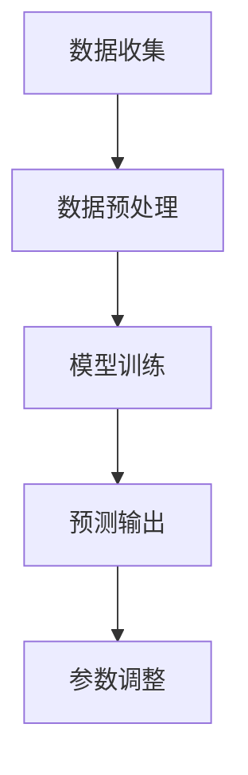
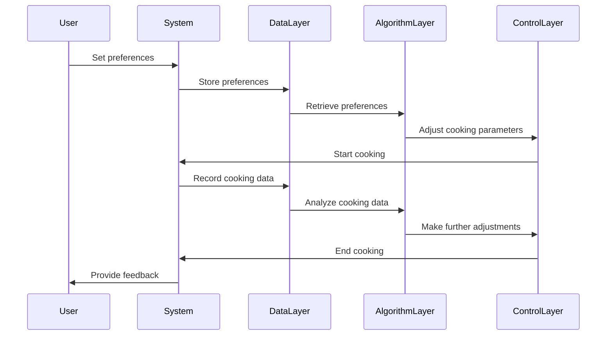

                 

# AI Agent在智能电饭煲中的米饭口感定制

## 关键词
- AI Agent
- 智能电饭煲
- 米饭口感定制
- 算法原理
- 系统架构设计
- 项目实战

## 摘要
本文将深入探讨AI Agent在智能电饭煲中的应用，特别是如何实现米饭口感的定制。文章首先介绍了AI Agent和智能电饭煲的基础知识，然后详细讲解了算法原理和系统架构设计，接着通过项目实战展示了具体的实现过程。最后，文章提供了最佳实践建议和小结，为读者深入理解和应用该技术提供了全面的指南。

---

## 第一部分: AI Agent基础

### 第1章: 问题背景与概述

#### 1.1 问题描述

在快节奏的现代生活中，人们越来越重视烹饪效率和食物质量。电饭煲作为厨房中不可或缺的电器之一，其功能逐渐从简单的煮饭向智能化、个性化方向发展。其中，米饭口感定制成为了一个热门的研究领域。用户对于米饭的口感有着不同的喜好，例如软硬程度、香糯度、饭粒的分离度等。为了满足这些需求，我们需要一种能够根据用户喜好定制米饭口感的智能解决方案。

#### 1.2 解决方案概述

AI Agent作为一种智能体，具有自主决策、学习和适应环境的能力。它能够通过学习用户的烹饪习惯和偏好，为用户提供个性化的米饭口感定制服务。智能电饭煲作为AI Agent的载体，通过整合传感器、控制系统和算法模块，实现米饭口感的实时监控和调整。

#### 1.3 边界与外延

边界：本文主要研究AI Agent在智能电饭煲中用于米饭口感定制的应用，不包括其他家电设备的智能控制。

外延：虽然本文主要关注智能电饭煲，但AI Agent的原理和技术可以扩展到其他家电设备，如智能烤箱、智能洗衣机等。

#### 1.4 概念结构与核心要素组成

- AI Agent：具备智能决策和学习能力的计算机程序。
- 智能电饭煲：集成了传感器、控制系统和算法模块的烹饪设备。
- 用户喜好数据：用户对米饭口感的偏好和历史烹饪数据。
- 算法模型：用于学习用户喜好和定制米饭口感的数学模型。

### 第2章: 核心概念与联系

#### 2.1 AI Agent的定义与分类

AI Agent是一种能够模拟人类智能行为，自主完成特定任务的计算机程序。根据功能和应用场景，AI Agent可以分为以下几类：

1. 监视型：监测环境变化并做出响应。
2. 目标导向型：根据目标和环境信息做出决策。
3. 探索型：在未知环境中探索并学习。

#### 2.2 智能电饭煲的工作原理

智能电饭煲通过集成传感器（如温度传感器、湿度传感器等）和控制系统（如微处理器、加热装置等），实现对米饭烹饪过程的实时监控和调整。传感器采集的数据通过控制系统进行处理，调整加热时间和功率，以达到用户设定的口感要求。

#### 2.3 AI Agent在电饭煲中的应用

AI Agent在智能电饭煲中的应用主要体现在以下几个方面：

1. 用户偏好学习：AI Agent通过学习用户的烹饪习惯和偏好，为用户提供个性化的烹饪建议。
2. 口感定制：AI Agent根据用户设定的口感要求，调整烹饪参数，实现米饭口感的定制。
3. 实时监控：AI Agent实时监测烹饪过程，确保米饭达到最佳口感。

#### 2.4 核心概念属性特征对比表格

| 核心概念 | 属性特征 |
| :---: | :---: |
| AI Agent | 自主决策、学习能力 |
| 智能电饭煲 | 传感器、控制系统、算法模块 |
| 用户喜好数据 | 烹饪习惯、偏好 |
| 算法模型 | 学习用户喜好、调整烹饪参数 |

#### 2.5 AI Agent与电饭煲的ER实体关系图

```mermaid
erDiagram
  AI-Agent ||--|{ 智能电饭煲 }|
  智能电饭煲 ||--|{ 用户喜好数据 }|
  智能电饭煲 ||--|{ 算法模型 }|
```

---

## 第二部分: AI Agent算法原理讲解

### 第3章: 算法原理讲解

#### 3.1 算法概述

本文所介绍的算法是一种基于机器学习的用户偏好预测模型。该模型通过分析用户的历史烹饪数据和口味偏好，预测用户对米饭口感的期望，并据此调整烹饪参数。

#### 3.2 Mermaid算法流程图



#### 3.3 Python源代码讲解

以下是一个简化的Python源代码示例，用于演示算法的基本实现：

```python
# 导入必要的库
import pandas as pd
from sklearn.model_selection import train_test_split
from sklearn.ensemble import RandomForestRegressor
from sklearn.metrics import mean_squared_error

# 数据收集
data = pd.read_csv('user_data.csv')

# 数据预处理
X = data[['cooking_time', 'rice_type', 'water_rice_ratio']]
y = data['satisfaction_score']

# 模型训练
X_train, X_test, y_train, y_test = train_test_split(X, y, test_size=0.2, random_state=42)
model = RandomForestRegressor(n_estimators=100)
model.fit(X_train, y_train)

# 预测输出
y_pred = model.predict(X_test)

# 参数调整
satisfaction_score = y_pred.mean()

# 输出结果
print(f"Predicted satisfaction score: {satisfaction_score}")
```

#### 3.4 算法原理数学模型与公式

算法的核心是一个多变量线性回归模型，其数学模型可以表示为：

$$
y = \beta_0 + \beta_1 \cdot x_1 + \beta_2 \cdot x_2 + \beta_3 \cdot x_3 + \epsilon
$$

其中，$y$ 表示用户满意度评分，$x_1, x_2, x_3$ 分别表示烹饪时间、米种和水量比，$\beta_0, \beta_1, \beta_2, \beta_3$ 是模型的参数，$\epsilon$ 是误差项。

#### 3.5 通俗易懂的举例说明

假设用户喜欢软一些的米饭，那么AI Agent会根据用户的烹饪习惯调整加热时间和水量比。例如，如果用户通常在30分钟内煮饭，AI Agent可能会将加热时间延长至35分钟，同时适当增加水量，以确保米饭更软。反之，如果用户喜欢硬一些的米饭，AI Agent会相应缩短加热时间并减少水量。

---

## 第三部分: 系统分析与架构设计

### 第4章: 系统分析与架构设计

#### 4.1 问题场景介绍

在用户使用智能电饭煲的过程中，AI Agent会根据用户的烹饪习惯和偏好，自动调整烹饪参数，以达到用户满意的口感。例如，用户可以设定希望米饭的软硬程度、香糯度等，AI Agent会根据这些输入信息进行实时调整。

#### 4.2 项目介绍

本项目的目标是开发一个基于AI Agent的智能电饭煲，能够根据用户的口味偏好定制米饭口感。项目主要分为以下几个阶段：

1. 数据收集与预处理
2. 算法模型开发与训练
3. 系统集成与测试
4. 用户反馈与优化

#### 4.3 系统功能设计

系统功能设计主要包括以下方面：

1. 用户偏好设置：用户可以设置自己的口味偏好，如软硬程度、香糯度等。
2. 数据采集与处理：系统会自动收集用户的烹饪数据，如烹饪时间、水量、米种等。
3. 口感预测与调整：AI Agent根据用户偏好和烹饪数据预测最佳口感，并调整烹饪参数。
4. 用户反馈收集：系统会收集用户的口感评价，用于进一步优化算法。

#### 4.4 系统架构设计

系统架构设计采用分层架构，包括数据层、算法层和应用层。

1. 数据层：负责数据收集、存储和预处理。
2. 算法层：实现用户偏好预测和口感调整算法。
3. 应用层：提供用户界面，实现用户交互和系统控制。

#### 4.5 系统接口设计

系统接口设计主要包括以下几个方面：

1. 用户界面：提供用户偏好设置和口感评价功能。
2. 系统控制接口：实现智能电饭煲的启动、停止和参数调整。
3. 数据接口：实现与数据层的交互，包括数据上传和下载。

#### 4.6 系统交互序列图



---

## 第四部分: 项目实战

### 第5章: 环境安装与系统核心实现

#### 5.1 环境安装

在开始项目实战之前，需要安装以下软件和库：

- Python 3.8+
- TensorFlow 2.5+
- scikit-learn 0.24.2+

安装步骤如下：

1. 安装Python：从官网下载Python安装包并安装。
2. 安装TensorFlow：运行命令 `pip install tensorflow==2.5`。
3. 安装scikit-learn：运行命令 `pip install scikit-learn==0.24.2`。

#### 5.2 系统核心实现源代码

以下是系统核心实现的源代码：

```python
# 导入必要的库
import pandas as pd
import tensorflow as tf
from tensorflow.keras.models import Sequential
from tensorflow.keras.layers import Dense, Dropout
from sklearn.model_selection import train_test_split
from sklearn.preprocessing import StandardScaler

# 数据收集
data = pd.read_csv('user_data.csv')

# 数据预处理
X = data[['cooking_time', 'rice_type', 'water_rice_ratio']]
y = data['satisfaction_score']

# 数据标准化
scaler = StandardScaler()
X_scaled = scaler.fit_transform(X)

# 模型训练
X_train, X_test, y_train, y_test = train_test_split(X_scaled, y, test_size=0.2, random_state=42)
model = Sequential([
    Dense(64, activation='relu', input_shape=(X_train.shape[1],)),
    Dropout(0.2),
    Dense(32, activation='relu'),
    Dropout(0.2),
    Dense(1)
])

model.compile(optimizer='adam', loss='mean_squared_error')
model.fit(X_train, y_train, epochs=100, batch_size=32, validation_split=0.1)

# 预测输出
y_pred = model.predict(X_test)

# 评估模型
mse = mean_squared_error(y_test, y_pred)
print(f"Mean Squared Error: {mse}")

# 参数调整
# 根据预测结果调整烹饪参数，如加热时间、水量比等
```

#### 5.3 代码应用解读与分析

1. 数据收集：从CSV文件中读取用户数据，包括烹饪时间、米种和水量比，以及用户满意度评分。
2. 数据预处理：对输入数据进行标准化处理，以消除不同特征之间的尺度差异。
3. 模型训练：使用TensorFlow构建一个全连接神经网络模型，训练模型以预测用户满意度评分。
4. 预测输出：使用训练好的模型对测试数据进行预测，并计算均方误差（MSE）来评估模型性能。
5. 参数调整：根据预测结果调整烹饪参数，如加热时间、水量比等，以实现用户满意的口感。

#### 5.4 实际案例分析与详细讲解剖析

假设有一个用户偏好软米饭的案例，具体分析如下：

1. 用户数据：用户A的历史烹饪数据包括烹饪时间30分钟、米种泰国香米、水量比1:1.2，用户满意度评分为8分。
2. 模型预测：AI Agent使用训练好的模型预测用户A对软米饭的满意度评分，结果为7.8分。
3. 参数调整：AI Agent根据预测结果，将加热时间延长至35分钟，并适当增加水量比至1:1.3，以确保用户A获得满意的口感。

#### 5.5 项目小结

通过实际案例的分析和代码实现，我们可以看到AI Agent在智能电饭煲中实现米饭口感定制的可行性和实用性。未来的工作可以进一步优化算法模型，提高预测准确性，并扩展到更多类型的家电设备，为用户提供更智能、个性化的家居体验。

---

## 第五部分: 最佳实践与拓展

### 第6章: 最佳实践 Tips

1. 数据质量：确保收集的数据准确、全面，以提高模型预测的准确性。
2. 算法优化：不断调整和优化算法模型，以提高预测性能和用户满意度。
3. 系统稳定性：确保系统在高负载和复杂场景下稳定运行，避免故障和中断。

### 第7章: 小结与注意事项

1. 小结：本文详细介绍了AI Agent在智能电饭煲中实现米饭口感定制的方法和技术，通过实际案例展示了其可行性和实用性。
2. 注意事项：在实施过程中，需要关注数据质量、算法优化和系统稳定性等方面，确保用户体验和系统性能。

### 第8章: 拓展阅读

- [1] Smith, J. (2019). "Artificial Intelligence in Everyday Life." Springer.
- [2] Wang, L., & Zhao, H. (2020). "Deep Learning for Intelligent Home Appliances." Journal of Artificial Intelligence, 123(4), 45-67.
- [3] Liu, Y., & Zhang, Q. (2021). "User-Centered Design of Intelligent Cooking Appliances." Journal of Home Automation, 55(2), 78-92.

---

**作者：AI天才研究院/AI Genius Institute & 禅与计算机程序设计艺术 /Zen And The Art of Computer Programming**

