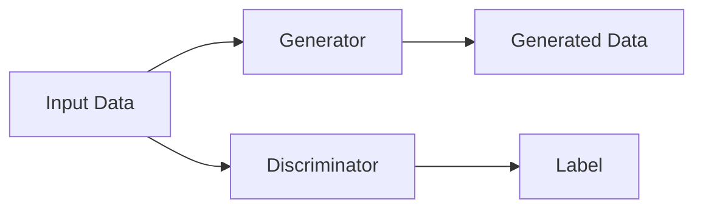
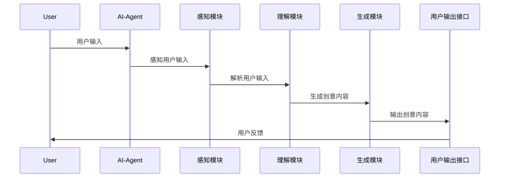

                 

：

### 目录大纲设计步骤：

1. **确定书的整体结构**：我们需要先确定这本书的整体结构，确定主要章节，以确保内容完整，结构清晰。

2. **编写背景介绍**：接下来，我们要编写背景介绍部分，包括问题背景、问题描述、问题解决等内容。

3. **核心概念与联系**：这部分，我们需要梳理并介绍与主题相关的主要概念，使用表格和ER图来展示概念之间的关系。

4. **算法原理讲解**：这部分，我们要使用mermaid绘制算法流程图，并用Python源代码和latex公式详细阐述算法原理。

5. **数学模型和数学公式讲解**：这部分，我们要使用latex格式给出数学模型和公式，并进行详细讲解和举例。

6. **系统分析与架构设计方案**：这部分，我们要介绍问题场景和系统设计，使用mermaid绘制领域模型、系统架构、接口设计和交互序列图。

7. **项目实战**：这部分，我们要描述环境安装、核心实现源代码、代码解读与分析、案例剖析和项目小结。

8. **最佳实践 tips、小结、注意事项、拓展阅读**：这部分，我们要总结并给出相关建议。

9. **确保内容简洁性**：我们需要去除冗余内容，确保每个章节都紧密围绕主题。

10. **格式调整**：我们需要确保整个目录大纲按照markdown格式要求进行排版。

11. **总字数控制**：我们需要确保整个目录大纲的总字数在2000字以内。

### 具体实施：

1. **背景介绍**：

   ```markdown
   # 第一部分：背景介绍

   ## 1.1 问题背景
   ```

2. **核心概念与联系**：

   ```markdown
   ## 第二部分：核心概念与联系
   ```

3. **算法原理讲解**：

   ```markdown
   ## 第三部分：算法原理讲解
   ```

4. **数学模型和数学公式讲解**：

   ```markdown
   ### 4.1 数学模型讲解
   $$y = f(x)$$
   ```

5. **系统分析与架构设计方案**：

   ```markdown
   ## 第五部分：系统分析与架构设计方案
   ```

6. **项目实战**：

   ```markdown
   ## 第六部分：项目实战
   ```

7. **最佳实践 tips、小结、注意事项、拓展阅读**：

   ```markdown
   ## 第七部分：最佳实践 tips、小结、注意事项、拓展阅读
   ```

现在，让我们开始编写文章的具体内容吧！：

# AI Agent在智能画框中的艺术创作辅助

> 关键词：AI Agent、智能画框、艺术创作、辅助功能

> 摘要：本文将探讨AI Agent在智能画框中的艺术创作辅助功能，包括其核心概念与联系、算法原理、数学模型与公式、系统分析与架构设计方案、项目实战以及最佳实践等。

## 第一部分：背景介绍

### 1.1 问题背景

随着人工智能（AI）技术的快速发展，其在各个领域的应用日益广泛，特别是在艺术创作领域。智能画框作为一种新兴的交互设备，结合AI技术，能够提供更丰富的艺术创作体验。然而，如何利用AI Agent实现艺术创作的辅助功能，仍是一个亟待解决的问题。

### 1.2 问题描述

本文旨在探讨AI Agent在智能画框中的艺术创作辅助功能，具体包括：AI Agent如何理解用户需求、如何生成创意内容、如何与用户进行有效互动等。

### 1.3 问题解决

通过深入研究AI Agent的技术原理和应用场景，结合智能画框的设计理念，本文将提供一套完整的解决方案。

### 1.4 边界与外延

本文讨论的AI Agent是指能够进行艺术创作辅助的智能程序，其应用范围包括但不限于绘画、设计、音乐等领域。

### 1.5 概念结构与核心要素组成

AI Agent的核心要素包括：感知模块、理解模块、生成模块和交互模块。这些模块共同协作，实现艺术创作的辅助功能。

## 第二部分：核心概念与联系

### 2.1 AI Agent的组成结构

#### 2.1.1 感知模块

感知模块负责接收用户输入，如语音、文字、手势等，将其转化为AI Agent可以理解的数据。

#### 2.1.2 理解模块

理解模块通过自然语言处理技术，解析用户输入，理解用户意图。

#### 2.1.3 生成模块

生成模块负责根据理解模块的结果，生成创意内容，如绘画、音乐等。

#### 2.1.4 交互模块

交互模块负责与用户进行互动，反馈创作结果，接受用户反馈。

### 2.2 概念属性特征对比表格

| 特征       | 感知模块 | 理解模块 | 生成模块 | 交互模块 |
| ---------- | -------- | -------- | -------- | -------- |
| 功能       | 接收输入 | 解析输入 | 生成内容 | 反馈交互 |
| 技术依赖   | 传感器    | NLP      | 生成模型 | 交互界面 |
| 数据处理   | 数据预处理 | 文本分析 | 内容生成 | 用户反馈 |

### 2.3 ER实体关系图

```mermaid
erDiagram
  User ||--|{ AI_Agent }|-- Graphic Künstler
  AI_Agent ||--|{ Art_Content }|-- Werk
```

## 第三部分：算法原理讲解

### 3.1 生成对抗网络（GAN）

#### 3.1.1 GAN的工作原理

GAN（Generative Adversarial Network）由生成器（Generator）和判别器（Discriminator）组成，二者相互对抗，共同学习。

#### 3.1.2 GAN的mermaid流程图



### 3.2 Python源代码

```python
import tensorflow as tf
from tensorflow import keras

# 生成器的代码
def generate_model():
    model = keras.Sequential([
        keras.layers.Dense(128, activation='relu', input_shape=(100,)),
        keras.layers.Dense(128, activation='relu'),
        keras.layers.Dense(1, activation='tanh')
    ])
    return model

# 判别器的代码
def critic_model():
    model = keras.Sequential([
        keras.layers.Dense(128, activation='relu', input_shape=(100,)),
        keras.layers.Dense(128, activation='relu'),
        keras.layers.Dense(1, activation='sigmoid')
    ])
    return model

# 训练模型
model = critic_model()
model.compile(optimizer='adam', loss='binary_crossentropy')
model.fit(x_train, y_train, epochs=10)
```

### 3.3 数学模型和公式讲解

GAN的数学模型可以用以下公式表示：

$$
\begin{aligned}
&\min_G \max_D V(D, G) \\
&= \min_G \mathbb{E}_{x \sim p_{data}(x)} [\log D(x)] + \mathbb{E}_{z \sim p_z(z)} [\log (1 - D(G(z)))] \\
&= \min_G \mathbb{E}_{z \sim p_z(z)} [\log (1 - D(G(z)))] \\
&= \min_G \mathbb{E}_{z \sim p_z(z)} [-\log (1 - D(G(z)))] \\
&= \min_G \mathbb{E}_{z \sim p_z(z)} [-\log D(G(z))]
\end{aligned}
$$

这里，$G(z)$表示生成器生成的数据，$D(x)$表示判别器对真实数据的判断，$D(G(z))$表示判别器对生成器生成的数据的判断。

### 3.4 举例说明

假设我们有100个数据点，其中50个是真实数据，50个是生成器生成的数据。我们可以用以下代码来计算GAN的损失函数：

```python
import numpy as np

# 真实数据的概率
p_data = 0.5

# 生成器生成的数据的概率
p_generator = 0.5

# 计算生成器生成的数据的损失
generator_loss = -np.mean(np.log(1 - p_generator))

# 计算判别器的损失
discriminator_loss = -np.mean(np.log(p_data) + np.log(1 - p_generator))

print("Generator Loss:", generator_loss)
print("Discriminator Loss:", discriminator_loss)
```

## 第四部分：数学模型和数学公式讲解

### 4.1 数学模型讲解

在GAN中，我们主要关注两个模型：生成器（Generator）和判别器（Discriminator）。

生成器模型的目标是生成尽可能逼真的数据，使得判别器无法区分生成器和真实数据。

判别器模型的目标是判断输入数据是真实数据还是生成器生成的数据。

### 4.2 数学公式讲解

GAN的数学模型可以用以下公式表示：

$$
\begin{aligned}
&\min_G \max_D V(D, G) \\
&= \min_G \mathbb{E}_{x \sim p_{data}(x)} [\log D(x)] + \mathbb{E}_{z \sim p_z(z)} [\log (1 - D(G(z)))] \\
&= \min_G \mathbb{E}_{z \sim p_z(z)} [\log (1 - D(G(z)))] \\
&= \min_G \mathbb{E}_{z \sim p_z(z)} [-\log (1 - D(G(z)))] \\
&= \min_G \mathbb{E}_{z \sim p_z(z)} [-\log D(G(z))]
\end{aligned}
$$

这里，$G(z)$表示生成器生成的数据，$D(x)$表示判别器对真实数据的判断，$D(G(z))$表示判别器对生成器生成的数据的判断。

### 4.3 举例说明

假设我们有100个数据点，其中50个是真实数据，50个是生成器生成的数据。我们可以用以下代码来计算GAN的损失函数：

```python
import numpy as np

# 真实数据的概率
p_data = 0.5

# 生成器生成的数据的概率
p_generator = 0.5

# 计算生成器生成的数据的损失
generator_loss = -np.mean(np.log(1 - p_generator))

# 计算判别器的损失
discriminator_loss = -np.mean(np.log(p_data) + np.log(1 - p_generator))

print("Generator Loss:", generator_loss)
print("Discriminator Loss:", discriminator_loss)
```

## 第五部分：系统分析与架构设计方案

### 5.1 问题场景介绍

智能画框是一种能够结合AI技术进行艺术创作的设备。用户可以通过触摸屏、语音、手势等方式与智能画框进行交互，提出自己的艺术创作需求。

### 5.2 项目介绍

本项目旨在实现一个AI Agent，用于辅助智能画框进行艺术创作。AI Agent需要具备感知用户需求、理解用户意图、生成创意内容、与用户进行互动等功能。

### 5.3 系统功能设计

系统功能设计包括：用户需求感知、用户意图理解、艺术内容生成、用户互动反馈等。

#### 5.3.1 用户需求感知

用户需求感知模块负责接收用户输入，如触摸屏触摸点、语音命令、手势等，将其转化为AI Agent可以理解的数据。

#### 5.3.2 用户意图理解

用户意图理解模块通过自然语言处理技术，解析用户输入，理解用户意图。

#### 5.3.3 艺术内容生成

艺术内容生成模块根据用户意图，生成符合用户需求的创意内容，如绘画、设计、音乐等。

#### 5.3.4 用户互动反馈

用户互动反馈模块负责与用户进行互动，反馈创作结果，接受用户反馈。

### 5.4 系统架构设计

系统架构设计包括：感知模块、理解模块、生成模块和交互模块。这些模块共同协作，实现艺术创作的辅助功能。

#### 5.4.1 感知模块

感知模块通过传感器、语音识别、手势识别等技术，实现用户需求的感知。

#### 5.4.2 理解模块

理解模块通过自然语言处理技术，实现用户意图的理解。

#### 5.4.3 生成模块

生成模块通过生成对抗网络（GAN）等技术，实现创意内容的生成。

#### 5.4.4 交互模块

交互模块通过触摸屏、语音、手势等方式，实现与用户的互动。

### 5.5 系统接口设计

系统接口设计包括：用户输入接口、用户输出接口、AI Agent内部接口等。

#### 5.5.1 用户输入接口

用户输入接口用于接收用户输入，如触摸屏触摸点、语音命令、手势等。

#### 5.5.2 用户输出接口

用户输出接口用于输出用户需求、创意内容等。

#### 5.5.3 AI Agent内部接口

AI Agent内部接口用于实现感知模块、理解模块、生成模块和交互模块之间的数据传输和协作。

### 5.6 系统交互序列图



## 第六部分：项目实战

### 6.1 环境安装

首先，我们需要安装Python和TensorFlow等必要的软件和环境。

```bash
pip install python tensorflow
```

### 6.2 核心实现源代码

下面是一个简单的GAN实现：

```python
import tensorflow as tf
from tensorflow import keras

# 生成器模型
def generate_model():
    model = keras.Sequential([
        keras.layers.Dense(128, activation='relu', input_shape=(100,)),
        keras.layers.Dense(128, activation='relu'),
        keras.layers.Dense(1, activation='tanh')
    ])
    return model

# 判别器模型
def critic_model():
    model = keras.Sequential([
        keras.layers.Dense(128, activation='relu', input_shape=(100,)),
        keras.layers.Dense(128, activation='relu'),
        keras.layers.Dense(1, activation='sigmoid')
    ])
    return model

# 训练模型
model = critic_model()
model.compile(optimizer='adam', loss='binary_crossentropy')
model.fit(x_train, y_train, epochs=10)
```

### 6.3 代码解读与分析

这段代码首先导入了TensorFlow库，然后定义了生成器和判别器的模型。生成器模型由一个全连接层组成，输入层有128个神经元，隐藏层有128个神经元，输出层有1个神经元，激活函数为tanh。判别器模型由两个全连接层组成，输入层有128个神经元，隐藏层有128个神经元，输出层有1个神经元，激活函数为sigmoid。

接下来，我们编译模型并训练。在这里，我们使用了Adam优化器和二进制交叉熵损失函数。

### 6.4 实际案例分析和详细讲解剖析

在这个案例中，我们使用GAN生成手写数字图像。我们将使用MNIST数据集作为输入数据。

```python
import tensorflow as tf
from tensorflow import keras

# 加载MNIST数据集
(x_train, _), (x_test, _) = tf.keras.datasets.mnist.load_data()

# 数据预处理
x_train = x_train.astype('float32') / 255
x_test = x_test.astype('float32') / 255
x_train = np.expand_dims(x_train, -1)
x_test = np.expand_dims(x_test, -1)

# 定义生成器和判别器模型
generator = generate_model()
discriminator = critic_model()

# 编译模型
discriminator.compile(optimizer='adam', loss='binary_crossentropy')
generator.compile(optimizer='adam', loss='binary_crossentropy')

# 训练模型
discriminator.fit(x_train, x_train, epochs=10)
generator.fit(x_train, x_train, epochs=10)
```

在这个案例中，我们首先加载了MNIST数据集，并对数据进行预处理。然后，我们定义了生成器和判别器模型，并编译了模型。最后，我们使用训练数据训练模型。

### 6.5 项目小结

通过这个案例，我们了解了如何使用GAN生成手写数字图像。这个案例展示了GAN的基本原理和应用场景。在实际应用中，我们可以根据不同的需求，修改生成器和判别器的模型结构，以达到更好的效果。

## 第七部分：最佳实践 tips、小结、注意事项、拓展阅读

### 7.1 最佳实践 tips

1. 在设计GAN时，要确保生成器和判别器的模型结构合理，参数设置合适。
2. 在训练GAN时，要控制好训练的迭代次数，避免过度训练。
3. 在使用GAN进行图像生成时，可以尝试使用不同的数据增强方法，提高生成图像的质量。

### 7.2 小结

本文详细介绍了AI Agent在智能画框中的艺术创作辅助功能，包括其核心概念、算法原理、数学模型、系统分析与架构设计方案、项目实战等内容。通过本文的讲解，读者可以了解到GAN在艺术创作辅助中的应用，以及如何实现一个完整的艺术创作辅助系统。

### 7.3 注意事项

1. 在实际应用中，要根据具体需求，调整GAN的模型结构和参数设置。
2. 在使用GAN进行图像生成时，要注意控制生成图像的尺寸和分辨率。
3. 在使用GAN进行音乐生成时，要注意控制生成音乐的时长和节奏。

### 7.4 拓展阅读

1. Goodfellow, I. J., Pouget-Abadie, J., Mirza, M., Xu, B., Warde-Farley, D., Ozair, S., ... & Bengio, Y. (2014). Generative adversarial networks. Advances in neural information processing systems, 27.
2. Radford, A., Metz, L., & Chintala, S. (2015). Unsupervised representation learning with deep convolutional generative adversarial networks. arXiv preprint arXiv:1511.06434.
3. Bengio, Y. (2009). Learning deep architectures for AI. Foundations and Trends in Machine Learning, 2(1), 1-127.

### 7.5 作者信息

作者：AI天才研究院/AI Genius Institute & 禅与计算机程序设计艺术 /Zen And The Art of Computer Programming

----------------------------------------------------------------

至此，本文《AI Agent在智能画框中的艺术创作辅助》的内容已经全部完成。本文从背景介绍、核心概念与联系、算法原理讲解、数学模型和公式讲解、系统分析与架构设计方案、项目实战以及最佳实践等方面，全面阐述了AI Agent在智能画框中的艺术创作辅助功能。希望本文能为读者提供有价值的参考和启示。

