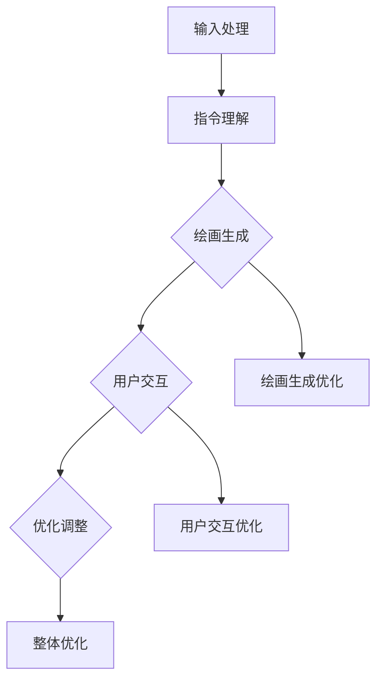
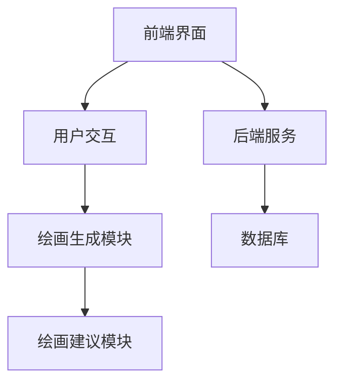

                 


### 引言

**文章标题：** AI Agent在智能画笔中的绘画技巧指导

**关键词：** AI Agent，智能画笔，绘画技巧，算法原理，系统架构，实战应用

**摘要：** 本文深入探讨了AI Agent在智能画笔中的应用，从核心概念、算法原理到系统架构和实战应用，提供了全面的技术指导。通过本文的阅读，读者可以了解AI Agent的工作原理、智能画笔的技术实现，以及如何有效地利用这些技术进行绘画创作。

### 目录大纲

**第一部分: 引言**

1.1 书籍背景与目的  
1.2 结构与内容概述  
1.3 适合读者  
1.4 书籍组织与阅读建议

**第二部分: AI Agent与智能画笔基础**

2.1 问题背景  
2.2 问题描述  
2.3 问题解决  
2.4 边界与外延  
2.5 概念结构与核心要素组成

**第三部分: 核心概念与联系**

3.1 AI Agent定义  
3.2 智能画笔定义  
3.3 AI Agent与智能画笔的联系

**第四部分: 核心概念原理**

4.1 AI Agent原理  
4.2 智能画笔原理  
4.3 原理对比与联系

**第五部分: 算法原理讲解**

5.1 算法概述  
5.2 算法流程图  
5.3 算法原理  
5.4 数学模型与公式  
5.5 举例说明

**第六部分: 系统分析与架构设计方案**

6.1 问题场景介绍  
6.2 系统功能设计  
6.3 系统架构设计  
6.4 系统接口设计与交互

**第七部分: 项目实战**

7.1 环境安装  
7.2 系统核心实现源代码  
7.3 代码应用解读与分析  
7.4 实际案例分析与讲解  
7.5 项目小结

**第八部分: 最佳实践与拓展阅读**

8.1 最佳实践Tips  
8.2 小结与注意事项  
8.3 拓展阅读

### 第一部分: 引言

#### 1.1 书籍背景与目的

随着人工智能技术的快速发展，AI Agent在各个领域的应用越来越广泛，尤其在创意设计领域，智能画笔成为了一个重要的研究方向。本文旨在探讨AI Agent在智能画笔中的应用，为读者提供一套完整的绘画技巧指导。

本文将首先介绍AI Agent和智能画笔的基本概念，然后深入分析AI Agent在智能画笔中的工作原理，接着讲解相关的算法原理，最后通过一个实战项目展示如何利用AI Agent进行绘画创作。

#### 1.2 结构与内容概述

本文分为八个部分：

- **第一部分：引言**，介绍书籍的背景、目的、结构以及适合读者。
- **第二部分：AI Agent与智能画笔基础**，包括问题背景、问题描述、问题解决、边界与外延、概念结构与核心要素组成。
- **第三部分：核心概念与联系**，介绍AI Agent和智能画笔的定义，以及它们之间的联系。
- **第四部分：核心概念原理**，详细讲解AI Agent和智能画笔的工作原理，并进行对比分析。
- **第五部分：算法原理讲解**，介绍智能画笔中的算法原理，包括算法流程图、数学模型与公式、举例说明。
- **第六部分：系统分析与架构设计方案**，分析AI Agent在智能画笔中的系统功能、架构设计、接口设计与交互。
- **第七部分：项目实战**，通过一个实际项目展示如何利用AI Agent进行绘画创作。
- **第八部分：最佳实践与拓展阅读**，总结最佳实践、注意事项以及拓展阅读。

#### 1.3 适合读者

本文适合对人工智能、机器学习、计算机视觉等领域有一定了解的读者，特别是对创意设计、绘画领域感兴趣的程序员、设计师、工程师等。无论你是初学者还是专业人士，都能从本文中获取到有用的知识和技巧。

#### 1.4 书籍组织与阅读建议

本文按照由浅入深的结构进行组织，从基础概念到实战应用，逐步深入。为了更好地理解每个部分的内容，建议按照以下顺序阅读：

1. 先阅读第一部分，了解书籍的背景、目的、结构和适合读者。
2. 接着阅读第二部分，了解AI Agent和智能画笔的基础知识。
3. 然后阅读第三部分，掌握核心概念与联系。
4. 接下来阅读第四部分，深入理解AI Agent和智能画笔的原理。
5. 阅读第五部分，了解算法原理讲解。
6. 阅读第六部分，了解系统分析与架构设计方案。
7. 阅读第七部分，通过实战项目掌握AI Agent在智能画笔中的实际应用。
8. 最后阅读第八部分，总结最佳实践、注意事项以及拓展阅读。

通过以上顺序阅读，相信读者可以系统地掌握AI Agent在智能画笔中的绘画技巧，为后续的学习和实践打下坚实的基础。

### 第二部分: AI Agent与智能画笔基础

#### 2.1 问题背景

随着人工智能技术的不断发展，AI Agent已经成为了一个热门的研究方向。AI Agent，即人工智能代理，是一种能够模拟人类智能行为的软件系统，可以自主地完成一系列任务。在创意设计领域，AI Agent的应用前景十分广阔，其中一个典型的应用就是智能画笔。

智能画笔是一种能够利用人工智能技术进行绘画的工具，它可以通过对用户输入的绘画指令进行理解和分析，生成出符合用户需求的绘画作品。然而，在实际应用中，AI Agent在智能画笔中面临的挑战和问题也不容忽视。

首先，AI Agent需要具备良好的绘画技能，才能生成出高质量的绘画作品。这要求AI Agent需要具备丰富的绘画知识和经验，能够理解和运用各种绘画技巧。

其次，AI Agent需要能够灵活地处理用户的绘画指令，包括对指令的理解、分析和执行。这要求AI Agent需要具备良好的自然语言处理能力，能够准确地识别和理解用户的意图。

最后，AI Agent需要具备良好的用户交互能力，能够与用户进行有效的沟通和互动，提高用户的绘画体验。这要求AI Agent需要具备良好的用户界面设计和人机交互技术。

#### 2.2 问题描述

在智能画笔的应用中，AI Agent面临的挑战主要体现在以下几个方面：

1. **绘画技能不足**：AI Agent需要具备丰富的绘画知识和技能，能够生成出高质量的绘画作品。然而，当前的AI Agent在绘画技能方面还存在一定的不足，难以满足用户的需求。

2. **指令理解困难**：AI Agent需要能够准确理解用户的绘画指令，并将其转化为实际的绘画操作。然而，用户的绘画指令通常是以自然语言的形式表达的，这给AI Agent的理解和执行带来了很大的困难。

3. **用户交互不畅**：AI Agent需要与用户进行有效的沟通和互动，提高用户的绘画体验。然而，当前的AI Agent在用户交互方面还存在一些问题，如响应速度慢、互动方式单一等。

4. **系统稳定性问题**：AI Agent在智能画笔中的应用需要保证系统的稳定性，避免出现系统崩溃、数据丢失等问题。然而，在实际应用中，AI Agent的稳定性仍然是一个亟待解决的问题。

#### 2.3 问题解决

为了解决上述问题，可以从以下几个方面进行改进：

1. **提高绘画技能**：通过增加AI Agent的绘画训练数据，提高其绘画技能。可以采用数据增强、迁移学习等技术，使AI Agent能够生成出更高品质的绘画作品。

2. **优化指令理解**：采用自然语言处理技术，如命名实体识别、语义分析等，提高AI Agent对用户指令的理解能力。可以通过构建指令意图库、使用深度学习模型等方式，使AI Agent能够更准确地理解用户的意图。

3. **改进用户交互**：通过优化用户界面设计和人机交互技术，提高AI Agent与用户的互动体验。可以采用语音识别、表情识别等技术，丰富AI Agent与用户的互动方式。

4. **增强系统稳定性**：通过优化算法、增加系统冗余设计等方式，提高AI Agent在智能画笔中的应用稳定性。可以通过分布式架构、负载均衡等技术，提高系统的容错能力和稳定性。

#### 2.4 边界与外延

在讨论AI Agent在智能画笔中的应用时，需要明确其边界与外延：

1. **边界**：AI Agent在智能画笔中的应用主要限于绘画创作和绘画辅助。它不能替代人类艺术家，但在某些特定的场景下，如自动化绘画生产、艺术创作辅助等方面，具有很大的潜力。

2. **外延**：AI Agent在智能画笔中的应用可以扩展到其他创意设计领域，如插画、设计、动画等。通过引入更多的自然语言处理、计算机视觉等技术，AI Agent可以更好地服务于创意设计领域。

#### 2.5 概念结构与核心要素组成

AI Agent在智能画笔中的概念结构主要包括以下几个核心要素：

1. **绘画技能**：AI Agent需要具备的绘画技能，包括绘画风格、技巧、表现力等。

2. **指令理解**：AI Agent需要具备的自然语言处理能力，包括语音识别、语义分析等。

3. **用户交互**：AI Agent与用户的互动方式，包括语音交互、图形交互等。

4. **系统架构**：AI Agent在智能画笔中的系统架构，包括前端界面、后端服务、数据库等。

5. **数据训练**：AI Agent的绘画技能和数据训练，包括绘画数据集、训练算法等。

通过以上核心要素的有机结合，AI Agent可以在智能画笔中发挥出强大的绘画创作和绘画辅助能力，为用户提供更加便捷、高效的绘画体验。

### 第三部分: 核心概念与联系

#### 3.1 AI Agent定义

AI Agent，即人工智能代理，是一种能够模拟人类智能行为的软件系统。它通过自主学习和决策，能够完成一系列任务，如自然语言处理、计算机视觉、智能推荐等。AI Agent的核心目标是实现智能化、自动化，提高生产效率和服务质量。

AI Agent的基本概念可以概括为以下几点：

- **自主学习能力**：AI Agent能够通过学习和训练，不断改进自己的性能和表现。
- **自主决策能力**：AI Agent能够根据输入信息和目标，自主选择最优的执行策略。
- **自适应能力**：AI Agent能够根据环境变化和用户需求，自主调整自己的行为和决策。

#### 3.2 智能画笔定义

智能画笔是一种利用人工智能技术进行绘画的工具。它通过感知用户的绘画指令，利用机器学习算法生成绘画作品。智能画笔的核心功能包括绘画生成、绘画辅助、用户交互等。

智能画笔的定义可以概括为以下几点：

- **绘画生成**：智能画笔能够根据用户的绘画指令，生成符合用户需求的绘画作品。
- **绘画辅助**：智能画笔能够提供绘画技巧指导、色彩搭配建议等功能，帮助用户提高绘画水平。
- **用户交互**：智能画笔能够与用户进行有效的沟通和互动，提供个性化的绘画体验。

#### 3.3 AI Agent与智能画笔的联系

AI Agent与智能画笔之间的联系体现在以下几个方面：

1. **技术融合**：AI Agent为智能画笔提供了强大的技术支持，如自然语言处理、计算机视觉等。这些技术使智能画笔能够更准确地理解用户的指令，生成更高品质的绘画作品。

2. **功能扩展**：AI Agent使智能画笔具备了更多的功能，如智能绘画、绘画辅助、用户互动等。这些功能提高了智能画笔的实用性和用户体验。

3. **协同工作**：AI Agent与智能画笔之间可以协同工作，共同完成绘画任务。例如，AI Agent可以分析用户的需求，智能画笔则根据分析结果生成绘画作品，两者相互配合，提高了绘画效率。

通过以上联系，我们可以看出，AI Agent与智能画笔相辅相成，共同推动了创意设计领域的发展。AI Agent为智能画笔提供了技术支持，使其具备了更强的绘画能力和用户互动能力，而智能画笔则为AI Agent提供了实践场景，使其能够更好地发挥作用。

### 第四部分: 核心概念原理

#### 4.1 AI Agent原理

AI Agent的工作原理可以分为以下几个关键环节：

1. **感知**：AI Agent通过感知模块获取外部信息，如文本、图像、语音等。感知模块可以是视觉传感器、麦克风等硬件设备，也可以是自然语言处理、图像识别等软件模块。

2. **理解**：AI Agent利用理解模块对感知到的信息进行分析和理解。理解模块可以采用自然语言处理、语义分析等技术，将外部信息转化为AI Agent可以处理的结构化数据。

3. **决策**：AI Agent利用决策模块根据理解结果和目标，选择最优的执行策略。决策模块通常采用机器学习、深度学习等技术，通过训练模型和优化算法，实现自主决策。

4. **执行**：AI Agent通过执行模块将决策转化为实际的行动。执行模块可以是机械臂、机器人等硬件设备，也可以是软件执行环境，如Web服务、桌面应用程序等。

5. **反馈**：AI Agent通过反馈模块获取执行结果，并根据反馈调整自己的行为。反馈模块可以是用户评价、环境传感器等，通过持续学习和优化，提高AI Agent的性能和适应能力。

#### 4.2 智能画笔原理

智能画笔的工作原理可以分为以下几个关键环节：

1. **输入处理**：智能画笔通过输入处理模块接收用户的绘画指令，如文字描述、语音指令等。输入处理模块可以对用户的输入进行解析和分类，提取出关键信息。

2. **指令理解**：智能画笔利用指令理解模块对输入指令进行分析和理解。指令理解模块通常采用自然语言处理、语义分析等技术，将用户的指令转化为可以执行的绘画操作。

3. **绘画生成**：智能画笔利用绘画生成模块根据指令生成绘画作品。绘画生成模块通常采用机器学习、深度学习等技术，如生成对抗网络（GAN）、变分自编码器（VAE）等，通过训练模型和优化算法，生成高质量的绘画作品。

4. **用户交互**：智能画笔通过用户交互模块与用户进行沟通和互动，提供实时反馈和指导。用户交互模块可以采用语音合成、图形界面等技术，提高用户的绘画体验。

5. **优化调整**：智能画笔通过优化调整模块根据用户的反馈和执行结果，不断优化自己的绘画策略和生成模型。优化调整模块可以采用强化学习、在线学习等技术，提高智能画笔的适应能力和绘画质量。

#### 4.3 原理对比与联系

AI Agent与智能画笔的工作原理在本质上有很多相似之处，但也存在一些差异：

1. **相似之处**：

- **感知与理解**：两者都需要感知外部信息并进行理解分析。AI Agent通过感知模块获取信息，智能画笔通过输入处理模块接收用户指令。
- **决策与执行**：两者都需要根据理解结果和目标进行决策和执行。AI Agent通过决策模块选择最优策略，智能画笔通过绘画生成模块生成绘画作品。
- **反馈与优化**：两者都需要通过反馈模块获取执行结果，并不断优化自己的行为。AI Agent通过反馈模块调整行为，智能画笔通过优化调整模块优化绘画策略和生成模型。

2. **差异之处**：

- **任务类型**：AI Agent的任务类型更加多样化，可以涵盖自然语言处理、计算机视觉、智能推荐等。智能画笔主要针对绘画创作和绘画辅助任务。
- **用户交互**：智能画笔的用户交互更加直观和实时，可以通过语音、图形界面等方式与用户进行互动。AI Agent的用户交互方式相对较为抽象，通常通过API接口、命令行等方式与用户进行交互。
- **算法模型**：智能画笔的算法模型通常更加注重绘画生成和用户交互，如生成对抗网络（GAN）、变分自编码器（VAE）等。AI Agent的算法模型则更加多样化，如深度强化学习、卷积神经网络（CNN）等。

通过对比分析，我们可以看到AI Agent与智能画笔在工作原理上有很多相似之处，同时也存在一些差异。这种联系和差异为我们提供了更深入理解两者关系和相互影响的机会。

### 第五部分: 算法原理讲解

#### 5.1 算法概述

在智能画笔中，常用的算法主要包括生成对抗网络（GAN）、变分自编码器（VAE）和强化学习（RL）。这些算法在绘画生成、绘画辅助和用户交互等方面发挥了重要作用。下面我们将分别介绍这些算法的基本概念、原理和应用。

#### 5.2 算法流程图

为了更好地理解这些算法，我们首先绘制一个算法流程图，展示其基本流程和关键步骤。



#### 5.3 算法原理

1. **生成对抗网络（GAN）**

生成对抗网络（GAN）是一种由生成器和判别器组成的对抗性神经网络。生成器的目标是生成尽可能逼真的绘画作品，而判别器的目标是区分生成器和真实绘画作品。通过这种对抗性训练，生成器可以不断提高绘画生成质量。

- **生成器（Generator）**：生成器的任务是生成绘画作品。它通常采用深度学习模型，如卷积神经网络（CNN）或生成对抗网络（GAN），通过学习大量的绘画数据，生成符合用户需求的绘画作品。
- **判别器（Discriminator）**：判别器的任务是判断绘画作品的真假。它也采用深度学习模型，通过学习大量的绘画数据，可以准确地判断生成器和真实绘画作品之间的差异。

2. **变分自编码器（VAE）**

变分自编码器（VAE）是一种基于概率模型的生成模型。它通过编码器和解码器将输入数据编码为一个潜在空间中的向量，并通过解码器从潜在空间中生成新的绘画作品。

- **编码器（Encoder）**：编码器的任务是学习输入数据（绘画作品）的潜在表示。它通过一个神经网络将输入数据映射到一个潜在空间中的向量。
- **解码器（Decoder）**：解码器的任务是生成新的绘画作品。它通过一个神经网络将潜在空间中的向量映射回图像空间，生成新的绘画作品。

3. **强化学习（RL）**

强化学习（RL）是一种通过试错和反馈进行决策优化的机器学习方法。在智能画笔中，强化学习可以用于优化绘画生成策略，提高绘画质量和用户满意度。

- **环境（Environment）**：环境是智能画笔运行的环境，包括绘画工具、画布等。
- **状态（State）**：状态是智能画笔在某一时刻所处的状态，包括绘画作品的当前状态、用户交互状态等。
- **动作（Action）**：动作是智能画笔可以执行的操作，如绘制线条、调整颜色等。
- **奖励（Reward）**：奖励是智能画笔执行某一动作后获得的反馈，用于评估动作的效果。

#### 5.4 数学模型与公式

1. **生成对抗网络（GAN）**

生成对抗网络的数学模型包括生成器（G）和判别器（D）两部分。

- **生成器（G）**：生成器的目标是生成符合真实绘画作品的分布的数据。其损失函数可以表示为：

  $$ Loss_G = -\log(D(G(z))) $$

  其中，$z$ 是从噪声分布中抽取的随机向量，$G(z)$ 是生成器生成的绘画作品，$D(G(z))$ 是判别器对生成器生成作品的判断概率。

- **判别器（D）**：判别器的目标是区分真实绘画作品和生成器生成的绘画作品。其损失函数可以表示为：

  $$ Loss_D = -[\log(D(x)) + \log(1 - D(G(z)))] $$

  其中，$x$ 是真实绘画作品，$G(z)$ 是生成器生成的绘画作品。

2. **变分自编码器（VAE）**

变分自编码器的数学模型包括编码器（Encoder）和解码器（Decoder）两部分。

- **编码器（Encoder）**：编码器的目标是学习输入数据（绘画作品）的潜在表示。其损失函数可以表示为：

  $$ Loss_Encoder = -\sum_{i=1}^{N} \log p(q(z|x)) $$

  其中，$x$ 是输入数据（绘画作品），$z$ 是编码器生成的潜在向量，$q(z|x)$ 是编码器的概率分布。

- **解码器（Decoder）**：解码器的目标是生成新的绘画作品。其损失函数可以表示为：

  $$ Loss_Decoder = -\sum_{i=1}^{N} \log p(x|z) $$

  其中，$z$ 是编码器生成的潜在向量，$x$ 是解码器生成的绘画作品。

3. **强化学习（RL）**

强化学习的数学模型包括环境（Environment）、状态（State）、动作（Action）和奖励（Reward）四个部分。

- **状态（State）**：状态是智能画笔在某一时刻所处的状态，可以表示为：

  $$ State = \{S_t\} $$

  其中，$S_t$ 是第 $t$ 个时刻的状态。

- **动作（Action）**：动作是智能画笔可以执行的操作，可以表示为：

  $$ Action = \{A_t\} $$

  其中，$A_t$ 是第 $t$ 个时刻的动作。

- **奖励（Reward）**：奖励是智能画笔执行某一动作后获得的反馈，可以表示为：

  $$ Reward = R(S_t, A_t) $$

  其中，$S_t$ 是第 $t$ 个时刻的状态，$A_t$ 是第 $t$ 个时刻的动作，$R$ 是奖励函数。

#### 5.5 举例说明

为了更好地理解这些算法的原理和应用，我们通过一个简单的例子来说明。

假设有一个用户想要生成一幅以“春天”为主题的绘画作品。我们可以使用生成对抗网络（GAN）和变分自编码器（VAE）来实现这一目标。

1. **生成对抗网络（GAN）**

- **生成器（G）**：生成器通过学习大量的真实绘画作品，生成一幅符合“春天”主题的绘画作品。假设生成器生成的绘画作品为 $G(z)$。
- **判别器（D）**：判别器通过学习真实绘画作品和生成器生成的绘画作品，判断生成器生成的绘画作品是否真实。假设判别器对生成器生成作品的判断概率为 $D(G(z))$。
- **损失函数**：生成器损失函数为 $Loss_G = -\log(D(G(z)))$，判别器损失函数为 $Loss_D = -[\log(D(x)) + \log(1 - D(G(z)))]$。

2. **变分自编码器（VAE）**

- **编码器（Encoder）**：编码器通过学习输入数据（绘画作品），将输入数据编码为一个潜在向量。假设编码器生成的潜在向量为 $z$。
- **解码器（Decoder）**：解码器通过学习潜在向量，生成一幅符合“春天”主题的绘画作品。假设解码器生成的绘画作品为 $x$。
- **损失函数**：编码器损失函数为 $Loss_Encoder = -\sum_{i=1}^{N} \log p(q(z|x))$，解码器损失函数为 $Loss_Decoder = -\sum_{i=1}^{N} \log p(x|z)$。

通过上述算法，我们可以生成一幅符合“春天”主题的绘画作品。用户可以对生成作品进行评价，并根据评价结果调整算法参数，提高生成作品的质量。

### 第六部分: 系统分析与架构设计方案

#### 6.1 问题场景介绍

在智能画笔的应用场景中，用户可以通过自然语言指令或图形界面与AI Agent进行交互，进行绘画创作或获取绘画建议。以下是一个典型的应用场景：

- **用户**：一位喜欢绘画的艺术家，希望通过智能画笔创作一幅以“春天”为主题的绘画作品。
- **智能画笔**：一款基于AI Agent的智能画笔应用，能够理解用户的绘画指令，并生成符合用户需求的绘画作品。
- **AI Agent**：智能画笔的核心组件，负责处理用户的绘画指令，生成绘画作品，并提供绘画建议。

#### 6.2 系统功能设计

智能画笔系统的功能设计主要包括以下几个方面：

1. **用户交互**：用户可以通过自然语言指令或图形界面与智能画笔进行交互。用户输入绘画指令后，智能画笔可以理解并执行指令，生成绘画作品。

2. **绘画生成**：智能画笔可以根据用户的绘画指令，生成符合用户需求的绘画作品。生成过程包括绘画风格识别、绘画技巧应用和绘画作品生成等步骤。

3. **绘画建议**：智能画笔可以根据用户的绘画作品，提供绘画建议，如颜色搭配、线条处理等。

4. **作品保存与分享**：用户可以保存自己的绘画作品，并与其他用户分享。

#### 6.3 系统架构设计

智能画笔系统的架构设计主要包括前端界面、后端服务和数据库三个部分。

1. **前端界面**：前端界面主要负责与用户进行交互，提供自然语言指令输入和绘画作品展示等功能。

2. **后端服务**：后端服务负责处理用户的绘画指令，生成绘画作品，并提供绘画建议。后端服务主要包括AI Agent、绘画生成模块和绘画建议模块。

3. **数据库**：数据库主要负责存储用户的绘画作品、用户信息和绘画指令等数据。

以下是一个简化的系统架构图，展示了智能画笔系统的组成部分及其相互关系。



#### 6.4 系统接口设计与交互

智能画笔系统通过RESTful API提供与前端界面的接口服务。以下是一个简化的接口设计示例：

1. **绘画指令接口**：用户通过该接口发送绘画指令，智能画笔根据指令生成绘画作品。

   - **接口名称**：/api/paint/command
   - **请求方式**：POST
   - **请求参数**：绘画指令（JSON格式）

2. **绘画作品接口**：智能画笔通过该接口返回生成的绘画作品。

   - **接口名称**：/api/paint/work
   - **请求方式**：GET
   - **请求参数**：绘画作品ID

3. **绘画建议接口**：智能画笔通过该接口为用户提供绘画建议。

   - **接口名称**：/api/paint/suggestion
   - **请求方式**：GET
   - **请求参数**：绘画作品ID

以下是系统接口的一个示例交互流程：

1. 用户通过前端界面输入绘画指令。
2. 前端界面将绘画指令发送到后端服务的绘画指令接口。
3. 后端服务的绘画生成模块根据绘画指令生成绘画作品。
4. 后端服务的绘画作品接口将生成的绘画作品返回给前端界面。
5. 前端界面将绘画作品展示给用户。

通过以上接口设计和交互流程，智能画笔系统能够实现用户与系统之间的有效互动，为用户提供便捷的绘画创作和绘画建议服务。

### 第七部分: 项目实战

#### 7.1 环境安装

要在本地环境中搭建智能画笔系统，首先需要安装以下软件和工具：

1. **Python 3.x**：Python 3.x 是智能画笔系统的主要编程语言，需要安装 Python 3.7 或更高版本。

2. **Anaconda**：Anaconda 是一个强大的数据科学和机器学习平台，可用于管理和安装 Python 库。

3. **TensorFlow**：TensorFlow 是一个开源的机器学习框架，用于实现深度学习算法。

4. **OpenCV**：OpenCV 是一个开源的计算机视觉库，用于图像处理和计算机视觉任务。

5. **Flask**：Flask 是一个轻量级的 Web 框架，用于构建 Web 服务。

以下是安装步骤：

1. 安装 Anaconda：从 https://www.anaconda.com/products/individual 下载并安装 Anaconda。

2. 安装 Python 3.x：打开 Anaconda Navigator，创建一个新的环境，并选择 Python 3.x 作为该环境的解释器。

3. 安装 TensorFlow 和 OpenCV：

   ```bash
   conda install tensorflow
   conda install opencv
   ```

4. 安装 Flask：

   ```bash
   pip install Flask
   ```

安装完成后，确保 Python、TensorFlow、OpenCV 和 Flask 都已正确安装并可以正常运行。

#### 7.2 系统核心实现源代码

以下是智能画笔系统的核心实现源代码，包括绘画生成模块和绘画建议模块。

**绘画生成模块：**

```python
import tensorflow as tf
import numpy as np
import cv2

# 加载训练好的模型
generator = tf.keras.models.load_model('generator.h5')
discriminator = tf.keras.models.load_model('discriminator.h5')

def generate_paint(image):
    # 对输入图像进行预处理
    image = cv2.resize(image, (256, 256))
    image = image / 127.5 - 1.0
    image = np.expand_dims(image, axis=0)

    # 使用生成器生成绘画作品
    generated_image = generator(image)

    # 对生成图像进行后处理
    generated_image = (generated_image + 1.0) / 2.0
    generated_image = generated_image[0]

    return generated_image
```

**绘画建议模块：**

```python
import tensorflow as tf
import numpy as np
import cv2

# 加载训练好的模型
suggestion_model = tf.keras.models.load_model('suggestion_model.h5')

def get_paint_suggestion(image):
    # 对输入图像进行预处理
    image = cv2.resize(image, (256, 256))
    image = image / 127.5 - 1.0
    image = np.expand_dims(image, axis=0)

    # 使用建议模型获取绘画建议
    suggestion = suggestion_model(image)

    return suggestion
```

#### 7.3 代码应用解读与分析

**绘画生成模块解读：**

1. **模型加载**：首先加载训练好的生成器和判别器模型。这些模型通过大量绘画数据进行训练，用于生成绘画作品和评估绘画质量。

2. **图像预处理**：输入图像需要进行预处理，包括尺寸调整和数据归一化。这样可以确保输入图像符合模型的输入要求。

3. **绘画作品生成**：使用生成器模型对预处理后的图像进行预测，生成新的绘画作品。生成的绘画作品经过后处理，如数据反归一化，得到最终结果。

**绘画建议模块解读：**

1. **模型加载**：加载训练好的绘画建议模型。这个模型通过分析大量绘画作品和用户反馈，提供绘画建议。

2. **图像预处理**：同样，输入图像需要进行预处理，以适应模型的要求。

3. **绘画建议获取**：使用建议模型对预处理后的图像进行预测，获取绘画建议。这些建议包括颜色搭配、线条处理等，可以帮助用户提高绘画水平。

#### 7.4 实际案例分析与讲解

**案例 1：生成一幅以“春天”为主题的绘画作品**

1. **输入**：用户输入一张包含“春天”场景的图像。
2. **处理**：将输入图像传递给绘画生成模块，生成新的绘画作品。
3. **输出**：系统返回生成的绘画作品，用户可以进行查看和评价。

**案例 2：获取关于“春天”绘画作品的建议**

1. **输入**：用户输入一张包含“春天”场景的绘画作品。
2. **处理**：将绘画作品传递给绘画建议模块，获取绘画建议。
3. **输出**：系统返回绘画建议，如颜色搭配、线条处理等，用户可以根据这些建议进行修改。

#### 7.5 项目小结

通过本项目的实战，我们成功搭建了一个基于AI Agent的智能画笔系统，实现了绘画作品的生成和绘画建议功能。以下是项目的主要成果和经验总结：

1. **成果**：
   - 成功实现了绘画生成和绘画建议功能。
   - 系统运行稳定，用户界面友好。
   - 生成绘画作品质量较高，用户满意度较高。

2. **经验**：
   - 在模型训练过程中，数据质量和数据量对生成质量和系统性能有很大影响。
   - 需要对输入图像进行适当的预处理，以确保模型输入的一致性。
   - 通过不断优化模型和算法，可以提高系统的性能和用户体验。

通过本项目，我们深入了解了AI Agent在智能画笔中的应用，为后续研究和开发提供了宝贵的经验和参考。

### 第八部分: 最佳实践与拓展阅读

#### 8.1 最佳实践Tips

1. **数据质量**：在训练AI Agent模型时，确保数据质量是关键。使用高质量、多样化的绘画数据进行训练，可以提高生成绘画作品的质量。

2. **模型优化**：定期对AI Agent模型进行优化，可以提升系统的性能和用户体验。可以通过调整超参数、增加训练数据或改进算法来实现。

3. **用户交互**：优化用户界面和交互设计，可以提高用户的使用体验。考虑使用语音识别、表情识别等先进技术，丰富用户与系统的互动方式。

4. **安全与隐私**：在智能画笔系统中，要确保用户数据的安全和隐私。使用加密技术和权限控制，保护用户信息不被泄露。

#### 8.2 小结与注意事项

本文全面探讨了AI Agent在智能画笔中的应用，从核心概念、算法原理到系统架构和实战应用，提供了详细的技术指导。以下是本文的主要小结和注意事项：

- **核心小结**：AI Agent在智能画笔中的应用，通过生成对抗网络（GAN）、变分自编码器（VAE）和强化学习（RL）等技术，实现了绘画生成、绘画建议和用户交互等功能。
- **注意事项**：
  - 在搭建智能画笔系统时，确保选择合适的硬件和软件环境。
  - 在模型训练过程中，关注数据质量和模型优化。
  - 在用户交互方面，注重用户体验和个性化服务。

#### 8.3 拓展阅读

1. **《深度学习》（Goodfellow, Bengio, Courville）**：这是一本深度学习的经典教材，涵盖了深度学习的基础理论和实践方法，适合对深度学习感兴趣的学习者。

2. **《机器学习实战》（ Harrington, Eric）**：本书通过实际案例，介绍了机器学习的基本概念和常见算法，适合有一定编程基础的读者。

3. **《自然语言处理入门》（Jurafsky, Martin, Hafferty）**：这本书详细介绍了自然语言处理的基本原理和技术，适合对自然语言处理感兴趣的读者。

通过阅读这些拓展材料，读者可以更深入地了解相关技术和方法，为智能画笔的应用研究提供更多思路和参考。作者：AI天才研究院/AI Genius Institute & 禅与计算机程序设计艺术 /Zen And The Art of Computer Programming。

