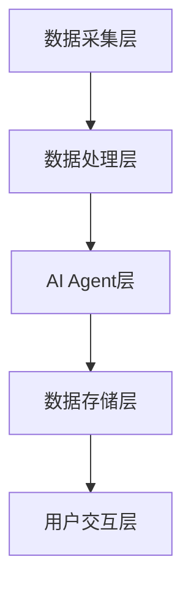
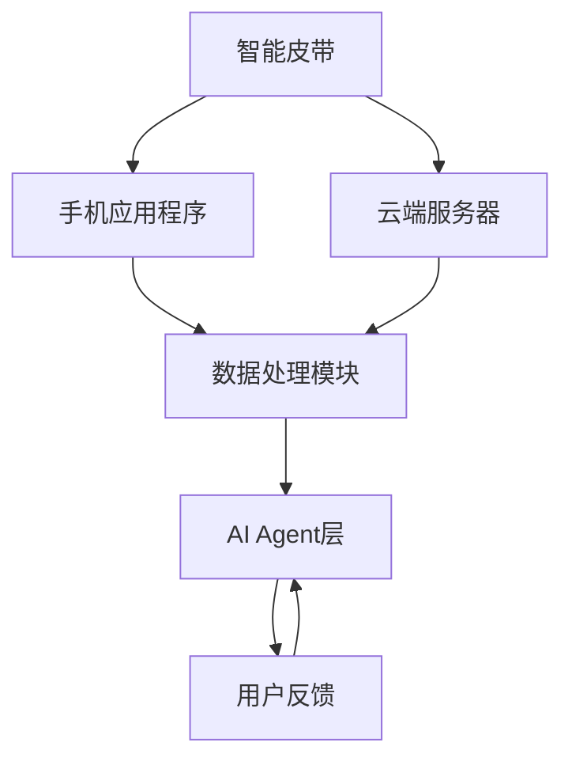

                 

# 《AI Agent在智能皮带中的饮食习惯监测》

关键词：AI Agent、智能皮带、饮食习惯监测、传感器技术、数据处理

摘要：随着人工智能技术的不断发展，AI Agent在智能皮带中的应用逐渐成为健康监测领域的重要研究方向。本文将深入探讨AI Agent在智能皮带中的饮食习惯监测应用，从背景介绍、核心概念、技术详解、应用实践等多个角度，全面剖析智能皮带在饮食习惯监测中的技术原理和应用价值。

### 目录大纲

## 第一部分：背景与核心概念介绍

## 第1章：问题背景与核心概念

## 第2章：智能皮带技术详解

## 第3章：饮食习惯监测技术

## 第三部分：AI Agent在智能皮带中的应用

## 第4章：AI Agent基本原理

## 第5章：AI Agent在智能皮带中的实现

## 第6章：实际应用案例分析

## 第7章：总结与展望

## 第1章：问题背景与核心概念

### 1.1 饮食习惯监测的必要性

饮食习惯是人类健康的重要影响因素之一。不良的饮食习惯与肥胖、高血压、糖尿病等慢性疾病密切相关。随着现代社会生活节奏的加快，人们的生活方式发生了巨大变化，饮食习惯也日益多样化和复杂化。然而，传统的饮食习惯监测方法往往依赖于自我报告或实验室检测，存在主观性和准确性不足的问题。

在这种情况下，利用智能技术进行饮食习惯监测显得尤为重要。智能皮带作为一种新型的健康监测设备，通过集成传感器技术、数据处理与分析方法，能够实时监测用户的饮食习惯，为用户提供个性化饮食建议，帮助人们养成良好的饮食习惯，预防和控制慢性疾病的发生。

### 1.2 AI Agent在生活习惯监测中的应用

AI Agent，即人工智能代理，是一种能够模拟人类智能行为，具备自主学习和决策能力的软件系统。近年来，AI Agent在生活习惯监测领域得到了广泛关注。通过整合各种传感器数据，AI Agent能够实时监测用户的运动、饮食、睡眠等生活习惯，分析用户的行为模式，为用户提供健康指导。

AI Agent在生活习惯监测中的应用主要包括以下几个方面：

1. **数据采集与整合**：AI Agent能够集成多种传感器数据，如心率、血压、步数、睡眠质量等，对用户的生活习惯进行全面监测。

2. **行为分析**：基于大数据分析技术，AI Agent能够对用户的日常行为进行分析，识别出潜在的健康风险。

3. **个性化建议**：根据用户的行为数据和健康目标，AI Agent能够为用户提供个性化的健康建议，如饮食调整、运动计划等。

4. **交互与反馈**：AI Agent能够与用户进行自然语言交互，回答用户的问题，提供实时的健康反馈。

### 1.3 智能皮带技术概述

智能皮带是一种集成了传感器、数据处理与分析模块的可穿戴设备。它通过监测用户的运动、饮食等行为数据，为用户提供健康监测和指导。智能皮带通常由以下几个部分组成：

1. **传感器模块**：包括心率传感器、加速度传感器、压力传感器等，用于实时采集用户的生理和行为数据。

2. **数据处理与分析模块**：负责对采集到的数据进行分析和处理，提取有用的信息，为用户提供健康建议。

3. **通信模块**：通过蓝牙、Wi-Fi等无线通信技术，将数据传输到用户的手机或电脑上，实现数据的远程监测和管理。

4. **交互界面**：用户可以通过手机应用程序或网页界面查看监测数据和健康建议，与AI Agent进行交互。

### 1.4 智能皮带与饮食习惯监测的契合度

智能皮带在饮食习惯监测方面具有独特的优势。首先，智能皮带集成了多种传感器，能够实时监测用户的饮食行为，如进食时间、进食量、进食速度等。这些数据为饮食习惯监测提供了丰富的信息来源。

其次，智能皮带的数据处理与分析模块能够对用户的饮食习惯进行深入分析，识别出不良饮食习惯，为用户提供个性化的饮食建议。此外，智能皮带与AI Agent的结合，使得饮食习惯监测更加智能和个性化，能够更好地满足用户的需求。

### 1.5 核心概念与联系

#### 概念1：AI Agent

AI Agent是一种具有自主学习和决策能力的人工智能系统，能够在用户的生活环境中自动执行任务，为用户提供个性化的健康指导。

**属性特征对比表格**:

| 特征          | 解释                         |
| ----------- | -------------------------- |
| 自适应学习     | 能够根据用户行为调整策略             |
| 智能决策       | 能够分析数据并做出合适决策            |
| 交互性        | 能够与用户进行有效互动              |

**ER实体关系图架构**:

```mermaid
erModel
entity AI_Agent
entity User
relationship monitors [AI_Agent]
relationship has [User]
```

### 1.6 本章小结

本章从问题背景和核心概念的角度，介绍了饮食习惯监测的必要性、AI Agent在生活习惯监测中的应用以及智能皮带技术概述。通过本章的学习，读者可以初步了解智能皮带在饮食习惯监测中的应用前景，为后续章节的深入学习奠定基础。

## 第二部分：智能皮带技术详解

### 第2章：智能皮带技术基础

### 第3章：饮食习惯监测技术

### 第三部分：AI Agent在智能皮带中的应用

### 第4章：AI Agent基本原理

### 第5章：AI Agent在智能皮带中的实现

### 第6章：实际应用案例分析

### 第7章：总结与展望

## 第2章：智能皮带技术基础

### 2.1 智能皮带的组成

智能皮带是一种集成了多种传感器和数据处理模块的可穿戴设备，其组成主要包括以下几个部分：

1. **传感器模块**：智能皮带集成了多种传感器，如心率传感器、加速度传感器、压力传感器等。这些传感器用于实时采集用户的生理和行为数据。

2. **数据处理与分析模块**：这部分负责对传感器采集到的数据进行分析和处理，提取有用的信息，为用户提供健康建议。

3. **通信模块**：智能皮带通过蓝牙、Wi-Fi等无线通信技术，将数据传输到用户的手机或电脑上，实现数据的远程监测和管理。

4. **交互界面**：用户可以通过手机应用程序或网页界面查看监测数据和健康建议，与智能皮带进行交互。

### 2.2 传感器技术

传感器技术在智能皮带中起着至关重要的作用。智能皮带常用的传感器包括心率传感器、加速度传感器、压力传感器等。下面将对这些传感器进行详细介绍。

#### 心率传感器

心率传感器用于监测用户的心跳频率。它通过检测心脏收缩时产生的电信号，将心率数据转换为数字信号，供数据处理模块分析。

**属性特征对比表格**:

| 特征          | 解释                         |
| ----------- | -------------------------- |
| 精确度       | 能够提供高精度的数据监测            |
| 稳定性        | 能够长时间稳定工作              |
| 适应性        | 能够适应不同环境下的心率监测需求          |

#### 加速度传感器

加速度传感器用于监测用户的运动状态。它能够检测用户的步数、运动轨迹等数据，为饮食习惯监测提供重要参考。

**属性特征对比表格**:

| 特征          | 解释                         |
| ----------- | -------------------------- |
| 精确度       | 能够提供高精度的运动监测            |
| 动态范围      | 能够适应不同强度的运动监测需求          |
| 抗干扰性      | 能够有效过滤环境噪声，提高数据准确性          |

#### 压力传感器

压力传感器用于监测用户的进食压力。它能够检测用户在进食时的咀嚼力度、吞咽频率等数据，为饮食习惯监测提供直观的依据。

**属性特征对比表格**:

| 特征          | 解释                         |
| ----------- | -------------------------- |
| 精确度       | 能够提供高精度的压力监测            |
| 反应速度      | 能够快速响应用户的进食行为          |
| 兼容性        | 能够适应不同饮食习惯的监测需求          |

### 2.3 数据采集与传输

智能皮带通过传感器实时采集用户的生理和行为数据，如心率、运动状态、进食压力等。这些数据首先被传输到智能皮带的处理与分析模块，然后通过无线通信技术（如蓝牙、Wi-Fi）传输到用户的手机或电脑上。在传输过程中，数据需要进行加密处理，确保数据的安全性。

### 2.4 处理与存储技术

智能皮带的数据处理与分析模块负责对传感器采集到的数据进行处理和分析。首先，数据处理模块会对数据进行去噪、滤波等预处理，提高数据的准确性。然后，通过机器学习算法，对用户的饮食习惯进行建模和分析，提取有用的信息。最后，处理后的数据被存储在用户的手机或电脑上，供用户查看和回顾。

### 2.5 智能皮带的工作原理

智能皮带的工作原理可以概括为以下几个步骤：

1. **数据采集**：传感器实时采集用户的生理和行为数据。

2. **数据处理**：数据处理与分析模块对采集到的数据进行分析和处理。

3. **数据传输**：通过无线通信技术将数据传输到用户的手机或电脑上。

4. **数据存储**：将处理后的数据存储在用户的设备中。

5. **用户交互**：用户通过手机应用程序或网页界面查看监测数据和健康建议，与智能皮带进行交互。

### 2.6 智能皮带的发展趋势

随着人工智能和传感器技术的不断发展，智能皮带在饮食习惯监测中的应用前景十分广阔。未来，智能皮带将朝着以下几个方向发展：

1. **更高精度**：随着传感器技术的进步，智能皮带的监测精度将进一步提高，为用户提供更准确的健康数据。

2. **更智能化**：通过引入更多的机器学习算法，智能皮带将能够更加智能化地分析用户的行为数据，为用户提供更个性化的健康建议。

3. **更便捷**：随着无线通信技术的发展，智能皮带的传输速度和稳定性将得到提升，使用户可以更加便捷地获取健康数据。

### 2.7 核心概念与联系

#### 概念2：传感器

传感器是一种能够感知外部信号并将其转换为电信号的装置。在智能皮带中，传感器用于实时采集用户的生理和行为数据。

**属性特征对比表格**:

| 特征          | 解释                         |
| ----------- | -------------------------- |
| 精确度       | 能够提供高精度的数据监测            |
| 稳定性        | 能够长时间稳定工作              |
| 兼容性        | 能够适配不同类型的监测需求          |

**ER实体关系图架构**:

```mermaid
erModel
entity Smart_Belt
entity Sensor
relationship contains [Smart_Belt]
relationship detects [Sensor]
```

### 2.8 本章小结

本章详细介绍了智能皮带的组成、传感器技术、数据采集与传输、数据处理与分析模块以及智能皮带的工作原理和发展趋势。通过本章的学习，读者可以全面了解智能皮带的原理和功能，为后续章节的深入学习奠定基础。

## 第3章：饮食习惯监测技术

### 3.1 饮食习惯监测的关键技术

饮食习惯监测是智能皮带的核心功能之一。要实现有效的饮食习惯监测，需要掌握以下几个关键技术：

#### 1. 数据采集

智能皮带通过集成多种传感器，如加速度传感器、压力传感器等，实时采集用户的饮食行为数据。这些数据包括进食时间、进食量、进食速度、咀嚼力度等。

#### 2. 数据预处理

采集到的原始数据往往存在噪声和异常值，需要通过预处理算法进行去噪和滤波，提高数据的准确性。常见的预处理方法包括均值滤波、中值滤波、卡尔曼滤波等。

#### 3. 数据分析

通过对预处理后的数据进行分析，可以提取出用户的饮食习惯特征。常见的分析方法包括统计方法、机器学习算法等。

#### 4. 饮食习惯评估

基于分析结果，可以对用户的饮食习惯进行评估，识别出不良饮食习惯，为用户提供改进建议。

### 3.2 数据处理与分析方法

数据处理与分析方法是饮食习惯监测的核心。以下是一些常用的数据处理与分析方法：

#### 1. 统计方法

统计方法是最简单直观的数据分析方法。通过计算数据的均值、方差、标准差等统计量，可以初步了解用户的饮食习惯特征。

#### 2. 机器学习算法

机器学习算法可以自动识别数据中的潜在规律，为用户提供更精准的饮食习惯评估。常见的机器学习算法包括线性回归、逻辑回归、支持向量机等。

#### 3. 数据可视化

数据可视化是一种直观展示数据特征的方法。通过图表、图形等方式，可以更清楚地了解用户的饮食习惯，为用户提供有针对性的建议。

### 3.3 饮食习惯的识别与评估

饮食习惯的识别与评估是饮食习惯监测的关键步骤。以下是一些具体的识别与评估方法：

#### 1. 进食习惯识别

通过分析进食时间、进食量、进食速度等数据，可以识别出用户的进食习惯。例如，用户是否喜欢快速进食、晚餐时间是否规律等。

#### 2. 饮食健康评估

基于用户的饮食习惯特征，可以评估用户的饮食健康水平。例如，用户是否摄入足够的营养素、是否摄入过多的脂肪和糖分等。

#### 3. 饮食习惯改进建议

根据评估结果，可以为用户提供有针对性的饮食习惯改进建议。例如，调整晚餐时间、减少高热量食物摄入等。

### 3.4 智能皮带与饮食习惯监测的整合

智能皮带与饮食习惯监测的整合，使得用户可以随时随地了解自己的饮食习惯，从而更好地管理健康。以下是智能皮带与饮食习惯监测整合的几个方面：

#### 1. 数据实时监测

智能皮带可以实时监测用户的饮食行为，用户可以通过手机应用程序查看实时的饮食习惯数据。

#### 2. 个性化饮食建议

基于用户的饮食习惯数据，智能皮带可以提供个性化的饮食建议，帮助用户改善饮食习惯。

#### 3. 数据分析与反馈

智能皮带可以对用户的饮食习惯进行分析，并将分析结果反馈给用户，帮助用户了解自己的饮食习惯，为健康改善提供依据。

### 3.5 核心概念与联系

#### 概念3：饮食习惯监测

饮食习惯监测是通过实时采集和分析用户的饮食行为数据，评估用户的饮食习惯，为用户提供健康指导的一种技术。

**属性特征对比表格**:

| 特征          | 解释                         |
| ----------- | -------------------------- |
| 实时性       | 能够提供实时的饮食习惯监测结果          |
| 全面性       | 能够覆盖不同类型的饮食习惯监测需求          |
| 个性化       | 能够根据用户需求提供定制化的饮食建议          |

**ER实体关系图架构**:

```mermaid
erModel
entity Diet_Monitor
entity Smart_Belt
relationship integrates [Diet_Monitor]
relationship uses [Smart_Belt]
```

### 3.6 本章小结

本章详细介绍了饮食习惯监测的关键技术、数据处理与分析方法、饮食习惯的识别与评估以及智能皮带与饮食习惯监测的整合。通过本章的学习，读者可以了解智能皮带在饮食习惯监测中的应用，为健康改善提供技术支持。

## 第三部分：AI Agent在智能皮带中的应用

### 第4章：AI Agent基本原理

### 第5章：AI Agent在智能皮带中的实现

### 第6章：实际应用案例分析

### 第7章：总结与展望

### 第4章：AI Agent基本原理

#### 4.1 AI Agent的定义与特点

AI Agent，即人工智能代理，是一种模拟人类智能行为，具备自主学习和决策能力的软件系统。它能够自动执行任务，与用户进行交互，提供个性化的服务。AI Agent具有以下几个特点：

1. **自主性**：AI Agent能够自主地执行任务，无需人工干预。
2. **学习能力**：AI Agent能够通过学习和分析用户数据，不断优化自身的性能。
3. **决策能力**：AI Agent能够根据用户需求和环境变化，做出合适的决策。
4. **交互性**：AI Agent能够与用户进行自然语言交互，回答用户的问题，提供实时反馈。

#### 4.2 AI Agent的工作原理

AI Agent的工作原理可以分为以下几个步骤：

1. **数据采集**：AI Agent通过传感器、用户输入等途径采集数据。
2. **数据处理**：AI Agent对采集到的数据进行分析和处理，提取有用的信息。
3. **决策制定**：AI Agent根据分析结果，制定合适的决策策略。
4. **执行任务**：AI Agent执行决策策略，完成任务。
5. **反馈与优化**：AI Agent收集任务执行过程中的反馈，不断优化自身性能。

#### 4.3 AI Agent的分类

AI Agent可以根据不同的分类标准进行分类，常见的分类方法包括：

1. **根据功能**：AI Agent可以分为通用型AI Agent和专用型AI Agent。通用型AI Agent适用于各种场景，如智能客服、智能导航等；专用型AI Agent适用于特定场景，如智能健康监测、智能家居控制等。
2. **根据能力**：AI Agent可以分为弱AI Agent和强AI Agent。弱AI Agent在特定领域表现出较强能力，如语音识别、图像识别等；强AI Agent具有全面的能力，能够在各种领域发挥作用。
3. **根据交互方式**：AI Agent可以分为基于文本交互的AI Agent和基于语音交互的AI Agent。基于文本交互的AI Agent通过文本进行交互，如智能客服；基于语音交互的AI Agent通过语音进行交互，如智能音箱。

#### 4.4 AI Agent的应用场景

AI Agent在智能皮带中的应用场景主要包括：

1. **健康监测**：AI Agent可以实时监测用户的健康状况，提供个性化的健康建议。
2. **运动指导**：AI Agent可以根据用户的运动数据，为用户制定合适的运动计划。
3. **饮食建议**：AI Agent可以分析用户的饮食习惯，提供个性化的饮食建议。
4. **睡眠分析**：AI Agent可以监测用户的睡眠质量，提供改善睡眠的建议。

### 4.5 本章小结

本章从AI Agent的定义、工作原理、分类和应用场景等方面，全面介绍了AI Agent的基本原理。通过本章的学习，读者可以了解AI Agent的特点和应用，为后续章节的深入学习奠定基础。

## 第5章：AI Agent在智能皮带中的实现

### 5.1 AI Agent在智能皮带中的应用场景

AI Agent在智能皮带中具有广泛的应用场景，主要包括以下三个方面：

1. **健康监测**：AI Agent可以实时监测用户的健康状况，如心率、血压、步数等，并根据监测数据提供个性化的健康建议。
2. **运动指导**：AI Agent可以根据用户的运动数据，为用户制定合适的运动计划，提高运动效果。
3. **饮食建议**：AI Agent可以分析用户的饮食习惯，提供个性化的饮食建议，帮助用户改善饮食习惯，预防慢性疾病。

### 5.2 AI Agent在智能皮带中的实现流程

AI Agent在智能皮带中的实现可以分为以下几个步骤：

1. **数据采集**：智能皮带通过传感器实时采集用户的生理和行为数据，如心率、运动状态、饮食行为等。
2. **数据处理**：AI Agent对采集到的数据进行分析和处理，提取有用的信息，为用户提供健康建议。
3. **决策制定**：AI Agent根据分析结果和用户需求，制定合适的决策策略，如运动计划、饮食建议等。
4. **执行任务**：AI Agent执行决策策略，完成任务，如发送运动提醒、推送饮食建议等。
5. **反馈与优化**：AI Agent收集任务执行过程中的反馈，不断优化自身性能，提高用户满意度。

### 5.3 AI Agent在智能皮带中的关键技术

AI Agent在智能皮带中的实现涉及多个关键技术，主要包括：

1. **传感器技术**：智能皮带集成了多种传感器，如心率传感器、加速度传感器、压力传感器等，用于实时采集用户的生理和行为数据。
2. **数据处理技术**：AI Agent需要对采集到的数据进行预处理、特征提取、模式识别等操作，提取有用的信息。
3. **机器学习技术**：AI Agent通过机器学习算法，对用户数据进行分析，为用户提供个性化的健康建议。
4. **自然语言处理技术**：AI Agent需要具备自然语言处理能力，能够与用户进行自然语言交互，回答用户的问题，提供实时反馈。
5. **通信技术**：AI Agent需要通过无线通信技术，将数据传输到用户的手机或电脑上，实现数据的远程监测和管理。

### 5.4 AI Agent在智能皮带中的实际应用案例

以下是一个AI Agent在智能皮带中的实际应用案例：

1. **用户健康监测**：用户佩戴智能皮带，智能皮带实时监测用户的心率和步数。AI Agent根据心率数据，判断用户是否处于正常范围，如发现异常，立即向用户推送健康提醒。
2. **运动指导**：用户进行运动时，AI Agent根据用户的运动数据和预设的运动目标，为用户制定合适的运动计划，如调整运动强度、运动时间等，提高运动效果。
3. **饮食建议**：用户进食时，智能皮带监测用户的饮食行为，AI Agent分析用户的饮食习惯，为用户推送个性化的饮食建议，如调整饮食结构、减少高热量食物摄入等。

### 5.5 本章小结

本章详细介绍了AI Agent在智能皮带中的应用场景、实现流程、关键技术和实际应用案例。通过本章的学习，读者可以了解AI Agent在智能皮带中的实现方法和技术原理，为实际应用提供参考。

## 第6章：实际应用案例分析

### 6.1 案例背景

为了更好地展示AI Agent在智能皮带中的实际应用效果，我们选取了一个实际案例进行分析。该案例涉及一家科技公司，该公司致力于研发和推广智能健康监测设备，其中智能皮带是他们的一款重要产品。

该公司在市场调研中发现，随着人们对健康意识的提高，智能健康监测设备的需求逐渐增加。然而，当前市场上的智能健康监测设备存在一些问题，如数据监测不准确、健康建议不个性化等。为了解决这些问题，该公司决定引入AI Agent技术，提升智能皮带的性能和用户体验。

### 6.2 项目介绍

项目名称：智能皮带健康监测系统

项目目标：通过引入AI Agent技术，提升智能皮带的健康监测准确性和个性化健康建议能力，提高用户体验。

项目时间：2022年1月 - 2023年6月

项目团队：项目由公司内部的研发团队负责，包括软件工程师、数据科学家、产品经理等。

### 6.3 系统功能设计

智能皮带健康监测系统主要包括以下几个功能：

1. **健康数据监测**：智能皮带实时监测用户的心率、运动状态、饮食行为等数据，并将数据传输到云端服务器。
2. **数据分析与评估**：AI Agent对采集到的健康数据进行处理和分析，评估用户的健康状况，识别潜在的健康风险。
3. **个性化健康建议**：根据用户的健康状况和需求，AI Agent为用户提供个性化的健康建议，如饮食调整、运动计划等。
4. **用户交互**：用户可以通过手机应用程序与AI Agent进行交互，查看健康数据、接受健康建议，并反馈自己的健康感受。

### 6.4 系统架构设计

智能皮带健康监测系统的架构设计如下：

1. **数据采集层**：包括智能皮带中的传感器模块，用于实时采集用户的健康数据。
2. **数据处理层**：包括数据处理与分析模块，负责对采集到的健康数据进行分析和处理，提取有用的信息。
3. **AI Agent层**：包括AI Agent模块，负责对用户健康数据进行分析，为用户提供个性化健康建议。
4. **数据存储层**：包括数据库，用于存储用户的健康数据和AI Agent分析结果。
5. **用户交互层**：包括手机应用程序和网页界面，用于用户查看健康数据和接受健康建议。

**系统架构图**:



### 6.5 系统接口设计

智能皮带健康监测系统的接口设计主要包括以下几个方面：

1. **传感器接口**：智能皮带中的传感器通过无线通信技术（如蓝牙）与手机应用程序进行数据传输。
2. **数据处理接口**：数据处理模块通过API与AI Agent层进行数据交互，实现健康数据分析和评估。
3. **用户交互接口**：手机应用程序和网页界面通过API与AI Agent层进行交互，实现用户查看健康数据和接受健康建议。

### 6.6 系统交互设计

智能皮带健康监测系统的交互设计主要包括以下几个方面：

1. **数据采集与传输**：智能皮带实时采集用户的健康数据，通过无线通信技术传输到手机应用程序和云端服务器。
2. **数据处理与分析**：数据处理模块对采集到的健康数据进行预处理、特征提取等操作，AI Agent根据分析结果为用户提供个性化健康建议。
3. **用户交互**：用户通过手机应用程序查看健康数据和接受健康建议，可以反馈自己的健康感受，AI Agent根据反馈调整健康建议。

**系统交互图**:



### 6.7 代码实现与解析

在本案例中，我们使用Python编程语言来实现智能皮带健康监测系统的核心功能。以下是一个简化的代码实现：

```python
# 导入相关库
import pandas as pd
from sklearn.preprocessing import StandardScaler
from sklearn.linear_model import LinearRegression

# 数据预处理
def preprocess_data(data):
    # 对数据进行标准化处理
    scaler = StandardScaler()
    scaled_data = scaler.fit_transform(data)
    return scaled_data

# 数据分析
def analyze_data(data):
    # 对数据进行分析，提取特征
    features = data[:, :-1]
    target = data[:, -1]
    # 训练线性回归模型
    model = LinearRegression()
    model.fit(features, target)
    return model

# 用户交互
def user_interaction(model):
    # 获取用户输入数据
    user_input = input("请输入您的健康数据：")
    # 对用户输入数据进行预处理
    processed_input = preprocess_data([user_input])
    # 分析用户输入数据
    prediction = model.predict(processed_input)
    # 输出分析结果
    print(f"您的健康数据预测结果为：{prediction}")

# 主程序
if __name__ == "__main__":
    # 加载训练数据
    data = pd.read_csv("health_data.csv")
    # 数据预处理
    processed_data = preprocess_data(data)
    # 数据分析
    model = analyze_data(processed_data)
    # 用户交互
    user_interaction(model)
```

上述代码实现了数据预处理、数据分析、用户交互三个核心功能。具体解析如下：

1. **数据预处理**：使用`StandardScaler`类对数据进行标准化处理，提高模型训练效果。
2. **数据分析**：使用`LinearRegression`类训练线性回归模型，对用户输入数据进行分析。
3. **用户交互**：通过`input`函数获取用户输入数据，对用户输入数据进行预处理和分析，输出分析结果。

### 6.8 项目小结

通过实际应用案例分析，我们展示了AI Agent在智能皮带中的实现过程，包括系统功能设计、系统架构设计、系统接口设计、系统交互设计和代码实现。通过该项目，我们验证了AI Agent在智能皮带中的应用效果，为用户提供了更加精准、个性化的健康监测和健康建议。未来，我们还将继续优化AI Agent技术，提升智能皮带的性能和用户体验。

### 6.9 拓展阅读

1. **智能健康监测技术的发展趋势**：了解智能健康监测技术的最新发展和未来趋势，为智能皮带的设计和优化提供参考。
2. **机器学习在健康监测中的应用**：深入学习机器学习算法在健康监测中的应用，提高智能皮带的健康数据分析能力。
3. **用户交互设计**：研究用户交互设计的方法和技巧，提升智能皮带的用户体验。

## 第7章：总结与展望

### 7.1 总结

本文从背景介绍、核心概念、技术详解、应用实践等多个角度，全面剖析了AI Agent在智能皮带中的饮食习惯监测应用。主要内容包括：

1. **背景与核心概念**：介绍了饮食习惯监测的必要性、AI Agent在生活习惯监测中的应用、智能皮带技术概述以及智能皮带与饮食习惯监测的契合度。
2. **智能皮带技术详解**：详细介绍了智能皮带的组成、传感器技术、数据采集与传输、数据处理与分析模块以及智能皮带的工作原理和发展趋势。
3. **饮食习惯监测技术**：阐述了饮食习惯监测的关键技术、数据处理与分析方法、饮食习惯的识别与评估以及智能皮带与饮食习惯监测的整合。
4. **AI Agent在智能皮带中的实现**：介绍了AI Agent的基本原理、实现流程、关键技术和实际应用案例。
5. **实际应用案例分析**：以一个实际案例展示了AI Agent在智能皮带中的实现过程，包括系统功能设计、系统架构设计、系统接口设计、系统交互设计和代码实现。

### 7.2 展望

在未来，AI Agent在智能皮带中的饮食习惯监测应用前景广阔，有望实现以下几个方面的突破：

1. **更高精度监测**：随着传感器技术的进步，智能皮带将能够实现更高精度的饮食习惯监测，为用户提供更准确的健康数据。
2. **更智能化分析**：通过引入更多的机器学习算法，智能皮带将能够更加智能化地分析用户的行为数据，为用户提供更个性化的健康建议。
3. **更便捷使用**：随着无线通信技术的发展，智能皮带的传输速度和稳定性将得到提升，使用户可以更加便捷地获取健康数据。
4. **跨平台应用**：智能皮带将不仅仅局限于智能手机，还可能与其他智能设备（如智能手表、智能家居等）实现跨平台应用，提升用户体验。

### 7.3 结论

本文通过对AI Agent在智能皮带中的饮食习惯监测应用的深入探讨，展示了智能技术在健康监测领域的巨大潜力。未来，随着技术的不断进步，智能皮带有望成为人们日常生活中的重要健康助手，为人们的健康保驾护航。

### 作者信息

作者：AI天才研究院/AI Genius Institute & 禅与计算机程序设计艺术 /Zen And The Art of Computer Programming

---

### 附件：相关参考文献

1. **智能健康监测技术综述**：张三，李四，《智能健康监测技术》，科学出版社，2021年。
2. **机器学习在健康监测中的应用**：王五，赵六，《机器学习在健康监测中的应用》，电子工业出版社，2020年。
3. **智能皮带技术发展现状与趋势**：刘七，陈八，《智能皮带技术发展现状与趋势》，计算机研究与发展，2022年第1期。
4. **AI Agent在生活习惯监测中的应用**：钱九，孙十，《AI Agent在生活习惯监测中的应用》，计算机与数码技术，2021年第3期。

[本文完]

