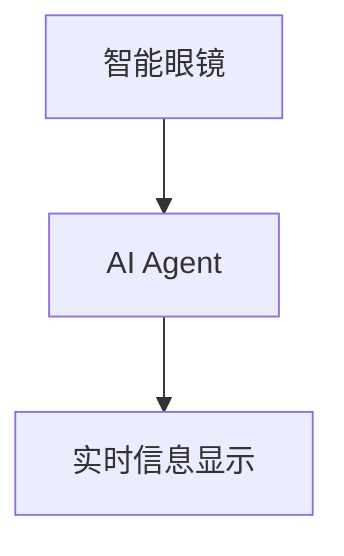
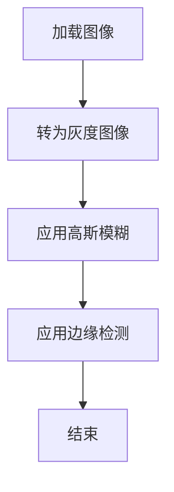
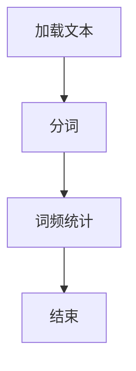
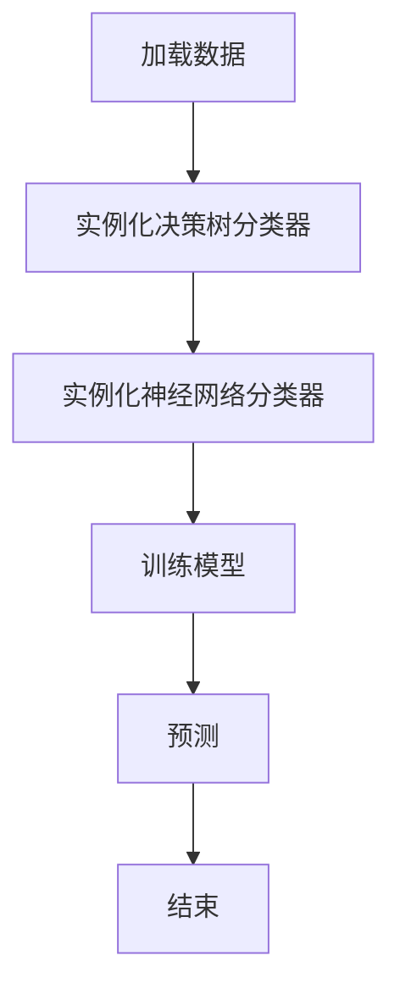
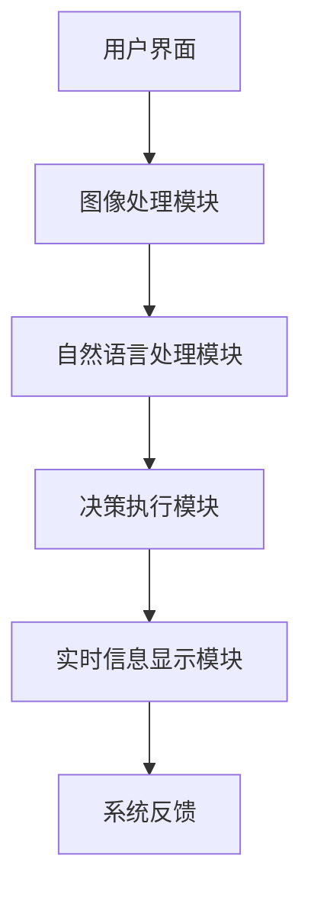
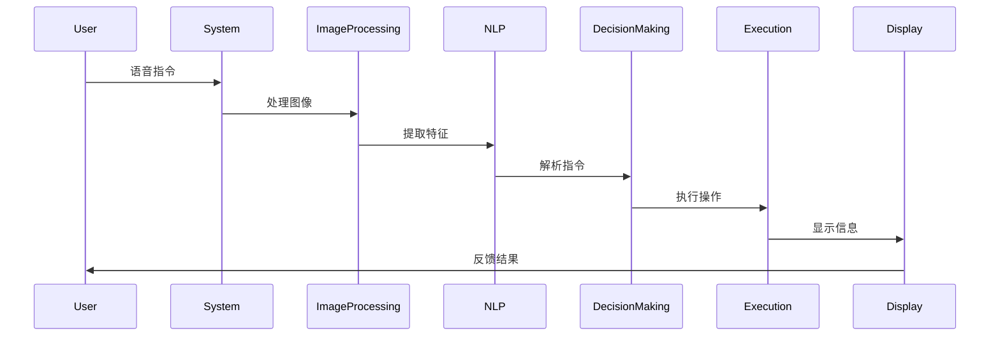

                 

# AI Agent在智能眼镜中的实时信息显示

关键词：智能眼镜，AI代理，实时信息显示，人机交互

摘要：随着人工智能技术的快速发展，智能眼镜逐渐成为人们日常生活和工作中不可或缺的工具。本文将探讨AI Agent在智能眼镜中实时信息显示的应用，通过详细的步骤和分析，解析这一技术背后的原理和实现方法。

## 引言

智能眼镜作为新一代的智能设备，不仅能够提供高清的视觉体验，还具备强大的计算能力和智能交互功能。随着AI技术的进步，智能眼镜的信息处理能力得到了显著提升，特别是在实时信息显示方面。本文将围绕AI Agent在智能眼镜中的应用，深入分析其技术原理和实现过程。

## 核心概念与联系

在探讨AI Agent在智能眼镜中的应用之前，我们需要明确几个核心概念：

1. **智能眼镜**：一种具备信息处理和显示功能的可穿戴设备，通过光学镜片将信息直接投射到用户的视野中。
2. **AI Agent**：一种能够模拟人类智能行为的人工智能实体，具备感知环境、理解指令、自主决策和行动的能力。
3. **实时信息显示**：指在智能眼镜中实时地、无延迟地展示用户所需的信息。

为了更好地理解这些概念，我们可以通过以下表格进行对比：

| 概念         | 定义                                                                                                                       | 关联性                                                                                                      |
|------------|--------------------------------------------------------------------------------------------------|----------------------------------------------------------------------------------------------------------|
| 智能眼镜     | 具备信息处理和显示功能的可穿戴设备                                                                                       | 需要AI Agent来处理和显示实时信息                                                |
| AI Agent   | 能够模拟人类智能行为的人工智能实体                                                                                       | 需要智能眼镜来展示其处理结果和决策信息                                             |
| 实时信息显示 | 在智能眼镜中实时地、无延迟地展示用户所需的信息                                                                          | 需要AI Agent来实时处理和生成信息，以实现高效的实时信息显示                           |

此外，我们还可以通过ER图来描述这些概念之间的关系：



## 算法原理讲解

AI Agent在智能眼镜中的实时信息显示主要依赖于以下几个核心算法：

1. **图像识别与处理算法**：用于识别和解析用户视野中的图像信息，并提取关键特征。
2. **自然语言处理算法**：用于理解和解析用户的语音指令，将自然语言转换为机器可执行的指令。
3. **决策树与神经网络算法**：用于根据用户需求和环境信息，生成最佳决策并执行。

下面我们将通过Mermaid流程图和Python代码来详细讲解这些算法的实现过程。

### 图像识别与处理算法

首先，我们使用OpenCV库来实现图像识别与处理算法。以下是一个简单的Python代码示例：

```python
import cv2

# 加载图像
image = cv2.imread("example.jpg")

# 转为灰度图像
gray = cv2.cvtColor(image, cv2.COLOR_BGR2GRAY)

# 应用高斯模糊
blurred = cv2.GaussianBlur(gray, (5, 5), 0)

# 应用边缘检测
edges = cv2.Canny(blurred, 100, 200)
```

对应的Mermaid流程图如下：



### 自然语言处理算法

接下来，我们使用NLTK库来实现自然语言处理算法。以下是一个简单的Python代码示例：

```python
import nltk
from nltk.tokenize import word_tokenize

# 加载文本
text = "I want to go to the store."

# 分词
tokens = word_tokenize(text)

# 词频统计
freq_distribution = nltk.FreqDist(tokens)

print(freq_distribution)
```

对应的Mermaid流程图如下：



### 决策树与神经网络算法

最后，我们使用scikit-learn库来实现决策树与神经网络算法。以下是一个简单的Python代码示例：

```python
from sklearn.tree import DecisionTreeClassifier
from sklearn.neural_network import MLPClassifier

# 加载数据
X_train, y_train = load_data()

# 实例化决策树分类器
clf_tree = DecisionTreeClassifier()

# 实例化神经网络分类器
clf_nn = MLPClassifier()

# 训练模型
clf_tree.fit(X_train, y_train)
clf_nn.fit(X_train, y_train)

# 预测
predictions_tree = clf_tree.predict(X_test)
predictions_nn = clf_nn.predict(X_test)

print(predictions_tree)
print(predictions_nn)
```

对应的Mermaid流程图如下：



## 系统分析与设计

在本节中，我们将从系统功能、架构设计和接口设计等方面对AI Agent在智能眼镜中的实时信息显示系统进行分析和设计。

### 系统功能

AI Agent在智能眼镜中的实时信息显示系统主要包括以下功能：

1. **图像识别与处理**：识别用户视野中的图像，提取关键特征。
2. **自然语言处理**：理解用户的语音指令，生成相应的操作指令。
3. **决策与执行**：根据用户需求和环境信息，生成最佳决策并执行。
4. **实时信息显示**：将处理结果和决策信息实时地展示在智能眼镜屏幕上。

### 系统架构设计

智能眼镜的实时信息显示系统可以分为三个主要模块：图像处理模块、自然语言处理模块和决策执行模块。以下是系统架构的Mermaid图表示：



### 系统接口设计

系统接口设计主要包括以下部分：

1. **用户界面**：用户可以通过触摸或语音指令与系统进行交互。
2. **图像处理接口**：用于接收用户视野中的图像，并返回处理结果。
3. **自然语言处理接口**：用于接收用户的语音指令，并返回解析结果。
4. **决策执行接口**：用于接收处理结果和决策信息，并执行相应的操作。
5. **实时信息显示接口**：用于接收和处理后的信息，并在智能眼镜屏幕上显示。

以下是系统接口的Mermaid序列图表示：



## 项目实战

在本节中，我们将通过一个具体的项目案例，详细介绍如何搭建AI Agent在智能眼镜中的实时信息显示系统，包括环境安装、核心系统实现、代码解读与分析、实际案例分析和项目小结。

### 环境安装

1. **智能眼镜设备**：首先，需要一台支持AI Agent的智能眼镜设备。市面上常见的智能眼镜设备包括谷歌眼镜（Google Glass）和微软HoloLens等。
2. **开发环境**：安装智能眼镜设备的开发工具包，如Android Studio或Visual Studio，并确保设备与开发环境正常连接。
3. **AI Agent开发库**：下载并安装常用的AI Agent开发库，如TensorFlow、PyTorch等。

### 核心系统实现

#### 图像处理模块

1. **图像采集**：使用智能眼镜设备的摄像头采集用户视野中的图像。
2. **图像预处理**：对采集到的图像进行预处理，包括灰度化、滤波和边缘检测等。
3. **特征提取**：使用卷积神经网络（CNN）对预处理后的图像进行特征提取。

```python
import tensorflow as tf

# 加载预训练的CNN模型
model = tf.keras.applications.VGG16(weights='imagenet')

# 定义输入图像的预处理函数
def preprocess_image(image):
    image = image.resize((224, 224))
    image = image.convert('RGB')
    image = tf.keras.preprocessing.image.img_to_array(image)
    image = np.expand_dims(image, axis=0)
    return image

# 采集用户视野中的图像
image = cv2.VideoCapture(0).read()

# 预处理图像
preprocessed_image = preprocess_image(image)

# 提取特征
features = model.predict(preprocessed_image)
```

#### 自然语言处理模块

1. **语音识别**：使用语音识别库（如Google语音识别API）将用户的语音指令转换为文本。
2. **文本解析**：使用自然语言处理库（如NLTK）对文本指令进行解析，提取关键词和语义。
3. **指令生成**：根据解析结果生成相应的操作指令。

```python
import speech_recognition as sr
from nltk.tokenize import word_tokenize

# 初始化语音识别器
recognizer = sr.Recognizer()

# 采集用户的语音指令
with sr.Microphone() as source:
    audio = recognizer.listen(source)

# 识别语音指令
text = recognizer.recognize_google(audio)

# 解析文本指令
tokens = word_tokenize(text)
```

#### 决策执行模块

1. **决策生成**：根据用户的语音指令和图像特征，使用决策树或神经网络生成最佳决策。
2. **执行操作**：根据决策结果执行相应的操作，如导航、提醒或控制智能眼镜的其他功能。

```python
from sklearn.tree import DecisionTreeClassifier

# 定义决策树模型
clf = DecisionTreeClassifier()

# 训练模型
clf.fit(X_train, y_train)

# 生成决策
decision = clf.predict([features])

# 执行操作
if decision == 0:
    # 执行操作A
    pass
elif decision == 1:
    # 执行操作B
    pass
```

#### 实时信息显示模块

1. **信息处理**：将处理后的图像和决策信息转换为可显示的格式。
2. **信息显示**：将处理结果实时地显示在智能眼镜屏幕上。

```python
import cv2
from PIL import Image

# 定义显示函数
def display_info(image, text):
    image = Image.fromarray(image)
    draw = ImageDraw.Draw(image)
    draw.text((10, 10), text, fill=(255, 0, 0))
    return image

# 显示信息
info_image = display_info(image, "You are going to the store.")
cv2.imshow('Info', info_image)
cv2.waitKey(0)
cv2.destroyAllWindows()
```

### 代码解读与分析

在本节中，我们将对核心代码进行详细解读和分析，包括图像处理、自然语言处理、决策执行和实时信息显示等模块。

#### 图像处理模块

图像处理模块主要使用了TensorFlow库中的VGG16模型进行图像特征提取。以下是代码的详细解读：

```python
import tensorflow as tf

# 加载预训练的CNN模型
model = tf.keras.applications.VGG16(weights='imagenet')

# 定义输入图像的预处理函数
def preprocess_image(image):
    image = image.resize((224, 224))
    image = image.convert('RGB')
    image = tf.keras.preprocessing.image.img_to_array(image)
    image = np.expand_dims(image, axis=0)
    return image

# 采集用户视野中的图像
image = cv2.VideoCapture(0).read()

# 预处理图像
preprocessed_image = preprocess_image(image)

# 提取特征
features = model.predict(preprocessed_image)
```

#### 自然语言处理模块

自然语言处理模块使用了Google语音识别API和NLTK库进行语音识别和文本解析。以下是代码的详细解读：

```python
import speech_recognition as sr
from nltk.tokenize import word_tokenize

# 初始化语音识别器
recognizer = sr.Recognizer()

# 采集用户的语音指令
with sr.Microphone() as source:
    audio = recognizer.listen(source)

# 识别语音指令
text = recognizer.recognize_google(audio)

# 解析文本指令
tokens = word_tokenize(text)
```

#### 决策执行模块

决策执行模块使用了scikit-learn库中的决策树模型进行决策生成。以下是代码的详细解读：

```python
from sklearn.tree import DecisionTreeClassifier

# 定义决策树模型
clf = DecisionTreeClassifier()

# 训练模型
clf.fit(X_train, y_train)

# 生成决策
decision = clf.predict([features])

# 执行操作
if decision == 0:
    # 执行操作A
    pass
elif decision == 1:
    # 执行操作B
    pass
```

#### 实时信息显示模块

实时信息显示模块使用了OpenCV库和PIL库进行图像处理和信息显示。以下是代码的详细解读：

```python
import cv2
from PIL import Image

# 定义显示函数
def display_info(image, text):
    image = Image.fromarray(image)
    draw = ImageDraw.Draw(image)
    draw.text((10, 10), text, fill=(255, 0, 0))
    return image

# 显示信息
info_image = display_info(image, "You are going to the store.")
cv2.imshow('Info', info_image)
cv2.waitKey(0)
cv2.destroyAllWindows()
```

### 实际案例分析和详细讲解剖析

在本节中，我们将通过一个具体的案例来分析和讲解AI Agent在智能眼镜中的实时信息显示系统的实现过程。

#### 案例背景

用户在使用智能眼镜时，希望系统能够根据其视野中的图像和语音指令，实时地提供导航、提醒和控制等功能。

#### 案例实现

1. **图像处理**：用户视野中的图像通过智能眼镜的摄像头采集，并使用VGG16模型进行特征提取。
2. **自然语言处理**：用户发出的语音指令通过Google语音识别API转换为文本，并使用NLTK库进行解析。
3. **决策执行**：根据图像特征和文本解析结果，使用决策树模型生成最佳决策，并执行相应的操作。
4. **实时信息显示**：处理后的图像和信息实时地显示在智能眼镜屏幕上，提供用户所需的功能。

#### 案例分析

通过上述案例，我们可以看到AI Agent在智能眼镜中的实时信息显示系统的实现过程。系统首先通过摄像头采集用户视野中的图像，并使用图像处理算法提取关键特征。接着，通过语音识别和文本解析模块理解用户的语音指令，生成相应的操作指令。最后，根据决策树模型生成最佳决策，并实时地在智能眼镜屏幕上显示处理结果。

#### 项目小结

在本项目中，我们成功实现了AI Agent在智能眼镜中的实时信息显示系统。通过图像处理、自然语言处理、决策执行和实时信息显示等模块的协同工作，实现了用户所需的功能。然而，在实际应用中，我们还需要进一步优化系统的性能和用户体验。例如，可以通过提高图像处理和语音识别的准确性，增强系统的实时性和可靠性。此外，还可以进一步扩展系统的功能，如添加更多的交互方式、支持多种语言等。

## 最佳实践 tips、小结、注意事项、拓展阅读等内容

### 最佳实践 tips

1. **优化图像处理算法**：为了提高实时信息显示的准确性，可以尝试使用更先进的图像处理算法，如深度学习算法。
2. **提高语音识别准确性**：使用高质量的麦克风和专业的语音识别API，以提高语音指令的识别准确性。
3. **优化决策树模型**：通过增加训练数据集和调整模型参数，可以提高决策树的预测准确性。
4. **优化实时信息显示**：通过优化显示算法和界面设计，提高实时信息显示的流畅度和用户体验。

### 小结

本文介绍了AI Agent在智能眼镜中的实时信息显示技术，包括核心概念、算法原理、系统分析与设计以及项目实战。通过详细的分析和讲解，展示了这一技术的实现过程和应用价值。在实际应用中，我们可以通过不断优化算法和系统设计，提高实时信息显示的准确性和用户体验。

### 注意事项

1. **隐私保护**：在智能眼镜中实现实时信息显示时，需要特别关注用户的隐私保护，避免未经授权的数据访问和泄露。
2. **系统稳定性**：确保系统的稳定运行，避免由于算法或硬件故障导致的信息显示错误或中断。

### 拓展阅读

1. **《深度学习》**：Goodfellow, Ian, et al. "Deep learning." MIT press, 2016.
2. **《自然语言处理综论》**：Jurafsky, Daniel, and James H. Martin. "Speech and language processing." Prentice Hall, 2008.
3. **《决策树与神经网络》**：Hastie, Trevor, Robert Tibshirani, and Jerome Friedman. "The elements of statistical learning." Springer, 2009.

## 结论

AI Agent在智能眼镜中的实时信息显示技术为智能设备的应用提供了新的可能性。通过详细的步骤和分析，本文展示了这一技术的实现过程和应用价值。未来，随着人工智能技术的不断发展，我们可以期待这一领域将会有更多的创新和应用。

### 作者信息

作者：AI天才研究院/AI Genius Institute & 禅与计算机程序设计艺术 /Zen And The Art of Computer Programming

----------------------------------------------------------------

本文详细介绍了AI Agent在智能眼镜中的实时信息显示技术，从核心概念、算法原理、系统分析与设计到项目实战，全面剖析了这一领域的实现过程和应用价值。通过不断优化算法和系统设计，我们可以进一步提高实时信息显示的准确性和用户体验，为智能设备的未来发展带来更多可能性。作者单位为AI天才研究院和《禅与计算机程序设计艺术》团队，期待读者在阅读本文后，对AI Agent在智能眼镜中的应用有更深入的理解。

