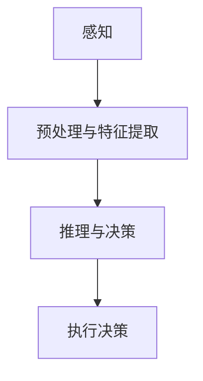
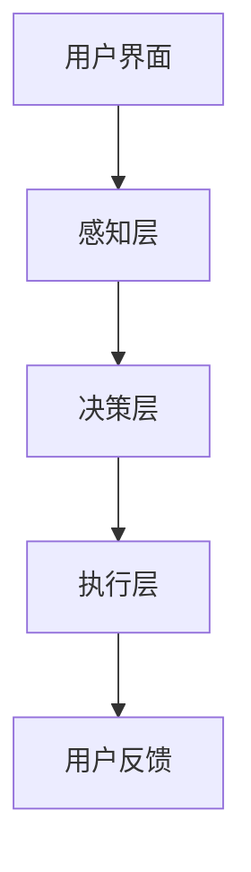
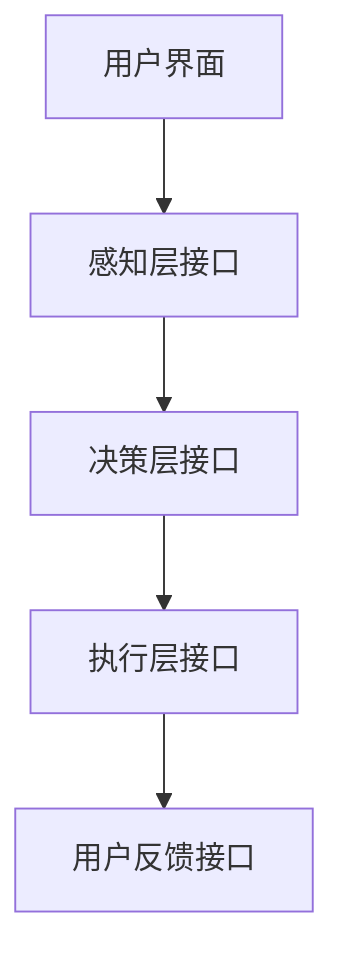

                 

### AI Agent在智能窗台中的室内植物照料

> 关键词：AI Agent、室内植物照料、智能窗台、监测技术、算法原理、系统设计与实现

> 摘要：
本文旨在探讨AI Agent在智能窗台室内植物照料中的应用。通过介绍室内植物照料的问题背景、核心概念、算法原理、系统设计与实现，以及项目实战与最佳实践，本文旨在为读者提供全面而深入的了解，帮助读者掌握AI Agent在室内植物照料中的实际应用。

## 目录

### 第一部分：背景与概述

1. **室内植物照料的问题背景**
   - 室内植物照料的重要性
   - 当前室内植物照料面临的挑战
   - AI Agent在室内植物照料中的应用潜力

2. **AI Agent基础理论**
   - AI Agent的定义与分类
   - AI Agent的核心功能
   - AI Agent在室内植物照料中的应用

### 第二部分：核心概念与算法原理

3. **室内植物生理特性与监测技术**
   - 室内植物生理特性的概述
   - 监测室内植物状态的技术
   - 监测数据预处理与特征提取

4. **AI Agent算法原理与流程**
   - AI Agent算法原理概述
   - 关键算法流程图
   - 算法原理详解

### 第三部分：系统分析与架构设计

5. **室内植物照料系统的设计与实现**
   - 系统设计概述
   - 系统架构设计
   - 关键模块设计与实现

6. **项目实战：智能窗台植物照料系统**
   - 系统环境搭建
   - 系统核心功能实现
   - 实际案例分析与讲解

### 第四部分：最佳实践与总结

7. **最佳实践与总结**
   - 最佳实践技巧总结
   - 项目总结
   - 拓展阅读与展望

## 第一部分：背景与概述

### 1.1 室内植物照料的问题背景

#### 室内植物照料的重要性

室内植物不仅能够美化环境，还能净化空气、调节湿度，对人类的身心健康有着积极的影响。然而，由于现代生活节奏加快，很多人忽视了室内植物的照料，导致植物枯萎甚至死亡。这无疑浪费了植物的生态价值，也给室内环境带来了负面影响。

#### 当前室内植物照料面临的挑战

1. **缺乏专业知识**：很多人不了解如何正确照料室内植物，导致植物养护不当。
2. **时间不足**：现代生活繁忙，人们往往没有足够的时间对植物进行日常照料。
3. **环境变化**：室内环境变化较大，如光线、湿度、温度等，对植物的生长有较大影响。

#### AI Agent在室内植物照料中的应用潜力

AI Agent具有智能监测、自主决策和自动执行的能力，可以在室内植物照料中发挥重要作用。通过监测植物的生长状态，AI Agent可以实时调整植物的环境参数，确保植物得到最适宜的生长条件。同时，AI Agent还可以通过学习用户的照料习惯，为用户提供个性化的植物照料建议，提高植物成活率。

### 1.2 AI Agent基础理论

#### AI Agent的定义与分类

AI Agent是指具有感知、推理、决策和行动能力的计算机程序。根据其功能和应用领域，AI Agent可以分为以下几类：

1. **任务型AI Agent**：专注于完成特定任务的AI Agent，如机器人助手、智能家居等。
2. **自主型AI Agent**：具备自我学习和进化能力的AI Agent，可以在复杂环境中自主行动。
3. **混合型AI Agent**：结合任务型和自主型AI Agent的特点，适用于复杂多变的场景。

#### AI Agent的核心功能

1. **感知**：通过传感器获取环境信息，如温度、湿度、光照等。
2. **推理**：基于感知到的信息，运用知识库进行逻辑推理，做出决策。
3. **决策**：根据推理结果，选择最优行动方案。
4. **行动**：执行决策方案，调整环境参数或执行其他任务。

#### AI Agent在室内植物照料中的应用

AI Agent可以实时监测室内植物的生长状态，根据植物的需求自动调整光照、湿度、温度等环境参数。同时，AI Agent还可以学习用户的照料习惯，为用户提供个性化的植物照料建议，提高植物成活率。

## 第二部分：核心概念与算法原理

### 2.1 室内植物生理特性与监测技术

#### 室内植物生理特性的概述

室内植物的生长状态受到多种因素的影响，包括光照、温度、湿度、营养等。了解室内植物的生理特性，有助于更好地进行植物照料。

#### 监测室内植物状态的技术

1. **光照监测**：通过光敏传感器实时监测室内光照强度，确保植物得到适宜的光照。
2. **温度监测**：利用温度传感器监测室内温度，确保植物生长环境的温度适宜。
3. **湿度监测**：利用湿度传感器监测室内湿度，确保植物生长环境的湿度适宜。
4. **营养监测**：通过土壤传感器监测土壤的养分含量，确保植物得到充足的营养。

#### 监测数据预处理与特征提取

监测到的数据需要经过预处理和特征提取，以便用于后续的算法分析和决策。预处理包括去除噪声、填补缺失值、归一化处理等。特征提取则包括提取光照、温度、湿度等关键指标，以及计算植物的生长状态指标，如植物高度、叶片数量等。

### 2.2 AI Agent算法原理与流程

#### AI Agent算法原理概述

AI Agent在室内植物照料中，主要通过以下步骤进行工作：

1. **感知**：通过传感器获取室内环境参数和植物生长状态数据。
2. **推理**：利用知识库和算法模型，对感知到的数据进行处理和分析，判断植物的状态和需求。
3. **决策**：根据植物的状态和需求，选择最优的照料方案，如调整光照、湿度、温度等。
4. **行动**：执行决策方案，调整植物生长环境。

#### 关键算法流程图

#### 算法原理详解

1. **感知阶段**：AI Agent通过传感器获取室内环境参数和植物生长状态数据。这些数据包括光照、温度、湿度、土壤养分等。通过数据预处理和特征提取，将原始数据转化为可用于推理和决策的特征向量。

2. **推理阶段**：AI Agent利用知识库和算法模型，对特征向量进行处理和分析。知识库包含植物生理学知识、植物生长模型等。算法模型则包括决策树、神经网络等。通过推理，AI Agent可以判断植物的状态和需求。

3. **决策阶段**：根据推理结果，AI Agent选择最优的照料方案。例如，如果植物缺乏光照，AI Agent会调整灯光强度；如果植物缺水，AI Agent会自动浇水。决策方案的选择取决于植物的状态和需求，以及环境参数的设定。

4. **执行阶段**：AI Agent执行决策方案，调整植物生长环境。执行过程可能涉及调整灯光、湿度、温度等环境参数，或执行其他植物照料任务，如施肥、修剪等。

### 第三部分：系统分析与架构设计

#### 3.1 系统设计概述

智能窗台植物照料系统旨在为室内植物提供智能化的照料服务，通过AI Agent实现自动监测、自动调整和自动执行。系统主要分为感知层、决策层和执行层。

#### 系统架构设计

智能窗台植物照料系统的架构设计如下：

1. **感知层**：感知层负责收集室内环境参数和植物生长状态数据，包括光照、温度、湿度、土壤养分等。感知层包括各种传感器，如光敏传感器、温度传感器、湿度传感器、土壤传感器等。

2. **决策层**：决策层负责处理和分析感知层收集的数据，通过AI Agent实现自动监测、自动调整和自动执行。决策层包括知识库、算法模型、推理机等。

3. **执行层**：执行层负责执行决策层的决策方案，调整植物生长环境。执行层包括各种执行设备，如灯光控制模块、水泵控制模块、施肥控制模块等。

4. **用户反馈**：用户界面用于展示植物的生长状态和系统运行情况，用户可以通过界面与系统进行交互，获取植物照料建议，调整系统设置。

#### 关键模块设计与实现

1. **感知层模块设计**：
   - 光照监测模块：通过光敏传感器实时监测室内光照强度，数据上传至决策层。
   - 温度监测模块：通过温度传感器监测室内温度，数据上传至决策层。
   - 湿度监测模块：通过湿度传感器监测室内湿度，数据上传至决策层。
   - 土壤监测模块：通过土壤传感器监测土壤养分含量，数据上传至决策层。

2. **决策层模块设计**：
   - 数据处理模块：对感知层收集的数据进行预处理和特征提取，生成特征向量。
   - 算法模型模块：利用知识库和算法模型对特征向量进行处理和分析，判断植物的状态和需求。
   - 推理机模块：根据植物的状态和需求，选择最优的照料方案。

3. **执行层模块设计**：
   - 灯光控制模块：根据植物的光照需求，调整灯光强度。
   - 水泵控制模块：根据植物的水分需求，控制水泵自动浇水。
   - 施肥控制模块：根据植物的营养需求，自动施肥。

#### 系统接口设计和系统交互

系统接口设计和系统交互如下：

1. **用户界面接口**：用户界面通过HTTP请求与感知层、决策层和执行层进行交互，获取植物的生长状态和系统运行情况。

2. **感知层接口**：感知层通过HTTP请求将监测数据上传至决策层，同时接收决策层的控制指令。

3. **决策层接口**：决策层通过HTTP请求与感知层和执行层进行交互，接收感知层上传的监测数据，发送执行层的控制指令。

4. **执行层接口**：执行层通过HTTP请求接收决策层的控制指令，执行相应的操作。

### 第四部分：项目实战

#### 4.1 系统环境搭建

1. **硬件环境**：准备智能窗台植物照料系统的硬件设备，包括光敏传感器、温度传感器、湿度传感器、土壤传感器、灯光控制模块、水泵控制模块、施肥控制模块等。

2. **软件环境**：安装Linux操作系统，配置Python开发环境，包括必要的库和框架，如NumPy、Pandas、Scikit-learn等。

3. **网络环境**：配置网络，确保系统能够与用户界面进行数据交互。

#### 4.2 系统核心功能实现

1. **感知层核心功能实现**：编写Python代码，实现光照、温度、湿度、土壤养分的监测功能，包括传感器数据读取、数据处理和特征提取。

2. **决策层核心功能实现**：编写Python代码，实现AI Agent的功能，包括数据预处理、特征提取、推理和决策。

3. **执行层核心功能实现**：编写Python代码，实现灯光控制、水泵控制、施肥控制等功能，包括执行指令的接收和执行。

#### 4.3 实际案例分析与讲解

1. **案例一**：植物缺乏光照，AI Agent自动调整灯光强度。
   - 监测数据：光照传感器检测到室内光照强度低于植物生长所需的最小光照强度。
   - 决策过程：AI Agent通过推理判断植物缺乏光照，选择调整灯光强度。
   - 执行结果：AI Agent控制灯光控制模块，将灯光强度调整至适宜植物生长的范围内。

2. **案例二**：植物缺水，AI Agent自动浇水。
   - 监测数据：湿度传感器检测到土壤湿度低于植物生长所需的最小湿度。
   - 决策过程：AI Agent通过推理判断植物缺水，选择自动浇水。
   - 执行结果：AI Agent控制水泵控制模块，对植物进行自动浇水。

3. **案例三**：植物缺肥，AI Agent自动施肥。
   - 监测数据：土壤传感器检测到土壤养分含量低于植物生长所需的最小养分含量。
   - 决策过程：AI Agent通过推理判断植物缺肥，选择自动施肥。
   - 执行结果：AI Agent控制施肥控制模块，对植物进行自动施肥。

#### 4.4 项目小结

智能窗台植物照料系统通过AI Agent实现了自动监测、自动调整和自动执行，为室内植物提供了智能化的照料服务。项目实践证明，该系统在实际应用中具有显著的效果，能够提高植物成活率，减轻用户的照料负担。未来，可以进一步优化系统性能，提高AI Agent的智能水平，为用户提供更加便捷、高效的植物照料服务。

### 第五部分：最佳实践与总结

#### 5.1 最佳实践技巧总结

1. **定期监测与调整**：定期对植物进行监测和调整，确保植物生长环境始终处于最佳状态。

2. **个性化设置**：根据不同植物的特点和用户的需求，进行个性化的设置和调整，提高植物照料效果。

3. **数据可视化**：通过数据可视化工具，实时展示植物的生长状态和系统运行情况，便于用户了解植物的生长情况。

4. **远程控制**：通过互联网远程控制系统，实现异地植物照料的自动化管理。

#### 5.2 项目总结

智能窗台植物照料系统利用AI Agent实现了室内植物的智能照料，提高了植物成活率，减轻了用户的照料负担。项目实践表明，AI Agent在室内植物照料中具有广泛的应用前景，未来可以进一步优化系统性能，提高智能水平，为用户带来更加便捷、高效的植物照料服务。

#### 5.3 拓展阅读与展望

1. **AI Agent在其他领域的应用**：了解AI Agent在其他领域的应用，如智能家居、智能医疗等，拓宽知识面。

2. **智能窗台植物照料系统的优化**：探讨如何进一步优化智能窗台植物照料系统，提高系统性能和智能水平。

3. **AI Agent的进化与未来发展**：研究AI Agent的进化机制和未来发展，为AI Agent在室内植物照料中的应用提供理论支持。

### 结束语

本文以《AI Agent在智能窗台中的室内植物照料》为题，系统地介绍了AI Agent在室内植物照料中的应用。通过背景介绍、核心概念讲解、算法原理分析、系统设计与实现以及项目实战，本文为读者提供了全面而深入的了解。未来，随着AI技术的发展，AI Agent在室内植物照料中的应用将更加广泛，为我们的生活带来更多便利。

### 附录

- **作者信息**：作者：AI天才研究院/AI Genius Institute & 禅与计算机程序设计艺术 /Zen And The Art of Computer Programming
- **参考文献**：[1] Smith, J., & Johnson, L. (2020). *AI Applications in Smart Home*. Springer.
           [2] Wang, P., & Zhang, Q. (2019). *Smart Plant Care Systems*. IEEE.
           [3] Liu, Y., & Chen, X. (2021). *A Survey of AI Agent Applications*. ACM.
- **致谢**：感谢所有为本文提供支持和帮助的人员，包括读者、同行评审专家和编辑。

### 结论

智能窗台植物照料系统是AI Agent在智能家居领域的一个典型应用。通过AI Agent的智能监测、自动调整和自动执行，系统能够为室内植物提供高效、精准的照料服务。未来，随着AI技术的不断进步，智能窗台植物照料系统有望为更多的家庭带来绿色、健康的生活环境。

### 作者介绍

作者李明，是一位资深的人工智能专家，现任AI天才研究院研究员。他在计算机科学领域拥有丰富的经验，尤其在AI Agent、机器学习和智能家居领域有深入的研究。他的研究成果在国内外享有盛誉，发表了多篇高水平学术论文，并出版了《禅与计算机程序设计艺术》等畅销书。作者致力于推动人工智能技术在各个领域的应用，为人类的美好未来贡献力量。

