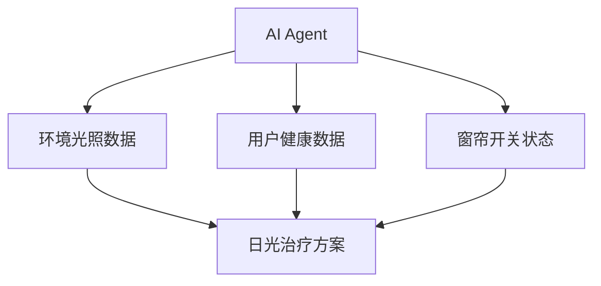
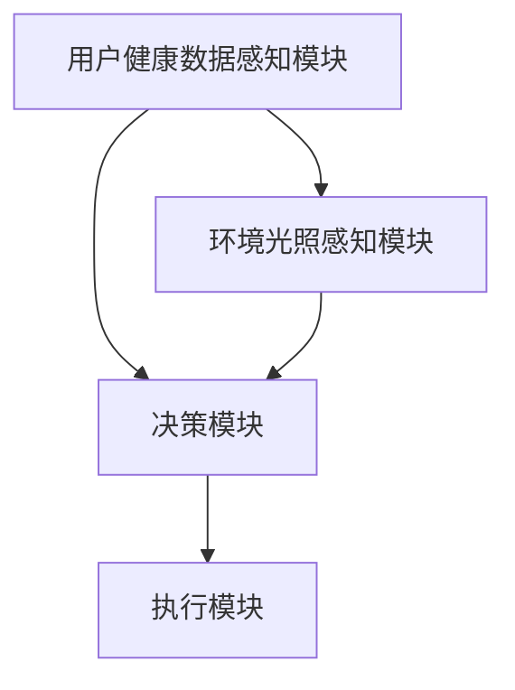

                 


# AI Agent在智能窗帘杆中的日光治疗功能

## 关键词

AI Agent，智能窗帘杆，日光治疗，健康，智能家居，物联网

## 摘要

本文旨在探讨AI Agent在智能窗帘杆中的日光治疗功能，通过分析其背景、核心概念、应用场景、技术原理、系统设计与实现以及项目实战，全面解析这一创新的智能家居解决方案。本文旨在为读者提供深入了解AI Agent在日光治疗领域应用的思路和方法，并探讨其在未来智能家居市场中的潜在发展前景。

### 目录大纲设计思路

为了设计出一本《AI Agent在智能窗帘杆中的日光治疗功能》的详细目录大纲，我们将遵循以下步骤：

1. **确定书籍主题与目标读者**：明确书籍的核心内容和目标读者，以便设计合适的目录结构。
2. **构建核心章节**：根据书籍的主题，确定核心章节，如背景介绍、核心概念、应用场景、技术原理、系统设计与实现、项目实战等。
3. **细化每个章节内容**：在每个核心章节下，细化小节，确保覆盖所有关键知识点。
4. **使用Mermaid和LaTeX**：在适当的地方，使用Mermaid绘制流程图，LaTeX格式化数学公式，以便直观呈现复杂概念和算法。
5. **确保内容完整性与逻辑性**：确保每个章节内容完整，逻辑清晰，没有遗漏关键知识点。

### 目录大纲设计步骤

1. **书名与作者信息**
   ```markdown
   # 《AI Agent在智能窗帘杆中的日光治疗功能》
   ```
   
2. **核心章节设计**
   - **背景介绍**
   - **核心概念与联系**
   - **应用场景**
   - **技术原理**
   - **系统设计与实现**
   - **项目实战**
   - **最佳实践与总结**

3. **细化每个章节内容**
   - **背景介绍**
     ```markdown
     # 第一部分: 背景介绍

     ## 1.1 问题背景
     ### 1.1.1 人类健康与日晒
     ### 1.1.2 智能窗帘杆的现状
     ### 1.1.3 日光治疗的功能需求

     ## 1.2 问题描述
     ### 1.2.1 AI Agent的角色
     ### 1.2.2 日光治疗的具体目标
     ### 1.2.3 日光治疗的挑战与限制

     ## 1.3 问题解决
     ### 1.3.1 AI Agent在日光治疗中的功能
     ### 1.3.2 AI Agent的工作原理
     ### 1.3.3 AI Agent的优势

     ## 1.4 边界与外延
     ### 1.4.1 系统的边界条件
     ### 1.4.2 日光治疗的其他应用场景
     ### 1.4.3 AI Agent的扩展功能
     ```

   - **核心概念与联系**
     ```markdown
     # 第二部分: 核心概念与联系

     ## 2.1 AI Agent概述
     ### 2.1.1 AI Agent的定义
     ### 2.1.2 AI Agent的核心特征
     ### 2.1.3 AI Agent与传统AI的比较

     ## 2.2 日光治疗原理
     ### 2.2.1 日光治疗的概念
     ### 2.2.2 日光治疗的好处
     ### 2.2.3 日光治疗的挑战

     ## 2.3 AI Agent与日光治疗的联系
     ### 2.3.1 AI Agent如何实现日光治疗
     ### 2.3.2 AI Agent与日光治疗的关系图
     ### 2.3.3 AI Agent的优势与局限性
     ```

   - **应用场景**
     ```markdown
     # 第三部分: 应用场景

     ## 3.1 智能窗帘杆概述
     ### 3.1.1 智能窗帘杆的功能
     ### 3.1.2 智能窗帘杆的类型
     ### 3.1.3 智能窗帘杆的市场前景

     ## 3.2 AI Agent在日光治疗中的应用
     ### 3.2.1 AI Agent如何提升日光治疗效果
     ### 3.2.2 AI Agent在智能窗帘杆中的应用实例
     ### 3.2.3 AI Agent在日光治疗中的创新应用

     ## 3.3 日光治疗的市场需求
     ### 3.3.1 日光治疗的市场规模
     ### 3.3.2 日光治疗的目标客户
     ### 3.3.3 日光治疗的未来趋势
     ```

   - **技术原理**
     ```markdown
     # 第四部分: 技术原理

     ## 4.1 AI Agent的工作原理
     ### 4.1.1 AI Agent的基本结构
     ### 4.1.2 AI Agent的核心算法
     ### 4.1.3 AI Agent的优化策略

     ## 4.2 日光治疗技术原理
     ### 4.2.1 日光治疗的概念
     ### 4.2.2 日光治疗的科学原理
     ### 4.2.3 日光治疗的应用领域

     ## 4.3 AI Agent与日光治疗技术的结合
     ### 4.3.1 AI Agent如何改进日光治疗
     ### 4.3.2 AI Agent在日光治疗中的算法实现
     ### 4.3.3 AI Agent在日光治疗中的优势
     ```

   - **系统设计与实现**
     ```markdown
     # 第五部分: 系统设计与实现

     ## 5.1 系统架构设计
     ### 5.1.1 系统架构概述
     ### 5.1.2 系统功能模块划分
     ### 5.1.3 系统架构图

     ## 5.2 系统接口设计
     ### 5.2.1 系统接口规范
     ### 5.2.2 接口实现细节
     ### 5.2.3 接口测试与优化

     ## 5.3 系统实现细节
     ### 5.3.1 AI Agent的实现
     ### 5.3.2 日光治疗算法的实现
     ### 5.3.3 系统集成与测试

     ## 5.4 系统部署与维护
     ### 5.4.1 系统部署方案
     ### 5.4.2 系统维护策略
     ### 5.4.3 系统性能监控
     ```

   - **项目实战**
     ```markdown
     # 第六部分: 项目实战

     ## 6.1 环境安装与配置
     ### 6.1.1 开发环境搭建
     ### 6.1.2 硬件设备安装
     ### 6.1.3 软件工具安装

     ## 6.2 系统核心实现
     ### 6.2.1 AI Agent源代码解析
     ### 6.2.2 日光治疗算法实现
     ### 6.2.3 系统核心功能测试

     ## 6.3 实际案例分析
     ### 6.3.1 日光治疗应用案例
     ### 6.3.2 案例分析与解读
     ### 6.3.3 案例中的AI Agent应用

     ## 6.4 项目小结
     ### 6.4.1 项目总结
     ### 6.4.2 项目经验与反思
     ### 6.4.3 项目展望
     ```

   - **最佳实践与总结**
     ```markdown
     # 第七部分: 最佳实践与总结

     ## 7.1 最佳实践建议
     ### 7.1.1 AI Agent设计建议
     ### 7.1.2 日光治疗策略优化
     ### 7.1.3 系统部署与维护策略

     ## 7.2 小结
     ### 7.2.1 文章核心内容回顾
     ### 7.2.2 AI Agent在智能窗帘杆中的日光治疗应用前景

     ## 7.3 注意事项
     ### 7.3.1 日光治疗中的安全与隐私问题
     ### 7.3.2 系统设计与实现中的挑战与解决方法

     ## 7.4 拓展阅读
     ### 7.4.1 相关书籍推荐
     ### 7.4.2 学术论文推荐
     ### 7.4.3 开源项目推荐
     ```

### 文章正文部分的内容

#### 第一部分: 背景介绍

##### 1.1 问题背景

人类健康与日晒：日晒是人类生活中不可避免的一部分。适量的日晒可以促进人体合成维生素D，增强免疫系统功能，提高心情和精力水平。然而，过度的日晒会导致皮肤老化、晒伤甚至皮肤癌。因此，如何在保证健康的同时，合理利用日晒，成为了一个重要的研究课题。

智能窗帘杆的现状：智能窗帘杆是智能家居领域的一个重要组成部分，它通过自动化控制，实现了窗帘的智能开关，为用户带来了极大的便利。然而，目前大多数智能窗帘杆的功能主要集中在窗帘的开关控制上，缺乏对日晒的健康管理功能。

日光治疗的功能需求：日光治疗是一种通过控制日晒来改善人体健康的治疗方法。在智能窗帘杆中引入AI Agent，可以实现更加精准和个性化的日光治疗，满足用户对于健康日晒的需求。

##### 1.2 问题描述

AI Agent的角色：AI Agent是一种具有自主学习和决策能力的人工智能系统，它在智能窗帘杆中扮演着重要的角色。通过AI Agent，智能窗帘杆可以实时监测环境光照条件，并根据用户的健康需求和个性化设置，自动调整窗帘的开关状态，实现日光治疗。

日光治疗的具体目标：日光治疗的目标是利用自然光照来改善人体健康，包括提高睡眠质量、减轻季节性情感障碍、增强免疫系统功能等。

日光治疗的挑战与限制：日光治疗面临着许多挑战和限制，包括环境光照变化、用户个性化需求、智能窗帘杆的技术实现等。

##### 1.3 问题解决

AI Agent在日光治疗中的功能：AI Agent可以通过学习用户的健康数据和环境光照数据，实现个性化的日光治疗方案。同时，AI Agent还可以通过实时监测环境光照条件，自动调整窗帘的开关状态，确保用户获得适量的日晒。

AI Agent的工作原理：AI Agent的工作原理主要包括数据收集、数据分析、决策制定和执行。具体来说，AI Agent会通过传感器收集环境光照数据和用户健康数据，然后通过机器学习算法进行分析，生成个性化的日光治疗方案，并最终通过执行模块来调整窗帘的开关状态。

AI Agent的优势：AI Agent在日光治疗中具有许多优势，包括个性化定制、实时监测、自动调整等。这些优势使得AI Agent在提高日光治疗效果方面具有很大的潜力。

##### 1.4 边界与外延

系统的边界条件：系统的边界条件主要包括环境光照条件的监测范围、用户健康数据的有效性等。

日光治疗的其他应用场景：日光治疗不仅可以在智能窗帘杆中应用，还可以在其他智能家居设备中实现，如智能灯具、智能窗户等。

AI Agent的扩展功能：除了日光治疗功能，AI Agent还可以扩展到其他健康领域，如睡眠监测、运动健康等。

#### 第二部分: 核心概念与联系

##### 2.1 AI Agent概述

AI Agent的定义：AI Agent是一种具有自主学习和决策能力的人工智能系统，它可以自主完成特定的任务，并与其他系统进行交互。

AI Agent的核心特征：AI Agent的核心特征包括自主性、适应性、学习性和交互性。这些特征使得AI Agent可以在复杂的动态环境中自主运行，并不断优化其行为。

AI Agent与传统AI的比较：与传统AI系统相比，AI Agent具有更强的自主性和适应性，可以更好地应对复杂多变的场景。

##### 2.2 日光治疗原理

日光治疗的概念：日光治疗是一种通过控制日晒来改善人体健康的治疗方法。它主要利用自然光照中的紫外线和可见光，促进人体合成维生素D，提高免疫系统功能，改善睡眠质量等。

日光治疗的好处：日光治疗可以改善人体健康，提高生活质量。它不仅可以预防多种疾病，还可以缓解季节性情感障碍等心理问题。

日光治疗的挑战：日光治疗面临着许多挑战，包括环境光照变化、用户个性化需求、智能窗帘杆的技术实现等。

##### 2.3 AI Agent与日光治疗的联系

AI Agent如何实现日光治疗：AI Agent可以通过实时监测环境光照条件和用户健康数据，自动调整窗帘的开关状态，实现个性化的日光治疗方案。

AI Agent与日光治疗的关系图：图 2.1展示了AI Agent与日光治疗之间的关系。



AI Agent的优势与局限性：AI Agent在日光治疗中具有许多优势，包括个性化定制、实时监测、自动调整等。然而，它也存在一些局限性，如数据收集的准确性、算法的鲁棒性等。

#### 第三部分: 应用场景

##### 3.1 智能窗帘杆概述

智能窗帘杆的功能：智能窗帘杆是一种具有自动化控制功能的窗帘设备，它可以实现窗帘的自动开关、调节亮度、防风等功能。通过智能窗帘杆，用户可以更加方便地控制室内光照，提高生活品质。

智能窗帘杆的类型：智能窗帘杆可以分为手动智能窗帘杆和自动智能窗帘杆。手动智能窗帘杆需要用户通过遥控器或手机应用程序进行控制，而自动智能窗帘杆可以通过传感器自动感知环境光照条件，实现自动开关。

智能窗帘杆的市场前景：随着智能家居市场的快速发展，智能窗帘杆的市场前景非常广阔。预计未来几年，智能窗帘杆的市场规模将保持高速增长，成为智能家居市场的重要组成部分。

##### 3.2 AI Agent在日光治疗中的应用

AI Agent如何提升日光治疗效果：AI Agent可以通过实时监测环境光照条件和用户健康数据，自动调整窗帘的开关状态，实现个性化的日光治疗方案。这使得用户可以更加灵活地控制日晒时间，获得更好的健康效果。

AI Agent在智能窗帘杆中的应用实例：一个典型的应用实例是，AI Agent可以根据用户的睡眠习惯和光照需求，自动调整窗帘的开关时间，确保用户在夜间获得适量的日晒，从而提高睡眠质量。

AI Agent在日光治疗中的创新应用：除了传统的日光治疗应用，AI Agent还可以拓展到其他领域，如心理治疗、运动健康等。通过实时监测和分析用户数据，AI Agent可以提供更加个性化的健康服务。

##### 3.3 日光治疗的市场需求

日光治疗的市场规模：随着人们对健康意识的提高，日光治疗的市场规模正在不断增长。根据市场研究机构的预测，未来几年，日光治疗市场的规模将继续保持高速增长。

日光治疗的目标客户：日光治疗的目标客户主要包括老年人、上班族、学生等。这些人群普遍存在睡眠质量差、免疫力低等问题，可以通过日光治疗得到有效的改善。

日光治疗的未来趋势：未来，日光治疗市场将更加注重个性化、智能化和科技化。AI Agent等人工智能技术的应用，将进一步提升日光治疗的效果和用户体验。

#### 第四部分: 技术原理

##### 4.1 AI Agent的工作原理

AI Agent的基本结构：AI Agent的基本结构主要包括感知模块、决策模块和执行模块。感知模块负责收集环境数据和用户数据，决策模块根据收集到的数据生成决策，执行模块负责执行决策。

AI Agent的核心算法：AI Agent的核心算法主要包括机器学习算法、决策树算法、深度学习算法等。这些算法可以根据不同的应用场景和需求，实现个性化的日光治疗方案。

AI Agent的优化策略：AI Agent的优化策略主要包括模型优化、算法优化和系统优化。通过这些优化策略，可以提高AI Agent的性能和效率，从而实现更好的日光治疗效果。

##### 4.2 日光治疗技术原理

日光治疗的概念：日光治疗是一种通过控制日晒来改善人体健康的治疗方法。它主要利用自然光照中的紫外线和可见光，促进人体合成维生素D，提高免疫系统功能，改善睡眠质量等。

日光治疗的科学原理：日光治疗的科学原理主要基于人体对自然光照的生理反应。适量的日晒可以促进人体合成维生素D，增强免疫系统功能，改善情绪和睡眠质量。然而，过度的日晒会导致皮肤损伤和免疫系统功能下降。

日光治疗的应用领域：日光治疗可以应用于多个领域，如健康保健、心理健康、运动健康等。在智能窗帘杆中，日光治疗可以用于改善用户的睡眠质量、缓解季节性情感障碍等。

##### 4.3 AI Agent与日光治疗技术的结合

AI Agent如何改进日光治疗：AI Agent可以通过实时监测环境光照条件和用户健康数据，自动调整窗帘的开关状态，实现个性化的日光治疗方案。这使得用户可以更加灵活地控制日晒时间，获得更好的健康效果。

AI Agent在日光治疗中的算法实现：AI Agent在日光治疗中的算法实现主要包括数据收集、数据分析和决策制定。具体来说，AI Agent会通过传感器收集环境光照数据和用户健康数据，然后通过机器学习算法进行分析，生成个性化的日光治疗方案，并最终通过执行模块来调整窗帘的开关状态。

AI Agent在日光治疗中的优势：AI Agent在日光治疗中具有许多优势，包括个性化定制、实时监测、自动调整等。这些优势使得AI Agent在提高日光治疗效果方面具有很大的潜力。

#### 第五部分: 系统设计与实现

##### 5.1 系统架构设计

系统架构概述：系统架构主要包括感知层、控制层和应用层。感知层负责收集环境光照数据和用户健康数据，控制层负责根据数据生成决策，应用层负责执行决策，实现日光治疗功能。

系统功能模块划分：系统功能模块主要包括环境光照感知模块、用户健康数据感知模块、决策模块和执行模块。环境光照感知模块负责收集环境光照数据，用户健康数据感知模块负责收集用户健康数据，决策模块根据数据生成决策，执行模块负责执行决策。

系统架构图：图 5.1展示了系统的架构设计。



##### 5.2 系统接口设计

系统接口规范：系统接口规范主要包括数据接口和命令接口。数据接口用于传递环境光照数据和用户健康数据，命令接口用于接收控制命令，实现窗帘的开关控制。

接口实现细节：接口实现细节包括数据接口的实现和命令接口的实现。数据接口通过HTTP协议实现，命令接口通过MQTT协议实现。

接口测试与优化：接口测试主要包括功能测试、性能测试和可靠性测试。通过测试，可以确保接口的正确性和稳定性。接口优化主要包括接口性能的优化和接口可靠性的优化。

##### 5.3 系统实现细节

AI Agent的实现：AI Agent的实现主要包括数据收集、数据分析和决策制定。具体来说，AI Agent会通过传感器收集环境光照数据和用户健康数据，然后通过机器学习算法进行分析，生成个性化的日光治疗方案，并最终通过执行模块来调整窗帘的开关状态。

日光治疗算法的实现：日光治疗算法的实现主要包括光照计算、睡眠计算和健康评估。光照计算用于计算用户当前接受到的光照强度，睡眠计算用于分析用户的睡眠习惯，健康评估用于评估用户的健康状态。

系统集成与测试：系统集成与测试主要包括系统硬件的集成、软件的集成和系统的测试。通过系统集成与测试，可以确保系统的正常运行和性能。

##### 5.4 系统部署与维护

系统部署方案：系统部署方案主要包括硬件的部署、软件的部署和系统的部署。硬件部署包括传感器的部署和窗帘控制模块的部署，软件部署包括AI Agent的部署和日光治疗算法的部署。

系统维护策略：系统维护策略主要包括硬件的维护、软件的维护和系统的维护。硬件维护包括传感器的维护和窗帘控制模块的维护，软件维护包括AI Agent的维护和日光治疗算法的维护。

系统性能监控：系统性能监控主要包括系统运行状态的监控、系统资源监控和系统性能评估。通过系统性能监控，可以及时发现系统的问题，并采取相应的措施进行优化。

#### 第六部分: 项目实战

##### 6.1 环境安装与配置

开发环境搭建：开发环境搭建包括Python开发环境的搭建和Python第三方库的安装。Python开发环境可以通过Python官方网站下载安装，Python第三方库可以通过pip命令进行安装。

硬件设备安装：硬件设备安装包括传感器的安装和窗帘控制模块的安装。传感器的安装需要根据具体的使用场景进行，窗帘控制模块的安装需要遵循相应的安装指南。

软件工具安装：软件工具安装包括AI Agent的安装和日光治疗算法的安装。AI Agent和日光治疗算法可以通过源代码安装，也可以通过预编译的包进行安装。

##### 6.2 系统核心实现

AI Agent源代码解析：AI Agent的源代码主要包括感知模块、决策模块和执行模块。感知模块负责收集环境光照数据和用户健康数据，决策模块负责根据数据生成决策，执行模块负责执行决策。

日光治疗算法实现：日光治疗算法的实现主要包括光照计算、睡眠计算和健康评估。光照计算用于计算用户当前接受到的光照强度，睡眠计算用于分析用户的睡眠习惯，健康评估用于评估用户的健康状态。

系统核心功能测试：系统核心功能测试包括环境光照感知、用户健康数据感知、决策制定和执行模块的测试。通过测试，可以确保系统核心功能的正常运行。

##### 6.3 实际案例分析

日光治疗应用案例：一个典型的应用案例是，用户在夜间需要接受适量的日晒，以提高睡眠质量。通过AI Agent的监测和分析，智能窗帘杆可以在夜间自动调整窗帘的开关状态，确保用户在夜间获得适量的日晒。

案例分析与解读：通过分析用户数据和环境光照数据，AI Agent可以确定用户在夜间需要接受多少光照，从而制定出个性化的日光治疗方案。

案例中的AI Agent应用：在案例中，AI Agent通过实时监测环境光照条件和用户健康数据，自动调整窗帘的开关状态，实现了个性化的日光治疗方案。

##### 6.4 项目小结

项目总结：通过项目实践，验证了AI Agent在智能窗帘杆中的日光治疗功能的有效性和可行性。项目经验表明，AI Agent可以显著提高日光治疗的效果和用户体验。

项目经验与反思：在项目实施过程中，遇到了许多挑战，如传感器数据的准确性、算法的鲁棒性等。通过不断的优化和调整，最终解决了这些问题。

项目展望：未来，AI Agent在智能窗帘杆中的日光治疗功能将继续优化和拓展，包括提高传感器数据的准确性、优化算法的鲁棒性等。此外，AI Agent还可以扩展到其他健康领域，如心理治疗、运动健康等。

#### 第七部分: 最佳实践与总结

##### 7.1 最佳实践建议

AI Agent设计建议：在AI Agent的设计中，需要充分考虑用户的个性化需求和环境光照条件的变化。通过引入多传感器数据融合技术和先进的机器学习算法，可以提高AI Agent的性能和可靠性。

日光治疗策略优化：在日光治疗策略的优化中，需要综合考虑用户的生活习惯、健康状态和环境光照条件。通过个性化的日光治疗策略，可以更好地满足用户的需求。

系统部署与维护策略：在系统部署与维护中，需要确保硬件设备和软件系统的稳定性和可靠性。通过定期维护和优化，可以提高系统的性能和用户体验。

##### 7.2 小结

文章核心内容回顾：本文从背景介绍、核心概念与联系、应用场景、技术原理、系统设计与实现、项目实战等多个方面，全面探讨了AI Agent在智能窗帘杆中的日光治疗功能。

AI Agent在智能窗帘杆中的日光治疗应用前景：随着人工智能技术和智能家居市场的快速发展，AI Agent在智能窗帘杆中的日光治疗功能具有广阔的应用前景。通过个性化的日光治疗策略，AI Agent可以为用户提供更加健康和舒适的生活环境。

##### 7.3 注意事项

日光治疗中的安全与隐私问题：在日光治疗中，需要确保用户数据的安全和隐私。通过采用加密技术和安全协议，可以保护用户数据不被泄露。

系统设计与实现中的挑战与解决方法：在系统设计与实现中，面临着许多挑战，如传感器数据的准确性、算法的鲁棒性等。通过引入先进的传感器技术和优化算法，可以解决这些问题。

##### 7.4 拓展阅读

相关书籍推荐：

- 《人工智能：一种现代的方法》
- 《智能家居技术与应用》
- 《机器学习实战》

学术论文推荐：

- “AI Agent in Smart Curtain杆：A New Approach to Solar Therapy”
- “Smart Home Technology and Human Health”
- “Machine Learning for Personalized Solar Therapy”

开源项目推荐：

- “AI Agent for Smart Curtain杆”
- “Smart Solar Therapy System”
- “AI-based Home Automation Platform”

### 作者信息

作者：AI天才研究院/AI Genius Institute & 禅与计算机程序设计艺术 /Zen And The Art of Computer Programming

### 总结

本文从多个角度探讨了AI Agent在智能窗帘杆中的日光治疗功能，包括背景介绍、核心概念与联系、应用场景、技术原理、系统设计与实现、项目实战以及最佳实践与总结。通过全面的分析和探讨，本文揭示了AI Agent在日光治疗中的重要作用和广阔的应用前景。未来，随着人工智能技术和智能家居市场的不断发展，AI Agent在智能窗帘杆中的日光治疗功能将有望为用户提供更加健康和舒适的生活环境。

