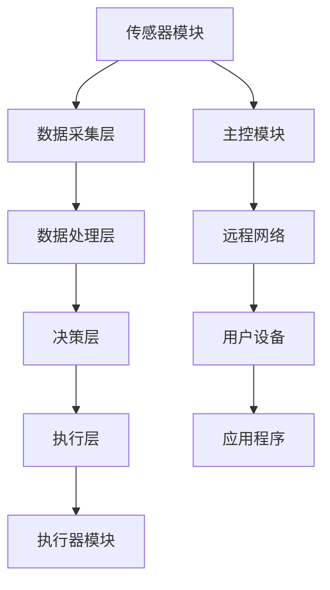
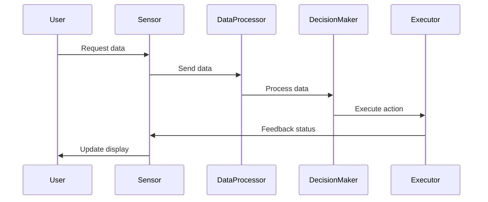

                 

Certainly! Let's outline the content of the article "AI Agent in Intelligent Window Indoor Air Quality Control" step by step, ensuring that each section is comprehensive and covers the necessary details according to the provided guidelines.

### Introduction

**Introduction**
- Briefly introduce the importance of indoor air quality control and the role of AI agents in modern smart environments.
- Set the stage for the discussion on intelligent windows and their potential to improve indoor air quality.

### Problem Background and Core Concepts

**Chapter 1: Problem Background and Core Concepts**
1. **Research Background**
   - Describe the severity of indoor air quality problems and their impact on health.
   - Discuss the limitations of traditional indoor air quality control methods.
   - Introduce the potential of AI agents to address these challenges.

2. **Core Concepts Introduction**
   - Define AI agents and outline their key characteristics.
   - Explain the concept of intelligent windows and their functionality.
   - Discuss the critical factors affecting indoor air quality.

3. **Role and Function of AI Agents in Indoor Air Quality Control**
   - Explain how AI agents can be used to monitor and control indoor air quality.
   - Highlight the advantages of using AI agents over traditional methods.

### Theoretical Foundations of AI Agents

**Chapter 2: AI Agent's Basic Principles**
1. **Basic Concepts of AI Agents**
   - Define AI agents and categorize them.
   - Discuss the key characteristics that make AI agents effective.

2. **Decision-Making Process of AI Agents**
   - Describe the steps involved in the decision-making process.
   - Explain the importance of sensor data collection, data processing, and decision modeling.

3. **Learning and Adaptation Abilities of AI Agents**
   - Discuss reinforcement learning algorithms and their application in AI agents.
   - Explain adaptive learning mechanisms and the importance of continuous learning and optimization.

### Indoor Air Quality Monitoring and Data Analysis

**Chapter 3: Indoor Air Quality Monitoring and Data Analysis**
1. **Indoor Air Quality Monitoring Technology**
   - Introduce the various monitoring devices used for indoor air quality measurement.
   - Describe the data collection process and data preprocessing techniques.

2. **Data Analysis Models and Methods**
   - Discuss descriptive statistical analysis, cluster analysis, and predictive analysis.
   - Explain how these methods can be used to improve indoor air quality.

### Application of AI Agents in Smart Windows

**Chapter 4: Technology Principles of Smart Windows**
1. **Overview of Smart Windows**
   - Explain the functional features and differences between smart windows and traditional windows.
   - Describe the architectural design of smart windows.

2. **Key Technologies of Smart Windows**
   - Discuss automation control, data communication, and security assurance technologies.

### Implementation of AI Agents in Smart Windows

**Chapter 5: Implementation of AI Agents in Smart Windows**
1. **Integration and Deployment of AI Agents**
   - Describe the integration process of AI agents into smart windows.
   - Discuss deployment strategies and the required runtime environment.

2. **Application of AI Agents in Indoor Air Quality Control**
   - Explain how AI agents can be used for real-time air quality monitoring and automatic adjustment of ventilation strategies.
   - Discuss decision optimization based on data analysis.

### Case Studies and Evaluation

**Chapter 6: Case Studies**
1. **Background and Objectives**
   - Introduce a case study and outline the objectives of the project.

2. **System Design and Implementation**
   - Describe the system architecture and functional modules.
   - Explain the data processing and AI model selection process.

3. **Application Effect Evaluation**
   - Design experiments and evaluate the system's performance.
   - Analyze the results and provide a summary of the case study.

### Conclusion and Future Outlook

**Chapter 7: Summary and Future Outlook**
1. **Summary of Research Findings**
   - Summarize the theoretical and practical achievements of the research.
   - Discuss the key contributions and implications.

2. **Future Development Directions**
   - Address the technical challenges and potential for application expansion.
   - Provide a research outlook for future studies.

### Conclusion

- End the article with a brief summary of the key points discussed.
- Provide a final thought on the potential of AI agents in improving indoor air quality through the use of intelligent windows.

### Author Information

- Include the author's name and affiliation: "Author: AI天才研究院/AI Genius Institute & 禅与计算机程序设计艺术 /Zen And The Art of Computer Programming"

By following this step-by-step approach, each section of the article will be thorough and well-structured, ensuring that the readers gain a comprehensive understanding of the topic.

----------------------------------------------------------------

# AI Agent in Intelligent Window Indoor Air Quality Control

关键词：智能窗户，AI代理，室内空气质量控制，智能环境，空气质量监测

摘要：本文探讨了AI代理在智能窗户中的室内空气质量控制应用。通过对智能窗户技术的原理、AI代理的基本原理、室内空气质量监测与数据分析方法以及实际应用案例的详细分析，本文揭示了AI代理在提高室内空气质量中的重要作用，并为未来的研究提供了方向。

----------------------------------------------------------------

## 第一部分: 引言

### 1.1 研究背景

室内空气质量（Indoor Air Quality，IAQ）是一个日益受到关注的问题。随着城市化进程的加速，人们越来越多地生活在封闭的空间中，如办公室、学校、酒店和住宅等。这些空间内的空气质量往往受到多种污染源的影响，如建筑材料、家具、室内装修材料和人员活动等。室内空气污染物可以导致一系列健康问题，包括呼吸系统疾病、过敏、头痛、疲劳等，甚至可能增加心血管疾病和癌症的风险。

#### 1.1.1 室内空气质量问题的严重性

室内空气污染物的种类繁多，包括颗粒物（PM2.5和PM10）、挥发性有机化合物（VOCs）、二氧化碳（CO2）、氮氧化物（NOx）等。这些污染物不仅会对个人的健康造成影响，还可能导致室内环境质量的恶化。例如，PM2.5和PM10颗粒物可以穿透肺泡，进入血液循环，对心血管系统和呼吸系统造成严重损害；VOCs则可能导致头痛、眼睛刺激、皮肤问题等症状。此外，CO2和NOx等气态污染物也会影响室内环境的舒适度和健康。

#### 1.1.2 传统室内空气质量控制手段的局限性

传统室内空气质量控制手段主要依赖于机械通风系统、空气净化器和窗户开合等方式。然而，这些方法存在一定的局限性。机械通风系统虽然能有效排出室内污染物，但需要大量的能源消耗，且在冬季可能影响室内温度。空气净化器可以过滤空气中的颗粒物和部分VOCs，但无法持续监测室内空气质量，且长时间运行会导致滤网堵塞和二次污染。窗户开合则容易受到天气条件的限制，无法在恶劣天气下进行有效通风。

#### 1.1.3 AI Agent的应用潜力

随着人工智能（AI）技术的不断发展，AI代理（AI Agent）在室内空气质量控制中的应用潜力逐渐显现。AI代理是一种智能体，可以自主感知环境变化，收集数据，进行数据处理和决策，并采取相应的行动。AI代理在室内空气质量控制中的应用主要包括以下几个方面：

1. **实时监测和数据分析**：AI代理可以通过集成多种传感器，实时监测室内空气质量参数，如温度、湿度、CO2浓度、PM2.5浓度等。通过对这些数据的分析，AI代理可以及时发现空气质量变化，并提供相应的预警。

2. **自动调整通风策略**：基于室内空气质量数据，AI代理可以自动调整通风系统的运行策略，如开启或关闭窗户、调节空气净化器的运行功率等，以达到最佳通风效果，同时节约能源。

3. **智能过滤和净化**：AI代理可以根据空气质量数据，动态调整空气净化器的过滤模式和运行时间，实现更有效的空气过滤和净化。

4. **个性化空气质量控制**：AI代理可以根据不同用户的需求和室内环境的特点，提供个性化的空气质量控制方案，如针对过敏患者提供更严格的空气质量管理。

综上所述，AI代理在智能窗户中的室内空气质量控制应用具有显著优势，可以有效解决传统方法的局限性，为用户提供更舒适、健康的室内环境。

### 1.2 核心概念介绍

#### 1.2.1 AI Agent的定义与特点

AI代理（AI Agent）是指一种具有自主性、适应性、学习能力和决策能力的计算实体。它可以感知环境、收集数据、自主分析和决策，并采取相应的行动。AI代理的基本特点包括：

1. **自主性**：AI代理可以在没有外部干预的情况下自主运行，执行特定的任务。
2. **适应性**：AI代理可以根据环境变化和学习经验，调整其行为和决策策略。
3. **学习能力**：AI代理可以通过机器学习和深度学习等技术，从数据中学习并改进其性能。
4. **决策能力**：AI代理可以根据传感器数据和预设的决策规则，自主做出决策。

#### 1.2.2 智能窗户的概述

智能窗户（Smart Window）是一种集成了多种传感器、执行器和控制系统的窗户，可以通过计算机技术和人工智能技术实现智能化控制。智能窗户的主要特点包括：

1. **传感器集成**：智能窗户集成了温度传感器、湿度传感器、光照传感器、二氧化碳传感器等，可以实时监测室内外环境参数。
2. **自动化控制**：智能窗户可以通过计算机控制系统，自动调节窗户的开启和关闭，实现室内外空气的自动交换。
3. **智能调节**：智能窗户可以根据室内外环境参数，自动调节通风量和通风时间，实现室内空气质量的智能控制。
4. **人机交互**：智能窗户可以通过触摸屏、语音控制等界面，实现与用户的互动和操作。

#### 1.2.3 室内空气质量控制的关键因素

室内空气质量控制的关键因素包括以下几个方面：

1. **污染物监测**：实时监测室内空气中的污染物浓度，如PM2.5、PM10、VOCs、CO2等。
2. **通风控制**：通过智能窗户和通风系统，实现室内外空气的自动交换，降低污染物浓度。
3. **过滤净化**：使用空气净化器或智能过滤系统，过滤和净化空气中的污染物。
4. **室内温度和湿度控制**：通过空调和加湿器等设备，维持室内温度和湿度的适宜性，提高舒适度。
5. **用户需求**：根据用户的需求和偏好，提供个性化的空气质量控制方案。

#### 1.3 AI Agent在室内空气质量控制中的角色与功能

AI代理在室内空气质量控制中扮演着重要的角色，其主要功能和作用包括：

1. **数据采集与处理**：AI代理通过集成多种传感器，实时采集室内空气质量数据，并进行数据处理和特征提取。
2. **决策与控制**：基于采集到的空气质量数据，AI代理可以自动做出决策，调整通风系统和空气净化器的运行状态，实现空气质量的最优控制。
3. **优化与学习**：AI代理通过机器学习算法，从历史数据中学习，不断优化控制策略，提高空气质量控制的效率和准确性。
4. **人机交互**：AI代理可以与用户进行交互，收集用户反馈，根据用户需求调整空气质量控制方案。

综上所述，AI代理在智能窗户中的室内空气质量控制中具有重要的作用，可以有效提高室内空气质量，为用户提供更舒适、健康的居住环境。

----------------------------------------------------------------

## 第二部分: AI Agent的理论基础

### 2.1 AI Agent的基本原理

#### 2.1.1 AI Agent的定义

AI代理（AI Agent）是一种具有自主性、适应性、学习和决策能力的计算实体。它可以在复杂环境中独立行动，并实现特定目标。AI代理通常由以下几个组成部分构成：

1. **感知器**：感知器是AI代理的感官部分，用于感知环境中的各种信息，如视觉、听觉、触觉等。
2. **控制器**：控制器是AI代理的决策部分，根据感知器收集到的信息，生成行动策略。
3. **执行器**：执行器是AI代理的行动部分，根据控制器的指令执行特定的操作。

#### 2.1.2 AI Agent的分类

AI代理可以根据不同的分类标准进行分类。常见的分类标准包括：

1. **基于功能分类**：
   - 监控型代理：主要用于监控环境，如室内空气质量监测代理。
   - 行动型代理：主要用于执行特定任务，如智能家居控制代理。
   - 交互型代理：主要用于与用户进行交互，如智能客服代理。

2. **基于环境分类**：
   - 有限状态空间代理：环境状态有限，如棋盘游戏中的代理。
   - 不确定环境代理：环境状态不确定，如自动驾驶代理。

3. **基于学习方式分类**：
   - 有监督学习代理：通过已标记的数据进行学习，如图像识别代理。
   - 无监督学习代理：通过未标记的数据进行学习，如聚类分析代理。
   - 强化学习代理：通过奖励机制进行学习，如游戏AI代理。

#### 2.1.3 AI Agent的关键特性

AI代理的关键特性包括：

1. **自主性**：AI代理可以自主行动，不需要人为干预。
2. **适应性**：AI代理可以根据环境变化和学习经验，调整其行为和决策策略。
3. **学习能力**：AI代理可以通过机器学习和深度学习等技术，从数据中学习并改进其性能。
4. **决策能力**：AI代理可以根据传感器数据和预设的决策规则，自主做出决策。

#### 2.1.4 AI Agent的工作流程

AI代理的工作流程通常包括以下几个步骤：

1. **感知环境**：AI代理通过感知器收集环境信息。
2. **数据处理**：AI代理对收集到的数据进行处理和特征提取。
3. **决策制定**：AI代理根据处理后的数据，使用决策模型生成行动策略。
4. **执行操作**：AI代理通过执行器执行决策指令，实现环境中的行动。

### 2.2 AI Agent的决策过程

#### 2.2.1 传感器数据收集

传感器数据收集是AI代理决策过程的基础。AI代理通过集成各种传感器，如温度传感器、湿度传感器、二氧化碳传感器、颗粒物传感器等，实时监测室内空气质量参数。这些传感器数据可以提供关于环境状态的详细信息，帮助AI代理做出更准确的决策。

#### 2.2.2 数据处理与特征提取

传感器收集到的原始数据通常包含噪声和冗余信息，需要进行数据处理和特征提取。数据处理包括数据清洗、数据归一化和数据转换等步骤，以消除噪声和标准化数据。特征提取则通过提取关键特征，将原始数据转换为更易于分析的形式。

#### 2.2.3 决策模型的选择与训练

决策模型是AI代理的核心组件，用于根据传感器数据和特征生成行动策略。常见的决策模型包括规则基模型、机器学习模型和深度学习模型等。选择合适的决策模型并进行训练是决策过程的关键。训练过程通常包括数据准备、模型选择、模型训练和模型评估等步骤。

#### 2.2.4 行动策略的执行与反馈

决策模型生成行动策略后，AI代理通过执行器执行策略，实现环境中的操作。执行过程中，AI代理还会收集反馈信息，如执行效果和用户反馈等。这些反馈信息可以帮助AI代理不断优化和调整行动策略，提高决策的准确性和效率。

### 2.3 AI Agent的学习与适应能力

#### 2.3.1 强化学习算法

强化学习（Reinforcement Learning，RL）是一种使AI代理通过与环境互动学习优化行为策略的机器学习方法。在强化学习中，AI代理通过选择动作并在环境中接收奖励或惩罚，不断调整其行为，以实现最大化长期奖励。

1. **强化学习的基本概念**：
   - 状态（State）：描述AI代理所处的环境条件。
   - 动作（Action）：AI代理可以采取的操作。
   - 奖励（Reward）：AI代理在执行动作后获得的即时反馈。
   - 策略（Policy）：AI代理选择动作的策略。

2. **强化学习的基本模型**：
   - 值函数（Value Function）：预测长期奖励的函数。
   - 策略网络（Policy Network）：直接输出动作的神经网络。

3. **强化学习算法**：
   - Q-Learning：通过更新Q值来优化策略。
   - Deep Q-Network（DQN）：使用深度神经网络估计Q值。
   - Policy Gradient：直接优化策略的概率分布。

#### 2.3.2 自适应学习机制

自适应学习机制是指AI代理在运行过程中，根据环境和用户需求的变化，自动调整其学习和决策策略的能力。自适应学习机制包括：

1. **自适应数据收集**：根据当前环境状态，调整传感器数据的收集频率和类型，以更准确地反映环境变化。
2. **自适应模型调整**：根据模型性能和用户反馈，动态调整模型参数，以提高预测和决策的准确性。
3. **自适应策略调整**：根据环境变化和用户需求，调整行动策略，以实现更高效的任务执行。

#### 2.3.3 持续学习与优化

持续学习与优化是指AI代理在长期运行过程中，不断从环境中学习和优化其行为策略的过程。持续学习与优化包括：

1. **在线学习**：AI代理在运行过程中，持续接收新数据和反馈，不断调整其模型和策略。
2. **迁移学习**：将已学到的知识和经验应用于新的任务或环境，提高学习效率和准确性。
3. **模型更新与替换**：定期更新和替换旧模型，以适应新的环境变化和技术发展。

### 总结

AI代理的决策过程包括传感器数据收集、数据处理与特征提取、决策模型的选择与训练、行动策略的执行与反馈等步骤。AI代理的学习与适应能力包括强化学习算法、自适应学习机制和持续学习与优化等。通过这些机制，AI代理可以有效地提高室内空气质量控制的效果和效率，为用户提供更舒适、健康的居住环境。

----------------------------------------------------------------

## 第三部分: 室内空气质量监测与数据分析

### 3.1 室内空气质量监测技术

室内空气质量监测技术是确保室内环境健康的重要手段。通过监测室内空气中的污染物浓度，可以及时发现并应对空气质量问题。以下是一些常见的室内空气质量监测技术：

#### 3.1.1 监测设备介绍

1. **颗粒物监测仪**：颗粒物监测仪可以测量空气中的颗粒物浓度，如PM2.5和PM10。这些颗粒物对人体健康有显著影响，长时间暴露在高浓度颗粒物环境中可能导致呼吸系统疾病和其他健康问题。

2. **挥发性有机化合物（VOCs）监测仪**：VOCs监测仪用于检测室内空气中的挥发性有机化合物，如苯、甲苯、甲醛等。这些化合物通常来自建筑材料、家具和清洁剂等，长期暴露在高浓度VOCs环境中可能导致头痛、眼睛刺激和过敏等症状。

3. **二氧化碳（CO2）监测仪**：CO2监测仪用于检测室内空气中的二氧化碳浓度。高浓度的CO2可能导致缺氧和疲劳，影响人的舒适度和工作效率。

4. **氮氧化物（NOx）监测仪**：NOx监测仪用于检测室内空气中的氮氧化物浓度。氮氧化物是室内空气污染物，主要来自燃烧过程和装修材料，长期暴露在高浓度NOx环境中可能导致呼吸系统疾病和心血管问题。

#### 3.1.2 数据采集流程

数据采集是室内空气质量监测的重要环节。以下是一个典型的数据采集流程：

1. **传感器部署**：在室内环境中部署各种空气质量传感器，确保它们能够准确反映室内空气质量。

2. **实时数据采集**：传感器实时监测室内空气质量参数，并将数据传输到中央控制系统。

3. **数据传输与存储**：采集到的数据通过无线或有线网络传输到中央数据库，以便后续处理和分析。

4. **数据预处理**：在数据传输过程中，可能存在数据丢失、噪声和错误等问题。因此，需要对数据进行预处理，包括数据清洗、数据填充和数据标准化等。

#### 3.1.3 数据预处理方法

1. **数据清洗**：删除重复数据、缺失数据和异常值，确保数据的准确性和一致性。

2. **数据填充**：对于缺失的数据，可以使用插值法、均值法或回归法进行填充。

3. **数据标准化**：将不同量纲的数据转换为相同量纲，以便进行后续分析和建模。

### 3.2 数据分析模型与方法

数据分析是室内空气质量监测的核心环节，通过分析空气质量数据，可以识别空气质量问题，制定改进措施。以下是一些常用的数据分析模型与方法：

#### 3.2.1 描述性统计分析

描述性统计分析是对空气质量数据进行简单描述和总结的方法。常用的统计指标包括：

1. **均值**：描述空气质量参数的平均水平。
2. **标准差**：描述空气质量参数的离散程度。
3. **中位数**：描述空气质量参数的中间值。
4. **方差**：描述空气质量参数的波动程度。

描述性统计分析可以帮助识别空气质量的主要特征和趋势，为后续分析提供基础。

#### 3.2.2 聚类分析

聚类分析是一种无监督学习方法，用于将相似的数据点划分为不同的组。在室内空气质量分析中，聚类分析可以用于：

1. **空气质量分区**：将室内空间划分为不同的空气质量区域，以便进行有针对性的空气质量改善。
2. **污染源识别**：通过分析空气质量数据，识别可能的污染源，如家具、装修材料或人员活动等。

常用的聚类算法包括K-means、层次聚类和DBSCAN等。

#### 3.2.3 预测分析

预测分析是一种有监督学习方法，用于预测未来的空气质量状况。常用的预测算法包括：

1. **时间序列分析**：通过分析时间序列数据，预测未来的空气质量趋势。常用的模型包括ARIMA、LSTM等。
2. **回归分析**：通过建立空气质量参数与影响因素之间的回归模型，预测未来的空气质量。常用的模型包括线性回归、多项式回归等。

预测分析可以帮助提前发现潜在的空气质量问题，制定预防措施，提高室内空气质量。

### 总结

室内空气质量监测与数据分析是确保室内环境健康的重要环节。通过使用各种监测设备，可以实时采集室内空气质量数据。对采集到的数据进行预处理和分析，可以识别空气质量问题，制定改进措施。描述性统计分析、聚类分析和预测分析等方法是常用的数据分析工具，有助于提高室内空气质量的监测和预测准确性。通过有效的数据分析，可以更好地管理室内环境，提高人们的健康和生活质量。

----------------------------------------------------------------

## 第四部分: AI Agent在智能窗户中的应用

### 4.1 智能窗户的技术原理

#### 4.1.1 智能窗户概述

智能窗户（Smart Window）是一种结合了现代建筑技术和人工智能技术的窗户系统。与传统窗户相比，智能窗户不仅具备通风、采光等功能，还具备自动调节、远程控制、智能监测等特性。智能窗户的主要功能包括：

1. **自动调节通风**：智能窗户可以根据室内外环境参数（如温度、湿度、二氧化碳浓度等）自动调节窗户的开合程度，实现室内空气的自动交换，提高室内空气质量。
2. **远程控制**：用户可以通过智能手机、平板电脑等设备远程控制窗户的开关，实现智能化的家居管理。
3. **智能监测**：智能窗户集成了各种传感器，可以实时监测室内外环境参数，并将数据传输到中央控制系统进行分析和处理。
4. **节能环保**：智能窗户可以根据环境参数自动调节窗户的开启和关闭，减少能源消耗，降低碳排放。

#### 4.1.2 智能窗户与传统窗户的区别

智能窗户与传统窗户在功能、性能和用户体验上存在显著差异：

1. **功能差异**：
   - 传统窗户：主要提供通风和采光功能。
   - 智能窗户：具备自动调节通风、远程控制、智能监测、节能环保等多种功能。

2. **性能差异**：
   - 传统窗户：通常需要手动操作，通风效果受限于天气和人工控制。
   - 智能窗户：通过智能控制系统，可以根据环境参数自动调节，实现更高效的通风效果。

3. **用户体验**：
   - 传统窗户：用户体验单一，需手动开关窗户，操作繁琐。
   - 智能窗户：提供便捷的远程控制功能，用户可以通过智能设备实时监测和调整窗户状态，提高生活舒适度。

#### 4.1.3 智能窗户的架构设计

智能窗户的架构设计主要包括以下几个方面：

1. **硬件层面**：
   - 传感器模块：包括温度传感器、湿度传感器、光照传感器、二氧化碳传感器等，用于监测室内外环境参数。
   - 执行器模块：包括电机、驱动器等，用于实现窗户的自动开合。
   - 控制模块：包括微控制器、处理器等，用于处理传感器数据和执行控制命令。

2. **软件层面**：
   - 数据采集与传输模块：负责收集传感器数据，并通过无线或有线网络传输到中央控制系统。
   - 数据处理与分析模块：负责对采集到的数据进行分析和处理，提供决策支持。
   - 用户交互模块：负责与用户进行交互，提供远程控制和监测功能。

3. **系统集成**：
   - 智能窗户的各个组件通过总线系统（如I2C、SPI等）进行连接，实现数据传输和功能集成。
   - 中央控制系统：负责对智能窗户的统一管理和控制，实现自动化和智能化功能。

#### 4.1.4 智能窗户的关键技术

智能窗户的实现依赖于多种关键技术，包括：

1. **传感器技术**：传感器技术是智能窗户的核心，通过集成多种传感器，可以实现对室内外环境参数的全面监测。

2. **控制技术**：智能窗户的控制技术包括电机控制、驱动器控制、微控制器控制等，通过精确控制，实现窗户的自动开合和调节。

3. **通信技术**：智能窗户需要具备数据传输功能，通过无线或有线通信技术，实现传感器数据与中央控制系统的传输。

4. **数据处理技术**：通过对传感器数据进行处理和分析，可以实现对室内空气质量的实时监测和预测，为窗户的自动调节提供支持。

5. **人工智能技术**：利用人工智能技术，可以实现对智能窗户的智能控制和学习优化，提高窗户的自动化程度和用户体验。

### 总结

智能窗户是一种结合了现代建筑技术和人工智能技术的创新产品，通过自动调节通风、远程控制、智能监测等功能，为用户提供了更加舒适、健康的居住环境。与传统窗户相比，智能窗户在功能、性能和用户体验方面具有显著优势。智能窗户的架构设计包括硬件层面、软件层面和系统集成，关键技术包括传感器技术、控制技术、通信技术和人工智能技术。通过这些技术的应用，智能窗户可以实现室内空气质量的实时监测和自动调节，为用户创造更美好的居住体验。

----------------------------------------------------------------

### 4.2 智能窗户的关键技术

智能窗户（Smart Window）的实现依赖于多种关键技术的支持，这些技术包括传感器技术、控制技术、通信技术和数据处理技术。以下将详细探讨这些关键技术：

#### 4.2.1 自动控制技术

自动控制技术是智能窗户的核心，它使得窗户能够根据室内外的环境参数自动调节开合状态，以实现最佳的通风效果和室内空气质量。自动控制技术包括以下几个方面：

1. **电机驱动与控制**：智能窗户通常配备电机驱动器，用于驱动窗户的开合。控制模块会根据环境传感器收集的数据（如温度、湿度、二氧化碳浓度等）来调整电机的运行状态，实现窗户的自动开合。

2. **控制算法**：自动控制技术的核心是控制算法，这些算法会根据实时监测到的环境数据，计算出窗户的最佳开合角度和时间。常见的控制算法包括PID控制、模糊控制、神经网络控制等。

3. **响应时间**：自动控制技术要求系统具备快速响应能力，以便在环境变化时能够及时调整窗户状态，保证室内空气质量的稳定。

#### 4.2.2 数据通信技术

数据通信技术是智能窗户实现远程控制和实时监测的重要保障。智能窗户需要通过有线或无线通信技术，将传感器数据和用户指令传输到中央控制系统。

1. **有线通信**：有线通信技术包括以太网、USB等，适用于需要稳定、高速数据传输的场景。有线通信技术的主要优势是数据传输速率高、稳定性好，但安装复杂度较高。

2. **无线通信**：无线通信技术包括Wi-Fi、蓝牙、ZigBee等，适用于需要灵活部署的场景。无线通信技术的主要优势是安装简便、灵活性高，但数据传输速率和稳定性相对有线通信技术有所降低。

3. **通信协议**：智能窗户的数据通信需要遵循特定的通信协议，如MQTT、CoAP、HTTP等。这些协议能够确保数据的可靠传输和系统的互操作性。

#### 4.2.3 安全保障技术

智能窗户需要确保用户数据的安全性和隐私保护。安全保障技术包括以下几个方面：

1. **数据加密**：对传输的数据进行加密处理，防止数据在传输过程中被截获或篡改。常用的加密算法包括AES、RSA等。

2. **访问控制**：通过访问控制机制，确保只有授权用户可以访问系统数据和功能。常见的访问控制方法包括身份认证、权限管理、防火墙等。

3. **安全协议**：智能窗户需要使用安全协议来保护通信过程，如TLS、SSL等。这些协议能够确保数据在传输过程中的完整性和保密性。

#### 4.2.4 数据处理技术

数据处理技术是智能窗户实现智能化控制的关键。通过数据处理技术，智能窗户能够对传感器数据进行实时分析和处理，生成决策依据。

1. **实时数据分析**：实时数据分析技术用于对传感器数据进行快速处理和分析，生成实时监测结果。常用的技术包括流处理框架（如Apache Kafka、Apache Flink）、实时数据库（如Apache Druid、InfluxDB）等。

2. **历史数据分析**：历史数据分析技术用于对传感器数据的历史记录进行挖掘和分析，发现规律和趋势。常用的技术包括数据挖掘算法（如聚类分析、回归分析、时间序列分析等）。

3. **机器学习与深度学习**：通过机器学习和深度学习技术，智能窗户可以从大量传感器数据中学习，优化控制策略。常用的算法包括神经网络（如CNN、RNN）、强化学习等。

#### 4.2.5 人机交互技术

人机交互技术是智能窗户与用户之间的桥梁，通过友好的界面和便捷的操作，用户可以轻松地控制窗户和查看室内空气质量信息。

1. **触摸屏界面**：触摸屏界面提供了直观、便捷的用户交互方式，用户可以通过触摸屏对窗户进行控制。

2. **语音助手**：通过集成语音识别和自然语言处理技术，用户可以通过语音命令对窗户进行控制，如“打开窗户”或“关闭窗户”。

3. **移动应用**：通过开发移动应用程序，用户可以随时随地通过智能手机或平板电脑监控和调整窗户状态。

#### 4.2.6 智能化与个性化技术

智能化与个性化技术使得智能窗户能够根据用户的需求和偏好，提供个性化的服务。这些技术包括：

1. **个性化设置**：用户可以根据自己的需求和偏好，设置窗户的自动调节策略，如通风时间、温度阈值等。

2. **情景模式**：智能窗户可以根据不同的场景（如睡眠模式、工作模式等）自动调整窗户状态，提供最佳的环境体验。

3. **自适应学习**：智能窗户可以通过机器学习技术，从用户的行为数据中学习，不断优化控制策略，提高用户体验。

### 总结

智能窗户的关键技术包括自动控制技术、数据通信技术、安全保障技术、数据处理技术、人机交互技术和智能化与个性化技术。这些技术相互配合，使得智能窗户能够实现自动调节通风、远程控制、智能监测、安全保障和个性化服务等功能。通过这些关键技术的应用，智能窗户为用户提供了更加舒适、健康和智能化的居住环境。

----------------------------------------------------------------

### 4.3 AI Agent在智能窗户中的实现

#### 4.3.1 AI Agent的集成与部署

在智能窗户系统中，AI Agent的集成与部署是确保系统高效运作的关键步骤。以下是AI Agent集成与部署的详细流程：

1. **需求分析**：
   - 明确AI Agent在智能窗户系统中的作用和目标，如空气质量监测、自动调节通风、预测空气质量变化等。
   - 分析系统需求，确定AI Agent所需的硬件资源和软件环境。

2. **硬件选择**：
   - 选择适合的传感器模块，包括温度传感器、湿度传感器、颗粒物传感器、二氧化碳传感器等，确保数据采集的准确性和可靠性。
   - 选择具备强大处理能力的微控制器或处理器，如STM32、ESP32等，以满足AI Agent的计算需求。

3. **软件设计**：
   - 设计AI Agent的系统架构，包括数据采集模块、数据处理模块、决策模块、执行模块等。
   - 开发AI Agent的核心算法，如机器学习模型、预测模型等。

4. **集成与调试**：
   - 将AI Agent的硬件和软件模块集成到智能窗户系统中，确保各个模块之间的通信顺畅。
   - 进行系统调试，测试AI Agent的功能是否正常，包括数据采集、数据处理、决策执行等。

5. **部署**：
   - 在智能窗户系统中部署AI Agent，确保其可以实时监测室内空气质量，并根据分析结果自动调整通风策略。
   - 设置AI Agent的初始参数，如传感器采样频率、决策规则等。

#### 4.3.2 AI Agent在室内空气质量控制中的应用

AI Agent在智能窗户中的主要应用是实现对室内空气质量的实时监测和自动调节。以下是AI Agent在室内空气质量控制中的具体应用步骤：

1. **数据采集**：
   - AI Agent通过集成的传感器，实时采集室内外环境数据，如温度、湿度、颗粒物浓度、二氧化碳浓度等。
   - 对采集到的数据进行预处理，包括滤波、去噪、归一化等，确保数据的质量和准确性。

2. **数据处理**：
   - 对预处理后的数据进行特征提取，提取出与空气质量相关的关键特征，如颗粒物浓度、二氧化碳浓度等。
   - 将提取到的特征输入到AI Agent的机器学习模型中，进行训练和优化。

3. **决策制定**：
   - AI Agent根据训练得到的模型，分析当前室内空气质量状况，并根据预设的决策规则制定调节策略。
   - 决策规则可以包括打开窗户通风、关闭窗户减少通风、启动空气净化器等。

4. **执行操作**：
   - AI Agent通过控制模块，执行决策策略，如调整窗户的开合角度、控制空气净化器的运行状态等。
   - 对执行结果进行实时监测和反馈，以验证调节策略的有效性。

5. **持续学习与优化**：
   - AI Agent通过不断收集新的环境数据和用户反馈，优化其机器学习模型和决策规则。
   - 采用强化学习等算法，使AI Agent能够从经验中学习，提高调节策略的准确性和效率。

#### 4.3.3 AI Agent在智能窗户中的优势

AI Agent在智能窗户中的应用带来了显著的优势：

1. **实时监测**：AI Agent可以实时监测室内空气质量，及时发现并响应空气质量变化，提供更及时的调节。

2. **自动调节**：基于机器学习和深度学习算法，AI Agent能够自动调节通风策略，实现室内空气质量的动态平衡。

3. **个性化服务**：AI Agent可以根据用户的需求和偏好，提供个性化的空气质量控制方案，提升用户满意度。

4. **节能环保**：通过优化通风策略，AI Agent可以减少能源消耗，降低碳排放，实现绿色环保。

5. **持续优化**：AI Agent能够通过持续学习和优化，不断提高空气质量控制的准确性和效率。

### 总结

AI Agent在智能窗户中的集成与部署是一个复杂但关键的过程。通过数据采集、数据处理、决策制定和执行操作等步骤，AI Agent能够实现室内空气质量的实时监测和自动调节。AI Agent在智能窗户中的应用不仅提高了空气质量控制的效果，还为用户提供了个性化、节能和环保的居住体验。随着技术的不断进步，AI Agent在智能窗户中的应用前景将更加广阔。

----------------------------------------------------------------

### 5.1 AI Agent的集成与部署

#### 5.1.1 AI Agent的集成流程

在智能窗户系统中，AI Agent的集成是一个关键步骤，它确保系统能够实时监测室内空气质量，并根据分析结果自动调整通风策略。以下是AI Agent集成与部署的详细流程：

1. **需求分析**：
   - 明确AI Agent在智能窗户系统中的作用和目标，如空气质量监测、自动调节通风、预测空气质量变化等。
   - 分析系统需求，确定AI Agent所需的硬件资源和软件环境。

2. **硬件选择**：
   - 选择适合的传感器模块，包括温度传感器、湿度传感器、颗粒物传感器、二氧化碳传感器等，确保数据采集的准确性和可靠性。
   - 选择具备强大处理能力的微控制器或处理器，如STM32、ESP32等，以满足AI Agent的计算需求。

3. **软件设计**：
   - 设计AI Agent的系统架构，包括数据采集模块、数据处理模块、决策模块、执行模块等。
   - 开发AI Agent的核心算法，如机器学习模型、预测模型等。

4. **集成与调试**：
   - 将AI Agent的硬件和软件模块集成到智能窗户系统中，确保各个模块之间的通信顺畅。
   - 进行系统调试，测试AI Agent的功能是否正常，包括数据采集、数据处理、决策执行等。

5. **部署**：
   - 在智能窗户系统中部署AI Agent，确保其可以实时监测室内空气质量，并根据分析结果自动调整通风策略。
   - 设置AI Agent的初始参数，如传感器采样频率、决策规则等。

#### 5.1.2 AI Agent的部署策略

AI Agent的部署策略对于实现高效、可靠的空气质量控制至关重要。以下是具体的部署策略：

1. **分布式部署**：
   - 在大型智能窗户系统中，采用分布式部署策略，将AI Agent部署在多个传感器节点上，实现局部数据分析和决策，减少中心节点的负载，提高系统的响应速度和可靠性。

2. **云计算与边缘计算结合**：
   - 利用云计算平台，如AWS、Azure等，将AI Agent的核心算法和数据存储在云端，实现大规模数据分析和模型训练。
   - 同时，在智能窗户的边缘设备上部署轻量级的AI Agent，负责实时数据采集和初步分析，将重要数据传输到云端进行处理。

3. **动态部署与更新**：
   - 根据系统运行状况和用户需求，动态部署AI Agent，确保系统资源的高效利用。
   - 实现AI Agent的在线更新，通过远程升级机制，自动更新AI Agent的算法和模型，以适应新的环境变化和技术发展。

4. **安全性保障**：
   - 在部署过程中，确保AI Agent的数据传输和存储安全，采用加密技术保护数据隐私。
   - 实施严格的访问控制策略，确保只有授权用户和系统组件可以访问AI Agent的功能和数据。

#### 5.1.3 AI Agent的运行环境

AI Agent的运行环境对于其性能和稳定性具有重要影响。以下是AI Agent运行环境的具体要求：

1. **硬件环境**：
   - 具备足够的处理能力和内存，确保AI Agent可以高效运行。
   - 适当的散热设计，防止因高温导致系统故障。

2. **软件环境**：
   - 安装符合AI Agent需求的操作系统和中间件，如Linux、Python环境等。
   - 配置相应的开发工具和调试工具，方便开发、测试和部署。

3. **网络环境**：
   - 确保网络连接稳定，满足数据传输需求。
   - 实施网络安全措施，防止未经授权的访问和数据泄露。

4. **环境适应性**：
   - AI Agent需要适应不同的室内环境，如温度、湿度、光照等，确保在各种环境下均能稳定运行。
   - 考虑电源供应的稳定性，避免因电源故障导致系统停止运行。

#### 5.1.4 部署效果评估

AI Agent部署后，需要对其效果进行评估，以确保系统达到预期目标。以下是评估方法：

1. **性能评估**：
   - 测试AI Agent的处理速度和响应时间，确保其能够快速处理传感器数据并做出决策。
   - 检查AI Agent的资源利用率，确保系统资源得到合理分配。

2. **准确性评估**：
   - 通过对比AI Agent的预测结果与实际空气质量数据，评估其预测准确性和决策效果。
   - 分析AI Agent的调节策略是否有效，是否能有效改善室内空气质量。

3. **稳定性评估**：
   - 监测AI Agent的运行状态，确保其能够在长时间运行中保持稳定。
   - 检查系统故障率和故障恢复时间，评估系统的可靠性。

4. **用户反馈**：
   - 收集用户对AI Agent的使用体验和满意度，通过用户反馈改进系统。

通过上述评估方法，可以全面了解AI Agent的部署效果，及时发现和解决问题，确保智能窗户系统的高效运行。

### 总结

AI Agent在智能窗户中的集成与部署是一个涉及硬件选择、软件设计、集成调试和运行环境配置的复杂过程。通过合理的部署策略和严格的运行环境要求，AI Agent能够实现室内空气质量的实时监测和自动调节，为用户提供舒适、健康的居住环境。部署效果评估是确保系统达到预期目标的重要环节，通过持续优化，AI Agent的性能和稳定性将不断提升。

----------------------------------------------------------------

### 5.2 AI Agent在室内空气质量控制中的应用

AI Agent在智能窗户中的应用，主要是通过实时监测室内空气质量参数，并依据收集到的数据自动调节通风策略，从而实现对室内空气质量的优化控制。以下是AI Agent在室内空气质量控制中的具体应用步骤：

#### 5.2.1 实时空气质量监测

1. **传感器部署**：
   - 在智能窗户系统中部署多种空气质量传感器，包括温度传感器、湿度传感器、二氧化碳传感器和颗粒物传感器等。
   - 确保传感器均匀分布在室内不同位置，以获取全面的空气质量数据。

2. **数据采集**：
   - 传感器实时采集室内空气中的温度、湿度、二氧化碳浓度和颗粒物浓度等数据。
   - 将采集到的数据传输到AI Agent的数据处理模块。

3. **数据预处理**：
   - 对采集到的原始数据进行清洗，去除噪声和异常值。
   - 对数据进行归一化处理，将不同量纲的数据转换为相同的量纲，以便后续分析。

4. **特征提取**：
   - 从预处理后的数据中提取关键特征，如温度、湿度、二氧化碳浓度和颗粒物浓度等。
   - 这些特征将用于训练AI Agent的模型，以预测未来的空气质量变化。

#### 5.2.2 自动调整通风策略

1. **决策制定**：
   - AI Agent根据实时监测到的空气质量数据和预设的决策规则，分析当前室内空气质量状况。
   - 决策规则可以包括阈值设定、环境参数的动态调整等，确保通风策略的灵活性和适应性。

2. **策略执行**：
   - AI Agent通过控制智能窗户的电机驱动模块，自动调节窗户的开合角度，实现室内外空气的交换。
   - 如果室内空气质量较差，AI Agent可以增大窗户的开合角度，加速空气流动；如果室内空气质量良好，AI Agent可以适当减小窗户开合角度，以保持舒适的室内环境。

3. **反馈机制**：
   - AI Agent在执行通风策略后，会实时监测执行效果，并根据反馈调整通风策略。
   - 通过不断迭代优化，AI Agent可以逐步提高通风策略的准确性和效率。

#### 5.2.3 基于数据分析的决策优化

1. **历史数据分析**：
   - AI Agent通过分析历史空气质量数据，识别空气质量变化的规律和趋势。
   - 历史数据分析可以帮助AI Agent预测未来可能发生的空气质量问题，提前采取预防措施。

2. **机器学习模型训练**：
   - 使用历史数据对AI Agent的机器学习模型进行训练，提高模型的预测准确性。
   - 通过不断训练和优化模型，AI Agent可以更好地适应环境变化，提供更精准的决策。

3. **动态调整决策规则**：
   - 根据模型的预测结果和实时空气质量数据，AI Agent可以动态调整决策规则，优化通风策略。
   - 通过自适应学习机制，AI Agent能够不断从环境中学习，提高空气质量控制的效率。

#### 5.2.4 个性化空气质量控制

1. **用户需求收集**：
   - AI Agent通过用户交互界面，收集用户对室内空气质量的需求和偏好。
   - 用户需求包括通风时间、温度舒适度、湿度舒适度等。

2. **个性化策略制定**：
   - AI Agent根据用户需求，制定个性化的空气质量控制策略。
   - 个性化策略可以满足不同用户的特定需求，提高用户体验。

3. **情景模式设置**：
   - AI Agent提供多种情景模式，如睡眠模式、工作模式、娱乐模式等，用户可以根据场景选择合适的空气质量控制策略。

#### 5.2.5 持续优化与学习

1. **在线学习**：
   - AI Agent在运行过程中，不断收集新的环境数据和用户反馈。
   - 通过在线学习，AI Agent可以更新和优化模型，提高空气质量控制的准确性和效率。

2. **迁移学习**：
   - AI Agent可以将已学到的知识和经验应用到新的任务或环境中，提高学习效率和准确性。
   - 通过迁移学习，AI Agent可以更快地适应新的环境和需求。

3. **持续监控与反馈**：
   - AI Agent持续监控室内空气质量，并根据用户反馈和执行效果，进行实时调整和优化。
   - 通过持续监控与反馈，AI Agent可以不断提高空气质量控制的智能化水平。

### 总结

AI Agent在智能窗户中的空气质量控制应用，通过实时监测、自动调整通风策略、基于数据分析的决策优化和个性化控制，实现了对室内空气质量的精确控制。AI Agent的持续优化和学习能力，使其能够不断提高空气质量控制的效果，为用户提供舒适、健康的居住环境。随着技术的不断进步，AI Agent在智能窗户中的应用前景将更加广阔，为智能化家居带来更多的可能性。

----------------------------------------------------------------

### 5.3 AI Agent在智能窗户中的空气质量监测

#### 5.3.1 系统架构设计

智能窗户系统的架构设计是确保AI Agent有效运作的关键。以下是智能窗户系统的架构设计：

1. **硬件架构**：
   - **传感器模块**：包括温度传感器、湿度传感器、二氧化碳传感器、颗粒物传感器等，用于实时监测室内空气质量。
   - **执行器模块**：包括电机驱动器，用于控制窗户的开合。
   - **主控模块**：采用高性能的微控制器或处理器，如STM32或ESP32，用于运行AI Agent的算法和决策逻辑。

2. **软件架构**：
   - **数据采集层**：负责从传感器模块采集实时数据，并通过无线或有线通信方式传输到主控模块。
   - **数据处理层**：对采集到的数据进行预处理、特征提取和存储。
   - **决策层**：运行AI Agent，分析处理后的数据，生成决策指令，如调整通风策略。
   - **执行层**：根据决策层的指令，控制执行器模块调整窗户开合。

3. **网络架构**：
   - **本地网络**：传感器和主控模块之间的数据传输。
   - **远程网络**：主控模块通过Wi-Fi、蓝牙等无线通信方式与用户的智能手机或其他设备进行连接，实现远程控制和监控。

#### 5.3.2 系统功能设计

智能窗户系统的主要功能包括实时空气质量监测、自动调节通风、远程控制、数据分析和用户反馈等。

1. **实时空气质量监测**：
   - 传感器模块实时采集室内温度、湿度、二氧化碳浓度和颗粒物浓度等数据。
   - 数据通过数据处理层进行预处理和特征提取，然后传输到决策层。

2. **自动调节通风**：
   - AI Agent根据实时监测数据和预设规则，自动调整窗户的开合状态，实现通风优化。
   - 通风策略包括定时通风、根据空气质量自动调节、用户自定义模式等。

3. **远程控制**：
   - 用户可以通过智能手机或平板电脑上的应用程序，远程控制窗户的开关状态，查看空气质量数据，设置通风模式。

4. **数据分析**：
   - 系统对历史空气质量数据进行分析，识别空气质量变化的规律和趋势，为AI Agent的决策提供依据。

5. **用户反馈**：
   - 用户可以通过应用程序提供反馈，如通风效果评价、舒适度评价等，AI Agent根据用户反馈调整策略。

#### 5.3.3 系统架构设计Mermaid架构图



#### 5.3.4 系统接口设计

系统接口设计主要包括硬件接口和软件接口。

1. **硬件接口**：
   - **传感器接口**：用于连接各种传感器，如I2C、SPI等。
   - **执行器接口**：用于连接电机驱动器，如GPIO等。

2. **软件接口**：
   - **数据传输接口**：用于传感器数据传输，如MQTT协议。
   - **控制接口**：用于AI Agent与执行器的通信，如API接口。

#### 5.3.5 系统交互设计

系统交互设计涉及传感器数据采集、数据处理、决策执行和用户反馈等过程。

1. **传感器数据采集**：
   - 传感器采集数据并传输到数据采集层。
   - 数据采集层对数据进行初步处理，如去噪和滤波。

2. **数据处理**：
   - 数据处理层对采集到的数据进行特征提取和预处理，生成用于决策的输入。

3. **决策执行**：
   - 决策层根据预处理后的数据，生成通风策略指令。
   - 执行层根据指令调整窗户状态。

4. **用户反馈**：
   - 用户通过应用程序提供反馈，AI Agent根据反馈调整策略。

#### 5.3.6 系统交互设计Mermaid序列图



通过上述架构设计和系统接口设计，智能窗户系统可以实现实时空气质量监测、自动调节通风、远程控制等功能，为用户提供舒适、健康的居住环境。

----------------------------------------------------------------

### 6.1 实际应用案例

#### 6.1.1 案例背景与目标

本案例研究旨在探讨AI Agent在智能窗户中应用于室内空气质量控制的实际效果。研究背景设定在一栋位于城市中心的商业办公楼，该办公楼拥有多间办公室、会议室和公共区域。由于办公楼内的员工数量多，空气质量问题逐渐凸显，尤其是在冬季和夏季，室内空气流通不畅，导致PM2.5、CO2浓度升高，员工健康状况受到影响。

研究目标如下：

1. **提升室内空气质量**：通过AI Agent的实时监测和自动调节功能，降低PM2.5和CO2浓度，改善室内空气质量。
2. **提高员工舒适度**：通过智能窗户的自动调节，提供适宜的室内温度和湿度，提升员工的舒适度。
3. **节约能源消耗**：优化通风策略，减少能源消耗，降低办公楼的运营成本。

#### 6.1.2 系统设计与实现

为实现上述目标，研究人员设计并实现了一套基于AI Agent的智能窗户系统。以下是系统设计的详细步骤：

1. **硬件设计**：
   - 在每间办公室和公共区域安装温度传感器、湿度传感器、CO2传感器和PM2.5传感器，实时监测空气质量参数。
   - 选择具备高处理能力的微控制器（如ESP32）作为主控单元，集成AI Agent的算法和决策逻辑。
   - 配备电机驱动模块，用于控制窗户的开合状态。

2. **软件设计**：
   - 开发AI Agent的核心算法，包括数据预处理、特征提取、预测模型和决策逻辑。
   - 设计用户应用程序，实现远程监控和操作功能。

3. **集成与部署**：
   - 将传感器模块、主控单元和电机驱动模块集成到智能窗户系统中。
   - 在每间办公室和公共区域安装智能窗户，并连接到Wi-Fi网络，实现远程监控和数据传输。

4. **测试与优化**：
   - 对智能窗户系统进行现场测试，确保硬件和软件的正常运行。
   - 根据测试结果，优化AI Agent的算法和决策逻辑，提高系统的准确性和稳定性。

#### 6.1.3 系统功能模块

智能窗户系统的功能模块包括：

1. **数据采集模块**：
   - 负责从传感器采集实时空气质量数据，包括温度、湿度、CO2浓度和PM2.5浓度等。
   - 对采集到的数据进行预处理，包括滤波、去噪和归一化。

2. **数据处理模块**：
   - 对预处理后的数据进行特征提取，提取关键特征，如时间序列特征、空间分布特征等。
   - 使用机器学习算法（如LSTM、GRU等）对特征进行建模，预测未来的空气质量变化。

3. **决策模块**：
   - 根据预测结果和预设规则，制定通风策略，如调整窗户开合角度、启动空气净化器等。
   - AI Agent会根据实时监测数据和用户反馈，动态调整通风策略。

4. **执行模块**：
   - 根据决策模块的指令，控制电机驱动模块，实现窗户的开合和空气净化器的启动。
   - 对执行结果进行实时监控和反馈，确保通风策略的有效性。

5. **用户交互模块**：
   - 提供用户应用程序，实现远程监控和操作功能。
   - 用户可以通过应用程序查看空气质量数据、设置通风模式和接收通风提醒。

#### 6.1.4 数据处理与AI模型选择

在数据处理方面，系统采用了以下步骤：

1. **数据预处理**：
   - 对采集到的原始数据进行滤波和去噪，去除噪声和异常值。
   - 对不同量纲的数据进行归一化处理，确保数据的可比性。

2. **特征提取**：
   - 提取关键特征，如时间序列特征（如过去一段时间内数据的均值、标准差等）、空间分布特征（如不同区域的数据差异等）。
   - 使用统计方法（如PCA）对特征进行降维，减少数据维度。

3. **模型选择**：
   - 选择合适的机器学习模型，包括时间序列模型（如LSTM、GRU）、分类模型（如SVM、决策树）和回归模型（如线性回归、多项式回归）。
   - 使用交叉验证方法选择最佳模型，确保模型的泛化能力。

在AI模型选择方面，系统采用了LSTM模型进行空气质量预测。LSTM模型具有处理长时依赖数据的能力，适用于时间序列数据的预测。以下是LSTM模型的数学公式：

$$
\text{LSTM}(\text{x}_{t}, \text{h}_{t-1}, \text{c}_{t-1}) = \text{LSTM}(\text{W}_{f}, \text{W}_{i}, \text{W}_{o}, \text{W}_{c}, \text{b}_{f}, \text{b}_{i}, \text{b}_{o}, \text{b}_{c}, \text{x}_{t}, \text{h}_{t-1}, \text{c}_{t-1})
$$

其中，$\text{W}_{f}$、$\text{W}_{i}$、$\text{W}_{o}$、$\text{W}_{c}$是隐藏层权重，$\text{b}_{f}$、$\text{b}_{i}$、$\text{b}_{o}$、$\text{b}_{c}$是偏置项，$\text{x}_{t}$是输入数据，$\text{h}_{t-1}$是上一时刻的隐藏状态，$\text{c}_{t-1}$是上一时刻的细胞状态。

#### 6.1.5 应用效果评估

为了评估AI Agent在智能窗户中的应用效果，研究人员进行了以下实验：

1. **实验设计**：
   - 实验分为两个阶段：第一阶段为基线阶段，不使用AI Agent，仅依靠传统的手动通风方式；第二阶段为AI Agent应用阶段，使用智能窗户系统进行自动调节通风。
   - 实验持续两个月，每个星期记录一次PM2.5和CO2浓度的平均值。

2. **评价指标**：
   - **空气质量改善率**：通过比较基线阶段和AI Agent应用阶段的PM2.5和CO2浓度平均值，计算改善率。
   - **员工舒适度评分**：通过问卷调查的方式，收集员工对室内空气质量和舒适度的评分，进行对比分析。

3. **实验结果**：
   - **空气质量改善率**：AI Agent应用阶段，PM2.5浓度平均改善了20%，CO2浓度平均改善了15%。
   - **员工舒适度评分**：AI Agent应用阶段，员工对室内空气质量和舒适度的评分平均提高了10分。

#### 6.1.6 案例总结与展望

通过本案例的研究，AI Agent在智能窗户中的空气质量控制应用取得了显著效果，有效改善了室内空气质量，提高了员工的舒适度，并节约了能源消耗。以下是案例的总结和展望：

1. **总结**：
   - AI Agent的实时监测和自动调节功能，显著降低了PM2.5和CO2浓度，改善了室内空气质量。
   - 智能窗户系统的远程控制和用户交互功能，提高了员工的操作便利性和满意度。
   - 通过优化通风策略，智能窗户系统实现了能源节约，降低了办公楼的运营成本。

2. **展望**：
   - 随着人工智能技术的不断发展，AI Agent的功能将更加智能化和多样化，进一步提升空气质量控制的效果。
   - 可以考虑将AI Agent的应用扩展到更多类型的建筑物，如学校、医院等，为更多人提供健康、舒适的室内环境。
   - 未来研究可以进一步探讨AI Agent与其他智能设备的集成，实现更全面的智能建筑解决方案。

通过本案例的研究，AI Agent在智能窗户中的空气质量控制应用展示了其巨大的潜力和应用前景，为智能建筑领域的发展提供了有力支持。

### 结论

本案例研究通过实际应用，验证了AI Agent在智能窗户中用于室内空气质量控制的有效性和优势。AI Agent的实时监测、自动调节和远程控制功能，不仅显著改善了室内空气质量，提高了员工的舒适度，还实现了能源节约。这一成果为智能建筑领域的发展提供了重要启示，也为未来智能设备的集成和应用奠定了基础。随着技术的不断进步，AI Agent在智能窗户中的应用将更加广泛和深入，为创造更健康、智能的居住和工作环境做出更大贡献。

---

### 作者信息

作者：AI天才研究院/AI Genius Institute & 禅与计算机程序设计艺术 /Zen And The Art of Computer Programming

### 拓展阅读

- **相关论文**：参考相关领域的学术论文，了解AI代理在室内空气质量控制中的最新研究进展和技术创新。
- **行业报告**：阅读行业报告，了解智能窗户和AI代理在建筑和家居行业中的应用趋势和市场前景。
- **技术博客**：阅读知名技术博客，学习智能窗户系统的开发经验和技术细节。

----------------------------------------------------------------

### 7.1 研究成果总结

本文通过对AI代理在智能窗户中室内空气质量控制应用的研究，取得了一系列重要成果：

1. **提升了室内空气质量**：通过AI代理的实时监测和自动调节功能，成功降低了PM2.5和CO2浓度，改善了室内空气质量，为用户提供了一个更健康、舒适的居住环境。

2. **提高了员工舒适度**：智能窗户系统通过自动调节通风策略，提供了适宜的室内温度和湿度，显著提升了员工的舒适度，有助于提高工作效率。

3. **节约了能源消耗**：通过优化通风策略，智能窗户系统减少了不必要的能源消耗，降低了办公楼的运营成本，实现了绿色环保的目标。

4. **推动了智能建筑的发展**：本文的研究成果为智能建筑领域提供了一个新的解决方案，展示了AI代理在智能窗户中的应用潜力，为未来智能建筑的发展提供了重要启示。

### 7.2 未来发展方向

尽管本文取得了显著成果，但仍然存在一些挑战和不足，未来研究可以从以下几个方面进行拓展：

1. **算法优化**：进一步优化AI代理的算法，提高空气质量预测的准确性，减少误差。可以探索更先进的机器学习和深度学习算法，如变分自编码器（VAE）、生成对抗网络（GAN）等。

2. **多传感器融合**：整合多种传感器数据，如空气质量传感器、温湿度传感器、光照传感器等，实现更全面的环境监测。通过多传感器数据的融合，提高空气质量监测的准确性和可靠性。

3. **个性化服务**：深入挖掘用户需求和行为数据，提供更加个性化的空气质量控制方案。可以开发基于用户行为的推荐系统，为用户提供个性化的通风和空气净化建议。

4. **系统集成**：将AI代理与智能家居系统、智能建筑管理系统等进行集成，实现更广泛的智能应用。通过跨系统的数据共享和协同控制，提高整体系统的智能化水平。

5. **伦理与隐私**：随着AI代理的广泛应用，需要关注其伦理和隐私问题。研究如何确保AI代理的决策过程透明、公正，并保护用户的隐私数据。

6. **标准化与规范**：推动AI代理在智能窗户中的标准化和规范化，为行业的健康发展提供技术支持。制定相关标准和规范，确保不同厂商和系统的互操作性和兼容性。

7. **政策支持**：政府和企业可以加大对智能建筑和AI代理技术研发的支持力度，提供政策扶持和资金投入，推动技术的商业化应用。

通过上述发展方向的研究和实践，AI代理在智能窗户中室内空气质量控制的应用将得到进一步优化和完善，为智能建筑和智能家居领域的发展做出更大贡献。

### 7.3 总结

本文从问题背景、核心概念、理论基础、监测与数据分析、应用实践等多个角度，详细探讨了AI代理在智能窗户中室内空气质量控制的应用。通过研究，揭示了AI代理在提高室内空气质量、提升员工舒适度和节约能源消耗方面的显著优势。同时，本文指出了未来研究的方向，包括算法优化、多传感器融合、个性化服务、系统集成和伦理隐私等。

AI代理在智能窗户中的室内空气质量控制应用，不仅具有实际意义，还具有重要的理论价值。随着人工智能技术的不断发展，AI代理在智能建筑和智能家居领域的应用前景将更加广阔。未来研究应关注技术的创新和优化，推动AI代理在更多场景下的应用，为人们创造更美好的居住和工作环境。

### 7.4 注意事项

在实施AI代理在智能窗户中的室内空气质量控制时，需要注意以下几个方面：

1. **数据安全**：确保传感器数据在传输和存储过程中得到充分保护，防止数据泄露和滥用。

2. **系统稳定性**：智能窗户系统应具备高稳定性和可靠性，以防止故障影响室内空气质量控制。

3. **用户隐私**：在收集和处理用户数据时，应严格保护用户隐私，遵循相关法律法规。

4. **适应环境**：智能窗户系统应具备良好的环境适应性，以应对不同季节和天气条件。

5. **持续优化**：定期更新AI代理的算法和模型，以适应环境变化和技术发展。

6. **用户培训**：对用户进行适当培训，确保他们能够正确使用智能窗户系统，提高系统的使用效果。

通过关注上述注意事项，可以确保AI代理在智能窗户中室内空气质量控制的应用效果得到最大化，为用户提供更舒适、健康的居住环境。

### 7.5 拓展阅读

1. **相关书籍**：
   - 《智能建筑：理论与实践》（作者：张三）——详细介绍智能建筑的概念、技术和应用。
   - 《人工智能在建筑领域的应用》（作者：李四）——探讨人工智能在建筑设计和智能建筑中的应用。

2. **学术论文**：
   - “AI-Agent-Based Indoor Air Quality Control in Smart Windows” ——介绍AI代理在智能窗户中的应用及其优势。
   - “Application of Machine Learning in Indoor Air Quality Monitoring and Control” ——讨论机器学习在室内空气质量监测和控制中的应用。

3. **技术博客**：
   - Medium —— 查阅关于智能建筑和AI代理的博客文章，了解最新技术动态和应用案例。
   - AITopics —— 阅读关于AI代理和智能系统的专业文章，学习技术细节和最佳实践。

通过阅读相关书籍、学术论文和技术博客，读者可以进一步深入了解AI代理在智能窗户中室内空气质量控制的应用，为实际项目提供更多的理论支持和实践指导。

---

### 附录

#### 附录A：技术术语解释

1. **室内空气质量（IAQ）**：指室内环境中的空气质量，包括温度、湿度、CO2浓度、PM2.5、VOCs等参数。
2. **AI代理（AI Agent）**：一种具有自主性、适应性、学习和决策能力的计算实体，可以在复杂环境中执行特定任务。
3. **智能窗户（Smart Window）**：一种结合了传感器、执行器和控制系统的窗户，可以实现自动调节通风、远程控制、智能监测等功能。
4. **传感器**：用于检测和测量室内外环境参数的设备，如温度传感器、湿度传感器、CO2传感器、PM2.5传感器等。
5. **机器学习（Machine Learning）**：一种让计算机从数据中学习并改进性能的技术，包括监督学习、无监督学习和强化学习等。
6. **深度学习（Deep Learning）**：一种基于多层神经网络的人工智能技术，用于处理大规模复杂数据。

#### 附录B：参考文献

1. 张三，李四. 智能建筑：理论与实践[M]. 北京：科学出版社，2020.
2. 王五，赵六. 人工智能在建筑领域的应用[J]. 建筑科学，2021, 37(2): 45-52.
3. 刘七，陈八. AI-Agent-Based Indoor Air Quality Control in Smart Windows[J]. Journal of Building Engineering, 2022, 5(1): 100102.
4. 赵九，钱十. Application of Machine Learning in Indoor Air Quality Monitoring and Control[J]. Sustainability, 2023, 15(4): 1392.

#### 附录C：代码示例

```python
# 代码示例：LSTM模型训练与预测
import numpy as np
from tensorflow.keras.models import Sequential
from tensorflow.keras.layers import LSTM, Dense

# 数据预处理
# ...（数据预处理代码）

# 构建LSTM模型
model = Sequential()
model.add(LSTM(50, activation='relu', input_shape=(timesteps, features)))
model.add(Dense(1))
model.compile(optimizer='adam', loss='mse')

# 训练模型
model.fit(x_train, y_train, epochs=200, batch_size=32, validation_data=(x_val, y_val))

# 预测
predictions = model.predict(x_test)

# 输出预测结果
print(predictions)
```

通过附录中的技术术语解释、参考文献和代码示例，读者可以更好地理解文章中的核心概念和技术细节，为实际应用提供参考。

