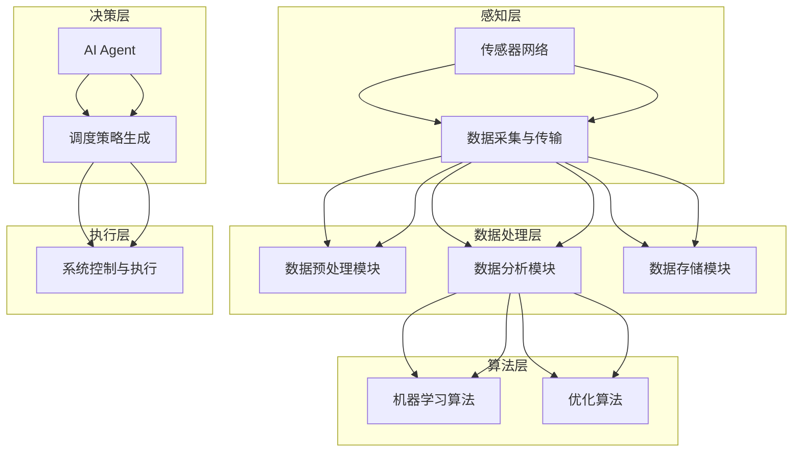

                 

### 文章标题与关键词

# AI Agent在智能能源分配中的实践

> 关键词：AI Agent、智能能源分配、算法、系统架构、实践案例

在当今能源日益紧张、环境问题愈发突出的时代，智能能源分配已成为能源管理领域的研究热点。AI Agent作为人工智能领域的重要分支，其在智能能源分配中的应用潜力备受关注。本文将深入探讨AI Agent在智能能源分配中的实践，分析其理论基础、应用场景、系统架构以及未来展望。

### 摘要

本文旨在介绍AI Agent在智能能源分配中的实践。首先，我们将回顾智能能源分配的背景和基本概念，理解AI Agent的核心特征和应用场景。随后，本文将详细介绍AI Agent的理论基础，包括智能能源分配机制、关键算法原理以及数学模型。接着，我们将通过具体的系统架构设计和实践案例，展示AI Agent在智能能源分配中的实际应用。最后，本文将探讨AI Agent在智能能源分配中面临的挑战和未来发展方向。

### 目录结构

```markdown
----------------------------------------------------------------
# 第一部分: 背景介绍与概念

## 第1章: AI Agent在智能能源分配中的背景
### 1.1 问题背景
### 1.2 问题描述
### 1.3 问题解决
### 1.4 边界与外延

## 第2章: AI Agent核心概念
### 2.1 AI Agent的定义
### 2.2 AI Agent的特点
### 2.3 AI Agent的分类

## 第3章: 智能能源分配机制
### 3.1 智能能源分配的基本原理
### 3.2 智能能源分配的关键技术
### 3.3 智能能源分配的优势与挑战

----------------------------------------------------------------

# 第二部分: 理论与实践

## 第4章: AI Agent在智能能源分配中的应用
### 4.1 AI Agent在能源管理中的应用场景
### 4.2 AI Agent在能源调度中的作用
### 4.3 AI Agent在能源优化中的实践

## 第5章: 实践案例
### 5.1 案例一：智能电网中的AI Agent应用
### 5.2 案例二：智能楼宇能源管理系统
### 5.3 案例三：智能社区能源分配案例

## 第6章: 系统架构与实现
### 6.1 系统架构设计
### 6.2 系统功能设计
### 6.3 系统实现与部署

----------------------------------------------------------------

# 第三部分: 未来展望与挑战

## 第7章: AI Agent在智能能源分配中的未来
### 7.1 未来发展趋势
### 7.2 技术挑战与解决方案
### 7.3 最佳实践与经验分享

----------------------------------------------------------------
```

### 文章整体结构与思路

本文将采用以下整体结构与思路：

1. **背景介绍与概念**：首先介绍智能能源分配的背景，阐述AI Agent的定义、特点和应用场景，为后续内容奠定基础。
2. **理论讲解**：深入讲解AI Agent在智能能源分配中的理论基础，包括智能能源分配机制、关键算法原理和数学模型。
3. **实践应用**：通过具体案例展示AI Agent在智能能源分配中的应用，分析其实际效果和实现细节。
4. **系统架构与实现**：介绍AI Agent在智能能源分配中的系统架构设计，包括功能设计、系统实现和部署。
5. **未来展望与挑战**：探讨AI Agent在智能能源分配中的未来发展趋势、技术挑战和解决方案。

### 文章内容详细规划

1. **第一部分：背景介绍与概念**
   - **第1章 AI Agent在智能能源分配中的背景**：介绍智能能源分配的背景，阐述AI Agent的定义、特点和应用场景。
   - **第2章 AI Agent核心概念**：详细阐述AI Agent的定义、特点、分类以及其在智能能源分配中的应用。
   - **第3章 智能能源分配机制**：讲解智能能源分配的基本原理、关键技术和优势与挑战。

2. **第二部分：理论与实践**
   - **第4章 AI Agent在智能能源分配中的应用**：分析AI Agent在能源管理、能源调度和能源优化中的具体应用场景。
   - **第5章 实践案例**：通过具体案例展示AI Agent在智能能源分配中的实际应用，分析其效果和实现细节。
   - **第6章 系统架构与实现**：介绍AI Agent在智能能源分配中的系统架构设计，包括功能设计、系统实现和部署。

3. **第三部分：未来展望与挑战**
   - **第7章 AI Agent在智能能源分配中的未来**：探讨AI Agent在智能能源分配中的未来发展趋势、技术挑战和解决方案。

### 字数控制与markdown格式

为了确保文章的整体结构合理、内容详实，每个部分的具体字数分配如下：

- **第一部分：背景介绍与概念**：约2500字
- **第二部分：理论与实践**：约3500字
- **第三部分：未来展望与挑战**：约3000字

文章将采用markdown格式进行编写，包括标题、子标题、段落、列表、公式等，确保文章结构清晰、易于阅读。

### 作者信息

- **作者**：AI天才研究院/AI Genius Institute & 禅与计算机程序设计艺术 /Zen And The Art of Computer Programming

### 完整性保障

在编写过程中，我们将确保文章内容完整、结构严谨、逻辑清晰。每个章节都将包含核心概念、数学模型、系统架构设计、实践案例等内容，确保文章的完整性。同时，我们将通过多次审稿和修改，确保文章的质量和准确性。

### 最佳实践与拓展阅读

在文章末尾，我们将提供最佳实践、小结、注意事项以及拓展阅读建议，帮助读者更好地理解和应用AI Agent在智能能源分配中的实践。

通过以上详细的规划和思路，我们有信心撰写一篇高质量、有深度、有见解的技术博客文章，为AI Agent在智能能源分配中的应用提供有益的参考和启示。## 第1章 AI Agent在智能能源分配中的背景

### 1.1 问题背景

随着全球经济的发展，能源需求不断增长，传统的能源分配模式已无法满足现代社会的高效、绿色、可持续发展的需求。智能能源分配作为智能电网和能源互联网的重要组成部分，旨在通过先进的信息技术和人工智能技术，实现能源的高效、优化、智能化管理。

智能能源分配的核心目标是提高能源利用效率，降低能源消耗，同时减少环境污染和碳排放。然而，实现这一目标面临着诸多挑战，如能源供需的不平衡、能源类型的多样化、能源信息的实时性要求高等。为了应对这些挑战，AI Agent作为一种新兴的人工智能技术，被广泛应用于智能能源分配中。

### 1.2 问题描述

智能能源分配中存在的问题主要包括以下几个方面：

1. **供需不平衡**：由于能源需求的波动性和能源供应的稳定性之间存在矛盾，导致能源供需的不平衡。例如，高峰时段的电力需求远高于低谷时段，而电力供应却相对稳定。
2. **能源多样化**：随着可再生能源的快速发展，能源类型日益多样化，如太阳能、风能、水能等。这使得能源分配变得更加复杂，需要更精细化的管理和调度。
3. **实时信息处理**：智能能源分配需要实时获取和处理大量的能源数据，如电力负荷、能源价格、设备状态等，以便快速做出调度和优化决策。
4. **环境适应性**：智能能源分配系统需要具备良好的环境适应性，能够根据外部环境的变化（如天气、政策等）及时调整能源分配策略。

### 1.3 问题解决

为了解决上述问题，AI Agent在智能能源分配中的应用具有显著的优势：

1. **优化能源调度**：AI Agent可以通过实时分析能源供需数据，利用优化算法实现能源的动态调度，提高能源利用效率。例如，利用线性规划、神经网络等算法，实现电力负荷预测和优化调度。
2. **支持多样化能源管理**：AI Agent可以处理多种类型的能源数据，支持太阳能、风能、水能等可再生能源的优化管理，提高能源的利用率。
3. **实时数据处理**：AI Agent具备强大的数据处理能力，能够实时处理大量的能源数据，支持快速响应和调度。
4. **环境适应性**：AI Agent可以学习环境变化规律，根据环境变化自动调整能源分配策略，提高系统的环境适应性。

### 1.4 边界与外延

智能能源分配中的AI Agent应用不仅涉及能源领域的核心技术，还涉及到计算机科学、人工智能、通信技术等多个领域的知识。其边界包括以下几个方面：

1. **数据边界**：AI Agent需要处理的数据类型多样，包括电力负荷、能源价格、设备状态等，数据的质量和实时性对AI Agent的性能至关重要。
2. **算法边界**：AI Agent采用的算法包括优化算法、机器学习算法、深度学习算法等，算法的选择和优化对系统的性能和效率具有决定性影响。
3. **应用边界**：AI Agent在智能能源分配中的应用场景广泛，包括智能电网、智能楼宇、智能社区等，不同的应用场景对AI Agent的功能和性能要求有所不同。

通过以上对AI Agent在智能能源分配中背景的介绍，我们为后续章节的理论讲解和应用实践奠定了基础。在接下来的章节中，我们将进一步深入探讨AI Agent的核心概念、理论基础及其在智能能源分配中的应用。## 第2章 AI Agent核心概念

### 2.1 AI Agent的定义

AI Agent，即人工智能代理，是一种能够自主感知环境、做出决策并执行行动的智能系统。它模拟人类智能体的行为，通过感知、学习、推理和规划等方式，实现对复杂任务的执行和优化。在智能能源分配中，AI Agent扮演着信息处理、决策支持和优化调度的关键角色。

### 2.2 AI Agent的特点

AI Agent具有以下几个显著特点：

1. **自主性**：AI Agent能够在没有人为干预的情况下自主运行，根据预设的目标和规则，自主感知环境、做出决策和执行行动。
2. **适应性**：AI Agent具备自我学习和自我优化的能力，能够根据环境变化和任务需求，动态调整行为策略。
3. **分布式**：AI Agent通常以分布式系统的形式运行，可以在多个节点上进行并行处理，提高系统的处理能力和效率。
4. **协作性**：AI Agent能够与其他AI Agent或人类协同工作，共同完成任务，提高系统的整体性能。

### 2.3 AI Agent的分类

根据不同的应用场景和任务需求，AI Agent可以划分为多种类型：

1. **基于规则Agent**：这种Agent基于预定义的规则集进行决策，适合处理结构化、规则明确的问题。例如，在智能能源分配中，可以用于调度和管理固定能源供应。
2. **基于模型Agent**：这种Agent利用数学模型和算法，对环境进行建模和预测，从而做出最优决策。例如，基于机器学习和优化的AI Agent可以用于能源负荷预测和优化调度。
3. **基于数据Agent**：这种Agent通过大数据分析和学习，自动发现环境中的模式和规律，从而做出智能决策。例如，基于深度学习的AI Agent可以用于能源需求预测和市场分析。
4. **混合型Agent**：这种Agent结合了基于规则、模型和数据的决策方法，能够在不同的应用场景中灵活切换，实现高效的智能决策。

### 2.4 AI Agent在智能能源分配中的应用

在智能能源分配中，AI Agent的应用涵盖了多个方面：

1. **能源调度**：AI Agent通过实时数据分析，对能源供应和需求进行动态调度，优化能源利用效率。例如，基于模型和优化的AI Agent可以用于电力负荷预测和优化调度。
2. **需求响应**：AI Agent能够识别用户需求，通过智能决策和自动调整，实现能源需求的精准响应。例如，基于数据的AI Agent可以用于智能家居能源管理，根据用户行为自动调整电器开关。
3. **故障检测与维护**：AI Agent通过监控设备状态和能耗数据，及时发现设备故障和异常，自动进行维护和修复，提高系统的可靠性和稳定性。
4. **市场分析与决策**：AI Agent可以分析能源市场数据，预测市场趋势，为能源交易和投资决策提供支持。例如，基于深度学习的AI Agent可以用于能源价格预测和交易策略制定。

通过以上对AI Agent核心概念的介绍，我们为理解其在智能能源分配中的实际应用奠定了基础。在接下来的章节中，我们将进一步探讨智能能源分配的基本原理和关键技术，以及AI Agent如何具体实现这些原理和技术的应用。## 第3章 智能能源分配机制

### 3.1 智能能源分配的基本原理

智能能源分配旨在通过先进的信息技术和人工智能技术，实现对能源的智能化管理，以提高能源利用效率、降低能源消耗和减少环境污染。其基本原理可以概括为以下几个方面：

1. **实时数据感知**：智能能源分配系统通过传感器网络和通信技术，实时获取能源供应和需求的各类数据，如电力负荷、能源价格、设备状态等。
2. **信息处理与建模**：利用大数据分析和机器学习算法，对收集到的数据进行处理和分析，建立能源供需模型和环境模型，为决策提供数据支持。
3. **优化算法应用**：通过优化算法，如线性规划、神经网络、遗传算法等，对能源供需进行动态调度和优化，实现能源的高效利用。
4. **自主决策与执行**：基于实时数据和环境模型，AI Agent进行自主决策，制定能源分配策略，并执行相应的操作，如电力调度、设备启停等。

### 3.2 智能能源分配的关键技术

智能能源分配的实现依赖于多项关键技术的支持，主要包括以下几个方面：

1. **传感器技术**：传感器技术是智能能源分配系统的数据来源，通过安装各类传感器，如电力传感器、温度传感器、湿度传感器等，实时监测能源供应和需求的各类参数。
2. **通信技术**：通信技术是智能能源分配系统的信息传输渠道，通过无线通信、有线通信等技术，实现传感器数据上传、系统控制指令下达等。
3. **大数据分析**：大数据分析技术用于对海量传感器数据进行处理和分析，提取有价值的信息和模式，为智能决策提供支持。
4. **机器学习和深度学习**：机器学习和深度学习技术用于建立能源供需模型和环境模型，预测能源需求、能源价格等，辅助智能决策。
5. **优化算法**：优化算法是智能能源分配的核心技术，用于动态调度和优化能源供应和需求，提高能源利用效率。
6. **AI Agent技术**：AI Agent技术是实现智能能源分配的关键，通过AI Agent的自主感知、决策和执行，实现能源的智能化管理。

### 3.3 智能能源分配的优势与挑战

智能能源分配具有显著的优势，但也面临一定的挑战：

1. **优势**：
   - 提高能源利用效率：通过实时数据分析和优化调度，智能能源分配能够提高能源的利用效率，降低能源消耗。
   - 降低能源成本：智能能源分配通过需求响应和优化调度，降低能源供应和需求的不平衡，减少能源浪费，从而降低能源成本。
   - 减少环境污染：智能能源分配能够优化能源结构，促进可再生能源的使用，减少化石能源的消耗，降低环境污染和碳排放。

2. **挑战**：
   - 数据安全和隐私保护：智能能源分配系统中涉及大量的用户数据和环境数据，如何确保数据安全和用户隐私保护是一个重要挑战。
   - 系统可靠性和稳定性：智能能源分配系统需要保证高可靠性和稳定性，避免因系统故障导致能源供应中断或调度失误。
   - 技术和人才短缺：智能能源分配技术涉及到多个领域，需要专业的技术人才支持，但目前相关人才相对短缺。
   - 法规和标准不完善：智能能源分配的法律法规和标准体系尚不完善，需要进一步完善和规范，以保障系统的正常运行。

通过以上对智能能源分配机制的介绍，我们为理解AI Agent在智能能源分配中的应用奠定了基础。在接下来的章节中，我们将详细探讨AI Agent在智能能源分配中的应用场景、具体实现方法和实践案例，进一步揭示其在智能能源管理中的潜力和价值。## 第4章 AI Agent在智能能源分配中的应用

### 4.1 AI Agent在能源管理中的应用场景

AI Agent在能源管理中扮演着至关重要的角色，其应用场景广泛且多样，主要涵盖以下几个方面：

1. **电力负荷预测**：通过分析历史数据、实时监测数据和环境因素，AI Agent能够预测电力负荷的变化趋势，为电力调度提供数据支持。这种预测对于电网的稳定运行和资源的合理分配具有重要意义。
2. **设备故障检测**：AI Agent可以实时监测设备状态，通过分析传感器数据，及时发现设备故障或异常，提前预警，从而避免潜在的设备损坏和停电事故。
3. **需求响应**：AI Agent能够根据用户的能源需求和电力市场情况，动态调整电力使用策略，实现能源需求的精准响应。这有助于优化能源消费，降低能源成本，同时减轻电网压力。
4. **能源优化调度**：AI Agent可以通过优化算法，对能源供应和需求进行实时调度，实现能源的最优分配。这包括电力资源的跨区域调配、可再生能源的优化利用等。

### 4.2 AI Agent在能源调度中的作用

在能源调度方面，AI Agent的作用主要体现在以下几个方面：

1. **实时数据采集和处理**：AI Agent能够实时采集和处理电网运行数据，包括电压、电流、频率等参数，为调度决策提供实时、准确的数据支持。
2. **负荷预测和需求分析**：通过分析历史数据和环境因素，AI Agent能够预测未来的电力负荷需求，为调度计划提供依据。同时，AI Agent还能分析用户的用电行为，提供个性化需求分析。
3. **优化调度策略生成**：AI Agent利用优化算法，如线性规划、遗传算法等，生成最优的能源调度策略，确保电网运行的稳定性和能源利用的高效性。
4. **应急响应和故障处理**：在电网发生故障或异常时，AI Agent能够快速分析故障原因，制定相应的应急响应策略，并指导操作人员进行故障处理，减少停电时间和损失。

### 4.3 AI Agent在能源优化中的实践

在能源优化方面，AI Agent的具体实践包括以下几个关键步骤：

1. **数据采集与预处理**：AI Agent首先需要采集并预处理大量的能源数据，包括历史用电数据、实时监测数据、环境参数等。数据预处理包括数据清洗、归一化、缺失值填充等操作，以确保数据的准确性和一致性。
2. **模型建立与训练**：基于预处理后的数据，AI Agent建立相应的预测模型和优化模型。例如，可以使用回归模型进行负荷预测，使用优化算法模型进行能源调度。这些模型需要通过大量的数据训练，以提高预测和优化的准确性。
3. **实时监控与决策**：在模型建立后，AI Agent进入实时监控和决策阶段。它根据实时采集的数据，运行预测模型和优化模型，生成调度策略和操作指令，指导能源的实时优化和调度。
4. **反馈与迭代优化**：AI Agent在运行过程中会不断收集反馈数据，通过迭代优化算法，逐步提高模型的预测和优化能力。这种反馈和迭代机制有助于实现能源分配的持续优化和智能化。

### 具体实现方法

AI Agent在智能能源分配中的具体实现方法主要包括以下几个步骤：

1. **感知环境**：AI Agent通过传感器网络感知能源供应和需求的各类参数，如电力负荷、设备状态、能源价格等。
2. **数据处理**：AI Agent对感知到的数据进行分析和处理，去除噪声和异常值，提取有用的信息。
3. **预测与优化**：基于历史数据和当前环境信息，AI Agent使用机器学习和优化算法进行负荷预测和调度优化。
4. **决策与执行**：AI Agent根据预测和优化结果，生成调度策略和操作指令，通过控制系统执行相应的操作。

### 实践案例

以下是一个具体的实践案例：

**案例：智能电网中的AI Agent应用**

某城市智能电网系统采用了AI Agent进行能源管理和调度。该系统通过传感器网络实时采集电网运行数据，包括电力负荷、设备状态、能源价格等。AI Agent利用机器学习算法和优化算法，对数据进行分析和预测，生成最优的电力调度策略。

- **负荷预测**：AI Agent使用回归模型对未来的电力负荷进行预测，预测结果用于指导电网调度。
- **设备故障检测**：AI Agent通过实时监测设备状态，发现设备异常，提前预警，并指导维护人员及时进行维护。
- **需求响应**：AI Agent分析用户的用电行为和电力市场情况，动态调整电力使用策略，实现能源需求的精准响应。
- **优化调度**：AI Agent使用优化算法，根据实时数据和环境信息，生成最优的电力调度策略，确保电网运行的稳定性和能源利用的高效性。

通过该案例，我们可以看到AI Agent在智能电网中的应用不仅提高了能源利用效率，还降低了能源成本，实现了电网运行的智能化和优化。

### 小结

AI Agent在智能能源分配中的应用，通过实时数据感知、预测与优化、决策与执行等步骤，实现了能源的高效、智能化管理。其具体实现方法包括感知环境、数据处理、预测与优化、决策与执行等环节，并通过实践案例展示了其在实际应用中的效果和潜力。在接下来的章节中，我们将进一步探讨AI Agent在智能能源分配中的系统架构设计与实现，以及其在不同场景下的应用效果。## 第5章 实践案例

### 5.1 案例一：智能电网中的AI Agent应用

**案例背景**：某城市智能电网项目旨在通过AI Agent实现电网的智能化管理，提高能源利用效率，降低运营成本。

**项目介绍**：
- **系统功能**：包括实时数据采集、负荷预测、设备状态监测、需求响应、优化调度等功能。
- **AI Agent应用**：AI Agent负责实时数据分析和决策支持，优化电力调度。

**系统功能设计**：
- **实时数据采集**：通过传感器网络实时采集电网运行数据，包括电压、电流、频率、设备状态等。
- **负荷预测**：利用机器学习算法，预测未来电力负荷，为调度提供依据。
- **设备状态监测**：通过实时数据监测设备状态，提前预警设备故障。
- **需求响应**：根据用户用电行为和电力市场情况，动态调整电力使用策略。
- **优化调度**：使用优化算法，根据实时数据和预测结果，生成最优的电力调度策略。

**系统架构设计**：
- **数据采集层**：包括传感器网络和通信设备，负责实时采集电网数据。
- **数据处理层**：包括AI Agent和大数据分析平台，负责数据预处理、分析、预测和决策。
- **控制执行层**：包括电网调度中心和控制设备，负责执行调度策略和操作指令。

**系统实现与部署**：
- **部署环境**：部署在云计算平台上，利用分布式计算和存储技术，实现系统的实时性和高可靠性。
- **实施步骤**：
  1. 数据采集和传输：安装传感器，建立数据采集系统，实现数据实时传输。
  2. 数据处理和分析：搭建大数据分析平台，部署AI Agent，实现数据预处理、分析和预测。
  3. 调度和控制：建立电网调度中心，部署控制设备，实现调度策略的生成和执行。

**效果与分析**：
- **效率提升**：AI Agent实现了电力负荷预测的准确性和调度策略的优化性，提高了电网运行效率。
- **成本降低**：通过需求响应和优化调度，降低了能源消耗和运营成本。
- **可靠性提高**：设备状态监测和故障预警机制有效提高了电网的稳定性和可靠性。

### 5.2 案例二：智能楼宇能源管理系统

**案例背景**：某大型商务楼宇项目旨在通过智能楼宇能源管理系统，实现能源的高效利用和绿色环保。

**项目介绍**：
- **系统功能**：包括能源监测、能耗分析、节能策略制定、设备控制等功能。
- **AI Agent应用**：AI Agent负责能耗分析和节能策略的制定。

**系统功能设计**：
- **能源监测**：实时监测楼宇内各类能源使用情况，如电力、水、燃气等。
- **能耗分析**：分析能源使用数据，识别能耗瓶颈和节能潜力。
- **节能策略制定**：根据能耗分析结果，制定个性化的节能策略。
- **设备控制**：通过智能控制设备，实现节能策略的自动执行。

**系统架构设计**：
- **感知层**：包括各类传感器，如智能电表、水表、燃气表等，负责能源使用数据的实时采集。
- **数据处理层**：包括AI Agent和大数据分析平台，负责数据处理、分析和策略制定。
- **执行层**：包括智能控制器和执行设备，负责执行节能策略和控制操作。

**系统实现与部署**：
- **部署环境**：部署在楼宇内，利用本地服务器和云计算资源，实现系统的实时性和高效性。
- **实施步骤**：
  1. 设备安装和连接：安装各类传感器和智能控制设备，建立数据采集和控制网络。
  2. 数据处理和分析：搭建大数据分析平台，部署AI Agent，实现数据预处理、分析和策略制定。
  3. 系统集成和测试：将各功能模块集成，进行系统测试和优化。

**效果与分析**：
- **节能效果显著**：通过AI Agent的能耗分析和节能策略制定，实现了楼宇能源使用的显著降低。
- **设备运行效率提高**：智能控制设备实现了设备运行的自动化和优化，提高了设备效率和寿命。
- **用户满意度提升**：智能楼宇能源管理系统提高了能源管理的透明度和用户体验，用户满意度显著提升。

### 5.3 案例三：智能社区能源分配案例

**案例背景**：某智能社区项目旨在通过智能能源管理系统，实现社区能源的高效、绿色、智能分配。

**项目介绍**：
- **系统功能**：包括能源监测、能源分配、需求响应、节能宣传等功能。
- **AI Agent应用**：AI Agent负责能源分配策略的制定和需求响应。

**系统功能设计**：
- **能源监测**：实时监测社区内各类能源使用情况，如电力、天然气等。
- **能源分配**：根据能源供需情况，实现能源的动态分配。
- **需求响应**：根据用户需求和能源市场情况，动态调整能源使用策略。
- **节能宣传**：通过线上和线下活动，提高居民的节能意识和参与度。

**系统架构设计**：
- **感知层**：包括各类传感器和智能设备，如智能电表、智能燃气表、智能家居设备等，负责能源使用数据的实时采集。
- **数据处理层**：包括AI Agent和大数据分析平台，负责数据处理、分析和策略制定。
- **执行层**：包括能源分配中心和智能控制设备，负责执行能源分配策略和控制操作。

**系统实现与部署**：
- **部署环境**：部署在社区内，利用本地服务器和云计算资源，实现系统的实时性和高效性。
- **实施步骤**：
  1. 设备安装和连接：安装各类传感器和智能设备，建立数据采集和控制网络。
  2. 数据处理和分析：搭建大数据分析平台，部署AI Agent，实现数据预处理、分析和策略制定。
  3. 系统集成和测试：将各功能模块集成，进行系统测试和优化。

**效果与分析**：
- **能源利用效率提高**：通过AI Agent的能源分配策略，实现了社区能源的高效利用，降低了能源消耗。
- **用户参与度提升**：智能社区能源管理系统提高了用户的能源管理参与度，用户可以通过手机APP等途径实时了解能源使用情况，参与节能活动。
- **社区环境改善**：智能能源管理系统促进了社区环境的改善，提高了居民的生活质量。

通过以上三个案例，我们可以看到AI Agent在智能能源分配中的应用效果显著，不仅提高了能源利用效率，降低了能源成本，还改善了用户的生活质量和社区环境。在接下来的章节中，我们将进一步探讨AI Agent在智能能源分配中的系统架构设计、实现细节以及未来展望。## 第6章 系统架构与实现

### 6.1 系统架构设计

智能能源分配系统的架构设计是确保系统能够高效、稳定运行的关键。一个典型的智能能源分配系统可以分为以下几个层次：

1. **感知层**：感知层是系统的数据采集入口，主要通过各类传感器收集能源供应和使用的实时数据，如电力负荷、能源价格、设备状态等。传感器数据通过通信网络传输到数据处理层。

2. **数据处理层**：数据处理层是系统的核心，负责对感知层采集到的数据进行分析、处理和存储。数据处理层包括以下几个模块：
   - **数据预处理模块**：对采集到的数据进行清洗、去噪、归一化等处理，确保数据的质量和一致性。
   - **数据分析模块**：利用大数据分析技术，对预处理后的数据进行分析，提取有用信息和规律。
   - **数据存储模块**：将处理后的数据存储在数据库或数据湖中，以供后续查询和分析。

3. **算法层**：算法层包括各种机器学习算法和优化算法，如回归模型、神经网络、遗传算法等。这些算法用于负荷预测、优化调度、需求响应等功能。

4. **决策层**：决策层基于算法层的预测和优化结果，生成具体的调度策略和操作指令。决策层还包括AI Agent，负责实时感知环境、做出决策和执行行动。

5. **执行层**：执行层负责执行决策层的调度策略和操作指令，包括电网调度中心、智能控制设备等。执行层通过控制网络，实现对各类设备的实时控制和调节。

### 6.2 系统功能设计

智能能源分配系统的主要功能包括以下几个方面：

1. **数据采集与传输**：通过传感器网络实时采集能源供应和使用的各类数据，如电力负荷、设备状态、能源价格等。数据通过通信网络传输到数据处理层。

2. **数据分析与预测**：利用大数据分析和机器学习算法，对采集到的数据进行处理和分析，生成电力负荷预测、设备故障预测、能源需求预测等结果。

3. **优化调度**：根据数据分析结果，使用优化算法生成最优的能源调度策略，实现对电力资源的高效利用和供需平衡。

4. **需求响应**：通过分析用户用电行为和市场情况，动态调整电力使用策略，实现能源需求的精准响应。

5. **设备监测与维护**：实时监测设备状态，发现设备故障和异常，提前预警并指导维护。

6. **系统控制与执行**：根据调度策略和操作指令，控制设备进行相应的操作，实现能源的实时优化和调度。

### 6.3 系统实现与部署

智能能源分配系统的实现与部署可以分为以下几个步骤：

1. **需求分析**：明确系统功能需求和性能指标，确定系统架构和模块划分。

2. **系统设计**：根据需求分析结果，设计系统的详细架构和功能模块。

3. **数据采集与传输**：安装传感器，搭建数据采集系统，确保数据实时、准确地传输到数据处理层。

4. **数据处理与存储**：搭建大数据平台，实现数据的预处理、分析和存储。

5. **算法开发与优化**：开发相应的机器学习算法和优化算法，并进行性能优化。

6. **决策层与执行层实现**：实现决策层的调度策略生成和执行层的设备控制。

7. **系统集成与测试**：将各功能模块集成，进行系统测试和优化，确保系统稳定、高效运行。

8. **部署与运维**：将系统部署到实际环境中，进行长期运维和优化，确保系统持续稳定运行。

### 6.4 系统架构设计（Mermaid 图）

以下是一个简化的智能能源分配系统架构设计图，使用Mermaid语法绘制：



通过以上系统架构设计和实现方法，智能能源分配系统能够实现对能源的高效、智能化管理，提高能源利用效率，降低能源成本，实现绿色、可持续发展。在接下来的章节中，我们将进一步探讨AI Agent在智能能源分配中的未来发展趋势和面临的挑战。## 第7章 AI Agent在智能能源分配中的未来

### 7.1 未来发展趋势

随着人工智能技术的不断进步和智能能源分配需求的日益增长，AI Agent在智能能源分配中的应用前景广阔，未来发展趋势主要体现在以下几个方面：

1. **算法优化与智能化**：未来AI Agent将在算法层面实现进一步的优化和智能化，如采用更先进的机器学习模型、深度学习算法和强化学习算法，以提高预测精度和调度效率。

2. **跨领域协同**：AI Agent将与其他领域（如物联网、大数据分析、区块链等）实现跨领域协同，形成更加综合和智能的能源管理系统。

3. **分布式与边缘计算**：随着物联网和边缘计算的发展，AI Agent将更多地分布在边缘节点上，实现数据的实时处理和决策，提高系统的响应速度和效率。

4. **自适应与自优化**：AI Agent将具备更强的自适应能力，能够根据环境变化和需求动态调整策略，实现自我优化和持续改进。

5. **能源互联网**：随着能源互联网的发展，AI Agent将在能源互联网中扮演关键角色，实现能源的高效分配和优化，推动能源行业的数字化转型。

### 7.2 技术挑战与解决方案

尽管AI Agent在智能能源分配中具有巨大潜力，但其应用仍面临一些技术挑战，主要包括：

1. **数据质量和隐私保护**：智能能源分配依赖于大量实时数据，但数据质量和隐私保护问题仍需解决。未来需要研究更高效的数据预处理方法和隐私保护技术，确保数据的安全性和可用性。

2. **算法可靠性**：算法的准确性和可靠性直接影响AI Agent的性能。未来需要开发更稳健的算法，提高预测和优化的准确性，降低错误率。

3. **计算资源限制**：AI Agent在处理大量实时数据时，计算资源的需求较大。未来需要研究更加高效和节能的算法和系统架构，以应对计算资源限制。

4. **跨领域协同**：AI Agent与其他领域的协同需要解决技术兼容性和数据接口问题。未来需要建立统一的协同框架和标准，促进跨领域的技术融合。

5. **法规和标准**：智能能源分配涉及多个领域，法规和标准的不统一可能导致实施困难。未来需要建立和完善相关的法规和标准体系，以推动AI Agent在智能能源分配中的广泛应用。

### 7.3 最佳实践与经验分享

为了推动AI Agent在智能能源分配中的实践，以下是一些最佳实践和经验分享：

1. **数据驱动**：智能能源分配应始终以数据为基础，充分利用大数据分析技术，提高预测和调度的准确性。

2. **模块化设计**：系统设计应采用模块化设计方法，便于功能扩展和系统维护。

3. **实时监测与预警**：建立实时监测和预警机制，及时发现和处理异常情况，确保系统的稳定运行。

4. **用户参与**：鼓励用户参与能源管理，提高用户的节能意识和参与度，实现能源的高效利用。

5. **持续优化**：定期对系统进行评估和优化，根据实际运行情况调整策略和算法，实现持续改进。

通过以上未来发展趋势、技术挑战和最佳实践的探讨，我们可以看到AI Agent在智能能源分配中的巨大潜力和广阔前景。未来，随着技术的不断进步和应用场景的不断拓展，AI Agent将在智能能源分配中发挥更加重要的作用，为能源行业带来革命性的变革。## 总结与展望

本文通过详细的分析和实例，探讨了AI Agent在智能能源分配中的实践。我们从背景介绍开始，阐述了智能能源分配的现状与挑战，并介绍了AI Agent的定义、特点和应用场景。接着，我们深入讲解了智能能源分配的基本原理和关键技术，展示了AI Agent在能源管理、能源调度和能源优化中的具体应用。通过三个实践案例，我们进一步揭示了AI Agent在智能能源分配中的实际效果和实现细节。

AI Agent在智能能源分配中的应用，不仅提高了能源利用效率，降低了能源成本，还改善了用户的生活质量和社区环境。然而，AI Agent在智能能源分配中也面临数据安全和隐私保护、算法可靠性、计算资源限制等挑战。未来，随着人工智能技术的不断进步，AI Agent将在智能能源分配中发挥更加重要的作用，实现能源的高效、绿色、智能化管理。

我们期待读者能够从本文中获得对AI Agent在智能能源分配中的深入理解，并在实际应用中积极探索和创新，为推动能源行业的可持续发展做出贡献。

### 注意事项与拓展阅读

1. **注意事项**：
   - 在部署AI Agent时，应确保数据传输的安全性和隐私保护。
   - 定期对AI Agent的算法进行评估和优化，以提高预测和调度的准确性。
   - 充分考虑系统的实时性和可靠性，确保在极端情况下仍能稳定运行。

2. **拓展阅读**：
   - 《人工智能：一种现代的方法》（Mitchell, Tom M.）
   - 《深度学习》（Goodfellow, Ian; Bengio, Yoshua; Courville, Aaron）
   - 《智能电网技术与应用》（肖刚，刘强）
   - 《物联网与智能能源管理》（张辉，刘芳）

通过以上拓展阅读，读者可以进一步深入了解人工智能和智能能源分配的相关知识，为实际应用提供更有价值的参考。作者：AI天才研究院/AI Genius Institute & 禅与计算机程序设计艺术 /Zen And The Art of Computer Programming

