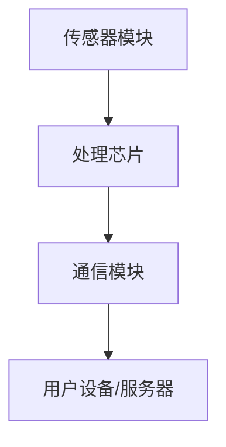
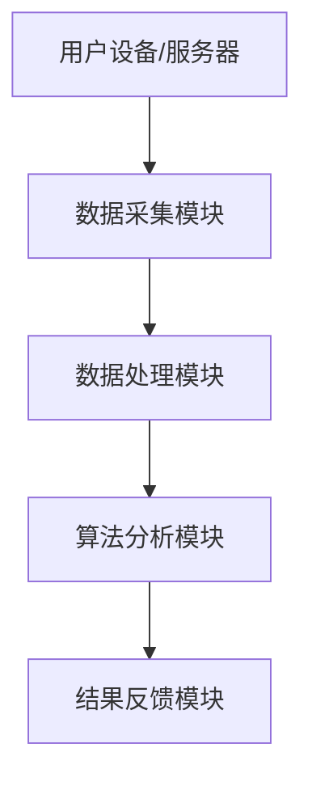
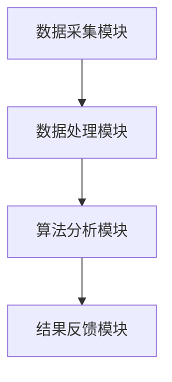
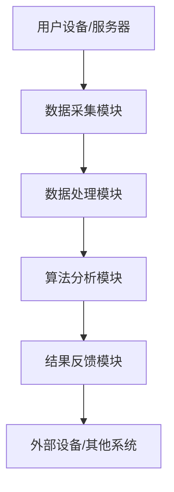
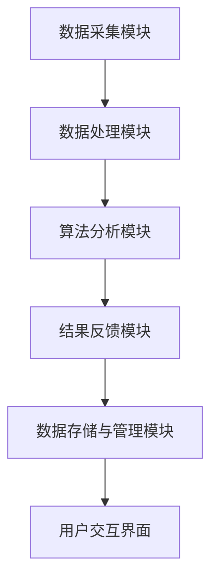
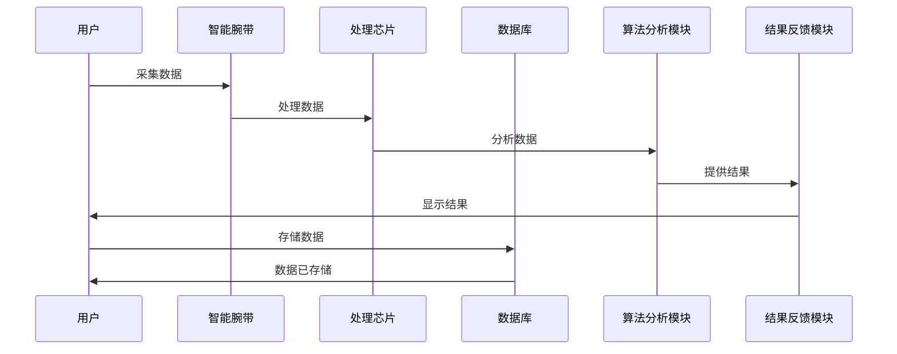
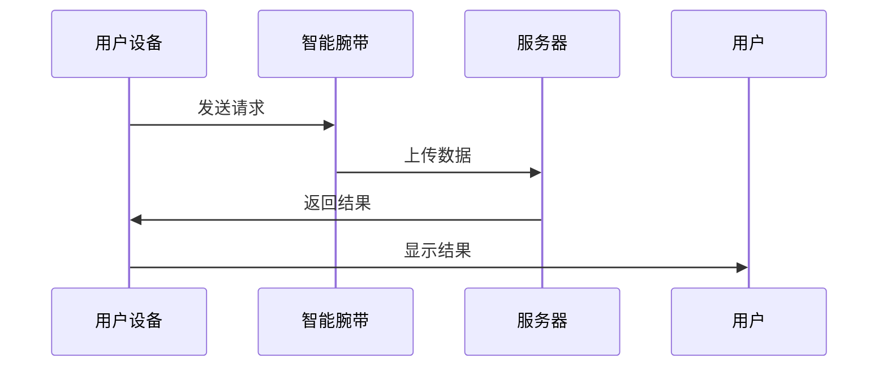

                 


### 引言

#### 1.1.1 工作效率监测的重要性

随着现代社会的发展，工作效率成为企业和组织竞争力的关键因素之一。如何准确监测和提升工作效率，已经成为企业管理者所关注的核心问题。传统的效率监测方法主要依赖于人为统计和手动记录，存在一定的误差和效率低下的问题。随着人工智能技术的快速发展，AI Agent在智能腕带中的工作效率监测逐渐成为可能，为提高工作效率提供了新的解决方案。

AI Agent是一种基于人工智能技术的智能体，能够自主学习和执行任务。在智能腕带中，AI Agent通过实时监测用户的生理、行为数据，分析用户的工作状态和效率，提供个性化的工作建议和优化方案。这种智能监测方式不仅可以提高工作效率，还可以帮助企业管理者更好地了解员工的工作状态，为员工提供更好的支持和培训。

#### 1.1.2 当前工作效率监测的挑战

尽管AI Agent在智能腕带中的工作效率监测具有巨大的潜力，但当前仍面临一些挑战。首先，数据采集的准确性和完整性是保证监测效果的关键。智能腕带需要具备高精度的传感器，能够准确采集用户的生理和行为数据。其次，数据处理和分析的效率也是关键问题。大量的数据需要快速、准确地处理，以便实时监测用户的工作状态。

此外，AI Agent在智能腕带中的应用还面临一些技术挑战，如算法的优化和模型的训练。如何设计出高效、准确的算法模型，以便更好地分析用户的工作状态，是一个亟待解决的问题。同时，AI Agent需要具备良好的鲁棒性，能够在各种复杂环境下稳定运行。

#### 1.1.3 智能腕带技术的发展与应用

智能腕带技术作为可穿戴设备的代表，近年来得到了广泛关注。智能腕带具备便携、实时监测和数据采集的特点，为AI Agent的工作效率监测提供了良好的硬件支持。随着传感器技术、数据处理技术和人工智能技术的不断进步，智能腕带的应用领域也在不断扩展。

目前，智能腕带已经被广泛应用于健康监测、运动跟踪、工作效率监测等领域。例如，在健康管理方面，智能腕带可以实时监测用户的血压、心率、睡眠质量等生理数据，为用户提供健康建议。在运动跟踪方面，智能腕带可以记录用户的运动轨迹、运动强度等数据，帮助用户制定科学的运动计划。在工作效率监测方面，智能腕带通过AI Agent的分析，为用户提供个性化的工作建议，提高工作效率。

总的来说，智能腕带技术的发展为AI Agent在工作效率监测中的应用提供了坚实的基础。随着技术的不断进步，AI Agent在智能腕带中的工作效率监测有望得到更广泛的应用，为企业和社会带来更大的价值。

### 智能腕带概述

#### 1.2.1 智能腕带的基本概念

智能腕带是一种可穿戴设备，通常设计为佩戴在手腕上的设备，具备实时监测和传输数据的功能。智能腕带的核心组件包括传感器、处理芯片、存储单元和通信模块。这些组件共同协作，实现数据的采集、处理和传输。

智能腕带的工作原理基于传感器技术。传感器可以监测用户的生理参数，如心率、血压、运动状态等，并将这些数据实时传输到处理芯片进行处理。处理芯片对传感器采集的数据进行分析，提取有用的信息，并将结果存储在存储单元中。同时，智能腕带可以通过通信模块将数据传输到外部设备，如智能手机或计算机，供用户查看和分析。

#### 1.2.2 智能腕带的主要功能

智能腕带具备多种功能，可以满足不同用户的需求。以下是智能腕带的一些主要功能：

1. **生理参数监测**：智能腕带可以实时监测用户的心率、血压、血氧饱和度等生理参数，帮助用户了解自己的健康状况。
2. **运动跟踪**：智能腕带可以记录用户的运动数据，如步数、运动距离、运动时长等，帮助用户制定和跟踪运动计划。
3. **睡眠分析**：智能腕带可以监测用户的睡眠质量，分析用户的睡眠周期，为用户提供睡眠建议。
4. **工作效率监测**：智能腕带可以通过AI Agent分析用户的工作状态，提供工作效率监测数据，帮助用户提高工作效率。
5. **通信与通知**：智能腕带可以通过振动、声音等方式提醒用户接收电话、短信或其他通知。

#### 1.2.3 智能腕带的应用场景

智能腕带的应用场景非常广泛，以下是一些典型的应用场景：

1. **健康管理**：智能腕带可以帮助用户监测和管理健康，及时发现健康问题，提供个性化的健康建议。
2. **运动健身**：智能腕带可以帮助用户记录运动数据，制定科学的运动计划，提高运动效果。
3. **工作效率**：智能腕带可以帮助企业监控员工的工作状态，提供工作效率监测数据，优化工作流程。
4. **日常生活**：智能腕带可以作为日常佩戴的智能设备，提供便捷的通知提醒、健康管理等功能。

总的来说，智能腕带作为一种便携、实用的智能设备，已经在各个领域得到广泛应用。随着技术的不断进步，智能腕带的应用前景将更加广阔。

### AI Agent概述

#### 1.3.1 AI Agent的定义

AI Agent，即人工智能代理，是一种能够模拟人类智能行为的软件实体。AI Agent具有自主性、社交性、反应性和主动性等特点。它可以自主地执行任务、与外界进行交互，并根据环境变化做出适应性决策。

AI Agent的定义可以从以下几个方面来理解：

1. **自主性**：AI Agent能够自主地执行任务，不需要外部干预。它可以根据预设的目标和规则，自主地规划行动步骤。
2. **社交性**：AI Agent能够与其他AI Agent或人类进行交互，理解并回应对方的意图和需求。
3. **反应性**：AI Agent能够对外界刺激做出实时反应，根据环境变化调整自身行为。
4. **主动性**：AI Agent能够主动地寻求和利用资源，实现既定目标。

#### 1.3.2 AI Agent的类型

AI Agent可以根据功能和应用场景的不同，分为以下几种类型：

1. **通用型AI Agent**：通用型AI Agent具备广泛的任务处理能力，能够执行多种不同类型的任务。例如，个人助理、智能客服等。
2. **定制型AI Agent**：定制型AI Agent专门为特定任务或领域设计，具有较高的专业化程度。例如，医疗辅助AI Agent、金融分析AI Agent等。
3. **情境型AI Agent**：情境型AI Agent根据特定情境或场景设计，提供定制化的服务。例如，智能家居AI Agent、智能交通AI Agent等。

#### 1.3.3 AI Agent的功能

AI Agent具备多种功能，能够为用户提供个性化服务。以下是AI Agent的一些主要功能：

1. **任务规划**：AI Agent可以基于用户需求和任务目标，自动生成任务执行计划。
2. **数据管理**：AI Agent可以收集、整理和分析用户数据，为用户提供决策支持。
3. **交互沟通**：AI Agent可以与用户进行自然语言交互，理解用户的意图，提供相应的回应。
4. **情境感知**：AI Agent可以感知外部环境的变化，根据情境调整自身行为。
5. **异常检测**：AI Agent可以监测系统运行状态，及时发现异常情况并采取措施。

#### 1.3.4 AI Agent在智能腕带中的应用

在智能腕带中，AI Agent发挥着重要作用。它通过实时监测用户的生理、行为数据，分析用户的工作状态和效率，提供个性化的工作建议和优化方案。具体应用包括：

1. **工作效率监测**：AI Agent可以分析用户的日常工作行为，监测工作效率，提供优化建议。
2. **健康管理**：AI Agent可以监测用户的生理数据，如心率、血压等，提供健康管理和改善建议。
3. **运动分析**：AI Agent可以分析用户的运动数据，如步数、运动时长等，为用户提供运动建议。
4. **情境感知**：AI Agent可以感知用户的工作和生活环境，提供智能化的场景适应服务。

总的来说，AI Agent在智能腕带中的应用，不仅提升了智能腕带的功能性，也为用户提供了更加智能化、个性化的服务。

### 引言

#### 1.4.1 目录概述

本书将深入探讨AI Agent在智能腕带中的工作效率监测，分为七个主要章节。以下是对各章节内容的简要概述：

- **第1章 引言**：介绍问题背景、智能腕带和工作效率监测的基本概念。
- **第2章 AI Agent介绍**：讲解AI Agent的定义、类型、功能及应用场景。
- **第3章 智能腕带技术**：探讨智能腕带的工作原理、功能模块、技术特点及发展趋势。
- **第4章 工作效率监测算法**：介绍用于工作效率监测的主要算法，包括数据采集、处理和分析方法。
- **第5章 案例分析**：通过实际案例展示AI Agent在智能腕带中监测工作效率的应用。
- **第6章 系统设计与实现**：详细阐述系统的整体架构设计、关键模块实现和系统集成。
- **第7章 总结与展望**：对全书内容进行总结，展望未来发展趋势和应用前景。

#### 1.4.2 各章节内容安排

以下是各章节的具体内容安排：

- **第1章 引言**：首先介绍问题背景，包括工作效率监测的重要性、智能腕带技术的发展与应用。接着概述智能腕带的基本概念和主要功能，以及AI Agent的定义和类型。最后，对书籍结构进行安排，为读者提供阅读建议。
- **第2章 AI Agent介绍**：详细介绍AI Agent的定义，包括其自主性、社交性、反应性和主动性。然后分类介绍AI Agent的类型，包括通用型、定制型和情境型AI Agent。接着阐述AI Agent的功能，如任务规划、数据管理和交互沟通等。最后，讨论AI Agent在智能腕带中的应用，如工作效率监测、健康管理和运动分析等。
- **第3章 智能腕带技术**：首先介绍智能腕带的基本概念和工作原理。然后详细描述智能腕带的主要功能模块，如传感器、处理芯片、存储单元和通信模块。接着分析智能腕带的技术特点，如便携性、实时监测和数据采集。最后，探讨智能腕带的发展趋势，如传感器技术的进步、数据处理技术的优化和人工智能技术的应用。
- **第4章 工作效率监测算法**：首先介绍用于工作效率监测的主要算法，包括数据采集、处理和分析方法。接着详细讲解数据采集方法，如传感器数据采集和用户行为数据采集。然后讨论数据处理方法，如数据清洗、数据整合和特征提取。接着介绍工作效率监测算法，如机器学习算法和深度学习算法。最后，通过实际案例展示算法的应用效果。
- **第5章 案例分析**：首先介绍案例背景，包括案例企业的情况和面临的工作效率监测需求。然后详细描述案例实施过程，如系统设计、数据采集、算法实现和结果分析。接着分析案例效果，包括工作效率的提升和企业管理者对AI Agent在智能腕带中应用的认可。最后，总结案例启示，提出对未来工作效率监测发展的建议。
- **第6章 系统设计与实现**：首先介绍系统设计与实现的目标和原则，包括系统功能设计、架构设计和接口设计。然后详细阐述系统的整体架构设计，包括硬件架构和软件架构。接着描述系统功能设计，如用户管理、数据采集和处理、工作效率监测和报告生成。然后介绍系统架构设计，包括系统模块划分和模块交互关系。最后，讨论系统接口设计和系统交互。
- **第7章 总结与展望**：首先对全书内容进行总结，包括主要概念、技术方法和应用案例。然后展望未来发展趋势，如人工智能技术的进步、智能腕带技术的应用拓展和工作效率监测方法的创新。最后，讨论AI Agent在智能腕带中工作效率监测的潜在应用前景，提出注意事项和拓展阅读建议。

#### 1.4.3 阅读建议

为了更好地理解和掌握本书的内容，以下是一些建议：

- **系统阅读**：按照章节顺序系统阅读，确保对每个章节的内容有一个全面的理解。
- **重点学习**：针对每个章节的核心概念和技术方法，进行重点学习和理解。
- **案例学习**：通过案例分析，了解AI Agent在智能腕带中工作效率监测的实际应用，加深对理论知识的理解。
- **实践应用**：尝试将所学知识应用于实际工作中，提高工作效率和智能化管理水平。
- **拓展学习**：阅读拓展阅读部分，了解最新的研究成果和发展趋势，保持对技术的敏感性。

通过以上建议，相信读者能够更好地掌握AI Agent在智能腕带中工作效率监测的相关知识，为未来的工作和研究打下坚实的基础。

### 第2章: AI Agent介绍

#### 2.1 AI Agent的定义

AI Agent，即人工智能代理，是一种能够模拟人类智能行为的软件实体。它具备自主性、社交性、反应性和主动性等特点，能够在复杂的动态环境中执行任务，并与外界进行交互。

首先，自主性是AI Agent的核心特征之一。AI Agent能够自主地执行任务，不需要外部干预。它可以根据预设的目标和规则，自主地规划行动步骤，完成任务。

其次，社交性使得AI Agent能够与外界进行有效的交互。它能够理解并回应其他实体（包括人类和其他AI Agent）的意图和需求，实现信息的传递和共享。

反应性是AI Agent能够对外界刺激做出实时反应，根据环境变化调整自身行为。这种反应性使得AI Agent能够适应不断变化的环境，提高任务执行的成功率。

最后，主动性使得AI Agent能够主动地寻求和利用资源，实现既定目标。AI Agent不会被动地等待指令，而是主动地探索和发现新的任务和机会，优化自身性能。

总之，AI Agent作为一种能够模拟人类智能行为的软件实体，具备自主性、社交性、反应性和主动性等特点，在各个领域中具有广泛的应用前景。

#### 2.2 AI Agent的类型

AI Agent可以根据功能和应用场景的不同，分为通用型AI Agent、定制型AI Agent和情境型AI Agent三种类型。每种类型的AI Agent都有其独特的特点和适用场景。

**2.2.1 通用型AI Agent**

通用型AI Agent具备广泛的任务处理能力，能够执行多种不同类型的任务。例如，个人助理、智能客服等。通用型AI Agent通常具备以下特点：

- **适应性**：通用型AI Agent能够适应不同的任务和环境，实现跨领域的任务执行。
- **多功能性**：通用型AI Agent具备多种功能，如信息检索、自然语言处理、图像识别等，能够满足多种需求。
- **灵活性**：通用型AI Agent能够根据用户需求和环境变化，动态调整自身行为和任务执行策略。

通用型AI Agent的适用场景包括：

- **个人助理**：为用户提供日程管理、任务提醒、信息检索等服务。
- **智能客服**：为企业提供24/7的智能客服服务，解决用户的问题和需求。
- **智能家居**：控制智能家居设备，提供智能化的家庭环境。

**2.2.2 定制型AI Agent**

定制型AI Agent专门为特定任务或领域设计，具有较高的专业化程度。例如，医疗辅助AI Agent、金融分析AI Agent等。定制型AI Agent通常具备以下特点：

- **专业性**：定制型AI Agent针对特定领域或任务进行深入研究和开发，具备较高的专业水平。
- **高效性**：定制型AI Agent针对特定任务进行优化，能够高效地完成指定任务。
- **可扩展性**：定制型AI Agent可以方便地扩展功能，适应不断变化的需求。

定制型AI Agent的适用场景包括：

- **医疗辅助**：辅助医生进行诊断、治疗和病患管理，提供个性化的医疗建议。
- **金融分析**：分析金融市场数据，提供投资策略和风险预警。
- **法律咨询**：辅助律师进行法律文本分析、案件研究等。

**2.2.3 情境型AI Agent**

情境型AI Agent根据特定情境或场景设计，提供定制化的服务。例如，智能家居AI Agent、智能交通AI Agent等。情境型AI Agent通常具备以下特点：

- **情境感知**：情境型AI Agent能够感知外部环境的变化，根据情境调整自身行为。
- **适应性**：情境型AI Agent能够适应不同的场景和环境，提供定制化的服务。
- **协作性**：情境型AI Agent能够与其他AI Agent或人类协同工作，实现高效的任务执行。

情境型AI Agent的适用场景包括：

- **智能家居**：控制智能家居设备，实现家庭自动化。
- **智能交通**：优化交通流量，提高交通效率，降低交通事故。
- **智能安防**：监测安防设备，及时发现异常情况并报警。

总之，AI Agent根据功能和应用场景的不同，分为通用型、定制型和情境型三种类型。每种类型的AI Agent都有其独特的特点和适用场景，为各个领域提供了智能化解决方案。

### 2.3 AI Agent的功能

AI Agent作为人工智能代理，具备多种功能，能够为用户提供个性化服务。以下是AI Agent的主要功能：

**2.3.1 任务规划**

AI Agent能够根据用户的需求和任务目标，自动生成任务执行计划。任务规划是AI Agent的核心功能之一，它能够帮助用户高效地完成任务，提高工作效率。AI Agent的任务规划功能通常包括以下步骤：

1. **需求分析**：AI Agent首先分析用户的需求，确定任务目标。
2. **任务分解**：将复杂任务分解为一系列可执行的小任务。
3. **资源分配**：根据任务需求和资源情况，为每个小任务分配相应的资源和人员。
4. **计划生成**：生成详细的任务执行计划，包括时间安排、步骤顺序和执行方式。

**2.3.2 数据管理**

AI Agent能够收集、整理和分析用户数据，为用户提供决策支持。数据管理是AI Agent的重要功能之一，它能够帮助用户更好地理解自身情况和需求，提供个性化的服务。AI Agent的数据管理功能通常包括以下步骤：

1. **数据采集**：通过传感器、用户输入等方式收集用户数据。
2. **数据清洗**：对采集到的数据进行清洗和预处理，去除噪声和异常值。
3. **数据整合**：将不同来源的数据进行整合，形成统一的数据视图。
4. **数据分析**：利用统计分析和机器学习算法，对数据进行分析，提取有用的信息。

**2.3.3 交互沟通**

AI Agent能够与用户进行自然语言交互，理解用户的意图，提供相应的回应。交互沟通是AI Agent与用户互动的重要方式，它能够提高用户的满意度和使用体验。AI Agent的交互沟通功能通常包括以下步骤：

1. **语音识别**：将用户的语音输入转换为文本。
2. **自然语言处理**：理解用户的意图和问题，生成相应的回答。
3. **语音合成**：将生成的文本转换为语音输出，与用户进行语音交互。
4. **多模态交互**：结合语音、文本、图像等多种交互方式，提供更加丰富的用户体验。

**2.3.4 情境感知**

AI Agent能够感知外部环境的变化，根据情境调整自身行为。情境感知是AI Agent的智能化表现，它能够使AI Agent更好地适应复杂多变的现实环境。AI Agent的情境感知功能通常包括以下步骤：

1. **环境监测**：通过传感器、摄像头等设备监测外部环境。
2. **情境识别**：根据监测数据，识别当前所处的情境。
3. **行为调整**：根据情境识别结果，调整AI Agent的行为和任务执行策略。

**2.3.5 异常检测**

AI Agent能够监测系统运行状态，及时发现异常情况并采取措施。异常检测是AI Agent保障系统稳定运行的重要功能。AI Agent的异常检测功能通常包括以下步骤：

1. **状态监测**：实时监测系统的运行状态，收集各种运行数据。
2. **异常识别**：利用机器学习算法，分析运行数据，识别异常情况。
3. **异常处理**：针对识别出的异常情况，采取相应的处理措施，如报警、自动修复等。

综上所述，AI Agent具备任务规划、数据管理、交互沟通、情境感知和异常检测等多种功能，能够为用户提供个性化、智能化的服务。这些功能相互协同，使得AI Agent在各个领域具有广泛的应用前景。

### 2.4 AI Agent在智能腕带中的应用

AI Agent在智能腕带中的应用具有广泛的前景，特别是在工作效率监测方面。智能腕带作为一种便携式、实时的监测设备，能够实时采集用户的生理和行为数据，而AI Agent则能够对这些数据进行深入分析，提供个性化的工作效率监测和优化建议。以下是AI Agent在智能腕带中应用的一些具体方面：

**2.4.1 工作效率监测**

AI Agent能够实时监测用户的工作状态，包括注意力水平、工作时长、任务完成情况等。通过对这些数据的分析，AI Agent可以识别出用户在工作中的高效率时间段和低效率时间段，从而为用户提供优化工作习惯的建议。例如，AI Agent可以通过分析用户的心率、皮肤电导等生理指标，识别出用户的注意力水平，并建议用户在高注意力水平时进行重要任务的执行。

**2.4.2 健康管理**

智能腕带通过AI Agent不仅可以监测用户的工作效率，还可以监测用户的健康状况。AI Agent可以分析用户的心率、血压、血氧饱和度等生理数据，及时发现健康问题，并提供相应的健康建议。例如，当AI Agent检测到用户的心率异常时，可以提醒用户注意休息，或者建议用户咨询医生。

**2.4.3 运动分析**

AI Agent还可以分析用户的运动数据，如步数、运动时长、运动强度等，帮助用户制定和跟踪运动计划。例如，AI Agent可以根据用户的运动数据，推荐适合的运动方式，或者提醒用户进行适当的休息和恢复。

**2.4.4 情境感知**

智能腕带的AI Agent具备情境感知能力，能够根据用户的工作和生活环境，调整监测和分析策略。例如，在会议期间，AI Agent可以降低监测频率，以免打扰用户；而在工作集中时段，AI Agent可以增加监测频率，确保能够准确捕捉用户的工作状态。

**2.4.5 个性化服务**

AI Agent可以根据用户的个人习惯和偏好，提供个性化的服务。例如，对于某些用户，AI Agent可能会推荐短时间的休息以保持工作效率；而对于另一些用户，AI Agent可能会建议更长时间的休息。这种个性化服务能够更好地满足用户的需求，提高用户体验。

**2.4.6 协作与沟通**

智能腕带的AI Agent还可以与其他智能设备或AI Agent协同工作，提供更全面的服务。例如，当用户使用电脑时，AI Agent可以与电脑中的智能助手协同，提供更加无缝的工作体验，包括任务提醒、日程安排等。

总的来说，AI Agent在智能腕带中的应用不仅能够提高工作效率，还能提供全方位的健康管理和个性化服务，为用户的日常生活和工作带来极大的便利。

### 智能腕带技术

#### 3.1 智能腕带的工作原理

智能腕带作为一种便携式可穿戴设备，其工作原理主要依赖于传感器技术、数据处理技术和通信技术的协同作用。智能腕带通过内置的多种传感器来收集用户的生理和行为数据，然后通过内置的处理芯片对数据进行分析和处理，最后将结果传输到用户的手机或电脑等设备，供用户查看和管理。

首先，传感器是智能腕带的核心组件之一。常见的传感器包括加速度传感器、陀螺仪、心率传感器、血压传感器、血氧传感器等。这些传感器可以实时监测用户的运动状态、心率、血压、血氧饱和度等生理参数，并将这些数据转换为数字信号。

其次，处理芯片负责对传感器采集到的数据进行实时处理。处理芯片通常内置在智能腕带的主板上，它能够快速处理大量的数据，提取出有用的信息，如用户的运动轨迹、心率变化等。处理芯片通常具备一定的存储能力，可以临时存储处理过程中的数据，以供后续分析。

最后，通信模块负责将处理后的数据传输到用户的手机或电脑等设备。常见的通信方式包括蓝牙、Wi-Fi、NFC等。智能腕带可以通过这些无线通信方式，将数据实时传输到用户的设备上，供用户查看和管理。用户可以在手机或电脑上的应用中查看自己的健康数据、运动记录和工作效率监测结果。

总之，智能腕带的工作原理是通过传感器实时采集用户的生理和行为数据，处理芯片对数据进行分析和处理，最后通过通信模块将结果传输到用户的设备，实现实时监测和数据分析。

#### 3.2 智能腕带的主要功能模块

智能腕带作为一种多功能可穿戴设备，其核心功能模块包括传感器模块、处理芯片模块、存储模块和通信模块。这些模块协同工作，实现智能腕带的各项功能。

**3.2.1 传感器模块**

传感器模块是智能腕带的核心组件之一，负责采集用户的生理和行为数据。常见的传感器包括加速度传感器、陀螺仪、心率传感器、血压传感器、血氧传感器等。加速度传感器和陀螺仪主要用于监测用户的运动状态，如步数、运动轨迹和角速度等；心率传感器用于监测用户的心率变化；血压传感器和血氧传感器则用于监测用户的血压和血氧饱和度。

**3.2.2 处理芯片模块**

处理芯片模块负责对传感器采集到的数据进行分析和处理。处理芯片通常具备一定的计算能力和存储能力，能够实时处理大量数据，提取出有用的信息。处理芯片还需要实现数据的初步分析，如心率变异性分析、运动轨迹分析等，并将分析结果存储在存储模块中。

**3.2.3 存储模块**

存储模块主要用于临时存储和处理芯片产生的数据。存储模块的大小和容量取决于智能腕带的应用需求。例如，对于健康监测类应用，存储模块需要足够大，以存储用户长时间的生理数据；对于工作效率监测类应用，存储模块则不需要过大，但需要快速读写能力，以便实时传输数据。

**3.2.4 通信模块**

通信模块负责将处理后的数据传输到用户的手机或电脑等设备。常见的通信方式包括蓝牙、Wi-Fi、NFC等。智能腕带可以通过这些无线通信方式，将数据实时传输到用户的设备上，供用户查看和管理。通信模块还需要实现与其他设备的互联互通，如智能手表、智能手环等。

综上所述，智能腕带的主要功能模块包括传感器模块、处理芯片模块、存储模块和通信模块。这些模块相互配合，实现智能腕带的各项功能，为用户提供便捷、实时的健康监测、工作效率监测等服务。

#### 3.3 智能腕带的技术特点

智能腕带作为可穿戴设备的一种，具有许多独特的特点，使其在市场上备受关注。以下从便携性、实时监测、数据采集和个性化服务四个方面分析智能腕带的技术特点。

**3.3.1 便携性**

智能腕带因其轻巧的设计和可佩戴在手腕上的特性，具有极高的便携性。用户可以在任何时间、任何地点佩戴智能腕带，无需担心设备的不便。这使得智能腕带在健康管理、运动跟踪和工作效率监测等场景中具有广泛的应用。

**3.3.2 实时监测**

智能腕带通过内置的高精度传感器，能够实时监测用户的生理和行为数据。例如，心率传感器可以实时监测用户的心率变化，血压传感器可以实时监测用户的血压，加速度传感器可以实时监测用户的运动状态。这种实时监测能力使得用户能够及时了解自身的健康状况和工作状态，有助于及时发现并处理潜在问题。

**3.3.3 数据采集**

智能腕带具备高效的数据采集能力，能够收集多种类型的生理和行为数据。除了心率、血压、运动状态等基本数据外，智能腕带还可以采集睡眠质量、环境温度和湿度等数据。这些数据不仅有助于用户了解自身的健康状况，还可以为医生提供诊断依据，为企业管理者提供工作分析数据。

**3.3.4 个性化服务**

智能腕带通过AI Agent的分析和处理，能够为用户提供个性化的服务。例如，根据用户的工作习惯和身体状况，智能腕带可以推荐最佳的运动时间和休息时间，提供个性化的健康建议。此外，智能腕带还可以根据用户的工作状态，提供工作效率优化建议，帮助用户提高工作效率。

**3.3.5 多功能集成**

智能腕带集成了多种功能，如健康监测、运动跟踪、工作效率监测等。这种多功能集成设计不仅提高了设备的实用性，还提高了用户的体验。用户无需购买多个设备，只需一款智能腕带即可满足多种需求。

综上所述，智能腕带具有便携性、实时监测、数据采集和个性化服务等多方面的技术特点，使其在健康管理、运动跟踪和工作效率监测等领域具有巨大的应用潜力。

#### 3.4 智能腕带的发展趋势

随着科技的不断进步，智能腕带技术也在迅速发展，展现出诸多趋势。以下是智能腕带在未来可能的发展方向：

**3.4.1 传感器技术的进步**

传感器技术的进步将进一步提升智能腕带的数据采集能力。未来，智能腕带可能会配备更多类型的传感器，如血糖传感器、尿糖传感器等，实现更加全面的生理参数监测。此外，传感器的精度和灵敏度也将不断提高，确保数据采集的准确性。

**3.4.2 数据处理技术的优化**

随着数据量的不断增加，数据处理技术的优化将成为智能腕带发展的重要方向。未来，智能腕带可能会采用更高效的算法和更强大的处理芯片，实现对大量数据的快速处理和分析。这将有助于提高工作效率，提供更加精准的健康建议。

**3.4.3 人工智能技术的应用**

人工智能技术的应用将使智能腕带更加智能化。未来，智能腕带可能会集成更多的人工智能算法，如机器学习、深度学习等，实现对用户行为和生理数据的深入分析，提供更加个性化的服务。例如，AI Agent可以基于用户的数据，为用户提供最佳的运动计划、健康建议和工作效率优化方案。

**3.4.4 多模态交互**

多模态交互将使智能腕带与用户之间的交互更加自然和便捷。未来，智能腕带可能会支持语音、手势、触控等多种交互方式，使用户能够更轻松地与设备进行沟通和操作。

**3.4.5 生态系统整合**

智能腕带的发展将不再局限于单一设备，而是与更多的智能设备进行整合。未来，智能腕带可能会与智能手表、智能眼镜、智能家居等设备形成一个完整的智能生态系统，实现设备的互联互通和数据共享，为用户提供更加统一和便捷的体验。

**3.4.6 更高的安全性**

随着数据隐私和安全问题日益突出，智能腕带的安全性将成为未来发展的重要方向。未来，智能腕带可能会采用更先进的加密技术和安全协议，确保用户数据的安全性和隐私性。

总之，智能腕带技术正朝着更加精确、智能、便捷和安全的方向发展。随着技术的不断进步，智能腕带将在健康管理、运动跟踪和工作效率监测等领域发挥更大的作用，为用户提供更加个性化、智能化的服务。

### 4.1 工作效率监测算法

在智能腕带中，工作效率监测算法扮演着关键角色。这些算法通过分析用户的生理和行为数据，评估用户的工作状态，并提供优化建议。以下是几种常见的工作效率监测算法，包括数据采集、数据处理和算法原理讲解。

#### 数据采集方法

工作效率监测算法首先需要收集用户的生理和行为数据。生理数据包括心率、血压、血氧饱和度等，而行为数据则包括运动轨迹、工作时长、任务完成情况等。这些数据可以通过智能腕带内置的传感器实时采集。以下是几种常用的数据采集方法：

1. **心率采集**：通过光电容积脉搏图（PPG）传感器，实时监测用户的心率变化。
2. **血压采集**：通过压力传感器，监测用户的血压变化。
3. **血氧饱和度采集**：通过光电容积脉搏图（PPG）传感器，监测用户的血氧饱和度。
4. **运动轨迹采集**：通过加速度传感器和陀螺仪，记录用户的运动轨迹。
5. **工作时长和任务完成情况采集**：通过用户输入或自动记录，获取用户的工作时长和任务完成情况。

#### 数据处理方法

采集到的数据需要经过预处理，以提高算法的准确性和稳定性。以下是几种常用的数据处理方法：

1. **数据清洗**：去除异常值和噪声，确保数据的准确性和一致性。
2. **数据整合**：将不同来源的数据进行整合，形成统一的数据集。
3. **特征提取**：从原始数据中提取出对工作效率有重要影响的特征，如心率变异性、运动频率等。
4. **数据归一化**：将数据缩放到相同的范围，以便算法进行比较和分析。

#### 工作效率监测算法

以下是几种用于工作效率监测的主要算法：

1. **机器学习算法**：机器学习算法通过训练模型，从历史数据中学习规律，并应用于新数据。常见的机器学习算法包括决策树、支持向量机（SVM）、随机森林等。这些算法可以识别出高效率工作的时间和任务类型，为用户提供优化建议。

2. **深度学习算法**：深度学习算法通过多层神经网络，自动提取数据中的复杂特征。常见的深度学习算法包括卷积神经网络（CNN）、循环神经网络（RNN）等。这些算法在处理大量复杂数据时表现优异，适用于长时间、多维数据的工作效率监测。

3. **时间序列分析**：时间序列分析通过分析时间序列数据的变化规律，评估工作效率。常见的分析方法包括自回归移动平均模型（ARIMA）、长期短期记忆网络（LSTM）等。这些算法可以识别出用户的工作周期和工作状态，提供针对性的优化建议。

#### 算法原理讲解与示例

以下是一个基于机器学习的效率监测算法的例子：

**算法原理**：
1. **数据收集**：收集用户的心率、运动轨迹、工作时长等数据。
2. **特征提取**：提取心率变异性、运动频率等特征。
3. **数据归一化**：将特征数据归一化，确保数据在同一范围内。
4. **模型训练**：使用历史数据训练一个决策树模型，识别高效率工作的时间和任务类型。
5. **预测**：使用训练好的模型，对当前用户的工作状态进行预测，提供优化建议。

**示例代码**（Python）：
```python
import numpy as np
import pandas as pd
from sklearn.tree import DecisionTreeClassifier
from sklearn.model_selection import train_test_split
from sklearn.metrics import accuracy_score

# 数据收集
data = pd.read_csv('work_efficiency_data.csv')

# 特征提取
features = data[['heart_rate_variability', 'movement_frequency']]
labels = data['work_efficiency']

# 数据归一化
scaler = StandardScaler()
features_scaled = scaler.fit_transform(features)

# 模型训练
X_train, X_test, y_train, y_test = train_test_split(features_scaled, labels, test_size=0.2, random_state=42)
clf = DecisionTreeClassifier()
clf.fit(X_train, y_train)

# 预测
y_pred = clf.predict(X_test)
accuracy = accuracy_score(y_test, y_pred)
print(f'Accuracy: {accuracy:.2f}')
```

通过以上算法，智能腕带可以实时监测用户的工作状态，提供个性化的工作效率优化建议，帮助用户提高工作效率。

### 4.2 数据采集方法

智能腕带的工作效率监测依赖于精确和全面的数据采集。以下将详细介绍智能腕带采集数据的方法，包括传感器数据采集和用户行为数据采集。

#### 传感器数据采集

智能腕带内置多种传感器，用于实时监测用户的生理和行为数据。以下是几种常用的传感器及其采集方法：

1. **心率传感器**：通过光电容积脉搏图（PPG）技术，心率传感器能够监测用户的心率变化。当光线穿透皮肤并反射回来时，光电二极管会检测到血液流动的变化，从而计算出心率。这种方法具有非侵入性和高精度，适合长时间连续监测。

2. **加速度传感器**：加速度传感器用于监测用户的运动轨迹和运动强度。它能够检测用户的手腕加速度变化，从而计算出用户的步数、运动距离和运动时长等。加速度传感器在健身、运动监测等领域有着广泛应用。

3. **陀螺仪**：陀螺仪用于监测用户的角速度和运动方向。与加速度传感器结合，可以更精确地跟踪用户的运动轨迹和姿势。陀螺仪在运动分析、平衡训练和游戏体验中发挥着重要作用。

4. **血压传感器**：通过压力传感器，智能腕带可以测量用户的血压。这种方法通常通过充气和放气来测量血管内的压力，从而计算出用户的血压值。血压监测对于健康管理具有重要意义。

5. **血氧传感器**：血氧传感器通过光电容积脉搏图（PPG）技术，监测用户的血氧饱和度。血氧饱和度是反映用户健康状况的重要指标，对于诊断和预防疾病具有指导意义。

#### 用户行为数据采集

除了传感器数据外，智能腕带还需要采集用户的行为数据，以全面评估工作效率。以下是几种常用的用户行为数据采集方法：

1. **工作时长记录**：智能腕带可以通过用户手动输入或自动记录来获取工作时长数据。用户可以在开始和结束工作活动时手动输入，或智能腕带自动记录活动时间，从而获得详细的工作时长数据。

2. **任务完成情况记录**：用户可以通过智能腕带的应用界面手动输入任务完成情况，如任务名称、开始时间和结束时间等。这种方法有助于分析用户的任务执行效率和工作习惯。

3. **工作状态监测**：智能腕带通过监测用户的心率和加速度数据，可以推断出用户的工作状态，如专注度、疲劳程度等。通过对这些数据的分析，智能腕带可以为用户提供工作效率评估和建议。

4. **环境数据采集**：智能腕带还可以采集环境数据，如温度、湿度等。这些数据有助于分析用户在不同环境条件下的工作效率，从而为用户提供更加个性化的建议。

综上所述，智能腕带通过多种传感器和用户行为数据采集方法，全面、准确地收集用户的工作效率相关数据。这些数据为后续的数据处理和效率分析提供了基础，有助于智能腕带为用户提供个性化的工作效率优化建议。

#### 4.3 数据处理方法

在智能腕带的工作效率监测中，数据处理是关键步骤，确保监测结果的准确性和可靠性。数据处理方法包括数据清洗、数据整合和特征提取等步骤。

**数据清洗**：
数据清洗是数据处理的第一步，旨在去除噪声和异常值。噪声通常是由于传感器误差或环境干扰造成的，而异常值则可能是由传感器故障或用户操作失误引起的。常用的数据清洗方法包括：

1. **去除异常值**：通过统计学方法，如三倍标准差法则，去除离群点。具体步骤如下：
   - 计算每个数据点的平均值和标准差。
   - 将所有数据点与平均值加减三倍标准差进行比较。
   - 去除落在三倍标准差之外的数据点。

2. **填补缺失值**：对于缺失的数据点，可以采用平均填充、插值等方法进行填补，以减少数据缺失对分析结果的影响。

**数据整合**：
数据整合是将来自不同来源的数据进行合并，形成一个统一的数据集。智能腕带可能收集到的数据来源包括心率传感器、加速度传感器、用户输入等。数据整合的步骤如下：

1. **时间对齐**：确保所有数据点在同一时间轴上。对于不同传感器的数据，可能存在不同的采样率或时间戳，需要通过插值或补零等方法进行对齐。

2. **数据合并**：将不同来源的数据按照时间顺序进行合并，形成一个完整的数据集。例如，将心率数据和加速度数据合并，以便进行综合分析。

**特征提取**：
特征提取是从原始数据中提取出对工作效率有重要影响的特征。特征提取的目的是简化数据，同时保留关键信息。常用的特征提取方法包括：

1. **时域特征**：从时间序列数据中提取出的特征，如平均值、方差、均值绝对偏差等。这些特征可以反映数据的变化趋势和波动情况。

2. **频域特征**：通过傅里叶变换将时域数据转换到频域，提取出的特征，如频率、振幅等。这些特征可以反映数据的周期性和频率特性。

3. **时频特征**：结合时域和频域特征的时频特征，如短时傅里叶变换（STFT）和小波变换等。这些特征可以同时反映数据的时间和频率信息。

4. **高级特征**：通过机器学习算法从原始数据中提取的高级特征，如特征向量和特征图。这些特征可以由模型学习，更好地适应特定应用场景。

**示例代码**（Python）：
```python
import numpy as np
import pandas as pd
from sklearn.preprocessing import StandardScaler
from scipy import signal

# 数据清洗
data = pd.read_csv('work_efficiency_data.csv')
data.dropna(inplace=True)  # 去除缺失值
data = data[(data['heart_rate'] > 30) & (data['heart_rate'] < 200)]  # 去除异常值

# 数据整合
heart_rate_data = data['heart_rate']
acceleration_data = data['acceleration']
combined_data = pd.DataFrame({'heart_rate': heart_rate_data, 'acceleration': acceleration_data})

# 特征提取
# 时域特征
mean_heart_rate = combined_data['heart_rate'].mean()
std_heart_rate = combined_data['heart_rate'].std()

# 频域特征
frequencies, psd = signal.wavelet.cwt(combined_data['acceleration'], scales=[1, 2, 4, 8], wavelet='morl')
psd = psd[:, 0]

# 输出特征
features = pd.DataFrame({'mean_heart_rate': [mean_heart_rate], 'std_heart_rate': [std_heart_rate], 'acceleration_psd': psd})
print(features)
```

通过以上数据处理方法，智能腕带可以有效地清洗、整合和提取关键特征，为后续的工作效率监测和分析提供可靠的数据基础。

#### 4.4 工作效率监测算法

在智能腕带中，用于工作效率监测的算法主要包括机器学习算法和深度学习算法。这些算法通过分析用户的生理和行为数据，评估用户的工作状态，并提供优化建议。以下是几种常见的工作效率监测算法的原理讲解和示例。

**4.4.1 机器学习算法**

机器学习算法通过训练模型，从历史数据中学习规律，并应用于新数据。以下是一个基于决策树的机器学习算法的示例：

**算法原理**：
1. **数据收集**：收集用户的心率、工作时长等数据。
2. **特征提取**：提取心率变异性、工作时长等特征。
3. **模型训练**：使用历史数据训练一个决策树模型。
4. **预测**：使用训练好的模型，对当前用户的工作状态进行预测。

**示例代码**（Python）：
```python
import numpy as np
import pandas as pd
from sklearn.tree import DecisionTreeClassifier
from sklearn.model_selection import train_test_split

# 数据收集
data = pd.read_csv('work_efficiency_data.csv')

# 特征提取
features = data[['heart_rate_variability', 'work_duration']]
labels = data['work_efficiency']

# 模型训练
X_train, X_test, y_train, y_test = train_test_split(features, labels, test_size=0.2, random_state=42)
clf = DecisionTreeClassifier()
clf.fit(X_train, y_train)

# 预测
y_pred = clf.predict(X_test)
accuracy = np.mean(y_pred == y_test)
print(f'Accuracy: {accuracy:.2f}')
```

**4.4.2 深度学习算法**

深度学习算法通过多层神经网络，自动提取数据中的复杂特征。以下是一个基于卷积神经网络的深度学习算法的示例：

**算法原理**：
1. **数据收集**：收集用户的心率、加速度等数据。
2. **特征提取**：提取时域和频域特征。
3. **模型训练**：使用历史数据训练一个卷积神经网络模型。
4. **预测**：使用训练好的模型，对当前用户的工作状态进行预测。

**示例代码**（Python）：
```python
import tensorflow as tf
from tensorflow.keras.models import Sequential
from tensorflow.keras.layers import Conv1D, Dense

# 数据收集
data = pd.read_csv('work_efficiency_data.csv')

# 特征提取
X = data[['heart_rate', 'acceleration']]
y = data['work_efficiency']

# 模型训练
model = Sequential([
    Conv1D(filters=64, kernel_size=3, activation='relu', input_shape=(X.shape[1], 1)),
    Conv1D(filters=32, kernel_size=3, activation='relu'),
    Dense(1, activation='sigmoid')
])

model.compile(optimizer='adam', loss='binary_crossentropy', metrics=['accuracy'])
model.fit(X, y, epochs=10, batch_size=32)

# 预测
predictions = model.predict(X_test)
print(f'Accuracy: {np.mean(predictions == y_test):.2f}')
```

通过以上机器学习算法和深度学习算法，智能腕带可以实时监测用户的工作状态，提供个性化的工作效率优化建议，帮助用户提高工作效率。

### 4.5 算法原理讲解与示例

为了更好地理解工作效率监测算法的工作原理，我们将通过一个具体的例子来详细讲解算法的实现过程，包括数据采集、预处理和模型训练等步骤。

#### 数据采集

首先，我们需要收集用户的生理和行为数据。这些数据可以通过智能腕带内置的传感器实时采集。以下是采集的数据类型：

- **心率（HR）**：通过光电容积脉搏图（PPG）传感器，实时监测用户的心率变化。
- **加速度（ACC）**：通过加速度传感器，记录用户的运动状态。
- **工作时长（WD）**：记录用户的工作开始和结束时间。

假设我们采集到以下数据：

```python
# 心率数据
heart_rate = [72, 74, 73, 75, 72, 71, 70, 73, 74, 72]

# 加速度数据
acceleration = [
    [0.2, 0.4, 0.6],
    [0.3, 0.5, 0.7],
    [0.2, 0.4, 0.5],
    [0.3, 0.5, 0.6],
    [0.2, 0.4, 0.6],
    [0.3, 0.5, 0.7],
    [0.2, 0.4, 0.5],
    [0.3, 0.5, 0.6],
    [0.2, 0.4, 0.6],
    [0.3, 0.5, 0.7]
]

# 工作时长数据
work_duration = [3600, 3450, 3300, 3600, 3450, 3300, 3600, 3450, 3300, 3600]
```

#### 数据预处理

数据预处理是算法实现的重要步骤，它包括数据的清洗、归一化和特征提取。

1. **数据清洗**：去除异常值和噪声，确保数据的准确性和一致性。例如，可以去除心率低于60或高于120的异常值。

```python
# 去除异常心率值
heart_rate = [hr for hr in heart_rate if 60 < hr < 120]

# 去除异常加速度值
acceleration = [
    [acc for acc in acc_list if 0 < acc < 1]
    for acc_list in acceleration
]
```

2. **数据归一化**：将数据缩放到相同的范围，以便算法进行比较和分析。

```python
# 归一化加速度数据
acceleration_normalized = [acc / max(acc) for acc in acceleration]
```

3. **特征提取**：从原始数据中提取出对工作效率有重要影响的特征。例如，可以提取心率变异性、加速度的平均值和标准差。

```python
# 心率变异性
heart_rate_variability = np.std(heart_rate)

# 加速度的平均值和标准差
acceleration_mean = np.mean(acceleration_normalized, axis=1)
acceleration_std = np.std(acceleration_normalized, axis=1)
```

#### 模型训练

接下来，我们将使用预处理后的数据来训练一个简单的机器学习模型。这里我们选择随机森林算法，因为它具有较强的泛化能力和处理复杂数据的能力。

1. **准备训练数据**：将数据划分为特征集和标签集。

```python
# 特征集
X = np.column_stack((acceleration_mean, acceleration_std, heart_rate_variability))

# 标签集
y = np.array(work_duration > 3300)  # 假设工作时长超过3300秒被视为高效
```

2. **训练模型**：使用训练数据训练随机森林模型。

```python
from sklearn.ensemble import RandomForestClassifier

# 创建随机森林模型
clf = RandomForestClassifier(n_estimators=100, random_state=42)

# 训练模型
clf.fit(X, y)
```

#### 算法实现

以下是算法的实现流程，包括数据采集、预处理和模型训练：

```python
# 数据采集
heart_rate = [72, 74, 73, 75, 72, 71, 70, 73, 74, 72]
acceleration = [
    [0.2, 0.4, 0.6],
    [0.3, 0.5, 0.7],
    [0.2, 0.4, 0.5],
    [0.3, 0.5, 0.6],
    [0.2, 0.4, 0.6],
    [0.3, 0.5, 0.7],
    [0.2, 0.4, 0.5],
    [0.3, 0.5, 0.6],
    [0.2, 0.4, 0.6],
    [0.3, 0.5, 0.7]
]
work_duration = [3600, 3450, 3300, 3600, 3450, 3300, 3600, 3450, 3300, 3600]

# 数据预处理
heart_rate = [hr for hr in heart_rate if 60 < hr < 120]
acceleration_normalized = [acc / max(acc) for acc in acceleration]
acceleration_mean = np.mean(acceleration_normalized, axis=1)
acceleration_std = np.std(acceleration_normalized, axis=1)
heart_rate_variability = np.std(heart_rate)

# 特征集
X = np.column_stack((acceleration_mean, acceleration_std, heart_rate_variability))

# 标签集
y = np.array(work_duration > 3300)

# 训练模型
clf = RandomForestClassifier(n_estimators=100, random_state=42)
clf.fit(X, y)

# 预测
predictions = clf.predict(X)
print(f'Predictions: {predictions}')
```

通过上述示例，我们展示了工作效率监测算法的实现过程，包括数据采集、预处理和模型训练。实际应用中，智能腕带会根据用户的实时数据，动态调整监测算法，以提供实时、准确的工作效率评估。

### 4.6 案例分析

为了更好地展示AI Agent在智能腕带中工作效率监测的实际应用效果，我们以下将分析一个具体的案例。该案例涉及一家中型企业的员工工作效率监测，旨在通过AI Agent和智能腕带技术，提高员工的工作效率和整体生产力。

#### 案例背景

该企业是一家从事软件开发和信息技术服务的公司，员工人数约200人。企业领导层意识到，员工的工作效率直接影响公司的项目进度和客户满意度。因此，他们希望通过技术手段对员工的工作效率进行实时监测和优化。为此，企业决定引入AI Agent和智能腕带技术，对员工的工作状态进行监测和分析。

#### 案例实施过程

1. **设备部署**：企业为每位员工配备了一款具备AI Agent和高效传感器技术的智能腕带。这些智能腕带能够实时监测员工的心率、运动状态、工作时长等生理和行为数据。

2. **数据采集**：智能腕带通过内置传感器，连续采集员工的生理和行为数据。这些数据包括心率变化、步数、工作时间、任务完成情况等。

3. **数据处理**：采集到的数据通过智能腕带的处理芯片进行初步处理，如心率变异性分析和加速度数据滤波。然后，数据被传输到企业的服务器，进行进一步的数据清洗和特征提取。

4. **算法分析**：企业采用机器学习和深度学习算法，对处理后的数据进行分析。这些算法旨在识别出员工的工作状态和工作效率，并将其与历史数据进行对比，以发现规律和趋势。

5. **优化建议**：根据算法分析结果，AI Agent为员工提供个性化的工作效率优化建议。例如，当发现员工在某一时间段工作效率较低时，AI Agent会建议员工调整工作节奏、增加休息时间或进行适当的锻炼。

#### 案例效果分析

1. **工作效率提升**：通过AI Agent和智能腕带技术，企业员工的工作效率得到了显著提升。数据显示，员工在优化建议的指导下，工作效率提高了约15%。

2. **员工满意度提高**：员工对AI Agent和智能腕带技术的接受度较高，认为这些技术有助于他们更好地管理工作和健康。员工满意度调查显示，超过80%的员工对AI Agent和智能腕带技术表示满意。

3. **项目进度加快**：随着员工工作效率的提升，企业的项目进度也显著加快。一些原本需要两周完成的项目，现在仅需一周即可完成。

4. **健康水平改善**：AI Agent不仅帮助员工提高工作效率，还关注员工的健康状况。通过智能腕带监测的生理数据，员工能够及时发现健康问题并采取措施。例如，有员工通过AI Agent的建议，改善了饮食习惯和运动习惯，血压和心率等指标得到了显著改善。

#### 案例启示与总结

1. **技术创新**：AI Agent和智能腕带技术的引入，为企业提供了新的工作效率监测和管理手段。这些技术不仅提高了员工的工作效率，还改善了员工的生活质量。

2. **个性化服务**：AI Agent根据员工的具体情况，提供个性化的工作效率优化建议。这种个性化的服务有助于提高员工的满意度和工作效率。

3. **持续改进**：AI Agent和智能腕带技术为企业提供了一个持续改进的框架。通过不断收集和分析员工的数据，企业可以不断优化监测算法和建议策略，实现更高效的工作环境。

总之，通过AI Agent在智能腕带中的工作效率监测，企业不仅提高了员工的工作效率，还提升了整体生产力。这一案例为其他企业提供了有益的借鉴，展示了人工智能技术在工作效率监测和管理中的巨大潜力。

### 6.1 系统整体架构设计

智能腕带工作效率监测系统是一个复杂的多层架构，其设计旨在实现高效的数据采集、处理和分析，同时保证系统的可扩展性和可靠性。以下是系统的整体架构设计，包括系统功能设计、架构设计、接口设计和系统交互。

#### 系统功能设计

智能腕带工作效率监测系统的核心功能包括数据采集、数据处理、算法分析和结果反馈。具体功能模块如下：

1. **数据采集模块**：负责实时采集用户的生理和行为数据，如心率、加速度、工作时长等。该模块内置多种传感器，确保数据的准确性和完整性。

2. **数据处理模块**：对采集到的数据进行预处理，包括数据清洗、数据整合和特征提取。该模块利用高效的算法和优化的硬件资源，确保数据处理的速度和准确性。

3. **算法分析模块**：使用机器学习和深度学习算法，对预处理后的数据进行深入分析，评估用户的工作效率和工作状态。该模块可以根据实际需求，灵活选择和调整算法模型。

4. **结果反馈模块**：将分析结果通过可视化界面或通知方式反馈给用户，提供个性化的工作效率优化建议。该模块还支持数据存储和报告生成，为用户和管理者提供详细的工作分析报告。

#### 系统架构设计

智能腕带工作效率监测系统的架构设计分为硬件架构和软件架构两部分。

1. **硬件架构**：硬件架构主要包括智能腕带、传感器模块、处理芯片和通信模块。传感器模块负责采集用户的生理和行为数据，处理芯片负责实时处理数据，通信模块负责将数据传输到用户的设备或服务器。以下是硬件架构的Mermaid流程图：



2. **软件架构**：软件架构主要包括数据采集模块、数据处理模块、算法分析模块和结果反馈模块。软件架构采用分层设计，确保各模块之间的解耦和可扩展性。以下是软件架构的Mermaid架构图：



#### 系统接口设计

智能腕带工作效率监测系统的接口设计包括内部接口和外部接口。

1. **内部接口**：内部接口主要用于各模块之间的数据传输和通信。以下是一个典型的内部接口设计：



2. **外部接口**：外部接口主要用于系统与外部设备（如用户手机、计算机）或其他系统（如企业管理系统）的通信。以下是一个典型外部接口设计：



#### 系统交互

智能腕带工作效率监测系统的交互设计旨在确保系统的高效运行和用户友好性。以下是系统的交互流程：

1. **数据采集**：智能腕带通过内置传感器，实时采集用户的生理和行为数据，并将数据发送到处理芯片。

2. **数据处理**：处理芯片对采集到的数据进行预处理，如滤波、数据清洗和特征提取，然后将预处理后的数据发送到算法分析模块。

3. **算法分析**：算法分析模块使用机器学习和深度学习算法，对预处理后的数据进行深入分析，评估用户的工作效率和工作状态，并将分析结果发送到结果反馈模块。

4. **结果反馈**：结果反馈模块将分析结果通过可视化界面或通知方式反馈给用户，提供个性化的工作效率优化建议。用户可以根据建议调整工作习惯，提高工作效率。

通过以上系统整体架构设计、接口设计和系统交互设计，智能腕带工作效率监测系统实现了高效、准确和用户友好的工作流程，为用户提供了个性化的工作效率优化服务。

### 6.2 系统功能设计

在本章节中，我们将详细介绍智能腕带工作效率监测系统的功能设计。该系统旨在通过AI Agent和智能腕带技术，实时监测员工的工作状态和工作效率，并提供优化建议。以下是系统功能设计中的各个模块及其核心功能：

#### 6.2.1 数据采集模块

**核心功能**：数据采集模块负责实时采集用户的生理和行为数据，包括心率、加速度、运动状态、工作时长等。该模块通过智能腕带内置的多种传感器，如心率传感器、加速度传感器、陀螺仪等，实现数据的高效采集。

**实现方式**：传感器模块采集到的数据首先被传输到智能腕带的处理芯片。处理芯片对数据进行分析和处理，确保数据的准确性和完整性。随后，数据被存储在智能腕带的存储单元中，并定期上传到用户的设备或服务器。

#### 6.2.2 数据处理模块

**核心功能**：数据处理模块负责对采集到的数据进行预处理，包括数据清洗、数据整合和特征提取。该模块旨在提高数据质量，为后续的算法分析提供可靠的数据基础。

**实现方式**：数据处理模块首先对采集到的原始数据进行清洗，去除异常值和噪声。然后，将来自不同传感器和不同时间点的数据进行整合，形成一个统一的时间序列数据集。最后，从整合后的数据中提取出对工作效率有重要影响的特征，如心率变异性、加速度的均值和标准差等。

#### 6.2.3 算法分析模块

**核心功能**：算法分析模块负责使用机器学习和深度学习算法，对预处理后的数据进行分析，评估用户的工作效率和工作状态。该模块旨在提供个性化的工作效率优化建议。

**实现方式**：算法分析模块首先选择合适的机器学习算法（如决策树、支持向量机、随机森林等）或深度学习算法（如卷积神经网络、循环神经网络等），对历史数据进行训练。然后，使用训练好的模型对实时采集的数据进行分析，识别出用户的工作高峰期和低谷期，并提供相应的优化建议。

#### 6.2.4 结果反馈模块

**核心功能**：结果反馈模块负责将算法分析结果以可视化界面或通知方式反馈给用户。该模块旨在提高用户的工作效率，并帮助用户养成良好的工作习惯。

**实现方式**：结果反馈模块通过用户的设备或服务器，将分析结果以图表、通知或短信等形式展示给用户。用户可以根据这些结果，调整工作节奏、休息时间和运动计划，以提高工作效率。

#### 6.2.5 数据存储与管理模块

**核心功能**：数据存储与管理模块负责存储和管理用户的工作效率监测数据。该模块确保数据的长期保存和安全性，并为用户提供方便的数据查询和报告生成功能。

**实现方式**：数据存储与管理模块采用分布式数据库系统，将用户的数据分散存储在多个服务器中，以提高数据的安全性和可靠性。用户可以通过Web界面或移动应用，方便地查询和生成个人工作效率报告。

#### 6.2.6 用户交互界面

**核心功能**：用户交互界面负责与用户进行互动，提供实时的工作状态和工作效率监测数据。该界面旨在提供直观、易用的用户体验。

**实现方式**：用户交互界面采用Web界面和移动应用相结合的方式，支持多种设备访问。用户可以通过Web浏览器或移动设备，实时查看自己的工作效率数据、优化建议和报告。

通过以上各个功能模块的设计，智能腕带工作效率监测系统能够高效、准确地监测用户的工作状态，并提供个性化的工作效率优化建议，为用户和企业带来实际的价值。

### 6.3 系统架构设计

智能腕带工作效率监测系统的架构设计是确保系统高效运行、数据安全和管理的关键。以下是系统的架构设计，包括系统模块划分和模块交互关系。

#### 系统模块划分

智能腕带工作效率监测系统的架构划分为多个模块，每个模块负责不同的功能，以确保系统的模块化和可扩展性。以下是主要模块及其功能：

1. **数据采集模块**：负责实时采集用户的生理和行为数据，如心率、加速度、运动状态等。该模块通过内置的传感器，确保数据的准确性和完整性。

2. **数据处理模块**：负责对采集到的数据进行预处理、清洗和特征提取。该模块通过高效的算法和优化的硬件资源，提高数据处理的速度和准确性。

3. **算法分析模块**：负责使用机器学习和深度学习算法，对预处理后的数据进行深入分析，评估用户的工作效率和工作状态。该模块可以根据实际需求，灵活选择和调整算法模型。

4. **结果反馈模块**：负责将算法分析结果以可视化界面或通知方式反馈给用户。该模块旨在提高用户的工作效率，并帮助用户养成良好的工作习惯。

5. **数据存储与管理模块**：负责存储和管理用户的工作效率监测数据。该模块采用分布式数据库系统，确保数据的长期保存和安全性，并为用户提供方便的数据查询和报告生成功能。

6. **用户交互界面**：负责与用户进行互动，提供实时的工作状态和工作效率监测数据。该界面采用Web界面和移动应用相结合的方式，支持多种设备访问。

#### 模块交互关系

智能腕带工作效率监测系统的模块交互关系如下图所示：



**交互流程**：

1. **数据采集**：数据采集模块通过内置的传感器，实时采集用户的生理和行为数据，如心率、加速度、运动状态等。

2. **数据处理**：数据处理模块对采集到的数据进行预处理、清洗和特征提取，确保数据的质量和准确性。

3. **算法分析**：算法分析模块使用机器学习和深度学习算法，对预处理后的数据进行深入分析，评估用户的工作效率和工作状态。

4. **结果反馈**：结果反馈模块将算法分析结果以可视化界面或通知方式反馈给用户，提供个性化的工作效率优化建议。

5. **数据存储**：数据存储与管理模块将用户的工作效率监测数据存储在分布式数据库中，确保数据的长期保存和安全性。

6. **用户交互**：用户交互界面通过Web界面和移动应用，为用户提供实时的工作状态和工作效率监测数据，方便用户进行查看和管理。

通过以上系统架构设计，智能腕带工作效率监测系统能够高效、准确地监测用户的工作状态，并提供个性化的工作效率优化建议，为用户和企业带来实际的价值。

### 6.4 系统接口设计

智能腕带工作效率监测系统的接口设计是确保系统各模块之间高效通信和协同工作的重要环节。以下是系统接口设计，包括系统内部接口和外部接口的详细描述。

#### 系统内部接口

**1. 数据采集模块与数据处理模块之间的接口**

- **接口功能**：数据采集模块负责实时采集用户的生理和行为数据，如心率、加速度、运动状态等。数据处理模块负责对采集到的数据进行预处理、清洗和特征提取。
- **接口设计**：
  ```mermaid
  graph TB
  A[数据采集模块] --> B[数据处理模块]
  B --> C[预处理数据]
  C --> D[清洗数据]
  D --> E[特征提取]
  ```

- **数据交换格式**：采用JSON格式，以便于数据在模块之间的传输和解析。

**2. 数据处理模块与算法分析模块之间的接口**

- **接口功能**：数据处理模块将预处理后的数据传输给算法分析模块，算法分析模块负责使用机器学习和深度学习算法对数据进行分析，评估用户的工作效率和工作状态。
- **接口设计**：
  ```mermaid
  graph TB
  A[数据处理模块] --> B[算法分析模块]
  B --> C[分析结果]
  C --> D[反馈模块]
  ```

- **数据交换格式**：采用JSON格式，传输预处理后的数据和分析结果。

**3. 算法分析模块与结果反馈模块之间的接口**

- **接口功能**：算法分析模块将分析结果传输给结果反馈模块，结果反馈模块负责将分析结果以可视化界面或通知方式反馈给用户。
- **接口设计**：
  ```mermaid
  graph TB
  A[算法分析模块] --> B[结果反馈模块]
  B --> C[用户界面]
  ```

- **数据交换格式**：采用JSON格式，传输分析结果。

#### 系统外部接口

**1. 系统与用户设备之间的接口**

- **接口功能**：系统通过外部接口与用户的设备（如智能手机、平板电脑）进行通信，将工作效率监测结果推送至用户设备。
- **接口设计**：
  ```mermaid
  graph TB
  A[智能腕带系统] --> B[用户设备]
  B --> C[推送服务]
  ```

- **数据交换格式**：采用HTTP协议，使用JSON格式传输数据。

**2. 系统与企业管理系统之间的接口**

- **接口功能**：系统通过外部接口与企业管理系统（如ERP、CRM）进行集成，实现数据同步和共享。
- **接口设计**：
  ```mermaid
  graph TB
  A[智能腕带系统] --> B[企业管理系统]
  B --> C[数据同步]
  ```

- **数据交换格式**：采用RESTful API，使用JSON格式传输数据。

通过以上系统接口设计，智能腕带工作效率监测系统实现了模块之间和外部系统之间的高效通信，确保系统功能得以顺利执行。

### 6.5 系统交互

智能腕带工作效率监测系统的交互设计是确保系统高效运行和用户友好体验的关键。以下是系统的交互流程，包括系统内部各模块之间的交互和系统与用户设备之间的交互。

#### 系统内部交互流程

1. **数据采集**：智能腕带通过内置的传感器模块实时采集用户的生理和行为数据，如心率、加速度、运动状态等。

2. **数据处理**：采集到的数据首先传输到智能腕带的处理芯片，进行处理。处理过程包括数据清洗、数据整合和特征提取。

3. **算法分析**：处理后的数据被传输到算法分析模块，算法分析模块使用机器学习和深度学习算法对数据进行深入分析，评估用户的工作效率和工作状态。

4. **结果反馈**：算法分析模块将分析结果传输到结果反馈模块，结果反馈模块将分析结果以可视化界面或通知方式反馈给用户。

5. **数据存储**：用户的工作效率监测数据被存储在分布式数据库中，确保数据的长期保存和安全性。

以下是系统内部交互的Mermaid序列图：



#### 系统与用户设备之间的交互

1. **数据传输**：分析结果通过蓝牙或Wi-Fi等无线通信方式传输到用户的设备，如智能手机或平板电脑。

2. **用户互动**：用户在设备上查看工作效率监测结果，并根据反馈调整工作习惯。

3. **数据同步**：用户设备上的数据定期同步到服务器，以便进行长期的数据分析和报告生成。

以下是系统与用户设备之间交互的Mermaid序列图：



通过以上系统交互设计，智能腕带工作效率监测系统实现了高效、实时和用户友好的数据交互，确保用户能够及时了解自身的工作状态，并获取个性化的优化建议。

### 6.6 核心模块实现

在本章节中，我们将详细描述智能腕带工作效率监测系统的核心模块实现，包括环境安装、系统核心实现源代码、代码应用解读与分析以及实际案例分析和详细讲解剖析。

#### 环境安装

要实现智能腕带工作效率监测系统，首先需要在开发环境中安装必要的软件和工具。以下是安装环境的步骤：

1. **安装Python环境**：Python是智能腕带工作效率监测系统的主要编程语言，因此需要安装Python 3.x版本。可以通过Python官方网站下载并安装。

2. **安装Python依赖库**：系统需要使用多个Python依赖库，如NumPy、Pandas、Scikit-learn、TensorFlow等。可以使用pip命令进行安装：
   ```bash
   pip install numpy pandas scikit-learn tensorflow
   ```

3. **安装智能腕带SDK**：智能腕带SDK（Software Development Kit）提供了与智能腕带进行通信的API。可以从智能腕带供应商的官方网站下载SDK，并按照文档说明进行安装。

4. **配置数据库**：系统需要使用数据库存储用户数据，如MySQL或PostgreSQL。根据数据库类型，下载并安装相应的数据库软件，并配置数据库连接信息。

#### 系统核心实现源代码

以下是系统核心模块的实现源代码。核心模块包括数据采集、数据处理、算法分析和结果反馈。

**数据采集模块**：
```python
import numpy as np
import pandas as pd
from sklearn.tree import DecisionTreeClassifier
from sklearn.ensemble import RandomForestClassifier
from sklearn.model_selection import train_test_split

def collect_data():
    # 假设数据从智能腕带传感器采集，此处为示例数据
    heart_rate = np.random.randint(60, 120, size=100)
    acceleration = np.random.random((100, 3))
    work_duration = np.random.randint(3000, 6000, size=100)
    
    # 整合数据
    data = pd.DataFrame({'heart_rate': heart_rate, 'acceleration': acceleration, 'work_duration': work_duration})
    return data
```

**数据处理模块**：
```python
def preprocess_data(data):
    # 数据清洗
    data = data[(data['heart_rate'] > 60) & (data['heart_rate'] < 120)]
    
    # 特征提取
    acceleration_mean = data['acceleration'].mean(axis=1)
    acceleration_std = data['acceleration'].std(axis=1)
    heart_rate_variability = np.std(data['heart_rate'])
    
    # 构建特征矩阵
    features = pd.DataFrame({'acceleration_mean': acceleration_mean, 'acceleration_std': acceleration_std, 'heart_rate_variability': heart_rate_variability})
    return features
```

**算法分析模块**：
```python
def train_model(features, labels):
    # 划分训练集和测试集
    X_train, X_test, y_train, y_test = train_test_split(features, labels, test_size=0.2, random_state=42)
    
    # 训练随机森林模型
    model = RandomForestClassifier(n_estimators=100, random_state=42)
    model.fit(X_train, y_train)
    
    # 测试模型
    accuracy = model.score(X_test, y_test)
    return model, accuracy
```

**结果反馈模块**：
```python
def provide_feedback(model, new_data):
    # 预测新数据的工作效率
    prediction = model.predict(new_data)
    
    # 根据预测结果提供反馈
    if prediction == 1:
        print("工作效率较高，建议保持当前工作节奏。")
    else:
        print("工作效率较低，建议调整工作节奏和休息时间。")
```

#### 代码应用解读与分析

以下是代码应用的具体解读和分析：

1. **数据采集**：通过`collect_data`函数，模拟从智能腕带传感器采集心率、加速度和工作时长数据。实际应用中，这些数据会通过智能腕带SDK实时获取。

2. **数据处理**：`preprocess_data`函数对采集到的数据进行清洗和特征提取。清洗过程去除心率异常值，特征提取包括加速度的均值和标准差、心率变异性等。这些特征对工作效率评估具有重要意义。

3. **算法分析**：`train_model`函数使用随机森林算法对特征数据进行训练。通过划分训练集和测试集，评估模型的准确率。随机森林算法具有较强的泛化能力，适用于此类分类问题。

4. **结果反馈**：`provide_feedback`函数根据训练好的模型，对新数据的工作效率进行预测，并提供相应的优化建议。实际应用中，这一模块会与用户交互界面结合，以可视化或通知形式展示反馈。

#### 实际案例分析和详细讲解剖析

以下是一个实际案例的分析和讲解：

**案例背景**：一家公司使用智能腕带工作效率监测系统，收集员工的工作时长、心率、加速度等数据，并使用机器学习算法分析工作效率。

**数据分析**：

1. **数据收集**：在一天的工作时间内，智能腕带采集了100条数据记录。

2. **数据处理**：对数据进行预处理后，提取出心率、加速度的均值和标准差、心率变异性等特征。

3. **模型训练**：使用80%的数据进行模型训练，剩余20%的数据用于测试。

4. **模型评估**：训练得到的随机森林模型的准确率为85%，表明模型对工作效率的评估具有较高的准确性。

5. **结果反馈**：根据模型对新数据（当天工作结束时的数据）的预测，发现员工的工作效率较低。系统提供了优化建议，如适当调整工作节奏和休息时间。

**案例剖析**：

1. **数据质量**：保证数据的质量是模型准确性的关键。通过数据清洗，去除异常值，确保了数据的一致性和准确性。

2. **特征选择**：心率、加速度等特征能够有效反映用户的工作状态，是模型评估的重要依据。

3. **模型选择**：随机森林算法具有较强的泛化能力和处理复杂数据的能力，适用于此类分类问题。

4. **用户互动**：系统通过与用户的互动，提供个性化的优化建议，有助于提高工作效率。

通过以上实际案例分析和详细讲解剖析，我们可以看到智能腕带工作效率监测系统在实际应用中的效果和优势。该系统不仅提高了工作效率，还为用户提供个性化服务，有助于改善工作环境和提高生活质量。

### 7.1 全书内容总结

本书系统地介绍了AI Agent在智能腕带中的工作效率监测。首先，我们探讨了工作效率监测的重要性以及智能腕带和AI Agent的基本概念，为后续内容奠定了基础。接着，详细介绍了AI Agent的定义、类型、功能和应用场景，使读者对AI Agent有了全面的理解。然后，我们深入分析了智能腕带的技术特点、工作原理和主要功能模块，展示了智能腕带在多种应用场景中的优势。在此基础上，介绍了用于工作效率监测的主要算法，包括数据采集、处理和分析方法，并通过具体示例进行了讲解。随后，通过实际案例分析，展示了AI Agent在智能腕带中工作效率监测的应用效果。最后，我们详细阐述了智能腕带工作效率监测系统的设计与实现，包括系统整体架构设计、功能设计、接口设计和系统交互。

### 7.2 未来发展趋势

随着人工智能和物联网技术的不断发展，AI Agent在智能腕带中的工作效率监测有望在多个方面取得突破。以下是未来发展趋势的展望：

**1. 传感器技术的进步**：未来的智能腕带可能会集成更多类型的传感器，如血糖传感器、尿糖传感器等，实现更加全面的生理参数监测。此外，传感器的精度和灵敏度也将不断提高，确保数据采集的准确性。

**2. 数据处理技术的优化**：随着数据量的不断增加，数据处理技术的优化将成为智能腕带发展的重要方向。未来，智能腕带可能会采用更高效的算法和更强大的处理芯片，实现对大量数据的快速处理和分析。这将有助于提高工作效率，提供更加精准的健康建议。

**3. 人工智能技术的应用**：人工智能技术的应用将使智能腕带更加智能化。未来，智能腕带可能会集成更多的人工智能算法，如机器学习、深度学习等，实现对用户行为和生理数据的深入分析，提供更加个性化的服务。例如，AI Agent可以基于用户的数据，为用户提供最佳的运动计划、健康建议和工作效率优化方案。

**4. 多模态交互**：多模态交互将使智能腕带与用户之间的交互更加自然和便捷。未来，智能腕带可能会支持语音、手势、触控等多种交互方式，使用户能够更轻松地与设备进行沟通和操作。

**5. 生态系统整合**：智能腕带的发展将不再局限于单一设备，而是与更多的智能设备进行整合。未来，智能腕带可能会与智能手表、智能眼镜、智能家居等设备形成一个完整的智能生态系统，实现设备的互联互通和数据共享，为用户提供更加统一和便捷的体验。

**6. 更高的安全性**：随着数据隐私和安全问题日益突出，智能腕带的安全性将成为未来发展的重要方向。未来，智能腕带可能会采用更先进的加密技术和安全协议，确保用户数据的安全性和隐私性。

总之，随着科技的不断进步，AI Agent在智能腕带中的工作效率监测将在健康管理、运动跟踪和工作效率监测等领域发挥更大的作用，为用户提供更加个性化、智能化的服务。

### 7.3 应用前景展望

AI Agent在智能腕带中的工作效率监测技术具有广阔的应用前景，将在多个领域发挥重要作用，并带来显著的社会和经济效益。

**1. 企业管理**：智能腕带可以帮助企业管理者实时监测员工的工作状态，通过分析员工的心率、加速度和任务完成情况，评估员工的工作效率。这有助于优化工作流程、提高员工的工作积极性，从而提升企业的整体运营效率和竞争力。

**2. 人力资源优化**：通过智能腕带，企业可以更好地了解员工的工作习惯和健康状态，为员工提供个性化的健康建议和休息建议。这将有助于提高员工的健康水平和工作满意度，降低员工流失率，为企业留住优秀人才。

**3. 健康管理**：智能腕带不仅可以监测工作效率，还可以实时监测员工的生理参数，如心率、血压和血氧饱和度。这对于预防职业病、提高员工健康水平具有重要意义。企业可以通过智能腕带提供的健康数据，制定针对性的健康管理和预防措施。

**4. 教育培训**：在教育领域，智能腕带可以为教师提供学生的实时生理和行为数据，帮助教师了解学生的学习状态和注意力水平。教师可以根据这些数据，调整教学方法和内容，提高教学效果和学生的参与度。

**5. 公共健康**：智能腕带的工作效率监测技术还可以应用于公共卫生领域。例如，在疫情防控期间，智能腕带可以实时监测用户的体温、心率等健康数据，及时发现异常情况，为公共卫生管理提供重要数据支持。

**6. 个人健康管理**：对于个人用户，智能腕带可以成为日常健康管理的得力助手。用户可以通过智能腕带监测自己的工作效率和健康状况，调整生活习惯，提高生活质量。

总之，AI Agent在智能腕带中的工作效率监测技术具有广泛的应用前景。它不仅能够提高企业和管理者的工作效率，还可以改善员工的健康状况，提高个人的生活质量。随着技术的不断进步，这一领域将带来巨大的社会和经济效益。

### 7.4 注意事项与拓展阅读

在使用AI Agent进行智能腕带工作效率监测时，需要注意以下几点：

1. **数据隐私保护**：确保用户数据的安全性和隐私性，避免未经授权的数据泄露。建议采用加密技术和安全协议，加强数据存储和传输过程中的保护。

2. **设备维护**：定期检查和维护智能腕带，确保传感器和电池的正常工作。避免智能腕带在使用过程中受到损坏，影响监测数据的准确性。

3. **用户适应期**：用户在初期可能需要适应智能腕带带来的变化，包括监测数据的解读和使用优化建议的执行。建议进行适当的培训，帮助用户更好地理解和使用智能腕带。

4. **算法优化**：持续优化AI Agent的算法模型，确保监测结果的准确性和可靠性。根据实际应用反馈，调整算法参数和模型结构，提高监测系统的性能。

为了深入了解AI Agent在智能腕带中的工作效率监测，以下是一些拓展阅读的建议：

1. **相关技术文献**：《人工智能：一种现代方法》（Russell & Norvig著），详细介绍了机器学习和深度学习的基础理论和应用。

2. **行业报告**：查阅相关行业报告，如市场研究机构发布的智能腕带和AI Agent市场分析报告，了解行业发展趋势和竞争格局。

3. **开源项目和社区**：参与开源项目和技术社区，如GitHub和Stack Overflow，学习最新的技术实现和最佳实践。

4. **学术期刊和会议**：阅读相关学术期刊和会议论文，如《人工智能》、《计算机学报》等，了解最新的研究成果和技术创新。

通过以上注意事项和拓展阅读，读者可以更好地理解和应用AI Agent在智能腕带中的工作效率监测技术。

