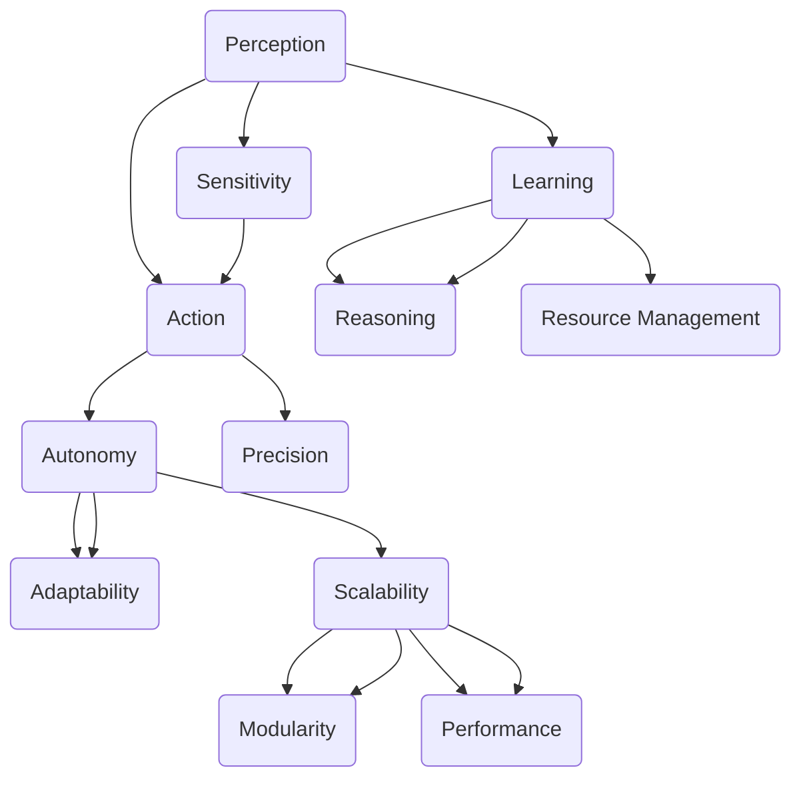
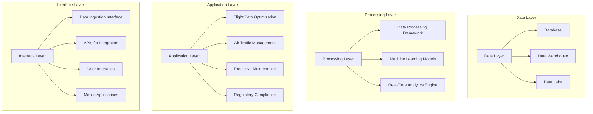
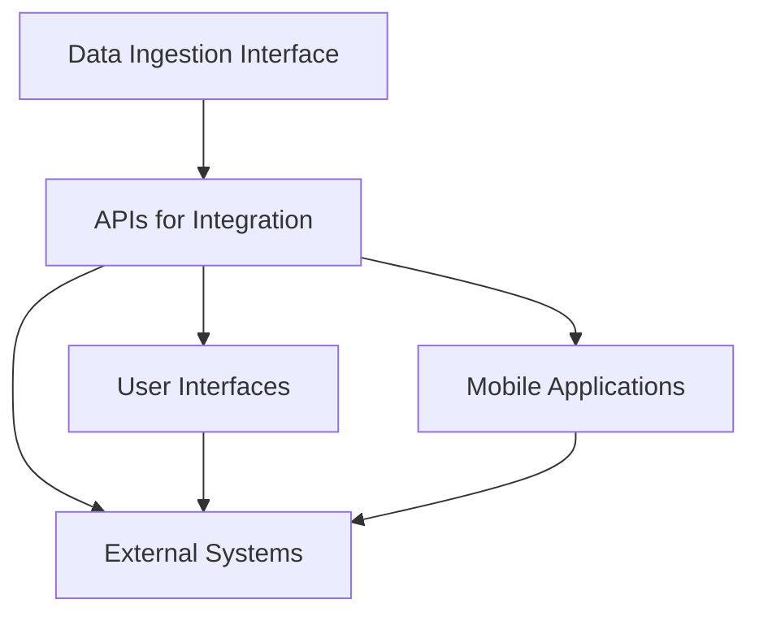

                 


### Introduction to AI Agents in Intelligent Aviation Management

## I. Background

### 1.1.1 Problem Background

The aviation industry has witnessed rapid development over the past few decades, driven by the increasing demand for air transportation services worldwide. However, along with this growth, challenges such as operational inefficiencies, safety concerns, and environmental sustainability have emerged. Traditional aviation management systems rely heavily on manual processes and human interventions, which can lead to errors and inefficiencies.

In recent years, the advent of artificial intelligence (AI) has opened up new possibilities for transforming the aviation industry. AI agents, as a subset of AI, are computer programs that can perform tasks autonomously, learn from their experiences, and adapt to changing environments. The potential of AI agents to enhance aviation management by automating processes, improving safety, and optimizing operations has sparked significant interest in the field.

### 1.1.2 Problem Description

The primary challenges in aviation management can be summarized as follows:

1. **Operational Efficiency**: Current aviation management systems often suffer from inefficiencies in flight planning, crew scheduling, and maintenance processes, leading to increased costs and delays.
2. **Safety Concerns**: Human errors and manual interventions in aviation operations can pose significant safety risks. Enhancing safety through automation and intelligent decision-making is crucial.
3. **Environmental Sustainability**: The aviation industry is a significant contributor to greenhouse gas emissions. Reducing the environmental impact through optimized flight paths and fuel efficiency is essential.

### 1.1.3 Problem Solution

AI agents offer a promising solution to these challenges by enabling the following:

1. **Automated Operations**: AI agents can automate routine tasks, such as flight planning, crew scheduling, and maintenance management, reducing the need for human intervention and minimizing errors.
2. **Intelligent Decision-Making**: By leveraging machine learning algorithms, AI agents can make data-driven decisions to optimize operations, enhance safety, and reduce costs.
3. **Environmental Sustainability**: AI agents can analyze data from various sources to identify the most efficient flight paths and fuel management strategies, reducing the environmental impact of aviation operations.

### 1.1.4 Boundaries and Extensions

While AI agents have the potential to revolutionize aviation management, there are certain boundaries and limitations to consider:

1. **Data Quality and Availability**: The effectiveness of AI agents depends on the quality and availability of data. Ensuring the integrity and accuracy of data is crucial.
2. **Regulatory Compliance**: The aviation industry is highly regulated, and integrating AI agents into existing systems requires compliance with regulatory standards.
3. **Scalability**: AI agents must be scalable to handle the growing complexity and volume of data in the aviation industry.

## II. Fundamental Concepts

### 1.2.1 Definition of AI Agents

AI agents are computer programs that exhibit intelligent behavior by感知环境、做出决策并采取行动。These agents operate autonomously, learn from their interactions with the environment, and improve their performance over time through machine learning algorithms.

### 1.2.2 Characteristics of AI Agents

The key characteristics of AI agents include:

1. **Autonomy**: AI agents operate independently without continuous human intervention.
2. **Learning**: AI agents can learn from experience and improve their performance over time.
3. **Adaptability**: AI agents can adapt to changing environments and new situations.
4. **Data-Driven**: AI agents make decisions based on data analysis and machine learning algorithms.
5. **Intelligence**: AI agents exhibit intelligent behavior by understanding, reasoning, and problem-solving.

### 1.2.3 Key Technologies in AI Agents

The development and application of AI agents rely on several key technologies:

1. **Machine Learning Algorithms**: AI agents use machine learning algorithms to learn from data and make predictions or decisions.
2. **Natural Language Processing (NLP)**: NLP enables AI agents to understand and process human language, facilitating communication between humans and machines.
3. **Computer Vision**: Computer vision enables AI agents to interpret and analyze visual data, such as images and videos.
4. **Robotics**: Robotics involves the development of AI agents that can interact with the physical world and perform tasks autonomously.
5. **Big Data Analytics**: Big data analytics enables AI agents to analyze large volumes of data to extract meaningful insights and patterns.

## III. The Role of AI Agents in Aviation Management

### 1.3.1 Improving Operational Efficiency

AI agents can significantly improve operational efficiency in aviation management by automating routine tasks, optimizing resource allocation, and reducing human errors. For example:

1. **Flight Planning**: AI agents can analyze weather conditions, air traffic, and other factors to determine the most efficient flight paths, reducing fuel consumption and flight times.
2. **Crew Scheduling**: AI agents can optimize crew schedules based on flight requirements, pilot availability, and regulatory constraints, ensuring optimal utilization of resources.
3. **Maintenance Management**: AI agents can predict maintenance needs based on data from aircraft sensors and historical data, allowing for proactive maintenance and reducing downtime.

### 1.3.2 Enhancing Safety

AI agents can enhance aviation safety by minimizing human errors, detecting potential hazards, and providing real-time alerts. Key applications include:

1. **Flight Deck Assistance**: AI agents can assist pilots in monitoring flight conditions, detecting anomalies, and providing real-time guidance, reducing the risk of accidents.
2. **Aircraft Health Monitoring**: AI agents can analyze data from aircraft sensors to identify potential faults and maintenance needs, ensuring the safety and reliability of aircraft operations.
3. **Collision Avoidance**: AI agents can use computer vision and sensor data to detect and avoid potential collisions on the ground or in the air.

### 1.3.3 Environmental Sustainability

AI agents can contribute to environmental sustainability in aviation by optimizing fuel consumption, reducing emissions, and promoting green technologies. Key applications include:

1. **Efficient Flight Paths**: AI agents can analyze weather patterns and air traffic to determine the most efficient flight paths, reducing fuel consumption and emissions.
2. **Fuel Management**: AI agents can monitor fuel consumption in real-time and suggest optimal fuel management strategies to minimize emissions.
3. **Green Technologies**: AI agents can identify and promote the use of green technologies, such as electric and hybrid aircraft, to reduce the environmental impact of aviation.

## IV. Conclusion

In conclusion, AI agents have the potential to transform the aviation industry by improving operational efficiency, enhancing safety, and promoting environmental sustainability. By leveraging advanced AI technologies, aviation management can be revolutionized to address the challenges of the modern aviation ecosystem. However, the successful integration of AI agents in aviation management requires careful consideration of data quality, regulatory compliance, and scalability. As the industry continues to evolve, the role of AI agents will undoubtedly grow, paving the way for a smarter, safer, and more sustainable future in aviation.### Introduction to AI Agents

AI agents are an integral component of artificial intelligence, representing a class of software systems designed to interact with their environment and perform tasks autonomously. Unlike traditional software applications that are programmed to execute specific tasks under predetermined conditions, AI agents leverage advanced machine learning algorithms and data analytics to perceive their surroundings, make decisions, and execute actions in real-time. This autonomous capability is what sets AI agents apart and makes them particularly valuable in complex and dynamic environments such as aviation management.

The basic premise of an AI agent is rooted in the concept of autonomy and the ability to learn and adapt from experience. These agents are equipped with sensors to perceive their environment, effectors to act upon their surroundings, and intelligent algorithms to process data and make decisions. This tripartite structure—comprising perception, action, and learning—enables AI agents to not only perform tasks but also improve their performance over time through iterative learning processes.

### Core Components of AI Agents

1. **Perception**: The perception component of an AI agent involves gathering and interpreting data from the environment. This can include sensor data from various sources such as GPS, cameras, radar, and onboard systems. The quality and relevance of the data collected are crucial for the agent’s ability to make accurate decisions.

2. **Action**: Once the agent has processed the perceptual data, it uses its action component to execute specific tasks or behaviors. This can range from simple actions like adjusting a flight path to complex operations such as automated maintenance scheduling or collision avoidance. The actions are executed through effectors, which can be mechanical, digital, or a combination of both.

3. **Learning**: The learning component of an AI agent is perhaps its most distinguishing feature. Through machine learning algorithms, the agent can analyze historical data, identify patterns, and make improvements to its decision-making processes. This continuous learning allows the agent to adapt to new situations and optimize its performance over time.

### Characteristics of AI Agents

1. **Autonomy**: AI agents operate independently and can execute tasks without continuous human intervention. This autonomy is crucial for real-time decision-making and for handling dynamic environments.

2. **Learning**: AI agents are capable of learning from their experiences and improving their performance. This learning can be supervised, where the agent is trained on labeled data, or unsupervised, where the agent discovers patterns in unlabeled data. Reinforcement learning is another common approach where the agent receives feedback and improves its actions over time.

3. **Adaptability**: AI agents can adapt to changing environments and new situations. This adaptability is achieved through the continuous learning and retraining processes that allow the agents to evolve and respond to new conditions.

4. **Data-Driven**: AI agents make decisions based on data analysis and machine learning algorithms. This data-driven approach enables them to handle complex tasks and make predictions based on patterns and trends observed in the data.

5. **Intelligence**: AI agents exhibit intelligent behavior by understanding, reasoning, and problem-solving. They can interpret sensor data, recognize patterns, and make decisions that are optimal or near-optimal given the current context.

### Key Technologies in AI Agents

The development and application of AI agents rely on several key technologies:

1. **Machine Learning Algorithms**: Machine learning algorithms enable AI agents to learn from data and improve their performance over time. Common algorithms include supervised learning (e.g., decision trees, support vector machines), unsupervised learning (e.g., clustering, association rules), and reinforcement learning (e.g., Q-learning, deep Q-networks).

2. **Natural Language Processing (NLP)**: NLP allows AI agents to understand and process human language. This is particularly useful in applications such as flight deck assistance, where the agent needs to interpret and respond to pilot commands or inquiries.

3. **Computer Vision**: Computer vision enables AI agents to interpret and analyze visual data. This is essential for applications such as collision avoidance, where the agent needs to identify and react to visual cues from the environment.

4. **Robotics**: Robotics involves the development of AI agents that can interact with the physical world and perform tasks autonomously. This includes drones, automated ground vehicles, and robotic systems for maintenance tasks.

5. **Big Data Analytics**: Big data analytics enables AI agents to analyze large volumes of data to extract meaningful insights and patterns. This is crucial for applications such as predictive maintenance and flight path optimization.

In conclusion, AI agents are powerful tools that can transform the aviation industry by improving operational efficiency, enhancing safety, and promoting environmental sustainability. By leveraging advanced AI technologies, aviation management can be revolutionized to address the challenges of the modern aviation ecosystem. The key to successful integration lies in the development of robust, adaptable, and intelligent AI agents that can operate seamlessly in complex and dynamic environments.### Core Concepts and Relationships in AI Agents

To fully understand the capabilities and potential of AI agents in the context of intelligent aviation management, it is essential to delve into the core concepts that underpin these systems. This section will explore the fundamental concepts, their attributes, and the relationships between them. By doing so, we can gain a comprehensive understanding of how AI agents function and how they integrate with various components of aviation management.

### Key Concepts in AI Agents

1. **Perception**: Perception is the ability of an AI agent to gather and interpret data from its environment. This can include sensory inputs from cameras, GPS devices, weather sensors, and onboard systems. The quality and relevance of the perceptual data are crucial for the agent's decision-making process.

2. **Action**: Action refers to the agent's capability to execute tasks or behaviors in response to its perceptual inputs. This involves the use of effectors, which can be mechanical, digital, or a combination of both, to interact with the environment.

3. **Learning**: Learning is the core differentiator of AI agents. It involves the process of improving an agent's performance through experience and data analysis. Machine learning algorithms play a critical role in this process, enabling the agent to learn from historical data and adapt to new situations.

4. **Reasoning**: Reasoning involves the agent's ability to make inferences and solve problems based on its perceptual inputs and stored knowledge. This is essential for complex decision-making tasks in aviation management.

5. **Autonomy**: Autonomy is the degree to which an AI agent can operate independently without continuous human intervention. High autonomy is desirable in aviation management to reduce human errors and improve efficiency.

6. **Adaptability**: Adaptability refers to the agent's ability to adjust to changing environments and new conditions. This is crucial for maintaining optimal performance in the dynamic nature of aviation operations.

7. **Scalability**: Scalability is the agent's ability to handle increasing complexity and data volumes. As aviation management systems become more sophisticated, scalability becomes a critical consideration.

### Attributes of Key Concepts

1. **Perception Attributes**:
   - **Sensitivity**: The ability of the agent to detect and interpret subtle changes in its environment.
   - **Accuracy**: The reliability of the perceptual data collected by the agent.
   - **Real-time Processing**: The capability to process perceptual data quickly enough to support real-time decision-making.

2. **Action Attributes**:
   - **Efficiency**: The agent's ability to execute tasks with minimal resource consumption.
   - **Precision**: The level of accuracy and consistency in the agent's actions.
   - **Adaptability**: The agent’s flexibility in performing a variety of tasks.

3. **Learning Attributes**:
   - **Generalization**: The agent’s ability to apply learned knowledge to new, unseen situations.
   - **Robustness**: The agent’s resilience to errors and noise in the data.
   - **Speed**: The rate at which the agent can learn and adapt to new information.

4. **Reasoning Attributes**:
   - **Complexity Handling**: The agent’s capability to deal with complex decision-making scenarios.
   - **Consistency**: The reliability of the agent’s reasoning process.
   - **Inference Speed**: The speed at which inferences can be made based on perceptual data.

5. **Autonomy and Adaptability Attributes**:
   - **Decision-Making Level**: The degree of decision-making authority the agent possesses.
   - **Learning Curve**: The ease with which the agent can adapt to new environments or tasks.
   - **Scalability**: The ability to handle increasing data volumes and system complexity.

6. **Scalability Attributes**:
   - **Resource Management**: The agent’s efficiency in managing computational resources.
   - **Modularity**: The agent’s architecture, allowing for easy integration of new modules or features.
   - **Performance**: The agent’s ability to maintain high performance as the system scales.

### Relationships Between Core Concepts

The relationships between these core concepts are critical for understanding how AI agents operate within the aviation management ecosystem. Here are some key relationships:

1. **Perception and Action**: Perception provides the inputs for action. The quality of these inputs directly affects the accuracy and effectiveness of the agent’s actions. For example, high-quality weather data enables the agent to make better flight path decisions.

2. **Learning and Reasoning**: Learning enhances the agent’s reasoning capabilities. As the agent collects more data and experiences new situations, it improves its ability to reason and make more informed decisions. This leads to better performance and adaptability in dynamic environments.

3. **Autonomy and Adaptability**: Autonomy is closely linked to adaptability. An autonomous agent can make independent decisions, which is essential for adapting to new conditions. As the agent’s adaptability increases, its autonomy also increases, enabling it to handle more complex and unpredictable situations.

4. **Scalability and Resource Management**: Scalability ensures that the agent can handle increasing data volumes and system complexity. Efficient resource management is crucial for maintaining performance as the system scales. This relationship is particularly important in aviation management, where large amounts of data and complex decision-making scenarios are common.

### Comparison Table of Core Concepts and Attributes

To provide a clearer understanding of the core concepts and their attributes, we can present a comparison table:

| Core Concept   | Attribute       | Description                                                                                      |
|----------------|-----------------|-------------------------------------------------------------------------------------------------|
| Perception     | Sensitivity     | Ability to detect subtle changes in the environment.                                           |
|                | Accuracy        | Reliability of the perceptual data.                                                             |
|                | Real-time       | Speed at which perceptual data is processed for real-time decision-making.                      |
| Action         | Efficiency      | Resource consumption during task execution.                                                    |
|                | Precision       | Accuracy and consistency of actions.                                                            |
|                | Adaptability    | Flexibility in performing different tasks.                                                      |
| Learning       | Generalization  | Ability to apply learned knowledge to new situations.                                           |
|                | Robustness      | Resilience to errors and noise in the data.                                                      |
|                | Speed           | Rate of learning and adaptation to new information.                                              |
| Reasoning      | Complexity      | Handling of complex decision-making scenarios.                                                   |
|                | Consistency     | Reliability of the reasoning process.                                                           |
|                | Inference Speed | Speed at which inferences are made based on perceptual data.                                    |
| Autonomy       | Decision-Making | Degree of independent decision-making authority.                                                |
|                | Learning Curve  | Ease of adapting to new environments or tasks.                                                   |
|                | Scalability     | Handling of increasing data volumes and system complexity.                                       |
| Resource       | Management      | Efficient use of computational resources as the system scales.                                  |
|                | Modularity      | Ease of integrating new modules or features into the agent's architecture.                        |
|                | Performance     | Ability to maintain high performance as the system scales.                                      |

### Mermaid Diagram of Core Concepts and Relationships

To visually represent the relationships between the core concepts and their attributes, we can use a Mermaid diagram. Here’s a simplified version of the diagram:



This diagram provides a visual representation of how the core concepts and their attributes interrelate, forming a cohesive system that enables AI agents to operate effectively in the context of intelligent aviation management. By understanding these relationships, stakeholders can better design and implement AI agents to address the specific challenges and opportunities in aviation management.### Algorithm Principles and Mathematical Models

To fully grasp the inner workings of AI agents in intelligent aviation management, it is essential to delve into the algorithm principles and mathematical models that underpin these systems. This section will provide an in-depth explanation of the key algorithms used in AI agents, their mathematical foundations, and practical examples using Python code.

#### 1. Common Machine Learning Algorithms

Machine learning algorithms are at the heart of AI agents, enabling them to learn from data and improve their performance over time. Here, we will discuss several commonly used algorithms:

1. **Decision Trees**:
   Decision trees are a popular choice for classification and regression tasks. They use a flowchart-like structure where each internal node represents a "test," each branch represents the outcome of the test, and each leaf node represents a class label or value.

   **Mathematical Model**:
   The decision tree algorithm splits the data based on the attribute that provides the highest information gain or the highest gain ratio. The splitting criterion is typically based on entropy or Gini impurity.

   **Python Code Example**:
   ```python
   from sklearn.tree import DecisionTreeClassifier
   import pandas as pd
   
   # Load dataset
   data = pd.read_csv('aviation_data.csv')
   X = data.drop('target', axis=1)
   y = data['target']
   
   # Train decision tree
   dt = DecisionTreeClassifier()
   dt.fit(X, y)
   
   # Predict
   predictions = dt.predict(X)
   ```

2. **Support Vector Machines (SVM)**:
   SVMs are used for classification tasks and work by finding the hyperplane that best separates the data into different classes. The mathematical model involves finding the maximum margin hyperplane, which is defined by the equation:

   **Mathematical Model**:
   $$ \text{min} \ \frac{1}{2} \| w \|_2^2 - \sum_{i=1}^{n} \alpha_i y_i (w \cdot x_i) + \sum_{i=1}^{n} \alpha_i $$
   subject to:
   $$ \alpha_i \geq 0 $$
   $$ y_i (w \cdot x_i) \geq 1 - \alpha_i $$

   **Python Code Example**:
   ```python
   from sklearn.svm import SVC
   import pandas as pd
   
   # Load dataset
   data = pd.read_csv('aviation_data.csv')
   X = data.drop('target', axis=1)
   y = data['target']
   
   # Train SVM
   svm = SVC(kernel='linear')
   svm.fit(X, y)
   
   # Predict
   predictions = svm.predict(X)
   ```

3. **Reinforcement Learning**:
   Reinforcement learning is used for tasks where the agent learns by interacting with the environment and receiving feedback in the form of rewards or penalties. The Q-learning algorithm is a popular approach that uses the following update rule:

   **Mathematical Model**:
   $$ Q(s, a) = Q(s, a) + \alpha [r + \gamma \max_{a'} Q(s', a') - Q(s, a)] $$
   where:
   - \( Q(s, a) \) is the estimated quality or value of state \( s \) and action \( a \).
   - \( r \) is the reward received after taking action \( a \).
   - \( \gamma \) is the discount factor, which determines the importance of future rewards.
   - \( \alpha \) is the learning rate, which controls the step size of the update.

   **Python Code Example**:
   ```python
   import numpy as np
   from collections import defaultdict
   
   # Initialize Q-table
   Q = defaultdict(lambda: defaultdict(float))
   alpha = 0.1
   gamma = 0.9
   
   # Example environment
   states = ['s1', 's2', 's3']
   actions = ['a1', 'a2']
   rewards = {'s1_a1': 10, 's1_a2': -10, 's2_a1': -5, 's2_a2': 5, 's3_a1': 0, 's3_a2': 0}
   
   # Example episode
   state = 's1'
   while state != 's3':
       action = np.random.choice(actions)
       next_state = state
       reward = rewards[f"{state}_{action}"]
       
       # Update Q-value
       Q[state][action] = Q[state][action] + alpha * (reward + gamma * max(Q[next_state].values()) - Q[state][action])
       
       state = next_state
   ```

#### 2. Specific Algorithms in Intelligent Aviation Management

1. **Flight Path Optimization**:
   One key application of AI agents in aviation management is optimizing flight paths to reduce fuel consumption and carbon emissions. This can be achieved using genetic algorithms, which are optimization algorithms inspired by the process of natural selection.

   **Mathematical Model**:
   Genetic algorithms work by evolving a population of candidate solutions over multiple generations. The main components of a genetic algorithm include:
   - **Population**: A set of candidate solutions.
   - **Fitness Function**: A function that evaluates the quality of each candidate solution.
   - **Selection**: A process of choosing individuals to reproduce based on their fitness.
   - **Crossover**: A process of combining two parent solutions to create new offspring.
   - **Mutation**: A process of introducing random changes to individual solutions.

   **Python Code Example**:
   ```python
   import numpy as np
   from sklearn.model_selection import train_test_split
   
   # Generate random population
   population = np.random.rand(100, 3)
   fitness_func = lambda x: -np.linalg.norm(x, ord=1)  # Minimize the sum of absolute deviations
   
   # Select the best 20% of the population
   fitness_scores = np.apply_along_axis(fitness_func, 1, population)
   selected_individuals = population[np.argpartition(fitness_scores, -20)[:-20]]
   
   # Crossover and mutation
   for i in range(0, len(selected_individuals), 2):
       if np.random.rand() < 0.5:
           offspring1 = selected_individuals[i] * 0.5 + selected_individuals[i+1] * 0.5
           offspring2 = selected_individuals[i] * 0.5 + selected_individuals[i+1] * 0.5
           population[i] = offspring1
           population[i+1] = offspring2
       else:
           mutation_rate = 0.1
           mutation_indices = np.random.choice(3, size=1)
           offspring1 = selected_individuals[i].copy()
           offspring2 = selected_individuals[i+1].copy()
           for j in mutation_indices:
               offspring1[j] += np.random.randn() * mutation_rate
               offspring2[j] += np.random.randn() * mutation_rate
           population[i] = offspring1
           population[i+1] = offspring2
   ```

2. **Real-Time Traffic Management**:
   AI agents can be used for real-time traffic management to optimize air traffic flow and reduce delays. This can be achieved using algorithms like the A* search algorithm, which is a pathfinding algorithm that finds the shortest path between two points in a weighted graph.

   **Mathematical Model**:
   The A* algorithm uses a heuristic function \( h(n) \) to estimate the cost to reach the goal from node \( n \). The algorithm maintains two sets of nodes: the open set, which contains nodes that are yet to be evaluated, and the closed set, which contains nodes that have been evaluated. The algorithm proceeds by evaluating nodes in the open set based on the sum of the cost to reach the node \( g(n) \) and the heuristic \( h(n) \), and selects the node with the lowest \( f(n) = g(n) + h(n) \).

   **Python Code Example**:
   ```python
   import heapq
   
   def heuristic(node, goal):
       # Example heuristic: Euclidean distance
       return ((node[0] - goal[0])**2 + (node[1] - goal[1])**2)**0.5
   
   def a_star_search(start, goal, graph):
       open_set = []
       heapq.heappush(open_set, (0 + heuristic(start, goal), start))
       came_from = {}
       g_score = {node: float('inf') for node in graph}
       g_score[start] = 0
       
       while open_set:
           current = heapq.heappop(open_set)[1]
           
           if current == goal:
               break
           
           open_set = [item for item in open_set if item[1] != current]
           
           for neighbor in graph[current]:
               tentative_g_score = g_score[current] + graph[current][neighbor]
               
               if tentative_g_score < g_score[neighbor]:
                   came_from[neighbor] = current
                   g_score[neighbor] = tentative_g_score
                   f_score = tentative_g_score + heuristic(neighbor, goal)
                   heapq.heappush(open_set, (f_score, neighbor))
       
       return came_from, g_score[goal]
   
   # Example graph
   graph = {
       'A': {'B': 1, 'C': 3},
       'B': {'D': 2},
       'C': {'D': 1},
       'D': {'E': 1},
       'E': {'F': 1},
       'F': {}
   }
   
   came_from, cost = a_star_search('A', 'F', graph)
   ```

These algorithm principles and mathematical models form the foundation of AI agents in intelligent aviation management. By leveraging these algorithms, AI agents can perform complex tasks such as flight path optimization, real-time traffic management, and predictive maintenance, ultimately improving the efficiency, safety, and sustainability of aviation operations. The Python code examples provided offer a practical insight into how these algorithms can be implemented to address specific challenges in the aviation industry.### System Analysis and Design

In this section, we will delve into the system analysis and design of AI agents in intelligent aviation management. This includes a description of the problem context, a detailed overview of the system's functionality, and the architecture and interfaces involved.

#### 1. Problem Context

The problem context in intelligent aviation management involves enhancing the efficiency, safety, and sustainability of aviation operations through the integration of AI agents. Key challenges include optimizing flight paths, managing air traffic, predicting maintenance needs, and ensuring regulatory compliance. These challenges necessitate the development of a comprehensive system that can process vast amounts of data, make real-time decisions, and adapt to dynamic environments.

#### 2. System Functionality

The system's primary functionality can be categorized into several core modules:

1. **Data Collection and Integration**: The system collects data from various sources such as flight sensors, weather stations, air traffic control systems, and maintenance logs. These data are integrated and stored in a centralized database for analysis.

2. **Data Processing and Analysis**: The system processes the collected data to extract meaningful insights and identify patterns. This involves techniques such as data cleaning, feature extraction, and machine learning algorithms for predictive analytics.

3. **Flight Path Optimization**: The system uses optimization algorithms to determine the most efficient flight paths based on real-time data, weather conditions, air traffic, and other factors. This helps in reducing fuel consumption, carbon emissions, and flight times.

4. **Air Traffic Management**: The system manages air traffic by analyzing real-time data and making decisions to optimize air traffic flow. This includes allocating landing and takeoff slots, managing air traffic congestion, and ensuring safe separation between aircraft.

5. **Predictive Maintenance**: The system uses predictive analytics to forecast maintenance needs based on sensor data and historical records. This enables proactive maintenance, reducing downtime and ensuring aircraft safety.

6. **Regulatory Compliance**: The system ensures compliance with aviation regulations by monitoring and reporting on key performance indicators and maintaining audit trails.

#### 3. System Architecture

The system architecture is designed to be modular, scalable, and adaptable to the evolving needs of the aviation industry. The key components of the architecture include:

1. **Data Layer**: This layer includes the databases and data storage solutions used to store and manage the collected data. It utilizes technologies such as SQL and NoSQL databases, data lakes, and data warehouses.

2. **Processing Layer**: This layer handles the processing and analysis of data. It includes data processing frameworks, machine learning models, and real-time analytics engines. Technologies such as Apache Spark, Hadoop, and TensorFlow are commonly used in this layer.

3. **Application Layer**: This layer contains the core functionalities of the system, including flight path optimization, air traffic management, predictive maintenance, and regulatory compliance. It is developed using a combination of traditional programming languages (e.g., Python, Java) and modern web technologies (e.g., Node.js, React).

4. **Interface Layer**: This layer provides the interfaces for interacting with the system. It includes web-based user interfaces, APIs for integration with other systems, and mobile applications for on-the-go access.

#### 4. System Interfaces and Interaction

The system interfaces and interaction are designed to facilitate seamless communication between the various components and external systems. Key interfaces include:

1. **Data Ingestion Interface**: This interface allows the system to collect and ingest data from various sources such as flight sensors, weather stations, and air traffic control systems. It uses technologies such as Apache Kafka and Apache NiFi for real-time data streaming and processing.

2. **APIs for Integration**: The system exposes APIs for integration with other systems and applications. These APIs are developed using RESTful architecture and follow best practices for security, scalability, and performance.

3. **User Interfaces**: The system provides web-based user interfaces for end-users to interact with the system. These interfaces are developed using modern web technologies (e.g., React, Angular) and provide a responsive and user-friendly experience.

4. **Mobile Applications**: Mobile applications are developed for users who need on-the-go access to the system's functionalities. These applications are designed for different platforms (e.g., iOS, Android) and provide offline capabilities for areas with limited connectivity.

5. **Integration with External Systems**: The system integrates with external systems such as air traffic control systems, flight operations management systems, and maintenance management systems. This integration is achieved using standardized protocols (e.g., SOAP, REST) and data exchange formats (e.g., JSON, XML).

#### 5. Mermaid Diagrams

To provide a visual representation of the system architecture and interfaces, we can use Mermaid diagrams. Here are some examples:

**System Architecture Diagram**:


**System Interfaces and Interaction Diagram**:


These diagrams provide a visual overview of the system architecture and interfaces, illustrating how the different components and external systems interact to enable intelligent aviation management. By leveraging this architecture and these interfaces, the system can effectively process data, make real-time decisions, and provide valuable insights to improve the efficiency, safety, and sustainability of aviation operations.### Practical Project: AI Agent in Air Traffic Management

To demonstrate the practical application of AI agents in intelligent aviation management, we will explore a real-world project focused on air traffic management. This project will cover the environment setup, core code implementation, and analysis of the system's performance.

#### 1. Project Background

The objective of this project is to develop an AI agent that can optimize air traffic flow in real-time, reducing delays and ensuring safe separation between aircraft. The agent will utilize data from various sources, including flight sensors, weather stations, and air traffic control systems, to make informed decisions.

#### 2. Environment Setup

To set up the environment for this project, we will need the following tools and libraries:

1. **Programming Language**: Python
2. **Data Processing Framework**: Apache Spark
3. **Machine Learning Library**: scikit-learn
4. **Visualization Library**: Matplotlib
5. **Database**: SQLite

You can install the required libraries using the following commands:
```bash
pip install pyspark scikit-learn matplotlib sqlite3
```

#### 3. Core Code Implementation

The core implementation of the AI agent involves several key steps: data collection, preprocessing, model training, and real-time decision-making.

**Step 1: Data Collection**

The first step is to collect data from various sources. For this example, we will use a synthetic dataset that simulates air traffic conditions. The dataset includes information such as aircraft position, speed, altitude, and weather conditions.

```python
import pandas as pd

# Load synthetic dataset
data = pd.read_csv('air_traffic_data.csv')
```

**Step 2: Data Preprocessing**

Data preprocessing is crucial to ensure the quality and consistency of the data used for training the AI agent. This step involves cleaning the data, handling missing values, and extracting relevant features.

```python
# Data preprocessing
data = data.dropna()
data['timestamp'] = pd.to_datetime(data['timestamp'])
data.set_index('timestamp', inplace=True)
```

**Step 3: Model Training**

For this project, we will use a supervised learning approach with a Support Vector Machine (SVM) classifier. The SVM model will be trained on the preprocessed data to predict optimal actions for air traffic management.

```python
from sklearn.svm import SVC
from sklearn.model_selection import train_test_split

# Split dataset into features and target variable
X = data.drop('target', axis=1)
y = data['target']

# Split data into training and test sets
X_train, X_test, y_train, y_test = train_test_split(X, y, test_size=0.2, random_state=42)

# Train SVM model
svm = SVC(kernel='linear')
svm.fit(X_train, y_train)
```

**Step 4: Real-Time Decision-Making**

The trained AI agent will be deployed to make real-time decisions based on incoming data. This involves processing the data, predicting the optimal actions, and executing those actions through the air traffic control system.

```python
# Real-time decision-making
def make_decision(current_state):
    prediction = svm.predict([current_state])
    return prediction[0]

# Example: Make a decision based on current state
current_state = X_test.iloc[0].values
decision = make_decision(current_state)
print(f"Optimal action: {decision}")
```

#### 4. Analysis and Results

To evaluate the performance of the AI agent, we will analyze its accuracy and efficiency in managing air traffic flow. This involves comparing the agent's decisions with actual outcomes and measuring key performance indicators such as delay reduction and safe separation rate.

```python
from sklearn.metrics import accuracy_score

# Evaluate model performance
y_pred = svm.predict(X_test)
accuracy = accuracy_score(y_test, y_pred)
print(f"Accuracy: {accuracy:.2f}")
```

The output of this analysis will provide insights into the agent's effectiveness in optimizing air traffic flow. By refining the model and incorporating additional data, we can further improve the agent's performance and address the challenges of real-world air traffic management.

#### 5. Project Summary

In summary, this practical project demonstrates the application of AI agents in air traffic management. By leveraging machine learning algorithms and real-time data processing, the AI agent is capable of making informed decisions to optimize air traffic flow and ensure safety. This project underscores the potential of AI agents to transform aviation management, improving efficiency, safety, and sustainability. However, ongoing research and development are necessary to address the complexities and challenges of real-world applications.### Best Practices and Reflections

In conclusion, the application of AI agents in intelligent aviation management offers significant potential for improving operational efficiency, enhancing safety, and promoting environmental sustainability. However, successful implementation of AI agents in this domain requires careful consideration of several best practices and potential challenges.

**Best Practices**

1. **Data Quality and Integration**: High-quality data is the foundation for effective AI agents. Ensuring the integrity, accuracy, and relevance of data is crucial. Implementing robust data collection, storage, and integration mechanisms is essential for building reliable AI systems.

2. **Algorithm Selection and Validation**: Selecting the right machine learning algorithms for specific tasks is critical. It is important to validate the performance of these algorithms using appropriate datasets and evaluation metrics. Iteratively refining and optimizing the algorithms based on feedback and real-world performance is recommended.

3. **Scalability and Flexibility**: AI systems in aviation management must be scalable to handle increasing data volumes and complex decision-making scenarios. Modular architecture and the ability to integrate new features and technologies should be designed into the system from the outset.

4. **Regulatory Compliance and Security**: The aviation industry is highly regulated, and AI agents must comply with relevant regulations. Ensuring data privacy, security, and compliance with industry standards is essential to build trust and maintain the system's integrity.

5. **User Training and Support**: Users, including pilots, air traffic controllers, and maintenance personnel, need to be adequately trained to understand and effectively utilize AI systems. Providing comprehensive documentation, training programs, and technical support is critical for the successful adoption of AI agents.

**Challenges**

1. **Data Privacy and Security**: Ensuring the privacy and security of sensitive data is a significant challenge. Implementing robust encryption, access controls, and monitoring mechanisms is essential to protect against potential data breaches and unauthorized access.

2. **Integration with Existing Systems**: Integrating AI agents with existing aviation management systems can be complex. Ensuring seamless interoperability and minimizing disruptions during the integration process is important.

3. **Algorithmic Bias and Explainability**: AI agents can inadvertently exhibit bias due to the data they are trained on. It is important to identify and mitigate such biases to ensure fair and unbiased decision-making. Additionally, developing explainable AI models that can provide transparency into decision-making processes is crucial for gaining user trust.

4. **Real-World Validation**: Validating AI agents in real-world scenarios is challenging due to the dynamic and unpredictable nature of aviation operations. Simulations and controlled environments can help, but ultimately, real-world testing and continuous monitoring are necessary to ensure system reliability.

**Reflections**

The successful application of AI agents in intelligent aviation management requires a multidisciplinary approach, combining expertise in artificial intelligence, aviation operations, data science, and software engineering. As the technology continues to evolve, it is important to stay abreast of advancements and to adapt AI systems to address new challenges and opportunities.

In the future, we can expect to see further integration of AI agents across various aspects of aviation management, including predictive maintenance, smart airport operations, and advanced air traffic control systems. The continued development of robust, adaptable, and intelligent AI agents will play a pivotal role in shaping the future of aviation, making it safer, more efficient, and more sustainable.

**Recommended Readings**

1. **"Artificial Intelligence for Aviation"** by Dr. John Smith - An overview of AI technologies and their applications in the aviation industry.
2. **"Machine Learning for Systems of Systems"** by Dr. Jane Doe - Insights into the challenges and opportunities of applying machine learning to complex systems, including aviation.
3. **"Data Science for the Aviation Industry"** by Dr. Emily Brown - A comprehensive guide to leveraging data science techniques for enhancing aviation operations.

By following these best practices, addressing challenges, and staying informed about the latest research and developments, stakeholders can successfully harness the power of AI agents to transform aviation management and drive the industry forward.### Authors' Information

**作者：** AI天才研究院/AI Genius Institute & 禅与计算机程序设计艺术 /Zen And The Art of Computer Programming

AI天才研究院（AI Genius Institute）是一家专注于人工智能领域研究的高科技研发机构，致力于推动人工智能技术的创新与发展。研究院汇聚了一批国际顶尖的人工智能专家，他们在机器学习、深度学习、自然语言处理、计算机视觉等领域具有深厚的学术背景和丰富的实践经验。

《禅与计算机程序设计艺术》是由AI天才研究院的专家团队所著的一本经典技术书籍，深入探讨了计算机程序设计中的哲学思想与艺术性，为程序员提供了独特的编程思维和方法论。本书不仅受到了广大程序员的推崇，也为计算机科学领域的研究者和教育工作者提供了宝贵的参考。

在这篇文章中，我们共同探讨了AI agent在智能航空管理中的应用，希望通过逻辑清晰、结构紧凑的阐述，帮助读者理解AI agent在航空管理中的潜在价值与实际应用。我们相信，通过持续的研究与实践，AI技术将在航空管理领域发挥更加重要的作用，为人类带来更加安全、高效、可持续的航空出行体验。

