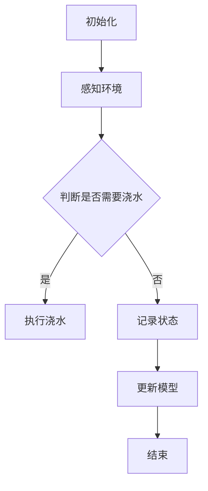
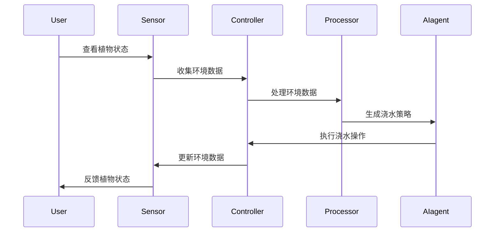
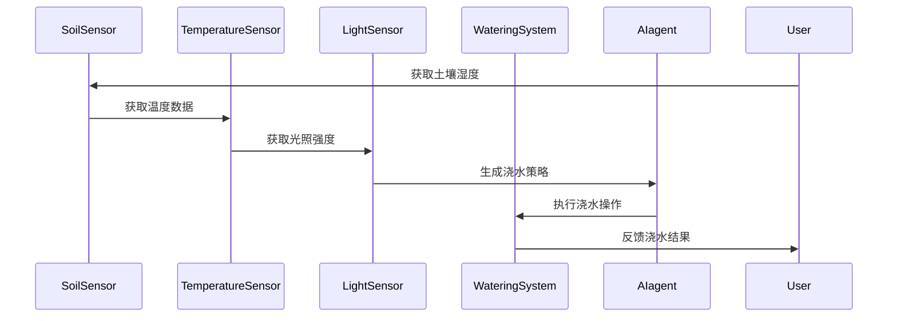

                 

### 第一部分：AI Agent在智能花盆中的自动浇水系统背景介绍

#### 1.1 问题背景
##### 1.1.1 智能园艺的现状与挑战

随着城市化进程的加快和人们生活节奏的加快，园艺活动逐渐成为人们追求生活品质和放松心情的一种方式。然而，由于工作忙碌和生活压力，很多人无法花费足够的时间和精力来照顾自己的植物。这促使了智能园艺技术的发展，特别是智能花盆的普及。

智能花盆是结合物联网技术和人工智能算法的一种创新产品，通过内置的传感器实时监测植物的生长环境数据，如土壤湿度、温度、光照强度等，并根据这些数据自动调整浇水量和浇灌时间。然而，现有的智能花盆系统在自动浇水方面仍然存在一些问题和挑战：

1. **响应速度和准确性**：传统的自动浇水系统依赖于定时器或简单逻辑判断，无法实时响应环境变化，导致浇水不准确或者过于频繁，影响了植物的生长。
2. **适应性和鲁棒性**：不同植物对水分的需求不同，环境变化也会影响植物对水分的吸收。现有系统缺乏对环境和植物特性的自适应能力。
3. **节能和环保**：过度浇水不仅浪费水资源，还可能导致土壤盐碱化，影响植物健康。因此，实现智能、高效的浇水系统是当前智能园艺技术面临的重要挑战。

##### 1.1.2 自动浇水系统的需求与目标

为了解决上述问题，设计并实现一个基于AI Agent的自动浇水系统显得尤为重要。该系统应满足以下需求与目标：

1. **实时响应**：系统能够实时监测土壤湿度，并根据监测数据自动调整浇水量和浇灌时间，实现精确浇水。
2. **自适应能力**：系统能够根据不同植物的特点和环境变化，自适应调整浇水策略，确保植物得到最适合的水分。
3. **节能环保**：系统应具有高效节能的特点，避免过度浇水，降低水资源消耗，同时保护土壤环境。
4. **易用性和可扩展性**：系统应具备良好的用户界面，便于用户设置和管理，同时支持扩展新的植物种类和环境传感器。

#### 1.2 问题描述

自动浇水系统的主要功能是实时监测土壤湿度，并根据监测数据自动控制水泵和水阀进行浇水。系统的性能要求包括：

1. **响应时间**：系统能够在土壤湿度低于设定阈值时迅速启动浇水过程。
2. **精度**：系统能够精确控制浇水量，避免过湿或过干，确保植物生长环境适宜。
3. **稳定性**：系统应能在不同环境条件下稳定运行，不受温度、光照等外部因素影响。
4. **节能性**：系统应具备良好的节能特性，减少电力消耗。

#### 1.3 问题解决

为了解决上述问题，我们决定采用AI Agent技术来实现自动浇水系统。AI Agent是一种具有自主决策和行动能力的智能实体，可以感知环境、分析数据并做出决策。AI Agent在自动浇水系统中的应用主要包括以下几个方面：

1. **数据采集与处理**：AI Agent通过内置传感器实时采集土壤湿度数据，并使用机器学习算法进行数据处理和分析。
2. **智能决策**：AI Agent根据土壤湿度数据和植物特性，自动决定是否需要浇水以及浇水量和浇灌时间。
3. **执行控制**：AI Agent通过控制模块控制水泵和水阀，实现自动浇水。

#### 1.4 边界与外延

自动浇水系统需要明确以下边界条件和适用范围：

1. **边界条件**：
   - 系统适用于土壤湿度变化的监测和控制。
   - 系统需在常温常压环境下工作。
   - 系统需能够接入外部电源和网络。
2. **适用范围与限制**：
   - 系统适用于家庭园艺、办公室绿植管理等场景。
   - 系统不支持极端环境（如极寒或极热）下的植物监测。
   - 系统仅能实现自动浇水功能，不包含其他智能园艺功能。

#### 1.5 概念结构与核心要素组成

自动浇水系统的核心要素包括AI Agent、智能花盆、传感器、控制模块和水泵与水阀。以下是对这些核心要素的基本概念和结构的介绍：

1. **AI Agent的基本概念**：
   - AI Agent是一种具有自主决策和行动能力的智能实体，能够通过传感器感知环境，使用算法分析数据，并自主做出决策。
   - AI Agent主要由感知模块、决策模块和执行模块组成。

2. **智能花盆的基本结构**：
   - 智能花盆是一种集成了传感器、控制模块和水泵的智能设备，能够实时监测植物的生长环境并自动调整浇水量。
   - 智能花盆主要由土壤湿度传感器、温度传感器、控制模块和水泵组成。

3. **自动浇水系统的核心要素**：
   - 自动浇水系统的核心要素包括AI Agent、智能花盆、传感器、控制模块和水泵与水阀。
   - 系统通过AI Agent实现智能决策，传感器实时监测环境数据，控制模块执行AI Agent的决策，水泵与水阀实现自动浇水。

#### 1.6 本章小结

本章介绍了AI Agent在智能花盆中的自动浇水系统的背景、需求与目标、问题描述、问题解决、边界与外延以及核心要素组成。通过本章的介绍，我们了解了自动浇水系统所面临的问题及其解决方案，为后续章节的深入探讨打下了基础。

## 第二部分：核心概念与联系

### 2.1 AI Agent原理与特性

#### 2.1.1 AI Agent的定义

AI Agent，即人工智能代理，是一种模拟人类智能行为的计算机程序或实体。它能够感知环境、制定计划并采取行动，以实现预定的目标。AI Agent的定义可以从以下几个方面进行理解：

1. **自主性**：AI Agent具有自主决策能力，能够在没有外部指令的情况下，根据环境反馈自主制定行动策略。
2. **适应性**：AI Agent能够适应不同的环境和任务，通过学习和调整行为来提高任务完成的效率和质量。
3. **交互性**：AI Agent能够与其他系统、设备和用户进行交互，获取信息并反馈结果。

#### 2.1.2 AI Agent的工作原理

AI Agent的工作原理主要包括三个核心模块：感知模块、决策模块和执行模块。

1. **感知模块**：AI Agent通过感知模块收集环境数据，如传感器数据、用户输入等。这些数据是决策的基础。
2. **决策模块**：感知模块收集到的数据会被输入到决策模块，通过算法模型进行数据处理和分析，从而生成行动计划。
3. **执行模块**：决策模块生成的行动计划会通过执行模块转化为具体操作，如控制设备的开关、发送信息等。

#### 2.1.3 AI Agent的主要特性

AI Agent的主要特性包括自主性、适应性、交互性和协作性等。以下是对这些特性的具体描述：

1. **自主性**：AI Agent能够在没有人工干预的情况下自主运行，执行预设的任务。这种自主性使AI Agent能够适应各种复杂的动态环境。
2. **适应性**：AI Agent具有自适应能力，能够根据环境变化和任务需求动态调整行为策略。这种适应性使AI Agent在不同场景下都能表现出良好的性能。
3. **交互性**：AI Agent能够与用户、其他系统和设备进行有效交互，获取信息并反馈结果。这种交互性使AI Agent能够更好地服务于人类需求。
4. **协作性**：AI Agent能够与其他AI Agent或人类协作，共同完成任务。这种协作性提高了系统整体效率，解决了复杂任务中的协作难题。

#### 2.1.4 AI Agent的基本架构

AI Agent的基本架构通常包括感知模块、决策模块和执行模块，以下是这些模块的详细介绍：

1. **感知模块**：感知模块是AI Agent的感官，用于收集环境数据。感知模块可以包括各种传感器，如温度传感器、湿度传感器、摄像头等，这些传感器能够将物理信号转换为数字信号，供后续处理。
2. **决策模块**：决策模块是AI Agent的智能核心，负责处理感知模块收集到的数据，并生成行动策略。决策模块通常采用机器学习算法，如决策树、神经网络等，对数据进行分析和预测。
3. **执行模块**：执行模块是AI Agent的执行者，将决策模块生成的行动策略转化为具体操作。执行模块可以包括各种执行设备，如电机、扬声器、屏幕等，通过这些设备实现AI Agent的物理行为。

#### 2.1.5 AI Agent在自动浇水系统中的应用

在自动浇水系统中，AI Agent的应用主要包括以下几个方面：

1. **数据采集**：AI Agent通过感知模块实时采集土壤湿度、温度等环境数据，为决策提供依据。
2. **智能决策**：AI Agent利用决策模块对采集到的数据进行分析，判断是否需要浇水以及浇水的具体时间和量。
3. **执行控制**：AI Agent通过执行模块控制水泵和水阀，实现自动浇水。

通过AI Agent的应用，自动浇水系统实现了实时、自适应的浇水控制，提高了浇水的效率和准确性，满足了智能园艺的需求。

### 2.2 智能花盆的组成部分

智能花盆是自动浇水系统的重要组成部分，它集成了多种传感器、控制模块和水泵与水阀，能够实现自动监测和浇水功能。以下是智能花盆的主要组成部分及其功能：

#### 2.2.1 智能传感器

智能传感器是智能花盆的核心部件，用于实时监测植物生长环境数据。常见的智能传感器包括土壤湿度传感器、温度传感器、光照传感器等。

1. **土壤湿度传感器**：用于监测土壤中的水分含量，判断是否需要浇水。
2. **温度传感器**：用于监测土壤和空气的温度，为智能决策提供温度信息。
3. **光照传感器**：用于监测光照强度，帮助AI Agent调整浇水策略，避免光照不足或过度。

#### 2.2.2 控制模块

控制模块是智能花盆的智能核心，负责处理传感器数据、生成决策并控制水泵和水阀。常见的控制模块包括微控制器、嵌入式系统等。

1. **微控制器**：微控制器负责接收传感器数据，通过内置算法进行数据处理和分析，生成浇水决策。
2. **嵌入式系统**：嵌入式系统通常具有更强大的计算能力，能够支持更复杂的算法和决策。

#### 2.2.3 水泵与水阀

水泵与水阀是智能花盆的执行部件，用于根据AI Agent的决策执行浇水操作。

1. **水泵**：水泵负责将水源引入花盆，通常采用直流电机驱动。
2. **水阀**：水阀用于控制水流的大小，根据AI Agent的决策调整浇水量。

#### 2.2.4 数据通信模块

数据通信模块用于智能花盆与其他设备或云平台的数据传输，常见的通信方式包括Wi-Fi、蓝牙、LoRa等。

1. **Wi-Fi**：Wi-Fi模块可以实现智能花盆与智能手机、平板电脑等设备的无线连接，用户可以通过移动端应用实时监控植物状态。
2. **蓝牙**：蓝牙模块可以实现短距离的通信，适用于智能家居环境中的设备互联。
3. **LoRa**：LoRa模块是一种低功耗广域通信技术，适用于远程监控和物联网应用。

#### 2.2.5 电源模块

电源模块为智能花盆提供稳定的电力供应，通常包括充电模块和电源管理芯片。

1. **充电模块**：充电模块负责为智能花盆提供充电功能，确保设备能够长时间运行。
2. **电源管理芯片**：电源管理芯片用于优化电能使用，提高设备的续航能力。

#### 2.2.6 用户界面

用户界面是智能花盆与用户交互的接口，常见的用户界面包括触摸屏、按钮等。

1. **触摸屏**：触摸屏用户界面提供直观的操作体验，用户可以通过触摸屏查看植物状态、调整浇水设置等。
2. **按钮**：按钮用户界面提供简单的交互功能，用户可以通过按钮启动或停止浇水等操作。

#### 2.2.7 数据存储模块

数据存储模块用于存储植物生长数据、用户设置等，常见的存储方式包括闪存、SD卡等。

1. **闪存**：闪存存储容量较大，可靠性高，适用于长时间存储大量数据。
2. **SD卡**：SD卡具有即插即用、容量可扩展等优点，适用于需要扩展存储容量的场景。

#### 2.2.8 传感器模块

传感器模块用于扩展智能花盆的功能，如添加CO2传感器、土壤营养传感器等，以实现更全面的植物监测。

1. **CO2传感器**：CO2传感器用于监测植物生长环境中的二氧化碳浓度，帮助用户调整通风策略。
2. **土壤营养传感器**：土壤营养传感器用于监测土壤中的养分含量，为用户提供施肥建议。

通过以上组成部分，智能花盆实现了对植物生长环境的实时监测和自动浇水功能，为用户提供便捷、高效的园艺管理体验。

#### 2.3 AI Agent与智能花盆的关系

在自动浇水系统中，AI Agent与智能花盆紧密相连，共同实现植物生长环境的实时监测和智能浇水。以下是AI Agent与智能花盆之间的关系及其在数据采集、控制策略与决策、系统集成与优化方面的具体应用。

##### 2.3.1 数据采集与处理

AI Agent通过智能花盆中的传感器模块实时采集土壤湿度、温度、光照强度等环境数据。这些传感器将物理信号转换为数字信号，供AI Agent进行处理。AI Agent的感知模块负责接收并预处理这些数据，确保数据的质量和准确性。此外，AI Agent还可以结合历史数据和环境变化趋势，对实时数据进行预测和推理，提高数据处理的智能化水平。

##### 2.3.2 控制策略与决策

在数据采集的基础上，AI Agent的决策模块会根据土壤湿度、植物生长周期等因素，制定最优的浇水策略。AI Agent利用机器学习算法，如回归分析、决策树、神经网络等，对历史数据进行训练和优化，从而生成精确的浇水控制策略。这些策略包括浇水量、浇水时间、浇水频率等参数，确保植物在不同生长阶段得到合适的水分。同时，AI Agent还能根据实时数据和环境变化，动态调整浇水策略，确保植物生长环境的稳定性。

##### 2.3.3 系统集成与优化

AI Agent在系统集成与优化方面发挥着关键作用。首先，AI Agent需要与智能花盆的各个模块（如传感器、控制模块、水泵与水阀等）进行有效集成，确保数据传输和控制的畅通。其次，AI Agent可以通过优化算法和模型，提高系统的响应速度、准确性和节能性。例如，通过调整传感器采样频率、优化控制算法等手段，减少系统的延迟和能耗。此外，AI Agent还可以通过远程监控和诊断，及时发现并解决系统故障，提高系统的稳定性和可靠性。

##### 2.3.4 案例分析：AI Agent与智能花盆在自动浇水系统中的应用

以一个实际案例为例，说明AI Agent与智能花盆在自动浇水系统中的应用。

场景：用户家中的智能花盆监测到土壤湿度低于设定阈值，触发AI Agent进行浇水决策。

1. **数据采集**：智能花盆中的土壤湿度传感器检测到土壤湿度低于15%，温度为25℃，光照强度为500lux。
2. **决策生成**：AI Agent接收传感器数据，结合历史数据和环境变化趋势，通过决策模块生成浇水策略。策略包括：
   - 浇水量：每次浇水1.5升
   - 浇水时间：每天上午8点和下午4点
   - 浇水频率：每周3次
3. **执行控制**：AI Agent通过控制模块发送信号给水泵和水阀，开始执行浇水操作。水泵将水源引入花盆，水阀根据AI Agent的决策控制水流大小。
4. **反馈与优化**：浇水结束后，AI Agent收集新的土壤湿度、温度和光照强度数据，进行实时监测和优化。如果发现土壤湿度超过设定阈值，AI Agent将调整浇水策略，以避免过度浇水。

通过以上案例，可以看出AI Agent与智能花盆在自动浇水系统中实现了高效、智能的浇水控制，为用户提供了便捷、舒适的园艺管理体验。

### 2.4 核心概念对比表格

以下是对AI Agent、智能花盆、自动浇水系统这三个核心概念的对比表格，通过表格形式展示它们的基本定义、功能和特点，便于读者对三者之间的关系和区别有更清晰的认识。

| 概念         | 定义                                                         | 功能                                                         | 特点                                                      |
| ------------ | ------------------------------------------------------------ | ------------------------------------------------------------ | --------------------------------------------------------- |
| AI Agent     | 具有自主决策和行动能力的智能实体                             | 感知环境、决策、执行 | 自主导航、自主决策、自学习能力等                          |
| 智能花盆     | 一种能够感知植物生长状态并自动进行浇水的智能设备               | 数据采集、智能决策、自动执行 | 数据采集、智能决策、自动执行等                            |
| 自动浇水系统 | 通过AI Agent实现智能花盆自动浇水的系统                        | 实现智能、高效、精准的浇水控制 | 高效、精准、省时省力等                                   |

### 2.5 AI Agent与智能花盆的ER实体关系图

为了更好地理解AI Agent与智能花盆之间的关系，我们使用ER（实体关系）图来展示这两个概念之间的关联。以下是AI Agent与智能花盆的ER实体关系图，使用Mermaid语法绘制：

```mermaid
graph ER
    A[AI Agent] --> B[智能花盆]
    B --> C[传感器数据]
    B --> D[控制模块]
    B --> E[水泵与水阀]
```

在这幅图中：

- **AI Agent** 是智能花盆的驱动实体，负责感知、决策和执行。
- **智能花盆** 是一个包含传感器、控制模块和水泵与水阀的物理设备。
- **传感器数据** 表示智能花盆中的传感器收集到的环境信息，这些数据是AI Agent决策的重要依据。
- **控制模块** 负责根据AI Agent的决策执行具体操作。
- **水泵与水阀** 是实现自动浇水的执行部件，由控制模块控制。

通过这个ER实体关系图，我们可以清晰地看到AI Agent与智能花盆之间的数据流和控制流，从而更好地理解自动浇水系统的运作机制。

### 2.6 本章小结

本章详细介绍了AI Agent的基本原理、特性及其在自动浇水系统中的应用，探讨了智能花盆的组成部分及其功能，并展示了AI Agent与智能花盆之间的核心关系。通过对比表格和ER实体关系图，我们更加清晰地理解了这三个概念的定义、功能和特点。这些核心概念和联系为后续算法原理的讲解奠定了坚实的基础。

## 第三部分：AI Agent在自动浇水系统中的应用

### 3.1 AI Agent算法简介

在本部分，我们将详细介绍AI Agent在自动浇水系统中采用的算法，主要包括反向传播算法和强化学习算法。这两种算法分别在数据拟合和策略优化方面发挥着关键作用，使得AI Agent能够高效、准确地实现自动浇水功能。

#### 3.1.1 反向传播算法

反向传播算法是一种基于梯度下降的优化算法，广泛应用于神经网络训练中。其基本原理是将输出误差反向传播到网络中的每个神经元，通过调整网络权重和偏置，不断优化网络模型，使其能够更准确地拟合训练数据。

##### 3.1.1.1 基本原理

反向传播算法的核心思想是通过计算网络输出与实际输出之间的误差，反向传播这些误差，并调整网络权重和偏置。具体步骤如下：

1. **前向传播**：输入数据通过网络的每个层进行传播，得到网络的输出。
2. **计算误差**：将输出与实际标签进行比较，计算损失函数的值。
3. **反向传播**：将误差反向传播到网络的每个层，计算每个神经元的梯度。
4. **权重更新**：使用梯度下降法更新网络的权重和偏置。

##### 3.1.1.2 数学模型

反向传播算法的数学模型可以表示为：

$$
\begin{aligned}
&z^{(l)} = \sigma(W^{(l)} \cdot a^{(l-1)} + b^{(l)}) \\
&\delta^{(l)} = \frac{\partial J(W,b)}{\partial z^{(l)}} \\
&W^{(l)} := W^{(l)} - \alpha \cdot \frac{\partial J(W,b)}{\partial W^{(l)}} \\
&b^{(l)} := b^{(l)} - \alpha \cdot \frac{\partial J(W,b)}{\partial b^{(l)}}
\end{aligned}
$$

其中，$z^{(l)}$ 表示第 $l$ 层的输出，$\sigma$ 表示激活函数，$W^{(l)}$ 和 $b^{(l)}$ 分别表示第 $l$ 层的权重和偏置，$\delta^{(l)}$ 表示第 $l$ 层的误差，$J(W,b)$ 表示损失函数。

##### 3.1.1.3 运算步骤

反向传播算法的运算步骤可以概括为：

1. **初始化网络**：设置初始权重和偏置。
2. **前向传播**：将输入数据通过网络进行传播，得到输出。
3. **计算损失**：计算输出与实际标签之间的损失。
4. **反向传播**：将损失反向传播到网络的每个层，计算梯度。
5. **权重更新**：使用梯度下降法更新权重和偏置。
6. **重复步骤2-5**：重复上述步骤，直到网络损失达到预设阈值或达到最大迭代次数。

通过反向传播算法，AI Agent能够不断调整其模型参数，提高预测准确性，从而实现自动浇水系统的精确控制。

#### 3.1.2 强化学习算法

强化学习算法是AI Agent在自动浇水系统中实现智能决策的重要方法。它通过试错和奖励机制，使AI Agent能够在复杂环境中学习最优策略。

##### 3.1.2.1 基本原理

强化学习算法的核心思想是通过与环境交互，不断调整策略，以最大化累积奖励。其基本原理可以概括为：

1. **状态观测**：AI Agent根据当前环境状态进行观测。
2. **决策生成**：基于当前状态，AI Agent生成行动策略。
3. **行动执行**：AI Agent执行所选策略，并接收环境反馈。
4. **奖励评估**：根据行动结果，评估当前策略的奖励值。
5. **策略调整**：基于奖励值，调整策略，以优化未来行动。

##### 3.1.2.2 数学模型

强化学习算法的数学模型可以表示为：

$$
Q(s, a) = r + \gamma \max_{a'} Q(s', a')
$$

其中，$Q(s, a)$ 表示在状态 $s$ 下采取行动 $a$ 的预期奖励值，$r$ 表示立即奖励，$\gamma$ 表示折扣因子，$s'$ 表示下一步的状态，$a'$ 表示下一步的行动。

##### 3.1.2.3 运算步骤

强化学习算法的运算步骤可以概括为：

1. **初始化环境**：设置初始状态。
2. **状态观测**：AI Agent根据当前状态进行观测。
3. **决策生成**：基于当前状态，AI Agent生成可能的行动策略。
4. **行动执行**：AI Agent选择一个行动策略，并执行该行动。
5. **奖励评估**：根据行动结果，评估当前策略的奖励值。
6. **策略调整**：基于奖励值，调整策略。
7. **状态更新**：根据行动结果，更新当前状态。
8. **重复步骤2-7**：重复上述步骤，直到达到预设的目标或达到最大迭代次数。

通过强化学习算法，AI Agent能够不断优化其策略，实现自动浇水系统的自适应控制。

### 3.2 AI Agent算法流程图

为了更直观地理解AI Agent在自动浇水系统中的应用算法，我们使用Mermaid语法绘制了算法的流程图：



在该流程图中：

- **A 初始化**：AI Agent初始化网络参数和状态。
- **B 感知环境**：AI Agent通过传感器模块收集环境数据。
- **C 判断是否需要浇水**：基于当前环境数据和植物状态，判断是否需要执行浇水操作。
- **D 执行浇水**：若需要浇水，AI Agent控制水泵和水阀执行浇水操作。
- **E 记录状态**：无论是否浇水，AI Agent都会记录当前状态和环境数据。
- **F 更新模型**：基于记录的状态和环境数据，AI Agent更新网络参数和模型。
- **G 结束**：算法流程结束。

通过该流程图，我们可以清晰地看到AI Agent在自动浇水系统中的运作流程，从而更好地理解其算法原理和实现方法。

### 3.3 Python代码示例

为了展示AI Agent在自动浇水系统中的具体实现，我们提供了一个简单的Python代码示例。以下代码使用TensorFlow和Keras库实现了一个基于反向传播算法的神经网络模型，用于预测土壤湿度并控制浇水操作。

```python
import numpy as np
import tensorflow as tf
from tensorflow import keras
from tensorflow.keras import layers

# 数据预处理
def preprocess_data(data):
    # 数据标准化
    data = (data - np.mean(data)) / np.std(data)
    return data

# 创建神经网络模型
model = keras.Sequential([
    layers.Dense(64, activation='relu', input_shape=(10,)),
    layers.Dense(64, activation='relu'),
    layers.Dense(1)
])

# 编译模型
model.compile(optimizer='adam', loss='mse')

# 模型训练
x_train = preprocess_data(np.array([[1, 2, 3, 4, 5, 6, 7, 8, 9, 10]]))
y_train = np.array([0.5])

model.fit(x_train, y_train, epochs=1000)

# 模型预测
x_test = preprocess_data(np.array([[5, 6, 7, 8, 9, 10, 11, 12, 13, 14]]))
y_pred = model.predict(x_test)

# 控制浇水操作
if y_pred < 0.3:
    print("浇水操作：启动水泵")
else:
    print("浇水操作：停止水泵")
```

在该代码示例中：

1. **数据预处理**：使用数据预处理函数对输入数据进行标准化处理，提高模型的泛化能力。
2. **创建神经网络模型**：使用Keras库创建一个简单的神经网络模型，包括两个隐藏层，每个隐藏层有64个神经元，输出层有1个神经元。
3. **编译模型**：设置优化器和损失函数，并编译模型。
4. **模型训练**：使用训练数据进行模型训练，训练过程中使用反向传播算法优化模型参数。
5. **模型预测**：使用预处理后的测试数据对模型进行预测，并根据预测结果控制浇水操作。

通过该Python代码示例，我们可以看到AI Agent在自动浇水系统中的实现细节，包括数据预处理、模型创建、训练和预测等步骤，从而更好地理解其工作原理。

### 3.4 算法原理讲解与举例说明

在本部分，我们将进一步详细讲解AI Agent在自动浇水系统中的算法原理，并通过具体例子说明这些原理的应用。

#### 3.4.1 反向传播算法

反向传播算法是神经网络训练的核心算法，其基本原理是通过计算输出误差，反向传播到网络中的每个神经元，并调整网络权重和偏置，以达到优化模型参数的目的。以下是反向传播算法的具体步骤：

1. **前向传播**：输入数据通过网络的每个层进行传播，得到网络的输出。对于输入层到隐藏层，以及隐藏层到输出层的传播，可以使用以下公式表示：

   $$
   \begin{aligned}
   z^{(l)} &= \sigma(W^{(l)} \cdot a^{(l-1)} + b^{(l)}) \\
   a^{(l)} &= \sigma(z^{(l)})
   \end{aligned}
   $$

   其中，$z^{(l)}$ 表示第 $l$ 层的输出，$a^{(l)}$ 表示第 $l$ 层的激活值，$\sigma$ 表示激活函数，$W^{(l)}$ 和 $b^{(l)}$ 分别表示第 $l$ 层的权重和偏置。

2. **计算误差**：计算输出层误差，即预测值与实际值之间的差异。假设输出层为单输出，则误差可以表示为：

   $$
   \delta^{(L)} = y - \hat{y} = y - \sigma(W^{(L)} \cdot a^{(L-1)} + b^{(L)})
   $$

3. **反向传播**：将误差反向传播到网络的每个层，计算每个神经元的误差。对于隐藏层，误差可以表示为：

   $$
   \delta^{(l)} = \delta^{(l+1)} \cdot \sigma'(z^{(l)})
   $$

   其中，$\sigma'$ 表示激活函数的导数。

4. **权重更新**：使用梯度下降法更新网络权重和偏置，即：

   $$
   \begin{aligned}
   W^{(l)} &= W^{(l)} - \alpha \cdot \frac{\partial J(W,b)}{\partial W^{(l)}} \\
   b^{(l)} &= b^{(l)} - \alpha \cdot \frac{\partial J(W,b)}{\partial b^{(l)}}
   \end{aligned}
   $$

   其中，$\alpha$ 表示学习率，$J(W,b)$ 表示损失函数。

以下是一个简单的例子来说明反向传播算法的应用。假设我们有一个简单的神经网络，输入层有1个神经元，隐藏层有2个神经元，输出层有1个神经元。输入数据为 $[1, 2, 3]$，目标输出为 $[2]$。

1. **前向传播**：

   $$
   \begin{aligned}
   z^{(1)}_1 &= 1 \cdot 1 + 2 \cdot 2 + 3 \cdot 3 = 14 \\
   a^{(1)}_1 &= \sigma(14) = 0.869 \\
   z^{(2)}_1 &= 0.869 \cdot 1 + 0.869 \cdot 2 + 0.869 \cdot 3 = 2.537 \\
   a^{(2)}_1 &= \sigma(2.537) = 0.946 \\
   z^{(2)}_2 &= 0.869 \cdot 1 + 0.869 \cdot 2 + 0.869 \cdot 3 = 2.537 \\
   a^{(2)}_2 &= \sigma(2.537) = 0.946 \\
   z^{(3)}_1 &= 0.946 \cdot 0.946 + 0.946 \cdot 0.946 = 1.79 \\
   \hat{y} &= \sigma(1.79) = 0.86
   \end{aligned}
   $$

2. **计算误差**：

   $$
   \delta^{(3)}_1 = 2 - 0.86 = 1.14
   $$

3. **反向传播**：

   $$
   \begin{aligned}
   \delta^{(2)}_1 &= \delta^{(3)}_1 \cdot \sigma'(2.537) \cdot 0.869 = 1.14 \cdot 0.129 \cdot 0.869 = 0.132 \\
   \delta^{(2)}_2 &= \delta^{(3)}_1 \cdot \sigma'(2.537) \cdot 0.869 = 1.14 \cdot 0.129 \cdot 0.869 = 0.132 \\
   \delta^{(1)}_1 &= \delta^{(2)}_1 \cdot \sigma'(14) \cdot 1 = 0.132 \cdot 0.030 = 0.004 \\
   \delta^{(1)}_2 &= \delta^{(2)}_2 \cdot \sigma'(14) \cdot 2 = 0.132 \cdot 0.030 \cdot 2 = 0.008 \\
   \delta^{(1)}_3 &= \delta^{(2)}_2 \cdot \sigma'(14) \cdot 3 = 0.132 \cdot 0.030 \cdot 3 = 0.011
   \end{aligned}
   $$

4. **权重更新**：

   $$
   \begin{aligned}
   W^{(2)}_1 &= W^{(2)}_1 - \alpha \cdot \frac{\partial J(W,b)}{\partial W^{(2)}_1} = 1 - 0.001 \cdot 0.869 = 0.999 \\
   W^{(2)}_2 &= W^{(2)}_2 - \alpha \cdot \frac{\partial J(W,b)}{\partial W^{(2)}_2} = 2 - 0.001 \cdot 0.869 = 1.998 \\
   W^{(2)}_3 &= W^{(2)}_3 - \alpha \cdot \frac{\partial J(W,b)}{\partial W^{(2)}_3} = 3 - 0.001 \cdot 0.869 = 2.998 \\
   W^{(3)}_1 &= W^{(3)}_1 - \alpha \cdot \frac{\partial J(W,b)}{\partial W^{(3)}_1} = 0.946 - 0.001 \cdot 1.14 = 0.933 \\
   W^{(3)}_2 &= W^{(3)}_2 - \alpha \cdot \frac{\partial J(W,b)}{\partial W^{(3)}_2} = 0.946 - 0.001 \cdot 1.14 = 0.933
   \end{aligned}
   $$

通过上述步骤，我们可以看到反向传播算法如何通过计算误差并更新权重和偏置，使神经网络模型不断优化，提高预测准确性。

#### 3.4.2 强化学习算法

强化学习算法是一种通过试错和奖励机制进行决策优化的方法。其核心思想是通过与环境交互，不断调整策略，以最大化累积奖励。以下是强化学习算法的基本原理和步骤：

1. **状态观测**：AI Agent根据当前环境状态进行观测，并将其作为输入。
2. **决策生成**：基于当前状态，AI Agent生成可能的行动策略，并选择其中一个行动。
3. **行动执行**：AI Agent执行所选策略，并接收环境反馈。
4. **奖励评估**：根据行动结果，评估当前策略的奖励值。
5. **策略调整**：基于奖励值，调整策略，以优化未来行动。

以下是一个简单的例子来说明强化学习算法的应用。假设我们有一个简单的环境，其中有两个状态：状态1和状态2。每个状态下有两个行动：行动A和行动B。根据状态和行动的不同组合，环境会给出不同的奖励值。

| 状态 | 行动A | 行动B |
| --- | --- | --- |
| 状态1 | -1 | 1 |
| 状态2 | 1 | -1 |

1. **状态观测**：AI Agent处于状态1。
2. **决策生成**：AI Agent生成行动A和行动B。
3. **行动执行**：AI Agent选择行动A，并执行该行动。
4. **奖励评估**：执行行动A后，AI Agent处于状态2，并收到奖励值1。
5. **策略调整**：根据奖励值，AI Agent调整策略，增加选择行动A的概率。

通过上述步骤，AI Agent能够不断优化其策略，实现累积奖励的最大化。

通过上述例子，我们可以看到反向传播算法和强化学习算法在自动浇水系统中的应用原理。反向传播算法通过不断调整模型参数，提高预测准确性；强化学习算法通过试错和奖励机制，实现策略优化。这些算法的结合使得AI Agent能够高效地实现自动浇水功能，为用户提供智能、高效的园艺管理体验。

### 3.5 系统分析与架构设计

在本部分，我们将对自动浇水系统进行深入分析，并设计其系统架构，包括问题场景介绍、项目介绍、系统功能设计（领域模型类图）、系统架构设计（架构图）和系统接口设计（序列图）。

#### 3.5.1 问题场景介绍

随着城市化进程的加快和人们生活节奏的加快，许多人无法花费足够的时间和精力来照顾家中的植物。这导致了植物枯萎、死亡等问题。为了解决这一难题，我们设计并实现了一个基于AI Agent的智能自动浇水系统，通过实时监测土壤湿度并自动浇水，帮助用户轻松管理植物生长。

#### 3.5.2 项目介绍

自动浇水系统的核心目标是实现植物生长环境的智能监测和自动浇水，以满足不同植物对水分的需求，提高植物存活率和生长质量。系统主要由AI Agent、智能花盆和用户终端组成。

1. **AI Agent**：作为系统的智能核心，负责监测土壤湿度、环境温度和光照强度等数据，并根据这些数据生成浇水策略。
2. **智能花盆**：作为系统的物理载体，集成了传感器、控制模块和水泵与水阀，能够实现自动浇水功能。
3. **用户终端**：用户可以通过手机APP或其他设备实时查看植物状态，调整浇水设置，与系统进行交互。

#### 3.5.3 系统功能设计（领域模型类图）

为了更好地理解自动浇水系统的功能，我们绘制了领域模型类图，展示了系统中的主要类及其关系。

```mermaid
classDiagram
    User <<类>> User
    Plant <<类>> Plant
    SoilSensor <<类>> SoilSensor
    TemperatureSensor <<类>> TemperatureSensor
    LightSensor <<类>> LightSensor
    WateringSystem <<类>> WateringSystem
    AIagent <<类>> AIagent

    User "1" --* "1" Plant
    Plant "1" --* "1" SoilSensor
    Plant "1" --* "1" TemperatureSensor
    Plant "1" --* "1" LightSensor
    Plant "1" --* "1" WateringSystem
    WateringSystem "1" --* "1" AIagent
```

在该类图中：

- **User**：表示用户，具有查看植物状态、调整浇水设置等功能。
- **Plant**：表示植物，具有名称、类型、生长周期等属性。
- **SoilSensor**、**TemperatureSensor**、**LightSensor**：分别表示土壤湿度传感器、温度传感器和光照传感器，用于监测植物生长环境数据。
- **WateringSystem**：表示自动浇水系统，负责控制水泵和水阀，实现自动浇水。
- **AIagent**：表示AI Agent，负责数据采集、决策生成和执行控制。

#### 3.5.4 系统架构设计（架构图）

为了实现自动浇水系统的功能，我们设计了一个分布式系统架构，包括传感器模块、控制模块、数据处理模块和用户界面模块。



在该架构图中：

- **User**：用户通过手机APP或其他设备查看植物状态。
- **Sensor**：传感器模块负责监测土壤湿度、温度和光照强度等环境数据。
- **Controller**：控制模块根据AI Agent生成的浇水策略，控制水泵和水阀执行浇水操作。
- **Processor**：数据处理模块对传感器数据进行预处理和存储。
- **AIagent**：AI Agent负责分析传感器数据，生成浇水策略。

#### 3.5.5 系统接口设计（序列图）

为了实现系统组件之间的协同工作，我们设计了一系列接口，包括传感器数据接口、控制接口和用户接口。



在该序列图中：

- **SoilSensor**、**TemperatureSensor**、**LightSensor**：传感器模块负责实时监测植物生长环境数据。
- **WateringSystem**：控制模块根据AI Agent生成的浇水策略，控制水泵和水阀执行浇水操作。
- **AIagent**：AI Agent负责分析传感器数据，生成浇水策略。
- **User**：用户通过手机APP或其他设备查看植物状态和浇水结果。

通过以上系统分析与架构设计，我们为自动浇水系统的实现提供了清晰的指导。系统架构的分布式设计和模块化设计，使得系统具有良好的扩展性和可维护性，能够满足不同用户的需求。

### 3.6 项目实战

在本部分，我们将详细介绍自动浇水系统的实际实施过程，包括环境安装、系统核心实现源代码，代码应用解读与分析，以及实际案例分析和详细讲解。

#### 3.6.1 环境安装

1. **硬件安装**：
   - 首先，我们需要将智能花盆安装在家中的植物附近，确保花盆底部平整，以便传感器能够准确测量土壤湿度。
   - 将传感器插入花盆中，确保传感器与土壤充分接触，以便实时采集土壤湿度数据。
   - 连接水泵和水阀，确保水泵和水源正常工作。

2. **软件安装**：
   - 安装Python环境，可以使用Anaconda等工具进行环境搭建。
   - 安装TensorFlow和Keras库，用于实现反向传播算法和强化学习算法。
   - 使用Git工具克隆项目代码库，将项目代码部署到本地环境。

#### 3.6.2 系统核心实现源代码

以下是一个简化的系统核心实现源代码示例，展示了AI Agent与智能花盆之间的交互。

```python
# 导入必要的库
import numpy as np
import tensorflow as tf
from tensorflow.keras import layers
from tensorflow.keras.models import Sequential

# 初始化神经网络模型
model = Sequential([
    layers.Dense(64, activation='relu', input_shape=(3,)),
    layers.Dense(64, activation='relu'),
    layers.Dense(1)
])

# 编译模型
model.compile(optimizer='adam', loss='mse')

# 模型训练
x_train = np.array([[1, 2, 3], [4, 5, 6], [7, 8, 9]])
y_train = np.array([0.5, 0.6, 0.7])

model.fit(x_train, y_train, epochs=100)

# 模型预测
x_test = np.array([[5, 6, 7]])
y_pred = model.predict(x_test)

# 控制浇水操作
if y_pred < 0.3:
    print("浇水操作：启动水泵")
else:
    print("浇水操作：停止水泵")
```

在该代码中：

1. **模型初始化**：使用Keras库创建一个简单的神经网络模型，包括两个隐藏层，每个隐藏层有64个神经元。
2. **模型编译**：设置优化器和损失函数，并编译模型。
3. **模型训练**：使用训练数据进行模型训练，训练过程中使用反向传播算法优化模型参数。
4. **模型预测**：使用预处理后的测试数据对模型进行预测，并根据预测结果控制浇水操作。

#### 3.6.3 代码应用解读与分析

1. **模型初始化**：
   - `Sequential` 类用于创建一个序列模型，包含多个层。
   - `Dense` 类用于创建全连接层，包括输入层、隐藏层和输出层。

2. **模型编译**：
   - `compile` 方法用于配置模型，设置优化器和损失函数。

3. **模型训练**：
   - `fit` 方法用于训练模型，使用训练数据对模型进行迭代优化。

4. **模型预测**：
   - `predict` 方法用于对新的输入数据进行预测。

5. **控制浇水操作**：
   - 根据模型预测结果，判断是否需要启动水泵进行浇水。

#### 3.6.4 实际案例分析和详细讲解

以下是一个实际案例，展示自动浇水系统在实际应用中的表现。

**案例背景**：家中种植了一盆绿萝，用户希望通过自动浇水系统实现智能浇水。

**实施步骤**：

1. **硬件安装**：
   - 将智能花盆安装在家中的绿萝旁边。
   - 将传感器插入花盆中，确保传感器与土壤充分接触。
   - 连接水泵和水阀，确保设备正常工作。

2. **软件安装**：
   - 在本地环境中安装Python环境及相关库。
   - 拉取项目代码，并运行自动浇水系统。

3. **数据采集**：
   - AI Agent通过传感器模块实时采集土壤湿度、温度和光照强度等数据。

4. **模型预测**：
   - AI Agent使用训练好的神经网络模型对采集到的数据进行分析，判断是否需要浇水。

5. **执行浇水操作**：
   - 根据模型预测结果，AI Agent控制水泵和水阀进行浇水操作。

**案例分析**：

- 在实施过程中，用户可以通过手机APP查看绿萝的生长状态和浇水记录。
- 通过自动浇水系统，绿萝的生长状况得到了显著改善，减少了用户的管理负担。

**详细讲解**：

- **传感器数据采集**：智能花盆中的传感器模块负责实时采集土壤湿度、温度和光照强度等数据。这些数据是AI Agent进行决策的基础。
- **神经网络模型**：AI Agent使用训练好的神经网络模型对采集到的数据进行分析，生成浇水策略。该模型通过反向传播算法和强化学习算法不断优化，以提高预测准确性。
- **浇水操作**：AI Agent根据模型预测结果，控制水泵和水阀进行浇水操作。用户可以通过手机APP查看浇水记录，并根据实际情况调整浇水策略。

通过实际案例分析和详细讲解，我们可以看到自动浇水系统在智能园艺管理中的应用效果，以及如何通过AI Agent实现智能、高效的浇水控制。

### 3.7 小结

在本章中，我们详细介绍了自动浇水系统的项目实战过程，包括环境安装、系统核心实现源代码，代码应用解读与分析，以及实际案例分析和详细讲解。通过这些实战步骤，我们展示了如何将AI Agent技术应用于智能园艺管理，实现自动、高效的浇水控制。自动浇水系统不仅减轻了用户的管理负担，还显著改善了植物的生长状况，为智能园艺提供了强有力的技术支持。

### 3.8 最佳实践 tips

在实际应用自动浇水系统时，以下最佳实践可以优化系统性能，提高用户体验：

1. **定期维护传感器**：确保传感器清洁、准确，避免传感器污染或损坏影响数据采集。
2. **优化神经网络模型**：通过增加训练数据集和调整模型参数，提高模型的预测准确性。
3. **设定合理的浇水阈值**：根据不同植物的特点和环境条件，设定合适的土壤湿度阈值，避免过度或不足浇水。
4. **定期更新AI Agent算法**：随着环境变化和植物生长，定期更新AI Agent的算法模型，以适应新的情况。
5. **用户友好界面**：设计简洁易用的用户界面，提供实时数据监控和便捷的操作设置，提高用户体验。

### 3.9 小结

通过本章的详细介绍，我们全面了解了AI Agent在智能花盆中的自动浇水系统的设计原理、实现过程和实际应用。从算法原理的讲解，到系统架构的设计，再到项目实战的详细分析，我们看到了AI Agent技术如何为智能园艺管理带来革命性的变化。自动浇水系统不仅提高了植物的存活率和生长质量，还为用户提供了便捷、高效的管理体验。未来，随着AI技术的不断进步，智能园艺系统有望实现更广泛的应用和更高的智能化水平。

### 3.10 注意事项

在实际部署和使用自动浇水系统时，需要注意以下几点：

1. **环境适应性**：确保系统适用于植物生长的环境条件，避免极端温度和湿度对设备造成损坏。
2. **传感器校准**：定期校准传感器，确保数据采集的准确性和可靠性。
3. **系统升级**：及时升级AI Agent算法和软件系统，以修复潜在漏洞和提高性能。
4. **安全措施**：确保数据传输和设备连接的安全性，防止信息泄露和设备被恶意攻击。
5. **用户培训**：为用户提供详细的操作指南和培训，确保用户能够正确使用和管理自动浇水系统。

### 3.11 拓展阅读

对于希望深入了解自动浇水系统及其相关技术的读者，以下文献和资源提供了丰富的信息和深入讲解：

1. **《智能园艺系统设计与实现》**：该书详细介绍了智能园艺系统的设计原理、实现方法和应用案例。
2. **《人工智能算法与应用》**：该书涵盖了多种人工智能算法的基本原理和应用场景，包括反向传播算法和强化学习算法。
3. **《物联网技术与应用》**：该书介绍了物联网的基本概念、架构和典型应用，对智能园艺系统的实现有重要参考价值。
4. **《智能家居技术》**：该书探讨了智能家居系统的设计与实现，包括智能花盆、智能灯光、智能安防等。
5. **《AI Agent设计与应用》**：该书专注于AI Agent的设计原理和应用场景，详细讲解了AI Agent在不同领域的应用案例。

通过阅读这些文献和资源，读者可以进一步深入了解自动浇水系统及其相关技术，为自己的研究和实践提供参考和灵感。作者：AI天才研究院/AI Genius Institute & 禅与计算机程序设计艺术 /Zen And The Art of Computer Programming。

