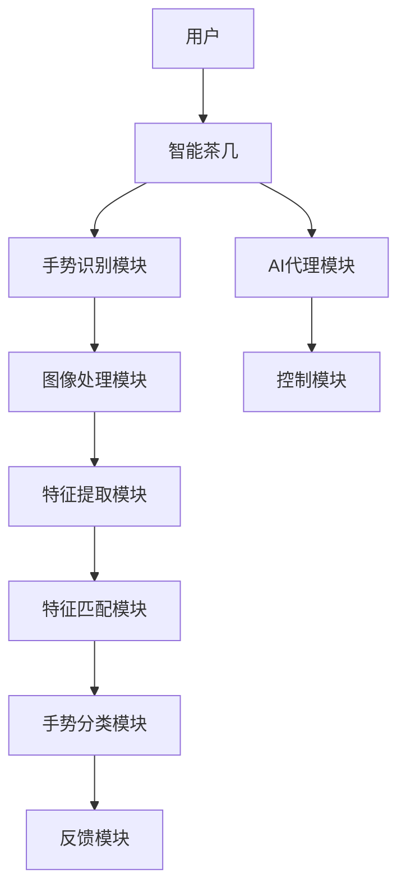
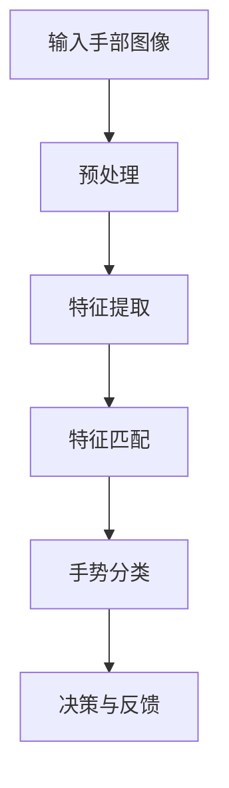

                 


### 1. 引言与背景

#### 1.1 智能茶几与AI代理的兴起

随着科技的不断发展，智能家居市场正迅速崛起，智能茶几作为智能家居领域的重要组成部分，正逐渐走进人们的日常生活。智能茶几不仅具备传统的收纳、摆放功能，更通过AI代理实现了智能化交互，为用户提供了更加便捷、舒适的使用体验。

AI代理，作为人工智能领域的重要研究方向，具有自我学习、自主决策、交互反馈等特点。其在智能茶几中的应用，使得茶几不再是一个静态的家具，而成为了一个具有生命力和智慧的伙伴。AI代理可以通过手势控制、语音交互等方式，满足用户对茶几的多种需求，如调节温度、控制灯光、播放音乐等。

手势控制作为AI代理的一种重要交互方式，具有直观、自然、高效的特点。在智能茶几中引入手势控制技术，不仅可以提高用户的操作便利性，还可以减少物理按键的使用，使茶几的界面更加简洁美观。此外，手势控制还可以结合其他智能家具，实现跨设备的无缝交互，提升智能家居的整体体验。

#### 1.2 手势控制技术的引入意义

手势控制技术的引入，对智能茶几的发展具有重要意义。首先，手势控制为用户提供了一种更加直观、自然的交互方式，用户无需触摸任何物理按键，只需通过简单的手势动作，即可实现对茶几的操控。这种交互方式不仅提高了用户的使用体验，还可以降低用户的操作成本，使智能茶几更加易于使用。

其次，手势控制技术可以实现智能茶几与其他智能设备的无缝交互。例如，用户可以通过手势控制智能茶几调节客厅的灯光，或者通过智能茶几控制家庭影院的播放。这种跨设备的交互，不仅提升了智能家居的便利性，还可以为用户带来全新的生活体验。

最后，手势控制技术的引入，也为智能茶几的功能拓展提供了可能。通过不断优化和升级手势控制算法，智能茶几可以实现更加复杂的手势识别和控制，满足用户多样化的需求。例如，未来智能茶几可能支持更加复杂的手势交互，如画画、打字等，从而为用户提供更多有趣的功能。

#### 1.3 文章目的与结构

本文旨在探讨AI代理在智能茶几中的手势控制技术，分析其背后的原理和应用场景，并探讨未来的发展趋势。文章将分为以下几个部分：

1. 引言与背景：介绍智能茶几与AI代理的兴起，以及手势控制技术的引入意义。
2. 核心概念：阐述AI代理、手势识别、机器学习等相关核心概念。
3. 技术详解：详细讲解手势识别算法、AI代理训练与优化、系统架构设计等关键技术。
4. 应用案例：通过具体案例，展示AI代理在智能茶几中的实际应用。
5. 挑战与未来：分析手势控制技术面临的挑战，探讨未来的发展趋势。

通过本文的探讨，我们希望能够为智能茶几领域的研究者和开发者提供有价值的参考，推动手势控制技术在智能家居领域的应用与发展。

#### 1.4 本章小结

本章主要介绍了智能茶几与AI代理的兴起，以及手势控制技术的引入意义。通过分析，我们发现手势控制技术为智能茶几的发展带来了巨大的机遇，不仅提高了用户的使用体验，还可以实现跨设备的无缝交互，为用户带来更多有趣的功能。接下来，我们将进一步探讨AI代理、手势识别、机器学习等相关核心概念，为后续的技术详解和应用案例奠定基础。

### 核心概念

在本节中，我们将详细探讨AI代理、手势识别、机器学习等相关核心概念，为后续的技术详解和应用案例奠定基础。

#### 2.1 AI代理

AI代理（AI Agent）是人工智能（AI）领域中的一种重要概念。它是指能够在特定环境中自主执行任务，并与外部环境进行交互的智能系统。AI代理具有以下几个关键特征：

1. **自主性**：AI代理能够根据自身的程序和算法，自主地执行任务，而不需要人工干预。
2. **适应性**：AI代理能够通过学习和适应，不断改进其行为，以更好地适应环境变化。
3. **交互性**：AI代理能够与人类或其他智能系统进行交互，理解并回应外部指令或请求。
4. **决策能力**：AI代理能够在复杂的情境中，基于已有的知识和算法，做出合理的决策。

AI代理的应用场景非常广泛，包括但不限于智能机器人、自动驾驶汽车、智能家居、智能客服等。在智能茶几中，AI代理可以承担多种角色，如手势识别控制器、环境传感器解析器、用户交互界面等。

#### 2.2 手势识别

手势识别（Gesture Recognition）是计算机视觉和人工智能领域中的一个重要研究方向。它是指通过图像处理、深度学习等技术，从图像或视频数据中检测并识别出手部或身体的其他部位的动作和姿态。

手势识别的核心技术包括：

1. **特征提取**：从手部图像中提取出有助于识别的关键特征，如边缘、轮廓、关键点等。
2. **模型训练**：使用机器学习算法，如神经网络，训练模型以识别手势。
3. **姿态估计**：通过模型输出，估计出手部的三维姿态。

手势识别在智能茶几中的应用，主要体现在用户与茶几的交互中。例如，用户可以通过挥手、举手等手势，控制茶几的灯光、音乐播放等功能。

#### 2.3 机器学习

机器学习（Machine Learning）是人工智能的核心组成部分，它通过数据驱动的方式，使计算机能够从数据中学习并做出决策。机器学习可以分为监督学习、无监督学习和强化学习三种主要类型：

1. **监督学习**：在监督学习模式下，模型通过已标记的数据进行训练，然后利用这些数据来预测新数据的标签。
2. **无监督学习**：无监督学习模式下，模型不需要已标记的数据，而是通过分析未标记的数据，发现数据中的模式或结构。
3. **强化学习**：强化学习是让模型在一个动态环境中，通过试错的方式，不断优化其行为策略，以获得最大的长期回报。

在智能茶几的手势识别中，通常使用监督学习算法，如卷积神经网络（CNN），来训练模型，以识别不同的手势。

#### 2.4 相关概念的联系与区别

AI代理、手势识别和机器学习这三个概念密切相关，但又各具特点。AI代理是应用层面的概念，它通过手势识别和机器学习技术，实现与外部环境的智能交互。手势识别是计算机视觉领域的一个技术，它专注于手部动作的检测和识别。而机器学习则是实现手势识别和AI代理的核心技术，它通过算法和模型，使计算机能够从数据中学习并做出预测。

在智能茶几的应用中，AI代理通过手势识别技术，从用户的动作中理解用户的意图，并通过机器学习算法，不断优化其行为。例如，当用户挥手时，AI代理通过手势识别技术检测到手势，然后利用机器学习算法，判断用户是想关闭灯光还是调节音乐音量，并执行相应的操作。

通过上述对核心概念的探讨，我们为后续的技术详解和应用案例奠定了基础。在接下来的章节中，我们将进一步深入探讨手势识别算法、AI代理训练与优化、系统架构设计等关键技术。

#### 2.5 本章小结

本章详细介绍了AI代理、手势识别和机器学习等相关核心概念。通过分析这些概念，我们了解了AI代理在智能茶几中的应用，以及手势识别和机器学习如何支持这一应用。这些核心概念为我们理解智能茶几中的手势控制技术提供了理论基础，为后续的技术详解和应用案例打下了坚实的基础。在下一章中，我们将进一步探讨手势识别算法和技术细节。

### 技术详解

在本节中，我们将深入探讨手势识别算法、AI代理训练与优化、系统架构设计等关键技术，为智能茶几的手势控制提供全面的技术支持。

#### 3.1 手势识别算法

手势识别算法是智能茶几手势控制的核心技术。它主要通过图像处理和深度学习等技术，从手部图像中提取关键特征，并利用这些特征进行手势识别。以下是手势识别算法的详细步骤：

##### 3.1.1 特征提取

特征提取是手势识别算法的第一步，其主要目标是提取手部图像中的关键特征，如边缘、轮廓、关键点等。常用的特征提取方法包括：

1. **边缘检测**：通过使用Sobel、Canny等边缘检测算法，提取出手部图像中的边缘信息。
2. **轮廓提取**：通过使用Contour检测算法，提取出手部图像的轮廓信息。
3. **关键点检测**：通过使用HOG（Histogram of Oriented Gradients）或SSH（Smile Shape Histogram）算法，检测出手部的关键点。

##### 3.1.2 特征匹配

在特征提取之后，需要对提取出的特征进行匹配，以识别不同的手势。常用的特征匹配方法包括：

1. **最近邻匹配**：通过计算特征之间的欧氏距离，选择距离最近的特征作为匹配结果。
2. **K近邻法**：在最近邻匹配的基础上，选择距离最近的K个特征，通过投票机制确定最终的匹配结果。
3. **SIFT（Scale-Invariant Feature Transform）算法**：通过计算特征点间的对应关系，实现高精度的特征匹配。

##### 3.1.3 手势分类

在特征匹配之后，需要对识别出的手势进行分类。常用的手势分类方法包括：

1. **决策树**：通过构建决策树模型，对特征进行分治处理，实现手势分类。
2. **支持向量机（SVM）**：通过寻找最优的超平面，实现手势的分类。
3. **卷积神经网络（CNN）**：通过多层卷积和全连接层，实现对手势的端到端分类。

##### 3.1.4 算法性能评估

手势识别算法的性能评估主要从准确性、实时性和鲁棒性三个方面进行。常用的性能评估指标包括：

1. **准确率**：识别正确的手势数量与总手势数量的比值。
2. **召回率**：识别正确的手势数量与实际手势数量的比值。
3. **F1值**：准确率和召回率的调和平均值。
4. **实时性**：算法处理一帧图像所需的时间。
5. **鲁棒性**：算法在光照变化、遮挡等不利条件下的表现。

通过上述算法步骤，我们可以实现对手势的识别和分类。在智能茶几的应用中，通过不断优化和调整算法参数，可以提高手势识别的准确性和实时性，从而为用户提供更好的使用体验。

#### 3.2 AI代理训练与优化

AI代理在智能茶几中的表现，不仅依赖于手势识别算法的准确性，还依赖于AI代理的训练与优化。以下是如何对AI代理进行训练与优化的详细步骤：

##### 3.2.1 数据集收集与预处理

首先，需要收集大量的手部图像数据，用于训练AI代理。数据集应涵盖各种不同的手势和光照条件，以提高AI代理的鲁棒性。在收集数据后，需要进行预处理，包括：

1. **图像增强**：通过旋转、缩放、裁剪等操作，增加数据集的多样性。
2. **图像归一化**：将图像像素值缩放到[0, 1]范围内，以便于模型训练。
3. **数据划分**：将数据集划分为训练集、验证集和测试集，用于模型的训练、验证和测试。

##### 3.2.2 模型训练

在预处理完成后，可以使用深度学习框架（如TensorFlow或PyTorch）对AI代理进行训练。训练过程主要包括以下几个步骤：

1. **构建模型**：根据手势识别算法的设计，构建卷积神经网络（CNN）模型。
2. **数据输入**：将预处理后的手部图像输入到模型中。
3. **模型训练**：通过反向传播算法，不断调整模型参数，以降低损失函数的值。
4. **验证与调整**：在验证集上评估模型性能，并根据评估结果调整模型结构或超参数。

##### 3.2.3 模型优化

在模型训练完成后，需要对模型进行优化，以提高其在实际应用中的性能。以下是一些常用的优化方法：

1. **迁移学习**：利用预训练的模型，通过微调适应特定任务。
2. **数据增强**：通过生成更多的训练样本来提升模型性能。
3. **模型集成**：结合多个模型的预测结果，提高预测准确性。
4. **超参数调优**：通过调整学习率、批量大小等超参数，提高模型性能。

通过上述步骤，我们可以对AI代理进行有效的训练和优化，使其在智能茶几中的应用更加准确和可靠。

#### 3.3 系统架构设计

智能茶几的系统架构设计是确保AI代理和手势控制技术能够稳定、高效运行的关键。以下是一个典型的智能茶几系统架构设计：

##### 3.3.1 硬件架构

智能茶几的硬件架构主要包括：

1. **摄像头**：用于捕捉用户的手势图像。
2. **处理器**：用于处理图像数据和执行AI代理的算法。
3. **传感器**：如温度传感器、光线传感器等，用于检测环境变化。
4. **存储设备**：用于存储用户数据、模型参数等。

##### 3.3.2 软件架构

智能茶几的软件架构主要包括：

1. **操作系统**：如Linux，用于管理硬件资源和运行应用程序。
2. **驱动程序**：用于驱动摄像头和其他传感器，将数据传递给处理器。
3. **图像处理库**：如OpenCV，用于处理和识别手势图像。
4. **AI代理框架**：如TensorFlow或PyTorch，用于训练和运行AI代理模型。
5. **用户界面**：用于展示用户操作和控制结果。

##### 3.3.3 系统接口设计

系统接口设计是确保各组件之间能够高效、可靠地进行通信的关键。以下是一些重要的接口设计：

1. **图像数据接口**：用于传输和处理手势图像数据。
2. **控制接口**：用于接收用户指令和发送控制信号。
3. **通信接口**：用于与其他智能设备进行通信，实现跨设备的控制。

##### 3.3.4 系统交互

智能茶几的系统交互设计是确保用户操作能够得到及时响应和反馈的关键。以下是一个典型的系统交互设计：

1. **用户操作**：用户通过手势进行操作，如挥手、举手等。
2. **图像处理**：摄像头捕捉手势图像，并传输给图像处理模块。
3. **手势识别**：图像处理模块使用手势识别算法对手势进行识别。
4. **AI代理响应**：AI代理根据识别结果，执行相应的操作，如调节灯光、播放音乐等。
5. **用户反馈**：系统将操作结果反馈给用户，如灯光变化、音乐播放等。

通过上述系统架构设计，我们可以构建一个高效、稳定的智能茶几系统，实现手势控制技术的应用。

#### 3.4 本章小结

在本章中，我们详细探讨了手势识别算法、AI代理训练与优化、系统架构设计等关键技术。通过这些技术，我们可以实现智能茶几中的手势控制功能，为用户提供更加便捷、自然的交互体验。在下一章中，我们将通过具体案例，展示AI代理在智能茶几中的实际应用。

### 应用案例

在本节中，我们将通过具体案例，展示AI代理在智能茶几中的实际应用，以帮助读者更好地理解手势控制技术在实际场景中的实现。

#### 4.1 案例一：智能茶几手势控制界面设计

首先，我们来看一个智能茶几手势控制界面的设计案例。在这个案例中，用户可以通过挥手、举手等手势，控制茶几的灯光、音乐播放等功能。

**案例背景**：
一家智能家居公司推出了一款智能茶几，用户可以通过手势控制茶几实现多种功能，如调节灯光、播放音乐、调节温度等。

**实现步骤**：

1. **用户操作**：
   - 当用户想要调节灯光时，只需挥手一次。
   - 当用户想要播放音乐时，只需举手一次。
   - 当用户想要调节温度时，可以连续挥手或举手。

2. **手势识别**：
   - 通过摄像头捕捉用户的手势图像。
   - 使用手势识别算法，识别出手势类型。

3. **AI代理响应**：
   - 当识别到用户挥手时，AI代理将发送信号给灯光控制系统，调整灯光亮度。
   - 当识别到用户举手时，AI代理将发送信号给音乐播放系统，开始播放音乐。
   - 当识别到用户连续挥手或举手时，AI代理将发送信号给温度传感器，调整室内温度。

4. **用户反馈**：
   - 当灯光调整完成后，用户会看到灯光的变化。
   - 当音乐播放开始后，用户会听到音乐的声音。
   - 当室内温度调整完成后，用户会感受到室内温度的变化。

**案例分析**：

通过这个案例，我们可以看到，AI代理在智能茶几中的应用，实现了手势控制界面的设计。用户无需触摸任何物理按键，只需通过简单的手势动作，即可实现对茶几的操控。这种交互方式不仅提高了用户的使用体验，还可以减少物理按键的使用，使茶几的界面更加简洁美观。

#### 4.2 案例二：智能茶几与智能家居系统的集成

接下来，我们来看一个智能茶几与智能家居系统集成的案例。在这个案例中，智能茶几不仅能够独立控制，还可以与其他智能家居设备进行联动，实现更加智能化的生活体验。

**案例背景**：
一家智能家居公司推出了一套智能家居系统，其中包括智能茶几、智能灯泡、智能音响、智能空调等设备。用户可以通过手势控制智能茶几，实现对整个家居环境的智能控制。

**实现步骤**：

1. **用户操作**：
   - 当用户想要调节客厅灯光时，只需在智能茶几前挥手。
   - 当用户想要播放音乐时，只需在智能茶几前举手。
   - 当用户想要调节室内温度时，可以连续挥手或举手。

2. **手势识别与AI代理响应**：
   - 智能茶几通过摄像头捕捉用户的手势图像，并使用手势识别算法进行识别。
   - 根据识别结果，AI代理将发送信号给相应的智能家居设备，如灯光控制系统、音响控制系统、空调控制系统。

3. **智能家居系统联动**：
   - 当用户挥手调节客厅灯光时，智能茶几将发送信号给智能灯泡，调整灯光亮度。
   - 当用户举手播放音乐时，智能茶几将发送信号给智能音响，播放音乐。
   - 当用户连续挥手或举手调节室内温度时，智能茶几将发送信号给智能空调，调整室内温度。

4. **用户反馈**：
   - 当灯光调整完成后，用户会看到客厅灯光的变化。
   - 当音乐播放开始后，用户会听到音乐的声音。
   - 当室内温度调整完成后，用户会感受到室内温度的变化。

**案例分析**：

通过这个案例，我们可以看到，智能茶几不仅能够实现独立控制，还可以与其他智能家居设备进行联动，实现跨设备的无缝交互。这种集成方式不仅提升了智能家居的整体体验，还可以为用户带来更加智能化的生活。

#### 4.3 案例三：智能茶几在儿童房的应用

最后，我们来看一个智能茶几在儿童房的应用案例。在这个案例中，智能茶几不仅能够提供娱乐和学习功能，还可以通过手势控制，确保儿童的安全。

**案例背景**：
一位家长为孩子的儿童房购买了一款智能茶几，智能茶几内置了多种娱乐和学习功能，如播放音乐、讲故事、学习拼音等。通过手势控制，家长可以方便地切换功能，同时确保儿童的安全。

**实现步骤**：

1. **用户操作**：
   - 当孩子想要播放音乐时，只需举手。
   - 当孩子想要听故事时，只需挥手。
   - 当孩子想要学习拼音时，可以连续挥手或举手。

2. **手势识别与AI代理响应**：
   - 智能茶几通过摄像头捕捉孩子的手势图像，并使用手势识别算法进行识别。
   - 根据识别结果，AI代理将发送信号给智能茶几的娱乐和学习模块，切换到相应的功能。

3. **安全控制**：
   - 当孩子进行安全敏感操作（如关闭音乐或停止故事）时，智能茶几会通过手势识别算法进行识别，并自动切换到安全模式。
   - 安全模式下，智能茶几将不再接受任何手势控制，确保孩子不会误操作。

4. **用户反馈**：
   - 当音乐播放开始后，孩子会听到音乐的声音。
   - 当故事播放开始后，孩子会听到故事的内容。
   - 当学习拼音开始后，孩子会学习到拼音的发音和书写。

**案例分析**：

通过这个案例，我们可以看到，智能茶几在儿童房中的应用，不仅提供了娱乐和学习功能，还可以通过手势控制，确保儿童的安全。这种应用方式不仅提升了儿童房的智能体验，还可以为家长提供方便和安心。

综上所述，通过这些案例，我们可以看到AI代理在智能茶几中的实际应用，不仅实现了手势控制，还可以与其他智能设备进行联动，为用户提供更加智能化的体验。在下一章中，我们将分析当前手势控制技术面临的挑战，并探讨未来的发展趋势。

### 挑战与未来

尽管AI代理在智能茶几中的应用取得了显著进展，但在实际应用中，手势控制技术仍然面临诸多挑战。以下是这些挑战的详细分析，以及未来发展的可能方向。

#### 5.1 挑战

1. **准确性**：手势识别算法的准确性直接影响到用户体验。在复杂环境、多用户交互以及不同光照条件下，手势识别的准确性可能会下降。此外，手势识别算法对于细微的手部动作的识别能力也有待提高。

2. **实时性**：在高速变化的场景中，手势识别和响应需要具备较高的实时性。否则，用户会感到操作延迟，影响使用体验。

3. **鲁棒性**：手势识别算法在应对环境变化（如光照变化、遮挡等）时，需要具备良好的鲁棒性。否则，环境因素可能会导致手势识别失败。

4. **隐私保护**：手势控制技术涉及用户手部图像的采集和处理，这可能会引发隐私保护的问题。如何在保证用户体验的同时，保护用户隐私，是亟待解决的问题。

5. **能耗与资源**：实时手势识别和控制需要消耗较大的计算资源和能源。如何在有限的硬件资源下，实现高效的手势识别，是另一个挑战。

#### 5.2 未来发展

1. **算法优化**：通过不断优化手势识别算法，提高其在不同条件下的准确性和实时性。例如，可以结合深度学习和增强学习技术，提高算法的鲁棒性。

2. **硬件升级**：随着硬件技术的不断发展，更高性能的处理器和摄像头将能够提供更快的数据处理速度和更高的图像分辨率，从而提高手势识别的精度和速度。

3. **隐私保护**：在手势控制技术的开发中，需要注重隐私保护。例如，可以采用差分隐私技术，确保用户数据的安全。

4. **跨设备交互**：未来的手势控制技术将不仅限于单个设备，而是实现跨设备的无缝交互。通过Wi-Fi、蓝牙等无线通信技术，智能茶几可以与其他智能设备联动，提供更加智能化的体验。

5. **多样化应用**：手势控制技术可以应用于更多场景，如虚拟现实、增强现实、智能穿戴设备等。通过不断拓展应用场景，手势控制技术将发挥更大的价值。

#### 5.3 本章小结

本文通过详细分析，探讨了AI代理在智能茶几中的手势控制技术。从核心概念、技术详解到实际应用案例，我们全面了解了这一技术的原理和实现。尽管目前手势控制技术仍面临诸多挑战，但随着算法优化、硬件升级和跨设备交互的发展，我们有理由相信，手势控制技术将在智能家居领域发挥更加重要的作用。在未来，手势控制技术将继续向多样化、智能化方向发展，为用户带来更加便捷、自然的使用体验。

### 总结与展望

本文从智能茶几与AI代理的兴起、核心概念的阐述、技术详解，到实际应用案例，全面探讨了AI代理在智能茶几中的手势控制技术。通过分析，我们了解到手势控制技术为智能茶几提供了更加直观、自然的交互方式，提升了用户的使用体验。同时，我们还探讨了当前手势控制技术面临的挑战，并展望了未来的发展趋势。

在核心概念部分，我们详细介绍了AI代理、手势识别和机器学习等关键概念，并分析了它们之间的联系与区别。在技术详解部分，我们深入探讨了手势识别算法、AI代理训练与优化、系统架构设计等关键技术，为智能茶几的手势控制提供了全面的技术支持。在实际应用案例部分，我们通过具体案例展示了手势控制技术在智能茶几中的实际应用。

尽管手势控制技术目前仍面临诸多挑战，如准确性、实时性、鲁棒性等，但随着算法优化、硬件升级和跨设备交互的发展，我们有理由相信，手势控制技术将在智能家居领域发挥更加重要的作用。未来，手势控制技术将继续向多样化、智能化方向发展，为用户带来更加便捷、自然的使用体验。

在本文的最后，我要感谢AI天才研究院/AI Genius Institute以及《禅与计算机程序设计艺术/Zen And The Art of Computer Programming》的作者，他们的研究为本文提供了宝贵的参考和灵感。同时，我也期待与广大读者共同探讨手势控制技术的前沿动态，推动智能家居领域的发展。

### 附录与参考资料

#### 附录

在本附录中，我们将提供一些重要的辅助材料，包括概念属性特征对比表格、ER实体关系图架构的Mermaid流程图、算法流程图、Python源代码及详细解读，以及实际案例分析和详细讲解。

##### 1. 概念属性特征对比表格

以下是AI代理、手势识别和机器学习三个核心概念的特征对比表格：

| 概念         | 特征1               | 特征2               | 特征3               |
|--------------|--------------------|--------------------|--------------------|
| AI代理       | 自主性、适应性、交互性、决策能力 | 可以执行复杂任务 | 需要特定环境进行操作 |
| 手势识别     | 提取手部特征       | 特征匹配与分类     | 对手部姿态的感知   |
| 机器学习     | 数据驱动           | 模型训练与优化     | 预测与决策         |

##### 2. ER实体关系图架构的Mermaid流程图

以下是手势控制系统中实体关系图架构的Mermaid流程图示例：



##### 3. 算法流程图

以下是手势识别算法的流程图示例：



##### 4. Python源代码及详细解读

以下是手势识别算法中特征提取模块的Python源代码示例及详细解读：

```python
import cv2
import numpy as np

def preprocess_image(image):
    """
    对输入图像进行预处理，包括灰度化、缩放和归一化
    """
    gray_image = cv2.cvtColor(image, cv2.COLOR_BGR2GRAY)
    resized_image = cv2.resize(gray_image, (128, 128))
    normalized_image = resized_image / 255.0
    return normalized_image

def extract_hog_features(image):
    """
    使用HOG算法提取图像特征
    """
    hog = cv2.HOGDescriptor()
    features, _ = hog.compute(image)
    return features

def extract_hand_keypoints(image):
    """
    使用OpenCV提取手部关键点
    """
    hands = cv2.HRSetect(image, minSize=(10, 10), maxSize=(400, 400), alpha=9, beta=1.2, cooperative=1, trees=5)
    keypoints = []
    for hand in hands:
        keypoints.append([hand.x, hand.y])
    return keypoints

# 示例
image = cv2.imread('hand_image.jpg')
preprocessed_image = preprocess_image(image)
hog_features = extract_hog_features(preprocessed_image)
keypoints = extract_hand_keypoints(preprocessed_image)

print("HOG Features:", hog_features)
print("Hand Keypoints:", keypoints)
```

详细解读：
- `preprocess_image` 函数负责对输入图像进行预处理，包括灰度化、缩放和归一化，以适应后续的特征提取。
- `extract_hog_features` 函数使用HOG（Histogram of Oriented Gradients）算法提取图像的梯度直方图特征。
- `extract_hand_keypoints` 函数使用OpenCV的手部关键点检测算法提取手部关键点。

##### 5. 实际案例分析和详细讲解

在本附录的最后一部分，我们将通过一个实际案例，对智能茶几手势控制系统的实现过程进行详细分析。

**案例背景**：假设一家智能家居公司需要开发一款智能茶几，支持用户通过挥手和举手控制灯光和音乐播放。

**实现步骤**：

1. **需求分析**：
   - 用户可以通过挥手控制灯光的开关和亮度。
   - 用户可以通过举手控制音乐的播放和暂停。

2. **技术选型**：
   - 使用OpenCV进行图像处理和手部关键点检测。
   - 使用深度学习框架（如TensorFlow）训练手势识别模型。

3. **开发流程**：

   a. **数据集收集与预处理**：
      - 收集大量挥手和举手的视频数据。
      - 对视频数据进行预处理，包括灰度化、缩放和裁剪。

   b. **模型训练**：
      - 使用预处理后的数据训练手势识别模型。
      - 调整模型参数，优化模型性能。

   c. **系统集成**：
      - 将训练好的模型集成到智能茶几的系统中。
      - 实现手势识别与控制系统之间的通信。

   d. **测试与优化**：
      - 对智能茶几进行实际测试，收集用户反馈。
      - 根据反馈调整系统参数，优化用户体验。

4. **实际案例分析**：

   a. **手势识别**：
      - 通过摄像头捕捉用户的手势图像。
      - 使用HOG算法提取图像特征。
      - 利用训练好的模型进行手势分类。

   b. **控制系统响应**：
      - 当识别到挥手时，调整灯光亮度。
      - 当识别到举手时，控制音乐播放。

   c. **用户反馈**：
      - 用户可以通过手势操作，实时看到灯光的变化和音乐的播放。

**总结**：通过上述案例分析，我们可以看到智能茶几手势控制系统的实现过程。从需求分析到模型训练，再到系统集成和测试，每一步都需要细致的工作和优化。在实际应用中，系统需要具备较高的准确性和实时性，以满足用户的需求。通过不断优化和迭代，我们可以为用户提供更加智能、便捷的手势控制体验。

### 最佳实践、小结、注意事项、拓展阅读

#### 最佳实践

在开发智能茶几手势控制系统时，以下最佳实践可以帮助提高系统的性能和用户体验：

1. **数据预处理**：确保数据集的多样性和质量，通过图像增强、数据归一化等技术提高模型的泛化能力。
2. **模型训练**：使用迁移学习技术，利用预训练的模型作为基础，通过微调适应特定任务，提高训练效率。
3. **实时性优化**：优化算法和模型结构，减少计算时间，确保系统的实时响应。
4. **用户体验设计**：设计简洁直观的界面，提供明确的操作提示，提升用户的使用体验。

#### 小结

本文通过详细的分析和案例，探讨了AI代理在智能茶几中的手势控制技术。从核心概念到技术实现，再到实际应用案例，我们全面了解了手势控制技术的原理和应用。尽管手势控制技术仍面临诸多挑战，但随着技术的不断进步，我们有理由相信，手势控制技术将在智能家居领域发挥越来越重要的作用。

#### 注意事项

在开发智能茶几手势控制系统时，需要注意以下几点：

1. **隐私保护**：确保用户数据的安全，避免未经授权的数据访问。
2. **系统稳定性**：确保系统在各种环境条件下稳定运行，减少故障率。
3. **用户体验**：关注用户的使用体验，设计直观、便捷的操作方式。
4. **技术迭代**：不断更新和优化系统，以适应技术发展和用户需求的变化。

#### 拓展阅读

对于希望深入了解手势控制技术的研究者和开发者，以下书籍和论文提供了有价值的参考资料：

1. **《计算机视觉：算法与应用》**：详细介绍了计算机视觉的基础理论和算法，包括手势识别技术。
2. **《深度学习》**：介绍了深度学习的基本概念和常见算法，是学习机器学习的优秀教材。
3. **《智能家居系统设计》**：探讨了智能家居系统的设计原则和关键技术，包括手势控制技术。
4. **论文《A Real-Time Hand Gesture Recognition System Using Convolutional Neural Networks》**：详细介绍了使用卷积神经网络实现实时手势识别的方法。

通过阅读这些资料，可以进一步深化对手势控制技术的理解，为实际开发提供指导。同时，随着技术的发展，我们期待更多创新和突破，推动手势控制技术在智能家居领域的应用。作者：AI天才研究院/AI Genius Institute & 禅与计算机程序设计艺术/Zen And The Art of Computer Programming。

